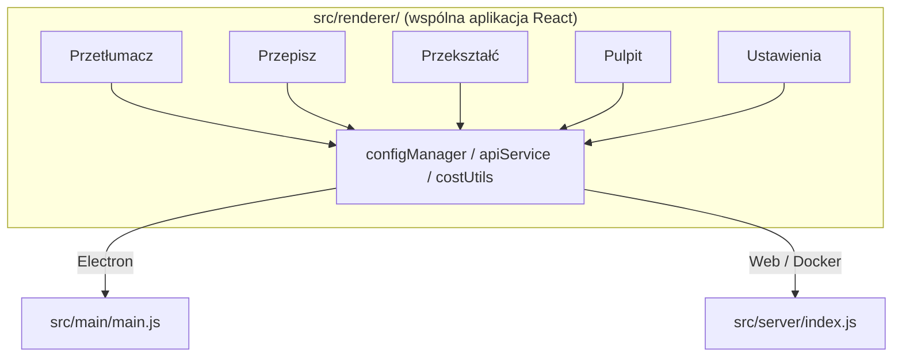

<p align="center">
  
</p>

<h1 align="center">Transrewrt</h1>

<p align="center">
  <a href="https://github.com/wsj-br/transrewrt/releases"></a>
  <a href="LICENSE"></a>
  
  
  
</p>

Narzędzie do tekstu z AI: tłumaczenie między językami, przepisywanie w różnych stylach i transformacja za pomocą własnych promptów - wszystko przez [OpenRouter](https://openrouter.ai). Działa jako aplikacja desktopowa (Electron) lub samodzielnie hostowana aplikacja webowa (Docker).

- **Tłumacz** - między kilkudziesięcioma językami, z automatycznym wykrywaniem źródła
- **Przepisz** - popraw błędy gramatyczne, popraw klarowność, formalnie/nieformalnie, skróć, rozwiń, technicznie
- **Transformuj** - własne prompty AI; twórz i zarządzaj promptami, opcjonalny język docelowy dla każdego promptu
- **Modele & koszty** - wybierz dowolny model OpenRouter; panel kosztów z logiem SQLite, podsumowania według modelu/operacji/dnia
- **Interfejs** - i18n (pt-BR, de, fr, es, RTL), motywy, czcionki, skróty klawiaturowe; bezpieczny tryb webowy (klucz API tylko na serwerze)
- **Desktop** - aplikacja Electron dla Windows i Linux
- **Samodzielny hosting** - obraz Docker dla amd64 & arm64 (gotowy dla Raspberry Pi)

Po instalacji zapoznaj się z **[Przewodnikiem Użytkownika](../USER-GUIDE.md)** dla pełnego opisania wszystkich funkcji.

<small>**Przeczytaj w innych językach:** [English (UK)](../README.md) · [Português (BR)](README.pt-BR.md) · [العربية](README.ar.md) · [বাংলা](README.bn.md) · [Català](README.ca.md) · [简体中文](README.zh-CN.md) · [繁體中文](README.zh-TW.md) · [Hrvatski](README.hr.md) · [Čeština](README.cs.md) · [Nederlands](README.nl.md) · [English (US)](README.en-US.md) · [Filipino](README.tl.md) · [Français](README.fr.md) · [Deutsch](README.de.md) · [Ελληνικά](README.el.md) · [हिन्दी](README.hi.md) · [Magyar](README.hu.md) · [Italiano](README.it.md) · [日本語](README.ja.md) · [Basa Jawa](README.jv.md) · [한국어](README.ko.md) · [Bahasa Melayu](README.ms.md) · [فارسی](README.fa.md) · [Polski](README.pl.md) · [Português (PT)](README.pt.md) · [ਪੰਜਾਬੀ](README.pa.md) · [Română](README.ro.md) · [Русский](README.ru.md) · [Slovenčina](README.sk.md) · [Español](README.es.md) · [Kiswahili](README.sw.md) · [Svenska](README.sv.md) · [తెలుగు](README.te.md) · [ภาษาไทย](README.th.md) · [Türkçe](README.tr.md) · [Українська](README.uk.md) · [Tiếng Việt](README.vi.md)</small>

<a id="screenshots"></a>
## Zrzuty ekranu

**Selektor języka**


**Tłumacz**


**Transformuj - edytor promptów**


**Pulpit nawigacyjny**


**Ustawienia - wybór modelu**


<br /><br />

<a id="table-of-contents"></a>
## Spis treści

<!-- START doctoc generated TOC please keep comment here to allow auto update -->
<!-- DON'T EDIT THIS SECTION, INSTEAD RE-RUN doctoc TO UPDATE -->

- [Szybki start](#quick-start)
- [Instalacja](#installation)
  - [Windows (Electron)](#windows-electron)
  - [Linux (Electron)](#linux-electron)
  - [Docker](#docker)
- [Uzyskanie klucza API OpenRouter](#getting-an-openrouter-api-key)
- [Konfiguracja i środowisko](#configuration-and-environment)
- [Rozwój i architektura](#development-and-architecture)
- [Wydania i tagi](#releases-and-tags)
- [Współtworzenie](#contributing)
- [Oświadczenie](#disclaimer)
- [Licencja](#license)

<!-- END doctoc generated TOC please keep comment here to allow auto update -->

<br /><br />

<a id="quick-start"></a>

## Szybki start

**Docker (zalecane do samodzielnego hostowania)**

```bash
docker pull ghcr.io/wsj-br/transrewrt:latest

API_KEY=sk-or-your-key docker run -d \
  -p 5000:5000 \
  -v transrewrt-data:/app/data \
  -e API_KEY \
  --name transrewrt-web \
  ghcr.io/wsj-br/transrewrt:latest
```

Zastąp `sk-or-your-key` swoim [kluczem API OpenRouter](https://openrouter.ai/keys). Otwórz [http://localhost:5000](http://localhost:5000) i zmień domyślne hasło administratora przed udostępnieniem usługi.

<br />

> ℹ️ **UWAGA**<br/>
> W Dockerze klucz API OpenRouter jest ustawiany wyłącznie przez zmienną środowiskową `API_KEY` (nie w interfejsie webowym). Na komputerze (Electron) wklejasz go w **Ustawienia → API**.

<br />

**Windows**

Pobierz najnowszy `Transrewrt Setup x.y.z.exe` z [Releases](https://github.com/wsj-br/transrewrt/releases), uruchom instalator, a następnie uruchom z menu Start lub skrótu na pulpicie. Wprowadź swój klucz API OpenRouter w **Ustawienia → API**.

<br />

**Linux**

Pobierz `.AppImage` z [Releases](https://github.com/wsj-br/transrewrt/releases), a następnie:

```bash
chmod +x Transrewrt-x.y.z.AppImage && ./Transrewrt-x.y.z.AppImage
```

Wprowadź swój klucz API OpenRouter w **Ustawienia → API**. Na Debianie/Ubuntu może być konieczne wcześniejsze zainstalowanie dodatkowych zależności:

```bash
sudo apt install libgtk-3-0 libnotify-dev libnss3 libxss1 libasound2 libxtst6 xauth
```

Zobacz [Instalacja → Linux](#linux-electron) dla szczegółów.

<br />

> ℹ️ **UWAGA**<br/>
> macOS nie jest obecnie obsługiwany. Transrewrt jest dostępny dla Windows, Linux i Docker.

<br />

Gdy aplikacja jest uruchomiona, zobacz **[Przewodnik użytkownika](../USER-GUIDE.md)**, aby dowiedzieć się, jak tłumaczyć, przepisywać i transformować tekst, zarządzać promptami oraz konfigurować modele.

<br /><br />

<a id="installation"></a>
## Instalacja

<a id="windows-electron"></a>
### Windows (Electron)

- Pobierz najnowszy instalator z [Releases](https://github.com/wsj-br/transrewrt/releases).
- Uruchom `.exe` i postępuj zgodnie z instalatorem.
- Pierwsze uruchomienie: uruchom aplikację z menu Start lub skrótu na pulpicie. Konfiguracja jest przechowywana w `%APPDATA%\transrewrt\`.

<br />

<a id="linux-electron"></a>
### Linux (Electron)

- Pobierz `.AppImage` z [Releases](https://github.com/wsj-br/transrewrt/releases).
- Uruchom: `chmod +x Transrewrt-x.y.z.AppImage && ./Transrewrt-x.y.z.AppImage`
- Dodatkowe zależności (Debian/Ubuntu): `sudo apt install libgtk-3-0 libnotify-dev libnss3 libxss1 libasound2 libxtst6 xauth`
- Zobacz [dev/DEVELOPMENT.md](../dev/DEVELOPMENT.md) dla więcej informacji.

<br />

<a id="docker"></a>
### Docker

- Pobierz: `docker pull ghcr.io/wsj-br/transrewrt:latest`
- Klucz API OpenRouter **musi** być ustawiony przez zmienną środowiskową `API_KEY`. Przekaż go za pomocą `-e API_KEY` (lub przez `docker compose` / `.env`), aby klucz nie był widoczny na liście procesów.
- Klucza API nie można wprowadzić w interfejsie webowym.

Przykład - nazwany wolumin dla trwałości (klucz API przekazywany przez zmienne środowiskowe, a nie w linii poleceń):

```bash
API_KEY=sk-or-your-key docker run -d \
  -p 5000:5000 \
  -v transrewrt-data:/app/data \
  -e API_KEY \
  --name transrewrt-web \
  ghcr.io/wsj-br/transrewrt:latest
```

<br />

| Opcja   | Opis                                                                                                   |
| -------- | ----------------------------------------------------------------------------------------------------- |
| Port     | `5000` (mapuj za pomocą `-p 5000:5000`)                                                              |
| Wolumin | Zmontuj `/app/data` dla trwałości konfiguracji i bazy danych                                          |
| Zmienne środowiskowe | `PORT`, `CONFIG_PATH`, `API_KEY`, `API_URL`, `KEY_SEED` - zobacz [Konfiguracja](#configuration-and-environment) |

Aby zbudować i uruchomić ze źródeł: `docker compose up --build -d` lub `pnpm run docker:up` - zobacz [dev/DEVELOPMENT.md](../dev/DEVELOPMENT.md).

<br /><br />

<a id="getting-an-openrouter-api-key"></a>
## Uzyskanie klucza API OpenRouter

Transrewrt używa [OpenRouter](https://openrouter.ai) dla modeli AI. Potrzebujesz klucza API, aby tłumaczyć, przepisywać lub transformować tekst.

1. Zarejestruj się lub zaloguj na [openrouter.ai](https://openrouter.ai).
2. Otwórz stronę [Klucze](https://openrouter.ai/keys) i utwórz nowy klucz (nazwij go i opcjonalnie ustaw limit kredytowy). Możesz używać darmowych modeli bez dodawania kredytu.
3. **Komputer (Electron):** wklej klucz w **Ustawienia → API**. **Docker:** ustaw zmienną środowiskową `API_KEY` (zobacz [Szybki start](#quick-start)).

W przypadku limitów, BYOK i więcej informacji, zobacz [Uwierzytelnianie OpenRouter](https://openrouter.ai/docs/api/reference/authentication).

<br /><br />

<a id="configuration-and-environment"></a>

## Konfiguracja i środowisko

### Lokalizacje pliku konfiguracyjnego

| Wdrożenie          | Lokalizacja konfiguracji                      |
| ------------------ | --------------------------------------------- |
| Electron (Windows) | `%APPDATA%\transrewrt\`                       |
| Electron (Linux)   | `~/.config/transrewrt/`                       |
| Web / Docker       | `/app/data/config.json` (użyj woluminu)      |

<br />

### Zmienne środowiskowe** (tylko web/Docker; Electron używa lokalnego pliku konfiguracyjnego)

| Zmienna      | Domyślnie                       | Opis                                                           |
| ------------ | ------------------------------- | ------------------------------------------------------------- |
| `PORT`       | `5000`                          | Port nasłuchujący serwera                                     |
| `CONFIG_PATH`| `/app/data/config.json`         | Ścieżka do pliku konfiguracyjnego                             |
| `API_KEY`    | *(puste)*                       | Klucz API OpenRouter (wymagany dla Dockera; ustaw przez env, nie UI) |
| `API_URL`    | `https://openrouter.ai/api/v1` | Podstawowy URL zewnętrznego API AI                            |
| `KEY_SEED`   | *(puste)*                       | Ziarno klucza proxy Transrewrt (nadpisuje konfig, jeśli ustawione) |

<br />

### Dane i trwałość:** W przypadku Dockera zamontuj wolumin w `/app/data`, aby `config.json` i baza danych SQLite przetrwały restart kontenera. Bez woluminu wszystkie dane zostaną utracone po zatrzymaniu kontenera.

<br />

### Autentykacja webowa:**

- Domyślny admin: `admin` / `transrewrt26`.
- Zarządzaj użytkownikami w **Ustawienia → Użytkownicy**.
- Zresetuj hasło: `docker exec <kontener> reset-web-password '<nazwa-użytkownika>' '<nowe-hasło>'`
  (ze źródła: `pnpm run reset-web-password -- <nazwa-użytkownika> <nowe-hasło>`)

<br />

> ⚠️ **OSTRZEŻENIE**<br/>
> Zmień domyślne hasło admina natychmiast na każdym hoście dostępnym z sieci.

<br />

### Proxy Transrewrt (opcjonalnie:** Możesz kierować ruch API przez zewnętrzne proxy wykorzystujące klucz walcujący w oparciu o czas. W **Ustawienia → API**, włącz **Użyj Proxy Transrewrt**, ustaw **Ziarno klucza** i ustaw **URL API** na podstawowy URL proxy. Szczegóły w [dev/SYSTEM-OVERVIEW.md](../dev/SYSTEM-OVERVIEW.md).

Podstawowe ustawienia (motyw, czcionka, modele, języki itp.) dostępne są w oknie Ustawień lub można je bezpośrednio edytować w JSON-ie konfiguracyjnym. Pełna lista i domyślne wartości udokumentowane są w [dev/DEVELOPMENT.md](../dev/DEVELOPMENT.md).

<br /><br />

<a id="development-and-architecture"></a>
## Rozwój i architektura

- **Rozwój:** Konfiguracja, budowanie, testowanie i wdrażanie (Electron, Web, Docker) - zobacz **[dev/DEVELOPMENT.md](../dev/DEVELOPMENT.md)**.
- **Architektura i przegląd systemu:** Struktura folderów, stos technologiczny, decyzje projektowe, proxy Transrewrt - zobacz **[dev/SYSTEM-OVERVIEW.md](../dev/SYSTEM-OVERVIEW.md)**.



<br /><br />

<a id="releases-and-tags"></a>
## Wydania i tagi

- **Tagi Git** `v`* (np. `v1.0.10`) uruchamiają [workflow wydania](.github/workflows/release.yml). **Wydania GitHub** zawierają instalator Windows (`.exe`) i Linux AppImage.
- **Obrazy Docker** publikowane są w `ghcr.io/wsj-br/transrewrt`. Tagi obrazów odpowiadają wersjom Git (np. `v1.0.10` → `ghcr.io/wsj-br/transrewrt:1.0.10`) oraz `latest`. Wieloarchitekturowe: `linux/amd64` i `linux/arm64` (np. Raspberry Pi).

<br /><br />

<a id="contributing"></a>
## Wkład

1. Sforkuj repozytorium.
2. Utwórz gałąź funkcjonalności: `git checkout -b feature/moja-funkcja`
3. Zatwierdź zmiany z jasnym komunikatem.
4. Wypchnij i otwórz Pull Request do `main`.

Postępuj zgodnie z istniejącym stylem kodu i przetestuj zmiany zarówno w trybie Electron, jak i web przed przesłaniem. Instrukcje budowania i testowania w [dev/DEVELOPMENT.md](../dev/DEVELOPMENT.md).

<br />

**Zgłaszanie problemów:** Otwórz issue na [GitHub](https://github.com/wsj-br/transrewrt/issues). Podaj platformę (Windows / Linux / Docker) i wersję aplikacji (pokazywaną w oknie O programie lub na stronie Wydań).

<br /><br />

<a id="disclaimer"></a>

## Oświadczenie

Nazwy produktów i ikony należą do ich odpowiednich właścicieli i są używane jedynie w celach identyfikacyjnych. To oprogramowanie nie jest powiązane ani popierane przez żadną z wymienionych marek.

<br /><br />

<a id="license"></a>
## Licencja

Copyright © 2026 Waldemar Scudeller Jr.

[Apache License 2.0](LICENSE)