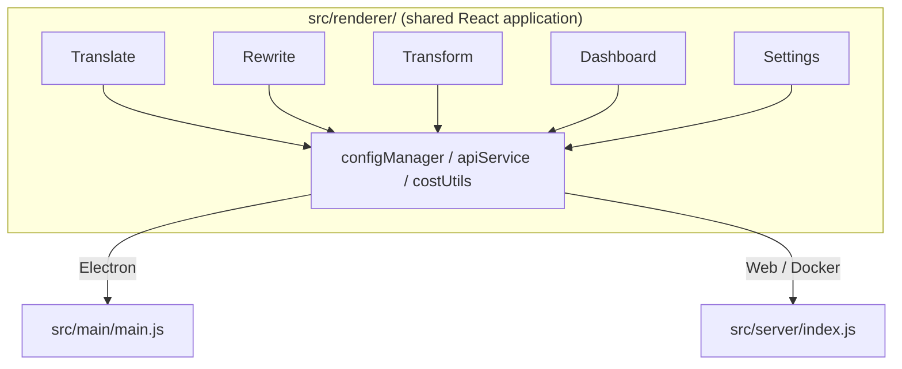

<p align="center">
  
</p>

<h1 align="center">Transrewrt</h1>

<p align="center">
  <a href="https://github.com/wsj-br/transrewrt/releases"></a>
  <a href="LICENSE"></a>
  
  
  
</p>

Ferramenta de texto com IA: traduzir entre idiomas, reescrever em diferentes estilos e transformar com prompts personalizados - tudo através do [OpenRouter](https://openrouter.ai). É executada como uma aplicação de desktop (Electron) ou uma aplicação web auto-hospedada (Docker).

- **Traduzir** - entre dezenas de idiomas, com detecção automática do idioma fonte
- **Reescrever** - corrigir gramática, melhorar clareza, formal/informal, encurtar, expandir, técnico
- **Transformar** - prompts de IA personalizados; criar e gerir prompts, idioma alvo opcional por prompt
- **Modelos e custo** - escolher qualquer modelo do OpenRouter; dashboard de custos com registo SQLite, resumos por modelo/operação/dia
- **Interface do Utilizador** - i18n (pt-BR, de, fr, es, RTL), temas, fontes, atalhos de teclado; modo web seguro (chave API apenas no servidor)
- **Ambiente de Trabalho** - aplicação Electron para Windows e Linux
- **Auto-hospedado** - imagem Docker para amd64 & arm64 (Raspberry Pi-pronto)

Após a instalação, consulte o **[Guia do Utilizador](../USER-GUIDE.md)** para um tutorial completo de todas as funcionalidades.

<small>**Ler noutros idiomas:** [Inglês (UK)](../README.md) · [Português (BR)](README.pt-BR.md) · [Árabe](README.ar.md) · [Bengali](README.bn.md) · [Catalão](README.ca.md) · [Chinês Simplificado](README.zh-CN.md) · [Chinês Tradicional](README.zh-TW.md) · [Croata](README.hr.md) · [Tcheco](README.cs.md) · [Neerlandês](README.nl.md) · [Inglês (EUA)](README.en-US.md) · [Filipino](README.tl.md) · [Francês](README.fr.md) · [Alemão](README.de.md) · [Grego](README.el.md) · [Hindi](README.hi.md) · [Húngaro](README.hu.md) · [Italiano](README.it.md) · [Japonês](README.ja.md) · [Javanês](README.jv.md) · [Coreano](README.ko.md) · [Malaio](README.ms.md) · [Persa](README.fa.md) · [Polonês](README.pl.md) · [Português (PT)](README.pt.md) · [Punjabi](README.pa.md) · [Romeno](README.ro.md) · [Russo](README.ru.md) · [Eslovaco](README.sk.md) · [Espanhol](README.es.md) · [Suaíli](README.sw.md) · [Sueco](README.sv.md) · [Telugu](README.te.md) · [Tailandês](README.th.md) · [Turco](README.tr.md) · [Ucraniano](README.uk.md) · [Vietnamita](README.vi.md)</small>

<a id="screenshots"></a>
## Capturas de Ecrã

**Seletor de idioma**


**Traduzir**


**Transformar - editor de prompts**


**Dashboard de custos**


**Definições - seleção de modelos**


<br /><br />

<a id="table-of-contents"></a>
## Índice

<!-- START doctoc generated TOC please keep comment here to allow auto update -->
<!-- DON'T EDIT THIS SECTION, INSTEAD RE-RUN doctoc TO UPDATE -->

- [Início Rápido](#quick-start)
- [Instalação](#installation)
  - [Windows (Electron)](#windows-electron)
  - [Linux (Electron)](#linux-electron)
  - [Docker](#docker)
- [Obter uma chave API do OpenRouter](#getting-an-openrouter-api-key)
- [Configuração e ambiente](#configuration-and-environment)
- [Desenvolvimento e arquitetura](#development-and-architecture)
- [Lançamentos e etiquetas](#releases-and-tags)
- [Contribuir](#contributing)
- [Aviso Legal](#disclaimer)
- [Licença](#license)

<!-- END doctoc generated TOC please keep comment here to allow auto update -->

<br /><br />

<a id="quick-start"></a>

## Início rápido

**Docker (recomendado para auto-hospedagem)**

```bash
docker pull ghcr.io/wsj-br/transrewrt:latest

API_KEY=sk-or-your-key docker run -d \
  -p 5000:5000 \
  -v transrewrt-data:/app/data \
  -e API_KEY \
  --name transrewrt-web \
  ghcr.io/wsj-br/transrewrt:latest
```

Substitua `sk-or-your-key` pela sua [chave de API do OpenRouter](https://openrouter.ai/keys). Abra [http://localhost:5000](http://localhost:5000) e altere a senha de administrador padrão antes de expor o serviço.

<br />

> ℹ️ **NOTA**<br/>
> No Docker a chave de API do OpenRouter é definida apenas através da variável de ambiente `API_KEY` (não na interface web). No desktop (Electron) você a cola em **Configurações → API**.

<br />

**Windows**

Baixe o `Transrewrt Setup x.y.z.exe` mais recente de [Releases](https://github.com/wsj-br/transrewrt/releases), execute o instalador e, em seguida, inicie pelo menu Iniciar ou atalho na área de trabalho. Insira sua chave de API do OpenRouter em **Configurações → API**.

<br />

**Linux**

Baixe o `.AppImage` de [Releases](https://github.com/wsj-br/transrewrt/releases) e, em seguida:

```bash
chmod +x Transrewrt-x.y.z.AppImage && ./Transrewrt-x.y.z.AppImage
```

Insira sua chave de API do OpenRouter em **Configurações → API**. No Debian/Ubuntu pode ser necessário instalar dependências extras primeiro:

```bash
sudo apt install libgtk-3-0 libnotify-dev libnss3 libxss1 libasound2 libxtst6 xauth
```

Veja [Instalação → Linux](#linux-electron) para mais detalhes.

<br />

> ℹ️ **NOTA**<br/>
> O macOS não é atualmente suportado. O Transrewrt está disponível para Windows, Linux e Docker.

<br />

Uma vez que o aplicativo esteja em execução, consulte o **[Guia do Usuário](../USER-GUIDE.md)** para aprender a traduzir, reescrever e transformar texto, gerenciar prompts e configurar modelos.

<br /><br />

<a id="installation"></a>
## Instalação

<a id="windows-electron"></a>
### Windows (Electron)

- Baixe o instalador mais recente de [Releases](https://github.com/wsj-br/transrewrt/releases).
- Execute o `.exe` e siga o instalador.
- Primeira execução: inicie o aplicativo pelo menu Iniciar ou atalho na área de trabalho. A configuração é armazenada em `%APPDATA%\transrewrt\`.

<br />

<a id="linux-electron"></a>
### Linux (Electron)

- Baixe o `.AppImage` de [Releases](https://github.com/wsj-br/transrewrt/releases).
- Execute: `chmod +x Transrewrt-x.y.z.AppImage && ./Transrewrt-x.y.z.AppImage`
- Dependências extras (Debian/Ubuntu): `sudo apt install libgtk-3-0 libnotify-dev libnss3 libxss1 libasound2 libxtst6 xauth`
- Veja [dev/DEVELOPMENT.md](../dev/DEVELOPMENT.md) para mais.

<br />

<a id="docker"></a>
### Docker

- Baixe: `docker pull ghcr.io/wsj-br/transrewrt:latest`
- A chave de API do OpenRouter **deve** ser definida via variável de ambiente `API_KEY`. Passe-a com `-e API_KEY` (ou via `docker compose` / `.env`) para que a chave não seja visível na lista de processos.
- A chave de API não pode ser inserida na interface web.

Exemplo - volume nomeado para persistência (chave de API passada via env, não na linha de comando):

```bash
API_KEY=sk-or-your-key docker run -d \
  -p 5000:5000 \
  -v transrewrt-data:/app/data \
  -e API_KEY \
  --name transrewrt-web \
  ghcr.io/wsj-br/transrewrt:latest
```

<br />

| Opção   | Descrição                                                                                                   |
| -------- | ----------------------------------------------------------------------------------------------------------- |
| Porta    | `5000` (mapeie com `-p 5000:5000`)                                                                          |
| Volume   | Monte `/app/data` para persistência de configuração e banco de dados                                        |
| Vars Amb | `PORT`, `CONFIG_PATH`, `API_KEY`, `API_URL`, `KEY_SEED` - veja [Configuração](#configuration-and-environment) |

Para compilar e executar a partir do código-fonte: `docker compose up --build -d` ou `pnpm run docker:up` - veja [dev/DEVELOPMENT.md](../dev/DEVELOPMENT.md).

<br /><br />

<a id="getting-an-openrouter-api-key"></a>
## Obtendo uma chave de API do OpenRouter

O Transrewrt usa o [OpenRouter](https://openrouter.ai) para modelos de IA. Você precisa de uma chave de API para traduzir, reescrever ou transformar texto.

1. Cadastre-se ou faça login em [openrouter.ai](https://openrouter.ai).
2. Abra a página [Keys](https://openrouter.ai/keys) e crie uma nova chave (nomeie-a e, opcionalmente, defina um limite de crédito). Você pode usar modelos gratuitos sem adicionar crédito.
3. **Desktop (Electron):** cole a chave em **Configurações → API**. **Docker:** defina a variável de ambiente `API_KEY` (veja [Início rápido](#quick-start)).

Para limites, BYOK e mais, consulte [Autenticação do OpenRouter](https://openrouter.ai/docs/api/reference/authentication).

<br /><br />

<a id="configuration-and-environment"></a>

## Configuração e ambiente

**Localizações do ficheiro de configuração**

| Implementação         | Localização da configuração                                   |
| ------------------ | ------------------------------------------------- |
| Electron (Windows) | `%APPDATA%\transrewrt\`                           |
| Electron (Linux)   | `~/.config/transrewrt/`                           |
| Web / Docker       | `/app/data/config.json` (usar um volume para persistência) |

<br />

**Variáveis de ambiente** (apenas web/Docker; o Electron utiliza o ficheiro de configuração local)

| Variável      | Padrão                        | Descrição                                                   |
| ------------- | ------------------------------ | ------------------------------------------------------------- |
| `PORT`        | `5000`                         | Porta de escuta do servidor                                         |
| `CONFIG_PATH` | `/app/data/config.json`        | Caminho para o ficheiro de configuração                                       |
| `API_KEY`     | *(vazio)*                      | Chave de API da OpenRouter (necessária para Docker; definida via ambiente, não pela interface) |
| `API_URL`     | `https://openrouter.ai/api/v1` | URL base da API de IA upstream                                      |
| `KEY_SEED`    | *(vazio)*                      | Semente da chave do proxy Transrewrt (substitui a configuração se definida)           |

<br />

**Dados e persistência:** Para Docker, monte um volume em `/app/data` para que `config.json` e o banco de dados SQLite persistam entre reinícios do contêiner. Sem um volume, todos os dados são perdidos quando o contêiner para.

<br />

**Autenticação web:**

- Administrador padrão: `admin` / `transrewrt26`.
- Gerir utilizadores em **Definições → Utilizadores**.
- Redefinir uma palavra-passe: `docker exec <container> reset-web-password '<username>' '<new-password>'`
  (da fonte: `pnpm run reset-web-password -- <username> <new-password>`)

<br />

> ⚠️ **AVISO**<br/>
> Altere a palavra-passe de administrador padrão imediatamente em qualquer host acessível pela rede.

<br />

**Proxy Transrewrt (opcional):** Pode encaminhar o tráfego da API através de um proxy externo que utiliza uma chave rolante baseada em tempo. Em **Definições → API**, ative **Usar Proxy Transrewrt**, defina **Semente da chave** e defina **URL da API** para o URL base do proxy. Veja [dev/SYSTEM-OVERVIEW.md](../dev/SYSTEM-OVERVIEW.md) para detalhes.

As definições principais (tema, fonte, modelos, idiomas, etc.) estão disponíveis na caixa de diálogo Definições ou podem ser editadas diretamente no JSON de configuração. A lista completa e os padrões estão documentados em [dev/DEVELOPMENT.md](../dev/DEVELOPMENT.md).

<br /><br />

<a id="development-and-architecture"></a>
## Desenvolvimento e arquitetura

- **Desenvolvimento:** Configuração, construção, teste e implementação (Electron, Web, Docker) - veja **[dev/DEVELOPMENT.md](../dev/DEVELOPMENT.md)**.
- **Arquitetura e visão geral do sistema:** Estrutura de pastas, pilha tecnológica, decisões de design, proxy Transrewrt - veja **[dev/SYSTEM-OVERVIEW.md](../dev/SYSTEM-OVERVIEW.md)**.



<br /><br />

<a id="releases-and-tags"></a>
## Lançamentos e etiquetas

- **Etiquetas Git** `v`* (ex: `v1.0.10`) disparam o [fluxo de trabalho de lançamento](.github/workflows/release.yml). **Lançamentos do GitHub** anexam o instalador do Windows (`.exe`) e o Linux AppImage.
- **Imagens Docker** são publicadas em `ghcr.io/wsj-br/transrewrt`. As etiquetas das imagens correspondem à versão Git (ex: `v1.0.10` → `ghcr.io/wsj-br/transrewrt:1.0.10`) mais `latest`. Multi-arquitetura: `linux/amd64` e `linux/arm64` (ex: Raspberry Pi).

<br /><br />

<a id="contributing"></a>
## Contribuir

1. Faça um fork do repositório.
2. Crie uma ramificação de funcionalidade: `git checkout -b feature/my-feature`
3. Faça commit das suas alterações com uma mensagem clara.
4. Faça push e abra um Pull Request contra `main`.

Por favor, siga o estilo de código existente e teste as suas alterações nos modos Electron e web antes de submeter. Veja [dev/DEVELOPMENT.md](../dev/DEVELOPMENT.md) para instruções de construção e teste.

<br />

**Reportar problemas:** Abra um issue no [GitHub](https://github.com/wsj-br/transrewrt/issues). Inclua a sua plataforma (Windows / Linux / Docker) e a versão da aplicação (mostrada na caixa de diálogo Sobre ou na página Lançamentos).

<br /><br />

<a id="disclaimer"></a>

## Aviso Legal

Os nomes de produtos e ícones pertencem aos seus respectivos proprietários e são utilizados apenas para fins de identificação. Este software não está afiliado nem endossado por nenhuma das marcas mencionadas.

<br /><br />

<a id="license"></a>
## Licença

Copyright © 2026 Waldemar Scudeller Jr.

[Apache License 2.0](LICENSE)