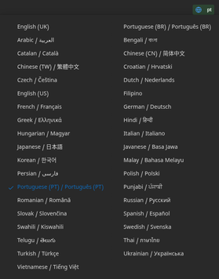
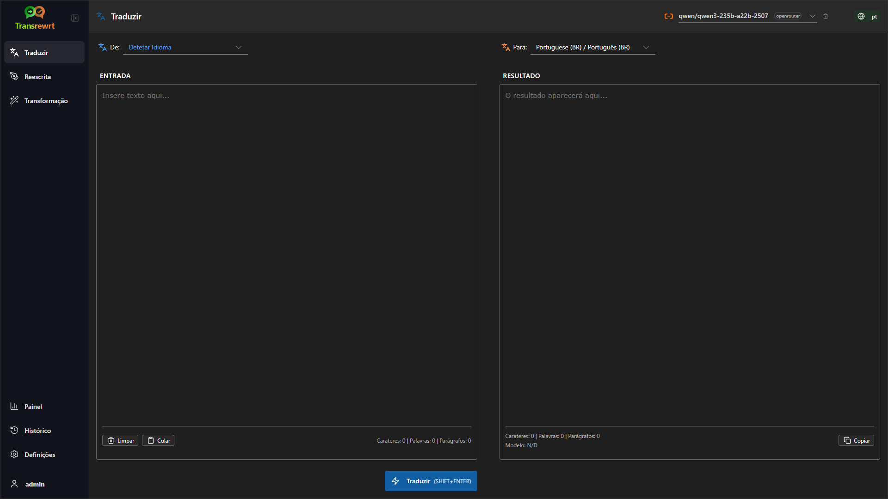
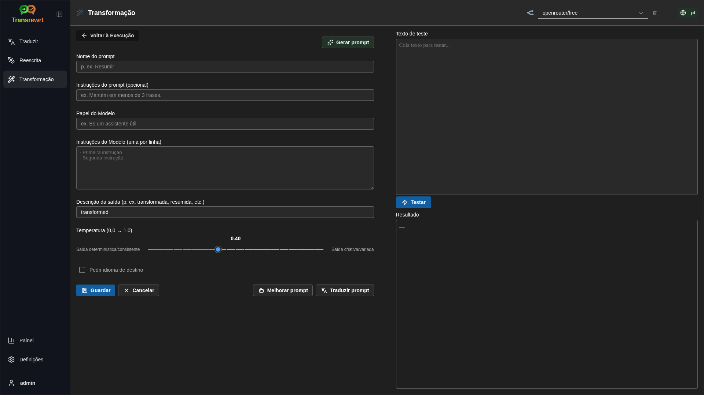
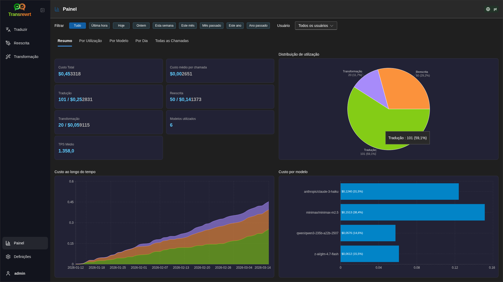
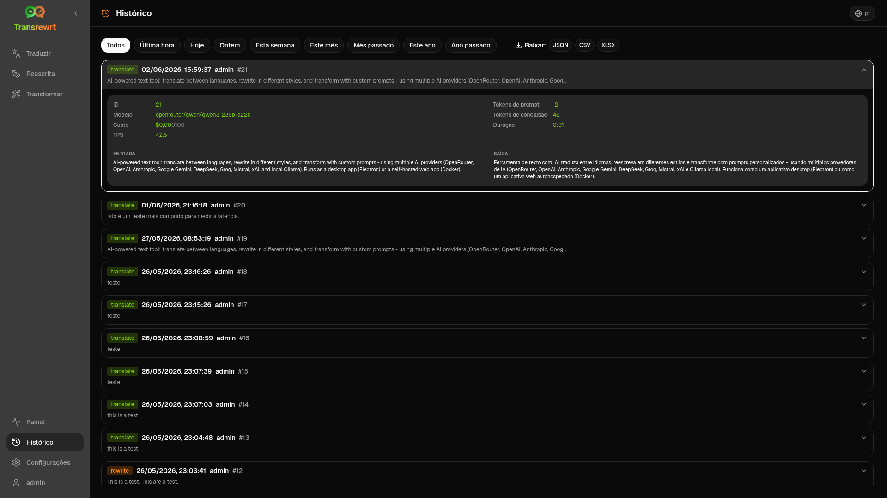
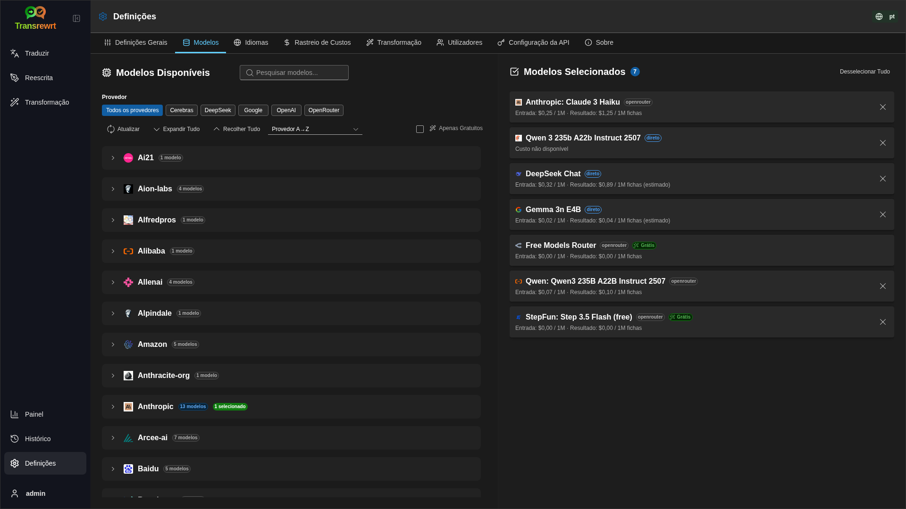

<p align="center">
  
</p>

<p align="center">
  <a href="https://github.com/wsj-br/transrewrt/releases"></a>
  <a href="LICENSE"></a>
  
  
  
</p>

Ferramenta de texto com IA: traduza entre idiomas, reescreva em diferentes estilos e transforme com prompts personalizados — usando múltiplos provedores de IA (OpenRouter, OpenAI, Anthropic, Google Gemini, DeepSeek, Groq, Mistral, xAI e Ollama local). Executa como aplicativo desktop (Electron) ou aplicativo web autohospedado (Docker).

- **Traduzir** - entre dezenas de idiomas, com deteção automática da origem
- **Reescrever** - corrigir gramática, melhorar clareza, formal/informal, encurtar, expandir, técnico
- **Transformar** - prompts personalizados de IA; criar e gerir prompts, idioma de destino opcional por prompt
- **Histórico** - histórico completo de execuções com texto de entrada/saída, filtragem e exportação
- **Modelos e custo** - escolha modelos de qualquer fornecedor configurado; painéis de custo e utilização com registo e resumos por modelo/operação/dia
- **IU** - interface multilíngue (30+ idiomas, suporte a RTL), tipos de letra, ...
- **Modo Web** - suporte multiutilizador com funções de administrador
- **Ambiente de trabalho** - aplicação Electron para Windows e Linux
- **Autoalojado** - imagem Docker para amd64 e arm64 (pronto para Raspberry Pi)

Após a instalação, consulte o **[Guia do Usuário](USER-GUIDE.pt.md)** para uma explicação completa de todos os recursos.

<small>**Leia em outros idiomas:** </small>
<small id="lang-list">[English (GB)](../README.md) · [Português (Brasil)](./README.pt-BR.md) · [العربية](./README.ar.md) · [বাংলা](./README.bn.md) · [Català](./README.ca.md) · [中文 (中国大陆)](./README.zh-CN.md) · [中文 (台灣)](./README.zh-TW.md) · [Hrvatski](./README.hr.md) · [Čeština](./README.cs.md) · [Nederlands](./README.nl.md) · [English (US)](./README.en-US.md) · [Tagalog](./README.tl.md) · [Français](./README.fr.md) · [Deutsch](./README.de.md) · [Ελληνικά](./README.el.md) · [हिन्दी](./README.hi.md) · [Magyar](./README.hu.md) · [Italiano](./README.it.md) · [日本語](./README.ja.md) · [한국어](./README.ko.md) · [Bahasa Melayu](./README.ms.md) · [فارسی](./README.fa.md) · [Polski](./README.pl.md) · [Basa Jawa](./README.jv.md) · [Português](./README.pt.md) · [ਪੰਜਾਬੀ](./README.pa.md) · [Română](./README.ro.md) · [Русский](./README.ru.md) · [Slovenčina](./README.sk.md) · [Español](./README.es.md) · [Kiswahili](./README.sw.md) · [Svenska](./README.sv.md) · [తెలుగు](./README.te.md) · [ไทย](./README.th.md) · [Türkçe](./README.tr.md) · [Українська](./README.uk.md) · [Tiếng Việt](./README.vi.md)</small>

<small>

> **Observação sobre traduções da interface e documentação:** Todos os idiomas da interface, exceto o inglês (UK) original, 
> foram traduzidos usando modelos de IA; a redação pode ser imprecisa ou conter erros.

</small>

<br/>

<a id="table-of-contents"></a>
## Tabela de Conteúdos

<!-- START doctoc generated TOC please keep comment here to allow auto update -->
<!-- DON'T EDIT THIS SECTION, INSTEAD RE-RUN doctoc TO UPDATE -->

- [Capturas de ecrã](#screenshots)
- [Início rápido](#quick-start)
- [Obter uma chave API OpenRouter](#getting-an-openrouter-api-key)
- [Configuração e ambiente](#configuration-and-environment)
- [Desenvolvimento e arquitetura](#development-and-architecture)
- [Relatar problemas](#reporting-issues)
- [Aviso legal](#disclaimer)
- [Licença](#license)

<!-- END doctoc generated TOC please keep comment here to allow auto update -->

<br/><br/>

<a id="screenshots"></a>
## Capturas de tela

**Seletor de idioma**



**Traduzir**



**Transformação - editor de prompt**



**Painel**



**Histórico**



**Definições - seleção de modelo**



<br/><br/>

<a id="quick-start"></a>
## Primeiros passos

<details>
<summary><b>Docker (recomendado para autohospedagem)</b></summary>

<a id="docker"></a>

<br/>

```bash
docker pull ghcr.io/wsj-br/transrewrt:latest

OPENROUTER_API_KEY=sk-or-your-key docker run -d \
  -p 5000:5000 \
  -v transrewrt-data:/app/data \
  -e OPENROUTER_API_KEY \
  --name transrewrt-web \
  ghcr.io/wsj-br/transrewrt:latest
```

Substitua `sk-or-your-key` pela sua [chave API do OpenRouter](https://openrouter.ai/keys) (ou defina chaves de outros provedores; veja [Configuração](#configuration-and-environment)). Abra [http://localhost:5000](http://localhost:5000) e altere a palavra-passe padrão do administrador antes de expor o serviço.

Defina pelo menos uma chave de provedor através do ambiente (por exemplo `OPENROUTER_API_KEY` para o OpenRouter). Passe as variáveis com `-e` ou `docker compose` / `.env` para que segredos não fiquem embutidos na imagem. As chaves dos provedores são **não** inseridas na interface web; o servidor lê-as do ambiente.

<br/>

> ℹ️ **NOTA**<br/>
> No Docker, as credenciais do LLM são definidas com variáveis de ambiente como `OPENROUTER_API_KEY`, `OPENAI_API_KEY`, `CEREBRAS_API_KEY`, … (não na interface web). No ambiente desktop (Electron), você configura as chaves em **Definições → API**.

<br/>

Ou use Docker Compose:

```
# download the compose file
wget https://github.com/wsj-br/transrewrt/raw/refs/heads/master/production.yml -O transrewrt.yml
# Edit the file to add your API keys (API_KEYs), or uncomment and adjust the `.env` file. Set the timezone (TZ) if necessary.
vi transrewrt.yml
# start the container
docker compose -f transrewrt.yml up -d
```

Veja [Configuração](#configuration-and-environment) para todas as variáveis de ambiente, como `PORT`, `CONFIG_PATH`, `TZ`, e chaves do LLM (`OPENROUTER_API_KEY`, `OPENAI_API_KEY`, …).

</details>

<br/>

<details>
<summary><b>Fuso horário do servidor (Docker)</b></summary>

<a id="configuring-the-timezone"></a>

<br/>

A data e hora da interface do usuário seguem a localidade e o fuso horário do **navegador**. Para o comportamento **no lado do servidor** (registos e similares), o recipiente utiliza a variável de ambiente `TZ`. O padrão é `TZ=Europe/London`.

Para usar outro fuso horário, defina `TZ` no seu ficheiro Compose, por exemplo:

```yaml
environment:
  - TZ=America/Sao_Paulo
```

Ou passe-o ao executar o recipiente (Docker):

```bash
--env TZ=America/Sao_Paulo
```

Na maioria dos sistemas Linux, pode copiar o nome do fuso horário do sistema com:

```bash
echo TZ=\"$(</etc/timezone)\"
```

Uma lista de nomes válidos de fusos horários é mantida na [base de dados tz](https://en.wikipedia.org/wiki/List_of_tz_database_time_zones) (Wikipédia).

</details>

<br/>

<details>
<summary><b>Windows</b></summary>

<a id="windows-electron"></a>

<br/>

- Transfira a versão mais recente `Transrewrt Setup x.y.z.exe` em [Releases](https://github.com/wsj-br/transrewrt/releases).
- Execute o `.exe` e siga as instruções do instalador.
- Primeira execução: inicie a aplicação a partir do menu Iniciar ou atalho no ambiente de trabalho.
- Insira as suas chaves API em **Definições → API**. Precisa configurar pelo menos um provedor; o OpenRouter é comum para modelos gratuitos.

<br/>

> ℹ️ **NOTA**<br/>
> O Windows pode exibir um destes avisos de segurança (normal para aplicações não assinadas ou independentes):
>   - **Controlo de Conta de Utilizador (UAC)**: "Deseja permitir que esta aplicação de um editor desconhecido faça alterações no seu dispositivo?" → Clique em **Sim**.
>   - **Microsoft Defender SmartScreen**: "O Windows protegeu o seu PC" → Clique em **Mais informações** → **Executar mesmo assim**.
>
> Isto acontece porque a aplicação não está assinada pela Microsoft ou por um editor importante — é segura se for transferida a partir das nossas versões oficiais no GitHub (verifique as somas de verificação na página [Releases](https://github.com/wsj-br/transrewrt/releases) junto a cada ficheiro).

<br/>

</details>

<br/>

<details>
<summary><b>Linux</b></summary>

<a id="linux-electron"></a>

<br/>

Transfira o `.AppImage` para o seu CPU a partir de [Releases](https://github.com/wsj-br/transrewrt/releases) (`x64` para PCs típicos, `arm64` para muitos dispositivos ARM, incluindo Raspberry Pi 4+), depois:

```bash
chmod +x Transrewrt-x.y.z-x64.AppImage && ./Transrewrt-x.y.z-x64.AppImage
```

Em x86_64/amd64 use o nome do ficheiro `x64`; em ARM64 use o nome `...-arm64.AppImage`.

Insira as suas chaves API em **Definições → API**. Precisa configurar pelo menos um provedor; o OpenRouter é comum para modelos gratuitos.

**Mensagens da consola:** As versões Linux embaladas (`x64` e `arm64` AppImages) suprimem os avisos de depreciação do Node no terminal (por exemplo, o módulo integrado `punycode`). Se o Chromium apresentar erros GPU / EGL como “GLES3 é não suportado”, mas a aplicação funcionar, pode silenciá-los desativando a aceleração por hardware:

```bash
TRANSREWRT_DISABLE_GPU=1 ./Transrewrt-x.y.z-arm64.AppImage
```

Isso aplica-se também ao amd64; altere o nome do ficheiro para corresponder à sua transferência.

No Debian/Ubuntu, poderá precisar de bibliotecas **runtime** adicionais exigidas pelo Chromium (estas geralmente já estão presentes em instalações completas de ambiente gráfico). Execute os comandos abaixo se necessário:

```bash
sudo apt update
sudo apt install -y libfuse2 libgtk-3-0 libnotify4 libnss3 libnspr4 libxss1 libxtst6 xdg-utils \
     xauth libatspi2.0-0 libdrm2 libgbm1 libxcb-dri3-0 libcups2 libasound2t64
```

substitua `libasound2t64` por `libasound2` para `arm64`. Instalações mínimas ou personalizadas podem ainda falhar com um ficheiro `.so` em falta. Instale o pacote com o nome indicado na mensagem de erro (extras comuns: `libatk1.0-0`, `libatk-bridge2.0-0`, `libgbm1`, `libdrm2`). Em alguns ambientes, poderá precisar executar a aplicação usando `APPIMAGE_EXTRACT_AND_RUN=1 ./Transrewrt-….AppImage`.

<br/>

> ℹ️ **NOTA**<br/>
> O macOS não é atualmente suportado. O Transrewrt está disponível para Windows, Linux e Docker.

</details>

<br/>

Depois de a aplicação estar em execução, consulte o **[Guia do Usuário](USER-GUIDE.pt.md)** para aprender a traduzir, reescrever e transformar texto, gerir prompts e configurar modelos.

<br/><br/>

<a id="getting-an-openrouter-api-key"></a>
## Obter uma chave API OpenRouter

O Transrewrt suporta múltiplos provedores de IA. [OpenRouter](https://openrouter.ai) é uma escolha popular porque agrega muitos modelos sob uma única chave e oferece modelos gratuitos.

1. Registe-se ou inicie sessão em [openrouter.ai](https://openrouter.ai).
2. Abra a página [Keys](https://openrouter.ai/keys) e crie uma nova chave (dê-lhe um nome e, opcionalmente, defina um limite de crédito). Pode usar modelos gratuitos sem adicionar crédito.
3. **Ambiente de trabalho (Electron):** cole as chaves em **Definições → API**. **Docker:** defina variáveis de ambiente como `OPENROUTER_API_KEY` (veja [Início rápido](#quick-start)).

Não use o modelo **Body Builder** do OpenRouter ([`openrouter/bodybuilder`](https://openrouter.ai/openrouter/bodybuilder)) para traduzir, reescrever ou transformar: ele devolve cargas JSON de pedidos, não o texto completo para essas tarefas. Veja [Definições → Modelos](USER-GUIDE.pt.md#models) no Guia do Usuário.

Também pode usar outros provedores (OpenAI, Anthropic, Google Gemini, DeepSeek, Groq, Mistral, xAI, Cerebras) ou executar modelos localmente com [Ollama](https://ollama.com). Veja [Configuração](#configuration-and-environment) para a lista completa de provedores suportados e variáveis de ambiente.

</br>

> ⚠️ **AVISO**<br/>
> Se estiver a usar o Ollama a partir de outro dispositivo, contentor ou serviço, lembre-se de configurar o Ollama para permitir ligações externas (não apenas localhost).

<br/><br/>

<a id="configuration-and-environment"></a>
## Configuração e ambiente

</br>

**Localizações dos ficheiros de configuração**

| Implementação         | Localização da configuração                                   |
| ------------------ | ------------------------------------------------- |
| Electron (Windows) | `%APPDATA%\transrewrt\`                           |
| Electron (Linux)   | `~/.config/transrewrt/`                           |
| Web / Docker       | `/app/data/config.json` (use um volume para manter os dados) |

<br/>

**Variáveis de ambiente** (apenas web/Docker; o Electron utiliza o ficheiro de configuração local)

| Variável             | Descrição                                                                  |
|----------------------|------------------------------------------------------------------------------|
| `PORT`               | Porta de escuta do servidor (predefinição: `5000`)                                  |
| `CONFIG_PATH`        | Caminho para o arquivo de configuração (padrão: `/app/data/config.json`)                |
| `TZ`                 | fuso horário para a hora no servidor (registos, etc.) (predefinição: `Europe/London`) |
| `OPENROUTER_API_KEY` | Chave API OpenRouter                                                           |
| `OPENAI_API_KEY`     | Chave API OpenAI                                                               |
| `CEREBRAS_API_KEY`   | Chave API Cerebras                                                             |
| `ANTHROPIC_API_KEY`  | Chave API Anthropic                                                            |
| `GOOGLE_API_KEY`     | Chave API Google Gemini                                                        |
| `DEEPSEEK_API_KEY`   | Chave API DeepSeek                                                             |
| `GROQ_API_KEY`       | Chave API Groq                                                                 |
| `MISTRAL_API_KEY`    | Chave API Mistral                                                              |
| `OLLAMA_URL`         | URL base do Ollama (ex: `http://host.docker.internal:11434`)                   |
| `XAI_API_KEY`        | Chave de API xAI                                                                  |

Configure apenas os fornecedores que utilizar. Os IDs dos modelos são agrupados por namespace (`openrouter/…`, `openai/…`, `cerebras/…`, `ollama/…`, etc.).

**Exibição de custo:** O OpenRouter devolve o custo faturado exato quando aplicável. Outros fornecedores usam o custo **estimado** da tabela pública de preços de modelos do OpenRouter quando uma chave OpenRouter está disponível; sem ela, o custo de não-OpenRouter pode aparecer como `0`. As estimativas não são faturas.

<br/>

**Dados e persistência:** Para Docker, monte um volume em `/app/data` para que `config.json` e a base de dados SQLite persistam entre reinícios do contentor. Sem um volume, todos os dados são perdidos quando o contentor parar.

<br/>

**Autenticação web:**

- Administrador padrão: `admin` / `transrewrt26`.
- Gerir utilizadores em **Definições → Utilizadores**.
- Repor palavra-passe: `docker exec <container> reset-web-password '<username>' '<new-password>'`

<br/>

> ⚠️ **AVISO**<br/>
> Altere imediatamente a palavra-passe padrão do administrador em qualquer anfitrião com acesso à rede.

<br/>

As definições principais (tipo de letra, modelos, idiomas, etc.) estão disponíveis nas Definições da aplicação.

<br/><br/>

<a id="development-and-architecture"></a>
## Desenvolvimento e arquitetura

- **Desenvolvimento:** Configuração, compilação, testes e implementação (Electron, Web, Docker) - veja **[dev/DEVELOPMENT.md](../dev/DEVELOPMENT.md)**.
- **Arquitetura e visão geral do sistema:** Estrutura de pastas, pilha tecnológica, decisões de design - veja **[dev/SYSTEM-OVERVIEW.md](../dev/SYSTEM-OVERVIEW.md)**.

<br/><br/>

<a id="reporting-issues"></a>
## Relato de problemas

Abra um problema no [GitHub](https://github.com/wsj-br/transrewrt/issues). Inclua a sua plataforma (Windows / Linux / Docker) e a versão da aplicação (mostrada na janela Sobre ou na página de Lançamentos).

<br/><br/>

<a id="disclaimer"></a>
## Aviso legal

Os nomes e ícones dos produtos pertencem aos respetivos proprietários e são utilizados apenas para fins de identificação. Este software não é afiliado nem endossado por nenhuma das marcas mencionadas.

<br/><br/>

<a id="license"></a>
## Licença

Direitos autorais © 2026 Waldemar Scudeller Jr.

[Apache License 2.0](../LICENSE)
