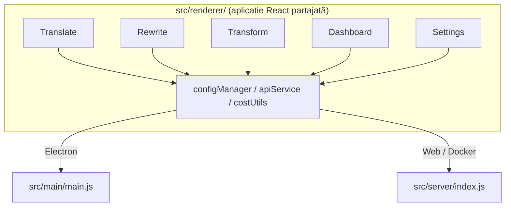

<p align="center">
  
</p>

<h1 align="center">Transrewrt</h1>

<p align="center">
  <a href="https://github.com/wsj-br/transrewrt/releases"></a>
  <a href="LICENSE"></a>
  
  
  
</p>

Instrument de text cu AI: traduce între limbi, rescrie în diferite stiluri și transformă cu prompturi personalizate - totul prin [OpenRouter](https://openrouter.ai). Rulează ca o aplicație desktop (Electron) sau ca o aplicație web auto-găzduită (Docker).

- **Traducere** - între zeci de limbi, cu detectarea automată a sursei
- **Rescriere** - corectează gramatica, îmbunătățește claritatea, formal/informal, scurtează, extinde, tehnic
- **Transformare** - prompturi AI personalizate; creează și gestionează prompturi, limbă țintă opțională per prompt
- **Modele și costuri** - alege orice model OpenRouter; dashboard de costuri cu jurnal SQLite, sumarizări după model/operațiune/zi
- **Interfață** - i18n (pt-BR, de, fr, es, RTL), teme, fonturi, comenzi rapide de la tastatură; mod web sigur (cheia API pe server doar)
- **Desktop** - aplicație Electron pentru Windows și Linux
- **Auto-găzduire** - imagine Docker pentru amd64 & arm64 (compatibilă Raspberry Pi)

După instalare, consultați **[Ghidul Utilizatorului](../USER-GUIDE.md)** pentru un tur complet al tuturor caracteristicilor.

<small>**Citit în alte limbi:** [Engleză (Marea Britanie)](../README.md) · [Portugheză (Brazilia)](README.pt-BR.md) · [Araba](README.ar.md) · [Bengali](README.bn.md) · [Catalană](README.ca.md) · [Chineză simplificat](README.zh-CN.md) · [Chineză tradițional](README.zh-TW.md) · [Croată](README.hr.md) · [Cehă](README.cs.md) · [Olandeză](README.nl.md) · [Engleză (SUA)](README.en-US.md) · [Filipino](README.tl.md) · [Franceză](README.fr.md) · [Germană](README.de.md) · [Greacă](README.el.md) · [Hindi](README.hi.md) · [Maghiară](README.hu.md) · [Italiană](README.it.md) · [Japonă](README.ja.md) · [Javaneză](README.jv.md) · [Coreeană](README.ko.md) · [Malaeză](README.ms.md) · [Persană](README.fa.md) · [Poloneză](README.pl.md) · [Portugheză (Portugalia)](README.pt.md) · [Punjabi](README.pa.md) · [Română](README.ro.md) · [Rusă](README.ru.md) · [Slovacă](README.sk.md) · [Spaniolă](README.es.md) · [Swahili](README.sw.md) · [Suedeză](README.sv.md) · [Telugu](README.te.md) · [Thaiană](README.th.md) · [Turcă](README.tr.md) · [Ucraineană](README.uk.md) · [Vietnameză](README.vi.md)</small>

<a id="screenshots"></a>
## Capturi de ecran

**Selector de limbă**


**Traducere**


**Transformare - editor de prompturi**


**Tablou de bord**


**Setări - selecție model**


<br /><br />

<a id="table-of-contents"></a>
## Cuprins

<!-- START doctoc generated TOC please keep comment here to allow auto update -->
<!-- DON'T EDIT THIS SECTION, INSTEAD RE-RUN doctoc TO UPDATE -->

- [Început rapid](#quick-start)
- [Instalare](#installation)
  - [Windows (Electron)](#windows-electron)
  - [Linux (Electron)](#linux-electron)
  - [Docker](#docker)
- [Obținerea unei chei API OpenRouter](#getting-an-openrouter-api-key)
- [Configurație și mediu](#configuration-and-environment)
- [Dezvoltare și arhitectură](#development-and-architecture)
- [Lansări și etichete](#releases-and-tags)
- [Contribuții](#contributing)
- [Exenere de răspundere](#disclaimer)
- [Licență](#license)

<!-- END doctoc generated TOC please keep comment here to allow auto update -->

<br /><br />

<a id="quick-start"></a>

## Start rapid

**Docker (recomandat pentru auto-gestionare)**

```bash
docker pull ghcr.io/wsj-br/transrewrt:latest

API_KEY=sk-or-your-key docker run -d \
  -p 5000:5000 \
  -v transrewrt-data:/app/data \
  -e API_KEY \
  --name transrewrt-web \
  ghcr.io/wsj-br/transrewrt:latest
```

Înlocuiește `sk-or-your-key` cu [cheia ta API OpenRouter](https://openrouter.ai/keys). Deschide [http://localhost:5000](http://localhost:5000) și schimbă parola implicită de administrator înainte de a expune serviciul.

<br />

> ℹ️ **NOTĂ**<br/>
> În Docker, cheia API OpenRouter este setată doar prin variabila de mediu `API_KEY` (nu în interfața web). Pe desktop (Electron) lipește cheia în **Setări → API**.

<br />

**Windows**

Descarcă cel mai recent `Transrewrt Setup x.y.z.exe` din [Lansări](https://github.com/wsj-br/transrewrt/releases), rulează instalatorul, apoi pornește din meniul Start sau de pe scurtătură de desktop. Introdu cheia ta API OpenRouter în **Setări → API**.

<br />

**Linux**

Descarcă `.AppImage` din [Lansări](https://github.com/wsj-br/transrewrt/releases), apoi:

```bash
chmod +x Transrewrt-x.y.z.AppImage && ./Transrewrt-x.y.z.AppImage
```

Introdu cheia ta API OpenRouter în **Setări → API**. Pe Debian/Ubuntu s-ar putea să fie necesar să instalezi mai întâi dependențe suplimentare:

```bash
sudo apt install libgtk-3-0 libnotify-dev libnss3 libxss1 libasound2 libxtst6 xauth
```

Vezi [Instalare → Linux](#linux-electron) pentru detalii.

<br />

> ℹ️ **NOTĂ**<br/>
> macOS nu este acceptat în prezent. Transrewrt este disponibil pentru Windows, Linux și Docker.

<br />

Odată ce aplicația rulează, consultă **[Ghidul utilizatorului](../USER-GUIDE.md)** pentru a învăța cum să traduci, să rescrii și să transformi text, să gestionezi prompt-uri și să configurezi modele.

<br /><br />

<a id="installation"></a>
## Instalare

<a id="windows-electron"></a>
### Windows (Electron)

- Descarcă cel mai recent instalator din [Lansări](https://github.com/wsj-br/transrewrt/releases).
- Rulează fișierul `.exe` și urmează instrucțiunile instalatorului.
- Prima execuție: pornește aplicația din meniul Start sau de pe scurtătură de desktop. Configurația este stocată în `%APPDATA%\transrewrt\`.

<br />

<a id="linux-electron"></a>
### Linux (Electron)

- Descarcă `.AppImage` din [Lansări](https://github.com/wsj-br/transrewrt/releases).
- Rulează: `chmod +x Transrewrt-x.y.z.AppImage && ./Transrewrt-x.y.z.AppImage`
- Dependențe suplimentare (Debian/Ubuntu): `sudo apt install libgtk-3-0 libnotify-dev libnss3 libxss1 libasound2 libxtst6 xauth`
- Vezi [dev/DEVELOPMENT.md](../dev/DEVELOPMENT.md) pentru mai multe detalii.

<br />

<a id="docker"></a>
### Docker

- Pull: `docker pull ghcr.io/wsj-br/transrewrt:latest`
- Cheia API OpenRouter **trebuie** să fie setată prin variabila de mediu `API_KEY`. Transmite-o cu `-e API_KEY` (sau prin `docker compose` / `.env`) astfel încât cheia să nu fie vizibilă în lista de procese.
- Cheia API nu poate fi introdusă în interfața web.

Exemplu - volum numit pentru persistență (cheia API transmisă prin variabila de mediu, nu în linia de comandă):

```bash
API_KEY=sk-or-your-key docker run -d \
  -p 5000:5000 \
  -v transrewrt-data:/app/data \
  -e API_KEY \
  --name transrewrt-web \
  ghcr.io/wsj-br/transrewrt:latest
```

<br />

| Opțiune   | Descriere                                                                                                   |
| -------- | ------------------------------------------------------------------------------------------------------------- |
| Port     | `5000` (mapează cu `-p 5000:5000`)                                                                              |
| Volum    | Montați `/app/data` pentru configurație și persistența bazei de date                                           |
| Variabile de mediu | `PORT`, `CONFIG_PATH`, `API_KEY`, `API_URL`, `KEY_SEED` - vezi [Configurare](#configuration-and-environment) |

Pentru a construi și rula din sursă: `docker compose up --build -d` sau `pnpm run docker:up` - vezi [dev/DEVELOPMENT.md](../dev/DEVELOPMENT.md).

<br /><br />

<a id="getting-an-openrouter-api-key"></a>
## Obținerea unei chei API OpenRouter

Transrewrt folosește [OpenRouter](https://openrouter.ai) pentru modelele AI. Ai nevoie de o cheie API pentru a traduce, rescrie sau transforma text.

1. Înscrie-te sau autentifică-te la [openrouter.ai](https://openrouter.ai).
2. Deschide pagina [Chei](https://openrouter.ai/keys) și creează o cheie nouă (numește-o și, opțional, setează o limită de credit). Poți folosi modele gratuite fără a adăuga credit.
3. **Desktop (Electron):** lipește cheia în **Setări → API**. **Docker:** setează variabila de mediu `API_KEY` (vezi [Start rapid](#quick-start)).

Pentru limite, BYOK și multe altele, vezi [Autentificarea OpenRouter](https://openrouter.ai/docs/api/reference/authentication).

<br /><br />

<a id="configuration-and-environment"></a>

## Configurație și mediu

**Locații fișier de configurare**

| Implementare      | Locație configurare                                   |
| ----------------- | ----------------------------------------------------- |
| Electron (Windows) | `%APPDATA%\transrewrt\`                               |
| Electron (Linux)   | `~/.config/transrewrt/`                               |
| Web / Docker       | `/app/data/config.json` (folosește un volum pentru persistentă) |

<br />

**Variabile de mediu** (doar web/Docker; Electron utilizează fișierul de configurare local)

| Variabilă    | Implicit                       | Descriere                                                   |
| ------------ | ------------------------------ | ----------------------------------------------------------- |
| `PORT`       | `5000`                         | Port de ascultare a serverului                             |
| `CONFIG_PATH`| `/app/data/config.json`        | Calea către fișierul de configurare                       |
| `API_KEY`    | *(gol)*                        | Cheie API OpenRouter (obligatoriu pentru Docker; setată prin env, nu prin UI) |
| `API_URL`    | `https://openrouter.ai/api/v1` | URL de bază pentru API-ul AI upstream                     |
| `KEY_SEED`   | *(gol)*                        | Semință pentru cheia proxy Transrewrt (suprașcite configurarea dacă este setată) |

<br />

**Date și persistentă:** Pentru Docker, montați un volum la `/app/data` astfel încât `config.json` și baza de date SQLite să persistă între repornirile containerului. Fără un volum, toate datele se pierd când containerul se oprește.

<br />

**Autentificare web:**

- Admin implicit: `admin` / `transrewrt26`.
- Gestionați utilizatorii în **Setări → Utilizatori**.
- Resetați o parolă: `docker exec <container> reset-web-password '<nume-utilizator>' '<parolă-nouă>'`
  (din sursă: `pnpm run reset-web-password -- <nume-utilizator> <parolă-nouă>`)

<br />

> ⚠️ **AVERTISMENT**<br/>
> Schimbați imediat parola implicită de Administrator pe orice gazdă accesibilă în rețea.

<br />

**Proxy Transrewrt (opțional):** Puteți direcționa traficul API printr-un proxy extern care utilizează o cheie rotativă bazată pe timp. în **Setări → API**, activați **Folosește Proxy Transrewrt**, setați **Semință cheie** și setați **URL API** la URL-ul de bază al proxy-ului. Consultați [dev/SYSTEM-OVERVIEW.md](../dev/SYSTEM-OVERVIEW.md) pentru detalii.

Setările cheie (temă, font, modele, limbi etc.) sunt disponibile în dialogul Setări sau pot fi editate direct în JSON-ul de configurare. Lista completă și valorile implicite sunt documentate în [dev/DEVELOPMENT.md](../dev/DEVELOPMENT.md).

<br /><br />

<a id="development-and-architecture"></a>
## Dezvoltare și arhitectură

- **Dezvoltare:** Configurare, build, testare și implementare (Electron, Web, Docker) - consultați **[dev/DEVELOPMENT.md](../dev/DEVELOPMENT.md)**.
- **Arhitectură și prezentare generală a sistemului:** Structura de foldere, stack-ul tehnologic, deciziile de proiectare, proxy-ul Transrewrt - consultați **[dev/SYSTEM-OVERVIEW.md](../dev/SYSTEM-OVERVIEW.md)**.



<br /><br />

<a id="releases-and-tags"></a>
## Lansări și etichete

- **Etichetele Git** `v`* (de ex. `v1.0.10`) activează [fluxul de lucru pentru lansare](.github/workflows/release.yml). **Lansările GitHub** atașează instalatorul Windows (`.exe`) și AppImage-ul Linux.
- **Imaginile Docker** sunt publicate la `ghcr.io/wsj-br/transrewrt`. Etichetele de imagine corespund versiunii Git (de ex. `v1.0.10` → `ghcr.io/wsj-br/transrewrt:1.0.10`) plus `latest`. Multi-arhitectură: `linux/amd64` și `linux/arm64` (de ex. Raspberry Pi).

<br /><br />

<a id="contributing"></a>
## Contribuție

1. Faceți un fork al repository-ului.
2. Creați o ramură de caracteristică: `git checkout -b feature/my-feature`
3. Comiteți modificările cu un mesaj clar.
4. Trimiteți și deschideți o Pull Request către `main`.

Vă rugăm să urmați stilul de cod existent și să testați modificările atât în modul Electron cât și în modul web înainte de a trimite. Consultați [dev/DEVELOPMENT.md](../dev/DEVELOPMENT.md) pentru instrucțiuni de build și testare.

<br />

**Raportarea problemelor:** Deschideți o problemă pe [GitHub](https://github.com/wsj-br/transrewrt/issues). Includeți platforma (Windows / Linux / Docker) și versiunea aplicației (afișată în dialogul Despre sau pe pagina Lansări).

<br /><br />

<a id="disclaimer"></a>

## Declinare de răspundere

Numele produselor și pictogramele aparțin proprietarilor respectivi și sunt utilizate exclusiv pentru scopuri de identificare. Acest software nu este afiliat sau recomandat de către nicio dintre mărcile menționate.

<br /><br />

<a id="license"></a>
## Licență

Copyright © 2026 Waldemar Scudeller Jr.

[Apache License 2.0](LICENSE)