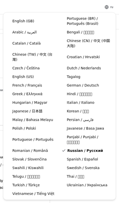
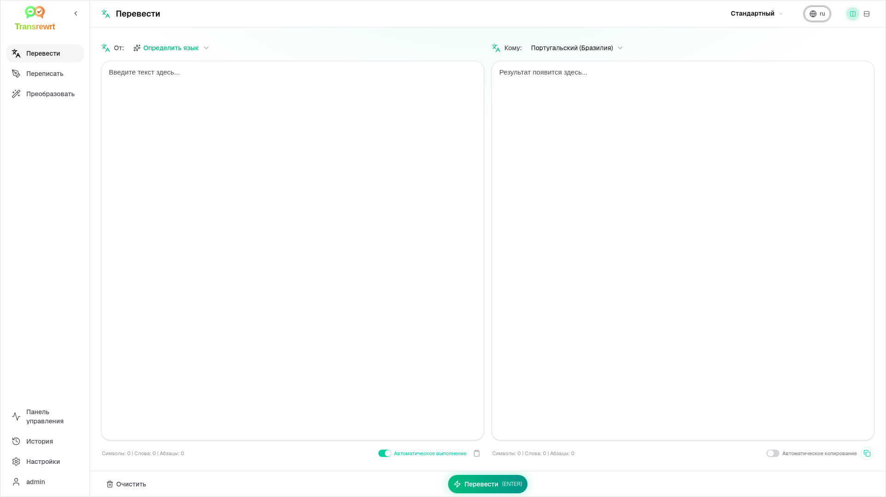
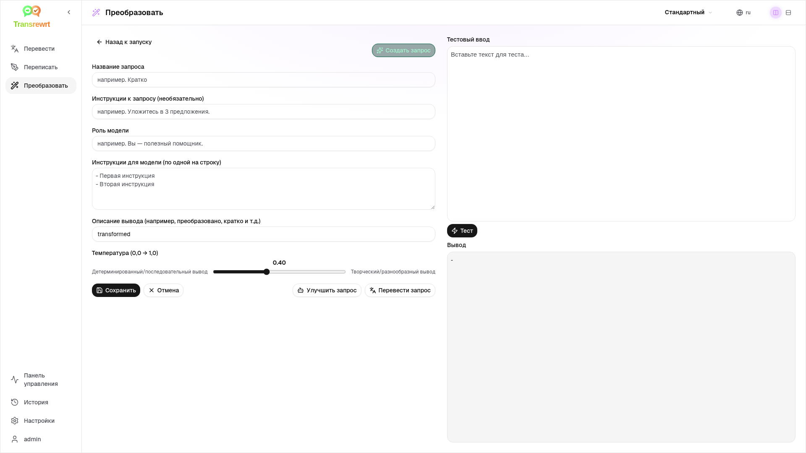
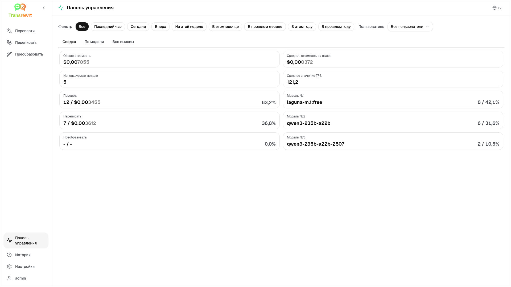
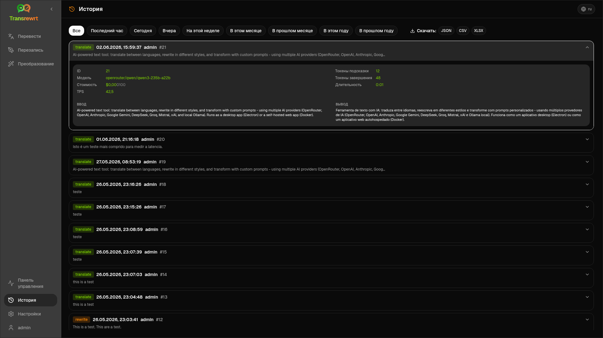
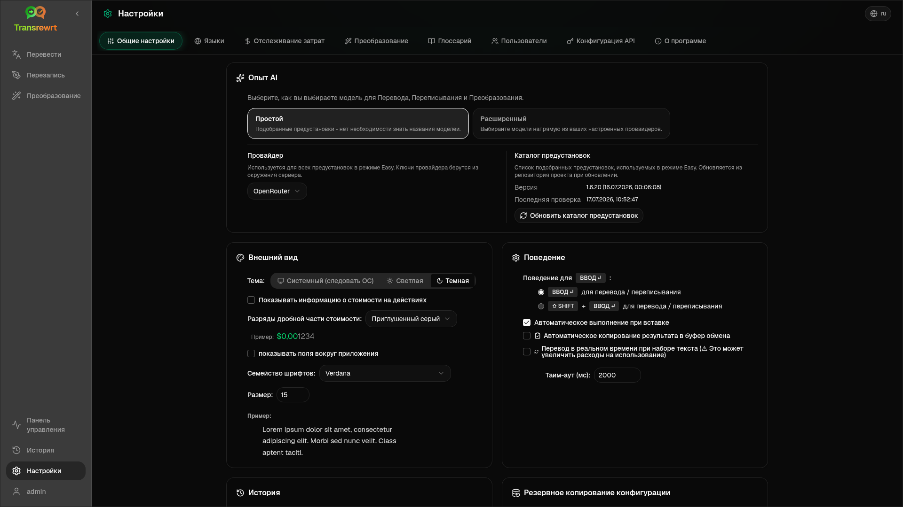

<p align="center">
  
</p>

<p align="center">
  <a href="https://github.com/wsj-br/transrewrt/releases"></a>
  <a href="LICENSE"></a>
  
  
  
</p>

Инструмент для работы с текстом на базе ИИ: перевод между языками, переписывание в разных стилях и трансформация с помощью пользовательских промптов — с использованием нескольких поставщиков ИИ (OpenRouter, OpenAI, Anthropic, Google Gemini, DeepSeek, Groq, Mistral, xAI и локально установленного Ollama). Работает как настольное приложение (Electron) или как веб-приложение для самостоятельного размещения (Docker).

- **Перевести** — между десятками языков с автоматическим определением источника
- **Переписать** — исправление грамматики, повышение ясности, формальный/неформальный стиль, сократить, расширить, технический текст
- **Преобразовать** — пользовательские AI-запросы; создание и управление запросами, необязательный язык цели для каждого запроса
- **История** — полная история выполнения с вводом/выходным текстом, фильтрацией и экспорт
- **Простой и расширенный** — Простой режим (по умолчанию): подбор навыков по поставщику (**Бесплатно (OpenRouter)**, **Lite**, **Расширенный**, **Технический**; отображаются только навыки, соответствующие выбранному поставщику), без выбора идентификаторов моделей; Расширенный режим: полный список моделей от настроенных поставщиков
- **Модели и стоимость** — панели мониторинга расходов и использования (Сводка, По модели, Все вызовы) с возможностью экспорта; OpenRouter показывает фактические расходы, другие поставщики используют оценочные значения
- **Пользовательский интерфейс** — интерфейс на нескольких языках (более 30 языков, поддержка RTL), шрифты, ...
- **Веб-режим** — поддержка нескольких пользователей с ролями администратора
- **Настольная версия** — приложение Electron для Windows и Linux
- **Самостоятельное размещение** — образ Docker для amd64 и arm64 (готово к работе на Raspberry Pi)

После установки ознакомьтесь с [**Руководством пользователя**](USER-GUIDE.ru.md), где подробно описаны все функции.

<small>**Читать на других языках:** </small>
<small id="lang-list">[English (GB)](../README.md) · [Português (Brasil)](./README.pt-BR.md) · [العربية](./README.ar.md) · [বাংলা](./README.bn.md) · [Català](./README.ca.md) · [中文 (中国大陆)](./README.zh-CN.md) · [中文 (台灣)](./README.zh-TW.md) · [Hrvatski](./README.hr.md) · [Čeština](./README.cs.md) · [Nederlands](./README.nl.md) · [English (US)](./README.en-US.md) · [Tagalog](./README.tl.md) · [Français](./README.fr.md) · [Deutsch](./README.de.md) · [Ελληνικά](./README.el.md) · [हिन्दी](./README.hi.md) · [Magyar](./README.hu.md) · [Italiano](./README.it.md) · [日本語](./README.ja.md) · [한국어](./README.ko.md) · [Bahasa Melayu](./README.ms.md) · [فارسی](./README.fa.md) · [Polski](./README.pl.md) · [Basa Jawa](./README.jv.md) · [Português](./README.pt.md) · [ਪੰਜਾਬੀ](./README.pa.md) · [Română](./README.ro.md) · [Русский](./README.ru.md) · [Slovenčina](./README.sk.md) · [Español](./README.es.md) · [Kiswahili](./README.sw.md) · [Svenska](./README.sv.md) · [తెలుగు](./README.te.md) · [ไทย](./README.th.md) · [Türkçe](./README.tr.md) · [Українська](./README.uk.md) · [Tiếng Việt](./README.vi.md)</small>

<small>

> **Примечание о переводах интерфейса и документации:** Все языки интерфейса, кроме оригинального английского (Великобритания),
> были переведены с помощью моделей ИИ; формулировки могут быть неточными или содержать ошибки.

</small>

<br/>

<a id="table-of-contents"></a>
## Содержание

<!-- START doctoc generated TOC please keep comment here to allow auto update -->
<!-- DON'T EDIT THIS SECTION, INSTEAD RE-RUN doctoc TO UPDATE -->

- [Скриншоты](#screenshots)
- [Быстрый старт](#quick-start)
- [Получение ключа API OpenRouter](#getting-an-openrouter-api-key)
- [Конфигурация и окружение](#configuration-and-environment)
- [Разработка и архитектура](#development-and-architecture)
- [Сообщение об ошибках](#reporting-issues)
- [Отказ от ответственности](#disclaimer)
- [Лицензия](#license)

<!-- END doctoc generated TOC please keep comment here to allow auto update -->

<br/><br/>

<a id="screenshots"></a>
## Скриншоты

**Выбор языка**



**Перевести**



**Трансформация — редактор промптов**



**Панель мониторинга**



**История**



**Настройки — выбор модели**



<br/><br/>

<a id="quick-start"></a>
## Быстрый старт

<details>
<summary><b>Docker (рекомендуется для самостоятельного хостинга)</b></summary>

<a id="docker"></a>

<br/>

```bash
docker pull ghcr.io/wsj-br/transrewrt:latest

OPENROUTER_API_KEY=sk-or-your-key docker run -d \
  -p 5000:5000 \
  -v transrewrt-data:/app/data \
  -e OPENROUTER_API_KEY \
  --name transrewrt-web \
  ghcr.io/wsj-br/transrewrt:latest
```

Замените `sk-or-your-key` на ваш [ключ API OpenRouter](https://openrouter.ai/keys) (или установите ключи других провайдеров; см. [Конфигурация](#configuration-and-environment)). Откройте [http://localhost:5000](http://localhost:5000) и измените пароль администратора по умолчанию перед публикацией сервиса.

Установите хотя бы один ключ провайдера через переменные окружения (например, `OPENROUTER_API_KEY` для OpenRouter). Передавайте переменные с помощью `-e` или `docker compose` / `.env`, чтобы секреты не попадали в образ. Ключи провайдеров **не** вводятся в веб-интерфейсе; сервер считывает их из окружения.

<br/>

> ℹ️ **ПРИМЕЧАНИЕ**<br/>
> В Docker учетные данные LLM задаются переменными окружения, такими как `OPENROUTER_API_KEY`, `OPENAI_API_KEY`, `CEREBRAS_API_KEY`, … (не в веб-интерфейсе). В настольной версии (Electron) вы настраиваете ключи в разделе **Настройки → API**.

<br/>

Или используйте Docker Compose:

```bash
# download the compose file
wget https://github.com/wsj-br/transrewrt/raw/refs/heads/master/production.yml -O transrewrt.yml
# Edit the file to add your API keys (API_KEYs), or uncomment and adjust the `.env` file. Set the timezone (TZ) if necessary.
vi transrewrt.yml
# start the container
docker compose -f transrewrt.yml up -d
```

См. [Конфигурация](#configuration-and-environment) для всех переменных окружения, таких как `PORT`, `CONFIG_PATH`, `TZ`, и ключей LLM (`OPENROUTER_API_KEY`, `OPENAI_API_KEY`, …).

</details>

<br/>

<details>
<summary><b>Часовой пояс сервера (Docker)</b></summary>

<a id="configuring-the-timezone"></a>

<br/>

Дата и время в пользовательском интерфейсе приложения следуют локали и часовому поясу **браузера**. Для **серверного** поведения (логирование и аналогичные функции) контейнер использует переменную окружения `TZ`. По умолчанию установлено значение `TZ=Europe/London`.

Чтобы использовать другой часовой пояс, установите `TZ` в файле Compose, например:

```yaml
environment:
  - TZ=America/Sao_Paulo
```

Или передайте при запуске контейнера (Docker):

```bash
--env TZ=America/Sao_Paulo
```

На многих Linux-хостах вы можете скопировать имя системного часового пояса с помощью:

```bash
echo TZ=\"$(</etc/timezone)\"
```

Список допустимых названий часовых поясов ведётся в [базе данных tz](https://en.wikipedia.org/wiki/List_of_tz_database_time_zones) (Wikipedia).

</details>

<br/>

<details>
<summary><b>Windows</b></summary>

<a id="windows-electron"></a>

<br/>

- Скачайте последнюю версию `Transrewrt Setup x.y.z.exe` со страницы [Releases](https://github.com/wsj-br/transrewrt/releases).
- Запустите `.exe` и следуйте инструкциям установщика.
- При первом запуске: запустите приложение через меню «Пуск» или ярлык на рабочем столе.
- Введите ваши ключи API в разделе **Настройки → API**. Необходимо настроить хотя бы одного провайдера; OpenRouter часто используется для бесплатных моделей.

<br/>

> ℹ️ **ПРИМЕЧАНИЕ**<br/>
> Windows может показать одно из следующих предупреждений безопасности (нормально для приложений без подписи или независимых разработчиков):
>   - **Контроль учётных записей (UAC)**: «Разрешить этому приложению от неизвестного издателя вносить изменения на этом устройстве?» → Нажмите **Да**.
>   - **Microsoft Defender SmartScreen**: «Windows защитила ваш компьютер» → Нажмите **Дополнительные сведения** → **Всё равно запустить**.
>
> Это происходит потому, что приложение не подписано Microsoft или крупным издателем — оно безопасно, если скачано с официальных релизов на GitHub (проверьте контрольные суммы на странице [Releases](https://github.com/wsj-br/transrewrt/releases) рядом с каждым файлом).

<br/>

</details>

<br/>

<details>
<summary><b>Linux</b></summary>

<a id="linux-electron"></a>

<br/>

Скачайте `.AppImage` для вашего процессора со страницы [Releases](https://github.com/wsj-br/transrewrt/releases) (`x64` для типичных ПК, `arm64` для многих ARM-устройств, включая Raspberry Pi 4+), затем:

```bash
chmod +x Transrewrt-x.y.z-x64.AppImage && ./Transrewrt-x.y.z-x64.AppImage
```

На x86_64/amd64 используйте имя файла `x64`; на ARM64 — имя `...-arm64.AppImage`.

Введите свои API-ключи в **Настройки → API**. Необходимо настроить хотя бы одного провайдера; OpenRouter часто используется для бесплатных моделей.

**Сообщения консоли:** Собранные версии для Linux (`x64` и `arm64` AppImages) подавляют предупреждения об устаревании Node в терминале (например, встроенного модуля `punycode`). Если Chromium выводит ошибки GPU / EGL, такие как «GLES3 is unsupported», но приложение работает, вы можете отключить их, отключив аппаратное ускорение:

```bash
TRANSREWRT_DISABLE_GPU=1 ./Transrewrt-x.y.z-arm64.AppImage
```

Это относится и к amd64; измените имя файла в соответствии со скачанным.

В Debian/Ubuntu могут потребоваться дополнительные **библиотеки выполнения**, необходимые Chromium (они часто уже присутствуют в полных десктопных установках). При необходимости выполните следующие команды:

```bash
sudo apt update
sudo apt install -y libfuse2 libgtk-3-0 libnotify4 libnss3 libnspr4 libxss1 libxtst6 xdg-utils \
     xauth libatspi2.0-0 libdrm2 libgbm1 libxcb-dri3-0 libcups2 libasound2t64
```

замените `libasound2t64` на `libasound2` для `arm64`. Минимальные или кастомные установки могут по-прежнему завершаться с ошибкой отсутствующего файла `.so`. Установите пакет, указанный в сообщении об ошибке (частые дополнения: `libatk1.0-0`, `libatk-bridge2.0-0`, `libgbm1`, `libdrm2`). В некоторых средах может потребоваться запуск приложения с помощью `APPIMAGE_EXTRACT_AND_RUN=1 ./Transrewrt-….AppImage`.

<br/>

> ℹ️ **ПРИМЕЧАНИЕ**<br/>
> macOS в настоящее время не поддерживается. Transrewrt доступен для Windows, Linux и Docker.

</details>

<br/>

Когда приложение запущено, см. [**Руководство пользователя**](USER-GUIDE.ru.md), чтобы узнать, как переводить, переписывать и преобразовывать текст, управлять запросами и настраивать модели.

<br/><br/>

<a id="getting-an-openrouter-api-key"></a>
## Получение API-ключа OpenRouter

Transrewrt поддерживает несколько провайдеров ИИ. [OpenRouter](https://openrouter.ai) — популярный выбор, поскольку объединяет множество моделей под одним ключом и предлагает бесплатные модели.

1. Зарегистрируйтесь или войдите на [openrouter.ai](https://openrouter.ai).
2. Перейдите на страницу [Keys](https://openrouter.ai/keys) и создайте новый ключ (укажите имя и, при желании, лимит кредитов). Вы можете использовать бесплатные модели без добавления кредитов.
3. **Десктоп (Electron):** вставьте ключи в **Настройки → API**. **Docker:** задайте переменные окружения, такие как `OPENROUTER_API_KEY` (см. [Быстрый старт](#quick-start)).

Не используйте модель **Body Builder** от OpenRouter ([`openrouter/bodybuilder`](https://openrouter.ai/openrouter/bodybuilder)) для перевода, рерайта или трансформации: она возвращает JSON-полезные нагрузки запросов, а не готовый текст для этих задач. См. [Настройки → Модели](USER-GUIDE.ru.md#models) в Руководстве пользователя.

Вы также можете использовать других провайдеров (OpenAI, Anthropic, Google Gemini, DeepSeek, Groq, Mistral, xAI, Cerebras) или запускать модели локально с помощью [Ollama](https://ollama.com). Полный список поддерживаемых провайдеров и переменных окружения см. в разделе [Конфигурация](#configuration-and-environment).

</br>

> ⚠️ **ВНИМАНИЕ**<br/>
> Если вы используете Ollama с другого устройства, контейнера или службы, не забудьте настроить Ollama на разрешение внешних подключений (не только localhost).

<br/><br/>

<a id="configuration-and-environment"></a>
## Конфигурация и окружение

</br>

**Расположение файлов конфигурации**

| Развертывание         | Расположение конфигурации                                   |
| ------------------ | ------------------------------------------------- |
| Electron (Windows) | `%APPDATA%\transrewrt\`                           |
| Electron (Linux)   | `~/.config/transrewrt/`                           |
| Веб / Docker       | `/app/data/config.json` (используйте том для сохранения данных) |

<br/>

**Переменные окружения** (только для веб-версии/Docker; Electron использует локальный файл конфигурации)

| Переменная             | Описание                                                                  |
|----------------------|------------------------------------------------------------------------------|
| `PORT`               | Порт, на котором слушает сервер (по умолчанию `5000`)                                  |
| `CONFIG_PATH`        | Путь к файлу конфигурации (по умолчанию `/app/data/config.json`)                |
| `TZ`                 | часовой пояс для серверного времени (логи и т.д.) (по умолчанию `Europe/London`) |
| `HISTORY_DISABLED`   | Принудительное отключение истории выполнения (необязательно, по умолчанию `false`)                  |
| `OPENROUTER_API_KEY` | Ключ API OpenRouter                                                           |
| `OPENAI_API_KEY`     | Ключ API OpenAI                                                               |
| `CEREBRAS_API_KEY`   | Ключ API Cerebras                                                             |
| `ANTHROPIC_API_KEY`  | Ключ API Anthropic                                                            |
| `GOOGLE_API_KEY`     | Ключ API Google Gemini                                                        |
| `DEEPSEEK_API_KEY`   | Ключ API DeepSeek                                                             |
| `GROQ_API_KEY`       | Ключ API Groq                                                                 |
| `MISTRAL_API_KEY`    | Ключ API Mistral                                                              |
| `OLLAMA_URL`         | Базовый URL Ollama (например, `http://host.docker.internal:11434`)                   |
| `XAI_API_KEY`        | Ключ API xAI                                                                  |

**Режим конфиденциальности:** Чтобы принудительно отключить отслеживание истории независимо от `config.json` или предпочтений пользователя, установите для `HISTORY_DISABLED` значение `true` или `1` (без учёта регистра) в **веб-/Docker-серверном процессе** и/или **главном процессе настольного приложения Electron** (например, в системе или среде запуска — не только в процессе отрисовки). Это отключает сохранение истории ввода/вывода, блокирует раздел **Настройки → Основные настройки → История** и запрещает использование API, связанных с историей.

Настройте только тех провайдеров, которых вы используете. Идентификаторы моделей пространственно разделены (`openrouter/…`, `openai/…`, `cerebras/…`, `ollama/…`, и т.д.).

**Отображение стоимости:** OpenRouter возвращает точную стоимость при наличии таковой. Другие провайдеры используют **примерную** стоимость из публичного прайс-листа моделей OpenRouter, если доступен ключ OpenRouter; без него стоимость не-OpenRouter может отображаться как `0`. Оценки не являются счетами.

<br/>

**Данные и сохранность:** Для Docker смонтируйте том в `/app/data`, чтобы `config.json` и база данных SQLite сохранялись при перезапуске контейнера. Без тома все данные будут потеряны при остановке контейнера.

<br/>

**Веб-аутентификация:**

- Администратор по умолчанию: `admin` / `transrewrt26`.
- Управление пользователями в **Настройки → Пользователи**.
- Сброс пароля: `docker exec <container> reset-web-password '<username>' '<new-password>'`

<br/>

> ⚠️ **ПРЕДУПРЕЖДЕНИЕ**<br/>
> Немедленно измените пароль администратора по умолчанию на любом хосте, доступном в сети.

<br/>

Настройки (шрифт, модели, языки и т.д.) доступны в разделе Настройки приложения.

<br/><br/>

<a id="development-and-architecture"></a>
## Разработка и архитектура

- **Разработка:** Настройка, сборка, тестирование и развертывание (Electron, Web, Docker) — см. [dev/DEVELOPMENT.md](../dev/DEVELOPMENT.md).
- **Архитектура и обзор системы:** Структура папок, технологический стек, проектные решения — см. [dev/SYSTEM-OVERVIEW.md](../dev/SYSTEM-OVERVIEW.md).

<br/><br/>

<a id="reporting-issues"></a>
## Сообщение об ошибках

Создайте запрос на [GitHub](https://github.com/wsj-br/transrewrt/issues). Укажите вашу платформу (Windows / Linux / Docker) и версию приложения (указана в диалоговом окне О программе или на странице Releases).

<br/><br/>

<a id="disclaimer"></a>
## Отказ от ответственности

Названия продуктов и значки принадлежат их соответствующим владельцам и используются исключительно в целях идентификации. Данное программное обеспечение не связано ни с одним из упомянутых брендов и не одобрено ими.

<br/><br/>

<a id="license"></a>
## Лицензия

Авторское право © 2026 Уолдемар Скуделлер мл.

[Apache License 2.0](../LICENSE)
