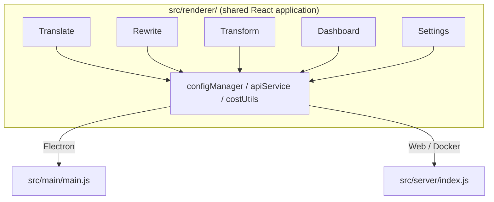

<p align="center">
  
</p>

<h1 align="center">Transrewrt</h1>

<p align="center">
  <a href="https://github.com/wsj-br/transrewrt/releases"></a>
  <a href="LICENSE"></a>
  
  
  
</p>

Текстовый инструмент на базе ИИ: перевод между языками, перефразирование в различных стилях и преобразование с помощью пользовательских запросов — всё через [OpenRouter](https://openrouter.ai). Доступен как классическое приложение (Electron) или самохостируемое веб-приложение (Docker).

- **Перевод** - между десятками языков с автоматическим определением исходного языка.
- **Перефразирование** - исправление грамматики, улучшение чёткости, формальный/неформальный стиль, сокращение, расширение, технический текст.
- **Преобразование** - пользовательские промпты ИИ; создание и управление промптами, опциональный целевой язык для каждого промпта.
- **Модели и стоимость** - выбор любой модели OpenRouter; панель затрат с журналом SQLite, сводки по модели/операции/дню.
- **Интерфейс** - интернационализация (pt-BR, de, fr, es, RTL), темы, шрифты, сочетания клавиш; безопасный веб-режим (API-ключ только на сервере).
- **Классическое приложение** - приложение Electron для Windows и Linux.
- **Самохостинг** - Docker-образ для amd64 и arm64 (готово для Raspberry Pi).

После установки ознакомьтесь с **[Руководством пользователя](../USER-GUIDE.md)** для полного обзора всех возможностей.

<small>**Читать на других языках:** [English (UK)](../README.md) · [Português (BR)](README.pt-BR.md) · [العربية](README.ar.md) · [বাংলা](README.bn.md) · [Català](README.ca.md) · [简体中文](README.zh-CN.md) · [繁體中文](README.zh-TW.md) · [Hrvatski](README.hr.md) · [Čeština](README.cs.md) · [Nederlands](README.nl.md) · [English (US)](README.en-US.md) · [Filipino](README.tl.md) · [Français](README.fr.md) · [Deutsch](README.de.md) · [Ελληνικά](README.el.md) · [हिन्दी](README.hi.md) · [Magyar](README.hu.md) · [Italiano](README.it.md) · [日本語](README.ja.md) · [Basa Jawa](README.jv.md) · [한국어](README.ko.md) · [Bahasa Melayu](README.ms.md) · [فارسی](README.fa.md) · [Polski](README.pl.md) · [Português (PT)](README.pt.md) · [ਪੰਜਾਬੀ](README.pa.md) · [Română](README.ro.md) · [Русский](README.ru.md) · [Slovenčina](README.sk.md) · [Español](README.es.md) · [Kiswahili](README.sw.md) · [Svenska](README.sv.md) · [తెలుగు](README.te.md) · [ภาษาไทย](README.th.md) · [Türkçe](README.tr.md) · [Українська](README.uk.md) · [Tiếng Việt](README.vi.md)</small>

<a id="screenshots"></a>
## Скриншоты

**Селектор языка**


**Перевод**


**Преобразование — редактор промптов**


**Панель управления**


**Настройки — выбор модели**


<br /><br />

<a id="table-of-contents"></a>
## Содержание

<!-- START doctoc generated TOC please keep comment here to allow auto update -->
<!-- DON'T EDIT THIS SECTION, INSTEAD RE-RUN doctoc TO UPDATE -->

- [Быстрый старт](#quick-start)
- [Установка](#installation)
  - [Windows (Electron)](#windows-electron)
  - [Linux (Electron)](#linux-electron)
  - [Docker](#docker)
- [Получение API-ключа OpenRouter](#getting-an-openrouter-api-key)
- [Конфигурация и окружение](#configuration-and-environment)
- [Разработка и архитектура](#development-and-architecture)
- [Релизы и теги](#releases-and-tags)
- [Вклад](#contributing)
- [Отказ от ответственности](#disclaimer)
- [Лицензия](#license)

<!-- END doctoc generated TOC please keep comment here to allow auto update -->

<br /><br />

<a id="quick-start"></a>

## Быстрый старт

**Docker (рекомендуется для самостоятельного хостинга)**

```bash
docker pull ghcr.io/wsj-br/transrewrt:latest

API_KEY=sk-or-your-key docker run -d \
  -p 5000:5000 \
  -v transrewrt-data:/app/data \
  -e API_KEY \
  --name transrewrt-web \
  ghcr.io/wsj-br/transrewrt:latest
```

Замените `sk-or-your-key` на ваш [ключ OpenRouter API](https://openrouter.ai/keys). Откройте [http://localhost:5000](http://localhost:5000) и смените пароль администратора по умолчанию, прежде чем открывать сервис для общего доступа.

<br />

> ℹ️ **ПРИМЕЧАНИЕ**<br/>
> В Docker ключ OpenRouter API задаётся только через переменную окружения `API_KEY` (не через веб-интерфейс). В десктоп-версии (Electron) его вставляют в **Настройки → API**.

<br />

**Windows**

Скачайте последний файл `Transrewrt Setup x.y.z.exe` со страницы [Релизы](https://github.com/wsj-br/transrewrt/releases), запустите установщик, а затем запустите приложение из меню «Пуск» или ярлыка на рабочем столе. Введите ваш ключ OpenRouter API в **Настройки → API**.

<br />

**Linux**

Скачайте `.AppImage` файл со страницы [Релизы](https://github.com/wsj-br/transrewrt/releases), затем:

```bash
chmod +x Transrewrt-x.y.z.AppImage && ./Transrewrt-x.y.z.AppImage
```

Введите ваш ключ OpenRouter API в **Настройки → API**. В Debian/Ubuntu могут потребоваться дополнительные зависимости:

```bash
sudo apt install libgtk-3-0 libnotify-dev libnss3 libxss1 libasound2 libxtst6 xauth
```

Подробности в разделе [Установка → Linux](#linux-electron).

<br />

> ℹ️ **ПРИМЕЧАНИЕ**<br/>
> macOS в настоящее время не поддерживается. Transrewrt доступен для Windows, Linux и Docker.

<br />

После запуска приложения ознакомьтесь с **[Руководством пользователя](../USER-GUIDE.md)**, чтобы узнать, как переводить, перефразировать и преобразовывать текст, управлять промптами и настраивать модели.

<br /><br />

<a id="installation"></a>
## Установка

<a id="windows-electron"></a>
### Windows (Electron)

- Скачайте последний установщик со страницы [Релизы](https://github.com/wsj-br/transrewrt/releases).
- Запустите `.exe` файл и следуйте инструкциям установщика.
- При первом запуске: начните приложение из меню «Пуск» или с ярлыка на рабочем столе. Конфигурация хранится в `%APPDATA%\transrewrt\`.

<br />

<a id="linux-electron"></a>
### Linux (Electron)

- Скачайте `.AppImage` файл со страницы [Релизы](https://github.com/wsj-br/transrewrt/releases).
- Запустите: `chmod +x Transrewrt-x.y.z.AppImage && ./Transrewrt-x.y.z.AppImage`
- Дополнительные зависимости (Debian/Ubuntu): `sudo apt install libgtk-3-0 libnotify-dev libnss3 libxss1 libasound2 libxtst6 xauth`
- См. [dev/DEVELOPMENT.md](../dev/DEVELOPMENT.md) для дополнительной информации.

<br />

<a id="docker"></a>
### Docker

- Загрузка образа: `docker pull ghcr.io/wsj-br/transrewrt:latest`
- Ключ OpenRouter API **должен** быть задан через переменную окружения `API_KEY`. Передавайте его с помощью `-e API_KEY` (или через `docker compose` / `.env`), чтобы ключ не был виден в списке процессов.
- Ключ API невозможно ввести через веб-интерфейс.

Пример - именованный том для сохранения данных (ключ API передаётся через переменную окружения, а не в командной строке):

```bash
API_KEY=sk-or-your-key docker run -d \
  -p 5000:5000 \
  -v transrewrt-data:/app/data \
  -e API_KEY \
  --name transrewrt-web \
  ghcr.io/wsj-br/transrewrt:latest
```

<br />

| Параметр   | Описание                                                                                                   |
| ---------- | ---------------------------------------------------------------------------------------------------------- |
| Порт       | `5000` (сопоставьте с помощью `-p 5000:5000`)                                                              |
| Том        | Подмонтируйте `/app/data` для сохранения конфигурации и базы данных                                         |
| Переменные окружения | `PORT`, `CONFIG_PATH`, `API_KEY`, `API_URL`, `KEY_SEED` - см. [Конфигурация](#configuration-and-environment) |

Чтобы собрать и запустить из исходного кода: `docker compose up --build -d` или `pnpm run docker:up` - см. [dev/DEVELOPMENT.md](../dev/DEVELOPMENT.md).

<br /><br />

<a id="getting-an-openrouter-api-key"></a>
## Получение ключа OpenRouter API

Transrewrt использует [OpenRouter](https://openrouter.ai) для доступа к моделям ИИ. Вам нужен API-ключ для перевода, перефразирования или преобразования текста.

1. Зарегистрируйтесь или войдите на [openrouter.ai](https://openrouter.ai).
2. Откройте страницу [Keys](https://openrouter.ai/keys) и создайте новый ключ (дайте ему имя и при необходимости установите лимит кредитов). Бесплатные модели можно использовать без пополнения счёта.
3. **Десктоп (Electron):** вставьте ключ в **Настройки → API**. **Docker:** задайте переменную окружения `API_KEY` (см. [Быстрый старт](#quick-start)).

Про лимиты, BYOK и другие детали см. в документации [OpenRouter authentication](https://openrouter.ai/docs/api/reference/authentication).

<br /><br />

<a id="configuration-and-environment"></a>

## Конфигурация и окружение

**Расположения файлов конфигурации**

| Развертывание         | Расположение конфигурации                                   |
| ------------------ | --------------------------------------------------------- |
| Electron (Windows) | `%APPDATA%\transrewrt\`                                   |
| Electron (Linux)   | `~/.config/transrewrt/`                                   |
| Web / Docker       | `/app/data/config.json` (используйте том для сохранения) |

<br />

**Переменные окружения** (только для Web/Docker; Electron использует локальный файл конфигурации)

| Переменная      | Значение по умолчанию                        | Описание                                                                   |
| ------------- | -------------------------------------------- | ------------------------------------------------------------------------- |
| `PORT`        | `5000`                                       | Порт прослушивания сервера                                                |
| `CONFIG_PATH` | `/app/data/config.json`                      | Путь к файлу конфигурации                                                 |
| `API_KEY`     | *(пусто)*                                    | Ключ API OpenRouter (обязателен для Docker; задаётся через переменную окружения, не через UI) |
| `API_URL`     | `https://openrouter.ai/api/v1`               | Базовый URL внешнего AI API                                               |
| `KEY_SEED`    | *(пусто)*                                    | Сид прокси-ключа Transrewrt (переопределяет конфиг, если задан)           |

<br />

**Данные и персистентность:** Для Docker смонтируйте том в `/app/data`, чтобы `config.json` и база данных SQLite сохранялись между перезапусками контейнера. Без тома все данные будут потеряны при остановке контейнера.

<br />

**Веб-аутентификация:**

- Админ по умолчанию: `admin` / `transrewrt26`.
- Управление пользователями: **Настройки → Пользователи**.
- Сброс пароля: `docker exec <container> reset-web-password '<username>' '<new-password>'`
  (из исходников: `pnpm run reset-web-password -- <username> <new-password>`)

<br />

> ⚠️ **ПРЕДУПРЕЖДЕНИЕ**<br/>
> Немедленно измените пароль администратора по умолчанию на любом хосте, доступном из сети.

<br />

**Transrewrt прокси (опционально):** Вы можете направлять API-трафик через внешний прокси, использующий временной rolling key. В **Настройки → API**, включите **Использовать Transrewrt Proxy**, задайте **Сид ключа** и установите **URL API** на базовый URL прокси. Подробности см. в [dev/SYSTEM-OVERVIEW.md](../dev/SYSTEM-OVERVIEW.md).

Ключевые настройки (тема, шрифт, модели, языки и т.д.) доступны в диалоге Настройки или могут быть отредактированы напрямую в config JSON. Полный список и значения по умолчанию документации см. в [dev/DEVELOPMENT.md](../dev/DEVELOPMENT.md).

<br /><br />

<a id="development-and-architecture"></a>
## Разработка и архитектура

- **Разработка:** Настройка, сборка, тестирование и развёртывание (Electron, Web, Docker) — см. **[dev/DEVELOPMENT.md](../dev/DEVELOPMENT.md)**.
- **Архитектура и обзор системы:** Структура папок, стек технологий, решения по дизайну, Transrewrt прокси — см. **[dev/SYSTEM-OVERVIEW.md](../dev/SYSTEM-OVERVIEW.md)**.



<br /><br />

<a id="releases-and-tags"></a>
## Релизы и теги

- **Git-теги** `v`* (например, `v1.0.10`) запускают [рабочий процесс релиза](.github/workflows/release.yml). **GitHub Releases** содержат установщик для Windows (`.exe`) и AppImage для Linux.
- **Образы Docker** публикуются в `ghcr.io/wsj-br/transrewrt`. Теги образов соответствуют версии Git (например, `v1.0.10` → `ghcr.io/wsj-br/transrewrt:1.0.10`) плюс `latest`. Multi-arch: `linux/amd64` и `linux/arm64` (например, Raspberry Pi).

<br /><br />

<a id="contributing"></a>
## Вклад

1. Сделайте форк репозитория.
2. Создайте ветку фичи: `git checkout -b feature/my-feature`
3. Зафиксируйте изменения с понятным сообщением.
4. Запушьте и откройте Pull Request в `main`.

Пожалуйста, следуйте существующему стилю кода и тестируйте изменения в обеих режимах (Electron и web) перед отправкой. Инструкции по сборке и тестированию см. в [dev/DEVELOPMENT.md](../dev/DEVELOPMENT.md).

<br />

**Сообщение об ошибках:** Откройте issue на [GitHub](https://github.com/wsj-br/transrewrt/issues). Укажите платформу (Windows / Linux / Docker) и версию приложения (показывается в диалоге «О программе» или на странице Releases).

<br /><br />

<a id="disclaimer"></a>

## Отказ от ответственности

Названия продуктов и иконки принадлежат соответствующим владельцам и используются только для целей идентификации. Данное программное обеспечение не связано с упомянутыми брендами и не одобрено ими.

<br /><br />

<a id="license"></a>
## Лицензия

Авторское право © 2026 Waldemar Scudeller Jr.

[Лицензия Apache 2.0](LICENSE)