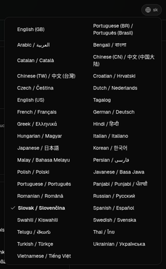
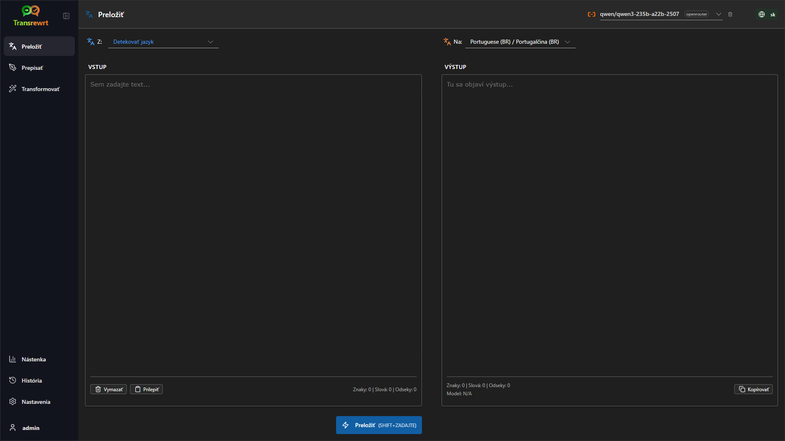
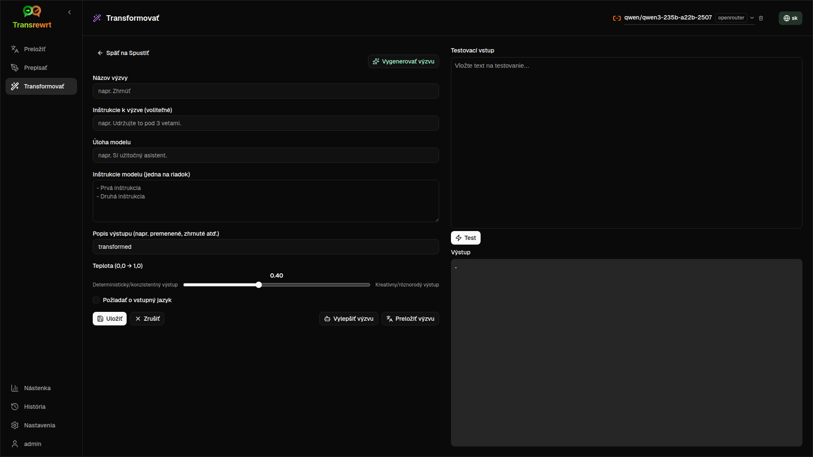
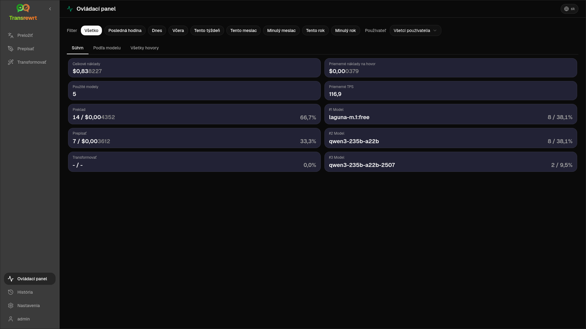
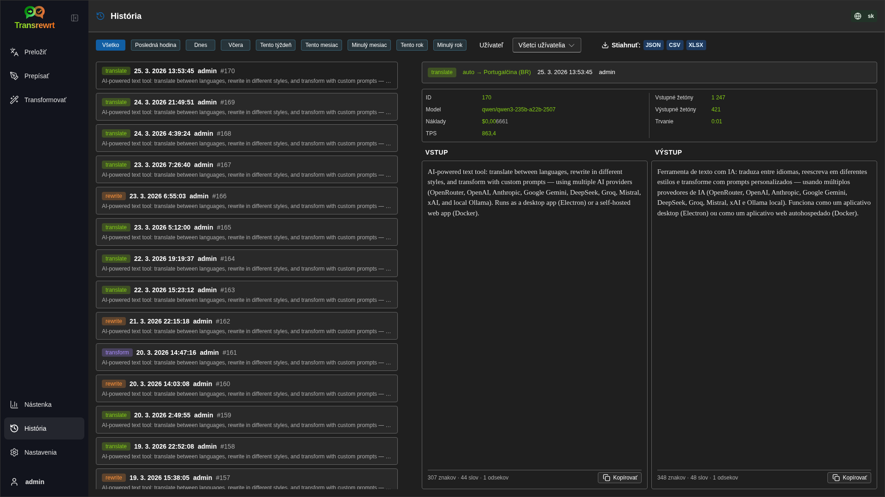
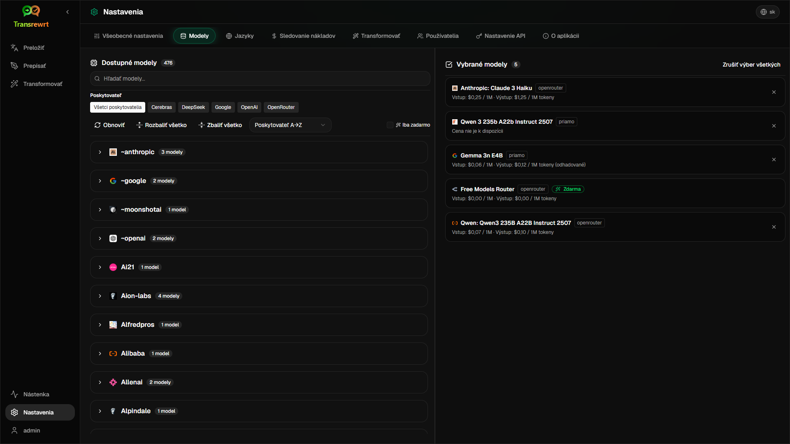

<p align="center">
  
</p>

<p align="center">
  <a href="https://github.com/wsj-br/transrewrt/releases"></a>
  <a href="LICENSE"></a>
  
  
  
</p>

Nástroj na spracovanie textu s využitím umelej inteligencie: preklad medzi jazykmi, prepis v rôznych štýloch a transformácia pomocou vlastných výziev – s využitím viacerých poskytovateľov AI (OpenRouter, OpenAI, Anthropic, Google Gemini, DeepSeek, Groq, Mistral, xAI a lokálny Ollama). Spúšťa sa ako desktopová aplikácia (Electron) alebo ako samostatne hostovaná webová aplikácia (Docker).

- **Preložiť** – medzi desiatkami jazykov s automatickým zistením zdrojového jazyka
- **Prepísať** – opraviť gramatiku, zlepšiť zrozumiteľnosť, formálny/neformálny štýl, skrátiť, rozšíriť, technický obsah
- **Transformovať** – vlastné výzvy pre umelú inteligenciu; vytváranie a správa výziev, voliteľný cieľový jazyk pre každú výzvu
- **História** – kompletná histórija vykonaní vrátane vstupného a výstupného textu, filtrovania a exportu
- **Jednoduchý & Pokročilý** – Jednoduchý režim (predvolené): vybrané zručnosti podľa poskytovateľa (**Zdarma (OpenRouter)**, **Lite**, **Pokročilý**, **Technický**; zobrazia sa len zručnosti s mapovaním pre vybraného poskytovateľa) bez výberu ID modelov; Pokročilý režim: kompletný zoznam modelov od vašich nakonfigurovaných poskytovateľov
- **Modely a náklady** – prístrojové panely pre náklady a využitie (Zhrnutie, Podľa modelu, Všetky volania) s možnosťou exportu; OpenRouter zobrazuje skutočné výdavky, iní poskytovatelia používajú odhady
- **UI** – viacjazyčné rozhranie (viac ako 30 jazykov, podpora RTL), písma, ...
- **Webový režim** – podpora viacerých používateľov s rolami správcu
- **Desktop** - Electron aplikácia pre Windows a Linux
- **Samostatne hostované** - Docker obraz pre amd64 a arm64 (pripravené pre Raspberry Pi)

Po nainštalovaní si pozrite [**Používateľskú príručku**](USER-GUIDE.sk.md) pre podrobný prehľad všetkých funkcií.

<small>**Prečítajte si v iných jazykoch:** </small>
<small id="lang-list">[English (GB)](../README.md) · [Português (Brasil)](./README.pt-BR.md) · [العربية](./README.ar.md) · [বাংলা](./README.bn.md) · [Català](./README.ca.md) · [中文 (中国大陆)](./README.zh-CN.md) · [中文 (台灣)](./README.zh-TW.md) · [Hrvatski](./README.hr.md) · [Čeština](./README.cs.md) · [Nederlands](./README.nl.md) · [English (US)](./README.en-US.md) · [Tagalog](./README.tl.md) · [Français](./README.fr.md) · [Deutsch](./README.de.md) · [Ελληνικά](./README.el.md) · [हिन्दी](./README.hi.md) · [Magyar](./README.hu.md) · [Italiano](./README.it.md) · [日本語](./README.ja.md) · [한국어](./README.ko.md) · [Bahasa Melayu](./README.ms.md) · [فارسی](./README.fa.md) · [Polski](./README.pl.md) · [Basa Jawa](./README.jv.md) · [Português](./README.pt.md) · [ਪੰਜਾਬੀ](./README.pa.md) · [Română](./README.ro.md) · [Русский](./README.ru.md) · [Slovenčina](./README.sk.md) · [Español](./README.es.md) · [Kiswahili](./README.sw.md) · [Svenska](./README.sv.md) · [తెలుగు](./README.te.md) · [ไทย](./README.th.md) · [Türkçe](./README.tr.md) · [Українська](./README.uk.md) · [Tiếng Việt](./README.vi.md)</small>

<small>

> **Poznámka k prekladom rozhrania a dokumentácie:** Všetky jazyky rozhrania okrem pôvodného anglického (VB) 
> boli preložené pomocou modelov umelej inteligencie; preklad môže byť nepresný alebo obsahovať chyby.

</small>

<br/>

<a id="table-of-contents"></a>
## Obsah

<!-- START doctoc generated TOC please keep comment here to allow auto update -->
<!-- DON'T EDIT THIS SECTION, INSTEAD RE-RUN doctoc TO UPDATE -->

- [Snímky obrazovky](#screenshots)
- [Rýchly štart](#quick-start)
- [Získanie kľúča OpenRouter API](#getting-an-openrouter-api-key)
- [Konfigurácia a prostredie](#configuration-and-environment)
- [Vývoj a architektúra](#development-and-architecture)
- [Hlásenie problémov](#reporting-issues)
- [Zrieknutie sa zodpovednosti](#disclaimer)
- [Licencia](#license)

<!-- END doctoc generated TOC please keep comment here to allow auto update -->

<br/><br/>

<a id="screenshots"></a>
## Snímky obrazovky

**Výber jazyka**



**Preložiť**



**Transformovať – editor výziev**



**Nástenka**



**História**



**Nastavenia – výber modelu**



<br/><br/>

<a id="quick-start"></a>
## Rýchly štart

<details>
<summary><b>Docker (odporúčané pre samo-hosting)</b></summary>

<a id="docker"></a>

<br/>

```bash
docker pull ghcr.io/wsj-br/transrewrt:latest

OPENROUTER_API_KEY=sk-or-your-key docker run -d \
  -p 5000:5000 \
  -v transrewrt-data:/app/data \
  -e OPENROUTER_API_KEY \
  --name transrewrt-web \
  ghcr.io/wsj-br/transrewrt:latest
```

Nahraďte `sk-or-your-key` svojím [OpenRouter API kľúčom](https://openrouter.ai/keys) (alebo nastavte kľúče iných poskytovateľov; pozri [Konfigurácia](#configuration-and-environment)). Otvorte [http://localhost:5000](http://localhost:5000) a zmeňte predvolené heslo správcu, než službu zverejníte.

Nastavte aspoň jeden kľúč poskytovateľa prostredníctvom prostredia (napríklad `OPENROUTER_API_KEY` pre OpenRouter). Premenné odovzdajte pomocou `-e` alebo `docker compose` / `.env`, aby sa tajomstvá nezakotvili v image. Kľúče poskytovateľov sa **nezadávajú** v webovom rozhraní; server ich číta z prostredia.

<br/>

> ℹ️ **POZNÁMKA**<br/>
> V Dockeri sa poverenia LLM nastavujú prostredníctvom premenných prostredia ako `OPENROUTER_API_KEY`, `OPENAI_API_KEY`, `CEREBRAS_API_KEY`, … (nie cez webové rozhranie). Na desktopovej verzii (Electron) kľúče konfigurujete v časti **Nastavenia → API**.

<br/>

Alebo použite Docker Compose:

```bash
# download the compose file
wget https://github.com/wsj-br/transrewrt/raw/refs/heads/master/production.yml -O transrewrt.yml
# Edit the file to add your API keys (API_KEYs), or uncomment and adjust the `.env` file. Set the timezone (TZ) if necessary.
vi transrewrt.yml
# start the container
docker compose -f transrewrt.yml up -d
```

Pozrite si [Konfiguráciu](#configuration-and-environment) pre všetky premenné prostredia, ako napríklad `PORT`, `CONFIG_PATH`, `TZ`, a kľúče LLM (`OPENROUTER_API_KEY`, `OPENAI_API_KEY`, …).

</details>

<br/>

<details>
<summary><b>Časové pásmo servera (Docker)</b></summary>

<a id="configuring-the-timezone"></a>

<br/>

Dátum a čas v užívateľskom rozhraní aplikácie nasledujú lokalitu a časové pásmo **prehliadača**. Pre **serverové** správanie (napr. logovanie) kontajner používa premennú prostredia `TZ`. Predvolená hodnota je `TZ=Europe/London`.

Ak chcete použiť iné časové pásmo, nastavte `TZ` vo svojom súbore Compose, napríklad:

```yaml
environment:
  - TZ=America/Sao_Paulo
```

Alebo ju odovzdajte pri spustení kontajnera (Docker):

```bash
--env TZ=America/Sao_Paulo
```

Na mnohých Linuxových systémoch môžete skopírovať názov systémového časového pásma príkazom:

```bash
echo TZ=\"$(</etc/timezone)\"
```

Zoznam platných názvov časových pásiem je udržiavaný v [databáze tz](https://en.wikipedia.org/wiki/List_of_tz_database_time_zones) (Wikipedia).

</details>

<br/>

<details>
<summary><b>Windows</b></summary>

<a id="windows-electron"></a>

<br/>

- Stiahnite najnovšiu verziu `Transrewrt Setup x.y.z.exe` z [Releases](https://github.com/wsj-br/transrewrt/releases).
- Spustite `.exe` a postupujte podľa inštalátora.
- Pri prvom spustení: spustite aplikáciu z ponuky Štart alebo zo zástupcu na ploche.
- Zadajte svoje API kľúče v časti **Nastavenia → API**. Musíte nakonfigurovať aspoň jedného poskytovateľa; OpenRouter je bežný pre modely zadarmo.

<br/>

> ℹ️ **POZNÁMKA**<br/>
> Windows môžu zobraziť jedno z týchto varovaní o bezpečnosti (bežné pre nepodpísané alebo nezávislé aplikácie):
>   - **Kontrola účtu používateľa (UAC)**: „Chcete povoliť tejto aplikácii od neznámeho vydavateľa zmeniť váš počítač?“ → Kliknite na **Áno**.
>   - **Microsoft Defender SmartScreen**: „Windows chránili váš počítač“ → Kliknite na **Ďalšie informácie** → **Aj tak spustiť**.
>
> K tomu dochádza, pretože aplikácia nie je podpísaná spoločnosťou Microsoft ani veľkým vydavateľom – je bezpečná, ak bola stiahnutá z našich oficiálnych vydania na GitHub (overte kontrolné súčty na stránke [Releases](https://github.com/wsj-br/transrewrt/releases) pri každom súbore).

<br/>

</details>

<br/>

<details>
<summary><b>Linux</b></summary>

<a id="linux-electron"></a>

<br/>

Stiahnite si `.AppImage` pre svoj procesor z [Releases](https://github.com/wsj-br/transrewrt/releases) (`x64` pre typické PC, `arm64` pre mnohé zariadenia ARM vrátane Raspberry Pi 4+), potom:

```bash
chmod +x Transrewrt-x.y.z-x64.AppImage && ./Transrewrt-x.y.z-x64.AppImage
```

Na x86_64/amd64 použite názov súboru `x64`; na ARM64 použite názov `...-arm64.AppImage`.

Zadajte svoje API kľúče v **Nastavenia → API**. Musíte nakonfigurovať aspoň jedného poskytovateľa; OpenRouter je bežná voľba pre bezplatné modely.

**Správy v konzole:** Balené verzie pre Linux (`x64` a `arm64` AppImages) potláčajú upozornenia Node o zastaralosti v termináli (napr. pre zabudovaný modul `punycode`). Ak Chromium vypisuje chyby GPU / EGL, napr. „GLES3 je nepodporovaný“, ale aplikácia funguje, môžete ich potlačiť zakázaním hardvérovej akcelerácie:

```bash
TRANSREWRT_DISABLE_GPU=1 ./Transrewrt-x.y.z-arm64.AppImage
```

Toto platí aj pre amd64; zmeňte názov súboru podľa svojho sťahovania.

Na Debiane/Ubuntu môžu byť potrebné dodatočné knižnice **runtime**, ktoré vyžaduje Chromium (tieto sú často už prítomné v kompletných inštaláciách s grafickým rozhraním). Spustite nižšie uvedené príkazy v prípade potreby:

```bash
sudo apt update
sudo apt install -y libfuse2 libgtk-3-0 libnotify4 libnss3 libnspr4 libxss1 libxtst6 xdg-utils \
     xauth libatspi2.0-0 libdrm2 libgbm1 libxcb-dri3-0 libcups2 libasound2t64
```

nahraďte `libasound2t64` za `libasound2` pre `arm64`. Minimálne alebo vlastné inštalácie môžu stále zlyhať kvôli chýbajúcemu súboru `.so`. Nainštalujte balík uvedený v chybovej správe (časté doplnky: `libatk1.0-0`, `libatk-bridge2.0-0`, `libgbm1`, `libdrm2`). V niektorých prostrediach môžete musieť spustiť aplikáciu pomocou `APPIMAGE_EXTRACT_AND_RUN=1 ./Transrewrt-….AppImage`.

<br/>

> ℹ️ **Poznámka**<br/>
> macOS nie je momentálne podporovaný. Transrewrt je dostupný pre Windows, Linux a Docker.

</details>

<br/>

Keď je aplikácia spustená, pozrite si [**Používateľskú príručku**](USER-GUIDE.sk.md), kde sa dozviete, ako prekladať, prepisovať a transformovať text, spravovať výzvy a konfigurovať modely.

<br/><br/>

<a id="getting-an-openrouter-api-key"></a>
## Získanie API kľúča od OpenRouter

Transrewrt podporuje viacerých poskytovateľov umelého inteligencie. [OpenRouter](https://openrouter.ai) je obľúbenou voľbou, pretože agreguje mnoho modelov pod jedným kľúčom a ponúka bezplatné modely.

1. Zaregistrujte sa alebo sa prihláste na [openrouter.ai](https://openrouter.ai).
2. Otvorte stránku [Keys](https://openrouter.ai/keys) a vytvorte nový kľúč (pomenujte ho a voliteľne nastavte limit kreditu). Môžete používať bezplatné modely bez pridania kreditu.
3. **Desktop (Electron):** vložte kľúče do **Nastavenia → API**. **Docker:** nastavte premenné prostredia ako `OPENROUTER_API_KEY` (pozri [Rýchly štart](#quick-start)).

Nepoužívajte model **Body Builder** od OpenRouter ([`openrouter/bodybuilder`](https://openrouter.ai/openrouter/bodybuilder)) na preklad, prepisovanie alebo transformáciu: vracia JSON dátové balíky, nie hotový text pre tieto úlohy. Pozrite si [Nastavenia → Modely](USER-GUIDE.sk.md#models) v Používateľskej príručke.

Môžete tiež použiť iných poskytovateľov (OpenAI, Anthropic, Google Gemini, DeepSeek, Groq, Mistral, xAI, Cerebras) alebo spustiť modely lokálne pomocou [Ollama](https://ollama.com). Pozrite si [Konfigurácia](#configuration-and-environment) pre kompletný zoznam podporovaných poskytovateľov a premenných prostredia.

</br>

> ⚠️ **VAROVANIE**<br/>
> Ak používate Ollama z iného zariadenia, kontajnera alebo služby, nezabudnite nakonfigurovať Ollama tak, aby umožnilo externé pripojenia (nie iba localhost).

<br/><br/>

<a id="configuration-and-environment"></a>
## Konfigurácia a prostredie

</br>

**Umiestnenie konfiguračného súboru**

| Nasadenie         | Umiestnenie konfigurácie                                   |
| ------------------ | ------------------------------------------------- |
| Electron (Windows) | `%APPDATA%\transrewrt\`                           |
| Electron (Linux)   | `~/.config/transrewrt/`                           |
| Web / Docker       | `/app/data/config.json` (použite zväzok na uchovanie údajov) |

<br/>

**Premenné prostredia** (iba web/Docker; Electron používa lokálny konfiguračný súbor)

| Premenná             | Popis                                                                  |
|----------------------|------------------------------------------------------------------------------|
| `PORT`               | Port, na ktorom počúva server (predvolené `5000`)                                  |
| `CONFIG_PATH`        | Cesta k súboru s konfiguráciou (predvolene `/app/data/config.json`)                |
| `TZ`                 | časové pásmo pre čas na strane servera (zaznamenávanie, atď.) (predvolené `Europe/London`) |
| `HISTORY_DISABLED`   | Vynúti vypnutie histórie vykonávania (voliteľné, predvolené je `false`)                  |
| `OPENROUTER_API_KEY` | Kľúč OpenRouter API                                                           |
| `OPENAI_API_KEY`     | Kľúč OpenAI API                                                               |
| `CEREBRAS_API_KEY`   | Kľúč Cerebras API                                                             |
| `ANTHROPIC_API_KEY`  | Kľúč Anthropic API                                                            |
| `GOOGLE_API_KEY`     | Kľúč Google Gemini API                                                        |
| `DEEPSEEK_API_KEY`   | Kľúč DeepSeek API                                                             |
| `GROQ_API_KEY`       | Kľúč Groq API                                                                 |
| `MISTRAL_API_KEY`    | Kľúč Mistral API                                                              |
| `OLLAMA_URL`         | Základná URL Ollama (napr. `http://host.docker.internal:11434`)                   |
| `XAI_API_KEY`        | kľúč xAI API                                                                  |

**Režim súkromia:** Ak chcete vynútiť vypnutie sledovania histórie bez ohľadu na `config.json` alebo preferencie používateľa, nastavte `HISTORY_DISABLED` na `true` alebo `1` (bez rozlišovania veľkosti písmen) pre **webový/Docker serverový proces** a/alebo **hlavný proces desktopovej aplikácie Electron** (napr. systémové alebo spúšťacie prostredie – nie len vykresľovací proces). Toto zakazuje ukladanie histórie vstupov/výstupov, uzamkne **Nastavenia → Všeobecné nastavenia → História** a blokuje API súvisiace s Históriou.

Nakonfigurujte len poskytovateľov, ktorých používate. Identifikátory modelov sú menovane (`openrouter/…`, `openai/…`, `cerebras/…`, `ollama/…`, atď.).

**Zobrazenie nákladov:** OpenRouter vráti presnú fakturovanú sumu, ak je to možné. Ostatní poskytovatelia používajú **odhadované** náklady z verejného cenníka modelov OpenRouter, ak je k dispozícii kľúč OpenRouter; bez neho sa náklady pre poskytovateľov mimo OpenRouter môžu zobrazovať ako `0`. Odhady nie sú faktúrami.

<br/>

**Údaje a trvalosť:** Pre Docker pripojte zväzok do `/app/data`, aby sa `config.json` a databáza SQLite uchovávali aj po reštarte kontajnera. Bez zväzku sa všetky údaje stratia po zastavení kontajnera.

<br/>

**Webové prihlasovanie:**

- Predvolený správca: `admin` / `transrewrt26`.
- Správa používateľov v **Nastavenia → Používatelia**.
- Obnovenie hesla: `docker exec <container> reset-web-password '<username>' '<new-password>'`

<br/>

> ⚠️ **UPOZORNENIE**<br/>
> Okamžite zmeňte predvolené heslo správcu na akejkoľvek sieti prístupnej hostiteľskej službe.

<br/>

Nastavenia kľúčových parametrov (písmo, modely, jazyky atď.) sú k dispozícii v nastaveniach aplikácie.

<br/><br/>

<a id="development-and-architecture"></a>
## Vývoj a architektúra

- **Vývoj:** Nastavenie, zostavenie, testovanie a nasadenie (Electron, Web, Docker) – pozri [dev/DEVELOPMENT.md](../dev/DEVELOPMENT.md).
- **Architektúra a prehľad systému:** Štruktúra priečinkov, technologický zásobník, návrhové rozhodnutia – pozri [dev/SYSTEM-OVERVIEW.md](../dev/SYSTEM-OVERVIEW.md).

<br/><br/>

<a id="reporting-issues"></a>
## Hlásenie problémov

Otvorte problém na [GitHub](https://github.com/wsj-br/transrewrt/issues). Uveďte svoju platformu (Windows / Linux / Docker) a verziu aplikácie (zobrazenú v dialógu O aplikácii alebo na stránke Releases).

<br/><br/>

<a id="disclaimer"></a>
## Zrieknutie sa zodpovednosti

Názvy produktov a ikony patria ich príslušným vlastníkom a používajú sa výlučne na identifikačné účely. Tento softvér nie je spojený ani odporúčaný žiadnou z uvedených značiek.

<br/><br/>

<a id="license"></a>
## Licencia

Autorské práva © 2026 Waldemar Scudeller Jr.

[Apache License 2.0](../LICENSE)
