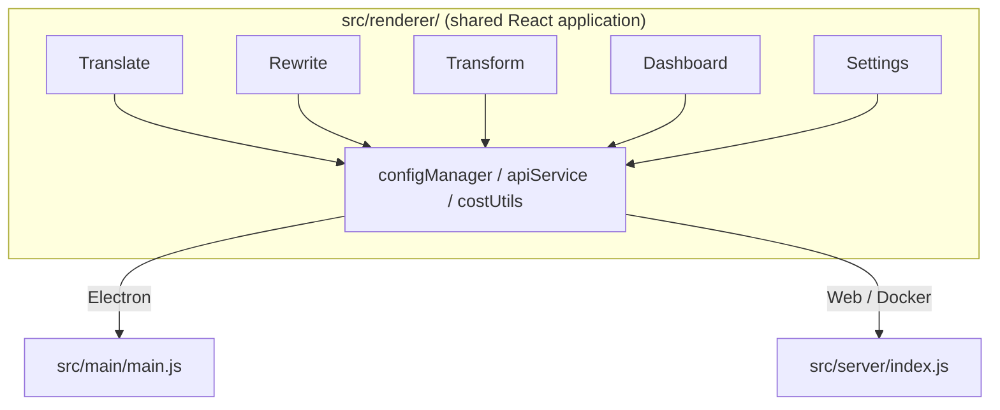

<p align="center">
  
</p>

<h1 align="center">Transrewrt</h1>

<p align="center">
  <a href="https://github.com/wsj-br/transrewrt/releases"></a>
  <a href="LICENSE"></a>
  
  
  
</p>

AI-pohánuť textový nástroj: prekladajte medzi jazykmi, prepisujte v rôznych štýloch a transformujte s vlastnými pokynmi – všetko cez [OpenRouter](https://openrouter.ai). Beží ako desktopová aplikácia (Electron) alebo samostatne hosťovaná webová aplikácia (Docker).

- **Preklad** – medzi desiatkami jazykov, s automatickým rozpoznaním zdrojového jazyka
- **Prepísanie** – oprava gramatiky, zlepšenie srozumiteľnosti, formálne/neformálne, skrátenie, rozšírenie, technické
- **Transformácia** – vlastné AI pokyny; vytváranie a správa pokynov, voliteľný cieľový jazyk na pokyn
- **Modely & náklady** – výber akéhokoľvek OpenRouter modelu; nákladový dashboard s SQLite protokolom, súhrny podľa modelu/operácie/dňa
- **UI** – i18n (pt-BR, de, fr, es, RTL), témy, fonts, klávesové skratky; bezpečný webový režim (API kľúč iba na serveri)
- **Desktop** – Electron aplikácia pre Windows a Linux
- **Samostatné hostovanie** – Docker image pre amd64 & arm64 (pripravené pre Raspberry Pi)

Po inštalácii si prečítajte **[Príručku používateľa](../USER-GUIDE.md)** pre úplný prehľad všetkých funkcií.

<small>**Čítať v iných jazykoch:** [English (UK)](../README.md) · [Português (BR)](README.pt-BR.md) · [العربية](README.ar.md) · [বাংলা](README.bn.md) · [Català](README.ca.md) · [简体中文](README.zh-CN.md) · [繁體中文](README.zh-TW.md) · [Hrvatski](README.hr.md) · [Čeština](README.cs.md) · [Nederlands](README.nl.md) · [English (US)](README.en-US.md) · [Filipino](README.tl.md) · [Français](README.fr.md) · [Deutsch](README.de.md) · [Ελληνικά](README.el.md) · [हिन्दी](README.hi.md) · [Magyar](README.hu.md) · [Italiano](README.it.md) · [日本語](README.ja.md) · [Basa Jawa](README.jv.md) · [한국어](README.ko.md) · [Bahasa Melayu](README.ms.md) · [فارسی](README.fa.md) · [Polski](README.pl.md) · [Português (PT)](README.pt.md) · [ਪੰਜਾਬੀ](README.pa.md) · [Română](README.ro.md) · [Русский](README.ru.md) · [Slovenčina](README.sk.md) · [Español](README.es.md) · [Kiswahili](README.sw.md) · [Svenska](README.sv.md) · [తెలుగు](README.te.md) · [ภาษาไทย](README.th.md) · [Türkçe](README.tr.md) · [Українська](README.uk.md) · [Tiếng Việt](README.vi.md)</small>

<a id="screenshots"></a>
## Snímky obrazovky

**Výber jazyka**


**Preklad**


**Transformácia - editor pokynov**


**Dashboard**


**Nastavenia - výber modelu**


<br /><br />

<a id="table-of-contents"></a>
## Obsah

<!-- START doctoc generated TOC please keep comment here to allow auto update -->
<!-- DON'T EDIT THIS SECTION, INSTEAD RE-RUN doctoc TO UPDATE -->

- [Rýchly štart](#quick-start)
- [Inštalácia](#installation)
  - [Windows (Electron)](#windows-electron)
  - [Linux (Electron)](#linux-electron)
  - [Docker](#docker)
- [Získanie OpenRouter API kľúča](#getting-an-openrouter-api-key)
- [Konfigurácia a prostredie](#configuration-and-environment)
- [Vývoj a architektúra](#development-and-architecture)
- [Vydania a značky](#releases-and-tags)
- [Prispievanie](#contributing)
- [Vylúčenie zodpovednosti](#disclaimer)
- [Licencia](#license)

<!-- END doctoc generated TOC please keep comment here to allow auto update -->

<br /><br />

<a id="quick-start"></a>

## Rýchly start

**Docker (odporúčané pre vlastné hostovanie)**

```bash
docker pull ghcr.io/wsj-br/transrewrt:latest

API_KEY=sk-or-your-key docker run -d \
  -p 5000:5000 \
  -v transrewrt-data:/app/data \
  -e API_KEY \
  --name transrewrt-web \
  ghcr.io/wsj-br/transrewrt:latest
```

Nahraďte `sk-or-your-key` svojím [OpenRouter API kľúčom](https://openrouter.ai/keys). Otvorte [http://localhost:5000](http://localhost:5000) a pred odObjavením služby zmeňte predvolené heslo administrátora.

<br />

> ℹ️ **POZNÁMKA**<br/>
> V Dockeri je OpenRouter API kľúč nastavený iba prostredníctvom premennej prostredia `API_KEY` (nie vo webovom UI). V desktopovej verzii (Electron) ho vložíte v **Nastavenia → API**.

<br />

**Windows**

Stiahnite najnovší `Transrewrt Setup x.y.z.exe` zo [Stránky s vydaniami](https://github.com/wsj-br/transrewrt/releases), spustite inštalátor a potom spustite aplikáciu z ponuky Štart alebo zálažky na pracovnej ploche. Vložte svoj OpenRouter API kľúč v **Nastavenia → API**.

<br />

**Linux**

Stiahnite `.AppImage` súbor zo [Stránok s vydaním](https://github.com/wsj-br/transrewrt/releases), potom:

```bash
chmod +x Transrewrt-x.y.z.AppImage && ./Transrewrt-x.y.z.AppImage
```

Vložte svoj OpenRouter API kľúč v **Nastavenia → API**. Na Debian/Ubuntu možno bude potrebné najprv nainštalovať dodatočné závislosti:

```bash
sudo apt install libgtk-3-0 libnotify-dev libnss3 libxss1 libasound2 libxtst6 xauth
```

Podrobnosti nájdete v časti [Inštalácia → Linux](#linux-electron).

<br />

> ℹ️ **POZNÁMKA**<br/>
> macOS nie je aktuálne podporovaný. Transrewrt je dostupný pre Windows, Linux a Docker.

<br />
Keď je aplikácia spustená, pozrite sa do **[Sprievodcu používateľa](../USER-GUIDE.md)**, aby ste sa naučili prekladáť, prepisovať a transformovať text, spravovať výzvy a konfigurovať modely.

<br /><br />

<a id="installation"></a>
## Inštalácia

<a id="windows-electron"></a>
### Windows (Electron)

- Stiahnite najnovší inštalátor zo [Stránok s vydaním](https://github.com/wsj-br/transrewrt/releases).
- Spustite `.exe` súbor a postupujte podľa inštalátora.
- Prvé spustenie: spustite aplikáciu z ponuky Štart alebo zálažky na pracovnej ploche. Konfigurácia je uložená v `%APPDATA%\transrewrt\`.

<br />

<a id="linux-electron"></a>
### Linux (Electron)

- Stiahnite `.AppImage` súbor zo [Stránok s vydaním](https://github.com/wsj-br/transrewrt/releases).
- Spustite: `chmod +x Transrewrt-x.y.z.AppImage && ./Transrewrt-x.y.z.AppImage`
- Dodatočné závislosti (Debian/Ubuntu): `sudo apt install libgtk-3-0 libnotify-dev libnss3 libxss1 libasound2 libxtst6 xauth`
- Viac pozri v [dev/DEVELOPMENT.md](../dev/DEVELOPMENT.md).

<br />

<a id="docker"></a>
### Docker

- Stiahnite: `docker pull ghcr.io/wsj-br/transrewrt:latest`
- OpenRouter API kľúč **musí** byť nastavený prostredníctvom premennej prostredia `API_KEY`. Preto ho predajte s `-e API_KEY` (alebo prostredníctvom `docker compose` / `.env`), aby kľúč nebol viditeľný v zozname procesov.
- API kľúč sa nedá zadať vo webovom UI.

Príklad - pomenovaný zväzok na udržiavanie (API kľúč predaný prostredníctvom env, nie v príkazovom riadku):

```bash
API_KEY=sk-or-your-key docker run -d \
  -p 5000:5000 \
  -v transrewrt-data:/app/data \
  -e API_KEY \
  --name transrewrt-web \
  ghcr.io/wsj-br/transrewrt:latest
```

<br />

| Voľba   | Popis                                                                                                   |
| -------- | ------------------------------------------------------------------------------------------------------- |
| Port     | `5000` (mapujte s `-p 5000:5000`)                                                                      |
| Zväzok   | Pripojte `/app/data` pre konfiguráciu a udržiavanie databázy                                          |
| Premenné prostredia | `PORT`, `CONFIG_PATH`, `API_KEY`, `API_URL`, `KEY_SEED` - pozri [Konfigurácia](#configuration-and-environment) |

Na zostavenie a spustenie zo zdrojového kódu: `docker compose up --build -d` alebo `pnpm run docker:up` - pozri [dev/DEVELOPMENT.md](../dev/DEVELOPMENT.md).

<br /><br />

<a id="getting-an-openrouter-api-key"></a>
## Získanie OpenRouter API kľúča

Transrewrt používa [OpenRouter](https://openrouter.ai) pre AI modely. Na preklad, prepis alebo transformáciu textu potrebujete API kľúč.

1. Zaregistrujte sa alebo sa prihláste na [openrouter.ai](https://openrouter.ai).
2. Otvorte stránku [Kľúče](https://openrouter.ai/keys) a vytvorte nový kľúč (pomenujte ho a voliteľne nastavte limit kreditu). Môžete používať bezplatné modely bez pridania kreditu.
3. **Desktop (Electron):** vložte kľúč v **Nastavenia → API**. **Docker:** nastavte premennú prostredia `API_KEY` (pozri [Rýchly start](#quick-start)).

Ohraničenia, BYOK a ďalšie informácie nájdete v [OpenRouter autentifikácii](https://openrouter.ai/docs/api/reference/authentication).

<br /><br />

<a id="configuration-and-environment"></a>

## Konfigurácia a prostredie

**Umiestnenie konfiguračných súborov**

| Deployment         | Config location                                   |
| ------------------ | ------------------------------------------------- |
| Electron (Windows) | `%APPDATA%\transrewrt\`                           |
| Electron (Linux)   | `~/.config/transrewrt/`                           |
| Web / Docker       | `/app/data/config.json` (použite volume na trvalé uchovávanie) |

<br />

**Premenné prostredia** (iba web/Docker; Electron používa lokálny konfiguračný súbor)

| Variable      | Default                        | Description                                                   |
| ------------- | ------------------------------ | ------------------------------------------------------------- |
| `PORT`        | `5000`                         | Port servera na počúvanie                                         |
| `CONFIG_PATH` | `/app/data/config.json`        | Cesta k konfiguračnému súboru                                       |
| `API_KEY`     | *(empty)*                      | API kľúč OpenRouter (vyžadovaný pre Docker; nastavuje sa cez env, nie UI) |
| `API_URL`     | `https://openrouter.ai/api/v1` | Základná URL adresa upstream AI API                                      |
| `KEY_SEED`    | *(empty)*                      | Počiatočný kľúč proxy Transrewrt (ak je nastavený, prepíše konfiguráciu)           |

<br />

**Dáta a trvalé uloženie:** Pre Docker pripojte volume na `/app/data`, aby `config.json` a SQLite databáza zostali zachované po reštartoch kontajnera. Bez volume sa všetky dáta strata po zastavení kontajnera.

<br />

**Webové overenie:**

- Predvolený administrátor: `admin` / `transrewrt26`.
- Správu užívateľov nájdete v **Nastavenia → Užívatelia**.
- Resetovať heslo: `docker exec <container> reset-web-password '<username>' '<new-password>'`
  (zo zdroja: `pnpm run reset-web-password -- <username> <new-password>`)

<br />

> ⚠️ **UPOZORNENIE**<br/>
> Okamžite zmeňte predvolené heslo administrátora na každom hostiteľovi prístupnom cez sieť.

<br />

**Transrewrt proxy (voliteľné):** Môžete smerovať API komunikáciu cez externý proxy, ktorý používa časovo založený rotujúci kľúč. V **Nastavenia → API**, povoľte **Použiť Transrewrt Proxy**, nastavte **Počiatočný kľúč** a nastavte **API URL** na základnú URL proxy. Podrobnosti nájdete v [dev/SYSTEM-OVERVIEW.md](../dev/SYSTEM-OVERVIEW.md).

Kľúčové nastavenia (téma, písmo, modely, jazyky, atď.) sú dostupné v dialógu Nastavenia alebo ich môžete upraviť priamo v konfiguračnom JSON. Úplný zoznam a predvolené hodnoty sú zdokumentované v [dev/DEVELOPMENT.md](../dev/DEVELOPMENT.md).

<br /><br />

<a id="development-and-architecture"></a>
## Vývoj a architektúra

- **Vývoj:** Inštalácia, zostavenie, testovanie a nasadenie (Electron, Web, Docker) – pozri **[dev/DEVELOPMENT.md](../dev/DEVELOPMENT.md)**.
- **Architektúra a prehľad systému:** Štruktúra priečinkov, technologický stack, rozhodnutia o dizajne, Transrewrt proxy – pozri **[dev/SYSTEM-OVERVIEW.md](../dev/SYSTEM-OVERVIEW.md)**.



<br /><br />

<a id="releases-and-tags"></a>
## Vydania a značky

- **Git tags** `v`* (napr. `v1.0.10`) spustia [release workflow](.github/workflows/release.yml). **GitHub Releases** pripoja Windows inštalátor (`.exe`) a Linux AppImage.
- **Docker obrazy** sú publikované na `ghcr.io/wsj-br/transrewrt`. Tagy obrazov zodpovedajú Git verzii (napr. `v1.0.10` → `ghcr.io/wsj-br/transrewrt:1.0.10`) a `latest`. Multi-arch: `linux/amd64` a `linux/arm64` (napr. Raspberry Pi).

<br /><br />

<a id="contributing"></a>
## Prispievanie

1. Vytvorte si fork repozitára.
2. Vytvorte feature vetvu: `git checkout -b feature/my-feature`
3. Potvrďte vaše zmeny s jasným správaním.
4. Odošlite a otvorte Pull Request proti `main`.

Dodržiavajte existujúci štýl kódu a otestujte vaše zmeny v oboch režimoch Electron a web pred odoslaním. Inštrukcie o zostavení a testovaní nájdete v [dev/DEVELOPMENT.md](../dev/DEVELOPMENT.md).

<br />

**Hlásenie problémov:** Otvorte issue na [GitHub](https://github.com/wsj-br/transrewrt/issues). Uvedite vašu platformu (Windows / Linux / Docker) a verziu aplikácie (zobrazenú v dialógu O aplikácii alebo na stránke Releases).

<br /><br />

<a id="disclaimer"></a>

## Právne upozornenie

Názvy produktov a ikony patria ich príslušným vlastníkom a sú použité len na účely identifikácie. Tento softvér nie je asociovaný s ani podporovaný žiadnym z uvedených značiek.

<br /><br />

<a id="license"></a>
## Licencia

Autorské právo © 2026 Waldemar Scudeller Jr.

[Apache License 2.0](LICENSE)