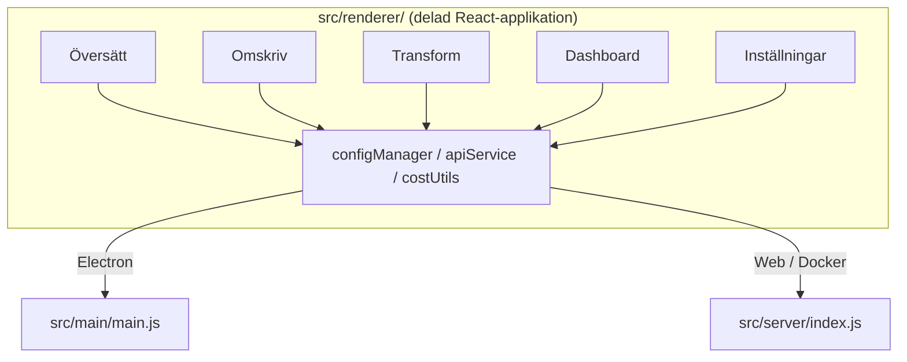

<p align="center">
  
</p>

<h1 align="center">Transrewrt</h1>

<p align="center">
  <a href="https://github.com/wsj-br/transrewrt/releases"></a>
  <a href="LICENSE"></a>
  
  
  
</p>

AI-drivet textverktyg: översätt mellan språk, omskriv i olika stilar och transformera med anpassade prompter – allt via [OpenRouter](https://openrouter.ai). Körs som en skrivbordsapp (Electron) eller en självhostad webbapp (Docker).

- **Översätt** - mellan dussintals språk, med automatisk källidentifiering
- **Omskriv** - rätta grammatiken, förbättra tydligheten, formellt/informellt, förkorta, utöka, tekniskt
- **Transformera** - anpassade AI-prompter; skapa och hantera prompter, valfritt målspråk per prompt
- **Modeller & kostnad** - välj valfri OpenRouter-modell; kostnadspanel med SQLite-log, sammanfattningar per modell/operation/dag
- **UI** - i18n (pt-BR, de, fr, es, RTL), teman, teckensnitt, tangentbordsgenvägar; säkert webbläge (API-nyckel endast på server)
- **Skrivbord** - Electron-app för Windows och Linux
- **Självhostad** - Docker-avbild för amd64 & arm64 (Raspberry Pi-klar)

När det är installerat, se **[Användarguide](../USER-GUIDE.md)** för en fullständig genomgång av alla funktioner.

<small>**Läs på andra språk:** [English (UK)](../README.md) · [Português (BR)](README.pt-BR.md) · [العربية](README.ar.md) · [বাংলা](README.bn.md) · [Català](README.ca.md) · [简体中文](README.zh-CN.md) · [繁體中文](README.zh-TW.md) · [Hrvatski](README.hr.md) · [Čeština](README.cs.md) · [Nederlands](README.nl.md) · [English (US)](README.en-US.md) · [Filipino](README.tl.md) · [Français](README.fr.md) · [Deutsch](README.de.md) · [Ελληνικά](README.el.md) · [हिन्दी](README.hi.md) · [Magyar](README.hu.md) · [Italiano](README.it.md) · [日本語](README.ja.md) · [Basa Jawa](README.jv.md) · [한국어](README.ko.md) · [Bahasa Melayu](README.ms.md) · [فارسی](README.fa.md) · [Polski](README.pl.md) · [Português (PT)](README.pt.md) · [ਪੰਜਾਬੀ](README.pa.md) · [Română](README.ro.md) · [Русский](README.ru.md) · [Slovenčina](README.sk.md) · [Español](README.es.md) · [Kiswahili](README.sw.md) · [Svenska](README.sv.md) · [తెలుగు](README.te.md) · [ภาษาไทย](README.th.md) · [Türkçe](README.tr.md) · [Українська](README.uk.md) · [Tiếng Việt](README.vi.md)</small>

<a id="screenshots"></a>
## Skärmbilder

**Språkval**


**Översätt**


**Transformera - promptredigerare**


**Instrumentpanel**


**Inställningar - modellval**


<br /><br />

<a id="table-of-contents"></a>
## Innehållsförteckning

<!-- START doctoc generated TOC please keep comment here to allow auto update -->
<!-- DON'T EDIT THIS SECTION, INSTEAD RE-RUN doctoc TO UPDATE -->

- [Snabbstart](#quick-start)
- [Installation](#installation)
  - [Windows (Electron)](#windows-electron)
  - [Linux (Electron)](#linux-electron)
  - [Docker](#docker)
- [Skaffa en OpenRouter API-nyckel](#getting-an-openrouter-api-key)
- [Konfiguration och miljö](#configuration-and-environment)
- [Utveckling och arkitektur](#development-and-architecture)
- [Utgåvor och taggar](#releases-and-tags)
- [Bidra](#contributing)
- [Ansvarfriskrivning](#disclaimer)
- [Licens](#license)

<!-- END doctoc generated TOC please keep comment here to allow auto update -->

<br /><br />

<a id="quick-start"></a>

## Snabbstart

**Docker (rekommenderas för självhostning)**

```bash
docker pull ghcr.io/wsj-br/transrewrt:latest

API_KEY=sk-or-your-key docker run -d \
  -p 5000:5000 \
  -v transrewrt-data:/app/data \
  -e API_KEY \
  --name transrewrt-web \
  ghcr.io/wsj-br/transrewrt:latest
```

Ersätt `sk-or-your-key` med din [OpenRouter API-nyckel](https://openrouter.ai/keys). Öppna [http://localhost:5000](http://localhost:5000) och ändra standardadministratörens lösenord innan du exponerar tjänsten.

<br />

> ℹ️ **NOTERING**<br/>
> I Docker ställs OpenRouter API-nyckeln in endast via miljövariabeln `API_KEY` (inte i webbgränssnittet). På datorn (Electron) klistrar du in den under **Inställningar → API**.

<br />

**Windows**

Ladda ner den senaste `Transrewrt Setup x.y.z.exe` från [Releases](https://github.com/wsj-br/transrewrt/releases), kör installationsprogrammet och starta sedan från Start-menyn eller skrivbordsgenväg. Ange din OpenRouter API-nyckel under **Inställningar → API**.

<br />

**Linux**

Ladda ner `.AppImage`-filen från [Releases](https://github.com/wsj-br/transrewrt/releases) och kör sedan:

```bash
chmod +x Transrewrt-x.y.z.AppImage && ./Transrewrt-x.y.z.AppImage
```

Ange din OpenRouter API-nyckel under **Inställningar → API**. På Debian/Ubuntu kan du behöva installera ytterligare beroenden först:

```bash
sudo apt install libgtk-3-0 libnotify-dev libnss3 libxss1 libasound2 libxtst6 xauth
```

Se [Installation → Linux](#linux-electron) för detaljer.

<br />

> ℹ️ **NOTERING**<br/>
> macOS stöds för närvarande inte. Transrewrt är tillgänglig för Windows, Linux och Docker.

<br />

När appen är igång, se **[Användarguide](../USER-GUIDE.md)** för att lära dig hur du översätter, omskriver och transformerar text, hanterar prompts och konfigurerar modeller.

<br /><br />

<a id="installation"></a>
## Installation

<a id="windows-electron"></a>
### Windows (Electron)

- Ladda ner den senaste installationsprogrammet från [Releases](https://github.com/wsj-br/transrewrt/releases).
- Kör `.exe`-filen och följ installationsguiden.
- Första körningen: starta appen från Start-menyn eller skrivbordsgenväg. Konfigurationen lagras i `%APPDATA%\transrewrt\`.

<br />

<a id="linux-electron"></a>
### Linux (Electron)

- Ladda ner `.AppImage`-filen från [Releases](https://github.com/wsj-br/transrewrt/releases).
- Kör: `chmod +x Transrewrt-x.y.z.AppImage && ./Transrewrt-x.y.z.AppImage`
- Ytterligare beroenden (Debian/Ubuntu): `sudo apt install libgtk-3-0 libnotify-dev libnss3 libxss1 libasound2 libxtst6 xauth`
- Se [dev/DEVELOPMENT.md](../dev/DEVELOPMENT.md) för mer information.

<br />

<a id="docker"></a>
### Docker

- Hämta: `docker pull ghcr.io/wsj-br/transrewrt:latest`
- OpenRouter API-nyckel **måste** anges via miljövariabeln `API_KEY`. Skicka den med `-e API_KEY` (eller via `docker compose` / `.env`) så att nyckeln inte är synlig i processlistan.
- API-nyckeln kan inte anges i webbgränssnittet.

Exempel - namngiven volym för persistens (API-nyckel skickas via miljö, inte på kommandoraden):

```bash
API_KEY=sk-or-your-key docker run -d \
  -p 5000:5000 \
  -v transrewrt-data:/app/data \
  -e API_KEY \
  --name transrewrt-web \
  ghcr.io/wsj-br/transrewrt:latest
```

<br />

| Alternativ   | Beskrivning                                                                                                   |
| ------------ | ------------------------------------------------------------------------------------------------------------- |
| Port         | `5000` (kartlägg med `-p 5000:5000`)                                                                          |
| Volym        | Montera `/app/data` för konfiguration och databaspersistens                                                  |
| Miljövariabler | `PORT`, `CONFIG_PATH`, `API_KEY`, `API_URL`, `KEY_SEED` - se [Konfiguration](#configuration-and-environment) |

Att bygga och köra från källkod: `docker compose up --build -d` eller `pnpm run docker:up` - se [dev/DEVELOPMENT.md](../dev/DEVELOPMENT.md).

<br /><br />

<a id="getting-an-openrouter-api-key"></a>
## Skaffa en OpenRouter API-nyckel

Transrewrt använder [OpenRouter](https://openrouter.ai) för AI-modeller. Du behöver en API-nyckel för att översätta, omskriva eller transformera text.

1. Registrera dig eller logga in på [openrouter.ai](https://openrouter.ai).
2. Öppna sidan [Nycklar](https://openrouter.ai/keys) och skapa en ny nyckel (ge den ett namn och ange eventuellt ett kreditgräns). Du kan använda gratis-modeller utan att lägga till kredit.
3. **Desktop (Electron):** klistra in nyckeln under **Inställningar → API**. **Docker:** ställ in miljövariabeln `API_KEY` (se [Snabbstart](#quick-start)).

För gränser, BYOK och mer, se [OpenRouter-autentisering](https://openrouter.ai/docs/api/reference/authentication).

<br /><br />

<a id="configuration-and-environment"></a>

## Konfiguration och miljö

**Konfigurationsfiler**

| Distribution       | Konfigurationsplats                            |
| ------------------ | ---------------------------------------------- |
| Electron (Windows) | `%APPDATA%\transrewrt\`                        |
| Electron (Linux)   | `~/.config/transrewrt/`                        |
| Web / Docker       | `/app/data/config.json` (använd en volym för persistens) |

<br />

**Miljövariabler** (endast web/Docker; Electron använder den lokala konfigurationsfilen)

| Variabel      | Standard                        | Beskrivning                                                   |
| ------------- | -------------------------------- | ------------------------------------------------------------- |
| `PORT`        | `5000`                          | Serverlyssnande port                                          |
| `CONFIG_PATH` | `/app/data/config.json`         | Sökväg till konfigurationsfilen                               |
| `API_KEY`     | *(tom)*                         | OpenRouter API-nyckel (krävs för Docker; sätt via miljö, inte UI) |
| `API_URL`     | `https://openrouter.ai/api/v1` | Bas-URL för uppströms AI-API                                 |
| `KEY_SEED`    | *(tom)*                         | Transrewrt proxy-nyckelfrö (överskridande konfiguration om inställt) |

<br />

**Data och persistens:** För Docker, montera en volym på `/app/data` så att `config.json` och SQLite-databasen behålls mellan containerkörningar. Utan en volym förs all data när containern stoppas.

<br />

**Webbautentisering:**

- Standardadministratör: `admin` / `transrewrt26`.
- Hantera användare under **Inställningar → Användare**.
- Återställ ett lösenord: `docker exec <container> reset-web-password '<användarnamn>' '<nytt-lösenord>'`
  (från källa: `pnpm run reset-web-password -- <användarnamn> <nytt-lösenord>`)

<br />

> ⚠️ **VARNING**<br/>
> Ändra standardadministratörslösenordet omedelbart på alla nätverksåtkomliga värdar.

<br />

**Transrewrt-proxy (valfritt):** Du kan routed API-trafik genom en extern proxy som använder ett tidsbaserat rullerande nyckel. Under **Inställningar → API**, aktivera **Använd Transrewrt Proxy**, ställ in **Nyckelfrö**, och ställ in **API URL** till proxy-bas-URL. Se [dev/SYSTEM-OVERVIEW.md](../dev/SYSTEM-OVERVIEW.md) för detaljer.

Inställningar för tema, typsnitt, modeller, språk, etc. finns tillgängliga i Inställningsdialogen eller kan redigeras direkt i konfigurations-JSON. Den fullständiga listan och standardvärdena är dokumenterade i [dev/DEVELOPMENT.md](../dev/DEVELOPMENT.md).

<br /><br />

<a id="development-and-architecture"></a>
## Utveckling och arkitektur

- **Utveckling:** Konfiguration, bygg, test och distribution (Electron, Web, Docker) - se **[dev/DEVELOPMENT.md](../dev/DEVELOPMENT.md)**.
- **Arkitektur och systemöversikt:** Mappstruktur, teknisk stack, designbeslut, Transrewrt-proxy - se **[dev/SYSTEM-OVERVIEW.md](../dev/SYSTEM-OVERVIEW.md)**.



<br /><br />

<a id="releases-and-tags"></a>
## Utgåvor och taggar

- **Git-taggar** `v`* (t.ex. `v1.0.10`) utlöser [utgåve-workflown](.github/workflows/release.yml). **GitHub-utgåvor** bifogar Windows-installeraren (`.exe`) och Linux-AppImage.
- **Docker-avbilder** publiceras till `ghcr.io/wsj-br/transrewrt`. Avbildstaggar matchar Git-versionen (t.ex. `v1.0.10` → `ghcr.io/wsj-br/transrewrt:1.0.10`) plus `latest`. Multi-arkitektur: `linux/amd64` och `linux/arm64` (t.ex. Raspberry Pi).

<br /><br />

<a id="contributing"></a>
## Bidra

1. Forka lagringsplatsen.
2. Skapa en funktionsgren: `git checkout -b feature/my-feature`
3. Commita dina ändringar med ett tydligt meddelande.
4. Pusha och öppna en Pull Request mot `main`.

Vänligen följ den befintliga kodstilen och testa dina ändringar i både Electron- och webläge innan du skickar in. Se [dev/DEVELOPMENT.md](../dev/DEVELOPMENT.md) för bygg- och testinstruktioner.

<br />

**Rapportera fel:** Öppna ett ärende på [GitHub](https://github.com/wsj-br/transrewrt/issues). Inkludera din plattform (Windows / Linux / Docker) och appversion (visas i Om-dialogen eller på Utgåvosidan).

<br /><br />

<a id="disclaimer"></a>

## Ansvarsbegränsning

Produktnamn och ikoner tillhör sina respektive ägare och används endast för identifieringssyfte. Den här programvaran är inte associerad med eller godkänd av någon av de nämnda varumärkena.

<br /><br />

<a id="license"></a>
## Licens

Copyright © 2026 Waldemar Scudeller Jr.

[Apache License 2.0](LICENSE)