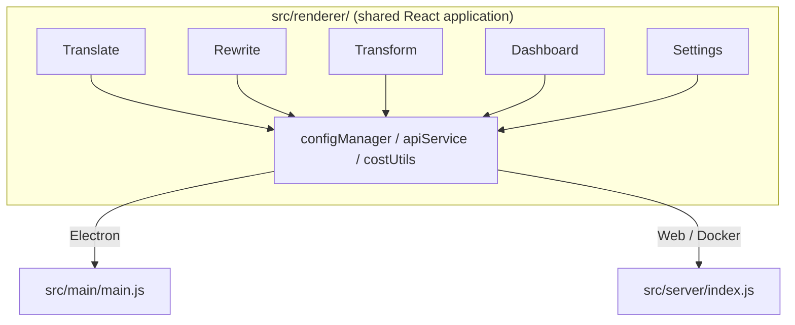

<p align="center">
  
</p>

<h1 align="center">Transrewrt</h1>

<p align="center">
  <a href="https://github.com/wsj-br/transrewrt/releases"></a>
  <a href="LICENSE"></a>
  
  
  
</p>

Zana la maandishi yenye AI: tafsiri kati ya lugha, andika upya katika mitindo tofauti, na badilisha kwa maombi ya kienyeji - yote kupitia [OpenRouter](https://openrouter.ai). Inafanywa kama programu ya dawati (Electron) au programu ya wavuti inayojihosthi mwenyewe (Docker).

- **Tafsiri** - kati ya lugha zaidi ya arobaini, uguawapo kwa utambuli wa chanzo wa kiotomatiki
- **Andika upya** - rekebisha sarufi, kuboresha uwazi, rasmi/asi rasmi, punguza, panua, kiufundi
- **Badilisha** - maombi ya kienyeji ya AI; unda na duka maombi, lugha ya lengo ya hiari kwa kila ombi
- **Mifano na gharama** - chagua mfano wowote wa OpenRouter; dashibodi ya gharama na logi ya SQLite, muhtasari kwa mfano/opereisha/siku
- **Kiolesura cha mtumiaji** - i18n (pt-BR, de, fr, es, RTL), mithali, fonti, pfupisho za kibodi; hali ya wavuti salama (kifaa cha API kwenye seva pekee)
- **Dawati** - programu ya Electron kwa Windows na Linux
- **Kujihosthi mwenyewe** - picha ya Docker kwa amd64 na arm64 (tayari kwa Raspberry Pi)

Baada ya kusanidi, angalia **[Mwongozo wa Mtumiaji](../USER-GUIDE.md)** kwa mafunzo kamili ya vipengele vyote.

<small>**Soma katika lugha zingine:** [English (UK)](../README.md) · [Português (BR)](README.pt-BR.md) · [العربية](README.ar.md) · [বাংলা](README.bn.md) · [Català](README.ca.md) · [简体中文](README.zh-CN.md) · [繁體中文](README.zh-TW.md) · [Hrvatski](README.hr.md) · [Čeština](README.cs.md) · [Nederlands](README.nl.md) · [English (US)](README.en-US.md) · [Filipino](README.tl.md) · [Français](README.fr.md) · [Deutsch](README.de.md) · [Ελληνικά](README.el.md) · [हिन्दी](README.hi.md) · [Magyar](README.hu.md) · [Italiano](README.it.md) · [日本語](README.ja.md) · [Basa Jawa](README.jv.md) · [한국어](README.ko.md) · [Bahasa Melayu](README.ms.md) · [فارسی](README.fa.md) · [Polski](README.pl.md) · [Português (PT)](README.pt.md) · [ਪੰਜਾਬੀ](README.pa.md) · [Română](README.ro.md) · [Русский](README.ru.md) · [Slovenčina](README.sk.md) · [Español](README.es.md) · [Kiswahili](README.sw.md) · [Svenska](README.sv.md) · [తెలుగు](README.te.md) · [ภาษาไทย](README.th.md) · [Türkçe](README.tr.md) · [Українська](README.uk.md) · [Tiếng Việt](README.vi.md)</small>

<a id="screenshots"></a>
## Picha za Skrini

**Chagua lugha**


**Tafsiri**


**Badilisha - mhariri wa maombi**


**Dashibodi**


**Mipangilio - uchagua mfano**


<br /><br />

<a id="table-of-contents"></a>
## Jedwali la Maudhui

<!-- START doctoc generated TOC please keep comment here to allow auto update -->
<!-- DON'T EDIT THIS SECTION, INSTEAD RE-RUN doctoc TO UPDATE -->

- [Mwanzo wa haraka](#quick-start)
- [Ufunguzi](#installation)
  - [Windows (Electron)](#windows-electron)
  - [Linux (Electron)](#linux-electron)
  - [Docker](#docker)
- [Kupata kifaa cha API cha OpenRouter](#getting-an-openrouter-api-key)
- [Uasanidi na mazingira](#configuration-and-environment)
- [Maendeleo na usanidi](#development-and-architecture)
- [Matoleo na lebo](#releases-and-tags)
- [Kuchangia](#contributing)
- [Kanuni ya kukataliwa](#disclaimer)
- [Leseni](#license)

<!-- END doctoc generated TOC please keep comment here to allow auto update -->

<br /><br />

<a id="quick-start"></a>

## Mwongozo wa haraka

**Docker (inapendekezwa kwa self-hosting)**

```bash
docker pull ghcr.io/wsj-br/transrewrt:latest

API_KEY=sk-or-your-key docker run -d \
  -p 5000:5000 \
  -v transrewrt-data:/app/data \
  -e API_KEY \
  --name transrewrt-web \
  ghcr.io/wsj-br/transrewrt:latest
```

Badilisha `sk-or-your-key` na [ufunguo wa API wa OpenRouter](https://openrouter.ai/keys) wako. Fungua [http://localhost:5000](http://localhost:5000) na ubadilishe nenosiri la mawasilishaji la chini kabla ya kutoa huduma.

<br />

> ℹ️ **KUMBUKA**<br/>
> Katika Docker, ufunguo wa API wa OpenRouter huwekwa tu kupitia kichueo cha mazingira `API_KEY` (sio katika kiolesura cha wavuti). Kwenye Dektopu (Electron) unamkatishi pale kwenye **Mipangilio → API**.

<br />

**Windows**

Pakua `Transrewrt Setup x.y.z.exe` ya hivi karibuni kutoka kwenye [Matoleo](https://github.com/wsj-br/transrewrt/releases), endesha kifaa cha kusanidi, kisha zindua kutoka kwenye menyu ya Kuanza au kifaa cha upesi. Ingiza ufunguo wako wa API wa OpenRouter kwenye **Mipangilio → API**.

<br />

**Linux**

Pakua `.AppImage` kutoka kwenye [Matoleo](https://github.com/wsj-br/transrewrt/releases), kisha:

```bash
chmod +x Transrewrt-x.y.z.AppImage && ./Transrewrt-x.y.z.AppImage
```

Ingiza ufunguo wako wa API wa OpenRouter kwenye **Mipangilio → API**. Kwenye Debian/Ubuntu unaweza kuhitaji kusanidi utegemezi wa ziada kwanza:

```bash
sudo apt install libgtk-3-0 libnotify-dev libnss3 libxss1 libasound2 libxtst6 xauth
```

Angalia [Usanidi → Linux](#linux-electron) kwa maelezo zaidi.

<br />

> ℹ️ **KUMBUKA**<br/>
> macOS haitumiki kwa sasa. Transrewrt inapatikana kwa Windows, Linux, na Docker.

<br />

Mara huduma inapoendeshwa, soma **[Mwongozo wa Mtumiaji](../USER-GUIDE.md)** ili ujifunze jinsi ya kutafsiri, kuandika upya, na kubadilisha maandishi, kudhibiti maelezo ya mazungumzo, na kusanidi mtindo.

<br /><br />

<a id="installation"></a>
## Usanidi

<a id="windows-electron"></a>
### Windows (Electron)

- Pakua kifaa cha kusanidi cha hivi karibuni kutoka kwenye [Matoleo](https://github.com/wsj-br/transrewrt/releases).
- Endelea `.exe` na fuata mfumo wa kusanidi.
- Mara ya kwanza: zindua programu kutoka kwenye menyu ya Kuanza au kifaa cha upesi. Usanidi huhifadhiwa kwenye `%APPDATA%\transrewrt\`.

<br />

<a id="linux-electron"></a>
### Linux (Electron)

- Pakua `.AppImage` kutoka kwenye [Matoleo](https://github.com/wsj-br/transrewrt/releases).
- Endesha: `chmod +x Transrewrt-x.y.z.AppImage && ./Transrewrt-x.y.z.AppImage`
- Utegemezi wa ziada (Debian/Ubuntu): `sudo apt install libgtk-3-0 libnotify-dev libnss3 libxss1 libasound2 libxtst6 xauth`
- Angalia [dev/DEVELOPMENT.md](../dev/DEVELOPMENT.md) kwa maelezo zaidi.

<br />

<a id="docker"></a>
### Docker

- Pata: `docker pull ghcr.io/wsj-br/transrewrt:latest`
- Ufunguo wa API wa OpenRouter **lazima** uwekwe kupitia kichueo cha mazingira `API_KEY`. Pitisha kwa `-e API_KEY` (au kupitia `docker compose` / `.env`) ili ufunguo usionekane katika orodha ya mchakato.
- Ufunguo wa API hauwezi kuongezwa kwenye kiolesura cha wavuti.

Mfano - kikapu cha jina la udumu (ufunguo wa API unapitishwa kupitia mazingira, sio katika mstari wa amri):

```bash
API_KEY=sk-or-your-key docker run -d \
  -p 5000:5000 \
  -v transrewrt-data:/app/data \
  -e API_KEY \
  --name transrewrt-web \
  ghcr.io/wsj-br/transrewrt:latest
```

<br />

| Chaguo   | Maelezo                                                                                                   |
| -------- | --------------------------------------------------------------------------------------------------------- |
| Bandari | `5000` (kamata na `-p 5000:5000`)                                                                         |
| Kikapu  | Wekeke `/app/data` kwa usanidi na udumisho wa hifadhi data                                                |
| Vipimo vya mazingira | `PORT`, `CONFIG_PATH`, `API_KEY`, `API_URL`, `KEY_SEED` - angalia [Mipangilio](#configuration-and-environment) |

Kujenga na kuendesha kutoka kwa chanzo: `docker compose up --build -d` au `pnpm run docker:up` - angalia [dev/DEVELOPMENT.md](../dev/DEVELOPMENT.md).

<br /><br />

<a id="getting-an-openrouter-api-key"></a>
## Kupata ufunguo wa API wa OpenRouter

Transrewrt hutumia [OpenRouter](https://openrouter.ai) kwa ajili ya mtindo wa AI. Unahitaji ufunguo wa API ili kutafsiri, kuandika upya, au kubadilisha maandishi.

1. Jisajiliishe au ingia kwenye [openrouter.ai](https://openrouter.ai).
2. Fungua ukurasa wa [Ufunguo](https://openrouter.ai/keys) na unda ufunguo mpya (umpe jina, na uweze kusanida kikomo cha mkopo). Unaweza kutumia mtindo wa bure bila kuongeza mkopo.
3. **Dektopu (Electron):** katishi ufunguo kwenye **Mipangilio → API**. **Docker:** weka kichueo cha mazingira `API_KEY` (angalia [Mwongozo wa haraka](#quick-start)).

Kwa ajili ya vikomo, BYOK, na zaidi, angalia [Uthibitisho wa OpenRouter](https://openrouter.ai/docs/api/reference/authentication).

<br /><br />

<a id="configuration-and-environment"></a>

## Mpangilio na mazingira

**Mahali pa faili la mpangilio**

| Ufunguo              | Mahali pa mpangilio                                   |
| -------------------- | ----------------------------------------------------- |
| Electron (Windows)   | `%APPDATA%\transrewrt\`                              |
| Electron (Linux)     | `~/.config/transrewrt/`                              |
| Mtandao / Docker     | `/app/data/config.json` (tumia kuvuta data kudumisha) |

<br />

**Vigezo vya mazingira** (mtandao/Docker pekee; Electron hutumia faili la mpangilio la karibu)

| Kigezo      | Chaguo-msingi                        | Maelezo                                                   |
| ----------- | ------------------------------------ | --------------------------------------------------------- |
| `PORT`      | `5000`                               | Kituo cha kusikiliza cha seva                             |
| `CONFIG_PATH` | `/app/data/config.json`           | Njia kwa faili la mpangilio                              |
| `API_KEY`   | *(tupu)*                             | Ufunguo wa API wa OpenRouter (uhitajiwa kwa Docker; weka kupitia mazingira, si UI) |
| `API_URL`   | `https://openrouter.ai/api/v1`      | Kiini cha URL cha API ya AI ya hali ya juu              |
| `KEY_SEED`  | *(tupu)*                             | Mbeyu ya ufunguo wa proxy ya Transrewrt (inapotoa mbadala wa mpangilio ikiwa imewekwa) |

<br />

**Data na udumishaji:** Kwa Docker, weka kuvuta data kwenye `/app/data` ili `config.json` na hifadhi-data ya SQLite kidumike baada ya kuanza tena kwenye kifaa. Bila kuvuta data, data zote zitapotea wakati kifaa kinasimama.

<br />

**Uthibitisho wa mtandao:**

- Msimamizi mkuu wa chaguo-msingi: `admin` / `transrewrt26`.
- Simamia watumiaji katika **Mipangilio → Watumiaji**.
| Rejesha nenosiri: `docker exec <kifaa> reset-web-password '<jina-la-mtumiaji>' '<nenosiri-jipya>'`
  ( kutoka chanzo: `pnpm run reset-web-password -- <jina-la-mtumiaji> <nenosiri-jipya>` )

<br />

> ⚠️ **TaharUKU**<br/>
| Badilisha nenosiri la msimamizi mkuu wa chaguo-msingi mara moja kwenye mwenyeji yeyote unaoweza kufikiwa kupitia mtandao.

<br />

**Proxy ya Transrewrt (ya hiari):** Unaweza ku-traumatic trafiki ya API kupitia proxy ya nje inayotumia ufunguo wa kugururika unaotegemea wakati. Katika **Mipangilio → API**, wezesha **Tumia Proxy ya Transrewrt**, weka **Mbeyu ya ufunguo**, na weka **URL ya API** kuwa URL ya msingi ya proxy. Angalia [dev/SYSTEM-OVERVIEW.md](../dev/SYSTEM-OVERVIEW.md) kwa maelezo zaidi.

Vipimo vikuu (tema, fonti, fano, lugha, n.k.) vinapatikana kwenye k Adams ya Mipangilio au vinaweza kuhaririwa moja kwa moja kwenye JSON la mpangilio. Orodha kamili na chaguo-msingi yameorodheshwa katika [dev/DEVELOPMENT.md](../dev/DEVELOPMENT.md).

<br /><br />

<a id="development-and-architecture"></a>
## Ujenzi na usanidi

- **Ujenzi:** Sanidi, jenga, jaribu, na toa (Electron, Mtandao, Docker) - angalia **[dev/DEVELOPMENT.md](../dev/DEVELOPMENT.md)**.
- **Usanidi na muhtasari wa mfumo:** Muundo wa folda,zeni la teknolojia, maamuzi ya muundo, Proxy ya Transrewrt - angalia **[dev/SYSTEM-OVERVIEW.md](../dev/SYSTEM-OVERVIEW.md)**.



<br /><br />

<a id="releases-and-tags"></a>
## Matoleo na lebo

- **Lebo za Git** `v`* (k.m. `v1.0.10`) zinawasha [workflow ya kutolea](.github/workflows/release.yml). **Matoleo ya GitHub** yanaambatanisha kifaa cha kuungua cha Windows (`.exe`) na Linux AppImage.
- **Picha za Docker** zinachapishwa kwa `ghcr.io/wsj-br/transrewrt`. Lebo za picha zinafanana na toleo la Git (k.m. `v1.0.10` → `ghcr.io/wsj-br/transrewrt:1.0.10`) pamoja na `latest`. Arch nyingi: `linux/amd64` na `linux/arm64` (k.m. Raspberry Pi).

<br /><br />

<a id="contributing"></a>
## Kuchangia

1. Fork repositories.
2. Tengeneza tawi la kipengele: `git checkout -b feature/my-feature`
3. Wisha mabadiliko yako na ujumbe wazi.
4. Tuma na ufungue Pull Request kwa `main`.

Tafadhali fuata mtindo wa kanuni uliopo na jaribu mabadiliko yako katisha hali zote mbili za Electron na mtandao kabla ya kuwasilisha. Angalia [dev/DEVELOPMENT.md](../dev/DEVELOPMENT.md) kwa maelekezo ya kujenga na kujaribu.

<br />

**Kuripoti matatizo:** Fungua tatizo kwenye [GitHub](https://github.com/wsj-br/transrewrt/issues). Jumuisha jukwaa lako (Windows / Linux / Docker) na toleo la programu (linaonyeshwa kwenye kAdams ya Kuhusu au ukurasa wa Matoleo).

<br /><br />

<a id="disclaimer"></a>

## Kukumbusho

Majina ya mazungumzo na alama za michoro ni mali ya wamiliki wao na hutumika tu kwa madhumuni ya utambuzi. Programu hii haihusishwi wala kuendwa na chapa zozote zilizotajwa.

<br /><br />

<a id="license"></a>
## Leseni

Hakimiliki © 2026 Waldemar Scudeller Jr.

[Leseni ya Apache 2.0](LICENSE)