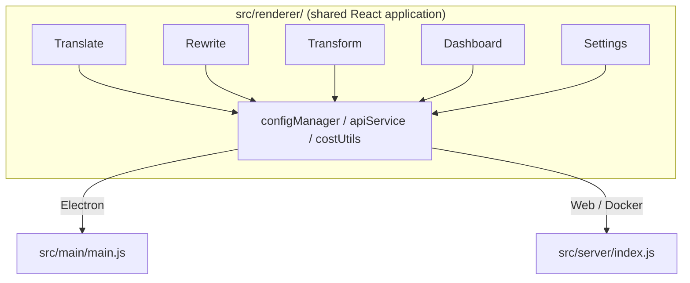

<p align="center">
  
</p>

<h1 align="center">Transrewrt</h1>

<p align="center">
  <a href="https://github.com/wsj-br/transrewrt/releases"></a>
  <a href="LICENSE"></a>
  
  
  
</p>

AI-శక్తితో సాధనం: భాషల మధ్య అనువదించండి, వివిధ శైలులలో పునర్లిఖించండి, మరియు కస్టమ్ ప్రాంప్ట్‌లతో పరివర్తన చేయండి - ఇవన్నీ [OpenRouter](https://openrouter.ai) ద్వారా. డెస్క్‌టాప్ అప్లికేషన్ (Electron) లేదా స్వయంగా హోస్ట్ చేసిన వెబ్ అప్లికేషన్ (Docker) గా పనిచేస్తుంది.

- **అనువదించు** - డజన్ల సంఖ్యలో భాషల మధ్య, స్వయంచాలక మూల భాష గుర్తింపుతో
- **పునర్లిఖించు** - వ్యాకరణ సరిచేయి, స్పష్టత పెంచు, అధికారిక/అనాధికారిక, చిన్న చేయు, విస్తరించు, సాంకేతిక
- **పరివర్తన** - కస్టమ్ AI ప్రాంప్ట్‌లు; ప్రాంప్ట్‌లను సృష్టించి నిర్వహించండి, ప్రతి ప్రాంప్ట్‌కు ఎంపికైన లక్ష్య భాష
- **మోడల్స్ & ఖర్చు** - ఏ OpenRouter మోడలైనీ ఎంపిక చేయండి; SQLite లాగ్ తో ఖర్చు డాష్‌బోర్డ్, మోడల్/ఆపరేషన్/రోజు ప్రకారం సారాంశాలు
- **UI** - i18n (pt-BR, de, fr, es, RTL), థీమ్‌లు, ఫాంట్‌లు, కీ బోర్డ్ షార్ట్‌కట్‌లు; సిగ్యూర్ వెబ్ మోడ్ (API కీ సర్వర్‌లో మాత్రమే)
- **డెస్క్‌టాప్** - Windows మరియు Linux కోసం Electron అప్లికేషన్
- **స్వయంగా హోస్ట్** - amd64 & arm64 (Raspberry Pi-ready) కోసం Docker ప్రతిరూపం

అనుస్థాపించిన తరువాత, అన్ని ఫీచర్ల పూర్తి వెాక్‌థ్రూ కోసం **[వాడుకరి గైడ్](../USER-GUIDE.md)** చూడండి.

<small>**ఇతర భాషలులో చదవండి:** [English (UK)](../README.md) · [Português (BR)](README.pt-BR.md) · [العربية](README.ar.md) · [বাংলা](README.bn.md) · [Català](README.ca.md) · [简体中文](README.zh-CN.md) · [繁體中文](README.zh-TW.md) · [Hrvatski](README.hr.md) · [Čeština](README.cs.md) · [Nederlands](README.nl.md) · [English (US)](README.en-US.md) · [Filipino](README.tl.md) · [Français](README.fr.md) · [Deutsch](README.de.md) · [Ελληνικά](README.el.md) · [हिन्दी](README.hi.md) · [Magyar](README.hu.md) · [Italiano](README.it.md) · [日本語](README.ja.md) · [Basa Jawa](README.jv.md) · [한국어](README.ko.md) · [Bahasa Melayu](README.ms.md) · [فارسی](README.fa.md) · [Polski](README.pl.md) · [Português (PT)](README.pt.md) · [ਪੰਜਾਬੀ](README.pa.md) · [Română](README.ro.md) · [Русский](README.ru.md) · [Slovenčina](README.sk.md) · [Español](README.es.md) · [Kiswahili](README.sw.md) · [Svenska](README.sv.md) · [తెలుగు](README.te.md) · [ภาษาไทย](README.th.md) · [Türkçe](README.tr.md) · [Українська](README.uk.md) · [Tiếng Việt](README.vi.md)</small>

<a id="screenshots"></a>
## స్క్రీన్‌షాట్లు

**భాష ఎంపికదారు**


**అనువదించు**


**పరివర్తన - ప్రాంప్ట్ సంపాదకం**


**డాష్‌బోర్డ్**


**సెట్టింగ్‌లు - మోడల్ ఎంపిక**


<br /><br />

<a id="table-of-contents"></a>
## విషయ సూచిక

<!-- START doctoc generated TOC please keep comment here to allow auto update -->
<!-- DON'T EDIT THIS SECTION, INSTEAD RE-RUN doctoc TO UPDATE -->

- [త్వరిత ఆరంభం](#quick-start)
- [అనుస్థాపన](#installation)
  - [Windows (Electron)](#windows-electron)
  - [Linux (Electron)](#linux-electron)
  - [Docker](#docker)
- [OpenRouter API కీ పొందడం](#getting-an-openrouter-api-key)
- [అనుకూలీకరణ మరియు వాతవరణ](#configuration-and-environment)
- [అభివృద్ధి మరియు ఆర్కిటెక్చర్](#development-and-architecture)
- [రిలీజ్‌లు మరియు ట్యాగ్‌లు](#releases-and-tags)
- [కాంట్రిబ్యూట్](#contributing)
- [హడాను](#disclaimer)
- [లైసెన్స్](#license)

<!-- END doctoc generated TOC please keep comment here to allow auto update -->

<br /><br />

<a id="quick-start"></a>

## త్వరిత ప్రారంభం

**డాకర్ (స్వయంగా హోస్ట్ చేయడానికి సిఫారసు)**

```bash
docker pull ghcr.io/wsj-br/transrewrt:latest

API_KEY=sk-or-your-key docker run -d \
  -p 5000:5000 \
  -v transrewrt-data:/app/data \
  -e API_KEY \
  --name transrewrt-web \
  ghcr.io/wsj-br/transrewrt:latest
```

`sk-or-your-key` అనేది మీ [OpenRouter API కీ](https://openrouter.ai/keys) తో మార్చండి. [http://localhost:5000](http://localhost:5000) ను తెరిచి, సేవను వెలికితీయే ముందు అంతరంగ అస水源 పాస్వర్డ్‌ను మార్చండి.

<br />

> ℹ️ **గమనిక**<br/>
> డాకర్‌లో OpenRouter API కీ నేరుగా `API_KEY` పర్యావరణ వేరియబుల్ ద్వారానే ఏర్పాటు చేసుకోవాలి (వెబ్ UI ద్వారా కాదు). డెస్క్‌టాప్‌({Electron}) **ఎంపికలు → API** వద్ద దానిని పేస్ట్ చేయాలి.

<br />

**విండోస్**

[రిలీస్‌లు](https://github.com/wsj-br/transrewrt/releases) నుండి అత్యధునిక `Transrewrt Setup x.y.z.exe` డౌన్‌లోడ్ చేసి, ఇన్‌స్టాలర్‌ను నడిపించండి, తరువాత స్టార్ట్ మెను లేదా డెస్క్‌టాప్ లింక్ నుండి ప్రారంభించండి. **ఎంపికలు → API** లో మీ OpenRouter API కీ నేరుగా ఇవ్వండి.

<br />

**లినక్స్**

[రిలీస్‌లు](https://github.com/wsj-br/transrewrt/releases) నుండి `.AppImage` ఫైల్‌ను డౌన్‌లోడ్ చేసి, దానిని నిర్వహించండి:

```bash
chmod +x Transrewrt-x.y.z.AppImage && ./Transrewrt-x.y.z.AppImage
```

**ఎంపికలు → API** లో మీ OpenRouter API కీ నేరుగా ఇవ్వండి. డెబయన్/అబ密密麻麻టూ మీద మీరు మొదట అదనపు అవసరాలను ఇన్‌స్టాల్ చేయాలి ఉండవచ్చు:

```bash
sudo apt install libgtk-3-0 libnotify-dev libnss3 libxss1 libasound2 libxtst6 xauth
```

వివరాల కోసం [ప్రతిస్థాపన → లినక్స్](#linux-electron) చూడండి.

<br />

> ℹ️ **గమనిక**<br/>
> ప్రస్తుతం macOS మద్దతు ఇవ్వబడలేదు. Transrewrt విండోస్, లినక్స్ మరియు డాకర్ కోసం లభ్యం.

<br />

అప్లికేషన్ పనిచేస్తున్నప్పుడు, పాఠ్యాన్ని అనువదించడం, మళ్లీ రాయడం, పరివర్తన చేయడం, ప్రాంప్ట్‌లను నిర్వహించడం మరియు మోడల్స్‌ను కాన్ఫిగర్ చేయడం palleల **[వినిర్దేశ పుస్తకం](../USER-GUIDE.md)** వాటాన్ని నేర్చుకోండి.

<br /><br />

<a id="installation"></a>
## ప్రతిస్థాపన

<a id="windows-electron"></a>
### విండోస్ (ఎలక్ట్రాన్)

- అత్యధునిక ఇన్‌స్టాలర్‌ను [రిలీస్‌లు](https://github.com/wsj-br/transrewrt/releases) నుండి డౌన్‌లోడ్ చేండి.
- `.exe` ఫైల్‌ను నడిపించి ఇన్‌స్టాలర్‌ను అనుసరించండి.
- మొదటి పరిమాణం: స్టార్ట్ మెను లేదా డెస్క్‌టాప్ లింక్ నుండి అప్లికేషన్‌ను ప్రారంభించండి. కాన్ఫిగ్ `%APPDATA%\transrewrt\` లో నిల్వవుతుంది.

<br />

<a id="linux-electron"></a>
### లినక్స్ (ఎలక్ట్రాన్)

- [రిలీస్‌లు](https://github.com/wsj-br/transrewrt/releases) నుండి `.AppImage` డౌన్‌లోడ్ చేయండి.
- నడిపించు: `chmod +x Transrewrt-x.y.z.AppImage && ./Transrewrt-x.y.z.AppImage`
- అదనపు అవసరాలు (డెబయన్/అబ密密麻麻టూ): `sudo apt install libgtk-3-0 libnotify-dev libnss3 libxss1 libasound2 libxtst6 xauth`
- మరింత సమాచారం kosam [డెవ్/డెవలప్మెంట్.md](../dev/DEVELOPMENT.md) చూడండి.

<br />

<a id="docker"></a>
### డాకర్

- పుల్: `docker pull ghcr.io/wsj-br/transrewrt:latest`
- OpenRouter API కీ **కాకపోవడంలో** `API_KEY` పర్యావరణ వేరియబుల్ ద్వారా ఏర్పాటు చేసుకోవాలి. దానిని `-e API_KEY` తో పాస్ చేయండి (లేదా `docker compose` / `.env` ద్వారా) కాబట్టి కీ ప్రాసెస్ లిస్ట్‌లో చూపపడద్దు.
- API కీ వెబ్ UI లో నiry విల semantics‌లేదు.

నామించిన వాల్యూం్‌ ప్రకారం ఉదాహరణ (స్థిరత్వం కోసం, API కీ కమాండ్ లైన్లో కాకుండా env ద్వారా పాస్ చేసిన ఉదాహరణ):

```bash
API_KEY=sk-or-your-key docker run -d \
  -p 5000:5000 \
  -v transrewrt-data:/app/data \
  -e API_KEY \
  --name transrewrt-web \
  ghcr.io/wsj-br/transrewrt:latest
```

<br />

| ఎంపిక   | వివరణ                                                                                                   |
| -------- | --------------------------------------------------------------------------------------------------------- |
| పోర్ట్     | `5000` (`-p 5000:5000`తో మ్యాప్ చేయండి)                                                                  |
| వాల్యూం   | కాన్ఫిగ్ డేటాబేస్ స్థిరత్వం కోసం `/app/data` నుమౌంట్ చేయండి                                                |
| Env వేరియబుల్స్ | `PORT`, `CONFIG_PATH`, `API_KEY`, `API_URL`, `KEY_SEED` - [కాన్ఫిగరేషన్](#configuration-and-environment) చూడండి |

సోర్స్ నుండి బిల్్ చేయడానికి మరియు నడిపించడానికి: `docker compose up --build -d` లేదా `pnpm run docker:up` - [డెవ్/డెవలప్మెంట్.md](../dev/DEVELOPMENT.md) చూడండి.

<br /><br />

<a id="getting-an-openrouter-api-key"></a>
## ఒక OpenRouter API కీ పొందడం

Transrewrt AI మోడల్స్ కోసం [OpenRouter](https://openrouter.ai) ఉపయోగిస్తుంది. మీరు పాఠ్యాన్ని అనువదించడానికి, మళ్లీ రాయడానికి లేదా పరివర్తన చేయడానికి మీకు API కీ అవసరం.

1. [openrouter.ai](https://openrouter.ai) వద్ద సైన్‌అప్ చేయండి లేదా లాగిన్ చేయండి.
2. [కీలు](https://openrouter.ai/keys) పేజీను తెరిచి కొత్త కీని సృష్టించండి (దానికి పేరు పెట్టి, అవసరమైతే క్రెడిట్ పరిమితిని అమర్చండి). మీరు క్రెడిట్ జోడించకుండా ఉండి ఉత్తేజకరమైన మోడల్స్‌ను ఉపయోగించవచ్చు.
3. **డెస్క్‌టాప్ (ఎలక్ట్రాన్):** **ఎంపికలు → API** వద్ద కీని పేస్ట్ చేయండి. **డాకర్:** `API_KEY` పర్యావరణ వేరియబుల్‌ను ఏర్పాటు చేయండి ([త్వరిత ప్రారంభం](#quick-start) చూడండి).

పరిమితుల, BYOK మరియు ఇంకా, [OpenRouter authentication](https://openrouter.ai/docs/api/reference/authentication) చూడండి.

<br /><br />

<a id="configuration-and-environment"></a>

## కాన్ఫిగ్యురేషన్ మరియు పర్యావరణం

**కాన్ఫిగ్ ఫైల్ స్థానాలు**

| డిప్లOY్మెంట్         | కాన్ఫిగ్ స్థానం                                   |
| ------------------ | ------------------------------------------------- |
| ఎలెక్ట్రాన్ (విండోస్) | `%APPDATA%\transrewrt\`                           |
| ఎలెక్ట్రాన్ (లినక్స్)   | `~/.config/transrewrt/`                           |
| వెబ్ / డాకర్       | `/app/data/config.json` (స్థిరత్వానికి వాల్యూం ఉపయోగించు) |

<br />

**పర్యావరణ వేరియబుల్స్** (వెబ్/డాకర్ మాత్రమే; ఎలెక్ట్రాన్ స్థానిక కాన్ఫిగ్ ఫైల్ ఉపయోగిస్తుంది)

| వేరియబుల్      | డిఫాల్ట్                        | వివరణ                                                   |
| ------------- | ------------------------------ | ------------------------------------------------------------- |
| `PORT`        | `5000`                         | సెర్వర్ లిసనింగ్ పోర్ట్                                         |
| `CONFIG_PATH` | `/app/data/config.json`        | కాన్ఫిగ్ ఫైల్ పథం                                       |
| `API_KEY`     | *(ఖాళీ)*                      | OpenRouter API కీ (డాకర్ కి అవసరం; env ద్వారా సెట్ చేయండి, UI ద్వారా కాదు) |
| `API_URL`     | `https://openrouter.ai/api/v1` | అప్‌స్ట్రీమ్ AI API బేస్ URL                                      |
| `KEY_SEED`    | *(ఖాళీ)*                      | Transrewrt ప్రాక్సీ కీ సీడ్ (సెట్ అయితే కాన్ఫిగ్‌ని అధిపత్తో substitutes) |

<br />

**డేటా మరియు స్థిరత్వం:** డాకర్ కోసం, `/app/data` వద్ద వాల్యూం మౌంట్ చేయండి తద్వారా `config.json` మరియు SQLite డేటాబేస్ కంటైనర్ రీస్టార్ట్‌ల unconsciously స్థిరంగా ఉంటాయి. వాల్యూం లేని కేసులో, కంటైనర్ ఆపుతోంది అప్పుడectl అన్ని డేటా కోల్పోతుంది.

<br />

**వెబ్ ఔథెంటికేషన్:**

- డిఫాల్ట్ అడ్మిన్: `admin` / `transrewrt26`.
- **Settings → Users**లో యూజర్లను నిర్వహించండి.
- పాస్వర్డ్ రీసెట్ చేయండి: `docker exec <container> reset-web-password '<username>' '<new-password>'`
  (సోర్స్ నుండి: `pnpm run reset-web-password -- <username> <new-password>`)

<br />

> ⚠️ **హెచ్చరిక**<br/>
> నెట్వర్క్-ఆక్సెసెబుల్ హోస్ట్‌లో డిఫాల్ట్ అడ్మిన్ పాస్వర్డ్ వెంటనే మార్చండి.

<br />

**Transrewrt ప్రాక్సీ (ఐచ్చికం):** ఆధునిక-ఆధారిత రкол్లింగ్ కీ్‌ని ఉపయోగించే బాహ్య ప్రాక్సీ ద్వారా API ట్రాఫిక్ రూట్ చేయవచ్చు. **Settings → API**లో **Use Transrewrt Proxy** ను ఎనేబుల్ చేయండి, **Key seed** ని సెట్ చేయండి, మరియు **API URL** ని ప్రాక్సీ బేస్ URL గా సెట్ చేయండి. వివరాలకు [dev/SYSTEM-OVERVIEW.md](../dev/SYSTEM-OVERVIEW.md) చూడండి.

ธีమ్, ఫాంట్, మోడల్స్, భాషలు మొదలైనvailable సెట్టింగ్స్ Settings డైాలాగ్‌లో లేదా config JSON లో నేరుగా సవరించవచ్చు. పూర్తి జాబితా మరియు డిఫాల్ట్ విలువలు [dev/DEVELOPMENT.md](../dev/DEVELOPMENT.md) లో పత్రికించబడ్డాయి.

<br /><br />

<a id="development-and-architecture"></a>
## అభివృద్ధి మరియు ఆర్కిటెక్చర్

- ** అభివృద్ధి:** సెటప్, బిల్డ్, టెస్ట్, మరియు డిప్లయ్ (ఎలెక్ట్రాన్, వెబ్, డాకర్) - **[dev/DEVELOPMENT.md](../dev/DEVELOPMENT.md)** చూడండి.
- **ఆర్కిటెక్చర్ మరియు సిస్టమ్ అవర్వ్యూ:** ఫోల్డర్ స్ట్రక్చర్, టెక్ స్టాక్, డిజైన్ డిసిజన్స్, Transrewrt ప్రాక్సీ - **[dev/SYSTEM-OVERVIEW.md](../dev/SYSTEM-OVERVIEW.md)** చూడండి.



<br /><br />

<a id="releases-and-tags"></a>
## రిలీజేస్ మరియు ట్యాగ్స్

- **Git ట్యాగ్స్** `v`* (ఉదాహరణకు `v1.0.10`) [రిలీస్ వర్క్‌ఫ్లో](.github/workflows/release.yml) ను ట్రిగర్ చేస్తాయి. **GitHub Releases** విండోస్ ఇన్‌స్టాలర్ (`.exe`) మరియు లినక్స్ AppImage ని అంటాచ్ చేస్తాయి.
- **Docker ఇమేజీస్** `ghcr.io/wsj-br/transrewrt` కు ప్రకటించబడతాయి. ఇమేజ్ ట్యాగ్స్ Git వర్షన్‌తో మ్యాచ్ అయ్య్యాయి (ఉదాహరణకు `v1.0.10` → `ghcr.io/wsj-br/transrewrt:1.0.10`) ప్లస్ `latest`. మల్టీ-ఆర్క్: `linux/amd64` మరియు `linux/arm64` (ఉదాహరణకు Raspberry Pi).

<br /><br />

<a id="contributing"></a>
## కన్ట్రిబ్యూట్ చేయడం

1. రిపోజిటరీని ఫార్క్ చేయండి.
2. ఫీచర్ బ్రాంచ్ ను సృష్టించండి: `git checkout -b feature/my-feature`
3. మీ మార్పులను స్పష్టమైన సందేశంతో కమీట్ చేయండి.
4. పుష్ చేసి `main` వైపు Pull Request తెరవండి.

దిగువనున్న కోడ్ స్టైల్‌ను అనుసరించండి మరియు సబ్మిట్ చేయదాని ముందు మీ మార్పులను ఎలెక్ట్రాన్ మరియు వెబ్ మోడ్సులో రెండింటి కూడా టెస్ట్ చేయండి. బిల్డ్ మరియు టెస్ట్ సూచనలకు [dev/DEVELOPMENT.md](../dev/DEVELOPMENT.md) చూడండి.

<br />

**ఇష్యూలను రిపోర్టింగ్:** [GitHub](https://github.com/wsj-br/transrewrt/issues) లో ఇష్యూ తెరవండి. మీ ప్లాట్‌ఫార్మ్ (విండోస్ / లినక్స్ / డాకర్) మరియు యాప్ వర్షన్ (About డైలాగ్ లో కాంటే లేదా Releases పేజీలో చూపబడుతుంది) చేర్చండి.

<br /><br />

<a id="disclaimer"></a>

## హెచ్ డిస్క్లైమర్

ఉత్పత్తి పేర్లు మరియు ఐకాన్లు వాటి స్వాములకు సంబంధించున్నాయి మరియు పరిచయం చేయడానికి మాత్రమే వాడుతారు. ఈ సాఫ్ట్వేర్ ఏదైనా సూచించిన బ్రాండ్స్ తో సంబంధం లేదా వాటి అనుమతి తో ఉండదు.

<br /><br />

<a id="license"></a>
## లైసెన్స్

Copyright © 2026 Waldemar Scudeller Jr.

[Apache License 2.0](LICENSE)