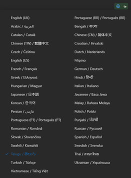
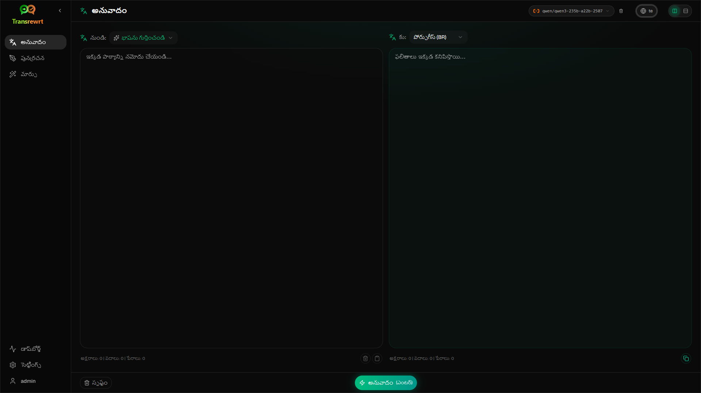
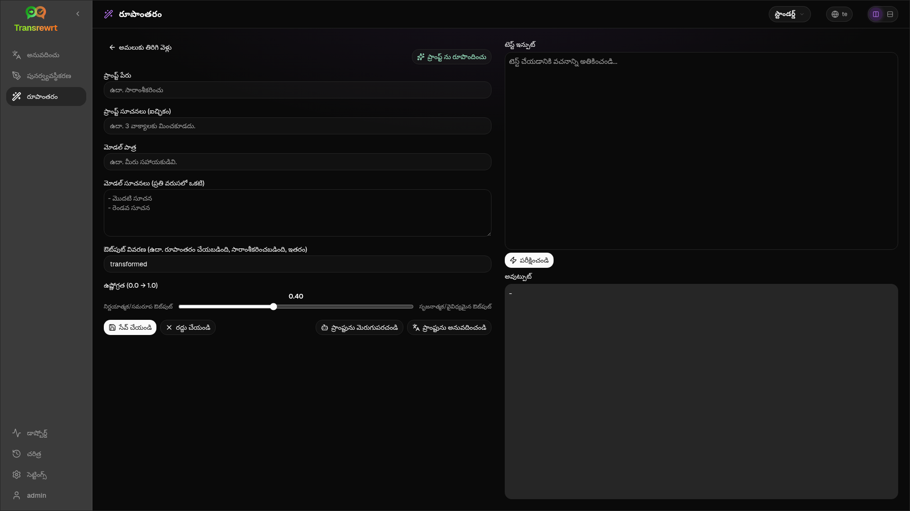
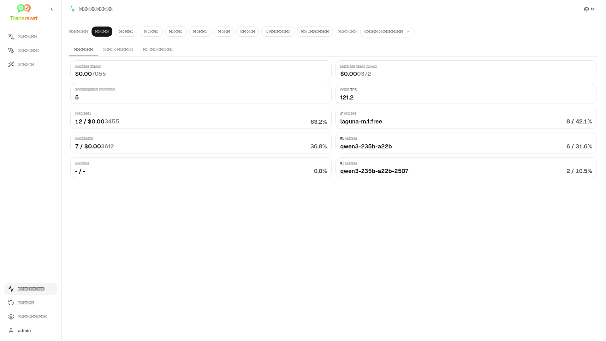
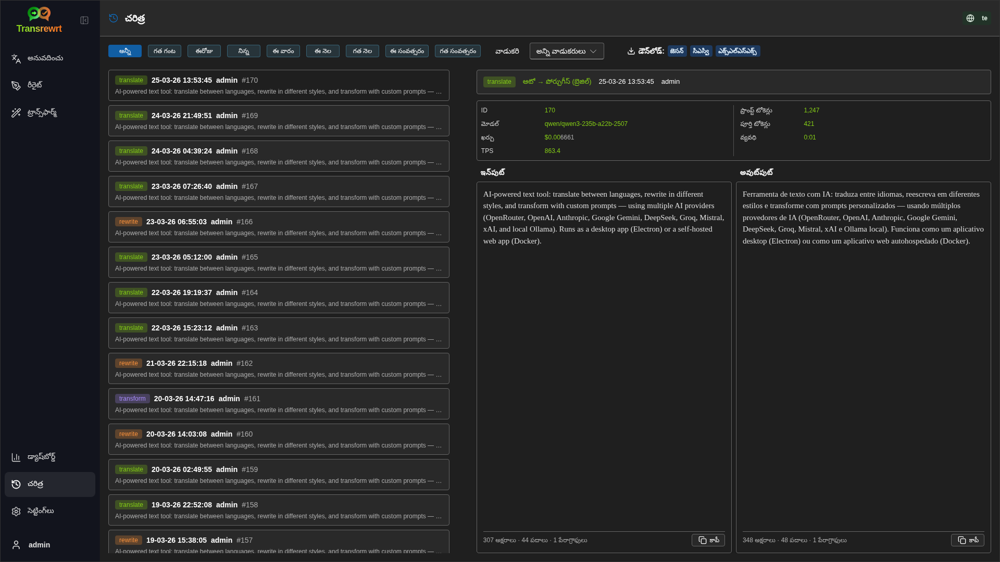
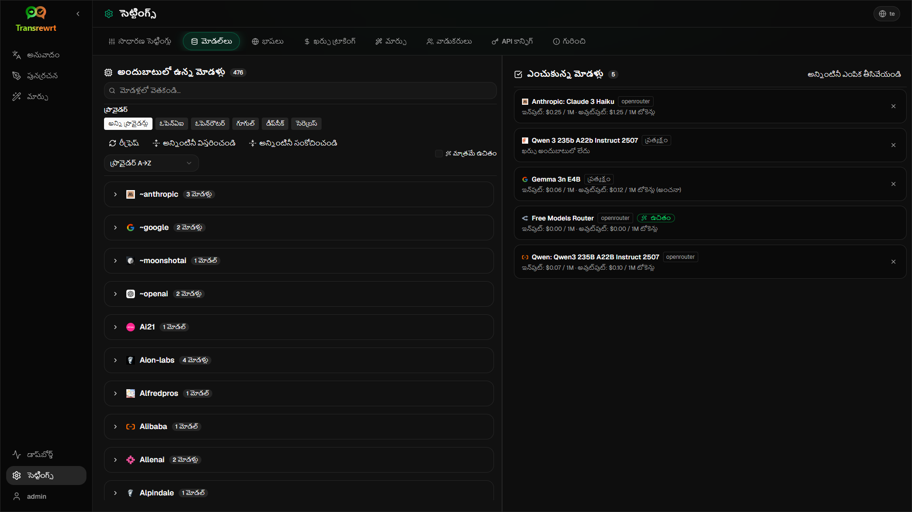

<p align="center">
  
</p>

<p align="center">
  <a href="https://github.com/wsj-br/transrewrt/releases"></a>
  <a href="LICENSE"></a>
  
  
  
</p>

ఎఐ-శక్తితో కూడిన టెక్స్ట్ సాధనం: భాషల మధ్య అనువదించు, విభిన్న శైలులలో రీరైట్ చేయి, కస్టమ్ ప్రాంప్ట్‌లతో ట్రాన్స్‌ఫార్మ్ చేయి - బహుళ ఎఐ ప్రదాతలను ఉపయోగించి (ఓపెన్రౌటర్, ఓపెన్ఏఐ, యాంథ్రోపిక్, గూగుల్ జెమిని, డీప్సీక్, గ్రోక్, మిస్ట్రల్, ఎక్స్ఏఐ మరియు స్థానిక ఓలామా). డెస్క్‌టాప్ అప్లికేషన్ (ఎలక్ట్రాన్) లేదా స్వంతంగా హోస్ట్ చేసుకునే వెబ్ అప్లికేషన్ (డాకర్) గా నడుస్తుంది.

- **అనువాదం** - డజన్ల కొద్దీ భాషల మధ్య, స్వయంచాలక మూలం గుర్తింపుతో
- **పునర్రచన** - వ్యాకరణాన్ని సరిచేయండి, స్పష్టతను మెరుగుపరచండి, ఔపచారిక/అనౌపచారిక, సంక్షిప్తం చేయండి, విస్తరించండి, సాంకేతికం
- **మార్చు** - కస్టమ్ AI ప్రాంప్ట్లు; ప్రాంప్ట్లను సృష్టించండి మరియు నిర్వహించండి, ప్రతి ప్రాంప్ట్‌కు ఐచ్ఛిక లక్ష్య భాష
- **చరిత్ర** - ఇన్‌పుట్/అవుట్‌పుట్ టెక్స్ట్, ఫిల్టరింగ్ మరియు ఎగుమతితో కూడిన పూర్తి క్రియాశీల చరిత్ర
- **సులభం & అడ్వాన్స్డ్** - సులభ మోడ్ (డిఫాల్ట్): మోడల్ ఐడీలను ఎంచుకోకుండా ప్రతి ప్రొవైడర్ కు సంబంధించిన నైపుణ్యాలు (ఉచితం, ఫాస్ట్, అడ్వాన్స్డ్, టెక్నికల్, లీగల్); అడ్వాన్స్డ్ మోడ్: మీరు కాన్ఫిగర్ చేసిన ప్రొవైడర్ల నుండి పూర్తి మోడల్ జాబితా
- **మోడల్‌లు & ఖర్చు** - ఖర్చు మరియు ఉపయోగ డాష్‌బోర్డ్‌లు (సారాంశం, మోడల్ ద్వారా, అన్ని కాల్స్) ఎగుమతితో; ఓపెన్‌రౌటర్ వాస్తవ ఖర్చును చూపిస్తుంది, ఇతర ప్రొవైడర్లు అంచనాలను ఉపయోగిస్తాయి
- **UI** - బహుభాషా ఇంటర్ఫేస్ (30+ భాషలు, RTL మద్దతు), ఫాంట్లు, ...
- **వెబ్ మోడ్** - నిర్వాహక పాత్రలతో బహుళ వాడుకరి మద్దతు
- **డెస్క్‌టాప్** - విండోస్ మరియు లినక్స్ కోసం ఎలక్ట్రాన్ అప్లికేషన్
- **స్వంతంగా హోస్ట్ చేసుకోవడం** - amd64 & arm64 (రాస్ప్బెర్రీ పై-సిద్ధంగా) కోసం డాకర్ ఇమేజ్

ఇన్‌స్టాల్ చేసిన తర్వాత, అన్ని లక్షణాల పూర్తి వాకింగ్ కోసం [**వాడుకరి మార్గదర్శి**](USER-GUIDE.te.md) చూడండి.

<small>**ఇతర భాషలలో చదవండి:** </small>
<small id="lang-list">[English (GB)](../README.md) · [Português (Brasil)](./README.pt-BR.md) · [العربية](./README.ar.md) · [বাংলা](./README.bn.md) · [Català](./README.ca.md) · [中文 (中国大陆)](./README.zh-CN.md) · [中文 (台灣)](./README.zh-TW.md) · [Hrvatski](./README.hr.md) · [Čeština](./README.cs.md) · [Nederlands](./README.nl.md) · [English (US)](./README.en-US.md) · [Tagalog](./README.tl.md) · [Français](./README.fr.md) · [Deutsch](./README.de.md) · [Ελληνικά](./README.el.md) · [हिन्दी](./README.hi.md) · [Magyar](./README.hu.md) · [Italiano](./README.it.md) · [日本語](./README.ja.md) · [한국어](./README.ko.md) · [Bahasa Melayu](./README.ms.md) · [فارسی](./README.fa.md) · [Polski](./README.pl.md) · [Basa Jawa](./README.jv.md) · [Português](./README.pt.md) · [ਪੰਜਾਬੀ](./README.pa.md) · [Română](./README.ro.md) · [Русский](./README.ru.md) · [Slovenčina](./README.sk.md) · [Español](./README.es.md) · [Kiswahili](./README.sw.md) · [Svenska](./README.sv.md) · [తెలుగు](./README.te.md) · [ไทย](./README.th.md) · [Türkçe](./README.tr.md) · [Українська](./README.uk.md) · [Tiếng Việt](./README.vi.md)</small>

<small>

> **UI మరియు పత్రాల అనువాదాల గురించి గమనిక:** మూల ఇంగ్లీష్ (UK) తప్ప మిగిలిన అన్ని ఇంటర్ఫేస్ భాషలు 
> ఎఐ మోడల్స్ ఉపయోగించి అనువదించబడ్డాయి; పదబంధం స్పష్టంగా లేకపోవచ్చు లేదా పొరుదులు ఉండవచ్చు.

</small>

<br/>

<a id="table-of-contents"></a>
## విషయసూచిక

<!-- START doctoc generated TOC please keep comment here to allow auto update -->
<!-- DON'T EDIT THIS SECTION, INSTEAD RE-RUN doctoc TO UPDATE -->

- [స్క్రీన్‌షాట్లు](#screenshots)
- [త్వరిత ప్రారంభం](#quick-start)
- [OpenRouter API కీని పొందడం](#getting-an-openrouter-api-key)
- [కాన్ఫిగరేషన్ మరియు పర్యావరణం](#configuration-and-environment)
- [అభివృద్ధి మరియు వాస్తుశిల్పం](#development-and-architecture)
- [సమస్యలను నివేదించడం](#reporting-issues)
- [అస్వీకార ప్రకటన](#disclaimer)
- [లైసెన్స్](#license)

<!-- END doctoc generated TOC please keep comment here to allow auto update -->

<br/><br/>

<a id="screenshots"></a>
## స్క్రీన్‌షాట్లు

**భాష ఎంపికదారు**



**అనువదించు**



**ట్రాన్స్‌ఫార్మ్ - ప్రాంప్ట్ ఎడిటర్**



**డ్యాష్‌బోర్డ్**



**చరిత్ర**



**సెట్టింగ్‌లు - మోడల్ ఎంపిక**



<br/><br/>

<a id="quick-start"></a>
## త్వరిత ప్రారంభం

<details>
<summary><b>డాకర్ (స్వంతంగా హోస్ట్ చేయడానికి సిఫార్సు చేయబడింది)</b></summary>

<a id="docker"></a>

<br/>

```bash
docker pull ghcr.io/wsj-br/transrewrt:latest

OPENROUTER_API_KEY=sk-or-your-key docker run -d \
  -p 5000:5000 \
  -v transrewrt-data:/app/data \
  -e OPENROUTER_API_KEY \
  --name transrewrt-web \
  ghcr.io/wsj-br/transrewrt:latest
```

[ఓపెన్రౌటర్ API కీ](https://openrouter.ai/keys) తో `sk-or-your-key` ని భర్తీ చేయండి (లేదా ఇతర ప్రదాత కీలను సెట్ చేయండి; [కాన్ఫిగరేషన్](#configuration-and-environment) చూడండి). [http://localhost:5000](http://localhost:5000) ని తెరిచి సేవను బహిర్గతం చేయడానికి ముందు డిఫాల్ట్ కార్యదర్శి పాస్‌వర్డ్‌ను మార్చండి.

కనీసం ఒక ప్రదాత కీని పర్యావరణం ద్వారా సెట్ చేయండి (ఉదాహరణకు ఓపెన్రౌటర్ కోసం `OPENROUTER_API_KEY`). రహస్యాలు ఇమేజీలో బేక్ కాకుండా ఉండేలా `-e` లేదా `docker compose` / `.env` తో వేరియబుల్స్ ని పాస్ చేయండి. ప్రదాత కీలు వెబ్ UIలో **కాదు** ప్రవేశపెట్టబడతాయి; సర్వర్ వాటిని పర్యావరణం నుండి చదుస్తుంది.

<br/>

> ℹ️ **గమనిక**<br/>
> డాకర్‌లో, LLM అనుమతి పత్రాలు `OPENROUTER_API_KEY`, `OPENAI_API_KEY`, `CEREBRAS_API_KEY`, … వంటి పర్యావరణ వేరియబుల్స్ తో సెట్ చేయబడతాయి (వెబ్ UIలో కాదు). డెస్క్‌టాప్ (ఎలక్ట్రాన్) లో మీరు **సెట్టింగ్‌లు → API** లో కీలను కాన్ఫిగర్ చేస్తారు.

<br/>

లేదా డాకర్ కాంపోజ్ ఉపయోగించండి:

```bash
# download the compose file
wget https://github.com/wsj-br/transrewrt/raw/refs/heads/master/production.yml -O transrewrt.yml
# Edit the file to add your API keys (API_KEYs), or uncomment and adjust the `.env` file. Set the timezone (TZ) if necessary.
vi transrewrt.yml
# start the container
docker compose -f transrewrt.yml up -d
```

[కాన్ఫిగరేషన్](#configuration-and-environment) లో ఉన్న అన్ని పర్యావరణ వేరియబుల్స్ కోసం చూడండి, ఉదాహరణకు `PORT`, `CONFIG_PATH`, `TZ`, మరియు LLM కీలు (`OPENROUTER_API_KEY`, `OPENAI_API_KEY`, …).

</details>

<br/>

<details>
<summary><b>సర్వర్ సమయ మండలం (డాకర్)</b></summary>

<a id="configuring-the-timezone"></a>

<br/>

అప్లికేషన్ వినియోగదారు ఇంటర్ఫేస్ తేదీ మరియు సమయం **బ్రౌజర్ యొక్క** స్థానిక సెట్టింగులు మరియు సమయ మండలాన్ని అనుసరిస్తాయి. **సర్వర్-సైడ్** వర్తనం (లాగింగ్ మరియు ఇతర పనుల కోసం), కంటైనర్ `TZ` పర్యావరణ వేరియబుల్ ఉపయోగిస్తుంది. డిఫాల్ట్ `TZ=Europe/London`.

మరొక సమయ మండలాన్ని ఉపయోగించడానికి, ఉదాహరణకు మీ కాంపోజ్ ఫైల్‌లో `TZ` సెట్ చేయండి:

```yaml
environment:
  - TZ=America/Sao_Paulo
```

లేదా కంటైనర్ నడుస్తున్నప్పుడు దానిని పాస్ చేయండి (డాకర్):

```bash
--env TZ=America/Sao_Paulo
```

చాలా లినక్స్ హోస్ట్‌లలో మీరు సిస్టమ్ సమయ మండల పేరును ఇలా కాపీ చేయవచ్చు:

```bash
echo TZ=\"$(</etc/timezone)\"
```

సరైన సమయ మండల పేర్ల జాబితా [tz డేటాబేస్](https://en.wikipedia.org/wiki/List_of_tz_database_time_zones) (వికీపీడియా) లో నిర్వహించబడుతుంది.

</details>

<br/>

<details>
<summary><b>విండోస్</b></summary>

<a id="windows-electron"></a>

<br/>

- [రిలీజ్‌లు](https://github.com/wsj-br/transrewrt/releases) నుండి చివరి `Transrewrt Setup x.y.z.exe` డౌన్‌లోడ్ చేసుకోండి.
- `.exe` ని రన్ చేసి ఇన్‌స్టాలర్ ని అనుసరించండి.
- మొదటి రన్: స్టార్ట్ మెను లేదా డెస్క్‌టాప్ షార్ట్‌కట్ నుండి అప్లికేషన్ ప్రారంభించండి.
- **సెట్టింగ్‌లు → API** లో మీ API కీలను నమోదు చేయండి. మీరు కనీసం ఒక ప్రదాతను కాన్ఫిగర్ చేయాలి; ఉచిత మోడల్‌ల కోసం ఓపెన్రౌటర్ సాధారణం.

<br/>

> ℹ️ **గమనిక**<br/>
> విండోస్ ఈ భద్రతా హెచ్చరికలలో ఒకదాన్ని చూపించవచ్చు (సంతకం చేయని/స్వతంత్ర అప్లికేషన్‌లకు సాధారణం):
>   - **వాడుకరి ఖాతా నియంత్రణ (UAC)**: "తెలియని ప్రచురకర్త నుండి వచ్చిన ఈ అప్లికేషన్ మీ పరికరంలో మార్పులు చేయడానికి మీరు అనుమతిస్తారా?" → **అవును** క్లిక్ చేయండి.
>   - **మైక్రోసాఫ్ట్ డిఫెండర్ స్మార్ట్‌స్క్రీన్**: "విండోస్ మీ PCని రక్షించింది" → **మరిన్ని సమాచారం** → **అయినా రన్ చేయి** క్లిక్ చేయండి.
>
> అప్లికేషన్ మైక్రోసాఫ్ట్ లేదా పెద్ద ప్రచురకర్త ద్వారా సంతకం చేయబడలేదు కాబట్టి ఇది జరుగుతుంది - అధికారిక గిట్‌హబ్ రిలీజ్‌ల నుండి డౌన్‌లోడ్ చేసినట్లయితే ఇది సురక్షితం (ప్రతి ఆస్తి పక్కన ఉన్న [రిలీజ్‌లు](https://github.com/wsj-br/transrewrt/releases) పేజీలో చెక్‌సమ్స్ ని ధృవీకరించండి).

<br/>

</details>

<br/>

<details>
<summary><b>లినక్స్</b></summary>

<a id="linux-electron"></a>

<br/>

[రిలీజ్‌లు](https://github.com/wsj-br/transrewrt/releases) నుండి మీ CPU కోసం `.AppImage` డౌన్‌లోడ్ చేసుకోండి (సాధారణ PC ల కోసం `x64`, రాస్ప్‌బెర్రీ పై 4+ సహా చాలా ARM పరికరాల కోసం `arm64`), తర్వాత:

```bash
chmod +x Transrewrt-x.y.z-x64.AppImage && ./Transrewrt-x.y.z-x64.AppImage
```

x86_64/amd64 లో `x64` ఫైల్ పేరు ఉపయోగించండి; ARM64 లో `...-arm64.AppImage` పేరు ఉపయోగించండి.

మీ API కీలను **సెట్టింగ్‌లు → API** లో నమోదు చేయండి. మీరు కనీసం ఒక ప్రదాతను కాన్ఫిగర్ చేయాలి; ఉచిత మోడల్‌ల కోసం ఓపెన్రౌటర్ సాధారణం.

**కన్సోల్ సందేశాలు:** ప్యాకేజీ చేసిన లినక్స్ బిల్డ్‌లు (`x64` మరియు `arm64` AppImages) టెర్మినల్ లో నోడ్ డిప్రికేషన్ హెచ్చరికలను నిరోధిస్తాయి (ఉదాహరణకు అంతర్నిర్మిత `punycode` మాడ్యూల్). క్రోమియం "GLES3 మద్దతు లేదు" వంటి GPU / EGL పొరుతులను ముద్రిస్తే కానీ అప్లికేషన్ పనిచేస్తే, హార్డ్‌వేర్ యాక్సిలరేషన్ ని నిష్క్రియం చేయడం ద్వారా వాటిని నిశ్శబ్దం చేయవచ్చు:

```bash
TRANSREWRT_DISABLE_GPU=1 ./Transrewrt-x.y.z-arm64.AppImage
```

ఇది amd64 పై కూడా వర్తిస్తుంది; మీ డౌన్‌లోడ్ కు సరిపోయేలా ఫైల్ పేరు మార్చండి.

డీబియన్/ఉబుంటు లో, క్రోమియం కు అవసరమైన అదనపు **రన్‌టైమ్** లైబ్రరీలు అవసరం కావచ్చు (ఇవి సంపూర్ణ డెస్క్‌టాప్ ఇన్‌స్టాలేషన్‌లలో సాధారణంగా ఇప్పటికే ఉంటాయి). అవసరమైతే క్రింది కమాండ్‌లను నడుపుతారు:

```bash
sudo apt update
sudo apt install -y libfuse2 libgtk-3-0 libnotify4 libnss3 libnspr4 libxss1 libxtst6 xdg-utils \
     xauth libatspi2.0-0 libdrm2 libgbm1 libxcb-dri3-0 libcups2 libasound2t64
```

`libasound2t64` ని `libasound2` తో `arm64` కోసం భర్తీ చేయండి. కనీసం లేదా కస్టమ్ ఇన్‌స్టాల్‌లు ఇప్పటికీ `.so` ఫైల్ లేకుండా విఫలం కావచ్చు. పొరుతు సందేశంలో పేర్కొన్న ప్యాకేజీని ఇన్‌స్టాల్ చేయండి (సాధారణ అదనపు వాటిలో: `libatk1.0-0`, `libatk-bridge2.0-0`, `libgbm1`, `libdrm2`). కొన్ని పర్యావరణాలలో, `APPIMAGE_EXTRACT_AND_RUN=1 ./Transrewrt-….AppImage` ఉపయోగించి అప్లికేషన్ ని నడపాల్సి ఉండవచ్చు.

<br/>

> ℹ️ **గమనిక**<br/>
> ప్రస్తుతం macOS మద్దతు లేదు. విండోస్, లినక్స్ మరియు డాకర్ కోసం Transrewrt అందుబాటులో ఉంది.

</details>

<br/>

అప్లికేషన్ రన్ అవుతున్నప్పుడు, టెక్స్ట్ ను అనువదించడం, పునర్రచన చేయడం మరియు మార్చడం, ప్రాంప్ట్‌లను నిర్వహించడం మరియు మోడల్‌లను కాన్ఫిగర్ చేయడం గురించి తెలుసుకోవడానికి [**వాడుకరి మార్గదర్శి**](USER-GUIDE.te.md) చూడండి.

<br/><br/>

<a id="getting-an-openrouter-api-key"></a>
## ఓపెన్రౌటర్ API కీ పొందడం

Transrewrt అనేక AI ప్రదాతలను మద్దతు ఇస్తుంది. ఇది ఒక కీ క్రింద చాలా మోడల్‌లను సమాహారం చేస్తుంది మరియు ఉచిత మోడల్‌లను అందిస్తుంది కాబట్టి [ఓపెన్రౌటర్](https://openrouter.ai) ఒక ప్రజాదరణ ఎంపిక.

1. [openrouter.ai](https://openrouter.ai) లో సైన్ అప్ చేయండి లేదా లాగిన్ చేయండి.
2. [కీలు](https://openrouter.ai/keys) పేజీని తెరిచి, కొత్త కీని సృష్టించండి (పేరు పెట్టండి, మరియు ఐచ్ఛికంగా క్రెడిట్ పరిమితిని సెట్ చేయండి). క్రెడిట్ జోడించకుండా ఉచిత మోడల్‌లను ఉపయోగించవచ్చు.
3. **డెస్క్‌టాప్ (ఎలక్ట్రాన్):** **సెట్టింగ్‌లు → API** లో కీలను అతికించండి. **డాకర్:** `OPENROUTER_API_KEY` వంటి పర్యావరణ వేరియబుల్స్ సెట్ చేయండి (చూడండి [త్వరిత ప్రారంభం](#quick-start)).

అనువదించు, రీరైట్ లేదా ట్రాన్స్‌ఫార్మ్ చేయడానికి ఓపెన్రౌటర్ యొక్క **బాడీ బిల్డర్** మోడల్ ([`openrouter/bodybuilder`](https://openrouter.ai/openrouter/bodybuilder)) ఉపయోగించవద్దు: ఆ పనుల కోసం పూర్తి చేసిన పాఠం కాకుండా జెసన్ అభ్యర్థన పేలోడ్‌లను ఇది తిరిగి ఇస్తుంది. వాడుకరి మార్గదర్శిలో [సెట్టింగ్‌లు → మోడల్‌లు](USER-GUIDE.te.md#models) చూడండి.

మీరు ఇతర ప్రదాతలను (ఓపెన్ఏఐ, యాంథ్రోపిక్, గూగుల్ జెమిని, డీప్సీక్, గ్రోక్, మిస్ట్రల్, ఎక్స్ఏఐ, Cerebras) ఉపయోగించవచ్చు లేదా [ఓలామా](https://ollama.com) తో స్థానికంగా మోడల్‌లను నడుపుతారు. మద్దతు ఇచ్చిన ప్రదాతలు మరియు పర్యావరణ వేరియబుల్స్ పూర్తి జాబితా కోసం [కాన్ఫిగరేషన్](#configuration-and-environment) చూడండి.

</br>

> ⚠️ **హెచ్చరిక**<br/>
> మీరు మరొక పరికరం, కంటైనర్ లేదా సేవ నుండి ఓలామా ఉపయోగిస్తుంటే, బాహ్య కనెక్షన్లను (కేవలం లోకల్ హోస్ట్ మాత్రమే కాకుండా) అనుమతించడానికి ఓలామాను కాన్ఫిగర్ చేయడం గుర్తుంచుకోండి.

<br/><br/>

<a id="configuration-and-environment"></a>
## కాన్ఫిగరేషన్ మరియు పర్యావరణం

</br>

**కాన్ఫిగ్ ఫైల్ స్థానాలు**

| డిప్లాయ్‌మెంట్         | కాన్ఫిగ్ స్థానం                                   |
| ------------------ | ------------------------------------------------- |
| ఎలక్ట్రాన్ (విండోస్) | `%APPDATA%\transrewrt\`                           |
| ఎలక్ట్రాన్ (లినక్స్)   | `~/.config/transrewrt/`                           |
| వెబ్ / డాకర్       | `/app/data/config.json` (స్థిరంగా ఉండటానికి వాల్యూమ్ ఉపయోగించండి) |

<br/>

**పర్యావరణ వేరియబుల్స్** (వెబ్/డాకర్ మాత్రమే; ఎలక్ట్రాన్ స్థానిక కాన్ఫిగ్ ఫైల్ ఉపయోగిస్తుంది)

| వేరియబుల్             | వివరణ                                                                  |
|----------------------|------------------------------------------------------------------------------|
| `PORT`               | సర్వర్ వినడానికి పోర్ట్  (డిఫాల్ట్ `5000`)                                  |
| `CONFIG_PATH`        | కాన్ఫిగ్ ఫైల్ యొక్క పాత్ (డిఫాల్ట్‌గా `/app/data/config.json`)                |
| `TZ`                 | సర్వర్-సైడ్ సమయానికి టైమ్ జోన్ (లాగింగ్, మొదలైనవి) (డిఫాల్ట్ `Europe/London`) |
| `HISTORY_DISABLED`   | చరిత్ర యొక్క అమలును ఆపడానికి (ఐచ్ఛికం, డిఫాల్ట్‌గా `false`)                  |
| `OPENROUTER_API_KEY` | OpenRouter API కీ                                                           |
| `OPENAI_API_KEY`     | OpenAI API కీ                                                               |
| `CEREBRAS_API_KEY`   | Cerebras API కీ                                                             |
| `ANTHROPIC_API_KEY`  | Anthropic API కీ                                                            |
| `GOOGLE_API_KEY`     | Google Gemini API కీ                                                        |
| `DEEPSEEK_API_KEY`   | DeepSeek API కీ                                                             |
| `GROQ_API_KEY`       | Groq API కీ                                                                 |
| `MISTRAL_API_KEY`    | Mistral API కీ                                                              |
| `OLLAMA_URL`         | Ollama బేస్ URL (ఉదా: `http://host.docker.internal:11434`)                   |
| `XAI_API_KEY`        | xAI API కీ                                                                  |

**గోప్యతా మోడ్:** `config.json` లేదా వాడుకరి ప్రాధాన్యతలకు సంబంధించి చరిత్ర ట్రాక్‌ను ఆపడానికి, **వెబ్/డాకర్ సర్వర్ ప్రాసెస్** మరియు/లేదా **ఎలక్ట్రాన్ డెస్క్‌టాప్ మెయిన్ ప్రాసెస్** కోసం `HISTORY_DISABLED` ని `true` లేదా `1` (చిన్న అక్షరాలు/పెద్ద అక్షరాలు పటిష్టంగా లెక్కించబడవు) గా సెట్ చేయండి (ఉదా: సిస్టమ్ లేదా లాంచర్ పర్యావరణం — రెండరర్ మాత్రమే కాదు). ఇది ఇన్‌పుట్/అవుట్‌పుట్ చరిత్రను నిల్వ చేయడాన్ని నిషేధిస్తుంది, **సెట్టింగ్స్ → సాధారణ సెట్టింగ్లు → చరిత్ర** ని లాక్ చేస్తుంది మరియు చరిత్రకు సంబంధించిన APIలను నిరోధిస్తుంది.

మీరు ఉపయోగించే ప్రొవైడర్లను మాత్రమే కాన్ఫిగర్ చేయండి. మోడల్ ఐడీలు నేమ్‌స్పేస్ చేయబడతాయి (`openrouter/…`, `openai/…`, `cerebras/…`, `ollama/…`, మొదలైనవి).

**ఖర్చు ప్రదర్శన:** అవసరమైనప్పుడు ఓపెన్రౌటర్ ఖచ్చితమైన బిల్లింగ్ ఖర్చును తిరిగి ఇస్తుంది. ఇతర ప్రొవైడర్లు ఓపెన్రౌటర్ కీ లభ్యమైనప్పుడు ఓపెన్రౌటర్ యొక్క పబ్లిక్ మోడల్ ధరల నుండి **అంచనా** ఖర్చును ఉపయోగిస్తాయి; అది లేకుంటే, నాన్-ఓపెన్రౌటర్ ఖర్చు `0`గా చూపబడవచ్చు. అంచనాలు బిల్లులు కావు.

<br/>

**డేటా మరియు స్థిరత్వం:** డాకర్ కోసం, `/app/data` వద్ద ఒక వాల్యూమ్‌ను మౌంట్ చేయండి కాబట్టి `config.json` మరియు SQLite డేటాబేస్ కంటైనర్ రీస్టార్ట్‌ల సమయంలో స్థిరంగా ఉంటాయి. వాల్యూమ్ లేకుంటే, కంటైనర్ ఆపినప్పుడు అన్ని డేటా కోల్పోతారు.

<br/>

**వెబ్ ప్రమాణీకరణ:**

- డిఫాల్ట్ కార్యదర్శి: `admin` / `transrewrt26`.
- **సెట్టింగ్‌లు → వినియోగదారులు**లో వినియోగదారులను నిర్వహించండి.
- పాస్‌వర్డ్ రీసెట్ చేయండి: `docker exec <container> reset-web-password '<username>' '<new-password>'`

<br/>

> ⚠️ **హెచ్చరిక**<br/>
> ఏదైనా నెట్‌వర్క్-యాక్సెసిబుల్ హోస్ట్‌లో డిఫాల్ట్ కార్యదర్శి పాస్‌వర్డ్‌ను వెంటనే మార్చండి.

<br/>

కీ సెట్టింగ్‌లు (ఫాంట్, మోడల్‌లు, భాషలు, మొదలైనవి) అప్లికేషన్ సెట్టింగ్‌లలో అందుబాటులో ఉంటాయి.

<br/><br/>

<a id="development-and-architecture"></a>
## అభివృద్ధి మరియు ఆర్కిటెక్చర్

- **అభివృద్ధి:** సెటప్, బిల్డ్, పరీక్ష మరియు డిప్లాయ్ (ఎలక్ట్రాన్, వెబ్, డాకర్) - [dev/DEVELOPMENT.md](../dev/DEVELOPMENT.md) చూడండి.
- **సిస్టమ్ అవలోకనం మరియు ఆర్కిటెక్చర్:** ఫోల్డర్ స్ట్రక్చర్, టెక్ స్టాక్, డిజైన్ నిర్ణయాలు - [dev/SYSTEM-OVERVIEW.md](../dev/SYSTEM-OVERVIEW.md) చూడండి.

<br/><br/>

<a id="reporting-issues"></a>
## సమస్యలను నివేదించడం

[GitHub](https://github.com/wsj-br/transrewrt/issues)లో ఒక సమస్యను తెరవండి. మీ ప్లాట్‌ఫారమ్ (విండోస్ / లినక్స్ / డాకర్) మరియు అప్లికేషన్ వెర్షన్ (గురించి డైలాగ్ లేదా రిలీజ్ పేజీలో చూపబడింది) చేర్చండి.

<br/><br/>

<a id="disclaimer"></a>
## అస్వీకరణ

ఉత్పత్తి పేర్లు మరియు చిహ్నాలు వాటి సంబంధిత యజమానులకు చెందినవి మరియు గుర్తింపు ప్రయోజనాల కోసం మాత్రమే ఉపయోగించబడతాయి. ఈ సాఫ్ట్‌వేర్ పేర్కొన్న బ్రాండ్‌లలో దేనితోనూ అనుబంధించబడలేదు లేదా ఆమోదించబడలేదు.

<br/><br/>

<a id="license"></a>
## లైసెన్స్

కాపీరైట్ © 2026 వాల్డెమార్ స్కుడెల్లర్ జూనియర్.

[Apache License 2.0](../LICENSE)
