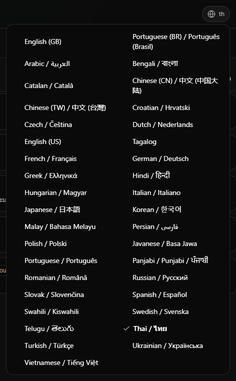
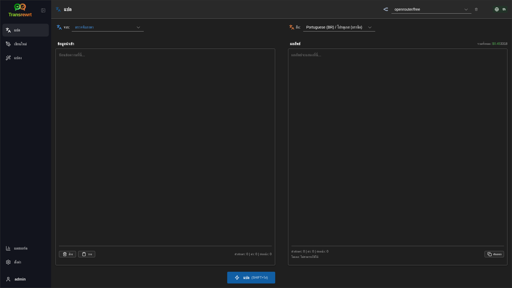
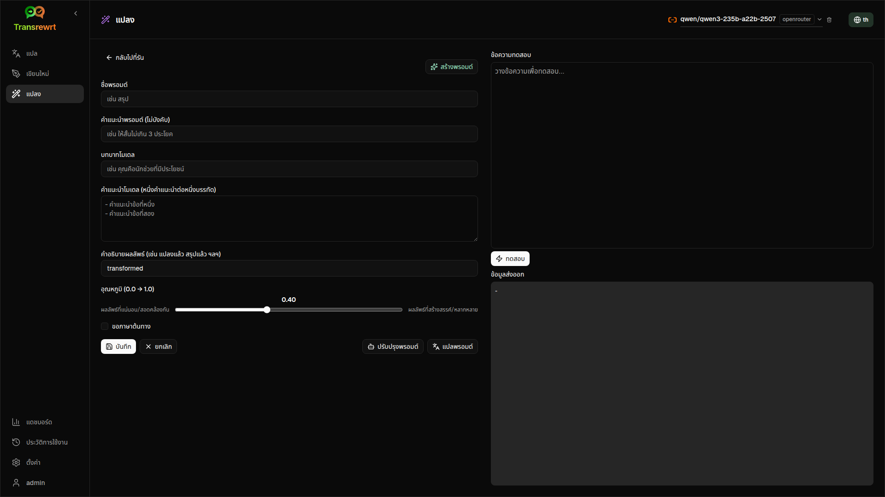
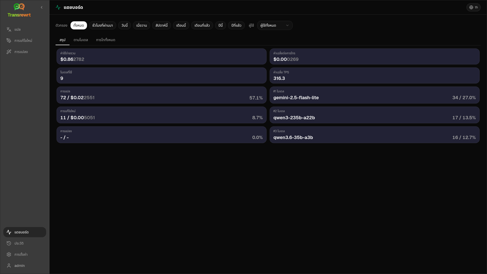
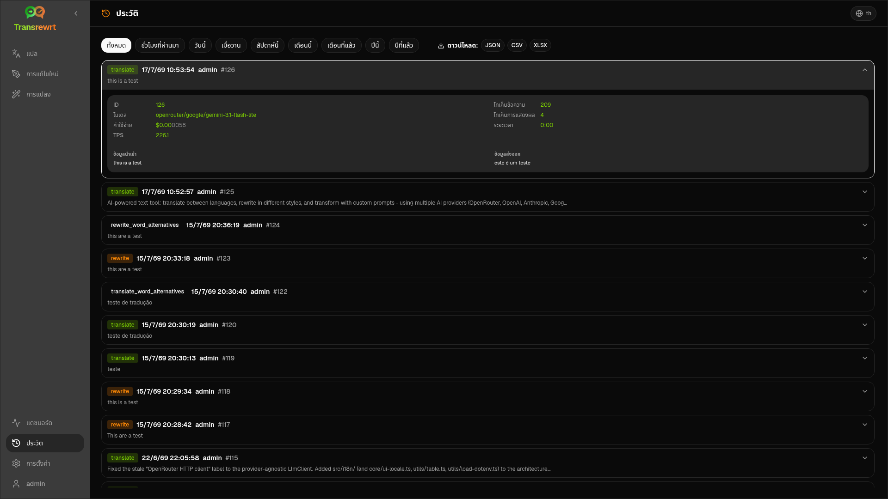
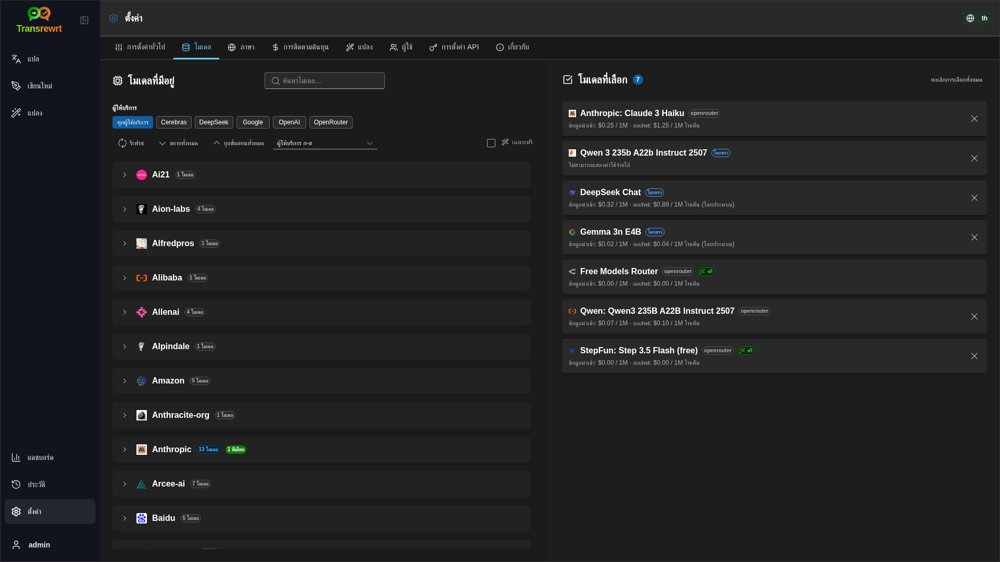

<p align="center">
  
</p>

<p align="center">
  <a href="https://github.com/wsj-br/transrewrt/releases"></a>
  <a href="LICENSE"></a>
  
  
  
</p>

เครื่องมือข้อความที่ขับเคลื่อนด้วยปัญญาประดิษฐ์: แปลระหว่างภาษา เขียนใหม่ในรูปแบบต่างๆ และแปลงด้วยคำสั่งที่กำหนดเอง — โดยใช้ผู้ให้บริการปัญญาประดิษฐ์หลายราย (OpenRouter, OpenAI, Anthropic, Google Gemini, DeepSeek, Groq, Mistral, xAI และ Ollama ท้องถิ่น) ใช้งานได้ทั้งในรูปแบบแอปเดสก์ท็อป (Electron) หรือแอปเว็บที่ติดตั้งเอง (Docker)

- **แปล** - ระหว่างภาษาต่างๆ ได้หลายสิบภาษา โดยตรวจจับภาษาต้นทางอัตโนมัติ
- **เขียนใหม่** - แก้ไขไวยากรณ์ ปรับให้ชัดเจนขึ้น ปรับระดับความเป็นทางการ/ไม่เป็นทางการ ย่อให้สั้นลง ขยายให้ยาวขึ้น หรือปรับให้เชิงเทคนิค
- **แปลง** - พรอมต์ปัญญาประดิษฐ์แบบกำหนดเอง; สร้างและจัดการพรอมต์ พร้อมเลือกภาษาเป้าหมายต่อพรอมต์ได้ตามต้องการ
- **ประวัติการใช้งาน** - ประวัติการดำเนินการทั้งหมดพร้อมข้อมูลนำเข้า/ข้อความส่งออก การกรองข้อมูล และการส่งออก
- **โมเดลและค่าใช้จ่าย** - เลือกโมเดลจากผู้ให้บริการที่ตั้งค่าไว้ได้ทุกราย; แดชบอร์ดแสดงค่าใช้จ่ายและการใช้งาน พร้อมบันทึกย่อ สรุปตามโมเดล/การดำเนินการ/วัน
- **UI** - อินเทอร์เฟซหลายภาษา (มากกว่า 30 ภาษา รองรับ RTL), ฟอนต์, ...
- **โหมดเว็บ** - รองรับผู้ใช้หลายคน พร้อมบทบาทผู้ดูแลระบบ
- **เดสก์ท็อป** - แอปพลิเคชัน Electron สำหรับ Windows และ Linux
- **โฮสต์ด้วยตนเอง** - รูปภาพ Docker สำหรับ amd64 และ arm64 (พร้อมใช้งานกับ Raspberry Pi)

เมื่อติดตั้งแล้ว ดู [**คู่มือผู้ใช้**](USER-GUIDE.th.md) เพื่อดูคำแนะนำการใช้งานคุณสมบัติทั้งหมดอย่างละเอียด

<small>**อ่านเป็นภาษาอื่น:** </small>
<small id="lang-list">[English (GB)](../README.md) · [Português (Brasil)](./README.pt-BR.md) · [العربية](./README.ar.md) · [বাংলা](./README.bn.md) · [Català](./README.ca.md) · [中文 (中国大陆)](./README.zh-CN.md) · [中文 (台灣)](./README.zh-TW.md) · [Hrvatski](./README.hr.md) · [Čeština](./README.cs.md) · [Nederlands](./README.nl.md) · [English (US)](./README.en-US.md) · [Tagalog](./README.tl.md) · [Français](./README.fr.md) · [Deutsch](./README.de.md) · [Ελληνικά](./README.el.md) · [हिन्दी](./README.hi.md) · [Magyar](./README.hu.md) · [Italiano](./README.it.md) · [日本語](./README.ja.md) · [한국어](./README.ko.md) · [Bahasa Melayu](./README.ms.md) · [فارسی](./README.fa.md) · [Polski](./README.pl.md) · [Basa Jawa](./README.jv.md) · [Português](./README.pt.md) · [ਪੰਜਾਬੀ](./README.pa.md) · [Română](./README.ro.md) · [Русский](./README.ru.md) · [Slovenčina](./README.sk.md) · [Español](./README.es.md) · [Kiswahili](./README.sw.md) · [Svenska](./README.sv.md) · [తెలుగు](./README.te.md) · [ไทย](./README.th.md) · [Türkçe](./README.tr.md) · [Українська](./README.uk.md) · [Tiếng Việt](./README.vi.md)</small>

<small>

> **หมายเหตุเกี่ยวกับการแปลอินเตอร์เฟซและเอกสาร:** ภาษาอินเตอร์เฟซทั้งหมดยกเว้นภาษาอังกฤษ (สหราชอาณาจักร) ต้นฉบับ 
> ได้รับการแปลโดยใช้โมเดลปัญญาประดิษฐ์; คำแปลอาจไม่แม่นยำหรือมีข้อผิดพลาด

</small>

<br/>

<a id="table-of-contents"></a>
## สารบัญ

<!-- START doctoc generated TOC please keep comment here to allow auto update -->
<!-- DON'T EDIT THIS SECTION, INSTEAD RE-RUN doctoc TO UPDATE -->

- [ภาพหน้าจอ](#screenshots)
- [เริ่มต้นอย่างรวดเร็ว](#quick-start)
- [การรับคีย์ API ของ OpenRouter](#getting-an-openrouter-api-key)
- [การตั้งค่าและสภาพแวดล้อม](#configuration-and-environment)
- [การพัฒนาและสถาปัตยกรรม](#development-and-architecture)
- [การรายงานปัญหา](#reporting-issues)
- [ข้อจำกัดความรับผิดชอบ](#disclaimer)
- [ลิขสิทธิ์](#license)

<!-- END doctoc generated TOC please keep comment here to allow auto update -->

<br/><br/>

<a id="screenshots"></a>
## ภาพหน้าจอ

**ตัวเลือกภาษา**



**แปล**



**แปลง - ตัวแก้ไขคำสั่ง**



**แดชบอร์ด**



**ประวัติ**



**ตั้งค่า - การเลือกโมเดล**



<br/><br/>

<a id="quick-start"></a>
## เริ่มต้นอย่างรวดเร็ว

<details>
<summary><b>Docker (แนะนำสำหรับการโฮสต์ด้วยตัวเอง)</b></summary>

<a id="docker"></a>

<br/>

```bash
docker pull ghcr.io/wsj-br/transrewrt:latest

OPENROUTER_API_KEY=sk-or-your-key docker run -d \
  -p 5000:5000 \
  -v transrewrt-data:/app/data \
  -e OPENROUTER_API_KEY \
  --name transrewrt-web \
  ghcr.io/wsj-br/transrewrt:latest
```

แทนที่ `sk-or-your-key` ด้วย [คีย์ API ของ OpenRouter](https://openrouter.ai/keys) (หรือตั้งค่าคีย์ผู้ให้บริการอื่น ๆ; ดูที่ [การตั้งค่า](#configuration-and-environment)) เปิด [http://localhost:5000](http://localhost:5000) และเปลี่ยนรหัสผ่านผู้ดูแลระบบเริ่มต้นก่อนที่จะเปิดให้บริการภายนอก

ตั้งค่าคีย์ผู้ให้บริการอย่างน้อยหนึ่งคีย์ผ่านตัวแปรสภาพแวดล้อม (ตัวอย่างเช่น `OPENROUTER_API_KEY` สำหรับ OpenRouter) ส่งตัวแปรด้วย `-e` หรือ `docker compose` / `.env` เพื่อไม่ให้ข้อมูลลับถูกฝังลงในอิมเมจ คีย์ผู้ให้บริการ **ไม่ได้** ป้อนผ่านเว็บ UI; เซิร์ฟเวอร์จะอ่านจากสภาพแวดล้อม

<br/>

> ℹ️ **หมายเหตุ**<br/>
> ใน Docker ข้อมูลรับรอง LLM จะถูกตั้งผ่านตัวแปรสภาพแวดล้อม เช่น `OPENROUTER_API_KEY`, `OPENAI_API_KEY`, `CEREBRAS_API_KEY`, … (ไม่ใช่ในเว็บ UI) ในระบบเดสก์ท็อป (Electron) คุณตั้งค่าคีย์ใน **ตั้งค่า → API**

<br/>

หรือใช้ Docker Compose:

```bash
# download the compose file
wget https://github.com/wsj-br/transrewrt/raw/refs/heads/master/production.yml -O transrewrt.yml
# Edit the file to add your API keys (API_KEYs), or uncomment and adjust the `.env` file. Set the timezone (TZ) if necessary.
vi transrewrt.yml
# start the container
docker compose -f transrewrt.yml up -d
```

ดูที่ [การตั้งค่า](#configuration-and-environment) สำหรับตัวแปรสภาพแวดล้อมทั้งหมด เช่น `PORT`, `CONFIG_PATH`, `TZ`, และคีย์ LLM (`OPENROUTER_API_KEY`, `OPENAI_API_KEY`, …)

</details>

<br/>

<details>
<summary><b>เขตเวลาของเซิร์ฟเวอร์ (Docker)</b></summary>

<a id="configuring-the-timezone"></a>

<br/>

วันที่และเวลาในอินเทอร์เฟซผู้ใช้จะตาม **ภูมิภาคและเขตเวลาของเบราว์เซอร์** สำหรับพฤติกรรมฝั่ง **เซิร์ฟเวอร์** (การบันทึกข้อมูลและอื่น ๆ) คอนเทนเนอร์จะใช้ตัวแปรสภาพแวดล้อม `TZ` ค่าเริ่มต้นคือ `TZ=Europe/London`

หากต้องการใช้เขตเวลาอื่น ให้ตั้งค่า `TZ` ในไฟล์ Compose ของคุณ เช่น:

```yaml
environment:
  - TZ=America/Sao_Paulo
```

หรือส่งผ่านเมื่อรันคอนเทนเนอร์ (Docker):

```bash
--env TZ=America/Sao_Paulo
```

ในโฮสต์ Linux หลายตัว คุณสามารถคัดลอกชื่อเขตเวลาของระบบได้ด้วย:

```bash
echo TZ=\"$(</etc/timezone)\"
```

รายการชื่อเขตเวลาที่ถูกต้องมีอยู่ใน [ฐานข้อมูล tz](https://en.wikipedia.org/wiki/List_of_tz_database_time_zones) (Wikipedia)

</details>

<br/>

<details>
<summary><b>Windows</b></summary>

<a id="windows-electron"></a>

<br/>

- ดาวน์โหลด `Transrewrt Setup x.y.z.exe` ล่าสุดจาก [Releases](https://github.com/wsj-br/transrewrt/releases)
- รันไฟล์ `.exe` และทำตามตัวติดตั้ง
- ครั้งแรกที่รัน: เริ่มแอปจากเมนู Start หรือทางลัดบนเดสก์ท็อป
- ป้อนคีย์ API ของคุณใน **ตั้งค่า → API** คุณต้องตั้งค่าผู้ให้บริการอย่างน้อยหนึ่งราย; OpenRouter เป็นที่นิยมสำหรับโมเดลฟรี

<br/>

> ℹ️ **หมายเหตุ**<br/>
> Windows อาจแสดงคำเตือนความปลอดภัยหนึ่งในนี้ (ปกติสำหรับแอปที่ไม่มีการลงนาม/แอปอิสระ):
>   - **User Account Control (UAC)**: "คุณต้องการอนุญาตให้แอปนี้จากผู้เผยแพร่ที่ไม่รู้จักทำการเปลี่ยนแปลงอุปกรณ์ของคุณหรือไม่?" → คลิก **ใช่**
>   - **Microsoft Defender SmartScreen**: "Windows ป้องกัน PC ของคุณ" → คลิก **ข้อมูลเพิ่มเติม** → **รันอย่างไรก็ตาม**
>
> สิ่งนี้เกิดขึ้นเนื่องจากแอปไม่ได้รับการลงนามโดย Microsoft หรือผู้เผยแพร่รายใหญ่ — ปลอดภัยหากดาวน์โหลดจาก GitHub Releases อย่างเป็นทางการของเรา (ตรวจสอบ checksums บนหน้า [Releases](https://github.com/wsj-br/transrewrt/releases) พร้อมกับแต่ละไฟล์)

<br/>

</details>

<br/>

<details>
<summary><b>Linux</b></summary>

<a id="linux-electron"></a>

<br/>

ดาวน์โหลด `.AppImage` สำหรับ CPU ของคุณจาก [Releases](https://github.com/wsj-br/transrewrt/releases) (`x64` สำหรับพีซีทั่วไป, `arm64` สำหรับอุปกรณ์ ARM หลายรุ่น รวมถึง Raspberry Pi 4+) จากนั้น:

```bash
chmod +x Transrewrt-x.y.z-x64.AppImage && ./Transrewrt-x.y.z-x64.AppImage
```

บน x86_64/amd64 ให้ใช้ชื่อไฟล์ `x64`; บน ARM64 ให้ใช้ชื่อ `...-arm64.AppImage`

ป้อนรหัส API ของคุณใน **ตั้งค่า → API** คุณต้องตั้งค่าผู้ให้บริการอย่างน้อยหนึ่งราย โดย OpenRouter เป็นที่นิยมสำหรับโมเดลฟรี

**ข้อความในคอนโซล:** การสร้างแพ็คเกจสำหรับ Linux (`x64` และ `arm64` AppImages) จะปิดการแจ้งเตือนการเลิกใช้ Node ในเทอร์มินัล (เช่น โมดูล `punycode` ที่มีอยู่ในตัว) หาก Chromium แสดงข้อผิดพลาด GPU / EGL เช่น “GLES3 ไม่รองรับ” แต่แอปยังทำงานได้ คุณสามารถปิดเสียงเหล่านี้ได้โดยปิดการใช้งานฮาร์ดแวร์เร่งความเร็ว:

```bash
TRANSREWRT_DISABLE_GPU=1 ./Transrewrt-x.y.z-arm64.AppImage
```

นี่ใช้ได้กับ amd64 เช่นกัน; เปลี่ยนชื่อไฟล์ให้ตรงกับที่คุณดาวน์โหลด

บน Debian/Ubuntu คุณอาจต้องติดตั้งไลบรารี **runtime** เพิ่มเติมที่ Chromium ต้องการ (โดยทั่วไปจะมีอยู่แล้วในการติดตั้งเดสก์ท็อปแบบเต็ม) รันคำสั่งด้านล่างหากจำเป็น:

```bash
sudo apt update
sudo apt install -y libfuse2 libgtk-3-0 libnotify4 libnss3 libnspr4 libxss1 libxtst6 xdg-utils \
     xauth libatspi2.0-0 libdrm2 libgbm1 libxcb-dri3-0 libcups2 libasound2t64
```

แทนที่ `libasound2t64` ด้วย `libasound2` สำหรับ `arm64` การติดตั้งแบบมินิมอลหรือแบบกำหนดเองอาจยังล้มเหลวเนื่องจากไฟล์ `.so` หายไป ติดตั้งแพ็คเกจที่ระบุในข้อความแสดงข้อผิดพลาด (ส่วนเสริมที่พบบ่อย: `libatk1.0-0`, `libatk-bridge2.0-0`, `libgbm1`, `libdrm2`) ในบางสภาพแวดล้อม คุณอาจต้องรันแอปโดยใช้ `APPIMAGE_EXTRACT_AND_RUN=1 ./Transrewrt-….AppImage`

<br/>

> ℹ️ **หมายเหตุ**<br/>
> ขณะนี้ไม่รองรับ macOS Transrewrt มีให้ใช้งานบน Windows, Linux และ Docker

</details>

<br/>

เมื่อแอปพลิเคชันเริ่มทำงานแล้ว ดู [**คู่มือผู้ใช้**](USER-GUIDE.th.md) เพื่อเรียนรู้วิธีการแปล เขียนใหม่ และแปลงข้อความ จัดการพรอมต์ และกำหนดค่าโมเดล

<br/><br/>

<a id="getting-an-openrouter-api-key"></a>
## รับคีย์ API จาก OpenRouter

Transrewrt รองรับผู้ให้บริการ AI หลายราย [OpenRouter](https://openrouter.ai) เป็นตัวเลือกยอดนิยมเพราะรวมโมเดลหลายตัวไว้ภายใต้คีย์เดียวและมีโมเดลฟรี

1. สมัครหรือเข้าสู่ระบบที่ [openrouter.ai](https://openrouter.ai)
2. เปิดหน้า [Keys](https://openrouter.ai/keys) และสร้างคีย์ใหม่ (ตั้งชื่อ และตั้งขีดจำกัดเครดิตได้ตามต้องการ) คุณสามารถใช้โมเดลฟรีได้โดยไม่ต้องเติมเครดิต
3. **เดสก์ท็อป (Electron):** วางคีย์ใน **ตั้งค่า → API** **Docker:** ตั้งค่าตัวแปรสภาพแวดล้อม เช่น `OPENROUTER_API_KEY` (ดู [เริ่มต้นใช้งานอย่างรวดเร็ว](#quick-start))

อย่าใช้โมเดล **Body Builder** ของ OpenRouter ([`openrouter/bodybuilder`](https://openrouter.ai/openrouter/bodybuilder)) สำหรับการแปล เขียนใหม่ หรือแปลง: เพราะจะคืนค่าเพย์โหลดคำขอ JSON ไม่ใช่ข้อความที่สำเร็จแล้วสำหรับงานเหล่านั้น ดู [ตั้งค่า → โมเดล](USER-GUIDE.th.md#models) ในคู่มือผู้ใช้

คุณยังสามารถใช้ผู้ให้บริการอื่นๆ (OpenAI, Anthropic, Google Gemini, DeepSeek, Groq, Mistral, xAI, Cerebras) หรือรันโมเดลในเครื่องด้วย [Ollama](https://ollama.com) ดูที่ [การตั้งค่า](#configuration-and-environment) เพื่อดูรายการผู้ให้บริการที่รองรับและตัวแปรสภาพแวดล้อมทั้งหมด

</br>

> ⚠️ **คำเตือน**<br/>
> หากคุณใช้ Ollama จากอุปกรณ์ คอนเทนเนอร์ หรือบริการอื่น อย่าลืมตั้งค่า Ollama ให้อนุญาตการเชื่อมต่อจากภายนอก (ไม่ใช่เฉพาะ localhost)

<br/><br/>

<a id="configuration-and-environment"></a>
## การตั้งค่าและสภาพแวดล้อม

</br>

**ตำแหน่งไฟล์การตั้งค่า**

| การติดตั้ง         | ตำแหน่งการตั้งค่า                                   |
| ------------------ | ------------------------------------------------- |
| Electron (Windows) | `%APPDATA%\transrewrt\`                           |
| Electron (Linux)   | `~/.config/transrewrt/`                           |
| Web / Docker       | `/app/data/config.json` (ใช้ volume เพื่อเก็บข้อมูลถาวร) |

<br/>

**ตัวแปรสภาพแวดล้อม** (เฉพาะเว็บ/ด็อกเกอร์; Electron ใช้ไฟล์การตั้งค่าท้องถิ่น)

| ตัวแปร             | คำอธิบาย                                                                  |
|----------------------|------------------------------------------------------------------------------|
| `PORT`               | พอร์ตที่เซิร์ฟเวอร์รับฟัง (ค่าเริ่มต้นคือ `5000`)                                  |
| `CONFIG_PATH`        | ตำแหน่งไฟล์การตั้งค่า (ค่าเริ่มต้นคือ `/app/data/config.json`)                |
| `TZ`                 | เขตเวลาสำหรับเวลาฝั่งเซิร์ฟเวอร์ (การบันทึกข้อมูล ฯลฯ) (ค่าเริ่มต้นคือ `Europe/London`) |
| `HISTORY_DISABLED`   | บังคับปิดการบันทึกประวัติการใช้งาน (ตัวเลือก ค่าเริ่มต้นคือ `false`)                  |
| `OPENROUTER_API_KEY` | คีย์ API ของ OpenRouter                                                           |
| `OPENAI_API_KEY`     | คีย์ API ของ OpenAI                                                               |
| `CEREBRAS_API_KEY`   | คีย์ API ของ Cerebras                                                             |
| `ANTHROPIC_API_KEY`  | คีย์ API ของ Anthropic                                                            |
| `GOOGLE_API_KEY`     | คีย์ API ของ Google Gemini                                                        |
| `DEEPSEEK_API_KEY`   | คีย์ API ของ DeepSeek                                                             |
| `GROQ_API_KEY`       | คีย์ API ของ Groq                                                                 |
| `MISTRAL_API_KEY`    | คีย์ API ของ Mistral                                                              |
| `OLLAMA_URL`         | URL พื้นฐานของ Ollama (เช่น `http://host.docker.internal:11434`)                   |
| `XAI_API_KEY`        | คีย์ API ของ xAI                                                                  |

**โหมดความเป็นส่วนตัว:** เพื่อบังคับไม่ติดตามประวัติการใช้งาน ไม่ว่าจะตั้งค่า `config.json` หรือการตั้งค่าตามผู้ใช้ ให้ตั้งค่า `HISTORY_DISABLED` เป็น `true` หรือ `1` (ไม่แยกตัวพิมพ์ใหญ่-เล็ก) สำหรับ **กระบวนการเว็บ/เซิร์ฟเวอร์ Docker** และ/หรือ **กระบวนการหลักของแอปเดสก์ท็อป Electron** (เช่น ตั้งในระบบหรือตัวเริ่มโปรแกรม — ไม่ใช่เฉพาะตัวเรนเดอร์) สิ่งนี้จะปิดการจัดเก็บประวัติข้อมูลนำเข้า/ส่งออก ล็อก **ตั้งค่า → การตั้งค่าทั่วไป → ประวัติการใช้งาน** และบล็อก API ที่เกี่ยวข้องกับประวัติการใช้งาน

กรุณาตั้งค่าเฉพาะผู้ให้บริการที่คุณใช้งานเท่านั้น รหัสโมเดลจะถูกจัดกลุ่มตาม namespace (`openrouter/…`, `openai/…`, `cerebras/…`, `ollama/…`, ฯลฯ)

**การแสดงค่าใช้จ่าย:** OpenRouter จะส่งกลับค่าใช้จ่ายที่เรียกเก็บจริงเมื่อเกี่ยวข้อง ผู้ให้บริการอื่นจะใช้ค่าใช้จ่าย**โดยประมาณ**จากราคาโมเดลสาธารณะของ OpenRouter เมื่อมีคีย์ OpenRouter; หากไม่มี ค่าใช้จ่ายจากผู้ให้บริการที่ไม่ใช่ OpenRouter อาจแสดงเป็น `0` ตัวประมาณการไม่ใช่ใบแจ้งหนี้

<br/>

**ข้อมูลและการเก็บรักษา:** สำหรับ Docker ให้ติดตั้ง volume ที่ `/app/data` เพื่อให้ `config.json` และฐานข้อมูล SQLite ยังคงอยู่หลังการรีสตาร์ทคอนเทนเนอร์ หากไม่มี volume ข้อมูลทั้งหมดจะหายไปเมื่อคอนเทนเนอร์หยุดทำงาน

<br/>

**การพิสูจน์ตัวตนทางเว็บ:**

- ผู้ดูแลระบบเริ่มต้น: `admin` / `transrewrt26`
- จัดการผู้ใช้ใน **ตั้งค่า → ผู้ใช้**
- รีเซ็ตรหัสผ่าน: `docker exec <container> reset-web-password '<username>' '<new-password>'`

<br/>

> ⚠️ **คำเตือน**<br/>
> เปลี่ยนรหัสผ่านผู้ดูแลระบบเริ่มต้นทันทีในโฮสต์ที่สามารถเข้าถึงผ่านเครือข่าย

<br/>

การตั้งค่าหลัก (แบบอักษร โมเดล ภาษา ฯลฯ) มีให้ใช้งานในส่วนตั้งค่าของแอปพลิเคชัน

<br/><br/>

<a id="development-and-architecture"></a>
## การพัฒนาและสถาปัตยกรรม

- **การพัฒนา:** การตั้งค่า การสร้างรุ่น การทดสอบ และการติดตั้ง (Electron, Web, Docker) - ดูที่ [dev/DEVELOPMENT.md](../dev/DEVELOPMENT.md)
- **ภาพรวมสถาปัตยกรรมและระบบ:** โครงสร้างโฟลเดอร์ เทคโนโลยีที่ใช้ การตัดสินใจด้านการออกแบบ - ดูที่ [dev/SYSTEM-OVERVIEW.md](../dev/SYSTEM-OVERVIEW.md)

<br/><br/>

<a id="reporting-issues"></a>
## การรายงานปัญหา

เปิดปัญหาที่ [GitHub](https://github.com/wsj-br/transrewrt/issues) โปรดระบุแพลตฟอร์มของคุณ (Windows / Linux / Docker) และเวอร์ชันแอป (แสดงในกล่องโต้ตอบเกี่ยวกับหรือในหน้า Releases)

<br/><br/>

<a id="disclaimer"></a>
## ข้อจำกัดความรับผิดชอบ

ชื่อผลิตภัณฑ์และไอคอนเป็นของเจ้าของที่เกี่ยวข้อง และใช้เพื่อวัตถุประสงค์ในการระบุเท่านั้น ซอฟต์แวร์นี้ไม่เกี่ยวข้องหรือได้รับการรับรองจากแบรนด์ที่ระบุใด ๆ

<br/><br/>

<a id="license"></a>
## ใบอนุญาต

ลิขสิทธิ์ © 2026 วัลเดอมาร์ สกูเดลเลอร์ จูเนียร์

[Apache License 2.0](../LICENSE)
