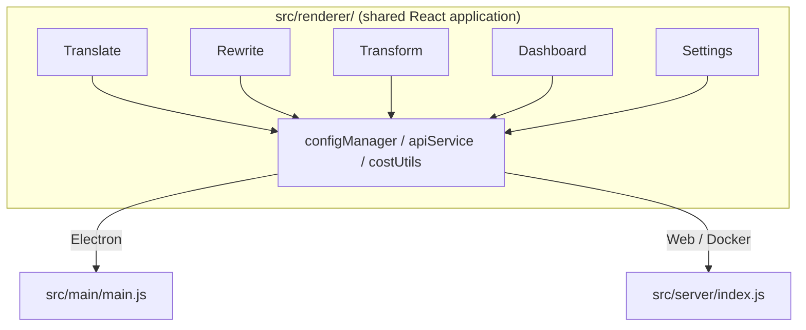

  

<h1 align="center">Transrewrt</h1>

  
  
  
  
  

เครื่องมือข้อความที่ขับเคลื่อนด้วย AI: แปลภาษาระหว่างหลายภาษา, เขียนใหม่ในรูปแบบต่างๆ, และแปลงรูปแบบด้วยคำสั่งที่กำหนดเอง - ทั้งหมดผ่าน [OpenRouter](https://openrouter.ai). ทำงานเป็นแอปเดสก์ท็อประบบ (Electron) หรือแอปเว็บที่โฮสต์ด้วยตัวเอง (Docker).

- **แปล** - ระหว่างหลายภาษา พร้อมการตรวจจับแหล่งที่มาอัตโนมัติ
- **เขียนใหม่** - แก้ไขไวยากรณ์ เพิ่มความชัดเจน 应用于/ไม่เป็นทางการ ย่อ ขยาย เทคนิค
- **แปลงรูปแบบ** - คำสั่ง AI ที่กำหนดเอง; สร้างและจัดการคำสั่ง เลือกภาษาเป้าหมายตามคำสั่งได้
- **โมเดลและต้นทุน** - เลือกโมเดล OpenRouter ได้ทุกแบบ; แดชบอร์ดต้นทุนด้วย log SQLite สรุปตามโมเดล/การทำงาน/วัน
- **UI** - i18n (pt-BR, de, fr, es, RTL), ธีม, แบบอักษร, แป้นพิมพ์ลัด; โหมดเว็บปลอดภัย (คีย์ API อยู่บนเซิร์ฟเวอร์เท่านั้น)
- **เดสก์ท็อป** - แอป Electron สำหรับ Windows และ Linux
- **โฮสต์ด้วยตัวเอง** - Docker image สำหรับ amd64 และ arm64 (พร้อมสำหรับ Raspberry Pi)

หลังติดตั้ง ให้ดูที่ **[คู่มือการใช้](../USER-GUIDE.md)** เพื่อดูการใช้งานทุกฟีเจอร์อย่างครบถ้วน

<small>**อ่านในภาษาอื่น:** [English (UK)](../README.md) · [Português (BR)](README.pt-BR.md) · [العربية](README.ar.md) · [বাংলা](README.bn.md) · [Català](README.ca.md) · [简体中文](README.zh-CN.md) · [繁體中文](README.zh-TW.md) · [Hrvatski](README.hr.md) · [Čeština](README.cs.md) · [Nederlands](README.nl.md) · [English (US)](README.en-US.md) · [Filipino](README.tl.md) · [Français](README.fr.md) · [Deutsch](README.de.md) · [Ελληνικά](README.el.md) · [हिन्दी](README.hi.md) · [Magyar](README.hu.md) · [Italiano](README.it.md) · [日本語](README.ja.md) · [Basa Jawa](README.jv.md) · [한국어](README.ko.md) · [Bahasa Melayu](README.ms.md) · [فارسی](README.fa.md) · [Polski](README.pl.md) · [Português (PT)](README.pt.md) · [ਪੰਜਾਬੀ](README.pa.md) · [Română](README.ro.md) · [Русский](README.ru.md) · [Slovenčina](README.sk.md) · [Español](README.es.md) · [Kiswahili](README.sw.md) · [Svenska](README.sv.md) · [తెలుగు](README.te.md) · [ภาษาไทย](README.th.md) · [Türkçe](README.tr.md) · [Українська](README.uk.md) · [Tiếng Việt](README.vi.md)</small>

## ภาพหน้าจอ

**ตัวเลือกภาษา**

**แปล**

**แปลงรูปแบบ - ตัวแก้ไขคำสั่ง**

**แดชบอร์ด**

**การตั้งค่า - การเลือกโมเดล**

  

## สารบัญ

<!-- START doctoc generated TOC please keep comment here to allow auto update -->
<!-- DON'T EDIT THIS SECTION, INSTEAD RE-RUN doctoc TO UPDATE -->

- [เริ่มต้น](#quick-start)
- [การติดตั้ง](#installation)
  - [Windows (Electron)](#windows-electron)
  - [Linux (Electron)](#linux-electron)
  - [Docker](#docker)
- [การได้รับคีย์ API ของ OpenRouter](#getting-an-openrouter-api-key)
- [การกำหนดค่าและสภาพแวดล้อม](#configuration-and-environment)
- [การพัฒนาและสถาปัตยกรรม](#development-and-architecture)
- [การเผยแพร่และแท็ก](#releases-and-tags)
- [การมีส่วนร่วม](#contributing)
- [ข้อปฏิเสธความรับผิดชอบ](#disclaimer)
- [ใบอนุญาต](#license)

<!-- END doctoc generated TOC please keep comment here to allow auto update -->

  

## การConfigureและenvironment

**Config file locations**

| Deployment         | Config location                                   |
| ------------------ | ------------------------------------------------- |
| Electron (Windows) | `%APPDATA%\transrewrt\`                           |
| Electron (Linux)   | `~/.config/transrewrt/`                           |
| Web / Docker       | `/app/data/config.json` (use a volume to persist) |

 

**Environment variables** (web/Docker เท่านั้น; Electron ใช้ config file ในเครื่อง)

| Variable      | Default                        | Description                                                   |
| ------------- | ------------------------------ | ------------------------------------------------------------- |
| `PORT`        | `5000`                         | Server listening port                                         |
| `CONFIG_PATH` | `/app/data/config.json`        | Path to the config file                                       |
| `API_KEY`     | *(empty)*                      | OpenRouter API key (required for Docker; set via env, not UI) |
| `API_URL`     | `https://openrouter.ai/api/v1` | Upstream AI API base URL                                      |
| `KEY_SEED`    | *(empty)*                      | Transrewrt proxy key seed (overrides config if set)           |

 

**Data and persistence:** สำหรับ Docker, mount volume ที่ `/app/data` เพื่อให้ `config.json` และฐานข้อมูล SQLite ถูกเก็บไว้หลัง container เริ่มทำงานใหม่ หากไม่มี volume ข้อมูลทั้งหมดจะหายเมื่อ container หยุดทำงาน

 

**Web authentication:**

- Default admin: `admin` / `transrewrt26`.
- Manage users in **Settings → Users**.
- Reset a password: `docker exec <container> reset-web-password '<username>' '<new-password>'`
  (จาก source: `pnpm run reset-web-password -- <username> <new-password>`)

 

> ⚠️ **WARNING** 
- เปลี่ยนรหัสผ่าน admin 默认ทันทีบน host ที่เข้าถึงเครือข่ายได้

 

**Transrewrt proxy (optional):** คุณสามารถ route API traffic ผ่าน external proxy ที่ใช้ time-based rolling key ใน **Settings → API**, เปิด **Use Transrewrt Proxy**, ตั้ง **Key seed**, และตั้ง **API URL** เป็น proxy base URL ดูรายละเอียดเพิ่มเติมใน [dev/SYSTEM-OVERVIEW.md](../dev/SYSTEM-OVERVIEW.md)

การตั้งค่าที่สำคัญ (theme, font, models, languages, etc.) มีอยู่ใน Settings dialog หรือสามารถแก้ไขโดยตรงใน config JSON รายชื่อทั้งหมดและค่า default เดิมได้ที่ [dev/DEVELOPMENT.md](../dev/DEVELOPMENT.md)

  

## การพัฒนาและสถาปัตยกรรม

- **Development:** การ setup, build, test, และ deploy (Electron, Web, Docker) - ดู **[dev/DEVELOPMENT.md](../dev/DEVELOPMENT.md)**.
- **Architecture and system overview:** Folder structure, tech stack, design decisions, Transrewrt proxy - ดู **[dev/SYSTEM-OVERVIEW.md](../dev/SYSTEM-OVERVIEW.md)**.

  

## Releases and tags

- **Git tags** `v`* (เช่น `v1.0.10`) ทำงาน trigger [release workflow](.github/workflows/release.yml) **GitHub Releases** แนบ Windows installer (`.exe`) และ Linux AppImage
- **Docker images** เผยแพร่ที่ `ghcr.io/wsj-br/transrewrt` Image tags ตรงกับ Git version (เช่น `v1.0.10` → `ghcr.io/wsj-br/transrewrt:1.0.10`) และ `latest` Multi-arch: `linux/amd64` และ `linux/arm64` (เช่น Raspberry Pi)

  

## การเข้าร่วมร่วมการพัฒนา

1. Fork repository.
2. Create a feature branch: `git checkout -b feature/my-feature`
3. Commit การเปลี่ยนแปลงของคุณด้วยข้อความที่ชัดเจน
4. Push และเปิด Pull Request ไปที่ `main`

โปรดใช้ code style เดิมและทดสอบการเปลี่ยนแปลงของคุณในทั้ง Electron และ web modes ก่อนส่งดู więcejInstructions สำหรับ build และ test ใน [dev/DEVELOPMENT.md](../dev/DEVELOPMENT.md)

 

**Reporting issues:** Open issue บน [GitHub](https://github.com/wsj-br/transrewrt/issues) ระบุ platform ของคุณ (Windows / Linux / Docker) และ app version (แสดงใน About dialog หรือบน Releases page)

  

## คำเตือน

ชื่อผลิตภัณฑ์และไอคอนเป็นµmของเจ้าของที่เกี่ยวข้องและถูกใช้เพื่อแ锈钢ระบุตัวตนอย่างเดียว ซอฟต์แائج์ตัวนี้ไม่ได้รับ facto สนับสนุนหรือรับรองจากแบรนด์ใดๆ ที่กล่าวReferring

  

## ลิขสิทธิ์

Copyright © 2026 Waldemar Scudeller Jr.

[Apache License 2.0](LICENSE)