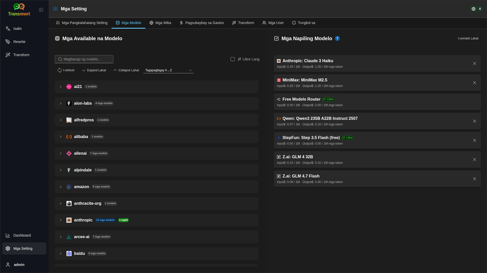
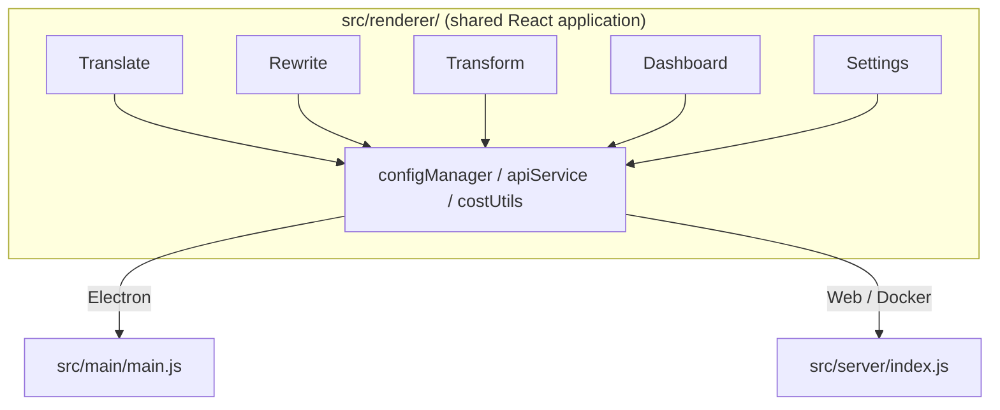

<p align="center">
  
</p>

<h1 align="center">Transrewrt</h1>

<p align="center">
  <a href="https://github.com/wsj-br/transrewrt/releases"></a>
  <a href="LICENSE"></a>
  
  
  
</p>

Kasangkapang pangteksto na pinapagana ng AI: isalin sa pagitan ng mga wika, isulat muli sa magkakaibang estilo, at baguhin ng mga custom na prompt - lahat ay sa pamamagitan ng [OpenRouter](https://openrouter.ai). Nagpapatakbil bilang desktop na aplikasyon (Electron) o bilang self-hosted na web app (Docker).

- **Isalin** - sa pagitan ng mga wika, kasama ang automatiko na pagtuklas sa pinagmumulan
- **Isulat Muli** - ayusin ang grammar, mapabuti ang kalinawan, pormal/hindi pormal, paikliin, palawigin, teknikal
- **Baguhin** - mga custom na AI prompt; gumawa at pamahalaan ang mga prompt, opsyonal na target na wika bawat prompt
- **Mga modelo at gastos** - pumili ng anumang OpenRouter model; dashboard ng gastos kasama ang SQLite log, mga buod ayon sa modelo/operasyon/araw
- **UI** - i18n (pt-BR, de, fr, es, RTL), mga tema, mga font, mga shortcut sa keyboard; secure na mode ng web (API key sa server lang)
- **Desktop** - Electron na aplikasyon para sa Windows at Linux
- **Self-hosted** - Docker na image para sa amd64 at arm64 (handang-Raspberry Pi)

Matapos ma-install, tingnan ang **[Gabay sa Gumagamit](../USER-GUIDE.md)** para sa buong paglalakbay sa lahat ng mga function.

<small>**Basahin sa iba pang mga wika:** [English (UK)](../README.md) · [Português (BR)](README.pt-BR.md) · [العربية](README.ar.md) · [বাংলা](README.bn.md) · [Català](README.ca.md) · [简体中文](README.zh-CN.md) · [繁體中文](README.zh-TW.md) · [Hrvatski](README.hr.md) · [Čeština](README.cs.md) · [Nederlands](README.nl.md) · [English (US)](README.en-US.md) · [Filipino](README.tl.md) · [Français](README.fr.md) · [Deutsch](README.de.md) · [Ελληνικά](README.el.md) · [हिन्दी](README.hi.md) · [Magyar](README.hu.md) · [Italiano](README.it.md) · [日本語](README.ja.md) · [Basa Jawa](README.jv.md) · [한국어](README.ko.md) · [Bahasa Melayu](README.ms.md) · [فارسی](README.fa.md) · [Polski](README.pl.md) · [Português (PT)](README.pt.md) · [ਪੰਜਾਬੀ](README.pa.md) · [Română](README.ro.md) · [Русский](README.ru.md) · [Slovenčina](README.sk.md) · [Español](README.es.md) · [Kiswahili](README.sw.md) · [Svenska](README.sv.md) · [తెలుగు](README.te.md) · [ภาษาไทย](README.th.md) · [Türkçe](README.tr.md) · [Українська](README.uk.md) · [Tiếng Việt](README.vi.md)</small>

<a id="screenshots"></a>
## Mga Screenshot

**Pumili ng wika**


**Isalin**


**Baguhin - editor ng prompt**


**Dashboard**


**Mga setting - pagpili ng modelo**



<br /><br />

<a id="table-of-contents"></a>
## Table of Contents

<!-- START doctoc generated TOC please keep comment here to allow auto update -->
<!-- DON'T EDIT THIS SECTION, INSTEAD RE-RUN doctoc TO UPDATE -->

- [Mabilis na pagsisimula](#quick-start)
- [Pag-install](#installation)
  - [Windows (Electron)](#windows-electron)
  - [Linux (Electron)](#linux-electron)
  - [Docker](#docker)
- [Pagkuha ng OpenRouter API key](#getting-an-openrouter-api-key)
- [Konfigurasyon at kapaligiran](#configuration-and-environment)
- [Pagpapaunlad at arkitektura](#development-and-architecture)
- [Mga release at mga tag](#releases-and-tags)
- [Mga kontribusyon](#contributing)
- [Pagsasabi](#disclaimer)
- [Lisensya](#license)

<!-- END doctoc generated TOC please keep comment here to allow auto update -->

<br /><br />

<a id="quick-start"></a>

## Mabilis na pagbilis

**Docker (inirerekomenda para sa self-hosting)**

```bash
docker pull ghcr.io/wsj-br/transrewrt:latest

API_KEY=sk-or-your-key docker run -d \
  -p 5000:5000 \
  -v transrewrt-data:/app/data \
  -e API_KEY \
  --name transrewrt-web \
  ghcr.io/wsj-br/transrewrt:latest
```

Palitan ang `sk-or-your-key` ng iyong [OpenRouter API key](https://openrouter.ai/keys). Buksan ang [http://localhost:5000](http://localhost:5000) at baguhin ang default na admin password bago ilantad ang serbisyo.

<br />

> ℹ️ **PALIWANAG**<br/>
> Sa Docker, ang OpenRouter API key ay na-set lang sa pamamagitan ng `API_KEY` environment variable ( hindi sa web UI). Sa desktop (Electron), i-paste mo ito sa **Mga Setting → API**.

<br />

**Windows**

I-download ang pinakabagong `Transrewrt Setup x.y.z.exe` mula sa [Releases](https://github.com/wsj-br/transrewrt/releases), patakbuhin ang installer, at ilunsod mula sa Start menu o desktop shortcut. Ilagay ang iyong OpenRouter API key sa **Mga Setting → API**.

<br />

**Linux**

I-download ang `.AppImage` mula sa [Releases](https://github.com/wsj-br/transrewrt/releases), pagkatapos:

```bash
chmod +x Transrewrt-x.y.z.AppImage && ./Transrewrt-x.y.z.AppImage
```

Ilagay ang iyong OpenRouter API key sa **Mga Setting → API**. Sa Debian/Ubuto, maaaring kailanganin mong mag-install ng karagdagang dependencies muna:

```bash
sudo apt install libgtk-3-0 libnotify-dev libnss3 libxss1 libasound2 libxtst6 xauth
```

Tingnan ang [Installation → Linux](#linux-electron) para sa mga detalye.

<br />

> ℹ️ **PALIWANAG**<br/>
> Ang macOS ay kasalukuyang hindi suportado. Ang Transrewrt ay available para sa Windows, Linux, at Docker.

<br />

Kapag nagtatakbo na ang app, tingnan ang **[User Guide](../USER-GUIDE.md)** upang matuto kung paano isalin, baguhin, at baguhin ang teksto, pamahalaan ang mga prompt, at i-configure ang mga model.

<br /><br />

<a id="installation"></a>
## Instalasyon

<a id="windows-electron"></a>
### Windows (Electron)

- I-download ang pinakabagong installer mula sa [Releases](https://github.com/wsj-br/transrewrt/releases).
- Patakbuhin ang `.exe` at sundin ang installer.
* Unang pagtakbo: simulan ang app mula sa Start menu o desktop shortcut. Ang config ay naka-imbak sa `%APPDATA%\transrewrt\`.

<br />

<a id="linux-electron"></a>
### Linux (Electron)

- I-download ang `.AppImage` mula sa [Releases](https://github.com/wsj-br/transrewrt/releases).
- Patakbuhin: `chmod +x Transrewrt-x.y.z.AppImage && ./Transrewrt-x.y.z.AppImage`
- Karagdagang dependencies (Debian/Ubuntu): `sudo apt install libgtk-3-0 libnotify-dev libnss3 libxss1 libasound2 libxtst6 xauth`
- Tingnan ang [dev/DEVELOPMENT.md](../dev/DEVELOPMENT.md) para sa higit pang impormasyon.

<br />

<a id="docker"></a>
### Docker

- Pull: `docker pull ghcr.io/wsj-br/transrewrt:latest`
- Ang OpenRouter API key **dapat** na ma-set sa pamamagitan ng `API_KEY` environment variable. Ipasya ito gamit ang `-e API_KEY` (o sa pamamagitan ng `docker compose` / `.env`) para hindi makita ang key sa process list.
- Hindi maaaring ilagay ang API key sa web UI.

Halimbawa - named volume para sa persistence (API key na ipinasa sa pamamagitan ng env, hindi sa command line):

```bash
API_KEY=sk-or-your-key docker run -d \
  -p 5000:5000 \
  -v transrewrt-data:/app/data \
  -e API_KEY \
  --name transrewrt-web \
  ghcr.io/wsj-br/transrewrt:latest
```

<br />

| Pagpipilian   | Paglalarawan                                                                                                   |
| -------- | ------------------------------------------------------------------------------------------------------------- |
| Port     | `5000` (i-map gamit ang `-p 5000:5000`)                                                                              |
| Volume   | Ikabit ang `/app/data` para sa config at database persistence                                                         |
| Env vars | `PORT`, `CONFIG_PATH`, `API_KEY`, `API_URL`, `KEY_SEED` - tingnan ang [Configuration](#configuration-and-environment) |

Upang ibuild at patakbuhin mula sa source: `docker compose up --build -d` o `pnpm run docker:up` - tingnan ang [dev/DEVELOPMENT.md](../dev/DEVELOPMENT.md).

<br /><br />

<a id="getting-an-openrouter-api-key"></a>
## Pagkuha ng OpenRouter API key

Ginagamit ng Transrewrt ang [OpenRouter](https://openrouter.ai) para sa mga AI model. Kailangan mo ng API key upang isalin, baguhin, o baguhin ang teksto.

1. Mag-sign up o mag-log in sa [openrouter.ai](https://openrouter.ai).
2. Buksan ang pahina ng [Mga Key](https://openrouter.ai/keys) at gumawa ng bagong key (pangalanan ito, at kungyari't mag-set ng credit limit). Maaari mong gamitin ang mga libreng model nang hindi nag-aadd ng credit.
3. **Desktop (Electron):** i-paste ang key sa **Mga Setting → API**. **Docker:** i-set ang `API_KEY` environment variable (tingnan ang [Mabilis na pagbilis](#quick-start)).

Para sa mga limitasyon, BYOK, at higit pa, tingnan ang [OpenRouter authentication](https://openrouter.ai/docs/api/reference/authentication).

<br /><br />

<a id="configuration-and-environment"></a>

## Konfigurasyon at kapaligiran

**Mga lokasyon ng config file**

| Deployment         | Lokasyon ng config                                   |
| ------------------ | ---------------------------------------------------- |
| Electron (Windows) | `%APPDATA%\transrewrt\`                              |
| Electron (Linux)   | `~/.config/transrewrt/`                              |
| Web / Docker       | `/app/data/config.json` (gamitin ang volume para manatili) |

<br />

**Mga environment variable** (web/Docker lang; Electron gumagamit ng lokal na config file)

| Variable      | Default                        | Deskripsyon                                                   |
| ------------- | ------------------------------ | ------------------------------------------------------------- |
| `PORT`        | `5000`                         | Port ng pagbabasa ng server                                   |
| `CONFIG_PATH` | `/app/data/config.json`        | Path sa config file                                          |
| `API_KEY`     | *(walang laman)*               | OpenRouter API key (required para sa Docker; itakda gamit ang env, hindi sa UI) |
| `API_URL`     | `https://openrouter.ai/api/v1` | Base URL ng upstream AI API                                  |
| `KEY_SEED`    | *(walang laman)*               | Transrewrt proxy key seed (nababago ang config kung naka-set) |

<br />

**Data at pagpapatuloy:** Para sa Docker, i-mount ang volume sa `/app/data` upang manatili ang `config.json` at ang SQLite database kahit na restartin ang container. Walang volume, mawawala ang lahat ng data kapag tumigil ang container.

<br />

**Web authentication:**

- Default admin: `admin` / `transrewrt26`.
- Pamahalaan ang mga user sa **Mga Setting → Mga User**.
- Reset ang password: `docker exec <container> reset-web-password '<username>' '<new-password>'`
  (mula sa source: `pnpm run reset-web-password -- <username> <new-password>`)

<br />

> ⚠️ **BABALA**<br/>
> Baguhin agad ang default na password ng admin kahit sa host na na-access sa network.

<br />

**Transrewrt proxy (opsyonal):** Maari mong i-route ang API traffic sa pamamagitan ng isang external proxy na gumagamit ng time-based rolling key. Sa **Mga Setting → API**, paganahin ang **Gamitin ang Transrewrt Proxy**, itakda ang **Key seed**, at itakda ang **API URL** sa base URL ng proxy. Tingnan ang [dev/SYSTEM-OVERVIEW.md](../dev/SYSTEM-OVERVIEW.md) para sa mga detalye.

Ang mga pangunahing setting (tema, font, mga model, mga wika, atbp.) ayAvailable sa dialog ng Settings o maaaring baguhin nang direkta sa config JSON. Ang buong listahan at mga default ay naka-dokumento sa [dev/DEVELOPMENT.md](../dev/DEVELOPMENT.md).

<br /><br />

<a id="development-and-architecture"></a>
## Pag-unlad at arkitektura

- **Pag-unlad:** Setup, build, test, at deploy (Electron, Web, Docker) - tingnan ang **[dev/DEVELOPMENT.md](../dev/DEVELOPMENT.md)**.
- **Arkitektura at system overview:**Folder structure, tech stack, design decisions, Transrewrt proxy - tingnan ang **[dev/SYSTEM-OVERVIEW.md](../dev/SYSTEM-OVERVIEW.md)**.



<br /><br />

<a id="releases-and-tags"></a>
## Mga release at tags

- **Git tags** `v`* (hal. `v1.0.10`) ang nagt-trigger ng [release workflow](.github/workflows/release.yml). **GitHub Releases** ang nag-a-attach ng Windows installer (`.exe`) at Linux AppImage.
- **Docker images** ay ina-publish sa `ghcr.io/wsj-br/transrewrt`. Ang mga image tag ay tumutugma sa Git version (hal. `v1.0.10` → `ghcr.io/wsj-br/transrewrt:1.0.10`) plus `latest`. Multi-arch: `linux/amd64` at `linux/arm64` (hal. Raspberry Pi).

<br /><br />

<a id="contributing"></a>
## Pagbabahagi

1. Fork ang repositoryo.
2. Gumawa ng feature branch: `git checkout -b feature/my-feature`
3. I-commit ang iyong mga pagbabago na may malinaw na mensahe.
4. I-push at magbukas ng Pull Request laban sa `main`.

Mangyong sundin ang kasalukuyang code style at i-test ang iyong mga pagbabago sa parehong Electron at web modes bago magsumite. Tingnan ang [dev/DEVELOPMENT.md](../dev/DEVELOPMENT.md) para sa mga instructions sa build at test.

<br />

**Pag-report ng mga isyu:** Magbukas ng isyu sa [GitHub](https://github.com/wsj-br/transrewrt/issues). Isama ang iyong platform (Windows / Linux / Docker) at app version (naka-display sa About dialog o sa页面 ng Releases).

<br /><br />

<a id="disclaimer"></a>

## Paunawa

Ang mga pangalan ng produkto at mga icon ay pagmamay-ari ng mga kororesponding na may-ari at ginagamit lamang para sa layuning pagtukoy. Ang software na ito ay hindi konektado o suportado ng alinman sa mga brand na binanggit.

<br /><br />

<a id="license"></a>
## Lisensya

Copyright © 2026 Waldemar Scudeller Jr.

[Lisensya ng Apache 2.0](LICENSE)