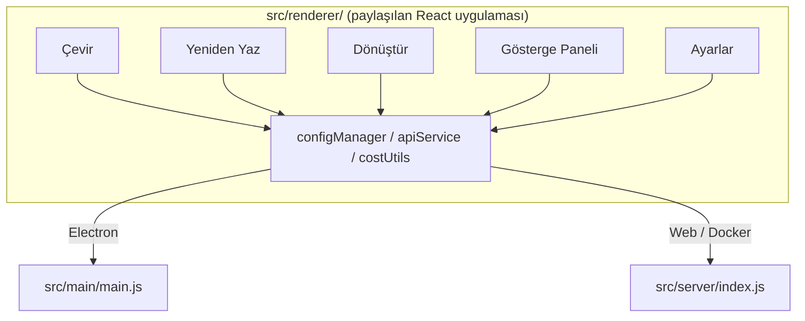

<p align="center">
  
</p>

<h1 align="center">Transrewrt</h1>

<p align="center">
  <a href="https://github.com/wsj-br/transrewrt/releases"></a>
  <a href="LICENSE"></a>
  
  
  
</p>

Yapay zeka destekli metin aracı: diller arasında çeviri yapın, farklı stillerde yeniden yazın ve özel istemlerle dönüştürün - tümü [OpenRouter](https://openrouter.ai) üzerinden. Masaüstü uygulama (Electron) veya kendi kendine barındırılan web uygulaması (Docker) olarak çalışır.

- **Çeviri** - düzine yakın dil arasında, otomatik kaynak algılama ile
- **Yeniden Yaz** - dilbilgisi düzelt, netliği artır, resmi/gayriresmi, kısalt, genişlet, teknik
- **Dönüştür** - özel yapay zeka istemleri; istem oluştur ve yönet, istem başına isteğe bağlı hedef dili
- **Modeller ve maliyet** - herhangi bir OpenRouter modelini seçin; SQLite günlüğü ile maliyet panosu, model/işlem/gün özetleri
- **Arayüz** - i18n (pt-BR, de, fr, es, RTL), temalar, yazı tipleri, klavye kısayolları; güvenli web modu (API anahtarı yalnızca sunucuda)
- **Masaüstü** - Windows ve Linux için Electron uygulaması
- **Kendi kendine barındırma** - amd64 ve arm64 (Raspberry Pi hazır) için Docker imajı

Kurulum tamamlandıktan sonra, tüm özelliklerin kapsamlı bir turu için **[Kullanım Kılavuzu](../USER-GUIDE.md)** sayfasına bakın.

<small>**Diğer dillerde oku:** [İngilizce (UK)](../README.md) · [Português (BR)](README.pt-BR.md) · [العربية](README.ar.md) · [বাংলা](README.bn.md) · [Català](README.ca.md) · [简体中文](README.zh-CN.md) · [繁體中文](README.zh-TW.md) · [Hrvatski](README.hr.md) · [Čeština](README.cs.md) · [Nederlands](README.nl.md) · [İngilizce (US)](README.en-US.md) · [Filipino](README.tl.md) · [Français](README.fr.md) · [Deutsch](README.de.md) · [Ελληνικά](README.el.md) · [हिन्दी](README.hi.md) · [Magyar](README.hu.md) · [Italiano](README.it.md) · [日本語](README.ja.md) · [Basa Jawa](README.jv.md) · [한국어](README.ko.md) · [Bahasa Melayu](README.ms.md) · [فارسی](README.fa.md) · [Polski](README.pl.md) · [Português (PT)](README.pt.md) · [ਪੰਜਾਬੀ](README.pa.md) · [Română](README.ro.md) · [Русский](README.ru.md) · [Slovenčina](README.sk.md) · [Español](README.es.md) · [Kiswahili](README.sw.md) · [Svenska](README.sv.md) · [తెలుగు](README.te.md) · [ภาษาไทย](README.th.md) · [Türkçe](README.tr.md) · [Українська](README.uk.md) · [Tiếng Việt](README.vi.md)</small>

<a id="screenshots"></a>
## Ekran Görüntüleri

**Dil seçici**


**Çeviri**


**Dönüştür - istem düzenleyici**


**Pano**


**Ayarlar - model seçimi**


<br /><br />

<a id="table-of-contents"></a>
## İçindekiler Tablosu

<!-- START doctoc generated TOC please keep comment here to allow auto update -->
<!-- DON'T EDIT THIS SECTION, INSTEAD RE-RUN doctoc TO UPDATE -->

- [Hızlı başlangıç](#hızlı-başlangıç)
- [Kurulum](#kurulum)
  - [Windows (Electron)](#windows-electron)
  - [Linux (Electron)](#linux-electron)
  - [Docker](#docker)
- [OpenRouter API anahtarı almak](#getting-an-openrouter-api-key)
- [Yapılandırma ve ortam](#configuration-and-environment)
- [Geliştirme ve mimari](#development-and-architecture)
- [Sürümler ve etiketler](#releases-and-tags)
- [Katılım](#contributing)
- [Sorumluluk reddi](#disclaimer)
- [Lisans](#license)

<!-- END doctoc generated TOC please keep comment here to allow auto update -->

<br /><br />

<a id="quick-start"></a>

## Hızlı başlangıç

**Docker (kendi kendine barındırma için önerilen)**

```bash
docker pull ghcr.io/wsj-br/transrewrt:latest

API_KEY=sk-or-your-key docker run -d \
  -p 5000:5000 \
  -v transrewrt-data:/app/data \
  -e API_KEY \
  --name transrewrt-web \
  ghcr.io/wsj-br/transrewrt:latest
```

`sk-or-your-key` yerini, [OpenRouter API anahtarınız](https://openrouter.ai/keys) ile değiştirin. [http://localhost:5000](http://localhost:5000) adresini açın ve hizmeti dışarıdan erişilebilir yapmadan önce varsayılan yönetici şifresini değiştirin.

<br />

> ℹ️ **NOT**<br/>
> Docker'da OpenRouter API anahtarı yalnızca `API_KEY` ortam değişkeni aracılığıyla ayarlanır (web kullanıcı arayüzünde değil). Masaüstü (Electron) sürümünde **Ayarlar → API** bölümüne yapıştırırsınız.

<br />

**Windows**

En son `Transrewrt Setup x.y.z.exe` dosyasını [Releases](https://github.com/wsj-br/transrewrt/releases) sayfasından indirin, yükleyiciyi çalıştırın ve ardından Başlat menüsünden veya masaüstü kısayolundan başlatın. OpenRouter API anahtarınızı **Ayarlar → API** bölümüne girin.

<br />

**Linux**

[Releases](https://github.com/wsj-br/transrewrt/releases) sayfasından `.AppImage` dosyasını indirin ve:

```bash
chmod +x Transrewrt-x.y.z.AppImage && ./Transrewrt-x.y.z.AppImage
```

OpenRouter API anahtarınızı **Ayarlar → API** bölümüne girin. Debian/Ubuntu'da önce ek bağımlılıkları yüklemeniz gerekebilir:

```bash
sudo apt install libgtk-3-0 libnotify-dev libnss3 libxss1 libasound2 libxtst6 xauth
```

Ayrıntılar için [Kurulum → Linux](#linux-electron) bölümüne bakın.

<br />

> ℹ️ **NOT**<br/>
> Şu an macOS desteklenmiyor. Transrewrt Windows, Linux ve Docker için mevcuttur.

<br />

Uygulama çalıştıktan sonra, metin çevirmeyi, yeniden yazmayı ve dönüştürmeyi, istemleri yönetmeyi ve modelleri yapılandırmayı öğrenmek için **[Kullanıcı Kılavuzu](../USER-GUIDE.md)** sayfasına bakın.

<br /><br />

<a id="installation"></a>
## Kurulum

<a id="windows-electron"></a>
### Windows (Electron)

- En son yükleyiciyi [Releases](https://github.com/wsj-br/transrewrt/releases) sayfasından indirin.
- `.exe` dosyasını çalıştırın ve yükleyiciyi takip edin.
- İlk çalıştırma: Uygulamayı Başlat menüsünden veya masaüstü kısayolundan başlatın. Yapılandırma `%APPDATA%\transrewrt\` dizininde saklanır.

<br />

<a id="linux-electron"></a>
### Linux (Electron)

- [Releases](https://github.com/wsj-br/transrewrt/releases) sayfasından `.AppImage` dosyasını indirin.
- Çalıştırma: `chmod +x Transrewrt-x.y.z.AppImage && ./Transrewrt-x.y.z.AppImage`
- Ek bağımlılıklar (Debian/Ubuntu): `sudo apt install libgtk-3-0 libnotify-dev libnss3 libxss1 libasound2 libxtst6 xauth`
- Daha fazla bilgi için [dev/DEVELOPMENT.md](../dev/DEVELOPMENT.md) dosyasına bakın.

<br />

<a id="docker"></a>
### Docker

- Çek: `docker pull ghcr.io/wsj-br/transrewrt:latest`
- OpenRouter API anahtarı **kesinlikle** `API_KEY` ortam değişkeni aracılığıyla ayarlanmalıdır. Anahtarın işlem listesinde görünmemesi için `-e API_KEY` ile geçirin (veya `docker compose` / `.env` aracılığıyla).
- API anahtarı web kullanıcı arayüzünde girilemez.

Örnek - kalıcılık için adlandırılmış birim (API anahtarı komut satırında değil, ortam değişkeni olarak geçirilir):

```bash
API_KEY=sk-or-your-key docker run -d \
  -p 5000:5000 \
  -v transrewrt-data:/app/data \
  -e API_KEY \
  --name transrewrt-web \
  ghcr.io/wsj-br/transrewrt:latest
```

<br />

| Seçenek   | Açıklama                                                                                                   |
| --------- | ---------------------------------------------------------------------------------------------------------- |
| Port      | `5000` (`-p 5000:5000` ile eşleyin)                                                                       |
| Birim     | Yapılandırma ve veritabanı kalıcılığı için `/app/data` dizinini bağlayın                                   |
| Ortam değişkenleri | `PORT`, `CONFIG_PATH`, `API_KEY`, `API_URL`, `KEY_SEED` - [Yapılandırma](#configuration-and-environment) bölümüne bakın |

Kaynak koddan derleyip çalıştırmak için: `docker compose up --build -d` veya `pnpm run docker:up` - [dev/DEVELOPMENT.md](../dev/DEVELOPMENT.md) dosyasına bakın.

<br /><br />

<a id="getting-an-openrouter-api-key"></a>
## OpenRouter API anahtarı nasıl alınır

Transrewrt AI modelleri için [OpenRouter](https://openrouter.ai) kullanır. Metin çevirmek, yeniden yazmak veya dönüştürmek için bir API anahtarına ihtiyacınız vardır.

1. [openrouter.ai](https://openrouter.ai) adresinde kaydolun veya giriş yapın.
2. [Anahtarlar](https://openrouter.ai/keys) sayfasını açın ve yeni bir anahtar oluşturun (adlandırın ve isteğe bağlı olarak bir kredi sınırı belirleyin). Kredi eklemeden ücretsiz modelleri kullanabilirsiniz.
3. **Masaüstü (Electron):** Anahtarı **Ayarlar → API** bölümüne yapıştırın. **Docker:** `API_KEY` ortam değişkenini ayarlayın ([Hızlı başlangıç](#quick-start) bölümüne bakın).

Limitler, BYOK ve daha fazlası için [OpenRouter kimlik doğrulama](https://openrouter.ai/docs/api/reference/authentication) belgesine bakın.

<br /><br />

<a id="configuration-and-environment"></a>

## Yapılandırma ve ortam

**Yapılandırma dosyası konumları**

| Dağıtım         | Yapılandırma konumu                                   |
| ------------------ | ------------------------------------------------- |
| Electron (Windows) | `%APPDATA%\transrewrt\`                           |
| Electron (Linux)   | `~/.config/transrewrt/`                           |
| Web / Docker       | `/app/data/config.json` (kalıcılık için bir volume kullanın) |

<br />

**Ortam değişkenleri** (sadece web/Docker; Electron yerel yapılandırma dosyasını kullanır)

| Değişken      | Varsayılan                        | Açıklama                                                   |
| ------------- | ------------------------------ | ------------------------------------------------------------- |
| `PORT`        | `5000`                         | Sunucunun dinlediği port                                         |
| `CONFIG_PATH` | `/app/data/config.json`        | Yapılandırma dosyasının yolu                                       |
| `API_KEY`     | *(boş)*                      | OpenRouter API anahtarı (Docker için gerekli; UI'den değil, ortam değişkeni ile ayarlayın) |
| `API_URL`     | `https://openrouter.ai/api/v1` | Üst AI API temel URL'ı                                      |
| `KEY_SEED`    | *(boş)*                      | Transrewrt proxy anahtar tohumu (ayarlandığında yapılandırmayı geçersiz kılar) |

<br />

**Veri ve kalıcılık:** Docker için, `/app/data` konumuna bir volume bağlayın böylece `config.json` ve SQLite veritabanı konteyner yeniden başlatmaları arasında kalıcı olsun. Volume olmadan, konteyner durduğunda tüm veri kaybedilir.

<br />

**Web kimlik doğrulaması:**

- Varsayılan yönetici: `admin` / `transrewrt26`.
- Kullanıcıları **Ayarlar → Kullanıcılar** altında yönetin.
- Parola sıfırlama: `docker exec <container> reset-web-password '<kullanıcı-adı>' '<yeni-parola>`
  (kaynak koddan: `pnpm run reset-web-password -- <kullanıcı-adı> <yeni-parola>`)

<br />

> ⚠️ **UYARI**<br/>
> Ağ üzerinden erişilebilir herhangi bir makinede varsayılan yönetici parolasını hemen değiştirin.

<br />

**Transrewrt proxy (isteğe bağlı):** API trafiğini, zaman temelli dönen anahtarlı harici bir proxy üzerinden yönlendirebilirsiniz. **Ayarlar → API** altında **Transrewrt Proxy'yi Kullan'ı** etkinleştirin, **Anahtar tohumu'nu** ayarlayın ve **API URL'sini** proxy temel URL'sine ayarlayın. Ayrıntılar için [dev/SYSTEM-OVERVIEW.md](../dev/SYSTEM-OVERVIEW.md) belgesine bakın.

Tema, yazı tipi, modeller, diller vb. ana ayarlar Ayarlar iletişim kutusunda veya doğrudan yapılandırma JSON dosyasında düzenlenebilir. Tam liste ve varsayılanlar [dev/DEVELOPMENT.md](../dev/DEVELOPMENT.md) belgesinde belgelenmiştir.

<br /><br />

<a id="development-and-architecture"></a>
## Geliştirme ve mimari

- **Geliştirme:** Kurulum, derleme, test ve dağıtım (Electron, Web, Docker) - **[dev/DEVELOPMENT.md](../dev/DEVELOPMENT.md)** belgesine bakın.
- **Mimari ve sistem genel görünümü:** Klasör yapısı, teknoloji yığını, tasarım kararları, Transrewrt proxy - **[dev/SYSTEM-OVERVIEW.md](../dev/SYSTEM-OVERVIEW.md)** belgesine bakın.



<br /><br />

<a id="releases-and-tags"></a>
## Sürümler ve etiketler

- **Git etiketleri** `v`* (örneğin `v1.0.10`) [yayınlama iş akışını](.github/workflows/release.yml) tetikler. **GitHub Sürümleri** Windows yükleyiciyi (`.exe`) ve Linux AppImage'i ekler.
- **Docker imageleri** `ghcr.io/wsj-br/transrewrt` adresine yayınlanır. Image etiketleri Git sürümüyle eşleşir (örneğin `v1.0.10` → `ghcr.io/wsj-br/transrewrt:1.0.10`) ve `latest` eklenir. Çoklu mimari: `linux/amd64` ve `linux/arm64` (örneğin Raspberry Pi).

<br /><br />

<a id="contributing"></a>
## Katkıda bulunma

1. Depositoyu çatallayın (fork).
2. Bir feature branch oluşturun: `git checkout -b feature/ozellik-adı`
3. Değişikliklerinizi net bir mesajla commit'leyin.
4. Push yapın ve `main` dalına karşı bir Pull Request açın.

Lütfen mevcut kod stiline uyun ve değişikliklerinizi gönderimden önce hem Electron hem de web modlarında test edin. Derleme ve test talimatları için [dev/DEVELOPMENT.md](../dev/DEVELOPMENT.md) belgesine bakın.

<br />

**Sorun bildirme:** [GitHub](https://github.com/wsj-br/transrewrt/issues) adresinde bir sorun açın. Platformunuzu (Windows / Linux / Docker) ve uygulama sürümünüzü (Hakkında iletişim kutusunda veya Sürümler sayfasında gösterilir) ekleyin.

<br /><br />

<a id="disclaimer"></a>

## Sorumluluk Redi

Ürün adları ve simgeleri, ilgili sahiplerine aittir ve yalnızca tanıma amaçlı kullanılmıştır. Bu yazılım, bahsedilen markalardan hiçbiriyle bağlantılı veya onların onayını almamıştır.

<br /><br />

<a id="license"></a>
## Lisans

Telif Hakkı © 2026 Waldemar Scudeller Jr.

[Apache License 2.0](LICENSE)