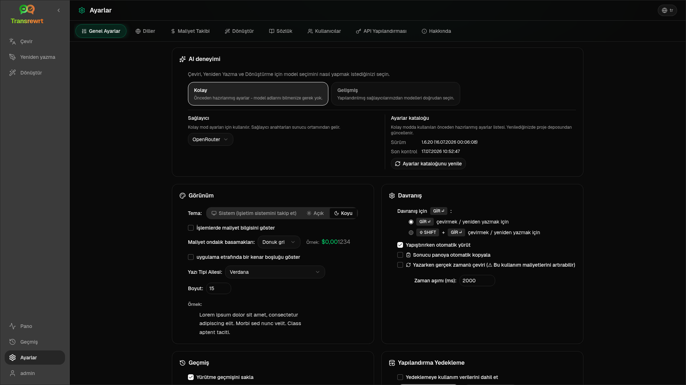

<p align="center">
  
</p>

<p align="center">
  <a href="https://github.com/wsj-br/transrewrt/releases"></a>
  <a href="LICENSE"></a>
  
  
  
</p>

Yapay zekâ destekli metin aracı: çoklu yapay zekâ sağlayıcılarını (OpenRouter, OpenAI, Anthropic, Google Gemini, DeepSeek, Groq, Mistral, xAI ve yerel Ollama) kullanarak diller arasında çevirin, farklı stillerde yeniden yazın ve özel istemlerle dönüştürün - Masaüstü uygulaması (Electron) veya kendi barındırılan web uygulaması (Docker) olarak çalışır.

- **Çevir** - otomatik kaynak algılama ile onlarca dil arasında
- **Yeniden yaz** - dilbilgisi düzeltme, anlaşılırlığı iyileştirme, resmi/resmi olmayan, kısaltma, uzatma, teknik
- **Dönüştür** - özel AI istemleri; her istem için isteğe bağlı hedef diliyle birlikte istemleri oluşturun ve yönetin
- **Geçmiş** - girdi/çıktı metni, filtreleme ve dışa aktarma ile tam yürütme geçmişi
- **Kolay & Gelişmiş** - Kolay mod (varsayılan): sağlayıcıya özel önceden ayarlanmış seçenekler (**Ücretsiz (OpenRouter)**, **Standart**, **Gelişmiş**, **Teknik**; yalnızca seçili sağlayıcı için eşleme olan önceden ayarlanmış seçenekler görünür) ve model kimliklerini seçmeden kullanım; Gelişmiş mod: yapılandırılmış sağlayıcılarınızdan gelen tüm model listesi
- **Modeller ve maliyet** - maliyet ve kullanım panoları (Özet, Modele göre, Tüm Çağrılar) ve dışa aktarma özelliği; OpenRouter gerçek harcamaları gösterir, diğer sağlayıcılar tahmini değerler kullanır
- **Kullanıcı Arayüzü (UI)** - çok dilli arayüz (30+ dil, RTL desteği), yazı tipleri, ...
- **Web modu** - yönetici rolleriyle çok kullanıcılı destek
- **Masaüstü** - Windows ve Linux için Electron uygulaması
- **Kendi barındırma** - amd64 & arm64 için Docker görüntüsü (Raspberry Pi uyumlu)

Kurulduktan sonra tüm özelliklerin tam bir kılavuzu için [**Kullanıcı Kılavuzu**](USER-GUIDE.tr.md) bölümüne bakın.

<small>**Diğer dillerde oku:** </small>
<small id="lang-list">[English (GB)](../README.md) · [Português (Brasil)](./README.pt-BR.md) · [العربية](./README.ar.md) · [বাংলা](./README.bn.md) · [Català](./README.ca.md) · [中文 (中国大陆)](./README.zh-CN.md) · [中文 (台灣)](./README.zh-TW.md) · [Hrvatski](./README.hr.md) · [Čeština](./README.cs.md) · [Nederlands](./README.nl.md) · [English (US)](./README.en-US.md) · [Tagalog](./README.tl.md) · [Français](./README.fr.md) · [Deutsch](./README.de.md) · [Ελληνικά](./README.el.md) · [हिन्दी](./README.hi.md) · [Magyar](./README.hu.md) · [Italiano](./README.it.md) · [日本語](./README.ja.md) · [한국어](./README.ko.md) · [Bahasa Melayu](./README.ms.md) · [فارسی](./README.fa.md) · [Polski](./README.pl.md) · [Basa Jawa](./README.jv.md) · [Português](./README.pt.md) · [ਪੰਜਾਬੀ](./README.pa.md) · [Română](./README.ro.md) · [Русский](./README.ru.md) · [Slovenčina](./README.sk.md) · [Español](./README.es.md) · [Kiswahili](./README.sw.md) · [Svenska](./README.sv.md) · [తెలుగు](./README.te.md) · [ไทย](./README.th.md) · [Türkçe](./README.tr.md) · [Українська](./README.uk.md) · [Tiếng Việt](./README.vi.md)</small>

<small>

> **Kullanıcı arayüzü ve belgelerin çevirileri hakkında not:** İngilizce (UK) orijinali hariç tüm arayüz dilleri 
> yapay zekâ modelleri kullanılarak çevrildi; ifade tarzı eksik olabilir veya hatalar içerebilir.

</small>

<br/>

<a id="table-of-contents"></a>
## İçindekiler

<!-- START doctoc generated TOC please keep comment here to allow auto update -->
<!-- DON'T EDIT THIS SECTION, INSTEAD RE-RUN doctoc TO UPDATE -->

- [Ekran görüntüleri](#screenshots)
- [Hızlı başlangıç](#quick-start)
- [OpenRouter API anahtarı alma](#getting-an-openrouter-api-key)
- [Yapılandırma ve ortam](#configuration-and-environment)
- [Geliştirme ve mimari](#development-and-architecture)
- [Sorun bildirme](#reporting-issues)
- [Sorumluluk reddi](#disclaimer)
- [Lisans](#license)

<!-- END doctoc generated TOC please keep comment here to allow auto update -->

<br/><br/>

<a id="screenshots"></a>
## Ekran görüntüleri

**Dil seçici**


**Çevir**


**Dönüştür - istem düzenleyici**


**Kontrol Paneli**


**Geçmiş**


**Ayarlar - model seçimi**



<br/><br/>

<a id="quick-start"></a>
## Hızlı başlangıç

<details>
<summary><b>Docker (kendiniz barındırmak için önerilir)</b></summary>

<a id="docker"></a>

<br/>

```bash
docker pull ghcr.io/wsj-br/transrewrt:latest

OPENROUTER_API_KEY=sk-or-your-key docker run -d \
  -p 5000:5000 \
  -v transrewrt-data:/app/data \
  -e OPENROUTER_API_KEY \
  --name transrewrt-web \
  ghcr.io/wsj-br/transrewrt:latest
```

`sk-or-your-key` ifadesini [OpenRouter API anahtarınızla](https://openrouter.ai/keys) değiştirin (veya diğer sağlayıcı anahtarlarını ayarlayın; [Yapılandırma](#configuration-and-environment) bölümüne bakın). [http://localhost:5000](http://localhost:5000) adresini açın ve hizmeti dışa açmadan önce varsayılan yönetici şifresini değiştirin.

En az bir sağlayıcı anahtarı ortam üzerinden ayarlayın (örneğin OpenRouter için `OPENROUTER_API_KEY`). Gizli bilgilerin görüntüye gömülmemesi için değişkenleri `-e` veya `docker compose` / `.env` ile iletin. Sağlayıcı anahtarları web arayüzüne **girilmez**; sunucu bunları ortamdan okur.

<br/>

> ℹ️ **NOT**<br/>
> Docker içinde, LLM kimlik bilgileri `OPENROUTER_API_KEY`, `OPENAI_API_KEY`, `CEREBRAS_API_KEY`, … gibi ortam değişkenleriyle ayarlanır (web arayüzünde değil). Masaüstü (Electron) üzerinde anahtarları **Ayarlar → API** kısmında yapılandırırsınız.

<br/>

Veya Docker Compose kullanın:

```bash
# download the compose file
wget https://github.com/wsj-br/transrewrt/raw/refs/heads/master/production.yml -O transrewrt.yml
# Edit the file to add your API keys (API_KEYs), or uncomment and adjust the `.env` file. Set the timezone (TZ) if necessary.
vi transrewrt.yml
# start the container
docker compose -f transrewrt.yml up -d
```

Tüm ortam değişkenleri için [Yapılandırma](#configuration-and-environment) bölümüne bakın, örneğin `PORT`, `CONFIG_PATH`, `TZ` ve LLM anahtarları (`OPENROUTER_API_KEY`, `OPENAI_API_KEY`, …).

</details>

<br/>

<details>
<summary><b>Sunucu saat dilimi (Docker)</b></summary>

<a id="configuring-the-timezone"></a>

<br/>

Uygulama kullanıcı arayüzündeki tarih ve saat, **tarayıcınızın** yerel ayarlarına ve saat dilimine uyar. **Sunucu tarafında** davranışlar (günlükleme ve benzeri) için, konteyner `TZ` ortam değişkenini kullanır. Varsayılan değer `TZ=Europe/London` şeklindedir.

Başka bir saat dilimi kullanmak için, Compose dosyanızda `TZ` değerini şu şekilde ayarlayın:

```yaml
environment:
  - TZ=America/Sao_Paulo
```

Veya konteyner çalıştırılırken (Docker) iletebilirsiniz:

```bash
--env TZ=America/Sao_Paulo
```

Birçok Linux ana makinesinde sistem saat dilimi adını şu komutla kopyalayabilirsiniz:

```bash
echo TZ=\"$(</etc/timezone)\"
```

Geçerli saat dilimi adlarının listesi [tz veritabanında](https://en.wikipedia.org/wiki/List_of_tz_database_time_zones) (Wikipedia) tutulur.

</details>

<br/>

<details>
<summary><b>Windows</b></summary>

<a id="windows-electron"></a>

<br/>

- [Yayınlar](https://github.com/wsj-br/transrewrt/releases) sayfasından en son `Transrewrt Setup x.y.z.exe` sürümünü indirin.
- `.exe` dosyasını çalıştırın ve yükleyiciyi takip edin.
- İlk çalıştırma: Uygulamayı Başlat menüsünden veya masaüstü kısayolundan başlatın.
- API anahtarlarınızı **Ayarlar → API** kısmına girin. En az bir sağlayıcıyı yapılandırmanız gerekir; ücretsiz modeller için OpenRouter yaygın bir tercihtir.

<br/>

> ℹ️ **NOT**<br/>
> Windows, bu güvenlik uyarılarından birini gösterebilir (imzalanmamış/bağımsız uygulamalar için normaldir):
>   - **Kullanıcı Hesabı Denetimi (UAC)**: "Bilinmeyen bir yayıncıdan gelen bu uygulamanın cihazınıza değişiklik yapmasına izin vermek istiyor musunuz?" → **Evet** seçeneğine tıklayın.
>   - **Microsoft Defender SmartScreen**: "Windows PC'nizi korudu" → **Daha fazla bilgi** → **Yine de çalıştır** seçeneğine tıklayın.
>
> Bunun nedeni uygulamanın Microsoft veya büyük bir yayıncı tarafından imzalanmamış olmasıdır - resmi GitHub yayınlarımızdan indirildiyse güvenlidir (her varlığın yanında yer alan [Yayınlar](https://github.com/wsj-br/transrewrt/releases) sayfasında sağlama toplamlarını doğrulayın).

<br/>

</details>

<br/>

<details>
<summary><b>Linux</b></summary>

<a id="linux-electron"></a>

<br/>

[Sürümler](https://github.com/wsj-br/transrewrt/releases) sayfasından CPU'nuz için uygun olan `.AppImage` dosyasını indirin (tipik masaüstü bilgisayarlar için `x64`, Raspberry Pi 4+ dahil birçok ARM cihaz için `arm64`), ardından:

```bash
chmod +x Transrewrt-x.y.z-x64.AppImage && ./Transrewrt-x.y.z-x64.AppImage
```

x86_64/amd64 üzerinde `x64` dosya adını kullanın; ARM64 üzerinde `...-arm64.AppImage` adını kullanın.

API anahtarlarınızı **Ayarlar → API** kısmına girin. En az bir sağlayıcıyı yapılandırmanız gerekir; ücretsiz modeller için OpenRouter yaygın bir tercihtir.

**Konsol mesajları:** Paketlenmiş Linux sürümleri (`x64` ve `arm64` AppImages), terminalde Node deprecation uyarılarını bastırır (örneğin yerleşik `punycode` modülü). Chromium 'GLES3 desteklenmiyor' gibi GPU / EGL hataları yazdırıyorsa ancak uygulama çalışıyor durumdaysa, donanım hızlandırmayı devre dışı bırakarak bu hataları susturabilirsiniz:

```bash
TRANSREWRT_DISABLE_GPU=1 ./Transrewrt-x.y.z-arm64.AppImage
```

Bu durum amd64 mimarisi için de geçerlidir; indirdiğiniz dosyaya göre dosya adını değiştirin.

Debian/Ubuntu üzerinde, Chromium tarafından gerekli olan ek **çalışma zamanı** kütüphanelerine ihtiyacınız olabilir (bu kütüphaneler genellikle tam masaüstü kurulumlarında zaten mevcuttur). Gerekirse aşağıdaki komutları çalıştırın:

```bash
sudo apt update
sudo apt install -y libfuse2 libgtk-3-0 libnotify4 libnss3 libnspr4 libxss1 libxtst6 xdg-utils \
     xauth libatspi2.0-0 libdrm2 libgbm1 libxcb-dri3-0 libcups2 libasound2t64
```

`libasound2t64` yerine `libasound2` kullanın, `arm64` için. Minimal veya özel kurulumlar hâlâ eksik `.so` dosyası nedeniyle başarısız olabilir. Hata mesajında belirtilen paketi yükleyin (sık kullanılan ekstra paketler: `libatk1.0-0`, `libatk-bridge2.0-0`, `libgbm1`, `libdrm2`). Bazı ortamlarda uygulamayı `APPIMAGE_EXTRACT_AND_RUN=1 ./Transrewrt-….AppImage` kullanarak çalıştırmak zorunda kalabilirsiniz.

<br/>

> ℹ️ **NOT**<br/>
> Şu anda macOS desteklenmiyor. Transrewrt, Windows, Linux ve Docker için mevcuttur.

</details>

<br/>

Uygulama çalıştırıldıktan sonra metinleri nasıl çevireceğinizi, yeniden yazacağınızı ve dönüştüreceğinizi, istemleri nasıl yöneteceğinizi ve modelleri nasıl yapılandıracağınızı öğrenmek için [**Kullanıcı Kılavuzu**](USER-GUIDE.tr.md) bölümüne bakın.

<br/><br/>

<a id="getting-an-openrouter-api-key"></a>
## OpenRouter API anahtarı alma

Transrewrt, birden fazla yapay zeka sağlayıcısını destekler. [OpenRouter](https://openrouter.ai), birçok modeli tek bir anahtar altında toplaması ve ücretsiz modeller sunması nedeniyle popüler bir seçenektir.

1. [openrouter.ai](https://openrouter.ai) adresinde kaydolun veya giriş yapın.
2. [Keys](https://openrouter.ai/keys) sayfasını açın ve yeni bir anahtar oluşturun (isim verin ve isteğe bağlı olarak kredi limiti ayarlayın). Kredi eklemadan ücretsiz modelleri kullanabilirsiniz.
3. **Masaüstü (Electron):** anahtarları **Ayarlar → API** kısmına yapıştırın. **Docker:** `OPENROUTER_API_KEY` gibi ortam değişkenlerini ayarlayın (bkz. [Hızlı başlangıç](#quick-start)).

Çeviri, yeniden yazma veya dönüştürme işlemleri için OpenRouter'ın **Body Builder** modelini ([`openrouter/bodybuilder`](https://openrouter.ai/openrouter/bodybuilder)) kullanmayın: bu model tamamlanmış metin yerine JSON istek yükleri döndürür. Kullanıcı Kılavuzu'ndaki [Ayarlar → Modeller](USER-GUIDE.tr.md#models) bölümüne bakın.

Ayrıca diğer sağlayıcıları (OpenAI, Anthropic, Google Gemini, DeepSeek, Groq, Mistral, xAI, Cerebras) kullanabilir veya [Ollama](https://ollama.com) ile yerel olarak modeller çalıştırabilirsiniz. Desteklenen sağlayıcıların ve ortam değişkenlerinin tam listesi için [Yapılandırma](#configuration-and-environment) bölümüne bakın.

</br>

> ⚠️ **UYARI**<br/>
> Başka bir cihazdan, konteynerden veya servisten Ollama kullanıyorsanız, Ollama'nın dış bağlantıları kabul edecek şekilde yapılandırıldığından emin olun (sadece localhost değil).

<br/><br/>

<a id="configuration-and-environment"></a>
## Yapılandırma ve ortam

</br>

**Yapılandırma dosyası konumları**

| Dağıtım         | Yapılandırma konumu                                   |
| ------------------ | ------------------------------------------------- |
| Electron (Windows) | `%APPDATA%\transrewrt\`                           |
| Electron (Linux)   | `~/.config/transrewrt/`                           |
| Web / Docker       | `/app/data/config.json` (kalıcı hale getirmek için bir volume kullanın) |

<br/>

**Ortam değişkenleri** (sadece web/Docker; Electron yerel yapılandırma dosyasını kullanır)

| Değişken             | Açıklama                                                                  |
|----------------------|------------------------------------------------------------------------------|
| `PORT`               | Sunucunun dinlediği port (varsayılan: `5000`)                                  |
| `CONFIG_PATH`        | Yapılandırma dosyasının yolu (varsayılan: `/app/data/config.json`)                |
| `TZ`                 | Sunucu tarafı saat dilimi (günlük kaydı vb.) (varsayılan: `Europe/London`) |
| `HISTORY_DISABLED`   | Geçmiş izlemeyi devre dışı bırakır (isteğe bağlı, varsayılan olarak `false`)                  |
| `OPENROUTER_API_KEY` | OpenRouter API anahtarı                                                           |
| `OPENAI_API_KEY`     | OpenAI API anahtarı                                                               |
| `CEREBRAS_API_KEY`   | Cerebras API anahtarı                                                             |
| `ANTHROPIC_API_KEY`  | Anthropic API anahtarı                                                            |
| `GOOGLE_API_KEY`     | Google Gemini API anahtarı                                                        |
| `DEEPSEEK_API_KEY`   | DeepSeek API anahtarı                                                             |
| `GROQ_API_KEY`       | Groq API anahtarı                                                                 |
| `MISTRAL_API_KEY`    | Mistral API anahtarı                                                              |
| `OLLAMA_URL`         | Ollama temel URL'si (örneğin `http://host.docker.internal:11434`)                   |
| `XAI_API_KEY`        | xAI API anahtarı                                                                  |

**Gizlilik modu:** `config.json` veya kullanıcı tercihlerinden bağımsız olarak geçmiş izlemeyi devre dışı bırakmak için **web/Docker sunucu süreci** ve/veya **Electron masaüstü ana süreci** için `HISTORY_DISABLED` değerini `true` veya `1` olarak ayarlayın (büyük/küçük harf duyarsız) (örneğin sistem veya başlatıcı ortamı — yalnızca renderer değil). Bu, girdi/çıktı geçmişinin kaydedilmesini devre dışı bırakır, **Ayarlar → Genel Ayarlar → Geçmiş** bölümünü kilitler ve Geçmiş ile ilgili API'leri engeller.

Sadece kullandığınız sağlayıcıları yapılandırın. Model kimlikleri isim alanı altındadır (`openrouter/…`, `openai/…`, `cerebras/…`, `ollama/…`, vb.).

**Maliyet gösterimi:** OpenRouter, geçerli olduğunda tam faturalandırılan maliyeti döndürür. Diğer sağlayıcılar, OpenRouter anahtarı mevcutsa OpenRouter'ın kamuya açık model fiyatlandırmasından **tahmini** maliyeti kullanır; anahtar yoksa, OpenRouter olmayan maliyet `0` olarak görünebilir. Tahminler fatura değildir.

<br/>

**Veri ve kalıcılık:** Docker için, `/app/data` konumuna bir birim bağlayın, böylece `config.json` ve SQLite veritabanı konteyner yeniden başlatmalarında korunur. Bir birim olmadan, konteyner durduğunda tüm veriler kaybolur.

<br/>

**Web kimlik doğrulaması:**

- Varsayılan yönetici: `admin` / `transrewrt26`.
- Kullanıcıları **Ayarlar → Kullanıcılar** bölümünde yönetin.
- Şifreyi sıfırlama: `docker exec <container> reset-web-password '<username>' '<new-password>'`

<br/>

> ⚠️ **UYARI**<br/>
> Herhangi bir ağ erişilebilir makinede varsayılan yönetici şifresini hemen değiştirin.

<br/>

Anahtar ayarlar (yazı tipi, modeller, diller, vb.) uygulama Ayarları'nda mevcuttur.

<br/><br/>

<a id="development-and-architecture"></a>
## Geliştirme ve mimari

- **Geliştirme:** Kurulum, yapı, test ve dağıtımı (Electron, Web, Docker) - [dev/DEVELOPMENT.md](../dev/DEVELOPMENT.md) bölümüne bakın.
- **Mimari ve sistem genel bakış:** Klasör yapısı, teknoloji yığını, tasarım kararları - [dev/SYSTEM-OVERVIEW.md](../dev/SYSTEM-OVERVIEW.md) bölümüne bakın.

<br/><br/>

<a id="reporting-issues"></a>
## Sorun bildirme

[GitHub](https://github.com/wsj-br/transrewrt/issues)'da bir sorun açın. Platformunuzu (Windows / Linux / Docker) ve uygulama sürümünü (Hakkında penceresinde veya Sürümler sayfasında gösterilir) ekleyin.

<br/><br/>

<a id="disclaimer"></a>
## Sorumluluk reddi

Ürün adları ve simgeleri ilgili sahiplerine aittir ve sadece tanımlama amacıyla kullanılır. Bu yazılım, bahsedilen markalarla bağlantılı değildir veya onların desteğiyle değildir.

<br/><br/>

<a id="license"></a>
## Lisans

Telif Hakkı © 2026 Waldemar Scudeller Jr.

[Apache License 2.0](../LICENSE)
