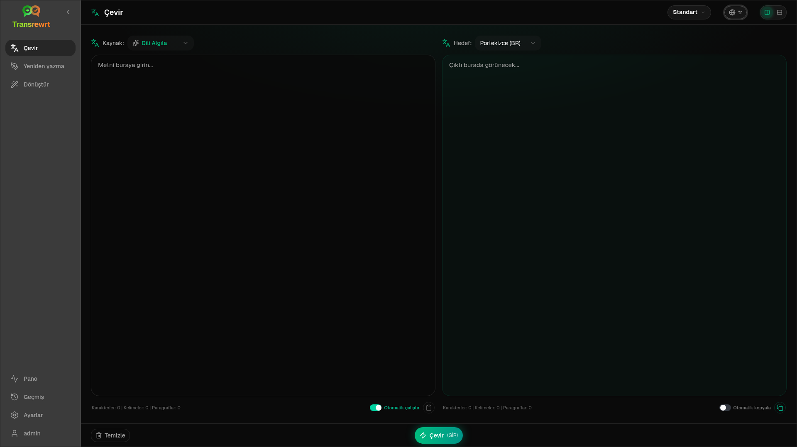

<p align="center">
  
</p>

<h1 align="center">Transrewrt</h1>

<p align="center">
  <a href="https://github.com/wsj-br/transrewrt/releases"></a>
  <a href="LICENSE"></a>
  
</p>

Özel istemlerle **çeviri**, **yeniden yazma** ve **dönüştürme** için yapay zeka destekli metin aracı. Kendi yapay zeka sağlayıcılarınızı kullanın (OpenRouter, OpenAI, Anthropic, Google Gemini, DeepSeek, Groq, Mistral, xAI, Cerebras, NVIDIA, Alibaba Cloud, apikey.fun, OpenAI uyumlu uç noktalar ve Ollama, LM Studio veya llama.cpp gibi yerel sunucular). Bir masaüstü uygulaması (Windows / Linux / macOS) veya bir Docker web uygulaması olarak çalıştırın. Transrewrt bulut hesabı yok.

## Özellikler

| Yetenek | Açıklama |
| --- | --- |
| **Çevir** | Düzinelerce dil, otomatik algılama, sözlükler, Yeniden İfade Et ile iyileştirme |
| **Yeniden yazma** | Netlik, ton, uzunluk, yazım ve dilbilgisi — aynı dil |
| **Dönüştür** | Oluşturduğunuz, düzenlediğiniz ve yeniden kullandığınız özel yapay zeka istemleri |
| **Dağıt** | Electron masaüstü veya Docker web (amd64 & arm64) |
| **Anahtarlar** | Sağlayıcılarınız, ana bilgisayarınız — Kolay ön ayarlar veya Gelişmiş model listesi |



<small>**Diğer dillerde oku:** </small>
<small id="lang-list">[English (UK)](../README.md) · [العربية](./README.ar.md) · [简体中文](./README.zh-Hans.md) · [繁體中文](./README.zh-Hant.md) · [Čeština](./README.cs.md) · [Nederlands](./README.nl.md) · [Français](./README.fr.md) · [Deutsch](./README.de.md) · [Ελληνικά](./README.el.md) · [हिन्दी](./README.hi.md) · [Magyar](./README.hu.md) · [Italiano](./README.it.md) · [日本語](./README.ja.md) · [한국어](./README.ko.md) · [فارسی](./README.fa.md) · [Polski](./README.pl.md) · [Português (Brasil)](./README.pt-BR.md) · [Română](./README.ro.md) · [Русский](./README.ru.md) · [Slovenčina](./README.sk.md) · [Español](./README.es.md) · [Svenska](./README.sv.md) · [ไทย](./README.th.md) · [Türkçe](./README.tr.md) · [Українська](./README.uk.md) · [Tiếng Việt](./README.vi.md)</small>

## Hızlı başlangıç

**Docker**

```bash
docker pull ghcr.io/wsj-br/transrewrt:latest

docker run -d \
  -p 5000:5000 \
  -v transrewrt-data:/app/data \
  -e PROVIDER_API_KEY=your-key \
  --name transrewrt \
  ghcr.io/wsj-br/transrewrt:latest
```

`PROVIDER_API_KEY` yerine sağlayıcı değişkeninizi (örneğin `OPENROUTER_API_KEY`, `OPENAI_API_KEY`, `GROQ_API_KEY`) yazın. [http://localhost:5000](http://localhost:5000) adresini açın ve varsayılan Yönetici parolasını değiştirin. Anahtarlar ortam değişkenleri aracılığıyla ayarlanır (web kullanıcı arayüzü aracılığıyla değil).

**Windows** — [Sürümler](https://github.com/wsj-br/transrewrt/releases) sayfasından `Transrewrt Setup x.y.z.exe` dosyasını indirin, kurun, ardından **Ayarlar → API** bölümünden anahtarları ekleyin.

**Linux** — [Sürümler](https://github.com/wsj-br/transrewrt/releases) sayfasından `.AppImage` dosyasını indirin, ardından:

```bash
chmod +x Transrewrt-x.y.z-x64.AppImage && ./Transrewrt-x.y.z-x64.AppImage
```

**macOS** — Mac'iniz için `.dmg` uygulamasını [Sürümler](https://github.com/wsj-br/transrewrt/releases) sayfasından indirin: Apple Silicon için `arm64`, Intel için `x64`. Disk görüntüsünü açın ve Transrewrt'i Uygulamalar'a sürükleyin.

Derleme imzasız olduğundan, Gatekeeper ilk başlatmayı engeller. `Transrewrt.app` üzerine sağ tıklayın ve **Aç**'ı seçin, ardından **Aç**'ı onaylayın. Veya karantina özniteliğini temizleyin:

```bash
xattr -dr com.apple.quarantine /Applications/Transrewrt.app
```

Platform ayrıntıları (Compose, SmartScreen, apt kitaplıkları, GPU bayrakları, saat dilimi): [Hızlı başlangıç belgeleri](https://wsj-br.github.io/transrewrt/docs/quick-start/).

## Belgeler

Tüm ürün belgeleri (kurulum, API anahtarları, kılavuzlar, ayarlar, sorun giderme):

**[https://wsj-br.github.io/transrewrt/docs/](https://wsj-br.github.io/transrewrt/docs/)**

- [API anahtarı](https://wsj-br.github.io/transrewrt/docs/api-key/)
- [Yapılandırma](https://wsj-br.github.io/transrewrt/docs/configuration/)
- [Çevir](https://wsj-br.github.io/transrewrt/docs/translate/) · [Yeniden yazma](https://wsj-br.github.io/transrewrt/docs/rewrite/) · [Dönüştür](https://wsj-br.github.io/transrewrt/docs/transform/)
- [Sık karşılaşılan sorunlar](https://wsj-br.github.io/transrewrt/docs/common-issues/)

## Geliştirme

- Kurulum, derleme, test, dağıtım: [dev/DEVELOPMENT.md](../dev/DEVELOPMENT.md)
- Mimariye genel bakış: [dev/SYSTEM-OVERVIEW.md](../dev/SYSTEM-OVERVIEW.md)

## Destek

[GitHub](https://github.com/wsj-br/transrewrt/issues) üzerinde bir sorun açın. Platformunuzu (Windows / Linux / macOS / Docker) ve uygulama sürümünü (Hakkında iletişim kutusu veya Sürümler sayfası) ekleyin.

## Teşekkürler

Ön ayarlar düzenleyicisindeki Kolay mod ön ayar önerileri, yalnızca sürdürücünün makinesindeki genel değerlendirme verilerini kullanır. Transrewrt ile hiçbir veri kümesi içeriği yeniden dağıtılmaz:

- [languagebench](https://huggingface.co/spaces/fair-forward/languagebench) (CC BY-SA 4.0) — çeviri ChrF
- [Arena](https://huggingface.co/datasets/lmarena-ai/leaderboard-dataset) (CC BY 4.0) — Arena Puanı
- [models.dev](https://models.dev/) (MIT)

Üçüncü taraf bağımlılık lisansları ve bu veri kaynağı bildirimleri [BİLDİRİMLER](../NOTICES) bölümünde listelenmiştir.

## Lisans

Telif Hakkı © 2026 Waldemar Scudeller Jr.

[Apache License 2.0](../LICENSE)

<br/>

Ürün adları ve simgeleri, ilgili sahiplerine aittir ve yalnızca tanımlama amaçlı kullanılır. Bu yazılım, bu markalarla bağlantılı değildir veya onlar tarafından desteklenmemektedir.

<small>

> **Kullanıcı arayüzü ve dokümantasyon çevirileri hakkında not:** İngilizce (Birleşik Krallık) dışındaki tüm arayüz ve dokümantasyon dilleri, [ai-i18n-tools](https://wsj-br.github.io/ai-i18n-tools/) kullanılarak yapay zeka ile çevrilmiştir; ifade biçimi yanlış veya hatalar içerebilir.

</small>
