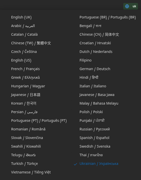
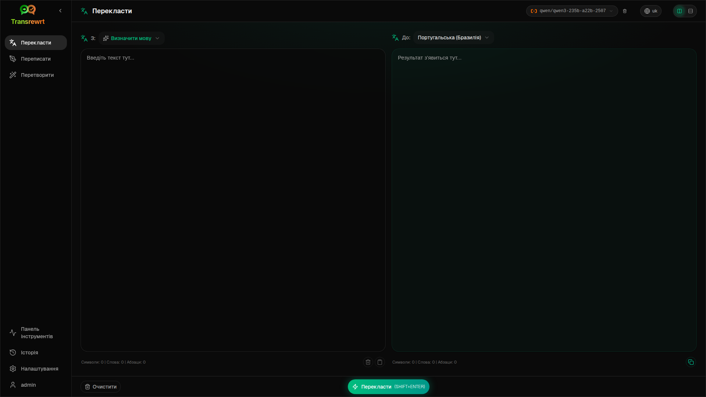
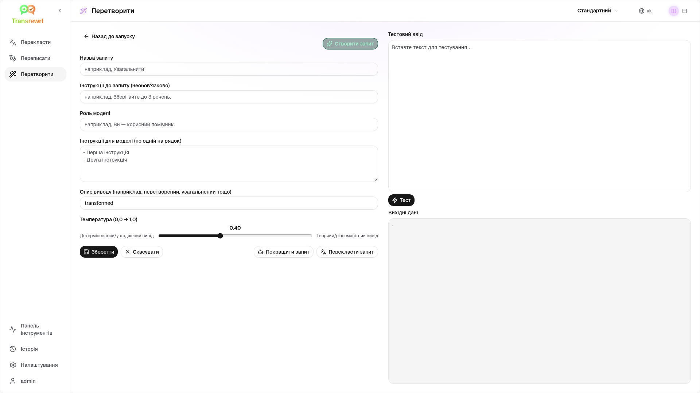
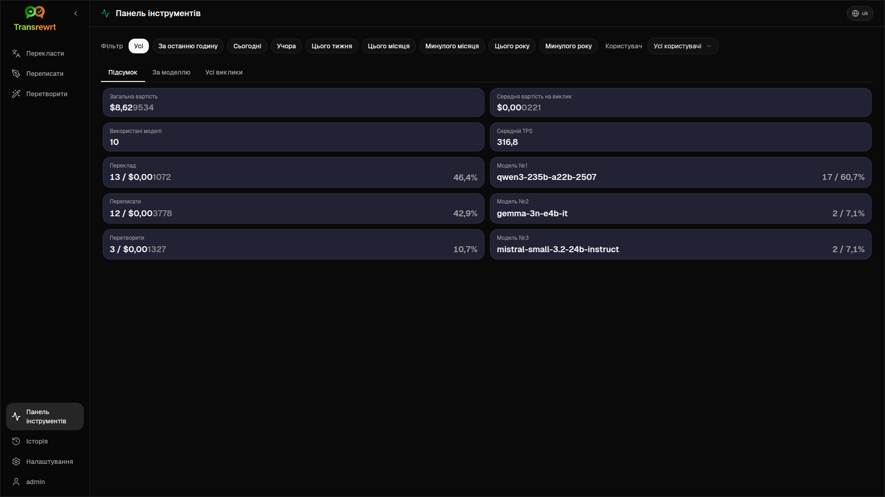
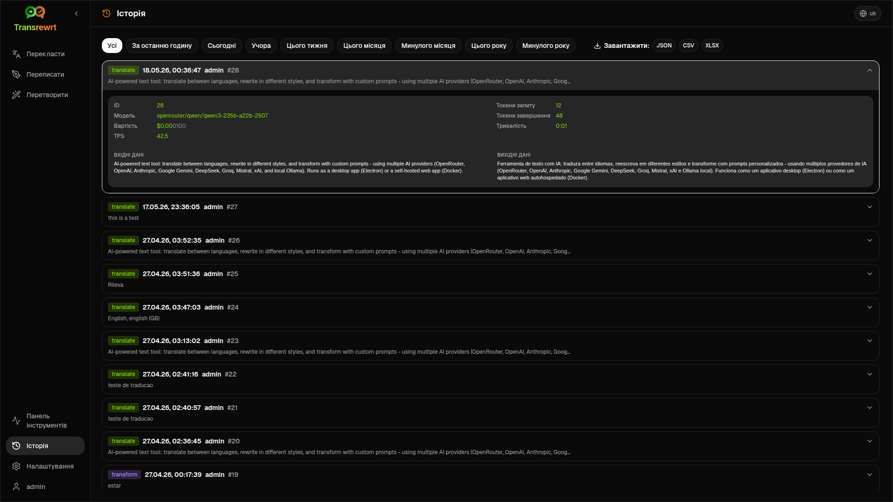
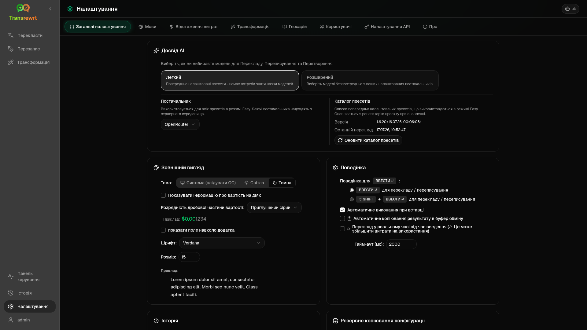

<p align="center">
  
</p>

<p align="center">
  <a href="https://github.com/wsj-br/transrewrt/releases"></a>
  <a href="LICENSE"></a>
  
  
  
</p>

Інструмент для роботи з текстом на основі ШІ: перекладайте між мовами, переписуйте в різних стилях та трансформуйте за допомогою власних запитів — використовуючи численні ШІ-провайдери (OpenRouter, OpenAI, Anthropic, Google Gemini, DeepSeek, Groq, Mistral, xAI, Cerebras, NVIDIA, Alibaba Cloud, apikey.fun, будь-який OpenAI-сумісний провайдер та локальний Ollama). Працює як настільна програма (Electron) або веб-додаток для самостійного розміщення (Docker).

- **Перекласти** - між десятками мов з автоматичним визначенням джерела
- **Перезапис** - виправлення граматики, покращення ясності, формальний/неформальний стиль, скорочення, розширення, технічний стиль
- **Трансформація** - власні підказки ШІ; створення та керування підказками, вибір цільової мови для кожної підказки
- **Глосарій** - зберігання пар вихідних/цільових термінів для кожної мовної пари та їх застосування під час перекладу для забезпечення узгодженості вибраних термінів; керування термінами в Налаштуваннях (додати/редагувати/видалити, імпорт CSV/XLSX та експорт шаблону)
- **Історія** - повна історія виконання з вхідним/вихідним текстом, фільтрацією та експортом
- **Легкий та Розширений** - Легкий режим (за замовчуванням): вибрані пресети для кожного постачальника (**Безкоштовно (OpenRouter)**, **Стандартний**, **Розширений**, **Технічний**; відображаються лише пресети з відповідністю для вибраного постачальника) без вибору ідентифікаторів моделей; Розширений режим: повний список моделей від ваших налаштованих постачальників
- **Моделі та вартість** - панелі інструментів вартості та використання (Підсумок, За моделлю, Всі дзвінки) з експортом; OpenRouter показує фактичні витрати, інші постачальники використовують оцінки
- **Інтерфейс** - багатомовний інтерфейс (30+ мов, підтримка RTL), шрифти, ...
- **Веб-режим** - підтримка кількох користувачів з ролями адміністратора
- **Настільний додаток** - додаток Electron для Windows та Linux
- **Самостійне розміщення** - образ Docker для amd64 та arm64 (готовий для Raspberry Pi)

Після встановлення перегляньте [**Керівництво користувача**](USER-GUIDE.uk.md) для повного огляду всіх функцій.

<small>**Читати іншими мовами:** </small>
<small id="lang-list">[English (UK)](../README.md) · [Português (Brasil)](./README.pt-BR.md) · [العربية](./README.ar.md) · [বাংলা](./README.bn.md) · [Català](./README.ca.md) · [简体中文](./README.zh-Hans.md) · [繁體中文](./README.zh-Hant.md) · [Hrvatski](./README.hr.md) · [Čeština](./README.cs.md) · [Nederlands](./README.nl.md) · [English (US)](./README.en-US.md) · [Tagalog](./README.tl.md) · [Français](./README.fr.md) · [Deutsch](./README.de.md) · [Ελληνικά](./README.el.md) · [Hindi (Roman)](./README.hi-Latn.md) · [Magyar](./README.hu.md) · [Italiano](./README.it.md) · [日本語](./README.ja.md) · [한국어](./README.ko.md) · [Bahasa Melayu](./README.ms.md) · [فارسی](./README.fa.md) · [Polski](./README.pl.md) · [Basa Jawa](./README.jv.md) · [Português](./README.pt.md) · [پنجابی](./README.pa-PK.md) · [Română](./README.ro.md) · [Русский](./README.ru.md) · [Slovenčina](./README.sk.md) · [Español](./README.es.md) · [Kiswahili](./README.sw.md) · [Svenska](./README.sv.md) · [తెలుగు](./README.te.md) · [ไทย](./README.th.md) · [Türkçe](./README.tr.md) · [Українська](./README.uk.md) · [Tiếng Việt](./README.vi.md)</small>

<small>

> **Примітка щодо перекладів інтерфейсу та документації:** Усі мови інтерфейсу, крім оригінальної англійської (Великобританія), 
> були перекладені за допомогою моделей ШІ; формулювання можуть бути неточними або містити помилки.

</small>

<br/>

<a id="table-of-contents"></a>
## Зміст

<!-- START doctoc generated TOC please keep comment here to allow auto update -->
<!-- DON'T EDIT THIS SECTION, INSTEAD RE-RUN doctoc TO UPDATE -->

- [Знімки екрана](#screenshots)
- [Швидкий старт](#quick-start)
- [Отримання ключа OpenRouter API](#getting-an-openrouter-api-key)
- [Налаштування та середовище](#configuration-and-environment)
- [Розробка та архітектура](#development-and-architecture)
- [Повідомлення про проблеми](#reporting-issues)
- [Звільнення від відповідальності](#disclaimer)
- [Ліцензія](#license)

<!-- END doctoc generated TOC please keep comment here to allow auto update -->

<br/><br/>

<a id="screenshots"></a>
## Знімки екрана

**Вибір мови**



**Перекласти**



**Трансформація — редактор промптів**



**Панель**



**Історія**



**Налаштування — вибір моделі**



<br/><br/>

<a id="quick-start"></a>
## Швидкий старт

<details>
<summary><b>Docker (рекомендовано для самостійного хостингу)</b></summary>

<a id="docker"></a>

<br/>

```bash
docker pull ghcr.io/wsj-br/transrewrt:latest

OPENROUTER_API_KEY=sk-or-your-key docker run -d \
  -p 5000:5000 \
  -v transrewrt-data:/app/data \
  -e OPENROUTER_API_KEY \
  --name transrewrt-web \
  ghcr.io/wsj-br/transrewrt:latest
```

Замініть `sk-or-your-key` на ваш [ключ API OpenRouter](https://openrouter.ai/keys) (або встановіть ключі інших постачальників; див. [Конфігурація](#configuration-and-environment)). Відкрийте [http://localhost:5000](http://localhost:5000) і змініть пароль адміністратора за замовчуванням, перш ніж виставляти сервіс у мережу.

Встановіть хоча б один ключ постачальника через змінні середовища (наприклад, `OPENROUTER_API_KEY` для OpenRouter). Передавайте змінні за допомогою `-e` або `docker compose` / `.env`, щоб секрети не потрапили у образ. Ключі постачальників **не** вводяться у веб-інтерфейсі; сервер читає їх із середовища.

<br/>

> ℹ️ **ПРИМІТКА**<br/>
> У Docker облікові дані LLM встановлюються через змінні середовища, такі як `OPENROUTER_API_KEY`, `OPENAI_API_KEY`, `CEREBRAS_API_KEY`, … (не у веб-інтерфейсі). У настільній версії (Electron) ви налаштовуєте ключі в розділі **Налаштування → API**.

<br/>

Або використовуйте Docker Compose:

```bash
# download the compose file
wget https://github.com/wsj-br/transrewrt/raw/refs/heads/master/production.yml -O transrewrt.yml
# Edit the file to add your API keys (API_KEYs), or uncomment and adjust the `.env` file. Set the timezone (TZ) if necessary.
vi transrewrt.yml
# start the container
docker compose -f transrewrt.yml up -d
```

Див. [Конфігурація](#configuration-and-environment) для всіх змінних середовища, таких як `PORT`, `CONFIG_PATH`, `TZ`, і ключів LLM (`OPENROUTER_API_KEY`, `OPENAI_API_KEY`, …).

</details>

<br/>

<details>
<summary><b>Часовий пояс сервера (Docker)</b></summary>

<a id="configuring-the-timezone"></a>

<br/>

Дата та час у інтерфейсі користувача відповідають локалі та часовому поясу **браузера**. Для **серверної** поведінки (логування тощо) контейнер використовує змінну середовища `TZ`. За замовчуванням встановлено `TZ=Europe/London`.

Щоб використовувати інший часовий пояс, встановіть `TZ` у вашому файлі Compose, наприклад:

```yaml
environment:
  - TZ=America/Sao_Paulo
```

Або передайте при запуску контейнера (Docker):

```bash
--env TZ=America/Sao_Paulo
```

На багатьох Linux-хостах ви можете скопіювати системну назву часового поясу командою:

```bash
echo TZ=\"$(</etc/timezone)\"
```

Список дійсних назв часових поясів наведено в [базі даних tz](https://en.wikipedia.org/wiki/List_of_tz_database_time_zones) (Вікіпедія).

</details>

<br/>

<details>
<summary><b>Windows</b></summary>

<a id="windows-electron"></a>

<br/>

- Завантажте останню версію `Transrewrt Setup x.y.z.exe` з розділу [Releases](https://github.com/wsj-br/transrewrt/releases).
- Запустіть `.exe` та дотримуйтесь інструкцій установника.
- Перший запуск: запустіть додаток через меню «Пуск» або ярлик на робочому столі.
- Введіть ваші ключі API в розділі **Налаштування → API**. Потрібно налаштувати хоча б одного постачальника; OpenRouter часто використовується для безкоштовних моделей.

<br/>

> ℹ️ **ПРИМІТКА**<br/>
> Windows може показати одне з цих попереджень безпеки (нормально для непідписаних/незалежних додатків):
>   - **Контроль облікових записів (UAC)**: "Чи дозволити цьому додатку від невідомого видавця вносити зміни на вашому пристрої?" → Натисніть **Так**.
>   - **Microsoft Defender SmartScreen**: "Windows захистив ваш комп'ютер" → Натисніть **Докладніше** → **Все одно запустити**.
>
> Це відбувається тому, що додаток не підписаний Microsoft чи великим видавцем — він безпечний, якщо ви завантажили його з нашого офіційного репозиторію GitHub (перевірте контрольні суми на сторінці [Releases](https://github.com/wsj-br/transrewrt/releases) поруч із кожним файлом).

<br/>

</details>

<br/>

<details>
<summary><b>Linux</b></summary>

<a id="linux-electron"></a>

<br/>

Завантажте `.AppImage` для вашого процесора з [релізів](https://github.com/wsj-br/transrewrt/releases) (`x64` для звичайних ПК, `arm64` для багатьох пристроїв ARM, включаючи Raspberry Pi 4+), потім:

```bash
chmod +x Transrewrt-x.y.z-x64.AppImage && ./Transrewrt-x.y.z-x64.AppImage
```

Для x86_64/amd64 використовуйте ім'я файлу `x64`; для ARM64 — ім'я `...-arm64.AppImage`.

Введіть ваші API-ключі в **Налаштування → API**. Потрібно налаштувати принаймні одного постачальника; OpenRouter часто використовується для безкоштовних моделей.

**Повідомлення консолі:** Збірки Linux (`x64` та `arm64` AppImages) пригнічують попередження про застарілість Node у терміналі (наприклад, вбудований модуль `punycode`). Якщо Chromium виводить помилки GPU / EGL, наприклад «GLES3 is unsupported», але додаток працює, їх можна вимкнути, відключивши апаратне прискорення:

```bash
TRANSREWRT_DISABLE_GPU=1 ./Transrewrt-x.y.z-arm64.AppImage
```

Це стосується також amd64; змініть ім'я файлу відповідно до завантаженого.

У Debian/Ubuntu можуть знадобитися додаткові **бібліотеки виконання**, необхідні для Chromium (вони часто вже присутні у повноцінних настільних установках). За потреби виконайте наведені нижче команди:

```bash
sudo apt update
sudo apt install -y libfuse2 libgtk-3-0 libnotify4 libnss3 libnspr4 libxss1 libxtst6 xdg-utils \
     xauth libatspi2.0-0 libdrm2 libgbm1 libxcb-dri3-0 libcups2 libasound2t64
```

замініть `libasound2t64` на `libasound2` для `arm64`. Мінімальні або спеціальні установки можуть все ще завершуватися помилкою відсутнього файлу `.so`. Встановіть пакет із назвою, зазначеною в повідомленні про помилку (поширені додатки: `libatk1.0-0`, `libatk-bridge2.0-0`, `libgbm1`, `libdrm2`). У деяких середовищах може знадобитися запуск додатку через `APPIMAGE_EXTRACT_AND_RUN=1 ./Transrewrt-….AppImage`.

<br/>

> ℹ️ **ПРИМІТКА**<br/>
> macOS наразі не підтримується. Transrewrt доступний для Windows, Linux та Docker.

</details>

<br/>

Після запуску додатка перегляньте [**Керівництво користувача**](USER-GUIDE.uk.md), щоб дізнатися, як перекладати, переписувати та перетворювати текст, керувати запитами та налаштовувати моделі.

<br/><br/>

<a id="getting-an-openrouter-api-key"></a>
## Отримання API-ключа OpenRouter

Transrewrt підтримує кілька постачальників ШІ. [OpenRouter](https://openrouter.ai) — популярний варіант, оскільки об'єднує багато моделей під одним ключем і пропонує безкоштовні моделі.

1. Зареєструйтеся або увійдіть на [openrouter.ai](https://openrouter.ai).
2. Відкрийте сторінку [Keys](https://openrouter.ai/keys) і створіть новий ключ (надайте йому назву, і за бажанням встановіть ліміт кредитів). Ви можете використовувати безкоштовні моделі без додавання кредитів.
3. **Десктоп (Electron):** вставте ключі в **Налаштування → API**. **Docker:** встановіть змінні середовища, наприклад `OPENROUTER_API_KEY` (див. [Швидкий старт](#quick-start)).

Не використовуйте модель **Body Builder** від OpenRouter ([`openrouter/bodybuilder`](https://openrouter.ai/openrouter/bodybuilder)) для перекладу, перефразування чи трансформації: вона повертає JSON-навантаження запиту, а не готовий текст для цих завдань. Див. [Налаштування → Моделі](USER-GUIDE.uk.md#models) у Посібнику для користувача.

Ви також можете використовувати інші постачальники (OpenAI, Anthropic, Google Gemini, DeepSeek, Groq, Mistral, xAI, Cerebras, NVIDIA, Alibaba Cloud, apikey.fun, будь-який OpenAI-сумісний провайдер) або запускати моделі локально за допомогою [Ollama](https://ollama.com). Дивіться [Конфігурація](#configuration-and-environment) для повного списку підтримуваних постачальників та змінних середовища.

</br>

> ⚠️ **ПОПЕРЕДЖЕННЯ**<br/>
> Якщо ви використовуєте Ollama з іншого пристрою, контейнера чи служби, пам'ятайте налаштувати Ollama на дозвіл зовнішніх підключень (не тільки localhost).

<br/><br/>

<a id="configuration-and-environment"></a>
## Налаштування та середовище

</br>

**Розташування файлів конфігурації**

| Розгортання         | Розташування конфігурації                                   |
| ------------------ | ------------------------------------------------- |
| Electron (Windows) | `%APPDATA%\transrewrt\`                           |
| Electron (Linux)   | `~/.config/transrewrt/`                           |
| Веб / Docker       | `/app/data/config.json` (використовуйте том для зберігання) |

<br/>

**Змінні середовища** (лише для веб/Docker; Electron використовує локальний файл конфігурації)

| Змінна                  | Опис                                                                                    |
|---------------------------|-----------------------------------------------------------------------------------------|
| `PORT`                    | Порт прослуховування сервера (за замовчуванням `5000`)                                             |
| `CONFIG_PATH`        | Шлях до файлу конфігурації (за замовчуванням `/app/data/config.json`)                |
| `TZ`                 | часовий пояс для серверного часу (логування тощо) (за замовчуванням `Europe/London`) |
| `HISTORY_DISABLED`   | Примусово вимкнути історію виконання (необов’язково, за замовчуванням `false`)                  |
| `OPENROUTER_API_KEY` | Ключ API OpenRouter                                                           |
| `OPENAI_API_KEY`     | Ключ API OpenAI                                                               |
| `CEREBRAS_API_KEY`   | Ключ API Cerebras                                                             |
| `ANTHROPIC_API_KEY`  | Ключ API Anthropic                                                            |
| `GOOGLE_API_KEY`     | Ключ API Google Gemini                                                        |
| `DEEPSEEK_API_KEY`   | Ключ API DeepSeek                                                             |
| `GROQ_API_KEY`       | Ключ API Groq                                                                 |
| `MISTRAL_API_KEY`    | Ключ API Mistral                                                              |
| `OLLAMA_URL`         | Базовий URL Ollama (наприклад, `http://host.docker.internal:11434`)                   |
| `XAI_API_KEY`        | Ключ API xAI                                                                  |
| `NVIDIA_API_KEY`          | Ключ API NVIDIA                                                                         |
| `ALIBABA_API_KEY`         | Ключ API Alibaba Cloud (DashScope)                                                      |
| `APIFUN_API_KEY`          | Ключ API apikey.fun                                                                     |
| `CUSTOM_PROVIDER_NAME` | Відображуване ім'я для власного OpenAI-сумісного провайдера (потрібні всі три власні змінні) |
| `CUSTOM_PROVIDER_URL`     | Базова URL-адреса для власного OpenAI-сумісного провайдера (наприклад, `https://my-llm.example.com/v1`) |
| `CUSTOM_PROVIDER_API_KEY` | Ключ API для власного OpenAI-сумісного провайдера                         |

**Власний OpenAI-сумісний провайдер (веб/Docker):** для будь-якого OpenAI-сумісного кінцевого пункту, якого немає у вбудованому списку вище (наприклад, сервер або шлюз для самостійного розміщення), встановіть усі три змінні `CUSTOM_PROVIDER_*` — наприклад, `CUSTOM_PROVIDER_NAME=MyProvider`, `CUSTOM_PROVIDER_URL=https://my-llm.example.com/v1` та відповідний ключ API. Моделі з'являться в **Розширеному** режимі в розділі Налаштування → Моделі з ідентифікаторами на кшталт `MyProvider/…` (назва провайдера як префікс).

**Режим конфіденційності:** Щоб примусово вимкнути відстеження історії незалежно від `config.json` або налаштувань окремих користувачів, встановіть `HISTORY_DISABLED` рівним `true` або `1` (без урахування регістру) для **веб-/Docker-серверного процесу** та/або **головного процесу настільного додатка Electron** (наприклад, системного середовища або засобу запуску — не лише процесу візуалізації). Це вимикає збереження історії вхідних і вихідних даних, заблоковує **Налаштування → Загальні налаштування → Історія** та блокує API, пов’язані з Історією.

Налаштовуйте лише ті провайдери, які ви використовуєте. Ідентифікатори моделей мають простір імен (`openrouter/…`, `openai/…`, `cerebras/…`, `ollama/…`, `{providerName}/…` для власних кінцевих точок тощо).

**Відображення вартості:** OpenRouter повертає точну виставлену вартість, коли це можливо. Інші постачальники використовують **приблизну** вартість із публічного ціноутворення моделей OpenRouter, якщо доступний ключ OpenRouter; без нього вартість не-OpenRouter може відображатися як `0`. Оцінки не є рахунками.

<br/>

**Дані та збереження:** Для Docker змонтуйте том у `/app/data`, щоб `config.json` та база даних SQLite зберігалися після перезапуску контейнера. Без тому всі дані будуть втрачені після зупинки контейнера.

<br/>

**Веб-аутентифікація:**

- Адміністратор за замовчуванням: `admin` / `transrewrt26`.
- Керуйте користувачами в розділі **Налаштування → Користувачі**.
- Скиньте пароль: `docker exec <container> reset-web-password '<username>' '<new-password>'`

<br/>

> ⚠️ **ПОПЕРЕДЖЕННЯ**<br/>
> Негайно змініть пароль адміністратора за замовчуванням на будь-якому хості, доступному в мережі.

<br/>

Налаштування ключових параметрів (шрифт, моделі, мови тощо) доступні в розділі Налаштування програми.

<br/><br/>

<a id="development-and-architecture"></a>
## Розробка та архітектура

- **Розробка:** Налаштування, збірка, тестування та розгортання (Electron, Web, Docker) — див. [dev/DEVELOPMENT.md](../dev/DEVELOPMENT.md).
- **Архітектура та огляд системи:** Структура папок, технологічний стек, проектні рішення — див. [dev/SYSTEM-OVERVIEW.md](../dev/SYSTEM-OVERVIEW.md).

<br/><br/>

<a id="reporting-issues"></a>
## Повідомлення про проблеми

Створіть проблему на [GitHub](https://github.com/wsj-br/transrewrt/issues). Вкажіть вашу платформу (Windows / Linux / Docker) та версію програми (вказана у діалозі Про програму або на сторінці Releases).

<br/><br/>

<a id="disclaimer"></a>
## Відмова від відповідальності

Назви продуктів та іконки належать їхнім відповідним власникам і використовуються лише з метою ідентифікації. Це програмне забезпечення не пов'язане з жодним із згаданих брендів і не схвалене ними.

<br/><br/>

<a id="license"></a>
## Ліцензія

Авторське право © 2026 Вальдемар Скуделлер молодший.

[Apache License 2.0](../LICENSE)
