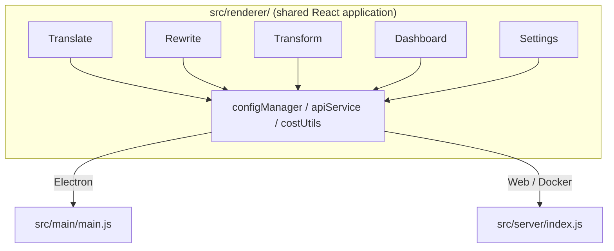

<p align="center">
  
</p>

<h1 align="center">Transrewrt</h1>

<p align="center">
  <a href="https://github.com/wsj-br/transrewrt/releases"></a>
  <a href="LICENSE"></a>
  
  
  
</p>

Інструмент для роботи з текстом на основі ШІ: перекладайте між мовами, переписуйте в різних стилях та трансформуйте за допомогою власних промптів — все це через [OpenRouter](https://openrouter.ai). Запускається як десктопний застосунок (Electron) або самохостинговий вебзастосунок (Docker).

- **Переклад** — між десятками мов, з автоматичним визначенням джерела
- **Переписування** — виправлення граматики, покращення чіткості, формальний/неформальний, скорочення, розширення, технічний
- **Трансформація** — власні промпти ШІ; створення та управління промптами, опційна цільова мова для кожного промпту
- **Моделі та вартість** — вибір будь-якої моделі OpenRouter; панель вартості з журналом SQLite, зведення за моделлю/операцією/днем
- **Інтерфейс** — i18n (pt-BR, de, fr, es, RTL), теми, шрифти, гарячі клавіші; безпечний вебрежим (ключ API тільки на сервері)
- **Десктоп** — застосунок Electron для Windows і Linux
- **Самохостинг** — образ Docker для amd64 та arm64 (готовий для Raspberry Pi)

Після встановлення дивіться **[Керівництво користувача](../USER-GUIDE.md)** для повного огляду всіх можливостей.

<small>**Читати іншими мовами:** [English (UK)](../README.md) · [Português (BR)](README.pt-BR.md) · [العربية](README.ar.md) · [বাংলা](README.bn.md) · [Català](README.ca.md) · [简体中文](README.zh-CN.md) · [繁體中文](README.zh-TW.md) · [Hrvatski](README.hr.md) · [Čeština](README.cs.md) · [Nederlands](README.nl.md) · [English (US)](README.en-US.md) · [Filipino](README.tl.md) · [Français](README.fr.md) · [Deutsch](README.de.md) · [Ελληνικά](README.el.md) · [हिन्दी](README.hi.md) · [Magyar](README.hu.md) · [Italiano](README.it.md) · [日本語](README.ja.md) · [Basa Jawa](README.jv.md) · [한국어](README.ko.md) · [Bahasa Melayu](README.ms.md) · [فارسی](README.fa.md) · [Polski](README.pl.md) · [Português (PT)](README.pt.md) · [ਪੰਜਾਬੀ](README.pa.md) · [Română](README.ro.md) · [Русский](README.ru.md) · [Slovenčina](README.sk.md) · [Español](README.es.md) · [Kiswahili](README.sw.md) · [Svenska](README.sv.md) · [తెలుగు](README.te.md) · [ภาษาไทย](README.th.md) · [Türkçe](README.tr.md) · [Українська](README.uk.md) · [Tiếng Việt](README.vi.md)</small>

<a id="screenshots"></a>
## Знімки екрану

**Вибір мови**


**Переклад**


**Трансформація — редактор промптів**


**Дашборд**


**Налаштування — вибір моделі**


<br /><br />

<a id="table-of-contents"></a>
## Зміст

<!-- START doctoc generated TOC please keep comment here to allow auto update -->
<!-- DON'T EDIT THIS SECTION, INSTEAD RE-RUN doctoc TO UPDATE -->

- [Швидкий старт](#quick-start)
- [Встановлення](#installation)
  - [Windows (Electron)](#windows-electron)
  - [Linux (Electron)](#linux-electron)
  - [Docker](#docker)
- [Отримання ключа API OpenRouter](#getting-an-openrouter-api-key)
- [Конфігурація та середовище](#configuration-and-environment)
- [Розробка та архітектура](#development-and-architecture)
- [Релізи та теги](#releases-and-tags)
- [Внесок](#contributing)
- [Відмова від відповідальності](#disclaimer)
- [Ліцензія](#license)

<!-- END doctoc generated TOC please keep comment here to allow auto update -->

<br /><br />

<a id="quick-start"></a>

## Швидкий старт

**Docker (рекомендовано для власного хостингу)**

```bash
docker pull ghcr.io/wsj-br/transrewrt:latest

API_KEY=sk-or-your-key docker run -d \
  -p 5000:5000 \
  -v transrewrt-data:/app/data \
  -e API_KEY \
  --name transrewrt-web \
  ghcr.io/wsj-br/transrewrt:latest
```

Замініть `sk-or-your-key` на ваш [API-ключ OpenRouter](https://openrouter.ai/keys). Відкрийте [http://localhost:5000](http://localhost:5000) та змініть пароль адміністратора за замовчуванням перед тим, як робити сервіс загальнодоступним.

<br />

> ℹ️ **ПРИМІТКА**<br/>
> У Docker API-ключ OpenRouter встановлюється лише через змінну середовища `API_KEY` (не у веб-інтерфейсі). На робочому столі (Electron) ви вставляєте його в **Налаштування → API**.

<br />

**Windows**

Завантажте останній `Transrewrt Setup x.y.z.exe` зі [сторінки релізів](https://github.com/wsj-br/transrewrt/releases), запустіть інсталятор, а потім запустіть програму з меню «Пуск» або ярлика на робочому столі. Введіть ваш API-ключ OpenRouter в **Налаштування → API**.

<br />

**Linux**

Завантажте `.AppImage` зі [сторінки релізів](https://github.com/wsj-br/transrewrt/releases), а потім:

```bash
chmod +x Transrewrt-x.y.z.AppImage && ./Transrewrt-x.y.z.AppImage
```

Введіть ваш API-ключ OpenRouter в **Налаштування → API**. У Debian/Ubuntu може знадобитися спочатку встановити додаткові залежності:

```bash
sudo apt install libgtk-3-0 libnotify-dev libnss3 libxss1 libasound2 libxtst6 xauth
```

Детальніше див. [Встановлення → Linux](#linux-electron).

<br />

> ℹ️ **ПРИМІТКА**<br/>
> macOS наразі не підтримується. Transrewrt доступний для Windows, Linux та Docker.

<br />

Як тільки програма запуститься, дивіться **[Керівництво користувача](../USER-GUIDE.md)**, щоб дізнатися, як перекладати, переписувати та трансформувати текст, керувати промптами та налаштовувати моделі.

<br /><br />

<a id="installation"></a>
## Встановлення

<a id="windows-electron"></a>
### Windows (Electron)

- Завантажте останній інсталятор зі [сторінки релізів](https://github.com/wsj-br/transrewrt/releases).
- Запустіть `.exe` та виконайтки інструкції встановлювача.
- Перший запуск: запустіть програму з меню «Пуск» або ярлика на робочому столі. Конфіг зберігається в `%APPDATA%\transrewrt\`.

<br />

<a id="linux-electron"></a>
### Linux (Electron)

- Завантажте `.AppImage` зі [сторінки релізів](https://github.com/wsj-br/transrewrt/releases).
- Запуск: `chmod +x Transrewrt-x.y.z.AppImage && ./Transrewrt-x.y.z.AppImage`
- Додаткові залежності (Debian/Ubuntu): `sudo apt install libgtk-3-0 libnotify-dev libnss3 libxss1 libasound2 libxtst6 xauth`
- Див. [dev/DEVELOPMENT.md](../dev/DEVELOPMENT.md) для більше.

<br />

<a id="docker"></a>
### Docker

- Завантажити: `docker pull ghcr.io/wsj-br/transrewrt:latest`
- API-ключ OpenRouter **обов'язково** встановлюється через змінну середовища `API_KEY`. Передайте його з `-e API_KEY` (або через `docker compose` / `.env`), щоб ключ не був видимим у списку процесів.
- API-ключ не можна ввести у веб-інтерфейсі.

Приклад - іменований том для persistently (ключ передається через env, а не в командному рядку):

```bash
API_KEY=sk-or-your-key docker run -d \
  -p 5000:5000 \
  -v transrewrt-data:/app/data \
  -e API_KEY \
  --name transrewrt-web \
  ghcr.io/wsj-br/transrewrt:latest
```

<br />

| Параметр   | Опис                                                                                                   |
| ---------- | ----------------------------------------------------------------------------------------------------- |
| Порт       | `5000` (сопоставити з `-p 5000:5000`)                                                                 |
| Том        | Змонтувати `/app/data` для збереження конфігу та бази даних                                            |
| Змінні середовища | `PORT`, `CONFIG_PATH`, `API_KEY`, `API_URL`, `KEY_SEED` - див. [Конфігурація](#configuration-and-environment) |

Щоб зібрати та запустити з джерела: `docker compose up --build -d` або `pnpm run docker:up` - див. [dev/DEVELOPMENT.md](../dev/DEVELOPMENT.md).

<br /><br />

<a id="getting-an-openrouter-api-key"></a>
## Отримання API-ключа OpenRouter

Transrewrt використовує [OpenRouter](https://openrouter.ai) для AI-моделей. Вам потрібен API-ключ, щоб перекладати, переписувати або трансформувати текст.

1. Зареєструйтесь або увійдіть на [openrouter.ai](https://openrouter.ai).
2. Відкрийте сторінку [Keys](https://openrouter.ai/keys) та створіть новий ключ (назвіть його та опціонально встановіть ліміт кредиту). Ви можете використовувати безкоштовні моделі без поповнення кредиту.
3. **Робочий стіл (Electron):** вставте ключ в **Налаштування → API**. **Docker:** встановіть змінну середовища `API_KEY` (див. [Швидкий старт](#quick-start)).

Щодо лімітів, BYOK та іншого, див. [Аутентифікація OpenRouter](https://openrouter.ai/docs/api/reference/authentication).

<br /><br />

<a id="configuration-and-environment"></a>

## Конфігурація та середовище

**Розташування файлів конфігурації**

| Розгортання         | Розташування конфігурації                                   |
| ------------------ | ------------------------------------------------- |
| Electron (Windows) | `%APPDATA%\transrewrt\`                           |
| Electron (Linux)   | `~/.config/transrewrt/`                           |
| Web / Docker       | `/app/data/config.json` (використовуйте том для збереження) |

<br />

**Змінні середовища** (тільки для веб/Docker; Electron використовує локальний файл конфігурації)

| Змінна      | Значення за замовчуванням                        | Опис                                                   |
| ------------- | ------------------------------ | ------------------------------------------------------------- |
| `PORT`        | `5000`                         | Порт, який слухає сервер                                         |
| `CONFIG_PATH` | `/app/data/config.json`        | Шлях до файлу конфігурації                                       |
| `API_KEY`     | *(empty)*                      | Ключ API OpenRouter (обов'язковий для Docker; встановлюється через змінні середовища, не через UI) |
| `API_URL`     | `https://openrouter.ai/api/v1` | Базовий URL API AI-сервісу                                      |
| `KEY_SEED`    | *(empty)*                      | Початкове значення ключа проксі Transrewrt (перевизначає конфігурацію, якщо встановлено)           |

<br />

**Дані та збереження:** Для Docker змонтуйте том у `/app/data`, щоб `config.json` та база даних SQLite зберігалися між перезапусками контейнера. Без тома всі дані будуть втрачені, коли контейнер зупиниться.

<br />

**Веб-аутентифікація:**
- Адміністратор за замовчуванням: `admin` / `transrewrt26`.
- Управління користувачами в **Налаштування → Користувачі**.
- Скинути пароль: `docker exec <container> reset-web-password '<username>' '<new-password>'`
  (з джерела: `pnpm run reset-web-password -- <username> <new-password>`)

<br />

> ⚠️ **ПОПЕРЕДЖЕННЯ**<br/>
> Змініть пароль адміністратора за замовчуванням негайно на будь-якому хості, доступному мережею.

<br />

**Проксі Transrewrt (необов'язково):** Ви можете маршрутизувати API-трафік через зовнішній проксі, який використовує ключ на основі часу. У **Налаштування → API**, увімкніть **Використовувати проксі Transrewrt**, встановіть **Початкове значення ключа** та встановіть **API URL** на базовий URL проксі. Детальніше див. [dev/SYSTEM-OVERVIEW.md](../dev/SYSTEM-OVERVIEW.md).

Основні налаштування (тема, шрифт, моделі, мови тощо) доступні у діалозі Налаштувань або можна редагувати безпосередньо у config JSON. Повний список та значення за замовчуванням документовано в [dev/DEVELOPMENT.md](../dev/DEVELOPMENT.md).

<br /><br />

<a id="development-and-architecture"></a>
## Розробка та архітектура

- Розробка: Налаштування, збірка, тестування та розгортання (Electron, Web, Docker) - див. **[dev/DEVELOPMENT.md](../dev/DEVELOPMENT.md)**.
- Архітектура та огляд системи: Структура папок, технологічний стек, дизайн-рішення, проксі Transrewrt - див. **[dev/SYSTEM-OVERVIEW.md](../dev/SYSTEM-OVERVIEW.md)**.



<br /><br />

<a id="releases-and-tags"></a>
## Релізи та теги

- Git-теги `v`* (наприклад, `v1.0.10`) запускають [робочий процес релізу](.github/workflows/release.yml). **GitHub Releases** додають інсталятор Windows (`.exe`) та Linux AppImage.
- Docker-образи публікуються на `ghcr.io/wsj-br/transrewrt`. Теги образів відповідають версії Git (наприклад, `v1.0.10` → `ghcr.io/wsj-br/transrewrt:1.0.10`) плюс `latest`. Багатоархітектурні: `linux/amd64` та `linux/arm64` (наприклад, Raspberry Pi).

<br /><br />

<a id="contributing"></a>
## Внесок

1. Зробіть форк репозиторію.
2. Створіть гілку функції: `git checkout -b feature/my-feature`
3. Зафіксуйте зміни з чітким повідомленням.
4. Відправте та відкрийте Pull Request проти `main`.

Будь ласка, дотримуйтесь існуючого стилю коду та протестуйте свої зміни як в Electron, так і в веб-режимі перед відправкою. Інструкції зі збірки та тестування див. в [dev/DEVELOPMENT.md](../dev/DEVELOPMENT.md).

**Повідомлення про помилки:** Відкрийте issue на [GitHub](https://github.com/wsj-br/transrewrt/issues). Вкажіть свою платформу (Windows / Linux / Docker) та версію програми (показану у діалозі About або на сторінці Releases).

<br /><br />

<a id="disclaimer"></a>

## Відмова від відповідальності

Назви продуктів та ікони належать їхнім власникам та використовуються виключно для ідентифікації. Це програмне забезпечення не пов'язане з жодною з згаданих брендів і не схвалене ними.

<br /><br />

<a id="license"></a>
## Ліцензія

Авторське право © 2026 Вальдемар Скюделлер-молодший.

[Ліцензія Apache 2.0](LICENSE)