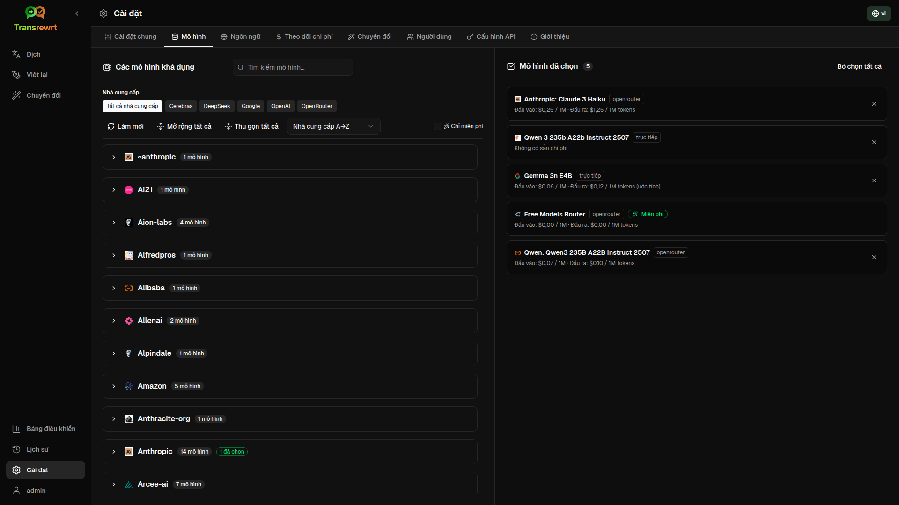

<p align="center">
  
</p>

<p align="center">
  <a href="https://github.com/wsj-br/transrewrt/releases"></a>
  <a href="LICENSE"></a>
  
  
  
</p>

Công cụ văn bản được hỗ trợ bởi AI: dịch giữa các ngôn ngữ, viết lại theo các phong cách khác nhau và chuyển đổi bằng lời nhắc tùy chỉnh - sử dụng nhiều nhà cung cấp AI (OpenRouter, OpenAI, Anthropic, Google Gemini, DeepSeek, Groq, Mistral, xAI và Ollama cục bộ). Chạy dưới dạng ứng dụng máy tính để bàn (Electron) hoặc ứng dụng web tự lưu trữ (Docker).

- **Dịch** - giữa hàng chục ngôn ngữ, với khả năng tự động phát hiện ngôn ngữ nguồn
- **Viết lại** - sửa ngữ pháp, cải thiện độ rõ ràng, trang trọng/thân mật, rút gọn, mở rộng, kỹ thuật
- **Chuyển đổi** - lời nhắc AI tùy chỉnh; tạo và quản lý lời nhắc, ngôn ngữ đích tùy chọn theo từng lời nhắc
- **Lịch sử** - lịch sử thực thi đầy đủ với văn bản đầu vào/đầu ra, lọc và xuất dữ liệu
- **Mô hình & chi phí** - chọn mô hình từ bất kỳ nhà cung cấp nào đã cấu hình; bảng điều khiển chi phí và sử dụng với nhật ký, tóm tắt theo mô hình/thao tác/ngày
- **Giao diện người dùng (UI)** - giao diện đa ngôn ngữ (trên 30 ngôn ngữ, hỗ trợ RTL), phông chữ, ...
- **Chế độ Web** - hỗ trợ nhiều người dùng với các vai trò quản trị viên
- **Máy tính để bàn** - Ứng dụng Electron cho Windows và Linux
- **Tự lưu trữ** - hình ảnh Docker cho amd64 & arm64 (sẵn sàng dùng với Raspberry Pi)

Sau khi cài đặt, hãy xem **[Hướng dẫn Người dùng](USER-GUIDE.vi.md)** để tìm hiểu chi tiết về tất cả các tính năng.

<small>**Đọc bằng các ngôn ngữ khác:** </small>

<small id="lang-list">[English](../README.md) · [Português (BR)](./README.pt-BR.md) · [العربية](./README.ar.md) · [বাংলা](./README.bn.md) · [Català](./README.ca.md) · [中文 (中国大陆)](./README.zh-CN.md) · [中文 (台灣)](./README.zh-TW.md) · [Hrvatski](./README.hr.md) · [Čeština](./README.cs.md) · [Nederlands](./README.nl.md) · [English](./README.en-US.md) · [Tagalog](./README.tl.md) · [Français](./README.fr.md) · [Deutsch](./README.de.md) · [Ελληνικά](./README.el.md) · [हिन्दी](./README.hi.md) · [Magyar](./README.hu.md) · [Italiano](./README.it.md) · [日本語](./README.ja.md) · [한국어](./README.ko.md) · [Bahasa Melayu](./README.ms.md) · [فارسی](./README.fa.md) · [Polski](./README.pl.md) · [Basa Jawa](./README.jv.md) · [Português](./README.pt.md) · [ਪੰਜਾਬੀ](./README.pa.md) · [Română](./README.ro.md) · [Русский](./README.ru.md) · [Slovenčina](./README.sk.md) · [Español](./README.es.md) · [Kiswahili](./README.sw.md) · [Svenska](./README.sv.md) · [తెలుగు](./README.te.md) · [ไทย](./README.th.md) · [Türkçe](./README.tr.md) · [Українська](./README.uk.md) · [Tiếng Việt](./README.vi.md)</small>

<small>

> **Lưu ý về bản dịch giao diện người dùng và tài liệu:** Tất cả các ngôn ngữ giao diện ngoại trừ tiếng Anh (UK) gốc 
> đều được dịch bằng các mô hình AI; cách diễn đạt có thể không chính xác hoặc chứa lỗi.

</small>

<br/>

<a id="table-of-contents"></a>
## Mục lục

<!-- START doctoc generated TOC please keep comment here to allow auto update -->
<!-- DON'T EDIT THIS SECTION, INSTEAD RE-RUN doctoc TO UPDATE -->

- [Ảnh chụp màn hình](#screenshots)
- [Bắt đầu nhanh](#quick-start)
- [Lấy khóa API OpenRouter](#getting-an-openrouter-api-key)
- [Cấu hình và môi trường](#configuration-and-environment)
- [Phát triển và kiến trúc](#development-and-architecture)
- [Báo cáo sự cố](#reporting-issues)
- [Tuyên bố từ chối trách nhiệm](#disclaimer)
- [Giấy phép](#license)

<!-- END doctoc generated TOC please keep comment here to allow auto update -->

<br/><br/>

<a id="screenshots"></a>
## Ảnh chụp màn hình

**Bộ chọn ngôn ngữ**


**Dịch**


**Chuyển đổi - trình soạn thảo lời nhắc**


**Bảng điều khiển**


**Lịch sử**


**Cài đặt - lựa chọn mô hình**



<br/><br/>

<a id="quick-start"></a>
## Bắt đầu nhanh

<details>
<summary><b>Docker (được khuyến nghị để tự lưu trữ)</b></summary>

<a id="docker"></a>

<br/>

```bash
docker pull ghcr.io/wsj-br/transrewrt:latest

OPENROUTER_API_KEY=sk-or-your-key docker run -d \
  -p 5000:5000 \
  -v transrewrt-data:/app/data \
  -e OPENROUTER_API_KEY \
  --name transrewrt-web \
  ghcr.io/wsj-br/transrewrt:latest
```

Thay thế `sk-or-your-key` bằng khóa API [OpenRouter](https://openrouter.ai/keys) của bạn (hoặc thiết lập các khóa nhà cung cấp khác; xem [Cấu hình](#configuration-and-environment)). Mở [http://localhost:5000](http://localhost:5000) và thay đổi mật khẩu quản trị viên mặc định trước khi công khai dịch vụ.

Thiết lập ít nhất một khóa nhà cung cấp thông qua môi trường (ví dụ: `OPENROUTER_API_KEY` cho OpenRouter). Truyền các biến bằng `-e` hoặc `docker compose` / `.env` để đảm bảo bí mật không bị nhúng vào trong hình ảnh. Các khóa nhà cung cấp **không** được nhập trong giao diện web; máy chủ đọc chúng từ môi trường.

<br/>

> ℹ️ **LƯU Ý**<br/>
> Trong Docker, thông tin đăng nhập LLM được thiết lập bằng các biến môi trường như `OPENROUTER_API_KEY`, `OPENAI_API_KEY`, `CEREBRAS_API_KEY`, … (không phải trong giao diện web). Trên máy tính để bàn (Electron), bạn cấu hình khóa trong **Cài đặt → API**.

<br/>

Hoặc sử dụng Docker Compose:

```
# download the compose file
wget https://github.com/wsj-br/transrewrt/raw/refs/heads/master/production.yml -O transrewrt.yml
# Edit the file to add your API keys (API_KEYs), or uncomment and adjust the `.env` file. Set the timezone (TZ) if necessary.
vi transrewrt.yml
# start the container
docker compose -f transrewrt.yml up -d
```

Xem [Cấu hình](#configuration-and-environment) để biết tất cả các biến môi trường, như `PORT`, `CONFIG_PATH`, `TZ`, và các khóa LLM (`OPENROUTER_API_KEY`, `OPENAI_API_KEY`, …).

</details>

<br/>

<details>
<summary><b>Múi giờ máy chủ (Docker)</b></summary>

<a id="configuring-the-timezone"></a>

<br/>

Ngày và giờ trên giao diện người dùng ứng dụng tuân theo múi giờ và khu vực của **trình duyệt**. Đối với hành vi **phía máy chủ** (ghi nhật ký và các chức năng tương tự), container sử dụng biến môi trường `TZ`. Mặc định là `TZ=Europe/London`.

Để sử dụng múi giờ khác, thiết lập `TZ` trong tệp Compose của bạn, ví dụ:

```yaml
environment:
  - TZ=America/Sao_Paulo
```

Hoặc truyền nó khi chạy container (Docker):

```bash
--env TZ=America/Sao_Paulo
```

Trên nhiều máy chủ Linux, bạn có thể sao chép tên múi giờ hệ thống bằng lệnh:

```bash
echo TZ=\"$(</etc/timezone)\"
```

Danh sách các tên múi giờ hợp lệ được duy trì trong [cơ sở dữ liệu tz](https://en.wikipedia.org/wiki/List_of_tz_database_time_zones) (Wikipedia).

</details>

<br/>

<details>
<summary><b>Windows</b></summary>

<a id="windows-electron"></a>

<br/>

- Tải xuống `Transrewrt Setup x.y.z.exe` mới nhất từ [Phát hành](https://github.com/wsj-br/transrewrt/releases).
- Chạy `.exe` và làm theo hướng dẫn cài đặt.
- Lần đầu chạy: khởi động ứng dụng từ menu Bắt đầu hoặc lối tắt trên màn hình.
- Nhập khóa API của bạn trong **Cài đặt → API**. Bạn cần cấu hình ít nhất một nhà cung cấp; OpenRouter thường được dùng cho các mô hình miễn phí.

<br/>

> ℹ️ **LƯU Ý**<br/>
> Windows có thể hiển thị một trong các cảnh báo bảo mật sau (bình thường đối với ứng dụng độc lập/chưa ký): 
>   - **User Account Control (UAC)**: "Bạn có muốn cho phép ứng dụng từ nhà xuất bản chưa biết thực hiện thay đổi trên thiết bị của bạn?" → Nhấp **Có**.
>   - **Microsoft Defender SmartScreen**: "Windows đã bảo vệ PC của bạn" → Nhấp **Thông tin thêm** → **Vẫn chạy**.
>
> Điều này xảy ra vì ứng dụng chưa được ký bởi Microsoft hoặc nhà xuất bản lớn — nó an toàn nếu được tải từ trang phát hành chính thức trên GitHub của chúng tôi (xác minh checksum trên trang [Phát hành](https://github.com/wsj-br/transrewrt/releases) bên cạnh từng tài nguyên).

<br/>

</details>

<br/>

<details>
<summary><b>Linux</b></summary>

<a id="linux-electron"></a>

<br/>

Tải xuống `.AppImage` cho CPU của bạn từ [Releases](https://github.com/wsj-br/transrewrt/releases) (`x64` dành cho PC thông thường, `arm64` dành cho nhiều thiết bị ARM, bao gồm Raspberry Pi 4+), sau đó:

```bash
chmod +x Transrewrt-x.y.z-x64.AppImage && ./Transrewrt-x.y.z-x64.AppImage
```

Trên x86_64/amd64 sử dụng tên tệp `x64`; trên ARM64 sử dụng tên `...-arm64.AppImage`.

Nhập khóa API của bạn vào **Cài đặt → API**. Bạn cần cấu hình ít nhất một nhà cung cấp; OpenRouter là lựa chọn phổ biến cho các mô hình miễn phí.

**Thông báo bảng điều khiển:** Bản dựng Linux đóng gói (`x64` và `arm64` AppImages) ẩn các cảnh báo lỗi thời của Node trong terminal (ví dụ như mô-đun `punycode` tích hợp). Nếu Chromium hiển thị lỗi GPU / EGL như “GLES3 không được hỗ trợ” nhưng ứng dụng vẫn hoạt động, bạn có thể tắt chúng bằng cách vô hiệu hóa tăng tốc phần cứng:

```bash
TRANSREWRT_DISABLE_GPU=1 ./Transrewrt-x.y.z-arm64.AppImage
```

Điều này áp dụng trên cả amd64; hãy đổi tên tệp cho phù hợp với tệp đã tải về.

Trên Debian/Ubuntu, bạn có thể cần thêm các thư viện **runtime** mà Chromium yêu cầu (những thư viện này thường đã có sẵn trên các bản cài đặt máy tính đầy đủ). Chạy các lệnh dưới đây nếu cần:

```bash
sudo apt update
sudo apt install -y libfuse2 libgtk-3-0 libnotify4 libnss3 libnspr4 libxss1 libxtst6 xdg-utils \
     xauth libatspi2.0-0 libdrm2 libgbm1 libxcb-dri3-0 libcups2 libasound2t64
```

thay thế `libasound2t64` bằng `libasound2` cho `arm64`. Các bản cài đặt tối giản hoặc tùy chỉnh vẫn có thể thất bại với lỗi thiếu tệp `.so`. Cài đặt gói có tên như trong thông báo lỗi (các gói bổ sung phổ biến: `libatk1.0-0`, `libatk-bridge2.0-0`, `libgbm1`, `libdrm2`). Trong một số môi trường, bạn có thể cần chạy ứng dụng bằng `APPIMAGE_EXTRACT_AND_RUN=1 ./Transrewrt-….AppImage`.

<br/>

> ℹ️ **LƯU Ý**<br/>
> macOS hiện tại chưa được hỗ trợ. Transrewrt có sẵn cho Windows, Linux và Docker.

</details>

<br/>

Khi ứng dụng đang chạy, hãy xem **[Hướng dẫn Người dùng](USER-GUIDE.vi.md)** để tìm hiểu cách dịch, viết lại và chuyển đổi văn bản, quản lý lời nhắc và cấu hình mô hình.

<br/><br/>

<a id="getting-an-openrouter-api-key"></a>
## Lấy khóa API OpenRouter

Transrewrt hỗ trợ nhiều nhà cung cấp AI. [OpenRouter](https://openrouter.ai) là lựa chọn phổ biến vì nó tập hợp nhiều mô hình dưới một khóa duy nhất và cung cấp các mô hình miễn phí.

1. Đăng ký hoặc đăng nhập tại [openrouter.ai](https://openrouter.ai).
2. Mở trang [Keys](https://openrouter.ai/keys) và tạo khóa mới (đặt tên, và tùy chọn đặt giới hạn tín dụng). Bạn có thể dùng các mô hình miễn phí mà không cần thêm tín dụng.
3. **Bản dành cho máy tính (Electron):** dán khóa vào **Cài đặt → API**. **Docker:** thiết lập biến môi trường như `OPENROUTER_API_KEY` (xem [Bắt đầu nhanh](#quick-start)).

Không sử dụng mô hình **Body Builder** của OpenRouter ([`openrouter/bodybuilder`](https://openrouter.ai/openrouter/bodybuilder)) cho dịch, viết lại hoặc chuyển đổi: nó trả về các gói yêu cầu JSON, chứ không phải văn bản hoàn chỉnh cho các tác vụ đó. Xem [Cài đặt → Mô hình](USER-GUIDE.vi.md#models) trong Hướng dẫn Người dùng.

Bạn cũng có thể sử dụng các nhà cung cấp khác (OpenAI, Anthropic, Google Gemini, DeepSeek, Groq, Mistral, xAI, Cerebras) hoặc chạy mô hình cục bộ với [Ollama](https://ollama.com). Xem [Cấu hình](#configuration-and-environment) để biết danh sách đầy đủ các nhà cung cấp được hỗ trợ và các biến môi trường.

</br>

> ⚠️ **CẢNH BÁO**<br/>
> Nếu bạn đang sử dụng Ollama từ một thiết bị, container hoặc dịch vụ khác, hãy nhớ cấu hình Ollama cho phép kết nối từ bên ngoài (không chỉ localhost).

<br/><br/>

<a id="configuration-and-environment"></a>
## Cấu hình và môi trường

</br>

**Vị trí tệp cấu hình**

| Triển khai         | Vị trí cấu hình                                   |
| ------------------ | ------------------------------------------------- |
| Electron (Windows) | `%APPDATA%\transrewrt\`                           |
| Electron (Linux)   | `~/.config/transrewrt/`                           |
| Web / Docker       | `/app/data/config.json` (sử dụng volume để lưu trữ dữ liệu) |

<br/>

**Biến môi trường** (chỉ dành cho web/Docker; Electron sử dụng tệp cấu hình cục bộ)

| Biến                | Mô tả                                                                          |
|----------------------|------------------------------------------------------------------------------|
| `PORT`               | Cổng lắng nghe của máy chủ (mặc định là `5000`)                                  |
| `CONFIG_PATH`        | Đường dẫn đến tệp cấu hình (mặc định là `/app/data/config.json`)                |
| `TZ`                 | múi giờ cho thời gian phía máy chủ (ghi log, v.v.) (mặc định là `Europe/London`) |
| `OPENROUTER_API_KEY` | Khóa API OpenRouter                                                           |
| `OPENAI_API_KEY`     | Khóa API OpenAI                                                               |
| `CEREBRAS_API_KEY`   | Khóa API Cerebras                                                             |
| `ANTHROPIC_API_KEY`  | Khóa API Anthropic                                                            |
| `GOOGLE_API_KEY`     | Khóa API Google Gemini                                                        |
| `DEEPSEEK_API_KEY`   | Khóa API DeepSeek                                                             |
| `GROQ_API_KEY`       | Khóa API Groq                                                                 |
| `MISTRAL_API_KEY`    | Khóa API Mistral                                                              |
| `OLLAMA_URL`         | URL gốc Ollama (ví dụ: `http://host.docker.internal:11434`)                   |
| `XAI_API_KEY`        | Khóa API xAI                                                                  |

Chỉ cấu hình các nhà cung cấp bạn sử dụng. ID mô hình được phân không gian tên (`openrouter/…`, `openai/…`, `cerebras/…`, `ollama/…`, v.v.).

**Hiển thị chi phí:** OpenRouter trả về chi phí tính chính xác khi có thể. Các nhà cung cấp khác sử dụng chi phí **ước tính** từ bảng giá mô hình công khai của OpenRouter khi có khóa OpenRouter; nếu không, chi phí không phải OpenRouter có thể hiển thị là `0`. Các ước tính không phải là hóa đơn.

<br/>

**Dữ liệu và lưu trữ:** Đối với Docker, gắn một volume tại `/app/data` để `config.json` và cơ sở dữ liệu SQLite được lưu trữ qua các lần khởi động lại container. Nếu không có volume, mọi dữ liệu sẽ bị mất khi container dừng.

<br/>

**Xác thực web:**

- Quản trị viên mặc định: `admin` / `transrewrt26`.
- Quản lý người dùng trong **Cài đặt → Người dùng**.
- Đặt lại mật khẩu: `docker exec <container> reset-web-password '<username>' '<new-password>'`

<br/>

> ⚠️ **CẢNH BÁO**<br/>
> Thay đổi mật khẩu quản trị viên mặc định ngay lập tức trên mọi máy chủ có thể truy cập qua mạng.

<br/>

Các thiết lập chính (phông chữ, mô hình, ngôn ngữ, v.v.) có sẵn trong phần Cài đặt của ứng dụng.

<br/><br/>

<a id="development-and-architecture"></a>
## Phát triển và kiến trúc

- **Phát triển:** Thiết lập, xây dựng, thử nghiệm và triển khai (Electron, Web, Docker) - xem **[dev/DEVELOPMENT.md](../dev/DEVELOPMENT.md)**.
- **Kiến trúc và tổng quan hệ thống:** Cấu trúc thư mục, công nghệ sử dụng, các quyết định thiết kế - xem **[dev/SYSTEM-OVERVIEW.md](../dev/SYSTEM-OVERVIEW.md)**.

<br/><br/>

<a id="reporting-issues"></a>
## Báo cáo sự cố

Tạo một vấn đề trên [GitHub](https://github.com/wsj-br/transrewrt/issues). Vui lòng cung cấp nền tảng của bạn (Windows / Linux / Docker) và phiên bản ứng dụng (hiển thị trong hộp thoại Giới thiệu hoặc trên trang Phát hành).

<br/><br/>

<a id="disclaimer"></a>
## Miễn trừ trách nhiệm

Tên sản phẩm và biểu tượng thuộc về chủ sở hữu tương ứng và chỉ được sử dụng nhằm mục đích nhận dạng. Phần mềm này không liên kết hoặc được bảo trợ bởi bất kỳ thương hiệu nào được đề cập.

<br/><br/>

<a id="license"></a>
## Giấy phép

Bản quyền © 2026 Waldemar Scudeller Jr.

[Apache License 2.0](../LICENSE)
