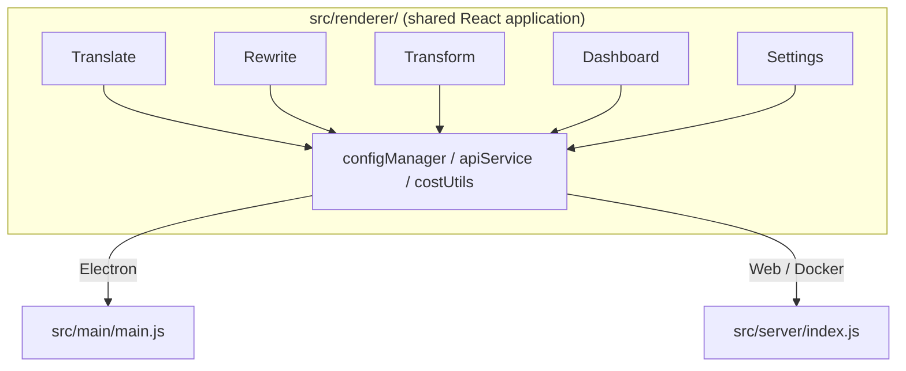

<p align="center">
  
</p>

<h1 align="center">Transrewrt</h1>

<p align="center">
  <a href="https://github.com/wsj-br/transrewrt/releases"></a>
  <a href="LICENSE"></a>
  
  
  
</p>

Công cụ văn bản dựa trên AI: dịch giữa các ngôn ngữ, viết lại theo các phong cách khác nhau và biến đổi với các lời nhắc tùy chỉnh - tất cả thông qua [OpenRouter](https://openrouter.ai). Chạy dưới dạng ứng dụng desktop (Electron) hoặc ứng dụng web tự host (Docker).

- **Dịch** - giữa hàng chục ngôn ngữ, với tự động phát hiện ngôn ngữ nguồn
- **Viết lại** - sửa ngữ pháp, cải thiện tính rõ ràng, trang trọng/casual, rút ngắn, mở rộng, kỹ thuật
- **Biến đổi** - lời nhắc AI tùy chỉnh; tạo và quản lý lời nhắc, ngôn ngữ đích tùy chọn cho mỗi lời nhắc
- **Mô hình & chi phí** - chọn bất kỳ mô hình OpenRouter nào; bảng điều khiển chi phí với nhật ký SQLite, tóm tắt theo mô hình/hành động/ngày
- **Giao diện** - i18n (pt-BR, de, fr, es, RTL), chủ đề, phông chữ, lối tắt bàn phím; chế độ web bảo mật (khóa API chỉ trên máy chủ)
- **Desktop** - Ứng dụng Electron cho Windows và Linux
- **Tự host** - Hình ảnh Docker cho amd64 & arm64 (sẵn sàng cho Raspberry Pi)

Sau khi cài đặt, xem **[Hướng dẫn người dùng](../USER-GUIDE.md)** để biết hướng dẫn chi tiết về tất cả các tính năng.

<small>**Đọc bằng ngôn ngữ khác:** [English (UK)](../README.md) · [Português (BR)](README.pt-BR.md) · [العربية](README.ar.md) · [বাংলা](README.bn.md) · [Català](README.ca.md) · [简体中文](README.zh-CN.md) · [繁體中文](README.zh-TW.md) · [Hrvatski](README.hr.md) · [Čeština](README.cs.md) · [Nederlands](README.nl.md) · [English (US)](README.en-US.md) · [Filipino](README.tl.md) · [Français](README.fr.md) · [Deutsch](README.de.md) · [Ελληνικά](README.el.md) · [हिन्दी](README.hi.md) · [Magyar](README.hu.md) · [Italiano](README.it.md) · [日本語](README.ja.md) · [Basa Jawa](README.jv.md) · [한국어](README.ko.md) · [Bahasa Melayu](README.ms.md) · [فارسی](README.fa.md) · [Polski](README.pl.md) · [Português (PT)](README.pt.md) · [ਪੰਜਾਬੀ](README.pa.md) · [Română](README.ro.md) · [Русский](README.ru.md) · [Slovenčina](README.sk.md) · [Español](README.es.md) · [Kiswahili](README.sw.md) · [Svenska](README.sv.md) · [తెలుగు](README.te.md) · [ภาษาไทย](README.th.md) · [Türkçe](README.tr.md) · [Українська](README.uk.md) · [Tiếng Việt](README.vi.md)</small>

<a id="screenshots"></a>
## Ảnh chụp màn hình

**Bộ chọn ngôn ngữ**


**Dịch**


**Biến đổi - trình chỉnh sửa lời nhắc**


**Bảng điều khiển**


**Cài đặt - chọn mô hình**


<br /><br />

<a id="table-of-contents"></a>
## Mục lục

<!-- START doctoc generated TOC please keep comment here to allow auto update -->
<!-- DON'T EDIT THIS SECTION, INSTEAD RE-RUN doctoc TO UPDATE -->

- [Bắt đầu nhanh](#quick-start)
- [Cài đặt](#installation)
  - [Windows (Electron)](#windows-electron)
  - [Linux (Electron)](#linux-electron)
  - [Docker](#docker)
- [Lấy khóa API OpenRouter](#getting-an-openrouter-api-key)
- [Cấu hình và môi trường](#configuration-and-environment)
- [Phát triển và kiến trúc](#development-and-architecture)
- [Bản phát hành và thẻ](#releases-and-tags)
- [Đóng góp](#contributing)
- [Miễn trừ trách nhiệm](#disclaimer)
- [Giấy phép](#license)

<!-- END doctoc generated TOC please keep comment here to allow auto update -->

<br /><br />

<a id="quick-start"></a>

## Bắt đầu nhanh

**Docker (khuyến nghị để tự host)**

```bash
docker pull ghcr.io/wsj-br/transrewrt:latest

API_KEY=sk-or-your-key docker run -d \
  -p 5000:5000 \
  -v transrewrt-data:/app/data \
  -e API_KEY \
  --name transrewrt-web \
  ghcr.io/wsj-br/transrewrt:latest
```

Thay `sk-or-your-key` bằng [khóa API OpenRouter](https://openrouter.ai/keys) của bạn. Mở [http://localhost:5000](http://localhost:5000) và thay đổi mật khẩu quản trị mặc định trước khi công khai dịch vụ.

<br />

> ℹ️ **GHI CHÚ**<br/>
> Trong Docker, khóa API OpenRouter chỉ được đặt thông qua biến môi trường `API_KEY` (không trong giao diện web). Trên máy tính để bàn (Electron), bạn dán nó trong **Cài đặt → API**.

<br />

**Windows**

Tải xuống `Transrewrt Setup x.y.z.exe` mới nhất từ [Releases](https://github.com/wsj-br/transrewrt/releases), chạy bộ cài đặt, sau đó khởi động từ menu Start hoặc lối tắt trên màn hình nền. Nhập khóa API OpenRouter của bạn trong **Cài đặt → API**.

<br />

**Linux**

Tải xuống tệp `.AppImage` từ [Releases](https://github.com/wsj-br/transrewrt/releases), sau đó:

```bash
chmod +x Transrewrt-x.y.z.AppImage && ./Transrewrt-x.y.z.AppImage
```

Nhập khóa API OpenRouter của bạn trong **Cài đặt → API**. Trên Debian/Ubuntu, bạn có thể cần cài đặt các phụ thuộc bổ sung trước:

```bash
sudo apt install libgtk-3-0 libnotify-dev libnss3 libxss1 libasound2 libxtst6 xauth
```

Xem [Cài đặt → Linux](#linux-electron) để biết chi tiết.

<br />

> ℹ️ **GHI CHÚ**<br/>
> Hiện tại không hỗ trợ macOS. Transrewrt có sẵn cho Windows, Linux và Docker.

<br />

Sau khi ứng dụng chạy, xem **[Hướng dẫn người dùng](../USER-GUIDE.md)** để tìm hiểu cách dịch, viết lại và biến đổi văn bản, quản lý lời nhắc và cấu hình mô hình.

<br /><br />

<a id="installation"></a>
## Cài đặt

<a id="windows-electron"></a>
### Windows (Electron)

- Tải xuống trình cài đặt mới nhất từ [Releases](https://github.com/wsj-br/transrewrt/releases).
- Chạy tệp `.exe` và làm theo trình cài đặt.
- Lần chạy đầu tiên: khởi động ứng dụng từ menu Start hoặc lối tắt trên màn hình nền. Cấu hình được lưu trong `%APPDATA%\transrewrt\`.

<br />

<a id="linux-electron"></a>
### Linux (Electron)

- Tải xuống tệp `.AppImage` từ [Releases](https://github.com/wsj-br/transrewrt/releases).
- Chạy: `chmod +x Transrewrt-x.y.z.AppImage && ./Transrewrt-x.y.z.AppImage`
- Phụ thuộc bổ sung (Debian/Ubuntu): `sudo apt install libgtk-3-0 libnotify-dev libnss3 libxss1 libasound2 libxtst6 xauth`
- Xem [dev/DEVELOPMENT.md](../dev/DEVELOPMENT.md) để biết thêm.

<br />

<a id="docker"></a>
### Docker

- Lấy: `docker pull ghcr.io/wsj-br/transrewrt:latest`
- Khóa API OpenRouter **phải** được đặt thông qua biến môi trường `API_KEY`. Truyền nó với `-e API_KEY` (hoặc qua `docker compose` / `.env`) để khóa không hiển thị trong danh sách tiến trình.
- Không thể nhập khóa API trong giao diện web.

Ví dụ - volume có tên để duy trì (khóa API được truyền qua env, không trên dòng lệnh):

```bash
API_KEY=sk-or-your-key docker run -d \
  -p 5000:5000 \
  -v transrewrt-data:/app/data \
  -e API_KEY \
  --name transrewrt-web \
  ghcr.io/wsj-br/transrewrt:latest
```

<br />

| Tùy chọn   | Mô tả                                                                                                   |
| ---------- | ------------------------------------------------------------------------------------------------------- |
| Cổng       | `5000` ( ánh xạ với `-p 5000:5000`)                                                                    |
| Volume     | Gắn `/app/data` để lưu cấu hình và cơ sở dữ liệu                                                      |
| Biến môi trường | `PORT`, `CONFIG_PATH`, `API_KEY`, `API_URL`, `KEY_SEED` - xem [Cấu hình](#configuration-and-environment) |

Để build và chạy từ mã nguồn: `docker compose up --build -d` hoặc `pnpm run docker:up` - xem [dev/DEVELOPMENT.md](../dev/DEVELOPMENT.md).

<br /><br />

<a id="getting-an-openrouter-api-key"></a>
## Lấy khóa API OpenRouter

Transrewrt sử dụng [OpenRouter](https://openrouter.ai) cho các mô hình AI. Bạn cần một khóa API để dịch, viết lại hoặc biến đổi văn bản.

1. Đăng ký hoặc đăng nhập tại [openrouter.ai](https://openrouter.ai).
2. Mở trang [Keys](https://openrouter.ai/keys) và tạo một khóa mới (đặt tên, và tùy chọn đặt giới hạn credit). Bạn có thể sử dụng các mô hình miễn phí mà không cần thêm credit.
3. **Máy tính để bàn (Electron):** dán khóa vào **Cài đặt → API**. **Docker:** đặt biến môi trường `API_KEY` (xem [Bắt đầu nhanh](#quick-start)).

Đối với giới hạn, BYOK và hơn nữa, xem [Xác thực OpenRouter](https://openrouter.ai/docs/api/reference/authentication).

<br /><br />

<a id="configuration-and-environment"></a>

## Cấu hình và môi trường

**Vị trí tệp tin cấu hình**

| Triển khai         | Vị trí cấu hình                                   |
| ------------------ | ------------------------------------------------- |
| Electron (Windows) | `%APPDATA%\transrewrt\`                           |
| Electron (Linux)   | `~/.config/transrewrt/`                           |
| Web / Docker       | `/app/data/config.json` (dùng volume để lưu trữ) |

<br />

**Biến môi trường** (chỉ web/Docker; Electron dùng tệp cấu hình cục bộ)

| Biến      | Mặc định                        | Mô tả                                                   |
| ------------- | ------------------------------ | ------------------------------------------------------------- |
| `PORT`        | `5000`                         | Cổng server lắng nghe                                         |
| `CONFIG_PATH` | `/app/data/config.json`        | Đường dẫn đến tệp cấu hình                                       |
| `API_KEY`     | *(trống)*                      | Khóa API OpenRouter (bắt buộc cho Docker; đặt qua env, không qua UI) |
| `API_URL`     | `https://openrouter.ai/api/v1` | URL cơ sở API AI ilàm nguồn                                      |
| `KEY_SEED`    | *(trống)*                      | Mã khóa proxy Transrewrt (ghi đè cấu hình nếu được đặt)           |

<br />

**Dữ liệu và khả năng lưu trữ:** Đối với Docker, gắn một volume tại `/app/data` để `config.json` và cơ sở dữ liệu SQLite được lưu trữ xuyên suốt các lần khởi động lại container. Không có volume, mọi dữ liệu sẽ bị mất khi container dừng.

<br />

**Xác thực web:**

- Mặc định admin: `admin` / `transrewrt26`.
- Quản lý người dùng trong **Cài đặt → Người dùng**.
- Đặt lại mật khẩu: `docker exec <container> reset-web-password '<tên-người-dùng>' '<mật-khẩu-mới>`
  (từ mã nguồn: `pnpm run reset-web-password -- <tên-người-dùng> <mật-khẩu-mới>`)

<br />

> ⚠️ **CẢNH BÁO**<br/>
> Thay đổi mật khẩu admin mặc định ngay lập tức trên bất kỳ máy chủ nào có thể truy cập qua mạng.

<br />

**Proxy Transrewrt (tùy chọn):** Bạn có thể định tuyến lưu lượng API qua một proxy bên ngoài sử dụng khóa cuộn dựa trên thời gian. Trong **Cài đặt → API**, kích hoạt **Sử dụng Proxy Transrewrt**, đặt **Mã khóa (Key seed)** và đặt **API URL** thành URL cơ sở của proxy. Xem [dev/SYSTEM-OVERVIEW.md](../dev/SYSTEM-OVERVIEW.md) để biết chi tiết.

Các thiết lập chính (chủ đề, phông chữ, mô hình, ngôn ngữ, v.v.) có sẵn trong hộp thoại Cài đặt hoặc có thể chỉnh sửa trực tiếp trong JSON cấu hình. Danh sách đầy đủ và giá trị mặc định được ghi chú trong [dev/DEVELOPMENT.md](../dev/DEVELOPMENT.md).

<br /><br />

<a id="development-and-architecture"></a>
## Phát triển và kiến trúc

- **Phát triển:** Cài đặt, build, test và triển khai (Electron, Web, Docker) - xem **[dev/DEVELOPMENT.md](../dev/DEVELOPMENT.md)**.
- **Kiến trúc và tổng quan hệ thống:** Cấu trúc thư mục, stack công nghệ, các quyết định thiết kế, proxy Transrewrt - xem **[dev/SYSTEM-OVERVIEW.md](../dev/SYSTEM-OVERVIEW.md)**.



<br /><br />

<a id="releases-and-tags"></a>
## Bản phát hành và thẻ (tags)

- **Thẻ Git** `v`* (ví dụ: `v1.0.10`) kích hoạt [workflow phát hành](.github/workflows/release.yml). **Bản Phát hành GitHub** đính kèm trình cài đặt Windows (`.exe`) và Linux AppImage.
- **Hình ảnh Docker** được xuất bản lên `ghcr.io/wsj-br/transrewrt`. Thẻ hình ảnh khớp với phiên bản Git (ví dụ: `v1.0.10` → `ghcr.io/wsj-br/transrewrt:1.0.10`) cộng với `latest`. Đa nền tảng: `linux/amd64` và `linux/arm64` (ví dụ: Raspberry Pi).

<br /><br />

<a id="contributing"></a>
## Đóng góp

1. Fork repository.
2. Tạo nhánh tính năng: `git checkout -b feature/my-feature`
3. Commit các thay đổi của bạn với thông điệp rõ ràng.
4. Push và mở Pull Request vào `main`.

Vui lòng tuân theo phong cách code hiện có và kiểm tra thay đổi của bạn trong cả chế độ Electron và web trước khi gửi. Xem [dev/DEVELOPMENT.md](../dev/DEVELOPMENT.md) để biết hướng dẫn build và test.

<br />

**Báo cáo sự cố:** Mở một issue trên [GitHub](https://github.com/wsj-br/transrewrt/issues). Bao gồm nền tảng của bạn (Windows / Linux / Docker) và phiên bản ứng dụng (hiển thị trong hộp thoại Giới thiệu hoặc trên trang Bản phát hành).

<br /><br />

<a id="disclaimer"></a>

## Tuyên bố miễn trừ trách nhiệm

Tên và biểu tượng sản phẩm thuộc về các chủ sở hữu tương ứng và chỉ được sử dụng cho mục đích nhận dạng. Phần mềm này không có liên kết hoặc được hỗ trợ bởi bất kỳ thương hiệu nào được đề cập.

<br /><br />

<a id="license"></a>
## Giấy phép

Bản quyền © 2026 Waldemar Scudeller Jr.

[Giấy phép Apache 2.0](LICENSE)