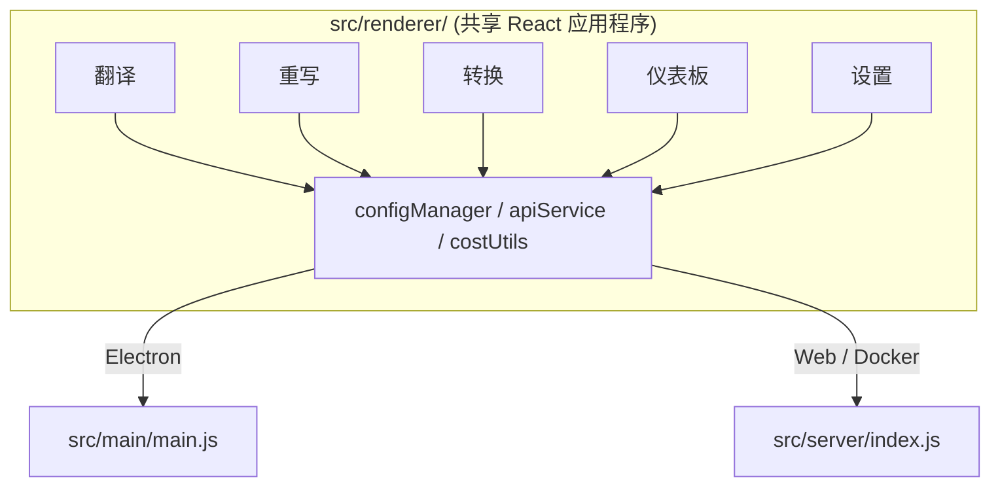

<p align="center">
  
</p>

<h1 align="center">Transrewrt</h1>

<p align="center">
  <a href="https://github.com/wsj-br/transrewrt/releases"></a>
  <a href="LICENSE"></a>
  
  
  
</p>

AI 驱动的文本工具：在语言间翻译、以不同风格重写、并使用自定义提示词进行转换——全部通过 [OpenRouter](https://openrouter.ai) 实现。可作为桌面应用（Electron）或自托管 Web 应用（Docker）运行。

- **翻译** - 支持数十种语言互译，自动检测源语言
- **重写** - 纠正语法、提升清晰度、正式/非正式风格、缩短、扩展、技术性调整
- **转换** - 自定义 AI 提示词；创建和管理提示词，每个提示词可设置可选目标语言
- **模型与成本** - 选择任意 OpenRouter 模型；成本仪表板使用 SQLite 日志，按模型/操作/日期汇总
- **界面** - 国际化（pt-BR, de, fr, es, RTL）、主题、字体、键盘快捷键；安全网页模式（API 密钥仅驻留在服务器）
- **桌面版** - 适用于 Windows 和 Linux 的 Electron 应用
- **自托管** - 适用于 amd64 和 arm64 的 Docker 镜像（兼容树莓派）

安装完成后，请参阅 **[用户指南](../USER-GUIDE.md)** 了解所有功能的完整指南。

<small>**以其他语言阅读：** [英语（英国）](../README.md) · [葡萄牙语（巴西）](README.pt-BR.md) · [阿拉伯语](README.ar.md) · [孟加拉语](README.bn.md) · [加泰罗尼亚语](README.ca.md) · [简体中文](README.zh-CN.md) · [繁體中文](README.zh-TW.md) · [克罗地亚语](README.hr.md) · [捷克语](README.cs.md) · [荷兰语](README.nl.md) · [英语（美国）](README.en-US.md) · [菲律宾语](README.tl.md) · [法语](README.fr.md) · [德语](README.de.md) · [希腊语](README.el.md) · [印地语](README.hi.md) · [匈牙利语](README.hu.md) · [意大利语](README.it.md) · [日语](README.ja.md) · [爪哇语](README.jv.md) · [韩语](README.ko.md) · [马来语](README.ms.md) · [波斯语](README.fa.md) · [波兰语](README.pl.md) · [葡萄牙语（葡萄牙）](README.pt.md) · [旁遮普语](README.pa.md) · [罗马尼亚语](README.ro.md) · [俄语](README.ru.md) · [斯洛伐克语](README.sk.md) · [西班牙语](README.es.md) · [斯瓦希里语](README.sw.md) · [瑞典语](README.sv.md) · [泰卢固语](README.te.md) · [泰语](README.th.md) · [土耳其语](README.tr.md) · [乌克兰语](README.uk.md) · [越南语](README.vi.md)</small>

<a id="screenshots"></a>
## 截图

**语言选择器**


**翻译**


**转换 - 提示编辑器**


**仪表板**


**设置 - 模型选择**


<br /><br />

<a id="table-of-contents"></a>
## 目录

<!-- START doctoc generated TOC please keep comment here to allow auto update -->
<!-- DON'T EDIT THIS SECTION, INSTEAD RE-RUN doctoc TO UPDATE -->

- [快速开始](#quick-start)
- [安装](#installation)
  - [Windows (Electron)](#windows-electron)
  - [Linux (Electron)](#linux-electron)
  - [Docker](#docker)
- [获取 OpenRouter API 密钥](#getting-an-openrouter-api-key)
- [配置与环境](#configuration-and-environment)
- [开发与架构](#development-and-architecture)
- [版本与标签](#releases-and-tags)
- [贡献](#contributing)
- [免责声明](#disclaimer)
- [许可证](#license)

<!-- END doctoc generated TOC please keep comment here to allow auto update -->

<br /><br />

<a id="quick-start"></a>

## 快速开始

**Docker（推荐用于自托管）**

```bash
docker pull ghcr.io/wsj-br/transrewrt:latest

API_KEY=sk-or-your-key docker run -d \
  -p 5000:5000 \
  -v transrewrt-data:/app/data \
  -e API_KEY \
  --name transrewrt-web \
  ghcr.io/wsj-br/transrewrt:latest
```

将 `sk-or-your-key` 替换为您的 [OpenRouter API 密钥](https://openrouter.ai/keys)。打开 [http://localhost:5000](http://localhost:5000)，在公开服务前更改默认的管理员密码。

<br />

> ℹ️ **注意**<br/>
> 在 Docker 中，OpenRouter API 密钥**仅**通过 `API_KEY` 环境变量设置（不在 Web UI 中设置）。在桌面端（Electron）上，您在 **设置 → API** 中粘贴它。

<br />

**Windows**

从 [发布页面](https://github.com/wsj-br/transrewrt/releases) 下载最新的 `Transrewrt Setup x.y.z.exe`，运行安装程序，然后从开始菜单或桌面快捷方式启动。在 **设置 → API** 中输入您的 OpenRouter API 密钥。

<br />

**Linux**

从 [发布页面](https://github.com/wsj-br/transrewrt/releases) 下载 `.AppImage`，然后：

```bash
chmod +x Transrewrt-x.y.z.AppImage && ./Transrewrt-x.y.z.AppImage
```

在 **设置 → API** 中输入您的 OpenRouter API 密钥。在 Debian/Ubuntu 上，您可能需要先安装额外的依赖项：

```bash
sudo apt install libgtk-3-0 libnotify-dev libnss3 libxss1 libasound2 libxtst6 xauth
```

详情请参阅 [安装 → Linux](#linux-electron)。

<br />

> ℹ️ **注意**<br/>
> 目前不支持 macOS。Transrewrt 适用于 Windows、Linux 和 Docker。

<br />

应用运行后，请参阅 **[用户指南](../USER-GUIDE.md)** 了解如何翻译、重写和转换文本，管理提示词，以及配置模型。

<br /><br />

<a id="installation"></a>
## 安装

<a id="windows-electron"></a>
### Windows (Electron)

- 从 [发布页面](https://github.com/wsj-br/transrewrt/releases) 下载最新的安装程序。
- 运行 `.exe` 并按照安装向导操作。
- 首次运行：从开始菜单或桌面快捷方式启动应用。配置文件存储在 `%APPDATA%\transrewrt\`。

<br />

<a id="linux-electron"></a>
### Linux (Electron)

- 从 [发布页面](https://github.com/wsj-br/transrewrt/releases) 下载 `.AppImage`。
- 运行：`chmod +x Transrewrt-x.y.z.AppImage && ./Transrewrt-x.y.z.AppImage`
- 额外依赖项（Debian/Ubuntu）：`sudo apt install libgtk-3-0 libnotify-dev libnss3 libxss1 libasound2 libxtst6 xauth`
- 更多信息请参阅 [dev/DEVELOPMENT.md](../dev/DEVELOPMENT.md)。

<br />

<a id="docker"></a>
### Docker

- 拉取镜像：`docker pull ghcr.io/wsj-br/transrewrt:latest`
- OpenRouter API 密钥**必须**通过 `API_KEY` 环境变量设置。使用 `-e API_KEY` 传递它（或通过 `docker compose` / `.env`），以便密钥不会在进程列表中可见。
- 无法在 Web UI 中输入 API 密钥。

示例 - 使用命名卷进行持久化（API 密钥通过环境变量传递，而不在命令行中）：

```bash
API_KEY=sk-or-your-key docker run -d \
  -p 5000:5000 \
  -v transrewrt-data:/app/data \
  -e API_KEY \
  --name transrewrt-web \
  ghcr.io/wsj-br/transrewrt:latest
```

<br />

| 选项   | 说明                                                                                                       |
| -------- | --------------------------------------------------------------------------------------------------------- |
| 端口     | `5000`（使用 `-p 5000:5000` 映射）                                                                       |
| 卷      | 挂载 `/app/data` 以保留配置和数据库                                                                       |
| 环境变量 | `PORT`, `CONFIG_PATH`, `API_KEY`, `API_URL`, `KEY_SEED` - 请参阅 [配置](#configuration-and-environment) |

要从源代码构建和运行：`docker compose up --build -d` 或 `pnpm run docker:up` - 请参阅 [dev/DEVELOPMENT.md](../dev/DEVELOPMENT.md)。

<br /><br />

<a id="getting-an-openrouter-api-key"></a>
## 获取 OpenRouter API 密钥

Transrewrt 使用 [OpenRouter](https://openrouter.ai) 提供 AI 模型。您需要一个 API 密钥来翻译、重写或转换文本。

1. 在 [openrouter.ai](https://openrouter.ai) 注册或登录。
2. 打开 [密钥](https://openrouter.ai/keys) 页面并创建一个新密钥（为其命名，并可选择设置信用额度）。无需添加信用点即可使用免费模型。
3. **桌面端（Electron）：** 在 **设置 → API** 中粘贴密钥。**Docker：** 设置 `API_KEY` 环境变量（请参阅 [快速开始](#quick-start)）。

有关限制、自带密钥（BYOK）等更多信息，请参阅 [OpenRouter 认证](https://openrouter.ai/docs/api/reference/authentication)。

<br /><br />

<a id="configuration-and-environment"></a>

## 配置与环境

**配置文件位置**

| 部署方式         | 配置位置                                   |
| ---------------- | ------------------------------------------ |
| Electron (Windows) | `%APPDATA%\transrewrt\`                   |
| Electron (Linux)   | `~/.config/transrewrt/`                   |
| Web / Docker       | `/app/data/config.json` (使用卷进行持久化) |

<br />

**环境变量**（仅限 Web/Docker；Electron 使用本地配置文件）

| 变量名       | 默认值                        | 描述                                                   |
| ------------ | ----------------------------- | ------------------------------------------------------ |
| `PORT`       | `5000`                        | 服务器监听端口                                         |
| `CONFIG_PATH`| `/app/data/config.json`       | 配置文件路径                                           |
| `API_KEY`    | *(空)*                        | OpenRouter API 密钥（Docker 必需；通过环境变量设置，而非 UI） |
| `API_URL`    | `https://openrouter.ai/api/v1`| 上游 AI API 基础 URL                                   |
| `KEY_SEED`   | *(空)*                        | Transrewrt 代理密钥种子（若设置则覆盖配置文件）         |

<br />

**数据与持久化：** 对于 Docker，请在 `/app/data` 处挂载一个卷，以便在容器重启后保留 `config.json` 和 SQLite 数据库。如果不挂载卷，容器停止时所有数据都将丢失。

<br />

**Web 身份验证：**

- 默认管理员：`admin` / `transrewrt26`。
- 在 **设置 → 用户** 中管理用户。
- 重置密码：`docker exec <container> reset-web-password '<username>' '<new-password>'`
  （源码：`pnpm run reset-web-password -- <username> <new-password>`）

<br />

> ⚠️ **警告**<br/>
> 在任何可通过网络访问的主机上，立即更改默认管理员密码。

<br />

**Transrewrt 代理（可选）：** 您可以通过使用基于时间的滚动密钥的外部代理来路由 API 流量。在 **设置 → API** 中，启用 **使用 Transrewrt 代理**，设置 **密钥种子**，并将 **API URL** 设置为代理基础 URL。详情请参见 [dev/SYSTEM-OVERVIEW.md](../dev/SYSTEM-OVERVIEW.md)。

主题、字体、模型、语言等关键设置可在“设置”对话框中找到，或直接在配置 JSON 中编辑。完整列表和默认值记录在 [dev/DEVELOPMENT.md](../dev/DEVELOPMENT.md) 中。

<br /><br />

<a id="development-and-architecture"></a>
## 开发与架构

- **开发：** 设置、构建、测试和部署（Electron、Web、Docker）- 参见 **[dev/DEVELOPMENT.md](../dev/DEVELOPMENT.md)**。
- **架构与系统概览：** 文件夹结构、技术栈、设计决策、Transrewrt 代理 - 参见 **[dev/SYSTEM-OVERVIEW.md](../dev/SYSTEM-OVERVIEW.md)**。



<br /><br />

<a id="releases-and-tags"></a>
## 版本发布与标签

- 以 `v` 开头的 **Git 标签**（例如 `v1.0.10`）会触发 [发布工作流](.github/workflows/release.yml)。**GitHub 版本** 会附加 Windows 安装程序（`.exe`）和 Linux AppImage。
- **Docker 镜像** 发布到 `ghcr.io/wsj-br/transrewrt`。镜像标签与 Git 版本匹配（例如 `v1.0.10` → `ghcr.io/wsj-br/transrewrt:1.0.10`），外加 `latest`。多架构支持：`linux/amd64` 和 `linux/arm64`（例如树莓派）。

<br /><br />

<a id="contributing"></a>
## 贡献

1. Fork 仓库。
2. 创建特性分支：`git checkout -b feature/my-feature`
3. 使用清晰的信息提交更改。
4. 推送并针对 `main` 分支打开 Pull Request。

请遵循现有代码风格，并在提交前在 Electron 和 Web 模式下测试您的更改。构建和测试说明请参见 [dev/DEVELOPMENT.md](../dev/DEVELOPMENT.md)。

<br />

**报告问题：** 在 [GitHub](https://github.com/wsj-br/transrewrt/issues) 上打开问题。请包括您的平台（Windows / Linux / Docker）和应用版本（在“关于”对话框或“版本”页面上显示）。

<br /><br />

<a id="disclaimer"></a>

## 免责声明

产品名称和图标归其各自所有者所有，仅用于标识目的。本软件与任何提及的品牌均无关联，也未获得其认可。

<br /><br />

<a id="license"></a>
## 许可证

版权所有 © 2026 Waldemar Scudeller Jr.

[Apache License 2.0](LICENSE)