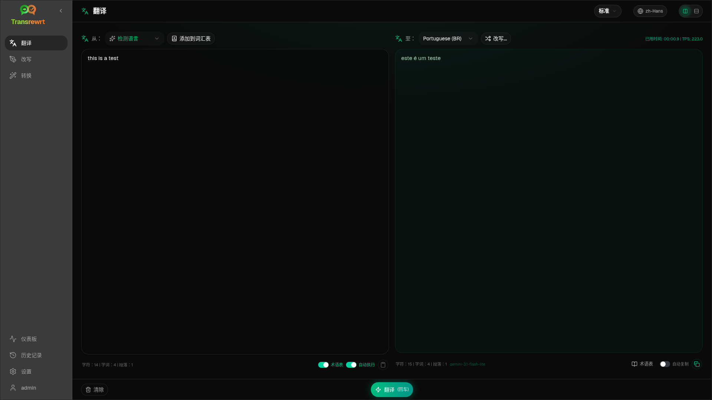

<p align="center">
  
</p>

<p align="center">
  <a href="https://github.com/wsj-br/transrewrt/releases"></a>
  <a href="LICENSE"></a>
  
</p>

AI 驱动的文本工具：**翻译**、**改写**以及使用自定义提示词进行**转换** —— 使用您自己的 AI 提供商（OpenRouter、OpenAI、Anthropic、Google Gemini、DeepSeek、Groq、Mistral、xAI、Cerebras、NVIDIA、阿里云、apikey.fun、OpenAI 兼容端点，以及本地 OpenAI 兼容服务器，如 Ollama、LM Studio 或 llama.cpp）。桌面应用（Windows / Linux）或自托管 Web 应用（Docker）。无需 Transrewrt 云账号。

| | |
| --- | --- |
| **翻译** | 支持数十种语言、自动检测、词汇表，使用 Rephrase 进行润色 |
| **改写** | 清晰度、语气、长度、拼写和语法 —— 同一语言 |
| **转换** | 你创建、编辑和重用的自定义 AI 提示词 |
| **部署** | Electron 桌面版或 Docker Web 版（amd64 和 arm64） |
| **密钥** | 你的提供商，你的主机 —— 简易预设或高级模型列表 |



<small>**以其他语言阅读：** </small>
<small id="lang-list">[English (UK)](../README.md) · [العربية](./README.ar.md) · [简体中文](./README.zh-Hans.md) · [繁體中文](./README.zh-Hant.md) · [Čeština](./README.cs.md) · [Nederlands](./README.nl.md) · [Français](./README.fr.md) · [Deutsch](./README.de.md) · [Ελληνικά](./README.el.md) · [हिन्दी](./README.hi.md) · [Magyar](./README.hu.md) · [Italiano](./README.it.md) · [日本語](./README.ja.md) · [한국어](./README.ko.md) · [فارسی](./README.fa.md) · [Polski](./README.pl.md) · [Português (Brasil)](./README.pt-BR.md) · [Română](./README.ro.md) · [Русский](./README.ru.md) · [Slovenčina](./README.sk.md) · [Español](./README.es.md) · [Svenska](./README.sv.md) · [ไทย](./README.th.md) · [Türkçe](./README.tr.md) · [Українська](./README.uk.md) · [Tiếng Việt](./README.vi.md)</small>

## 快速开始

**Docker**

```bash
docker pull ghcr.io/wsj-br/transrewrt:latest

OPENROUTER_API_KEY=sk-or-your-key docker run -d \
  -p 5000:5000 \
  -v transrewrt-data:/app/data \
  -e OPENROUTER_API_KEY \
  --name transrewrt-web \
  ghcr.io/wsj-br/transrewrt:latest
```

打开 [http://localhost:5000](http://localhost:5000) 并更改默认管理员密码。提供商密钥通过环境变量设置（而非 Web UI）。

**Windows** —— 从 [Releases](https://github.com/wsj-br/transrewrt/releases) 下载 `Transrewrt Setup x.y.z.exe`，安装，然后在 **设置 → API** 中添加密钥。

**Linux** —— 从 [Releases](https://github.com/wsj-br/transrewrt/releases) 下载 `.AppImage`，然后：

```bash
chmod +x Transrewrt-x.y.z-x64.AppImage && ./Transrewrt-x.y.z-x64.AppImage
```

平台详情（Compose、SmartScreen、apt 库、GPU 标志、时区）：[快速开始文档](https://wsj-br.github.io/transrewrt/docs/quick-start/)。

## 文档

完整产品文档（安装、API 密钥、指南、设置、故障排除）：

**[https://wsj-br.github.io/transrewrt/docs/](https://wsj-br.github.io/transrewrt/docs/)**

- [API 密钥](https://wsj-br.github.io/transrewrt/docs/api-key/)
- [配置](https://wsj-br.github.io/transrewrt/docs/configuration/)
- [翻译](https://wsj-br.github.io/transrewrt/docs/translate/) · [改写](https://wsj-br.github.io/transrewrt/docs/rewrite/) · [转换](https://wsj-br.github.io/transrewrt/docs/transform/)
- [常见问题](https://wsj-br.github.io/transrewrt/docs/common-issues/)

## 开发

- 设置、构建、测试、部署：[dev/DEVELOPMENT.md](../dev/DEVELOPMENT.md)
- 架构概览：[dev/SYSTEM-OVERVIEW.md](../dev/SYSTEM-OVERVIEW.md)

## 支持

在 [GitHub](https://github.com/wsj-br/transrewrt/issues) 上提交 issue。请附上你的平台（Windows / Linux / Docker）和应用版本（关于对话框或 Releases 页面）。

## 致谢

预设编辑器中的简易模式预设建议使用了来自以下来源的公开评估数据：

- [languagebench](https://huggingface.co/spaces/fair-forward/languagebench) (CC BY-SA 4.0)
- [Artificial Analysis](https://artificialanalysis.ai/) (API 数据需要注明出处)

第三方依赖许可证及这些数据来源声明列于 [NOTICES](../NOTICES) 中。

## 许可证

版权所有 © 2026 Waldemar Scudeller Jr.

[Apache License 2.0](../LICENSE)

产品名称和图标归其各自所有者所有，仅用于识别。本软件不隶属于这些品牌，也未获得其认可。

<small>

> **关于界面和文档翻译的说明：** 除原始英文外，全部界面和文档语言均使用 AI 模型通过 [ai-i18n-tools](https://wsj-br.github.io/ai-i18n-tools/) 翻译；
> 措辞可能不够准确或包含错误。

</small>
