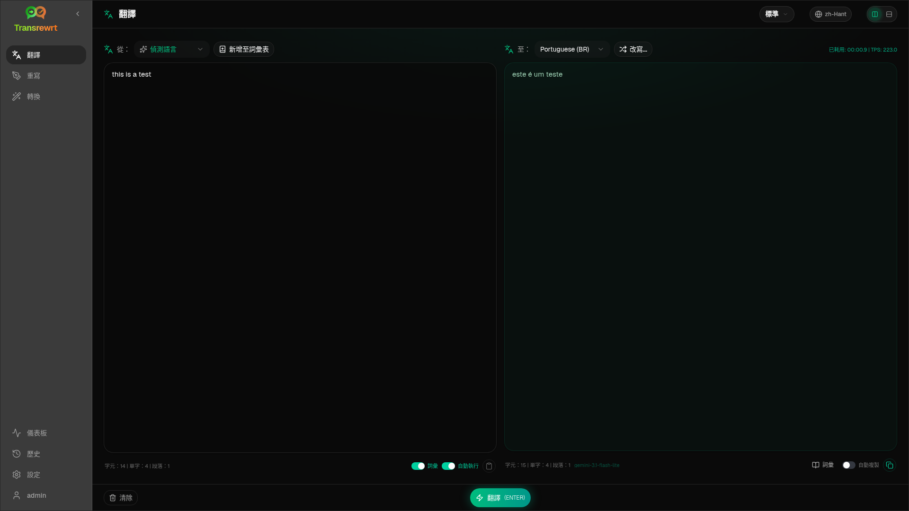

<p align="center">
  
</p>

<p align="center">
  <a href="https://github.com/wsj-br/transrewrt/releases"></a>
  <a href="LICENSE"></a>
  
</p>

AI 驅動的文字工具：**翻譯**、**重寫**與**轉換**，並使用自訂提示詞 —— 透過您自己的 AI 供應商（OpenRouter、OpenAI、Anthropic、Google Gemini、DeepSeek、Groq、Mistral、xAI、Cerebras、NVIDIA、Alibaba Cloud、apikey.fun、OpenAI 相容端點，以及本地 OpenAI 相容伺服器如 Ollama、LM Studio 或 llama.cpp）。桌面應用程式（Windows / Linux）或自架網頁應用程式（Docker）。無需 Transrewrt 雲端帳號。

| | |
| --- | --- |
| **翻譯** | 數十種語言、自動偵測、詞彙表，以 Rephrase 進一步潤飾 |
| **重寫** | 清晰度、語氣、長度、拼寫與文法 — 同一語言 |
| **轉換** | 您可建立、編輯並重複使用的自訂 AI 提示詞 |
| **部署** | Electron 桌面版或 Docker 網頁版（amd64 與 arm64） |
| **金鑰** | 您的提供者、您的主機 — 簡易預設或進階模型清單 |



<small>**以其他語言閱讀：** </small>
<small id="lang-list">[English (UK)](../README.md) · [العربية](./README.ar.md) · [简体中文](./README.zh-Hans.md) · [繁體中文](./README.zh-Hant.md) · [Čeština](./README.cs.md) · [Nederlands](./README.nl.md) · [Français](./README.fr.md) · [Deutsch](./README.de.md) · [Ελληνικά](./README.el.md) · [हिन्दी](./README.hi.md) · [Magyar](./README.hu.md) · [Italiano](./README.it.md) · [日本語](./README.ja.md) · [한국어](./README.ko.md) · [فارسی](./README.fa.md) · [Polski](./README.pl.md) · [Português (Brasil)](./README.pt-BR.md) · [Română](./README.ro.md) · [Русский](./README.ru.md) · [Slovenčina](./README.sk.md) · [Español](./README.es.md) · [Svenska](./README.sv.md) · [ไทย](./README.th.md) · [Türkçe](./README.tr.md) · [Українська](./README.uk.md) · [Tiếng Việt](./README.vi.md)</small>

## 快速開始

**Docker**

```bash
docker pull ghcr.io/wsj-br/transrewrt:latest

OPENROUTER_API_KEY=sk-or-your-key docker run -d \
  -p 5000:5000 \
  -v transrewrt-data:/app/data \
  -e OPENROUTER_API_KEY \
  --name transrewrt-web \
  ghcr.io/wsj-br/transrewrt:latest
```

開啟 [http://localhost:5000](http://localhost:5000) 並變更預設管理員密碼。提供者金鑰透過環境變數設定（非透過網頁 UI）。

**Windows** — 從 [Releases](https://github.com/wsj-br/transrewrt/releases) 下載 `Transrewrt Setup x.y.z.exe`，安裝後於 **設定 → API** 新增金鑰。

**Linux** — 從 [Releases](https://github.com/wsj-br/transrewrt/releases) 下載 `.AppImage`，然後：

```bash
chmod +x Transrewrt-x.y.z-x64.AppImage && ./Transrewrt-x.y.z-x64.AppImage
```

平台詳情（Compose、SmartScreen、apt 函式庫、GPU 旗標、時區）：[快速開始文件](https://wsj-br.github.io/transrewrt/docs/quick-start/)。

## 文件

完整產品文件（安裝、API 金鑰、指南、設定、疑難排解）：

**[https://wsj-br.github.io/transrewrt/docs/](https://wsj-br.github.io/transrewrt/docs/)**

- [API 金鑰](https://wsj-br.github.io/transrewrt/docs/api-key/)
- [設定](https://wsj-br.github.io/transrewrt/docs/configuration/)
- [翻譯](https://wsj-br.github.io/transrewrt/docs/translate/) · [重寫](https://wsj-br.github.io/transrewrt/docs/rewrite/) · [轉換](https://wsj-br.github.io/transrewrt/docs/transform/)
- [常見問題](https://wsj-br.github.io/transrewrt/docs/common-issues/)

## 開發

- 設定、建置、測試、部署：[dev/DEVELOPMENT.md](../dev/DEVELOPMENT.md)
- 架構概覽：[dev/SYSTEM-OVERVIEW.md](../dev/SYSTEM-OVERVIEW.md)

## 支援

在 [GitHub](https://github.com/wsj-br/transrewrt/issues) 上回報問題。請附上您的平台（Windows / Linux / Docker）與應用程式版本（關於對話框或 Releases 頁面）。

## 鳴謝

簡易模式預設建議在預設編輯器中使用公開評估資料，來源為：

- [languagebench](https://huggingface.co/spaces/fair-forward/languagebench)（CC BY-SA 4.0）
- [Artificial Analysis](https://artificialanalysis.ai/)（API 資料需註明出處）

第三方依賴授權條款與這些資料來源聲明列於 [NOTICES](../NOTICES)。

## 授權

Copyright © 2026 Waldemar Scudeller Jr.

[Apache License 2.0](../LICENSE)

產品名稱與圖示分屬其各自擁有者所有，僅供識別之用。本軟體不隸屬於這些品牌，亦未獲其背書。

<small>

> **關於介面與文件翻譯的注意事項：** 除了
> 原始英文外，全部介面與文件語言皆使用 AI 模型透過 [ai-i18n-tools](https://wsj-br.github.io/ai-i18n-tools/) 進行翻譯；
> 措辭可能不夠精確或包含錯誤。

</small>
