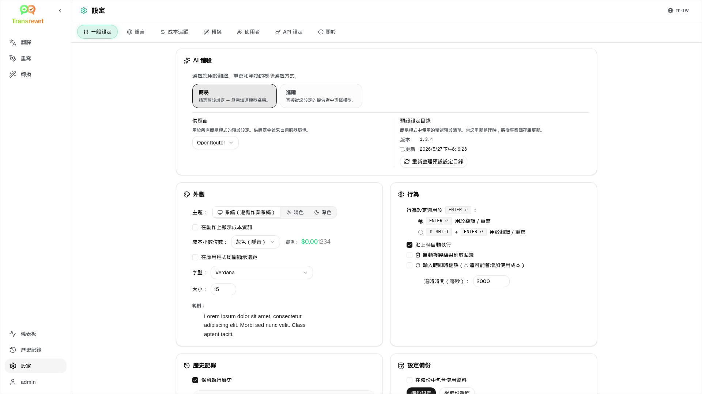

<p align="center">
  
</p>

<p align="center">
  <a href="https://github.com/wsj-br/transrewrt/releases"></a>
  <a href="LICENSE"></a>
  
  
  
</p>

AI 驅動的文字工具：支援多語言翻譯、不同風格重寫，並可透過自訂提示詞進行轉換 — 使用多種 AI 供應商（OpenRouter、OpenAI、Anthropic、Google Gemini、DeepSeek、Groq、Mistral、xAI 和 local Ollama）。可作為桌面應用程式（Electron）或自架式網頁應用程式（Docker）運行。

- **翻譯** - 支援數十種語言之間的翻譯，並具備自動來源語言偵測功能
- **重寫** - 修正語法、提升清晰度、調整正式或非正式語氣、縮短或擴展內容、技術性轉換
- **轉換** - 自訂 AI 提示；建立與管理提示，每個提示可選擇性設定目標語言
- **歷史記錄** - 完整的執行歷史，包含輸入與輸出文字、篩選功能，以及匯出功能
- **簡易與進階** - 簡易模式（預設）：依供應商精選技能（**免費 (OpenRouter)**、**精簡版**、**進階**、**技術版**；僅顯示已選取供應商支援對應功能的技能），無需選擇模型 ID；進階模式：顯示您已設定之供應商的完整模型清單
- **模型與成本** - 成本與使用量儀表板（摘要、依模型、所有呼叫），可匯出資料；OpenRouter 顯示實際花費，其他供應商則使用估算值
- **使用者介面** - 多國語言介面（30+ 種語言，支援由右至左顯示）、字型等
- **網頁模式** - 支援多使用者與管理員角色
- **桌面版** - 適用於 Windows 和 Linux 的 Electron 應用程式
- **自行架設** - 適用於 amd64 與 arm64 的 Docker 映像檔（支援 Raspberry Pi）

安裝後，請參閱 [**使用者指南**](USER-GUIDE.zh-TW.md) 以完整了解所有功能。

<small>**以其他語言閱讀：** </small>
<small id="lang-list">[English (GB)](../README.md) · [Português (Brasil)](./README.pt-BR.md) · [العربية](./README.ar.md) · [বাংলা](./README.bn.md) · [Català](./README.ca.md) · [中文 (中国大陆)](./README.zh-CN.md) · [中文 (台灣)](./README.zh-TW.md) · [Hrvatski](./README.hr.md) · [Čeština](./README.cs.md) · [Nederlands](./README.nl.md) · [English (US)](./README.en-US.md) · [Tagalog](./README.tl.md) · [Français](./README.fr.md) · [Deutsch](./README.de.md) · [Ελληνικά](./README.el.md) · [हिन्दी](./README.hi.md) · [Magyar](./README.hu.md) · [Italiano](./README.it.md) · [日本語](./README.ja.md) · [한국어](./README.ko.md) · [Bahasa Melayu](./README.ms.md) · [فارسی](./README.fa.md) · [Polski](./README.pl.md) · [Basa Jawa](./README.jv.md) · [Português](./README.pt.md) · [ਪੰਜਾਬੀ](./README.pa.md) · [Română](./README.ro.md) · [Русский](./README.ru.md) · [Slovenčina](./README.sk.md) · [Español](./README.es.md) · [Kiswahili](./README.sw.md) · [Svenska](./README.sv.md) · [తెలుగు](./README.te.md) · [ไทย](./README.th.md) · [Türkçe](./README.tr.md) · [Українська](./README.uk.md) · [Tiếng Việt](./README.vi.md)</small>

<small>

> **關於介面與文件翻譯的說明：** 除原始英文（英國）外，
> 所有介面語言皆由 AI 模型翻譯，用詞可能不精確或含有錯誤。

</small>

<br/>

<a id="table-of-contents"></a>
## 目錄

<!-- START doctoc generated TOC please keep comment here to allow auto update -->
<!-- DON'T EDIT THIS SECTION, INSTEAD RE-RUN doctoc TO UPDATE -->

- [螢幕截圖](#screenshots)
- [快速入門](#quick-start)
- [取得 OpenRouter API 金鑰](#getting-an-openrouter-api-key)
- [設定與環境](#configuration-and-environment)
- [開發與架構](#development-and-architecture)
- [回報問題](#reporting-issues)
- [免責聲明](#disclaimer)
- [授權條款](#license)

<!-- END doctoc generated TOC please keep comment here to allow auto update -->

<br/><br/>

<a id="screenshots"></a>
## 截圖

**語言選擇器**


**翻譯**


**轉換 - 提示詞編輯器**


**儀表板**


**歷史**


**設定 - 模型選擇**



<br/><br/>

<a id="quick-start"></a>
## 快速開始

<details>
<summary><b>Docker（推薦用於自行託管）</b></summary>

<a id="docker"></a>

<br/>

```bash
docker pull ghcr.io/wsj-br/transrewrt:latest

OPENROUTER_API_KEY=sk-or-your-key docker run -d \
  -p 5000:5000 \
  -v transrewrt-data:/app/data \
  -e OPENROUTER_API_KEY \
  --name transrewrt-web \
  ghcr.io/wsj-br/transrewrt:latest
```

將 `sk-or-your-key` 替換為您的 [OpenRouter API 金鑰](https://openrouter.ai/keys)（或設定其他供應商金鑰；請參閱 [設定](#configuration-and-environment)）。開啟 [http://localhost:5000](http://localhost:5000) 並在公開服務前變更預設的管理員密碼。

透過環境變數設定至少一個供應商金鑰（例如用於 OpenRouter 的 `OPENROUTER_API_KEY`）。使用 `-e` 或 `docker compose` / `.env` 傳遞變數，以確保機密資訊不會被嵌入映像中。供應商金鑰**不會**在 Web UI 中輸入；伺服器會從環境中讀取這些金鑰。

<br/>

> ℹ️ **注意**<br/>
> 在 Docker 中，LLM 憑證是使用環境變數（如 `OPENROUTER_API_KEY`、`OPENAI_API_KEY`、`CEREBRAS_API_KEY`、…）設定的（而非在 Web UI 中）。在桌面端（Electron）中，您可在 **設定 → API** 中配置金鑰。

<br/>

或使用 Docker Compose：

```bash
# download the compose file
wget https://github.com/wsj-br/transrewrt/raw/refs/heads/master/production.yml -O transrewrt.yml
# Edit the file to add your API keys (API_KEYs), or uncomment and adjust the `.env` file. Set the timezone (TZ) if necessary.
vi transrewrt.yml
# start the container
docker compose -f transrewrt.yml up -d
```

請參閱 [設定](#configuration-and-environment) 以取得所有環境變數，例如 `PORT`、`CONFIG_PATH`、`TZ` 以及 LLM 金鑰（`OPENROUTER_API_KEY`、`OPENAI_API_KEY`、…）。

</details>

<br/>

<details>
<summary><b>伺服器時區（Docker）</b></summary>

<a id="configuring-the-timezone"></a>

<br/>

應用程式的使用者介面日期與時間會遵循 **瀏覽器** 的地區與時區設定。對於 **伺服器端** 的行為（如記錄等），容器會使用 `TZ` 環境變數。預設值為 `TZ=Europe/London`。

若要使用其他時區，請在您的 Compose 檔案中設定 `TZ`，例如：

```yaml
environment:
  - TZ=America/Sao_Paulo
```

或在執行容器時傳遞（Docker）：

```bash
--env TZ=America/Sao_Paulo
```

在許多 Linux 主機上，您可以使用以下指令複製系統時區名稱：

```bash
echo TZ=\"$(</etc/timezone)\"
```

有效時區名稱列表可於 [tz 資料庫](https://en.wikipedia.org/wiki/List_of_tz_database_time_zones)（維基百科）中找到。

</details>

<br/>

<details>
<summary><b>Windows</b></summary>

<a id="windows-electron"></a>

<br/>

- 從 [Releases](https://github.com/wsj-br/transrewrt/releases) 下載最新的 `Transrewrt Setup x.y.z.exe`。
- 執行 `.exe` 並依照安裝程式指示操作。
- 首次執行：從開始功能表或桌面捷徑啟動應用程式。
- 在 **設定 → API** 中輸入您的 API 金鑰。您需要至少設定一個供應商；OpenRouter 是常見的免費模型選擇。

<br/>

> ℹ️ **注意**<br/>
> Windows 可能會顯示以下其中一種安全性警告（對於未簽署/獨立開發的應用程式屬正常現象）：
>   - **使用者帳戶控制 (UAC)**：「您要允許這項來自未知發行者的應用程式對您的裝置進行變更嗎？」→ 按一下 **是**。
>   - **Microsoft Defender SmartScreen**：「Windows 保護了您的電腦」→ 按一下 **更多資訊** → **仍然執行**。
>
> 此情況發生是因為應用程式未經 Microsoft 或主要發行者簽署——只要從我們官方的 GitHub Releases 下載即屬安全（請在 [Releases](https://github.com/wsj-br/transrewrt/releases) 頁面中核對每項資源旁的校驗碼）。

<br/>

</details>

<br/>

<details>
<summary><b>Linux</b></summary>

<a id="linux-electron"></a>

<br/>

從 [Releases](https://github.com/wsj-br/transrewrt/releases) 下載適用於您 CPU 的 `.AppImage`（一般 PC 使用 `x64`，許多 ARM 裝置（包括 Raspberry Pi 4+）使用 `arm64`），然後：

```bash
chmod +x Transrewrt-x.y.z-x64.AppImage && ./Transrewrt-x.y.z-x64.AppImage
```

在 x86_64/amd64 上使用 `x64` 檔名；在 ARM64 上使用 `...-arm64.AppImage` 檔名。

在 **設定 → API** 中輸入您的 API 金鑰。您至少需要設定一個供應商；OpenRouter 是免費模型的常見選擇。

**主控台訊息：** 封裝的 Linux 版本（`x64` 和 `arm64` AppImages）會在終端機中抑制 Node 的棄用警告（例如內建的 `punycode` 模組）。如果 Chromium 印出 GPU / EGL 錯誤（例如「GLES3 不受支援」），但應用程式仍可運作，您可透過停用硬體加速來消除這些訊息：

```bash
TRANSREWRT_DISABLE_GPU=1 ./Transrewrt-x.y.z-arm64.AppImage
```

這也適用於 amd64；請將檔名更改為與您下載的相符。

在 Debian/Ubuntu 上，您可能需要額外的 **執行階段** 函式庫（Chromium 所需，通常完整桌面安裝已包含）。如有需要，請執行以下指令：

```bash
sudo apt update
sudo apt install -y libfuse2 libgtk-3-0 libnotify4 libnss3 libnspr4 libxss1 libxtst6 xdg-utils \
     xauth libatspi2.0-0 libdrm2 libgbm1 libxcb-dri3-0 libcups2 libasound2t64
```

將 `libasound2t64` 取代為 `libasound2` 以適用於 `arm64`。最小化或自訂安裝可能仍會因缺少 `.so` 檔案而失敗。請安裝錯誤訊息中提到的套件（常見附加套件：`libatk1.0-0`、`libatk-bridge2.0-0`、`libgbm1`、`libdrm2`）。在某些環境中，您可能需要使用 `APPIMAGE_EXTRACT_AND_RUN=1 ./Transrewrt-….AppImage` 來執行應用程式。

<br/>

> ℹ️ **注意**<br/>
> 目前不支援 macOS。Transrewrt 可用於 Windows、Linux 和 Docker。

</details>

<br/>

應用程式執行後，請參閱 [**使用者指南**](USER-GUIDE.zh-TW.md) 了解如何翻譯、重寫和轉換文字，管理提示詞，以及設定模型。

<br/><br/>

<a id="getting-an-openrouter-api-key"></a>
## 取得 OpenRouter API 金鑰

Transrewrt 支援多種 AI 供應商。[OpenRouter](https://openrouter.ai) 是熱門選擇，因為它將多種模型整合於單一金鑰下，並提供免費模型。

1. 在 [openrouter.ai](https://openrouter.ai) 註冊或登入。
2. 開啟 [Keys](https://openrouter.ai/keys) 頁面並建立新金鑰（命名金鑰，並可選擇設定信用額度）。您無需添加信用即可使用免費模型。
3. **桌面版 (Electron)：** 在 **設定 → API** 中貼上金鑰。**Docker：** 設定環境變數如 `OPENROUTER_API_KEY`（參見 [快速入門](#quick-start)）。

請勿使用 OpenRouter 的 **Body Builder** 模型 ([`openrouter/bodybuilder`](https://openrouter.ai/openrouter/bodybuilder)) 進行翻譯、重寫或轉換：它會回傳 JSON 請求載體，而非這些任務所需的完成文字。詳情請見使用者指南中的 [設定 → 模型](USER-GUIDE.zh-TW.md#models)。

您也可以使用其他供應商（OpenAI、Anthropic、Google Gemini、DeepSeek、Groq、Mistral、xAI、Cerebras）或使用 [Ollama](https://ollama.com) 在本機執行模型。完整支援的供應商與環境變數清單，請見 [設定](#configuration-and-environment)。

</br>

> ⚠️ **警告**<br/>
> 如果您從其他裝置、容器或服務使用 Ollama，請記得設定 Ollama 以允許外部連線（而非僅限於 localhost）。

<br/><br/>

<a id="configuration-and-environment"></a>
## 設定與環境

</br>

**設定檔位置**

| 部署方式         | 設定檔位置                                   |
| ------------------ | ------------------------------------------------- |
| Electron (Windows) | `%APPDATA%\transrewrt\`                           |
| Electron (Linux)   | `~/.config/transrewrt/`                           |
| Web / Docker       | `/app/data/config.json` (請使用 volume 以保留資料) |

<br/>

**環境變數** (僅限 Web / Docker；Electron 使用本地設定檔)

| 變數             | 說明                                                                  |
|----------------------|------------------------------------------------------------------------------|
| `PORT`               | 伺服器監聽埠號（預設為 `5000`）                                  |
| `CONFIG_PATH`        | 設定檔的路徑（預設為 `/app/data/config.json`）                |
| `TZ`                 | 伺服器端時區設定（用於記錄等用途，預設為 `Europe/London`） |
| `HISTORY_DISABLED`   | 強制關閉執行歷史記錄（可選，預設為 `false`）                  |
| `OPENROUTER_API_KEY` | OpenRouter API 金鑰                                                           |
| `OPENAI_API_KEY`     | OpenAI API 金鑰                                                               |
| `CEREBRAS_API_KEY`   | Cerebras API 金鑰                                                             |
| `ANTHROPIC_API_KEY`  | Anthropic API 金鑰                                                            |
| `GOOGLE_API_KEY`     | Google Gemini API 金鑰                                                        |
| `DEEPSEEK_API_KEY`   | DeepSeek API 金鑰                                                             |
| `GROQ_API_KEY`       | Groq API 金鑰                                                                 |
| `MISTRAL_API_KEY`    | Mistral API 金鑰                                                              |
| `OLLAMA_URL`         | Ollama 基底 URL（例如 `http://host.docker.internal:11434`）                   |
| `XAI_API_KEY`        | xAI API 金鑰                                                                  |

**隱私模式：** 要強制關閉歷史記錄追蹤，無論是 `config.json` 還是每位使用者的偏好，請將 `HISTORY_DISABLED` 設定為 `true` 或 `1`（不區分大小寫），適用於 **網頁/Docker 伺服器進程** 和/或 **Electron 桌面主進程**（例如系統或啟動器環境 — 而非僅限於渲染器）。這會禁用存儲輸入/輸出歷史記錄，鎖定 **設定 → 一般設定 → 歷史記錄**，並阻止與歷史記錄相關的 API。

僅設定您使用的供應商。模型 ID 是命名空間化的 (`openrouter/…`, `openai/…`, `cerebras/…`, `ollama/…`, 等等)。

**費用顯示：** 當適用時，OpenRouter 會回傳確切的計費金額。其他供應商在有提供 OpenRouter 金鑰時，會使用 OpenRouter 公開模型定價中的 **估計**成本；若無此金鑰，非 OpenRouter 的成本可能會顯示為 `0`。估計值不具發票效力。

<br/>

**資料與持久化：** 對於 Docker，請在 `/app/data` 掛載一個 volume，以確保 `config.json` 和 SQLite 資料庫能在容器重啟時持續保留。若無 volume，容器停止時所有資料將遺失。

<br/>

**網頁驗證：**

- 預設管理員： `admin` / `transrewrt26`。
- 在 **設定 → 使用者** 中管理使用者。
- 重設密碼： `docker exec <container> reset-web-password '<username>' '<new-password>'`

<br/>

> ⚠️ **警告**<br/>
> 在任何可透過網路存取的主機上，請立即變更預設管理員密碼。

<br/>

各項設定 (字型、模型、語言等) 可於應用程式的「設定」中進行調整。

<br/><br/>

<a id="development-and-architecture"></a>
## 開發與架構

- **開發：** 設定、建置、測試與部署（Electron、Web、Docker）— 請參閱 [dev/DEVELOPMENT.md](../dev/DEVELOPMENT.md)。
- **架構與系統概觀：** 資料夾結構、技術堆疊、設計決策 — 請參閱 [dev/SYSTEM-OVERVIEW.md](../dev/SYSTEM-OVERVIEW.md)。

<br/><br/>

<a id="reporting-issues"></a>
## 回報問題

請在 [GitHub](https://github.com/wsj-br/transrewrt/issues) 上提出問題。請附上您的平台 (Windows / Linux / Docker) 和應用程式版本 (可在「關於」對話框或「版本」頁面中找到)。

<br/><br/>

<a id="disclaimer"></a>
## 免責聲明

產品名稱與圖示屬於其各自擁有者，僅供識別用途使用。本軟體未經任何提及品牌之授權或背書。

<br/><br/>

<a id="license"></a>
## 授權條款

版權所有 © 2026 Waldemar Scudeller Jr.

[Apache License 2.0](../LICENSE)
