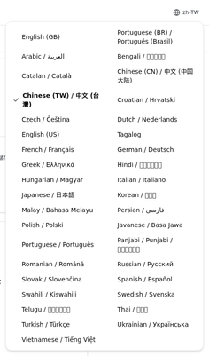
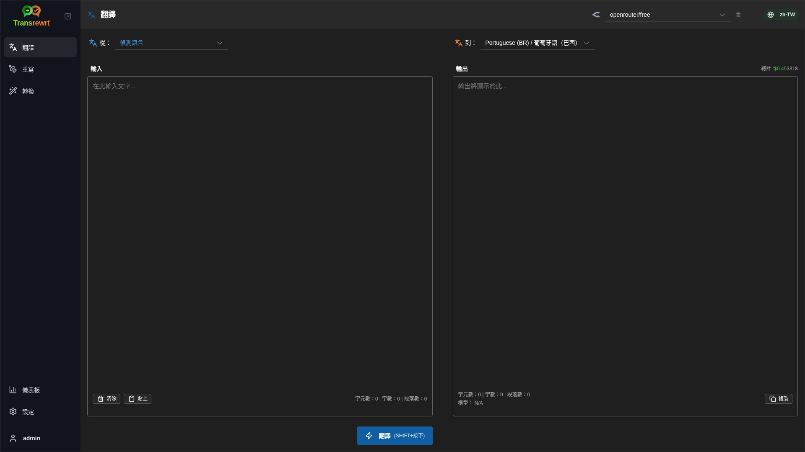
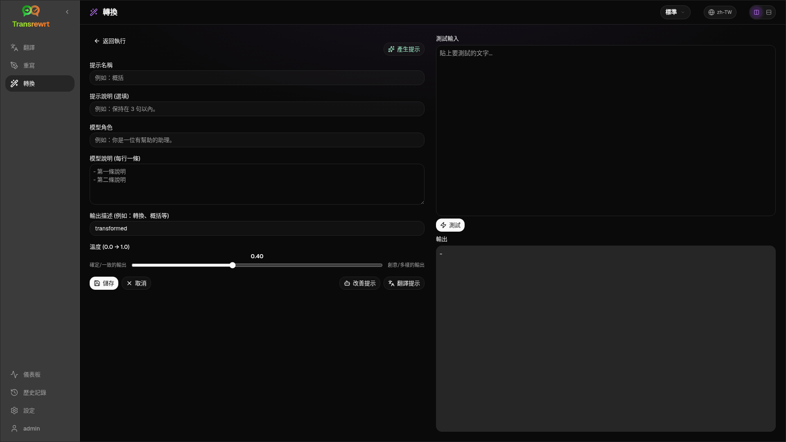
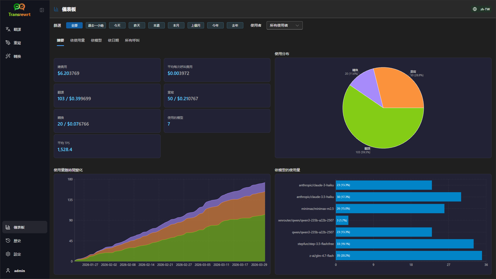
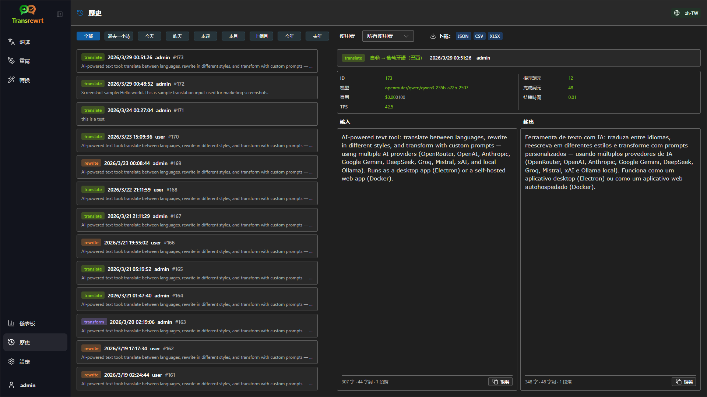
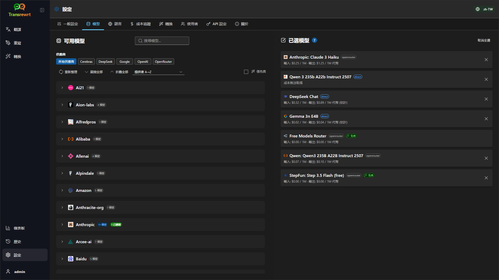

<p align="center">
  
</p>

<h1 align="center">Transrewrt</h1>

<p align="center">
  <a href="https://github.com/wsj-br/transrewrt/releases"></a>
  <a href="LICENSE"></a>
  
  
  
</p>

AI 驅動的文字工具：支援多語言翻譯、不同風格重寫以及透過自訂提示進行轉換，並整合多個 AI 服務提供商（OpenRouter、OpenAI、Anthropic、Google Gemini、DeepSeek、Groq、Mistral、xAI 和本地 Ollama）。可作為桌面應用程式（Electron）或自建託管的網頁應用程式（Docker）運行。

- **翻譯** — 在數十種語言之間進行翻譯，並具備自動偵測原始語言功能
- **重寫** — 修正文法、提升清晰度、轉換正式/非正式語氣、縮短或擴展內容、技術性調整
- **轉換** — 支援自訂 AI 提示；可建立與管理提示，並可為每個提示指定目標語言
- **歷史記錄** — 完整的操作紀錄，包含輸入/輸出文字、過濾功能與匯出選項
- **模型與成本** — 從已設定的任一提供商中選擇模型；提供成本與使用量儀表板，包含按模型/操作/日彙整的紀錄摘要
- **介面** — 多語言使用者介面（支援 30 多種語言及 RTL）、字型設定等
- **網頁模式** — 支援多使用者與管理員角色
- **桌面版** — 適用於 Windows 與 Linux 的 Electron 應用程式
- **自建託管** — 提供 amd64 與 arm64 架構的 Docker 映像（支援 Raspberry Pi）

安裝完成後，請參閱 **[使用者指南](USER-GUIDE.zh-TW.md)** 了解所有功能的詳細操作說明。

<small>**閱讀其他語言版本：** </small>
<small id="lang-list"> [English (UK)](../README.md) · [Português (BR)](README.pt-BR.md) · [العربية](README.ar.md) · [বাংলা](README.bn.md) · [Català](README.ca.md) · [简体中文](README.zh-CN.md) · [繁體中文](README.zh-TW.md) · [Hrvatski](README.hr.md) · [Čeština](README.cs.md) · [Nederlands](README.nl.md) · [English (US)](README.en-US.md) · [Filipino](README.tl.md) · [Français](README.fr.md) · [Deutsch](README.de.md) · [Ελληνικά](README.el.md) · [हिन्दी](README.hi.md) · [Magyar](README.hu.md) · [Italiano](README.it.md) · [日本語](README.ja.md) · [Basa Jawa](README.jv.md) · [한국어](README.ko.md) · [Bahasa Melayu](README.ms.md) · [فارسی](README.fa.md) · [Polski](README.pl.md) · [Português (PT)](README.pt.md) · [ਪੰਜਾਬੀ](README.pa.md) · [Română](README.ro.md) · [Русский](README.ru.md) · [Slovenčina](README.sk.md) · [Español](README.es.md) · [Kiswahili](README.sw.md) · [Svenska](README.sv.md) · [తెలుగు](README.te.md) · [ภาษาไทย](README.th.md) · [Türkçe](README.tr.md) · [Українська](README.uk.md) · [Tiếng Việt](README.vi.md)</small>

<small>

> **關於使用者介面與文件翻譯的說明：** 所有介面語言除了原始英文（英國）外，
> 其餘皆由 AI 模型翻譯而成；因此文字表達可能不夠精確或含有錯誤。

</small>

<br/>

<a id="screenshots"></a>

## 畫面截圖

**語言選擇器**



**翻譯**



**轉換 - 提示編輯器**



**儀表板**



**歷史記錄**



**設定 - 模型選擇**



<br/><br/>

<a id="table-of-contents"></a>
## 目錄

<!-- START doctoc generated TOC please keep comment here to allow auto update -->
<!-- DON'T EDIT THIS SECTION, INSTEAD RE-RUN doctoc TO UPDATE -->

- [快速開始](#quick-start)
- [安裝](#installation)
  - [Windows (Electron)](#windows-electron)
  - [Linux (Electron)](#linux-electron)
  - [Docker](#docker)
- [取得 OpenRouter API 金鑰](#getting-an-openrouter-api-key)
- [設定與環境](#configuration-and-environment)
- [開發與架構](#development-and-architecture)
- [版本發行與標籤](#releases-and-tags)
- [貢獻](#contributing)
- [免責聲明](#disclaimer)
- [授權條款](#license)

<!-- END doctoc generated TOC please keep comment here to allow auto update -->

<br/><br/>

<a id="quick-start"></a>

## 快速開始

**Docker（推薦用於自架服務）**

```bash
docker pull ghcr.io/wsj-br/transrewrt:latest

OPENROUTER_API_KEY=sk-or-your-key docker run -d \
  -p 5000:5000 \
  -v transrewrt-data:/app/data \
  -e OPENROUTER_API_KEY \
  --name transrewrt-web \
  ghcr.io/wsj-br/transrewrt:latest
```

將 `sk-or-your-key` 取代為您的 [OpenRouter API 金鑰](https://openrouter.ai/keys)（或設定其他供應商的金鑰；參見 [設定與環境](#configuration-and-environment)）。開啟 [http://localhost:5000](http://localhost:5000) 並在公開服務前變更預設的管理員密碼。

<br/>

> ℹ️ **注意**<br/>
> 在 Docker 中，LLM 憑證是使用環境變數設定的，例如 `OPENROUTER_API_KEY`、`OPENAI_API_KEY`、`CEREBRAS_API_KEY` 等（不是在 Web 介面中設定）。在桌面端（Electron）中，您可以在 **設定 → API** 中配置金鑰。

<br/>

**Windows**

從 [發行版](https://github.com/wsj-br/transrewrt/releases) 下載最新的 `Transrewrt Setup x.y.z.exe`，執行安裝程式，然後從開始功能表或桌面捷徑啟動。在 **設定 → API** 中輸入您的 API 金鑰。您必須至少設定一個供應商，OpenRouter 常用於免費模型。

<br/>

**Linux**

從 [發行版](https://github.com/wsj-br/transrewrt/releases) 下載適合您 CPU 的 `.AppImage` 檔案（一般 PC 選 `x64`，許多 ARM 裝置包括 Raspberry Pi 4+ 選 `arm64`），然後執行：

```bash
chmod +x Transrewrt-x.y.z-x64.AppImage && ./Transrewrt-x.y.z-x64.AppImage
```

在 **設定 → API** 中輸入您的 API 金鑰。您必須至少設定一個供應商，OpenRouter 常用於免費模型。

在 Debian/Ubuntu 上您可能需要先安裝額外依賴：

```bash
sudo apt install libgtk-3-0 libnotify-dev libnss3 libxss1 libasound2 libxtst6 xauth
```

詳情請見 [安裝 → Linux](#linux-electron)。

<br/>

> ℹ️ **注意**<br/>
> 目前不支援 macOS。Transrewrt 可用於 Windows、Linux 和 Docker。

<br/>

應用程式啟動後，請參閱 **[使用者指南](USER-GUIDE.zh-TW.md)** 學習如何翻譯、重寫與轉換文字、管理提示詞（prompts）以及設定模型。

<br/><br/>

<a id="installation"></a>

## 安裝

<a id="windows-electron"></a>
### Windows (Electron)

- 從 [發行版本](https://github.com/wsj-br/transrewrt/releases) 下載最新的安裝程式。
- 執行 `.exe` 檔案並依照安裝精靈指示操作。
- 首次執行：從開始功能表或桌面捷徑啟動應用程式。

<br/>

<a id="linux-electron"></a>
### Linux (Electron)

- 從 [發行版本](https://github.com/wsj-br/transrewrt/releases) 下載對應的 `.AppImage` 檔案（`x64` 或 `arm64`）。
- 執行：在 x86_64/amd64 上使用 `chmod +x Transrewrt-x.y.z-x64.AppImage && ./Transrewrt-x.y.z-x64.AppImage`，或在 ARM64 上使用 `...-arm64.AppImage` 檔名。
- 額外依賴套件（Debian/Ubuntu）：`sudo apt install libgtk-3-0 libnotify-dev libnss3 libxss1 libasound2 libxtst6 xauth`
- 更多資訊請參見 [dev/DEVELOPMENT.md](../dev/DEVELOPMENT.md)。

<br/>

<a id="docker"></a>
### Docker

- 拉取映像檔：`docker pull ghcr.io/wsj-br/transrewrt:latest`
- 透過環境變數設定至少一個供應商金鑰（例如 OpenRouter 使用 `OPENROUTER_API_KEY`）。使用 `-e` 或 `docker compose` / `.env` 傳遞變數，以避免機密資訊被嵌入映像檔中。
- **不會**在 Web 介面中輸入供應商金鑰；伺服器會直接從環境變數讀取。

範例 — 使用命名資料卷以保留資料（透過環境變數設定 OpenRouter 金鑰）：

```bash
OPENROUTER_API_KEY=sk-or-your-key docker run -d \
  -p 5000:5000 \
  -v transrewrt-data:/app/data \
  -e OPENROUTER_API_KEY \
  --name transrewrt-web \
  ghcr.io/wsj-br/transrewrt:latest
```

或者，若您偏好使用 Docker Compose，請使用：

# 下載 compose 檔案
wget https://github.com/wsj-br/transrewrt/raw/refs/heads/master/production.yml -O transrewrt.yml
# 編輯檔案以新增 API_KEYS
vi transrewrt.yml
# 啟動容器
docker compose -f transrewrt.yml up -d
```

<br/>

| 選項 | 說明 |
|----------|----------------------------------------------------------------------------------------------------------------------------------------|
| 埠 (Port)     | `5000`（使用 `-p 5000:5000` 進行映射）                                                                                                       |
| 卷冊 (Volume)   | 掛載 `/app/data` 以保存設定與資料庫                                                                                     |
| 環境變數 (Env vars) | `PORT`, `CONFIG_PATH`，以及 LLM 金鑰（如 `OPENROUTER_API_KEY`, `OPENAI_API_KEY` 等）— 請見 [設定](#configuration-and-environment) |

若要從原始碼建置並執行：`docker compose up --build -d` 或 `pnpm docker:up` — 請見 [dev/DEVELOPMENT.md](../dev/DEVELOPMENT.md)。

<br/><br/>

<a id="getting-an-openrouter-api-key"></a>

## 取得 OpenRouter API 金鑰

Transrewrt 支援多個 AI 服務提供者。[OpenRouter](https://openrouter.ai) 是一個受歡迎的選擇，因為它將許多模型整合在單一金鑰下，並提供可免費使用的模型。

1. 前往 [openrouter.ai](https://openrouter.ai) 註冊或登入。
2. 開啟 [Keys](https://openrouter.ai/keys) 頁面並建立新的金鑰（可命名，並選擇性設定信用額度）。使用免費模型時，無需額外添加信用額度。
3. **桌面版 (Electron)：** 在 **設定 → API** 中貼上金鑰。**Docker 版：** 設定環境變數，例如 `OPENROUTER_API_KEY`（參見 [快速開始](#quick-start)）。

請勿使用 OpenRouter 的 **Body Builder** 模型（[`openrouter/bodybuilder`](https://openrouter.ai/openrouter/bodybuilder)）進行翻譯、改寫或轉換任務：此模型僅回傳 JSON 請求內容，而非完成後的文字結果。詳情請見使用者指南中的 [設定 → 模型](USER-GUIDE.zh-TW.md#models)。

您也可以使用其他提供商（如 OpenAI、Anthropic、Google Gemini、DeepSeek、Groq、Mistral、xAI、Cerebras），或使用 [Ollama](https://ollama.com) 在本機執行模型。支援的提供商與環境變數完整清單，請參見下方 [設定與環境變數](#configuration-and-environment)。

> ⚠️ **警告**<br/>
> 若您透過其他裝置、容器或服務使用 Ollama，請務必設定 Ollama 以允許外部連線（而非僅限於 localhost）。

有關使用限制、BYOK 等詳細資訊，請參見 [OpenRouter 認證文件](https://openrouter.ai/docs/api/reference/authentication)。

<br/><br/>

<a id="configuration-and-environment"></a>

## 設定與環境

**設定檔位置**

| 部署方式         | 設定檔位置                                     |
| ---------------- | --------------------------------------------- |
| Electron (Windows) | `%APPDATA%\transrewrt\`                       |
| Electron (Linux)   | `~/.config/transrewrt/`                       |
| 網頁 / Docker       | `/app/data/config.json`（請使用 volume 來持久儲存） |

<br/>

**環境變數**（僅限網頁 / Docker；Electron 使用本地設定檔）

| 變數                 | 預設值                    | 說明 |
| -------------------- | ------------------------ | ---- |
| `PORT`               | `5000`                   | 伺服器監聽埠 |
| `CONFIG_PATH`        | `/app/data/config.json`  | 設定檔路徑 |
| `OPENROUTER_API_KEY` | *(空白)*                 | OpenRouter API 金鑰 |
| `OPENAI_API_KEY`     | *(空白)*                 | OpenAI API 金鑰 |
| `CEREBRAS_API_KEY`   | *(空白)*                 | Cerebras API 金鑰 |
| `ANTHROPIC_API_KEY`  | *(空白)*                 | Anthropic API 金鑰 |
| `GOOGLE_API_KEY`     | *(空白)*                 | Google Gemini API 金鑰 |
| `DEEPSEEK_API_KEY`   | *(空白)*                 | DeepSeek API 金鑰 |
| `GROQ_API_KEY`       | *(空白)*                 | Groq API 金鑰 |
| `MISTRAL_API_KEY`    | *(空白)*                 | Mistral API 金鑰 |
| `OLLAMA_URL`         | *(空白)*                 | Ollama 基本 URL（例如 `http://host.docker.internal:11434`） |
| `XAI_API_KEY`        | *(空白)*                 | xAI API 金鑰 |

僅設定您要使用的服務提供者。模型 ID 使用命名空間（例如 `openrouter/…`、`openai/…`、`cerebras/…`、`ollama/…` 等）。

**費用顯示**：OpenRouter 在適用時會傳回實際計費金額。其他提供者則在有 OpenRouter 金鑰時，根據 OpenRouter 公開的模型定價使用**估算費用**；若無 OpenRouter 金鑰，非 OpenRouter 服務的費用可能顯示為 `0`。這些估算值並非正式帳單。

<br/>

**資料與持久化**：對於 Docker，請將 volume 掛載至 `/app/data`，以確保 `config.json` 和 SQLite 資料庫能在容器重啟時保留。若未使用 volume，容器停止時所有資料將遺失。

**開發人員注意**：當您拉取更新並取代舊的單一金鑰設定後，若本地 `data/config.json` 仍使用已被移除的欄位（如 `api_key`、`api_url`、proxy 選項），請重設或合併 `data/config.json` 與 `src/config-defaults/config_default.json` 中的新預設結構。

<br/>

**網頁驗證：**

- 預設管理員帳號：`admin` / `transrewrt26`。
- 可在 **設定 → 使用者** 管理使用者。
- 重設密碼指令：`docker exec <container> reset-web-password '<username>' '<new-password>'`
  （若從原始碼執行：`pnpm run reset-web-password -- <username> <new-password>`）

<br/>

> ⚠️ **警告**<br/>
> 在任何可透過網路存取的主機上，請立即變更預設管理員密碼。

<br/>

主要設定（字型、模型、語言等）可在應用程式的「設定」中進行調整。

<br/><br/>

<a id="development-and-architecture"></a>

## 開發與架構

- **開發：** 設定、建置、測試及部署（Electron、Web、Docker）— 請參閱 **[dev/DEVELOPMENT.md](../dev/DEVELOPMENT.md)**。
- **架構與系統概覽：** 資料夾結構、技術堆疊、設計決策 — 請參閱 **[dev/SYSTEM-OVERVIEW.md](../dev/SYSTEM-OVERVIEW.md)**。

<br/><br/>

<a id="releases-and-tags"></a>
## 版本釋出與標籤

- **Git 標籤** `v`*（例如 `v1.0.10`）會觸發 [發行工作流程](.github/workflows/release.yml)。**GitHub Releases** 會附加 Windows 安裝程式（`.exe`）以及 Linux AppImages（支援 **x64** 與 **arm64** 架構）。
- **Docker 映像檔** 將發布至 `ghcr.io/wsj-br/transrewrt`。映像標籤與 Git 版本一致（例如 `v1.0.10` → `ghcr.io/wsj-br/transrewrt:1.0.10`），並包含 `latest` 標籤。支援多架構：`linux/amd64` 和 `linux/arm64`（例如 Raspberry Pi）。

<br/><br/>

<a id="contributing"></a>
## 參與貢獻

1. Fork 儲存庫。
2. 建立功能分支：`git checkout -b feature/my-feature`
3. 使用清晰的提交訊息來提交更改。
4. 推送並針對 `main` 分支提出拉取請求（Pull Request）。

提交前請遵循現有的程式碼風格，並在 Electron 和 Web 兩種模式下測試變更內容。建置與測試說明請見 [dev/DEVELOPMENT.md](../dev/DEVELOPMENT.md)。

<br/>

**回報問題：** 請至 [GitHub](https://github.com/wsj-br/transrewrt/issues) 開啟問題回報單。請提供您使用的平台（Windows / Linux / Docker）以及應用程式版本（可於「關於」對話框或釋出頁面中找到）。

<br/><br/>

<a id="disclaimer"></a>

## 免責聲明

產品名稱與圖示皆為其各自所有者的財產，僅用於識別目的。本軟體與所述之任何品牌均無隸屬關係，亦未獲其認可。

<br/><br/>

<a id="license"></a>
## 授權條款

著作權 © 2026 Waldemar Scudeller Jr.

[Apache 授權條款 2.0 版](LICENSE)