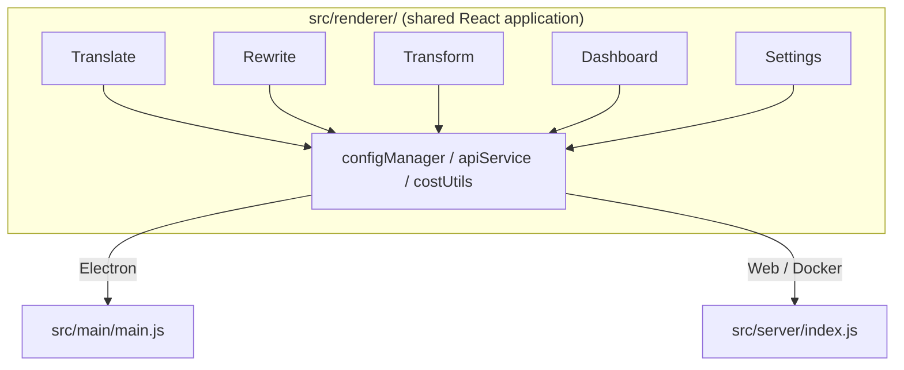

<p align="center">
  
</p>

<h1 align="center">Transrewrt</h1>

<p align="center">
  <a href="https://github.com/wsj-br/transrewrt/releases"></a>
  <a href="LICENSE"></a>
  
  
  
</p>

AI 驅動的文字工具：透過 [OpenRouter](https://openrouter.ai) 實現多語言翻譯、重寫不同風格，並使用自訂提示詞轉換文字。可作為桌面應用程式 (Electron) 或自主託管的網路應用程式 (Docker) 運行。

- **翻譯** - 支援數十種語言互譯，並自動檢測來源語言
- **重寫** - 修正語法、提升清晰度、正式/非正式語氣、縮短、擴展、技術性改寫
- **轉換** - 使用自訂 AI 提示詞；建立與管理提示詞，可為每個提示詞選擇目標語言
- **模型與成本** - 選擇任何 OpenRouter 模型；內建成本儀表板，使用 SQLite 記錄，按模型/操作/日期提供摘要
- **使用者介面** - 国际化（pt-BR、de、fr、es、RTL）、佈景主題、字體、鍵盤快速鍵；安全網路模式（API 金鑰僅儲存在伺服器端）
- **桌面版** - 適用於 Windows 和 Linux 的 Electron 應用程式
- **自主託管** - 適用於 amd64 與 arm64（樹莓派就緒）的 Docker 映像檔

安裝完成後，請參閱 **[使用者指南](../USER-GUIDE.md)** 以了解所有功能的完整操作說明。

<small>**以其他語言閱讀：** [English (UK)](../README.md) · [Português (BR)](README.pt-BR.md) · [العربية](README.ar.md) · [বাংলা](README.bn.md) · [Català](README.ca.md) · [简体中文](README.zh-CN.md) · [繁體中文](README.zh-TW.md) · [Hrvatski](README.hr.md) · [Čeština](README.cs.md) · [Nederlands](README.nl.md) · [English (US)](README.en-US.md) · [Filipino](README.tl.md) · [Français](README.fr.md) · [Deutsch](README.de.md) · [Ελληνικά](README.el.md) · [हिन्दी](README.hi.md) · [Magyar](README.hu.md) · [Italiano](README.it.md) · [日本語](README.ja.md) · [Basa Jawa](README.jv.md) · [한국어](README.ko.md) · [Bahasa Melayu](README.ms.md) · [فارسی](README.fa.md) · [Polski](README.pl.md) · [Português (PT)](README.pt.md) · [ਪੰਜਾਬੀ](README.pa.md) · [Română](README.ro.md) · [Русский](README.ru.md) · [Slovenčina](README.sk.md) · [Español](README.es.md) · [Kiswahili](README.sw.md) · [Svenska](README.sv.md) · [తెలుగు](README.te.md) · [ภาษาไทย](README.th.md) · [Türkçe](README.tr.md) · [Українська](README.uk.md) · [Tiếng Việt](README.vi.md)</small>

<a id="screenshots"></a>
## 螢幕截圖

**語言選取器**


**翻譯**


**轉換 - 提示詞編輯器**


**儀表板**


**設定 - 模型選擇**


<br /><br />

<a id="table-of-contents"></a>
## 目錄

<!-- START doctoc generated TOC please keep comment here to allow auto update -->
<!-- DON'T EDIT THIS SECTION, INSTEAD RE-RUN doctoc TO UPDATE -->

- [快速開始](#quick-start)
- [安裝](#installation)
  - [Windows (Electron)](#windows-electron)
  - [Linux (Electron)](#linux-electron)
  - [Docker](#docker)
- [取得 OpenRouter API 金鑰](#getting-an-openrouter-api-key)
- [設定與環境](#configuration-and-environment)
- [開發與架構](#development-and-architecture)
- [版本與標籤](#releases-and-tags)
- [貢獻指南](#contributing)
- [免責聲明](#disclaimer)
- [授權條款](#license)

<!-- END doctoc generated TOC please keep comment here to allow auto update -->

<br /><br />

<a id="quick-start"></a>

## 快速開始

**Docker（推薦用於自我託管）**

```bash
docker pull ghcr.io/wsj-br/transrewrt:latest

API_KEY=sk-or-your-key docker run -d \
  -p 5000:5000 \
  -v transrewrt-data:/app/data \
  -e API_KEY \
  --name transrewrt-web \
  ghcr.io/wsj-br/transrewrt:latest
```

將 `sk-or-your-key` 替換為您的 [OpenRouter API key](https://openrouter.ai/keys)。開啟 [http://localhost:5000](http://localhost:5000)，並在公開服務前變更預設的系統管理員密碼。

<br />

> ℹ️ **注意**<br/>
> 在 Docker 中，OpenRouter API key 只能透過 `API_KEY` 環境變數設置（無法在網頁 UI 中）。在桌面版 (Electron) 中，請在 **設定 → API** 中貼上。

<br />

**Windows**

從 [Releases](https://github.com/wsj-br/transrewrt/releases) 下載最新的 `Transrewrt Setup x.y.z.exe`，執行安裝程式，然後從開始功能表或桌面快捷方式啟動。在 **設定 → API** 中輸入您的 OpenRouter API key。

<br />

**Linux**

從 [Releases](https://github.com/wsj-br/transrewrt/releases) 下載 `.AppImage`，然後：

```bash
chmod +x Transrewrt-x.y.z.AppImage && ./Transrewrt-x.y.z.AppImage
```

在 **設定 → API** 中輸入您的 OpenRouter API key。在 Debian/Ubuntu 上，您可能需要先安裝額外的依賴項：

```bash
sudo apt install libgtk-3-0 libnotify-dev libnss3 libxss1 libasound2 libxtst6 xauth
```

詳細資訊請參閱 [安裝 → Linux](#linux-electron)。

<br />

> ℹ️ **注意**<br/>
> 目前不支援 macOS。Transrewrt 適用於 Windows、Linux 和 Docker。

<br />

應用程式啟動後，請參閱 **[使用者指南](../USER-GUIDE.md)** 了解如何翻譯、重寫與轉換文字、管理提示詞以及設定模型。

<br /><br />

<a id="installation"></a>
## 安裝

<a id="windows-electron"></a>
### Windows (Electron)

- 從 [Releases](https://github.com/wsj-br/transrewrt/releases) 下載最新的安裝程式。
- 執行 `.exe` 並按照安裝程序操作。
- 首次執行：從開始功能表或桌面快捷方式啟動應用程式。設定儲存在 `%APPDATA%\transrewrt\`。

<br />

<a id="linux-electron"></a>
### Linux (Electron)

- 從 [Releases](https://github.com/wsj-br/transrewrt/releases) 下載 `.AppImage`。
- 執行：`chmod +x Transrewrt-x.y.z.AppImage && ./Transrewrt-x.y.z.AppImage`
- 額外依賴項 (Debian/Ubuntu)：`sudo apt install libgtk-3-0 libnotify-dev libnss3 libxss1 libasound2 libxtst6 xauth`
- 更多資訊請參閱 [dev/DEVELOPMENT.md](../dev/DEVELOPMENT.md)。

<br />

<a id="docker"></a>
### Docker

- 拉取：`docker pull ghcr.io/wsj-br/transrewrt:latest`
- OpenRouter API key **必須** 透過 `API_KEY` 環境變數設置。使用 `-e API_KEY` 傳遞（或透過 `docker compose` / `.env`），以避免金鑰在進程列表中可見。
- API key 無法在網頁 UI 中輸入。

範例 - 使用命名卷進行持久化（API key 透過環境變數傳遞，而非命令列）：

```bash
API_KEY=sk-or-your-key docker run -d \
  -p 5000:5000 \
  -v transrewrt-data:/app/data \
  -e API_KEY \
  --name transrewrt-web \
  ghcr.io/wsj-br/transrewrt:latest
```

<br />

| 選項 | 描述 |
| -------- | ------------------------------------------------------------------------------------------------------------- |
| 連接埠 | `5000`（使用 `-p 5000:5000` 對應） |
| 卷 | 掛載 `/app/data` 以進行設定和資料庫持久化 |
| 環境變數 | `PORT`, `CONFIG_PATH`, `API_KEY`, `API_URL`, `KEY_SEED` - 請參閱 [配置](#configuration-and-environment) |

從原始碼建置並執行：`docker compose up --build -d` 或 `pnpm run docker:up` - 請參閱 [dev/DEVELOPMENT.md](../dev/DEVELOPMENT.md)。

<br /><br />

<a id="getting-an-openrouter-api-key"></a>
## 獲取 OpenRouter API key

Transrewrt 使用 [OpenRouter](https://openrouter.ai) 提供 AI 模型。您需要 API key 才能進行翻譯、重寫或轉換文字。

1. 在 [openrouter.ai](https://openrouter.ai) 註冊或登入。
2. 開啟 [Keys](https://openrouter.ai/keys) 頁面並建立新金鑰（命名，可選擇設定信用額度上限）。您無需新增額度即可使用免費模型。
3. **桌面版 (Electron)：** 在 **設定 → API** 中貼上金鑰。**Docker：** 設定 `API_KEY` 環境變數（請參閱 [快速開始](#quick-start)）。

關於限制、BYOK 等資訊，請參閱 [OpenRouter 身份驗證](https://openrouter.ai/docs/api/reference/authentication)。

<br /><br />

<a id="configuration-and-environment"></a>

## 配置與環境

**配置檔案位置**

| 部署方式         | 配置位置                                   |
| ----------------- | ------------------------------------------------- |
| Electron (Windows) | `%APPDATA%\transrewrt\`                           |
| Electron (Linux)   | `~/.config/transrewrt/`                           |
| Web / Docker       | `/app/data/config.json`（使用卷來持久化）           |

<br />

**環境變數**（僅限 Web/Docker；Electron 使用本地配置檔案）

| 變數      | 預設值                        | 描述                                                   |
| ---------- | ------------------------------ | -------------------------------------------------------- |
| `PORT`        | `5000`                         | 伺服器監聽埠                                         |
| `CONFIG_PATH` | `/app/data/config.json`        | 配置檔案路徑                                       |
| `API_KEY`     | *(空)*                      | OpenRouter API 金鑰（Docker 必填；透過環境變數設定，非 UI） |
| `API_URL`     | `https://openrouter.ai/api/v1` | 上游 AI API 基礎 URL                                      |
| `KEY_SEED`    | *(空)*                      | Transrewrt 代理密鑰种子（若設定則覆寫配置）           |

<br />

**資料與持久化：** 對於 Docker，請在 `/app/data` 掛載卷，以使 `config.json` 和 SQLite 資料庫在容器重啟時保持持久。若無卷，容器停止時所有資料將會遺失。

<br />

**Web 身份驗證：**

- 預設管理員：`admin` / `transrewrt26`。
- 在 **設定 → 使用者** 中管理使用者。
- 重設密碼：`docker exec <container> reset-web-password '<username>' '<new-password>'`
  （原始程式碼：`pnpm run reset-web-password -- <username> <new-password>`）

<br />

> ⚠️ **警告**<br/>
> 請立即在任何可網路存取的主機上變更預設管理員密碼。

<br />

**Transrewrt 代理（可選）：** 您可以將 API 流量路由透過使用基於時間的滾動密鑰的外部代理。在 **設定 → API** 中，啟用 **使用 Transrewrt 代理**，設定 **密鑰种子**，並將 **API URL** 設為代理基礎 URL。詳情請參見 [dev/SYSTEM-OVERVIEW.md](../dev/SYSTEM-OVERVIEW.md)。

主要設定（主題、字型、模型、語言等）可於設定對話框中取得，或直接編輯 config JSON。完整的清單與預設值記載於 [dev/DEVELOPMENT.md](../dev/DEVELOPMENT.md)。

<br /><br />

<a id="development-and-architecture"></a>
## 開發與架構

- **開發：** 設定、建置、測試與部署（Electron、Web、Docker）— 詳情請參見 **[dev/DEVELOPMENT.md](../dev/DEVELOPMENT.md)**。
- **架構與系統概觀：** 資料夾結構、技術堆疊、設計決策、Transrewrt 代理 — 詳情請參見 **[dev/SYSTEM-OVERVIEW.md](../dev/SYSTEM-OVERVIEW.md)**。



<br /><br />

<a id="releases-and-tags"></a>
## 發行與標籤

- **Git 標籤** `v`*（例如 `v1.0.10`）會觸發 [release workflow](.github/workflows/release.yml)。**GitHub 發行** 會附上 Windows 安裝程式（`.exe`）與 Linux AppImage。
- **Docker 映像** 發佈至 `ghcr.io/wsj-br/transrewrt`。映像標籤與 Git 版本相符（例如 `v1.0.10` → `ghcr.io/wsj-br/transrewrt:1.0.10`）並包含 `latest`。多重架構：`linux/amd64` 與 `linux/arm64`（例如 Raspberry Pi）。

<br /><br />

<a id="contributing"></a>
## 貢獻

1. Fork 儲存庫。
2. 建立功能分支：`git checkout -b feature/my-feature`
3. 使用清晰的訊息提交變更。
4. 推送並對 `main` 分支發起 Pull Request。

請遵循現有的程式碼風格，並在提交前於 Electron 與 web 模式下測試您的變更。建置與測試指令請參見 [dev/DEVELOPMENT.md](../dev/DEVELOPMENT.md)。

<br />

**回報問題：** 在 [GitHub](https://github.com/wsj-br/transrewrt/issues) 上開啟 issue。請包含您的平台（Windows / Linux / Docker）與應用程式版本（顯示於關於對話框或發行頁面）。

<br /><br />

<a id="disclaimer"></a>

## 免責聲明

產品名稱和圖標屬於其各自所有者，僅出於識別目的使用。本軟體與任何提及的品牌的無關聯，亦未經任何品牌認可。

<br /><br />

<a id="license"></a>
## 授權條款

Copyright © 2026 Waldemar Scudeller Jr.

根据 [Apache License 2.0](LICENSE) 條款特此授予許可。