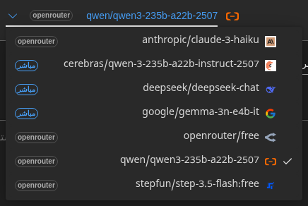

# دليل المستخدم

 

## مقدمة

يساعدك ترانس ريوارت على التعامل مع النصوص بثلاث طرق رئيسية:

- **الترجمة** - تحويل النص من لغة إلى أخرى.
- **إعادة الصياغة** - إعادة صياغة النص بأسلوب مختلف، مثل أن يكون أوضح أو أقصر أو أكثر رسمية.
- **التحويل** - معالجة النص باستخدام تعليمات ذكاء اصطناعي مخصصة تُسمى "موجهات (Prompts)".

 

يشرح هذا الدليل كيفية استخدام التطبيق بعد تثبيته وتشغيله. للحصول على خطوات التثبيت، يُرجى الرجوع إلى ملف **[README](README.ar.md)** الرئيسي.

 

> ℹ️ **ملاحظة** 
> يتوفر ترانس ريوارت كتطبيق سطح مكتب لأنظمة Windows وLinux، وكموقع ويب يمكنك استضافته ذاتيًا. يركز هذا الدليل على الاستخدام اليومي للتطبيق. وفي حال كان هناك شيء خاص بإصدار معين، فسيتم الإشارة إليه بوضوح.

<small>**قراءة بلغات أخرى:** [الإنجليزية (المملكة المتحدة)](USER-GUIDE.ar.md) · [البرتغالية (البرازيل)](USER-GUIDE.pt-BR.md) · [العربية](USER-GUIDE.ar.md) · [البنغالية](USER-GUIDE.bn.md) · [الكتالانية](USER-GUIDE.ca.md) · [الصينية المبسطة](USER-GUIDE.zh-CN.md) · [الصينية التقليدية](USER-GUIDE.zh-TW.md) · [الكرواتية](USER-GUIDE.hr.md) · [التشيكية](USER-GUIDE.cs.md) · [الهولندية](USER-GUIDE.nl.md) · [الإنجليزية (الولايات المتحدة)](USER-GUIDE.en-US.md) · [الفلبينية](USER-GUIDE.tl.md) · [الفرنسية](USER-GUIDE.fr.md) · [الألمانية](USER-GUIDE.de.md) · [اليونانية](USER-GUIDE.el.md) · [الهندية](USER-GUIDE.hi.md) · [الهنغارية](USER-GUIDE.hu.md) · [الإيطالية](USER-GUIDE.it.md) · [اليابانية](USER-GUIDE.ja.md) · [الجاوية](USER-GUIDE.jv.md) · [الكورية](USER-GUIDE.ko.md) · [الملايوية](USER-GUIDE.ms.md) · [الفارسية](USER-GUIDE.fa.md) · [البولندية](USER-GUIDE.pl.md) · [البرتغالية (البرتغال)](USER-GUIDE.pt.md) · [البنجابية](USER-GUIDE.pa.md) · [الرومانية](USER-GUIDE.ro.md) · [الروسية](USER-GUIDE.ru.md) · [السلوفاكية](USER-GUIDE.sk.md) · [الإسبانية](USER-GUIDE.es.md) · [السواحلية](USER-GUIDE.sw.md) · [السويدية](USER-GUIDE.sv.md) · [التيلوغوية](USER-GUIDE.te.md) · [التايلاندية](USER-GUIDE.th.md) · [التركية](USER-GUIDE.tr.md) · [الأوكرانية](USER-GUIDE.uk.md) · [الفيتنامية](USER-GUIDE.vi.md)</small>

<small>

> **ملاحظة حول ترجمات واجهة المستخدم والمستندات:** تم نقل جميع لغات الواجهة باستثناء اللغة الإنجليزية (المملكة المتحدة) التي تعد النص الأصلي، باستخدام نماذج ذكاء اصطناعي، وبالتالي قد تكون الصيغة غير دقيقة أو تحتوي على أخطاء.

</small>

 

<!-- START doctoc generated TOC please keep comment here to allow auto update -->
<!-- DON'T EDIT THIS SECTION, INSTEAD RE-RUN doctoc TO UPDATE -->
**جدول المحتويات** 

- [قبل أن تبدأ](#before-you-start)
  - [كيفية الحصول على مفتاح OpenRouter مجاني (تطبيق سطح المكتب)](#how-to-get-a-free-openrouter-api-key-desktop-app)
- [البداية](#getting-started)
- [الأجزاء الرئيسية للنافذة](#main-parts-of-the-window)
  - [الشريط الجانبي](#sidebar)
  - [شريط الأدوات](#toolbar)
  - [لوحات الإدخال والإخراج](#input-and-output-panels)
- [الترجمة](#translate)
  - [ترجمة النص](#translate-text)
  - [اختيار اللغة](#language-selection)
  - [إعدادات مفيدة للترجمة](#helpful-translation-settings)
- [إعادة الصياغة](#rewrite)
- [التحويل](#transform)
  - [تشغيل موجه موجود](#run-an-existing-prompt)
  - [إذا لم تكن لديك موجهات بعد](#if-you-have-no-prompts-yet)
  - [إنشاء موجه بسرعة](#create-a-prompt-quickly)
  - [تعديل الموجه](#edit-a-prompt)
  - [اختبار الموجه قبل استخدامه](#test-a-prompt-before-using-it)
- [لوحة التحكم](#dashboard)
  - [تصفية البيانات](#filter-the-data)
  - [علامات تبويب لوحة التحكم](#dashboard-tabs)
  - [تصدير البيانات](#export-data)
  - [حذف السجلات المخزنة لنموذج معين](#delete-stored-records-for-a-model)
- [السجل](#history)
  - [تصفية البيانات](#filter-the-data-1)
  - [تصدير بيانات السجل](#export-history-data)
- [الإعدادات](#settings)
  - [الإعدادات العامة](#general-settings)
  - [النماذج](#models)
  - [اللغات](#languages)
  - [تتبع التكاليف](#cost-tracking)
  - [موجهات التحويل](#transform-prompts)
  - [المستخدمون](#users)
  - [إعدادات الواجهة البرمجية (API)](#api-config)
  - [حول](#about)
- [المشاكل الشائعة](#common-issues)
  - [لا يقوم التطبيق بترجمة النص أو إعادة صياغته أو تحويله](#the-app-will-not-translate-rewrite-or-transform-text)
  - [قائمة النماذج فارغة](#the-model-list-is-empty)
  - [النتيجة بطيئة جدًا أو مكلفة جدًا](#the-result-is-too-slow-or-too-expensive)
  - [واجهة التطبيق بلغة خاطئة](#the-interface-is-in-the-wrong-language)
  - [النص صغير جدًا أو من الصعب قراءته](#the-text-is-too-small-or-hard-to-read)
  - [مخططات لوحة التحكم فارغة](#dashboard-charts-are-empty)
  - [تُظهر التكلفة "غير متوفرة" أو تبدو خاطئة](#cost-shows-not-available-or-seems-wrong)
  - [إجمالي التكلفة لا يطابق فاتورتي من مزود الخدمة](#total-cost-does-not-match-my-provider-bill)
  - [صفحة السجل مفقودة من الشريط الجانبي](#the-history-page-is-missing-from-the-sidebar)
  - [تطبيق الويب: التحويل إلى صفحة تسجيل الدخول بشكل غير متوقع](#web-app-redirected-to-the-login-page-unexpectedly)
  - [تُظهر لوحة التحكم عدم وجود بيانات للمستخدمين الآخرين (الويب)](#dashboard-shows-no-data-for-other-users-web)
  - [قمت بتعديل موجه وفقدت التغييرات](#i-changed-a-prompt-and-lost-the-edits)
- [نصائح سريعة](#quick-tips)
- [إخلاء مسؤولية](#disclaimer)
- [الرخصة](#license)

<!-- END doctoc generated TOC please keep comment here to allow auto update -->

  

## قبل أن تبدأ

للاستفادة من Transrewrt، تحتاج إلى الوصول إلى مزود ذكاء اصطناعي واحد على الأقل. وتشمل موفري الخدمة المدعومين: [OpenRouter](https://openrouter.ai) (الذي يجمع العديد من النماذج)، OpenAI، Anthropic، Google Gemini، DeepSeek، Groq، Mistral، xAI، Cerebras، و[Ollama](https://ollama.com) للنماذج المحلية.

ليس عليك اختيار نموذج مدفوع للبدء. بمجرد إضافة مفتاح API الخاص بك لـ OpenRouter، تقوم التطبيق بتفعيل خيار **مجاني** داخلي من OpenRouter تلقائيًا. وهذا يتيح لك البدء فورًا في الترجمة، إعادة الصياغة، وتحويل النصوص. بدلاً من ذلك، يمكنك أيضًا الحصول على مفتاح API مجاني من Cerebras أو Google أو Groq أو Mistral AI.

بكلمات بسيطة:

- يُعتبر **النموذج** محرك الذكاء الاصطناعي الذي يؤدي المهمة. وتُعرض النماذج مع **بادئة مزود** (مثل `openrouter/…`، `openai/…`، `ollama/…`).
- يُعد **مفتاح API** (أو بالنسبة لـ Ollama، **عنوان URL أساسي**) الطريقة التي يتواصل بها التطبيق مع مزود الخدمة.

إذا كنت تستخدم **تطبيق سطح المكتب**، فأضف المفاتيح في [**الإعدادات** > **تكوين API**](#api-config) لكل مزود تستخدمه. إذا كنت تستخدم OpenRouter فقط، اطلع على [كيفية الحصول على مفتاح API](#how-to-get-an-api-key-desktop-app) أدناه. وإذا لم ترغب في استخدام مفتاح API، يمكنك تثبيت Ollama (من [ollama.com](https://ollama.com)) واستخدام نماذج محلية بدلاً من ذلك، مثل `translategemma:4b`.

إذا كنت تستخدم **النسخة المبنية على الويب**، يقوم مالك الخادم بتكوين الموفرين باستخدام متغيرات البيئة، وبالتالي لا يمكنك إدخال مفاتيح API مباشرةً في التطبيق.

 

### كيفية الحصول على مفتاح API مجاني من OpenRouter (تطبيق سطح المكتب)

إذا كنت تستخدم تطبيق سطح المكتب، اتبع الخطوات التالية:

1. انتقل إلى [OpenRouter](https://openrouter.ai) باستخدام متصفحك.
2. أنشئ حسابًا أو قم بتسجيل الدخول.
3. افتح صفحة [المفاتيح](https://openrouter.ai/keys).
4. انقر على الزر لإنشاء مفتاح API جديد.
5. حدد اسمًا للمفتاح كي تتعرف عليه لاحقًا.
6. انسخ المفتاح الجديد.
7. عُد إلى Transrewrt وافتح **الإعدادات** > **تكوين API**.
8. الصق المفتاح في حقل **مفتاح OpenRouter API** (تحت **الإعدادات** > **تكوين API**).
9. انقر على **اختبار مفتاح OpenRouter** للتأكد من عمله.

  

## البدء

إذا كانت هذه هي المرة الأولى التي تستخدم فيها Transrewrt، اتبع الترتيب التالي:

1. افتح التطبيق.
2. اختر **لغة الواجهة** من أيقونة الكرة الأرضية إذا لزم الأمر.
3. إذا كنت تستخدم **تطبيق سطح المكتب**، فافتح [**الإعدادات** > **تكوين API**](#api-config)، وأضف مفتاح API لمزود واحد على الأقل (مثلًا OpenRouter)، ثم انقر على **اختبار** للتأكد من عمله.
4. افتح [**الإعدادات** > **النماذج**](#models) وأضف نموذجًا واحدًا أو أكثر إلى **النماذج المحددة**.
5. افتح [**الإعدادات** > **اللغات**](#languages) واختر **أهم اللغات** إذا كنت ترغب في إظهار لغاتك الأكثر استخدامًا في المقدمة.
6. انتقل إلى **الترجمة** وقم بإجراء ترجمة بسيطة للتأكد من أن كل شيء يعمل.
7. بمجرد نجاح ذلك، جرب **إعادة الصياغة** ثم **التحويل**.

هذا الترتيب مهم. فهو يمنع أكثر المشكلات شيوعًا عند الاستخدام الأول: محاولة تشغيل مهمة قبل أن يتوفر للتطبيق اتصال نشط بواجهة برمجة التطبيقات أو نموذج محدد.

  

## الأجزاء الرئيسية للنافذة

ينقسم التطبيق إلى ثلاث مناطق رئيسية:

- **الشريط الجانبي** على اليسار.
- **شريط الأدوات** في الأعلى.
- **منطقة العمل** في المنتصف.

 

### الشريط الجانبي

استخدم الشريط الجانبي للتنقل داخل التطبيق. يمكنك طي الشريط الجانبي للحصول على مساحة أكبر بالضغط على الأيقونة بجوار شعار التطبيق.

 

<table>
  <tr>
    <td valign="top">
       
    </td>
    <td valign="top">
        
      <ul>
        <li><strong>الترجمة</strong> تفتح مساحة عمل الترجمة.</li> 
        <li><strong>إعادة الصياغة</strong> تفتح مساحة عمل إعادة الصياغة.</li> 
        <li><strong>التحويل</strong> تفتح مساحة عمل المطالبة المخصصة.</li> 
        <li><strong>لوحة المعلومات</strong> تعرض معلومات الاستخدام والتكاليف.</li> 
        <li><strong>الإعدادات</strong> تفتح لوحة الإعدادات.</li> 
        <li><strong>التاريخ</strong> تعرض سجل الاستخدام مع النص المدخل والنص الناتج.</li> 
        <li><strong>المستخدم</strong> تعرض اسم المستخدم للمستخدم المسجل (للنظام القائم على الويب فقط).</li>
      </ul>
    </td>
  </tr>
</table>

 

### شريط الأدوات

يتغير شريط الأدوات بشكل طفيف حسب موقعك داخل التطبيق.

- على اليسار، يعرض اسم الصفحة الحالية.
- على اليمين، يعرض **محدد النموذج** وتحديد **لغة الواجهة**.

يتيح لك **محدد النموذج** اختيار محرك الذكاء الاصطناعي الذي ترغب في استخدامه لل مهمة الحالية.

  

قد لا تكون بعض النماذج المجانية متاحة دوماً — أحياناً تكون غير متصلة أو تخضع لحد في الاستخدام. وفي حال حدوث ذلك، سيقوم التطبيق تلقائياً بإزالة هذا النموذج من قائمتك المتاحة. للتحكم في النماذج التي تظهر، انتقل إلى [**الإعدادات** > **النماذج**](#models) وقم بتحرير قائمة النماذج الخاصة بك.
كما يمكنك فتح إعدادات النموذج مباشرةً عبر النقر على أيقونة المزود الموجودة على يسار اسم النموذج في شريط الأدوات.

 

يغيّر **أيقونة الكرة الأرضية + رمز اللغة** لغة واجهة التطبيق، مثل القوائم والأزرار. ولا تغيّر هذه الأيقونة لغات الترجمة المستخدمة في نافذة **الترجمة**.

  

 

### لوحات الإدخال والإخراج

تستخدم معظم المساحات العاملة لوحة **إدخال** على اليسار ولوحة **إخراج** على اليمين.

وتشير كل لوحة إلى ما يلي:

| **الإدخال**                                                       | **الإخراج**                                                                                                                        |
|--------------------------------------------------------------------|-------------------------------------------------------------------------------------------------------------------------------------|
| - عدد الأحرف  - عدد الكلمات  - عدد الفقرات              | - المدة التي استغرقها تنفيذ المهمة - **TPS** (عدد الرموز في الثانية) - عدد الأحرف، والكلمات، والفقرات - النموذج المستخدم |

إذا كنت تتساءل عن المصطلحات التقنية:

- **الرمز (Token)** يعني جزءاً صغيراً من النص. يمكنك أن تفكر فيه كجزء من كلمة أو كلمة قصيرة.
- **TPS** تعني عدد هذه الأجزاء النصية التي يعالجها النموذج في كل ثانية.

 

يمكنك أيضاً مراقبة تكلفة كل عملية (إذا كانت متاحة) والتكلفة الإجمالية، وذلك بتفعيل الخيار `إظهار معلومات التكلفة في الإجراءات` ضمن [**الإعدادات** > **الإعدادات العامة**](#general-settings). 
 
  

[--------------------------------------------------------------------------------------------------------------------------]: # 

## الترجمة

استخدم **الترجمة** عندما ترغب في تحويل نص من لغة إلى أخرى.

 

### ترجمة النص

1. افتح **الترجمة**.
2. اختر لغة في حقل **من**.
3. اختر لغة في حقل **إلى**.
4. اختر نموذجاً في شريط الأدوات.
5. اكتب أو الصق النص في **الإدخال**.
6. انقر على **ترجمة**.
7. اقرأ النتيجة في حقل **الإخراج**.
8. استخدم زر النسخ إذا أردت نسخ النتيجة.

 

### اختيار اللغة

- يمكن أن يكون حقل **من** لغة محددة أو الخيار **اكتشاف اللغة**.
- حقل **إلى** هو اللغة التي ترغب في الحصول على النتيجة بها.

تظهر **اللغات المفضلة** التي تختارها في الجزء العلوي من القائمة. ويمكنك تعيين هذه اللغات في [**الإعدادات** > **اللغات**](#languages).

 

### إعدادات ترجمة مفيدة

في [**الإعدادات** > **الإعدادات العامة**](#general-settings)، يمكنك تغيير طريقة عمل الترجمة:

- **الترجمة التلقائية بعد اللصق** تقوم بإجراء الترجمة فوراً بمجرد لصق النص.
- **نسخ النتيجة تلقائياً إلى الحافظة** تحفظ النتيجة في الحافظة تلقائياً بعد إتمام الترجمة بنجاح.
- **الترجمة الفورية (أثناء الكتابة)** تقوم بإجراء الترجمات أثناء الكتابة.
- **مهلة الانتظار (بالمللي ثانية)** تتحكم في المدة التي ينتظرها التطبيق قبل بدء ترجمة فورية.
- **مفتاح Enter** يتحكم فيما يحدث عند الضغط على `Enter`:

  

[--------------------------------------------------------------------------------------------------------------------------]: # 

## إعادة الصياغة

استخدم **إعادة الصياغة** عندما ترغب في تحسين النص دون تغيير المعنى الأساسي.

وهذا مفيد في:

- تصحيح الأخطاء الإملائية والقواعدية
- جعل النص أكثر وضوحاً
- جعل النص أكثر رسمية أو غير رسمية
- تقصير أو توسيع النص
- جعل النص يبدو أكثر تخصصاً

 

> 💡 **تلميح** 
> عند استخدامك لنمط "**فحص التهجئة والقواعد**"، تظهر زر `إظهار التغيرات` في لوحة الإخراج.
> انقر على هذا الزر لتبديل عرض التصويبات، لإظهار أو إخفاء التغييرات المحددة التي تم إجراؤها على نصك.

  

[--------------------------------------------------------------------------------------------------------------------------]: # 

## التحويل

استخدم **التحويل** عندما ترغب في جعل الذكاء الاصطناعي يتبع مجموعة مخصصة من التعليمات.

هذه هي المنطقة الأكثر مرونة في التطبيق. يمكنك استخدامها في مهام مثل:

- تلخيص الملاحظات
- تحويل النصوص الأولية إلى بريد إلكتروني منسق
- استخلاص النقاط الأساسية
- تحويل النصوص إلى تنسيق محدد
- أي نشاط مخصص آخر مع نص المدخلات

 

### تشغيل مطالبة موجودة

1. افتح **التحويل**.
2. اختر مطالبة من قائمة المطالبات.
3. إذا ظهر مربع **اللغة الهدفية**، اختر اللغة المطلوبة.
4. اكتب النص أو ألصقه في حقل **المدخلات**.
5. انقر على **تحويل**.
6. اقرأ النتيجة في حقل **المخرجات**.

 

### إذا لم تكن لديك أي مطالبات بعد

إذا كانت قائمة المطالبات فارغة، انقر على **تحميل مطالبات تجريبية**. سيقوم هذا بإضافة أمثلة مضمنة حتى تتمكن من البدء بسرعة.

 

> ℹ️ **ملاحظة** 
> تُقدم المطالبات التجريبية باللغة الإنجليزية. بعد تحميلها، يمكنك تعديل المطالبة واستخدام خيار **ترجمة المطالبة** لترجمتها إلى لغتك.

 

### إنشاء مطالبة بسرعة

أسرع طريقة لإنشاء مطالبة هي:

1. انقر على **مطالبة جديدة**.
2. انقر على **إنشاء مطالبة**.
3. صف ما ترغب في أن تقوم به المطالبة.
4. اختر نموذجًا.
5. دع التطبيق ينشئ لك نسخة أولية.
6. راجع المسودة ثم انقر على **حفظ**.

 

### تعديل المطالبة

عند إنشاء أو تعديل مطالبة، يظهر المحرر على الجهة اليسرى، بينما تظهر منطقة اختبار على الجهة اليمنى.

الحقول الرئيسية هي:

- **اسم المطالبة**: الاسم المعروض في قائمة المطالبات.
- **تعليمات المطالبة (اختياري)**: إشارة قصيرة تُعرض للمستخدم عند تشغيل المطالبة.
- **دور النموذج**: الدور العام المعطى للذكاء الاصطناعي، مثل 'أنت مساعد مفيد'.
- **تعليمات النموذج (تعليمات واحدة لكل سطر)**: القواعد المحددة التي ترغب في أن يتبعها الذكاء الاصطناعي.
- **وصف المخرجات**: كلمة قصيرة تصف النتيجة، مثل 'ملخص' أو 'إعادة كتابة'.
- **درجة الحرارة (0.0 → 1.0)**: طريقة تصرف النموذج؛ انظر أدناه.
- **طلب لغة الوجهة**: يضيف منتقي لغة مستهدفة عند تشغيل المطالبة.

إذا لم تكن المصطلح التقني **درجة الحرارة** مألوفًا لك، فانظر إليه بهذه الطريقة:

- تعطي **درجة الحرارة الأقل** نتائج أكثر استقرارًا وقابلة للتنبؤ.
- تعطي **درجة الحرارة الأعلى** تنوعًا وإبداعًا أكبر.

يمكنك أيضًا استخدام:

- **`إنشاء مطالبة`** لإنشاء مسودة جديدة من وصف بسيط
- **`تحسين المطالبة`** لتحسين مطالبة موجودة
- **`ترجمة المطالبة`** لترجمة حقول المطالبة

 

> ⚠️ **تحذير** 
> انقر على **`حفظ`** قبل أن تنقر على **`العودة للتشغيل`**. إذا عدت دون حفظ، فستفقد التغييرات التي أجريتها.

 

### اختبر المطالبة قبل استخدامها

تسمح لك لوحة الاختبار على اليمين بتجربة المطالبة مع نص تجريبي قبل استخدامها في العمل اليومي.

هذا مفيد عندما:

- تقوم ببناء مطالبة جديدة
- تقوم بمقارنة إصدارين من مطالبة
- ترغب في التحقق من النبرة أو الطول أو تنسيق المخرجات

 

> ℹ️ **ملاحظة** 
> يمكنك تصدير واستيراد المطالبات المحفوظة من خلال [**الإعدادات** > **مطالبات التحويل**](#transform-prompts).

  

[--------------------------------------------------------------------------------------------------------------------------]: # 

## لوحة التحكم

استخدم **لوحة التحكم** لمعرفة مدى استخدامك للتطبيق وما هي التكاليف (للنماذج المدفوعة).

 

> ℹ️ **ملاحظة** 
> إذا كنت تستخدم نماذج مجانية فقط، فستكون المخططات المتعلقة بالتكلفة فارغة.

 

### تصفيّة البيانات

استخدم أزرار التصفية في الأعلى لتغيير نطاق الوقت.

 

> ℹ️ **ملاحظة** 
> يُسمح برؤية منقي **المستخدم** للمدراء فقط في النسخة الويب. لن يرى المستخدمون العاديون هذا المنقي، وهو غير متوفر في تطبيق سطح المكتب.

 

### علامات التبويب في لوحة التحكم

- **الملخص**: يمنحك نظرة عامة على الاستخدام والتكلفة.
- **حسب الاستخدام**: يقسم النشاط حسب لغة الترجمة ووضع إعادة الكتابة وطلب التحويل.
- **حسب النموذج**: يعرض النماذج التي استخدمتها وتكلفتها.
- **حسب اليوم**: يعرض المبالغ اليومية.
- **جميع الاستعلامات**: يعرض السجل الكامل للاستعلامات ويساعدك على تصديره.

 

### تصدير البيانات

يمكن لجداول لوحة التحكم تصدير البيانات بصيغ:

- **JSON**
- **CSV**
- **XLSX**

وهو أمر مفيد إذا رغبت في مراجعة النشاط خارج التطبيق أو مشاركة تقرير.

 

### حذف السجلات المحفوظة لنموذج

في علامة التبويب **حسب النموذج** أو **جميع الاستعلامات**، يمكنك إزالة السجلات المحفوظة لنموذج بالنقر على أيقونة "سلة المهملات".

> ⚠️ **تحذير** 
> لا يمكن التراجع عن حذف السجلات المحفوظة. استخدم هذه الميزة فقط إذا كنت متأكدًا من أنك لم تعد بحاجة إلى هذا السجل.

لمسح جميع البيانات أو إزالة السجلات بناءً على عمرها، انتقل إلى [**الإعدادات** > **تتبع التكاليف**](#cost-tracking). ستجد هناك خيارات لحذف جميع البيانات المخزنة أو البيانات الأقدم من تاريخ معين فقط.

  

[--------------------------------------------------------------------------------------------------------------------------]: # 

## السجل

انقر على **السجل** لعرض سجل عملياتك داخل **Transrewrt**، بما في ذلك المدخلات والنتائج لكل عملية.

 

### تصفية البيانات

يستخدم **السجل** نفس عوامل التصفية الموجودة في صفحة **لوحة التحكم**. استخدمها لتحديد الفترة الزمنية.

 

> ℹ️ **ملاحظة** 
> يكون منتقي **المستخدم** مرئيًا للمسؤولين فقط في النسخة الويب. أما المستخدمون العاديون فلا يرون هذا المنتقي، كما أنه غير متوفر في تطبيق سطح المكتب.

 

### تصدير بيانات السجل

يمكن لصفحة السجل تصدير البيانات المصفاة بالصيغ التالية:

- **JSON**
- **CSV**
- **XLSX**

وهذا مفيد إذا أردت مراجعة النشاط خارج التطبيق أو مشاركة تقرير.

  

[--------------------------------------------------------------------------------------------------------------------------]: # 

## الإعدادات

افتح **الإعدادات** من الشريط الجانبي لتخصيص سلوك التطبيق.

تعتمد العلامات المتاحة على النظام الأساسي ودورك:

  | علامة التبويب               | سطح المكتب | الويب (مسؤول) | الويب (مستخدم عادي) |
  |-------------------|:-------:|:-----------:|:------------------:|
  | الإعدادات العامة  |   نعم   |     نعم     |        نعم         |
  | النماذج            |   نعم   |     نعم     |        نعم         |
  | اللغات             |   نعم   |     نعم     |        نعم         |
  | تتبع التكاليف     |   نعم   |     نعم     |         —          |
  | طلبات التحويل     |   نعم   |     نعم     |        نعم         |
  | المستخدمون         |    —    |     نعم     |         —          |
  | تهيئة الواجهة البرمجية (API) |   نعم   |     نعم     |         —          |
  | حول               |   نعم   |     نعم     |        نعم         |

 

> ℹ️ **ملاحظة** 
> في النسخة الويب، يكون لكل مستخدم تهيئته الخاصة. يتم حفظ الإعدادات مثل النماذج المحددة، واللغات، والخيارات العامة، وطلبات التحويل لكل مستخدم على حدة. ولا تؤثر التغييرات التي تقوم بها على المستخدمين الآخرين.

 

[--------------------------------------------------------------------------------------------------------------------------]: # 

### الإعدادات العامة

استخدم **الإعدادات العامة** للتحكم في سلوك الكتابة، وما إذا كانت تفاصيل التنفيذ محفوظة في **السجل**، والمظهر.

**السلوك**

- **سلوك مفتاح الدخول (Enter)**: يحدد ما إذا كان `الدخول (Enter)` ينفذ المهمة أو يدرج سطرًا جديدًا.
- **الترجمة التلقائية عند اللصق**: يبدأ الترجمة فور لصق النص.
- **نسخ النتيجة تلقائيًا إلى الحافظة**: يقوم بنسخ النتائج الناجحة تلقائيًا.
- **الترجمة الفورية (أثناء الكتابة)**: يترجم أثناء قيامك بالكتابة.
- **المهلة (بالمللي ثانية)**: تحدد مدة انتظار الترجمة الفورية.

**السجل**

- **حفظ سجل التنفيذ**: يتحكم في ما إذا كانت كل عملية ترجمة أو إعادة كتابة أو تحويل تقوم بحفظ **نص المدخلات والمخرجات** لعرضها لاحقًا في [**السجل**](#history) في الشريط الجانبي. تعطيل هذا الخيار سيطلب التأكيد؛ وفي حال التأكيد سيتم إزالة النصوص المحفوظة من قاعدة البيانات.
- **حذف بيانات السجل**: يسمح لك بإزالة النصوص المحفوظة حسب العمر الزمني (مثلاً النصوص الأقدم من بضعة أشهر، أو **كل البيانات (تصفية)**) باستخدام خيار **حذف البيانات**. هذا يؤثر فقط على نصوص التنفيذ المحفوظة لعرض **السجل**؛ ولا يؤدي إلى **حذف** إجماليات التكاليف أو الاستخدام. لحذف أو تقليم **بيانات التكلفة**، استخدم [**الإعدادات** > **تتبع التكاليف**](#cost-tracking).

**المظهر**

- **عرض معلومات التكلفة في العمليات**: يتحكم في عرض تكلفة كل عملية (إن وُجدت) والإجمالي الكلي على لوحات نتائج الترجمة وإعادة الكتابة والتحويل.
- **عدد أرقام الكسور العشرية للتكلفة**: يغيّر طريقة عرض الكسور العشرية للتكلفة.
- **الويب فقط**: **عرض هامش حول التطبيق** يضيف مساحة إضافية حول الواجهة.
- **عائلة الخط**: تغيّر خط الكتابة في لوحات النصوص.
- **الحجم**: يغيّر حجم الخط.

 

### النماذج

استخدم **الإعدادات** > **النماذج** لاختيار النماذج التي تظهر في شريط الأدوات.

تحتوي الصفحة على قائمتين:

- **النماذج المتاحة** على اليسار
- **النماذج المحددة** على اليمين

تتضمن عناصر التحكم المفيدة ما يلي:

- **البحث عن نماذج...** للعثور على نموذج بالاسم
- **شرائح مزود الخدمة** لتضييق القائمة لمحرك واحد (OpenRouter، OpenAI، Ollama، ...)
- **الأكواد المجانية فقط** لعرض النماذج المجانية فقط
- **تحديث** لإعادة تحميل القائمة
- **توسيع الكل** و **طي الكل** عند التصفية حسب مزود الخدمة

تشمل معرفات النماذج بادئة المزود (مثل `openrouter/…` مقارنةً بـ `openai/…`). وتوضح الشارات مثل **OpenAI (OpenRouter)** مقابل **OpenAI (مباشر)** كيفية توجيه حركة المرور.

> ℹ️ **ملاحظة** 
> نموذج **OpenRouter Body Builder** (`openrouter/bodybuilder`) هو نموذج توجيه وليس نموذج دردشة عام: استجابته هي JSON يصف جسم طلبات واجهة برمجة تطبيقات OpenRouter (مثلاً مصفوفة `requests` تحتوي على `model` و `messages`). إذا استخدمته لمهام **الترجمة** أو **إعادة الكتابة** أو **التحويل**، فإن لوحة الإخراج ستُظهر هذا الـ JSON بدلاً من النص النهائي. اختر نموذج نص عادي لهذه المهام. راجع [صفحة نموذج Body Builder](https://openrouter.ai/openrouter/bodybuilder) على OpenRouter.

الإجراءات:

 - لإضافة نموذج، انقر على **إضافة** أو في أي مكان داخل الإدخال.

 - لحذف نموذج، انقر على **X** بجانبه في قسم **النماذج المحددة** أو على **محدد** في إدخال النماذج المتاحة.

 - لمسح القائمة، انقر على **إلغاء تحديد الكل**. سيظل النموذج المجاني المطلوب في القائمة.

 

> ℹ️ **ملاحظة** 
> إذا كنت لا ترغب في إضافة رصيد إلى OpenRouter فوراً، ابدأ بتمكين خيار **الأكواد المجانية فقط** واختر النماذج المجانية (بدون الحاجة لبطاقة ائتمان). يمكنك أيضاً استخدام Ollama لتشغيل النماذج محلياً دون الحاجة إلى أي مفتاح واجهة برمجة تطبيقات (API).

 

### اللغات

استخدم **الإعدادات** > **اللغات** لتنظيم قوائم اللغات المستخدمة في التطبيق.

- تكون **اللغات العليا** ثابتة بالقرب من أعلى قوائم اللغات في ميزتي **الترجمة** و **التحويل**.
- تتيح لك خاصية **اللغة المخصصة** إضافة لغة غير موجودة في القائمة المدمجة.

عند إضافة لغة مخصصة، ستظهر في منتقيات اللغة بجانب الخيارات المدمجة.

 

### تتبع التكلفة

استخدم **الإعدادات** > **تتبع التكلفة** لإدارة معلومات التكلفة.

- **التكاليف الكلية** تُظهر الإجمالي التراكمي.
- **نسخ القيمة** تنسخ المبلغ الكلي إلى الحافظة.
- **إعادة تعيين التكلفة** تعيد تعيين الإجمالي المخزن إلى صفر.
- **المزامنة مع استخدام مفتاح واجهة برمجة التطبيقات** تضبط الإجمالي ليتطابق مع الاستخدام المبلغ عنه من حساب OpenRouter (لـ OpenRouter فقط).
- **استخدام مفتاح API** تعرض تفاصيل استخدام OpenRouter، إن وُجدت.
- **حذف بيانات التكلفة** تحذف جميع البيانات، أو الإدخالات الأقدم فقط من تاريخ معين.

**تتبع التكلفة:** عند استخدامك لنماذج OpenRouter، يُظهر التطبيق الاستخدام والإنفاق الفعلي استناداً إلى بيانات التكلفة من OpenRouter. ولجميع مزودي الخدمة الآخرين، يُقدّر التطبيق التكاليف باستخدام الأسعار المنشورة من OpenRouter، وإذا لم تكن هناك تكلفة، فقد يكون التقدير صفراً.

 

> ℹ️ **ملاحظة** 
> جميع أرقام التكلفة تقديرية وتُستخدم لأغراضك الشخصية فقط، وليست بيانات فوترة رسمية.

 

> ⚠️ **تحذير** 
> لا يمكن التراجع عن حذف البيانات. قبل الحذف، تأكد من عمل نسخة احتياطية من بياناتك أو تصديرها عبر [**التاريخ**](#history) أو [**لوحة التحكم** > **جميع الطلبات**](#dashboard-tabs)، وإلا سيتم فقدانها نهائياً. كما سيتم حذف كل سجلات المدخلات/المخرجات المرتبطة بكل إدخال لطلب واجهة برمجة التطبيقات.

 

### مطالبات التحويل

استخدم **الإعدادات** > **مطالبات التحويل** لإدارة المطالبات بشكل جماعي.

يمكنك:

- مراجعة المطالبات المحفوظة
- حذف المطالبات
- استيراد المطالبات من ملف
- تصدير المطالبات لعمل نسخة احتياطية أو مشاركتها

 

### المستخدمون

استخدم **المستخدمون** لإدارة حسابات المستخدمين في النسخة الويب. يمكنك إضافة مستخدمين، تحديث بياناتهم، إعادة تعيين كلمات المرور، وحذف الحسابات.

 

### تهيئة واجهة برمجة التطبيقات (API)

المزودون المدعومون هم: OpenRouter، OpenAI، Anthropic، Google Gemini، DeepSeek، Groq، Mistral، xAI، Cerebras، و **Ollama** (نماذج محلية عبر عنوان URL أساسي). تحتاج فقط إلى تهيئة المزودين الذين تستخدمهم.

**التطبيق الويب: للمشرفين فقط**

يتم تهيئة مفاتيح واجهة برمجة التطبيقات (API keys) من خلال متغيرات البيئة في النظام أو دوكر — ولا يتم إدخالها في واجهة الويب. تُظهر هذه الصفحة المزودين الذين تم تهيئتهم بمفتاح، وتتيح لك اختبار كل مزود بالنقر على زر **`اختبار`**.

 

> ℹ️ **ملاحظة** 
> لتغيير مفتاح API، قم بتحديث متغير البيئة في تهيئة النظام أو دوكر وأعد تشغيل الخادم أو الحاوية.

 

**تطبيق سطح المكتب**

استخدم **تهيئة واجهة برمجة التطبيقات (API Config)** لتخزين مفاتيح واجهة برمجة التطبيقات لكل مزود تستخدمه. بالنسبة لـ Ollama، أدخل **عنوان URL الأساسي** بدلاً من مفتاح API.

 

> 💡 **تلميح**  
> إذا كنت لا ترغب في استخدام مفتاح API أو دفع الرسوم، يمكنك [تنزيل Ollama](https://ollama.com) وتشغيل النماذج (مثل `translategemma:4b`) محلياً على جهازك مجاناً. بدلاً من ذلك، يمكنك إنشاء حساب OpenRouter مجاناً (بدون الحاجة إلى بطاقة ائتمان) لاستخدام النماذج المجانية، أو الحصول على مفتاح API مجاني من Cerebras أو Google أو Groq أو Mistral AI.

 

- أضف فقط مزودي الخدمة الذين تحتاجهم. في **الإعدادات** > **النماذج**، يبدأ كل معرف نموذج باسم المزود (مثلاً `openrouter/openrouter/free`، `openai/gpt-4o`، `ollama/llama3`).

لإضافة مفتاح API، أدخل القيمة في حقل النص ثم اضغط على **`حفظ`**. لاستبدال مفتاح موجود، اضغط على **`تحرير`**. للتحقق من عمل المفتاح، اضغط على **`اختبار`**. بالنسبة لعنوان URL الأساسي لـ Ollama، اضغط دائماً على **`اختبار`** للتحقق من الاتصال.

 

> ℹ️ **ملاحظة** 
> لا يمكنك رؤية القيمة الحالية لمفتاح واجهة برمجة التطبيقات. يمكنك فقط استبداله باستخدام زر **`تحرير`**.
> تخزن مفاتيح واجهة برمجة التطبيقات مشفرة في التهيئة.

 

### حول

تعرض علامة التبويب **حول**:

- اسم التطبيق
- رقم الإصدار
- تاريخ البناء
- رابط إلى مستودع المشروع

  

## المشاكل الشائعة

إذا لم يعمل شيء ما كما هو متوقع، فتحقق من النقاط التالية أولاً.

 

### التطبيق لا يقوم بترجمة النص أو إعادة صياغته أو تحويله

تحقق من:

- أنك اخترت نموذجًا في شريط الأدوات
- وجود نموذج واحد على الأقل مدرج في [**الإعدادات** > **النماذج**](#models)
- أن إعداد واجهة برمجة التطبيقات (API) يعمل بشكل صحيح

إذا كنت تستخدم تطبيق سطح المكتب:

1. افتح [**الإعدادات** > **إعدادات API**](#api-config).
2. تحقق من حفظ مفتاح API واحد على الأقل.
3. انقر على زر **اختبار** بجانب المزود لتأكيد أن المفتاح يعمل.

 

### قائمة النماذج فارغة

افتح [**الإعدادات** > **النماذج**](#models) وانقر على **تحديث**.

وإذا لزم الأمر:

- ابحث عن نموذج
- فعّل وضع **النماذج المجانية فقط**
- أضف نموذجًا واحدًا أو أكثر إلى **النماذج المحددة**

 

### النتيجة بطيئة جدًا أو مكلفة جدًا

جرّب واحدة أو أكثر من الطرق التالية:

- اختر نموذجًا مختلفًا
- استخدم إدخالًا أقصر
- أوقف تشغيل وضع **الترجمة الفورية (أثناء الكتابة)** في [**الإعدادات** > **الإعدادات العامة**](#general-settings)
- استخدم النماذج المجانية للمهام البسيطة (راجع [النماذج](#models))

 

### واجهة المستخدم بلغة خاطئة

انقر على أيقونة الكرة الأرضية في [شريط الأدوات](#toolbar) واختر **لغة الواجهة** المفضلة لديك.

 

### النص صغير جدًا أو من الصعب قراءته

افتح [**الإعدادات** > **الإعدادات العامة**](#general-settings) وغيّر ما يلي:

- **عائلة الخط**
- **الحجم**

 

### رسوم لوحة التحكم فارغة

هذا طبيعي إذا:

- كنت تستخدم فقط **النماذج المجانية** (ستكون مخططات التكلفة فارغة)
- لا يشمل **عامل التصفية الزمنية** المحدد الفترة التي تم فيها إجراء الاستدعاءات — جرب استخدام **الكل** للتحقق

إذا بقيت الرسوم البيانية فارغة بعد اختيار **الكل**، فتحقق من ظهور الاستدعاءات في صفحة [**السجل**](#history) أو في علامة تبويب **جميع الاستدعاءات**.

 

### تظهر التكلفة بعبارة "غير متوفرة" أو تبدو خاطئة

عند استخدام النماذج عبر **OpenRouter**، يظهر التطبيق المصروف الفعلي الخاص بك كما يُبلغ عنه OpenRouter.

بالنسبة لـ **مزودين آخرين** (مثل OpenAI مباشرة، أو Anthropic مباشرة، إلخ)، يتم حساب التكلفة بناءً على بيانات التسعير المنشورة بواسطة OpenRouter. وإذا لم يتم العثور على سعر مطابق لنموذج معين، ستظهر التكلفة كـ **غير متوفرة** ولن تُضاف إلى مجموعك التراكمي.

 

### مجموع التكلفة لا يتطابق مع فاتورتي لدى مزود الخدمة

جميع أرقام التكلفة في التطبيق هي **تقديرات لأغراض إرشادية فقط**، وليست بيانات فوترة رسمية.

لتقريب المجموع من مصروفك الفعلي لدى OpenRouter، افتح [**الإعدادات** > **تتبع التكلفة**](#cost-tracking) وانقر على **مزامنة باستخدام استخدام مفتاح API**.

 

### صفحة السجل مفقودة من الشريط الجانبي

ربما تكون خاصية **الاحتفاظ بتاريخ العمليات** معطّلة. افتح [**الإعدادات** > **الإعدادات العامة**](#general-settings) وقم بتفعيلها. لاحظ أن تفعيل هذه الخاصية لا يسترجع بيانات السجل التي تم حذفها مسبقًا.

 

### تطبيق الويب: تم توجيه المستخدم إلى صفحة تسجيل الدخول بشكل غير متوقع

ربما انتهت مدة صلاحية جلستك. سجّل الدخول مرة أخرى. وإذا حدث ذلك بشكل متكرر، فتحقق من إعدادات خادم الويب المتعلقة بمدة صلاحية الجلسة.

 

### لا تُظهر لوحة التحكم بيانات المستخدمين الآخرين (في تطبيق الويب)

يمكن **للمشرفين فقط** عرض بيانات كافة المستخدمين من خلال فلتر **المستخدم**. أما المستخدمون العاديون فيرون فقط نشاطهم الخاص وفقاً للتصميم.

 

### قمت بتعديل موجه (prompt)، ثم فقدت التعديلات

عند تعديل موجه، احرص دومًا على النقر على **حفظ** قبل النقر على **العودة إلى التشغيل**.

  

## نصائح سريعة

- ابدأ باستخدام [**ترجمة**](#translate) للتأكد من أن إعدادك يعمل قبل أن تنتقل إلى [**إعادة الصياغة**](#rewrite) أو [**التحويل**](#transform).
- استخدم [**إعادة الصياغة**](#rewrite) للتحسينات اليومية على أسلوب الكتابة.
- استخدم [**التحويل**](#transform) عندما تحتاج إلى سير عمل قابل للتكرار لمهمة محددة.
- استخدم [**لوحة التحكم**](#dashboard) إذا رغبت في متابعة الاستخدام والتكلفة.
- استخدم [**السجل**](#history) لمراجعة العمليات السابقة ونصوص إدخالها/إخراجها كاملة.
- قم بتصدير الموجهات (Prompts) بشكل دوري إذا كنت تبني مكتبة موجهات ترغب في الحفاظ عليها سليمة (راجع [موجهات التحويل](#transform-prompts)) أو إذا كنت ترغب في مشاركتها مع آخرين.

  

## إخلاء المسؤولية

تنتمي أسماء المنتجات والأيقونات إلى أصحابها وتُستخدم فقط لأغراض التعرف. هذا البرنامج لا ينتمي إلى أي من العلامات التجارية المذكورة ولا يُعتمد من قِبَلها.

  

## الترخيص

حقوق الطبع والنشر © 2026 والدمار سكورديلر جونيور.

[ترخيص أباتشي الإصدار 2.0](LICENSE)