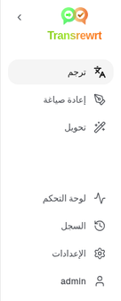
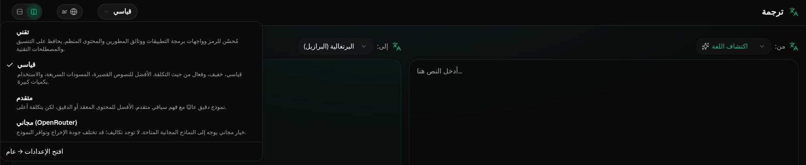
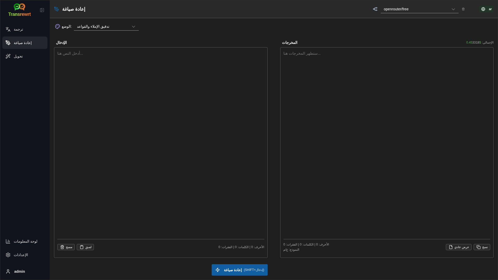
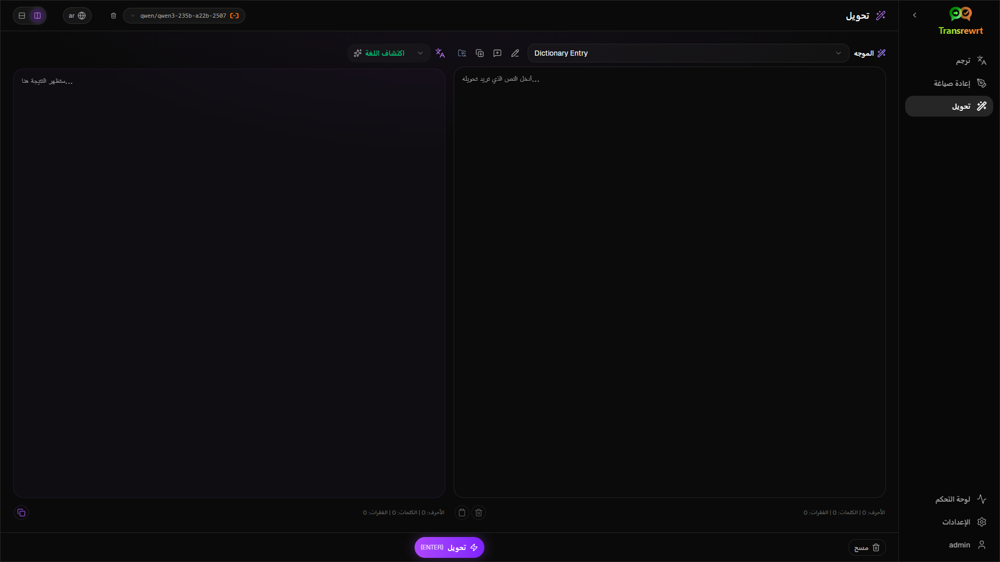
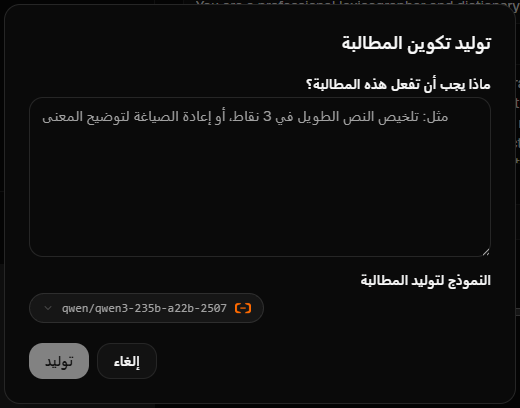
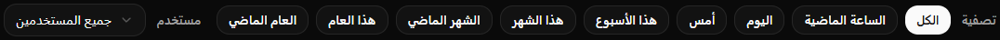
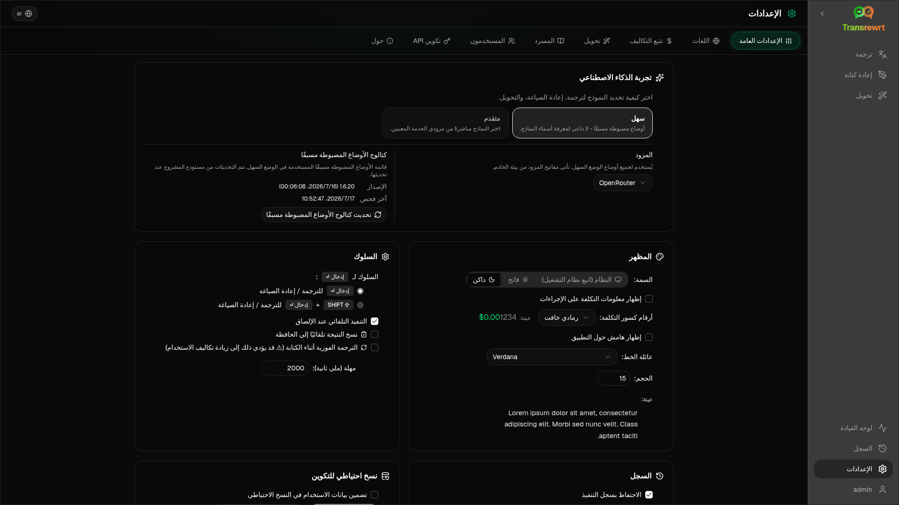

<a id="transrewrt-user-guide"></a>
# دليل المستخدم

<br/>

<a id="introduction"></a>
## مقدمة

يساعدك Transrewrt في التعامل مع النصوص بثلاث طرق رئيسية:

- **ترجم** - تحويل النص من لغة إلى أخرى.
- **إعادة صياغة** - إعادة صياغة النص بأسلوب مختلف، مثل أن يكون أوضح أو أقصر أو أكثر رسمية.
- **تحويل** - معالجة النص باستخدام تعليمات ذكاء اصطناعي مخصصة تُسمى أوامر.

بشكل افتراضي، يعمل التطبيق في وضع **سهل**: حيث تختار **إعدادًا مسبقًا** (مثل مجاني (OpenRouter)، قياسي، متقدم، أو تقني) و**مزودًا** في الإعدادات، دون اختيار معرفات النماذج. قم بالتبديل إلى **متقدم** في [**الإعدادات** > **الإعدادات العامة**](#general-settings) إذا كنت ترغب في قائمة النماذج الكلاسيكية من [**الإعدادات** > **النماذج**](#models).

<br/>

يشرح هذا الدليل كيفية استخدام التطبيق بمجرد تثبيته وتشغيله. لمعرفة خطوات التثبيت، راجع ملف [**README**](README.ar.md) الرئيسي.

<br/>

> ℹ️ **ملاحظة**<br/>
> يتوفر Transrewrt كتطبيق سطح مكتب لنظامي التشغيل Windows وLinux، وكتطبيق ويب قابل للاستضافة الذاتية. يركز هذا الدليل على الاستخدام اليومي للتطبيق. حيثما ينطبق شيء ما على إصدار واحد فقط، يتم تمييزه بوضوح.

<small>**اقرأ باللغات الأخرى:** </small>
<small id="lang-list">[English (GB)](../USER-GUIDE.md) · [Português (Brasil)](./USER-GUIDE.pt-BR.md) · [العربية](./USER-GUIDE.ar.md) · [বাংলা](./USER-GUIDE.bn.md) · [Català](./USER-GUIDE.ca.md) · [中文 (中国大陆)](./USER-GUIDE.zh-CN.md) · [中文 (台灣)](./USER-GUIDE.zh-TW.md) · [Hrvatski](./USER-GUIDE.hr.md) · [Čeština](./USER-GUIDE.cs.md) · [Nederlands](./USER-GUIDE.nl.md) · [English (US)](./USER-GUIDE.en-US.md) · [Tagalog](./USER-GUIDE.tl.md) · [Français](./USER-GUIDE.fr.md) · [Deutsch](./USER-GUIDE.de.md) · [Ελληνικά](./USER-GUIDE.el.md) · [हिन्दी](./USER-GUIDE.hi.md) · [Magyar](./USER-GUIDE.hu.md) · [Italiano](./USER-GUIDE.it.md) · [日本語](./USER-GUIDE.ja.md) · [한국어](./USER-GUIDE.ko.md) · [Bahasa Melayu](./USER-GUIDE.ms.md) · [فارسی](./USER-GUIDE.fa.md) · [Polski](./USER-GUIDE.pl.md) · [Basa Jawa](./USER-GUIDE.jv.md) · [Português](./USER-GUIDE.pt.md) · [ਪੰਜਾਬੀ](./USER-GUIDE.pa.md) · [Română](./USER-GUIDE.ro.md) · [Русский](./USER-GUIDE.ru.md) · [Slovenčina](./USER-GUIDE.sk.md) · [Español](./USER-GUIDE.es.md) · [Kiswahili](./USER-GUIDE.sw.md) · [Svenska](./USER-GUIDE.sv.md) · [తెలుగు](./USER-GUIDE.te.md) · [ไทย](./USER-GUIDE.th.md) · [Türkçe](./USER-GUIDE.tr.md) · [Українська](./USER-GUIDE.uk.md) · [Tiếng Việt](./USER-GUIDE.vi.md)</small>

<small>

> **ملاحظة حول ترجمات واجهة المستخدم والتوثيق:** جميع لغات الواجهة باستثناء الإنجليزية (المملكة المتحدة) الأصلية
> تم ترجمتها باستخدام نماذج الذكاء الاصطناعي؛ قد تكون الصياغة غير دقيقة أو تحتوي على أخطاء.

</small>

<br/>

<!-- START doctoc generated TOC please keep comment here to allow auto update -->
<!-- DON'T EDIT THIS SECTION, INSTEAD RE-RUN doctoc TO UPDATE -->
**جدول المحتويات**

- [قبل أن تبدأ](#before-you-start)
  - [كيفية الحصول على مفتاح واجهة برمجة تطبيقات OpenRouter المجاني (تطبيق سطح المكتب)](#how-to-get-a-free-openrouter-api-key-desktop-app)
- [البدء](#getting-started)
- [الأجزاء الرئيسية للنافذة](#main-parts-of-the-window)
  - [الشريط الجانبي](#sidebar)
  - [شريط الأدوات](#toolbar)
  - [لوحات المدخلات والمخرجات](#input-and-output-panels)
- [الترجمة](#translate)
  - [ترجمة النص](#translate-text)
  - [اختيار اللغة](#language-selection)
  - [إعدادات الترجمة المفيدة](#helpful-translation-settings)
  - [تنقيح الترجمة الخاصة بك](#refining-translation)
- [إعادة كتابة](#rewrite)
- [تحويل](#transform)
  - [تشغيل مطالبة موجودة](#run-an-existing-prompt)
  - [إذا لم يكن لديك أي مطالبات حتى الآن](#if-you-have-no-prompts-yet)
  - [إنشاء مطالبة بسرعة](#create-a-prompt-quickly)
  - [تحرير مطالبة](#edit-a-prompt)
  - [اختبار مطالبة قبل استخدامها](#test-a-prompt-before-using-it)
- [لوحة القيادة](#dashboard)
  - [تصفية البيانات](#filter-the-data)
  - [علامات لوحة القيادة](#dashboard-tabs)
  - [تصدير البيانات](#export-data)
  - [حذف السجلات المخزنة لنموذج](#delete-stored-records-for-a-model)
- [السجل](#history)
  - [تصفية السجل](#filter-the-history)
  - [تصدير بيانات السجل](#export-history-data)
- [الإعدادات](#settings)
  - [الإعدادات العامة](#general-settings)
  - [النماذج](#models)
  - [اللغات](#languages)
  - [تتبع التكاليف](#cost-tracking)
  - [تحويل (علامة الإعدادات)](#transform-settings-tab)
  - [المستخدمون](#users)
  - [تكوين API](#api-config)
  - [حول](#about)
- [المشكلات الشائعة](#common-issues)
  - [التطبيق لا يترجم أو يعيد كتابة أو يحول النص](#the-app-will-not-translate-rewrite-or-transform-text)
  - [قائمة النماذج فارغة](#the-model-list-is-empty)
  - [النتيجة بطيئة جدًا أو مكلفة جدًا](#the-result-is-too-slow-or-too-expensive)
  - [واجهة المستخدم بلغة خاطئة](#the-interface-is-in-the-wrong-language)
  - [النص صغير جدًا أو يصعب قراءته](#the-text-is-too-small-or-hard-to-read)
  - [ملخص لوحة القيادة يبدو فارغًا](#dashboard-summary-looks-empty)
  - [التكلفة تظهر "غير متاحة" أو تبدو خاطئة](#cost-shows-not-available-or-seems-wrong)
  - [إجمالي التكلفة لا يتطابق مع فاتورة المزود الخاصة بي](#total-cost-does-not-match-my-provider-bill)
  - [صفحة السجل مفقودة من الشريط الجانبي](#the-history-page-is-missing-from-the-sidebar)
  - [تطبيق الويب: تم إعادة توجيهي إلى صفحة تسجيل الدخول بشكل غير متوقع](#web-app-redirected-to-the-login-page-unexpectedly)
  - [مسؤول الويب: نسيت أو فقدت كلمة المرور](#web-admin-forgot-or-lost-a-password)
  - [لوحة القيادة لا تظهر بيانات لمستخدمين آخرين (ويب)](#dashboard-shows-no-data-for-other-users-web)
  - [غيرت مطالبة وفقدت التعديلات](#i-changed-a-prompt-and-lost-the-edits)
- [نصائح سريعة](#quick-tips)
- [إخلاء المسؤولية](#disclaimer)
- [الترخيص](#license)

<!-- END doctoc generated TOC please keep comment here to allow auto update -->

<br/><br/>

<a id="before-you-start"></a>
## قبل أن تبدأ

للاستخدام Transrewrt، تحتاج إلى الوصول إلى موفر ذكاء اصطناعي واحد على الأقل. الموفرات المدعومة هي: [أوبن روتر](https://openrouter.ai) (الذي يجمع العديد من النماذج)، أوبن إي آي، أنثروبيك، جوجل جيميني، ديب سيك، غروك، ميسترال، إكس إيه آي، Cerebras، و[أولاما](https://ollama.com) للنماذج المحلية.

لا تحتاج إلى اختيار نموذج مدفوع للبدء. بمجرد إضافة مفتاح API الخاص بك من OpenRouter، يقوم التطبيق تلقائيًا بتمكين خيار **مجاني** مدمج من OpenRouter. وهذا يسمح لك بالبدء فورًا في الترجمة، وإعادة الصياغة، وتحويل النصوص. بدلاً من ذلك، يمكنك أيضًا الحصول على مفتاح API مجاني من Cerebras أو جوجل أو غروك أو ميسترال AI.

بكلمات بسيطة:

- في وضع **سهل**، يتم تعيين **إعداد مسبق** (مجاني (OpenRouter)، قياسي، متقدم، أو تقني) إلى نموذج لمزود **المختار** (OpenRouter، OpenAI، Ollama، وغيرهم). تظهر فقط الإعدادات المسبقة التي لها تعيين للمزود الحالي في شريط الأدوات. تقوم باختيار الإعداد المسبق على ترجم، إعادة صياغة، وتحويل.
- في وضع **متقدم**، يكون **النموذج** هو محرك الذكاء الاصطناعي الذي تختاره مباشرة. تستخدم معرفات النماذج بادئة **المزود** (على سبيل المثال `openrouter/…`، `openai/…`، `ollama/…`).
- مفتاح **API** (أو، بالنسبة لـ Ollama، **عنوان URL الأساسي**) هو الطريقة التي تصل بها التطبيق إلى ذلك المزود.

إذا كنت تستخدم **تطبيق سطح المكتب**، أضف المفاتيح في [**الإعدادات** > **إعدادات واجهة برمجة التطبيقات (API)**](#api-config) لكل مزود تستخدمه. بالنسبة للاستخدام الحصري لـ OpenRouter، انظر [كيفية الحصول على مفتاح API مجاني من OpenRouter](#how-to-get-a-free-openrouter-api-key-desktop-app) أدناه. إذا كنت لا ترغب في استخدام مفتاح API، يمكنك تثبيت Ollama (من [ollama.com](https://ollama.com)) واستخدام النماذج المحلية بدلًا من ذلك، مثل `translategemma:4b`.

إذا كنت تستخدم **النسخة الويب**، يقوم مالك الخادم بتكوين المزودين باستخدام متغيرات البيئة، وبالتالي لا يمكنك إدخال مفاتيح API مباشرة في التطبيق.

<br/>

<a id="how-to-get-a-free-openrouter-api-key-desktop-app"></a>
### كيفية الحصول على مفتاح API مجاني من OpenRouter (تطبيق سطح المكتب)

إذا كنت تستخدم تطبيق سطح المكتب، اتبع الخطوات التالية:

1. انتقل إلى [OpenRouter](https://openrouter.ai) باستخدام متصفح الويب الخاص بك.
2. أنشئ حسابًا أو سجّل الدخول.
3. افتح صفحة [المفاتيح](https://openrouter.ai/keys).
4. انقر فوق الزر لإنشاء مفتاح واجهة برمجة تطبيقات جديد.
5. أعِن المفتاح اسمًا كي يمكنك التعرف عليه لاحقًا.
6. انسخ مفتاح واجهة برمجة التطبيقات الجديد.
7. عُد إلى Transrewrt وافتح **الإعدادات** > **تكوين واجهة برمجة التطبيقات**.
8. الصق المفتاح في حقل **مفتاح واجهة برمجة التطبيقات OpenRouter** (تحت **الإعدادات** > **تكوين واجهة برمجة التطبيقات**).
9. انقر **اختبار مفتاح OpenRouter** للتأكد من أنه يعمل.

<br/><br/>

<a id="getting-started"></a>
## البدء

إذا كانت هذه هي المرة الأولى التي تستخدم فيها Transrewrt، فاتبع الترتيب التالي:

1. افتح التطبيق.
2. اختر **لغة الواجهة** من أيقونة الكرة الأرضية إذا لزم الأمر.
3. إذا كنت تستخدم **تطبيق سطح المكتب**، افتح [**الإعدادات** > **إعدادات واجهة برمجة التطبيقات (API)**](#api-config)، وأضف مفتاح API لمزود واحد على الأقل (مثل OpenRouter)، ثم انقر على **اختبار** للتحقق من أنه يعمل.
4. افتح [**الإعدادات** > **الإعدادات العامة**](#general-settings). في وضع **سهل** (الوضع الافتراضي)، اختر **مزودًا** لديه مفتاح مهيأ. في وضع **متقدم**، افتح [**الإعدادات** > **النماذج**](#models) وأضف نموذجًا أو أكثر إلى **النماذج المحددة**.
5. عند استخدام **ترجم**، اختر **إعدادًا مسبقًا** (سهل) أو **نموذجًا** (متقدم) في شريط الأدوات.
6. افتح [**الإعدادات** > **اللغات**](#languages) واختر **اللغات المفضلة لديك** إذا كنت ترغب في ظهور أكثر اللغات استخدامًا في المقدمة.
7. قم بإجراء ترجمة بسيطة للتأكد من أن كل شيء يعمل بشكل صحيح، ثم جرّب **إعادة الصياغة** و**التحويل**.

هذا الترتيب مهم. فهو يمنع المشكلة الشائعة عند أول استخدام: محاولة تشغيل مهمة قبل أن يتوفر للتطبيق اتصال API فعّال أو اختيار إعداد مسبق/نموذج.

<br/><br/>

<a id="main-parts-of-the-window"></a>
## الأجزاء الرئيسية للنافذة

ينقسم التطبيق إلى ثلاث مناطق رئيسية:

- **الشريط الجانبي** على اليسار.
- **شريط الأدوات** في الأعلى.
- **منطقة العمل** في المنتصف.

<br/>

<a id="sidebar"></a>
### الشريط الجانبي

استخدم الشريط الجانبي للتنقل داخل التطبيق. يمكنك طي الشريط الجانبي للحصول على مساحة أكبر من خلال النقر على الأيقونة المجاورة لشعار التطبيق.

<br/>

<table>
  <tr>
    <td valign="top">
       
    </td>
    <td valign="top">
      <br/><br/>
      <ul>
        <li><strong>ترجمة</strong> يفتح مساحة العمل الخاصة بالترجمة.</li><br/>
        <li><strong>إعادة صياغة</strong> يفتح مساحة العمل الخاصة بإعادة الصياغة.</li><br/>
        <li><strong>تحويل</strong> يفتح مساحة العمل الخاصة بالأوامر المخصصة.</li><br/>
        <li><strong>لوحة المعلومات</strong> تعرض معلومات الاستخدام والتكلفة.</li><br/>
        <li><strong>الإعدادات</strong> يفتح لوحة الإعدادات.</li><br/>
        <li><strong>السجل</strong> يعرض سجل الاستخدام مع نص الإدخال ونص الإخراج</li><br/>
        <li><strong>مستخدم</strong> يعرض اسم المستخدم للمستخدم المسجل (الويب فقط).</li>
      </ul>
    </td>
  </tr>
</table>

<br/>

<a id="toolbar"></a>
### شريط الأدوات

يتغير شريط الأدوات قليلاً حسب مكانك داخل التطبيق.

- على اليسار، يعرض اسم الصفحة الحالية.
- على اليمين، يعرض **محدد الإعداد المسبق أو النموذج** وعناصر التحكم في **لغة الواجهة**.

في وضع **سهل**، يعرض شريط الأدوات **محدد إعداد مسبق** يحتوي على الإعدادات المسبقة المدمجة: **مجاني (OpenRouter)**، **قياسي**، **متقدم**، و**تقني**. تعتمد الإعدادات المسبقة الظاهرة على **المزود** الذي اخترته في [**الإعدادات** > **الإعدادات العامة**](#general-settings) — على سبيل المثال، لا يظهر **مجاني (OpenRouter)** إلا عندما يكون المزود هو OpenRouter. وإذا كان **المزود** هو **Ollama**، فإن شريط الأدوات يسرد النماذج المحلية المثبتة على جهازك بدلًا من الإعدادات المسبقة.

في وضع **متقدم**، يتيح لك **محدد النموذج** اختيار محرك الذكاء الاصطناعي الذي ترغب في استخدامه للمهمة الحالية.



في الوضع المتقدم، قد لا تكون بعض النماذج المجانية متاحة دائمًا — فقد تكون غير متصلة أو وصلت إلى الحد الأقصى للاستخدام. قد يزيل التطبيق هذا النموذج من قائمتك تلقائيًا. للتحكم في النماذج التي تظهر، انتقل إلى [**الإعدادات** > **النماذج**](#models). يمكنك فتح إعدادات النموذج من أيقونة المزود على يسار اسم النموذج في شريط الأدوات.

<br/>

تُغيّر **أيقونة الكرة الأرضية + رمز اللغة** لغة واجهة التطبيق، مثل القوائم والأزرار. ولا **تُغيّر** لغات الترجمة المستخدمة في **ترجمة**.


<br/>

<a id="input-and-output-panels"></a>
### لوحات الإدخال والمخرجات

تستخدم معظم مساحات العمل لوحة **إدخال** على اليسار ولوحة **مخرجات** على اليمين.

كما تعرض كل لوحة ما يلي:

| **الإدخال**                                                          | **المخرجات**                                                                                                                  |
|--------------------------------------------------------------------|-----------------------------------------------------------------------------------------------------------------------------|
| - عدد الأحرف <br/>- عدد الكلمات <br/>- عدد الفقرات   <br/> | - المدة التي استغرقتها المهمة<br/>- **TPS** (الرموز في الثانية)<br/>- عدد الأحرف والكلمات والفقرات<br/>- النموذج المستخدم |

إذا كنت تتساءل عن المصطلحات التقنية:

- **الرمز** يعني جزءًا صغيرًا من النص. يمكنك اعتباره جزءًا من كلمة أو كلمة قصيرة.
- **TPS** يعني عدد هذه القطع النصية التي قام النموذج بمعالجتها في كل ثانية.

<br/>

يمكنك أيضًا مراقبة تكلفة كل عملية (إذا كانت متوفرة) والتكلفة الإجمالية، وذلك بتمكين الخيار `Show cost information on the actions` في [**الإعدادات** > **الإعدادات العامة**](#general-settings).

<br/><br/>

[--------------------------------------------------------------------------------------------------------------------------]: #

<a id="translate"></a>
## ترجمة

استخدم **ترجمة** عندما تريد تحويل نص من لغة إلى أخرى.


<br/>

<a id="translate-text"></a>
### ترجمة النص

1. افتح **ترجم**.
2. اختر لغة في **من**.
3. اختر لغة في **إلى**.
4. اختر إعدادًا مسبقًا (سهل) أو نموذجًا (متقدم) في شريط الأدوات.
5. اكتب النص أو الصقه في حقل **المدخلات**.
6. انقر **ترجمة**.
7. اقرأ النتيجة في حقل **المخرجات**.
8. استخدم زر النسخ إذا أردت نسخ النتيجة.
9. يمكنك تحسين النتيجة اختيارياً باستخدام **إعادة صياغة…** أو بدائل الكلمات — انظر [تحسين ترجمتك](#refining-translation).

<br/>

<a id="language-selection"></a>
### اختيار اللغة

- يمكن أن تكون **من** لغة محددة أو **اكتشاف اللغة**.
- **إلى** هي اللغة التي ترغب في الحصول على النتيجة بها.

تظهر **اللغات المفضلة** المحددة لديك في أعلى القائمة. يمكنك تعيين هذه اللغات في [**الإعدادات** > **اللغات**](#languages).

<br/>

<a id="helpful-translation-settings"></a>
### إعدادات ترجمة مفيدة

في [**الإعدادات** > **الإعدادات العامة**](#general-settings)، يمكنك تغيير طريقة عمل الترجمة:

- **التنفيذ التلقائي عند الإلصاق** يقوم بتشغيل الترجمة بمجرد لصق النص.
- **النسخ التلقائي** ينسخ النتيجة تلقائيًا بعد تشغيل ناجح.
- **ترجمة في الوقت الحقيقي أثناء الكتابة** (⚠️ قد يزيد ذلك من تكاليف الاستخدام) يقوم بتشغيل الترجمات أثناء الكتابة.
- **مهلة (مللي ثانية)** تتحكم في المدة التي تنتظرها التطبيق قبل تشغيل ترجمة في الوقت الحقيقي.
- **السلوك لـ ENTER** يختار ما إذا كان `Enter` يقوم بتشغيل المهمة أو إدراج سطر جديد:
  - **Enter** يقوم بتشغيل الترجمة أو إعادة الكتابة (افتراضي).
  - **Shift + Enter** يقوم بتشغيل الترجمة أو إعادة الكتابة؛ بينما **Enter** العادي يقوم بإدراج سطر جديد.

<br/>

<a id="refining-translation"></a>
### تنقيح الترجمة الخاصة بك

بعد ترجمة ناجحة، تظهر **إعادة صياغة…** وقائمة الإصدارات في رأس الإخراج، بجوار محدد لغة **إلى:**. يمكنك تحسين النتيجة هناك:

1. **إعادة صياغة…** — مع عدم تحديد أي نص في الإخراج، احصل على ترجمة كاملة أخرى لنفس الإدخال بصياغة مختلفة. يتلقى النموذج كل إصدار لديك بالفعل بحيث يمكن أن تختلف الصياغة الجديدة عن جميعها. يمكنك تخزين ما يصل إلى **خمسة** إصدارات والتبديل بينها في قائمة الإصدارات. مع تحديد نص، تفتح **إعادة صياغة…** بدائل الكلمات بالقرب من التحديد (نفس الشيء كما في النقر بزر الماوس الأيمن). بدون تحديد، يتم تعطيل **إعادة صياغة…** بمجرد الوصول إلى خمسة إصدارات؛ مع تحديد، لا تزال تعمل عند خمسة إصدارات (بدائل الكلمات فقط، تحديث الإصدار 5). أثناء تشغيل إعادة الصياغة الكاملة، انقر على **إيقاف الترجمة** للإلغاء؛ يعود الإخراج إلى الإصدار الذي كان نشطاً عندما بدأت إعادة الصياغة.
2. **بدائل الكلمات** — حدد كلمة أو أكثر أو عبارة قصيرة في الإخراج (إذا قمت بتحديد جزء فقط من كلمة، يقوم التطبيق بتوسيع التحديد إلى كلمات كاملة)، ثم انقر بزر الماوس الأيمن أو انقر على **إعادة صياغة…**. تظهر قائمة قصيرة من البدائل بالقرب من التحديد؛ انقر على أحدها لاستبداله. قد يحل كل خيار محل نطاق أوسع قليلاً من تحديدك (على سبيل المثال، حرف جر أو أداة مجاورة) بحيث تبقى الجملة نحوية. إذا كان لديك أقل من خمسة إصدارات، يتم حفظ الإخراج المعدل كإصدار جديد؛ عند خمسة إصدارات، يتم تحديث فقط **الإصدار 5**. النقر بزر الماوس الأيمن بدون تحديد لا يفعل شيئاً. اضغط على **Esc** أو انقر خارج القائمة للإلغاء دون تغيير الإخراج.
3. **التكاليف** — كل **إعادة صياغة…** كاملة (بدون تحديد) وكل طلب بديل للكلمات يستخدم النموذج مرة أخرى وقد يضيف إلى تكلفة الاستخدام (نفس الشيء كما في عملية الترجمة العادية).

[--------------------------------------------------------------------------------------------------------------------------]: #

<a id="rewrite"></a>
## إعادة صياغة

استخدم **إعادة صياغة** عندما ترغب في تحسين الصياغة دون تغيير المعنى الرئيسي.



هذا مفيد في الحالات التالية:

- التحقق من الإملاء والنحو (**التحقق من الإملاء والنحو**)
- تحسين وضوح النص (**تحسين الوضوح**)
- إنشاء صياغات مختلفة متعددة في تشغيل واحد (**إصدارات بديلة**)
- جعل النص أكثر رسمية أو أقل رسمية (**جعله رسميًا** / **جعله غير رسمي**)
- تقصير أو توسيع النص (**تقصير** / **توسيع**)
- جعل النص يبدو أكثر تقنية (**اجعله تقنيًا**)

<br/>

> 💡 **نصيحة**<br/>
> عند استخدامك للوضع "**تدقيق الإملاء والقواعد**"، تظهر مفتاح **عرض التغييرات** في لوحة المخرجات (بجانب **نسخ**).
> قم بتشغيله أو إيقافه لعرض أو إخفاء التصويبات المحددة التي تم تطبيقها على نصك.

<br/><br/>

[--------------------------------------------------------------------------------------------------------------------------]: #

<a id="transform"></a>
## تحويل

استخدم **تحويل** عندما ترغب في أن يتبع الذكاء الاصطناعي مجموعة تعليمات مخصصة.



هذا هو الجزء الأكثر مرونة في التطبيق. يمكنك استخدامه في مهام مثل:

- تلخيص الملاحظات
- تحويل نص خام إلى بريد إلكتروني منسق
- استخلاص النقاط الرئيسية
- تحويل النص إلى تنسيق محدد
- أي نشاط مخصص آخر مع النص المدخل

<br/>

<a id="run-an-existing-prompt"></a>
### تشغيل أمر موجود

1. افتح **تحويل**.
2. اختر مطالبة من قائمة المطالبات.
3. إذا ظهرت خانة لغة **من**، اختر لغة إذا كنت ترغب في ذلك.
4. اكتب أو ألصق النص في **إدخال**.
5. انقر على **تحويل**.
6. اقرأ النتيجة في **المخرج**.

<br/>

<a id="if-you-have-no-prompts-yet"></a>
### إذا لم تكن لديك أوامر بعد

إذا كانت قائمة الأوامر فارغة، انقر فوق **تحميل أوامر نموذجية** في مساحة العمل التحويلية. يتوفر هذا التحكم نفسه دائمًا في [**الإعدادات** > **تحويل**](#transform-settings) في صف التصدير/الاستيراد. كلا الخيارين يضيفان أمثلة مضمنة لكي تبدأ بسرعة.

<br/>

> ℹ️ **ملاحظة**<br/>
> تُقدَّم الأوامر النموذجية باللغة الإنجليزية. بعد تحميلها، يمكنك تعديل أمر واستخدام **ترجم الموجه** لترجمته إلى لغتك.

<br/>

<a id="create-a-prompt-quickly"></a>
### إنشاء أمر بسرعة

أسرع طريقة لإنشاء أمر هي:

1. انقر على **موجه جديد**.
2. انقر على **توليد الموجه**.
3. وصف ما تريده من الموجه أن يقوم به.
4. اختر إعدادًا مسبقًا (سهل) أو نموذجًا (متقدم).
5. اترك التطبيق ينشئ مسودة لك.
6. راجع المسودة ثم انقر على **حفظ**.



<br/>

<a id="edit-a-prompt"></a>
### تعديل أمر

عند إنشاء أمر أو تعديله، يظهر المحرر على اليسار وتظهر منطقة اختبار على اليمين.


تتضمن الحقول الرئيسية ما يلي:

- **اسم الموجه**: الاسم المعروض في قائمة الموجهات.
- **تعليمات الموجه (اختياري)**: تلميح قصير يُعرض للمستخدم عند تشغيل الموجه.
- **دور النموذج**: الدور العام المعين للذكاء الاصطناعي، مثل 'أنت مساعد مفيد.'
- **تعليمات النموذج (واحدة لكل سطر)**: القواعد المحددة التي تريد من الذكاء الاصطناعي اتباعها.
- **وصف المخرجات (مثل: تحويل، تلخيص، إلخ.)**: كلمة قصيرة تصف النتيجة.
- **درجة الحرارة (0.0 → 1.0)**: كيف سيتصرف النموذج؛ انظر أدناه.
- **اطلب اللغة المستهدفة**: يضيف محدد لغة عند تشغيل المطالبة.
إذا كان المصطلح الفني **درجة الحرارة** جديدًا عليك، فكر فيه على هذا النحو:

- تؤدي **درجة الحرارة المنخفضة** إلى نتائج أكثر استقرارًا وقابلية للتنبؤ.
- تؤدي **درجة الحرارة المرتفعة** إلى تنوع وإبداع أكبر.

يمكنك أيضًا استخدام:

- `Generate prompt` لإنشاء مسودة جديدة من وصف بسيط
- `Improve prompt` لتحسين أمر توجيهي موجود
- `Translate prompt` لترجمة حقول الأمر التوجيهي

<br/>

> ⚠️ **تحذير**<br/>
> انقر على `Save` قبل أن تنقر على `Back to Run`. إذا عدت للخلف دون حفظ، فستُفقد تغييراتك.

<br/>

<a id="test-a-prompt-before-using-it"></a>
### اختبر الأمر قبل استخدامه

تسمح لك لوحة الاختبار على اليمين بتجربة أمرك باستخدام نص تجريبي قبل استخدامه في العمل اليومي.

هذا مفيد عندما:

- تقوم بإنشاء أمر جديد
- تقوم بمقارنة نسختين من أمر
- ترغب في التحقق من النبرة أو الطول أو تنسيق المخرجات

<br/>

> ℹ️ **ملاحظة**<br/>
> يمكنك تصدير واستيراد الأوامر المحفوظة في [**الإعدادات** > **تحويل**](#transform-settings).

عند استخدامك لـ **توليد الموجه** أو **تحسين الموجه** أو **ترجم الأمر** في محرر الموجهات، يعرض وضع **سهل** نفس محدد الإعدادات المسبقة الموجود في الترجمة وإعادة الصياغة؛ بينما يستخدم وضع **متقدم** قائمة النماذج.

<br/><br/>

[--------------------------------------------------------------------------------------------------------------------------]: #

<a id="dashboard"></a>
## لوحة المعلومات

استخدم **لوحة المعلومات** لمعرفة مدى استخدامك للتطبيق وما تكلفة ذلك (بالنسبة للنماذج المدفوعة).


<br/>

> ℹ️ **ملاحظة**<br/>
> إذا كنت تستخدم فقط النماذج **المجانية**، فقد تكون كميات **التكلفة** صفرًا وقد تبدو مؤشرات الأداء التي تركز على التكلفة فارغة. لا تزال علامة التبويب **ملخص** تعرض عدد الطلبات للترجمة، وإعادة الصياغة، والتحويل عندما يكون لديك نشاط في الفترة المحددة.

<br/>

<a id="filter-the-data"></a>
### تصفية البيانات

استخدم أزرار التصفية في الأعلى لتغيير نطاق الوقت.



<br/>

> ℹ️ **ملاحظة**<br/>
> يكون عامل التصفية **مستخدم** مرئيًا للمشرفين فقط في النسخة الويب. لن يرى المستخدمون العاديون هذا العامل، ولا يكون متاحًا في تطبيق سطح المكتب.

<br/>

<a id="dashboard-tabs"></a>
### علامات تبويب لوحة المعلومات

- تعرض علامة التبويب **ملخص** بطاقات مؤشرات الأداء الرئيسية: التكلفة الإجمالية، النماذج المستخدمة، عدد الطلبات حسب الوضع والتكلفة (مع نسبة من إجمالي الطلبات)، متوسط التكلفة لكل طلب، متوسط TPS، وأفضل ثلاثة نماذج حسب عدد الطلبات.
- تعرض علامة التبويب **حسب النموذج** كل نموذج مع إجمالي الطلبات، التكلفة الإجمالية، ومتوسط TPS؛ قم بتوسيع الصف للحصول على تفصيل حسب الترجمة، إعادة الصياغة، والتحويل.
- تعرض علامة التبويب **جميع الطلبات** سجل الطلبات الكامل (مُجزأ في التصاميم العريضة، وبطاقات في الشاشات الضيقة) وتتيح لك تصديره.

<br/>

<a id="export-data"></a>
### تصدير البيانات

يمكن لجداول لوحة المعلومات تصدير البيانات بتنسيقات:

- **.JSON**
- **CSV**
- **XLSX**

هذا مفيد إذا كنت ترغب في مراجعة النشاط خارج التطبيق أو مشاركة تقرير.

<br/>

<a id="delete-stored-records-for-a-model"></a>
### حذف السجلات المخزنة لنموذج

في علامة التبويب **حسب النموذج** أو **جميع الطلبات**، يمكنك إزالة السجلات المخزنة لنموذج بالنقر على أيقونة "سلة المهملات".

> ⚠️ **تحذير**<br/>
> لا يمكن التراجع عن حذف السجلات المخزنة. استخدم هذا الخيار فقط إذا كنت متأكدًا من أنك لم تعد بحاجة إلى هذا السجل.

لحذف جميع البيانات أو إزالة السجلات بناءً على عمرها، انتقل إلى [**الإعدادات** > **تتبع التكلفة**](#cost-tracking). هناك ستجد خيارات لحذف جميع البيانات المخزنة أو فقط البيانات الأقدم من تاريخ معين.

<br/><br/>

[--------------------------------------------------------------------------------------------------------------------------]: #

<a id="history"></a>
## السجل

انقر على **السجل** لعرض سجل إجراءاتك داخل **Transrewrt**، بما في ذلك الإدخال والمخرجات لكل عملية.


<br/>

<a id="filter-the-history"></a>
### تصفية السجل

يستخدم **السجل** نفس عوامل تصفية النطاق الزمني الموجودة في صفحة **لوحة التحكم**.


<br/>

> ℹ️ **ملاحظة**<br/>
> في تطبيق **الويب**، يرى الجميع (بما في ذلك المسؤولون) سجل التنفيذ الخاص بهم فقط. يعمل عامل التصفية **مستخدم** في **لوحة التحكم** على تمكين المسؤولين من مراجعة الاستخدام والتكلفة عبر الحسابات؛ ولا ينطبق هذا على **السجل**.

<br/>

<a id="export-history-data"></a>
###  تصدير بيانات السجل

يمكن لصفحة السجل تصدير البيانات المصفاة بتنسيقات:

- **.JSON**
- **CSV**
- **XLSX**

هذا مفيد إذا كنت ترغب في مراجعة النشاط خارج التطبيق أو مشاركة تقرير.

<br/><br/>

[--------------------------------------------------------------------------------------------------------------------------]: #

<a id="settings"></a>
## الإعدادات

افتح **الإعدادات** من الشريط الجانبي لتخصيص طريقة عمل التطبيق.

تعتمد علامات التبويب المتاحة على النظام الأساسي ودورك:

| علامة التبويب | سطح المكتب | الويب (المسؤول) | الويب (المستخدم العادي) | ملاحظات                                        |
  |------------------|:-------:|:-----------:|:------------------:|----------------------------------------------|
  | الإعدادات العامة |   نعم   |     نعم     |        نعم         | تشمل **تجربة الذكاء الاصطناعي** (سهل / متقدم) |
  | النماذج           |   نعم   |     نعم     |        نعم         | فقط عندما تكون **تجربة الذكاء الاصطناعي** هي **متقدم** |
  | اللغات         |   نعم   |     نعم     |        نعم         | |
  | تتبع التكلفة     |   نعم   |     نعم     |         -          | |
  | التحويل         |   نعم   |     نعم     |        نعم         | استيراد/تصدير جماعي لأوامر التحويل |
  | المستخدمون             |    -    |     نعم     |         -          | |
  | إعدادات واجهة برمجة التطبيقات (API)        |   نعم   |     نعم     |         -          | |
  | حول             |   نعم   |     نعم     |        نعم         | |

في وضع **سهل**، يتم اختيار النموذج من خلال الإعدادات المسبقة في شريط الأدوات و**المزود** في الإعدادات العامة؛ ويتم إخفاء علامة التبويب **النماذج**.

<br/>

> ℹ️ **ملاحظة**<br/>
> في النسخة الويب، يمتلك كل مستخدم تكوينه الخاص. يتم تخزين الإعدادات مثل تجربة الذكاء الاصطناعي، المزود، النماذج أو الإعدادات المسبقة المحددة، اللغات، الخيارات العامة، والأوامر التحويلية لكل مستخدم على حدة. ولا تؤثر التغييرات التي تقوم بها على المستخدمين الآخرين.

<br/>

[--------------------------------------------------------------------------------------------------------------------------]: #

<a id="general-settings"></a>
### الإعدادات العامة

استخدم **الإعدادات العامة** للتحكم في سلوك الكتابة، ما إذا كانت تفاصيل التنفيذ محفوظة في **السجل**، المظهر، وكيفية اختيار الذكاء الاصطناعي للترجمة، إعادة الصياغة، والتحويل.

**تجربة الذكاء الاصطناعي**

- **سهل** (الافتراضي): اختر **مزودًا** (OpenRouter، OpenAI، Anthropic، Google Gemini، DeepSeek، Groq، Mistral، xAI، Cerebras، أو Ollama). يستخدم المزودون السحابيون الإعدادات المسبقة المدمجة في شريط الأدوات. أما **Ollama** فيسرد النماذج المثبتة على جهازك بدلًا من الإعدادات المسبقة. في الوضع السهل، تعرض **كتالوج الإعدادات المسبقة** إصدار الكتالوج ووقت آخر تحديث؛ انقر على **تحديث كتالوج الإعدادات المسبقة** لجلب أحدث قائمة إعدادات مسبقة من مستودع المشروع (كما يقوم التطبيق بالتحقق بشكل دوري في الخلفية).
- **متقدم**: اختر نماذج فردية في شريط الأدوات؛ وقم بإدارة القائمة من خلال [**الإعدادات** > **النماذج**](#models).

**المظهر**

- يُستخدم **السمة** للتبديل بين المظهر الفاتح والداكن وسمة النظام.
- يتحكم **إظهار معلومات التكلفة على الإجراءات** في عرض تكلفة كل عملية (إن وُجدت) والتكلفة الإجمالية على لوحات مخرجات الترجمة وإعادة الصياغة والتحويل.
- يُعدّل **أرقام الكسور العشرية للتكلفة** طريقة عرض الكسور العشرية للتكلفة.
- **للويب فقط:** يُضيف **إظهار هامش حول التطبيق** مساحة إضافية حول الواجهة.
- يُغيّر **عائلة الخط** خط الكتابة في لوحات النصوص.
- يُغيّر **الحجم** حجم الخط.

**السلوك**

- **السلوك لـ ENTER** يختار ما إذا كان `Enter` يقوم بتشغيل المهمة أو إدراج سطر جديد.
- **التنفيذ التلقائي عند الإلصاق** يبدأ الترجمة بمجرد لصق النص.
- **النسخ التلقائي** ينسخ النتائج الناجحة تلقائيًا.
- **ترجمة في الوقت الحقيقي أثناء الكتابة** (⚠️ قد يزيد ذلك من تكاليف الاستخدام) يترجم أثناء الكتابة.
- **المهلة (بالمللي ثانية)** تحدد مدة الانتظار للترجمة الفورية.

**السجل**

- يتحكم الخيار **الاحتفاظ بتاريخ التنفيذ** في ما إذا كانت كل عملية ترجمة أو إعادة صياغة أو تحويل تخزن **المدخل والنص الناتج** لعرضها في الشريط الجانبي [**السجل**](#history). عند إيقافه، يُطلب منك التأكيد؛ وإذا أكدت، يتم إزالة نص السجل المخزن من قاعدة البيانات. إذا ظهرت التسمية *معطل بواسطة المشرف*، فهذا يعني أن التثبيت الخاص بك يحتوي على `HISTORY_DISABLED` مضبوطًا في البيئة (انظر [README](README.ar.md#configuration-and-environment))؛ ولا يمكنك إعادة تفعيل السجل من واجهة المستخدم.
- يتيح لك الخيار **حذف بيانات السجل** إزالة النصوص المخزنة حسب العمر (مثلاً الأقدم من بضعة أشهر، أو **جميع البيانات (مسح)**) باستخدام **حذف البيانات**. وهذا يؤثر فقط على نصوص التنفيذ المحفوظة لعرض **السجل**؛ ولا يُزيل **إجماليات التكلفة أو الاستخدام**. ولإزالة أو تقليص بيانات **التكلفة**، استخدم [**الإعدادات** > **تتبع التكلفة**](#cost-tracking).

**نسخ احتياطي للتكوين** (للمسؤولين عن تطبيقات سطح المكتب والويب فقط)
- **تضمين بيانات الاستخدام في النسخ الاحتياطي** - عند التمكين، يحتوي ملف ZIP أيضًا على تاريخ التنفيذ وبيانات استدعاء API.
- **نسخ احتياطي للتكوين** - ينشئ ملف ZIP واحد (`transrewrt-config-backup-YYYY-MM-DD_HHMMSS.zip` بالتوقيت المحلي) مع `config.json`, `state.json`, مفتاح تشفير اختياري، المستخدمون، التفضيلات، المطالبات المخصصة، وبيانات الاستخدام إذا اخترت ذلك. بعد النسخ الاحتياطي الناجح، يظهر التأكيد اسم الملف المحفوظ.
- **استعادة من النسخة الاحتياطية** - يفتح **مربع حوار التأكيد أولاً**. اختر ملف ZIP الاحتياطي داخل الحوار (**استعراض** / محدد الملفات أو السحب والإفلات حيثما كان مدعومًا)، ثم راجع الخيارات:
  - **استعادة بيانات الاستخدام** - استيراد الاستخدام/التاريخ من ملف ZIP عندما تم نسخه احتياطيًا مع تضمين الاستخدام؛ اتركه غير مفعل إذا كنت ترغب فقط في الإعدادات والمطالبات.
  - **مسح البيانات القديمة للاستخدام قبل الاستعادة** - إزالة الاستخدام/التاريخ الحالي في هذا التثبيت قبل تطبيق النسخة الاحتياطية (اختياري؛ استخدمه عندما تريد استبدالًا نظيفًا).
يمكن استعادة النسخ الاحتياطية التي تم إنشاؤها في إصدار الويب أو سطح المكتب في الآخر. عند استعادة نسخة احتياطية لسطح المكتب في إصدار الويب، سيتم استعادة البيانات إلى المستخدم المسؤول.

<br/>

<a id="models"></a>
### النماذج

تظهر هذه التبويب فقط عندما يكون خيار **تجربة الذكاء الاصطناعي** مضبوطًا على **متقدم** في [**الإعدادات العامة**](#general-settings). استخدم **الإعدادات** > **النماذج** لاختيار النماذج التي تظهر في شريط الأدوات.



تحتوي الصفحة على قائمتين:

- **النماذج المتاحة** على اليسار  
- **النماذج المحددة** على اليمين

تشمل عناصر التحكم المفيدة ما يلي:

- **البحث عن النماذج...** للعثور على نموذج حسب الاسم
- شرائح **المزوّد** لتضييق القائمة إلى محرك واحد (OpenRouter، OpenAI، Ollama، …)
- **النماذج المجانية فقط** لإظهار النماذج المجانية فقط
- **تحديث** لإعادة تحميل القائمة
- **توسيع الكل** و**طيّ الكل** عند ترتيب القائمة حسب المزوّد

تحتوي معرفات النماذج على البادئة الخاصة بالموفر (مثلاً `openrouter/…` مقابل `openai/…`). وتُظهر الشارات مثل **أوبن إي آي (أوبن روتر)** مقابل **أوبن إي آي (مباشر)** كيفية توجيه حركة المرور.

> ℹ️ **ملاحظة**<br/>  
> **OpenRouter Body Builder** (`openrouter/bodybuilder`) هو نموذج توجيه، وليس نموذج دردشة عام: ردّه هو ملف .JSON يصف هيكل طلبات واجهة برمجة تطبيقات OpenRouter (مثلاً مصفوفة `requests` تحتوي على `model` و `messages`). إذا استخدمته في **ترجمة** أو **إعادة صياغة** أو **تحويل**، فستعرض لوحة المخرجات هذا الملف .JSON بدلاً من النص النهائي. اختر نموذج نص عادي لهذه المهام. راجع [صفحة نموذج Body Builder](https://openrouter.ai/openrouter/bodybuilder) على OpenRouter.

الإجراءات:

- لإضافة نموذج، انقر على **إضافة** أو في أي مكان ضمن الإدخال.

- لإزالة نموذج، انقر على **X** بجانبه في **النماذج المحددة** أو على **محدد** في إدخال النموذج ضمن النماذج المتاحة.

- لمسح القائمة، انقر على **إلغاء تحديد الكل**. سيظل النموذج المجاني المطلوب في القائمة.

<br/>

> ℹ️ **ملاحظة**<br/>  
> إذا كنت لا ترغب في إضافة رصيد إلى OpenRouter مباشرة، ابدأ بتمكين **المجانية فقط** واختر النماذج المجانية (لا يُطلب بطاقة ائتمان). يمكنك أيضًا استخدام أولاما لتشغيل النماذج محليًا دون الحاجة إلى مفتاح API.

<br/>

<a id="languages"></a>  
### اللغات

استخدم **الإعدادات** > **اللغات** لتنظيم قوائم اللغات المستخدمة في التطبيق.

- **اللغات الشائعة** تكون مثبتة بالقرب من أعلى قوائم اللغات في **الترجمة** و **التحويل**.  
- **لغة مخصصة** تتيح لك إضافة لغة غير موجودة في القائمة المدمجة.

إذا أضفت لغة مخصصة، فستظهر في منتقيات اللغة إلى جانب الخيارات المدمجة.

<br/>

<a id="cost-tracking"></a>  
### تتبع التكلفة

استخدم **الإعدادات** > **تتبع التكلفة** لإدارة معلومات التكلفة.

- **التكلفة الإجمالية** تعرض المجموع التراكمي.
- **نسخ القيمة** ينسخ المجموع إلى الحافظة.
- **إعادة تعيين التكلفة** يعيد تعيين المجموع المخزن إلى الصفر.
- **مزامنة مع استخدام مفتاح API** يجعل المجموع مطابقًا للاستخدام المذكور في حساب OpenRouter الخاص بك (متوفر فقط لـ OpenRouter).
- **استخدام مفتاح API** تعرض تفاصيل استخدام OpenRouter، إن وُجدت.
- **حذف بيانات التكلفة** يزيل جميع البيانات، أو فقط الإدخالات الأقدم من تاريخ محدد.

**تتبع التكلفة:** عند استخدامك لنماذج OpenRouter، يعرض التطبيق الاستخدام والإنفاق الفعليين استنادًا إلى معلومات التكلفة من OpenRouter. بالنسبة لجميع موفري الخدمة الآخرين، يقوم التطبيق بتقدير التكاليف باستخدام الأسعار المنشورة من قبل OpenRouter، وإذا لم تكن الأسعار متوفرة، فقد يكون التقدير صفرًا.

<br/>

> ℹ️ **ملاحظة**<br/>  
>  **جميع أرقام التكلفة هي تقديرات لأغراضك المرجعية فقط، وليست بيانات فوترة رسمية.**

<br/>

> ⚠️ **تحذير**<br/>
> لا يمكن التراجع عن حذف البيانات. قبل الحذف، تأكد من عمل نسخة احتياطية من بياناتك أو تصديرها عبر [**السجل**](#history)
> أو [**لوحة المعلومات** > **جميع الطلبات**](#dashboard-tabs)، وإلا سيتم فقدانها بشكل دائم.
> وسيتم أيضًا حذف كل سجلات الإدخال/المخرجات المتعلقة بكل إدخال لطلب API.

<br/>

<a id="transform-settings"></a>
### تحويل (تبويب الإعدادات)

استخدم **الإعدادات** > **تحويل** لإدارة الموجهات بشكل جماعي.

يمكنك:

- مراجعة التعليمات المحفوظة لديك
- حذف التعليمات
- استيراد التعليمات من ملف
- تصدير التعليمات للنسخ الاحتياطي أو المشاركة
- تحميل عينات من التعليمات إلى قائمة التعليمات

<br/>

<a id="users"></a>
### المستخدمون

استخدم **المستخدمين** لإدارة حسابات المستخدمين في النسخة الويب. يمكنك إضافة مستخدمين، وتحديث بياناتهم، وإعادة تعيين كلمات المرور، وحذف الحسابات.

<br/>

<a id="api-config"></a>
### إعدادات API

موفرو الخدمة المدعومون هم: أوبن روتر، أوبن إي آي، أنثروبيك، جوجل جيميني، ديب سيك، غروك، ميسترال، إكس إيه آي، Cerebras، و**أولاما** (النماذج المحلية عبر رابط أساسي). تحتاج فقط إلى تهيئة الموفرين الذين تستخدمهم.

**التطبيق الويب: للمشرف فقط**

تتم تهيئة مفاتيح الواجهة البرمجية (API) من خلال متغيرات بيئة النظام أو Docker - ولا يتم إدخالها في واجهة الويب. تعرض هذه الصفحة موفري الخدمة الذين تم تهيئة مفتاح لهم، وتتيح لك اختبار كل مزود بالنقر على زر `Test`.

<br/>

> ℹ️ **ملاحظة**<br/>
> لتغيير مفتاح API، قم بتحديث متغير البيئة في إعدادات النظام أو دوكر وأعد تشغيل الخادم أو الحاوية.

<br/>

> ℹ️ **ملاحظة**<br/>
> يمكن أن تتضمن **النسخ الاحتياطي للتكوين** (انظر [**الإعدادات العامة** → النسخ الاحتياطي للتكوين](#general-settings)) مفاتيح المزود **المحسّنة** داخل ملف `config.json` المضغوط. لا يقوم استعادة هذا الملف المضغوط **بنسخ** تلك المفاتيح مرة أخرى إلى ملف التكوين المحفوظ على الخادم — ما تزال المفاتيح الفعالة تأتي من بيئة النظام وحالة الملف الحالية كما هو موضح هناك.

<br/>

**التطبيق المكتبي**

استخدم **إعدادات API** لتخزين مفاتيح API لكل مزود تستخدمه. بالنسبة لأولاما، أدخل **الرابط الأساسي** بدلاً من مفتاح API.

<br/>

> 💡 **نصيحة** <br/>
> إذا كنت لا ترغب في استخدام مفتاح API أو دفع مقابل الاستخدام، يمكنك [تنزيل أولاما](https://ollama.com) وتشغيل النماذج (مثل `translategemma:4b`) محليًا على جهازك مجانًا. بديلًا، يمكنك إنشاء حساب مجاني في أوبن روتر (بدون الحاجة إلى بطاقة ائتمان) لاستخدام نماذجهم المجانية، أو الحصول على مفتاح API مجاني من Cerebras أو جوجل أو غروك أو ميسترال AI.

<br/>

- أضف فقط الموفرين الذين تحتاجهم. في **الإعدادات** > **النماذج**، يبدأ كل معرّف نموذج باسم المزود (على سبيل المثال `openrouter/openrouter/free`، `openai/gpt-4o`، `ollama/llama3`).

لإضافة مفتاح واجهة برمجة تطبيقات (API)، أدخل القيمة في حقل النص ثم انقر على `Save`. لاستبدال مفتاح موجود، انقر على `Edit`. للتحقق من أن المفتاح يعمل، انقر على `Test`. بالنسبة إلى عنوان URL الأساسي لـ Ollama، انقر دائمًا على `Test` للتحقق من الاتصال.

<br/>

> ℹ️ **ملاحظة**<br/>
> لا يمكنك رؤية القيمة الحالية لمفتاح واجهة برمجة التطبيقات (API). يمكنك فقط استبداله باستخدام زر `Edit`.
> يتم تخزين مفاتيح واجهة برمجة التطبيقات (API) مشفرة في التهيئة.

<br/>

<a id="about"></a>
### حول

تُظهر علامة التبويب **حول** ما يلي:

- اسم التطبيق والشعار
- رقم الإصدار وتاريخ البناء
- معلومات الترخيص والحقوق، مع رابط لفتح **إشعارات الطرف الثالث**
- رابط إلى مستودع المشروع

<br/><br/>

<a id="common-issues"></a>
## المشكلات الشائعة

إذا لم يعمل شيء ما كما هو متوقع، فتحقق أولًا من النقاط التالية.

<br/>

<a id="the-app-will-not-translate-rewrite-or-transform-text"></a>
### لا يقوم التطبيق بترجمة النص أو إعادة صياغته أو تحويله

تحقق من النقاط التالية:

- قمت باختيار **إعداد مسبق** (سهل) أو **نموذج** (متقدم) في شريط الأدوات
- في وضع **سهل**، تحتوي [**الإعدادات** > **الإعدادات العامة**](#general-settings) على **مزود** مع مفتاح يعمل (أو عنوان URL لـ Ollama) وعلى الأقل إعداد مسبق واحد لهذا المزود
- في وضع **متقدم**، يوجد نموذج واحد على الأقل مدرج في [**الإعدادات** > **النماذج**](#models)
- إعداد مفتاح API يعمل بشكل صحيح

إذا كنت تستخدم تطبيق سطح المكتب:

1. افتح [**الإعدادات** > **إعدادات API**](#api-config).
2. تحقق من حفظ مفتاح API واحد على الأقل.
3. انقر فوق **اختبار** بجانب الموفر لتأكيد أن المفتاح يعمل.

<br/>

<a id="the-model-list-is-empty"></a>
### قائمة النماذج فارغة

في الوضع **سهل**، افتح [**الإعدادات** > **الإعدادات العامة**](#general-settings)، وتأكد من ضبط **المزود**، ثم أضف أو اختبر المفاتيح في [**إعدادات واجهة برمجة التطبيقات (API)**](#api-config) (على سطح المكتب) أو اطلب من مسؤولك (على الويب). بالنسبة إلى **Ollama**، قم بتشغيل **اختبار** على عنوان URL الأساسي وتأكد من تثبيت النماذج محليًا.

في الوضع **متقدم**، افتح [**الإعدادات** > **النماذج**](#models) وانقر على **تحديث**. إذا لزم الأمر، ابحث عن نموذج، وفعّل **المجانية فقط**، ثم أضف النماذج إلى **النماذج المحددة**.

<br/>

<a id="the-result-is-too-slow-or-too-expensive"></a>
### النتيجة بطيئة جدًا أو مكلفة جدًا

جرب واحدة أو أكثر من الطرق التالية:

- اختر إعداد مسبق مختلف (سهل) أو نموذج (متقدم)
- استخدم إدخالًا أقصر
- قم بإيقاف **ترجمة في الوقت الحقيقي أثناء الكتابة** في [**الإعدادات** > **الإعدادات العامة**](#general-settings)
- استخدم نماذج مجانية للمهام البسيطة (انظر [النماذج](#models))
<br/>

<a id="the-interface-is-in-the-wrong-language"></a>
### الواجهة بلغة خاطئة

انقر على أيقونة الكرة الأرضية في [شريط الأدوات](#toolbar) واختر **لغة الواجهة** المفضلة لديك.

<br/>

<a id="the-text-is-too-small-or-hard-to-read"></a>
### النص صغير جدًا أو يصعب قراءته

افتح [**الإعدادات** > **الإعدادات العامة**](#general-settings) وقم بتغيير:

- **عائلة الخط**
- **الحجم**

<br/>

<a id="dashboard-summary-looks-empty"></a>
### لوحة التحكم - يبدو الملخص فارغًا

هذا أمر طبيعي إذا:

- أنت تستخدم فقط **النماذج المجانية** وتنظر إلى أرقام **التكلفة** (قد تكون صفرًا); مؤشرات أداء المكالمات (KPIs) في **الملخص** ما زالت بحاجة إلى بيانات من الفترة المحددة  
- لا يشمل **مرشح الوقت** المحدد الفترة التي تمت فيها المكالمات — جرّب **الكل** للتحقق

إذا بقيت مؤشرات الأداء (KPIs) صفرًا بعد اختيار **الكل**، فتأكد من ظهور المكالمات في [**السجل**](#history) أو في تبويب **جميع الطلبات**.

<br/>

<a id="cost-shows-not-available-or-seems-wrong"></a>
### تظهر التكلفة "غير متوفرة" أو تبدو غير صحيحة

عند استخدامك للنماذج عبر **أوبن روتر**، تعرض التطبيق إنفاقك الفعلي الذي أبلغت عنه أوبن روتر.

بالنسبة للموفرين **الآخرين** (مثل أوبن إي آي مباشر، أنثروبيك مباشر، إلخ)، يتم تقدير التكلفة من بيانات التسعير التي تنشرها أوبن روتر. إذا لم يتم العثور على سعر مطابق لنموذج معين، فستظهر التكلفة كـ **غير متوفرة** ولن تُضاف إلى إجماليك التراكمي.

<br/>

<a id="total-cost-does-not-match-my-provider-bill"></a>
### التكلفة الإجمالية لا تطابق فاتورتي من المزود

جميع أرقام التكلفة في التطبيق هي **تقديرات لأغراض إعلامية فقط**، وليست بيانات فوترة رسمية.

لتقريب الإجمالي من إنفاقك الفعلي على أوبن روتر، افتح [**الإعدادات** > **تتبع التكلفة**](#cost-tracking) وانقر على **مزامنة مع استخدام مفتاح API**.

<br/>

<a id="the-history-page-is-missing-from-the-sidebar"></a>
### الصفحة "السجل" مفقودة من الشريط الجانبي

قد يكون خيار **الاحتفاظ بتاريخ التنفيذ** معطّلًا. افتح [**الإعدادات** > **الإعدادات العامة**](#general-settings) وفعّله ما لم يكن السجل *معطلًا بواسطة المشرف* (موجود `HISTORY_DISABLED` في البيئة — انظر [README](README.ar.md#configuration-and-environment)). تفعيل السجل لا يستعيد النصوص المحذوفة مسبقًا.

<br/>

<a id="web-app-session-expired"></a>
### تطبيق الويب: إعادة التوجيه إلى صفحة تسجيل الدخول بشكل غير متوقع

ربما تكون جلستك قد انتهت. قم بتسجيل الدخول مرة أخرى. إذا حدث ذلك بشكل متكرر، فتحقق من إعدادات خادم الجلسة في تهيئة الخادم.

<br/>

<a id="web-admin-forgot-or-lost-a-password"></a>
### مسؤول الويب: نسيان أو فقدان كلمة المرور

ينطبق هذا على **تطبيق الويب المُستضاف ذاتيًا** (Docker)، وليس على تطبيق سطح المكتب (Electron).

- إذا كان بإمكان مسؤول آخر تسجيل الدخول، فيمكنه فتح [**الإعدادات** > **المستخدمين**](#users)، واختيار الحساب، ثم تعيين **كلمة مرور جديدة** هناك.
- إذا كنت **مُغلقًا خارج الحساب** ولكن لديك **وصول إلى واجهة سطر الأوامر (shell)** للجهاز أو الحاوية، فقم بإعادة تعيين كلمة المرور باستخدام الأداة المساعدة المُدمجة مع الصورة (استبدل `transrewrt` إذا قمت بتغيير الاسم الافتراضي، واحطِ كلمة المرور بين علامتي اقتباس إذا احتوت على مسافات أو أحرف خاصة):

```bash
docker exec transrewrt reset-web-password '<username>' '<new-password>'
```

اسم المستخدم الافتراضي للمسؤول هو `admin` إذا لم تقم مطلقًا بإنشاء حسابات أخرى. عند تمرير وسيطة واحدة فقط، يتم التعامل معها على أنها كلمة المرور الجديدة لـ `admin`.

إذا كنت تقوم بالتشغيل من **نسخة مصدرية** بدلاً من Docker، فاستخدم:

```bash
pnpm run reset-web-password -- <username> <new-password>
```

يقوم النص البرمجي بتحديث سجل المستخدم في قاعدة بيانات SQLite (ويمكنه إنشاء المستخدم `admin` إذا كان مفقودًا). بعد إعادة التعيين، قم بتسجيل الدخول باستخدام كلمة المرور الجديدة.

<br/>

<a id="dashboard-shows-no-data-for-other-users"></a>
### لا تُظهر لوحة المعلومات أي بيانات للمستخدمين الآخرين (ويب)

يمكن فقط للمستخدمين **المسؤولين** عرض البيانات من جميع المستخدمين من خلال عامل التصفية **مستخدم**. ويشاهد المستخدمون العاديون نشاطاتهم الخاصة فقط حسب التصميم.

<br/>

<a id="i-changed-a-prompt-and-lost-the-edits"></a>
### قمت بتغيير الأمر وفقدت التعديلات

عند تحرير أمر، انقر دائمًا على **حفظ** قبل النقر على **العودة إلى التشغيل**.

<br/><br/>

<a id="quick-tips"></a>
## نصائح سريعة

- ابدأ بـ [**الترجمة**](#translate) للتأكد من أن إعدادك يعمل قبل الانتقال إلى [**إعادة الصياغة**](#rewrite) أو [**التحويل**](#transform).
- استخدم [**إعادة الصياغة**](#rewrite) لتحسينات الصياغة اليومية.
- استخدم [**التحويل**](#transform) عند الحاجة إلى سير عمل قابل للتكرار لمهمة محددة.
- استخدم [**لوحة التحكم**](#dashboard) إذا كنت ترغب في مراقبة الاستخدام والتكلفة.
- استخدم [**السجل**](#history) لاستعراض العمليات السابقة ونصوص المدخل/المخرج الكاملة.
- قم بتصدير الموجهات بانتظام إذا كنت تبني مكتبة موجهات وتريد الحفاظ عليها بأمان (انظر [تحويل](#transform)) أو إذا أردت مشاركتها مع الآخرين.
- ابقَ في الوضع **سهل** حتى تحتاج إلى تحكم دقيق في معرفات النماذج؛ ثم انتقل إلى الوضع **متقدم** عندما تعرف بالفعل النماذج التي تريدها.

<br/><br/>

<a id="disclaimer"></a>
## إخلاء المسؤولية

أسماء المنتجات والأيقونات ملك لأصحابها وتُستخدم لأغراض التعريف فقط. هذا البرنامج غير تابع لأي من العلامات التجارية المذكورة أو معتمد منها.

<br/><br/>

<a id="license"></a>
## الترخيص

حقوق النشر © 2026 والديمار سكوديلر جونيور.

[Apache License 2.0](../LICENSE)
