
# ব্যবহারকারী গাইড

 

## ভূমিকা

ট্রান্সরিরাইট আপনার টেক্সট কাজের সাথে তিনটি প্রধান উপায়ে সাহায্য করে:

- **অনুবাদ** – একটি ভাষা থেকে অন্য ভাষায় টেক্সট রূপান্তর করুন।
- **পুনরায় লেখা** – টেক্সট পুনরায় শৈলীতে প্রকাশ করুন, যেমন আরও স্পষ্ট, সংক্ষিপ্ত বা আনুষ্ঠানিক।
- **রূপান্তর** – যে কোন কাস্টম এআই নির্দেশনা ব্যবহার করে টেক্সট প্রক্রিয়া করুন যাদের প্রম্পট বলা হয়।

 

এটি নির্দেশ করে কিভাবে অ্যাপটি ইনস্টল করা এবং চালানোর পরে এটি ব্যবহার করবেন। ইনস্টলেশনের জন্য ধাপগুলি, মূল **[README](README.bn.md)** দেখুন।

 

> ℹ️ **দ্রষ্টব্য** 
> ট্রান্সরিরাইট উইন্ডোজ এবং লিনাক্সের জন্য ডেস্কটপ অ্যাপ হিসাবে, এবং স্ব-হোস্টেড ওয়েব অ্যাপ হিসাবে উপলব্ধ। এই গাইডটি অ্যাপের দৈনিক ব্যবহারের উপর দৃষ্টি নিবদ্ধ করে। যেখানে কিছু কেবল একটি সংস্করণের জন্য প্রযোজ্য, সেগুলো স্পষ্টভাবে চিহ্নিত করা আছে।

<small>**অন্যান্য ভাষায় পড়ুন:** [English (UK)](USER-GUIDE.bn.md) · [Português (BR)](USER-GUIDE.pt-BR.md) · [العربية](USER-GUIDE.ar.md) · [বাংলা](USER-GUIDE.bn.md) · [Català](USER-GUIDE.ca.md) · [简体中文](USER-GUIDE.zh-CN.md) · [繁體中文](USER-GUIDE.zh-TW.md) · [Hrvatski](USER-GUIDE.hr.md) · [Čeština](USER-GUIDE.cs.md) · [Nederlands](USER-GUIDE.nl.md) · [English (US)](USER-GUIDE.en-US.md) · [Filipino](USER-GUIDE.tl.md) · [Français](USER-GUIDE.fr.md) · [Deutsch](USER-GUIDE.de.md) · [Ελληνικά](USER-GUIDE.el.md) · [हिन्दी](USER-GUIDE.hi.md) · [Magyar](USER-GUIDE.hu.md) · [Italiano](USER-GUIDE.it.md) · [日本語](USER-GUIDE.ja.md) · [Basa Jawa](USER-GUIDE.jv.md) · [한국어](USER-GUIDE.ko.md) · [Bahasa Melayu](USER-GUIDE.ms.md) · [فارسی](USER-GUIDE.fa.md) · [Polski](USER-GUIDE.pl.md) · [Português (PT)](USER-GUIDE.pt.md) · [ਪੰਜਾਬੀ](USER-GUIDE.pa.md) · [Română](USER-GUIDE.ro.md) · [Русский](USER-GUIDE.ru.md) · [Slovenčina](USER-GUIDE.sk.md) · [Español](USER-GUIDE.es.md) · [Kiswahili](USER-GUIDE.sw.md) · [Svenska](USER-GUIDE.sv.md) · [తెలుగు](USER-GUIDE.te.md) · [ภาษาไทย](USER-GUIDE.th.md) · [Türkçe](USER-GUIDE.tr.md) · [Українська](USER-GUIDE.uk.md) · [Tiếng Việt](USER-GUIDE.vi.md)</small>

 

<!-- START doctoc generated TOC please keep comment here to allow auto update -->
<!-- DON'T EDIT THIS SECTION, INSTEAD RE-RUN doctoc TO UPDATE -->
**সূচিপত্র** 

- [শুরু করার আগে](#before-you-start)
  - [বিনামূল্যে একটি OpenRouter API কী কিভাবে পাবেন (ডেস্কটপ অ্যাপ)](#how-to-get-a-free-openrouter-api-key-desktop-app)
- [প্রথম পদক্ষেপ](#getting-started)
- [উইন্ডোজের প্রধান অংশগুলি](#main-parts-of-the-window)
  - [পার্শ্বদন্ড](#sidebar)
  - [টুলবার](#toolbar)
  - [ইনপুট এবং আউটপুট প্যানেল](#input-and-output-panels)
- [অনুবাদ](#translate)
  - [টেক্সট অনুবাদ করুন](#translate-text)
  - [ভাষা নির্বাচন](#language-selection)
  - [সহায়ক অনুবাদ সেটিংস](#helpful-translation-settings)
  - [কীবোর্ড শর্টকাট](#keyboard-shortcuts)
- [পুনরায় লেখা](#rewrite)
  - [টেক্সট পুনরায় লিখুন](#rewrite-text)
- [রূপান্তর](#transform)
  - [বিদ্যমান প্রম্পট চালান](#run-an-existing-prompt)
  - [আপনার যদি এখনও কোন প্রম্পট না থাকে](#if-you-have-no-prompts-yet)
  - [দ্রুত প্রম্পট তৈরি করুন](#create-a-prompt-quickly)
  - [প্রম্পট সম্পাদনা করুন](#edit-a-prompt)
  - [ব্যবহারের আগে প্রম্পট পরীক্ষা করুন](#test-a-prompt-before-using-it)
  - [সংরক্ষিত প্রম্পটগুলি পরিচালনা করুন](#manage-saved-prompts)
- [ড্যাশবোর্ড](#dashboard)
  - [ডেটা ফিল্টার করুন](#filter-the-data)
  - [ড্যাশবোর্ড ট্যাবগুলি](#dashboard-tabs)
  - [ডেটা রপ্তানি করুন](#export-data)
  - [একটি মডেলের জন্য সংরক্ষিত রেকর্ড মুছুন](#delete-stored-records-for-a-model)
- [ইতিহাস](#history)
  - [ডেটা ফিল্টার করুন](#filter-the-data-1)
  - [ইতিহাস ডেটা রপ্তানি করুন](#export-history-data)
- [সেটিংস](#settings)
  - [সাধারণ সেটিংস](#general-settings)
  - [মডেলগুলি](#models)
  - [ভাষাগুলি](#languages)
  - [খরচ ট্র্যাকিং](#cost-tracking)
  - [ট্রান্সফর্ম প্রম্পটগুলি](#transform-prompts)
  - [ব্যবহারকারীগণ](#users)
  - [API কনফিগ](#api-config)
  - [সম্পর্কে](#about)
- [সাধারণ সমস্যাগুলি](#common-issues)
  - [অ্যাপটি টেক্সট অনুবাদ, পুনরায় লেখা বা রূপান্তর করছে না](#the-app-will-not-translate-rewrite-or-transform-text)
  - [মডেলের তালিকা খালি](#the-model-list-is-empty)
  - [ফলাফল খুব ধীর বা খুব বেশি খরচ](#the-result-is-too-slow-or-too-expensive)
  - [ইন্টারফেস ভুল ভাষায়](#the-interface-is-in-the-wrong-language)
  - [টেক্সট খুব ছোট বা পড়তে কঠিন](#the-text-is-too-small-or-hard-to-read)
  - [ড্যাশবোর্ড চার্টগুলি খালি](#dashboard-charts-are-empty)
  - [খরচের ক্ষেত্রে "উপলব্ধ নয়" বা ভুল দেখায়](#cost-shows-not-available-or-seems-wrong)
  - [সরবরাহকারীর বিলের সাথে মোট খরচ মেলে না](#total-cost-does-not-match-my-provider-bill)
  - [পার্শ্বদন্ড থেকে ইতিহাস পাতা অনুপস্থিত](#the-history-page-is-missing-from-the-sidebar)
  - [ওয়েব অ্যাপ: হঠাৎ করে লগ ইন পাতায় পুনঃনির্দেশিত](#web-app-redirected-to-the-login-page-unexpectedly)
  - [ড্যাশবোর্ড অন্যান্য ব্যবহারকারীদের জন্য কোনো ডেটা দেখায় না (ওয়েব)](#dashboard-shows-no-data-for-other-users-web)
  - [আমি একটি প্রম্পট পরিবর্তন করেছি এবং সম্পাদনা হারিয়েছি](#i-changed-a-prompt-and-lost-the-edits)
- [দ্রুত টিপস](#quick-tips)
- [বিচ্ছুটি](#disclaimer)
- [লাইসেন্স](#license)

<!-- END doctoc generated TOC please keep comment here to allow auto update -->

  

## শুরু করার আগে

Transrewrt ব্যবহার করতে, আপনার কমপক্ষে একটি AI প্রদানকারীর সাথে অ্যাক্সেস থাকতে হবে। সমর্থিত প্রদানকারীরা হল: [OpenRouter](https://openrouter.ai) (যা অনেক মডেল একত্রিত করে), OpenAI, Anthropic, Google Gemini, DeepSeek, Groq, Mistral, xAI এবং স্থানীয় মডেলের জন্য [Ollama](https://ollama.com)।

শুরু করার জন্য আপনার কোন পেইড মডেল নির্বাচন করা দরকার নেই। আপনি যে মুহূর্তে OpenRouter API কী যুক্ত করবেন, অ্যাপটি স্বয়ংক্রিয়ভাবে একটি অন্তর্নির্মিত **ফ্রি** OpenRouter বিকল্প চালু করবে। এটি দিয়ে আপনি তাৎক্ষণিকভাবে অনুবাদ, পুনঃলেখন এবং টেক্সট রূপান্তর শুরু করতে পারবেন।

সোজা ভাষায়:

- একটি **মডেল** হল AI ইঞ্জিন যা কাজ করে। মডেলগুলি **প্রদানকারীর উপসর্গ** হিসাবে তালিকাভুক্ত করা হয় (যেমন `openrouter/…`, `openai/…`, `ollama/…`)।
- একটি **API কী** (অথবা Ollama-এর ক্ষেত্রে একটি **বেস URL**) হল অ্যাপটি যে পদ্ধতিতে সেই প্রদানকারীর সাথে যোগাযোগ করে।

আপনি যদি **ডেস্কটপ অ্যাপ** ব্যবহার করেন, আপনার ব্যবহৃত প্রতিটি প্রদানকারীর জন্য [**Settings** > **API Config**](#api-config) এ কী যুক্ত করুন। কেবলমাত্র OpenRouter ব্যবহার করলে, নিচে [একটি API কী কীভাবে পাবেন](#how-to-get-an-api-key-desktop-app) তা দেখুন। API কী ব্যবহার করতে না চাইলে, আপনি [ollama.com](https://ollama.com) থেকে Ollama ইনস্টল করে স্থানীয় মডেলগুলি ব্যবহার করতে পারেন।

আপনি যদি **ওয়েব ভার্সন** ব্যবহার করেন, তাহলে সার্ভার মালিক পরিবেশ চলকগুলির মাধ্যমে প্রদানকারীদের কনফিগার করে, তাই সাধারণত আপনি নিজে API কী-এর প্রবেশাধিকার পাবেন না।

 

### একটি ফ্রি OpenRouter API কী কীভাবে পাবেন (ডেস্কটপ অ্যাপ)

আপনি যদি ডেস্কটপ অ্যাপটি ব্যবহার করেন, নিম্নলিখিত ধাপগুলি অনুসরণ করুন:

1. আপনার ওয়েব ব্রাউজারে [OpenRouter](https://openrouter.ai)-এ যান।
2. একটি অ্যাকাউন্ট তৈরি করুন বা সাইন ইন করুন।
3. [Keys](https://openrouter.ai/keys) পাতাটি খুলুন।
4. একটি নতুন API কী তৈরি করতে বাটনে ক্লিক করুন।
5. কীটি সনাক্ত করার জন্য একটি নাম দিন।
6. নতুন API কীটি কপি করুন।
7. Transrewrt-এ ফিরে আসুন এবং **Settings** > **API Config** খুলুন।
8. কীটি **OpenRouter API key** এ পেস্ট করুন (**Settings** > **API Config** এর অধীনে)।
9. এটি কাজ করছে কিনা তা নিশ্চিত করার জন্য **Test OpenRouter key** এ ক্লিক করুন।

 

> ℹ️ **নোট** 
> ক্রেডিট কার্ড যোগ না করেই আপনি OpenRouter-এর ফ্রি রুট অথবা অন্য কোন ফ্রি মডেল ব্যবহার করে শুরু করতে পারেন। বহু ক্ষেত্রে, কোন পেইড মডেল না বেছে নিয়েও Transrewrt ব্যবহার শুরু করা যথেষ্ট। বিকল্প হিসাবে, আপনি Ollama ব্যবহার করে কোন API কী ছাড়াই স্থানীয়ভাবে মডেল চালাতে পারেন।

  

## শুরু করুন

এটি যদি Transrewrt ব্যবহার করার প্রথম সুযোগ হয়, তবে নিচের ধাপগুলি অনুসরণ করুন:

1. অ্যাপটি খুলুন।
2. প্রয়োজনে গ্লোব আইকন থেকে আপনার **ইন্টারফেস ভাষা** নির্বাচন করুন।
3. আপনি যদি **ডেস্কটপ অ্যাপ**-এ থাকেন, তাহলে [**Settings** > **API Config**](#api-config) খুলুন, কমপক্ষে একটি প্রদানকারী (যেমন OpenRouter) এর জন্য একটি API কী যুক্ত করুন এবং কাজ করছে কিনা তা যাচাই করতে **Test** ক্লিক করুন।
4. [**Settings** > **Models**](#models) খুলুন এবং এক বা একাধিক মডেল **Selected Models**-এ যুক্ত করুন।
5. [**Settings** > **Languages**](#languages) খুলুন এবং আপনি যদি আপনার ঘনঘটিত ভাষাগুলি প্রথমে দেখতে চান, তবে আপনার **Top languages** চয়ন করুন।
6. **Translate** এ যান এবং সবকিছু কাজ করছে কিনা তা যাচাই করতে একটি সহজ অনুবাদ চালান।
7. এটি কাজ করলে, **Rewrite** এবং তারপর **Transform** চেষ্টা করুন।

এই ধাপগুলির ক্রম গুরুত্বপূর্ণ। এটি প্রথম ব্যবহারে সবচেয়ে সাধারণ সমস্যা এড়াতে সাহায্য করে: অ্যাপের কার্যকর API সংযোগ বা নির্বাচিত মডেল না থাকা সত্ত্বেও একটি কাজ চালানোর চেষ্টা করা।

  

## উইন্ডোর প্রধান অংশগুলি

অ্যাপটি তিনটি প্রধান অংশে বিভক্ত:

- বাম দিকের **সাইডবার**।
- উপরের **টুলবার**।
- কেন্দ্রের **কার্যক্ষেত্র**।

 

### সাইডবার

অ্যাপের মধ্যে জায়গা থেকে ঘুরতে সাইডবার ব্যবহার করুন। অ্যাপ লোগোর পাশের আইকনে ক্লিক করে আপনি আরও জায়গার জন্য সাইডবার সঙ্কুচিত করতে পারেন।

 

<table>
  <tr>
    <td valign="top">
       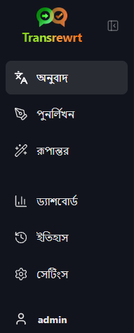
    </td>
    <td valign="top">
        
      <ul>
        <li><strong>অনুবাদ</strong> অনুবাদের কার্যক্ষেত্র খোলে।</li> 
        <li><strong>পুনঃলেখন</strong> পুনঃলেখনের কার্যক্ষেত্র খোলে।</li> 
        <li><strong>রূপান্তর</strong> কাস্টম প্রম্পটের কার্যক্ষেত্র খোলে।</li> 
        <li><strong>ড্যাশবোর্ড</strong> ব্যবহার ও খরচ সম্পর্কিত তথ্য দেখায়।</li> 
        <li><strong>সেটিংস</strong> সেটিংস প্যানেল খোলে।</li> 
        <li><strong>ইতিহাস</strong> ইনপুট এবং আউটপুট টেক্সটসহ ব্যবহারের ইতিহাস দেখায়</li> 
        <li><strong>ব্যবহারকারী</strong> লগইন ব্যবহারকারীর ব্যবহারকারীনাম দেখায় (শুধুমাত্র ওয়েব)।</li>
      </ul>
    </td>
  </tr>
</table>

 

### টুলবার

অ্যাপের বিভিন্ন জায়গায় টুলবারটি সামান্য পরিবর্তিত হয়।

- বাম পাশে, বর্তমান পাতার নাম দেখায়।
- ডান পাশে, এটি **মডেল সিলেক্টর** এবং **ইন্টারফেস ভাষা** নিয়ন্ত্রণ দেখায়।

**মডেল সিলেক্টর** আপনাকে বর্তমান কাজের জন্য কোন AI ইঞ্জিন ব্যবহার করবেন তা নির্বাচন করতে দেয়।

  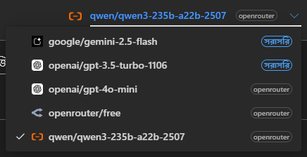

> ℹ️ **দ্রষ্টব্য** 
> কিছু বিনামূল্যের মডেল সর্বদা উপলব্ধ নাও হতে পারে—মাঝে মাঝে এগুলি অফলাইন থাকতে পারে বা ব্যবহারের সীমা থাকতে পারে। এটি ঘটলে, অ্যাপটি স্বয়ংক্রিয়ভাবে আপনার উপলব্ধ তালিকা থেকে সেই মডেলটি সরিয়ে দেবে। 
> কোন মডেলগুলি দেখানো হবে তা নিয়ন্ত্রণ করতে [**সেটিংস** > **মডেল**](#models)-এ যান এবং আপনার মডেলের তালিকা সম্পাদনা করুন। 
> আপনি টুলবারে মডেলের নামের বামে প্রদানকারীর আইকনে ক্লিক করে সরাসরি মডেল সেটিংস খুলতে পারেন।

 

**বিশ্ব আইকন + ভাষার কোড** অ্যাপের ইন্টারফেস ভাষা, যেমন মেনু এবং বোতামগুলি পরিবর্তন করে। এটি **অনুবাদ করুন**-এ ব্যবহৃত অনুবাদ ভাষাগুলি পরিবর্তন করে **না**।

  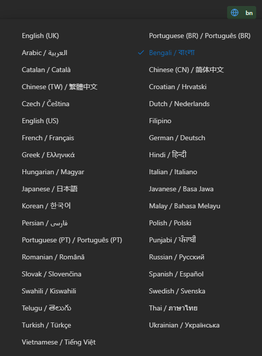

 

### ইনপুট এবং আউটপুট প্যানেল

বেশিরভাগ ওয়ার্কস্পেস বাম পাশের **ইনপুট** প্যানেল এবং ডান পাশের **আউটপুট** প্যানেল ব্যবহার করে।

**ইনপুট** প্যানেলে দেখায়:

- অক্ষরের সংখ্যা
- শব্দের সংখ্যা
- অনুচ্ছেদের সংখ্যা

**আউটপুট** প্যানেলে দেখানো যেতে পারে:

- কাজটি কতক্ষণ সময় নিয়েছিল
- কাজটির খরচ (যদি উপলব্ধ থাকে)
- চলমান মোট খরচ
- **TPS** (প্রতি সেকেন্ডে টোকেন)
- অক্ষর, শব্দ এবং অনুচ্ছেদের সংখ্যা
- ব্যবহৃত মডেল

যদি আপনি প্রযুক্তিগত পদগুলি সম্পর্কে ভাবছেন:

- **টোকেন** মানে পাঠ্যের একটি ছোট টুকরো। এটাকে আপনি একটি শব্দের অংশ বা একটি ছোট শব্দ হিসাবে ভাবতে পারেন।
- **TPS** মানে প্রতি সেকেন্ডে মডেল কতগুলি পাঠ্যের টুকরো প্রক্রিয়া করেছে।

  

[--------------------------------------------------------------------------------------------------------------------------]: # 

## অনুবাদ করুন

আপনি যখন একটি ভাষা থেকে অন্য ভাষায় পাঠ্য রূপান্তর করতে চান তখন **অনুবাদ করুন** ব্যবহার করুন।

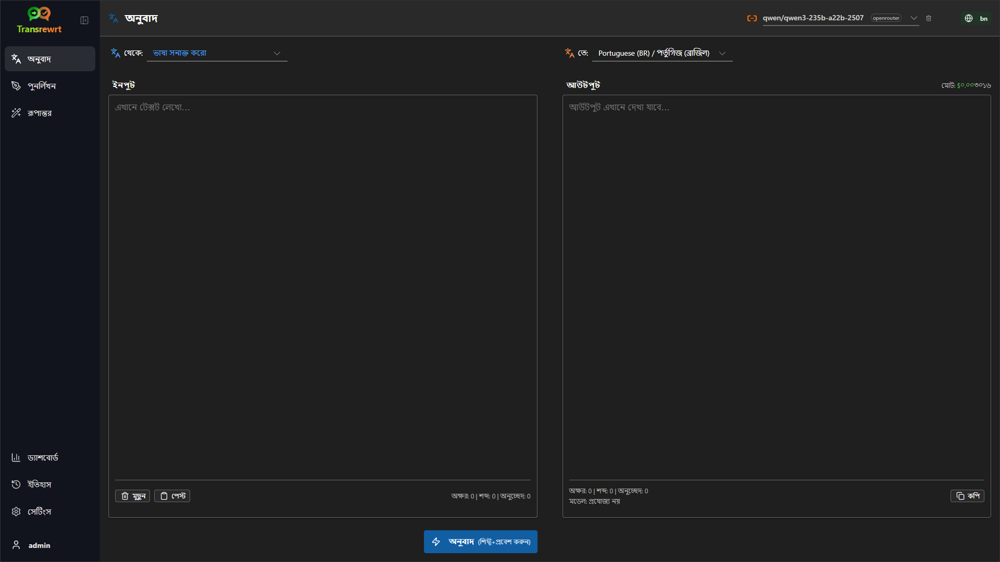

 

### পাঠ্য অনুবাদ করুন

1. **অনুবাদ করুন** খুলুন।
2. **থেকে**-এ একটি ভাষা নির্বাচন করুন।
3. **প্রতি**-এ একটি ভাষা নির্বাচন করুন।
4. টুলবারে একটি মডেল নির্বাচন করুন।
5. **ইনপুট**-এ পাঠ্য টাইপ করুন বা আটকান।
6. **অনুবাদ করুন**-এ ক্লিক করুন।
7. **আউটপুট**-এ ফলাফল পড়ুন।
8. ফলাফলটি কপি করতে কপি বোতাম ব্যবহার করুন।

 

### ভাষা নির্বাচন

- **থেকে** একটি নির্দিষ্ট ভাষা হতে পারে অথবা **ভাষা শনাক্ত করুন**।
- **প্রতি** হল আপনি যে ভাষায় ফলাফল চান তা।

আপনার নির্বাচিত **শীর্ষ ভাষাগুলি** তালিকার উপরের দিকে দেখায়। আপনি এগুলি [**সেটিংস** > **ভাষা**](#languages)-এ সেট করতে পারেন।

 

### সহায়ক অনুবাদ সেটিংস

[**সেটিংস** > **সাধারণ সেটিংস**](#general-settings)-এ আপনি অনুবাদের আচরণ কীভাবে পরিবর্তন করতে পারেন:

- **আটকানোর সাথে সাথে স্বয়ংক্রিয় অনুবাদ** আপনি পাঠ্য আটকানোর সঙ্গে সঙ্গে একটি অনুবাদ চালায়।
- **ক্লিপবোর্ডে স্বয়ংক্রিয়ভাবে ফলাফল কপি করুন** সফলভাবে কাজ চালানোর পরে ফলাফলটি স্বয়ংক্রিয়ভাবে কপি করে।
- **রিয়েল-টাইম অনুবাদ (টাইপ করার সময়)** আপনি টাইপ করার সময় অনুবাদ চালায়।
- **টাইমআউট (মিলিসেকেন্ড)** এটি নিয়ন্ত্রণ করে রিয়েল-টাইম অনুবাদ চালানোর আগে অ্যাপ কতক্ষণ অপেক্ষা করবে।

 

### কীবোর্ড শর্টকাট

[**সেটিংস** > **সাধারণ সেটিংস**](#general-settings)-এ, **ENTER-এর আচরণ** আপনি `Enter` চাপলে কী ঘটে তা নিয়ন্ত্রণ করে:

- **Enter** কাজটি চালাতে পারে এবং **Shift+Enter** একটি নতুন লাইন যোগ করতে পারে।
- অথবা অ্যাপ উল্টোটা করতে পারে।

বর্তমান মোড **অনুবাদ করুন** বোতামেও দেখানো হয়।

  

[--------------------------------------------------------------------------------------------------------------------------]: # 

## পুনঃলেখন

এমন সময় **পুনঃলেখন** ব্যবহার করুন যখন মূল অর্থ না বদলে ভাষাটি আরও ভালো করতে চান।

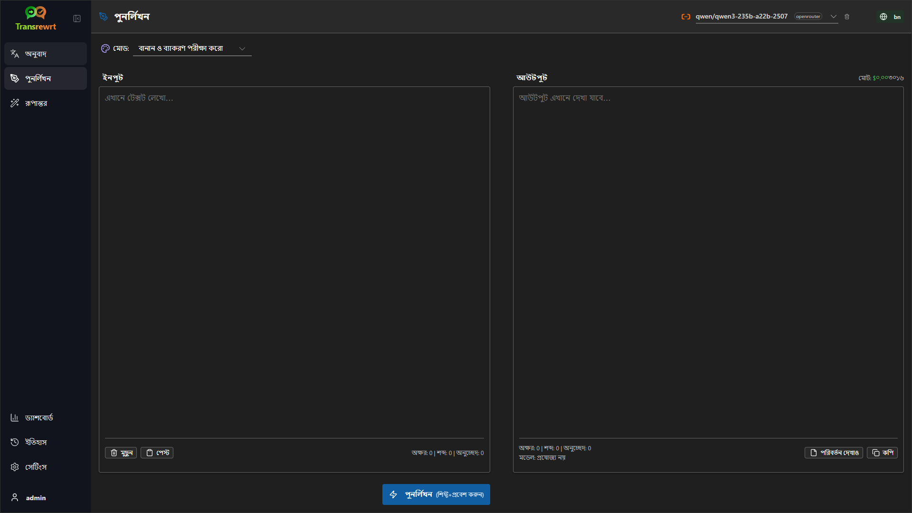

এটি নিম্নলিখিত ক্ষেত্রে কাজে লাগে:

- বানান এবং ব্যাকরণ সংশোধন করা
- পাঠ্য আরও স্পষ্ট করা
- পাঠ্য আরও আনুষ্ঠানিক বা কম আনুষ্ঠানিক করা
- পাঠ্য ছোট বা বড় করা
- পাঠ্যটিকে আরও প্রযুক্তিগতভাবে শোনানো

 

### পাঠ্য পুনরায় লেখা

1. **পুনরায় লেখা** খুলুন।
2. একটি **মোড** নির্বাচন করুন।
3. টুলবার থেকে একটি মডেল নির্বাচন করুন।
4. **ইনপুট**-এ লিখুন অথবা পাঠ্যটি পেস্ট করুন।
5. **পুনরায় লেখা** ক্লিক করুন।
6. **আউটপুট**-এ ফলাফল পরীক্ষা করুন।

[**অনুবাদ**](#keyboard-shortcuts)-এ বর্ণিত Enter কী-এর আচরণ এখানেও প্রযোজ্য।

 

> 💡 **টিপস** 
> যখন আপনি "**বানান ও ব্যাকরণ পরীক্ষা করুন**" মোড ব্যবহার করবেন, তখন আউটপুট প্যানেলে `পরিবর্তনগুলি দেখান` বোতামটি দেখা যাবে।
> আপনার পাঠ্যে কী পরিবর্তন করা হয়েছে তা দেখানো বা লুকানোর জন্য এই বোতামে ক্লিক করুন।

  

[--------------------------------------------------------------------------------------------------------------------------]: # 

## রূপান্তর

যখন আপনি চান যে কৃত্রিম বুদ্ধিমত্তা কাস্টম নির্দেশাবলী অনুসরণ করুক, তখন **রূপান্তর** ব্যবহার করুন।

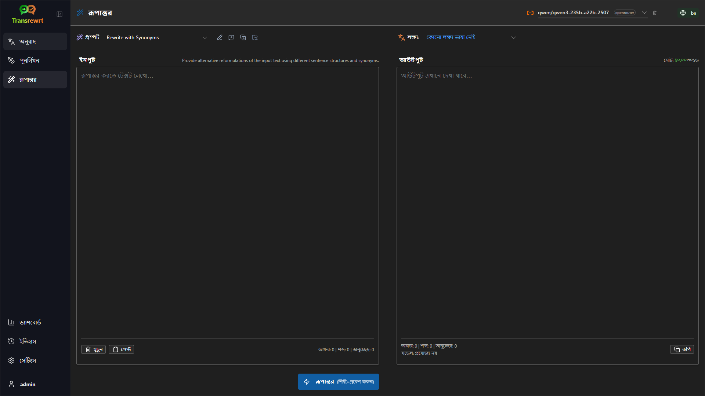

অ্যাপ্লিকেশনের এটি সবচেয়ে নমনীয় অংশ। আপনি নিম্নলিখিত কাজগুলির জন্য এটি ব্যবহার করতে পারেন:

- নোটগুলি সংক্ষিপ্তকরণ
- খসড়া পাঠ্যকে সুন্দর ইমেলে রূপান্তর
- মূল বিষয়গুলি উপস্থাপন
- পাঠ্যকে একটি নির্দিষ্ট ফরম্যাটে রূপান্তর

 

### একটি বিদ্যমান প্রম্পট চালান

1. **রূপান্তর** খুলুন।
2. প্রম্পট তালিকা থেকে একটি প্রম্পট নির্বাচন করুন।
3. যদি একটি **লক্ষ্য** ভাষার বাক্স দেখা যায়, তবে চাইলে একটি ভাষা নির্বাচন করুন।
4. **ইনপুট**-এ পাঠ্য লিখুন বা পেস্ট করুন।
5. **রূপান্তর** ক্লিক করুন।
6. **আউটপুট**-এ ফলাফল পড়ুন।

 

### যদি আপনার কোনও প্রম্পট না থাকে

যদি আপনার প্রম্পট তালিকা খালি হয়, **নমুনা প্রম্পট লোড করুন** ক্লিক করুন। দ্রুত শুরু করার জন্য এটি বিল্ট-ইন উদাহরণগুলি যোগ করবে।

 

> ℹ️ **দ্রষ্টব্য** 
> নমুনা প্রম্পট ইংরেজিতে সরবরাহ করা হয়। এগুলি লোড করার পরে, আপনি একটি প্রম্পট সম্পাদনা করতে পারেন এবং **অনুবাদ প্রম্পট** ব্যবহার করে এটিকে আপনার ভাষায় অনুবাদ করতে পারেন।

 

### দ্রুত একটি প্রম্পট তৈরি করুন

একটি প্রম্পট তৈরি করার সবচেয়ে দ্রুত উপায় হল:

1. **নতুন প্রম্পট** ক্লিক করুন।
2. **প্রম্পট তৈরি করুন** ক্লিক করুন।
3. আপনি চান যে প্রম্পটটি কী করুক তা বর্ণনা করুন।
4. একটি মডেল নির্বাচন করুন।
5. অ্যাপ্লিকেশনটি আপনার জন্য একটি খসড়া তৈরি করতে দিন।
6. খসড়াটি পরীক্ষা করুন এবং **সংরক্ষণ করুন** ক্লিক করুন।

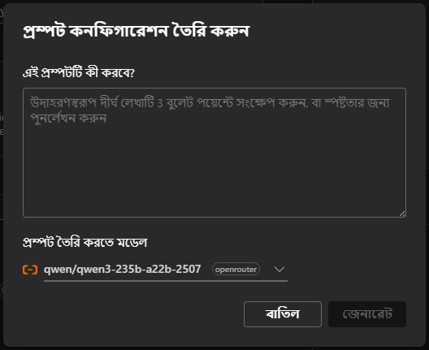

 

### প্রম্পট সম্পাদনা করুন

যখন আপনি একটি প্রম্পট তৈরি বা সম্পাদনা করেন, তখন বামপাশে সম্পাদক দেখা যাবে এবং ডানপাশে একটি পরীক্ষার অঞ্চল দেখা যাবে।

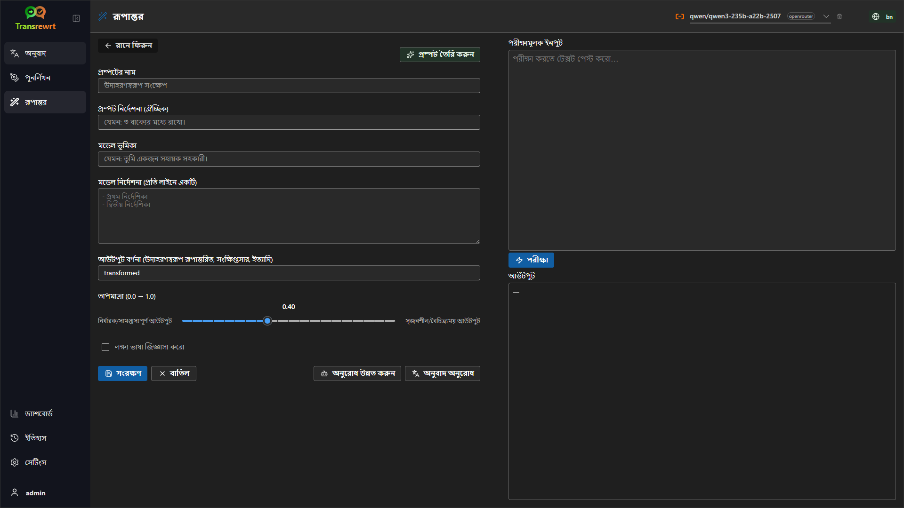

মূল ফিল্ডগুলি হল:

- **প্রম্পট নাম**: প্রম্পট তালিকায় প্রদর্শিত নাম।
- **প্রম্পট নির্দেশাবলী (ঐচ্ছিক)**: প্রম্পট চালানোর সময় ব্যবহারকারীকে দেখানো হয় এমন একটি সংক্ষিপ্ত সূত্র।
- **মডেল ভূমিকা**: কৃত্রিম বুদ্ধিমত্তার জন্য নির্ধারিত সামগ্রিক ভূমিকা, যেমন 'আপনি একজন সহায়ক সহকারী।'
- **মডেল নির্দেশাবলী (প্রতি লাইনে একটি)**: কৃত্রিম বুদ্ধিমত্তা যে নির্দিষ্ট নিয়মগুলি মেনে চলবে।
- **আউটপুট বর্ণনা**: ফলাফলকে বর্ণনা করার জন্য একটি সংক্ষিপ্ত শব্দ, যেমন 'সারাংশ' বা 'পুনরায় লেখা'।
- **তাপমাত্রা (0.0 → 1.0)**: মডেলটি কীভাবে আচরণ করবে; নীচে দেখুন।
- **লক্ষ্য ভাষা জিজ্ঞাসা করুন**: প্রম্পট চালানোর সময় একটি লক্ষ্য ভাষার নির্বাচক যুক্ত করে।

যদি আপনি **তাপমাত্রা** নামক প্রযুক্তিগত পদটি আগে শুনে না থাকেন, তবে এটি এভাবে ভাবুন:

- **নিম্ন** তাপমাত্রা স্থিতিশীল ও অধিক পূর্বানুমেয় ফলাফল দেয়।
- **উচ্চ** তাপমাত্রা আরও বৈচিত্র্য ও সৃজনশীলতা দেয়।

আপনি এটি ব্যবহার করতে পারেন:

- **`প্রম্পট তৈরি করুন`** একটি সহজ বর্ণনা থেকে একটি নতুন খসড়া তৈরি করতে
- **`প্রম্পট উন্নত করুন`** একটি বিদ্যমান প্রম্পট নিখুঁত করতে
- **`প্রম্পট অনুবাদ করুন`** প্রম্পট ফিল্ডগুলি অনুবাদ করতে

 

> ⚠️ **সতর্কতা** 
> **`পিছনে চলে যান`** ক্লিক করার আগে **`সংরক্ষণ করুন`** ক্লিক করুন। সংরক্ষণ না করে ফিরে গেলে আপনার পরিবর্তনগুলি হারিয়ে যাবে।

 

### ব্যবহার করার আগে প্রম্পট পরীক্ষা করুন

ডানপাশের পরীক্ষার প্যানেলটি আপনাকে দৈনন্দিন কাজে ব্যবহার করার আগে নমুনা পাঠ্যের সাথে আপনার প্রম্পট পরীক্ষা করতে দেয়।

এটি নিম্নলিখিত ক্ষেত্রে উপযোগী:

- যখন আপনি একটি নতুন প্রম্পট তৈরি করছেন
- যখন আপনি একটি প্রম্পটের দুটি সংস্করণ তুলনা করছেন
- আপনি যখন টোন, দৈর্ঘ্য বা আউটপুট ফরম্যাট পরীক্ষা করতে চান

 

### সংরক্ষিত প্রম্পট পরিচালনা করুন

সংরক্ষিত প্রম্পটগুলি একসাথে পরিচালনা করতে, [**সেটিংস** > **রূপান্তর প্রম্পট**](#transform-prompts) খুলুন।

সেখানে আপনি:

- আপনার প্রম্পটগুলি তালিকাভুক্ত করতে ও মুছে ফেলতে পারবেন
- **JSON**, **CSV**, বা **XLSX** আকারে প্রম্পট রপ্তানি করতে পারবেন
- একটি ফাইল থেকে প্রম্পট আমদানি করতে পারবেন

  

[--------------------------------------------------------------------------------------------------------------------------]: # 

## ড্যাশবোর্ড

**ড্যাশবোর্ড** ব্যবহার করুন এই অ্যাপটি আপনি কতটা ব্যবহার করছেন এবং এর খরচ কত (পেইড মডেলগুলির জন্য) তা দেখতে।

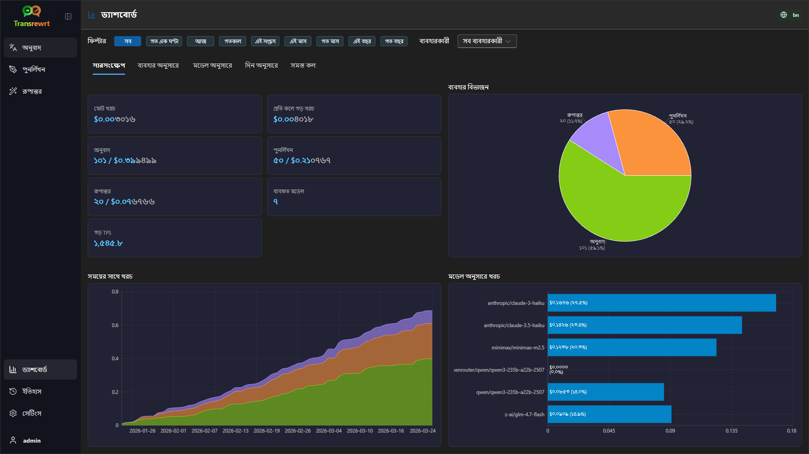

 

> ℹ️ **নোট** 
> যদি আপনি কেবল বিনামূল্যের মডেল ব্যবহার করেন, তবে খরচ-সংক্রান্ত চার্টগুলি খালি থাকবে। 

 

### ডেটা ফিল্টার করুন

সময়সীমা পরিবর্তন করতে উপরের ফিল্টার বোতামগুলি ব্যবহার করুন।

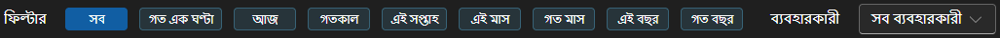

 

> ℹ️ **নোট** 
> ওয়েব সংস্করণে **ব্যবহারকারী** ফিল্টারটি শুধুমাত্র প্রশাসকদের জন্য দৃশ্যমান। সাধারণ ব্যবহারকারীদের এই ফিল্টার দেখা যাবে না এবং ডেস্কটপ অ্যাপে এটি উপলব্ধ নয়।

 

### ড্যাশবোর্ড ট্যাব

- **সারাংশ** আপনাকে ব্যবহার এবং খরচের একটি সামগ্রিক দৃশ্য দেয়।
- **ব্যবহার অনুযায়ী** অনুবাদ ভাষা, পুনঃলেখনের মোড এবং রূপান্তর অনুরোধ অনুযায়ী কার্যকলাপ ভাগ করে।
- **মডেল অনুযায়ী** দেখায় যে আপনি কোন মডেলগুলি ব্যবহার করেছেন এবং তাদের খরচ কত।
- **দিন অনুযায়ী** দৈনিক মোট সংখ্যাগুলি দেখায়।
- **সব কল** পূর্ণ কলের ইতিহাস দেখায় এবং সেগুলি আপনি রপ্তানি করতে পারবেন।

 

### ডেটা রপ্তানি করুন

ড্যাশবোর্ড টেবিলগুলি ডেটা রপ্তানি করতে পারে:

- **JSON**
- **CSV**
- **XLSX**

এটি উপযোগী যদি আপনি অ্যাপের বাইরে কার্যকলাপ পর্যালোচনা করতে বা একটি প্রতিবেদন ভাগ করতে চান।

 

### মডেলের জন্য সংরক্ষিত রেকর্ড মুছুন

**মডেল অনুযায়ী** বা **সব কল**-এ, আপনি "ট্র্যাশ বিন" আইকনে ক্লিক করে মডেলের জন্য সংরক্ষিত রেকর্ডগুলি মুছে ফেলতে পারেন।

> ⚠️ **সতর্কীকরণ** 
> সংরক্ষিত রেকর্ড মুছে ফেলা পুনরুদ্ধার করা যাবে না। কেবল তখনই এটি ব্যবহার করুন যদি আপনি নিশ্চিত হন যে আপনি আর সেই ইতিহাসের প্রয়োজন হবে না।

সমস্ত ডেটা মুছে ফেলতে বা তাদের বয়সের ভিত্তিতে রেকর্ড মুছতে, [**সেটিংস** > **খরচ ট্র্যাকিং**](#cost-tracking)-এ যান। সেখানে আপনি সমস্ত সংরক্ষিত ডেটা বা একটি নির্দিষ্ট তারিখের আগের মাত্র ডেটা মুছার বিকল্প পাবেন।

  

[--------------------------------------------------------------------------------------------------------------------------]: # 

## ইতিহাস

প্রতিটি অপারেশনের ইনপুট এবং আউটপুটসহ **Transrewrt**-এর ভিতরে আপনার ক্রিয়াকলাপগুলির ইতিহাস দেখতে **ইতিহাস**-এ ক্লিক করুন। 

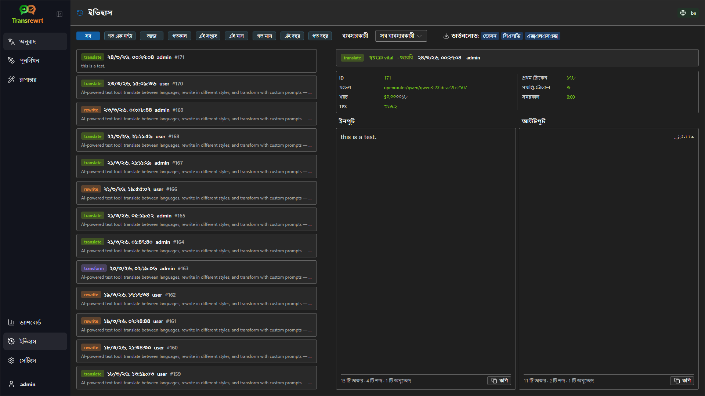

 

### ডেটা ফিল্টার করুন

**ইতিহাস**-এর **ড্যাশবোর্ড** পৃষ্ঠার মতো একই ফিল্টার ব্যবহার করা হয়। সময়সীমা নির্বাচন করতে সেগুলি ব্যবহার করুন।

 

> ℹ️ **নোট** 
> ওয়েব সংস্করণে **ব্যবহারকারী** ফিল্টারটি শুধুমাত্র প্রশাসকদের জন্য দৃশ্যমান। সাধারণ ব্যবহারকারীদের এই ফিল্টার দেখা যাবে না এবং ডেস্কটপ অ্যাপে এটি উপলব্ধ নয়।

 

### ইতিহাস ডেটা রপ্তানি করুন

ইতিহাসের পৃষ্ঠায় ফিল্টার করা ডেটা রপ্তানি করা যায়:

- **JSON**
- **CSV**
- **XLSX**

এটি উপযোগী যদি আপনি অ্যাপের বাইরে কার্যকলাপ পর্যালোচনা করতে বা একটি প্রতিবেদন ভাগ করতে চান।

  

[--------------------------------------------------------------------------------------------------------------------------]: # 

## সেটিংস

পার্শ্বদণ্ড থেকে **সেটিংস** খুলুন যাতে অ্যাপটির আচরণ কাস্টমাইজ করতে পারেন।

প্লাটফর্ম এবং আপনার ভূমিকার উপর নির্ভর করে ট্যাবগুলি উপলব্ধ:

  | ট্যাব                  | ডেস্কটপ | ওয়েব (প্রশাসক) | ওয়েব (সাধারণ ব্যবহারকারী) |
  |----------------------|:-------:|:-----------:|:------------------:|
  | সাধারণ সেটিংস           |   হ্যাঁ   |     হ্যাঁ     |        হ্যাঁ         |
  | মডেলগুলি              |   হ্যাঁ   |     হ্যাঁ     |        হ্যাঁ         |
  | ভাষাগুলি               |   হ্যাঁ   |     হ্যাঁ     |        হ্যাঁ         |
  | খরচ ট্র্যাকিং           |   হ্যাঁ   |     হ্যাঁ     |         —          |
  | রূপান্তর অনুরোধগুলি     |   হ্যাঁ   |     হ্যাঁ     |        হ্যাঁ         |
  | ব্যবহারকারীরা            |    —    |     হ্যাঁ     |         —          |
  | API কনফিগ              |   হ্যাঁ   |     হ্যাঁ     |         —          |
  | সম্পর্কে               |   হ্যাঁ   |     হ্যাঁ     |        হ্যাঁ         |

 

> ℹ️ **নোট** 
> ওয়েব সংস্করণে, প্রতিটি ব্যবহারকারীর নিজস্ব কনফিগারেশন থাকে। নির্বাচিত মডেল, ভাষা, সাধারণ বিকল্প এবং রূপান্তর অনুরোধ সহ সেটিংসগুলি প্রতি ব্যবহারকারী ভিত্তিক সংরক্ষিত হয়। আপনি যে পরিবর্তনগুলি করবেন তা অন্য ব্যবহারকারীদের প্রভাবিত করবে না।

 

[--------------------------------------------------------------------------------------------------------------------------]: # 

### সাধারণ সেটিংস

**সাধারণ সেটিংস** ব্যবহার করুন টাইপিং আচরণ নিয়ন্ত্রণ করতে, **ইতিহাস**-এর জন্য কার্যকরণের বিবরণ সংরক্ষণ করা হয় কিনা এবং চেহারা নিয়ন্ত্রণ করতে।

**আচরণ**

- **ENTER এর জন্য আচরণ** নির্বাচন করে যে কি `Enter` কী টাস্কটি চালাবে নাকি নতুন লাইন যোগ করবে।
- **পেস্ট করার সাথে সাথে অটো-অনুবাদ** আপনি যখন টেক্সট পেস্ট করবেন তখনই অনুবাদ শুরু হয়ে যায়।
- **ক্লিপবোর্ডে ফলাফল অটো-কপি করুন** সফল ফলাফলগুলি স্বয়ংক্রিয়ভাবে কপি করে।
- **রিয়েল-টাইম অনুবাদ (টাইপ করার সময়)** টাইপ করার সময় অনুবাদ করে।
- **টাইমআউট (মিলি সেকেন্ড)** রিয়েল-টাইম অনুবাদের জন্য অপেক্ষার সময় নির্ধারণ করে।

**ইতিহাস**

- **কার্যকরণ ইতিহাস রাখুন** নিয়ন্ত্রণ করে যে প্রতিটি অনুবাদ, পুনর্লেখন এবং রূপান্তর সাইডবারের [**ইতিহাস**](#history) ভিউয়ের জন্য **ইনপুট এবং আউটপুট টেক্সট** সংরক্ষণ করে কিনা। এটি বন্ধ করলে নিশ্চিতকরণ চাওয়া হবে; যদি আপনি নিশ্চিত করেন, সেখানে জমা থাকা ইতিহাস ডাটাবেজ থেকে সরানো হবে।
- **ইতিহাস ডাটা মুছুন** বয়স অনুযায়ী (যেমন কয়েক মাসের পুরোনো, অথবা **সমস্ত ডাটা (সাফ করুন)**) **ডাটা মুছুন** ব্যবহার করে সংরক্ষিত টেক্সট মুছতে দেয়। এটি শুধুমাত্র **ইতিহাস** ভিউয়ের জন্য সংরক্ষিত কার্যকরণ টেক্সটকে প্রভাবিত করে; এটি **খরচ বা ব্যবহারের মোট** মুছে ফেলে না। **খরচ** ডাটা মুছতে বা কমাতে, [**সেটিংস** > **খরচ ট্র্যাকিং**](#cost-tracking) ব্যবহার করুন।

**চেহারা**

- **খরচের ভগ্নাংশ ডিজিট** কত দশমিক সংখ্যায় খরচ দেখানো হবে তা পরিবর্তন করে।
- **শুধুমাত্র ওয়েব:** **অ্যাপের চারপাশে মার্জিন দেখান** ইন্টারফেসের চারপাশে অতিরিক্ত জায়গা যোগ করে।
- **ফন্ট ফ্যামিলি** টেক্সট প্যানেলগুলিতে লেখার ফন্ট পরিবর্তন করে।
- **আকার** ফন্টের আকার পরিবর্তন করে।

 

### মডেলস

টুলবারে কোন মডেলগুলি প্রদর্শিত হবে তা নির্বাচন করতে **সেটিংস** > **মডেলস** ব্যবহার করুন।

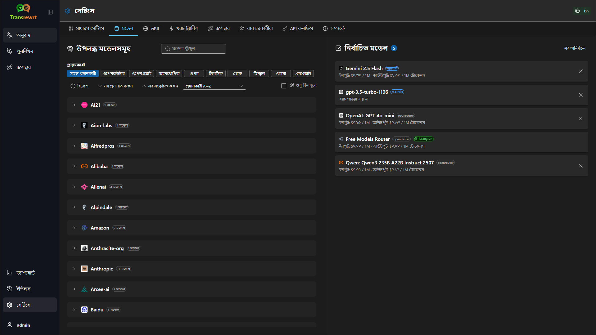

পৃষ্ঠাতে দুটি তালিকা রয়েছে:

- বাম দিকে **উপলব্ধ মডেলগুলি**
- ডান দিকে **নির্বাচিত মডেলগুলি**

উপযোগী নিয়ন্ত্রণগুলির মধ্যে রয়েছে:

- **মডেল অনুসন্ধান করুন...** নাম অনুযায়ী একটি মডেল খুঁজে পেতে
- একটি ইঞ্জিনে (OpenRouter, OpenAI, Ollama, …) তালিকা সংকুচিত করতে **প্রদানকারী** চিপস
- **শুধুমাত্র বিনামূল্যে** কেবল বিনামূল্যে মডেলগুলি দেখতে
- তালিকা পুনরায় লোড করতে **রিফ্রেশ**
- **সব প্রসারিত করুন** এবং **সব ভাঁজ করুন** যখন আপনি প্রদানকারী অনুযায়ী সাজাচ্ছেন

মডেল আইডি-তে প্রদানকারীর উপসর্গ অন্তর্ভুক্ত থাকে (যেমন `openrouter/…` বনাম `openai/…`)। **OpenAI (OpenRouter)** বনাম **OpenAI (সরাসরি)** এর মতো ব্যাজগুলি দেখায় যে ট্রাফিক কিভাবে রাউট করা হচ্ছে।

ক্রিয়াকলাপ:

 - একটি মডেল যোগ করতে, **যোগ করুন** অথবা এন্ট্রির যেকোনো জায়গায় ক্লিক করুন।

 - একটি মডেল মুছে ফেলতে, **নির্বাচিত মডেলগুলি**-এ এটির পাশে **X** ক্লিক করুন অথবা উপলব্ধ মডেলের এন্ট্রিতে **নির্বাচিত**-এ ক্লিক করুন।

 - তালিকা সাফ করতে, **সব বাতিল করুন** ক্লিক করুন। প্রয়োজনীয় বিনামূল্যে মডেল তালিকায় থাকবে।

 

> ℹ️ **দ্রষ্টব্য** 
> যদি আপনি OpenRouter-এ সরাসরি ক্রেডিট যোগ করতে না চান, তাহলে **শুধুমাত্র বিনামূল্যে** সক্ষম করে শুরু করুন এবং বিনামূল্যে মডেলগুলি নির্বাচন করুন (ক্রেডিট কার্ডের প্রয়োজন নেই)। আপনি যেকোন এপিআই কী ছাড়াই স্থানীয়ভাবে মডেল চালাতে Ollama ব্যবহার করতে পারেন।

 

### ভাষা

অ্যাপটিতে ব্যবহৃত ভাষার তালিকা সাজাতে **সেটিংস** > **ভাষা** ব্যবহার করুন।

- **টপ ভাষাগুলি** **অনুবাদ** এবং **রূপান্তর**-এ ভাষার তালিকার উপরের দিকে পিন করা থাকে।
- **কাস্টম ভাষা** আপনাকে নির্মিত তালিকায় না থাকা একটি ভাষা যোগ করতে দেয়।

আপনি যদি একটি কাস্টম ভাষা যোগ করেন, তবে এটি নির্মিত বিকল্পগুলির পাশাপাশি ভাষা নির্বাচকগুলিতে প্রদর্শিত হবে।

 

### খরচ ট্র্যাকিং

খরচের তথ্য পরিচালনা করতে **সেটিংস** > **খরচ ট্র্যাকিং** ব্যবহার করুন।

- **মোট খরচ** চলমান মোট দেখায়।
- **মান কপি করুন** মোট ক্লিপবোর্ডে কপি করে।
- **খরচ রিসেট করুন** সংরক্ষিত মোট শূন্যে সেট করে।
- **এপিআই কী ব্যবহারের সাথে সিঙ্ক করুন** আপনার OpenRouter অ্যাকাউন্ট দ্বারা প্রতিবেদিত ব্যবহারের সাথে মিলে যায় এমন মোট সেট করে (শুধুমাত্র OpenRouter এর ক্ষেত্রে)।
- **এপিআই কী ব্যবহার** OpenRouter ব্যবহারের বিস্তারিত তথ্য দেখায়, যদি উপলব্ধ থাকে।
- **খরচ ডাটা মুছুন** সমস্ত ডাটা অথবা কেবল নির্বাচিত তারিখের আগের এন্ট্রিগুলি মুছে ফেলে।

**খরচ ট্র্যাকিং:** যখন আপনি OpenRouter মডেল ব্যবহার করেন, অ্যাপটি OpenRouter থেকে ডাটা অনুযায়ী আপনার আসল ব্যবহার এবং ব্যয় দেখায়। অন্য সব প্রদানকারীদের জন্য, অ্যাপটি খরচ অনুমান করে OpenRouter দ্বারা প্রকাশিত মূল্য ব্যবহার করে, যদি কোন মূল্য অনুপলব্ধ থাকে, তবে অনুমান শূন্য হতে পারে।

 

> ℹ️ **দ্রষ্টব্য** 
> **সমস্ত খরচের চিত্র শুধুমাত্র আপনার তথ্যের জন্য অনুমানিত, অফিসিয়াল বিলিং বিবৃতি নয়।**

 

> ⚠️ **সতর্কতা** 
> ডাটা মুছে ফেলা পুনরুদ্ধারযোগ্য নয়। মুছে ফেলার আগে, আপনার ডাটা ব্যাক আপ করুন অথবা [**ড্যাশবোর্ড** > **সমস্ত কল**](#dashboard-tabs) এর মাধ্যমে এক্সপোর্ট করুন, অন্যথায় এটি চিরতরে হারিয়ে যাবে।   
> প্রতিটি এপিআই কল এন্ট্রির সাথে সম্পর্কিত ইতিহাসও মুছে ফেলা হবে।

 

### ট্রান্সফর্ম প্রম্পট

ব্যাচ আকারে প্রম্পট পরিচালনা করতে **সেটিংস** > **ট্রান্সফর্ম প্রম্পট** ব্যবহার করুন।

আপনি পারবেন:

- আপনার সংরক্ষিত প্রম্পটগুলি পর্যালোচনা করতে
- প্রম্পট মুছে ফেলতে
- একটি ফাইল থেকে প্রম্পট আমদানি করতে
- ব্যাকআপ বা শেয়ার করার জন্য প্রম্পট রপ্তানি করতে

 

### ব্যবহারকারীরা

**ওয়েব: শুধুমাত্র প্রশাসক**

ওয়েব সংস্করণে ব্যবহারকারী অ্যাকাউন্ট পরিচালনার জন্য **ব্যবহারকারীদের** ব্যবহার করুন। আপনি ব্যবহারকারী যোগ করতে পারেন, তাদের তথ্য আপডেট করতে পারেন, পাসওয়ার্ড রিসেট করতে পারেন এবং অ্যাকাউন্ট মুছে ফেলতে পারেন।

 

### API কনফিগ

সমর্থিত প্রদানকারীদের মধ্যে রয়েছে: OpenRouter, OpenAI, Anthropic, Google Gemini, DeepSeek, Groq, Mistral, xAI, এবং **Ollama** (বেস ইউআরএল এর মাধ্যমে স্থানীয় মডেল)। আপনি কেবল আপনি যে প্রদানকারীদের ব্যবহার করছেন তাদের কনফিগার করার প্রয়োজন.

**ওয়েব অ্যাপ্লিকেশন: শুধুমাত্র প্রশাসক**

API কীগুলি সিস্টেম বা ডকার পরিবেশ চলকগুলির মাধ্যমে কনফিগার করা হয় — এগুলি ওয়েব UI-তে প্রবেশ করা হয় না। এই পৃষ্ঠাটি দেখায় যে কোন প্রদানকারীদের কী কনফিগার করা আছে এবং আপনি **`টেস্ট`** বোতামে ক্লিক করে প্রতিটির পরীক্ষা করতে পারেন।

 

> ℹ️ **নোট** 
> API কী পরিবর্তন করতে আপনার সিস্টেম বা ডকার কনফিগের পরিবেশ চলক আপডেট করুন এবং সার্ভার বা কনটেইনার পুনরায় চালু করুন।

 

**ডেস্কটপ অ্যাপ্লিকেশন**

আপনি যে প্রদানকারীদের ব্যবহার করেন তাদের জন্য API কী সংরক্ষণের জন্য **API কনফিগ** ব্যবহার করুন। Ollama-এর জন্য API কী-এর পরিবর্তে **বেস URL** লিখুন।

 

> 💡 **টিপস**  
> যদি আপনি কোনো API কী ব্যবহার করতে না চান বা ব্যবহারের জন্য টাকা খরচ করতে না চান, তবে আপনি [Ollama ডাউনলোড করতে পারেন](https://ollama.com) এবং আপনার মেশিনে বিনামূল্যে মডেলগুলি চালাতে পারেন। বিকল্পভাবে, তাদের বিনামূল্যে মডেল ব্যবহারের জন্য আপনি কোনো ক্রেডিট কার্ড ছাড়াই একটি ফ্রি OpenRouter অ্যাকাউন্ট তৈরি করতে পারেন।

- শুধুমাত্র যে প্রদানকারীদের আপনার প্রয়োজন তাদের যোগ করুন। **সেটিংস** > **মডেল**-এ প্রতিটি মডেল আইডি প্রদানকারীর নাম দিয়ে শুরু হয় (উদাহরণস্বরূপ `openrouter/openrouter/free`, `openai/gpt-4o`, `ollama/llama3`)।

একটি API কী যোগ করতে, টেক্সট ফিল্ডে মান টাইপ করুন এবং **`সংরক্ষণ করুন`** বোতামে ক্লিক করুন। বিদ্যমান কী প্রতিস্থাপন করতে **`সম্পাদনা করুন`** বোতামে ক্লিক করুন। কীটি কাজ করছে কিনা তা পরীক্ষা করতে **`টেস্ট`** বোতামে ক্লিক করুন।

 

> ℹ️ **নোট** 
> আপনি বর্তমান API কী-এর মান দেখতে পারবেন না। আপনি কেবল **`সম্পাদনা করুন`** বোতাম ব্যবহার করে এটি প্রতিস্থাপন করতে পারেন।
> API কীগুলি কনফিগারেশন ফাইলে এনক্রিপ্ট করে সংরক্ষণ করা হয়।

 

OpenRouter কী পাওয়ার জন্য বিস্তারিত ধাপগুলির জন্য উপরে [কীভাবে একটি API কী পাওয়া যায়](#how-to-get-an-api-key-desktop-app) দেখুন।

 

### সম্পর্কে

**সম্পর্কে** ট্যাবটি দেখায়:

- অ্যাপের নাম
- সংস্করণ নম্বর
- বিল্ডের তারিখ
- প্রকল্প রিপোজিটরির লিঙ্ক

  

## সাধারণ সমস্যা

কিছু আশানুরূপ কাজ না করলে প্রথমে নিম্নলিখিত বিষয়গুলি পরীক্ষা করুন।

 

### অ্যাপ টেক্সট অনুবাদ, পুনঃলেখন বা রূপান্তর করবে না

নিম্নলিখিতগুলি পরীক্ষা করুন:

- আপনি কি টুলবার থেকে একটি মডেল নির্বাচন করেছেন
- কমপক্ষে একটি মডেল [**সেটিংস** > **মডেল**](#models)-এ তালিকাভুক্ত করা হয়েছে কিনা
- আপনার API সেটআপ কাজ করছে কিনা

যদি আপনি ডেস্কটপ অ্যাপ ব্যবহার করছেন:

1. [**সেটিংস** > **API কনফিগ**](#api-config) খুলুন।
2. নিশ্চিত করুন যে কমপক্ষে একটি API কী সংরক্ষিত হয়েছে।
3. কীটি কাজ করছে কিনা নিশ্চিত করতে প্রদানকারীর পাশে **টেস্ট** বোতামে ক্লিক করুন।

 

### মডেল তালিকা খালি

[**সেটিংস** > **মডেল**](#models) খুলুন এবং **রিফ্রেশ** বোতামে ক্লিক করুন।

প্রয়োজন হলে:

- একটি মডেল খুঁজুন
- **শুধুমাত্র ফ্রি** চালু করুন
- **নির্বাচিত মডেল**-এ এক বা একাধিক মডেল যোগ করুন

 

### ফলাফলটি খুব ধীর বা খরচ বেশি

এগুলির মধ্যে এক বা একাধিক চেষ্টা করুন:

- একটি ভিন্ন মডেল বেছে নিন
- একটি ছোট টেক্সট ইনপুট ব্যবহার করুন
- [**সেটিংস** > **সাধারণ সেটিংস**](#general-settings)-এ **রিয়েল-টাইম অনুবাদ (টাইপ করার সময়)** বন্ধ করুন
- সহজ কাজের জন্য ফ্রি মডেল ব্যবহার করুন (দেখুন [মডেল](#models))

 

### ইন্টারফেস ভুল ভাষাতে

[টুলবার](#toolbar)-এ গ্লোব আইকনে ক্লিক করুন এবং আপনার পছন্দের **ইন্টারফেস ভাষা** নির্বাচন করুন।

 

### টেক্সট খুব ছোট বা পড়তে কষ্টকর

[**সেটিংস** > **সাধারণ সেটিংস**](#general-settings) খুলুন এবং পরিবর্তন করুন:

- **ফন্ট ফ্যামিলি**
- **আকার**

 

### ড্যাশবোর্ড চার্টগুলি খালি

এটি স্বাভাবিক যদি:

- আপনি শুধুমাত্র **ফ্রি মডেল** ব্যবহার করেন (খরচের চার্টগুলি ফাঁকা থাকবে)
- নির্বাচিত **সময় ফিল্টার** কলগুলি হওয়ার সময়কালকে কাভার করে না — পরীক্ষা করুন **সমস্ত** চয়ন করে

যদি **সব** চয়ন করার পরেও চার্টগুলি খালি থাকে,

### খরচ "পাওয়া যায় নি" দেখাচ্ছে অথবা ভুল মনে হচ্ছে

যখন আপনি **OpenRouter**-এর মাধ্যমে মডেল ব্যবহার করেন, তখন অ্যাপটি OpenRouter-এর প্রতিবেদন করা আপনার প্রকৃত খরচ দেখায়।

**অন্যান্য প্রদানকারীদের** (সরাসরি OpenAI, সরাসরি Anthropic ইত্যাদি) ক্ষেত্রে, খরচ OpenRouter দ্বারা প্রকাশিত মূল্য তথ্যের ভিত্তিতে অনুমান করা হয়। যদি কোনও মডেলের জন্য মিলে মূল্য না পাওয়া যায়, তবে খরচ **পাওয়া যায় নি** হিসাবে দেখা যাবে এবং তা আপনার মোট খরচে যোগ করা হবে না।

 

### মোট খরচ আমার সরবরাহকারীর বিলের সাথে মিলে না

অ্যাপের সমস্ত খরচ এর চিত্র **শুধুমাত্র তথ্যের জন্য অনুমান**, আনুষ্ঠানিক বিলিং বিবৃতি নয়।

আপনার প্রকৃত OpenRouter খরচের কাছাকাছি মোট খরচ আনতে, [**সেটিংস** > **খরচ ট্র্যাকিং**](#cost-tracking) খুলুন এবং **API কী ব্যবহারের সাথে সিঙ্ক করুন**-এ ক্লিক করুন।

 

### পাশের প্যানেল থেকে ইতিহাস পৃষ্ঠা নেই

**ক্রিয়াকলাপের ইতিহাস সংরক্ষণ করুন** বন্ধ থাকতে পারে। [**সেটিংস** > **সাধারণ সেটিংস**](#general-settings) খুলুন এবং এটি সক্ষম করুন। এটি চালু করা পূর্বে মুছে ফেলা ইতিহাস ফিরিয়ে আনবে না তা মনে রাখুন।

 

### ওয়েব অ্যাপ: অপ্রত্যাশিতভাবে লগইন পৃষ্ঠাতে পুনঃনির্দেশ করা হয়েছে

আপনার সেশন সময় শেষ হয়ে গেছে হতে পারে। আবার লগ ইন করুন। যদি এটি ঘন ঘন ঘটে, তবে সেশন আয়ু সংক্রান্ত সেটিংস নিয়ে সার্ভার কনফিগারেশন পরীক্ষা করুন।

 

### ড্যাশবোর্ড অন্যান্য ব্যবহারকারীদের জন্য কোন তথ্য দেখাচ্ছে না (ওয়েব)

শুধুমাত্র **প্রশাসকদের** **ব্যবহারকারী** ফিল্টারের মাধ্যমে সমস্ত ব্যবহারকারীর তথ্য দেখার ক্ষমতা রয়েছে। সাধারণ ব্যবহারকারীরা কেবল নকশা অনুযায়ী নিজের নিজের ক্রিয়াকলাপ দেখে।

 

### আমি একটি প্রম্পট পরিবর্তন করলাম এবং সম্পাদনা হারিয়ে ফেললাম

যখন কোন প্রম্পট সম্পাদনা করছেন, তখন **ফিরে যাওয়ার আগে** সর্বদা **সংরক্ষণ** ক্লিক করুন।

  

## দ্রুত টিপস

- [**অনুবাদ করুন**](#translate)-এর সাহায্যে শুরু করুন যাতে আপনার সেটআপ সঠিকভাবে কাজ করছে তা নিশ্চিত হওয়ার পর আপনি [**পুনর্লিখন**](#rewrite) বা [**পরিবর্তন**](#transform)-এ যেতে পারেন।
- দৈনিক ভাষার উন্নতির জন্য [**পুনর্লিখন**](#rewrite) ব্যবহার করুন।
- নির্দিষ্ট কাজের জন্য পুনরাবৃত্তিযোগ্য কাজের ধারা চাইলে [**পরিবর্তন**](#transform) ব্যবহার করুন।
- ব্যবহার ও খরচ লক্ষ্য রাখতে [**ড্যাশবোর্ড**](#dashboard) ব্যবহার করুন।
- অতীতে করা অপারেশন এবং তাদের সম্পূর্ণ ইনপুট/আউটপুট টেক্সট পর্যালোচনা করতে [**ইতিহাস**](#history) ব্যবহার করুন।
- আপনার তৈরি প্রম্পট লাইব্রেরি নিরাপদ রাখতে (দেখুন [প্রম্পট পরিবর্তন করুন](#transform-prompts)) বা অন্যদের সাথে ভাগ করতে চাইলে নিয়মিত প্রম্পটগুলি রপ্তানি করুন।

  

## ডিসক্লেইমার

পণ্যের নাম এবং আইকনগুলি তাদের মালিকদের সম্পত্তি এবং শুধুমাত্র পরিচয়ের জন্য ব্যবহার করা হয়েছে। উল্লিখিত ব্র্যান্ডগুলির সাথে এই সফটওয়্যারের কোনও সম্পর্ক নেই বা তাদের দ্বারা এটি অনুমোদিত নয়।

  

## লাইসেন্স

কপিরাইট © 2026 ওয়ালডেমার স্কুডেলার জুনিয়র।

[অ্যাপাচি লাইসেন্স 2.0](LICENSE)