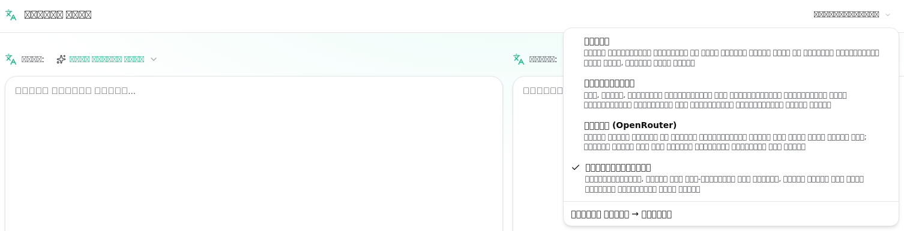
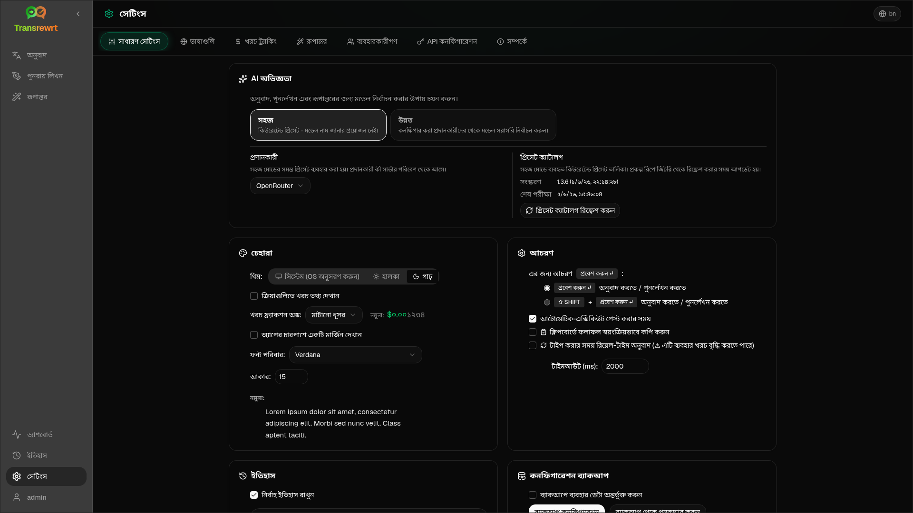

<a id="transrewrt-user-guide"></a>
# ব্যবহারকারীর গাইড

<br/>

<a id="introduction"></a>
## ভূমিকা

Transrewrt আপনাকে তিনটি প্রধান উপায়ে টেক্সট নিয়ে কাজ করতে সাহায্য করে:

- **অনুবাদ করুন** - একটি ভাষা থেকে অন্য ভাষায় পাঠ্য রূপান্তর করুন।
- **পুনঃলেখন** - পাঠ্য পুনরায় লিখুন ভিন্ন ধরনে, যেমন আরও স্পষ্ট, সংক্ষিপ্ত বা আনুষ্ঠানিক ভাবে।
- **রূপান্তর** - প্রম্পট নামে পরিচিত কাস্টম এআই নির্দেশনা ব্যবহার করে পাঠ্য প্রক্রিয়াকরণ করুন।

ডিফল্টভাবে অ্যাপটি **সহজ** মোডে চলে: আপনি একটি **প্রিসেট** বেছে নেন (যেমন ফ্রি (ওপেনরাউটার), স্ট্যান্ডার্ড, উন্নত, বা প্রযুক্তিগত) এবং সেটিংসে একটি **প্রদানকারী** বেছে নেন, মডেল আইডি না বেছে নিয়ে। যদি আপনি [**সেটিংস** > **সাধারণ সেটিংস**](#general-settings) এ ক্লাসিক মডেল তালিকা চান তবে **উন্নত** মোডে স্যুইচ করুন [**সেটিংস** > **মডেলগুলি**](#models) থেকে।

<br/>

এই গাইডটি অ্যাপ ইনস্টল করা এবং চালু করার পর এটি কীভাবে ব্যবহার করতে হয় তা ব্যাখ্যা করে। ইনস্টলেশনের ধাপগুলির জন্য, প্রধান [**README**](README.bn.md) দেখুন।

<br/>

> ℹ️ **নোট**<br/>
> Transrewrt উইন্ডোজ এবং লিনাক্সের জন্য একটি ডেস্কটপ অ্যাপ হিসাবে এবং একটি স্ব-হোস্টেড ওয়েব অ্যাপ হিসাবে উপলব্ধ। এই গাইডটি অ্যাপটির দৈনিক ব্যবহার নিয়ে কেন্দ্রিত। যেখানে কিছু শুধুমাত্র একটি সংস্করণের জন্য প্রযোজ্য, সেখানে এটি স্পষ্টভাবে চিহ্নিত করা হয়েছে।

<small>**অন্যান্য ভাষায় পড়ুন:** </small>
<small id="lang-list">[English (GB)](../USER-GUIDE.md) · [Português (Brasil)](./USER-GUIDE.pt-BR.md) · [العربية](./USER-GUIDE.ar.md) · [বাংলা](./USER-GUIDE.bn.md) · [Català](./USER-GUIDE.ca.md) · [中文 (中国大陆)](./USER-GUIDE.zh-CN.md) · [中文 (台灣)](./USER-GUIDE.zh-TW.md) · [Hrvatski](./USER-GUIDE.hr.md) · [Čeština](./USER-GUIDE.cs.md) · [Nederlands](./USER-GUIDE.nl.md) · [English (US)](./USER-GUIDE.en-US.md) · [Tagalog](./USER-GUIDE.tl.md) · [Français](./USER-GUIDE.fr.md) · [Deutsch](./USER-GUIDE.de.md) · [Ελληνικά](./USER-GUIDE.el.md) · [हिन्दी](./USER-GUIDE.hi.md) · [Magyar](./USER-GUIDE.hu.md) · [Italiano](./USER-GUIDE.it.md) · [日本語](./USER-GUIDE.ja.md) · [한국어](./USER-GUIDE.ko.md) · [Bahasa Melayu](./USER-GUIDE.ms.md) · [فارسی](./USER-GUIDE.fa.md) · [Polski](./USER-GUIDE.pl.md) · [Basa Jawa](./USER-GUIDE.jv.md) · [Português](./USER-GUIDE.pt.md) · [ਪੰਜਾਬੀ](./USER-GUIDE.pa.md) · [Română](./USER-GUIDE.ro.md) · [Русский](./USER-GUIDE.ru.md) · [Slovenčina](./USER-GUIDE.sk.md) · [Español](./USER-GUIDE.es.md) · [Kiswahili](./USER-GUIDE.sw.md) · [Svenska](./USER-GUIDE.sv.md) · [తెలుగు](./USER-GUIDE.te.md) · [ไทย](./USER-GUIDE.th.md) · [Türkçe](./USER-GUIDE.tr.md) · [Українська](./USER-GUIDE.uk.md) · [Tiếng Việt](./USER-GUIDE.vi.md)</small>

<small>

> **UI এবং নথি অনুবাদ সম্পর্কে নোট:** মূল ইংরেজি (UK) ছাড়া সমস্ত ইন্টারফেস ভাষা
> এআই মডেল ব্যবহার করে অনুবাদ করা হয়েছে; শব্দচয়ন অস্পষ্ট হতে পারে বা ত্রুটি থাকতে পারে।

</small>

<br/>

<!-- START doctoc generated TOC please keep comment here to allow auto update -->
<!-- DON'T EDIT THIS SECTION, INSTEAD RE-RUN doctoc TO UPDATE -->
**সূচিপত্র**

- [শুরু করার আগে](#before-you-start)
  - [একটি ফ্রি ওপেনরাউটার API কী কীভাবে পাবেন (ডেস্কটপ অ্যাপ)](#how-to-get-a-free-openrouter-api-key-desktop-app)
- [প্রথম ধাপ](#getting-started)
- [উইন্ডোর প্রধান অংশগুলি](#main-parts-of-the-window)
  - [সাইডবার](#sidebar)
  - [টুলবার](#toolbar)
  - [ইনপুট এবং আউটপুট প্যানেল](#input-and-output-panels)
- [অনুবাদ করুন](#translate)
  - [টেক্সট অনুবাদ করুন](#translate-text)
  - [ভাষা নির্বাচন](#language-selection)
  - [সহায়ক অনুবাদ সেটিংস](#helpful-translation-settings)
- [পুনঃলেখন](#rewrite)
- [রূপান্তর](#transform)
  - [একটি বিদ্যমান প্রম্পট চালান](#run-an-existing-prompt)
  - [আপনার কাছে এখনও কোনো প্রম্পট না থাকলে](#if-you-have-no-prompts-yet)
  - [দ্রুত একটি প্রম্পট তৈরি করুন](#create-a-prompt-quickly)
  - [একটি প্রম্পট সম্পাদনা করুন](#edit-a-prompt)
  - [ব্যবহার করার আগে একটি প্রম্পট পরীক্ষা করুন](#test-a-prompt-before-using-it)
- [ড্যাশবোর্ড](#dashboard)
  - [তথ্য ফিল্টার করুন](#filter-the-data)
  - [ড্যাশবোর্ড ট্যাব](#dashboard-tabs)
  - [তথ্য রপ্তানি করুন](#export-data)
  - [একটি মডেলের জন্য সংরক্ষিত রেকর্ডগুলি মুছুন](#delete-stored-records-for-a-model)
- [ইতিহাস](#history)
  - [ইতিহাস ফিল্টার করুন](#filter-the-history)
  - [ইতিহাসের তথ্য রপ্তানি করুন](#export-history-data)
- [সেটিংস](#settings)
  - [সাধারণ সেটিংস](#general-settings)
  - [মডেলগুলি](#models)
  - [ভাষাগুলি](#languages)
  - [খরচ ট্র্যাকিং](#cost-tracking)
  - [রূপান্তর (সেটিংস ট্যাব)](#transform-settings-tab)
  - [ব্যবহারকারীরা](#users)
  - [API কনফিগ](#api-config)
  - [সম্পর্কে](#about)
- [সাধারণ সমস্যা](#common-issues)
  - [অ্যাপটি টেক্সট অনুবাদ, পুনঃলেখন বা রূপান্তর করবে না](#the-app-will-not-translate-rewrite-or-transform-text)
  - [মডেল তালিকা খালি](#the-model-list-is-empty)
  - [ফলাফল খুব ধীর বা খুব ব্যয়বহুল](#the-result-is-too-slow-or-too-expensive)
  - [ইন্টারফেস ভুল ভাষায়](#the-interface-is-in-the-wrong-language)
  - [পাঠ্যটি খুব ছোট বা পড়তে কঠিন](#the-text-is-too-small-or-hard-to-read)
  - [ড্যাশবোর্ড সারাংশ খালি দেখাচ্ছে](#dashboard-summary-looks-empty)
  - [খরচ "উপলব্ধ নয়" দেখাচ্ছে বা ভুল মনে হচ্ছে](#cost-shows-not-available-or-seems-wrong)
  - [মোট খরচ আমার প্রদানকারীর বিলের সাথে মেলে না](#total-cost-does-not-match-my-provider-bill)
  - [সাইডবার থেকে ইতিহাস পৃষ্ঠাটি নেই](#the-history-page-is-missing-from-the-sidebar)
  - [ওয়েব অ্যাপ: অপ্রত্যাশিতভাবে লগইন পৃষ্ঠায় পুনঃনির্দেশিত হয়েছে](#web-app-redirected-to-the-login-page-unexpectedly)
  - [ওয়েব অ্যাডমিন: পাসওয়ার্ড ভুলে গেছেন বা হারিয়ে গেছেন](#web-admin-forgot-or-lost-a-password)
  - [ড্যাশবোর্ড অন্যান্য ব্যবহারকারীদের জন্য কোনো তথ্য দেখাচ্ছে না (ওয়েব)](#dashboard-shows-no-data-for-other-users-web)
  - [আমি একটি প্রম্পট পরিবর্তন করেছি এবং সম্পাদনাগুলি হারিয়ে গেছে](#i-changed-a-prompt-and-lost-the-edits)
- [দ্রুত টিপস](#quick-tips)
- [দাবি অস্বীকার](#disclaimer)
- [লাইসেন্স](#license)

<!-- END doctoc generated TOC please keep comment here to allow auto update -->

<br/><br/>

<a id="before-you-start"></a>
## শুরু করার আগে

Transrewrt ব্যবহার করতে হলে আপনার কমপক্ষে একটি AI প্রদানকারীতে অ্যাক্সেস থাকা প্রয়োজন। সমর্থিত প্রদানকারীগুলি হল: [OpenRouter](https://openrouter.ai) (যা অনেক মডেল একত্রিত করে), OpenAI, অ্যানথ্রোপিক, Google Gemini, ডিপসীক, গ্রোক, মিস্ট্রাল, এক্সএআই, সেরেব্রাস এবং স্থানীয় মডেলের জন্য [Ollama](https://ollama.com)।

শুরু করতে আপনার কোনো পেইড মডেল নির্বাচন করার প্রয়োজন নেই। আপনি যেই মুহূর্তে আপনার OpenRouter API কী যোগ করবেন, অ্যাপটি স্বয়ংক্রিয়ভাবে একটি অন্তর্নির্মিত **ফ্রি** OpenRouter বিকল্প সক্রিয় করবে। এটি আপনাকে অবিলম্বে টেক্সট অনুবাদ, পুনঃলেখন এবং রূপান্তর শুরু করতে দেবে। বিকল্পভাবে, আপনি Cerebras, Google, Groq বা Mistral AI থেকে একটি ফ্রি API কী পেতে পারেন।

সাধারণ ভাষায়:

- **সহজ** মোডে, একটি **প্রিসেট** (ফ্রি (ওপেনরাউটার), স্ট্যান্ডার্ড, উন্নত, বা প্রযুক্তিগত) আপনার নির্বাচিত **প্রদানকারী** (ওপেনরাউটার, ওপেনএআই, ওলামা, এবং অন্যান্য) এর জন্য একটি মডেলে ম্যাপ করে। শুধুমাত্র সেই প্রিসেটগুলি যেগুলির বর্তমান প্রদানকারীর জন্য একটি ম্যাপিং রয়েছে সেগুলি টুলবারে প্রদর্শিত হয়। আপনি অনুবাদ, পুনঃলেখন, এবং রূপান্তরের জন্য প্রিসেটটি নির্বাচন করেন।
- **উন্নত** মোডে, একটি **মডেল** হল AI ইঞ্জিন যা আপনি সরাসরি বেছে নেন। মডেল আইডি একটি **প্রদানকারী প্রিফিক্স** ব্যবহার করে (যেমন `openrouter/…`, `openai/…`, `ollama/…`)।
- একটি **এপিআই কী** (অথবা, ওলামার জন্য, একটি **বেস URL**) হল কিভাবে অ্যাপটি সেই প্রদানকারীর সাথে সংযোগ স্থাপন করে।

যদি আপনি **ডেস্কটপ অ্যাপ** ব্যবহার করেন, তবে প্রতিটি প্রদানকারীর জন্য [**সেটিংস** > **API কনফিগ**](#api-config) এ কী যোগ করুন। শুধুমাত্র ওপেনরাউটার ব্যবহারের জন্য, নিচে [ফ্রি ওপেনরাউটার API কী কীভাবে পাবেন](#how-to-get-a-free-openrouter-api-key-desktop-app) দেখুন। যদি আপনি API কী ব্যবহার করতে না চান, তবে আপনি ওলামা ইনস্টল করতে পারেন ( [ollama.com](https://ollama.com) থেকে) এবং `translategemma:4b` এর মতো স্থানীয় মডেলগুলি ব্যবহার করতে পারেন।

আপনি যদি **ওয়েব সংস্করণ** ব্যবহার করেন, তবে সার্ভার মালিক পরিবেশ পরিবর্তনশীল ব্যবহার করে প্রদানকারীদের কনফিগার করেন, তাই আপনি সরাসরি অ্যাপ্লিকেশনে API কী প্রবেশ করতে পারবেন না।

<br/>

<a id="how-to-get-a-free-openrouter-api-key-desktop-app"></a>
### ফ্রি ওপেনরাউটার API কী কীভাবে পাবেন (ডেস্কটপ অ্যাপ)

আপনি যদি ডেস্কটপ অ্যাপ ব্যবহার করেন, তবে নিম্নলিখিত পদক্ষেপগুলি অনুসরণ করুন:

1. আপনার ওয়েব ব্রাউজারে [OpenRouter](https://openrouter.ai) এ যান।
2. একটি অ্যাকাউন্ট তৈরি করুন অথবা সাইন ইন করুন।
3. [Keys](https://openrouter.ai/keys) পৃষ্ঠাটি খুলুন।
4. একটি নতুন API কী তৈরি করতে বাটনে ক্লিক করুন।
5. পরে আপনি যাতে এটি চিনতে পারেন সেজন্য কীটির একটি নাম দিন।
6. নতুন API কীটি কপি করুন।
7. Transrewrt-এ ফিরে যান এবং **সেটিংস** > **API কনফিগ** খুলুন।
8. **OpenRouter API কী**-এ কীটি পেস্ট করুন (**সেটিংস** > **API কনফিগ**-এর অধীনে)।
9. এটি কাজ করছে কিনা তা নিশ্চিত করতে **OpenRouter কী পরীক্ষা করুন** বাটনে ক্লিক করুন।

<br/><br/>

<a id="getting-started"></a>
## শুরু করা

আপনি যদি প্রথমবার Transrewrt ব্যবহার করছেন, তবে এই ক্রমটি অনুসরণ করুন:

1. অ্যাপটি খুলুন।
2. প্রয়োজনে গ্লোব আইকন থেকে আপনার **ইন্টারফেস ভাষা** নির্বাচন করুন।
3. যদি আপনি **ডেস্কটপ অ্যাপ** এ থাকেন, তবে [**সেটিংস** > **API কনফিগ**](#api-config) খুলুন, অন্তত একটি প্রদানকারীর জন্য একটি API কী যোগ করুন (যেমন ওপেনরাউটার), এবং এটি কাজ করে কিনা তা যাচাই করতে **পরীক্ষা করুন** ক্লিক করুন।
4. [**সেটিংস** > **সাধারণ সেটিংস**](#general-settings) খুলুন। **সহজ** মোডে (ডিফল্ট), একটি **প্রদানকারী** নির্বাচন করুন যার একটি কনফিগার করা কী রয়েছে। **উন্নত** মোডে, [**সেটিংস** > **মডেলগুলি**](#models) খুলুন এবং **নির্বাচিত মডেল** এ একটি বা একাধিক মডেল যোগ করুন।
5. **অনুবাদ করুন**-এ, টুলবারে একটি **প্রিসেট** (সহজ) অথবা **মডেল** (উন্নত) বেছে নিন।
6. [**সেটিংস** > **ভাষাগুলি**](#languages) খুলুন এবং আপনার **শীর্ষ ভাষাগুলি** বেছে নিন যদি আপনি চান যে আপনার সবচেয়ে ব্যবহৃত ভাষাগুলি প্রথমে প্রদর্শিত হোক।
7. সবকিছু কাজ করছে কিনা তা নিশ্চিত করতে একটি সাধারণ অনুবাদ চালান, তারপর **পুনঃলেখন** এবং **রূপান্তর** চেষ্টা করুন।

এই ক্রমটি গুরুত্বপূর্ণ। এটি সবচেয়ে সাধারণ প্রথম ব্যবহারের সমস্যা প্রতিরোধ করে: একটি কাজ চালানোর চেষ্টা করা আগে অ্যাপটির একটি কার্যকরী এপিআই সংযোগ বা নির্বাচিত প্রিসেট/মডেল না থাকা।

<br/><br/>

<a id="main-parts-of-the-window"></a>
## উইন্ডোর প্রধান অংশগুলি

অ্যাপটি তিনটি প্রধান অংশে বিভক্ত:

- বাম দিকের **সাইডবার**।
- উপরের **টুলবার**।
- কেন্দ্রের **কাজের এলাকা**।

<br/>

<a id="sidebar"></a>
### সাইডবার

অ্যাপের মধ্যে ঘোরার জন্য সাইডবার ব্যবহার করুন। অ্যাপ লোগোর পাশের আইকনে ক্লিক করে আপনি আরও জায়গার জন্য সাইডবার সংকুচিত করতে পারেন।

<br/>

<table>
  <tr>
    <td valign="top">
       
    </td>
    <td valign="top">
      <br/><br/>
      <ul>
        <li><strong>অনুবাদ করুন</strong> অনুবাদ কাজের স্থান খোলে।</li><br/>
        <li><strong>পুনঃলেখন</strong> পুনঃলেখনের কাজের স্থান খোলে।</li><br/>
        <li><strong>রূপান্তর</strong> কাস্টম প্রম্পটের কাজের স্থান খোলে।</li><br/>
        <li><strong>ড্যাশবোর্ড</strong> ব্যবহার এবং খরচের তথ্য দেখায়।</li><br/>
        <li><strong>সেটিংস</strong> সেটিংস প্যানেল খোলে।</li><br/>
        <li><strong>ইতিহাস</strong> ইনপুট এবং আউটপুট টেক্সট সহ ব্যবহারের ইতিহাস দেখায়</li><br/>
        <li><strong>ব্যবহারকারী</strong> লগ ইন করা ব্যবহারকারীর ব্যবহারকারীর নাম দেখায় (শুধুমাত্র ওয়েব)।</li>
      </ul>
    </td>
  </tr>
</table>

<br/>

<a id="toolbar"></a>
### টুলবার

অ্যাপের কোন অংশে আপনি আছেন তার উপর নির্ভর করে টুলবারটি সামান্য পরিবর্তিত হয়।

- বাম দিকে, এটি বর্তমান পৃষ্ঠার নাম প্রদর্শন করে।
- ডান দিকে, এটি **প্রিসেট বা মডেল সিলেক্টর** এবং **ইন্টারফেস ভাষা** নিয়ন্ত্রণ প্রদর্শন করে।

**সহজ** মোডে, টুলবারে একটি **প্রিসেট সিলেক্টর** প্রদর্শিত হয় যা অন্তর্নির্মিত প্রিসেটগুলি **ফ্রি (ওপেনরাউটার)**, **স্ট্যান্ডার্ড**, **উন্নত**, এবং **প্রযুক্তিগত**। কোন প্রিসেটগুলি প্রদর্শিত হবে তা নির্ভর করে আপনি [**সেটিংস** > **সাধারণ সেটিংস**](#general-settings) এ যে **প্রদানকারী** বেছে নিয়েছেন তার উপর—যেমন, **ফ্রি (ওপেনরাউটার)** শুধুমাত্র তখন তালিকাভুক্ত হয় যখন প্রদানকারী ওপেনরাউটার। যদি **প্রদানকারী** **ওলামা** হয়, তবে টুলবার আপনার ইনস্টল করা স্থানীয় মডেলগুলি প্রদর্শন করে প্রিসেটগুলির পরিবর্তে।

**উন্নত** মোডে, **মডেল নির্বাচনকারী** আপনাকে বর্তমান কাজের জন্য কোন AI ইঞ্জিন ব্যবহার করতে হবে তা নির্বাচন করতে দেয়।



উন্নত মোডে, কিছু ফ্রি মডেল সবসময় উপলব্ধ নাও থাকতে পারে—এগুলি অফলাইনে থাকতে পারে বা ব্যবহারের সীমা পৌঁছাতে পারে। অ্যাপটি স্বয়ংক্রিয়ভাবে আপনার তালিকা থেকে সেই মডেলটি সরিয়ে ফেলতে পারে। কোন মডেলগুলি প্রদর্শিত হবে তা নিয়ন্ত্রণ করতে, [**সেটিংস** > **মডেলগুলি**](#models) এ যান। আপনি টুলবারে মডেল নামের বাম দিকে প্রদানকারী আইকন থেকে মডেল সেটিংস খুলতে পারেন।

<br/>

**গ্লোব আইকন + ভাষার কোড** অ্যাপ ইন্টারফেস ভাষা, যেমন মেনু এবং বাটনগুলি পরিবর্তন করে। এটি **অনুবাদ করুন**-এ ব্যবহৃত অনুবাদ ভাষাগুলি পরিবর্তন করে **না**।


<br/>

<a id="input-and-output-panels"></a>
### ইনপুট এবং আউটপুট প্যানেল

বেশিরভাগ কাজের স্থানে বাম দিকের **ইনপুট** প্যানেল এবং ডান দিকের **আউটপুট** প্যানেল ব্যবহার করা হয়।

প্রতিটি প্যানেল এছাড়াও দেখায়:

| **ইনপুট**                                                          | **আউটপুট**                                                                                                                  |
|--------------------------------------------------------------------|-----------------------------------------------------------------------------------------------------------------------------|
| - অক্ষর গণনা <br/>- শব্দ গণনা <br/>- অনুচ্ছেদ গণনা   <br/> | - কাজটি কতক্ষণ সময় নিয়েছে<br/>- **TPS** (প্রতি সেকেন্ডে টোকেন)<br/>- অক্ষর, শব্দ এবং অনুচ্ছেদ গণনা<br/>- ব্যবহৃত মডেল |

যদি আপনি প্রযুক্তিগত শব্দগুলি সম্পর্কে ভাবছেন:

- **টোকেন** মানে টেক্সটের একটি ছোট টুকরো। আপনি এটিকে একটি শব্দের অংশ বা একটি ছোট শব্দ হিসাবে ভাবতে পারেন।
- **TPS** মানে প্রতি সেকেন্ডে মডেলটি কতগুলি টেক্সট টুকরো প্রক্রিয়া করেছে।

<br/>

আপনি [**সেটিংস** > **সাধারণ সেটিংস**](#general-settings) এ `Show cost information on the actions` বিকল্পটি সক্ষম করে প্রতিটি অপারেশনের খরচ (যদি উপলব্ধ থাকে) এবং মোট খরচ নজরদারি করতে পারেন।

<br/><br/>

[--------------------------------------------------------------------------------------------------------------------------]: #

<a id="translate"></a>
## অনুবাদ করুন

**অনুবাদ করুন** ব্যবহার করুন যখন আপনি একটি ভাষা থেকে অন্য ভাষায় টেক্সট রূপান্তর করতে চান।


<br/>

<a id="translate-text"></a>
### টেক্সট অনুবাদ করুন

1. **অনুবাদ করুন** খুলুন।
2. **থেকে** একটি ভাষা নির্বাচন করুন।
3. **তে** একটি ভাষা নির্বাচন করুন।
4. টুলবারে একটি প্রিসেট (সহজ) বা মডেল (উন্নত) নির্বাচন করুন।
5. **ইনপুট**-এ টেক্সট টাইপ করুন অথবা পেস্ট করুন।
6. **অনুবাদ করুন** ক্লিক করুন।
7. **আউটপুট**-এ ফলাফল পড়ুন।
8. ফলাফল কপি করতে চাইলে কপি বোতামটি ব্যবহার করুন।

<br/>

<a id="language-selection"></a>
### ভাষা নির্বাচন

- **থেকে** একটি নির্দিষ্ট ভাষা হতে পারে অথবা **ভাষা শনাক্ত করুন**।
- **করে** হল সেই ভাষা যেখানে আপনি ফলাফল চান।

আপনার নির্বাচিত **শীর্ষ ভাষাগুলি** তালিকার উপরের দিকে দেখানো হবে। আপনি [**সেটিংস** > **ভাষাগুলি**](#languages) এ গিয়ে এগুলি সেট করতে পারেন।

<br/>

<a id="helpful-translation-settings"></a>
### সহায়ক অনুবাদ সেটিংস

[**সেটিংস** > **সাধারণ সেটিংস**](#general-settings) এ গিয়ে আপনি অনুবাদের আচরণ পরিবর্তন করতে পারেন:

- **স্বয়ংক্রিয় নির্বাহ পেস্ট করার সময়** পাঠ্য পেস্ট করার সাথে সাথে একটি অনুবাদ চালায়।
- **ক্লিপবোর্ডে ফলাফল স্বয়ংক্রিয়ভাবে কপি করুন** সফল রান করার পরে ফলাফল স্বয়ংক্রিয়ভাবে কপি করে।
- **টাইপ করার সময় রিয়েল-টাইম অনুবাদ** (⚠️ এটি ব্যবহার খরচ বাড়াতে পারে) আপনি টাইপ করার সময় অনুবাদ চালায়।
- **টাইমআউট (মিলিসেকেন্ড)** নিয়ন্ত্রণ করে অ্যাপটি রিয়েল-টাইম অনুবাদ চালানোর আগে কতক্ষণ অপেক্ষা করবে।
- **ENTER এর জন্য আচরণ** নির্বাচন করে `Enter` কাজটি চালাবে নাকি একটি নতুন লাইন প্রবেশ করবে:
  - **Enter** অনুবাদ বা পুনরায় লিখন চালায় (ডিফল্ট)।
  - **Shift + Enter** অনুবাদ বা পুনরায় লিখন চালায়; সাধারণ **Enter** একটি নতুন লাইন প্রবেশ করে।

[--------------------------------------------------------------------------------------------------------------------------]: #

<a id="rewrite"></a>
## পুনঃলেখন

আপনি যখন মূল অর্থ না বদলেই শব্দচয়ন উন্নত করতে চান তখন **পুনঃলেখন** ব্যবহার করুন।


এটি নিম্নলিখিত ক্ষেত্রে কার্যকর:

- বানান এবং ব্যাকরণ সংশোধন করা (**বানান ও ব্যাকরণ পরীক্ষা করুন**)
- পাঠ্যকে স্পষ্ট করা (**স্পষ্টতা উন্নত করুন**)
- একবারে কয়েকটি স্বতন্ত্র পুনর্লিখন (**বিকল্প সংস্করণ**)
- পাঠ্যকে আরও আনুষ্ঠানিক বা আরও অনানুষ্ঠানিক করা (**আনুষ্ঠানিক করুন** / **অনানুষ্ঠানিক করুন**)
- টেক্সট সংক্ষেপ করা বা প্রসারিত করা (**সংক্ষেপ করুন** / **প্রসারিত করুন**)
- টেক্সটকে আরও প্রযুক্তিগত শোনানো (**প্রযুক্তিগত করুন**)

<br/>

> 💡 **টিপস**<br/>
> যখন আপনি "**বানান ও ব্যাকরণ পরীক্ষা করুন**" মোড ব্যবহার করেন, আউটপুট প্যানেলে (**কপি**-এর পাশে) একটি **পরিবর্তনগুলি দেখান** সুইচ দেখানো হয়।
> চালু বা বন্ধ করে আপনার টেক্সটে প্রয়োগ করা নির্দিষ্ট সংশোধনগুলি দেখানো বা লুকানো করুন।

<br/><br/>

[--------------------------------------------------------------------------------------------------------------------------]: #

<a id="transform"></a>
## রূপান্তর

যখন আপনি চান যে এআই কাস্টম নির্দেশাবলী অনুসরণ করুক তখন **রূপান্তর** ব্যবহার করুন।


এটি অ্যাপের সবচেয়ে নমনীয় অংশ। আপনি এটি নিম্নলিখিত কাজের জন্য ব্যবহার করতে পারেন:

- নোটগুলি সংক্ষেপ করা
- খসড়া টেক্সটকে পরিশীলিত ইমেলে পরিণত করা
- মূল বিষয়গুলি বের করা
- টেক্সটকে একটি নির্দিষ্ট ফরম্যাটে রূপান্তর করা
- ইনপুট টেক্সট নিয়ে অন্য যেকোনো কাস্টম কার্যকলাপ

<br/>

<a id="run-an-existing-prompt"></a>
### একটি বিদ্যমান প্রম্পট চালান

1. **রূপান্তর** খুলুন।
2. প্রম্পট তালিকা থেকে একটি প্রম্পট নির্বাচন করুন।
3. যদি একটি **From** ভাষার বাক্স প্রদর্শিত হয়, আপনি একটি ভাষা নির্বাচন করুন যদি আপনি চান।
4. **ইনপুট** এ পাঠ্য টাইপ করুন বা পেস্ট করুন।
5. **রূপান্তর**-এ ক্লিক করুন।
6. **আউটপুট**-এ ফলাফল পড়ুন।

<br/>

<a id="if-you-have-no-prompts-yet"></a>
### যদি আপনার কাছে এখনও কোনো প্রম্পট না থাকে

যদি আপনার প্রম্পট তালিকা খালি থাকে, তবে রূপান্তর কর্মক্ষেত্রে **নমুনা প্রম্পট লোড করুন** ক্লিক করুন। একই নিয়ন্ত্রণ সবসময় [**সেটিংস** > **রূপান্তর**](#transform-settings) এ রপ্তানি/আমদানি সারিতে উপলব্ধ। উভয়ই বিল্ট-ইন উদাহরণ যোগ করে যাতে আপনি দ্রুত শুরু করতে পারেন।

<br/>

> ℹ️ **নোট**<br/>
> নমুনা প্রম্পটগুলি ইংরেজিতে সরবরাহ করা হয়। সেগুলি লোড করার পরে, আপনি একটি প্রম্পট সম্পাদনা করতে পারেন এবং এটিকে আপনার ভাষায় অনুবাদ করতে **প্রম্পট অনুবাদ করুন** ব্যবহার করতে পারেন।

<br/>

<a id="create-a-prompt-quickly"></a>
### দ্রুত একটি প্রম্পট তৈরি করুন

একটি প্রম্পট তৈরি করার সবচেয়ে দ্রুত উপায় হলো:

1. ক্লিক করুন **নতুন প্রম্পট**।
2. ক্লিক করুন **প্রম্পট তৈরি করুন**।
3. বর্ণনা করুন আপনি প্রম্পটটি কী করতে চান।
4. একটি প্রিসেট (সহজ) অথবা মডেল (উন্নত) নির্বাচন করুন।
5. অ্যাপটিকে আপনার জন্য একটি খসড়া তৈরি করতে দিন।
6. খসড়াটি পর্যালোচনা করুন এবং **সংরক্ষণ করুন**-এ ক্লিক করুন।


<br/>

<a id="edit-a-prompt"></a>
### একটি প্রম্পট সম্পাদনা করুন

যখন আপনি একটি প্রম্পট তৈরি করেন বা সম্পাদনা করেন, বাম দিকে সম্পাদক দেখা যায় এবং ডান দিকে একটি পরীক্ষার এলাকা দেখা যায়।


প্রধান ক্ষেত্রগুলি হলো:

- **প্রম্পটের নাম**: প্রম্পট তালিকায় দেখানো নাম।
- **প্রম্পট নির্দেশনা (ঐচ্ছিক)**: প্রম্পট চালানোর সময় ব্যবহারকারীকে দেখানো একটি সংক্ষিপ্ত সূত্র।
- **মডেল ভূমিকা**: এআই-কে নির্ধারিত সামগ্রিক ভূমিকা, যেমন 'আপনি একজন সহায়ক সহকারী'।
- **মডেল নির্দেশনা (প্রতি লাইনে একটি)**: আপনি চান যে এআই অনুসরণ করুক এমন নির্দিষ্ট নিয়মগুলি।
- **আউটপুট বর্ণনা (উদাহরণস্বরূপ, রূপান্তরিত, সংক্ষিপ্ত ইত্যাদি)**: ফলাফল বর্ণনা করার জন্য একটি সংক্ষিপ্ত শব্দ।
- **তাপমাত্রা (0.0 → 1.0)**: মডেলটি কিভাবে আচরণ করবে; নিচে দেখুন।
- **লক্ষ্য ভাষা জিজ্ঞাসা করুন**: প্রম্পট চালানোর সময় একটি ভাষা নির্বাচক যোগ করে।
যদি প্রযুক্তিগত শব্দ **তাপমাত্রা** আপনার জন্য নতুন হয়, তাহলে এটি এরকম ভাবুন:

- একটি **নিম্ন** তাপমাত্রা স্থিতিশীল, আরও ভালোভাবে পূর্বানুমেয় ফলাফল দেয়।
- একটি **উচ্চ** তাপমাত্রা আরও বৈচিত্র্য এবং সৃজনশীলতা দেয়।

আপনি এটিও ব্যবহার করতে পারেন:

- `Generate prompt` একটি সহজ বর্ণনা থেকে একটি নতুন খসড়া তৈরি করতে
- `Improve prompt` একটি বিদ্যমান প্রম্পট পরিমার্জন করতে
- `Translate prompt` প্রম্পট ক্ষেত্রগুলি অনুবাদ করতে

<br/>

> ⚠️ **সতর্কীকরণ**<br/>
> `Back to Run`-এ ক্লিক করার আগে `Save`-এ ক্লিক করুন। সংরক্ষণ না করে ফিরে গেলে আপনার পরিবর্তনগুলি হারিয়ে যাবে।

<br/>

<a id="test-a-prompt-before-using-it"></a>
### ব্যবহার করার আগে একটি প্রম্পট পরীক্ষা করুন

ডানদিকের টেস্ট প্যানেলটি আপনাকে দৈনিক কাজে ব্যবহার করার আগে নমুনা টেক্সট দিয়ে আপনার প্রম্পট চালানোর সুযোগ দেয়।

এটি নিম্নলিখিত ক্ষেত্রে দরকারী:

- আপনি যখন একটি নতুন প্রম্পট তৈরি করছেন
- আপনি যখন একটি প্রম্পটের দুটি সংস্করণ তুলনা করছেন
- আপনি যখন টোন, দৈর্ঘ্য বা আউটপুট ফরম্যাট পরীক্ষা করতে চান

<br/>

> ℹ️ **নোট**<br/>
> আপনি [**সেটিংস** > **রূপান্তর**](#transform-settings) এ সংরক্ষিত প্রম্পটগুলি রপ্তানি এবং আমদানি করতে পারেন।

যখন আপনি প্রম্পট সম্পাদক এ **প্রম্পট তৈরি করুন**, **প্রম্পট উন্নত করুন**, বা **প্রম্পট অনুবাদ করুন** ব্যবহার করেন, **সহজ** মোড অনুবাদ এবং পুনঃলেখনের মতো একই প্রিসেট সিলেক্টর অফার করে; **উন্নত** মোড মডেল তালিকা ব্যবহার করে।

<br/><br/>

[--------------------------------------------------------------------------------------------------------------------------]: #

<a id="dashboard"></a>
## ড্যাশবোর্ড

**ড্যাশবোর্ড** ব্যবহার করুন অ্যাপটি কতটা ব্যবহার করছেন এবং এটি কত খরচ করছে তা দেখতে (পেইড মডেলের জন্য)।


<br/>

> ℹ️ **নোট**<br/>
> যদি আপনি শুধুমাত্র **ফ্রি** মডেল ব্যবহার করেন, তাহলে **খরচ** শূন্য হতে পারে এবং খরচ-কেন্দ্রিক KPI গুলি খালি দেখাতে পারে। তবুও **সারাংশ** ট্যাবটি নির্বাচিত সময়কালে ক্রিয়াকলাপ থাকলে translate, rewrite এবং transform-এর কল সংখ্যা দেখাবে।

<br/>

<a id="filter-the-data"></a>
### ডেটা ফিল্টার করুন

সময় পরিসর পরিবর্তন করতে উপরের ফিল্টার বোতামগুলি ব্যবহার করুন।


<br/>

> ℹ️ **নোট**<br/>
> **ব্যবহারকারী** ফিল্টারটি ওয়েব সংস্করণে শুধুমাত্র অ্যাডমিনদের জন্য দৃশ্যমান। সাধারণ ব্যবহারকারীদের এই ফিল্টারটি দেখানো হবে না, এবং ডেস্কটপ অ্যাপে এটি উপলব্ধ নয়।

<br/>

<a id="dashboard-tabs"></a>
### ড্যাশবোর্ড ট্যাব

- **সারাংশ** KPI কার্ডগুলি দেখায়: মোট খরচ, ব্যবহৃত মডেলগুলি, মোড অনুযায়ী কল সংখ্যা এবং খরচ (মোট কলের শতাংশ সহ), প্রতি কলের গড় খরচ, গড় TPS, এবং কল সংখ্যা অনুযায়ী শীর্ষ তিনটি মডেল।
- **মডেল অনুযায়ী** প্রতিটি মডেলের মোট কল, মোট খরচ এবং গড় TPS সহ তালিকা দেয়; translate, rewrite এবং transform-এর জন্য বিস্তারিত দেখতে একটি সারি প্রসারিত করুন।
- **সমস্ত কল** পূর্ণ কল লগ দেখায় (প্রশস্ত লেআউটে পৃষ্ঠায়ন করা, সংকীর্ণ স্ক্রিনে কার্ড), এবং আপনি এটি রপ্তানি করতে পারেন।

<br/>

<a id="export-data"></a>
### ডেটা রপ্তানি করুন

ড্যাশবোর্ড টেবিলগুলি নিম্নলিখিত ফরম্যাটে ডেটা রপ্তানি করতে পারে:

- **জেসন**
- **সিএসভি**
- **এক্সএলএসএক্স**

আপনি যদি অ্যাপের বাইরে ক্রিয়াকলাপ পর্যালোচনা করতে চান বা একটি প্রতিবেদন শেয়ার করতে চান তবে এটি কার্যকর।

<br/>

<a id="delete-stored-records-for-a-model"></a>
### একটি মডেলের জন্য সংরক্ষিত রেকর্ড মুছুন

**মডেল অনুযায়ী** বা **সমস্ত কল** এ, আপনি "ট্র্যাশ বিন" আইকনে ক্লিক করে একটি মডেলের জন্য সংরক্ষিত রেকর্ডগুলি মুছে ফেলতে পারেন।

> ⚠️ **সতর্কতা**<br/>
> সংরক্ষিত রেকর্ড মুছে ফেলা পূর্বাবস্থায় ফিরিয়ে আনা যাবে না। শুধুমাত্র তখনই এটি ব্যবহার করুন যখন আপনি নিশ্চিত যে আপনার আর সেই ইতিহাসের প্রয়োজন নেই।

সমস্ত ডেটা মুছে ফেলতে বা তাদের বয়সের ভিত্তিতে রেকর্ড সরাতে, [**সেটিংস** > **খরচ ট্র্যাকিং**](#cost-tracking)-এ যান। সেখানে আপনি সংরক্ষিত সমস্ত ডেটা মুছে ফেলার অথবা একটি নির্দিষ্ট তারিখের আগের ডেটা মাত্র মুছে ফেলার বিকল্প পাবেন।

<br/><br/>

[--------------------------------------------------------------------------------------------------------------------------]: #

<a id="history"></a>
## ইতিহাস

**ইতিহাস**-এ ক্লিক করুন **Transrewrt**-এর ভিতরে আপনার ক্রিয়াকলাপের ইতিহাস দেখতে, যার মধ্যে প্রতিটি অপারেশনের ইনপুট এবং আউটপুট অন্তর্ভুক্ত।


<br/>

<a id="filter-the-history"></a>
### ইতিহাস ফিল্টার করুন

**ইতিহাস** **ড্যাশবোর্ড** পৃষ্ঠার মতো একই সময়-পরিসর ফিল্টার ব্যবহার করে।


<br/>

> ℹ️ **নোট**<br/>
> **ওয়েব অ্যাপ**-এ, প্রত্যেকে (অ্যাডমিনিস্ট্রেটরদের মধ্যে সহ) শুধুমাত্র নিজের নিজের নির্বাহ ইতিহাস দেখতে পারে। **ড্যাশবোর্ড**-এ **ব্যবহারকারী** ফিল্টারটি অ্যাডমিনদের জন্য অ্যাকাউন্টগুলির মধ্যে ব্যবহার এবং খরচ পর্যালোচনা করার জন্য; এটি **ইতিহাস**-এ প্রযোজ্য নয়।

<br/>

<a id="export-history-data"></a>
### ইতিহাস ডেটা রপ্তানি করুন

ইতিহাস পৃষ্ঠা ফিল্টার করা ডেটা নিম্নলিখিত ফরম্যাটে রপ্তানি করতে পারে:

- **জেসন**
- **সিএসভি**
- **এক্সএলএসএক্স**

আপনি যদি অ্যাপের বাইরে ক্রিয়াকলাপ পর্যালোচনা করতে চান বা একটি প্রতিবেদন শেয়ার করতে চান তবে এটি কার্যকর।

<br/><br/>

[--------------------------------------------------------------------------------------------------------------------------]: #

<a id="settings"></a>
## সেটিংস

অ্যাপটি কীভাবে আচরণ করবে তা কাস্টমাইজ করতে পার্শ্বদণ্ড থেকে **সেটিংস** খুলুন।

উপলব্ধ ট্যাবগুলি প্ল্যাটফর্ম এবং আপনার ভূমিকার উপর নির্ভর করে:

| ট্যাব | ডেস্কটপ | ওয়েব (অ্যাডমিন) | ওয়েব (সাধারণ ব্যবহারকারী) | নোট |
|------------------|:-------:|:-----------:|:------------------:|----------------------------------------------|
| সাধারণ সেটিংস | yes | yes | yes | **AI অভিজ্ঞতা** (Easy / Advanced) অন্তর্ভুক্ত করে |
  | মডেলগুলি | yes | yes | yes | শুধুমাত্র যখন **AI অভিজ্ঞতা** **Advanced** হয় |
  | ভাষাগুলি | yes | yes | yes | |
  | খরচ ট্র্যাকিং | yes | yes | - | |
  | রূপান্তর | yes | yes | yes | রূপান্তর প্রম্পটগুলির বাল্ক ইম্পোর্ট/এক্সপোর্ট |
  | ব্যবহারকারীরা | - | yes | - | |
  | API কনফিগ | yes | yes | - | |
  | সম্পর্কে | yes | yes | yes | |

**সহজ** মোডে, মডেল নির্বাচন টুলবারে প্রিসেটগুলির মাধ্যমে এবং সাধারণ সেটিংসে **প্রদানকারী** এর মাধ্যমে ঘটে; **মডেলগুলি** ট্যাবটি লুকানো।

<br/>

> ℹ️ **নোট**<br/>
> ওয়েব সংস্করণে, প্রতিটি ব্যবহারকারীর নিজস্ব কনফিগারেশন রয়েছে। AI অভিজ্ঞতা, প্রদানকারী, নির্বাচিত মডেল বা প্রিসেট, ভাষাগুলি, সাধারণ অপশন, এবং ট্রান্সফর্ম প্রম্পটের মতো সেটিংস প্রতি ব্যবহারকারীর জন্য সংরক্ষিত হয়। আপনি যে পরিবর্তনগুলি করেন তা অন্যান্য ব্যবহারকারীদের প্রভাবিত করে না।

<br/>

[--------------------------------------------------------------------------------------------------------------------------]: #

<a id="general-settings"></a>
### সাধারণ সেটিংস

**সাধারণ সেটিংস** ব্যবহার করে টাইপিং আচরণ, **ইতিহাস**-এর জন্য নির্বাহের বিবরণ সংরক্ষণ করা হবে কিনা, চেহারা এবং আপনি কীভাবে Translate, Rewrite এবং Transform-এর জন্য AI নির্বাচন করবেন তা নিয়ন্ত্রণ করুন।

**AI অভিজ্ঞতা**

- **সহজ** (ডিফল্ট): একটি **প্রদানকারী** বেছে নিন (ওপেনরাউটার, ওপেনএআই, অ্যানথ্রোপিক, গুগল জেমিনি, ডিপসীক, গ্রোক, মিস্ট্রাল, এক্সএআই, সেরেব্রাস, বা ওলামা)। ক্লাউড প্রদানকারীরা টুলবারে অন্তর্নির্মিত প্রিসেটগুলি ব্যবহার করে। **ওলামা** আপনার মেশিনে ইনস্টল করা মডেলগুলি প্রিসেটগুলির পরিবর্তে তালিকাভুক্ত করে। সহজ মোডে, **প্রিসেটের তালিকা** ক্যাটালগ সংস্করণ এবং শেষ আপডেট সময় দেখায়; সর্বশেষ প্রিসেট তালিকা প্রকল্প রিপোজিটরি থেকে আনতে **প্রিসেট তালিকা রিফ্রেশ করুন** এ ক্লিক করুন (অ্যাপটি ব্যাকগ্রাউন্ডে নিয়মিত চেকও করে)।
- **উন্নত**: টুলবারে পৃথক মডেলগুলি বেছে নিন; [**সেটিংস** > **মডেলগুলি**](#models) এর অধীনে তালিকাটি পরিচালনা করুন।

**চেহারা**

- **থিম** হালকা, গা dark ় এবং সিস্টেমের চেহারার মধ্যে পরিবর্তন করে।
- **কার্যকলাপগুলিতে খরচের তথ্য দেখান** অপারেশনের প্রতি খরচের প্রদর্শন নিয়ন্ত্রণ করে (যদি উপলব্ধ থাকে) এবং অনুবাদ, পুনঃলেখন, এবং রূপান্তরের আউটপুট প্যানেলে মোট খরচ।
- **খরচের ভগ্নাংশ সংখ্যা** খরচের দশমিক সংখ্যা কিভাবে প্রদর্শিত হয় তা পরিবর্তন করে।
- **ওয়েব শুধুমাত্র:** **অ্যাপের চারপাশে মার্জিন দেখান** ইন্টারফেসের চারপাশে অতিরিক্ত স্থান যোগ করে।
- **ফন্ট ফ্যামিলি** টেক্সট প্যানেলে লেখার ফন্ট পরিবর্তন করে।
- **আকার** ফন্টের আকার পরিবর্তন করে।

**আচরণ**

- **ENTER এর জন্য আচরণ** নির্বাচন করে `Enter` কাজটি চালাবে নাকি একটি নতুন লাইন প্রবেশ করবে।
- **স্বয়ংক্রিয় নির্বাহ পেস্ট করার সময়** পাঠ্য পেস্ট করার সাথে সাথে অনুবাদ শুরু করে।
- **ক্লিপবোর্ডে ফলাফল স্বয়ংক্রিয়ভাবে কপি করুন** সফল ফলাফল স্বয়ংক্রিয়ভাবে কপি করে।
- **টাইপ করার সময় রিয়েল-টাইম অনুবাদ** (⚠️ এটি ব্যবহার খরচ বাড়াতে পারে) আপনি টাইপ করার সময় অনুবাদ করে।
- **টাইমআউট (মিলিসেকেন্ড)** রিয়েল-টাইম অনুবাদের জন্য অপেক্ষার সময় নির্ধারণ করে।

**ইতিহাস**

- **কার্যকরী ইতিহাস রাখুন** নিয়ন্ত্রণ করে যে প্রতিটি অনুবাদ, পুনঃলেখন, এবং রূপান্তর **ইনপুট এবং আউটপুট টেক্সট** সাইডবার [**ইতিহাস**](#history) দৃশ্যে সংরক্ষণ করে। এটি বন্ধ করলে নিশ্চিতকরণের জন্য জিজ্ঞাসা করা হয়; যদি আপনি নিশ্চিত হন, সংরক্ষিত ইতিহাসের টেক্সট ডেটাবেস থেকে মুছে ফেলা হয়। যদি লেবেলটি *প্রশাসক দ্বারা অক্ষম করা হয়েছে* দেখায়, আপনার ইনস্টলেশনে `HISTORY_DISABLED` পরিবেশে সেট করা হয়েছে (দেখুন [README](README.bn.md#configuration-and-environment)); আপনি UI থেকে ইতিহাস আবার চালু করতে পারবেন না।
- **ইতিহাসের তথ্য মুছুন** আপনাকে **মুছুন** ব্যবহার করে বয়স অনুযায়ী সংরক্ষিত টেক্সট মুছতে দেয় (যেমন কয়েক মাসের পুরনো, বা **সমস্ত তথ্য (সাফ করুন)**)। এটি শুধুমাত্র **ইতিহাস** দৃশ্যের জন্য সংরক্ষিত কার্যকরী টেক্সটকে প্রভাবিত করে; এটি **খরচ** বা ব্যবহার মোট মুছে ফেলে না। **খরচ** তথ্য মুছতে বা কাটছাঁট করতে, [**সেটিংস** > **খরচ ট্র্যাকিং**](#cost-tracking) ব্যবহার করুন।

**কনফিগারেশন ব্যাকআপ** (ডেস্কটপ অ্যাপ এবং ওয়েব প্রশাসকদের জন্য শুধুমাত্র)
- **ব্যাকআপে ব্যবহার ডেটা অন্তর্ভুক্ত করুন** - যখন সক্ষম করা হয়, ZIP তে কার্যকরী ইতিহাস এবং API কল ডেটা অন্তর্ভুক্ত থাকে।
- **ব্যাকআপ কনফিগারেশন** - একটি একক ZIP তৈরি করে (`transrewrt-config-backup-YYYY-MM-DD_HHMMSS.zip` স্থানীয় সময়ে) `config.json`, `state.json`, ঐচ্ছিক এনক্রিপশন কী, ব্যবহারকারীরা, পছন্দগুলি, কাস্টম প্রম্পট এবং ব্যবহার ডেটা যদি আপনি অপ্ট ইন করেন। সফল ব্যাকআপের পরে, নিশ্চিতকরণে সংরক্ষিত ফাইলের নাম দেখানো হয়।
- **ব্যাকআপ থেকে পুনরুদ্ধার করুন** - প্রথমে একটি **নিশ্চিতকরণ ডায়ালগ খুলে**। ডায়ালগের ভিতরে ব্যাকআপ ZIP নির্বাচন করুন (**ব্রাউজ** / ফাইল পিকার বা সমর্থিত হলে ড্র্যাগ-এন্ড-ড্রপ), তারপর বিকল্পগুলি পর্যালোচনা করুন:
  - **ব্যবহার ডেটা পুনরুদ্ধার করুন** - যখন এটি ব্যবহার অন্তর্ভুক্ত করে তখন ZIP থেকে ব্যবহার/ইতিহাস আমদানি করুন; যদি আপনি কেবল সেটিংস এবং প্রম্পট চান তবে বন্ধ রাখুন।
  - **পুনরুদ্ধারের আগে পুরানো ব্যবহার ডেটা মুছে ফেলুন** - এই ইনস্টলেশনে ব্যাকআপ প্রয়োগ করার আগে বিদ্যমান ব্যবহার/ইতিহাস মুছে ফেলুন (ঐচ্ছিক; পরিষ্কার প্রতিস্থাপনের জন্য ব্যবহার করুন)।
ওয়েব বা ডেস্কটপ সংস্করণে তৈরি ব্যাকআপ অন্যটিতে পুনরুদ্ধার করা যেতে পারে। ওয়েব সংস্করণে ডেস্কটপ ব্যাকআপ পুনরুদ্ধার করার সময়, ডেটা প্রশাসক ব্যবহারকারীর কাছে পুনরুদ্ধার করা হবে।

<br/>

<a id="models"></a>
### মডেলগুলি

এই ট্যাবটি কেবল তখনই উপলব্ধ যখন **AI অভিজ্ঞতা** **উন্নত** এ সেট করা থাকে [**সাধারণ সেটিংস**](#general-settings)-এ। টুলবারে কোন মডেলগুলি প্রদর্শিত হবে তা বেছে নিতে **সেটিংস** > **মডেলগুলি** ব্যবহার করুন।



পৃষ্ঠাটিতে দুটি তালিকা রয়েছে:

- বামদিকে **উপলব্ধ মডেল**
- ডানদিকে **নির্বাচিত মডেল**

উপযোগী নিয়ন্ত্রণগুলির মধ্যে রয়েছে:

- **মডেল খুঁজুন...** নাম অনুযায়ী মডেল খুঁজতে
- **প্রদানকারী** চিপস একটি ইঞ্জিনের জন্য তালিকা সংকুচিত করতে (ওপেনরাউটার, ওপেনএআই, ওলামা, …)
- শুধুমাত্র ফ্রি মডেল দেখাতে **শুধুমাত্র ফ্রি** ব্যবহার করুন
- তালিকা পুনরায় লোড করতে **রিফ্রেশ** করুন
- আপনি যখন প্রদানকারী অনুযায়ী সাজাচ্ছেন তখন **সব প্রসারিত করুন** এবং **সব সংকুচিত করুন**

মডেল আইডি-তে প্রদানকারীর উপসর্গ অন্তর্ভুক্ত থাকে (উদাহরণস্বরূপ `openrouter/…` বনাম `openai/…`)। **ওপেনএআই (ওপেনরাউটার)** বনাম **ওপেনএআই (সরাসরি)** এর মতো ব্যাজগুলি দেখায় যে ট্রাফিক কীভাবে রাউট করা হচ্ছে।

> ℹ️ **নোট**<br/>
> **ওপেনরাউটার বডি বিল্ডার** (`openrouter/bodybuilder`) একটি রাউটার মডেল, সাধারণ চ্যাট মডেল নয়: এর উত্তর হল জেসন যা ওপেনরাউটার এপিআই রিকোয়েস্ট বডি বর্ণনা করে (উদাহরণস্বরূপ `requests` অ্যারের মধ্যে `model` এবং `messages` সহ)। আপনি যদি এটি **অনুবাদ করুন**, **পুনঃলেখন** বা **রূপান্তর** এর জন্য ব্যবহার করেন, আউটপুট প্যানেলে সম্পূর্ণ টেক্সটের পরিবর্তে সেই জেসন দেখানো হবে। এই কাজের জন্য একটি সাধারণ টেক্সট মডেল নির্বাচন করুন। ওপেনরাউটারে [বডি বিল্ডার মডেল পৃষ্ঠা](https://openrouter.ai/openrouter/bodybuilder) দেখুন।

ক্রিয়াকলাপ:

- একটি মডেল যোগ করতে, **যোগ করুন** ক্লিক করুন অথবা এন্ট্রির যেকোনো জায়গায় ক্লিক করুন।

- একটি মডেল সরাতে, **নির্বাচিত মডেলগুলি** বা **উপলব্ধ মডেলগুলি**-তে এন্ট্রির পাশের **X** ক্লিক করুন।

- তালিকা সাফ করতে, **সব নির্বাচন বাতিল করুন** ক্লিক করুন। প্রয়োজনীয় ফ্রি মডেলটি তালিকাতে থাকবে।

<br/>

> ℹ️ **নোট**<br/>
> যদি আপনি সরাসরি ওপেনরাউটারে ক্রেডিট যোগ করতে না চান, তাহলে **শুধুমাত্র ফ্রি** সক্রিয় করে শুরু করুন এবং ফ্রি মডেলগুলি নির্বাচন করুন (ক্রেডিট কার্ডের প্রয়োজন নেই)। আপনি কোনো এপিআই কী ছাড়াই মডেল স্থানীয়ভাবে চালাতে ওলামা ব্যবহার করতে পারেন।

<br/>

<a id="languages"></a>
### ভাষাগুলি

**সেটিংস** > **ভাষাগুলি** ব্যবহার করে অ্যাপে ব্যবহৃত ভাষার তালিকা সাজান।

- **শীর্ষ ভাষাগুলি** **অনুবাদ করুন** এবং **রূপান্তর**-এ ভাষার তালিকার উপরের দিকে পিন করা থাকে।
- **কাস্টম ভাষা** আপনাকে অন্তর্ভুক্ত তালিকায় না থাকা একটি ভাষা যোগ করতে দেয়।

আপনি যদি একটি কাস্টম ভাষা যোগ করেন, তবে এটি অন্তর্ভুক্ত বিকল্পগুলির পাশাপাশি ভাষা সিলেক্টরগুলিতে দেখানো হবে।

<br/>

<a id="cost-tracking"></a>
### খরচ ট্র্যাকিং

**সেটিংস** > **খরচ ট্র্যাকিং** ব্যবহার করে খরচের তথ্য পরিচালনা করুন।

- **মোট খরচ** চলমান মোট দেখায়।
- **মান কপি করুন** মোট ক্লিপবোর্ডে কপি করে।
- **খরচ রিসেট করুন** সংরক্ষিত মোট শূন্যে সেট করে।
- **API কী ব্যবহারের সাথে সিঙ্ক করুন** আপনার ওপেনরাউটার অ্যাকাউন্ট দ্বারা প্রতিবেদিত ব্যবহারের সাথে মিল রেখে মোট সেট করে (শুধুমাত্র ওপেনরাউটার)।
- **API কী ব্যবহার** ওপেনরাউটার ব্যবহারের বিস্তারিত দেখায়, যদি উপলব্ধ থাকে।
- **খরচের তথ্য মুছুন** সমস্ত তথ্য মুছে ফেলে, অথবা নির্বাচিত তারিখের আগের এন্ট্রিগুলি মাত্র।

**খরচ ট্র্যাকিং:** যখন আপনি ওপেনরাউটার মডেল ব্যবহার করেন, তখন অ্যাপটি ওপেনরাউটার থেকে খরচের তথ্যের ভিত্তিতে আপনার প্রকৃত ব্যবহার এবং খরচ দেখায়। অন্য সমস্ত প্রদানকারীদের জন্য, অ্যাপটি ওপেনরাউটার দ্বারা প্রকাশিত মূল্য ব্যবহার করে খরচের অনুমান করে, যদি মূল্য অপ্রাপ্য হয়, তবে অনুমান শূন্য হতে পারে।

<br/>

> ℹ️ **নোট**<br/>
> **সমস্ত খরচের চিত্র শুধুমাত্র আপনার তথ্যের জন্য অনুমান, আনুষ্ঠানিক বিলিং বিবৃতি নয়।**

<br/>

> ⚠️ **সতর্কতা**<br/>
> ডেটা মুছে ফেলা পুনরুদ্ধারযোগ্য নয়। মুছে ফেলার আগে, [**ইতিহাস**](#history) এর মাধ্যমে আপনার ডেটা ব্যাক আপ করুন বা রপ্তানি করুন
> অথবা [**ড্যাশবোর্ড** > **সমস্ত কল**](#dashboard-tabs), না হলে এটি চিরতরে হারিয়ে যাবে।
> প্রতিটি এপিআই কল এন্ট্রির সাথে সম্পর্কিত সমস্ত ইনপুট/আউটপুট ইতিহাসও মুছে ফেলা হবে।

<br/>

<a id="transform-settings"></a>
### রূপান্তর (সেটিংস ট্যাব)

**সেটিংস** > **রূপান্তর** ব্যবহার করে প্রম্পটগুলি একসাথে পরিচালনা করুন।

আপনি পারবেন:

- আপনার সংরক্ষিত প্রম্পটগুলি পর্যালোচনা করুন
- প্রম্পটগুলি মুছুন
- একটি ফাইল থেকে প্রম্পট আমদানি করুন
- ব্যাকআপ বা শেয়ার করার জন্য প্রম্পটগুলি রপ্তানি করুন
- প্রম্পট তালিকায় নমুনা প্রম্পট লোড করুন

<br/>

<a id="users"></a>
### ব্যবহারকারীরা

ওয়েব সংস্করণে ব্যবহারকারী অ্যাকাউন্ট পরিচালনা করতে **ব্যবহারকারীদের** ব্যবহার করুন। আপনি ব্যবহারকারীদের যোগ করতে পারেন, তাদের বিবরণ আপডেট করতে পারেন, পাসওয়ার্ড রিসেট করতে পারেন এবং অ্যাকাউন্টগুলি মুছে ফেলতে পারেন।

<br/>

<a id="api-config"></a>
### API কনফিগ

সমর্থিত প্রদানকারীদের মধ্যে রয়েছে: ওপেনরাউটার, ওপেনএআই, অ্যানথ্রোপিক, গুগল জেমিনি, ডিপসীক, গ্রোক, মিস্ট্রাল, এক্সএআই, সেরেব্রাস, এবং **ওলামা** (বেস URL এর মাধ্যমে স্থানীয় মডেল)। আপনি শুধুমাত্র আপনার ব্যবহৃত প্রদানকারীদের কনফিগার করার প্রয়োজন হবে।

**ওয়েব অ্যাপ্লিকেশন: শুধুমাত্র প্রশাসক**

API কীগুলি সিস্টেম বা ডকার পরিবেশ ভেরিয়েবলের মাধ্যমে কনফিগার করা হয় - ওয়েব UI-এ এগুলি প্রবেশ করানো হয় না। এই পৃষ্ঠাটি দেখায় কোন প্রদানকারীদের জন্য একটি কী কনফিগার করা হয়েছে এবং আপনি `Test` বোতামে ক্লিক করে প্রতিটি পরীক্ষা করতে পারেন।

<br/>

> ℹ️ **নোট**<br/>
> একটি API কী পরিবর্তন করতে, আপনার সিস্টেম বা ডকার কনফিগারেশনে পরিবেশ ভেরিয়েবল আপডেট করুন এবং সার্ভার বা কনটেইনার পুনরায় চালু করুন।

<br/>

> ℹ️ **নোট**<br/>
> **কনফিগারেশন ব্যাকআপ** ([**সাধারণ সেটিংস** → কনফিগারেশন ব্যাকআপ](#general-settings) দেখুন) ZIP-এর ভিতরে `config.json`-এর মধ্যে **সমাধানকৃত** প্রদানকারী কীগুলি এম্বেড করতে পারে। সেই ZIP পুনরুদ্ধার করা হলে সেই কীগুলি সার্ভারের সংরক্ষিত কনফিগ ফাইলে ফিরে কপি করা হয় **না** - বর্তমান কীগুলি এখনও পরিবেশ এবং বিবৃত অবস্থান অনুযায়ী বিদ্যমান ফাইল থেকে আসে।

<br/>

**ডেস্কটপ অ্যাপ্লিকেশন**

আপনি যে প্রতিটি প্রদানকারী ব্যবহার করেন তাদের জন্য API কী সংরক্ষণ করতে **API কনফিগ** ব্যবহার করুন। ওলামার জন্য, একটি API কী নয়, **বেস URL** প্রবেশ করান।

<br/>

> 💡 **টিপ** <br/>
> যদি আপনি কোনো API কী ব্যবহার করতে না চান বা ব্যবহারের জন্য অর্থ প্রদান করতে না চান, তবে আপনি [ওলামা ডাউনলোড করতে পারেন](https://ollama.com) এবং আপনার মেশিনে বিনামূল্যে মডেলগুলি (যেমন `translategemma:4b`) স্থানীয়ভাবে চালাতে পারেন। বিকল্পভাবে, আপনি তাদের ফ্রি মডেলগুলি ব্যবহার করার জন্য একটি ফ্রি ওপেনরাউটার অ্যাকাউন্ট তৈরি করতে পারেন (ক্রেডিট কার্ডের প্রয়োজন নেই), অথবা সেরেব্রাস, গুগল, গ্রোক, বা মিস্ট্রাল এআই থেকে একটি ফ্রি API কী পেতে পারেন।

<br/>

- শুধুমাত্র আপনার প্রয়োজনীয় প্রদানকারীদের যোগ করুন। **সেটিংস** > **মডেলগুলি**-এ, প্রতিটি মডেল আইডি প্রদানকারী দিয়ে শুরু হয় (উদাহরণস্বরূপ `openrouter/openrouter/free`, `openai/gpt-4o`, `ollama/llama3`)।

একটি API কী যোগ করতে, টেক্সট ফিল্ডে মান প্রবেশ করান এবং `Save` বোতামে ক্লিক করুন। একটি বিদ্যমান কী প্রতিস্থাপন করতে, `Edit` ক্লিক করুন। কীটি কাজ করছে কিনা তা যাচাই করতে, `Test` ক্লিক করুন। ওলামা বেস URL-এর জন্য, সংযোগ পরীক্ষা করতে সবসময় `Test` ক্লিক করুন।

<br/>

> ℹ️ **নোট**<br/>
> আপনি একটি API কী-এর বর্তমান মান দেখতে পারবেন না। আপনি শুধুমাত্র `Edit` বোতাম ব্যবহার করে এটি প্রতিস্থাপন করতে পারেন।
> API কীগুলি কনফিগারেশনে এনক্রিপ্ট করা হয়ে সংরক্ষিত হয়।

<br/>

<a id="about"></a>
### সম্পর্কে

**সম্পর্কে** ট্যাবে দেখানো হয়:

- অ্যাপের নাম এবং ট্যাগলাইন
- সংস্করণ নম্বর এবং বিল্ড তারিখ
- লাইসেন্স এবং কপিরাইট তথ্য, **তৃতীয় পক্ষের বিজ্ঞপ্তি** খুলতে একটি লিঙ্ক সহ
- প্রকল্প রিপোজিটরিতে একটি লিঙ্ক

<br/><br/>

<a id="common-issues"></a>
## সাধারণ সমস্যা

যদি কিছু আশা অনুযায়ী কাজ না করে, তাহলে প্রথমে নিম্নলিখিত বিষয়গুলি পরীক্ষা করুন।

<br/>

<a id="the-app-will-not-translate-rewrite-or-transform-text"></a>
### অ্যাপটি টেক্সট অনুবাদ, পুনঃলেখন বা রূপান্তর করবে না

নিশ্চিত করুন যে:

- আপনি টুলবারে একটি **প্রিসেট** (সহজ) বা **মডেল** (উন্নত) নির্বাচন করেছেন
- **সহজ** মোডে, [**সেটিংস** > **সাধারণ সেটিংস**](#general-settings) এ একটি **প্রদানকারী** রয়েছে যার একটি কার্যকর কী (অথবা ওলামা URL) এবং সেই প্রদানকারীর জন্য অন্তত একটি প্রিসেট রয়েছে
- **উন্নত** মোডে, [**সেটিংস** > **মডেলগুলি**](#models) এ অন্তত একটি মডেল তালিকাভুক্ত রয়েছে
- আপনার এপিআই সেটআপ কাজ করছে

যদি আপনি ডেস্কটপ অ্যাপটি ব্যবহার করেন:

1. [**সেটিংস** > **API কনফিগ**](#api-config) খুলুন।
2. নিশ্চিত করুন যে কমপক্ষে একটি API কী সংরক্ষিত আছে।
3. কীটি কাজ করছে কিনা তা নিশ্চিত করতে প্রদানকারীর পাশে **পরীক্ষা করুন** ক্লিক করুন।

<br/>

<a id="the-model-list-is-empty"></a>
### মডেলের তালিকা খালি

**সহজ** মোডে, [**সেটিংস** > **সাধারণ সেটিংস**](#general-settings) খুলুন, নিশ্চিত করুন যে **প্রদানকারী** সেট করা হয়েছে, এবং [**API কনফিগ**](#api-config) এ কী যোগ করুন বা পরীক্ষা করুন (ডেস্কটপ) অথবা আপনার প্রশাসকের কাছে জিজ্ঞাসা করুন (ওয়েব)। **ওলামা** এর জন্য, বেস URL এ **পরীক্ষা করুন** চালান এবং নিশ্চিত করুন যে মডেলগুলি স্থানীয়ভাবে ইনস্টল করা হয়েছে।

**উন্নত** মোডে, [**সেটিংস** > **মডেলগুলি**](#models) খুলুন এবং **রিফ্রেশ** ক্লিক করুন। প্রয়োজন হলে, একটি মডেল খুঁজুন, **শুধুমাত্র ফ্রি** চালু করুন, এবং **নির্বাচিত মডেল** এ মডেলগুলি যোগ করুন।

<br/>

<a id="the-result-is-too-slow-or-too-expensive"></a>
### ফলাফল খুব ধীর বা খুব ব্যয়বহুল

এর মধ্যে এক বা একাধিক চেষ্টা করুন:

- একটি ভিন্ন পূর্বনির্ধারিত (সহজ) বা মডেল (উন্নত) নির্বাচন করুন
- একটি সংক্ষিপ্ত ইনপুট ব্যবহার করুন
- [**সেটিংস** > **সাধারণ সেটিংস**](#general-settings) এ **টাইপ করার সময় রিয়েল-টাইম অনুবাদ** বন্ধ করুন
- সহজ কাজের জন্য বিনামূল্য মডেল ব্যবহার করুন (দেখুন [মডেলগুলি](#models))
<br/>

<a id="the-interface-is-in-the-wrong-language"></a>
### ইন্টারফেস ভুল ভাষায়

[টুলবার](#toolbar) এ গ্লোব আইকনে ক্লিক করুন এবং আপনার পছন্দের **ইন্টারফেস ভাষা** নির্বাচন করুন।

<br/>

<a id="the-text-is-too-small-or-hard-to-read"></a>
### টেক্সট খুব ছোট বা পড়তে কষ্টকর

[**সেটিংস** > **সাধারণ সেটিংস**](#general-settings) খুলুন এবং পরিবর্তন করুন:

- **ফন্ট ফ্যামিলি**
- **আকার**

<br/>

<a id="dashboard-summary-looks-empty"></a>
### ড্যাশবোর্ড সারাংশ খালি দেখাচ্ছে

এটি স্বাভাবিক হবে যদি:

- আপনি শুধুমাত্র **ফ্রি মডেল** ব্যবহার করছেন এবং আপনি **খরচ** সংখ্যাগুলি দেখছেন (এগুলি শূন্য হতে পারে); **সারাংশ** এ কল-গণনা KPI এখনও নির্বাচিত সময়ের তথ্য প্রয়োজন
- নির্বাচিত **টাইম ফিল্টার** সেই সময়কালকে কভার করে না যখন কলগুলি করা হয়েছিল — পরীক্ষা করতে **সব** চেষ্টা করুন

যদি **সব** নির্বাচন করার পরও KPI শূন্য থাকে, নিশ্চিত করুন যে কলগুলি [**ইতিহাস**](#history) এ বা **সমস্ত কল** ট্যাবে প্রদর্শিত হচ্ছে।

<br/>

<a id="cost-shows-not-available-or-seems-wrong"></a>
### খরচ "উপলব্ধ নয়" দেখাচ্ছে বা ভুল মনে হচ্ছে

যখন আপনি **ওপেনরাউটার** এর মাধ্যমে মডেল ব্যবহার করেন, অ্যাপটি ওপেনরাউটার দ্বারা প্রতিবেদিত আপনার প্রকৃত খরচ দেখায়।

**অন্যান্য প্রদানকারীদের** (ওপেনএআই সরাসরি, অ্যানথ্রোপিক সরাসরি ইত্যাদি) জন্য, খরচ ওপেনরাউটার দ্বারা প্রকাশিত মূল্য তথ্য থেকে আনুমানিক করা হয়। যদি কোনো মডেলের জন্য মিলে যাওয়া মূল্য না পাওয়া যায়, তবে খরচ **উপলব্ধ নয়** হিসাবে দেখানো হবে এবং আপনার মোট হিসাবে যুক্ত হবে না।

<br/>

<a id="total-cost-does-not-match-my-provider-bill"></a>
### মোট খরচ আপনার প্রদানকারীর বিলের সাথে মেলে না

অ্যাপের সমস্ত খরচের তথ্য শুধুমাত্র **তুলনামূলক আনুমানিক**, আনুমানিক বিলিং বিবৃতি নয়।

আপনার প্রকৃত ওপেনরাউটার খরচের কাছাকাছি মোট পেতে, [**সেটিংস** > **খরচ ট্র্যাকিং**](#cost-tracking) খুলুন এবং **API কী ব্যবহারের সাথে সিঙ্ক করুন** এ ক্লিক করুন।

<br/>

<a id="the-history-page-is-missing-from-the-sidebar"></a>
### সাইডবারে ইতিহাস পৃষ্ঠাটি নেই

**কার্যকরী ইতিহাস রাখুন** বন্ধ করা যেতে পারে। [**সেটিংস** > **সাধারণ সেটিংস**](#general-settings) খুলুন এবং এটি সক্ষম করুন যতক্ষণ না ইতিহাস *প্রশাসক দ্বারা অক্ষম করা হয়েছে* (`HISTORY_DISABLED` পরিবেশে — দেখুন [README](README.bn.md#configuration-and-environment)). ইতিহাস চালু করা পূর্বে মুছে ফেলা টেক্সট পুনরুদ্ধার করে না।

<br/>

<a id="web-app-session-expired"></a>
### ওয়েব অ্যাপ: অপ্রত্যাশিতভাবে লগইন পৃষ্ঠায় পুনঃনির্দেশিত হচ্ছে

আপনার সেশনটি সময় শেষ হয়ে গেছে হতে পারে। আবার লগ ইন করুন। যদি এটি প্রায়শই ঘটে, তবে সেশন আজীবন সেটিংসের জন্য সার্ভার কনফিগারেশন পরীক্ষা করুন।

<br/>

<a id="web-admin-forgot-or-lost-a-password"></a>
### ওয়েব অ্যাডমিন: পাসওয়ার্ড ভুলে গেছেন বা হারিয়ে গেছেন

এটি **সেলফ-হোস্টেড ওয়েব অ্যাপ** (ডকার) এর ক্ষেত্রে প্রযোজ্য, ডেস্কটপ (ইলেকট্রন) অ্যাপ নয়।

- যদি অন্য কোনো অ্যাডমিনিস্ট্রেটর এখনও সাইন ইন করতে পারেন, তবে তারা [**সেটিংস** > **ব্যবহারকারীরা**](#users) খুলতে পারেন, অ্যাকাউন্টটি নির্বাচন করতে পারেন এবং সেখানে একটি **নতুন পাসওয়ার্ড** সেট করতে পারেন।
- যদি আপনি **লক আউট** হয়ে থাকেন কিন্তু মেশিন বা কনটেইনারে **শেল অ্যাক্সেস** থাকে, তবে ইমেজের সাথে আসা হেল্পার ব্যবহার করে পাসওয়ার্ড রিসেট করুন (ডিফল্ট নাম পরিবর্তন করলে `transrewrt` পরিবর্তন করুন, এবং যদি পাসওয়ার্ডে স্পেস বা বিশেষ অক্ষর থাকে তবে উদ্ধৃতি ব্যবহার করুন):

```bash
docker exec transrewrt reset-web-password '<username>' '<new-password>'
```

ডিফল্ট অ্যাডমিন ব্যবহারকারীর নাম `admin` যদি আপনি কখনও অন্য অ্যাকাউন্ট তৈরি না করে থাকেন। যখন আপনি শুধুমাত্র একটি আর্গুমেন্ট পাস করেন, তখন এটি `admin`-এর জন্য নতুন পাসওয়ার্ড হিসাবে বিবেচিত হয়।

যদি আপনি ডকারের পরিবর্তে একটি **সোর্স চেকআউট** থেকে চালান, তবে ব্যবহার করুন:

```bash
pnpm run reset-web-password -- <username> <new-password>
```

স্ক্রিপ্টটি SQLite ডাটাবেসে ব্যবহারকারীর রেকর্ড আপডেট করে (এবং `admin` ব্যবহারকারী অনুপস্থিত থাকলে তৈরি করতে পারে)। রিসেট করার পর, নতুন পাসওয়ার্ড দিয়ে সাইন ইন করুন।

<br/>

<a id="dashboard-shows-no-data-for-other-users"></a>
### ড্যাশবোর্ড অন্যান্য ব্যবহারকারীদের জন্য কোনো তথ্য দেখায় না (ওয়েব)

শুধুমাত্র **প্রশাসকদের** **ব্যবহারকারী** ফিল্টারের মাধ্যমে সমস্ত ব্যবহারকারীর তথ্য দেখার অনুমতি আছে। নিয়মিত ব্যবহারকারীরা নকশা অনুযায়ী শুধুমাত্র নিজেদের ক্রিয়াকলাপ দেখতে পারে।

<br/>

<a id="i-changed-a-prompt-and-lost-the-edits"></a>
### আমি একটি প্রম্পট পরিবর্তন করেছি এবং সম্পাদনাগুলি হারিয়ে গেছে

একটি প্রম্পট সম্পাদনা করার সময়, **রান-এ ফিরে যান**-এ ক্লিক করার আগে সবসময় **সংরক্ষণ করুন**-এ ক্লিক করুন।

<br/><br/>

<a id="quick-tips"></a>
## দ্রুত টিপস

- আপনার সেটআপ কাজ করছে কিনা তা নিশ্চিত করার জন্য আগে [**অনুবাদ করুন**](#translate) দিয়ে শুরু করুন, তারপর [**পুনঃলেখন**](#rewrite) বা [**রূপান্তর**](#transform)-এ যান।
- দৈনিক ভাষাগত উন্নতির জন্য [**পুনঃলেখন**](#rewrite) ব্যবহার করুন।
- একটি নির্দিষ্ট কাজের জন্য পুনরাবৃত্তিযোগ্য কাজের ধারা প্রয়োজন হলে [**রূপান্তর**](#transform) ব্যবহার করুন।
- ব্যবহার এবং খরচ নজরে রাখতে চাইলে [**ড্যাশবোর্ড**](#dashboard) ব্যবহার করুন।
- [**ইতিহাস**](#history) ব্যবহার করে পূর্ববর্তী কার্যক্রম এবং তাদের সম্পূর্ণ ইনপুট/আউটপুট টেক্সট পর্যালোচনা করুন।
- আপনি যদি একটি প্রম্পট লাইব্রেরি তৈরি করছেন যা আপনি নিরাপদ রাখতে চান তবে নিয়মিত প্রম্পট রপ্তানি করুন (দেখুন [রূপান্তর](#transform)) অথবা আপনি যদি এটি অন্যদের সাথে শেয়ার করতে চান।
- আপনি মডেল আইডিগুলির উপর সূক্ষ্ম নিয়ন্ত্রণ প্রয়োজন না হওয়া পর্যন্ত **সহজ** মোডে থাকুন; আপনি ইতিমধ্যে জানলে **উন্নত** এ স্যুইচ করুন যে আপনি কোন মডেলগুলি চান।

<br/><br/>

<a id="disclaimer"></a>
## ডিসক্লেইমার

পণ্যের নাম ও আইকন তাদের নিজ নিজ মালিকদের সম্পত্তি এবং শুধুমাত্র শনাক্তকরণের উদ্দেশ্যে ব্যবহৃত। এই সফ্টওয়্যারটি উল্লিখিত কোনো ব্র্যান্ডের সাথে সম্পর্কিত বা তাদের দ্বারা অনুমোদিত নয়।

<br/><br/>

<a id="license"></a>
## লাইসেন্স

কপিরাইট © 2026 ওয়ালডেমার স্কুডেলার জুনিয়র।

[Apache License 2.0](../LICENSE)
