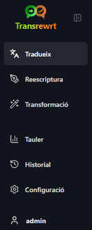
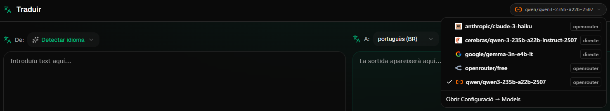
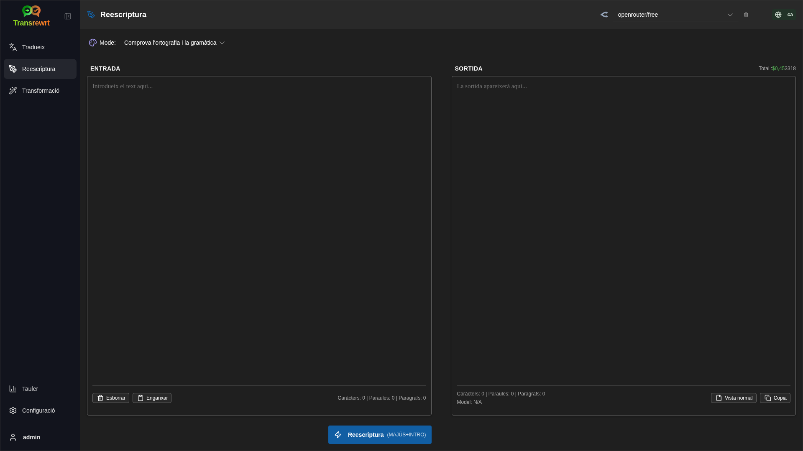
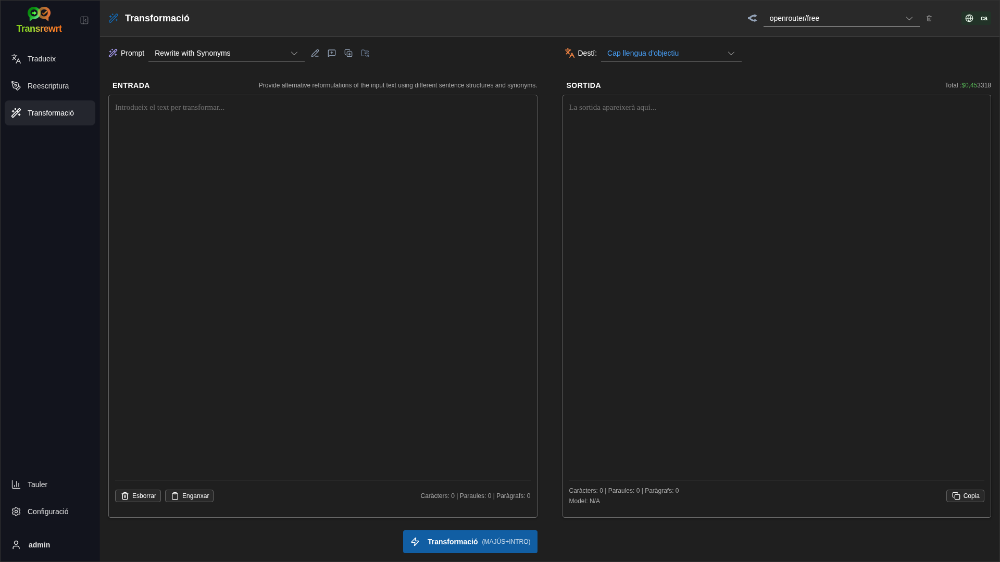
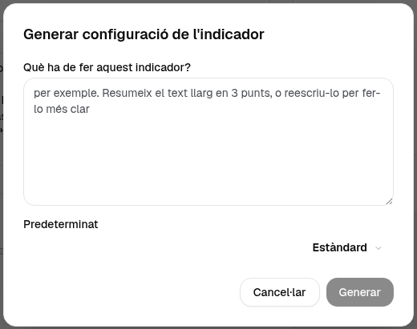
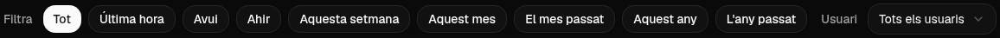

<a id="transrewrt-user-guide"></a>
# Guia d'usuari

<br/>

<a id="introduction"></a>
## Introducció

Transrewrt us ajuda a treballar amb text de tres maneres principals:

- **Tradueix** - converteix text d'un idioma a un altre.
- **Reescriptura** - reformula el text en un estil diferent, com ara més clar, més curt o més formal.
- **Transformació** - processa text mitjançant instruccions personalitzades d'intel·ligència artificial anomenades prompts.

<br/>

Aquesta guia explica com utilitzar l'aplicació un cop instal·lada i en funcionament. Per als passos d'instal·lació, consulteu el **[README](README.ca.md)** principal.

<br/>

> ℹ️ **NOTA**<br/>
> Transrewrt està disponible com a aplicació d'escriptori per a Windows i Linux, i com a aplicació web autoallotjada. Aquesta guia es centra en l'ús diari de l'aplicació. Quan alguna cosa només s'aplica a una versió, està clarament indicat.

<small>**Llegiu en altres idiomes:** </small>
<small id="lang-list"> [English (UK)](../USER-GUIDE.md) · [Português (BR)](USER-GUIDE.pt-BR.md) · [العربية](USER-GUIDE.ar.md) · [বাংলা](USER-GUIDE.bn.md) · [Català](USER-GUIDE.ca.md) · [简体中文](USER-GUIDE.zh-CN.md) · [繁體中文](USER-GUIDE.zh-TW.md) · [Hrvatski](USER-GUIDE.hr.md) · [Čeština](USER-GUIDE.cs.md) · [Nederlands](USER-GUIDE.nl.md) · [English (US)](USER-GUIDE.en-US.md) · [Filipino](USER-GUIDE.tl.md) · [Français](USER-GUIDE.fr.md) · [Deutsch](USER-GUIDE.de.md) · [Ελληνικά](USER-GUIDE.el.md) · [हिन्दी](USER-GUIDE.hi.md) · [Magyar](USER-GUIDE.hu.md) · [Italiano](USER-GUIDE.it.md) · [日本語](USER-GUIDE.ja.md) · [Basa Jawa](USER-GUIDE.jv.md) · [한국어](USER-GUIDE.ko.md) · [Bahasa Melayu](USER-GUIDE.ms.md) · [فارسی](USER-GUIDE.fa.md) · [Polski](USER-GUIDE.pl.md) · [Português (PT)](USER-GUIDE.pt.md) · [ਪੰਜਾਬੀ](USER-GUIDE.pa.md) · [Română](USER-GUIDE.ro.md) · [Русский](USER-GUIDE.ru.md) · [Slovenčina](USER-GUIDE.sk.md) · [Español](USER-GUIDE.es.md) · [Kiswahili](USER-GUIDE.sw.md) · [Svenska](USER-GUIDE.sv.md) · [తెలుగు](USER-GUIDE.te.md) · [ภาษาไทย](USER-GUIDE.th.md) · [Türkçe](USER-GUIDE.tr.md) · [Українська](USER-GUIDE.uk.md) · [Tiếng Việt](USER-GUIDE.vi.md)</small>

<small>

> **Nota sobre les traduccions de la interfície i la documentació:** Tots els idiomes de la interfície excepte l'anglès (RU) original
> s'han traduït mitjançant models d'IA; l'expressió pot ser imprecisa o contenir errors.

</small>

<br/>

<!-- START doctoc generated TOC please keep comment here to allow auto update -->
<!-- DON'T EDIT THIS SECTION, INSTEAD RE-RUN doctoc TO UPDATE -->
**Taula de continguts**

- [Abans de començar](#before-you-start)
  - [Com obtenir una clau API gratuïta d'OpenRouter (aplicació d'escriptori)](#how-to-get-a-free-openrouter-api-key-desktop-app)
- [Primers passos](#getting-started)
- [Parts principals de la finestra](#main-parts-of-the-window)
  - [Barra lateral](#sidebar)
  - [Barra d'eines](#toolbar)
  - [Panells d'entrada i sortida](#input-and-output-panels)
- [Traducció](#translate)
  - [Traduir text](#translate-text)
  - [Selecció d'idioma](#language-selection)
  - [Configuracions útils de traducció](#helpful-translation-settings)
- [Reescriptura](#rewrite)
- [Transformació](#transform)
  - [Executar un prompt existent](#run-an-existing-prompt)
  - [Si encara no teniu prompts](#if-you-have-no-prompts-yet)
  - [Crear un prompt ràpidament](#create-a-prompt-quickly)
  - [Editar un prompt](#edit-a-prompt)
  - [Provar un prompt abans d'utilitzar-lo](#test-a-prompt-before-using-it)
- [Tauler](#dashboard)
  - [Filtrar les dades](#filter-the-data)
  - [Pestanyes del tauler](#dashboard-tabs)
  - [Exportar dades](#export-data)
  - [Esborrar registres emmagatzemats per un model](#delete-stored-records-for-a-model)
- [Historial](#history)
  - [Filtrar les dades](#filter-the-data-1)
  - [Exportar dades de l'historial](#export-history-data)
- [Configuració](#settings)
  - [Configuració general](#general-settings)
  - [Models](#models)
  - [Idiomes](#languages)
  - [Seguiment de costos](#cost-tracking)
  - [Prompts de transformació](#transform-prompts)
  - [Usuaris](#users)
  - [Configuració de l'API](#api-config)
  - [Quant a](#about)
- [Problemes freqüents](#common-issues)
  - [L'aplicació no tradueix, reescriu ni transforma el text](#the-app-will-not-translate-rewrite-or-transform-text)
  - [La llista de models està buida](#the-model-list-is-empty)
  - [El resultat és massa lent o massa car](#the-result-is-too-slow-or-too-expensive)
  - [La interfície està en l'idioma incorrecte](#the-interface-is-in-the-wrong-language)
  - [El text és massa petit o difícil de llegir](#the-text-is-too-small-or-hard-to-read)
  - [Els gràfics del tauler estan buits](#dashboard-charts-are-empty)
  - [El cost mostra «no disponible» o sembla incorrecte](#cost-shows-not-available-or-seems-wrong)
  - [El cost total no coincideix amb la meva factura del proveïdor](#total-cost-does-not-match-my-provider-bill)
  - [La pàgina d'historial no apareix a la barra lateral](#the-history-page-is-missing-from-the-sidebar)
  - [Aplicació web: redirigit inesperadament a la pàgina d'inici de sessió](#web-app-redirected-to-the-login-page-unexpectedly)
  - [Administrador web: he oblidat o perdut la contrasenya](#web-admin-forgot-or-lost-a-password)
  - [El tauler no mostra dades d'altres usuaris (web)](#dashboard-shows-no-data-for-other-users-web)
  - [He canviat un prompt i he perdut les edicions](#i-changed-a-prompt-and-lost-the-edits)
- [Consells ràpids](#quick-tips)
- [Avís legal](#disclaimer)
- [Llicència](#license)

<!-- END doctoc generated TOC please keep comment here to allow auto update -->

<br/><br/>

<a id="before-you-start"></a>
## Abans de començar

Per utilitzar Transrewrt, necessiteu accés a com a mínim un proveïdor d'IA. Els proveïdors compatibles són: [OpenRouter](https://openrouter.ai) (que agrega molts models), OpenAI, Anthropic, Google Gemini, DeepSeek, Groq, Mistral, xAI, Cerebras, i [Ollama](https://ollama.com) per a models locals.

No cal que seleccioneu un model de pagament per començar. Tan aviat com afegiu la vostra clau API d'OpenRouter, l'aplicació habilita automàticament una opció **gratuïta** integrada d'OpenRouter. Això us permet començar a traduir, reescriure i transformar text immediatament. Alternativament, també podeu obtenir una clau API gratuïta de Cerebras, Google, Groq o Mistral AI.

En paraules clares:

- Un **model** és el motor d'IA que fa la feina. Els models es llisten amb un **prefix del proveïdor** (per exemple `openrouter/…`, `openai/…`, `ollama/…`).
- Una **clau API** (o, per a Ollama, una **URL base**) és la manera com l'aplicació accedeix a aquest proveïdor.

Si esteu utilitzant l'**aplicació d'escriptori**, afegiu les claus a [**Configuració** > **Configuració de l'API**](#api-config) per a cada proveïdor que utilitzeu. Per a ús exclusiu d'OpenRouter, vegeu [Com obtenir una clau API](#how-to-get-an-api-key-desktop-app) més avall. Si no voleu utilitzar una clau API, podeu instal·lar Ollama (des de [ollama.com](https://ollama.com)) i utilitzar models locals en lloc, com ara `translategemma:4b`.

Si esteu utilitzant la **versió web**, el propietari del servidor configura els proveïdors amb variables d'entorn, per tant no podeu introduir claus API directament a l'aplicació.

<br/>

<a id="how-to-get-an-api-key-desktop-app"></a>
### Com obtenir una clau API gratuïta d'OpenRouter (aplicació d'escriptori)

Si esteu utilitzant l'aplicació d'escriptori, seguiu aquests passos:

1. Aniu a [OpenRouter](https://openrouter.ai) al vostre navegador web.
2. Creeu un compte o inicieu sessió.
3. Obriu la pàgina de [Claves](https://openrouter.ai/keys).
4. Feu clic al botó per crear una nova clau API.
5. Doneu un nom a la clau per poder-la reconèixer més tard.
6. Copieu la nova clau API.
7. Torneu a Transrewrt i obriu **Configuració** > **Configuració de l'API**.
8. Enganxeu la clau a **Clau API d'OpenRouter** (sota **Configuració** > **Configuració de l'API**).
9. Feu clic a **Prova la clau d'OpenRouter** per assegurar-vos que funciona.

<br/><br/>

<a id="getting-started"></a>
## Primers passos

Si és la primera vegada que utilitzeu Transrewrt, seguiu aquest ordre:

1. Obriu l'aplicació.
2. Trieu el vostre **Idioma de la interfície** de la icona del globus si cal.
3. Si esteu a l'**aplicació d'escriptori**, obriu [**Configuració** > **Configuració de l'API**](#api-config), afegiu una clau API per a com a mínim un proveïdor (per exemple OpenRouter) i feu clic a **Prova** per verificar que funciona.
4. Obriu [**Configuració** > **Models**](#models) i afegiu un o més models a **Models seleccionats**.
5. Obriu [**Configuració** > **Idiomes**](#languages) i trieu els vostres **Idiomes principals** si voleu que els idiomes més utilitzats apareguin primer.
6. Aniu a **Tradueix** i executeu una traducció senzilla per confirmar que tot funciona.
7. Un cop funcioni, proveu **Reescriptura** i després **Transformació**.

Aquest ordre és important. Evita el problema més comú en el primer ús: intentar executar una tasca abans que l'aplicació tingui una connexió API operativa o un model seleccionat.

<br/><br/>

<a id="main-parts-of-the-window"></a>
## Parts principals de la finestra

L'aplicació està dividida en tres àrees principals:

- La **barra lateral** de l'esquerra.
- La **barra d'eines** de la part superior.
- L'**àrea de treball** del centre.

<br/>

<a id="sidebar"></a>
### Barra lateral

Utilitzeu la barra lateral per desplaçar-vos per l'aplicació. Podeu col·lapsar la barra lateral per tenir més espai fent clic a la icona al costat del logotip de l'aplicació.

<br/>

<table>
  <tr>
    <td valign="top">
       
    </td>
    <td valign="top">
      <br/><br/>
      <ul>
        <li><strong>Tradueix</strong> obre l'espai de treball de traducció.</li><br/>
        <li><strong>Reescriu</strong> obre l'espai de treball de reescriptura.</li><br/>
        <li><strong>Transforma</strong> obre l'espai de treball amb prompt personalitzat.</li><br/>
        <li><strong>Tauler</strong> mostra informació d'ús i cost.</li><br/>
        <li><strong>Configuració</strong> obre el panell de configuració.</li><br/>
        <li><strong>Historial</strong> mostra l'historial d'ús amb el text d'entrada i de sortida</li><br/>
        <li><strong>Usuari</strong> mostra el nom d'usuari de la persona connectada (només web).</li>
      </ul>
    </td>
  </tr>
</table>

<br/>

<a id="toolbar"></a>
### Barra d'eines

La barra d'eines canvia lleugerament segons on es trobi a l'aplicació.

- A l'esquerra, mostra el nom de la pàgina actual.
- A la dreta, mostra el **selector de model** i el control de **Idioma de la interfície**.

El **selector de model** us permet triar quin motor d'IA utilitzar per a la tasca actual.



Alguns models gratuïts poden no estar sempre disponibles: de tant en tant estan desconnectats o tenen un límit d'ús. Si això passa, l'aplicació eliminarà automàticament aquest model de la vostra llista disponible. Per controlar quins models apareixen, aneu a [**Configuració** > **Models**](#models) i editeu la vostra llista de models.
També podeu obrir la configuració del model directament fent clic a la icona del proveïdor a l'esquerra del nom del model a la barra d'eines.

<br/>

La **icona de globus + codi d'idioma** canvia l'idioma de la interfície de l'aplicació, com ara menús i botons. **No** canvia els idiomes de traducció utilitzats a **Tradueix**.


<br/>

<a id="input-and-output-panels"></a>
### Panells d'entrada i sortida

La majoria d'espais de treball utilitzen un panell d'**Entrada** a l'esquerra i un panell de **Sortida** a la dreta.

Cada panell també mostra:

| **Entrada**                                                          | **Sortida**                                                                                                                  |
|--------------------------------------------------------------------|-----------------------------------------------------------------------------------------------------------------------------|
| - Nombre de caràcters <br/>- Nombre de paraules <br/>- Nombre de paràgrafs   <br/> | - Temps que ha trigat la tasca<br/>- **TPS** (fitxes per segon)<br/>- Nombre de caràcters, paraules i paràgrafs<br/>- El model utilitzat |

Si us interessen els termes tècnics:

- **Fitxa** vol dir un fragment petit de text. Es pot considerar com una part d'una paraula o una paraula curta.
- **TPS** vol dir quantes d'aquestes fragments de text ha processat el model cada segon.

<br/>

També podeu controlar el cost de cada operació (si està disponible) i el cost total, activant l'opció `Mostra la informació de cost en les accions` a [**Configuració** > **Configuració general**](#general-settings).

<br/><br/>

[--------------------------------------------------------------------------------------------------------------------------]: #

<a id="translate"></a>
## Tradueix

Utilitzeu **Tradueix** quan vulgueu convertir text d'un idioma a un altre.


<br/>

<a id="translate-text"></a>
### Tradueix text

1. Obre **Tradueix**.
2. Tria un idioma a **Des de**.
3. Tria un idioma a **A**.
4. Tria un model a la barra d'eines.
5. Escriu o enganxa el text a **Entrada**.
6. Clica a **Tradueix**.
7. Llegeix el resultat a **Sortida**.
8. Utilitza el botó de còpia si vols copiar el resultat.

<br/>

<a id="language-selection"></a>
### Selecció d'idioma

- **Des de** pot ser un idioma específic o **Detectar idioma**.
- **A** és l'idioma en què vols obtenir el resultat.

Els teus **Idiomes principals** seleccionats apareixen a la part superior de la llista. Pots configurar-los a [**Configuració** > **Idiomes**](#languages).

<br/>

<a id="helpful-translation-settings"></a>
### Configuració útil de traducció

A [**Configuració** > **Configuració General**](#general-settings), pots canviar el comportament de la traducció:

- **Traduir automàticament en enganxar** executa una traducció tan aviat com enganxis text.
- **Copiar el resultat automàticament al porta-retalls** copia el resultat automàticament després d'una execució correcta.
- **Traducció en temps real (mentre s'escriu)** executa traduccions mentre escrius.
- **Temps d'espera (ms)** controla quant de temps espera l'aplicació abans d'executar una traducció en temps real.
- **Enter** controla què passa quan prems `Enter`:

<br/><br/>

[--------------------------------------------------------------------------------------------------------------------------]: #

<a id="rewrite"></a>
## Reescriptura

Utilitza **Reescriptura** quan vulguis millorar l'expressió sense canviar el significat principal.



Això és útil per:

- corregir l'ortografia i la gramàtica (**Comprova l'ortografia i la gramàtica**)
- fer el text més clar (**Millora la claredat**)
- diverses reformulacions diferents en una sola execució (**Versions alternatives**)
- fer el text més formal o menys formal (**Formal** / **Informal**)
- escurçar o ampliar el text (**Escurça** / **Amplia**)
- fer que el text sembli més tècnic (**Fes tècnic**)

<br/>

> 💡 **TIP**<br/>
> Quan utilitzes el mode "**Comprova l'ortografia i la gramàtica**", apareix un interruptor **Mostra els canvis** al tauler de sortida (al costat de **Copia**).
> Activa'l o desactiva'l per mostrar o amagar les correccions específiques aplicades al teu text.

<br/><br/>

[--------------------------------------------------------------------------------------------------------------------------]: #

<a id="transform"></a>
## Transformació

Utilitza **Transformació** quan vulguis que la IA segueixi un conjunt personalitzat d'instruccions.



Aquesta és l'àrea més flexible de l'aplicació. Pots utilitzar-la per a tasques com:

- resumir notes
- convertir text brut en un correu electrònic polítmic
- extreure punts clau
- convertir text en un format específic
- qualsevol altra activitat personalitzada amb el text d'entrada

<br/>

<a id="run-an-existing-prompt"></a>
### Executa un prompt existent

1. Obre **Transformació**.
2. Tria un prompt de la llista de prompts.
3. Si apareix un quadre d'idioma de **Destí**, tria un idioma si ho desitges.
4. Escriu o enganxa text a l'**Entrada**.
5. Fes clic a **Transformació**.
6. Llegeix el resultat a la **Sortida**.

<br/>

<a id="if-you-have-no-prompts-yet"></a>
### Si encara no tens prompts

Si la teva llista de prompts està buida, fes clic a **Carrega els exemples de prompts** a l'espai de treball de Transformació. El mateix control sempre està disponible a [**Configuració** > **Prompts de transformació**](#transform-prompts) a la fila d'exportació/importació. Tots dos afegiran exemples integrats perquè puguis començar ràpidament.

<br/>

> ℹ️ **NOTA**<br/>
> Els prompts d'exemple es proporcionen en anglès. Després de carregar-los, pots editar un prompt i utilitzar **Traduir la indicació** per traduir-lo al teu idioma.

<br/>

<a id="create-a-prompt-quickly"></a>
### Crea un prompt ràpidament

La manera més ràpida de crear un prompt és:

1. Fes clic a **Nou prompt**.
2. Fes clic a **Genera l'indicador**.
3. Descriu què vols que faci el prompt.
4. Tria un model.
5. Deixa que l'aplicació creï un esborrany per tu.
6. Revisa l'esborrany i fes clic a **Desa**.



<br/>

<a id="edit-a-prompt"></a>
### Edita un prompt

Quan crees o editis un prompt, l'editor apareix a l'esquerra i una àrea de prova apareix a la dreta.


Els camps principals són:

- **Nom del Prompt**: el nom que es mostra a la llista de prompts.
- **Instruccions del Prompt (opcional)**: una pista breu mostrada a l'usuari quan s'executa el prompt.
- **Rol del Model**: el rol general assignat a la IA, com ara 'Ets un assistent útil.'
- **Instruccions del model (una per línia)**: les regles específiques que vols que segueixi la IA.
- **Descripció de la sortida**: una paraula breu que descriu el resultat, com ara 'resum' o 'reescriptura'.
- **Temperatura (0,0 → 1,0)**: com es comportarà el model; vegeu més avall.
- **Demanar la llengua de destinació**: afegeix un selector d'idioma de destinació quan s'executa el prompt.

Si el terme tècnic **Temperatura** és nou per a tu, pensa-hi així:

- Una temperatura **més baixa** dóna resultats més estables i previsibles.
- Una temperatura **més alta** dóna més varietat i creativitat.

També pots utilitzar:

- **`Genera l'indicador`** per crear un nou esborrany a partir d'una descripció senzilla
- **`Millora el prompt`** per perfeccionar un prompt existent
- **`Tradueix el prompt`** per traduir els camps del prompt

<br/>

> ⚠️ **ADVERTÈNCIA**<br/>
> Fes clic a **`Desa`** abans de fer clic a **`Torna a Executar`**. Si tornes enrere sense desar, es perdran els canvis.

<br/>

<a id="test-a-prompt-before-using-it"></a>
### Prova un prompt abans d'utilitzar-lo

El tauler de proves de la dreta et permet provar el teu prompt amb text d'exemple abans d'utilitzar-lo en el treball diari.

Això és útil quan:

- estàs creant un nou prompt
- estàs comparant dues versions d'un prompt
- vols comprovar el to, la longitud o el format de sortida

<br/>

> ℹ️ **NOTA**<br/>
> Podeu exportar i importar els prompts desats a [**Configuració** > **Prompts de transformació**](#transform-prompts).

<br/><br/>

[--------------------------------------------------------------------------------------------------------------------------]: #

<a id="dashboard"></a>
## Tauler

Utilitzeu el **Tauler** per veure quant esteu utilitzant l'aplicació i quin és el cost (per als models de pagament).


<br/>

> ℹ️ **NOTA**<br/>
> Si només utilitzeu models **gratuïts**, les quantitats de **cost** poden ser zero i els resums centrats en el cost poden semblar buits. A **Resum**, **Ús amb el temps** i **Ús per model** encara es mostren els **nombres de trucades** (traducció, reescriptura i transformació) quan hi hagi activitat en el període seleccionat.

<br/>

<a id="filter-the-data"></a>
### Filtra les dades

Utilitzeu els botons de filtre de la part superior per canviar l'interval de temps.



<br/>

> ℹ️ **NOTA**<br/>
> El filtre **Usuari** només és visible per als administradors a la versió web. Els usuaris habituals no veuran aquest filtre, i no està disponible a l'aplicació d'escriptori.

<br/>

<a id="dashboard-tabs"></a>
### Pestanyes del tauler

- **Resum** us dóna una visió general de l'ús i del cost. Inclou un gràfic d'**Ús amb el temps** (nombre acumulat acumulat de **trucades** per dia per a traduir, reescriure i transformar) i **Ús per model** (nombre total de **trucades per model**, incloent-hi la transformació).
- **Per ús** desglossa l'activitat per idioma de traducció, mode de reescriptura i prompt de transformació.
- **Per model** mostra quins models heu utilitzat i quant han costat.
- **Per dia** mostra els totals diaris.
- **Totes les crides** mostra l'historial complet de trucades i us permet exportar-lo.

<br/>

<a id="export-data"></a>
### Exporta les dades

Les taules del tauler poden exportar les dades en:

- **JSON**
- **CSV**
- **XLSX**

Això és útil si voleu revisar l'activitat fora de l'aplicació o compartir un informe.

<br/>

<a id="delete-stored-records-for-a-model"></a>
### Esborra els registres emmagatzemats d'un model

A **Per model** o **Totes les crides**, podeu eliminar els registres emmagatzemats d'un model fent clic a la icona de "paperera".

> ⚠️ **AVÍS**<br/>
> L'eliminació de registres emmagatzemats no es pot desfer. Només utilitzeu aquesta opció si esteu segur que ja no necessiteu aquest historial.

Per esborrar totes les dades o eliminar registres segons la seva antiguitat, aneu a [**Configuració** > **Seguiment de costos**](#cost-tracking). Allà trobareu opcions per esborrar totes les dades emmagatzemades o només les dades anteriors a una data determinada.

<br/><br/>

[--------------------------------------------------------------------------------------------------------------------------]: #

<a id="history"></a>
## Historial

Feu clic a **Historial** per veure l'historial d'accions dins de **Transrewrt**, incloent-hi l'entrada i la sortida de cada operació.


<br/>

<a id="filter-the-history"></a>
### Filtre les dades

**Historial** utilitza els mateixos filtres que la pàgina **Tauler**. Utilitzeu-los per seleccionar el rang de temps.


<br/>

> ℹ️ **NOTA**<br/>
> El filtre **Usuari** només és visible per als administradors a la versió web. Els usuaris habituals no veuran aquest filtre, i no està disponible a l'aplicació d'escriptori.

<br/>

<a id="export-history-data"></a>
### Exporta les dades de l'historial

La pàgina d'historial pot exportar les dades filtrades en:

- **JSON**
- **CSV**
- **XLSX**

Això és útil si voleu revisar l'activitat fora de l'aplicació o compartir un informe.

<br/><br/>

[--------------------------------------------------------------------------------------------------------------------------]: #

<a id="settings"></a>
## Configuració

Obriu **Configuració** des de la barra lateral per personalitzar el comportament de l'aplicació.

Les pestanyes disponibles depenen de la plataforma i del vostre rol:

| Pestanya               | Escriptori | Web (admin) | Web (usuari habitual) |
  |-------------------|:-------:|:-----------:|:------------------:|
  | Configuració General  |   sí   |     sí     |        sí         |
  | Models            |   sí   |     sí     |        sí         |
  | Idiomes         |   sí   |     sí     |        sí         |
  | Seguiment de costos     |   sí   |     sí     |         —          |
  | Prompts de transformació |   sí   |     sí     |        sí         |
  | Usuaris             |    —    |     sí     |         —          |
  | Configuració de l'API        |   sí   |     sí     |         —          |
  | Quant a             |   sí   |     sí     |        sí         |

<br/>

> ℹ️ **NOTA**<br/>
> A la versió web, cada usuari té la seva pròpia configuració. Les opcions com els models seleccionats, idiomes, opcions generals i prompts de transformació es desen per usuari. Els canvis que feu no afecten als altres usuaris.

<br/>

[--------------------------------------------------------------------------------------------------------------------------]: #

<a id="general-settings"></a>
### Configuració general

Utilitzeu **Configuració General** per controlar el comportament en escriure, si es desen els detalls d'execució per a **Historial**, i l'aparença.

**Comportament**

- **Comportament per a ENTER** tria si `Enter` executa la tasca o insereix una nova línia.
- **Traduir automàticament en enganxar** inicia la traducció tan aviat com enganxeu text.
- **Copiar el resultat automàticament al porta-retalls** copia automàticament els resultats correctes.
- **Traducció en temps real (mentre s'escriu)** tradueix mentre escriviu.
- **Temps d'espera (ms)** estableix el temps d'espera per a la traducció en temps real.

**Historial**

- **Mantenir l'historial d'execució** controla si cada traducció, reescriptura i transformació desa **el text d'entrada i de sortida** per a la vista [**Historial**](#history) de la barra lateral. Desactivar-ho demana confirmació; si confirmeu, el text de l'historial desat s'elimina de la base de dades.
- **Esborra dades de l'historial** permet eliminar el text desat segons l'antiguitat (per exemple, més antic que uns quants mesos, o **totes les dades (netejar)**) mitjançant **Esborra dades**. Això només afecta el text d'execució desat per a la vista **Historial**; **no** elimina els costos ni els totals d'ús. Per eliminar o reduir les dades de **cost**, utilitzeu [**Configuració** > **Seguiment de costos**](#cost-tracking).

**Aparença**

- **Mostrar informació del cost en les accions** controla la visualització del cost per operació (si està disponible) i el cost total als panells de sortida de Tradueix, Reescriptura i Transformació.
- **Xifres decimals del cost** canvia la manera en què es mostren els decimals del cost.
- **Només web:** **mostra un marge al voltant de l'aplicació** afegeix espai addicional al voltant de la interfície.
- **Familia de tipus de lletra** canvia la font del text als panells de text.
- **Mida** canvia la mida de la font.

**Còpia de seguretat de la configuració**

- **Inclou dades d'ús en la còpia de seguretat** — quan està activat, el ZIP també conté l'historial d'execució i les dades de les crides a l'API.
- **Crear còpia de seguretat** — crea un únic fitxer ZIP (`transrewrt-config-backup-YYYY-MM-DD_HHMMSS.zip` en UTC per defecte) amb `config.json`, `state.json`, clau d'encriptació opcional, usuaris, preferències, indicacions personalitzades i dades d'ús si ho heu activat. Després d'una còpia de seguretat correcta, la confirmació mostra el nom del fitxer desat.
- **Restaurar des de còpia de seguretat** — obre primer un **diàleg de confirmació**. Trieu el fitxer ZIP de còpia de seguretat dins del diàleg (**Navega** / selector de fitxers o arrossega i deixa anar on sigui compatible), i després reviseu les opcions:
  - **Restaura les dades d'ús** — importa l'ús/l'historial del ZIP quan es va fer la còpia de seguretat amb les dades d'ús incloses; deixeu-ho desactivat si només voleu configuració i indicacions.
  - **Esborra les dades d'ús antigues abans de restaurar** — elimina l'ús/historial existent en aquesta instal·lació abans d'aplicar la còpia de seguretat (opcional; utilitzeu-ho quan vulgueu fer un reemplaçament net).

Les còpies de seguretat creades tant en la versió web com en la d'escriptori es poden restaurar en l'altra. Quan es restaura una còpia de seguretat d'escriptori en la versió web, les dades es restauraran a l'usuari administrador.

<br/>

<a id="models"></a>
### Models

Utilitzeu **Configuració** > **Models** per triar quins models apareixen a la barra d'eines.


La pàgina té dues llistes:

- **Models disponibles** a l'esquerra
- **Models seleccionats** a la dreta

Els controls útils inclouen:

- **Cerca models...** per trobar un model pel nom
- Xips de **Proveïdor** per reduir la llista a un motor (OpenRouter, OpenAI, Ollama, …)
- **Només gratuïts** per mostrar només els models gratuïts
- **Actualitza** per tornar a carregar la llista
- **Expandeix-ho tot** i **Contreu-ho tot** quan esteu ordenant per proveïdor

Els identificadors de model inclouen el prefix del proveïdor (per exemple `openrouter/…` vs `openai/…`). Les etiquetes com ara **OpenAI (OpenRouter)** vs **OpenAI (direct)** mostren com es dirigeix el trànsit.

> ℹ️ **NOTA**<br/>
> **OpenRouter Body Builder** (`openrouter/bodybuilder`) és un model encaminador, no un model de xat general: la seva resposta és JSON que descriu els cossos de les sol·licituds de l'API OpenRouter (per exemple un array `requests` amb `model` i `messages`). Si l'utilitzeu per a **Tradueix**, **Reescriptura** o **Transformació**, el panell de sortida mostrarà aquest JSON en lloc del text finalitzat. Trieu un model de text normal per a aquestes tasques. Consulteu la [pàgina del model Body Builder](https://openrouter.ai/openrouter/bodybuilder) a OpenRouter.

Accions:

- Per afegir un model, feu clic a **Afegir** o a qualsevol lloc de l'entrada.

- Per eliminar un model, feu clic a **X** al costat del model a **Models seleccionats** o a **Seleccionat** a l'entrada a Models disponibles.

- Per esborrar la llista, feu clic a **Desseleccionar-ho tot**. El model gratuït necessari romandrà a la llista.

<br/>

> ℹ️ **NOTA**<br/>
> Si no voleu afegir crèdits a OpenRouter immediatament, comenceu activant **Només gratuïts** i triant els models gratuïts (no es requereix targeta de crèdit). També podeu utilitzar Ollama per executar models localment sense cap clau d'API.

<br/>

<a id="languages"></a>
### Idiomes

Utilitzeu **Configuració** > **Idiomes** per organitzar les llistes d'idiomes utilitzades a l'aplicació.

- Els **idiomes principals** es fixen prop del principi de les llistes d'idiomes a **Tradueix** i **Transformació**.
- L'**idioma personalitzat** et permet afegir un idioma que no està a la llista integrada.

Si afegeixes un idioma personalitzat, apareix als selectors d'idioma al costat de les opcions integrades.

<br/>

<a id="cost-tracking"></a>
### Seguiment de costos

Utilitza **Configuració** > **Seguiment de costos** per gestionar la informació de costos.

- **Cost total** mostra el total acumulat.
- **Copia el valor** copia el total al porta-retalls.
- **Restableix el cost** reinicia el total emmagatzemat a zero.
- **Sincronitza amb l'ús de la clau API** estableix el total perquè coincideixi amb l'ús informat pel teu compte OpenRouter (només OpenRouter).
- **Ús de la clau API** mostra els detalls d'ús d'OpenRouter, si estan disponibles.
- **Esborra dades de cost** elimina totes les dades o només les entrades anteriors a una data seleccionada.

**Seguiment de costos:** Quan utilitzes models OpenRouter, l'aplicació mostra l'ús real i el desemborsament segons la informació de costos d'OpenRouter. Per a tots els altres proveïdors, l'aplicació estima els costos utilitzant els preus publicats per OpenRouter; si no hi ha preu disponible, l'estimació pot ser zero.

<br/>

> ℹ️ **NOTA**<br/>
>  Totes les xifres de cost són estimacions només per a la vostra referència, no són factures oficials.

<br/>

> ⚠️ **ADVERTÈNCIA**<br/>
> L'eliminació de dades no es pot desfer. Abans d'esborrar, assegureu-vos de fer una còpia de seguretat o exportar les dades mitjançant [**Historial**](#history)
> o [**Tauler** > **Totes les crides**](#dashboard-tabs); en cas contrari, es perdran permanentment.
> Tota la història d'entrada/sortida relacionada amb cada entrada de crida API també s'esborrarà.

<br/>

<a id="transform-prompts"></a>
### Prompts de transformació

Utilitza **Configuració** > **Prompts de transformació** per gestionar els prompts en bloc.

Pots:

- revisar els prompts desats
- esborrar prompts
- importar prompts des d'un fitxer
- exportar prompts per fer-ne còpia de seguretat o compartir-los
- carregar exemples de prompts a la llista de prompts

<br/>

<a id="users"></a>
### Usuaris

Utilitza **Usuaris** per gestionar comptes d'usuari a la versió web. Pots afegir usuaris, actualitzar-ne les dades, restablir contrasenyes i esborrar comptes.

<br/>

<a id="api-config"></a>
### Configuració de l'API

Els proveïdors compatibles són: OpenRouter, OpenAI, Anthropic, Google Gemini, DeepSeek, Groq, Mistral, xAI, Cerebras i **Ollama** (models locals mitjançant una URL base). Només cal configurar els proveïdors que utilitzis.

**Aplicació web: només administrador**

Les claus API es configuren mitjançant variables d'entorn del sistema o de Docker; no s'introdueixen a la interfície web. Aquesta pàgina mostra quins proveïdors tenen una clau configurada i et permet provar cadascun fent clic al botó **`Prova`**.

<br/>

> ℹ️ **NOTA**<br/>
> Per canviar una clau API, actualitza la variable d'entorn a la configuració del sistema o de Docker i reinicia el servidor o el contenidor.

> ℹ️ **NOTA**<br/>
> Les **còpies de seguretat de la configuració** (vegeu [**Configuració general** → Còpia de seguretat de la configuració](#general-settings)) poden incloure claus de proveïdor **resoltes** dins el fitxer `config.json` del ZIP. Restaurar aquest ZIP **no** copia aquestes claus al fitxer de configuració persistent del servidor; les claus actives continuen venint de l'entorn i de l'estat del fitxer existent, tal com es descriu allà.

<br/>

**Aplicació d'escriptori**

Utilitza la **Configuració de l'API** per desar les claus API de cada proveïdor que utilitzis. Per a Ollama, introdueix l'**URL base** en lloc d'una clau API.

<br/>

> 💡 **Consell** <br/>
> Si no vols utilitzar una clau API ni pagar per l'ús, pots [descarregar Ollama](https://ollama.com) i executar models (com ara `translategemma:4b`) localment al teu ordinador de forma gratuïta. Alternativament, pots crear un compte gratuït a OpenRouter (sense necessitat de targeta de crèdit) per utilitzar els seus models gratuïts, o obtenir una clau API gratuïta de Cerebras, Google, Groq o Mistral AI.

<br/>

- Afegeix només els proveïdors que necessitis. A **Configuració** > **Models**, cada ID de model comença amb el proveïdor (per exemple `openrouter/openrouter/free`, `openai/gpt-4o`, `ollama/llama3`).

Per afegir una clau API, introdueix el valor al camp de text i clica a **`Desa`**. Per substituir una clau existent, clica a **`Edita`**. Per verificar que una clau funciona, clica a **`Prova`**. Per a l'URL base d'Ollama, sempre clica a **`Prova`** per comprovar la connexió.

<br/>

> ℹ️ **NOTA**<br/>
> No pots veure el valor actual d'una clau API. Només pots substituir-la mitjançant el botó **`Edita`**.
> Les claus API es desen xifrades a la configuració.

<br/>

<a id="about"></a>
### Quant a

La pestanya **Quant a** mostra:

- el nom de l'aplicació
- el número de versió
- la data de compilació
- un enllaç al repositori del projecte

<br/><br/>

<a id="common-issues"></a>
## Problemes freqüents

Si alguna cosa no funciona com s'espera, comprova primer els punts següents.

<br/>

<a id="the-app-will-not-translate-rewrite-or-transform-text"></a>
### L'aplicació no tradueix, reescriu ni transforma el text

Comprova que:

- hagis seleccionat un model a la barra d'eines
- hi ha almenys un model llistat a [**Configuració** > **Models**](#models)
- la configuració de l'API funciona

Si estàs utilitzant l'aplicació d'escriptori:

1. Obre [**Configuració** > **Configuració de l'API**](#api-config).
2. Comprova que s'hagi desat almenys una clau API.
3. Clica a **Prova** al costat del proveïdor per confirmar que la clau funciona.

<br/>

<a id="the-model-list-is-empty"></a>
### La llista de models està buida

Obre [**Configuració** > **Models**](#models) i clica a **Actualitza**.

Si cal:

- cerqueu un model
- activeu l'opció **Només gratuïts**
- afegiu un o més models a **Models seleccionats**

<br/>

<a id="the-result-is-too-slow-or-too-expensive"></a>
### El resultat és massa lent o massa car

Proveu una o més d'aquestes opcions:

- trieu un model diferent
- utilitzeu una entrada més curta
- desactiveu la **Traducció en temps real (mentre s'escriu)** a [**Configuració** > **Configuració General**](#general-settings)
- utilitzeu models gratuïts per a tasques senzilles (vegeu [Models](#models))

<br/>

<a id="the-interface-is-in-the-wrong-language"></a>
### La interfície està en l'idioma incorrecte

Feu clic a la icona del globus terraqüi a la [barra d'eines](#toolbar) i trieu el vostre **Idioma de la interfície** preferit.

<br/>

<a id="the-text-is-too-small-or-hard-to-read"></a>
### El text és massa petit o difícil de llegir

Obriu [**Configuració** > **Configuració General**](#general-settings) i canvieu:

- **Familia de tipus de lletra**
- **Mida**

<br/>

<a id="dashboard-charts-are-empty"></a>
### Els gràfics del Tauler estan buits

Això és normal si:

- només utilitzeu **models gratuïts** i esteu consultant les xifres de **cost** (poden ser zero); els gràfics de recompte de trucades a **Resum** encara necessiten dades del període seleccionat
- el **filtre de temps** seleccionat no inclou el període en què es van fer les trucades — proveu amb **Tots** per comprovar-ho

Si els gràfics encara estan buits després de seleccionar **Tots**, comproveu que les trucades apareixen a [**Historial**](#history) o a la pestanya **Totes les crides**.

<br/>

<a id="cost-shows-not-available-or-seems-wrong"></a>
### El cost mostra «no disponible» o sembla incorrecte

Quan utilitzeu models a través d'**OpenRouter**, l'aplicació mostra el vostre desemborsament real informat per OpenRouter.

Per als **altres proveïdors** (OpenAI directe, Anthropic directe, etc.), el cost s'estima a partir de les dades de preus publicades per OpenRouter. Si no es troba cap preu coincident per a un model, el cost apareixerà com a **no disponible** i no s'afegirà al vostre total acumulat.

<br/>

<a id="total-cost-does-not-match-my-provider-bill"></a>
### El cost total no coincideix amb la meva factura del proveïdor

Totes les xifres de cost a l'aplicació són **estimacions només a títol informatiu**, no són factures oficials.

Perquè el total s'acosti més al vostre desemborsament real a OpenRouter, obriu [**Configuració** > **Seguiment de costos**](#cost-tracking) i feu clic a **Sincronitza amb l'ús de la clau API**.

<br/>

<a id="the-history-page-is-missing-from-the-sidebar"></a>
### La pàgina d'Historial no apareix a la barra lateral

**Mantenir l'historial d'execució** pot estar desactivat. Obre [**Configuració** > **Configuració General**](#general-settings) i actívalo. Tingues en compte que activar-lo no restaura les dades d'historial eliminades prèviament.

<br/>

<a id="web-app-session-expired"></a>
### Aplicació web: redirigit a la pàgina d'inici de sessió inesperadament

La teva sessió pot haver expirat. Torna a iniciar sessió. Si succeeix sovint, comprova la configuració del servidor pel que fa al temps de vida de la sessió.

<br/>

<a id="web-admin-forgot-or-lost-a-password"></a>
### Administrador web: has oblidat o perdut la contrasenya

Això s'aplica a l'**aplicació web autoallotjada** (Docker), no a l'aplicació d'escriptori (Electron).

- Si un altre administrador encara pot iniciar sessió, pot obrir [**Configuració** > **Usuaris**](#users), seleccionar el compte i establir una **contrasenya nova** allà.
- Si estàs **bloquejat** però tens **accés shell** a la màquina o al contenidor, reinicia la contrasenya amb l'eina d'ajuda inclosa a la imatge (substitueix `transrewrt` si has canviat el nom per defecte, i posa entre cometes la contrasenya si conté espais o caràcters especials):

```bash
docker exec transrewrt reset-web-password '<username>' '<new-password>'
```

El nom d'usuari per defecte és `admin` si mai has creat altres comptes. Quan passes només un argument, es tracta com la contrasenya nova per a `admin`.

Si executes des d'un **codi font clonat** en comptes de Docker, utilitza:

```bash
pnpm run reset-web-password -- <username> <new-password>
```

L'script actualitza el registre d'usuari a la base de dades SQLite (i pot crear l'usuari `admin` si falta). Després de reiniciar, inicia sessió amb la nova contrasenya.

<br/>

<a id="dashboard-shows-no-data-for-other-users"></a>
### El tauler no mostra dades d'altres usuaris (web)

Només els **administradors** poden veure les dades de tots els usuaris mitjançant el **filtre d'usuari**. Per disseny, els usuaris normals només veuen la seva pròpia activitat.

<br/>

<a id="i-changed-a-prompt-and-lost-the-edits"></a>
### He canviat un prompt i he perdut les edicions

Quan editis un prompt, sempre fes clic a **Desa** abans de fer clic a **Tornar a Executar**.

<br/><br/>

<a id="quick-tips"></a>
## Consells ràpids

- Comença amb [**Tradueix**](#translate) per assegurar-te que la configuració funciona abans de passar a [**Reescriptura**](#rewrite) o [**Transformació**](#transform).
- Utilitza [**Reescriptura**](#rewrite) per millorar el text en l'ús diari.
- Utilitza [**Transformació**](#transform) quan necessitis un flux de treball reutilitzable per a una tasca específica.
- Utilitza [**Tauler**](#dashboard) si vols fer un seguiment de l'ús i el cost.
- Utilitza [**Historial**](#history) per revisar operacions anteriors i el text complet d'entrada i sortida.
- Exporta els prompts regularment si estàs creant una biblioteca de prompts que vols conservar (vegeu [Prompts de transformació](#transform-prompts)) o si desitges compartir-los amb altres.

<br/><br/>

<a id="disclaimer"></a>
## Avís legal

Els noms dels productes i les icones pertanyen als seus respectius propietaris i s'utilitzen únicament amb finalitats d'identificació. Aquest programari no està afiliat ni patrocinat per cap de les marques esmentades.

<br/><br/>

<a id="license"></a>
## Llicència

Copyright © 2026 Waldemar Scudeller Jr.

[Apache License 2.0](LICENSE)
