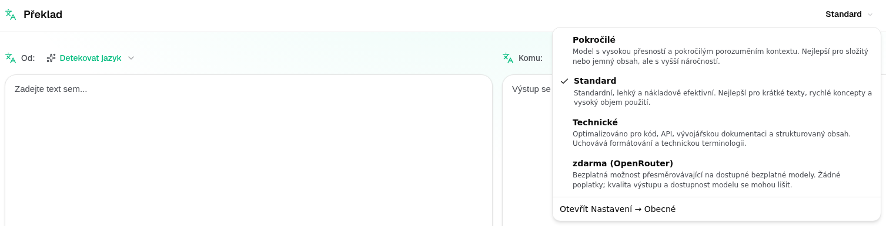
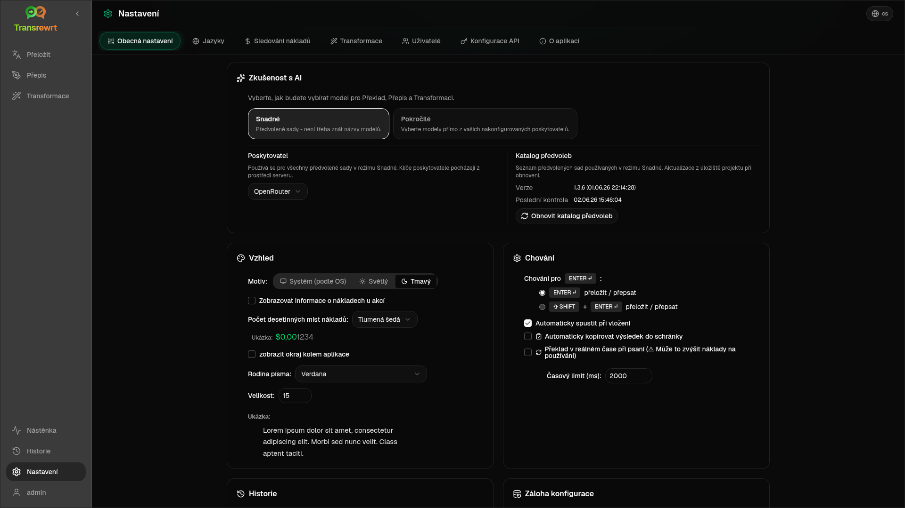

<a id="transrewrt-user-guide"></a>
# Uživatelská příručka

<br/>

<a id="introduction"></a>
## Úvod

Transrewrt vám pomáhá pracovat s textem třemi hlavními způsoby:

- **Překlad** – převod textu z jednoho jazyka do druhého.
- **Přepsat** – přeformulování textu v odlišném stylu, například jasnějším, stručnějším nebo formálnějším.
- **Transformovat** – zpracování textu pomocí vlastních pokynů pro umělou inteligenci, které se nazývají prompty.

Ve výchozím nastavení aplikace běží v režimu **Snadný**: v nabídce [**Nastavení** > **Obecné nastavení**](#general-settings) vyberete **předvolbu** (například Zdarma (OpenRouter), Standardní, Pokročilý nebo Technický) a **poskytovatele**, aniž byste museli vybírat ID modelů. Přepněte na **Pokročilý** režim, pokud chcete klasický seznam modelů dostupný v části [**Nastavení** > **Modely**](#models).

<br/>

Tato příručka vysvětluje, jak aplikaci používat po její instalaci a spuštění. Pokyny k instalaci naleznete v hlavním souboru [**README**](README.cs.md).

<br/>

> ℹ️ **POZNÁMKA**<br/>
> Transrewrt je dostupný jako desktopová aplikace pro Windows a Linux a také jako samostatně hostovaná webová aplikace. Tato příručka se zaměřuje na běžné používání aplikace. Pokud něco platí pouze pro jednu verzi, je to jasně označeno.

<small>**Přečtěte si v jiných jazycích:** </small>
<small id="lang-list">[English (GB)](../USER-GUIDE.md) · [Português (Brasil)](./USER-GUIDE.pt-BR.md) · [العربية](./USER-GUIDE.ar.md) · [বাংলা](./USER-GUIDE.bn.md) · [Català](./USER-GUIDE.ca.md) · [中文 (中国大陆)](./USER-GUIDE.zh-CN.md) · [中文 (台灣)](./USER-GUIDE.zh-TW.md) · [Hrvatski](./USER-GUIDE.hr.md) · [Čeština](./USER-GUIDE.cs.md) · [Nederlands](./USER-GUIDE.nl.md) · [English (US)](./USER-GUIDE.en-US.md) · [Tagalog](./USER-GUIDE.tl.md) · [Français](./USER-GUIDE.fr.md) · [Deutsch](./USER-GUIDE.de.md) · [Ελληνικά](./USER-GUIDE.el.md) · [हिन्दी](./USER-GUIDE.hi.md) · [Magyar](./USER-GUIDE.hu.md) · [Italiano](./USER-GUIDE.it.md) · [日本語](./USER-GUIDE.ja.md) · [한국어](./USER-GUIDE.ko.md) · [Bahasa Melayu](./USER-GUIDE.ms.md) · [فارسی](./USER-GUIDE.fa.md) · [Polski](./USER-GUIDE.pl.md) · [Basa Jawa](./USER-GUIDE.jv.md) · [Português](./USER-GUIDE.pt.md) · [ਪੰਜਾਬੀ](./USER-GUIDE.pa.md) · [Română](./USER-GUIDE.ro.md) · [Русский](./USER-GUIDE.ru.md) · [Slovenčina](./USER-GUIDE.sk.md) · [Español](./USER-GUIDE.es.md) · [Kiswahili](./USER-GUIDE.sw.md) · [Svenska](./USER-GUIDE.sv.md) · [తెలుగు](./USER-GUIDE.te.md) · [ไทย](./USER-GUIDE.th.md) · [Türkçe](./USER-GUIDE.tr.md) · [Українська](./USER-GUIDE.uk.md) · [Tiếng Việt](./USER-GUIDE.vi.md)</small>

<small>

> **Poznámka k překladům uživatelského rozhraní a dokumentace:** Všechny jazyky rozhraní kromě původního angličtiny (UK)
> byly přeloženy pomocí modelů umělé inteligence; vyjádření může být nepřesné nebo obsahovat chyby.

</small>

<br/>

<!-- START doctoc generated TOC please keep comment here to allow auto update -->
<!-- DON'T EDIT THIS SECTION, INSTEAD RE-RUN doctoc TO UPDATE -->
**Obsah**

- [Než začnete](#before-you-start)
  - [Jak získat bezplatný klíč API OpenRouter (desktopová aplikace)](#how-to-get-a-free-openrouter-api-key-desktop-app)
- [První kroky](#getting-started)
- [Hlavní části okna](#main-parts-of-the-window)
  - [Boční panel](#sidebar)
  - [Panel nástrojů](#toolbar)
  - [Panely pro vstup a výstup](#input-and-output-panels)
- [Překlad](#translate)
  - [Přeložit text](#translate-text)
  - [Výběr jazyka](#language-selection)
  - [Užitečná nastavení překladu](#helpful-translation-settings)
  - [Vylepšení vašeho překladu](#refining-translation)
- [Přepis](#rewrite)
- [Transformace](#transform)
  - [Spustit existující výzvu](#run-an-existing-prompt)
  - [Pokud zatím nemáte žádné výzvy](#if-you-have-no-prompts-yet)
  - [Rychlé vytvoření výzvy](#create-a-prompt-quickly)
  - [Upravit výzvu](#edit-a-prompt)
  - [Otestovat výzvu před použitím](#test-a-prompt-before-using-it)
- [Nástěnka](#dashboard)
  - [Filtrujte data](#filter-the-data)
  - [Karty na nástěnce](#dashboard-tabs)
  - [Exportovat data](#export-data)
  - [Smazat uložené záznamy pro model](#delete-stored-records-for-a-model)
- [Historie](#history)
  - [Filtrujte historii](#filter-the-history)
  - [Exportovat data historie](#export-history-data)
- [Nastavení](#settings)
  - [Obecná nastavení](#general-settings)
  - [Modely](#models)
  - [Jazyky](#languages)
  - [Sledování nákladů](#cost-tracking)
  - [Transformace (karta nastavení)](#transform-settings-tab)
  - [Uživatelé](#users)
  - [Konfigurace API](#api-config)
  - [O aplikaci](#about)
- [Běžné problémy](#common-issues)
  - [Aplikace nepřekládá, nepřepisuje ani netransformuje text](#the-app-will-not-translate-rewrite-or-transform-text)
  - [Seznam modelů je prázdný](#the-model-list-is-empty)
  - [Výsledek je příliš pomalý nebo příliš drahý](#the-result-is-too-slow-or-too-expensive)
  - [Rozhraní je v nesprávném jazyce](#the-interface-is-in-the-wrong-language)
  - [Text je příliš malý nebo těžko čitelný](#the-text-is-too-small-or-hard-to-read)
  - [Souhrn na nástěnce vypadá prázdně](#dashboard-summary-looks-empty)
  - [Náklady ukazují "nedostupné" nebo se zdají být nesprávné](#cost-shows-not-available-or-seems-wrong)
  - [Celkové náklady se neshodují s fakturou mého poskytovatele](#total-cost-does-not-match-my-provider-bill)
  - [Stránka Historie chybí v postranním panelu](#the-history-page-is-missing-from-the-sidebar)
  - [Webová aplikace: neočekávaně přesměrována na přihlašovací stránku](#web-app-redirected-to-the-login-page-unexpectedly)
  - [Webový administrátor: zapomněl nebo ztratil heslo](#web-admin-forgot-or-lost-a-password)
  - [Nástěnka nezobrazuje žádná data pro ostatní uživatele (web)](#dashboard-shows-no-data-for-other-users-web)
  - [Změnil jsem výzvu a ztratil úpravy](#i-changed-a-prompt-and-lost-the-edits)
- [Rychlé tipy](#quick-tips)
- [Zřeknutí se odpovědnosti](#disclaimer)
- [Licence](#license)

<!-- END doctoc generated TOC please keep comment here to allow auto update -->

<br/><br/>

<a id="before-you-start"></a>
## Než začnete

Pro použití aplikace Transrewrt potřebujete přístup alespoň k jednomu poskytovateli umělé inteligence. Podporovaní poskytovatelé jsou: [OpenRouter](https://openrouter.ai) (který agreguje mnoho modelů), OpenAI, Anthropic, Google Gemini, DeepSeek, Groq, Mistral, xAI, Cerebras a [Ollama](https://ollama.com) pro místní modely.

Pro začátek nemusíte vybírat placený model. Jakmile přidáte svůj API klíč OpenRouter, aplikace automaticky povolí vestavěnou **bezplatnou** možnost OpenRouter. To vám umožní okamžitě začít překládat, přepisovat a transformovat text. Alternativně můžete také získat bezplatný API klíč od společností Cerebras, Google, Groq, Mistral AI nebo [NVIDIA](https://build.nvidia.com/) (API kompatibilní s OpenAI).

Jednoduše řečeno:

- V režimu **Snadný** se **předvolba** (Zdarma (OpenRouter), Standardní, Pokročilý nebo Technický) mapuje na model podle zvoleného **poskytovatele** (OpenRouter, OpenAI, Ollama a další). V panelu nástrojů se zobrazí pouze předvolby, které mají pro aktuálního poskytovatele definované mapování. Předvolbu vybíráte při překladu, přepisování a transformaci.
- V režimu **Pokročilý** je **model** umělou inteligencí, kterou vybíráte přímo. ID modelů používají **předponu poskytovatele** (například `openrouter/…`, `openai/…`, `ollama/…`).
- **API klíč** (nebo u Ollama **základní URL**) umožňuje aplikaci komunikovat s daným poskytovatelem.

Pokud používáte **desktopovou aplikaci**, přidejte klíče v [**Nastavení** > **Nastavení API**](#api-config) pro každého poskytovatele, kterého používáte. Pro použití pouze s OpenRouterem se podívejte na [Jak získat zdarma OpenRouter API klíč](#how-to-get-a-free-openrouter-api-key-desktop-app) níže. Pokud nechcete používat API klíč, můžete nainstalovat Ollama (z [ollama.com](https://ollama.com)) a místo toho používat místní modely, jako je `translategemma:4b`.

Pokud používáte **webovou verzi**, poskytovatele nakonfiguruje správce serveru pomocí proměnných prostředí, takže nemůžete klíče API zadat přímo v aplikaci.

<br/>

<a id="how-to-get-a-free-openrouter-api-key-desktop-app"></a>
### Jak získat zdarma OpenRouter API klíč (desktopová aplikace)

Pokud používáte desktopovou aplikaci, postupujte podle následujících kroků:

1. Otevřete [OpenRouter](https://openrouter.ai) ve webovém prohlížeči.
2. Vytvořte si účet nebo se přihlaste.
3. Otevřete stránku [Klíče](https://openrouter.ai/keys).
4. Klikněte na tlačítko pro vytvoření nového klíče API.
5. Zadejte název klíče, abyste ho mohli později rozpoznat.
6. Zkopírujte nový klíč API.
7. Vraťte se do aplikace Transrewrt a otevřete **Nastavení** > **Nastavení API**.
8. Vložte klíč do pole **Klíč OpenRouter API** (v části **Nastavení** > **Nastavení API**).
9. Klikněte na **Testovat klíč OpenRouter**, abyste ověřili, že funguje.

<br/><br/>

<a id="getting-started"></a>
## Začínáme

Pokud používáte Transrewrt poprvé, postupujte v tomto pořadí:

1. Otevřete aplikaci.
2. V případě potřeby vyberte svůj **jazyk rozhraní** z ikony zeměkoule.
3. Pokud používáte **desktopovou aplikaci**, otevřete [**Nastavení** > **Nastavení API**](#api-config), přidejte API klíč alespoň pro jednoho poskytovatele (například OpenRouter) a klikněte na **Test**, abyste ověřili, že funguje.
4. Otevřete [**Nastavení** > **Obecné nastavení**](#general-settings). V režimu **Snadný** (výchozí) vyberte **poskytovatele**, který má nakonfigurovaný klíč. V režimu **Pokročilý** otevřete [**Nastavení** > **Modely**](#models) a přidejte jeden nebo více modelů do části **Vybrané modely**.
5. V **Překladu** vyberte **předvolbu** (Snadný) nebo **model** (Pokročilý) v panelu nástrojů.
6. Otevřete [**Nastavení** > **Jazyky**](#languages) a vyberte si **Nejčastější jazyky**, pokud chcete, aby se vaše nejpoužívanější jazyky zobrazovaly jako první.
7. Spusťte jednoduchý překlad, abyste ověřili, že vše funguje, poté zkuste **Přepsat** a **Transformovat**.

Toto pořadí je důležité. Zabraňuje tak nejčastějšímu problému při prvním použití: spuštění úlohy před tím, než má aplikace funkční API připojení nebo vybranou předvolbu/model.

<br/><br/>

<a id="main-parts-of-the-window"></a>
## Hlavní části okna

Aplikace je rozdělena do tří hlavních oblastí:

- **Boční panel** vlevo.
- **Panel nástrojů** nahoře.
- **Pracovní oblast** uprostřed.

<br/>

<a id="sidebar"></a>
### Postranní panel

Pomocí postranního panelu se pohybujete v aplikaci. Panel můžete sbalit, abyste získali více místa – stačí kliknout na ikonu vedle loga aplikace.

<br/>

<table>
  <tr>
    <td valign="top">
       
    </td>
    <td valign="top">
      <br/><br/>
      <ul>
        <li><strong>Překlad</strong> otevře pracovní prostor pro překlad.</li><br/>
        <li><strong>Přepsat</strong> otevře pracovní prostor pro přepisování textu.</li><br/>
        <li><strong>Transformovat</strong> otevře pracovní prostor s vlastní výzvou.</li><br/>
        <li><strong>Přehled</strong> zobrazuje informace o využití a nákladech.</li><br/>
        <li><strong>Nastavení</strong> otevře panel nastavení.</li><br/>
        <li><strong>Historie</strong> zobrazuje historii použití včetně vstupního a výstupního textu.</li><br/>
        <li><strong>Uživatel</strong> zobrazuje uživatelské jméno přihlášeného uživatele (pouze na webu).</li>
      </ul>
    </td>
  </tr>
</table>

<br/>

<a id="toolbar"></a>
### Panel nástrojů

Panel nástrojů se mírně liší v závislosti na tom, kde se v aplikaci nacházíte.

- Vlevo zobrazuje název aktuální stránky.
- Vpravo zobrazuje **výběr předvolby nebo modelu** a ovládání **Jazyka rozhraní**.

V režimu **Snadný** panel nástrojů obsahuje **výběr předvolby** s vestavěnými předvolbami **Zdarma (OpenRouter)**, **Standardní**, **Pokročilý** a **Technický**. Které předvolby se zobrazí, závisí na **poskytovateli**, kterého jste vybrali v části [**Nastavení** > **Obecné nastavení**](#general-settings) – například **Zdarma (OpenRouter)** se zobrazí pouze v případě, že je poskytovatelem OpenRouter. Pokud je **poskytovatelem** **Ollama**, zobrazí panel nástrojů namísto předvoleb modely nainstalované lokálně na vašem počítači.

V režimu **Pokročilý** vám **výběr modelu** umožňuje zvolit, který AI modul použít pro aktuální úkol.



V pokročilém režimu některé bezplatné modely nemusí být vždy k dispozici – mohou být offline nebo dosáhly limitu využití. Aplikace může tento model automaticky odebrat ze seznamu. Chcete-li ovlivnit, které modely se zobrazují, přejděte do [**Nastavení** > **Modely**](#models). Nastavení modelu můžete otevřít kliknutím na ikonu poskytovatele vlevo od názvu modelu na panelu nástrojů.

<br/>

Ikona **světa + kód jazyka** změní jazyk uživatelského rozhraní, například nabídek a tlačítek. **Neovlivňuje** jazyky použité pro překlad v sekci **Překlad**.


<br/>

<a id="input-and-output-panels"></a>
### Panely pro vstup a výstup

Většina pracovních prostorů používá levý panel **Vstup** a pravý panel **Výstup**.

Každý panel také zobrazuje:

| **Vstup**                                                          | **Výstup**                                                                                                                  |
|--------------------------------------------------------------------|-----------------------------------------------------------------------------------------------------------------------------|
| - Počet znaků <br/>- Počet slov <br/>- Počet odstavců   <br/> | - Doba trvání úkolu<br/>- **TPS** (tokeny za sekundu)<br/>- Počty znaků, slov a odstavců<br/>- Použitý model |

Pokud se zajímáte o technické termíny:

- **Token** znamená malý úsek textu. Můžete si jej představit jako část slova nebo krátké slovo.
- **TPS** znamená, kolik těchto textových úseků model zpracoval za sekundu.

<br/>

Náklady každé operace (pokud jsou k dispozici) a celkové náklady můžete sledovat po povolení možnosti `Show cost information on the actions` v části [**Nastavení** > **Obecné nastavení**](#general-settings).

<br/><br/>

[--------------------------------------------------------------------------------------------------------------------------]: #

<a id="translate"></a>
## Překlad

Použijte **Překlad**, chcete-li převést text z jednoho jazyka do druhého.


<br/>

<a id="translate-text"></a>
### Překlad textu

1. Otevřete **Překlad**.
2. Vyberte jazyk ve **Z**.
3. Vyberte jazyk v **Na**.
4. Vyberte předvolbu (Snadný) nebo model (Pokročilý) v panelu nástrojů.
5. Zadejte nebo vložte text do **Vstupu**.
6. Klikněte na **Překlad**.
7. Přečtěte si výsledek ve **Výstupu**.
8. Pokud chcete výsledek zkopírovat, použijte tlačítko pro kopírování.
9. Volitelně vylepšete výsledek pomocí **Přefrázovat…** nebo alternativ slov — viz [Vylepšení vašeho překladu](#refining-translation).

<br/>

<a id="language-selection"></a>
### Výběr jazyka

- **Z** může být konkrétní jazyk nebo **Detekovat jazyk**.
- **Na** je jazyk, do kterého chcete text přeložit.

Vaše vybrané **Nejčastější jazyky** se zobrazí v horní části seznamu. Tyto jazyky můžete nastavit v části [**Nastavení** > **Jazyky**](#languages).

<br/>

<a id="helpful-translation-settings"></a>
### Užitečná nastavení překladu

V části [**Nastavení** > **Obecné nastavení**](#general-settings) můžete změnit chování překladu:

- **Automaticky spustit při vložení** spustí překlad, jakmile vložíte text.
- **Automaticky kopírovat výsledek do schránky** automaticky zkopíruje výsledek po úspěšném spuštění.
- **Překlad v reálném čase při psaní** (⚠️ To může zvýšit náklady na používání) provádí překlady, zatímco píšete.
- **Časový limit (ms)** ovládá, jak dlouho aplikace čeká před spuštěním překladu v reálném čase.
- **Chování pro ENTER** vybírá, zda `Enter` spustí úkol nebo vloží nový řádek:
  - **Enter** spustí překlad nebo přepis (výchozí).
  - **Shift + Enter** spustí překlad nebo přepis; obyčejný **Enter** vloží nový řádek.

<br/>

<a id="refining-translation"></a>
### Vylepšení vašeho překladu

Po úspěšném překladu se **Přefrázovat…** a rozbalovací nabídka verzí objeví v záhlaví výstupu, vedle výběru jazyka **Na:**. Můžete tam vylepšit výsledek:

1. **Přefrázovat…** — pokud není v výstupu vybrán žádný text, získejte další plný překlad stejného vstupu s jinými slovy. Model obdrží každou verzi, kterou již máte, takže nová slova se mohou lišit od všech ostatních. Můžete uložit až **pět** verzí a přepínat mezi nimi v rozbalovací nabídce verzí. Pokud je text vybrán, **Přefrázovat…** otevře alternativy slov blízko výběru (stejně jako pravé kliknutí). Bez výběru je **Přefrázovat…** zakázáno, jakmile dosáhnete pěti verzí; s výběrem to stále funguje na pěti verzích (pouze alternativy slov, aktualizace verze 5). Když probíhá plné přefrázování, klikněte na **Zastavit překlad**, abyste zrušili; výstup se vrátí k verzi, která byla aktivní, když přefrázování začalo.
2. **Alternativy slov** — vyberte jedno nebo více slov nebo krátkou frázi ve výstupu (pokud vyberete pouze část slova, aplikace rozšíří výběr na celá slova), poté klikněte pravým tlačítkem nebo klikněte na **Přefrázovat…**. Krátký seznam alternativ se objeví blízko výběru; klikněte na jednu, abyste ji nahradili. Každá možnost může nahradit mírně širší rozsah než váš výběr (například sousední předložku nebo článek), takže věta zůstává gramatická. Pokud máte méně než pět verzí, upravený výstup je uložen jako nová verze; při pěti verzích je aktualizována pouze **verze 5**. Pravé kliknutí bez výběru nic nedělá. Stiskněte **Esc** nebo klikněte mimo seznam, abyste zrušili bez změny výstupu.
3. **Náklady** — každé plné **Přefrázovat…** (bez výběru) a každá žádost o alternativu slov znovu využívá model a může přidat k nákladům na použití (stejně jako běžný překlad).

[--------------------------------------------------------------------------------------------------------------------------]: #

<a id="rewrite"></a>
## Přepsat

Použijte **Přepsat**, pokud chcete vylepšit formulaci, aniž byste změnili hlavní význam.


To je užitečné pro:

- oprava pravopisu a gramatiky (**Kontrolovat pravopis a gramatiku**)
- zlepšení srozumitelnosti textu (**Zlepšit srozumitelnost**)
- několik odlišných přeformulací v jednom běhu (**Alternativní verze**)
- učinit text formálnějším nebo neformálnějším (**Udělat formální** / **Udělat neformální**)
- zkrácení nebo rozšíření textu (**Zkrátit** / **Rozšířit**)
- udělání textu techničtějšího (**Udělat technický**)

<br/>

> 💡 **TIP**<br/>
> Když použijete režim "**Kontrolovat pravopis a gramatiku**", v panelu výstupu se (vedle **Kopírovat**) objeví přepínač **Zobrazit změny**.
> Zapněte nebo vypněte jej, abyste zobrazili nebo skryli konkrétní opravy provedené ve vašem textu.

<br/><br/>

[--------------------------------------------------------------------------------------------------------------------------]: #

<a id="transform"></a>
## Transformovat

Použijte **Transformovat**, když chcete, aby AI postupovala podle vlastních pokynů.


Toto je nejpružnější část aplikace. Můžete ji použít například pro:

- shrnutí poznámek
- převod hrubého textu na dokonalý e-mail
- extrakci klíčových bodů
- převod textu do konkrétního formátu
- jakoukoli jinou vlastní úpravu vstupního textu

<br/>

<a id="run-an-existing-prompt"></a>
### Spustit existující výzvu

1. Otevřete **Transformaci**.
2. Vyberte výzvu ze seznamu výzev.
3. Pokud se objeví pole **Z** pro jazyk, vyberte jazyk, pokud ho chcete.
4. Zadejte nebo vložte text do **Vstupu**.
5. Klikněte na **Transformovat**.
6. Přečtěte si výsledek v **Výstupu**.

<br/>

<a id="if-you-have-no-prompts-yet"></a>
### Pokud ještě žádné výzvy nemáte

Pokud je váš seznam výzev prázdný, klikněte na **Načíst ukázkové výzvy** v pracovním prostoru Transformovat. Stejné tlačítko je vždy k dispozici v části [**Nastavení** > **Transformovat**](#transform-settings) na řádku pro export/import. Oba způsoby přidají vestavěné příklady, abyste mohli rychle začít.

<br/>

> ℹ️ **POZNÁMKA**<br/>
> Ukázkové výzvy jsou poskytovány v angličtině. Po jejich načtení můžete výzvu upravit a použít **Přeložit výzvu**, abyste ji přeložili do vašeho jazyka.

<br/>

<a id="create-a-prompt-quickly"></a>
### Rychlé vytvoření výzvy

Nejrychlejší způsob, jak vytvořit výzvu:

1. Klikněte na **Nová výzva**.
2. Klikněte na **Vygenerovat výzvu**.
3. Popište, co má výzva dělat.
4. Vyberte předvolbu (Snadný) nebo model (Pokročilý).
5. Nechte aplikaci vytvořit koncept pro vás.
6. Zkontrolujte koncept a klikněte na **Uložit**.


<br/>

<a id="edit-a-prompt"></a>
### Úprava výzvy

Když vytváříte nebo upravujete výzvu, zobrazí se editor vlevo a vpravo se objeví testovací oblast.


Hlavní pole jsou:

- **Název výzvy**: název zobrazený v seznamu výzev.
- **Pokyny pro výzvu (volitelné)**: krátká nápověda zobrazená uživateli při spuštění výzvy.
- **Role modelu**: celková role přiřazená umělé inteligenci, například 'Jsi užitečný asistent.'
- **Pokyny modelu (jeden na řádek)**: konkrétní pravidla, která má umělá inteligence dodržovat.
- **Popis výstupu (např. transformovaný, shrnutý atd.)**: krátké slovo popisující výsledek.
- **Teplota (0,0 → 1,0)**: jak se model bude chovat; viz níže.
- **Žádat o cílový jazyk**: přidá výběr jazyka, když se výzva spustí.
Pokud je technický termín **Teplota** pro vás nový, myslete na to takto:

- **Nižší** teplota dává stálejší a předvídatelnější výsledky.
- **Vyšší** teplota dává větší rozmanitost a kreativitu.

Můžete také použít:

- `Generate prompt` k vytvoření nového konceptu z jednoduchého popisu
- `Improve prompt` k vylepšení existující výzvy
- `Translate prompt` k překladu polí výzvy

<br/>

> ⚠️ **UPOZORNĚNÍ**<br/>
> Klikněte na `Save` před tím, než kliknete na `Back to Run`. Pokud se vrátíte zpět bez uložení, vaše změny budou ztraceny.

<br/>

<a id="test-a-prompt-before-using-it"></a>
### Otestujte výzvu před použitím

Panel testování napravo vám umožňuje vyzkoušet si výzvu se vzorovým textem, než ji začnete používat v běžné práci.

To je užitečné v těchto případech:

- když vytváříte novou výzvu
- když porovnáváte dvě verze výzvy
- když chcete zkontrolovat tón, délku nebo formát výstupu

<br/>

> ℹ️ **POZNÁMKA**<br/>
> Uložené výzvy můžete exportovat a importovat v části [**Nastavení** > **Transformovat**](#transform-settings).

Když použijete **Vygenerovat výzvu**, **Vylepšit výzvu** nebo **Přeložit výzvu** v editoru výzev, režim **Snadný** nabízí stejný výběr předvoleb jako Překlad a Přepsat; režim **Pokročilý** používá seznam modelů.

<br/><br/>

[--------------------------------------------------------------------------------------------------------------------------]: #

<a id="dashboard"></a>
## Přehled

Použijte **Přehled**, abyste viděli, jak hodně aplikaci používáte a kolik vás to stojí (pro placené modely).


<br/>

> ℹ️ **POZNÁMKA**<br/>
> Pokud používáte pouze **zdarma** modely, mohou být **náklady** nulové a ukazatele zaměřené na náklady mohou být prázdné. Karta **Souhrn** stále zobrazuje počty volání pro překlad, přepsání a transformaci, pokud došlo k aktivitě ve vybraném období.

<br/>

<a id="filter-the-data"></a>
### Filtrování dat

Pomocí tlačítek filtru nahoře změňte časové období.


<br/>

> ℹ️ **POZNÁMKA**<br/>
> Filtrování podle **Uživatele** je ve webové verzi viditelné pouze pro správce. Běžní uživatelé tento filtr nevidí a v desktopové aplikaci není k dispozici.

<br/>

<a id="dashboard-tabs"></a>
### Karty přehledu

- **Souhrn** zobrazuje karty s klíčovými ukazateli výkonu: celkové náklady, použité modely, počty volání a náklady podle režimu (včetně podílu na celkovém počtu volání), průměrné náklady na volání, průměrné TPS a tři nejčastěji používané modely podle počtu volání.
- **Podle modelu** uvádí každý model s celkovým počtem volání, celkovými náklady a průměrným TPS; rozbalením řádku získáte rozdělení podle překladu, přepsání a transformace.
- **Všechny volání** zobrazuje kompletní protokol volání (stránkování na širokých rozloženích, karty na úzkých obrazovkách) a umožňuje jeho export.

<br/>

<a id="export-data"></a>
### Export dat

Data z tabulek přehledu lze exportovat ve formátech:

- **JSON**
- **CSV**
- **XLSX**

To je užitečné, pokud chcete provést kontrolu aktivity mimo aplikaci nebo sdílet sestavu.

<br/>

<a id="delete-stored-records-for-a-model"></a>
### Odstranění uložených záznamů pro model

V části **Podle modelu** nebo **Všechny volání** můžete odstranit uložené záznamy pro model kliknutím na ikonu „koše“.

> ⚠️ **UPOZORNĚNÍ**<br/>
> Odstranění uložených záznamů nelze vrátit zpět. Používejte to pouze v případě, že jste si jisti, že danou historii již nepotřebujete.

Chcete-li odstranit všechna data nebo záznamy na základě jejich stáří, přejděte do části [**Nastavení** > **Sledování nákladů**](#cost-tracking). Zde naleznete možnosti pro odstranění všech uložených dat nebo pouze dat starších než určité datum.

<br/><br/>

[--------------------------------------------------------------------------------------------------------------------------]: #

<a id="history"></a>
## Historie

Kliknutím na **Historie** zobrazíte přehled vašich akcí v aplikaci **Transrewrt**, včetně vstupu a výstupu každé operace.


<br/>

<a id="filter-the-history"></a>
### Filtrování historie

**Historie** používá stejné filtry časového rozsahu jako stránka **Přehled**.


<br/>

> ℹ️ **POZNÁMKA**<br/>
> Ve **webové aplikaci** vidí každý (včetně správců) pouze svou vlastní historii spuštění. Filtr **Uživatel** na stránce **Přehled** slouží správcům k přehledu využití a nákladů napříč účty; nevztahuje se na **Historii**.

<br/>

<a id="export-history-data"></a>
### Export dat historie

Stránka historie umožňuje exportovat filtrovaná data do formátů:

- **JSON**
- **CSV**
- **XLSX**

To je užitečné, pokud chcete provést kontrolu aktivity mimo aplikaci nebo sdílet sestavu.

<br/><br/>

[--------------------------------------------------------------------------------------------------------------------------]: #

<a id="settings"></a>
## Nastavení

Otevřete **Nastavení** na bočním panelu a přizpůsobte chování aplikace.

Dostupné karty závisí na platformě a vaší roli:

| Karta            | Desktop | Web (správce) | Web (běžný uživatel) | Poznámky                                      |
  |------------------|:-------:|:-------------:|:---------------------:|------------------------------------------------|
  | Obecné nastavení |   ano   |      ano      |         ano           | Zahrnuje **AI zkušenost** (Snadný / Pokročilý) |
  | Modely           |   ano   |      ano      |         ano           | Pouze pokud je **AI zkušenost** nastavena na **Pokročilý** |
  | Jazyky         |   ano   |     ano     |        ano         | |
  | Sledování nákladů     |   ano   |     ano     |         -          | |
  | Transformovat         |   ano   |     ano     |        ano         | Hromadný import/export transformačních výzev |
  | Uživatelé             |    -    |     ano     |         -          | |
  | Nastavení API        |   ano   |     ano     |         -          | |
  | O aplikaci             |   ano   |     ano     |        ano         | |

V režimu **Snadný** se výběr modelu provádí prostřednictvím předvoleb v panelu nástrojů a **poskytovatele** v obecném nastavení; karta **Modely** je skrytá.

<br/>

> ℹ️ **POZNÁMKA**<br/>
> Ve webové verzi má každý uživatel svou vlastní konfiguraci. Nastavení jako AI zkušenost, poskytovatel, vybrané modely nebo předvolby, jazyky, obecné možnosti a transformační výzvy jsou uloženy pro každého uživatele zvlášť. Změny, které provedete, nemají vliv na ostatní uživatele.

<br/>

[--------------------------------------------------------------------------------------------------------------------------]: #

<a id="general-settings"></a>
### Obecné nastavení

Použijte **Obecné nastavení** k ovládání chování při psaní, zda jsou ukládány podrobnosti spuštění pro **Historii**, vzhledu a způsobu výběru AI pro Překlad, Přepsání a Transformaci.

**AI zkušenost**

- **Snadný** (výchozí): vyberte **poskytovatele** (OpenRouter, OpenAI, Anthropic, Google Gemini, DeepSeek, Groq, Mistral, xAI, Cerebras nebo Ollama). Cloudoví poskytovatelé používají vestavěné předvolby v panelu nástrojů. **Ollama** místo předvoleb zobrazuje modely nainstalované na vašem počítači. V režimu Snadný ukazuje **Katalog předvoleb** verzi katalogu a čas poslední aktualizace; kliknutím na **Obnovit katalog předvoleb** načtete nejnovější seznam předvoleb z úložiště projektu (aplikace pravidelně kontroluje aktualizace i na pozadí).
- **Pokročilý**: vybírejte jednotlivé modely v panelu nástrojů; spravujte seznam v části [**Nastavení** > **Modely**](#models).

**Vzhled**

- **Téma** přepíná mezi světlým, tmavým a systémovým vzhledem.
- **Zobrazovat informace o nákladech u akcí** řídí zobrazení nákladů na operaci (pokud jsou k dispozici) a celkových nákladů na výstupních panelech Překlad, Přepsání a Transformace.
- **Desetinná místa nákladů** mění, jak jsou zobrazeny desetinné hodnoty nákladů.
- **Pouze web:** **zobrazit okraj kolem aplikace** přidává extra prostor kolem rozhraní.
- **Rodina písem** mění písmo v textových panelech.
- **Velikost** mění velikost písma.

**Chování**

- **Chování pro ENTER** vybírá, zda `Enter` spustí úkol nebo vloží nový řádek.
- **Automaticky spustit při vložení** spustí překlad, jakmile vložíte text.
- **Automaticky kopírovat výsledek do schránky** automaticky zkopíruje úspěšné výsledky.
- **Překlad v reálném čase při psaní** (⚠️ To může zvýšit náklady na používání) překládá, zatímco píšete.
- **Časový limit (ms)** nastavuje dobu čekání pro překlad v reálném čase.

**Historie**

- **Uchovávat historii spuštění** určuje, zda se pro každý překlad, přepsání a transformaci ukládají **vstupní a výstupní text** pro zobrazení [**Historie**](#history) na postranním panelu. Vypnutí vyžaduje potvrzení; pokud potvrdíte, uložený text historie bude odstraněn z databáze. Pokud je popisek označen jako *zakázáno správcem*, je ve vaší instalaci nastaveno `HISTORY_DISABLED` v prostředí (viz [README](README.cs.md#configuration-and-environment)); nemůžete historii znovu zapnout přes uživatelské rozhraní.
- **Smazat historická data** vám umožňuje odstranit uložený text podle stáří (např. starší než několik měsíců nebo **všechna data (vymazat)**) pomocí **Smazat data**. To ovlivňuje pouze uložený text spuštění pro zobrazení **Historie**; **neodstraňuje** náklady ani celkové údaje o využití. Chcete-li odstranit nebo zkrátit **nákladová** data, použijte [**Nastavení** > **Sledování nákladů**](#cost-tracking).

**Záloha konfigurace** (pouze pro administrátory desktopové aplikace a webu)
- **Zahrnout data o používání do zálohy** - když je povoleno, ZIP také obsahuje historii provádění a data o volání API.
- **Zálohovat konfiguraci** - vytvoří jeden ZIP (`transrewrt-config-backup-YYYY-MM-DD_HHMMSS.zip` v místním čase) s `config.json`, `state.json`, volitelným šifrovacím klíčem, uživateli, preferencemi, vlastními výzvami a daty o používání, pokud jste se přihlásili. Po úspěšné záloze se potvrzení zobrazí s názvem uloženého souboru.
- **Obnovit ze zálohy** - nejprve otevře **potvrzovací dialog**. Vyberte záložní ZIP uvnitř dialogu (**Procházet** / výběr souboru nebo přetáhněte, kde je to podporováno), poté zkontrolujte možnosti:
  - **Obnovit data o používání** - importovat data o používání/historii ze ZIP, když byla zálohována s zahrnutými údaji o používání; nechte vypnuté, pokud chcete pouze nastavení a výzvy.
  - **Před obnovením vymazat staré údaje o používání** - odstranit existující údaje o používání/historii na této instalaci před aplikováním zálohy (volitelné; použijte, když chcete čistou výměnu).
Zálohy vytvořené v desktopové nebo webové verzi mohou být obnoveny v druhé. Při obnovování desktopové zálohy ve webové verzi budou data obnovena uživateli administrátora.

<br/>

<a id="models"></a>
### Modely

Tato karta je k dispozici pouze v případě, že je v části [**Obecné nastavení**](#general-settings) nastavena možnost **AI zkušenost** na **Pokročilý**. Pomocí **Nastavení** > **Modely** vyberte, které modely se zobrazí na panelu nástrojů.



Stránka obsahuje dva seznamy:

- **Dostupné modely** vlevo
- **Vybrané modely** vpravo

Užitečné ovládací prvky zahrnují:

- **Hledat modely...** pro vyhledání modelu podle názvu
- **Poskytovatel** pro omezení seznamu na jeden modul (OpenRouter, OpenAI, Ollama, …)
- **Pouze zdarma** pro zobrazení pouze bezplatných modelů
- **Obnovit** pro opětovné načtení seznamu
- **Rozbalit vše** a **Sbalit vše** při řazení podle poskytovatele

ID modelů obsahují předponu poskytovatele (například `openrouter/…` vs `openai/…`). Odznaky jako **OpenAI (OpenRouter)** vs **OpenAI (přímý)** ukazují, jak je provoz směrován.

> ℹ️ **POZNÁMKA**<br/>
> **OpenRouter Body Builder** (`openrouter/bodybuilder`) je směrovací model, nikoli obecný chatovací model: jeho odpověď je JSON, který popisuje těla požadavků OpenRouter API (například pole `requests` s `model` a `messages`). Pokud jej použijete pro **Překlad**, **Přepsat** nebo **Transformovat**, panel výstupu zobrazí tento JSON namísto hotového textu. Pro tyto úkoly zvolte normální textový model. Viz [stránku modelu Body Builder](https://openrouter.ai/openrouter/bodybuilder) na OpenRouter.

Akce:

- Chcete-li přidat model, klikněte na **Přidat** nebo kamkoli do položky.

- Chcete-li model odebrat, klikněte na **X** vedle něj v části **Vybrané modely** nebo na **Vybráno** v položce Dostupné modely.

- Chcete-li vymazat seznam, klikněte na **Zrušit výběr všech**. Požadovaný bezplatný model zůstane v seznamu.

<br/>

> ℹ️ **POZNÁMKA**<br/>
> Pokud nechcete okamžitě přidávat kredity na OpenRouter, začněte tím, že povolíte **Pouze zdarma** a vyberete bezplatné modely (není vyžadována platební karta). Můžete také použít Ollama ke spouštění modelů lokálně bez jakéhokoli klíče API.

<br/>

<a id="languages"></a>
### Jazyky

Použijte **Nastavení** > **Jazyky** k uspořádání seznamů jazyků používaných v aplikaci.

- **Nejčastější jazyky** jsou připíchnuty v horní části seznamů jazyků v **Překladu** a **Transformaci**.
- **Vlastní jazyk** vám umožňuje přidat jazyk, který není v vestavěném seznamu.

Pokud přidáte vlastní jazyk, zobrazí se ve výběru jazyků spolu s vestavěnými možnostmi.

<br/>

<a id="cost-tracking"></a>
### Sledování nákladů

Použijte **Nastavení** > **Sledování nákladů** ke správě informací o nákladech.

- **Celkové náklady** zobrazují běžící součet.
- **Kopírovat hodnotu** zkopíruje celkovou částku do schránky.
- **Obnovit náklady** obnoví uložený součet na nulu.
- **Synchronizovat s využitím klíče API** nastaví celkovou částku tak, aby odpovídala využití hlášenému vaším účtem OpenRouter (pouze OpenRouter).
- **Využití klíče API** zobrazuje podrobnosti o využití OpenRouter, pokud jsou k dispozici.
- **Smazat data o nákladech** odstraní všechna data nebo pouze záznamy starší než vybrané datum.

**Sledování nákladů:** Když používáte modely OpenRouter, aplikace zobrazuje skutečné využití a výdaje na základě informací o nákladech od OpenRouter. Pro všechny ostatní poskytovatele aplikace odhaduje náklady pomocí cen zveřejněných OpenRouter; pokud není cena k dispozici, odhad může být nulový.

<br/>

> ℹ️ **POZNÁMKA**<br/>
> **Všechny údaje o nákladech jsou pouze orientační, nejedná se o oficiální fakturační účty.**

<br/>

> ⚠️ **UPOZORNĚNÍ**<br/>
> Odstranění dat nelze vrátit zpět. Před odstraněním si prosím zazálohujte svá data nebo je exportujte přes [**Historie**](#history)
> nebo [**Přehled** > **Všechny volání**](#dashboard-tabs), jinak budou trvale ztracena.
> Bude také trvale odstraněna veškerá historie vstupů/výstupů související s každým záznamem volání API.

<br/>

<a id="transform-settings"></a>
### Transformovat (karta nastavení)

Pomocí **Nastavení** > **Transformovat** můžete hromadně spravovat výzvy.

Můžete:

- prohlížet uložené výzvy
- odstraňovat výzvy
- importovat výzvy ze souboru
- exportovat výzvy pro zálohování nebo sdílení
- načíst ukázkové výzvy do seznamu výzev

<br/>

<a id="users"></a>
### Uživatelé

Použijte **Uživatelé** ke správě uživatelských účtů ve webové verzi. Můžete přidávat uživatele, aktualizovat jejich údaje, resetovat hesla a odstraňovat účty.

<br/>

<a id="api-config"></a>
### Nastavení API

Podporovaní poskytovatelé jsou: OpenRouter, OpenAI, Anthropic, Google Gemini, DeepSeek, Groq, Mistral, xAI, Cerebras, **Ollama** (lokální modely přes základní URL) a volitelný **vlastní poskytovatel kompatibilní s OpenAI** (název, URL a API klíč – pouze v pokročilém režimu). Musíte nakonfigurovat pouze poskytovatele, které používáte.

**Webová aplikace: pouze pro správce**

API klíče se konfigurují prostřednictvím systémových proměnných prostředí nebo proměnných prostředí Docker – nezadávají se ve webovém uživatelském rozhraní. Pro vlastního poskytovatele nastavte `CUSTOM_PROVIDER_NAME`, `CUSTOM_PROVIDER_URL` a `CUSTOM_PROVIDER_API_KEY` (všechny tři jsou povinné). Tato stránka zobrazuje, kteří poskytovatelé mají nakonfigurovaný klíč, a umožňuje vám každý z nich otestovat kliknutím na tlačítko `Test`.

<br/>

> ℹ️ **POZNÁMKA**<br/>
> Chcete-li změnit API klíč, aktualizujte proměnnou prostředí ve své systémové nebo Dockerové konfiguraci a restartujte server nebo kontejner.

<br/>

> ℹ️ **POZNÁMKA**<br/>
> **Zálohování konfigurace** (viz [**Obecné nastavení** → Zálohování konfigurace](#general-settings)) může vložit **rozbalené** klíče poskytovatelů do souboru `config.json` uvnitř ZIPu. Obnovení tohoto ZIPu **nekopíruje** tyto klíče zpět do konfiguračního souboru serveru – aktuální klíče pocházejí stále z prostředí a stávajícího stavu souboru, jak je popsáno výše.

<br/>

**Desktopová aplikace**

Použijte **Konfigurace API** k uložení API klíčů pro každého poskytovatele, kterého používáte. Pro Ollama zadejte místo API klíče **základní URL**. Pro vlastního poskytovatele kompatibilního s OpenAI (např. [NVIDIA NIM](https://build.nvidia.com/)) zadejte **název poskytovatele**, **základní URL** (např. `https://integrate.api.nvidia.com/v1`) a **API klíč**; všechny tři jsou povinné. URL a název se upravují přímo; použijte **Upravit** k nahrazení API klíče. Modely vlastního poskytovatele se zobrazují pouze v **pokročilém** režimu (Nastavení → Modely).

<br/>

> 💡 **Tip** <br/>
> Pokud nechcete používat API klíč nebo platit za používání, můžete si [stáhnout Ollama](https://ollama.com) a zdarma spouštět modely (např. `translategemma:4b`) lokálně na svém počítači. Alternativně si můžete vytvořit bezplatný účet OpenRouter (bez nutnosti kreditní karty) a používat jejich bezplatné modely, nebo získat bezplatný API klíč od společností Cerebras, Google, Groq, Mistral AI nebo [NVIDIA](https://build.nvidia.com/).

<br/>

- Přidejte pouze poskytovatele, které potřebujete. V **Nastavení** > **Modely** začíná každý ID modelu poskytovatelem (například `openrouter/openrouter/free`, `openai/gpt-4o`, `ollama/llama3`, `NVIDIA/nvidia/nemotron-nano-3-30b-a3b` pro vlastní koncový bod s názvem NVIDIA).

Chcete-li přidat API klíč, zadejte hodnotu do textového pole a klikněte na `Save`. Chcete-li nahradit stávající klíč, klikněte na `Edit`. Chcete-li ověřit, že klíč funguje, klikněte na `Test`. U základní adresy URL Ollamy vždy klikněte na `Test` a ověřte připojení.

<br/>

> ℹ️ **POZNÁMKA**<br/>
> Aktuální hodnotu API klíče nelze zobrazit. Můžete ji pouze nahradit pomocí tlačítka `Edit`.
> API klíče jsou uloženy šifrovaně v konfiguraci.

<br/>

<a id="about"></a>
### O aplikaci

Karta **O aplikaci** zobrazuje:

- název aplikace a slogan
- číslo verze a datum sestavení
- informace o licenci a autorských právech, s odkazem na otevření **Upozornění třetích stran**
- odkaz na repozitář projektu

<br/><br/>

<a id="common-issues"></a>
## Běžné problémy

Pokud něco nefunguje podle očekávání, nejprve zkontrolujte následující body.

<br/>

<a id="the-app-will-not-translate-rewrite-or-transform-text"></a>
### Aplikace nepřekládá, nepřepisuje ani netransformuje text

Zkontrolujte, zda:

- vybrali jste **předvolbu** (Snadný) nebo **model** (Pokročilý) v panelu nástrojů
- v režimu **Snadný** máte v [**Nastavení** > **Obecné nastavení**](#general-settings) nastaveného **Poskytovatele** s funkčním klíčem (nebo URL Ollama) a alespoň jednu předvolbu pro tohoto poskytovatele
- v režimu **Pokročilý** je alespoň jeden model uveden v [**Nastavení** > **Modely**](#models)
- vaše nastavení API funguje

Pokud používáte desktopovou aplikaci:

1. Otevřete [**Nastavení** > **Nastavení API**](#api-config).
2. Zkontrolujte, zda je uložen alespoň jeden klíč API.
3. Klikněte na **Test** vedle poskytovatele, abyste ověřili, že klíč funguje.

<br/>

<a id="the-model-list-is-empty"></a>
### Seznam modelů je prázdný

V režimu **Snadný** otevřete [**Nastavení** > **Obecné nastavení**](#general-settings), ověřte nastavení **Poskytovatele** a přidejte nebo otestujte klíče v části [**Nastavení API**](#api-config) (desktop) nebo požádejte svého správce (web). U **Ollamy** spusťte **Test** na základní adrese URL a ujistěte se, že jsou modely nainstalovány místně.

V režimu **Pokročilý** otevřete [**Nastavení** > **Modely**](#models) a klikněte na **Obnovit**. V případě potřeby vyhledejte model, zapněte možnost **Pouze zdarma** a přidejte modely do části **Vybrané modely**.

<br/>

<a id="the-result-is-too-slow-or-too-expensive"></a>
### Výsledek je příliš pomalý nebo příliš drahý

Vyzkoušejte jednu nebo více z následujících možností:

- vyberte jinou předvolbu (Snadné) nebo model (Pokročilé)
- použijte kratší vstup
- vypněte **Překlad v reálném čase při psaní** v [**Nastavení** > **Obecná nastavení**](#general-settings)
- použijte zdarma modely pro jednoduché úkoly (viz [Modely](#models))
<br/>

<a id="the-interface-is-in-the-wrong-language"></a>
### Rozhraní je v nesprávném jazyce

Klikněte na ikonu zeměkoule na [panelu nástrojů](#toolbar) a vyberte požadovaný **Jazyk rozhraní**.

<br/>

<a id="the-text-is-too-small-or-hard-to-read"></a>
### Text je příliš malý nebo špatně čitelný

Otevřete [**Nastavení** > **Obecné nastavení**](#general-settings) a změňte:

- **Rodina písma**
- **Velikost**

<br/>

<a id="dashboard-summary-looks-empty"></a>
### Přehled na panelu vypadá prázdně

To je normální, pokud:

- používáte pouze **zdarma dostupné modely** a sledujete údaje o **nákladech** (mohou být nulové); ukazatele počtu volání na kartě **Souhrn** stále potřebují data z vybraného období
- vybraný **časový filtr** nezahrnuje období, kdy byla volání provedena – zkuste **Vše** pro kontrolu

Pokud jsou ukazatele stále nulové i po výběru **Vše**, ověřte, zda se volání zobrazují v části [**Historie**](#history) nebo na kartě **Všechny volání**.

<br/>

<a id="cost-shows-not-available-or-seems-wrong"></a>
### Náklady zobrazují „nedostupné“ nebo jsou nesprávné

Pokud používáte modely prostřednictvím **OpenRouter**, aplikace zobrazuje skutečné výdaje hlášené OpenRouter.

U **ostatních poskytovatelů** (OpenAI přímý přístup, Anthropic přímý přístup atd.) jsou náklady odhadovány na základě cenových údajů zveřejněných OpenRouter. Pokud pro model neexistuje odpovídající cena, náklady budou uvedeny jako **nedostupné** a nebudou přičteny k běžícímu celkovému součtu.

<br/>

<a id="total-cost-does-not-match-my-provider-bill"></a>
### Celkové náklady neodpovídají účtu od poskytovatele

Všechny údaje o nákladech v aplikaci jsou pouze **odhad pro informační účely**, ne jedná se o oficiální fakturační údaje.

Chcete-li, aby celková částka lépe odpovídala vašim skutečným výdajům na OpenRouter, otevřete [**Nastavení** > **Sledování nákladů**](#cost-tracking) a klikněte na **Synchronizovat s využitím klíče API**.

<br/>

<a id="the-history-page-is-missing-from-the-sidebar"></a>
### Stránka Historie chybí na bočním panelu

Možnost **Uchovávat historii spuštění** může být vypnutá. Otevřete [**Nastavení** > **Obecné nastavení**](#general-settings) a povolte ji, pokud historie není *zakázána správcem* (`HISTORY_DISABLED` v prostředí – viz [README](README.cs.md#configuration-and-environment)). Zapnutí historie neobnoví dříve smazaný text.

<br/>

<a id="web-app-session-expired"></a>
### Webová aplikace: nečekaně přesměrována na přihlašovací stránku

Vaše relace mohla vypršet. Přihlaste se znovu. Pokud se to děje často, zkontrolujte nastavení doby životnosti relace na serveru.

<br/>

<a id="web-admin-forgot-or-lost-a-password"></a>
### Webový správce: zapomenuté nebo ztracené heslo

Toto platí pro **lokálně hostovanou webovou aplikaci** (Docker), nikoli pro desktopovou aplikaci (Electron).

- Pokud se může jiný správce stále přihlásit, může otevřít [**Nastavení** > **Uživatelé**](#users), vybrat účet a nastavit tam **nové heslo**.
- Pokud jste **zablokováni**, ale máte **přístup k prostředí shellu** stroje nebo kontejneru, obnovte heslo pomocí nástroje dodávaného s imagí (nahraďte `transrewrt`, pokud změníte výchozí název, a uvozujte heslo, pokud obsahuje mezery nebo speciální znaky):

```bash
docker exec transrewrt reset-web-password '<username>' '<new-password>'
```

Výchozí uživatelské jméno správce je `admin`, pokud jste nikdy nevytvořili jiné účty. Pokud zadáte pouze jeden argument, bude považován za nové heslo pro `admin`.

Pokud spouštíte aplikaci z **zdrojového kódu** místo z Dockeru, použijte:

```bash
pnpm run reset-web-password -- <username> <new-password>
```

Skript aktualizuje záznam uživatele v databázi SQLite (a může vytvořit uživatele `admin`, pokud chybí). Po obnovení se přihlaste pomocí nového hesla.

<br/>

<a id="dashboard-shows-no-data-for-other-users"></a>
### Přehled nezobrazuje data pro ostatní uživatele (web)

Pouze **administrátoři** mohou zobrazit data všech uživatelů pomocí filtru **Uživatel**. Běžní uživatelé z důvodu návrhu vidí pouze svou vlastní aktivitu.

<br/>

<a id="i-changed-a-prompt-and-lost-the-edits"></a>
### Změnil jsem výzvu a ztratil úpravy

Při úpravě výzvy vždy klikněte na **Uložit**, než kliknete na **Zpět na Spustit**.

<br/><br/>

<a id="quick-tips"></a>
## Rychlé tipy

- Začněte s [**Překlad**](#translate), abyste ověřili, že je vaše nastavení funkční, než přejdete k [**Přepsat**](#rewrite) nebo [**Transformovat**](#transform).
- Použijte [**Přepsat**](#rewrite) pro každodenní vylepšování formulací.
- Použijte [**Transformovat**](#transform), když potřebujete opakovatelný pracovní postup pro konkrétní úkol.
- Použijte [**Přehled**](#dashboard), pokud chcete sledovat využití a náklady.
- K zobrazení předchozích operací a jejich úplného vstupního/výstupního textu použijte [**Historie**](#history).
- Pravidelně exportujte výzvy, pokud vytváříte knihovnu výzev, kterou chcete uchovat v bezpečí (viz [Transformovat](#transform)), nebo ji chcete sdílet s ostatními.
- Zůstaňte v režimu **Snadný**, dokud nepotřebujete podrobnou kontrolu nad ID modelů; přejděte do režimu **Pokročilý**, až budete vědět, které modely chcete používat.

<br/><br/>

<a id="disclaimer"></a>
## Zřeknutí se záruk

Názvy produktů a ikony patří jejich příslušným vlastníkům a používají se pouze pro účely identifikace. Tento software není spojen s žádnými z uvedených značek ani jimi není schválen.

<br/><br/>

<a id="license"></a>
## Licence

Copyright © 2026 Waldemar Scudeller Jr.

[Apache License 2.0](../LICENSE)
