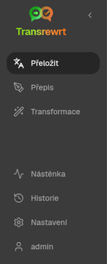
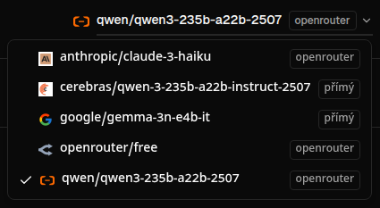
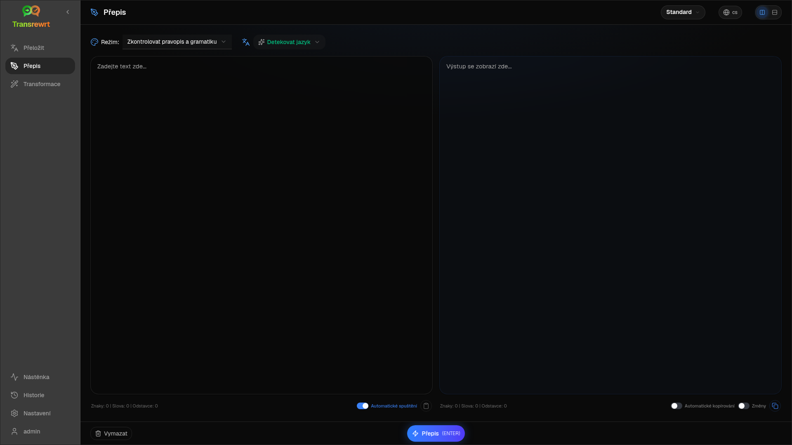
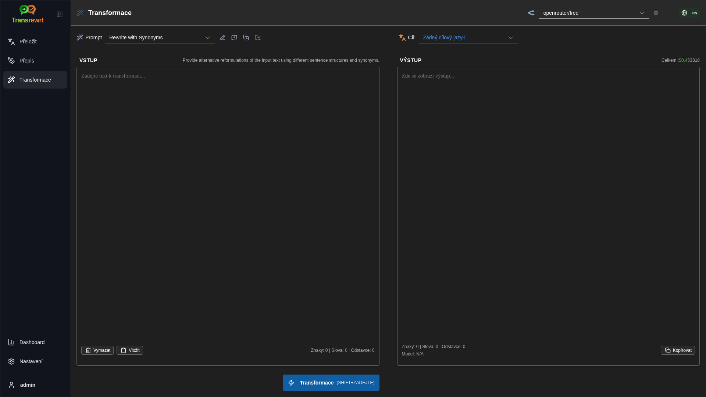
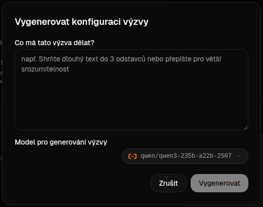
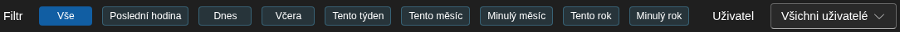

<a id="transrewrt-user-guide"></a>
# Uživatelská příručka

<br/>

<a id="introduction"></a>
## Úvod

Transrewrt vám pomáhá pracovat s textem třemi hlavními způsoby:

- **Přeložit** – převést text z jednoho jazyka do druhého.
- **Přepsat** – přeformulovat text v jiném stylu, například jasnějším, stručnějším nebo formálnějším.
- **Transformace** – zpracovat text pomocí vlastních pokynů pro umělou inteligenci, které se nazývají prompty.

<br/>

Tato příručka vysvětluje, jak aplikaci používat po její instalaci a spuštění. Kroky k instalaci naleznete v hlavním souboru **[README](README.cs.md)**.

<br/>

> ℹ️ **POZNÁMKA**<br/>
> Transrewrt je dostupný jako desktopová aplikace pro Windows a Linux a také jako samostatně hostovaná webová aplikace. Tato příručka se zaměřuje na běžné používání aplikace. Pokud se něco týká pouze jedné verze, je to jasně označeno.

<small>**Přečtěte si v jiných jazycích:** </small>

<small id="lang-list">[English](../USER-GUIDE.md) · [Português (BR)](./USER-GUIDE.pt-BR.md) · [العربية](./USER-GUIDE.ar.md) · [বাংলা](./USER-GUIDE.bn.md) · [Català](./USER-GUIDE.ca.md) · [中文 (中国大陆)](./USER-GUIDE.zh-CN.md) · [中文 (台灣)](./USER-GUIDE.zh-TW.md) · [Hrvatski](./USER-GUIDE.hr.md) · [Čeština](./USER-GUIDE.cs.md) · [Nederlands](./USER-GUIDE.nl.md) · [English](./USER-GUIDE.en-US.md) · [Tagalog](./USER-GUIDE.tl.md) · [Français](./USER-GUIDE.fr.md) · [Deutsch](./USER-GUIDE.de.md) · [Ελληνικά](./USER-GUIDE.el.md) · [हिन्दी](./USER-GUIDE.hi.md) · [Magyar](./USER-GUIDE.hu.md) · [Italiano](./USER-GUIDE.it.md) · [日本語](./USER-GUIDE.ja.md) · [jv](./USER-GUIDE.jv.md) · [한국어](./USER-GUIDE.ko.md) · [Bahasa Melayu](./USER-GUIDE.ms.md) · [فارسی](./USER-GUIDE.fa.md) · [Polski](./USER-GUIDE.pl.md) · [Português](./USER-GUIDE.pt.md) · [ਪੰਜਾਬੀ](./USER-GUIDE.pa.md) · [Română](./USER-GUIDE.ro.md) · [Русский](./USER-GUIDE.ru.md) · [Slovenčina](./USER-GUIDE.sk.md) · [Español](./USER-GUIDE.es.md) · [Kiswahili](./USER-GUIDE.sw.md) · [Svenska](./USER-GUIDE.sv.md) · [తెలుగు](./USER-GUIDE.te.md) · [ไทย](./USER-GUIDE.th.md) · [Türkçe](./USER-GUIDE.tr.md) · [Українська](./USER-GUIDE.uk.md) · [Tiếng Việt](./USER-GUIDE.vi.md)</small>

<small>

> **Poznámka k překladům uživatelského rozhraní a dokumentace:** Všechny jazyky rozhraní kromě původního angličtiny (UK)
> byly přeloženy pomocí modelů umělé inteligence; vyjádření může být nepřesné nebo obsahovat chyby.

</small>

<br/>

<!-- START doctoc generated TOC please keep comment here to allow auto update -->
<!-- DON'T EDIT THIS SECTION, INSTEAD RE-RUN doctoc TO UPDATE -->
**Obsah**

- [Než začnete](#before-you-start)
  - [Jak získat bezplatný klíč OpenRouter API (desktopová aplikace)](#how-to-get-a-free-openrouter-api-key-desktop-app)
- [Začínáme](#getting-started)
- [Hlavní části okna](#main-parts-of-the-window)
  - [Boční panel](#sidebar)
  - [Panel nástrojů](#toolbar)
  - [Panely pro vstup a výstup](#input-and-output-panels)
- [Překlad](#translate)
  - [Překlad textu](#translate-text)
  - [Výběr jazyka](#language-selection)
  - [Užitečná nastavení překladu](#helpful-translation-settings)
- [Přepis](#rewrite)
- [Transformace](#transform)
  - [Spustit existující prompt](#run-an-existing-prompt)
  - [Pokud ještě žádné prompty nemáte](#if-you-have-no-prompts-yet)
  - [Rychle vytvořit prompt](#create-a-prompt-quickly)
  - [Upravit prompt](#edit-a-prompt)
  - [Otestovat prompt před použitím](#test-a-prompt-before-using-it)
- [Dashboard](#dashboard)
  - [Filtrování dat](#filter-the-data)
  - [Záložky dashboardu](#dashboard-tabs)
  - [Export dat](#export-data)
  - [Smazání uložených záznamů pro model](#delete-stored-records-for-a-model)
- [Historie](#history)
  - [Filtrování dat](#filter-the-data-1)
  - [Export dat historie](#export-history-data)
- [Nastavení](#settings)
  - [Obecná nastavení](#general-settings)
  - [Modely](#models)
  - [Jazyky](#languages)
  - [Sledování nákladů](#cost-tracking)
  - [Transformační výzvy](#transform-prompts)
  - [Uživatelé](#users)
  - [Konfigurace API](#api-config)
  - [O aplikaci](#about)
- [Běžné problémy](#common-issues)
  - [Aplikace nepřekládá, nepřepisuje ani netransformuje text](#the-app-will-not-translate-rewrite-or-transform-text)
  - [Seznam modelů je prázdný](#the-model-list-is-empty)
  - [Výsledek je příliš pomalý nebo příliš drahý](#the-result-is-too-slow-or-too-expensive)
  - [Rozhraní je v nesprávném jazyce](#the-interface-is-in-the-wrong-language)
  - [Text je příliš malý nebo špatně čitelný](#the-text-is-too-small-or-hard-to-read)
  - [Grafy na dashboardu jsou prázdné](#dashboard-charts-are-empty)
  - [Cena ukazuje „nedostupné“ nebo se zdá být chybná](#cost-shows-not-available-or-seems-wrong)
  - [Celková cena neodpovídá účtu poskytovatele](#total-cost-does-not-match-my-provider-bill)
  - [Stránka Historie chybí v bočním panelu](#the-history-page-is-missing-from-the-sidebar)
  - [Webová aplikace: neočekávaně přesměrováno na přihlašovací stránku](#web-app-redirected-to-the-login-page-unexpectedly)
  - [Webový správce: zapomenuté nebo ztracené heslo](#web-admin-forgot-or-lost-a-password)
  - [Dashboard nezobrazuje data pro ostatní uživatele (webová verze)](#dashboard-shows-no-data-for-other-users-web)
  - [Upravil jsem prompt a ztratil jsem úpravy](#i-changed-a-prompt-and-lost-the-edits)
- [Rychlé tipy](#quick-tips)
- [Právní upozornění](#disclaimer)
- [Licence](#license)

<!-- END doctoc generated TOC please keep comment here to allow auto update -->

<br/><br/>

<a id="before-you-start"></a>
## Než začnete

Pro používání Transrewrt potřebujete přístup alespoň k jednomu poskytovateli umělé inteligence. Podporovaní poskytovatelé jsou: [OpenRouter](https://openrouter.ai) (který agreguje mnoho modelů), OpenAI, Anthropic, Google Gemini, DeepSeek, Groq, Mistral, xAI, Cerebras a [Ollama](https://ollama.com) pro lokální modely.

Nemusíte vybírat placený model, abyste mohli začít. Jakmile přidáte svůj klíč OpenRouter API, aplikace automaticky povolí vestavěnou **bezplatnou** možnost OpenRouter. To vám umožní okamžitě začít s překládáním, přepisováním a transformací textu. Alternativně můžete získat bezplatný klíč API také od Cerebras, Google, Groq nebo Mistral AI.

Jednoduše řečeno:

- **Model** je AI modul, který práci provádí. Modely jsou uvedeny s **předponou poskytovatele** (například `openrouter/…`, `openai/…`, `ollama/…`).
- **Klíč API** (nebo u Ollama **základní URL**) je způsob, jakým aplikace komunikuje s tímto poskytovatelem.

Pokud používáte **desktopovou aplikaci**, přidejte klíče v části [**Nastavení** > **Konfigurace API**](#api-config) pro každého poskytovatele, kterého používáte. Pokud používáte pouze OpenRouter, viz níže [Jak získat klíč API](#how-to-get-an-api-key-desktop-app). Pokud nechcete používat klíč API, můžete nainstalovat Ollamu (z [ollama.com](https://ollama.com)) a používat místo toho lokální modely, například `translategemma:4b`.

Pokud používáte **webovou verzi**, správce serveru nakonfiguruje poskytovatele pomocí proměnných prostředí, takže nemůžete klíče API zadat přímo v aplikaci.

<br/>

<a id="how-to-get-an-api-key-desktop-app"></a>
### Jak získat bezplatný klíč API OpenRouter (desktopová aplikace)

Pokud používáte desktopovou aplikaci, postupujte podle těchto kroků:

1. Otevřete [OpenRouter](https://openrouter.ai) ve webovém prohlížeči.
2. Vytvořte si účet nebo se přihlaste.
3. Otevřete stránku [Klíče](https://openrouter.ai/keys).
4. Klikněte na tlačítko pro vytvoření nového klíče API.
5. Zadejte klíči název, abyste jej mohli později rozpoznat.
6. Zkopírujte nový klíč API.
7. Vraťte se do aplikace Transrewrt a otevřete **Nastavení** > **Konfigurace API**.
8. Vložte klíč do pole **OpenRouter API key** (v části **Nastavení** > **Konfigurace API**).
9. Klikněte na **Test OpenRouter key**, abyste ověřili, že funguje.

<br/><br/>

<a id="getting-started"></a>
## Začínáme

Pokud používáte Transrewrt poprvé, postupujte v tomto pořadí:

1. Otevřete aplikaci.
2. V případě potřeby vyberte svůj **Jazyk rozhraní** pomocí ikony zeměkoule.
3. Pokud používáte **desktopovou aplikaci**, otevřete [**Nastavení** > **Konfigurace API**](#api-config), přidejte klíč API alespoň pro jednoho poskytovatele (například OpenRouter) a klikněte na **Test**, abyste ověřili, že funguje.
4. Otevřete [**Nastavení** > **Modely**](#models) a přidejte jeden nebo více modelů do části **Vybrané modely**.
5. Otevřete [**Nastavení** > **Jazyky**](#languages) a vyberte své **Nejčastější jazyky**, pokud chcete, aby se vaše nejčastěji používané jazyky zobrazovaly jako první.
6. Přejděte na **Přeložit** a spusťte jednoduchý překlad, abyste ověřili, že vše funguje.
7. Jakmile to bude fungovat, zkuste **Přepis** a poté **Transformace**.

Toto pořadí je důležité. Zabraňuje nejčastějšímu problému při prvním použití: pokusu o spuštění úkolu předtím, než má aplikace funkční připojení API nebo vybraný model.

<br/><br/>

<a id="main-parts-of-the-window"></a>
## Hlavní části okna

Aplikace je rozdělena do tří hlavních oblastí:

- **Boční panel** vlevo.
- **Panel nástrojů** nahoře.
- **Pracovní oblast** uprostřed.

<br/>

<a id="sidebar"></a>
### Boční panel

Boční panel použijte k pohybu v aplikaci. Boční panel můžete skrýt, abyste získali více místa, kliknutím na ikonu vedle loga aplikace.

<br/>

<table>
  <tr>
    <td valign="top">
       
    </td>
    <td valign="top">
      <br/><br/>
      <ul>
        <li><strong>Přeložit</strong> otevře pracovní prostor pro překlad.</li><br/>
        <li><strong>Přepis</strong> otevře pracovní prostor pro přepis.</li><br/>
        <li><strong>Transformace</strong> otevře pracovní prostor pro vlastní prompt.</li><br/>
        <li><strong>Dashboard</strong> zobrazuje informace o využití a nákladech.</li><br/>
        <li><strong>Nastavení</strong> otevře panel nastavení.</li><br/>
        <li><strong>Historie</strong> zobrazuje historii využití s vstupním a výstupním textem</li><br/>
        <li><strong>Uživatel</strong> zobrazuje uživatelské jméno přihlášeného uživatele (pouze webová verze).</li>
      </ul>
    </td>
  </tr>
</table>

<br/>

<a id="toolbar"></a>
### Panel nástrojů

Panel nástrojů se mírně liší podle toho, kde se v aplikaci nacházíte.

- Vlevo zobrazuje název aktuální stránky.
- Vpravo zobrazuje **výběr modelu** a ovládání **Jazyka rozhraní**.

**Výběr modelu** umožňuje zvolit, který AI model bude použit pro aktuální úlohu.



Některé bezplatné modely nemusí být vždy dostupné – někdy jsou offline nebo mají omezení využití. Pokud k tomu dojde, aplikace tento model automaticky odstraní ze seznamu dostupných. Chcete-li ovlivnit, které modely se zobrazují, přejděte do [**Nastavení** > **Modely**](#models) a upravte si seznam modelů. 
Nastavení modelu můžete otevřít také přímo kliknutím na ikonu poskytovatele vlevo od názvu modelu na panelu nástrojů.

<br/>

**Ikona zeměkoule a kód jazyka** změní jazyk rozhraní aplikace, například nabídek a tlačítek. **Neovlivňuje** však jazyky používané v režimu **Přeložit**.


<br/>

<a id="input-and-output-panels"></a>
### Vstupní a výstupní panely

Většina pracovních prostorů používá levý **Vstupní** panel a pravý **Výstupní** panel.

Každý panel také zobrazuje:

| **Vstup**                                                          | **Výstup**                                                                                                                  |
|--------------------------------------------------------------------|-----------------------------------------------------------------------------------------------------------------------------|
| - Počet znaků <br/>- Počet slov <br/>- Počet odstavců   <br/> | - Jak dlouho trvala úloha<br/>- **TPS** (tokeny za sekundu)<br/>- Počty znaků, slov a odstavců<br/>- Použitý model |

Pokud se zajímáte o technické termíny:

- **Token** znamená malý úsek textu. Můžete si jej představit jako část slova nebo krátké slovo.
- **TPS** znamená, kolik těchto textových úseků model zpracoval za sekundu.

<br/>

Můžete také sledovat náklady každé operace (pokud jsou k dispozici) a celkové náklady, a to povolením možnosti `Show cost information on the actions` v části [**Nastavení** > **Obecné nastavení**](#general-settings).

<br/><br/>

[--------------------------------------------------------------------------------------------------------------------------]: #

<a id="translate"></a>
## Přeložit

Použijte **Přeložit**, když chcete převést text z jednoho jazyka do druhého.


<br/>

<a id="translate-text"></a>
### Překlad textu

1. Otevřete **Přeložit**.
2. Vyberte jazyk ve **From**.
3. Vyberte jazyk ve **To**.
4. Vyberte model na panelu nástrojů.
5. Napište nebo vložte text do **Vstupu**.
6. Klikněte na **Přeložit**.
7. Přečtěte si výsledek ve **Výstupu**.
8. Použijte tlačítko kopírování, pokud chcete výsledek zkopírovat.

<br/>

<a id="language-selection"></a>
### Výběr jazyka

- **From** může být konkrétní jazyk nebo **Detekovat jazyk**.
- **To** je jazyk, do kterého chcete výsledek přeložit.

Vaše vybrané **Nejvyšší jazyky** se zobrazí v horní části seznamu. Můžete je nastavit v [**Nastavení** > **Jazyky**](#languages).

<br/>

<a id="helpful-translation-settings"></a>
### Užitečná nastavení překladu

V [**Nastavení** > **Obecné nastavení**](#general-settings) můžete změnit chování překladu:

- **Automaticky překládat při vložení** spustí překlad ihned po vložení textu.
- **Automaticky zkopírovat výsledek do schránky** automaticky zkopíruje výsledek po úspěšném spuštění.
- **Překlad v reálném čase (během psaní)** spouští překlady během psaní.
- **Časový limit (ms)** určuje, jak dlouho aplikace čeká před spuštěním překladu v reálném čase.
- **Enter** určuje, co se stane po stisknutí `Enter`:

<br/><br/>

[--------------------------------------------------------------------------------------------------------------------------]: #

<a id="rewrite"></a>
## Přepis

Použijte **Přepis**, když chcete vylepšit formulaci, aniž byste měnili hlavní význam.



To je užitečné pro:

- opravu pravopisu a gramatiky (**Zkontrolovat pravopis a gramatiku**)
- zlepšení srozumitelnosti textu (**Zlepšit srozumitelnost**)
- několik různých reformulací v jednom běhu (**Alternativní verze**)
- udělání textu formálnějšího nebo méně formálního (**Formální** / **Neformální**)
- zkrácení nebo rozšíření textu (**Zkrátit** / **Rozšířit**)
- udělání textu techničtějšího (**Udělat technický**)

<br/>

> 💡 **TIP**<br/>
> Když použijete režim „**Zkontrolovat pravopis a gramatiku**“, v panelu výstupu (vedle **Kopírovat**) se objeví přepínač **Zobrazit změny**.
> Zapněte nebo vypněte jej, abyste zobrazili nebo skryli konkrétní opravy provedené ve vašem textu.

<br/><br/>

[--------------------------------------------------------------------------------------------------------------------------]: #

<a id="transform"></a>
## Transformace

Použijte **Transformaci**, když chcete, aby AI postupovala podle vlastní sady instrukcí.



Toto je nejpružnější část aplikace. Můžete ji použít například pro:

- shrnutí poznámek
- převod hrubého textu na dokonalý e-mail
- extrakci klíčových bodů
- převod textu do konkrétního formátu
- jakoukoli jinou vlastní činnost s vstupním textem

<br/>

<a id="run-an-existing-prompt"></a>
### Spuštění existující výzvy

1. Otevřete **Transformaci**.
2. Vyberte výzvu ze seznamu výzev.
3. Pokud se objeví pole **Cíl**, vyberte jazyk, pokud jej chcete.
4. Napište nebo vložte text do pole **Vstup**.
5. Klikněte na **Transformace**.
6. Přečtěte si výsledek v části **Výstup**.

<br/>

<a id="if-you-have-no-prompts-yet"></a>
### Pokud ještě žádné výzvy nemáte

Pokud je váš seznam výzev prázdný, klikněte v pracovním prostoru Transformace na **Načíst ukázkové prompty**. Stejné ovládání je vždy k dispozici v části [**Nastavení** > **Transformační výzvy**](#transform-prompts) na řádku pro export/import. Oba postupy přidají vestavěné příklady, abyste mohli rychle začít.

<br/>

> ℹ️ **POZNÁMKA**<br/>
> Ukázkové výzvy jsou poskytovány v angličtině. Po jejich načtení můžete výzvu upravit a použít **Přeložit výzvu**, abyste ji přeložili do svého jazyka.

<br/>

<a id="create-a-prompt-quickly"></a>
### Rychlé vytvoření výzvy

Nejrychlejší způsob, jak vytvořit výzvu, je:

1. Klikněte na **Nový prompt**.
2. Klikněte na **Vygenerovat výzvu**.
3. Popište, co má výzva dělat.
4. Vyberte model.
5. Nechte aplikaci vytvořit koncept.
6. Zkontrolujte koncept a klikněte na **Uložit**.



<br/>

<a id="edit-a-prompt"></a>
### Upravit prompt

Když vytváříte nebo upravujete prompt, zobrazí se editor vlevo a testovací oblast vpravo.


Hlavní pole jsou:

- **Název výzvy**: název zobrazený v seznamu promptů.
- **Instrukce výzvy (volitelné)**: krátká nápověda zobrazená uživateli při spuštění promptu.
- **Role modelu**: celková role přiřazená AI, například „Jsi užitečný asistent.“
- **Instrukce modelu (jedna na řádek)**: konkrétní pravidla, která má AI dodržovat.
- **Popis výstupu**: krátké slovo popisující výsledek, například „přehled“ nebo „přepis“.
- **Teplota (0,0 → 1,0)**: chování modelu; viz níže.
- **Zeptat se na cílový jazyk**: přidá při spuštění promptu výběr cílového jazyka.

Pokud je pro vás technický termín **Teplota** nový, představte si to takto:

- **Nižší** teplota dává stabilnější a předvídatelnější výsledky.
- **Vyšší** teplota dává větší rozmanitost a kreativitu.

Můžete také použít:

- **`Generate prompt`** k vytvoření nového návrhu z jednoduchého popisu
- **`Improve prompt`** k vylepšení existujícího promptu
- **`Translate prompt`** k překladu polí promptu

<br/>

> ⚠️ **UPOZORNĚNÍ**<br/>
> Klikněte na **`Save`**, než kliknete na **`Back to Run`**. Pokud se vrátíte zpět bez uložení, změny budou ztraceny.

<br/>

<a id="test-a-prompt-before-using-it"></a>
### Před použitím otestujte prompt

Testovací panel vpravo vám umožňuje vyzkoušet svůj prompt s ukázkovým textem, než jej začnete používat v běžné práci.

To je užitečné v případech, kdy:

- vytváříte nový prompt
- porovnáváte dvě verze promptu
- chcete zkontrolovat tón, délku nebo formát výstupu

<br/>

> ℹ️ **POZNÁMKA**<br/>
> Uložené prompty můžete exportovat a importovat v části [**Nastavení** > **Transformační výzvy**](#transform-prompts).

<br/><br/>

[--------------------------------------------------------------------------------------------------------------------------]: #

<a id="dashboard"></a>
## Dashboard

Použijte **Dashboard** k zobrazení toho, jak často aplikaci používáte a kolik vás to stojí (pro placené modely).


<br/>

> ℹ️ **POZNÁMKA**<br/>
> Pokud používáte pouze **zdarma** dostupné modely, částky **ceny** mohou být nulové a souhrny zaměřené na náklady mohou vypadat prázdně. Na kartě **Přehled** ale stále zobrazují **počet volání** (překlad, přepis a transformace) v částech **Využití v čase** a **Využití podle modelu**, pokud máte v zvoleném období nějakou aktivitu.

<br/>

<a id="filter-the-data"></a>
### Filtrování dat

Použijte tlačítka filtru nahoře k změně časového rozsahu.



<br/>

> ℹ️ **POZNÁMKA**<br/>
> Filtr **Uživatel** je viditelný pouze pro administrátory ve webové verzi. Běžní uživatelé tento filtr neuvidí a není k dispozici v desktopové aplikaci.

<br/>

<a id="dashboard-tabs"></a>
### Karty dashboardu

- **Přehled** poskytuje přehled o využití a nákladech. Zahrnuje **Využití v čase** (naskládané kumulativní **počty volání** podle dnů pro překlad, přepis a transformaci) a **Využití podle modelu** (celkový počet **volání podle modelu**, včetně transformace).
- **Podle využití** rozděluje aktivitu podle jazyka překladu, režimu přepisu a promptu transformace.
- **Podle modelu** ukazuje, které modely jste použili a kolik vás stály.
- **Podle dne** zobrazuje denní celky.
- **Všechna volání** zobrazuje kompletní historii volání a umožňuje ji exportovat.

<br/>

<a id="export-data"></a>
### Export dat

Data z tabulek na dashboardu lze exportovat ve formátech:

- **JSON**
- **CSV**
- **XLSX**

To je užitečné, pokud chcete kontrolovat aktivitu mimo aplikaci nebo sdílet sestavu.

<br/>

<a id="delete-stored-records-for-a-model"></a>
### Smazání uložených záznamů pro model

Na kartě **Podle modelu** nebo **Všechna volání** můžete odstranit uložené záznamy pro model kliknutím na ikonu „koše“.

> ⚠️ **UPOZORNĚNÍ**<br/>
> Smazání uložených záznamů nelze vrátit zpět. Používejte pouze tehdy, jste-li si jisti, že historii již nepotřebujete.

Chcete-li smazat všechna data nebo odstranit záznamy podle jejich stáří, přejděte do [**Nastavení** > **Sledování nákladů**](#cost-tracking). Tam najdete možnosti smazat všechna uložená data nebo pouze data starší než určité datum.

<br/><br/>

[--------------------------------------------------------------------------------------------------------------------------]: #

<a id="history"></a>
## Historie

Kliknutím na **Historie** zobrazíte historii vašich akcí v aplikaci **Transrewrt**, včetně vstupu a výstupu každé operace.


<br/>

<a id="filter-the-history"></a>
### Filtrování dat

**Historie** používá stejné filtry jako stránka **Dashboard**. Použijte je k výběru časového rozsahu.


<br/>

> ℹ️ **POZNÁMKA**<br/>
> Filtr **Uživatel** je viditelný pouze pro administrátory ve webové verzi. Běžní uživatelé tento filtr neuvidí a není k dispozici v desktopové aplikaci.

<br/>

<a id="export-history-data"></a>
### Export dat historie

Stránka historie může exportovat filtrovaná data ve formátech:

- **JSON**
- **CSV**
- **XLSX**

To je užitečné, pokud chcete kontrolovat aktivitu mimo aplikaci nebo sdílet sestavu.

<br/><br/>

[--------------------------------------------------------------------------------------------------------------------------]: #

<a id="settings"></a>
## Nastavení

Otevřete **Nastavení** na bočním panelu a přizpůsobte si chování aplikace.

Dostupné karty závisí na platformě a vaší roli:

| Karta               | Desktop | Web (správce) | Web (běžný uživatel) |
  |-------------------|:-------:|:-----------:|:------------------:|
  | Obecné nastavení  |   ano   |     ano     |        ano         |
  | Modely            |   ano   |     ano     |        ano         |
  | Jazyky            |   ano   |     ano     |        ano         |
  | Sledování nákladů |   ano   |     ano     |         -          |
  | Transformační výzvy |   ano   |     ano     |        ano         |
  | Uživatelé         |    -    |     ano     |         -          |
  | Konfigurace API   |   ano   |     ano     |         -          |
  | O aplikaci        |   ano   |     ano     |        ano         |

<br/>

> ℹ️ **POZNÁMKA**<br/>
> Ve webové verzi má každý uživatel svou vlastní konfiguraci. Nastavení, jako jsou vybrané modely, jazyky, obecné možnosti a transformační výzvy, jsou uložena pro každého uživatele zvlášť. Změny, které provedete, nemají vliv na ostatní uživatele.

<br/>

[--------------------------------------------------------------------------------------------------------------------------]: #

<a id="general-settings"></a>
### Obecné nastavení

Použijte **Obecné nastavení** k ovládání chování při psaní, zda jsou ukládány podrobnosti spuštění pro **Historii** a vzhledu aplikace.

**Chování**

- **Chování pro ENTER** určuje, zda `Enter` spustí úlohu nebo vloží nový řádek.
- **Automaticky překládat při vložení** spustí překlad ihned po vložení textu.
- **Automaticky zkopírovat výsledek do schránky** automaticky zkopíruje úspěšné výsledky.
- **Překlad v reálném čase (během psaní)** překládá během psaní.
- **Časový limit (ms)** nastavuje dobu čekání pro překlad v reálném čase.

**Historie**

- **Ponechat historii spouštění** určuje, zda každý překlad, přepis a transformace ukládají **vstupní a výstupní text** pro zobrazení [**Historie**](#history) na bočním panelu. Vypnutí této funkce vyžaduje potvrzení; pokud potvrdíte, uložený text historie bude odstraněn z databáze.
- **Smazat data historie** umožňuje odstranit uložený text podle stáří (např. starší než několik měsíců nebo **všechna data (vymazat)**) pomocí **Smazat data**. To ovlivňuje pouze uložený text spuštění pro zobrazení **Historie**; **neodstraňuje** celkové náklady nebo údaje o využití. Chcete-li odstranit nebo zkrátit data o **ceně**, použijte [**Nastavení** > **Sledování nákladů**](#cost-tracking).

**Vzhled**

- **Zobrazit informace o nákladech u akcí** ovládá zobrazení nákladů za operaci (pokud jsou k dispozici) a celkových nákladů na panelech výstupu pro Překlad, Přepis a Transformaci.
- **Desetinná místa pro cenu** mění způsob zobrazení desetinných míst ceny.
- **Pouze web:** **zobrazit okraj kolem aplikace** přidává dodatečný prostor kolem rozhraní.
- **Rodina písma** mění písmo v textových panelech.
- **Velikost** mění velikost písma.

**Zálohování konfigurace**

- **Zahrnout data o využití do zálohy** – pokud je povoleno, ZIP také obsahuje historii spuštění a data volání API.
- **Zálohovat konfiguraci** – vytvoří jeden soubor ZIP (ve výchozím nastavení `transrewrt-config-backup-YYYY-MM-DD_HHMMSS.zip` ve formátu UTC) s `config.json`, `state.json`, volitelným šifrovacím klíčem, uživateli, preferencemi, vlastními výzvami a daty o využití, pokud jste to povolili. Po úspěšném zálohování potvrzení zobrazí název uloženého souboru.
- **Obnovit ze zálohy** – nejprve otevře **potvrzovací dialog**. Vyberte záložní soubor ZIP v dialogu (**Procházet** / výběr souboru nebo přetažení, pokud je podporováno), poté zkontrolujte možnosti:
  - **Obnovit data o využití** – importuje využití/historii ze souboru ZIP, pokud byla záloha vytvořena s využitím dat; nechte vypnuté, pokud chcete pouze nastavení a výzvy.
  - **Smazat stará data o využití před obnovením** – odstraní stávající využití/historii v této instalaci před použitím zálohy (volitelné; použijte, pokud chcete čistou náhradu).

Zálohy vytvořené ve webové nebo desktopové verzi lze obnovit v druhé verzi. Při obnově desktopové zálohy ve webové verzi budou data obnovena do účtu správce.

<br/>

<a id="models"></a>
### Modely

Použijte **Nastavení** > **Modely** k výběru modelů, které se zobrazí na panelu nástrojů.


Stránka obsahuje dva seznamy:

- **Dostupné modely** vlevo
- **Vybrané modely** vpravo

Užitečné ovládací prvky zahrnují:

- **Hledat modely...** pro vyhledání modelu podle názvu
- **Poskytovatel** pro omezení seznamu na jeden engine (OpenRouter, OpenAI, Ollama, …)
- **Pouze zdarma** pro zobrazení pouze bezplatných modelů
- **Obnovit** pro opětovné načtení seznamu
- **Rozbalit vše** a **Sbalit vše** při řazení podle poskytovatele

Identifikátory modelů obsahují předponu poskytovatele (například `openrouter/…` vs `openai/…`). Označení jako **OpenAI (OpenRouter)** vs **OpenAI (přímé)** ukazují, jak je provoz směrován.

> ℹ️ **POZNÁMKA**<br/>
> **OpenRouter Body Builder** (`openrouter/bodybuilder`) je směrovací model, nikoli obecný chatovací model: jeho odpověď je ve formátu JSON, který popisuje těla požadavků OpenRouter API (například pole `requests` s `model` a `messages`). Pokud jej použijete pro funkce **Přeložit**, **Přepis** nebo **Transformace**, panel výstupu zobrazí tento JSON namísto hotového textu. Pro tyto úkoly zvolte běžný textový model. Viz [stránka modelu Body Builder](https://openrouter.ai/openrouter/bodybuilder) na OpenRouter.

Akce:

- Chcete-li přidat model, klikněte na **Přidat** nebo kamkoli do příslušného záznamu.

- Chcete-li model odebrat, klikněte na **X** vedle něj v seznamu **Vybrané modely** nebo na **Vybráno** u záznamu v seznamu Dostupné modely.

- Chcete-li vymazat seznam, klikněte na **Zrušit výběr**. Požadovaný bezplatný model zůstane v seznamu.

<br/>

> ℹ️ **POZNÁMKA**<br/>
> Pokud nechcete okamžitě přidávat kredity na OpenRouter, začněte tím, že povolíte **Pouze zdarma** a vyberete bezplatné modely (není vyžadována platební karta). Můžete také použít Ollama ke spouštění modelů lokálně bez jakéhokoli API klíče.

<br/>

<a id="languages"></a>
### Jazyky

Použijte **Nastavení** > **Jazyky** k organizaci seznamů jazyků používaných v aplikaci.

- **Nejčastější jazyky** jsou připíchnuty v horní části seznamů jazyků ve funkcích **Přeložit** a **Transformace**.
- **Vlastní jazyk** vám umožňuje přidat jazyk, který není ve vestavěném seznamu.

Pokud přidáte vlastní jazyk, zobrazí se ve výběru jazyků spolu s vestavěnými možnostmi.

<br/>

<a id="cost-tracking"></a>
### Sledování nákladů

Použijte **Nastavení** > **Sledování nákladů** ke správě informací o nákladech.

- **Celková cena** zobrazuje běžící součet.
- **Kopírovat hodnotu** zkopíruje celkovou částku do schránky.
- **Resetovat náklady** nastaví uložený součet na nulu.
- **Synchronizovat s využitím API klíče** nastaví celkovou částku tak, aby odpovídala využití hlášenému vaším účtem OpenRouter (pouze OpenRouter).
- **Využití API klíče** zobrazí podrobnosti o využití OpenRouter, pokud jsou k dispozici.
- **Smazat data o nákladech** odstraní všechna data nebo pouze záznamy starší než vybrané datum.

**Sledování nákladů:** Když používáte modely OpenRouter, aplikace zobrazuje vaše skutečné využití a výdaje na základě informací o nákladech od OpenRouter. Pro všechny ostatní poskytovatele aplikace odhaduje náklady pomocí cen zveřejněných OpenRouter; pokud není cena k dispozici, odhad může být nulový.

<br/>

> ℹ️ **POZNÁMKA**<br/>
>  **Všechny částky jsou pouze orientační a slouží pouze pro vaši informaci, nejedná se o oficiální fakturační údaje.**

<br/>

> ⚠️ **UPOZORNĚNÍ**<br/>
> Odstranění dat nelze vrátit zpět. Před odstraněním si nezapomeňte data zálohovat nebo exportovat přes [**Historii**](#history)
> nebo [**Dashboard** > **Všechna volání**](#dashboard-tabs), jinak budou trvale ztracena.
> Odstraněna budou také všechna data vstupu/výstupu související s každým záznamem volání API.

<br/>

<a id="transform-prompts"></a>
### Transformační výzvy

Použijte **Nastavení** > **Transformační výzvy** pro hromadnou správu výzev.

Můžete:

- prohlížet uložené výzvy
- odstraňovat výzvy
- importovat výzvy ze souboru
- exportovat výzvy pro zálohování nebo sdílení
- načíst ukázkové prompty do seznamu výzev

<br/>

<a id="users"></a>
### Uživatelé

Použijte **Uživatelé** ke správě uživatelských účtů ve webové verzi. Můžete přidávat uživatele, aktualizovat jejich údaje, resetovat hesla a odstraňovat účty.

<br/>

<a id="api-config"></a>
### Konfigurace API

Podporovaní poskytovatelé jsou: OpenRouter, OpenAI, Anthropic, Google Gemini, DeepSeek, Groq, Mistral, xAI, Cerebras a **Ollama** (lokální modely přes základní URL). Konfigurovat je třeba pouze ty poskytovatele, které používáte.

**Webová aplikace: pouze pro správce**

Klíče API jsou nastaveny prostřednictvím systémových nebo Dockerových proměnných prostředí – nezadávají se do webového uživatelského rozhraní. Tato stránka zobrazuje, u kterých poskytovatelů je klíč nakonfigurován, a umožňuje otestovat každého kliknutím na tlačítko **`Test`**.

<br/>

> ℹ️ **Poznámka**<br/>
> Chcete-li změnit klíč API, aktualizujte proměnnou prostředí ve svém systému nebo v konfiguraci Dockeru a restartujte server nebo kontejner.

> ℹ️ **Poznámka**<br/>
> **Zálohování konfigurace** (viz [**Obecné nastavení** → Zálohování konfigurace](#general-settings)) může vložit **rozpoznávané** klíče poskytovatelů do souboru `config.json` uvnitř ZIPu. Obnovení tohoto ZIPu **nekopíruje** tyto klíče zpět do konfiguračního souboru serveru – aktivní klíče stále pocházejí z prostředí a stávajícího stavu souboru, jak je popsáno výše.

<br/>

**Desktopová aplikace**

Použijte **Konfigurace API** k uložení klíčů API pro každého poskytovatele, kterého používáte. Pro Ollamu zadejte místo klíče API **základní URL**.

<br/>

> 💡 **Tip** <br/>
> Pokud nechcete používat klíč API nebo platit za využití služby, můžete [stáhnout Ollamu](https://ollama.com) a zdarma spouštět modely (např. `translategemma:4b`) lokálně na svém počítači. Alternativně můžete vytvořit bezplatný účet OpenRouter (bez platební karty) pro použití jejich zdarma modelů nebo získat bezplatný klíč API od Cerebras, Google, Groq nebo Mistral AI.

<br/>

- Přidejte pouze poskytovatele, které potřebujete. V **Nastavení** > **Modely** každé ID modelu začíná názvem poskytovatele (např. `openrouter/openrouter/free`, `openai/gpt-4o`, `ollama/llama3`).

Chcete-li přidat klíč API, zadejte hodnotu do textového pole a klikněte na **`Save`**. Chcete-li nahradit stávající klíč, klikněte na **`Edit`**. Chcete-li ověřit, že klíč funguje, klikněte na **`Test`**. U základní URL Ollamy vždy klikněte na **`Test`** pro kontrolu připojení.

<br/>

> ℹ️ **Poznámka**<br/>
> Aktuální hodnotu klíče API nemůžete zobrazit. Můžete ji pouze nahradit pomocí tlačítka **`Edit`**.
> Klíče API jsou uloženy šifrovaně v konfiguraci.

<br/>

<a id="about"></a>
### O aplikaci

Záložka **O aplikaci** zobrazuje:

- název aplikace
- číslo verze
- datum sestavení
- odkaz na repozitář projektu

<br/><br/>

<a id="common-issues"></a>
## Běžné problémy

Pokud něco nefunguje podle očekávání, nejprve zkontrolujte následující body.

<br/>

<a id="the-app-will-not-translate-rewrite-or-transform-text"></a>
### Aplikace nepřekládá, nepřepisuje ani netransformuje text

Zkontrolujte, zda:

- jste vybrali model na panelu nástrojů
- je uveden alespoň jeden model v části [**Nastavení** > **Modely**](#models)
- je správně nastavené vaše API

Pokud používáte desktopovou aplikaci:

1. Otevřete [**Nastavení** > **Konfigurace API**](#api-config).
2. Zkontrolujte, zda je uložen alespoň jeden klíč API.
3. Klikněte na **Test** vedle poskytovatele, abyste potvrdili, že klíč funguje.

<br/>

<a id="the-model-list-is-empty"></a>
### Seznam modelů je prázdný

Otevřete [**Nastavení** > **Modely**](#models) a klikněte na **Obnovit**.

V případě potřeby:

- vyhledejte model
- zapněte možnost **Pouze zdarma**
- přidejte jeden nebo více modelů do části **Vybrané modely**

<br/>

<a id="the-result-is-too-slow-or-too-expensive"></a>
### Výsledek je příliš pomalý nebo příliš drahý

Vyzkoušejte jednu nebo více z následujících možností:

- vyberte jiný model
- použijte kratší vstup
- vypněte možnost **Překlad v reálném čase (během psaní)** v části [**Nastavení** > **Obecné nastavení**](#general-settings)
- používejte zdarma dostupné modely pro jednoduché úkoly (viz [Modely](#models))

<br/>

<a id="the-interface-is-in-the-wrong-language"></a>
### Rozhraní je v nesprávném jazyce

Klikněte na ikonu zeměkoule na [panelu nástrojů](#toolbar) a vyberte požadovaný **Jazyk rozhraní**.

<br/>

<a id="the-text-is-too-small-or-hard-to-read"></a>
### Text je příliš malý nebo špatně čitelný

Otevřete [**Nastavení** > **Obecné nastavení**](#general-settings) a změňte:

- **Rodina písma**
- **Velikost**

<br/>

<a id="dashboard-charts-are-empty"></a>
### Grafy na Dashboardu jsou prázdné

To je normální, pokud:

- používáte pouze **zdarma dostupné modely** a sledujete údaje o **ceně** (ty mohou být nulové); grafy počtu **volání** na kartě **Přehled** stále potřebují data z vybraného období
- vybraný **časový filtr** nezahrnuje období, kdy byla volání provedena – zkuste **Vše**, abyste zkontrolovali

Pokud jsou grafy stále prázdné po výběru **Vše**, ověřte, zda se volání objevují v části [**Historie**](#history) nebo na kartě **Všechna volání**.

<br/>

<a id="cost-shows-not-available-or-seems-wrong"></a>
### Cena zobrazuje „nedostupné“ nebo se zdá být chybná

Pokud používáte modely prostřednictvím **OpenRouter**, aplikace zobrazuje skutečné náklady hlášené OpenRouterem.

U **ostatních poskytovatelů** (přímé připojení OpenAI, přímé připojení Anthropic atd.) jsou náklady odhadovány na základě cenových údajů zveřejněných OpenRouterem. Pokud pro model neexistuje odpovídající cena, bude cena uvedena jako **nedostupná** a nebude přičtena k běžícímu celkovému součtu.

<br/>

<a id="total-cost-does-not-match-my-provider-bill"></a>
### Celková cena neodpovídá mým účtům od poskytovatele

Všechny údaje o nákladech v aplikaci jsou **odhadovány pouze pro informační účely**, nejedná se o oficiální fakturační účetnictví.

Chcete-li, aby celková částka lépe odpovídala vašim skutečným výdajům na OpenRouter, otevřete [**Nastavení** > **Sledování nákladů**](#cost-tracking) a klikněte na **Synchronizovat s využitím API klíče**.

<br/>

<a id="the-history-page-is-missing-from-the-sidebar"></a>
### Stránka Historie chybí na bočním panelu

Možnost **Ponechat historii spouštění** může být vypnutá. Otevřete [**Nastavení** > **Obecné nastavení**](#general-settings) a tuto možnost povolte. Upozorňujeme, že její zapnutí neobnoví dříve smazaná data historie.

<br/>

<a id="web-app-session-expired"></a>
### Webová aplikace: nečekaně přesměrováno na přihlašovací stránku

Vaše relace mohla vypršet. Přihlaste se znovu. Pokud se to děje často, zkontrolujte nastavení konfigurace serveru týkající se doby trvání relace.

<br/>

<a id="web-admin-forgot-or-lost-a-password"></a>
### Webový správce: zapomenuté nebo ztracené heslo

Toto se týká **lokálně hostované webové aplikace** (Docker), ne desktopové aplikace (Electron).

- Pokud se může stále přihlásit jiný správce, může otevřít [**Nastavení** > **Uživatelé**](#users), vybrat účet a nastavit tam **nové heslo**.
- Pokud jste **zablokováni**, ale máte **přístup k shellu** stroje nebo kontejneru, obnovte heslo pomocí nástroje dodávaného s imagí (nahraďte `transrewrt`, pokud změníte výchozí název, a uvozujte heslo uvozovkami, pokud obsahuje mezery nebo speciální znaky):

```bash
docker exec transrewrt reset-web-password '<username>' '<new-password>'
```

Výchozí uživatelské jméno správce je `admin`, pokud jste nikdy nevytvořili jiné účty. Pokud zadáte pouze jeden argument, bude považován za nové heslo pro `admin`.

Pokud spouštíte z **zdrojového kódu** místo z Dockeru, použijte:

```bash
pnpm run reset-web-password -- <username> <new-password>
```

Skript aktualizuje záznam uživatele v databázi SQLite (a může vytvořit uživatele `admin`, pokud chybí). Po obnovení se přihlaste pomocí nového hesla.

<br/>

<a id="dashboard-shows-no-data-for-other-users"></a>
### Dashboard nezobrazuje data pro ostatní uživatele (web)

Pouze **administrátoři** mohou zobrazit data všech uživatelů pomocí filtru **Uživatel**. Běžní uživatelé vidí pouze svou vlastní aktivitu – jedná se o záměr.

<br/>

<a id="i-changed-a-prompt-and-lost-the-edits"></a>
### Změnil jsem prompt a ztratil jsem úpravy

Při úpravě promptu vždy klikněte na **Uložit**, než kliknete na **Zpět na běh**.

<br/><br/>

<a id="quick-tips"></a>
## Rychlé tipy

- Začněte s [**Přeložit**](#translate), abyste ověřili, že je vše správně nastaveno, než přejdete k [**Přepis**](#rewrite) nebo [**Transformace**](#transform).
- Používejte [**Přepis**](#rewrite) pro každodenní vylepšování textu.
- Používejte [**Transformace**](#transform), když potřebujete opakovatelný pracovní postup pro konkrétní úkol.
- Používejte [**Dashboard**](#dashboard), pokud chcete sledovat využití a cenu.
- Používejte [**Historie**](#history) k prohlížení minulých operací a jejich úplného vstupního a výstupního textu.
- Pravidelně exportujte prompty, pokud vytváříte knihovnu promptů, kterou chcete uchovat v bezpečí (viz [Transformační výzvy](#transform-prompts)), nebo pokud ji chcete sdílet s ostatními.

<br/><br/>

<a id="disclaimer"></a>
## Zřeknutí se záruk

Názvy produktů a ikony patří jejich příslušným vlastníkům a používají se pouze pro účely identifikace. Tento software není spojen s žádnými z uvedených značek ani jimi není schválen.

<br/><br/>

<a id="license"></a>
## Licence

Copyright © 2026 Waldemar Scudeller Jr.

[Apache License 2.0](../LICENSE)
