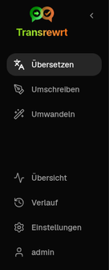
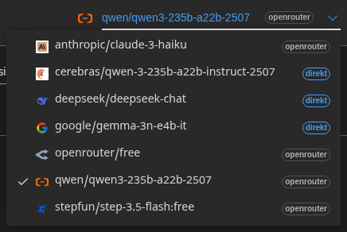
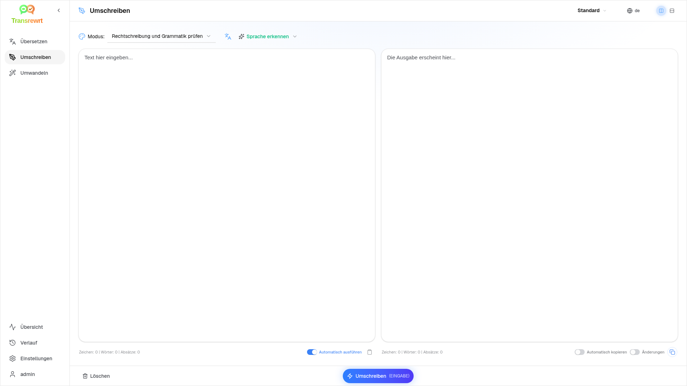
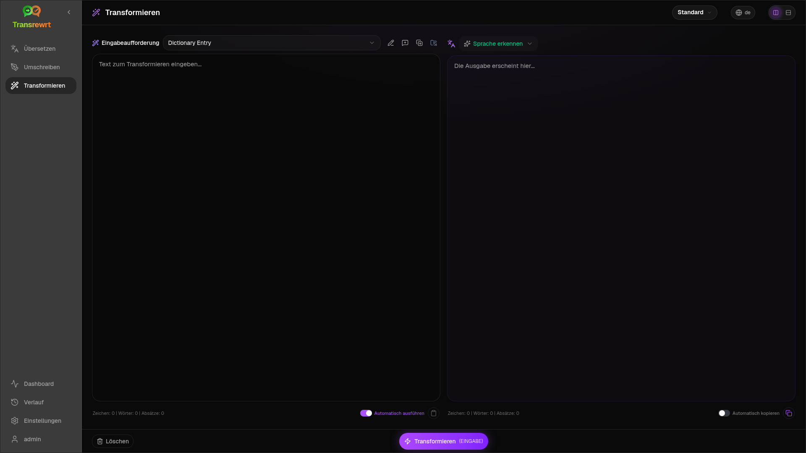
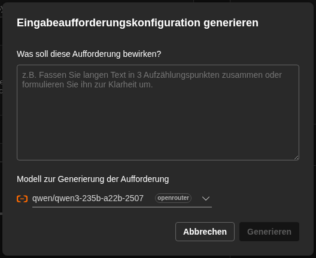
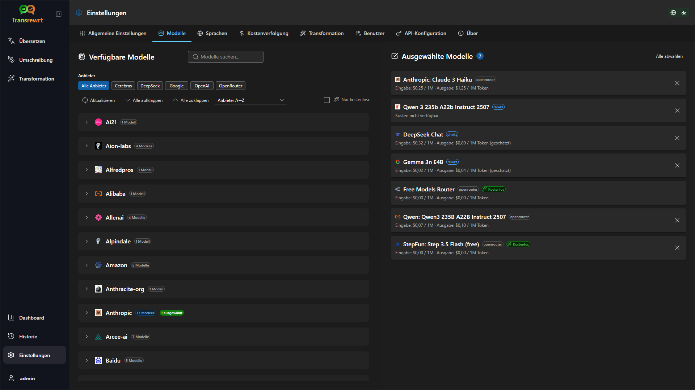

<a id="transrewrt-user-guide"></a>
# Benutzerhandbuch

<br/>

<a id="introduction"></a>
## Einführung

Transrewrt hilft Ihnen, mit Text auf drei Hauptweisen zu arbeiten:

- **Übersetzen** – Text von einer Sprache in eine andere umwandeln.
- **Umschreibung** – Text in einem anderen Stil umformulieren, z. B. klarer, kürzer oder formeller.
- **Transformation** – Text mithilfe benutzerdefinierter KI-Anweisungen, sogenannter Prompts, verarbeiten.

<br/>

Dieses Handbuch erklärt, wie Sie die App verwenden, sobald sie installiert und ausgeführt wird. Für Installationsanweisungen siehe die Hauptdatei **[README](README.de.md)**.

<br/>

> ℹ️ **HINWEIS**<br/>
> Transrewrt ist als Desktop-App für Windows und Linux sowie als selbstgehostete Web-App verfügbar. Dieses Handbuch konzentriert sich auf die tägliche Nutzung der App. Wo etwas nur für eine Version gilt, ist dies klar gekennzeichnet.

<small>**In anderen Sprachen lesen:** </small>
<small id="lang-list">[English (GB)](../USER-GUIDE.md) · [Português (Brasil)](./USER-GUIDE.pt-BR.md) · [العربية](./USER-GUIDE.ar.md) · [বাংলা](./USER-GUIDE.bn.md) · [Català](./USER-GUIDE.ca.md) · [中文 (中国大陆)](./USER-GUIDE.zh-CN.md) · [中文 (台灣)](./USER-GUIDE.zh-TW.md) · [Hrvatski](./USER-GUIDE.hr.md) · [Čeština](./USER-GUIDE.cs.md) · [Nederlands](./USER-GUIDE.nl.md) · [English (US)](./USER-GUIDE.en-US.md) · [Tagalog](./USER-GUIDE.tl.md) · [Français](./USER-GUIDE.fr.md) · [Deutsch](./USER-GUIDE.de.md) · [Ελληνικά](./USER-GUIDE.el.md) · [हिन्दी](./USER-GUIDE.hi.md) · [Magyar](./USER-GUIDE.hu.md) · [Italiano](./USER-GUIDE.it.md) · [日本語](./USER-GUIDE.ja.md) · [한국어](./USER-GUIDE.ko.md) · [Bahasa Melayu](./USER-GUIDE.ms.md) · [فارسی](./USER-GUIDE.fa.md) · [Polski](./USER-GUIDE.pl.md) · [Basa Jawa](./USER-GUIDE.jv.md) · [Português](./USER-GUIDE.pt.md) · [ਪੰਜਾਬੀ](./USER-GUIDE.pa.md) · [Română](./USER-GUIDE.ro.md) · [Русский](./USER-GUIDE.ru.md) · [Slovenčina](./USER-GUIDE.sk.md) · [Español](./USER-GUIDE.es.md) · [Kiswahili](./USER-GUIDE.sw.md) · [Svenska](./USER-GUIDE.sv.md) · [తెలుగు](./USER-GUIDE.te.md) · [ไทย](./USER-GUIDE.th.md) · [Türkçe](./USER-GUIDE.tr.md) · [Українська](./USER-GUIDE.uk.md) · [Tiếng Việt](./USER-GUIDE.vi.md)</small>

<small>

> **Hinweis zu Übersetzungen der Benutzeroberfläche und Dokumentation:** Alle Sprachen der Benutzeroberfläche außer dem ursprünglichen Englisch (GB)
> wurden mithilfe von KI-Modellen übersetzt; die Formulierungen können ungenau oder fehlerhaft sein.

</small>

<br/>

<!-- START doctoc generated TOC please keep comment here to allow auto update -->
<!-- DON'T EDIT THIS SECTION, INSTEAD RE-RUN doctoc TO UPDATE -->
**Inhaltsverzeichnis**

- [Bevor Sie beginnen](#before-you-start)
  - [So erhalten Sie einen kostenlosen OpenRouter-API-Schlüssel (Desktop-App)](#how-to-get-a-free-openrouter-api-key-desktop-app)
- [Erste Schritte](#getting-started)
- [Hauptbestandteile des Fensters](#main-parts-of-the-window)
  - [Seitenleiste](#sidebar)
  - [Symbolleiste](#toolbar)
  - [Eingabe- und Ausgabefelder](#input-and-output-panels)
- [Übersetzen](#translate)
  - [Text übersetzen](#translate-text)
  - [Sprachauswahl](#language-selection)
  - [Nützliche Übersetzungseinstellungen](#helpful-translation-settings)
- [Umschreiben](#rewrite)
- [Transformieren](#transform)
  - [Einen vorhandenen Prompt ausführen](#run-an-existing-prompt)
  - [Wenn Sie noch keine Prompts haben](#if-you-have-no-prompts-yet)
  - [Einen Prompt schnell erstellen](#create-a-prompt-quickly)
  - [Einen Prompt bearbeiten](#edit-a-prompt)
  - [Einen Prompt vor der Nutzung testen](#test-a-prompt-before-using-it)
- [Dashboard](#dashboard)
  - [Daten filtern](#filter-the-data)
  - [Dashboard-Registerkarten](#dashboard-tabs)
  - [Daten exportieren](#export-data)
  - [Gespeicherte Datensätze für ein Modell löschen](#delete-stored-records-for-a-model)
- [Verlauf](#history)
  - [Daten filtern](#filter-the-data-1)
  - [Verlaufsdaten exportieren](#export-history-data)
- [Einstellungen](#settings)
  - [Allgemeine Einstellungen](#general-settings)
  - [Modelle](#models)
  - [Sprachen](#languages)
  - [Kostenverfolgung](#cost-tracking)
  - [Transformations-Prompts](#transform-prompts)
  - [Benutzer](#users)
  - [API-Konfiguration](#api-config)
  - [Über](#about)
- [Häufige Probleme](#common-issues)
  - [Die App übersetzt, umschreibt oder transformiert keinen Text](#the-app-will-not-translate-rewrite-or-transform-text)
  - [Die Modellliste ist leer](#the-model-list-is-empty)
  - [Das Ergebnis ist zu langsam oder zu teuer](#the-result-is-too-slow-or-too-expensive)
  - [Die Oberfläche ist in der falschen Sprache](#the-interface-is-in-the-wrong-language)
  - [Der Text ist zu klein oder schwer lesbar](#the-text-is-too-small-or-hard-to-read)
  - [Dashboard-Diagramme sind leer](#dashboard-charts-are-empty)
  - [Kosten zeigen „nicht verfügbar“ oder scheinen falsch](#cost-shows-not-available-or-seems-wrong)
  - [Die Gesamtkosten stimmen nicht mit meiner Provider-Rechnung überein](#total-cost-does-not-match-my-provider-bill)
  - [Die Verlauf-Seite fehlt in der Seitenleiste](#the-history-page-is-missing-from-the-sidebar)
  - [Web-App: Unerwartete Weiterleitung zur Anmeldeseite](#web-app-redirected-to-the-login-page-unexpectedly)
  - [Web-Admin: Passwort vergessen oder verloren](#web-admin-forgot-or-lost-a-password)
  - [Dashboard zeigt keine Daten für andere Benutzer an (Web)](#dashboard-shows-no-data-for-other-users-web)
  - [Ich habe einen Prompt geändert und die Bearbeitungen sind verloren](#i-changed-a-prompt-and-lost-the-edits)
- [Schnelltipps](#quick-tips)
- [Haftungsausschluss](#disclaimer)
- [Lizenz](#license)

<!-- END doctoc generated TOC please keep comment here to allow auto update -->

<br/><br/>

<a id="before-you-start"></a>
## Bevor Sie beginnen

Um Transrewrt nutzen zu können, benötigen Sie Zugriff auf mindestens einen KI-Anbieter. Die unterstützten Anbieter sind: [OpenRouter](https://openrouter.ai) (der viele Modelle bündelt), OpenAI, Anthropic, Google Gemini, DeepSeek, Groq, Mistral, xAI, Cerebras und [Ollama](https://ollama.com) für lokale Modelle.

Sie müssen kein kostenpflichtiges Modell auswählen, um loszulegen. Sobald Sie Ihren OpenRouter-API-Schlüssel hinzufügen, aktiviert die App automatisch eine integrierte **kostenlose** OpenRouter-Option. Dadurch können Sie sofort mit dem Übersetzen, Umschreiben und Transformieren von Text beginnen. Alternativ können Sie auch einen kostenlosen API-Schlüssel von Cerebras, Google, Groq oder Mistral AI erhalten.

Einfach ausgedrückt:

- Ein **Modell** ist die KI-Engine, die die Arbeit verrichtet. Modelle werden mit einem **Anbieter-Präfix** aufgelistet (z. B. `openrouter/…`, `openai/…`, `ollama/…`).
- Ein **API-Schlüssel** (oder bei Ollama eine **Basis-URL**) ist die Verbindung, über die die App den Anbieter erreicht.

Wenn Sie die **Desktop-App** verwenden, fügen Sie Schlüssel in [**Einstellungen** > **API-Konfiguration**](#api-config) für jeden Anbieter hinzu, den Sie nutzen. Für die ausschließliche Nutzung von OpenRouter siehe unten [So erhalten Sie einen API-Schlüssel](#how-to-get-an-api-key-desktop-app). Wenn Sie keinen API-Schlüssel verwenden möchten, können Sie Ollama (von [ollama.com](https://ollama.com)) installieren und stattdessen lokale Modelle verwenden, wie z. B. `translategemma:4b`.

Wenn Sie die **Webversion** verwenden, konfiguriert der Serverbetreiber die Anbieter über Umgebungsvariablen, sodass Sie keine API-Schlüssel direkt in der Anwendung eingeben können.

<br/>

<a id="how-to-get-an-api-key-desktop-app"></a>
### So erhalten Sie einen kostenlosen OpenRouter-API-Schlüssel (Desktop-App)

Wenn Sie die Desktop-App verwenden, befolgen Sie diese Schritte:

1. Rufen Sie [OpenRouter](https://openrouter.ai) in Ihrem Webbrowser auf.
2. Erstellen Sie ein Konto oder melden Sie sich an.
3. Öffnen Sie die Seite [Keys](https://openrouter.ai/keys).
4. Klicken Sie auf die Schaltfläche, um einen neuen API-Schlüssel zu erstellen.
5. Geben Sie dem Schlüssel einen Namen, damit Sie ihn später wiedererkennen können.
6. Kopieren Sie den neuen API-Schlüssel.
7. Kehren Sie zu Transrewrt zurück und öffnen Sie **Einstellungen** > **API-Konfiguration**.
8. Fügen Sie den Schlüssel in **OpenRouter-API-Schlüssel** ein (unter **Einstellungen** > **API-Konfiguration**).
9. Klicken Sie auf **OpenRouter-Schlüssel testen**, um sicherzustellen, dass er funktioniert.

<br/><br/>

<a id="getting-started"></a>
## Erste Schritte

Wenn Sie Transrewrt zum ersten Mal verwenden, befolgen Sie diese Reihenfolge:

1. Öffnen Sie die App.
2. Wählen Sie ggf. Ihre **Oberflächensprache** über das Globus-Symbol.
3. Wenn Sie die **Desktop-App** verwenden, öffnen Sie [**Einstellungen** > **API-Konfiguration**](#api-config), fügen Sie einen API-Schlüssel für mindestens einen Anbieter hinzu (z. B. OpenRouter) und klicken Sie auf **Test**, um die Funktionalität zu überprüfen.
4. Öffnen Sie [**Einstellungen** > **Modelle**](#models) und fügen Sie ein oder mehrere Modelle zu **Ausgewählte Modelle** hinzu.
5. Öffnen Sie [**Einstellungen** > **Sprachen**](#languages) und wählen Sie Ihre **Bevorzugten Sprachen**, wenn Sie möchten, dass Ihre am häufigsten verwendeten Sprachen zuerst angezeigt werden.
6. Gehen Sie zu **Übersetzen** und führen Sie eine einfache Übersetzung durch, um sicherzustellen, dass alles funktioniert.
7. Sobald dies funktioniert, probieren Sie **Umschreiben** und anschließend **Transformieren** aus.

Diese Reihenfolge ist wichtig. Sie verhindert das häufigste Problem bei der Erstnutzung: einen Auftrag auszuführen, bevor die App eine funktionierende API-Verbindung oder ein ausgewähltes Modell hat.

<br/><br/>

<a id="main-parts-of-the-window"></a>
## Hauptbestandteile des Fensters

Die App ist in drei Hauptbereiche unterteilt:

- Die **Seitenleiste** auf der linken Seite.
- Die **Symbolleiste** oben.
- Der **Arbeitsbereich** in der Mitte.

<br/>

<a id="sidebar"></a>
### Seitenleiste

Verwenden Sie die Seitenleiste, um sich in der App zu bewegen. Sie können die Seitenleiste durch Klicken auf das Symbol neben dem App-Logo einblenden, um mehr Platz zu gewinnen.

<br/>

<table>
  <tr>
    <td valign="top">
       
    </td>
    <td valign="top">
      <br/><br/>
      <ul>
        <li><strong>Übersetzen</strong> öffnet den Übersetzungsarbeitsbereich.</li><br/>
        <li><strong>Umschreibung</strong> öffnet den Umschreibungsarbeitsbereich.</li><br/>
        <li><strong>Transformation</strong> öffnet den Arbeitsbereich für benutzerdefinierte Prompts.</li><br/>
        <li><strong>Dashboard</strong> zeigt Nutzungs- und Kosteninformationen an.</li><br/>
        <li><strong>Einstellungen</strong> öffnet das Einstellungsfenster.</li><br/>
        <li><strong>Historie</strong> zeigt den Nutzungsverlauf mit Eingabe- und Ausgabetext an</li><br/>
        <li><strong>Benutzer</strong> zeigt den Benutzernamen des angemeldeten Benutzers an (nur Web).</li>
      </ul>
    </td>
  </tr>
</table>

<br/>

<a id="toolbar"></a>
### Symbolleiste

Die Symbolleiste ändert sich leicht, je nachdem, wo Sie sich in der App befinden.

- Links wird der Name der aktuellen Seite angezeigt.
- Rechts sehen Sie den **Modellauswahl** und die Steuerung für die **Oberflächensprache**.

Mit dem **Modellauswahlmenü** können Sie festlegen, welcher KI-Engine für die aktuelle Aufgabe verwendet werden soll.



Einige kostenlose Modelle sind möglicherweise nicht immer verfügbar – manchmal sind sie offline oder haben eine Nutzungsobergrenze. In diesem Fall entfernt die App das Modell automatisch aus Ihrer Liste der verfügbaren Modelle. Um zu steuern, welche Modelle angezeigt werden, gehen Sie zu [**Einstellungen** > **Modelle**](#models) und bearbeiten Ihre Modellliste.  
Sie können die Modell-Einstellungen auch direkt öffnen, indem Sie auf das Anbietersymbol links neben dem Modellnamen in der Symbolleiste klicken.

<br/>

Das **Globus-Symbol + Sprachcode** ändert die Oberflächensprache der App, wie Menüs und Schaltflächen. Es ändert **nicht** die Übersetzungssprachen, die in **Übersetzen** verwendet werden.


<br/>

<a id="input-and-output-panels"></a>
### Eingabe- und Ausgabefelder

Die meisten Arbeitsbereiche verwenden ein linkes **Eingabe**-Feld und ein rechtes **Ausgabe**-Feld.

Jedes Feld zeigt außerdem Folgendes an:

| **Eingabe**                                                          | **Ausgabe**                                                                                                                  |
|--------------------------------------------------------------------|-----------------------------------------------------------------------------------------------------------------------------|
| - Zeichenanzahl <br/>- Wortanzahl <br/>- Absatzanzahl   <br/> | - Dauer der Aufgabe<br/>- **TPS** (Token pro Sekunde)<br/>- Zeichen-, Wort- und Absatzanzahl<br/>- Das verwendete Modell |

Wenn Sie sich über die technischen Begriffe wundern:

- **Token** bedeutet ein kleines Textstück. Sie können es sich als einen Wortteil oder ein kurzes Wort vorstellen.
- **TPS** gibt an, wie viele dieser Textstücke das Modell pro Sekunde verarbeitet hat.

<br/>

Sie können auch die Kosten jeder Operation (falls verfügbar) sowie die Gesamtkosten überwachen, indem Sie die Option `Show cost information on the actions` unter [**Einstellungen** > **Allgemeine Einstellungen**](#general-settings) aktivieren.

<br/><br/>

[--------------------------------------------------------------------------------------------------------------------------]: #

<a id="translate"></a>
## Übersetzen

Verwenden Sie **Übersetzen**, wenn Sie Text von einer Sprache in eine andere konvertieren möchten.


<br/>

<a id="translate-text"></a>
### Text übersetzen

1. Öffnen Sie **Übersetzen**.
2. Wählen Sie eine Sprache in **Von**.
3. Wählen Sie eine Sprache in **Nach**.
4. Wählen Sie ein Modell in der Symbolleiste.
5. Geben Sie Text in **Eingabe** ein oder fügen Sie ihn ein.
6. Klicken Sie auf **Übersetzen**.
7. Lesen Sie das Ergebnis in **Ausgabe**.
8. Verwenden Sie die Kopierschaltfläche, wenn Sie das Ergebnis kopieren möchten.

<br/>

<a id="language-selection"></a>
### Sprachauswahl

- **Von** kann eine bestimmte Sprache oder **Sprache erkennen** sein.
- **Nach** ist die Sprache, in die das Ergebnis übersetzt werden soll.

Ihre ausgewählten **Top-Sprachen** werden oben in der Liste angezeigt. Sie können diese unter [**Einstellungen** > **Sprachen**](#languages) festlegen.

<br/>

<a id="helpful-translation-settings"></a>
### Nützliche Übersetzungseinstellungen

Unter [**Einstellungen** > **Allgemeine Einstellungen**](#general-settings) können Sie ändern, wie sich die Übersetzung verhält:

- **Automatische Übersetzung beim Einfügen** führt eine Übersetzung sofort aus, sobald Sie Text einfügen.
- **Ergebnis automatisch in Zwischenablage kopieren** kopiert das Ergebnis automatisch nach einem erfolgreichen Durchlauf.
- **Echtzeit-Übersetzung (während des Tippens)** führt Übersetzungen während des Tippens durch.
- **Timeout (ms)** legt fest, wie lange die App wartet, bevor eine Echtzeit-Übersetzung gestartet wird.
- **Enter** steuert, was geschieht, wenn Sie `Enter` drücken:

<br/><br/>

[--------------------------------------------------------------------------------------------------------------------------]: #

<a id="rewrite"></a>
## Umschreibung

Verwenden Sie **Umschreibung**, wenn Sie den Wortlaut verbessern möchten, ohne die Hauptbedeutung zu verändern.



Dies ist nützlich für:

- Rechtschreibung und Grammatik korrigieren (**Rechtschreibung & Grammatik prüfen**)
- Text klarer machen (**Klarheit verbessern**)
- mehrere unterschiedliche Formulierungen in einem Durchlauf erstellen (**Alternative Versionen**)
- Text formeller oder informeller gestalten (**Formell** / **Informell**)
- Text kürzen oder erweitern (**Kürzen** / **Erweitern**)
- Text technischer klingen lassen (**Technisch machen**)

<br/>

> 💡 **TIPP**<br/>
> Wenn Sie den Modus „**Rechtschreibung & Grammatik prüfen**“ verwenden, erscheint im Ausgabebereich (neben **Kopieren**) ein Schalter **Änderungen anzeigen**.
> Schalten Sie ihn ein oder aus, um die spezifischen Korrekturen an Ihrem Text anzuzeigen oder auszublenden.

<br/><br/>

[--------------------------------------------------------------------------------------------------------------------------]: #

<a id="transform"></a>
## Transformation

Verwenden Sie **Transformation**, wenn Sie möchten, dass die KI eine benutzerdefinierte Anweisung befolgt.



Dies ist der flexibelste Bereich der App. Sie können ihn für Aufgaben wie diese nutzen:

- Notizen zusammenfassen
- Ungeordneten Text in eine überarbeitete E-Mail umwandeln
- Wichtige Punkte extrahieren
- Text in ein bestimmtes Format umwandeln
- jede andere benutzerdefinierte Aktion mit dem Eingabetext

<br/>

<a id="run-an-existing-prompt"></a>
### Einen vorhandenen Prompt ausführen

1. Öffnen Sie **Umwandeln**.
2. Wählen Sie eine Aufforderung aus der Aufforderungsliste.
3. Falls ein Feld **Zielsprache** erscheint, wählen Sie gegebenenfalls eine Sprache aus.
4. Geben Sie Text in **Eingabe** ein oder fügen Sie ihn ein.
5. Klicken Sie auf **Umwandeln**.
6. Lesen Sie das Ergebnis in **Ausgabe**.

<br/>

<a id="if-you-have-no-prompts-yet"></a>
### Wenn Sie noch keine Prompts haben

Wenn Ihre Prompt-Liste leer ist, klicken Sie im Transformations-Arbeitsbereich auf **Beispiel-Prompts laden**. Die gleiche Funktion ist jederzeit in [**Einstellungen** > **Transform-Prompts**](#transform-prompts) in der Zeile zum Exportieren/Importieren verfügbar. Beide fügen integrierte Beispiele hinzu, damit Sie schnell starten können.

<br/>

> ℹ️ **HINWEIS**<br/>
> Beispiel-Prompts werden auf Englisch bereitgestellt. Nach dem Laden können Sie einen Prompt bearbeiten und **Eingabeaufforderung übersetzen** verwenden, um ihn in Ihre Sprache zu übersetzen.

<br/>

<a id="create-a-prompt-quickly"></a>
### Schnell einen Prompt erstellen

Der schnellste Weg, einen Prompt zu erstellen, ist:

1. Klicken Sie auf **Neue Aufforderung**.
2. Klicken Sie auf **Aufforderung generieren**.
3. Beschreiben Sie, was die Aufforderung bewirken soll.
4. Wählen Sie ein Modell.
5. Lassen Sie die App einen Entwurf für Sie erstellen.
6. Überprüfen Sie den Entwurf und klicken Sie auf **Speichern**.



<br/>

<a id="edit-a-prompt"></a>
### Prompt bearbeiten

Wenn Sie einen Prompt erstellen oder bearbeiten, wird der Editor auf der linken Seite angezeigt und ein Testbereich auf der rechten Seite.


Die wichtigsten Felder sind:

- **Aufforderungsname**: der Name, der in der Aufforderungsliste angezeigt wird.
- **Aufforderungsanweisungen (optional)**: ein kurzer Hinweis, der dem Benutzer beim Ausführen der Aufforderung angezeigt wird.
- **Modellrolle**: die allgemeine Rolle, die der KI zugewiesen wird, z. B. „Du bist ein hilfreicher Assistent.“
- **Modellanweisungen (eine pro Zeile)**: die spezifischen Regeln, denen die KI folgen soll.
- **Ergebnisbeschreibung**: ein kurzes Wort, das das Ergebnis beschreibt, z. B. „Zusammenfassung“ oder „Umschreibung“.
- **Temperatur (0,0 → 1,0)**: legt das Verhalten des Modells fest; siehe unten.
- **Zielsprache abfragen**: fügt beim Ausführen der Aufforderung einen Auswahlmenü für die Zielsprache hinzu.

Wenn Ihnen der Fachbegriff **Temperatur** neu ist, stellen Sie sich das folgendermaßen vor:

- Eine **niedrigere** Temperatur führt zu stabileren, vorhersehbareren Ergebnissen.
- Eine **höhere** Temperatur führt zu mehr Vielfalt und Kreativität.

Sie können außerdem verwenden:

- **`Generate prompt`**, um einen neuen Entwurf aus einer einfachen Beschreibung zu erstellen
- **`Improve prompt`**, um einen vorhandenen Prompt zu verfeinern
- **`Translate prompt`**, um die Prompt-Felder zu übersetzen

<br/>

> ⚠️ **WARNUNG**<br/>
> Klicken Sie auf **`Save`**, bevor Sie auf **`Back to Run`** klicken. Wenn Sie zurückgehen, ohne zu speichern, gehen Ihre Änderungen verloren.

<br/>

<a id="test-a-prompt-before-using-it"></a>
### Testen Sie einen Prompt, bevor Sie ihn verwenden

Das Testfeld auf der rechten Seite ermöglicht es Ihnen, Ihren Prompt mit Beispieltext auszuprobieren, bevor Sie ihn im täglichen Arbeitsablauf verwenden.

Dies ist nützlich, wenn:

- Sie einen neuen Prompt erstellen
- Sie zwei Versionen eines Prompts vergleichen
- Sie Ton, Länge oder Ausgabeformat überprüfen möchten

<br/>

> ℹ️ **HINWEIS**<br/>
> Sie können gespeicherte Prompts in [**Einstellungen** > **Transform-Prompts**](#transform-prompts) exportieren und importieren.

<br/><br/>

[--------------------------------------------------------------------------------------------------------------------------]: #

<a id="dashboard"></a>
## Dashboard

Verwenden Sie **Dashboard**, um zu sehen, wie intensiv Sie die App nutzen und welche Kosten entstehen (für kostenpflichtige Modelle).


<br/>

> ℹ️ **HINWEIS**<br/>
> Wenn Sie nur **kostenlose** Modelle verwenden, können die **Kosten** Null betragen und kostenbezogene Zusammenfassungen leer erscheinen. Auf **Zusammenfassung** zeigen **Nutzung im Zeitverlauf** und **Nutzung nach Modell** weiterhin die **Anzahl der Aufrufe** (Übersetzen, Umschreiben und Transformation), wenn Aktivitäten im ausgewählten Zeitraum vorliegen.

<br/>

<a id="filter-the-data"></a>
### Daten filtern

Verwenden Sie die Filterknöpfe oben, um den Zeitraum zu ändern.


<br/>

> ℹ️ **HINWEIS**<br/>
> Der **Benutzer**-Filter ist nur für Administratoren in der Webversion sichtbar. Reguläre Benutzer sehen diesen Filter nicht, und er ist nicht in der Desktop-App verfügbar.

<br/>

<a id="dashboard-tabs"></a>
### Dashboard-Registerkarten

- **Zusammenfassung** bietet einen Überblick über Nutzung und Kosten. Enthält eine **Nutzung im Zeitverlauf** (kumulierte gestapelte **Aufrufanzahlen** pro Tag für Übersetzen, Umschreiben und Umwandeln) und **Nutzung nach Modell** (gesamte **Aufrufe pro Modell**, einschließlich Umwandeln).
- **Nach Nutzung** unterteilt die Aktivitäten nach Übersetzungssprache, Umschreibungsmodus und Umwandlungs-Aufforderung.
- **Nach Modell** zeigt an, welche Modelle Sie verwendet haben und wie hoch deren Kosten waren.
- **Nach Tag** zeigt tägliche Gesamtwerte an.
- **Alle Aufrufe** zeigt den vollständigen Aufrufverlauf an und ermöglicht den Export.

<br/>

<a id="export-data"></a>
### Daten exportieren

Die Dashboard-Tabellen können Daten im folgenden Format exportieren:

- **JSON**
- **CSV**
- **XLSX**

Dies ist nützlich, wenn Sie Aktivitäten außerhalb der App überprüfen oder einen Bericht teilen möchten.

<br/>

<a id="delete-stored-records-for-a-model"></a>
### Gespeicherte Datensätze für ein Modell löschen

In **Nach Modell** oder **Alle Aufrufe** können Sie gespeicherte Datensätze für ein Modell entfernen, indem Sie auf das „Papierkorb“-Symbol klicken.

> ⚠️ **WARNUNG**<br/>
> Das Löschen gespeicherter Datensätze kann nicht rückgängig gemacht werden. Verwenden Sie diese Funktion nur, wenn Sie sicher sind, dass Sie den Verlauf nicht mehr benötigen.

Um alle Daten zu löschen oder Datensätze basierend auf ihrem Alter zu entfernen, gehen Sie zu [**Einstellungen** > **Kostenverfolgung**](#cost-tracking). Dort finden Sie Optionen, um alle gespeicherten Daten oder nur Daten, die älter als ein bestimmtes Datum sind, zu löschen.

<br/><br/>

[--------------------------------------------------------------------------------------------------------------------------]: #

<a id="history"></a>
## Historie

Klicken Sie auf **Historie**, um den Verlauf Ihrer Aktionen innerhalb von **Transrewrt** einzusehen, einschließlich der Eingabe und Ausgabe jeder Operation.


<br/>

<a id="filter-the-history"></a>
### Daten filtern

**Historie** verwendet dieselben Filter wie die **Dashboard**-Seite. Nutzen Sie diese, um den gewünschten Zeitraum auszuwählen.


<br/>

> ℹ️ **HINWEIS**<br/>
> Der **Benutzer**-Filter ist nur für Administratoren in der Webversion sichtbar. Reguläre Benutzer sehen diesen Filter nicht, und er ist nicht in der Desktop-App verfügbar.

<br/>

<a id="export-history-data"></a>
### Historiendaten exportieren

Die Historie-Seite kann die gefilterten Daten im folgenden Format exportieren:

- **JSON**
- **CSV**
- **XLSX**

Dies ist nützlich, wenn Sie Aktivitäten außerhalb der App überprüfen oder einen Bericht teilen möchten.

<br/><br/>

[--------------------------------------------------------------------------------------------------------------------------]: #

<a id="settings"></a>
## Einstellungen

Öffnen Sie **Einstellungen** in der Seitenleiste, um das Verhalten der App anzupassen.

Die verfügbaren Tabs hängen von der Plattform und Ihrer Rolle ab:

| Registerkarte         | Desktop | Web (Admin) | Web (regulärer Benutzer) |
  |-----------------------|:-------:|:-----------:|:------------------------:|
  | Allgemeine Einstellungen |   ja   |     ja     |           ja            |
  | Modelle               |   ja   |     ja     |           ja            |
  | Sprachen              |   ja   |     ja     |           ja            |
  | Kostenverfolgung      |   ja   |     ja     |           -             |
  | Umwandlungs-Aufforderungen |   ja   |     ja     |           ja            |
  | Benutzer              |    -    |     ja     |           -             |
  | API-Konfiguration   |   ja   |     ja     |         -          |
  | Über             |   ja   |     ja     |        ja         |

<br/>

> ℹ️ **HINWEIS**<br/>
> In der Webversion verfügt jeder Benutzer über eine eigene Konfiguration. Einstellungen wie ausgewählte Modelle, Sprachen, allgemeine Optionen und Transform-Prompts werden pro Benutzer gespeichert. Änderungen, die Sie vornehmen, wirken sich nicht auf andere Benutzer aus.

<br/>

[--------------------------------------------------------------------------------------------------------------------------]: #

<a id="general-settings"></a>
### Allgemeine Einstellungen

Verwenden Sie **Allgemeine Einstellungen**, um das Verhalten bei der Eingabe, die Speicherung von Ausführungsdetails für die **Historie** und die Darstellung zu steuern.

**Verhalten**

- **Verhalten bei EINGABE** legt fest, ob `Enter` die Aufgabe ausführt oder eine neue Zeile einfügt.
- **Automatische Übersetzung beim Einfügen** startet die Übersetzung, sobald Sie Text einfügen.
- **Ergebnis automatisch in Zwischenablage kopieren** kopiert erfolgreiche Ergebnisse automatisch.
- **Echtzeit-Übersetzung (während des Tippens)** übersetzt, während Sie tippen.
- **Timeout (ms)** legt die Wartezeit für die Echtzeit-Übersetzung fest.

**Historie**

- **Ausführungshistorie behalten.** steuert, ob jede Übersetzung, Umschreibung und Transformation **Eingabe- und Ausgabetext** für die Ansicht [**Historie**](#history) in der Seitenleiste speichert. Wenn Sie diese Option deaktivieren, wird eine Bestätigung angefordert; bei Bestätigung wird der gespeicherte Historientext aus der Datenbank entfernt.
- **Historiendaten löschen.** ermöglicht das Entfernen gespeicherter Texte nach Alter (z. B. älter als einige Monate oder **alle Daten (löschen)**) mithilfe von **Daten löschen**. Dies betrifft nur gespeicherte Ausführungstexte für die **Historie**-Ansicht; es werden **keine** Kosten- oder Nutzungsdaten gelöscht. Um **Kosten**-Daten zu entfernen oder zu bereinigen, verwenden Sie [**Einstellungen** > **Kostenverfolgung**](#cost-tracking).

**Darstellung**

- **Kosteninformationen bei Aktionen anzeigen** steuert die Anzeige der Kosten pro Operation (falls verfügbar) und der Gesamtkosten in den Ausgabefeldern für Übersetzen, Umschreiben und Transformieren.
- **Kosten-Nachkommastellen** ändert die Anzeige der Dezimalstellen bei Kosten.
- **Nur Web:** **Abstand um die App anzeigen** fügt zusätzlichen Platz um die Oberfläche hinzu.
- **Schriftart** ändert die Schriftart in den Textfeldern.
- **Größe** ändert die Schriftgröße.

**Konfigurationssicherung**

- **Nutzungsdaten in die Sicherung einschließen** – wenn aktiviert, enthält die ZIP-Datei auch Ausführungsverlauf und API-Aufrufdaten. 
- **Konfiguration sichern** – erstellt eine einzelne ZIP-Datei (`transrewrt-config-backup-YYYY-MM-DD_HHMMSS.zip` standardmäßig in UTC) mit `config.json`, `state.json`, optionalem Verschlüsselungsschlüssel, Benutzern, Einstellungen, benutzerdefinierten Prompts und Nutzungsdaten, falls aktiviert. Nach einer erfolgreichen Sicherung zeigt die Bestätigung den gespeicherten Dateinamen an.
- **Aus Sicherung wiederherstellen** – öffnet zuerst einen **Bestätigungsdialog**. Wählen Sie die Sicherungs-ZIP-Datei im Dialog aus (**Durchsuchen** / Dateiauswahl oder Drag-and-Drop, falls unterstützt), dann prüfen Sie die Optionen:
  - **Nutzungsdaten wiederherstellen** – importiert Nutzung/Verlauf aus der ZIP-Datei, wenn diese bei der Sicherung enthalten war; deaktivieren, wenn nur Einstellungen und Prompts gewünscht sind.
  - **Alte Nutzungsdaten vor Wiederherstellung löschen** – entfernt vorhandene Nutzung/Verlauf auf dieser Installation, bevor die Sicherung angewendet wird (optional; verwenden Sie dies, wenn Sie einen sauberen Austausch wünschen).

Sicherungen, die entweder in der Web- oder Desktopversion erstellt wurden, können in der jeweils anderen Version wiederhergestellt werden. Beim Wiederherstellen einer Desktop-Sicherung in der Webversion werden die Daten dem Administrator-Benutzer zugewiesen.

<br/>

<a id="models"></a>
### Modelle

Verwenden Sie **Einstellungen** > **Modelle**, um auszuwählen, welche Modelle in der Symbolleiste angezeigt werden.



Die Seite enthält zwei Listen:

- **Verfügbare Modelle** auf der linken Seite
- **Ausgewählte Modelle** auf der rechten Seite

Nützliche Steuerelemente sind:

- **Modelle durchsuchen...** um ein Modell nach Namen zu finden
- **Anbieter-Chips**, um die Liste auf einen Anbieter einzuschränken (OpenRouter, OpenAI, Ollama, …)
- **Nur kostenlos** um nur kostenlose Modelle anzuzeigen
- **Aktualisieren**, um die Liste neu zu laden
- **Alle ausklappen** und **Alle einklappen**, wenn Sie nach Anbieter sortieren

Modell-IDs enthalten das Anbieter-Präfix (z. B. `openrouter/…` vs. `openai/…`). Abzeichen wie **OpenAI (OpenRouter)** vs. **OpenAI (direkt)** zeigen, wie der Datenverkehr weitergeleitet wird.

> ℹ️ **HINWEIS**<br/>
> **OpenRouter Body Builder** (`openrouter/bodybuilder`) ist ein Router-Modell, kein allgemeines Chat-Modell: Die Antwort ist JSON, das OpenRouter-API-Anfragekörper beschreibt (z. B. ein `requests`-Array mit `model` und `messages`). Wenn Sie es für **Übersetzen**, **Umschreibung** oder **Transformation** verwenden, zeigt der Ausgabebereich dieses JSON anstelle von fertigem Text an. Wählen Sie für diese Aufgaben ein normales Textmodell. Siehe die [Body Builder Modellseite](https://openrouter.ai/openrouter/bodybuilder) auf OpenRouter.

Aktionen:

- Um ein Modell hinzuzufügen, klicken Sie auf **Hinzufügen** oder an beliebiger Stelle in den Eintrag.

- Um ein Modell zu entfernen, klicken Sie auf **X** daneben in **Ausgewählte Modelle** oder auf **Ausgewählt** im Eintrag unter Verfügbare Modelle.

- Um die Liste zu leeren, klicken Sie auf **Alle abwählen**. Das erforderliche kostenlose Modell bleibt in der Liste.

<br/>

> ℹ️ **HINWEIS**<br/>
> Wenn Sie OpenRouter nicht sofort Guthaben hinzufügen möchten, aktivieren Sie zunächst **Nur kostenlose** und wählen Sie die kostenlosen Modelle (keine Kreditkarte erforderlich). Sie können auch Ollama verwenden, um Modelle lokal ohne API-Schlüssel auszuführen.

<br/>

<a id="languages"></a>
### Sprachen

Verwenden Sie **Einstellungen** > **Sprachen**, um die in der App verwendeten Sprachlisten zu verwalten.

- **Top-Sprachen** werden oben in den Sprachlisten bei **Übersetzen** und **Transformation** fixiert.
- **Benutzerdefinierte Sprache** ermöglicht das Hinzufügen einer Sprache, die nicht in der integrierten Liste enthalten ist.

Wenn Sie eine benutzerdefinierte Sprache hinzufügen, erscheint sie in den Sprachauswahlen zusammen mit den integrierten Optionen.

<br/>

<a id="cost-tracking"></a>
### Kostenverfolgung

Verwenden Sie **Einstellungen** > **Kostenverfolgung**, um Kosteninformationen zu verwalten.

- **Gesamtkosten** zeigt die laufende Summe an.
- **Wert kopieren** kopiert die Gesamtsumme in die Zwischenablage.
- **Kosten zurücksetzen** setzt die gespeicherte Summe auf null zurück.
- **Mit API-Schlüssel-Nutzung synchronisieren** setzt die Summe auf den Wert, der in Ihrem OpenRouter-Konto angezeigt wird (nur OpenRouter).
- **API-Schlüssel-Nutzung** zeigt OpenRouter-Nutzungsdetails an, falls verfügbar.
- **Kostendaten löschen** entfernt alle Daten oder nur Einträge, die älter als ein ausgewähltes Datum sind.

**Kostenverfolgung:** Wenn Sie OpenRouter-Modelle verwenden, zeigt die App Ihre tatsächliche Nutzung und Ausgaben basierend auf den Kosteninformationen von OpenRouter an. Für alle anderen Anbieter schätzt die App die Kosten anhand der von OpenRouter veröffentlichten Preise. Falls kein Preis verfügbar ist, kann die Schätzung null betragen.

<br/>

> ℹ️ **HINWEIS**<br/>
>  **Alle Kostenangaben sind Schätzungen zur Orientierung, keine offiziellen Rechnungsstellungen.**

<br/>

> ⚠️ **ACHTUNG**<br/>
> Das Löschen von Daten kann nicht rückgängig gemacht werden. Stellen Sie vor dem Löschen sicher, dass Sie Ihre Daten gesichert oder über [**Historie**](#history) 
> oder [**Dashboard** > **Alle Aufrufe**](#dashboard-tabs) exportiert haben, andernfalls gehen sie dauerhaft verloren. 
> Die gesamte Eingabe-/Ausgabe-Historie, die jedem API-Aufruf-Eintrag zugeordnet ist, wird ebenfalls gelöscht.

<br/>

<a id="transform-prompts"></a>
### Transform-Prompts

Verwenden Sie **Einstellungen** > **Transform-Prompts**, um Prompts in großer Zahl zu verwalten.

Sie können:

- Ihre gespeicherten Prompts überprüfen
- Prompts löschen
- Prompts aus einer Datei importieren
- Prompts zur Sicherung oder zum Teilen exportieren
- Beispiel-Prompts in die Prompt-Liste laden

<br/>

<a id="users"></a>
### Benutzer

Verwenden Sie **Benutzer**, um Benutzerkonten in der Webversion zu verwalten. Sie können Benutzer hinzufügen, deren Details aktualisieren, Passwörter zurücksetzen und Konten löschen.

<br/>

<a id="api-config"></a>
### API-Konfiguration

Die unterstützten Anbieter sind: OpenRouter, OpenAI, Anthropic, Google Gemini, DeepSeek, Groq, Mistral, xAI, Cerebras und **Ollama** (lokale Modelle über eine Basis-URL). Sie müssen nur die Anbieter konfigurieren, die Sie verwenden.

**Webanwendung: Nur für Administratoren**

API-Schlüssel werden über System- oder Docker-Umgebungsvariablen konfiguriert – sie werden nicht in der Weboberfläche eingegeben. Auf dieser Seite wird angezeigt, für welche Anbieter ein Schlüssel konfiguriert ist, und Sie können jeden einzelnen durch Klicken auf die Schaltfläche **`Test`** testen.

<br/>

> ℹ️ **HINWEIS**<br/>
> Um einen API-Schlüssel zu ändern, aktualisieren Sie die Umgebungsvariable in Ihrer System- oder Docker-Konfiguration und starten Sie den Server oder Container neu.

> ℹ️ **HINWEIS**<br/>
> **Konfigurationssicherungen** (siehe [**Allgemeine Einstellungen** → Konfigurationssicherung](#general-settings)) können **aufgelöste** Anbieterschlüssel innerhalb der `config.json` der ZIP-Datei enthalten. Beim Wiederherstellen dieser ZIP-Datei werden diese Schlüssel **nicht** wieder in die persistente Konfigurationsdatei des Servers kopiert – aktive Schlüssel stammen weiterhin aus der Umgebung und dem bestehenden Dateizustand, wie dort beschrieben.

<br/>

**Desktop-Anwendung**

Verwenden Sie **API-Konfiguration**, um API-Schlüssel für jeden von Ihnen verwendeten Anbieter zu speichern. Geben Sie bei Ollama die **Basis-URL** anstelle eines API-Schlüssels ein.

<br/>

> 💡 **Tipp** <br/>
> Wenn Sie keinen API-Schlüssel verwenden oder keine Gebühren zahlen möchten, können Sie [Ollama herunterladen](https://ollama.com) und Modelle (wie `translategemma:4b`) kostenlos lokal auf Ihrem Gerät ausführen. Alternativ können Sie ein kostenloses OpenRouter-Konto erstellen (keine Kreditkarte erforderlich), um deren kostenlose Modelle zu nutzen, oder einen kostenlosen API-Schlüssel von Cerebras, Google, Groq oder Mistral AI erhalten.

<br/>

- Fügen Sie nur die Anbieter hinzu, die Sie benötigen. In **Einstellungen** > **Modelle** beginnt jede Modell-ID mit dem Anbieter (z. B. `openrouter/openrouter/free`, `openai/gpt-4o`, `ollama/llama3`).

Um einen API-Schlüssel hinzuzufügen, geben Sie den Wert in das Textfeld ein und klicken Sie auf **`Save`**. Um einen vorhandenen Schlüssel zu ersetzen, klicken Sie auf **`Edit`**. Um zu überprüfen, ob ein Schlüssel funktioniert, klicken Sie auf **`Test`**. Bei der Ollama-Basis-URL klicken Sie immer auf **`Test`**, um die Verbindung zu prüfen.

<br/>

> ℹ️ **HINWEIS**<br/>
> Sie können den aktuellen Wert eines API-Schlüssels nicht einsehen. Sie können ihn nur mit der Schaltfläche **`Edit`** ersetzen.
> API-Schlüssel werden verschlüsselt in der Konfiguration gespeichert.

<br/>

<a id="about"></a>
### Über

Die Registerkarte **Über** zeigt:

- den App-Namen
- die Versionsnummer
- das Build-Datum
- einen Link zum Projekt-Repository

<br/><br/>

<a id="common-issues"></a>
## Häufige Probleme

Wenn etwas nicht wie erwartet funktioniert, überprüfen Sie zunächst die folgenden Punkte.

<br/>

<a id="the-app-will-not-translate-rewrite-or-transform-text"></a>
### Die App übersetzt, schreibt um oder transformiert Text nicht

Stellen Sie sicher, dass:

- Sie ein Modell in der Symbolleiste ausgewählt haben
- mindestens ein Modell unter [**Einstellungen** > **Modelle**](#models) aufgeführt ist
- Ihre API-Konfiguration funktioniert

Wenn Sie die Desktop-App verwenden:

1. Öffnen Sie [**Einstellungen** > **API-Konfiguration**](#api-config).
2. Stellen Sie sicher, dass mindestens ein API-Schlüssel gespeichert ist.
3. Klicken Sie auf **Testen** neben dem Anbieter, um zu bestätigen, dass der Schlüssel funktioniert.

<br/>

<a id="the-model-list-is-empty"></a>
### Die Modellliste ist leer

Öffnen Sie [**Einstellungen** > **Modelle**](#models) und klicken Sie auf **Aktualisieren**.

Falls erforderlich:

- suchen Sie nach einem Modell
- aktivieren Sie **Nur kostenlose**
- fügen Sie ein oder mehrere Modelle zu **Ausgewählte Modelle** hinzu

<br/>

<a id="the-result-is-too-slow-or-too-expensive"></a>
### Das Ergebnis ist zu langsam oder zu teuer

Probieren Sie eines oder mehrere der folgenden Dinge aus:

- wählen Sie ein anderes Modell
- verwenden Sie eine kürzere Eingabe
- deaktivieren Sie **Echtzeitübersetzung (während der Eingabe)** in [**Einstellungen** > **Allgemeine Einstellungen**](#general-settings)
- verwenden Sie kostenlose Modelle für einfache Aufgaben (siehe [Modelle](#models))

<br/>

<a id="the-interface-is-in-the-wrong-language"></a>
### Die Oberfläche ist in der falschen Sprache

Klicken Sie auf das Globus-Symbol in der [Symbolleiste](#toolbar) und wählen Sie Ihre bevorzugte **Oberflächensprache**.

<br/>

<a id="the-text-is-too-small-or-hard-to-read"></a>
### Der Text ist zu klein oder schwer lesbar

Öffnen Sie [**Einstellungen** > **Allgemeine Einstellungen**](#general-settings) und ändern Sie:

- **Schriftart**
- **Größe**

<br/>

<a id="dashboard-charts-are-empty"></a>
### Dashboard-Diagramme sind leer

Dies ist normal, wenn:

- Sie nur **kostenlose Modelle** verwenden und **Kosten**-Angaben betrachten (diese können null sein); **Nutzungs**-Aufrufanzahl-Diagramme auf **Zusammenfassung** benötigen weiterhin Daten aus dem ausgewählten Zeitraum
- der ausgewählte **Zeitfilter** nicht den Zeitraum abdeckt, in dem Aufrufe erfolgt sind – versuchen Sie **Alle**, um dies zu überprüfen

Wenn die Diagramme nach Auswahl von **Alle** weiterhin leer sind, überprüfen Sie, ob Aufrufe in [**Historie**](#history) oder im Tab **Alle Aufrufe** erscheinen.

<br/>

<a id="cost-shows-not-available-or-seems-wrong"></a>
### Kosten zeigen „nicht verfügbar“ oder scheinen falsch zu sein

Wenn Sie Modelle über **OpenRouter** verwenden, zeigt die App Ihre tatsächlichen von OpenRouter gemeldeten Ausgaben an.

Bei **anderen Anbietern** (OpenAI direkt, Anthropic direkt usw.) werden die Kosten anhand der von OpenRouter veröffentlichten Preisdaten geschätzt. Wenn für ein Modell kein passender Preis gefunden wird, wird die Kostenangabe als **nicht verfügbar** angezeigt und nicht zu Ihrer Gesamtsumme hinzugerechnet.

<br/>

<a id="total-cost-does-not-match-my-provider-bill"></a>
### Gesamtkosten stimmen nicht mit meiner Anbieterrechnung überein

Alle Kostenangaben in der App sind **geschätzt und dienen nur als Referenz**, nicht als offizielle Abrechnung.

Um die Gesamtsumme Ihrer tatsächlichen OpenRouter-Ausgaben näher zu bringen, öffnen Sie [**Einstellungen** > **Kostenverfolgung**](#cost-tracking) und klicken Sie auf **Mit API-Schlüssel-Nutzung synchronisieren**.

<br/>

<a id="the-history-page-is-missing-from-the-sidebar"></a>
### Die Seite „Historie“ fehlt in der Seitenleiste

Die Option **Ausführungshistorie behalten** ist möglicherweise deaktiviert. Öffnen Sie [**Einstellungen** > **Allgemeine Einstellungen**](#general-settings) und aktivieren Sie sie. Beachten Sie, dass durch das Aktivieren keine zuvor gelöschten Historiendaten wiederhergestellt werden.

<br/>

<a id="web-app-session-expired"></a>
### Web-App: unerwartete Weiterleitung zur Anmeldeseite

Ihre Sitzung ist möglicherweise abgelaufen. Melden Sie sich erneut an. Wenn dies häufig auftritt, überprüfen Sie die Serverkonfiguration bezüglich der Sitzungsdauer.

<br/>

<a id="web-admin-forgot-or-lost-a-password"></a>
### Web-Administrator: Passwort vergessen oder verloren

Dies gilt für die **selbstgehostete Web-App** (Docker), nicht für die Desktop-App (Electron).

- Wenn ein anderer Administrator sich noch anmelden kann, kann dieser [**Einstellungen** > **Benutzer**](#users) öffnen, das Konto auswählen und dort ein **neues Passwort** festlegen.
- Wenn Sie **gesperrt sind**, aber **Shell-Zugriff** auf die Maschine oder den Container haben, setzen Sie das Passwort mit dem mitgelieferten Hilfsprogramm zurück (ersetzen Sie `transrewrt`, falls Sie den Standardnamen geändert haben, und setzen Sie das Passwort in Anführungszeichen, wenn es Leerzeichen oder Sonderzeichen enthält):

```bash
docker exec transrewrt reset-web-password '<username>' '<new-password>'
```

Der Standard-Administratorname ist `admin`, wenn Sie noch keine anderen Konten erstellt haben. Wenn Sie nur ein Argument übergeben, wird dieses als neues Passwort für `admin` behandelt.

Wenn Sie aus einem **Quellcode-Checkout** heraus starten anstatt aus Docker, verwenden Sie:

```bash
pnpm run reset-web-password -- <username> <new-password>
```

Das Skript aktualisiert den Benutzerdatensatz in der SQLite-Datenbank (und kann den `admin`-Benutzer anlegen, falls er fehlt). Melden Sie sich nach dem Zurücksetzen mit dem neuen Passwort an.

<br/>

<a id="dashboard-shows-no-data-for-other-users"></a>
### Dashboard zeigt keine Daten für andere Benutzer (Web)

Nur **Administratoren** können über den **Benutzer**-Filter Daten aller Benutzer anzeigen. Reguläre Benutzer sehen standardmäßig nur ihre eigene Aktivität.

<br/>

<a id="i-changed-a-prompt-and-lost-the-edits"></a>
### Ich habe einen Prompt geändert und die Bearbeitungen sind verloren

Klicken Sie beim Bearbeiten eines Prompts immer auf **Speichern**, bevor Sie auf **Zurück zur Ausführung** klicken.

<br/><br/>

<a id="quick-tips"></a>
## Schnelltipps

- Beginnen Sie mit [**Übersetzen**](#translate), um sicherzustellen, dass Ihre Einrichtung funktioniert, bevor Sie zu [**Umschreiben**](#rewrite) oder [**Transformieren**](#transform) übergehen.
- Verwenden Sie [**Umschreiben**](#rewrite) für alltägliche Verbesserungen der Formulierung.
- Verwenden Sie [**Transformieren**](#transform), wenn Sie einen wiederholbaren Workflow für eine bestimmte Aufgabe benötigen.
- Verwenden Sie [**Dashboard**](#dashboard), wenn Sie die Nutzung und Kosten im Auge behalten möchten.
- Verwenden Sie [**Verlauf**](#history), um vergangene Operationen und deren vollständigen Eingabe-/Ausgabetext zu überprüfen.
- Exportieren Sie regelmäßig Prompts, wenn Sie eine Prompt-Bibliothek erstellen, die Sie sicher aufbewahren möchten (siehe [Transform-Prompts](#transform-prompts)) oder mit anderen teilen möchten.

<br/><br/>

<a id="disclaimer"></a>
## Haftungsausschluss

Produktnamen und Symbole gehören ihren jeweiligen Eigentümern und werden nur zur Identifikation verwendet. Diese Software steht in keiner Verbindung zu den genannten Marken und wird von diesen nicht unterstützt.

<br/><br/>

<a id="license"></a>
## Lizenz

Copyright © 2026 Waldemar Scudeller Jr.

[Apache License 2.0](../LICENSE)
