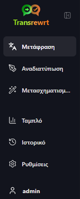
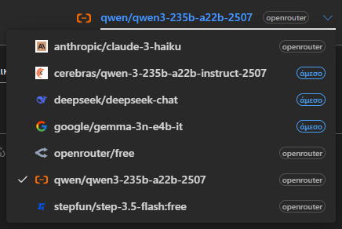
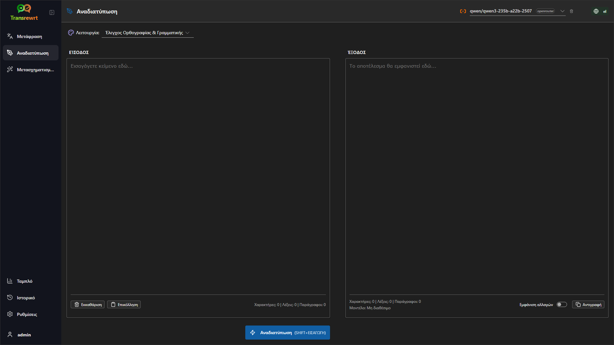
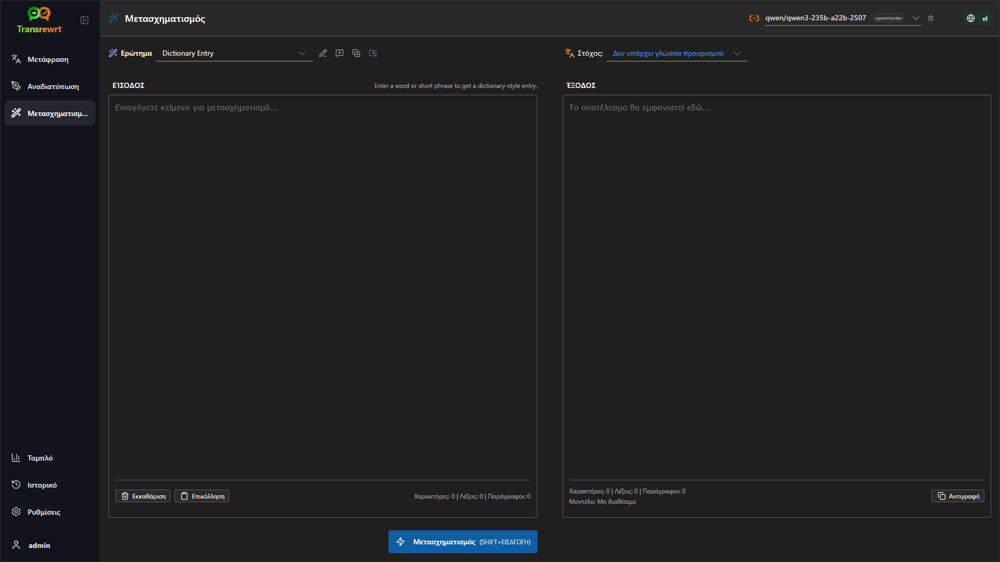
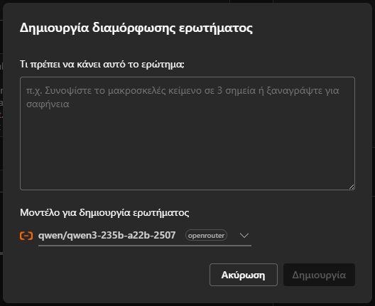
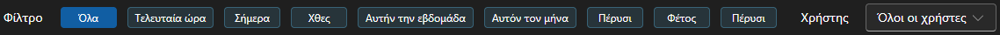

<a id="transrewrt-user-guide"></a>

# Εγχειρίδιο Χρήσης

<br/>

<a id="introduction"></a>

## Εισαγωγή

Το Transrewrt σας βοηθά να εργαστείτε με κείμενο με τρεις κύριους τρόπους:

- **Μετάφραση** - μετατρέψτε το κείμενο από μια γλώσσα σε μια άλλη.
- **Επαναδιατύπωση** - διατυπώστε ξανά το κείμενο με διαφορετικό ύφος, για παράδειγμα πιο κατανοητά, συνοπτικά ή επίσημα.
- **Μετασχηματισμός** - επεξεργαστείτε το κείμενο χρησιμοποιώντας προσαρμοσμένες οδηγίες τεχνητής νοημοσύνης που ονομάζονται ερωτήματα (prompts).

<br/>

Αυτός ο οδηγός εξηγεί πώς να χρησιμοποιήσετε την εφαρμογή αφού την έχετε εγκαταστήσει και την τρέξει. Για τα βήματα εγκατάστασης, δείτε το κύριο **[README](README.el.md)**.

<br/>

> ℹ️ **ΣΗΜΕΙΩΣΗ**<br/>
> Το Transrewrt είναι διαθέσιμο ως εφαρμογή για υπολογιστές σε Windows και Linux, καθώς και ως web εφαρμογή για εγκατάσταση σε δικό σας διακομιστή (self-hosted). Αυτός ο οδηγός επικεντρώνεται στην καθημερινή χρήση της εφαρμογής. Όπου κάτι ισχύει μόνο για μία έκδοση, τούτο σημειώνεται ρητά.

<small>**Διαβάστε σε άλλες γλώσσες:** </small>

<small id="lang-list"> [English (UK)](../USER-GUIDE.md) · [Português (BR)](USER-GUIDE.pt-BR.md) · [العربية](USER-GUIDE.ar.md) · [বাংলা](USER-GUIDE.bn.md) · [Català](USER-GUIDE.ca.md) · [简体中文](USER-GUIDE.zh-CN.md) · [繁體中文](USER-GUIDE.zh-TW.md) · [Hrvatski](USER-GUIDE.hr.md) · [Čeština](USER-GUIDE.cs.md) · [Nederlands](USER-GUIDE.nl.md) · [English (US)](USER-GUIDE.en-US.md) · [Filipino](USER-GUIDE.tl.md) · [Français](USER-GUIDE.fr.md) · [Deutsch](USER-GUIDE.de.md) · [Ελληνικά](USER-GUIDE.el.md) · [हिन्दी](USER-GUIDE.hi.md) · [Magyar](USER-GUIDE.hu.md) · [Italiano](USER-GUIDE.it.md) · [日本語](USER-GUIDE.ja.md) · [Basa Jawa](USER-GUIDE.jv.md) · [한국어](USER-GUIDE.ko.md) · [Bahasa Melayu](USER-GUIDE.ms.md) · [فارسی](USER-GUIDE.fa.md) · [Polski](USER-GUIDE.pl.md) · [Português (PT)](USER-GUIDE.pt.md) · [ਪੰਜਾਬੀ](USER-GUIDE.pa.md) · [Română](USER-GUIDE.ro.md) · [Русский](USER-GUIDE.ru.md) · [Slovenčina](USER-GUIDE.sk.md) · [Español](USER-GUIDE.es.md) · [Kiswahili](USER-GUIDE.sw.md) · [Svenska](USER-GUIDE.sv.md) · [తెలుగు](USER-GUIDE.te.md) · [ภาษาไทย](USER-GUIDE.th.md) · [Türkçe](USER-GUIDE.tr.md) · [Українська](USER-GUIDE.uk.md) · [Tiếng Việt](USER-GUIDE.vi.md)</small>

<small>

> **Σημείωση σχετικά με μεταφράσεις της διεπαφής και της τεκμηρίωσης:** Όλες οι γλώσσες διεπαφής εκτός από τα αρχικά Αγγλικά (ΗΒ) 
> μεταφράστηκαν χρησιμοποιώντας μοντέλα τεχνητής νοημοσύνης· οι διατυπώσεις ενδέχεται να είναι ανακριβείς ή να περιέχουν λάθη.

</small>

<br/>


<!-- START doctoc generated TOC please keep comment here to allow auto update -->
<!-- DON'T EDIT THIS SECTION, INSTEAD RE-RUN doctoc TO UPDATE -->
**Πίνακας Περιεχομένων**

- [Πριν ξεκινήσετε](#before-you-start)
  - [Πώς να αποκτήσετε δωρεάν κλειδί API OpenRouter (εφαρμογή επιφάνειας εργασίας)](#how-to-get-a-free-openrouter-api-key-desktop-app)
- [Ξεκινώντας](#getting-started)
- [Κύρια τμήματα του παραθύρου](#main-parts-of-the-window)
  - [Πλευρική μπάρα](#sidebar)
  - [Μπάρα εργαλείων](#toolbar)
  - [Πάνελ εισόδου και εξόδου](#input-and-output-panels)
- [Μετάφραση](#translate)
  - [Μετάφραση κειμένου](#translate-text)
  - [Επιλογή γλώσσας](#language-selection)
  - [Χρήσιμες ρυθμίσεις μετάφρασης](#helpful-translation-settings)
- [Αναδιατύπωση](#rewrite)
- [Μετασχηματισμός](#transform)
  - [Εκτέλεση υπάρχοντος προτρέποντος](#run-an-existing-prompt)
  - [Αν δεν έχετε ακόμη προτρέποντα](#if-you-have-no-prompts-yet)
  - [Δημιουργία προτρέποντος γρήγορα](#create-a-prompt-quickly)
  - [Επεξεργασία προτρέποντος](#edit-a-prompt)
  - [Δοκιμή προτρέποντος πριν τη χρήση του](#test-a-prompt-before-using-it)
- [Ταμπλό](#dashboard)
  - [Φιλτράρισμα δεδομένων](#filter-the-data)
  - [Καρτέλες ταμπλό](#dashboard-tabs)
  - [Εξαγωγή δεδομένων](#export-data)

- [Διαγραφή αποθηκευμένων εγγραφών για ένα μοντέλο](#delete-stored-records-for-a-model)
- [Ιστορικό](#history)
  - [Φιλτράρισμα δεδομένων](#filter-the-data-1)
  - [Εξαγωγή δεδομένων ιστορικού](#export-history-data)
- [Ρυθμίσεις](#settings)
  - [Γενικές ρυθμίσεις](#general-settings)
  - [Μοντέλα](#models)
  - [Γλώσσες](#languages)
  - [Παρακολούθηση κόστους](#cost-tracking)
  - [Μετατροπή προτροπών](#transform-prompts)
  - [Χρήστες](#users)
  - [Διαμόρφωση API](#api-config)
  - [Σχετικά](#about)
- [Συνηθισμένα προβλήματα](#common-issues)
  - [Η εφαρμογή δεν μεταφράζει, ξαναγράφει ή μετατρέπει κείμενο](#the-app-will-not-translate-rewrite-or-transform-text)
  - [Η λίστα μοντέλων είναι κενή](#the-model-list-is-empty)
  - [Το αποτέλεσμα είναι πολύ αργό ή ακριβό](#the-result-is-too-slow-or-too-expensive)
  - [Η διεπαφή είναι στη λάθος γλώσσα](#the-interface-is-in-the-wrong-language)
  - [Το κείμενο είναι πολύ μικρό ή δύσκολο στην ανάγνωση](#the-text-is-too-small-or-hard-to-read)
  - [Τα γραφήματα του ταμπλό είναι κενά](#dashboard-charts-are-empty)

- [Το κόστος εμφανίζει «μη διαθέσιμο» ή φαίνεται λανθασμένο](#cost-shows-not-available-or-seems-wrong)
  - [Η συνολική δαπάνη δεν ταιριάζει με το λογαριασμό του παρόχου](#total-cost-does-not-match-my-provider-bill)
  - [Η σελίδα Ιστορικό λείπει από την πλευρική μπάρα](#the-history-page-is-missing-from-the-sidebar)
  - [Ιστοσελίδα: με ανακατευθύνει απροσδόκητα στη σελίδα σύνδεσης](#web-app-redirected-to-the-login-page-unexpectedly)
  - [Διαχειριστής ιστοσελίδας: ξέχασα ή έχασα έναν κωδικό πρόσβασης](#web-admin-forgot-or-lost-a-password)
  - [Το ταμπλό δεν εμφανίζει δεδομένα για άλλους χρήστες (ιστοσελίδα)](#dashboard-shows-no-data-for-other-users-web)
  - [Άλλαξα μια προτροπή και έχασα τις επεξεργασίες](#i-changed-a-prompt-and-lost-the-edits)
- [Γρήγορες συμβουλές](#quick-tips)
- [Αποποίηση](#disclaimer)
- [Άδεια χρήσης](#license)

<!-- END doctoc generated TOC please keep comment here to allow auto update -->

<br/><br/>

<a id="before-you-start"></a>

## Πριν ξεκινήσετε

Για να χρησιμοποιήσετε το Transrewrt, χρειάζεστε πρόσβαση σε τουλάχιστον ένα πάροχο τεχνητής νοημοσύνης. Οι υποστηριζόμενοι πάροχοι είναι: [OpenRouter](https://openrouter.ai) (που συγκεντρώνει πολλά μοντέλα), OpenAI, Anthropic, Google Gemini, DeepSeek, Groq, Mistral, xAI, Cerebras, και [Ollama](https://ollama.com) για τοπικά μοντέλα.

Δεν είναι απαραίτητο να επιλέξετε ένα μοντέλο που χρεώνεται για να ξεκινήσετε. Μόλις προσθέσετε το κλειδί API του OpenRouter, η εφαρμογή ενεργοποιεί αυτόματα μία ενσωματωμένη **δωρεάν** επιλογή του OpenRouter. Αυτό σας επιτρέπει να ξεκινήσετε αμέσως τη μετάφραση, αναδιατύπωση και μεταμόρφωση κειμένου. Εναλλακτικά, μπορείτε επίσης να αποκτήσετε δωρεάν κλειδί API από τις εταιρείες Cerebras, Google, Groq ή Mistral AI.

Με απλά λόγια:

- Ένα **μοντέλο** είναι ο κινητήρας τεχνητής νοημοσύνης που κάνει τη δουλειά. Τα μοντέλα εμφανίζονται με ένα **πρόθεμα παρόχου** (π.χ. `openrouter/…`, `openai/…`, `ollama/…`).
- Ένα **κλειδί API** (ή, για το Ollama, μία **βασική διεύθυνση URL**) είναι το μέσο μέσω του οποίου η εφαρμογή επικοινωνεί με τον πάροχο.

Εάν χρησιμοποιείτε την **εφαρμογή για υπολογιστή**, προσθέστε κλειδιά στο [**Ρυθμίσεις** > **Διαμόρφωση API**](#api-config) για κάθε πάροχο που χρησιμοποιείτε. Για χρήση μόνο της OpenRouter, ανατρέξτε στην ενότητα [Πώς να πάρετε ένα κλειδί API](#how-to-get-an-api-key-desktop-app) πιο κάτω. Εάν δεν θέλετε να χρησιμοποιήσετε κλειδί API, μπορείτε να εγκαταστήσετε το Ollama (από το [ollama.com](https://ollama.com)) και να χρησιμοποιήσετε τοπικά μοντέλα αντί αυτών, όπως το `translategemma:4b`.

Εάν χρησιμοποιείτε τη **διαδικτυακή έκδοση**, ο διαχειριστής του διακομιστή ρυθμίζει τους παρόχους μέσω μεταβλητών περιβάλλοντος, οπότε δεν μπορείτε να εισάγετε κλειδιά API απευθείας στην εφαρμογή.

<br/>

<a id="how-to-get-an-api-key-desktop-app"></a>

### Πώς να πάρετε δωρεάν κλειδί OpenRouter API (εφαρμογή υπολογιστή)

Αν χρησιμοποιείτε την εφαρμογή υπολογιστή, ακολουθήστε αυτά τα βήματα:

1. Μεταβείτε στο [OpenRouter](https://openrouter.ai) μέσω του προγράμματος περιήγησής σας.
2. Δημιουργήστε λογαριασμό ή συνδεθείτε.
3. Ανοίξτε τη σελίδα [Keys](https://openrouter.ai/keys).
4. Κάντε κλικ στο κουμπί για να δημιουργήσετε ένα νέο κλειδί API.
5. Δώστε ένα όνομα στο κλειδί για να το αναγνωρίζετε αργότερα.
6. Αντιγράψτε το νέο κλειδί API.
7. Επιστρέψτε στο Transrewrt και ανοίξτε **Ρυθμίσεις** > **Διαμόρφωση API**.
8. Επικολλήστε το κλειδί στο πεδίο **OpenRouter API key** (υπό τις **Ρυθμίσεις** > **Διαμόρφωση API**).
9. Κάντε κλικ στο **Δοκιμή κλειδιού OpenRouter** για να βεβαιωθείτε ότι λειτουργεί.

<br/><br/>

<a id="getting-started"></a>

## Ξεκινώντας

Αν είναι η πρώτη φορά που χρησιμοποιείτε το Transrewrt, ακολουθήστε αυτή τη σειρά:

1. Ανοίξτε την εφαρμογή.
2. Επιλέξτε τη **γλώσσα διεπαφής** σας από το εικονίδιο της γης, αν χρειαστεί.
3. Αν χρησιμοποιείτε την **εφαρμογή για υπολογιστή**, ανοίξτε την επιλογή [**Ρυθμίσεις** > **Διαμόρφωση API**](#api-config), προσθέστε ένα κλειδί API για τουλάχιστον ένα πάροχο (για παράδειγμα το OpenRouter) και κάντε κλικ στο **Έλεγχος** για να επιβεβαιώσετε ότι λειτουργεί.
4. Ανοίξτε [**Ρυθμίσεις** > **Μοντέλα**](#models) και προσθέστε ένα ή περισσότερα μοντέλα στη λίστα **Επιλεγμένα μοντέλα**.
5. Ανοίξτε [**Ρυθμίσεις** > **Γλώσσες**](#languages) και επιλέξτε τις **Κορυφαίες γλώσσες** σας αν θέλετε οι πιο χρησιμοποιούμενες γλώσσες σας να εμφανίζονται πρώτες.
6. Πηγαίνετε στην καρτέλα **Μετάφραση** και εκτελέστε μια απλή μετάφραση για να επιβεβαιώσετε ότι όλα λειτουργούν.
7. Μόλις αυτό λειτουργήσει, δοκιμάστε το **Ξαναγράψιμο** και στη συνέχεια το **Μετασχηματισμό**.

Αυτή η σειρά έχει σημασία. Αποτρέπει το πιο συχνό πρόβλημα που εμφανίζεται την πρώτη φορά: την προσπάθεια εκτέλεσης μιας εργασίας πριν η εφαρμογή έχει μια λειτουργική σύνδεση API ή ένα επιλεγμένο μοντέλο.

<br/><br/>

<a id="main-parts-of-the-window"></a>

## Κύρια μέρη του παραθύρου

Η εφαρμογή χωρίζεται σε τρία βασικά τμήματα:

- Η **πλευρική μπάρα** στα αριστερά.
- Η **γραμμή εργαλείων** στο πάνω μέρος.
- Η **περιοχή εργασίας** στο κέντρο.

<br/>

<a id="sidebar"></a>

### Πλάγια μπάρα

Χρησιμοποιήστε την πλάγια μπάρα για να μετακινηθείτε μέσα στην εφαρμογή. Μπορείτε να συμπτύξετε την πλάγια μπάρα για να απελευθερωθεί περισσότερος χώρος, κάνοντας κλικ στο εικονίδιο δίπλα στο λογότυπο της εφαρμογής.

<br/>

<table>
  <tr>
    <td valign="top">
       
    </td>
    <td valign="top">
      <br/><br/>
      <ul>
        <li><strong>Μετάφραση</strong> ανοίγει τον χώρο εργασίας μετάφρασης.</li><br/>
        <li><strong>Επανεκφώνηση</strong> ανοίγει τον χώρο εργασίας επανεκφώνησης.</li><br/>
        <li><strong>Μετατροπή</strong> ανοίγει τον χώρο εργασίας προσαρμοσμένης ερώτησης.</li><br/>
        <li><strong>Ταμπλό</strong> εμφανίζει πληροφορίες χρήσης και κόστους.</li><br/>
        <li><strong>Ρυθμίσεις</strong> ανοίγει τον πίνακα ρυθμίσεων.</li><br/>
        <li><strong>Ιστορικό</strong> εμφανίζει το ιστορικό χρήσης με το κείμενο εισόδου και εξόδου.</li><br/>
        <li><strong>Χρήστης</strong> εμφανίζει το όνομα χρήστη του συνδεδεμένου χρήστη (μόνο στον ιστό).</li>
      </ul>

</td>
  </tr>
</table>

<br/>

<a id="toolbar"></a>

### Εργαλειοθήκη

Η εργαλειοθήκη αλλάζει ελαφρώς ανάλογα με το πού βρίσκεστε στην εφαρμογή.

- Στα αριστερά, εμφανίζεται το όνομα της τρέχουσας σελίδας.
- Στα δεξιά, εμφανίζεται ο **επιλογέας μοντέλου** και ο έλεγχος **Γλώσσα διεπαφής**.

Ο **επιλογέας μοντέλου** σας επιτρέπει να επιλέξετε ποια μηχανή τεχνητής νοημοσύνης θα χρησιμοποιηθεί για την τρέχουσα εργασία.

  

Μερικά δωρεάν μοντέλα μπορεί να μην είναι πάντα διαθέσιμα — μερικές φορές είναι offline ή έχουν όριο χρήσης. Εάν αυτό συμβεί, η εφαρμογή θα αφαιρέσει αυτόματα το μοντέλο από τη διαθέσιμη λίστα. Για να ελέγξετε ποια μοντέλα εμφανίζονται, μεταβείτε στα [**Ρυθμίσεις** > **Μοντέλα**](#models) και επεξεργαστείτε τη λίστα μοντέλων σας.  
Μπορείτε επίσης να ανοίξετε απευθείας τις ρυθμίσεις του μοντέλου κάνοντας κλικ στο εικονίδιο πάροχου στα αριστερά του ονόματος του μοντέλου στην εργαλειοθήκη.

<br/>

Το **εικονίδιο γης + κωδικός γλώσσας** αλλάζει τη γλώσσα της διεπαφής της εφαρμογής, όπως τα μενού και τα κουμπιά. ΔΕΝ αλλάζει τις γλώσσες μετάφρασης που χρησιμοποιούνται στο **Μετάφραση**.


<br/>

<a id="input-and-output-panels"></a>

### Πάνελ εισόδου και εξόδου

Οι περισσότεροι χώροι εργασίας χρησιμοποιούν ένα **Πάνελ Εισόδου** στα αριστερά και ένα **Πάνελ Εξόδου** στα δεξιά.

Κάθε πάνελ εμφανίζει επίσης:

| **Είσοδος**                                                          | **Έξοδος**                                                                                                                  |
|--------------------------------------------------------------------|-----------------------------------------------------------------------------------------------------------------------------|
| - Αριθμός χαρακτήρων <br/>- Αριθμός λέξεων <br/>- Αριθμός παραγράφων   <br/> | - Διάρκεια εκτέλεσης της εργασίας<br/>- **ΤPS** (τοκεν ανά δευτερόλεπτο)<br/>- Αριθμός χαρακτήρων, λέξεων και παραγράφων<br/>- Το μοντέλο που χρησιμοποιήθηκε |

Αν αναρωτιέστε για τους τεχνικούς όρους:

- **Token** σημαίνει ένα μικρό κομμάτι κειμένου. Μπορείτε να το θεωρήσετε ως μέρος μιας λέξης ή μια σύντομη λέξη.
- **TPS** σημαίνει πόσα από αυτά τα κομμάτια κειμένου επεξεργάστηκε το μοντέλο ανά δευτερόλεπτο.

<br/>

Μπορείτε επίσης να παρακολουθείτε το κόστος κάθε λειτουργίας (αν είναι διαθέσιμο) και το συνολικό κόστος, ενεργοποιώντας την επιλογή `Εμφάνιση πληροφοριών κόστους στις ενέργειες` στα [**Ρυθμίσεις** > **Γενικές ρυθμίσεις**](#general-settings).

<br/><br/>

[--------------------------------------------------------------------------------------------------------------------------]: #

<a id="translate"></a>

## Μετάφραση

Χρησιμοποιήστε την επιλογή **Μετάφραση** όταν θέλετε να μετατρέψετε κείμενο από μια γλώσσα σε κάποια άλλη.


<br/>

<a id="translate-text"></a>

### Μετάφραση κειμένου

1. Ανοίξτε το **Μετάφραση**.
2. Επιλέξτε μια γλώσσα στο **Από**.
3. Επιλέξτε μια γλώσσα στο **Προς**.
4. Επιλέξτε ένα μοντέλο στη γραμμή εργαλείων.
5. Πληκτρολογήστε ή επικολλήστε κείμενο στο πεδίο **Είσοδος**.
6. Κάντε κλικ στο **Μετάφραση**.
7. Διαβάστε το αποτέλεσμα στο πεδίο **Έξοδος**.
8. Χρησιμοποιήστε το κουμπί αντιγραφής αν θέλετε να αντιγράψετε το αποτέλεσμα.

<br/>

<a id="language-selection"></a>

### Επιλογή γλώσσας

- Το **Από** μπορεί να είναι μια συγκεκριμένη γλώσσα ή **Ανίχνευση γλώσσας**.
- Το **Προς** είναι η γλώσσα στην οποία επιθυμείτε το αποτέλεσμα.

Οι επιλεγμένες **Κορυφαίες γλώσσες** εμφανίζονται στην κορυφή της λίστας. Μπορείτε να τις ορίσετε στα [**Ρυθμίσεις** > **Γλώσσες**](#languages).

<br/>

<a id="helpful-translation-settings"></a>

### Χρήσιμες ρυθμίσεις μετάφρασης

Στις [**Ρυθμίσεις** > **Γενικές ρυθμίσεις**](#general-settings), μπορείτε να αλλάξετε τον τρόπο με τον οποίο λειτουργεί η μετάφραση:

- **Αυτόματη μετάφραση κατά την επικόλληση** εκτελεί μετάφραση αμέσως μόλις επικολλήσετε κείμενο.
- **Αυτόματη αντιγραφή του αποτελέσματος στο πρόχειρο** αντιγράφει αυτόματα το αποτέλεσμα μετά από επιτυχή εκτέλεση.
- **Μετάφραση σε πραγματικό χρόνο (κατά τη διάρκεια της πληκτρολόγησης)** εκτελεί μεταφράσεις ενώ πληκτρολογείτε.
- **Χρονικό όριο (ms)** καθορίζει πόσο χρόνο περιμένει η εφαρμογή πριν εκτελέσει μια μετάφραση σε πραγματικό χρόνο.
- **Enter** καθορίζει τι συμβαίνει όταν πατήσετε `Enter`:

<br/><br/>

[--------------------------------------------------------------------------------------------------------------------------]: # 

<a id="rewrite"></a>

## Επανεκκίνηση

Χρησιμοποιήστε το **Επανεκκίνηση** όταν θέλετε να βελτιώσετε τη διατύπωση χωρίς να αλλάξετε το κύριο νόημα.



Αυτό είναι χρήσιμο για:

- διόρθωση ορθογραφίας και γραμματικής (**Έλεγχος ορθογραφίας και γραμματικής**)
- κατανοητότερο κείμενο (**Βελτίωση της σαφήνειας**)
- διαφορετικές εναλλακτικές διατυπώσεις σε μια εκτέλεση (**Εναλλακτικές εκδόσεις**)
- περισσότερο επίσημο ή λιγότερο επίσημο κείμενο (**Επίσημος** / **Μη επίσημος**)
- μείωση ή επέκταση του κειμένου (**Συνοπτικά** / **Επέκταση**)
- για να κάνετε το κείμενο πιο τεχνικό (**Κατασκευή τεχνικού κειμένου**)

<br/>

> 💡 **ΣΥΜΒΟΥΛΗ**<br/>
> Όταν χρησιμοποιείτε τη λειτουργία "**Έλεγχος ορθογραφίας και γραμματικής**", εμφανίζεται ένας διακόπτης **Εμφάνιση αλλαγών** στο παράθυρο εξόδου (δίπλα στο **Αντιγραφή**).
> Ενεργοποιήστε ή απενεργοποιήστε το για να εμφανίσετε ή να αποκρύψετε τις συγκεκριμένες διορθώσεις στο κείμενό σας.

<br/><br/>

[--------------------------------------------------------------------------------------------------------------------------]: # 

<a id="transform"></a>

## Μετατροπή

Χρησιμοποιήστε την επιλογή **Μετατροπή** όταν θέλετε η τεχνητή νοημοσύνη να ακολουθήσει ένα προσαρμοσμένο σύνολο οδηγιών.



Αυτή είναι η πιο ευέλικτη περιοχή της εφαρμογής. Μπορείτε να τη χρησιμοποιήσετε για εργασίες όπως:

- περίληψη σημειώσεων
- μετατροπή ασαφούς κειμένου σε επεξεργασμένο email
- εξαγωγή βασικών σημείων
- μετατροπή κειμένου σε συγκεκριμένη μορφή
- οποιαδήποτε άλλη προσαρμοσμένη δραστηριότητα με το εισαγόμενο κείμενο

<br/>

<a id="run-an-existing-prompt"></a>

### Εκτέλεση υφιστάμενης ερώτησης

1. Ανοίξτε το **Μετασχηματισμός**.
2. Επιλέξτε μια ερώτηση από τη λίστα ερωτήσεων.
3. Αν εμφανιστεί το πλαίσιο **Στόχος** για γλώσσα, επιλέξτε μια γλώσσα αν το επιθυμείτε.
4. Πληκτρολογήστε ή επικολλήστε κείμενο στο **Είσοδος**.
5. Κάντε κλικ στο **Μετασχηματισμός**.
6. Διαβάστε το αποτέλεσμα στο **Έξοδος**.

<br/>

<a id="if-you-have-no-prompts-yet"></a>

### Αν δεν έχετε ακόμη ερωτήματα

Αν η λίστα ερωτημάτων σας είναι κενή, κάντε κλικ στο **Φόρτωση δειγματικών ερωτημάτων** στον χώρο εργασίας Μετασχηματισμού. Ο ίδιος έλεγχος είναι πάντα διαθέσιμος στα [**Ρυθμίσεις** > **Μετασχηματίστε Ερωτήματα**](#transform-prompts) στη γραμμή εξαγωγής/εισαγωγής. Και τα δύο προσθέτουν ενσωματωμένα παραδείγματα, ώστε να μπορείτε να ξεκινήσετε γρήγορα.

<br/>

> ℹ️ **ΣΗΜΕΙΩΣΗ**<br/>
> Τα δειγματικά ερωτήματα παρέχονται στα Αγγλικά. Μετά τη φόρτωσή τους, μπορείτε να επεξεργαστείτε ένα ερώτημα και να χρησιμοποιήσετε το **Μετάφραση ερωτήματος** για να το μεταφράσετε στη γλώσσα σας.

<br/>

<a id="create-a-prompt-quickly"></a>

### Δημιουργία πρότροπου γρήγορα

Ο πιο γρήγορος τρόπος για τη δημιουργία ενός πρότροπου είναι:

1. Κάντε κλικ στο **Νέος πρότροπος**.
2. Κάντε κλικ στο **Δημιουργία πρότροπου**.
3. Περιγράψτε τι θέλετε να κάνει ο πρότροπος.
4. Επιλέξτε ένα μοντέλο.
5. Αφήστε την εφαρμογή να δημιουργήσει ένα πρόχειρο για εσάς.
6. Ελέγξτε το πρόχειρο και κάντε κλικ στο **Αποθήκευση**.




<br/>

<a id="edit-a-prompt"></a>

### Επεξεργασία προτροπής

Όταν δημιουργείτε ή επεξεργάζεστε μια προτροπή, ο επεξεργαστής εμφανίζεται στα αριστερά και μια περιοχή δοκιμής εμφανίζεται στα δεξιά.


Τα κύρια πεδία είναι:

- **Όνομα προτροπής**: το όνομα που εμφανίζεται στη λίστα προτροπών.
- **Οδηγίες προτροπής (προαιρετικό)**: μια σύντομη υπόδειξη που εμφανίζεται στον χρήστη κατά την εκτέλεση της προτροπής.
- **Ρόλος μοντέλου**: ο γενικός ρόλος που ανατίθεται στην τεχνητή νοημοσύνη, π.χ. «Είστε ένας βοηθητικός σύμβουλος».
- **Οδηγίες μοντέλου (μία ανά γραμμή)**: οι συγκεκριμένοι κανόνες που θέλετε να ακολουθεί η τεχνητή νοημοσύνη.
- **Περιγραφή εξόδου**: μια σύντομη λέξη που περιγράφει το αποτέλεσμα, π.χ. «περίληψη» ή «αναδιατύπωση».
- **Θερμοκρασία (0,0 → 1,0)**: το πώς θα συμπεριφέρεται το μοντέλο· δείτε παρακάτω.
- **Ερώτηση για τη γλώσσα προορισμού**: προσθέτει έναν επιλογέα γλώσσας προορισμού όταν τρέχει η προτροπή.

Αν ο τεχνικός όρος **Θερμοκρασία** είναι καινούριος για εσάς, σκεφτείτε τον ως εξής:

- Μια **χαμηλότερη** θερμοκρασία δίνει πιο σταθερά και προβλέψιμα αποτελέσματα.

- Μια **υψηλότερη** θερμοκρασία παρέχει μεγαλύτερη ποικιλία και δημιουργικότητα.

Μπορείτε επίσης να χρησιμοποιήσετε:

- **`Δημιουργία προτροπής`** για να δημιουργήσετε ένα νέο πρόχειρο από μια απλή περιγραφή
- **`Βελτίωση προτροπής`** για να βελτιώσετε μια υπάρχουσα πρότροπη
- **`Μετάφραση προτροπής`** γι για να μεταφράσετε τα πεδία της πρότροπης

<br/>

> ⚠️ **ΠΡΟΕΙΔΟΠΟΙΗΣΗ**<br/>
> Κάντε κλικ στο **`Αποθήκευση`** πριν κάνετε κλικ στο **`Επιστροφή στο Εκτέλεση`**. Αν επιστρέψετε χωρίς να αποθηκεύσετε, οι αλλαγές σας θα χαθούν.

<br/>

<a id="test-a-prompt-before-using-it"></a>

### Δοκιμή μιας προτροπής πριν τη χρήση της

Το πλαίσιο δοκιμής στα δεξιά σας επιτρέπει να δοκιμάσετε την προτροπή σας με δειγματικό κείμενο πριν τη χρησιμοποιήσετε στην καθημερινή σας εργασία.

Αυτό είναι χρήσιμο όταν:

- δημιουργείτε μια νέα προτροπή
- συγκρίνετε δύο εκδόσεις μιας προτροπής
- θέλετε να ελέγξετε τον τόνο, το μήκος ή τη μορφή της εξόδου

<br/>

> ℹ️ **ΣΗΜΕΙΩΣΗ**<br/>
> Μπορείτε να εξαγάγετε και να εισαγάγετε αποθηκευμένες προτροπές στα [**Ρυθμίσεις** > **Μετασχημάτιση Προτροπών**](#transform-prompts).

<br/><br/>

[--------------------------------------------------------------------------------------------------------------------------]: # 

<a id="dashboard"></a>

## Πίνακας Ελέγχου

Χρησιμοποιήστε το **Πίνακα Ελέγχου** για να δείτε πόσο χρησιμοποιείτε την εφαρμογή και πόσο σας κοστίζει (για μοντέλα με αμοιβή).


<br/>

> ℹ️ **ΣΗΜΕΙΩΣΗ**<br/>
> Αν χρησιμοποιείτε μόνο **δωρεάν** μοντέλα, τα ποσά **κόστους** ενδέχεται να είναι μηδενικά και οι συνοπτικές ενδείξεις που επικεντρώνονται στο κόστος μπορεί να φαίνονται κενές. Ωστόσο, στις ενότητες **Σύνοψη**, **Χρήση με την πάροδο του χρόνου** και **Χρήση ανά μοντέλο** εμφανίζονται **αριθμοί κλήσεων** (μετάφραση, αναδιατύπωση και μετασχηματισμός) όταν υπάρχει δραστηριότητα κατά την επιλεγμένη χρονική περίοδο.

<br/>

<a id="filter-the-data"></a>

### Φιλτράρισμα δεδομένων

Χρησιμοποιήστε τα κουμπιά φίλτρου στην κορυφή για να αλλάξετε το εύρος χρόνου.



<br/>

> ℹ️ **ΣΗΜΕΙΩΣΗ**<br/>
> Το φίλτρο **Χρήστης** είναι ορατό μόνο στους διαχειριστές στην έκδοση ιστού. Οι συνήθεις χρήστες δεν θα δουν αυτό το φίλτρο, το οποίο δεν είναι διαθέσιμο στην εφαρμογή για υπολογιστή.

<br/>

<a id="dashboard-tabs"></a>

### Καρτέλες του πίνακα ελέγχου

- **Περίληψη** σας παρέχει μια επισκόπηση χρήσης και κόστους. Περιλαμβάνει την **Χρήση με την πάροδο του χρόνου** (σωρευτικό πλήθος κλήσεων ανά ημέρα για μετάφραση, αναδιατύπωση και μετασχηματισμό, τοποθετημένα το ένα πάνω στο άλλο) και την **Χρήση ανά μοντέλο** (συνολικές **κλήσεις ανά μοντέλο**, συμπεριλαμβανομένου του μετασχηματισμού).
- **Ανά Χρήση** διαχωρίζει τη δραστηριότητα ανά γλώσσα μετάφρασης, λειτουργία αναδιατύπωσης και ερώτηση μετασχηματισμού.
- **Ανά Μοντέλο** δείχνει ποια μοντέλα χρησιμοποιήσατε και πόσο σας κόστισαν.
- **Ανά Ημέρα** δείχνει τα ημερήσια συνολικά ποσά.
- **Όλες οι Κλήσεις** εμφανίζει την πλήρη ιστορία κλήσεων και σας επιτρέπει να την εξάγετε.

<br/>

<a id="export-data"></a>

### Εξαγωγή δεδομένων

Οι πίνακες του πίνακα ελέγχου μπορούν να εξάγουν δεδομένα σε:

- **JSON**
- **CSV**
- **XLSX**

Αυτό είναι χρήσιμο αν θέλετε να ελέγξετε τη δραστηριότητα εκτός της εφαρμογής ή να μοιραστείτε έναν αναφορά.

<br/>

<a id="delete-stored-records-for-a-model"></a>

### Διαγραφή αποθηκευμένων εγγραφών για ένα μοντέλο

Στις ενότητες **Ανά Μοντέλο** ή **Όλες οι Κλήσεις**, μπορείτε να αφαιρέσετε αποθηκευμένες εγγραφές για ένα μοντέλο, κάνοντας κλικ στο εικονίδιο «κάδου απορριμμάτων».

> ⚠️ **ΠΡΟΕΙΔΟΠΟΙΗΣΗ**<br/>
> Η διαγραφή αποθηκευμένων εγγραφών δεν μπορεί να αναιρεθεί. Χρησιμοποιήστε την μόνο αν είστε βέβαιοι ότι δεν χρειάζεστε πλέον αυτή την ιστορία.

Για να διαγράψετε όλα τα δεδομένα ή να αφαιρέσετε εγγραφές βάσει της ηλικίας τους, πηγαίνετε στις [**Ρυθμίσεις** > **Παρακολούθηση Κόστους**](#cost-tracking). Εκεί θα βρείτε επιλογές για να διαγράψετε όλα τα αποθηκευμένα δεδομένα ή μόνο τα δεδομένα που είναι παλαιότερα από συγκεκριμένη ημερομηνία.

<br/><br/>

[--------------------------------------------------------------------------------------------------------------------------]: # 

<a id="history"></a>

## Ιστορικό

Κάντε κλικ στην επιλογή **Ιστορικό** για να δείτε το ιστορικό των ενεργειών σας μέσα στο **Transrewrt**, συμπεριλαμβανομένης της εισόδου και της εξόδου κάθε λειτουργίας.


<br/>

<a id="filter-the-history"></a>

### Φιλτράρισμα δεδομένων

Η σελίδα **Ιστορικό** χρησιμοποιεί τα ίδια φίλτρα με τη σελίδα **Επισκόπηση**. Χρησιμοποιήστε τα για να επιλέξετε το εύρος ημερομηνιών.


<br/>

> ℹ️ **ΣΗΜΕΙΩΣΗ**<br/>
> Το φίλτρο **Χρήστης** είναι ορατό μόνο στους διαχειριστές στην εκδοχή ιστού. Οι συνηθισμένοι χρήστες δεν θα δουν αυτό το φίλτρο, το οποίο δεν είναι διαθέσιμο στην εφαρμογή για υπολογιστή.

<br/>

<a id="export-history-data"></a>

### Εξαγωγή δεδομένων ιστορικού

Η σελίδα ιστορικού μπορεί να εξάγει τα φιλτραρισμένα δεδομένα σε:

- **JSON**
- **CSV**
- **XLSX**

Αυτό είναι χρήσιμο αν θέλετε να ελέγξετε τη δραστηριότητα εκτός της εφαρμογής ή να μοιραστείτε μια αναφορά.

<br/><br/>

[--------------------------------------------------------------------------------------------------------------------------]: # 

<a id="settings"></a>

## Ρυθμίσεις

Ανοίξτε τις **Ρυθμίσεις** από την πλευρική μπάρα για να προσαρμόσετε τη συμπεριφορά της εφαρμογής.

Οι διαθέσιμες καρτέλες εξαρτώνται από την πλατφόρμα και το ρόλο σας:

| Καρτέλα | Επιφάνεια εργασίας | Ιστός (διαχειριστής) | Ιστός (συνήθης χρήστης) |
|-------------------|:-------:|:-----------:|:------------------:|
| Γενικές ρυθμίσεις | ναι | ναι | ναι |
| Μοντέλα | ναι | ναι | ναι |
| Γλώσσες | ναι | ναι | ναι |
| Παρακολούθηση κόστους | ναι | ναι | — |
| Μετασχηματισμός ερωτημάτων | ναι | ναι | ναι |
| Χρήστες | — | ναι | — |
| Διαμόρφωση API | ναι | ναι | — |
| Σχετικά | ναι | ναι | ναι |

<br/>

> ℹ️ **ΣΗΜΕΙΩΣΗ**<br/>
> Στην εκδοση ιστού, κάθε χρήστης έχει τις δικές του ρυθμίσεις. Ρυθμίσεις όπως τα επιλεγμένα μοντέλα, οι γλώσσες, οι γενικές επιλογές και οι προτροπές μετασχηματισμού αποθηκεύονται ανά χρήστη. Οι αλλαγές που κάνετε δεν επηρεάζουν άλλους χρήστες.

<br/>

[--------------------------------------------------------------------------------------------------------------------------]: #

<a id="general-settings"></a>

### Γενικές ρυθμίσεις

Χρησιμοποιήστε τις **Γενικές Ρυθμίσεις** για να ελέγξετε τη συμπεριφορά πληκτρολόγησης, αν αποθηκεύονται λεπτομέρειες εκτέλεσης στο **Ιστορικό**, καθώς και την εμφάνιση.

**Συμπεριφορά**

- **Συμπεριφορά του ENTER** επιλέγει αν το `Enter` εκτελεί την εργασία ή εισάγει νέα γραμμή.
- **Αυτόματη μετάφραση κατά την επικόλληση** εκκινεί τη μετάφραση αμέσως μόλις επικολλήσετε κείμενο.
- **Αντιγραφή αποτελέσματος στο πρόχειρο αυτόματα** αντιγράφει αυτόματα τα επιτυχημένα αποτελέσματα.
- **Μετάφραση σε πραγματικό χρόνο (κατά την πληκτρολόγηση)** μεταφράζει ενώ πληκτρολογείτε.
- **Χρονικό όριο (ms)** ορίζει το χρόνο αναμονής για τη μετάφραση σε πραγματικό χρόνο.

**Ιστορικό**

- **Διατήρηση ιστορικού εκτέλεσης** ελέγχει αν κάθε μετάφραση, αναδιατύπωση και μετατροπή αποθηκεύει **εισερχόμενο και εξερχόμενο κείμενο** για την προβολή [**Ιστορικό**](#history) στην πλευρική μπάρα. Η απενεργοποίηση ζητά επιβεβαίωση· αν επιβεβαιώσετε, το αποθηκευμένο κείμενο του ιστορικού διαγράφεται από τη βάση δεδομένων.

- **Διαγραφή δεδομένων ιστορικού** σας επιτρέπει να αφαιρέσετε αποθηκευμένο κείμενο βάσει ηλικίας (π.χ. παλαιότερα από μερικούς μήνες ή **όλα τα δεδομένα (εκκαθάριση)**) χρησιμοποιώντας την επιλογή **Διαγραφή δεδομένων**. Αυτό επηρεάζει μόνο το αποθηκευμένο κείμενο εκτελέσεων για την προβολή **Ιστορικό**· **δεν** διαγράφει τα συνολικά ποσά κόστους ή χρήσης. Για να αφαιρέσετε ή τροποποιήσετε τα δεδομένα **κόστους**, χρησιμοποιήστε την επιλογή [**Ρυθμίσεις** > **Παρακολούθηση Κόστους**](#cost-tracking).

**Εμφάνιση**

- **Εμφάνιση πληροφοριών κόστους στις ενέργειες** ελέγχει την εμφάνιση του κόστους ανά λειτουργία (όταν είναι διαθέσιμο) και του συνολικού κόστους στις επιφάνειες εξόδου των λειτουργιών Μετάφραση, Αναδιατύπωση και Μετασχηματισμός.
- **Δεκαδικά ψηφία κόστους** αλλάζει τον τρόπο εμφάνισης των δεκαδικών ψηφίων κόστους.
- **Μόνο για web:** **εμφάνιση περιθωρίου γύρω από την εφαρμογή** προσθέτει επιπλέον χώρο γύρω από τη διεπαφή.
- **Οικογένεια γραμματοσειράς** αλλάζει τη γραμματοσειρά στα πεδία κειμένου.
- **Μέγεθος** αλλάζει το μέγεθος της γραμματοσειράς.

**Δημιουργία αντιγράφου ασφαλείας ρυθμίσεων**

- **Συμπερίληψη δεδομένων χρήσης στο αντίγραφο ασφαλείας** — όταν ενεργοποιημένο, το ZIP περιλαμβάνει επίσης δεδομένα ιστορικού εκτέλεσης και κλήσεων API.

- **Δημιουργία αντιγράφου ασφαλείας διαμόρφωσης** — δημιουργεί ένα αρχείο ZIP (`transrewrt-config-backup-YYYY-MM-DD_HHMMSS.zip` κατά προεπιλογή σε UTC) που περιέχει το αρχείο `config.json`, το `state.json`, προαιρετικό κλειδί κρυπτογράφησης, χρήστες, προτιμήσεις, προσαρμοσμένες ερωτήσεις και δεδομένα χρήσης, εφόσον το έχετε επιλέξει. Μετά από επιτυχή δημιουργία αντιγράφου ασφαλείας, η επιβεβαίωση δείχνει το όνομα του αποθηκευμένου αρχείου.
- **Επαναφορά από αντίγραφο ασφαλείας** — ανοίγει **πρώτα ένα διάλογο επιβεβαίωσης**. Επιλέξτε το αρχείο ZIP του αντιγράφου ασφαλείας μέσα στο διάλογο (**Περιήγηση** / επιλογέας αρχείων ή μεταφορά και απόθεση, αν υποστηρίζεται), και στη συνέχεια ελέγξτε τις επιλογές:
  - **Επαναφορά δεδομένων χρήσης** — εισαγωγή ιστορικού/χρήσης από το αρχείο ZIP, όταν είχε δημιουργηθεί το αντίγραφο ασφαλείας με συμπεριλαμβανόμενα τα δεδομένα χρήσης· αφήστε την απενεργοποιημένη, αν θέλετε μόνο τις ρυθμίσεις και τις ερωτήσεις.
  - **Διαγραφή των παλιών δεδομένων χρήσης πριν την επαναφορά** — αφαίρεση των υπάρχοντων δεδομένων χρήσης/ιστορικού από αυτή την εγκατάσταση πριν εφαρμοστεί το αντίγραφο ασφαλείας (προαιρετικό· χρησιμοποιήστε αν θέλετε μια καθαρή αντικατάσταση).

Τα αντίγραφα ασφαλείας που δημιουργούνται είτε στην εκδοχή ιστού είτε στην εκδοχή επιφάνειας εργασίας μπορούν να αποκατασταθούν στην άλλη. Όταν αποκαθίσταται ένα αντίγραφο ασφαλείας της εκδοχής επιφάνειας εργασίας στην έκδοση ιστού, τα δεδομένα θα αποκατασταθούν στον χρήστη διαχειριστή.


<br/>

<a id="models"></a>

### Μοντέλα

Χρησιμοποιήστε **Ρυθμίσεις** > **Μοντέλα** για να επιλέξετε ποια μοντέλα εμφανίζονται στη γραμμή εργαλείων.


Η σελίδα έχει δύο λίστες:

- **Διαθέσιμα Μοντέλα** στα αριστερά
- **Επιλεγμένα Μοντέλα** στα δεξιά

Χρήσιμα στοιχεία ελέγχου περιλαμβάνουν:

- **Αναζήτηση μοντέλων...** για να βρείτε ένα μοντέλο με το όνομά του
- Ετικέτες **Πάροχος** για να περιορίσετε τη λίστα σε ένα μηχανή (OpenRouter, OpenAI, Ollama, …)
- **Μόνο Δωρεάν** για να εμφανίζονται μόνο δωρεάν μοντέλα
- **Ανανέωση** για να ξαναφορτώσετε τη λίστα
- **Επέκταση Όλων** και **Σύμπτυξη Όλων** όταν ταξινομείτε ανά πάροχο

Οι ταυτότητες (ids) μοντέλων περιλαμβάνουν το πρόθεμα του παρόχου (π.χ. `openrouter/…` vs `openai/…`). Ενδείξεις όπως **OpenAI (OpenRouter)** vs **OpenAI (απευθείας)** δείχνουν πώς δρομολογείται η κίνηση.

> ℹ️ **ΣΗΜΕΙΩΣΗ**<br/>

> **OpenRouter Body Builder** (`openrouter/bodybuilder`) είναι ένα μοντέλο δρομολόγησης, όχι ένα γενικό μοντέλο συνομιλίας: η απάντησή του είναι JSON που περιγράφει τα σώματα αιτημάτων του OpenRouter API (για παράδειγμα, ένας πίνακας `requests` με `model` και `messages`). Αν το χρησιμοποιήσετε για **Μετάφραση**, **Επανεγγραφή** ή **Μετασχηματισμό**, το παράθυρο εξόδου θα εμφανίζει αυτό το JSON αντί για το τελικό κείμενο. Επιλέξτε ένα κανονικό μοντέλο κειμένου για αυτές τις εργασίες. Δείτε τη [σελίδα του μοντέλου Body Builder](https://openrouter.ai/openrouter/bodybuilder) στο OpenRouter.

Ενέργειες:

 - Για να προσθέσετε ένα μοντέλο, κάντε κλικ στο **Προσθήκη** ή οπουδήποτε στην καταχώρηση.

 - Για να αφαιρέσετε ένα μοντέλο, κάντε κλικ στο **X** δίπλα του στα **Επιλεγμένα μοντέλα** ή στο **Επιλεγμένο** στην καταχώρηση των Διαθέσιμων μοντέλων.

 - Για να καθαρίσετε τη λίστα, κάντε κλικ στο **Αποεπιλογή όλων**. Το απαιτούμενο δωρεάν μοντέλο θα παραμείνει στη λίστα.

<br/>

> ℹ️ **ΣΗΜΕΙΩΣΗ**<br/>

> Αν δεν θέλετε να προσθέσετε πίστωση στο OpenRouter αμέσως, αρχίστε ενεργοποιώντας την επιλογή **Μόνο Δωρεάν** και επιλέγοντας τα δωρεάν μοντέλα (δεν απαιτείται κάρτα πιστωτικής κάρτας). Εναλλακτικά, μπορείτε να χρησιμοποιήσετε το Ollama για να εκτελέσετε μοντέλα τοπικά χωρίς κλειδί API.

<br/>

<a id="languages"></a>

### Γλώσσες

Χρησιμοποιήστε την επιλογή **Ρυθμίσεις** > **Γλώσσες** για να οργανώσετε τις λίστες γλωσσών που χρησιμοποιούνται στην εφαρμογή.

- Οι **κορυφαίες γλώσσες** είναι καρφιτσωμένες στην κορυφή των λιστών γλωσσών στα **Μετάφραση** και **Μετατροπή**.
- Η επιλογή **Προσαρμοσμένη γλώσσα** σας επιτρέπει να προσθέσετε μια γλώσσα που δεν υπάρχει στην ενσωματωμένη λίστα.

Αν προσθέσετε μια προσαρμοσμένη γλώσσα, θα εμφανίζεται στους επιλογείς γλωσσών δίπλα στις ενσωματωμένες επιλογές.

<br/>

<a id="cost-tracking"></a>

### Παρακολούθηση κόστους

Χρησιμοποιήστε την επιλογή **Ρυθμίσεις** > **Παρακολούθηση Κόστους** για τη διαχείριση πληροφοριών κόστους.

- **Συνολικό Κόστος** εμφανίζει το τρέχον σύνολο.
- **Αντιγραφή Τιμής** αντιγράφει το σύνολο στο πρόχειρο.
- **Επαναφορά Κόστους** επαναφέρει το αποθηκευμένο σύνολο στο μηδέν.
- **Συγχρονισμός με τη χρήση κλειδιού API** ορίζει το σύνολο να ταιριάζει με τη χρήση που αναφέρεται από τον λογαριασμό OpenRouter (μόνο για OpenRouter).
- **Χρήση Κλειδιού API** εμφανίζει λεπτομέρειες χρήσης OpenRouter, αν υπάρχουν.
- **Διαγραφή δεδομένων κόστους** καταργεί όλα τα δεδομένα ή μόνο καταχωρίσεις παλαιότερες από μια επιλεγμένη ημερομηνία.

**Παρακολούθηση κόστους:** Όταν χρησιμοποιείτε μοντέλα OpenRouter, η εφαρμογή εμφανίζει την πραγματική χρήση και τις δαπάνες σας, βασισμένες σε πληροφορίες κόστους από το OpenRouter. Για όλους τους άλλους παρόχους, η εφαρμογή εκτιμά τα κόστη χρησιμοποιώντας τις τιμές που δημοσιεύονται από το OpenRouter· αν δεν υπάρχει διαθέσιμη τιμή, η εκτίμηση μπορεί να είναι μηδέν.

<br/>

> ℹ️ **ΣΗΜΕΙΩΣΗ**<br/>
> **Όλα τα ποσά είναι εκτιμήσεις για δική σας αναφορά και δεν αποτελούν επίσημες εκκαθαρίσεις λογαριασμού.**


<br/>

> ⚠️ **ΠΡΟΕΙΔΟΠΟΙΗΣΗ**<br/>

> Η διαγραφή των δεδομένων δεν μπορεί να αναιρεθεί. Πριν προχωρήσετε σε διαγραφή, βεβαιωθείτε ότι έχετε δημιουργήσει αντίγραφο ασφαλείας των δεδομένων ή να τα εξάγετε μέσω της ενότητας [**Ιστορικό**](#history)  
> ή [**Ταμπλό** > **Όλες οι Κλήσεις**](#dashboard-tabs), αλλιώς θα χαθούν οριστικά.  
> Ολόκληρο το ιστορικό εισόδου/εξόδου που σχετίζεται με κάθε καταχώριση κλήσης API θα διαγραφεί επίσης.

<br/>

<a id="transform-prompts"></a>

### Μετατροπή προτροπών

Χρησιμοποιήστε **Ρυθμίσεις** > **Μετατροπή προτροπών** για να διαχειριστείτε τις προτροπές μαζικά.

Μπορείτε:

- να ελέγχετε τις αποθηκευμένες σας προτροπές
- να διαγράφετε προτροπές
- να εισάγετε προτροπές από αρχείο
- να εξάγετε προτροπές για αντίγραφο ασφαλείας ή κοινή χρήση
- να φορτώσετε δειγματικές προτροπές στη λίστα προτροπών

<br/>

<a id="users"></a>

### Χρήστες

Χρησιμοποιήστε την επιλογή **Χρήστες** για να διαχειριστείτε λογαριασμούς χρηστών στην εκδοσή ιστού. Μπορείτε να προσθέσετε χρήστες, να ενημερώσετε τα στοιχεία τους, να επαναφέρετε κωδικούς πρόσβασης και να διαγράψετε λογαριασμούς.

<br/>

<a id="api-config"></a>

### Διαμόρφωση API

Οι υποστηριζόμενοι πάροχοι είναι: OpenRouter, OpenAI, Anthropic, Google Gemini, DeepSeek, Groq, Mistral, xAI, Cerebras και **Ollama** (τοπικά μοντέλα μέσω μιας βασικής διεύθυνσης URL). Χρειάζεται να διαμορφώσετε μόνο τους παρόχους που χρησιμοποιείτε.

**Εφαρμογή ιστού: μόνο διαχειριστής**

Οι κλειδιά API διαμορφώνονται μέσω συστημικών ή περιβαλλοντικών μεταβλητών Docker — δεν εισάγονται μέσω του γραφικού περιβάλλοντος. Αυτή η σελίδα εμφανίζει ποιοι πάροχοι έχουν διαμορφωμένο κλειδί και σας επιτρέπει να κάνετε δοκιμή σε καθέναν κάνοντας κλικ στο κουμπί **`Δοκιμή`**.

<br/>

> ℹ️ **ΣΗΜΕΙΩΣΗ**<br/>
> Για να αλλάξετε ένα κλειδί API, ενημερώστε τη μεταβλητή περιβάλλοντος στη ρύθμιση του συστήματος ή του Docker και επανεκκινήστε τον διακομιστή ή τον δοχείο.

> ℹ️ **ΣΗΜΕΙΩΣΗ**<br/>

> **Αντίγραφα ασφαλείας ρυθμίσεων** (δείτε [**Γενικές ρυθμίσεις** → Αντίγραφο ασφαλείας ρυθμίσεων](#general-settings)) μπορούν να ενσωματώσουν **επιλυμένα** κλειδιά παρόχων εντός του `config.json` του ZIP. Η επαναφορά αυτού του ZIP **δεν** αντιγράφει εκ νέου αυτά τα κλειδιά στο αρχείο ρυθμίσεων του διακομιστή — τα ενεργά κλειδιά προέρχονται ακόμη από το περιβάλλον και την υπάρχουσα κατάσταση του αρχείου, όπως περιγράφεται εκεί.

<br/>

**Εφαρμογή επιτραπεζίου**

Χρησιμοποιήστε την **Διαμόρφωση API** για να αποθηκεύσετε κλειδιά API για κάθε πάροχο που χρησιμοποιείτε. Για το Ollama, εισάγετε το **βασικό URL** αντί για κλειδί API.


<br/>

> 💡 **Συμβουλή** <br/>
> Εάν δεν θέλετε να χρησιμοποιήσετε κλειδί API ή να πληρώσετε για χρήση, μπορείτε να [κατεβάσετε το Ollama](https://ollama.com) και να εκτελέσετε μοντέλα (όπως το `translategemma:4b`) τοπικά στον υπολογιστή σας δωρεάν. Εναλλακτικά, μπορείτε να δημιουργήσετε δωρεάν λογαριασμό στο OpenRouter (χωρίς απαίτηση πιστωτικής κάρτας) για να χρησιμοποιήσετε τα δωρεάν μοντέλα τους, ή να αποκτήσετε δωρεάν κλειδί API από τις Cerebras, Google, Groq ή Mistral AI.

<br/>

- Προσθέστε μόνο τους πάροχους που χρειάζεστε. Στην ενότητα **Ρυθμίσεις** > **Μοντέλα**, κάθε αναγνωριστικό μοντέλου ξεκινά με τον πάροχο (π.χ. `openrouter/openrouter/free`, `openai/gpt-4o`, `ollama/llama3`).

Για να προσθέσετε ένα κλειδί API, εισάγετε την τιμή στο πεδίο κειμένου και κάντε κλικ στο **`Αποθήκευση`**. Για να αντικαταστήσετε ένα υπάρχον κλειδί, κάντε κλικ στο **`Επεξεργασία`**. Για να ελέγξετε αν ένα κλειδί λειτουργεί, κάντε κλικ στο **`Δοκιμή`**. Για τη βασική διεύθυνση URL του Ollama, κάντε πάντα κλικ στο **`Δοκιμή`** για να ελέγξετε τη σύνδεση.

<br/>

> ℹ️ **ΣΗΜΕΙΩΣΗ**<br/>
> Δεν μπορείτε να δείτε την τρέχουσα τιμή ενός κλειδιού API. Μπορείτε μόνο να την αντικαταστήσετε χρησιμοποιώντας το κουμπί **`Επεξεργασία`**.
> Τα κλειδιά API αποθηκεύονται κρυπτογραφημένα στη διαμόρφωση.

<br/>

<a id="about"></a>

### Σχετικά

Η καρτέλα **Σχετικά** εμφανίζει:

- το όνομα της εφαρμογής
- τον αριθμό έκδοσης
- την ημερομηνία δημιουργίας
- ένα σύνδεσμο προς το αποθετήριο του έργου

<br/><br/>

<a id="common-issues"></a>

## Συνηθισμένα προβλήματα

Αν κάτι δεν λειτουργεί όπως αναμένεται, ελέγξτε πρώτα τα εξής σημεία.

<br/>

<a id="the-app-will-not-translate-rewrite-or-transform-text"></a>

### Η εφαρμογή δεν μεταφράζει, δεν ξαναγράφει ούτε μετασχηματίζει το κείμενο

Ελέγξτε ότι:

- έχετε επιλέξει ένα μοντέλο στη γραμμή εργαλείων
- έχει καταχωρηθεί τουλάχιστον ένα μοντέλο στις [**Ρυθμίσεις** > **Μοντέλα**](#models)
- η διαμόρφωση του API σας λειτουργεί

Αν χρησιμοποιείτε την εφαρμογή για υπολογιστή:

1. Ανοίξτε τις [**Ρυθμίσεις** > **Διαμόρφωση API**](#api-config).
2. Ελέγξτε αν έχει αποθηκευτεί τουλάχιστον ένα κλειδί API.
3. Κάντε κλικ στο **Δοκιμή** δίπλα στον πάροχο για να επιβεβαιώσετε ότι το κλειδί λειτουργεί.

<br/>

<a id="the-model-list-is-empty"></a>

### Η λίστα μοντέλων είναι κενή

Ανοίξτε την ενότητα [**Ρυθμίσεις** > **Μοντέλα**](#models) και πατήστε **Ανανέωση**.

Αν χρειαστεί:

- αναζητήστε ένα μοντέλο
- ενεργοποιήστε την επιλογή **Μόνο Δωρεάν**
- προσθέστε ένα ή περισσότερα μοντέλα στα **Επιλεγμένα Μοντέλα**

<br/>

<a id="the-result-is-too-slow-or-too-expensive"></a>

### Το αποτέλεσμα είναι πολύ αργό ή πολύ ακριβό

Δοκιμάστε ένα ή περισσότερα από τα παρακάτω:

- επιλέξτε διαφορετικό μοντέλο
- χρησιμοποιήστε μικρότερη είσοδο
- απενεργοποιήστε την **Μετάφραση σε πραγματικό χρόνο (κατά τη διάρκεια πληκτρολόγησης)** στα [**Ρυθμίσεις** > **Γενικές Ρυθμίσεις**](#general-settings)
- χρησιμοποιήστε δωρεάν μοντέλα για απλές εργασίες (δείτε [Μοντέλα](#models))

<br/>

<a id="the-interface-is-in-the-wrong-language"></a>

### Η διεπαφή είναι στη λάθος γλώσσα

Κάντε κλικ στο εικονίδιο του γηγοφύτου στην [γραμμή εργαλείων](#toolbar) και επιλέξτε την επιθυμητή **Γλώσσα διεπαφής**.

<br/>

<a id="the-text-is-too-small-or-hard-to-read"></a>

### Το κείμενο είναι πολύ μικρό ή δύσκολο στην ανάγνωση

Ανοίξτε την ενότητα [**Ρυθμίσεις** > **Γενικές Ρυθμίσεις**](#general-settings) και αλλάξτε:

- **Οικογένεια Γραμματοσειράς**
- **Μέγεθος**

<br/>

<a id="dashboard-charts-are-empty"></a>

### Τα διαγράμματα του πίνακα ελέγχου είναι άδεια

Αυτό είναι φυσιολογικό αν:

- χρησιμοποιείτε μόνο **δωρεάν μοντέλα** και εξετάζετε στοιχεία **κόστους** (μπορεί να είναι μηδενικά)· τα διαγράμματα κλήσεων για τη **χρήση** στην καρτέλα **Περίληψη** χρειάζονται ακόμη δεδομένα από την επιλεγμένη περίοδο
- το επιλεγμένο **φίλτρο χρόνου** δεν καλύπτει την περίοδο κατά την οποία πραγματοποιήθηκαν οι κλήσεις — δοκιμάστε το φίλτρο **Όλα** για να ελέγξετε

Αν τα διαγράμματα παραμένουν άδεια ακόμη και μετά την επιλογή **Όλα**, επιβεβαιώστε ότι εμφανίζονται κλήσεις στην ενότητα [**Ιστορικό**](#history) ή στην καρτέλα **Όλες οι κλήσεις**.

<br/>

<a id="cost-shows-not-available-or-seems-wrong"></a>

### Το κόστος εμφανίζεται ως «μη διαθέσιμο» ή φαίνεται λανθασμένο

Όταν χρησιμοποιείτε μοντέλα μέσω **OpenRouter**, η εφαρμογή εμφανίζει τα πραγματικά σας έξοδα που αναφέρει το OpenRouter.

Για **άλλους πάροχους** (άμεσα OpenAI, άμεσα Anthropic, κ.λπ.), το κόστος εκτιμάται από δεδομένα τιμολόγησης που δημοσιεύει το OpenRouter. Εάν δεν βρεθεί αντίστοιχη τιμή για κάποιο μοντέλο, το κόστος θα εμφανίζεται ως **μη διαθέσιμο** και δεν θα προστίθεται στο συνολικό σας ποσό.

<br/>

<a id="total-cost-does-not-match-my-provider-bill"></a>

### Συνολικό κόστος δεν αντιστοιχεί στο λογαριασμό του πάροχου μου

Όλα τα στοιχεία κόστους στην εφαρμογή είναι **εκτιμήσεις μόνο για αναφορά**, όχι επίσημα τιμολόγια.

Για να φέρετε το συνολικό ποσό πιο κοντά στην πραγματική σας δαπάνη στο OpenRouter, ανοίξτε την ενότητα [**Ρυθμίσεις** > **Παρακολούθηση Κόστους**](#cost-tracking) και κάντε κλικ στο **Συγχρονισμός με τη χρήση του API key**.

<br/>

<a id="the-history-page-is-missing-from-the-sidebar"></a>

### Η σελίδα Ιστορικό λείπει από την πλευρική μπάρα

Η επιλογή **Διατήρηση ιστορικού εκτέλεσης** μπορεί να είναι απενεργοποιημένη. Ανοίξτε τις [**Ρυθμίσεις** > **Γενικές ρυθμίσεις**](#general-settings) και ενεργοποιήστε την. Σημειώστε ότι η ενεργοποίησή της δεν αποκαθιστά προηγούμενα δεδομένα ιστορικού που έχουν διαγραφεί.

<br/>

<a id="web-app-session-expired"></a>

### Ιστοεφαρμογή: ανακατεύθυνση στη σελίδα σύνδεσης απροσδόκητα

Η σύνδεσή σας ίσως έχει λήξει λόγω αδράνειας. Συνδεθείτε ξανά. Αν συμβαίνει συχνά, ελέγξτε τη ρύθμιση διάρκειας σύνδεσης στις ρυθμίσεις του διακομιστή.

<br/>

<a id="web-admin-forgot-or-lost-a-password"></a>

### Διαχείριση ιστού: Ξέχασα ή χάθηκε ο κωδικός πρόσβασης

Αυτό ισχύει για την **εφαρμογή ιστού με αυτοδύναμη εγκατάσταση** (Docker), όχι για την εφαρμογή επιφάνειας εργασίας (Electron).

- Αν κάποιος άλλος διαχειριστής μπορεί να συνδεθεί, μπορεί να ανοίξει [**Ρυθμίσεις** > **Χρήστες**](#users), να επιλέξει τον λογαριασμό και να ορίσει έναν **νέο κωδικό πρόσβασης** εκεί.
- Αν **έχετε αποκλειστεί** αλλά έχετε **πρόσβαση σε κέλυφος** (shell) της μηχανής ή του container, επαναφέρετε τον κωδικό πρόσβασης χρησιμοποιώντας το εργαλείο που παρέχεται με την εικόνα (αντικαταστήστε το `transrewrt` αν έχετε αλλάξει το προεπιλεγμένο όνομα, και βάλτε εισαγωγικά στον κωδικό πρόσβασης αν περιέχει κενά ή ειδικούς χαρακτήρες):

```bash
docker exec transrewrt reset-web-password '<username>' '<new-password>'
```

Το προεπιλεγμένο όνομα διαχειριστή είναι το `admin`, εφόσον δεν δημιουργήσατε άλλους λογαριασμούς. Όταν δώσετε μόνο ένα όρισμα, αυτό θεωρείται ως ο νέος κωδικός πρόσβασης για τον `admin`.

Αν εκτελείτε την εφαρμογή από **τοπική αντιγραφή πηγαίου κώδικα** αντί για Docker, χρησιμοποιήστε:

```bash
pnpm run reset-web-password -- <username> <new-password>

Το σενάριο ενημερώνει το αρχείο χρήστη στη βάση δεδομένων SQLite (και μπορεί να δημιουργήσει τον χρήστη `admin` αν λείπει). Μετά την επαναφορά, συνδεθείτε με το νέο κωδικό πρόσβασης.


<br/>

<a id="dashboard-shows-no-data-for-other-users"></a>

### Η κεντρική κονσόλα δεν εμφανίζει δεδομένα για άλλους χρήστες (ιστός)

Μόνο οι **διαχειριστές** μπορούν να δουν δεδομένα από όλους τους χρήστες μέσω του φίλτρου **Χρήστης**. Οι συνηθισμένοι χρήστες βλέπουν μόνο τη δική τους δραστηριότητα, όπως έχει σχεδιαστεί.

<br/>

<a id="i-changed-a-prompt-and-lost-the-edits"></a>

### Άλλαξα μια ερώτηση και έχασα τις επεξεργασίες

Κατά την επεξεργασία μιας ερώτησης, πάντα κάντε κλικ στο **Αποθήκευση** πριν κάνετε κλικ στο **Επιστροφή σε Εκτέλεση**.

<br/><br/>

<a id="quick-tips"></a>

## Γρήγορες συμβουλές

- Ξεκινήστε με [**Μετάφραση**](#translate) για να βεβαιωθείτε ότι η ρύθμιση σας λειτουργεί πριν προχωρήσετε στο [**Επανεκκίνηση**](#rewrite) ή στο [**Μετατροπή**](#transform).
- Χρησιμοποιήστε [**Επανεκκίνηση**](#rewrite) για καθημερινές βελτιώσεις διατύπωσης.
- Χρησιμοποιήστε [**Μετατροπή**](#transform) όταν χρειάζεστε επαναλαμβανόμενη ροή εργασιών για μια συγκεκριμένη εργασία.
- Χρησιμοποιήστε [**Πίνακας Ελέγχου**](#dashboard) αν θέλετε να ελέγχετε τη χρήση και το κόστος.
- Χρησιμοποιήστε [**Ιστορικό**](#history) για να επανεξετάσετε προηγούμενες λειτουργίες και το πλήρες κείμενο εισόδου/εξόδου τους.
- Εξάγετε τακτικά τις ερωτήσεις εάν δημιουργείτε μια βιβλιοθήκη ερωτήσεων που θέλετε να φυλάσσετε ασφαλώς (δείτε [Μετατροπή Ερωτήσεων](#transform-prompts)) ή εάν θέλετε να την κοινοποιήσετε σε άλλους.

<br/><br/>

<a id="disclaimer"></a>

## Αποποίηση

Τα ονόματα προϊόντων και τα εικονίδια ανήκουν στους νόμιμους ιδιοκτήτες τους και χρησιμοποιούνται αποκλειστικά για αναγνώριση. Αυτό το λογισμικό δεν σχετίζεται ούτε εγκρίνεται από καμία από τις αναφερόμενες μάρκες.

<br/><br/>

<a id="license"></a>

## Άδεια χρήσης

Πνευματικά δικαιώματα © 2026 Waldemar Scudeller Jr.

[Άδεια Apache 2.0](LICENSE)