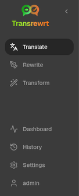
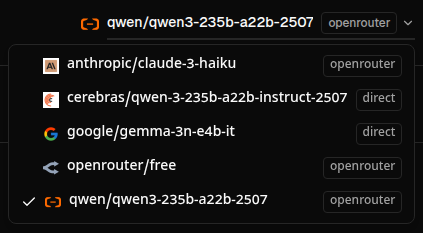
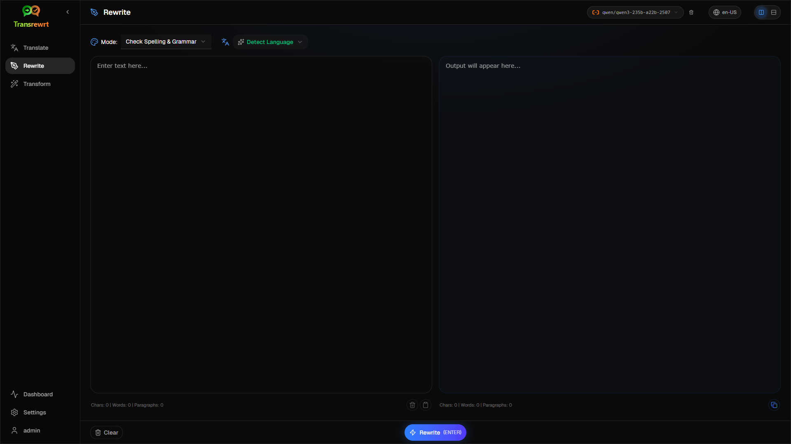
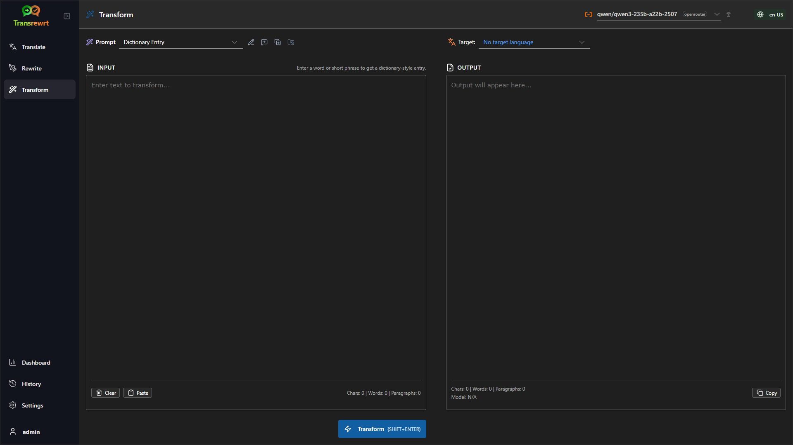
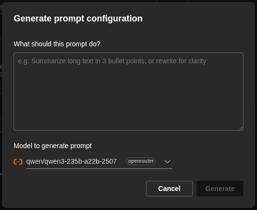
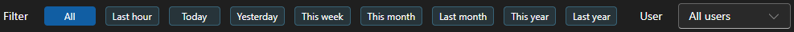

# User Guide

 

## Introduction

Transrewrt helps you work with text in three main ways:

- **Translate** - convert text from one language to another.
- **Rewrite** - rephrase text in a different style, such as clearer, shorter, or more formal.
- **Transform** - process text using custom AI instructions called prompts.

 

This guide explains how to use the app once it is installed and running. For installation steps, see the main **[README](README.en-US.md)**.

 

> ℹ️ **NOTE** 
> Transrewrt is available as a desktop app for Windows and Linux, and as a self-hosted web app. This guide focuses on everyday use of the app. Where something only applies to one version, it is clearly marked.

<small>**Read in other languages:** </small>
<small id="lang-list"> [English (UK)](../USER-GUIDE.md) · [Português (BR)](USER-GUIDE.pt-BR.md) · [العربية](USER-GUIDE.ar.md) · [বাংলা](USER-GUIDE.bn.md) · [Català](USER-GUIDE.ca.md) · [简体中文](USER-GUIDE.zh-CN.md) · [繁體中文](USER-GUIDE.zh-TW.md) · [Hrvatski](USER-GUIDE.hr.md) · [Čeština](USER-GUIDE.cs.md) · [Nederlands](USER-GUIDE.nl.md) · [English (US)](USER-GUIDE.en-US.md) · [Filipino](USER-GUIDE.tl.md) · [Français](USER-GUIDE.fr.md) · [Deutsch](USER-GUIDE.de.md) · [Ελληνικά](USER-GUIDE.el.md) · [हिन्दी](USER-GUIDE.hi.md) · [Magyar](USER-GUIDE.hu.md) · [Italiano](USER-GUIDE.it.md) · [日本語](USER-GUIDE.ja.md) · [Basa Jawa](USER-GUIDE.jv.md) · [한국어](USER-GUIDE.ko.md) · [Bahasa Melayu](USER-GUIDE.ms.md) · [فارسی](USER-GUIDE.fa.md) · [Polski](USER-GUIDE.pl.md) · [Português (PT)](USER-GUIDE.pt.md) · [ਪੰਜਾਬੀ](USER-GUIDE.pa.md) · [Română](USER-GUIDE.ro.md) · [Русский](USER-GUIDE.ru.md) · [Slovenčina](USER-GUIDE.sk.md) · [Español](USER-GUIDE.es.md) · [Kiswahili](USER-GUIDE.sw.md) · [Svenska](USER-GUIDE.sv.md) · [తెలుగు](USER-GUIDE.te.md) · [ภาษาไทย](USER-GUIDE.th.md) · [Türkçe](USER-GUIDE.tr.md) · [Українська](USER-GUIDE.uk.md) · [Tiếng Việt](USER-GUIDE.vi.md)</small>

<small>

> **Note on UI and documentation translations:** All interface languages except the original English (UK) 
> were translated using AI models; the wording may be imprecise or contain errors.

</small>

 

<!-- START doctoc generated TOC please keep comment here to allow auto update -->
<!-- DON'T EDIT THIS SECTION, INSTEAD RE-RUN doctoc TO UPDATE -->
**Table of Contents**

- [Before you start](#before-you-start)
  - [How to get a free OpenRouter API key (desktop app)](#how-to-get-a-free-openrouter-api-key-desktop-app)
- [Getting started](#getting-started)
- [Main parts of the window](#main-parts-of-the-window)
  - [Sidebar](#sidebar)
  - [Toolbar](#toolbar)
  - [Input and output panels](#input-and-output-panels)
- [Translate](#translate)
  - [Translate text](#translate-text)
  - [Language selection](#language-selection)
  - [Helpful translation settings](#helpful-translation-settings)
- [Rewrite](#rewrite)
- [Transform](#transform)
  - [Run an existing prompt](#run-an-existing-prompt)
  - [If you have no prompts yet](#if-you-have-no-prompts-yet)
  - [Create a prompt quickly](#create-a-prompt-quickly)
  - [Edit a prompt](#edit-a-prompt)
  - [Test a prompt before using it](#test-a-prompt-before-using-it)
- [Dashboard](#dashboard)
  - [Filter the data](#filter-the-data)
  - [Dashboard tabs](#dashboard-tabs)
  - [Export data](#export-data)
  - [Delete stored records for a model](#delete-stored-records-for-a-model)
- [History](#history)
  - [Filter the data](#filter-the-data-1)
  - [Export history data](#export-history-data)
- [Settings](#settings)
  - [General settings](#general-settings)
  - [Models](#models)
  - [Languages](#languages)
  - [Cost tracking](#cost-tracking)
  - [Transform prompts](#transform-prompts)
  - [Users](#users)
  - [API config](#api-config)
  - [About](#about)
- [Common issues](#common-issues)
  - [The app will not translate, rewrite, or transform text](#the-app-will-not-translate-rewrite-or-transform-text)
  - [The model list is empty](#the-model-list-is-empty)
  - [The result is too slow or too expensive](#the-result-is-too-slow-or-too-expensive)
  - [The interface is in the wrong language](#the-interface-is-in-the-wrong-language)
  - [The text is too small or hard to read](#the-text-is-too-small-or-hard-to-read)
  - [Dashboard charts are empty](#dashboard-charts-are-empty)
  - [Cost shows "not available" or seems wrong](#cost-shows-not-available-or-seems-wrong)
  - [Total cost does not match my provider bill](#total-cost-does-not-match-my-provider-bill)
  - [The History page is missing from the sidebar](#the-history-page-is-missing-from-the-sidebar)
  - [Web app: redirected to the login page unexpectedly](#web-app-redirected-to-the-login-page-unexpectedly)
  - [Dashboard shows no data for other users (web)](#dashboard-shows-no-data-for-other-users-web)
  - [I changed a prompt and lost the edits](#i-changed-a-prompt-and-lost-the-edits)
- [Quick tips](#quick-tips)
- [Disclaimer](#disclaimer)
- [License](#license)

<!-- END doctoc generated TOC please keep comment here to allow auto update -->

  

## Before you start

To use Transrewrt, you need access to at least one AI provider. The supported providers are: [OpenRouter](https://openrouter.ai) (which aggregates many models), OpenAI, Anthropic, Google Gemini, DeepSeek, Groq, Mistral, xAI, Cerebras, and [Ollama](https://ollama.com) for local models.

You do not need to select a paid model to begin. As soon as you add your OpenRouter API key, the app automatically enables a built-in **free** OpenRouter option. This lets you start translating, rewriting, and transforming text right away. Alternatively, you can also obtain a free API key from Cerebras, Google, Groq, or Mistral AI.

In plain language:

- A **model** is the AI engine that does the work. Models are listed with a **provider prefix** (for example `openrouter/…`, `openai/…`, `ollama/…`).
- An **API key** (or, for Ollama, a **base URL**) is how the app reaches that provider.

If you are using the **desktop app**, add keys in [**Settings** > **API Config**](#api-config) for each provider you use. For OpenRouter-only use, see [How to get an API key](#how-to-get-an-api-key-desktop-app) below. If you do not want to use an API key, you can install Ollama (from [ollama.com](https://ollama.com)) and use local models instead, such as `translategemma:4b`.

If you are using the **web version**, the server owner configures providers with environment variables, so you cannot enter API keys directly in the application.

 

### How to get a free OpenRouter API key (desktop app)

If you are using the desktop app, follow these steps:

1. Go to [OpenRouter](https://openrouter.ai) in your web browser.
2. Create an account or sign in.
3. Open the [Keys](https://openrouter.ai/keys) page.
4. Click the button to create a new API key.
5. Give the key a name so you can recognize it later.
6. Copy the new API key.
7. Return to Transrewrt and open **Settings** > **API Config**.
8. Paste the key into **OpenRouter API key** (under **Settings** > **API Config**).
9. Click **Test OpenRouter key** to make sure it works.

  

## Getting started

If this is your first time using Transrewrt, follow this order:

1. Open the app.
2. Choose your **Interface language** from the globe icon if needed.
3. If you are on the **desktop app**, open [**Settings** > **API Config**](#api-config), add an API key for at least one provider (for example OpenRouter), and click **Test** to verify it works.
4. Open [**Settings** > **Models**](#models) and add one or more models to **Selected Models**.
5. Open [**Settings** > **Languages**](#languages) and choose your **Top languages** if you want your most-used languages to appear first.
6. Go to **Translate** and run a simple translation to confirm everything is working.
7. Once that works, try **Rewrite** and then **Transform**.

This order matters. It prevents the most common first-use problem: trying to run a task before the app has a working API connection or a selected model.

  

## Main parts of the window

The app is divided into three main areas:

- The **sidebar** on the left.
- The **toolbar** at the top.
- The **work area** in the center.

 

### Sidebar

Use the sidebar to move around the app. You can collapse the sidebar for more space by clicking the icon next to the app logo.

 

<table>
  <tr>
    <td valign="top">
       
    </td>
    <td valign="top">
        
      <ul>
        <li><strong>Translate</strong> opens the translation workspace.</li> 
        <li><strong>Rewrite</strong> opens the rewriting workspace.</li> 
        <li><strong>Transform</strong> opens the custom prompt workspace.</li> 
        <li><strong>Dashboard</strong> shows usage and cost information.</li> 
        <li><strong>Settings</strong> opens the settings panel.</li> 
        <li><strong>History</strong> shows the usage history with the input and output text</li> 
        <li><strong>User</strong> shows the username of the logged-in user (web only).</li>
      </ul>
    </td>
  </tr>
</table>

 

### Toolbar

The toolbar changes slightly depending on where you are in the app.

- On the left, it displays the current page name.
- On the right, it shows the **model selector** and the **Interface language** control.

The **model selector** allows you to choose which AI engine to use for the current task.

  

Some free models may not always be available—sometimes they are offline or have a usage limit. If this occurs, the app will automatically remove that model from your available list. To manage which models appear, go to [**Settings** > **Models**](#models) and edit your model list.  
You can also open the model settings directly by clicking the provider icon to the left of the model name in the toolbar.

 

The **globe icon + language code** changes the app interface language, such as menus and buttons. It does **not** change the translation languages used in **Translate**.

  

 

### Input and output panels

Most workspaces use a left-hand **Input** panel and a right-hand **Output** panel.

Each panel also displays:

| **Input**                                                          | **Output**                                                                                                                  |
|--------------------------------------------------------------------|-----------------------------------------------------------------------------------------------------------------------------|
| - Character count  - Word count  - Paragraph count     | - How long the task took - **TPS** (tokens per second) - Character, word, and paragraph counts - The model used |

If you're unsure about the technical terms:

- **Token** means a small chunk of text. You can think of it as part of a word or a short word.
- **TPS** means how many of those text chunks the model processed each second.

 

You can also monitor the cost of each operation (if available) and the total cost by enabling the option `Show cost information on the actions` in [**Settings** > **General settings**](#general-settings). 
 
  

[--------------------------------------------------------------------------------------------------------------------------]: # 

## Translate

Use **Translate** when you want to convert text from one language to another.

 

### Translate text

1. Open **Translate**.
2. Select a language in **From**.
3. Select a language in **To**.
4. Choose a model in the toolbar.
5. Type or paste text into **Input**.
6. Click **Translate**.
7. Read the result in **Output**.
8. Use the copy button if you want to copy the result.

 

### Language selection

- **From** can be a specific language or **Detect Language**.
- **To** is the language you want the result in.

Your selected **Top languages** appear at the top of the list. You can set these in [**Settings** > **Languages**](#languages).

 

### Helpful translation settings

In [**Settings** > **General Settings**](#general-settings), you can change how translation behaves:

- **Auto-translate on paste** runs a translation as soon as you paste text.
- **Auto-copy result to clipboard** copies the result automatically after a successful run.
- **Real-time translation (while typing)** runs translations while you type.
- **Timeout (ms)** controls how long the app waits before running a real-time translation.
- **Enter** controls what happens when you press `Enter`:

  

[--------------------------------------------------------------------------------------------------------------------------]: # 

## Rewrite

Use **Rewrite** when you want to improve wording without changing the main meaning.

This is useful for:

- fixing spelling and grammar
- making text clearer
- making text more formal or more informal
- shortening or expanding text
- making text sound more technical

 

> 💡 **TIP** 
> When you use the "**Check Spelling & Grammar**" mode, a `Show changes` button appears in the output panel.
> Click this button to toggle the display of corrections, showing or hiding the specific changes made to your text.

  

[--------------------------------------------------------------------------------------------------------------------------]: # 

## Transform

Use **Transform** when you want the AI to follow a custom set of instructions.

This is the most flexible area of the app. You can use it for tasks such as:

- summarizing notes
- turning rough text into a polished email
- extracting key points
- converting text into a specific format
- any other custom activity with the input text

 

### Run an existing prompt

1. Open **Transform**.
2. Choose a prompt from the prompt list.
3. If a **Target** language box appears, choose a language if desired.
4. Type or paste text into **Input**.
5. Click **Transform**.
6. Read the result in **Output**.

 

### If you have no prompts yet

If your prompt list is empty, click **Load sample prompts**. This adds built-in examples so you can get started quickly.

 

> ℹ️ **NOTE** 
> Sample prompts are provided in English. After loading them, you can edit a prompt and use **Translate prompt** to translate it into your language.

 

### Create a prompt quickly

The fastest way to create a prompt is:

1. Click **New prompt**.
2. Click **Generate prompt**.
3. Describe what you want the prompt to do.
4. Choose a model.
5. Let the app create a draft for you.
6. Review the draft and click **Save**.

 

### Edit a prompt

When you create or edit a prompt, the editor appears on the left and a test area appears on the right.

The main fields are:

- **Prompt name**: the name shown in the prompt list.
- **Prompt instructions (optional)**: a short hint displayed to the user when running the prompt.
- **Model Role**: the overall role assigned to the AI, such as 'You are a helpful assistant.'
- **Model Instructions (one per line)**: the specific rules you want the AI to follow.
- **Output description**: a short word describing the result, such as 'summary' or 'rewrite'.
- **Temperature (0.0 → 1.0)**: how the model will behave; see below.
- **Ask for target language**: adds a target language selector when the prompt is run.

If the technical term **Temperature** is new to you, think of it like this:

- A **lower** temperature gives steadier, more predictable results.
- A **higher** temperature gives more variety and creativity.

You can also use:

- **`Generate prompt`** to create a new draft from a simple description
- **`Improve prompt`** to refine an existing prompt
- **`Translate prompt`** to translate the prompt fields

 

> ⚠️ **WARNING** 
> Click **`Save`** before clicking **`Back to Run`**. If you go back without saving, your changes will be lost.

 

### Test a prompt before using it

The test panel on the right lets you try your prompt with sample text before using it in day-to-day work.

This is useful when:

- you're creating a new prompt
- you're comparing two versions of a prompt
- you want to check tone, length, or output format

 

> ℹ️ **NOTE** 
> You can export and import saved prompts in [**Settings** > **Transform Prompts**](#transform-prompts).

  

[--------------------------------------------------------------------------------------------------------------------------]: # 

## Dashboard

Use **Dashboard** to see how much you're using the app and what it's costing (for paid models).

 

> ℹ️ **NOTE** 
> If you only use free models, the cost-related charts will be blank. 

 

### Filter the data

Use the filter buttons at the top to change the time range.

 

> ℹ️ **NOTE** 
> The **User** filter is only visible to administrators in the web version. Regular users will not see this filter, and it is not available in the desktop app.

 

### Dashboard tabs

- **Summary** provides an overview of usage and cost.
- **By Usage** breaks down activity by translation language, rewrite mode, and transform prompt.
- **By Model** shows which models you've used and their associated costs.
- **By Day** displays daily totals.
- **All Calls** shows the complete call history and allows you to export it.

 

### Export data

Dashboard tables can export data in the following formats:

- **JSON**
- **CSV**
- **XLSX**

This is helpful if you want to analyze activity outside the app or share a report.

 

### Delete stored records for a model

In **By Model** or **All Calls**, you can delete stored records for a specific model by clicking the "trash bin" icon.

> ⚠️ **WARNING** 
> Deleting stored records is irreversible. Only proceed if you're certain you no longer need that history.

To delete all data or remove records based on age, go to [**Settings** > **Cost Tracking**](#cost-tracking). There, you can choose to delete all stored data or only data older than a specified date.

  

[--------------------------------------------------------------------------------------------------------------------------]: # 

## History

Click **History** to view a record of your actions within **Transrewrt**, including the input and output of each operation.

 

### Filter the data

**History** uses the same filters as the **Dashboard** page. Use them to select a specific time range.

 

> ℹ️ **NOTE** 
> The **User** filter is only visible to administrators in the web version. Regular users won't see this filter, and it's not available in the desktop app.

 

### Export history data

The History page allows you to export filtered data in:

- **JSON**
- **CSV**
- **XLSX**

This is useful for reviewing activity outside the app or sharing reports.

  

[--------------------------------------------------------------------------------------------------------------------------]: # 

## Settings

Open **Settings** from the sidebar to customize the app's behavior.

Available tabs depend on the platform and your user role:

  | Tab               | Desktop | Web (admin) | Web (regular user) |
  |-------------------|:-------:|:-----------:|:------------------:|
  | General Settings  |   yes   |     yes     |        yes         |
  | Models            |   yes   |     yes     |        yes         |
  | Languages         |   yes   |     yes     |        yes         |
  | Cost Tracking     |   yes   |     yes     |         —          |
  | Transform Prompts |   yes   |     yes     |        yes         |
  | Users             |    | —     |     yes     |         —          |
 1. **API Config**    |   yes   |     yes     |         —          |
  | About             |   yes   |     yes     |        yes         |

 

> ℹ️ **NOTE** 
> In the web version, each user has their own configuration. Settings such as selected models, languages, general options, and transform prompts are saved per user. Your changes won't affect other users.

 

[--------------------------------------------------------------------------------------------------------------------------]: # 

### General settings

Use **General Settings** to control typing behavior, whether execution details are saved to **History**, and the app's appearance.

**Behavior**

- **Behaviour for ENTER** determines whether `Enter` runs the task or inserts a new line.
- **Auto-translate on paste** automatically starts translation when you paste text.
- **Auto-copy result to clipboard** automatically copies successful results to the clipboard.
- **Real-time translation (while typing)** enables translation as you type.
- **Timeout (ms)** sets the delay for real-time translation.

**History**

- **Keep execution history** controls whether each translate, rewrite, and transform operation saves **input and output text** for the sidebar [**History**](#history) view. Disabling this prompts for confirmation; confirming removes stored history text from the database.
- **Delete history data** allows you to delete stored text based on age (e.g., older than a few months) or **all data (clear)** using **Delete data**. This only affects saved execution text in the **History** view and does **not** remove cost or usage totals. To manage **cost** data, use [**Settings** > **Cost Tracking**](#cost-tracking).

**Appearance**

- **Show cost information on the actions** toggles display of cost per operation (if available) and total cost on the Translate, Rewrite, and Transform output panels.
- **Cost fraction digits** adjusts how many decimal places are shown for costs.
- **Web only:** **show a margin around the app** adds extra spacing around the interface.
- **Font Family** changes the font used in text panels.
- **Size** adjusts the font size.

 

### Models

Use **Settings** > **Models** to choose which models appear in the toolbar.

The page has two lists:

- **Available Models** on the left
- **Selected Models** on the right

Useful controls include:

- **Search models...** to find a model by name
- **Provider** chips to narrow the list to one engine (OpenRouter, OpenAI, Ollama, …)
- **Free Only** to show only free models
- **Refresh** to reload the list
- **Expand All** and **Collapse All** when you are sorting by provider

Model IDs include the provider prefix (for example `openrouter/…` vs `openai/…`). Badges such as **OpenAI (OpenRouter)** vs **OpenAI (direct)** show how traffic is routed.

> ℹ️ **NOTE** 
> **OpenRouter Body Builder** (`openrouter/bodybuilder`) is a router model, not a general chat model: its reply is JSON that describes OpenRouter API request bodies (for example a `requests` array with `model` and `messages`). If you use it for **Translate**, **Rewrite**, or **Transform**, the output panel will show that JSON instead of finished text. Choose a normal text model for those tasks. See the [Body Builder model page](https://openrouter.ai/openrouter/bodybuilder) on OpenRouter.

Actions:

 - To add a model, click **Add** or anywhere in the entry.

 - To remove a model, click **X** next to it in **Selected Models** or **Selected** on the entry in Available Models.

 - To clear the list, click **Deselect all**. The required free model will remain in the list.

 

> ℹ️ **NOTE** 
> If you do not want to add credits to OpenRouter right away, start by enabling **Free Only** and choosing the free models (no credit card required). You can also use Ollama to run models locally without any API key.

 

### Languages

Use **Settings** > **Languages** to organize the language lists used in the app.

- **Top languages** are pinned near the top of the language lists in **Translate** and **Transform**.
- **Custom language** lets you add a language that is not in the built-in list.

If you add a custom language, it appears in the language selectors alongside the built-in options.

 

### Cost tracking

Use **Settings** > **Cost Tracking** to manage cost information.

- **Total Cost** shows the running total.
- **Copy Value** copies the total to the clipboard.
- **Reset Cost** resets the stored total to zero.
- **Sync with API key usage** sets the total to match the usage reported by your OpenRouter account (OpenRouter only).
- **API Key Usage** shows OpenRouter usage details, if available.
- **Delete cost data** removes all data, or only entries older than a selected date.

**Cost tracking:** When you use OpenRouter models, the app shows your actual usage and spending based on cost information from OpenRouter. For all other providers, the app estimates costs using prices published by OpenRouter; if a price is unavailable, the estimate may be zero.

 

> ℹ️ **NOTE** 
> **All cost figures are estimates for your reference only, not official billing statements.**

 

> ⚠️ **WARNING** 
> Data deletion cannot be undone. Before deleting, make sure to back up your data or export it via [**History**](#history) 
> or [**Dashboard** > **All Calls**](#dashboard-tabs), otherwise it will be lost permanently. 
> All input/output history related to each API call entry will also be deleted.

 

### Transform prompts

Use **Settings** > **Transform Prompts** to manage prompts in bulk.

You can:

- Review your saved prompts
- Delete prompts
- Import prompts from a file
- Export prompts for backup or sharing

 

### Users

Use **Users** to manage user accounts in the web version. You can add users, update their details, reset passwords, and delete accounts.

 

### API config

The supported providers are: OpenRouter, OpenAI, Anthropic, Google Gemini, DeepSeek, Groq, Mistral, xAI, Cerebras, and **Ollama** (local models via a base URL). You only need to configure the providers you use.

**Web application: administrator only**

API keys are configured through system or Docker environment variables — they are not entered in the web UI. This page shows which providers have a key configured and lets you test each one by clicking the **`Test`** button.

 

> ℹ️ **NOTE** 
> To change an API key, update the environment variable in your system or Docker configuration and restart the server or container.

 

**Desktop application**

Use **API Config** to store API keys for each provider you use. For Ollama, enter the **base URL** instead of an API key.

 

> 💡 **Tip**  
> If you do not want to use an API key or pay for usage, you can [download Ollama](https://ollama.com) and run models (such as `translategemma:4b`) locally on your machine for free. Alternatively, you can create a free OpenRouter account (no credit card required) to use their free models, or obtain a free API key from Cerebras, Google, Groq, or Mistral AI.

 

- Add only the providers you need. In **Settings** > **Models**, each model ID starts with the provider (for example `openrouter/openrouter/free`, `openai/gpt-4o`, `ollama/llama3`).

To add an API key, enter the value in the text field and click **`Save`**. To replace an existing key, click **`Edit`**. To verify that a key is working, click **`Test`**. For the Ollama base URL, always click **`Test`** to check the connection.

 

> ℹ️ **NOTE** 
> You cannot see the current value of an API key. You can only replace it using the **`Edit`** button.
> API keys are stored encrypted in the configuration.

 

### About

The **About** tab displays:

- the app name
- the version number
- the build date
- a link to the project repository

  

## Common issues

If something isn't working as expected, review the following points first.

 

### The app will not translate, rewrite, or transform text

Verify the following:

- you have selected a model in the toolbar
- at least one model is listed in [**Settings** > **Models**](#models)
- your API setup is working

If you're using the desktop app:

1. Open [**Settings** > **API Config**](#api-config).
2. Make sure at least one API key is saved.
3. Click **Test** next to the provider to confirm the key is functional.

 

### The model list is empty

Go to [**Settings** > **Models**](#models) and click **Refresh**.

If needed:

- search for a model
- enable **Free Only**
- add one or more models to **Selected Models**

 

### The result is too slow or too expensive

Try one or more of the following:

- choose a different model
- use a shorter input
- turn off **Real-time translation (while typing)** in [**Settings** > **General Settings**](#general-settings)
- use free models for simple tasks (see [Models](#models))

 

### The interface is in the wrong language

Click the globe icon in the [toolbar](#toolbar) and select your preferred **Interface language**.

 

### The text is too small or hard to read

Open [**Settings** > **General Settings**](#general-settings) and adjust:

- **Font Family**
- **Size**

 

### Dashboard charts are empty

This is normal if:

- you are only using **free models** (cost charts will be blank)
- the selected **time filter** doesn't include the period when calls were made — try **All** to check

If charts remain empty after selecting **All**, verify that calls appear in [**History**](#history) or in the **All Calls** tab.

 

### Cost shows "not available" or seems incorrect

When using models through **OpenRouter**, the app displays your actual spending as reported by OpenRouter.

For **other providers** (OpenAI direct, Anthropic direct, etc.), cost is estimated using pricing data published by OpenRouter. If no matching price is found for a model, the cost will be shown as **not available** and won't be included in your running total.

 

### Total cost does not match my provider bill

All cost figures in the app are **estimates for reference only**, not official billing statements.

To align the total more closely with your actual OpenRouter spending, open [**Settings** > **Cost Tracking**](#cost-tracking) and click **Sync with API key usage**.

 

### The History page is missing from the sidebar

The **Keep execution history** option might be disabled. Go to [**Settings** > **General Settings**](#general-settings) and turn it on. Note that enabling it won't restore any previously deleted history.

 

### Web app: redirected to the login page unexpectedly

Your session may have expired. Please log in again. If this occurs frequently, check the server configuration for session timeout settings.

 

### Dashboard shows no data for other users (web)

Only **administrators** can view data from all users via the **User** filter. Regular users can only see their own activity, by design.

 

### I changed a prompt and lost the edits

When editing a prompt, always click **Save** before clicking **Back to Run**.

  

## Quick tips

- Begin with [**Translate**](#translate) to confirm your setup is working before moving on to [**Rewrite**](#rewrite) or [**Transform**](#transform).
- Use [**Rewrite**](#rewrite) for everyday wording improvements.
- Use [**Transform**](#transform) when you need a repeatable workflow for a specific task.
- Use [**Dashboard**](#dashboard) to monitor usage and cost.
- Use [**History**](#history) to review past operations and their full input/output content.
- Regularly export prompts if you're building a prompt library you want to keep safe (see [Transform Prompts](#transform-prompts)) or if you plan to share it with others.

  

## Disclaimer

Product names and icons belong to their respective owners and are used for identification purposes only. This software is not affiliated with or endorsed by any of the mentioned brands.

  

## License

Copyright © 2026 Waldemar Scudeller Jr.

[Apache License 2.0](LICENSE)