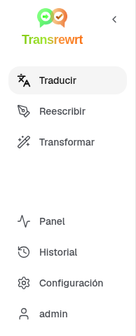
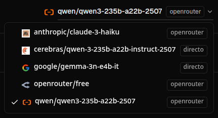
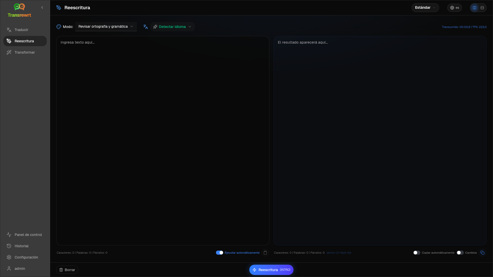
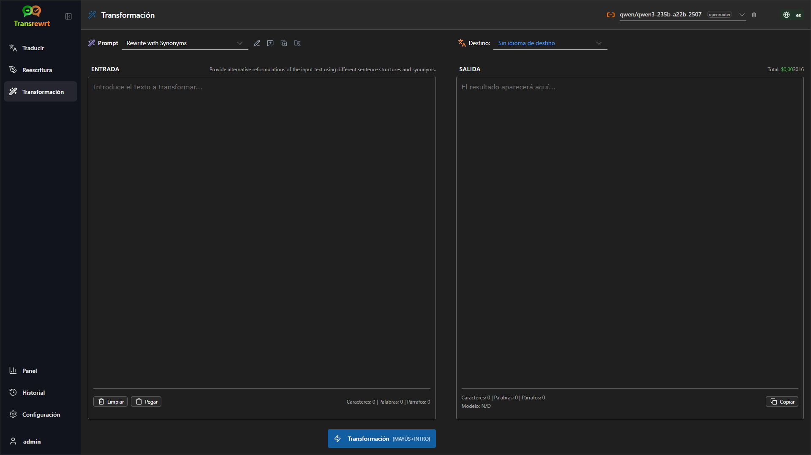
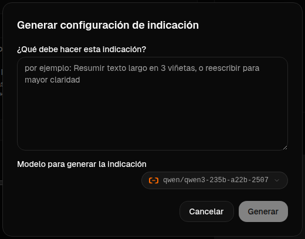
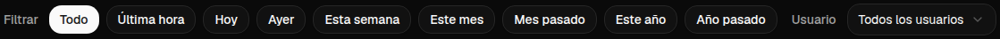

# Guía del usuario

 

## Introducción

Transrewrt te ayuda a trabajar con texto de tres maneras principales:

- **Traducir** - convertir texto de un idioma a otro.
- **Reescribir** - reformular texto con un estilo diferente, por ejemplo más claro, más corto o más formal.
- **Transformar** - procesar texto utilizando instrucciones personalizadas de IA llamadas "prompts".

 

Esta guía explica cómo usar la aplicación una vez que esté instalada y en funcionamiento. Para ver los pasos de instalación, consulta el archivo **[README](README.es.md)** principal.

 

> ℹ️ **NOTA** 
> Transrewrt está disponible como aplicación de escritorio para Windows y Linux, y como aplicación web autohospedada. Esta guía se centra en el uso diario de la aplicación. Cuando algo solo se aplica a una versión, se indica claramente.

<small>**Leer en otros idiomas:**</small>
<small id="lang-list"> [English (UK)](../USER-GUIDE.md) · [Português (BR)](USER-GUIDE.pt-BR.md) · [العربية](USER-GUIDE.ar.md) · [বাংলা](USER-GUIDE.bn.md) · [Català](USER-GUIDE.ca.md) · [简体中文](USER-GUIDE.zh-CN.md) · [繁體中文](USER-GUIDE.zh-TW.md) · [Hrvatski](USER-GUIDE.hr.md) · [Čeština](USER-GUIDE.cs.md) · [Nederlands](USER-GUIDE.nl.md) · [English (US)](USER-GUIDE.en-US.md) · [Filipino](USER-GUIDE.tl.md) · [Français](USER-GUIDE.fr.md) · [Deutsch](USER-GUIDE.de.md) · [Ελληνικά](USER-GUIDE.el.md) · [हिन्दी](USER-GUIDE.hi.md) · [Magyar](USER-GUIDE.hu.md) · [Italiano](USER-GUIDE.it.md) · [日本語](USER-GUIDE.ja.md) · [Basa Jawa](USER-GUIDE.jv.md) · [한국어](USER-GUIDE.ko.md) · [Bahasa Melayu](USER-GUIDE.ms.md) · [فارسی](USER-GUIDE.fa.md) · [Polski](USER-GUIDE.pl.md) · [Português (PT)](USER-GUIDE.pt.md) · [ਪੰਜਾਬੀ](USER-GUIDE.pa.md) · [Română](USER-GUIDE.ro.md) · [Русский](USER-GUIDE.ru.md) · [Slovenčina](USER-GUIDE.sk.md) · [Español](USER-GUIDE.es.md) · [Kiswahili](USER-GUIDE.sw.md) · [Svenska](USER-GUIDE.sv.md) · [తెలుగు](USER-GUIDE.te.md) · [ภาษาไทย](USER-GUIDE.th.md) · [Türkçe](USER-GUIDE.tr.md) · [Українська](USER-GUIDE.uk.md) · [Tiếng Việt](USER-GUIDE.vi.md)</small>

<small>

> **Nota sobre las traducciones de la interfaz y la documentación:** Todos los idiomas de la interfaz, excepto el inglés (UK) original, fueron traducidos mediante modelos de IA; por ello, las expresiones podrían ser imprecisas o contener errores.

</small>

 

<!-- START doctoc generated TOC please keep comment here to allow auto update -->
<!-- DON'T EDIT THIS SECTION, INSTEAD RE-RUN doctoc TO UPDATE -->
**Tabla de contenido**

- [Antes de empezar](#before-you-start)
  - [Cómo obtener una clave API gratuita de OpenRouter (aplicación de escritorio)](#how-to-get-a-free-openrouter-api-key-desktop-app)
- [Introducción](#getting-started)
- [Partes principales de la ventana](#main-parts-of-the-window)
  - [Barra lateral](#sidebar)
  - [Barra de herramientas](#toolbar)
  - [Paneles de entrada y salida](#input-and-output-panels)
- [Traducir](#translate)
  - [Traducir texto](#translate-text)
  - [Selección de idioma](#language-selection)
  - [Ajustes útiles para la traducción](#helpful-translation-settings)
- [Reescribir](#rewrite)
- [Transformar](#transform)
  - [Ejecutar un prompt existente](#run-an-existing-prompt)
  - [Si aún no tienes prompts](#if-you-have-no-prompts-yet)
  - [Crear un prompt rápidamente](#create-a-prompt-quickly)
  - [Editar un prompt](#edit-a-prompt)
  - [Probar un prompt antes de usarlo](#test-a-prompt-before-using-it)
- [Panel de control](#dashboard)
  - [Filtrar los datos](#filter-the-data)
  - [Pestañas del panel de control](#dashboard-tabs)
  - [Exportar datos](#export-data)
  - [Eliminar registros almacenados de un modelo](#delete-stored-records-for-a-model)
- [Historial](#history)
  - [Filtrar los datos](#filter-the-data-1)
  - [Exportar datos del historial](#export-history-data)
- [Ajustes](#settings)
  - [Ajustes generales](#general-settings)
  - [Modelos](#models)
  - [Idiomas](#languages)
  - [Seguimiento de costes](#cost-tracking)
  - [Prompts de transformación](#transform-prompts)
  - [Usuarios](#users)
  - [Configuración de API](#api-config)
  - [Acerca de](#about)
- [Problemas comunes](#common-issues)
  - [La aplicación no traduce, reescribe ni transforma el texto](#the-app-will-not-translate-rewrite-or-transform-text)
  - [La lista de modelos está vacía](#the-model-list-is-empty)
  - [El resultado es demasiado lento o demasiado costoso](#the-result-is-too-slow-or-too-expensive)
  - [La interfaz está en el idioma incorrecto](#the-interface-is-in-the-wrong-language)
  - [El texto es demasiado pequeño o difícil de leer](#the-text-is-too-small-or-hard-to-read)
  - [Los gráficos del panel están vacíos](#dashboard-charts-are-empty)
  - [El coste muestra "no disponible" o parece incorrecto](#cost-shows-not-available-or-seems-wrong)
  - [El costo total no coincide con la factura de mi proveedor](#total-cost-does-not-match-my-provider-bill)
  - [No aparece la página de historial en la barra lateral](#the-history-page-is-missing-from-the-sidebar)
  - [Aplicación web: redirigido inesperadamente a la página de inicio de sesión](#web-app-redirected-to-the-login-page-unexpectedly)
  - [El panel no muestra datos de otros usuarios (web)](#dashboard-shows-no-data-for-other-users-web)
  - [Cambié un prompt y perdí los cambios](#i-changed-a-prompt-and-lost-the-edits)
- [Consejos rápidos](#quick-tips)
- [Descargo de responsabilidad](#disclaimer)
- [Licencia](#license)

<!-- END doctoc generated TOC please keep comment here to allow auto update -->

  

## Antes de comenzar

Para usar Transrewrt, necesitas acceso a al menos un proveedor de IA. Los proveedores compatibles son: [OpenRouter](https://openrouter.ai) (que agrega muchos modelos), OpenAI, Anthropic, Google Gemini, DeepSeek, Groq, Mistral, xAI, Cerebras y [Ollama](https://ollama.com) para modelos locales.

No necesitas seleccionar un modelo de pago para empezar. En cuanto añadas tu clave de API de OpenRouter, la aplicación habilita automáticamente una opción **gratuita** integrada de OpenRouter. Esto te permite comenzar a traducir, reescribir y transformar texto de inmediato. Alternativamente, también puedes obtener una clave de API gratuita de Cerebras, Google, Groq o Mistral AI.

En un lenguaje sencillo:

- Un **modelo** es el motor de IA que realiza el trabajo. Los modelos se muestran con un **prefijo del proveedor** (por ejemplo, `openrouter/…`, `openai/…`, `ollama/…`).
- Una **clave de API** (o, en el caso de Ollama, una **URL base**) es cómo la aplicación se conecta con ese proveedor.

Si estás utilizando la **aplicación de escritorio**, añade las claves en [**Configuración** > **Configuración de API**](#api-config) para cada proveedor que utilices. Si solo vas a usar OpenRouter, consulta más abajo [Cómo obtener una clave de API](#how-to-get-an-api-key-desktop-app). Si no deseas usar una clave de API, puedes instalar Ollama (desde [ollama.com](https://ollama.com)) y usar modelos locales, como `translategemma:4b`.

Si estás utilizando la **versión web**, el administrador del servidor configura los proveedores mediante variables de entorno, por lo que no puedes introducir claves de API directamente en la aplicación.

 

### Cómo obtener una clave de API gratuita de OpenRouter (aplicación de escritorio)

Si estás utilizando la aplicación de escritorio, sigue estos pasos:

1. Ve a [OpenRouter](https://openrouter.ai) desde tu navegador web.
2. Crea una cuenta o inicia sesión.
3. Abre la página [Claves](https://openrouter.ai/keys).
4. Haz clic en el botón para crear una nueva clave de API.
5. Asigna un nombre a la clave para poder reconocerla más adelante.
6. Copia la nueva clave de API.
7. Vuelve a Transrewrt y abre **Configuración** > **Configuración de API**.
8. Pega la clave en **Clave de API de OpenRouter** (dentro de **Configuración** > **Configuración de API**).
9. Haz clic en **Probar clave de OpenRouter** para asegurarte de que funcione.

  

## Primeros pasos

Si es la primera vez que usas Transrewrt, sigue este orden:

1. Abre la aplicación.
2. Selecciona tu **idioma de interfaz** desde el ícono del globo si es necesario.
3. Si estás usando la **aplicación de escritorio**, abre [**Configuración** > **Configuración de API**](#api-config), añade una clave de API para al menos un proveedor (por ejemplo, OpenRouter) y haz clic en **Probar** para verificar que funcione.
4. Abre [**Configuración** > **Modelos**](#models) y añade uno o más modelos a **Modelos seleccionados**.
5. Abre [**Configuración** > **Idiomas**](#languages) y selecciona tus **Idiomas principales** si deseas que tus idiomas más usados aparezcan primero.
6. Ve a **Traducir** y realiza una traducción sencilla para confirmar que todo funciona.
7. Una vez que esto funcione, prueba **Reescribir** y luego **Transformar**.

Este orden es importante. Así se evita el problema más común al usarlo por primera vez: intentar ejecutar una tarea antes de que la aplicación tenga una conexión API funcionando o un modelo seleccionado.

  

## Partes principales de la ventana

La aplicación se divide en tres áreas principales:

- La **barra lateral** a la izquierda.
- La **barra de herramientas** en la parte superior.
- El **área de trabajo** en el centro.

 

### Barra lateral

Utiliza la barra lateral para desplazarte por la aplicación. Puedes ocultar la barra lateral para ganar espacio haciendo clic en el ícono junto al logotipo de la aplicación.

 

<table>
  <tr>
    <td valign="top">
       
    </td>
    <td valign="top">
        
      <ul>
        <li><strong>Traducir</strong> abre el espacio de trabajo para traducción.</li> 
        <li><strong>Reescribir</strong> abre el espacio de trabajo para reescritura.</li> 
        <li><strong>Transformar</strong> abre el espacio de trabajo con indicaciones personalizadas.</li> 
        <li><strong>Panel</strong> muestra información sobre uso y costos.</li> 
        <li><strong>Configuración</strong> abre el panel de configuración.</li> 
        <li><strong>Historial</strong> muestra el historial de uso con el texto de entrada y salida.</li> 
        <li><strong>Usuario</strong> muestra el nombre del usuario conectado (solo en la versión web).</li>
      </ul>
    </td>
  </tr>
</table>

 

### Barra de herramientas

La barra de herramientas cambia ligeramente según la sección en la que estés dentro de la aplicación.

- A la izquierda, se muestra el nombre de la página actual.
- A la derecha, aparece el **selector de modelo** y el control del **idioma de la interfaz**.

El **selector de modelo** te permite elegir qué motor de inteligencia artificial utilizar para la tarea actual.

  

Algunos modelos gratuitos pueden no estar siempre disponibles: a veces están fuera de línea o tienen un límite de uso. Si esto ocurre, la aplicación eliminará automáticamente ese modelo de tu lista disponible. Para controlar qué modelos aparecen, ve a [**Configuración** > **Modelos**](#models) y edita tu lista de modelos.  
También puedes abrir directamente la configuración del modelo haciendo clic en el icono del proveedor situado a la izquierda del nombre del modelo en la barra de herramientas.

 

El **icono del globo terráqueo + el código de idioma** cambia el idioma de la interfaz de la aplicación, como menús y botones. Esto **no** cambia los idiomas de traducción utilizados en **Traducir**.

  

 

### Paneles de entrada y salida

La mayoría de los espacios de trabajo utilizan un panel de **Entrada** a la izquierda y un panel de **Salida** a la derecha.

Cada panel también muestra:

| **Entrada**                                                          | **Salida**                                                                                                                  |
|--------------------------------------------------------------------|-----------------------------------------------------------------------------------------------------------------------------|
| - Contador de caracteres  - Contador de palabras  - Contador de párrafos     | - Cuánto tiempo tardó la tarea - **TPS** (tokens por segundo) - Contadores de caracteres, palabras y párrafos - El modelo utilizado |

Si tienes dudas sobre los términos técnicos:

- **Token** significa un fragmento pequeño de texto. Puedes pensarlo como parte de una palabra o una palabra corta.
- **TPS** indica cuántos de esos fragmentos de texto procesa el modelo por segundo.

 

También puedes supervisar el costo de cada operación (si está disponible) y el costo total, activando la opción `Mostrar información de costos en las acciones` en [**Configuración** > **Configuración general**](#general-settings). 
 
  

[--------------------------------------------------------------------------------------------------------------------------]: # 

## Traducir

Utiliza **Traducir** cuando desees convertir un texto de un idioma a otro.

 

### Traducir texto

1. Abre **Traducir**.
2. Elige un idioma en **De**.
3. Elige un idioma en **A**.
4. Elige un modelo en la barra de herramientas.
5. Escribe o pega un texto en **Entrada**.
6. Haz clic en **Traducir**.
7. Lee el resultado en **Salida**.
8. Usa el botón de copiar si deseas copiar el resultado.

 

### Selección de idioma

- **De** puede ser un idioma específico o **Detectar idioma**.
- **A** es el idioma en el que quieres obtener el resultado.

Tus **Idiomas principales** seleccionados aparecen al principio de la lista. Puedes configurarlos en [**Configuración** > **Idiomas**](#languages).

 

### Configuraciones útiles de traducción

En [**Configuración** > **Configuración general**](#general-settings), puedes cambiar el comportamiento de la traducción:

- **Traducir automáticamente al pegar** inicia una traducción en cuanto pegas texto.
- **Copiar automáticamente el resultado al portapapeles** copia el resultado de forma automática tras una ejecución exitosa.
- **Traducción en tiempo real (mientras escribes)** realiza traducciones mientras escribes.
- **Tiempo de espera (ms)** controla cuánto tiempo espera la aplicación antes de realizar una traducción en tiempo real.
- **Enter** controla lo que ocurre cuando presionas `Enter`:

  

[--------------------------------------------------------------------------------------------------------------------------]: # 

## Reescribir

Utiliza **Reescribir** cuando desees mejorar el estilo sin cambiar el significado principal.

Esto es útil para:

- corregir ortografía y gramática
- hacer el texto más claro
- hacer el texto más formal o más informal
- acortar o ampliar texto
- hacer que el texto suene más técnico

 

> 💡 **CONSEJO** 
> Cuando uses el modo "**Corregir ortografía y gramática**", aparecerá un botón `Mostrar cambios` en el panel de salida.
> Haz clic en este botón para alternar la visualización de las correcciones, mostrando u ocultando los cambios específicos realizados en tu texto.

  

[--------------------------------------------------------------------------------------------------------------------------]: # 

## Transformar

Utilice **Transformar** cuando desee que la IA siga un conjunto personalizado de instrucciones.

Esta es el área más flexible de la aplicación. Puede usarla para tareas como:

- resumir notas
- convertir texto sin pulir en un correo electrónico profesional
- extraer puntos clave
- convertir texto en un formato específico
- cualquier otra actividad personalizada con el texto de entrada

 

### Ejecutar una sugerencia existente

1. Abra **Transformar**.
2. Elija una sugerencia de la lista de sugerencias.
3. Si aparece un cuadro de **Idioma de destino**, seleccione un idioma si lo desea.
4. Escriba o pegue el texto en **Entrada**.
5. Haga clic en **Transformar**.
6. Lea el resultado en **Salida**.

 

### Si aún no tiene sugerencias

Si su lista de sugerencias está vacía, haga clic en **Cargar sugerencias de ejemplo**. Esto añade ejemplos integrados para que pueda comenzar rápidamente.

 

> ℹ️ **NOTA** 
> Las sugerencias de ejemplo se proporcionan en inglés. Después de cargarlas, puede editar una sugerencia y usar **Traducir sugerencia** para traducirla a su idioma.

 

### Crear una sugerencia rápidamente

La forma más rápida de crear una sugerencia es:

1. Haga clic en **Nueva sugerencia**.
2. Haga clic en **Generar sugerencia**.
3. Describa lo que quiere que haga la sugerencia.
4. Elija un modelo.
5. Permita que la aplicación cree un borrador para usted.
6. Revise el borrador y haga clic en **Guardar**.

 

### Editar una sugerencia

Cuando crea o edita una sugerencia, el editor aparece a la izquierda y un área de prueba aparece a la derecha.

Los campos principales son:

- **Nombre de la sugerencia**: el nombre mostrado en la lista de sugerencias.
- **Instrucciones de la sugerencia (opcional)**: una breve pista mostrada al usuario al ejecutar la sugerencia.
- **Rol del modelo**: el rol general asignado a la IA, como 'Eres un asistente útil'.
- **Instrucciones del modelo (una por línea)**: las reglas específicas que desea que siga la IA.
- **Descripción de la salida**: una palabra corta que describe el resultado, como 'resumen' o 'reescritura'.
- **Temperatura (0,0 → 1,0)**: cómo se comportará el modelo; véase más abajo.
- **Preguntar por el idioma de destino**: agrega un selector de idioma de destino cuando se ejecute la sugerencia.

Si el término técnico **Temperatura** es nuevo para usted, piense en ello de esta manera:

- Una temperatura **más baja** da resultados más estables y predecibles.
- Una temperatura **más alta** proporciona más variedad y creatividad.

También puede utilizar:

- **`Generar sugerencia`** para crear un nuevo borrador a partir de una descripción simple
- **`Mejorar sugerencia`** para perfeccionar una sugerencia existente
- **`Traducir sugerencia`** para traducir los campos de la sugerencia

 

> ⚠️ **ADVERTENCIA** 
> Haga clic en **`Guardar`** antes de hacer clic en **`Volver a ejecutar`**. Si regresa sin guardar, perderá los cambios.

 

### Probar una sugerencia antes de usarla

El panel de prueba a la derecha le permite probar su sugerencia con texto de ejemplo antes de usarla en su trabajo diario.

Esto es útil cuando:

- está creando una nueva sugerencia
- está comparando dos versiones de una sugerencia
- desea verificar el tono, la longitud o el formato de salida

 

> ℹ️ **NOTA** 
> Puede exportar e importar sugerencias guardadas en [**Ajustes** > **Sugerencias de Transformar**](#transform-prompts).

  

[--------------------------------------------------------------------------------------------------------------------------]: # 

## Panel de control

Utilice **Panel de control** para ver el uso de la aplicación y sus costos (para modelos de pago).

 

> ℹ️ **NOTA** 
> Si solo usa modelos gratuitos, los gráficos relacionados con costos estarán en blanco.

 

### Filtrar los datos

Use los botones de filtro en la parte superior para cambiar el rango de tiempo.

 

> ℹ️ **NOTA** 
> El filtro **Usuario** solo es visible para administradores en la versión web. Los usuarios normales no verán este filtro, y no está disponible en la aplicación de escritorio.

 

### Pestañas del panel de control

- **Resumen** te ofrece una visión general del uso y costo.
- **Por uso** desglosa la actividad por idioma de traducción, modo de reescritura y indicación de transformación.
- **Por modelo** muestra qué modelos has utilizado y cuánto han costado.
- **Por día** muestra los totales diarios.
- **Todas las llamadas** muestra el historial completo de llamadas y te permite exportarlo.

 

### Exportar datos

Las tablas del panel de control pueden exportar datos en:

- **JSON**
- **CSV**
- **XLSX**

Esto es útil si deseas revisar la actividad fuera de la aplicación o compartir un informe.

 

### Eliminar registros almacenados de un modelo

En **Por modelo** o **Todas las llamadas**, puedes eliminar los registros almacenados de un modelo haciendo clic en el icono de la "papelera".

> ⚠️ **ADVERTENCIA** 
> La eliminación de registros almacenados no se puede deshacer. Úsalo solo si estás seguro de que ya no necesitas ese historial.

Para eliminar todos los datos o borrar registros según su antigüedad, ve a [**Ajustes** > **Seguimiento de costos**](#cost-tracking). Allí encontrarás la opción de eliminar todos los datos almacenados o solo los datos anteriores a una fecha determinada.

  

[--------------------------------------------------------------------------------------------------------------------------]: # 

## Historial

Haz clic en **Historial** para ver el historial de tus acciones dentro de **Transrewrt**, incluyendo la entrada y salida de cada operación.

 

### Filtrar los datos

**Historial** utiliza los mismos filtros que la página **Panel de control**. Úsalos para seleccionar el rango de tiempo.

 

> ℹ️ **NOTA** 
> El filtro **Usuario** solo es visible para los administradores en la versión web. Los usuarios normales no verán este filtro, y no está disponible en la aplicación de escritorio.

 

### Exportar datos del historial

La página de historial puede exportar los datos filtrados en:

- **JSON**
- **CSV**
- **XLSX**

Esto es útil si deseas revisar la actividad fuera de la aplicación o compartir un informe.

  

[--------------------------------------------------------------------------------------------------------------------------]: # 

## Ajustes

Abre **Ajustes** desde la barra lateral para personalizar el comportamiento de la aplicación.

Las pestañas disponibles dependen de la plataforma y tu rol:

  | Pestaña               | Escritorio | Web (admin) | Web (usuario normal) |
  |-----------------------|:----------:|:-----------:|:--------------------:|
  | Ajustes generales     |    sí      |     sí      |         sí           |
  | Modelos               |    sí      |     sí      |         sí           |
  | Idiomas               |    sí      |     sí      |         sí           |
  | Seguimiento de costos |    sí      |     sí      |          —           |
  | Indicaciones de transformación |    sí      |     sí      |         sí           |
  | Usuarios              |     —      |     sí      |          —           |
  | Configuración API     |    sí      |     sí      |          —           |
  | Acerca de             |    sí      |     sí      |         sí           |

 

> ℹ️ **NOTA** 
> En la versión web, cada usuario tiene su propia configuración. Ajustes como modelos seleccionados, idiomas, opciones generales e indicaciones de transformación se almacenan por usuario. Los cambios que realices no afectan a otros usuarios.

 

[--------------------------------------------------------------------------------------------------------------------------]: # 

### Ajustes generales

Utiliza **Ajustes generales** para controlar el comportamiento al escribir, si se almacenan los detalles de ejecución para el **Historial**, y la apariencia.

**Comportamiento**

- **Comportamiento de ENTER** elige si `Intro` ejecuta la tarea o inserta una nueva línea.
- **Traducir automáticamente al pegar** inicia la traducción tan pronto como pegues texto.
- **Copiar automáticamente el resultado al portapapeles** copia los resultados exitosos de forma automática.
- **Traducción en tiempo real (mientras escribes)** traduce mientras escribes.
- **Tiempo de espera (ms)** establece el tiempo de espera para la traducción en tiempo real.

**Historial**

- **Mantener el historial de ejecuciones** controla si cada traducción, reescritura y transformación almacena el **texto de entrada y salida** para la vista del **Historial** en la barra lateral. Desactivarlo solicita confirmación; si confirmas, el texto del historial almacenado se eliminará de la base de datos.
- **Eliminar datos del historial** te permite borrar texto almacenado según su antigüedad (por ejemplo, anteriores a unos meses, o **todos los datos (limpiar)**) usando **Eliminar datos**. Esto solo afecta al texto de ejecuciones guardado para la vista **Historial**; **no** elimina los totales de costos o uso. Para eliminar o reducir los datos de **costo**, utiliza [**Ajustes** > **Seguimiento de costos**](#cost-tracking).

**Apariencia**

- **Mostrar información de costos en las acciones** controla la visualización del costo por operación (si está disponible) y del costo total en los paneles de salida de Traducir, Reescribir y Transformar.
- **Dígitos decimales del costo** cambia cómo se muestran los decimales del costo.
- **Solo web:** **mostrar un margen alrededor de la aplicación** añade espacio extra alrededor de la interfaz.
- **Familia de fuentes** cambia la fuente de escritura en los paneles de texto.
- **Tamaño** cambia el tamaño de la fuente.

 

### Modelos

Utiliza **Ajustes** > **Modelos** para elegir qué modelos aparecen en la barra de herramientas.

La página tiene dos listas:

- **Modelos disponibles** a la izquierda
- **Modelos seleccionados** a la derecha

Los controles útiles incluyen:

- **Buscar modelos...** para encontrar un modelo por nombre
- Fichas de **Proveedor** para reducir la lista a un motor (OpenRouter, OpenAI, Ollama, …)
- **Solo gratuitos** para mostrar únicamente modelos gratuitos
- **Actualizar** para recargar la lista
- **Expandir todo** y **Contraer todo** cuando estés ordenando por proveedor

Los ID de los modelos incluyen el prefijo del proveedor (por ejemplo, `openrouter/…` frente a `openai/…`). Las etiquetas como **OpenAI (OpenRouter)** frente a **OpenAI (directo)** indican cómo se enruta el tráfico.

> ℹ️ **NOTA** 
> **OpenRouter Body Builder** (`openrouter/bodybuilder`) es un modelo enrutador, no un modelo de chat general: su respuesta es JSON que describe los cuerpos de solicitudes de la API de OpenRouter (por ejemplo, un array `requests` con `model` y `messages`). Si lo usas para **Traducir**, **Reescribir** o **Transformar**, el panel de salida mostrará ese JSON en lugar de texto terminado. Elige un modelo de texto normal para esas tareas. Consulta la [página del modelo Body Builder](https://openrouter.ai/openrouter/bodybuilder) en OpenRouter.

Acciones:

 - Para añadir un modelo, haz clic en **Añadir** o en cualquier parte de la entrada.

 - Para eliminar un modelo, haz clic en **X** junto al mismo en **Modelos seleccionados** o en **Seleccionado** en la entrada de Modelos disponibles.

 - Para vaciar la lista, haz clic en **Deseleccionar todo**. El modelo gratuito obligatorio permanecerá en la lista.

 

> ℹ️ **NOTA** 
> Si no deseas añadir créditos a OpenRouter de inmediato, activa primero **Solo gratuitos** y elige los modelos gratuitos (no se requiere tarjeta de crédito). También puedes usar Ollama para ejecutar modelos localmente sin clave de API.

 

### Idiomas

Utiliza **Ajustes** > **Idiomas** para organizar las listas de idiomas usadas en la aplicación.

- **Idiomas principales** se fijan cerca de la parte superior de las listas de idiomas en **Traducir** y **Transformar**.
- **Idioma personalizado** te permite añadir un idioma que no esté en la lista integrada.

Si añades un idioma personalizado, este aparecerá en los selectores de idiomas junto con las opciones integradas.

 

### Seguimiento de costos

Utiliza **Ajustes** > **Seguimiento de costos** para gestionar la información sobre costos.

- **Costo total** muestra el total acumulado.
- **Copiar valor** copia el total al portapapeles.
- **Restablecer costo** reinicia el total almacenado a cero.
- **Sincronizar con el uso de la clave de API** ajusta el total al uso reportado por tu cuenta OpenRouter (solo OpenRouter).
- **Uso de la clave de API** muestra los detalles de uso de OpenRouter, si están disponibles.
- **Eliminar datos de costos** elimina todos los datos, o solo las entradas anteriores a una fecha seleccionada.

**Seguimiento de costos:** Cuando usas modelos de OpenRouter, la aplicación muestra tu uso y gasto actuales basados en la información de costos de OpenRouter. Para todos los demás proveedores, la aplicación estima los costos usando los precios publicados por OpenRouter; si no hay un precio disponible, la estimación puede ser cero.

 

> ℹ️ **NOTA** 
> Todos los importes son estimaciones a modo de referencia, no son facturas oficiales.

 

> ⚠️ **ADVERTENCIA** 
> La eliminación de datos no se puede deshacer. Antes de eliminar, asegúrate de hacer una copia de seguridad de tus datos o expórtalos mediante [**Historial**](#history) 
> o [**Panel** > **Todas las llamadas**](#dashboard-tabs), de lo contrario se perderán permanentemente. 
> Todo el historial de entradas y salidas relacionadas con cada entrada de llamada API también se eliminará.

 

### Prompts de transformación

Utiliza **Ajustes** > **Prompts de transformación** para gestionar los prompts masivamente.

Puedes:

- revisar tus prompts guardados
- eliminar prompts
- importar prompts desde un archivo
- exportar prompts para copia de seguridad o compartir

 

### Usuarios

Utiliza **Usuarios** para gestionar cuentas de usuario en la versión web. Puedes añadir usuarios, actualizar sus datos, restablecer contraseñas y eliminar cuentas.

 

### Configuración de API

Los proveedores admitidos son: OpenRouter, OpenAI, Anthropic, Google Gemini, DeepSeek, Groq, Mistral, xAI, Cerebras y **Ollama** (modelos locales mediante una URL base). Solo necesitas configurar los proveedores que uses.

**Aplicación web: solo administrador**

Las claves de API se configuran mediante variables de entorno del sistema o de Docker — no se introducen en la interfaz web. Esta página muestra qué proveedores tienen una clave configurada y te permite probar cada uno haciendo clic en el botón **`Probar`**.

 

> ℹ️ **NOTA** 
> Para cambiar una clave de API, actualiza la variable de entorno en tu sistema o configuración de Docker y reinicia el servidor o contenedor.

 

**Aplicación de escritorio**

Utiliza **Configuración de API** para almacenar claves de API para cada proveedor que uses. Para Ollama, introduce la **URL base** en lugar de una clave de API.

 

> 💡 **Consejo**  
> Si no deseas usar una clave de API ni pagar por el uso, puedes [descargar Ollama](https://ollama.com) y ejecutar modelos (como `translategemma:4b`) localmente en tu máquina sin costo. Alternativamente, puedes crear una cuenta gratuita en OpenRouter (sin tarjeta de crédito) para usar sus modelos gratuitos, o obtener una clave de API gratuita de Cerebras, Google, Groq o Mistral AI.

 

- Añade solo los proveedores que necesites. En **Ajustes** > **Modelos**, cada ID de modelo comienza con el proveedor (por ejemplo, `openrouter/openrouter/free`, `openai/gpt-4o`, `ollama/llama3`).

Para añadir una clave de API, introduce el valor en el campo de texto y haz clic en **`Guardar`**. Para reemplazar una clave existente, haz clic en **`Editar`**. Para verificar que la clave funciona, haz clic en **`Probar`**. Para la URL base de Ollama, haz clic siempre en **`Probar`** para comprobar la conexión.

 

> ℹ️ **NOTA** 
> No puedes ver el valor actual de una clave de API. Solo puedes reemplazarla usando el botón **`Editar`**.
> Las claves de API se almacenan cifradas en la configuración.

 

### Acerca de

La pestaña **Acerca de** muestra:

- el nombre de la aplicación
- el número de versión
- la fecha de compilación
- un enlace al repositorio del proyecto

  

## Problemas comunes

Si algo no funciona como se espera, revise primero los siguientes puntos.

 

### La aplicación no traduce, reescribe ni transforma el texto

Compruebe que:

- haya seleccionado un modelo en la barra de herramientas
- al menos un modelo esté incluido en [**Configuración** > **Modelos**](#models)
- su configuración de API funcione correctamente

Si está usando la aplicación de escritorio:

1. Abra [**Configuración** > **Configuración de API**](#api-config).
2. Compruebe que al menos una clave de API esté guardada.
3. Haga clic en **Probar** junto al proveedor para confirmar que la clave funcione.

 

### La lista de modelos está vacía

Abra [**Configuración** > **Modelos**](#models) y haga clic en **Actualizar**.

Si es necesario:

- busque un modelo
- active la opción **Solo gratuitos**
- agregue uno o más modelos a **Modelos seleccionados**

 

### El resultado es demasiado lento o demasiado costoso

Pruebe una o varias de estas opciones:

- elija un modelo diferente
- use una entrada más corta
- desactive **Traducción en tiempo real (mientras escribe)** en [**Configuración** > **Ajustes generales**](#general-settings)
- use modelos gratuitos para tareas simples (ver [Modelos](#models))

 

### La interfaz está en el idioma incorrecto

Haga clic en el icono del globo en la [barra de herramientas](#toolbar) y seleccione su **Idioma de la interfaz** deseado.

 

### El texto es demasiado pequeño o difícil de leer

Abra [**Configuración** > **Ajustes generales**](#general-settings) y modifique:

- **Familia de fuentes**
- **Tamaño**

 

### Los gráficos del panel están vacíos

Esto es normal si:

- solo usa **modelos gratuitos** (los gráficos de costos estarán en blanco)
- el **filtro de tiempo** seleccionado no cubre el período en el que se realizaron las llamadas; intente usar **Todo** para comprobarlo

Si los gráficos siguen vacíos tras seleccionar **Todo**, confirme que aparecen llamadas en [**Historial**](#history) o en la pestaña **Todas las llamadas**.

 

### El costo aparece como "no disponible" o parece incorrecto

Cuando utiliza modelos a través de **OpenRouter**, la aplicación muestra su gasto real informado por OpenRouter.

Para **otros proveedores** (OpenAI directo, Anthropic directo, etc.), el costo se calcula a partir de los datos de precios publicados por OpenRouter. Si no se encuentra un precio coincidente para un modelo, el costo aparecerá como **no disponible** y no se agregará a su total acumulado.

 

### El costo total no coincide con la factura del proveedor

Todas las cifras de costo en la aplicación son **estimaciones de referencia únicamente**, no son facturas oficiales.

Para que el total se acerque más a su gasto real en OpenRouter, abra [**Configuración** > **Seguimiento de costos**](#cost-tracking) y haga clic en **Sincronizar con el uso de la clave de API**.

 

### La página de historial falta en la barra lateral

La opción **Mantener historial de ejecución** podría estar desactivada. Abra [**Configuración** > **Ajustes generales**](#general-settings) y actívela. Tenga en cuenta que activarla no recupera datos del historial eliminados previamente.

 

### Aplicación web: redirigido inesperadamente a la página de inicio de sesión

Su sesión puede haber expirado. Inicie sesión nuevamente. Si esto ocurre con frecuencia, revise la configuración del servidor en cuanto a los tiempos de duración de la sesión.

 

### El panel no muestra datos de otros usuarios (web)

Solo los **administradores** pueden ver datos de todos los usuarios mediante el filtro **Usuario**. Por diseño, los usuarios normales solo ven su propia actividad.

 

### Modifiqué un indicador y perdí los cambios

Al editar un indicador, siempre haga clic en **Guardar** antes de hacer clic en **Volver a Ejecutar**.

  

## Consejos rápidos

- Comience con [**Traducir**](#translate) para asegurarse de que su configuración funcione antes de pasar a [**Reescribir**](#rewrite) o [**Transformar**](#transform).
- Use [**Reescribir**](#rewrite) para mejorar el texto en tareas cotidianas.
- Use [**Transformar**](#transform) cuando necesite un flujo de trabajo repetible para una tarea específica.
- Use [**Panel**](#dashboard) si desea controlar el uso y el costo.
- Use [**Historial**](#history) para revisar operaciones anteriores y el texto completo de entradas y salidas.
- Exporte sus indicadores regularmente si está creando una biblioteca de indicadores que desee conservar (véase [Indicadores de transformación](#transform-prompts)) o si desea compartirla con otros.

  

## Descargo de responsabilidad

Los nombres y logotipos de los productos pertenecen a sus respectivos dueños y se utilizan únicamente con fines de identificación. Este software no está afiliado ni avalado por ninguna de las marcas mencionadas.

  

## Licencia

Derechos de autor © 2026 Waldemar Scudeller Jr.

[Licencia Apache 2.0](LICENSE)