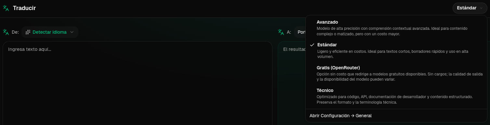

<a id="transrewrt-user-guide"></a>
# Guía del usuario

<br/>

<a id="introduction"></a>
## Introducción

Transrewrt te ayuda a trabajar con texto de tres formas principales:

- **Traducir** - convertir texto de un idioma a otro.
- **Reescribir** - reformular texto en un estilo diferente, como más claro, más breve o más formal.
- **Transformar** - procesar texto utilizando instrucciones personalizadas de inteligencia artificial llamadas indicaciones.

De forma predeterminada, la aplicación se ejecuta en modo **Fácil**: seleccionas un **preajuste** (por ejemplo, Gratis (OpenRouter), Estándar, Avanzado o Técnico) y un **proveedor** en Configuración, sin elegir identificadores de modelo. Cambia a **Avanzado** en [**Configuración** > **Configuración general**](#general-settings) si deseas la lista clásica de modelos desde [**Configuración** > **Modelos**](#models).

<br/>

Esta guía explica cómo usar la aplicación una vez instalada y en funcionamiento. Para los pasos de instalación, consulta el archivo [**README**](README.es.md) principal.

<br/>

> ℹ️ **NOTA**<br/>
> Transrewrt está disponible como aplicación de escritorio para Windows y Linux, y como aplicación web autohospedada. Esta guía se centra en el uso diario de la aplicación. Cuando algo solo se aplica a una versión, se indica claramente.

<small>**Leer en otros idiomas:** </small>
<small id="lang-list">[English (GB)](../USER-GUIDE.md) · [Português (Brasil)](./USER-GUIDE.pt-BR.md) · [العربية](./USER-GUIDE.ar.md) · [বাংলা](./USER-GUIDE.bn.md) · [Català](./USER-GUIDE.ca.md) · [中文 (中国大陆)](./USER-GUIDE.zh-CN.md) · [中文 (台灣)](./USER-GUIDE.zh-TW.md) · [Hrvatski](./USER-GUIDE.hr.md) · [Čeština](./USER-GUIDE.cs.md) · [Nederlands](./USER-GUIDE.nl.md) · [English (US)](./USER-GUIDE.en-US.md) · [Tagalog](./USER-GUIDE.tl.md) · [Français](./USER-GUIDE.fr.md) · [Deutsch](./USER-GUIDE.de.md) · [Ελληνικά](./USER-GUIDE.el.md) · [हिन्दी](./USER-GUIDE.hi.md) · [Magyar](./USER-GUIDE.hu.md) · [Italiano](./USER-GUIDE.it.md) · [日本語](./USER-GUIDE.ja.md) · [한국어](./USER-GUIDE.ko.md) · [Bahasa Melayu](./USER-GUIDE.ms.md) · [فارسی](./USER-GUIDE.fa.md) · [Polski](./USER-GUIDE.pl.md) · [Basa Jawa](./USER-GUIDE.jv.md) · [Português](./USER-GUIDE.pt.md) · [ਪੰਜਾਬੀ](./USER-GUIDE.pa.md) · [Română](./USER-GUIDE.ro.md) · [Русский](./USER-GUIDE.ru.md) · [Slovenčina](./USER-GUIDE.sk.md) · [Español](./USER-GUIDE.es.md) · [Kiswahili](./USER-GUIDE.sw.md) · [Svenska](./USER-GUIDE.sv.md) · [తెలుగు](./USER-GUIDE.te.md) · [ไทย](./USER-GUIDE.th.md) · [Türkçe](./USER-GUIDE.tr.md) · [Українська](./USER-GUIDE.uk.md) · [Tiếng Việt](./USER-GUIDE.vi.md)</small>

<small>

> **Nota sobre traducciones de la interfaz y documentación:** Todos los idiomas de la interfaz, excepto el inglés (UK) original, 
> fueron traducidos mediante modelos de IA; la redacción puede ser imprecisa o contener errores.

</small>

<br/>

<!-- START doctoc generated TOC please keep comment here to allow auto update -->
<!-- DON'T EDIT THIS SECTION, INSTEAD RE-RUN doctoc TO UPDATE -->
**Tabla de contenido**

- [Antes de empezar](#before-you-start)
  - [Cómo obtener una clave API gratuita de OpenRouter (aplicación de escritorio)](#how-to-get-a-free-openrouter-api-key-desktop-app)
- [Primeros pasos](#getting-started)
- [Partes principales de la ventana](#main-parts-of-the-window)
  - [Barra lateral](#sidebar)
  - [Barra de herramientas](#toolbar)
  - [Paneles de entrada y salida](#input-and-output-panels)
- [Traducir](#translate)
  - [Traducir texto](#translate-text)
  - [Selección de idioma](#language-selection)
  - [Configuración útil para la traducción](#helpful-translation-settings)
- [Reescribir](#rewrite)
- [Transformar](#transform)
  - [Ejecutar un prompt existente](#run-an-existing-prompt)
  - [Si aún no tienes prompts](#if-you-have-no-prompts-yet)
  - [Crear un prompt rápidamente](#create-a-prompt-quickly)
  - [Editar un prompt](#edit-a-prompt)
  - [Probar un prompt antes de usarlo](#test-a-prompt-before-using-it)
- [Panel](#dashboard)
  - [Filtrar los datos](#filter-the-data)
  - [Pestañas del panel](#dashboard-tabs)
  - [Exportar datos](#export-data)
  - [Eliminar registros almacenados para un modelo](#delete-stored-records-for-a-model)
- [Historial](#history)
  - [Filtrar el historial](#filter-the-history)
  - [Exportar datos del historial](#export-history-data)
- [Configuración](#settings)
  - [Configuración general](#general-settings)
  - [Modelos](#models)
  - [Idiomas](#languages)
  - [Seguimiento de costos](#cost-tracking)
  - [Transformar (pestaña de configuración)](#transform-settings-tab)
  - [Usuarios](#users)
  - [Configuración de API](#api-config)
  - [Acerca de](#about)
- [Problemas comunes](#common-issues)
  - [La aplicación no traduce, reescribe ni transforma texto](#the-app-will-not-translate-rewrite-or-transform-text)
  - [La lista de modelos está vacía](#the-model-list-is-empty)
  - [El resultado es demasiado lento o demasiado costoso](#the-result-is-too-slow-or-too-expensive)
  - [La interfaz está en el idioma incorrecto](#the-interface-is-in-the-wrong-language)
  - [El texto es demasiado pequeño o difícil de leer](#the-text-is-too-small-or-hard-to-read)
  - [El resumen del panel parece vacío](#dashboard-summary-looks-empty)
  - [El costo muestra "no disponible" o parece incorrecto](#cost-shows-not-available-or-seems-wrong)
  - [El coste total no coincide con la factura de mi proveedor](#total-cost-does-not-match-my-provider-bill)
  - [La página Historial falta en la barra lateral](#the-history-page-is-missing-from-the-sidebar)
  - [Aplicación web: redirigido inesperadamente a la página de inicio de sesión](#web-app-redirected-to-the-login-page-unexpectedly)
  - [Administrador web: olvidé o perdí una contraseña](#web-admin-forgot-or-lost-a-password)
  - [El panel no muestra datos de otros usuarios (web)](#dashboard-shows-no-data-for-other-users-web)
  - [He modificado un prompt y he perdido los cambios](#i-changed-a-prompt-and-lost-the-edits)
- [Consejos rápidos](#quick-tips)
- [Descargo de responsabilidad](#disclaimer)
- [Licencia](#license)

<!-- END doctoc generated TOC please keep comment here to allow auto update -->

<br/><br/>

<a id="before-you-start"></a>
## Antes de empezar

Para usar Transrewrt, necesitas acceso a al menos un proveedor de IA. Los proveedores compatibles son: [OpenRouter](https://openrouter.ai) (que agrega muchos modelos), OpenAI, Anthropic, Google Gemini, DeepSeek, Groq, Mistral, xAI, Cerebras y [Ollama](https://ollama.com) para modelos locales.

No necesitas seleccionar un modelo de pago para comenzar. Tan pronto como agregues tu clave de API de OpenRouter, la aplicación activa automáticamente una opción **gratis** integrada de OpenRouter. Esto te permite comenzar a traducir, reescribir y transformar texto de inmediato. Alternativamente, también puedes obtener una clave de API gratuita de Cerebras, Google, Groq o Mistral AI.

En términos sencillos:

- En el modo **Fácil**, un **preajuste** (Gratis (OpenRouter), Estándar, Avanzado o Técnico) se asocia a un modelo del **proveedor** elegido (OpenRouter, OpenAI, Ollama y otros). Solo aparecen en la barra de herramientas los preajustes que tienen una asignación para el proveedor actual. Seleccionas el preajuste en Traducir, Reescribir y Transformar.
- En el modo **Avanzado**, un **modelo** es el motor de IA que eliges directamente. Los identificadores de modelo usan un **prefijo del proveedor** (por ejemplo `openrouter/…`, `openai/…`, `ollama/…`).
- Una **clave API** (o, para Ollama, una **URL base**) es cómo la aplicación se conecta con ese proveedor.

Si estás usando la **aplicación de escritorio**, añade claves en [**Configuración** > **Configuración de API**](#api-config) para cada proveedor que uses. Para uso exclusivo de OpenRouter, consulta [Cómo obtener una clave API gratuita de OpenRouter](#how-to-get-a-free-openrouter-api-key-desktop-app) más abajo. Si no deseas usar una clave API, puedes instalar Ollama (desde [ollama.com](https://ollama.com)) y usar modelos locales en su lugar, como `translategemma:4b`.

Si estás usando la **versión web**, el propietario del servidor configura los proveedores mediante variables de entorno, por lo que no puedes introducir claves de API directamente en la aplicación.

<br/>

<a id="how-to-get-a-free-openrouter-api-key-desktop-app"></a>
### Cómo obtener una clave API gratuita de OpenRouter (aplicación de escritorio)

Si estás usando la aplicación de escritorio, sigue estos pasos:

1. Ve a [OpenRouter](https://openrouter.ai) en tu navegador web.
2. Crea una cuenta o inicia sesión.
3. Abre la página [Keys](https://openrouter.ai/keys).
4. Haz clic en el botón para crear una nueva clave de API.
5. Dale un nombre a la clave para que puedas reconocerla más tarde.
6. Copia la nueva clave de API.
7. Vuelve a Transrewrt y abre **Configuración** > **Configuración de API**.
8. Pega la clave en **Clave de API de OpenRouter** (bajo **Configuración** > **Configuración de API**).
9. Haz clic en **Probar clave de OpenRouter** para asegurarte de que funcione.

<br/><br/>

<a id="getting-started"></a>
## Primeros pasos

Si es la primera vez que usas Transrewrt, sigue este orden:

1. Abre la aplicación.
2. Elige tu **Idioma de la interfaz** desde el icono del globo terráqueo si es necesario.
3. Si estás en la **aplicación de escritorio**, abre [**Configuración** > **Configuración de API**](#api-config), añade una clave API para al menos un proveedor (por ejemplo, OpenRouter) y haz clic en **Probar** para verificar que funcione.
4. Abre [**Configuración** > **Configuración general**](#general-settings). En modo **Fácil** (predeterminado), elige un **Proveedor** que tenga una clave configurada. En modo **Avanzado**, abre [**Configuración** > **Modelos**](#models) y añade uno o más modelos a **Modelos seleccionados**.
5. En **Traducir**, selecciona un **preajuste** (Fácil) o **modelo** (Avanzado) en la barra de herramientas.
6. Abre [**Configuración** > **Idiomas**](#languages) y elige tus **Idiomas principales** si deseas que tus idiomas más usados aparezcan primero.
7. Realiza una traducción sencilla para confirmar que todo funciona, luego prueba **Reescribir** y **Transformar**.

Este orden es importante. Evita el problema más común al usar la aplicación por primera vez: intentar ejecutar una tarea antes de que la aplicación tenga una conexión API funcional o un preajuste/modelo seleccionado.

<br/><br/>

<a id="main-parts-of-the-window"></a>
## Partes principales de la ventana

La aplicación se divide en tres áreas principales:

- La **barra lateral** a la izquierda.
- La **barra de herramientas** en la parte superior.
- El **área de trabajo** en el centro.

<br/>

<a id="sidebar"></a>
### Barra lateral

Utilice la barra lateral para moverse por la aplicación. Puede colapsar la barra lateral para obtener más espacio haciendo clic en el icono junto al logotipo de la aplicación.

<br/>

<table>
  <tr>
    <td valign="top">
       
    </td>
    <td valign="top">
      <br/><br/>
      <ul>
        <li><strong>Traducir</strong> abre el área de trabajo de traducción.</li><br/>
        <li><strong>Reescribir</strong> abre el área de trabajo de reescritura.</li><br/>
        <li><strong>Transformar</strong> abre el área de trabajo de prompt personalizado.</li><br/>
        <li><strong>Panel</strong> muestra información sobre el uso y el costo.</li><br/>
        <li><strong>Configuración</strong> abre el panel de configuración.</li><br/>
        <li><strong>Historial</strong> muestra el historial de uso con el texto de entrada y salida</li><br/>
        <li><strong>Usuario</strong> muestra el nombre de usuario del usuario conectado (solo web).</li>
      </ul>
    </td>
  </tr>
</table>

<br/>

<a id="toolbar"></a>
### Barra de herramientas

La barra de herramientas cambia ligeramente dependiendo de dónde se encuentre en la aplicación.

- A la izquierda, muestra el nombre de la página actual.
- A la derecha, muestra el selector de **preajuste o modelo** y el control del **Idioma de la interfaz**.

En el modo **Fácil**, la barra de herramientas muestra un **selector de preajustes** con los preajustes integrados **Gratis (OpenRouter)**, **Estándar**, **Avanzado** y **Técnico**. Los preajustes que aparecen dependen del **Proveedor** elegido en [**Configuración** > **Configuración general**](#general-settings); por ejemplo, **Gratis (OpenRouter)** solo se muestra cuando el proveedor es OpenRouter. Si el **Proveedor** es **Ollama**, la barra de herramientas muestra tus modelos locales instalados en lugar de preajustes.

En modo **Avanzado**, el **selector de modelo** te permite elegir qué motor de IA usar para la tarea actual.



En modo Avanzado, algunos modelos gratuitos pueden no estar siempre disponibles: pueden estar desconectados o haber alcanzado un límite de uso. La aplicación puede eliminar automáticamente ese modelo de tu lista. Para controlar qué modelos aparecen, ve a [**Configuración** > **Modelos**](#models). Puedes abrir la configuración del modelo desde el icono del proveedor a la izquierda del nombre del modelo en la barra de herramientas.

<br/>

El **icono de globo terráqueo + código de idioma** cambia el idioma de la interfaz de la aplicación, como menús y botones. **No** cambia los idiomas de traducción utilizados en **Traducir**.


<br/>

<a id="input-and-output-panels"></a>
### Paneles de entrada y salida

La mayoría de los espacios de trabajo utilizan un panel izquierdo de **Entrada** y un panel derecho de **Salida**.

Cada panel también muestra:

| **Entrada**                                                          | **Salida**                                                                                                                  |
|--------------------------------------------------------------------|-----------------------------------------------------------------------------------------------------------------------------|
| - Conteo de caracteres <br/>- Conteo de palabras <br/>- Conteo de párrafos   <br/> | - Cuánto tiempo tomó la tarea<br/>- **TPS** (tokens por segundo)<br/>- Conteos de caracteres, palabras y párrafos<br/>- El modelo utilizado |

Si tiene dudas sobre los términos técnicos:

- **Token** significa un fragmento pequeño de texto. Puede pensarlo como parte de una palabra o una palabra corta.
- **TPS** significa cuántos de esos fragmentos de texto procesó el modelo por segundo.

<br/>

También puede supervisar el costo de cada operación (si está disponible) y el coste total, habilitando la opción `Show cost information on the actions` en [**Configuración** > **Configuración general**](#general-settings).

<br/><br/>

[--------------------------------------------------------------------------------------------------------------------------]: #

<a id="translate"></a>
## Traducir

Utilice **Traducir** cuando desee convertir texto de un idioma a otro.


<br/>

<a id="translate-text"></a>
### Traducir texto

1. Abre **Traducir**.
2. Elige un idioma en **Desde**.
3. Elige un idioma en **A**.
4. Elige un preajuste (Fácil) o modelo (Avanzado) en la barra de herramientas.
5. Escriba o pegue texto en **Entrada**.
6. Haga clic en **Traducir**.
7. Lea el resultado en **Salida**.
8. Utilice el botón de copiar si desea copiar el resultado.

<br/>

<a id="language-selection"></a>
### Selección de idioma

- **De** puede ser un idioma específico o **Detectar idioma**.
- **A** es el idioma en el que desea obtener el resultado.

Sus **Idiomas principales** seleccionados aparecen en la parte superior de la lista. Puede configurarlos en [**Configuración** > **Idiomas**](#languages).

<br/>

<a id="helpful-translation-settings"></a>
### Configuración útil de traducción

En [**Configuración** > **Configuración general**](#general-settings), puede cambiar el comportamiento de la traducción:

- **Traducción automática al pegar** realiza una traducción tan pronto como pegue texto.
- **Copiar automáticamente el resultado al portapapeles** copia el resultado automáticamente tras una ejecución exitosa.
- **Traducción en tiempo real (mientras escribe)** realiza traducciones mientras escribe.
- **Tiempo de espera (ms)** controla cuánto espera la aplicación antes de ejecutar una traducción en tiempo real.
- **Comportamiento para ENTER** controla lo que sucede al pulsar `Enter`:
  - **Enter** ejecuta traducir o reescribir (predeterminado).
  - **Mayús + Enter** ejecuta traducir o reescribir; **Enter** simple inserta una nueva línea.

[--------------------------------------------------------------------------------------------------------------------------]: #

<a id="rewrite"></a>
## Reescribir

Utilice **Reescribir** cuando desee mejorar la redacción sin cambiar el significado principal.


Esto es útil para:

- corrección de ortografía y gramática (**Revisar ortografía y gramática**)
- mejora de claridad del texto (**Mejorar claridad**)
- varias reformulaciones distintas en una sola ejecución (**Versiones alternativas**)
- hacer el texto más formal o más informal (**Hacer formal** / **Hacer informal**)
- acortar o ampliar texto (**Acortar** / **Ampliar**)
- hacer que el texto suene más técnico (**Hacer técnico**)

<br/>

> 💡 **CONSEJO**<br/>
> Cuando utiliza el modo "**Revisar ortografía y gramática**", aparece un interruptor **Mostrar cambios** en el panel de salida (junto a **Copiar**).
> Actívelo o desactívelo para mostrar u ocultar las correcciones específicas aplicadas a su texto.

<br/><br/>

[--------------------------------------------------------------------------------------------------------------------------]: #

<a id="transform"></a>
## Transformar

Utilice **Transformar** cuando desee que la IA siga un conjunto personalizado de instrucciones.


Esta es el área más flexible de la aplicación. Puede usarla para tareas como:

- resumir notas
- convertir texto informal en un correo electrónico pulido
- extraer puntos clave
- convertir texto a un formato específico
- cualquier otra actividad personalizada con el texto de entrada

<br/>

<a id="run-an-existing-prompt"></a>
### Ejecutar un prompt existente

1. Abra **Transformar**.
2. Elija un prompt de la lista de prompts.
3. Si aparece un cuadro de **Destino** de idioma, elija un idioma si lo desea.
4. Escriba o pegue texto en **Entrada**.
5. Haga clic en **Transformar**.
6. Lea el resultado en **Salida**.

<br/>

<a id="if-you-have-no-prompts-yet"></a>
### Si aún no tiene prompts

Si tu lista de prompts está vacía, haz clic en **Cargar mensajes de ejemplo** en el espacio de trabajo Transformar. El mismo control está siempre disponible en [**Configuración** > **Transformar**](#transform-settings) en la fila de exportación/importación. Ambos añaden ejemplos integrados para que puedas comenzar rápidamente.

<br/>

> ℹ️ **NOTA**<br/>
> Los mensajes de ejemplo se proporcionan en inglés. Después de cargarlos, puede editar un mensaje y usar **Traducir mensaje** para traducirlo a su idioma.

<br/>

<a id="create-a-prompt-quickly"></a>
### Crear un prompt rápidamente

La forma más rápida de crear un prompt es:

1. Haz clic en **Nuevo prompt**.
2. Haz clic en **Generar prompt**.
3. Describe lo que deseas que haga el prompt.
4. Elige un preajuste (Fácil) o modelo (Avanzado).
5. Deje que la aplicación cree un borrador para usted.
6. Revise el borrador y haga clic en **Guardar**.


<br/>

<a id="edit-a-prompt"></a>
### Editar un prompt

Cuando cree o edite un prompt, el editor aparece a la izquierda y un área de prueba aparece a la derecha.


Los campos principales son:

- **Nombre del prompt**: el nombre que se muestra en la lista de prompts.
- **Instrucciones del prompt (opcional)**: una pista corta que se muestra al usuario al ejecutar el prompt.
- **Rol del modelo**: el rol general asignado a la IA, como 'Eres un asistente útil'.
- **Instrucciones del modelo (una por línea)**: las reglas específicas que desea que siga la IA.
- **Descripción de salida**: una palabra corta que describe el resultado, como 'resumen' o 'reescribir'.
- **Temperatura (0,0 → 1,0)**: cómo se comportará el modelo; véase a continuación.
- **Preguntar por el idioma de destino**: añade un selector de idioma de destino cuando se ejecuta el prompt.

Si el término técnico **Temperatura** es nuevo para usted, piénselo así:

- Una temperatura **más baja** da resultados más estables y predecibles.
- Una temperatura **más alta** da más variedad y creatividad.

También puede usar:

- `Generate prompt` para crear un nuevo borrador a partir de una descripción sencilla
- `Improve prompt` para perfeccionar un prompt existente
- `Translate prompt` para traducir los campos del prompt

<br/>

> ⚠️ **ADVERTENCIA**<br/>
> Haga clic en `Save` antes de hacer clic en `Back to Run`. Si regresa sin guardar, se perderán sus cambios.

<br/>

<a id="test-a-prompt-before-using-it"></a>
### Probar un prompt antes de usarlo

El panel de prueba de la derecha te permite probar tu prompt con texto de ejemplo antes de usarlo en tu trabajo diario.

Esto es útil cuando:

- estás creando un nuevo prompt
- estás comparando dos versiones de un prompt
- deseas verificar el tono, la longitud o el formato de salida

<br/>

> ℹ️ **NOTA**<br/>
> Puedes exportar e importar prompts guardados en [**Configuración** > **Transformar**](#transform-settings).

Cuando usas **Generar prompt**, **Mejorar prompt** o **Traducir mensaje** en el editor de prompts, el modo **Fácil** ofrece el mismo selector de preajustes que en Traducir y Reescribir; el modo **Avanzado** utiliza la lista de modelos.

<br/><br/>

[--------------------------------------------------------------------------------------------------------------------------]: #

<a id="dashboard"></a>
## Panel

Usa **Panel** para ver cuánto estás usando la aplicación y cuál es su costo (para modelos de pago).


<br/>

> ℹ️ **NOTA**<br/>
> Si solo usas modelos **gratis**, las cantidades de **costo** pueden ser cero y los KPI centrados en costos pueden aparecer vacíos. La pestaña **Resumen** aún muestra el número de llamadas para traducir, reescribir y transformar cuando haya actividad en el período seleccionado.

<br/>

<a id="filter-the-data"></a>
### Filtrar los datos

Usa los botones de filtro en la parte superior para cambiar el rango de tiempo.


<br/>

> ℹ️ **NOTA**<br/>
> El filtro **Usuario** solo es visible para los administradores en la versión web. Los usuarios normales no verán este filtro, y no está disponible en la aplicación de escritorio.

<br/>

<a id="dashboard-tabs"></a>
### Pestañas del panel

- **Resumen** muestra tarjetas de KPI: costo total, modelos utilizados, número de llamadas y costo por modo (con porcentaje del total de llamadas), costo promedio por llamada, TPS promedio y los tres modelos principales por número de llamadas.
- **Por modelo** enumera cada modelo con llamadas totales, costo total y TPS promedio; amplía una fila para ver un desglose por traducir, reescribir y transformar.
- **Todas las llamadas** muestra el registro completo de llamadas (paginado en pantallas anchas, en tarjetas en pantallas estrechas) y permite exportarlo.

<br/>

<a id="export-data"></a>
### Exportar datos

Las tablas del panel pueden exportar datos en:

- **JSON**
- **CSV**
- **XLSX**

Esto es útil si desea revisar la actividad fuera de la aplicación o compartir un informe.

<br/>

<a id="delete-stored-records-for-a-model"></a>
### Eliminar registros almacenados de un modelo

En **Por modelo** o **Todas las llamadas**, puedes eliminar los registros almacenados de un modelo haciendo clic en el icono de "papelera".

> ⚠️ **ADVERTENCIA**<br/>
> La eliminación de registros almacenados no se puede deshacer. Usa esta opción solo si estás seguro de que ya no necesitas ese historial.

Para eliminar todos los datos o quitar registros según su antigüedad, vaya a [**Configuración** > **Seguimiento de costos**](#cost-tracking). Allí encontrará opciones para eliminar todos los datos almacenados o solo los datos anteriores a una fecha determinada.

<br/><br/>

[--------------------------------------------------------------------------------------------------------------------------]: #

<a id="history"></a>
## Historial

Haga clic en **Historial** para ver el historial de sus acciones dentro de **Transrewrt**, incluyendo la entrada y salida de cada operación.


<br/>

<a id="filter-the-history"></a>
### Filtrar el historial

**Historial** utiliza los mismos filtros de rango de tiempo que la página **Panel**.


<br/>

> ℹ️ **NOTA**<br/>
> En la **aplicación web**, todos (incluidos los administradores) ven únicamente su propio historial de ejecución. El filtro **Usuario** en **Panel** permite a los administradores revisar el uso y los costos entre cuentas; no se aplica a **Historial**.

<br/>

<a id="export-history-data"></a>
### Exportar datos del historial

La página de historial puede exportar los datos filtrados en:

- **JSON**
- **CSV**
- **XLSX**

Esto es útil si desea revisar la actividad fuera de la aplicación o compartir un informe.

<br/><br/>

[--------------------------------------------------------------------------------------------------------------------------]: #

<a id="settings"></a>
## Configuración

Abra **Configuración** desde la barra lateral para personalizar el comportamiento de la aplicación.

Las pestañas disponibles dependen de la plataforma y de su rol:

| Pestaña              | Escritorio | Web (administrador) | Web (usuario normal) | Notas                                        |
  |------------------|:-------:|:-----------:|:------------------:|----------------------------------------------|
  | Configuración general |   sí   |     sí     |        sí         | Incluye **experiencia de IA** (Fácil / Avanzado) |
  | Modelos           |   sí   |     sí     |        sí         | Solo cuando **experiencia de IA** es **Avanzado** |
  | Idiomas           |   sí   |     sí     |        sí         |                                              |
  | Seguimiento de costos    |   sí   |     sí     |         -          |                                              |
  | Transformar        |   sí   |     sí     |        sí         | Importación/exportación masiva de indicaciones de transformación      |
  | Usuarios            |    -    |     sí     |         -          |                                              |
  | Configuración de API       |   sí   |     sí     |         -          |                                              |
  | Acerca de            |   sí   |     sí     |        sí         |                                              |

En el modo **Fácil**, la selección del modelo se realiza mediante preajustes en la barra de herramientas y el **Proveedor** en Configuración general; la pestaña **Modelos** está oculta.

<br/>

> ℹ️ **NOTA**<br/>
> En la versión web, cada usuario tiene su propia configuración. La configuración, como la experiencia de IA, el proveedor, los modelos o preajustes seleccionados, idiomas, opciones generales e indicaciones de transformación, se almacena por usuario. Los cambios que realices no afectan a otros usuarios.

<br/>

[--------------------------------------------------------------------------------------------------------------------------]: #

<a id="general-settings"></a>
### Configuración general

Usa **Configuración general** para controlar el comportamiento al escribir, si se almacenan los detalles de ejecución para **Historial**, la apariencia y cómo seleccionas la IA para Traducir, Reescribir y Transformar.

**Experiencia de IA**

- **Fácil** (predeterminado): elige un **Proveedor** (OpenRouter, OpenAI, Anthropic, Google Gemini, DeepSeek, Groq, Mistral, xAI, Cerebras u Ollama). Los proveedores en la nube usan los preajustes integrados en la barra de herramientas. **Ollama** muestra los modelos instalados en tu máquina en lugar de preajustes. En el modo Fácil, el **Catálogo de preajustes** muestra la versión del catálogo y la hora de la última actualización; haz clic en **Actualizar catálogo de preajustes** para obtener la lista más reciente desde el repositorio del proyecto (la aplicación también verifica periódicamente en segundo plano).
- **Avanzado**: selecciona modelos individuales en la barra de herramientas; gestiona la lista en [**Configuración** > **Modelos**](#models).

En la **aplicación web**, los proveedores disponibles dependen de las claves API configuradas en el entorno del servidor. En la **aplicación de escritorio**, configura las claves en [**Configuración de API**](#api-config).

**Comportamiento**

- **Comportamiento para ENTER** elige si `Enter` ejecuta la tarea o inserta una nueva línea.
- **Traducción automática al pegar** inicia la traducción tan pronto como pegue texto.
- **Copiar automáticamente el resultado al portapapeles** copia los resultados exitosos automáticamente.
- **Traducción en tiempo real (mientras escribe)** traduce mientras escribe.
- **Tiempo de espera (ms)** establece el tiempo de espera para la traducción en tiempo real.

**Historial**

- **Mantener historial de ejecución** controla si cada operación de traducción, reescritura y transformación almacena el **texto de entrada y salida** para la vista del panel lateral [**Historial**](#history). Desactivarlo solicita confirmación; si confirmas, el texto almacenado del historial se elimina de la base de datos. Si la etiqueta muestra *deshabilitado por el administrador*, tu instalación tiene `HISTORY_DISABLED` configurado en el entorno (consulta el [README](README.es.md#configuration-and-environment)); no podrás volver a activar el historial desde la interfaz de usuario.
- **Eliminar datos del historial** te permite borrar el texto almacenado por antigüedad (por ejemplo, más antiguo que unos meses, o **todos los datos (borrar)**) mediante **Eliminar datos**. Esto solo afecta al texto de ejecución guardado para la vista **Historial**; **no** elimina los totales de costos ni de uso. Para eliminar o reducir los datos de **costo**, utiliza [**Configuración** > **Seguimiento de costos**](#cost-tracking).

**Apariencia**

- **Tema** cambia entre apariencia clara, oscura y del sistema.
- **Mostrar información de coste en las acciones** controla la visualización del coste por operación (si está disponible) y del coste total en los paneles de salida de Traducir, Reescribir y Transformar.
- **Dígitos fraccionarios del coste** cambia cómo se muestran los decimales del coste.
- **Solo web:** **mostrar un margen alrededor de la aplicación** añade espacio extra alrededor de la interfaz.
- **Familia de fuentes** cambia la fuente de escritura en los paneles de texto.
- **Tamaño** cambia el tamaño de la fuente.

**Copia de seguridad de la configuración** (solo aplicaciones de escritorio y administradores web)

- **Incluir datos de uso en la copia de seguridad**: cuando está activado, el ZIP también contiene el historial de ejecución y los datos de llamadas a la API.
- **Hacer copia de seguridad de la configuración**: crea un único archivo ZIP (`transrewrt-config-backup-YYYY-MM-DD_HHMMSS.zip` en UTC por defecto) con `config.json`, `state.json`, clave opcional de cifrado, usuarios, preferencias, indicaciones personalizadas y datos de uso si ha optado por incluirlos. Tras una copia de seguridad exitosa, la confirmación muestra el nombre del archivo guardado.
- **Restaurar desde copia de seguridad**: abre primero un **diálogo de confirmación**. Seleccione el archivo ZIP de copia de seguridad dentro del diálogo (**Examinar** / selector de archivos o arrastrar y soltar donde se admita), luego revise las opciones:
  - **Restaurar los datos de uso**: importa el uso/historial del ZIP cuando se realizó la copia de seguridad con los datos de uso incluidos; déjelo desactivado si solo desea configuraciones e indicaciones.
  - **Borrar los datos de uso antiguos antes de restaurar**: elimina el uso/historial existente en esta instalación antes de aplicar la copia de seguridad (opcional; úselo cuando desee una sustitución limpia).

Las copias de seguridad creadas en la versión web o de escritorio se pueden restaurar en la otra. Al restaurar una copia de seguridad de escritorio en la versión web, los datos se restaurarán al usuario administrador.

<br/>

<a id="models"></a>
### Modelos

Esta pestaña solo está disponible cuando la **experiencia de IA** está configurada en **Avanzado** en [**Configuración general**](#general-settings). Usa **Configuración** > **Modelos** para elegir qué modelos aparecen en la barra de herramientas.


La página tiene dos listas:

- **Modelos disponibles** a la izquierda
- **Modelos seleccionados** a la derecha

Los controles útiles incluyen:

- **Buscar modelos...** para encontrar un modelo por nombre
- Fichas de **Proveedor** para reducir la lista a un motor (OpenRouter, OpenAI, Ollama, …)
- **Solo gratuitos** para mostrar solo modelos gratuitos
- **Actualizar** para recargar la lista
- **Expandir todo** y **Contraer todo** cuando ordene por proveedor

Los ID de modelo incluyen el prefijo del proveedor (por ejemplo `openrouter/…` frente a `openai/…`). Las insignias como **OpenAI (OpenRouter)** frente a **OpenAI (directo)** muestran cómo se enruta el tráfico.

> ℹ️ **NOTA**<br/>
> **OpenRouter Body Builder** (`openrouter/bodybuilder`) es un modelo de enrutamiento, no un modelo de chat general: su respuesta es JSON que describe los cuerpos de solicitud de la API de OpenRouter (por ejemplo, un array `requests` con `model` y `messages`). Si lo usa para **Traducir**, **Reescribir** o **Transformar**, el panel de salida mostrará ese JSON en lugar del texto finalizado. Elija un modelo de texto normal para esas tareas. Consulte la [página del modelo Body Builder](https://openrouter.ai/openrouter/bodybuilder) en OpenRouter.

Acciones:

- Para añadir un modelo, haga clic en **Añadir** o en cualquier parte de la entrada.

- Para eliminar un modelo, haga clic en **X** junto a él en **Modelos seleccionados** o en **Seleccionado** en la entrada de Modelos disponibles.

- Para limpiar la lista, haga clic en **Deseleccionar todo**. El modelo gratuito obligatorio permanecerá en la lista.

<br/>

> ℹ️ **NOTA**<br/>
> Si no desea añadir créditos a OpenRouter de inmediato, comience habilitando **Solo gratuitos** y eligiendo los modelos gratuitos (no se requiere tarjeta de crédito). También puede usar Ollama para ejecutar modelos localmente sin ninguna clave API.

<br/>

<a id="languages"></a>
### Idiomas

Use **Configuración** > **Idiomas** para organizar las listas de idiomas utilizadas en la aplicación.

- Los **idiomas principales** se fijan cerca de la parte superior de las listas de idiomas en **Traducir** y **Transformar**.
- **Idioma personalizado** le permite añadir un idioma que no esté en la lista integrada.

Si añade un idioma personalizado, aparecerá en los selectores de idioma junto con las opciones integradas.

<br/>

<a id="cost-tracking"></a>
### Seguimiento de costos

Use **Configuración** > **Seguimiento de costos** para gestionar la información de costos.

- **Coste total** muestra el total acumulado.
- **Copiar valor** copia el total al portapapeles.
- **Restablecer costo** restablece el total almacenado a cero.
- **Sincronizar con el uso de la clave API** establece el total para que coincida con el uso informado por su cuenta de OpenRouter (solo OpenRouter).
- **Uso de la clave API** muestra los detalles de uso de OpenRouter, si están disponibles.
- **Eliminar datos de coste** elimina todos los datos, o solo las entradas anteriores a una fecha seleccionada.

**Seguimiento de costos:** Cuando utiliza modelos de OpenRouter, la aplicación muestra su uso y gastos reales basados en la información de costos de OpenRouter. Para todos los demás proveedores, la aplicación estima los costos utilizando los precios publicados por OpenRouter; si no hay un precio disponible, la estimación puede ser cero.

<br/>

> ℹ️ **NOTA**<br/>
> **Todas las cifras de costos son estimaciones solo para su referencia, no son facturas oficiales.**

<br/>

> ⚠️ **ADVERTENCIA**<br/>
> La eliminación de datos no se puede deshacer. Antes de eliminar, asegúrese de hacer una copia de seguridad de sus datos o de exportarlos a través de [**Historial**](#history)
> o [**Panel** > **Todas las llamadas**](#dashboard-tabs), de lo contrario se perderán permanentemente.
> Todo el historial de entradas/salidas relacionado con cada entrada de llamada API también se eliminará.

<br/>

<a id="transform-settings"></a>
### Transformar (pestaña de configuración)

Usa **Configuración** > **Transformar** para gestionar los prompts en bloque.

Puede:

- revisar sus mensajes guardados
- eliminar mensajes
- importar mensajes desde un archivo
- exportar mensajes para respaldo o compartirlos
- cargar mensajes de ejemplo a la lista de mensajes

<br/>

<a id="users"></a>
### Usuarios

Use **Usuarios** para administrar cuentas de usuario en la versión web. Puede añadir usuarios, actualizar sus datos, restablecer contraseñas y eliminar cuentas.

<br/>

<a id="api-config"></a>
### Configuración de API

Los proveedores compatibles son: OpenRouter, OpenAI, Anthropic, Google Gemini, DeepSeek, Groq, Mistral, xAI, Cerebras y **Ollama** (modelos locales mediante una URL base). Solo necesita configurar los proveedores que utilice.

**Aplicación web: solo administrador**

Las claves API se configuran mediante variables de entorno del sistema o de Docker; no se introducen en la interfaz web. Esta página muestra qué proveedores tienen una clave configurada y le permite probar cada uno haciendo clic en el botón `Test`.

<br/>

> ℹ️ **NOTA**<br/>
> Para cambiar una clave API, actualice la variable de entorno en su configuración del sistema o de Docker y reinicie el servidor o contenedor.

<br/>

> ℹ️ **NOTA**<br/>
> Las **copias de seguridad de la configuración** (consulte [**Configuración general** → Copia de seguridad de la configuración](#general-settings)) pueden incluir claves de proveedor **resueltas** dentro del `config.json` del archivo ZIP. Restaurar ese archivo ZIP **no** copia esas claves nuevamente al archivo de configuración persistente del servidor; las claves activas siguen proveniendo del entorno y del estado del archivo existente, como se describe allí.

<br/>

**Aplicación de escritorio**

Use **Configuración de API** para almacenar claves API para cada proveedor que utilice. Para Ollama, introduzca la **URL base** en lugar de una clave API.

<br/>

> 💡 **Consejo** <br/>
> Si no desea usar una clave API ni pagar por el uso, puede [descargar Ollama](https://ollama.com) y ejecutar modelos (como `translategemma:4b`) localmente en su máquina de forma gratuita. Alternativamente, puede crear una cuenta gratuita en OpenRouter (sin necesidad de tarjeta de crédito) para usar sus modelos gratuitos, o obtener una clave API gratuita de Cerebras, Google, Groq o Mistral AI.

<br/>

- Añada solo los proveedores que necesite. En **Configuración** > **Modelos**, cada ID de modelo comienza con el nombre del proveedor (por ejemplo `openrouter/openrouter/free`, `openai/gpt-4o`, `ollama/llama3`).

Para añadir una clave API, introduzca el valor en el campo de texto y haga clic en `Save`. Para reemplazar una clave existente, haga clic en `Edit`. Para verificar que una clave funcione, haga clic en `Test`. Para la URL base de Ollama, haga clic siempre en `Test` para comprobar la conexión.

<br/>

> ℹ️ **NOTA**<br/>
> No puede ver el valor actual de una clave API. Solo puede reemplazarla usando el botón `Edit`.
> Las claves API se almacenan cifradas en la configuración.

<br/>

<a id="about"></a>
### Acerca de

La pestaña **Acerca de** muestra:

- el nombre de la aplicación y el eslogan
- el número de versión y la fecha de compilación
- información de licencia y derechos de autor, con un enlace para abrir **Avisos de terceros**
- un enlace al repositorio del proyecto

<br/><br/>

<a id="common-issues"></a>
## Problemas comunes

Si algo no funciona como se espera, revise primero los siguientes puntos.

<br/>

<a id="the-app-will-not-translate-rewrite-or-transform-text"></a>
### La aplicación no traduce, reescribe ni transforma el texto

Compruebe que:

- has seleccionado un **preajuste** (Fácil) o **modelo** (Avanzado) en la barra de herramientas
- en modo **Fácil**, [**Configuración** > **Configuración general**](#general-settings) tiene un **Proveedor** con una clave válida (o URL de Ollama) y al menos un preajuste disponible para ese proveedor
- en modo **Avanzado**, al menos un modelo está listado en [**Configuración** > **Modelos**](#models)
- tu configuración de API está funcionando correctamente

Si está utilizando la aplicación de escritorio:

1. Abra [**Configuración** > **Configuración de API**](#api-config).
2. Compruebe que al menos una clave de API esté guardada.
3. Haga clic en **Probar** junto al proveedor para confirmar que la clave funciona.

<br/>

<a id="the-model-list-is-empty"></a>
### La lista de modelos está vacía

En modo **Fácil**, abre [**Configuración** > **Configuración general**](#general-settings), confirma que **Proveedor** esté configurado y agrega o prueba claves en [**Configuración de API**](#api-config) (en escritorio) o pide ayuda a tu administrador (en web). Para **Ollama**, haz clic en **Probar** en la URL base y asegúrate de que los modelos estén instalados localmente.

En modo **Avanzado**, abre [**Configuración** > **Modelos**](#models) y haz clic en **Actualizar**. Si es necesario, busca un modelo, activa **Solo gratuitos** y añade modelos a **Modelos seleccionados**.

<br/>

<a id="the-result-is-too-slow-or-too-expensive"></a>
### El resultado es demasiado lento o demasiado costoso

Pruebe una o varias de estas opciones:

- elige un preajuste diferente (Fácil) o modelo (Avanzado)
- usa una entrada más corta
- desactiva **Traducción en tiempo real (mientras escribes)** en [**Configuración** > **Configuración general**](#general-settings)
- usa modelos gratuitos para tareas simples (ver [Modelos](#models))

<br/>

<a id="the-interface-is-in-the-wrong-language"></a>
### La interfaz está en el idioma incorrecto

Haga clic en el icono del globo terráqueo en la [barra de herramientas](#toolbar) y seleccione su **Idioma de la interfaz** preferido.

<br/>

<a id="the-text-is-too-small-or-hard-to-read"></a>
### El texto es demasiado pequeño o difícil de leer

Abra [**Configuración** > **Configuración general**](#general-settings) y cambie:

- **Familia de fuentes**
- **Tamaño**

<br/>

<a id="dashboard-summary-looks-empty"></a>
### El resumen del panel parece vacío

Esto es normal si:

- solo usas **modelos gratuitos** y estás viendo cifras de **costo** (pueden ser cero); los indicadores clave (KPI) de número de llamadas en **Resumen** aún necesitan datos del período seleccionado
- el **filtro de tiempo** seleccionado no incluye el período en que se realizaron las llamadas; prueba con **Todo** para verificar

Si los KPI siguen siendo cero tras seleccionar **Todo**, confirma que las llamadas aparezcan en [**Historial**](#history) o en la pestaña **Todas las llamadas**.

<br/>

<a id="cost-shows-not-available-or-seems-wrong"></a>
### El costo muestra "no disponible" o parece incorrecto

Cuando usas modelos a través de **OpenRouter**, la aplicación muestra tu gasto real informado por OpenRouter.

Para **otros proveedores** (OpenAI directo, Anthropic directo, etc.), el costo se estima a partir de los datos de precios publicados por OpenRouter. Si no se encuentra un precio coincidente para un modelo, el costo aparecerá como **no disponible** y no se sumará a tu total acumulado.

<br/>

<a id="total-cost-does-not-match-my-provider-bill"></a>
### El costo total no coincide con la factura de mi proveedor

Todas las cifras de costo en la aplicación son **estimaciones solo para referencia**, no son estados de cuenta oficiales.

Para acercar el total a tu gasto real en OpenRouter, abre [**Configuración** > **Seguimiento de costos**](#cost-tracking) y haz clic en **Sincronizar con el uso de la clave API**.

<br/>

<a id="the-history-page-is-missing-from-the-sidebar"></a>
### La página Historial falta en la barra lateral

**Mantener historial de ejecución** podría estar desactivado. Abre [**Configuración** > **Configuración general**](#general-settings) y actívalo, a menos que el historial esté *deshabilitado por el administrador* (`HISTORY_DISABLED` en el entorno — consulta el [README](README.es.md#configuration-and-environment)). Activar el historial no restaura el texto eliminado previamente.

<br/>

<a id="web-app-session-expired"></a>
### Aplicación web: redirigido inesperadamente a la página de inicio de sesión

Tu sesión puede haber expirado. Inicia sesión nuevamente. Si ocurre con frecuencia, revisa la configuración del servidor para los tiempos de vida de la sesión.

<br/>

<a id="web-admin-forgot-or-lost-a-password"></a>
### Administrador web: olvidó o perdió una contraseña

Esto se aplica a la **aplicación web autohospedada** (Docker), no a la aplicación de escritorio (Electron).

- Si otro administrador aún puede iniciar sesión, puede abrir [**Configuración** > **Usuarios**](#users), seleccionar la cuenta y establecer una **nueva contraseña** allí.
- Si estás **bloqueado** pero tienes **acceso shell** a la máquina o contenedor, restablece la contraseña con la herramienta incluida en la imagen (reemplaza `transrewrt` si cambias el nombre predeterminado, y entrecomilla la contraseña si contiene espacios o caracteres especiales):

```bash
docker exec transrewrt reset-web-password '<username>' '<new-password>'
```

El nombre de usuario predeterminado del administrador es `admin` si nunca creaste otras cuentas. Cuando pasas solo un argumento, se trata como la nueva contraseña para `admin`.

Si ejecutas desde una **copia de origen** en lugar de Docker, usa:

```bash
pnpm run reset-web-password -- <username> <new-password>
```

El script actualiza el registro del usuario en la base de datos SQLite (y puede crear el `admin` usuario si falta). Después de restablecer, inicie sesión con la nueva contraseña.

<br/>

<a id="dashboard-shows-no-data-for-other-users"></a>
### El panel muestra sin datos para otros usuarios (web)

Solo los **administradores** pueden ver los datos de todos los usuarios mediante el filtro **Usuario**. Por diseño, los usuarios regulares solo ven su propia actividad.

<br/>

<a id="i-changed-a-prompt-and-lost-the-edits"></a>
### Cambié un prompt y perdí los cambios

Al editar un prompt, haga clic siempre en **Guardar** antes de hacer clic en **Volver a Ejecutar**.

<br/><br/>

<a id="quick-tips"></a>
## Consejos rápidos

- Comience con [**Traducir**](#translate) para asegurarse de que su configuración funcione antes de pasar a [**Reescribir**](#rewrite) o [**Transformar**](#transform).
- Use [**Reescribir**](#rewrite) para mejorar el texto habitual.
- Use [**Transformar**](#transform) cuando necesite un flujo de trabajo repetible para una tarea específica.
- Use [**Panel**](#dashboard) si desea supervisar el uso y el costo.
- Usa [**Historial**](#history) para revisar operaciones anteriores y su texto completo de entrada/salida.
- Exporta los prompts regularmente si estás creando una biblioteca de prompts que deseas conservar (consulta [Transformar](#transform)) o si deseas compartirla con otros.
- Mantente en el modo **Fácil** hasta que necesites un control detallado sobre los IDs de los modelos; cambia a **Avanzado** cuando ya sepas exactamente qué modelos deseas usar.

<br/><br/>

<a id="disclaimer"></a>
## Descargo de responsabilidad

Los nombres de productos e iconos pertenecen a sus respectivos propietarios y se utilizan solo con fines de identificación. Este software no está afiliado ni respaldado por ninguna de las marcas mencionadas.

<br/><br/>

<a id="license"></a>
## Licencia

Derechos de autor © 2026 Waldemar Scudeller Jr.

[Apache License 2.0](../LICENSE)
