
# راهنمای کاربر

 

## مقدمه

Transrewrt به شما در کار با متن به سه شکل اصلی کمک می‌کند:

- **ترجمه** - تبدیل متن از یک زبان به زبان دیگر.
- **بازنویسی** - بازنویسی متن با سبک متفاوت، مانند واضح‌تر، کوتاه‌تر یا رسمی‌تر.
- **تبدیل** - پردازش متن با استفاده از دستورالعمل‌های هوش مصنوعی سفارشی که به آن‌ها «دستور» (prompt) گفته می‌شود.

 

این راهنما نحوه استفاده از برنامه پس از نصب و اجرای آن را توضیح می‌دهد. برای مراحل نصب، به فایل اصلی **[README](README.fa.md)** مراجعه کنید.

 

> ℹ️ **توجه** 
> Transrewrt به صورت یک برنامه دسکتاپ برای ویندوز و لینوکس و همچنین به صورت یک برنامه تحت‌وب سلف‌هاست (خودمیزبانی شده) در دسترس است. این راهنما بر استفاده روزمره از برنامه تمرکز دارد. هرگاه موضوعی تنها به یک نسخه اعمال شود، به وضوح مشخص‌شده است.

<small>**مطالعه به زبان‌های دیگر:** [انگلیسی (بریتانیا)](USER-GUIDE.fa.md) · [پرتغالی (برزیل)](USER-GUIDE.pt-BR.md) · [عربی](USER-GUIDE.ar.md) · [بنگالی](USER-GUIDE.bn.md) · [کاتالان](USER-GUIDE.ca.md) · [چینی ساده](USER-GUIDE.zh-CN.md) · [چینی سنتی](USER-GUIDE.zh-TW.md) · [کرواسی](USER-GUIDE.hr.md) · [چکی](USER-GUIDE.cs.md) · [olandی](USER-GUIDE.nl.md) · [انگلیسی (آمریکا)](USER-GUIDE.en-US.md) · [فیلیپینی](USER-GUIDE.tl.md) · [فرانسوی](USER-GUIDE.fr.md) · [آلمانی](USER-GUIDE.de.md) · [یونانی](USER-GUIDE.el.md) · [هندی](USER-GUIDE.hi.md) · [مجاری](USER-GUIDE.hu.md) · [ایتالیایی](USER-GUIDE.it.md) · [ژاپنی](USER-GUIDE.ja.md) · [جاوه‌ای](USER-GUIDE.jv.md) · [کره‌ای](USER-GUIDE.ko.md) · [مالایی](USER-GUIDE.ms.md) · [فارسی](USER-GUIDE.fa.md) · [لهستانی](USER-GUIDE.pl.md) · [پرتغالی (پرتغال)](USER-GUIDE.pt.md) · [پنجابی](USER-GUIDE.pa.md) · [رومانیایی](USER-GUIDE.ro.md) · [روسی](USER-GUIDE.ru.md) · [اسلواکی](USER-GUIDE.sk.md) · [اسپانیایی](USER-GUIDE.es.md) · [سواحیلی](USER-GUIDE.sw.md) · [سوئدی](USER-GUIDE.sv.md) · [تلوگو](USER-GUIDE.te.md) · [تایلندی](USER-GUIDE.th.md) · [ترکی](USER-GUIDE.tr.md) · [اوکراینی](USER-GUIDE.uk.md) · [ویتنامی](USER-GUIDE.vi.md)</small>

 

<!-- START doctoc generated TOC please keep comment here to allow auto update -->
<!-- DON'T EDIT THIS SECTION, INSTEAD RE-RUN doctoc TO UPDATE -->
**فهرست مطالب** 

- [قبل از شروع](#before-you-start)
  - [نحوه دریافت کلید رایگان API OpenRouter (برای برنامه دسکتاپ)](#how-to-get-a-free-openrouter-api-key-desktop-app)
- [شروع کار](#getting-started)
- [اجزای اصلی پنجره](#main-parts-of-the-window)
  - [نوار کناری](#sidebar)
  - [نوار ابزار](#toolbar)
  - [پنل‌های ورودی و خروجی](#input-and-output-panels)
- [ترجمه](#translate)
  - [ترجمه متن](#translate-text)
  - [انتخاب زبان](#language-selection)
  - [تنظیمات مفید ترجمه](#helpful-translation-settings)
  - [میان‌برهای صفحه‌کلید](#keyboard-shortcuts)
- [بازنویسی](#rewrite)
  - [بازنویسی متن](#rewrite-text)
- [تبدیل](#transform)
  - [اجرای یک دستور موجود](#run-an-existing-prompt)
  - [اگر هنوز هیچ دستوری ندارید](#if-you-have-no-prompts-yet)
  - [ایجاد سریع یک دستور](#create-a-prompt-quickly)
  - [ویرایش یک دستور](#edit-a-prompt)
  - [آزمایش دستور قبل از استفاده از آن](#test-a-prompt-before-using-it)
  - [مدیریت دستورهای ذخیره‌شده](#manage-saved-prompts)
- [داشبورد](#dashboard)
  - [فیلتر کردن داده‌ها](#filter-the-data)
  - [زبانه‌های داشبورد](#dashboard-tabs)
  - [صدور داده‌ها](#export-data)
  - [حذف رکوردهای ذخیره‌شده برای یک مدل](#delete-stored-records-for-a-model)
- [تاریخچه](#history)
  - [فیلتر کردن داده‌ها](#filter-the-data-1)
  - [صدور داده‌های تاریخچه](#export-history-data)
- [تنظیمات](#settings)
  - [تنظیمات عمومی](#general-settings)
  - [مدل‌ها](#models)
  - [زبان‌ها](#languages)
  - [پیگیری هزینه](#cost-tracking)
  - [دستورهای تبدیل](#transform-prompts)
  - [کاربران](#users)
  - [پیکربندی API](#api-config)
  - [درباره](#about)
- [مشکلات متداول](#common-issues)
  - [برنامه متن را ترجمه، بازنویسی یا تبدیل نمی‌کند](#the-app-will-not-translate-rewrite-or-transform-text)
  - [لیست مدل خالی است](#the-model-list-is-empty)
  - [نتیجه بسیار کند یا پرهزینه است](#the-result-is-too-slow-or-too-expensive)
  - [رابط به زبان اشتباه است](#the-interface-is-in-the-wrong-language)
  - [متن بسیار کوچک یا خواندن آن دشوار است](#the-text-is-too-small-or-hard-to-read)
  - [نمودارهای داشبورد خالی هستند](#dashboard-charts-are-empty)
  - [هزینه «در دسترس نیست» نشان داده می‌شود یا نادرست به نظر می‌رسد](#cost-shows-not-available-or-seems-wrong)
  - [هزینه کل با قبض ارائه‌دهنده من مطابقت ندارد](#total-cost-does-not-match-my-provider-bill)
  - [صفحه تاریخچه در نوار کناری وجود ندارد](#the-history-page-is-missing-from-the-sidebar)
  - [برنامه تحت‌وب: بدون انتظار به صفحه ورود هدایت می‌شوید](#web-app-redirected-to-the-login-page-unexpectedly)
  - [داشبورد دادهای برای کاربران دیگر نشان نمی‌دهد (وب)](#dashboard-shows-no-data-for-other-users-web)
  - [من دستوری را تغییر دادم و ویرایش‌ها را از دست داده‌ام](#i-changed-a-prompt-and-lost-the-edits)
- [نکات سریع](#quick-tips)
- [سخن آخر](#disclaimer)
- [مجوز](#license)

<!-- END doctoc generated TOC please keep comment here to allow auto update -->

  

## قبل از شروع

برای استفاده از Transrewrt، نیاز به دسترسی به حداقل یک ارائه‌دهنده هوش مصنوعی دارید. ارائه‌دهندگان پشتیبانی‌شده عبارتند از: [OpenRouter](https://openrouter.ai) (که مدل‌های زیادی را فراهم می‌کند)، OpenAI، Anthropic، Google Gemini، DeepSeek، Groq، Mistral، xAI و [Ollama](https://ollama.com) برای مدل‌های محلی.

برای شروع نیازی به انتخاب یک مدل پولی نیست. به محض اینکه کلید API خود را در OpenRouter اضافه کنید، برنامه به‌طور خودکار گزینه **رایگان** داخلی OpenRouter را فعال می‌کند. این امکان را فراهم می‌کند که بلافاصله شروع به ترجمه، بازنویسی و تبدیل متن کنید.

به زبان ساده:

- یک **مدل**، موتور هوش مصنوعی است که کار را انجام می‌دهد. مدل‌ها با پیشوند **ارائه‌دهنده** فهرست می‌شوند (برای مثال `openrouter/…`، `openai/…`، `ollama/…`).
- یک **کلید API** (یا در مورد Ollama، یک **آدرس پایه URL**) روشی است که برنامه از طریق آن به ارائه‌دهنده متصل می‌شود.

اگر از **اپلیکیشن دسکتاپ** استفاده می‌کنید، کلیدهای خود را در بخش [**تنظیمات** > **پیکربندی API**](#api-config) برای هر ارائه‌دهنده‌ای که استفاده می‌کنید اضافه کنید. برای استفاده فقط از OpenRouter، بخش [روش دریافت کلید API رایگان](#how-to-get-an-api-key-desktop-app) را در ادامه ببینید. اگر نمی‌خواهید از کلید API استفاده کنید، می‌توانید Ollama را از [ollama.com](https://ollama.com) نصب کنید و به جای آن از مدل‌های محلی استفاده کنید.

اگر از **نسخه وبی** استفاده می‌کنید، مالک سرور ارائه‌دهندگان را از طریق متغیرهای محیطی تنظیم می‌کند، بنابراین معمولاً شما شخصاً کلید API وارد نمی‌کنید.

 

### نحوه دریافت کلید API رایگان OpenRouter (برای اپلیکیشن دسکتاپ)

اگر از اپلیکیشن دسکتاپ استفاده می‌کنید، مراحل زیر را دنبال کنید:

1. با مرورگر خود به [OpenRouter](https://openrouter.ai) بروید.
2. یک حساب کاربری ایجاد کنید یا وارد شوید.
3. به صفحه [Keys](https://openrouter.ai/keys) بروید.
4. دکمه ایجاد کلید API جدید را کلیک کنید.
5. به کلید نامی دهید تا بعداً بتوانید آن را تشخیص دهید.
6. کلید API جدید را کپی کنید.
7. به Transrewrt برگردید و به بخش **تنظیمات** > **پیکربندی API** بروید.
8. کلید را در فیلد **OpenRouter API key** (زیر **Settings** > **API Config**) قرار دهید.
9. روی **Test OpenRouter key** کلیک کنید تا از کارکرد آن اطمینان حاصل کنید.

 

> ℹ️ **ملاحظه** 
> می‌توانید با استفاده از مسیر رایگان OpenRouter یا هر یک از مدل‌های رایگان دیگر شروع کنید و نیازی به اضافه کردن کارت اعتباری ندارید. در بسیاری از موارد، این مقدار کافی است تا بتوانید از Transrewrt استفاده کنید بدون آنکه مدل پولی انتخاب کنید. به جای آن، می‌توانید از Ollama برای اجرای مدل‌ها به صورت محلی و بدون نیاز به کلید API استفاده کنید.

  

## شروع کار

اگر برای اولین بار از Transrewrt استفاده می‌کنید، مراحل زیر را به ترتیب دنبال کنید:

1. برنامه را باز کنید.
2. در صورت نیاز، زبان رابط کاربری را از آیکون گلوب انتخاب کنید.
3. اگر از **اپلیکیشن دسکتاپ** استفاده می‌کنید، [**تنظیمات** > **پیکربندی API**](#api-config) را باز کنید، یک کلید API برای حداقل یک ارائه‌دهنده (مثلاً OpenRouter) اضافه کنید و دکمه **تست** را کلیک کنید تا از کارکرد آن اطمینان حاصل کنید.
4. به بخش [**تنظیمات** > **مدل‌ها**](#models) بروید و یک یا چند مدل را به **مدل‌های انتخاب شده** اضافه کنید.
5. به بخش [**تنظیمات** > **زبان‌ها**](#languages) بروید و در صورت تمایل **زبان‌های اصلی** خود را انتخاب کنید تا زبان‌های پرکاربرد شما اول نمایش داده شوند.
6. به بخش **ترجمه** بروید و یک ترجمه ساده انجام دهید تا مطمئن شوید همه چیز درست کار می‌کند.
7. پس از اینکه کار کرد، گزینه‌های **بازنویسی** و سپس **تبدیل** را امتحان کنید.

ترتیب اهمیت دارد. این کار از رایج‌ترین مشکل هنگام اولین استفاده — اجرای یک وظیفه قبل از اینکه برنامه اتصال API فعال یا مدلی انتخاب‌شده داشته باشد — جلوگیری می‌کند.

  

## بخش‌های اصلی پنجره

برنامه به سه بخش اصلی تقسیم شده است:

- **نوار کناری** در سمت چپ.
- **نوار ابزار** در بالا.
- **منطقه کاری** در مرکز.

 

### نوار کناری

از نوار کناری برای حرکت در برنامه استفاده کنید. می‌توانید با کلیک روی آیکون کنار لوگوی برنامه، نوار کناری را جمع کنید تا فضای بیشتری داشته باشید.

 

<table>
  <tr>
    <td valign="top">
       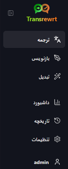
    </td>
    <td valign="top">
        
      <ul>
        <li><strong>ترجمه</strong>: فضای کار ترجمه را باز می‌کند.</li> 
        <li><strong>بازنویسی</strong>: فضای کار بازنویسی را باز می‌کند.</li> 
        <li><strong>تبدیل</strong>: فضای کار دستورات سفارشی را باز می‌کند.</li> 
        <li><strong>داشبورد</strong>: اطلاعات استفاده و هزینه‌ها را نمایش می‌دهد.</li> 
        <li><strong>تنظیمات</strong>: پنل تنظیمات را باز می‌کند.</li> 
        <li><strong>تاریخچه</strong>: تاریخچه استفاده را همراه با متن ورودی و خروجی نشان می‌دهد.</li> 
        <li><strong>کاربر</strong>: نام کاربری کاربر واردشده را نمایش می‌دهد (فقط در نسخه وبی).</li>
      </ul>
    </td>
  </tr>
</table>

 

### نوار ابزار

ظاهر نوار ابزار کمی بسته به اینکه شما در کجای برنامه هستید متفاوت است.

- در سمت چپ، نام صفحه فعلی نشان داده می‌شود.
- در سمت راست، **انتخاب‌کننده مدل** و تنظیم **زبان رابط کاربری** قرار دارد.

با استفاده از **انتخاب‌کننده مدل** می‌توانید موتور هوش مصنوعی مناسب برای کار جاری را انتخاب کنید.

  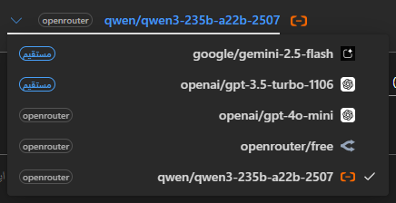

> ℹ️ **نکته** 
> برخی از مدل‌های رایگان ممکن است همیشه در دسترس نباشند — گاهی اوقات این مدل‌ها آفلاین هستند یا سقف مصرف دارند. در این صورت، برنامه به‌طور خودکار آن مدل را از لیست مدل‌های قابل استفاده شما حذف می‌کند. 
> برای مدیریت مدل‌های قابل مشاهده، به [**تنظیمات** > **مدل‌ها**](#models) بروید و لیست مدل‌های خود را ویرایش کنید. 
> همچنین می‌توانید تنظیمات مدل را مستقیماً با کلیک روی آیکون ارائه‌دهنده در سمت چپ نام مدل در نوار ابزار باز کنید.

 

آیکون کره زمین همراه با **کد زبان**، زبان رابط کاربری برنامه را عوض می‌کند؛ مانند فهرست‌ها و دکمه‌ها. این کار **زبان‌های ترجمه** استفاده شده در بخش **ترجمه** را تغییر نمی‌دهد.

  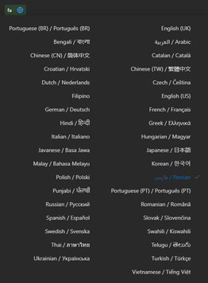

 

### پنل‌های ورودی و خروجی

اغلب فضاهای کاری از یک پنل **ورودی** در سمت چپ و یک پنل **خروجی** در سمت راست استفاده می‌کنند.

پنل **ورودی** شامل موارد زیر است:

- تعداد کاراکترها
- تعداد کلمات
- تعداد پاراگراف‌ها

پنل **خروجی** می‌تواند شامل موارد زیر باشد:

- مدت زمان انجام کار
- هزینه آن کار (در صورت موجود بودن)
- جمع کل هزینه‌های شما
- **TPS** (توکن در ثانیه)
- تعداد کاراکتر، کلمه و پاراگراف
- مدل استفاده شده

اگر در مورد اصطلاحات فنی سؤالی دارید:

- **توکن** یعنی یک تکه کوچک از متن. می‌توانید آن را بخشی از یک کلمه یا یک کلمه کوتاه در نظر بگیرید.
- **TPS** به این معناست که مدل در هر ثانیه چند تا از این تکه‌های متن را پردازش کرده است.

  

[--------------------------------------------------------------------------------------------------------------------------]: # 

## ترجمه

از بخش **ترجمه** زمانی استفاده کنید که بخواهید متنی را از یک زبان به زبان دیگر تبدیل کنید.

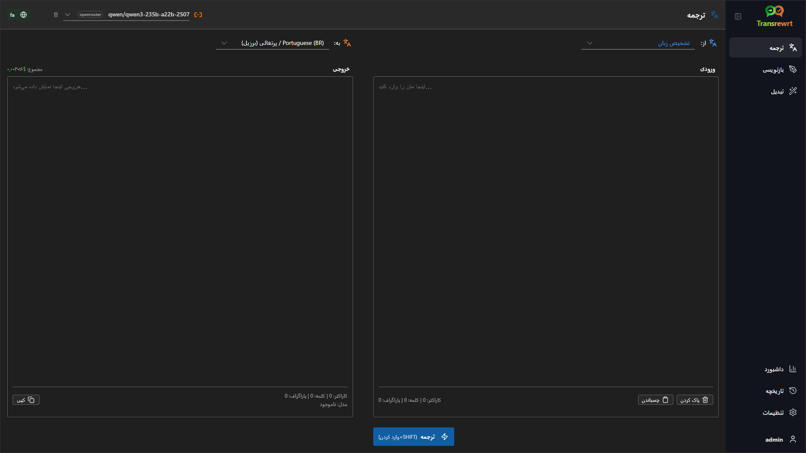

 

### ترجمه متن

1. بخش **ترجمه** را باز کنید.
2. زبانی را در بخش **از** انتخاب کنید.
3. زبانی را در بخش **به** انتخاب کنید.
4. یک مدل را در نوار ابزار انتخاب کنید.
5. متن خود را در پنل **ورودی** تایپ یا قرار دهید.
6. دکمه **ترجمه** را کلیک کنید.
7. نتیجه را در پنل **خروجی** بخوانید.
8. از دکمه کپی استفاده کنید تا نتیجه را کپی کنید.

 

### انتخاب زبان

- بخش **از** می‌تواند شامل یک زبان مشخص یا گزینه **تشخیص زبان** باشد.
- بخش **به** زبانی است که می‌خواهید نتیجه به آن زبان باشد.

زبان‌های **برتر** انتخابی شما در بالای لیست نمایش داده می‌شوند. می‌توانید این زبان‌ها را در بخش [**تنظیمات** > **زبان‌ها**](#languages) تعیین کنید.

 

### تنظیمات مفید ترجمه

در بخش [**تنظیمات** > **تنظیمات عمومی**](#general-settings)، می‌توانید رفتار ترجمه را تغییر دهید:

- **ترجمه خودکار هنگام جای‌گذاری** به محض اینکه متنی را جای‌گذاری کنید، ترجمه را اجرا می‌کند.
- **کپی خودکار نتیجه در حافظه موقت** نتیجه را بلافاصله بعد از اجرای موفق کپی می‌کند.
- **ترجمه لحظه‌ای (در حین تایپ)** در حین تایپ، ترجمه را انجام می‌دهد.
- **زمان‌انتظار (ms)** مشخص می‌کند که برنامه چه مدت منتظر بماند تا ترجمه لحظه‌ای انجام شود.

 

### میانبرهای صفحه کلید

در بخش [**تنظیمات** > **تنظیمات عمومی**](#general-settings)، گزینه **رفتار دکمه ENTER** تعیین می‌کند که هنگام زدن دکمه `Enter` چه اتفاقی بیفتد:

- **Enter** می‌تواند کار را انجام دهد و **Shift+Enter** یک خط جدید اضافه کند.
- یا برنامه می‌تواند عکس این حالت را اعمال کند.

حالت فعلی همچنین روی دکمه **ترجمه** نمایش داده می‌شود.

  

[--------------------------------------------------------------------------------------------------------------------------]: # 

## بازنویسی

از بخش **بازنویسی** زمانی استفاده کنید که بخواهید بیان متن بهبود یابد بدون اینکه معنی اصلی آن تغییر کند.

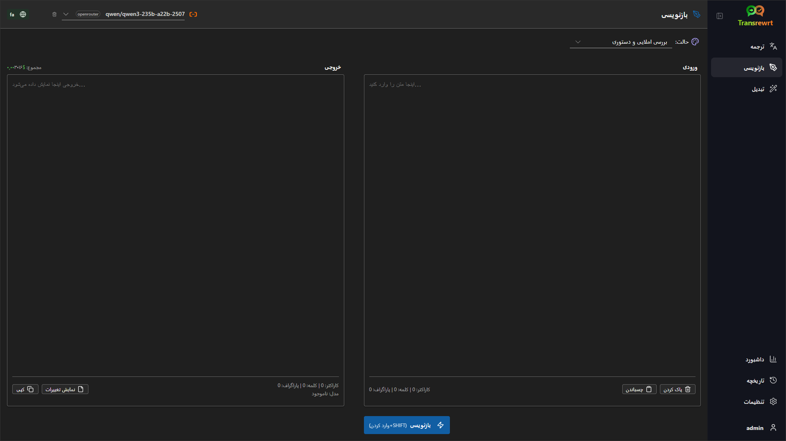

این بخش برای موارد زیر مفید است:

- تصحیح املایی و دستوری
- شفاف‌تر کردن متن
- رسمی یا غیررسمی‌تر کردن متن
- کوتاه یا بلند کردن متن
- تخصصی‌تر کردن لحن متن

 

### بازنویسی متن

1. بخش **بازنویسی** را باز کنید.
2. یک **حالت** انتخاب کنید.
3. یک مدل را در نوار ابزار انتخاب کنید.
4. متن را در بخش **ورودی** تایپ یا جایگذاری کنید.
5. روی دکمهٔ **بازنویسی** کلیک کنید.
6. نتیجه را در بخش **خروجی** بررسی کنید.

رفتار کلید Enter که در [**ترجمه**](#keyboard-shortcuts) توضیح داده شده، در اینجا نیز صدق می‌کند.

 

> 💡 **نکته** 
> وقتی از حالت "**بررسی املایی و دستور زبان**" استفاده می‌کنید، دکمهٔ `نمایش تغییرات` در پنل خروجی ظاهر می‌شود.  
> برای نمایش یا پنهان کردن تغییرات اعمال شده بر متن شما، روی این دکمه کلیک کنید.

  

[--------------------------------------------------------------------------------------------------------------------------]: # 

## تبدیل

از گزینهٔ **تبدیل** زمانی استفاده کنید که بخواهید هوش مصنوعی دستورالعمل‌های سفارشی شما را دنبال کند.

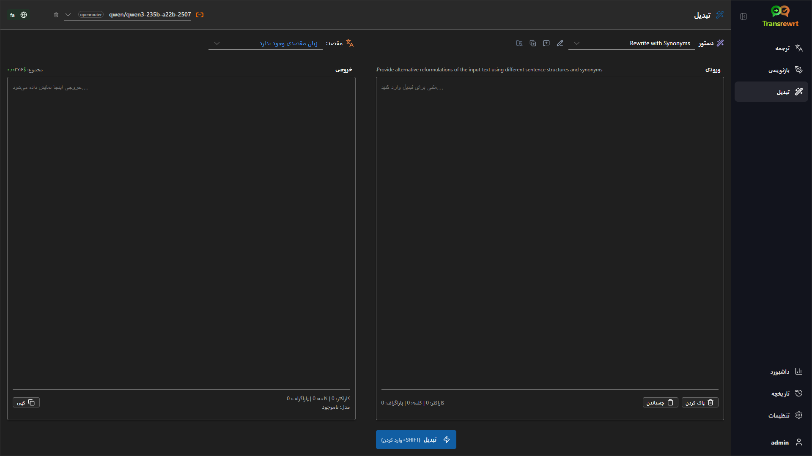

این بخش انعطاف‌پذیرترین قسمت برنامه است. می‌توانید از آن برای کارهایی مانند موارد زیر استفاده کنید:

- خلاصه‌سازی یادداشت‌ها
- تبدیل متن خام به یک ایمیل حرفه‌ای
- استخراج نکات اصلی
- تبدیل متن به یک قالب خاص

 

### اجرای یک دستور پیش‌ساخته

1. بخش **تبدیل** را باز کنید.
2. یک دستور از لیست دستورها انتخاب کنید.
3. اگر کادر **زبان مقصد** ظاهر شد، در صورت تمایل یک زبان انتخاب کنید.
4. متن را در بخش **ورودی** تایپ یا جایگذاری کنید.
5. روی دکمهٔ **تبدیل** کلیک کنید.
6. نتیجه را در بخش **خروجی** بخوانید.

 

### در صورت نداشتن دستوری

اگر لیست دستورهای شما خالی است، روی **بارگذاری دستورهای نمونه** کلیک کنید. این کار نمونه‌های پیش‌فرضی اضافه می‌کند تا بتوانید سریع‌تر شروع کنید.

 

> ℹ️ **توجه** 
> دستورهای نمونه به زبان انگلیسی ارائه شده‌اند. پس از بارگذاری آن‌ها، می‌توانید دستور را ویرایش کرده و از **ترجمهٔ دستور** برای ترجمه به زبان خود استفاده کنید.

 

### ایجاد سریع یک دستور

سریع‌ترین روش برای ساخت یک دستور به صورت زیر است:

1. روی **دستور جدید** کلیک کنید.
2. روی **ایجاد دستور** کلیک کنید.
3. توضیح دهید که می‌خواهید دستور چه کاری انجام دهد.
4. یک مدل انتخاب کنید.
5. اجازه دهید برنامه یک پیش‌نویس برای شما ایجاد کند.
6. پیش‌نویس را بررسی کرده و روی **ذخیره** کلیک کنید.

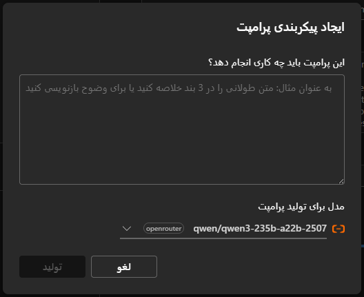

 

### ویرایش یک دستور

وقتی یک دستور می‌سازید یا ویرایش می‌کنید، ویرایشگر در سمت چپ و یک فضای تست در سمت راست ظاهر می‌شود.

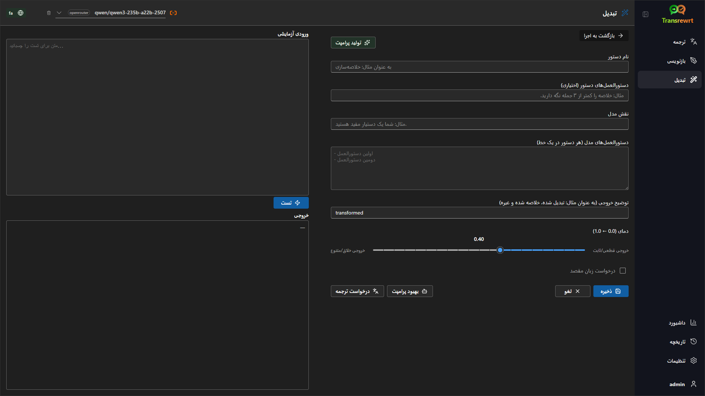

فیلدهای اصلی عبارتند از:

- **نام دستور**: نامی که در لیست دستورها نمایش داده می‌شود.
- **دستورات دستور (اختیاری)**: یک راهنمای کوتاه که هنگام اجرای دستور به کاربر نشان داده می‌شود.
- **نقش مدل**: نقش کلی داده شده به هوش مصنوعی، مثلاً 'شما یک دستیار مفید هستید.'
- **دستورات مدل (یکی در هر خط)**: قوانین خاصی که می‌خواهید هوش مصنوعی دنبال کند.
- **توضیح خروجی**: یک کلمهٔ کوتاه برای توصیف نتیجه، مثلاً 'خلاصه' یا 'بازنویسی'.
- **دما (0.0 → 1.0)**: نحوهٔ رفتار مدل؛ بیشتر زیر را ببینید.
- **درخواست زبان مقصد**: افزودن یک کادر انتخاب زبان مقصد هنگام اجرای دستور.

اگر اصطلاح فنی **دما** برای شما جدید است، آن را اینگونه در نظر بگیرید:

- **دماهای پایین‌تر** نتایج پایدارتر و قابل پیش‌بینی‌تری تولید می‌کنند.
- **دماهای بالاتر** تنوع و خلاقیت بیشتری در نتایج ایجاد می‌کند.

همچنین می‌توانید از موارد زیر استفاده کنید:

- **`ایجاد دستور`** برای ساخت یک پیش‌نویس جدید از یک توضیح ساده
- **`بهبود دستور`** برای اصلاح یک دستور موجود
- **`ترجمهٔ دستور`** برای ترجمهٔ فیلدهای دستور

 

> ⚠️ **هشدار** 
> قبل از کلیک روی **`بازگشت به اجرا`**، حتماً روی **`ذخیره`** کلیک کنید. اگر بدون ذخیره بازگردید، تغییرات شما از دست خواهد رفت.

 

### آزمایش یک دستور قبل از استفاده

پنل آزمایش در سمت راست به شما اجازه می‌دهد قبل از استفاده از دستور در کارهای روزمره، آن را با یک متن نمونه امتحان کنید.

این کار در موارد زیر مفید است:

- هنگام ساخت یک دستور جدید
- هنگام مقایسهٔ دو نسخه از یک دستور
- هنگامی که می‌خواهید لحن، طول یا قالب خروجی را بررسی کنید

 

### مدیریت دستورهای ذخیره شده

برای مدیریت دستورهای ذخیره شده در یک محل، بخش [**تنظیمات** > **دستورهای تبدیل**](#transform-prompts) را باز کنید.

در آنجا می‌توانید:

- دستورهای خود را فهرست و حذف کنید
- دستورها را به صورت **JSON**، **CSV** یا **XLSX** صادر کنید
- دستورها را از یک فایل وارد کنید

  

[--------------------------------------------------------------------------------------------------------------------------]: # 

## داشبورد

از **داشبورد** برای مشاهده میزان استفاده از این برنامه و هزینه آن (برای مدل‌های پولی) استفاده کنید.

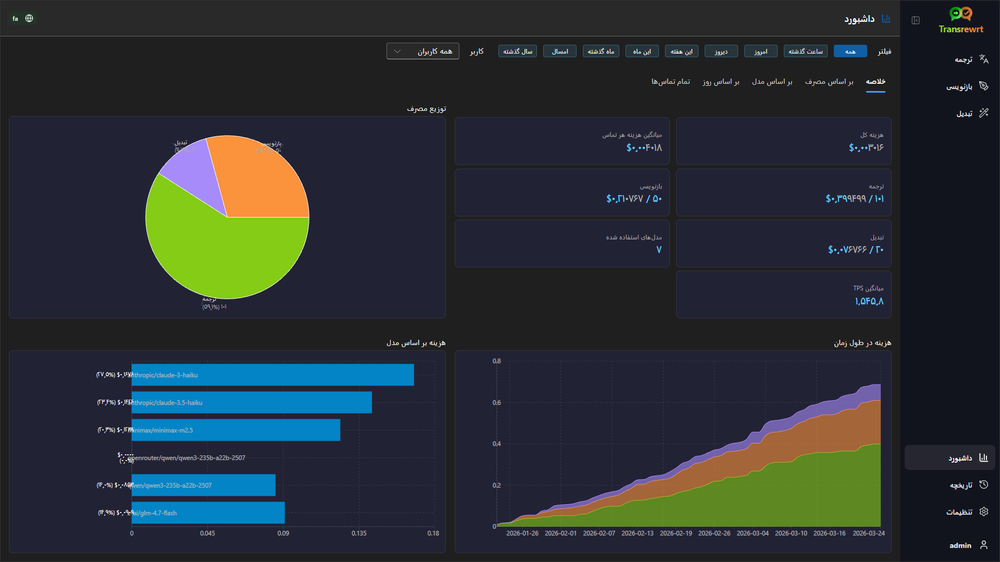

 

> ℹ️ **توجه** 
> اگر فقط از مدل‌های رایگان استفاده کنید، نمودارهای مربوط به هزینه خالی خواهند بود.

 

### فیلتر کردن داده‌ها

برای تغییر بازه زمانی، از دکمه‌های فیلتر در بالای صفحه استفاده کنید.

 

> ℹ️ **توجه** 
> فیلتر **کاربر** فقط در نسخه وب و برای مدیران قابل مشاهده است. کاربران عادی این فیلتر را نمی‌بینند و در نسخه دسکتاپ نیز در دسترس نیست.

 

### تب‌های داشبورد

- **خلاصه** یک نمای کلی از میزان استفاده و هزینه ارائه می‌دهد.
- **بر اساس استفاده** فعالیت را بر اساس زبان ترجمه، حالت بازنویسی و دستور تبدیل تجزیه می‌کند.
- **بر اساس مدل** نشان می‌دهد از کدام مدل‌ها استفاده کرده‌اید و هزینه آن‌ها چقدر بوده است.
- **بر اساس روز** مجموع فعالیت‌ها در هر روز را نشان می‌دهد.
- **تمامی فراخوانی‌ها** کل تاریخچه فراخوانی‌ها را نشان می‌دهد و امکان خروجی گرفتن از آن را فراهم می‌کند.

 

### خروجی گرفتن از داده‌ها

امکان صدور داده‌ها از جداول داشبورد در قالب‌های زیر وجود دارد:

- **JSON**
- **CSV**
- **XLSX**

این ویژگی در صورتی مفید است که بخواهید فعالیت‌ها را خارج از برنامه بررسی کرده یا گزارشی را به اشتراک بگذارید.

 

### حذف رکوردهای ذخیره‌شده یک مدل

در تب **بر اساس مدل** یا **تمامی فراخوانی‌ها**، می‌توانید رکوردهای ذخیره‌شده یک مدل را با کلیک روی آیکون "سبد زباله" حذف کنید.

> ⚠️ **هشدار** 
> حذف رکوردهای ذخیره‌شده قابل بازگشت نیست. فقط در صورتی از این کار اطمینان دارید که دیگر به آن تاریخچه نیاز ندارید.

برای حذف تمام داده‌ها یا حذف رکوردها بر اساس مدت زمان، به بخش [**تنظیمات** > **پیگیری هزینه**](#cost-tracking) بروید. در اینجا گزینه‌هایی برای حذف تمام داده‌های ذخیره‌شده یا فقط داده‌های قدیمی‌تر از یک تاریخ مشخص در دسترس است.

  

[--------------------------------------------------------------------------------------------------------------------------]: # 

## تاریخچه

برای مشاهده تاریخچه عملکردهای خود درون **Transrewrt**، از جمله ورودی و خروجی هر عملیات، روی گزینه **تاریخچه** کلیک کنید.

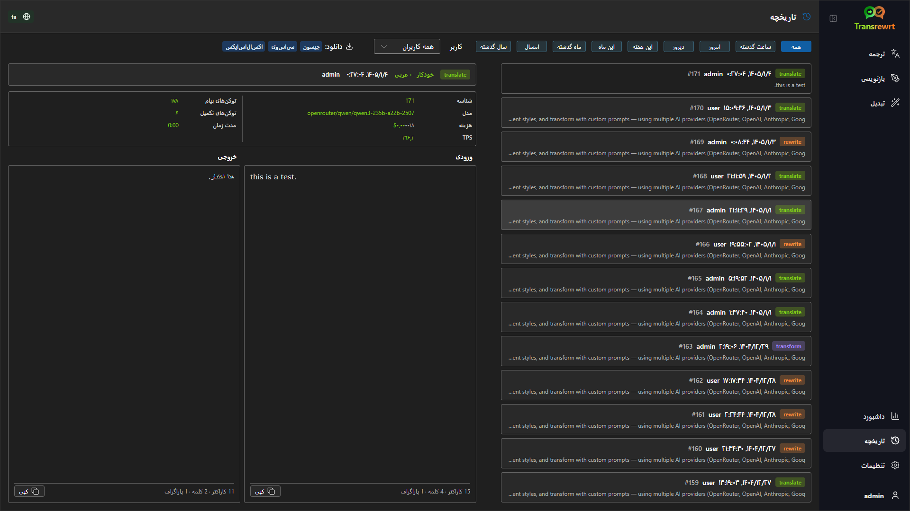

 

### فیلتر کردن تاریخچه

صفحه **تاریخچه** از همان فیلترهای صفحه **داشبورد** استفاده می‌کند. برای انتخاب محدوده زمانی، از این فیلترها استفاده کنید.

 

> ℹ️ **توجه** 
> فیلتر **کاربر** فقط در نسخه وب و برای مدیران قابل مشاهده است. کاربران عادی این فیلتر را نمی‌بینند و در نسخه دسکتاپ نیز در دسترس نیست.

 

### خروجی گرفتن از تاریخچه

صفحه تاریخچه امکان خروجی گرفتن از داده‌های فیلترشده را در قالب‌های زیر فراهم می‌کند:

- **JSON**
- **CSV**
- **XLSX**

این ویژگی در صورتی مفید است که بخواهید فعالیت‌ها را خارج از برنامه بررسی کرده یا گزارشی را به اشتراک بگذارید.

  

[--------------------------------------------------------------------------------------------------------------------------]: # 

## تنظیمات

از طریق نوار کناری، گزینه **تنظیمات** را باز کنید تا رفتار برنامه را سفارشی کنید.

تب‌های در دسترس بسته به پلتفرم و نقش شما متفاوت است:

  | تب                  | دسکتاپ | وب (مدیر) | وب (کاربر عادی) |
  |--------------------|:------:|:--------:|:-------------:|
  | تنظیمات عمومی       |   بله   |    بله    |      بله       |
  | مدل‌ها              |   بله   |    بله    |      بله       |
  | زبان‌ها             |   بله   |    بله    |      بله       |
  | پیگیری هزینه        |   بله   |    بله    |       —       |
  | دستورات تبدیل       |   بله   |    بله    |      بله       |
  | کاربران             |   —    |    بله    |       —       |
  | تنظیمات API         |   بله   |    بله    |       —       |
  | درباره              |   بله   |    بله    |      بله       |

 

> ℹ️ **توجه** 
> در نسخه وب، هر کاربر تنظیمات خاص خود را دارد. تنظیماتی مانند مدل‌های انتخابی، زبان‌ها، گزینه‌های عمومی و دستورات تبدیل به صورت جداگانه برای هر کاربر ذخیره می‌شوند. تغییرات اعمال‌شده توسط شما بر دیگر کاربران تأثیر نمی‌گذارند.

 

[--------------------------------------------------------------------------------------------------------------------------]: # 

### تنظیمات عمومی

از **تنظیمات عمومی** برای کنترل رفتار تایپ، ذخیره‌سازی جزئیات اجرا برای **تاریخچه** و همچنین ظاهر استفاده کنید.

**رفتار**

- **رفتار دکمه ENTER** مشخص می‌کند که فشردن `Enter` آیا وظیفه را اجرا می‌کند یا یک خط جدید وارد می‌کند.
- **ترجمه خودکار هنگام چسباندن** به محض چسباندن متن، فرآیند ترجمه را شروع می‌کند.
- **کپی خودکار نتیجه در حافظه موقت** به صورت خودکار نتایج موفق را کپی می‌کند.
- **ترجمه لحظه‌ای (در حین تایپ)** در هنگام تایپ، ترجمه انجام می‌شود.
- **مهلت زمانی (میلی‌ثانیه)** زمان انتظار برای ترجمه لحظه‌ای را تنظیم می‌کند.

**تاریخچه**

- **حفظ تاریخچه اجرا** مشخص می‌کند که آیا هر ترجمه، بازنویسی و تبدیل، **متن ورودی و خروجی** را برای نمایش در **تاریخچه** نوار کناری ذخیره کند یا نه. غیرفعال کردن این گزینه درخواست تأیید می‌کند؛ و در صورت تأیید، متن‌های ذخیره‌شده از پایگاه داده حذف خواهند شد.
- **حذف داده‌های تاریخچه** به شما امکان می‌دهد تا متن‌های ذخیره‌شده را بر اساس سن (مثلاً قدیمی‌تر از چند ماه، یا **همه داده‌ها (پاک کردن)**) با استفاده از گزینه **حذف داده**، حذف کنید. این کار تنها بر روی متن‌های اجرای ذخیره‌شده برای نمایش **تاریخچه** تأثیر می‌گذارد و **بر روی** مجموع کل هزینه و مصرف تأثیر نمی‌گذارد. برای حذف یا کاهش داده‌های **هزینه** از [**تنظیمات** > **پیگیری هزینه**](#cost-tracking) استفاده کنید.

**ظاهر**

- **تعداد ارقام اعشار هزینه** نحوه نمایش اعشار هزینه را تغییر می‌دهد.
- **فقط وب:** **نمایش حاشیه دور برنامه** فضای اضافی اطراف رابط کاربری را ایجاد می‌کند.
- **خانواده فونت** فونت متن در پنل‌های ویرایش را تغییر می‌دهد.
- **اندازه** اندازه فونت را تغییر می‌دهد.

 

### مدل‌ها

از **تنظیمات** > **مدل‌ها** برای انتخاب مدل‌هایی که در نوار ابزار نمایش داده می‌شوند استفاده کنید.

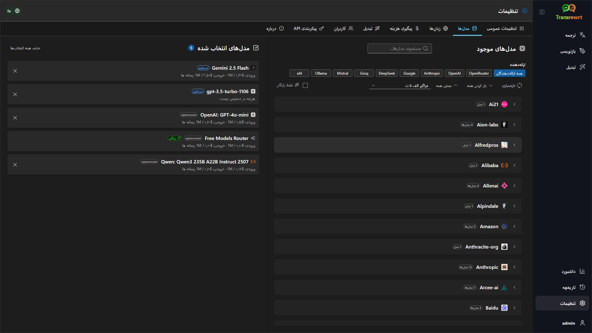

این صفحه دارای دو لیست است:

- **مدل‌های موجود** در سمت چپ
- **مدل‌های انتخاب‌شده** در سمت راست

کنترل‌های مفید شامل:

- **جستجوی مدل‌ها...** برای یافتن مدل بر اساس نام
- چیپ‌های **فراهم‌کننده** برای محدود کردن لیست به یک موتور (OpenRouter، OpenAI، Ollama و ...)
- **فقط رایگان** فقط مدل‌های رایگان را نمایش می‌دهد
- **بارگذاری مجدد** برای بازنشانی لیست
- **گسترش همه** و **جمع‌کردن همه** هنگام مرتب‌سازی بر اساس فراهم‌کننده

شناسه مدل‌ها شامل پیشوند فراهم‌کننده است (به عنوان مثال `openrouter/…` در مقابل `openai/…`). نشان‌هایی مانند **OpenAI (OpenRouter)** در مقابل **OpenAI (مستقیم)** نحوه مسیریابی ترافیک را نشان می‌دهند.

اعمال:

 - برای افزودن یک مدل، روی **افزودن** یا هر کجا در مدخل کلیک کنید.

 - برای حذف یک مدل، روی **X** کنار آن در بخش **مدل‌های انتخاب‌شده** یا روی **انتخاب شده** در مدخل مدل در بخش مدل‌های موجود کلیک کنید.

 - برای پاک کردن لیست، روی **لغو انتخاب همه** کلیک کنید. مدل رایگان ضروری در لیست باقی خواهد ماند.

 

> ℹ️ **توجه** 
> اگر قصد ندارید بلافاصله اعتبار به OpenRouter اضافه کنید، با فعال‌سازی گزینه **فقط رایگان** و انتخاب مدل‌های رایگان (بدون نیاز به کارت اعتباری) شروع کنید. همچنین می‌توانید از Ollama برای اجرای مدل‌ها به صورت محلی بدون کلید API استفاده کنید.

 

### زبان‌ها

از **تنظیمات** > **زبان‌ها** برای سازمان‌دهی فهرست زبان‌های استفاده‌شده در برنامه استفاده کنید.

- **زبان‌های برتر** در بالای فهرست زبان‌ها در **ترجمه** و **تبدیل** ثابت شده‌اند.
- **زبان سفارشی** به شما اجازه می‌دهد زبانی را که در لیست پیش‌فرض وجود ندارد، اضافه کنید.

اگر یک زبان سفارشی اضافه کنید، در انتخاب‌کننده‌های زبان در کنار گزینه‌های پیش‌فرض نمایش داده خواهد شد.

 

### پیگیری هزینه

از **تنظیمات** > **پیگیری هزینه** برای مدیریت اطلاعات هزینه استفاده کنید.

- **هزینه کل** مجموع جاری را نشان می‌دهد.
- **کپی مقدار** کل مبلغ را در حافظه موقت کپی می‌کند.
- **بازنشانی هزینه** مجموع ذخیره‌شده را به صفر بازمی‌گرداند.
- **هماهنگ‌سازی با مصرف کلید API** مجموع را با مصرف گزارش‌شده توسط حساب OpenRouter شما تطبیق می‌دهد (فقط OpenRouter).
- **مصرف کلید API** جزئیات مصرف OpenRouter را در صورت در دسترس بودن نمایش می‌دهد.
- **حذف داده‌های هزینه** تمام داده‌ها یا فقط موارد قدیمی‌تر از یک تاریخ مشخص را حذف می‌کند.

**پیگیری هزینه:** هنگامی که از مدل‌های OpenRouter استفاده می‌کنید، برنامه مصرف واقعی و هزینه شما را بر اساس داده‌های OpenRouter نمایش می‌دهد. برای تمام فراهم‌کنندگان دیگر، برنامه هزینه‌ها را بر اساس قیمت‌های منتشر‌شده توسط OpenRouter تخمین می‌زند. اگر قیمتی در دسترس نباشد، تخمین ممکن است صفر باشد.

 

> ℹ️ **توجه** 
> تمام ارقام هزینه فقط برای مرجع شما هستند و صورت‌حساب رسمی محسوب نمی‌شوند.

 

> ⚠️ **هشدار** 
> حذف داده‌ها قابل بازگردانی نیست. قبل از حذف، مطمئن شوید که داده‌ها را پشتیبانی کرده یا از طریق [**داشبورد** > **تمام فراخوانی‌ها**](#dashboard-tabs) خارج کرده‌اید، در غیر این صورت این داده‌ها به صورت دائمی از بین خواهند رفت.   
> تمام تاریخچه‌های مرتبط با هر مدخل فراخوانی API نیز حذف خواهند شد.

 

### تبدیل پُرامپت‌ها

برای مدیریت گروهی پرامپت‌ها از مسیر **تنظیمات** > **تبدیل پُرامپت‌ها** استفاده کنید.

شما می‌توانید:

- پرامپت‌های ذخیره شده خود را مرور کنید
- پرامپت‌ها را حذف کنید
- پرامپت‌ها را از یک فایل وارد کنید
- پرامپت‌ها را برای پشتیبان‌گیری یا اشتراک‌گذاری خارج کنید

 

### کاربران

**وب: فقط مدیر سیستم**

از بخش **کاربران** برای مدیریت حساب‌های کاربری در نسخه وب استفاده کنید. شما می‌توانید کاربران را اضافه کنید، اطلاعات آن‌ها را به‌روز کنید، گذرواژه‌هایشان را بازنشانی کنید و حساب‌هایشان را حذف کنید.

 

### پیکربندی API

ارائه‌دهندگان پشتیبانی شده عبارتند از: OpenRouter، OpenAI، Anthropic، Google Gemini، DeepSeek، Groq، Mistral، xAI و **Ollama** (مدل‌های محلی از طریق یک URL پایه). تنها نیاز دارید تا ارائه‌دهندگانی که از آن‌ها استفاده می‌کنید را پیکربندی کنید.

**برنامه وب: فقط مدیر سیستم**

کلیدهای API از طریق متغیرهای محیطی سیستم یا داکر پیکربندی می‌شوند — این کلیدها در رابط کاربری وب وارد نمی‌شوند. این صفحه نشان می‌دهد که کدام ارائه‌دهندگان دارای کلید پیکربندی شده هستند و امکان آزمون هر کدام با کلیک روی دکمه **`آزمون`** را فراهم می‌کند.

 

> ℹ️ **توجه** 
> برای تغییر یک کلید API، باید متغیر محیطی را در پیکربندی سیستم یا داکر به‌روز کرده و سرور یا کانتینر را مجدداً راه‌اندازی کنید.

 

**برنامه دسکتاپ**

از بخش **پیکربندی API** برای ذخیره کلیدهای API هر ارائه‌دهنده‌ای که از آن استفاده می‌کنید استفاده کنید. در مورد Ollama، به جای کلید API، **URL پایه** را وارد کنید.

 

> 💡 **نکته**  
> اگر نمی‌خواهید از کلید API استفاده کنید یا هزینه بپردازید، می‌توانید [Ollama را دانلود کنید](https://ollama.com) و به صورت رایگان مدل‌ها را روی دستگاه خود اجرا کنید. یا می‌توانید یک حساب رایگان OpenRouter بسازید (بدون نیاز به کارت اعتباری) و از مدل‌های رایگان آن استفاده کنید.

- تنها ارائه‌دهندگانی را اضافه کنید که به آن‌ها نیاز دارید. در بخش **تنظیمات** > **مدل‌ها**، هر شناسه مدل با نام ارائه‌دهنده شروع می‌شود (مثلاً `openrouter/openrouter/free`، `openai/gpt-4o`، `ollama/llama3`).

برای افزودن یک کلید API، مقدار آن را در کادر متنی تایپ کرده و روی **`ذخیره`** کلیک کنید. برای جایگزینی یک کلید موجود، روی **`ویرایش`** کلیک کنید. برای بررسی اینکه کلید درست کار می‌کند یا نه، روی **`آزمون`** کلیک کنید.

 

> ℹ️ **توجه** 
> شما نمی‌توانید مقدار فعلی یک کلید API را مشاهده کنید. تنها می‌توانید آن را با استفاده از دکمه **`ویرایش`** جایگزین کنید.
> کلیدهای API به صورت رمزگذاری شده در فایل پیکربندی ذخیره می‌شوند.

 

برای مراحل دقیق‌تر دریافت کلید OpenRouter، بخش [نحوه دریافت یک کلید API](#how-to-get-an-api-key-desktop-app) بالا را ببینید.

 

### درباره

زبانه **درباره** اطلاعات زیر را نمایش می‌دهد:

- نام برنامه
- شماره نسخه
- تاریخ ساخت
- پیوند به مخزن پروژه

  

## مشکلات متداول

اگر چیزی همان‌طور که انتظار می‌رود کار نمی‌کند، ابتدا موارد زیر را بررسی کنید.

 

### برنامه متن را ترجمه، بازنویسی یا تبدیل نمی‌کند

مطمئن شوید:

- یک مدل را در نوار ابزار انتخاب کرده‌اید
- حداقل یک مدل در [**تنظیمات** > **مدل‌ها**](#models) لیست شده است
- تنظیم API شما به درستی کار می‌کند

اگر از نسخه دسکتاپ استفاده می‌کنید:

1. وارد [**تنظیمات** > **پیکربندی API**](#api-config) شوید.
2. بررسی کنید که حداقل یک کلید API ذخیره شده باشد.
3. روی دکمه **آزمون** کنار ارائه‌دهنده کلیک کنید تا اطمینان حاصل کنید کلید صحیح کار می‌کند.

 

### لیست مدل خالی است

به [**تنظیمات** > **مدل‌ها**](#models) بروید و روی **تازه‌سازی** کلیک کنید.

در صورت نیاز:

- یک مدل را جستجو کنید
- گزینه **فقط رایگان** را فعال کنید
- یک یا چند مدل را به بخش **مدل‌های انتخاب شده** اضافه کنید

 

### نتیجه بسیار کند یا هزینه‌بر است

یک یا چند مورد از موارد زیر را امتحان کنید:

- یک مدل متفاوت انتخاب کنید
- ورودی کوتاه‌تری ارائه دهید
- گزینه **ترجمه لحظه‌ای (در حین تایپ)** را در [**تنظیمات** > **تنظیمات عمومی**](#general-settings) خاموش کنید
- برای وظایف ساده از مدل‌های رایگان استفاده کنید (به بخش [مدل‌ها](#models) مراجعه کنید)

 

### رابط به زبان اشتباه است

روی آیکون کره زمین در [نوار ابزار](#toolbar) کلیک کرده و **زبان رابط** مورد نظر خود را انتخاب کنید.

 

### متن خیلی کوچک یا خواندنی نیست

به [**تنظیمات** > **تنظیمات عمومی**](#general-settings) بروید و موارد زیر را تغییر دهید:

- **خانواده قلم**
- **اندازه**

 

### نمودارهای داشبورد خالی هستند

این امر در شرایط زیر طبیعی است:

- فقط از **مدل‌های رایگان** استفاده می‌کنید (نمودارهای هزینه خالی می‌مانند)
- **فیلتر زمانی** انتخاب شده شامل دوره‌ای که در آن درخواست‌ها ارسال شده‌اند نیست — گزینه **همه** را امتحان کنید تا بررسی کنید

اگر پس از انتخاب **همه** همچنان نمودارها خالی بودند، مطمئن شوید که درخواست‌ها در بخش [**تاریخچه**](#history) یا زبانه **همه درخواست‌ها** نمایش داده می‌شوند.

 

### هزینه نمایش داده شده «در دسترس نیست» یا اشتباه به نظر می‌رسد

هنگامی که از مدل‌ها از طریق **OpenRouter** استفاده می‌کنید، اپلیکیشن میزان مصرف واقعی شما را که توسط OpenRouter گزارش شده نمایش می‌دهد.

برای **سایر ارائه‌دهندگان** (مثل OpenAI مستقیم، Anthropic مستقیم و غیره)، هزینه بر اساس اطلاعات قیمت‌گذاری منتشر شده توسط OpenRouter تخمین زده می‌شود. اگر قیمتی برای یک مدل یافت نشود، هزینه به صورت **در دسترس نیست** نمایش داده خواهد شد و به مجموع هزینه شما اضافه نخواهد شد.

 

### مجموع هزینه با قبض ارائه‌دهنده من مطابقت ندارد

تمام اعداد و ارقام هزینه در اپلیکیشن **فقط برای مرجع و تخمینی** هستند و بیانیه صورتحساب رسمی محسوب نمی‌شوند.

برای نزدیک‌تر کردن مجموع به مبلغ واقعی مصرف شده در OpenRouter، بخش [**تنظیمات** > **پیگیری هزینه**](#cost-tracking) را باز کنید و روی گزینه **همگام‌سازی با میزان استفاده از کلید API** کلیک کنید.

 

### صفحه تاریخچه در نوار کناری نمایش داده نمی‌شود

ممکن است گزینه **ذخیره تاریخچه اجرا** غیرفعال باشد. بخش [**تنظیمات** > **تنظیمات عمومی**](#general-settings) را باز کنید و آن را فعال نمایید. توجه داشته باشید که فعال کردن این گزینه، داده‌های تاریخچه حذف شده قبلی را بازیابی نمی‌کند.

 

### اپلیکیشن تحت وب: به صورت غیرمنتظره به صفحه ورود هدایت می‌شوید

ممکن است جلسه کاری شما منقضی شده باشد. دوباره وارد شوید. اگر این اتفاق اغلب رخ دهد، تنظیمات عمر جلسه (session lifetime) در سرور را بررسی کنید.

 

### داشبورد داده‌ای برای سایر کاربران نمایش نمی‌دهد (وب)

فقط **مدیران** می‌توانند از طریق فیلتر **کاربر**، داده‌های تمام کاربران را مشاهده کنند. کاربران عادی به‌طور پیش‌فرض فقط فعالیت خود را می‌بینند.

 

### ویرایش یک پِرامپت را انجام دادم و تغییرات را از دست دادم

هنگام ویرایش یک پِرامپت، همیشه قبل از کلیک روی گزینه **بازگشت به اجرا**، بر روی **ذخیره** کلیک کنید.

  

## نکات سریع

- با [**ترجمه**](#translate) شروع کنید تا از صحت تنظیمات خود اطمینان حاصل کنید، قبل از اینکه به سراغ [**بازنویسی**](#rewrite) یا [**تبدیل**](#transform) بروید.
- از [**بازنویسی**](#rewrite) برای بهبودهای روزمره متن استفاده کنید.
- از [**تبدیل**](#transform) هنگامی استفاده کنید که نیاز به یک فرآیند قابل تکرار برای یک وظیفه خاص دارید.
- از [**داشبورد**](#dashboard) استفاده کنید اگر می‌خواهید مصرف و هزینه را زیر نظر داشته باشید.
- از [**تاریخچه**](#history) برای مرور عملیات قبلی و متن کامل ورودی/خروجی آنها استفاده کنید.
- پرامپت‌ها را به‌طور منظم خارج کنید (Export) اگر دارید یک کتابخانه پرامپت می‌سازید که می‌خواهید از آن محافظت کنید (به بخش [تبدیل پرامپت‌ها](#transform-prompts) مراجعه کنید) یا اگر می‌خواهید آن را با دیگران به اشتراک بگذارید.

  

## سخن آخر

نام‌ها و آیکون‌های محصولات متعلق به مالکان خود بوده و فقط برای اهداف شناسایی استفاده شده‌اند. این نرم‌افزار با هیچ یک از برندهای ذکر شده همکاری یا وابستگی رسمی ندارد و توسط آنها تأیید نشده است.

  

## مجوز

کپی‌رایت © ۲۰۲۶ والدمر اسکودلر جونیور

[مجوز آپاچی نسخه ۲.۰](LICENSE)