<a id="transrewrt-user-guide"></a>
# Guide de l'utilisateur

<br/>

<a id="introduction"></a>
## Introduction

Transrewrt vous aide à travailler avec le texte de trois manières principales :

- **Traduire** - convertir un texte d'une langue à une autre.
- **Réécriture** - reformuler un texte dans un style différent, par exemple plus clair, plus court ou plus formel.
- **Transformer** - traiter un texte à l'aide d'instructions personnalisées d'intelligence artificielle appelées prompts.

Par défaut, l'application fonctionne en mode **Facile** : vous choisissez un **préréglage** (par exemple Gratuit (OpenRouter), Standard, Avancé ou Technique) et un **fournisseur** dans les Paramètres, sans choisir d'ID de modèle. Passez en mode **Avancé** dans [**Paramètres** > **Paramètres généraux**](#general-settings) si vous souhaitez la liste classique des modèles depuis [**Paramètres** > **Modèles**](#models).

<br/>

Ce guide explique comment utiliser l'application une fois installée et en cours d'exécution. Pour les étapes d'installation, consultez le fichier [**README**](README.fr.md) principal.

<br/>

> ℹ️ **REMARQUE**<br/>
> Transrewrt est disponible en tant qu'application de bureau pour Windows et Linux, et en tant qu'application web auto-hébergée. Ce guide se concentre sur l'utilisation courante de l'application. Lorsqu'une information ne s'applique qu'à une seule version, cela est clairement indiqué.

<small>**Lire dans d'autres langues :** </small>
<small id="lang-list">[English (GB)](../USER-GUIDE.md) · [Português (Brasil)](./USER-GUIDE.pt-BR.md) · [العربية](./USER-GUIDE.ar.md) · [বাংলা](./USER-GUIDE.bn.md) · [Català](./USER-GUIDE.ca.md) · [中文 (中国大陆)](./USER-GUIDE.zh-CN.md) · [中文 (台灣)](./USER-GUIDE.zh-TW.md) · [Hrvatski](./USER-GUIDE.hr.md) · [Čeština](./USER-GUIDE.cs.md) · [Nederlands](./USER-GUIDE.nl.md) · [English (US)](./USER-GUIDE.en-US.md) · [Tagalog](./USER-GUIDE.tl.md) · [Français](./USER-GUIDE.fr.md) · [Deutsch](./USER-GUIDE.de.md) · [Ελληνικά](./USER-GUIDE.el.md) · [हिन्दी](./USER-GUIDE.hi.md) · [Magyar](./USER-GUIDE.hu.md) · [Italiano](./USER-GUIDE.it.md) · [日本語](./USER-GUIDE.ja.md) · [한국어](./USER-GUIDE.ko.md) · [Bahasa Melayu](./USER-GUIDE.ms.md) · [فارسی](./USER-GUIDE.fa.md) · [Polski](./USER-GUIDE.pl.md) · [Basa Jawa](./USER-GUIDE.jv.md) · [Português](./USER-GUIDE.pt.md) · [ਪੰਜਾਬੀ](./USER-GUIDE.pa.md) · [Română](./USER-GUIDE.ro.md) · [Русский](./USER-GUIDE.ru.md) · [Slovenčina](./USER-GUIDE.sk.md) · [Español](./USER-GUIDE.es.md) · [Kiswahili](./USER-GUIDE.sw.md) · [Svenska](./USER-GUIDE.sv.md) · [తెలుగు](./USER-GUIDE.te.md) · [ไทย](./USER-GUIDE.th.md) · [Türkçe](./USER-GUIDE.tr.md) · [Українська](./USER-GUIDE.uk.md) · [Tiếng Việt](./USER-GUIDE.vi.md)</small>

<small>

> **Remarque sur les traductions de l'interface et de la documentation :** Toutes les langues de l'interface, sauf l'anglais (Royaume-Uni) d'origine, 
> ont été traduites à l'aide de modèles d'IA ; le libellé peut être imprécis ou contenir des erreurs.

</small>

<br/>

<!-- START doctoc generated TOC please keep comment here to allow auto update -->
<!-- DON'T EDIT THIS SECTION, INSTEAD RE-RUN doctoc TO UPDATE -->
**Table des matières**

- [Avant de commencer](#before-you-start)
  - [Comment obtenir une clé API OpenRouter gratuite (application de bureau)](#how-to-get-a-free-openrouter-api-key-desktop-app)
- [Premiers pas](#getting-started)
- [Principales parties de la fenêtre](#main-parts-of-the-window)
  - [Barre latérale](#sidebar)
  - [Barre d'outils](#toolbar)
  - [Panneaux d'entrée et de sortie](#input-and-output-panels)
- [Traduire](#translate)
  - [Traduire le texte](#translate-text)
  - [Sélection de la langue](#language-selection)
  - [Paramètres de traduction utiles](#helpful-translation-settings)
  - [Affiner votre traduction](#refining-translation)
- [Réécriture](#rewrite)
- [Transformation](#transform)
  - [Exécuter une invite existante](#run-an-existing-prompt)
  - [Si vous n'avez pas encore d'invites](#if-you-have-no-prompts-yet)
  - [Créer une invite rapidement](#create-a-prompt-quickly)
  - [Modifier une invite](#edit-a-prompt)
  - [Tester une invite avant de l'utiliser](#test-a-prompt-before-using-it)
- [Tableau de bord](#dashboard)
  - [Filtrer les données](#filter-the-data)
  - [Onglets du tableau de bord](#dashboard-tabs)
  - [Exporter les données](#export-data)
  - [Supprimer les enregistrements stockés pour un modèle](#delete-stored-records-for-a-model)
- [Historique](#history)
  - [Filtrer l'historique](#filter-the-history)
  - [Exporter les données d'historique](#export-history-data)
- [Paramètres](#settings)
  - [Paramètres généraux](#general-settings)
  - [Modèles](#models)
  - [Langues](#languages)
  - [Suivi des coûts](#cost-tracking)
  - [Transformation (onglet des paramètres)](#transform-settings-tab)
  - [Utilisateurs](#users)
  - [Config. API](#api-config)
  - [À propos](#about)
- [Problèmes courants](#common-issues)
  - [L'application ne traduira, ne réécrira ou ne transformera pas le texte](#the-app-will-not-translate-rewrite-or-transform-text)
  - [La liste des modèles est vide](#the-model-list-is-empty)
  - [Le résultat est trop lent ou trop coûteux](#the-result-is-too-slow-or-too-expensive)
  - [L'interface est dans la mauvaise langue](#the-interface-is-in-the-wrong-language)
  - [Le texte est trop petit ou difficile à lire](#the-text-is-too-small-or-hard-to-read)
  - [Le résumé du tableau de bord semble vide](#dashboard-summary-looks-empty)
  - [Le coût indique "non disponible" ou semble incorrect](#cost-shows-not-available-or-seems-wrong)
  - [Le coût total ne correspond pas à ma facture de fournisseur](#total-cost-does-not-match-my-provider-bill)
  - [La page Historique est manquante dans la barre latérale](#the-history-page-is-missing-from-the-sidebar)
  - [Application web : redirigé vers la page de connexion de manière inattendue](#web-app-redirected-to-the-login-page-unexpectedly)
  - [Administrateur web : mot de passe oublié ou perdu](#web-admin-forgot-or-lost-a-password)
  - [Le tableau de bord ne montre aucune donnée pour d'autres utilisateurs (web)](#dashboard-shows-no-data-for-other-users-web)
  - [J'ai changé une invite et perdu les modifications](#i-changed-a-prompt-and-lost-the-edits)
- [Conseils rapides](#quick-tips)
- [Avertissement](#disclaimer)
- [Licence](#license)

<!-- END doctoc generated TOC please keep comment here to allow auto update -->

<br/><br/>

<a id="before-you-start"></a>
## Avant de commencer

Pour utiliser Transrewrt, vous devez avoir accès à au moins un fournisseur d'IA. Les fournisseurs pris en charge sont : [OpenRouter](https://openrouter.ai) (qui regroupe de nombreux modèles), OpenAI, Anthropic, Google Gemini, DeepSeek, Groq, Mistral, xAI, Cerebras et [Ollama](https://ollama.com) pour les modèles locaux.

Vous n'avez pas besoin de sélectionner un modèle payant pour commencer. Dès que vous ajoutez votre clé API OpenRouter, l'application active automatiquement une option **gratuite** intégrée d'OpenRouter. Cela vous permet de commencer immédiatement à traduire, réécrire et transformer du texte. Vous pouvez également obtenir une clé API gratuite auprès de Cerebras, Google, Groq ou Mistral AI.

En termes simples :

- En mode **Facile**, un **préréglage** (Gratuit (OpenRouter), Standard, Avancé ou Technique) correspond à un modèle selon le **fournisseur** sélectionné (OpenRouter, OpenAI, Ollama, etc.). Seuls les préréglages compatibles avec le fournisseur actuel s'affichent dans la barre d'outils. Vous sélectionnez le préréglage dans Traduire, Réécrire et Transformer.
- En mode **Avancé**, un **modèle** est le moteur IA que vous choisissez directement. Les identifiants de modèle utilisent un **préfixe fournisseur** (par exemple `openrouter/…`, `openai/…`, `ollama/…`).
- Une **clé API** (ou, pour Ollama, une **URL de base**) permet à l'application de se connecter au fournisseur.

Si vous utilisez l'**application de bureau**, ajoutez les clés dans [**Paramètres** > **Configuration API**](#api-config) pour chaque fournisseur utilisé. Pour une utilisation uniquement avec OpenRouter, consultez ci-dessous [Comment obtenir une clé API OpenRouter gratuite](#how-to-get-a-free-openrouter-api-key-desktop-app). Si vous ne souhaitez pas utiliser de clé API, vous pouvez installer Ollama (depuis [ollama.com](https://ollama.com)) et utiliser des modèles locaux, comme `translategemma:4b`.

Si vous utilisez la **version web**, le propriétaire du serveur configure les fournisseurs via des variables d'environnement, vous ne pouvez donc pas saisir directement les clés API dans l'application.

<br/>

<a id="how-to-get-a-free-openrouter-api-key-desktop-app"></a>
### Comment obtenir une clé API OpenRouter gratuite (application de bureau)

Si vous utilisez l'application de bureau, suivez ces étapes :

1. Allez sur [OpenRouter](https://openrouter.ai) depuis votre navigateur web.
2. Créez un compte ou connectez-vous.
3. Ouvrez la page [Clés](https://openrouter.ai/keys).
4. Cliquez sur le bouton pour créer une nouvelle clé API.
5. Donnez un nom à la clé afin de pouvoir l'identifier plus tard.
6. Copiez la nouvelle clé API.
7. Revenez à Transrewrt et ouvrez **Paramètres** > **Configuration API**.
8. Collez la clé dans **Clé API OpenRouter** (sous **Paramètres** > **Configuration API**).
9. Cliquez sur **Tester la clé OpenRouter** pour vous assurer qu'elle fonctionne.

<br/><br/>

<a id="getting-started"></a>
## Premiers pas

Si c'est votre première utilisation de Transrewrt, suivez cet ordre :

1. Ouvrez l'application.
2. Choisissez votre **Langue de l'interface** à partir de l'icône du globe si nécessaire.
3. Si vous utilisez l'**application de bureau**, ouvrez [**Paramètres** > **Configuration API**](#api-config), ajoutez une clé API pour au moins un fournisseur (par exemple OpenRouter), puis cliquez sur **Tester** pour vérifier qu'elle fonctionne.
4. Ouvrez [**Paramètres** > **Paramètres généraux**](#general-settings). En mode **Facile** (par défaut), sélectionnez un **Fournisseur** pour lequel une clé est configurée. En mode **Avancé**, ouvrez [**Paramètres** > **Modèles**](#models) et ajoutez un ou plusieurs modèles aux **Modèles sélectionnés**.
5. Dans **Traduire**, sélectionnez un **préréglage** (Facile) ou un **modèle** (Avancé) dans la barre d'outils.
6. Ouvrez [**Paramètres** > **Langues**](#languages) et choisissez vos **Langues principales** si vous souhaitez que vos langues les plus utilisées apparaissent en premier.
7. Effectuez une traduction simple pour vérifier que tout fonctionne, puis essayez **Réécrire** et **Transformer**.

Cet ordre est important. Il évite le problème le plus courant lors de la première utilisation : tenter d'exécuter une tâche avant que l'application ne dispose d'une connexion API fonctionnelle ou d'un préréglage/modèle sélectionné.

<br/><br/>

<a id="main-parts-of-the-window"></a>
## Parties principales de la fenêtre

L'application est divisée en trois zones principales :

- La **barre latérale** à gauche.
- La **barre d'outils** en haut.
- La **zone de travail** au centre.

<br/>

<a id="sidebar"></a>
### Barre latérale

Utilisez la barre latérale pour naviguer dans l'application. Vous pouvez réduire la barre latérale pour gagner de l'espace en cliquant sur l'icône à côté du logo de l'application.

<br/>

<table>
  <tr>
    <td valign="top">
       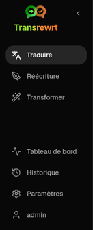
    </td>
    <td valign="top">
      <br/><br/>
      <ul>
        <li><strong>Traduire</strong> ouvre l'espace de travail de traduction.</li><br/>
        <li><strong>Réécriture</strong> ouvre l'espace de travail de réécriture.</li><br/>
        <li><strong>Transformer</strong> ouvre l'espace de travail personnalisé pour les invites.</li><br/>
        <li><strong>Tableau de bord</strong> affiche les informations d'utilisation et de coût.</li><br/>
        <li><strong>Paramètres</strong> ouvre le panneau des paramètres.</li><br/>
        <li><strong>Historique</strong> affiche l'historique d'utilisation avec le texte d'entrée et de sortie</li><br/>
        <li><strong>Utilisateur</strong> affiche le nom d'utilisateur de l'utilisateur connecté (web uniquement).</li>
      </ul>
    </td>
  </tr>
</table>

<br/>

<a id="toolbar"></a>
### Barre d'outils

La barre d'outils change légèrement selon l'endroit où vous vous trouvez dans l'application.

- À gauche, le nom de la page actuelle est affiché.
- À droite, se trouvent le sélecteur de **préréglage ou modèle** et le contrôle de la **Langue de l'interface**.

En mode **Facile**, la barre d'outils affiche un sélecteur de **préréglage** avec les préréglages intégrés **Gratuit (OpenRouter)**, **Standard**, **Avancé** et **Technique**. Les préréglages affichés dépendent du **Fournisseur** choisi dans [**Paramètres** > **Paramètres généraux**](#general-settings) — par exemple, **Gratuit (OpenRouter)** n'apparaît que lorsque le fournisseur est OpenRouter. Si le **Fournisseur** est **Ollama**, la barre d'outils affiche vos modèles locaux installés au lieu des préréglages.

En mode **Avancé**, le sélecteur de **modèle** vous permet de choisir quel moteur d'IA utiliser pour la tâche en cours.

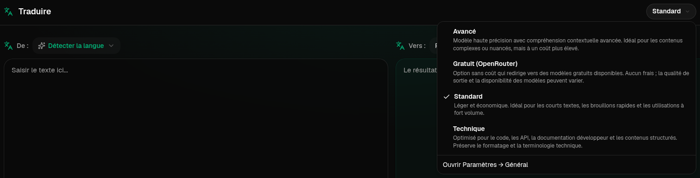

En mode Avancé, certains modèles gratuits peuvent ne pas être toujours disponibles — ils peuvent être hors ligne ou avoir atteint une limite d'utilisation. L'application peut supprimer automatiquement ce modèle de votre liste. Pour contrôler quels modèles apparaissent, rendez-vous dans [**Paramètres** > **Modèles**](#models). Vous pouvez accéder aux paramètres du modèle depuis l'icône du fournisseur située à gauche du nom du modèle dans la barre d'outils.

<br/>

L'**icône de globe + code de langue** permet de changer la langue de l'interface de l'application, comme les menus et les boutons. Cela ne change **pas** les langues de traduction utilisées dans **Traduire**.

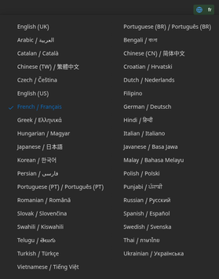

<br/>

<a id="input-and-output-panels"></a>
### Panneaux d'entrée et de sortie

La plupart des espaces de travail utilisent un panneau **Entrée** à gauche et un panneau **Sortie** à droite.

Chaque panneau affiche également :

| **Entrée**                                                          | **Sortie**                                                                                                                  |
|--------------------------------------------------------------------|-----------------------------------------------------------------------------------------------------------------------------|
| - Nombre de caractères <br/>- Nombre de mots <br/>- Nombre de paragraphes   <br/> | - Durée de la tâche<br/>- **TPS** (jetons par seconde)<br/>- Nombre de caractères, de mots et de paragraphes<br/>- Modèle utilisé |

Si vous vous interrogez sur les termes techniques :

- Un **jeton** correspond à un petit fragment de texte. Vous pouvez le considérer comme une partie d'un mot ou un mot court.
- Le **TPS** indique combien de ces fragments de texte le modèle a traités chaque seconde.

<br/>

Vous pouvez également surveiller le coût de chaque opération (si disponible) et le coût total, en activant l'option `Show cost information on the actions` dans [**Paramètres** > **Paramètres généraux**](#general-settings).

<br/><br/>

[--------------------------------------------------------------------------------------------------------------------------]: #

<a id="translate"></a>
## Traduire

Utilisez **Traduire** lorsque vous souhaitez convertir un texte d'une langue à une autre.

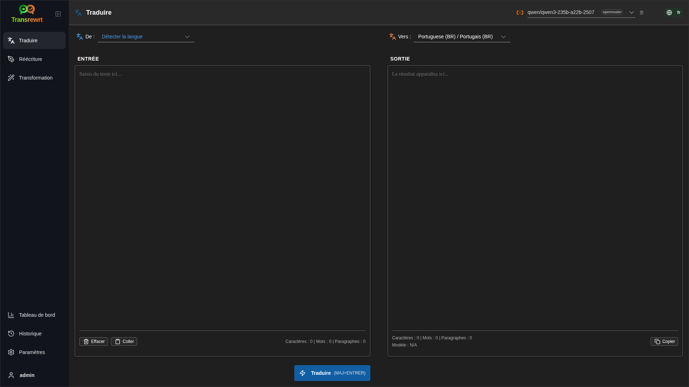

<br/>

<a id="translate-text"></a>
### Traduire un texte

1. Ouvrez **Traduire**.
2. Choisissez une langue dans **De**.
3. Choisissez une langue dans **Vers**.
4. Sélectionnez un préréglage (Facile) ou un modèle (Avancé) dans la barre d'outils.
5. Tapez ou collez du texte dans **Entrée**.
6. Cliquez sur **Traduire**.
7. Lisez le résultat dans **Sortie**.
8. Utilisez le bouton de copie si vous souhaitez copier le résultat.
9. Optionnellement, affinez le résultat avec **Reformuler…** ou des alternatives de mots — voir [Affiner votre traduction](#refining-translation).

<br/>

<a id="language-selection"></a>
### Sélection de la langue

- **De** peut être une langue spécifique ou **Détecter la langue**.
- **Vers** est la langue dans laquelle vous souhaitez obtenir le résultat.

Vos **Langues principales** sélectionnées apparaissent en haut de la liste. Vous pouvez les définir dans [**Paramètres** > **Langues**](#languages).

<br/>

<a id="helpful-translation-settings"></a>
### Paramètres utiles de traduction

Dans [**Paramètres** > **Paramètres généraux**](#general-settings), vous pouvez modifier le comportement de la traduction :

- **Exécuter automatiquement lors du collage** exécute une traduction dès que vous collez du texte.
- **Copier automatiquement le résultat dans le presse-papiers** copie le résultat automatiquement après une exécution réussie.
- **Traduction en temps réel lors de la saisie** (⚠️ Cela peut augmenter les coûts d'utilisation) exécute des traductions pendant que vous tapez.
- **Délai d'attente (ms)** contrôle combien de temps l'application attend avant d'exécuter une traduction en temps réel.
- **Comportement pour ENTER** choisit si `Enter` exécute la tâche ou insère une nouvelle ligne :
  - **Entrée** exécute traduire ou réécrire (par défaut).
  - **Maj + Entrée** exécute traduire ou réécrire ; **Entrée** simple insère une nouvelle ligne.

<br/>

<a id="refining-translation"></a>
### Affiner votre traduction

Après une traduction réussie, **Reformuler…** et le menu déroulant de version apparaissent dans l'en-tête de sortie, à côté du sélecteur de langue **Vers :**. Vous pouvez affiner le résultat là :

1. **Reformuler…** — sans texte sélectionné dans la sortie, obtenez une autre traduction complète du même input avec des formulations différentes. Le modèle reçoit chaque version que vous avez déjà afin que la nouvelle formulation puisse différer de toutes les autres. Vous pouvez stocker jusqu'à **cinq** versions et basculer entre elles dans le menu déroulant de version. Avec du texte sélectionné, **Reformuler…** ouvre des alternatives de mots près de la sélection (comme un clic droit). Sans sélection, **Reformuler…** est désactivé une fois que vous atteignez cinq versions ; avec une sélection, cela fonctionne toujours à cinq versions (alternatives de mots uniquement, mise à jour de la version 5). Pendant qu'une reformulation complète est en cours, cliquez sur **Arrêter Traduire** pour annuler ; la sortie revient à la version qui était active lorsque la reformulation a commencé.
2. **Alternatives de mots** — sélectionnez un ou plusieurs mots ou une courte phrase dans la sortie (si vous sélectionnez seulement une partie d'un mot, l'application étend la sélection à des mots complets), puis cliquez avec le bouton droit ou cliquez sur **Reformuler…**. Une courte liste d'alternatives apparaît près de la sélection ; cliquez sur l'une d'elles pour la remplacer. Chaque option peut remplacer une portée légèrement plus large que votre sélection (par exemple, une préposition ou un article adjacent) afin que la phrase reste grammaticale. Si vous avez moins de cinq versions, la sortie modifiée est enregistrée comme une nouvelle version ; à cinq versions, seule **la version 5** est mise à jour. Un clic droit sans sélection ne fait rien. Appuyez sur **Échap** ou cliquez en dehors de la liste pour annuler sans changer la sortie.
3. **Coûts** — chaque **Reformuler…** complet (sans sélection) et chaque demande d'alternative de mot utilise à nouveau le modèle et peut ajouter au coût d'utilisation (comme lors d'une exécution de traduction normale).

[--------------------------------------------------------------------------------------------------------------------------]: #

<a id="rewrite"></a>
## Réécriture

Utilisez **Réécriture** lorsque vous souhaitez améliorer l'expression sans en changer le sens principal.

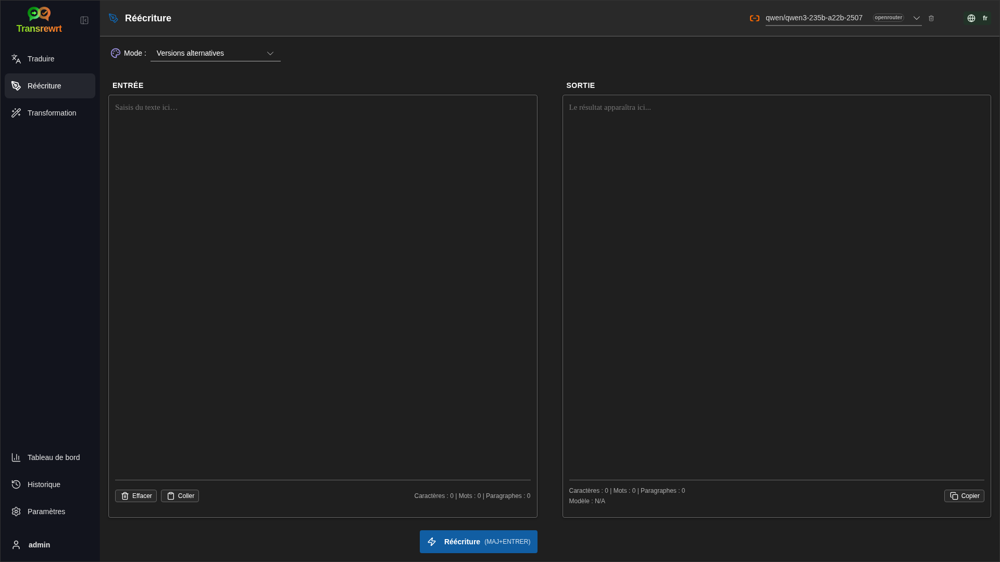

Ceci est utile pour :

- correction de l'orthographe et de la grammaire (**Vérifier l'orthographe et la grammaire**)
- amélioration de la clarté du texte (**Améliorer la clarté**)
- plusieurs reformulations distinctes en une seule exécution (**Versions alternatives**)
- rendre le texte plus formel ou plus informel (**Rendre formel** / **Rendre informel**)
- raccourcir ou développer le texte (**Raccourcir** / **Développer**)
- rendre le texte plus technique (**Rendre technique**)

<br/>

> 💡 **ASTUCE**<br/>
> Lorsque vous utilisez le mode "**Vérifier l'orthographe et la grammaire**", un commutateur **Afficher les modifications** apparaît dans le panneau de sortie (à côté de **Copier**).
> Activez-le ou désactivez-le pour afficher ou masquer les corrections spécifiques appliquées à votre texte.

<br/><br/>

[--------------------------------------------------------------------------------------------------------------------------]: #

<a id="transform"></a>
## Transformer

Utilisez **Transformer** lorsque vous souhaitez que l'IA suive un ensemble d'instructions personnalisé.

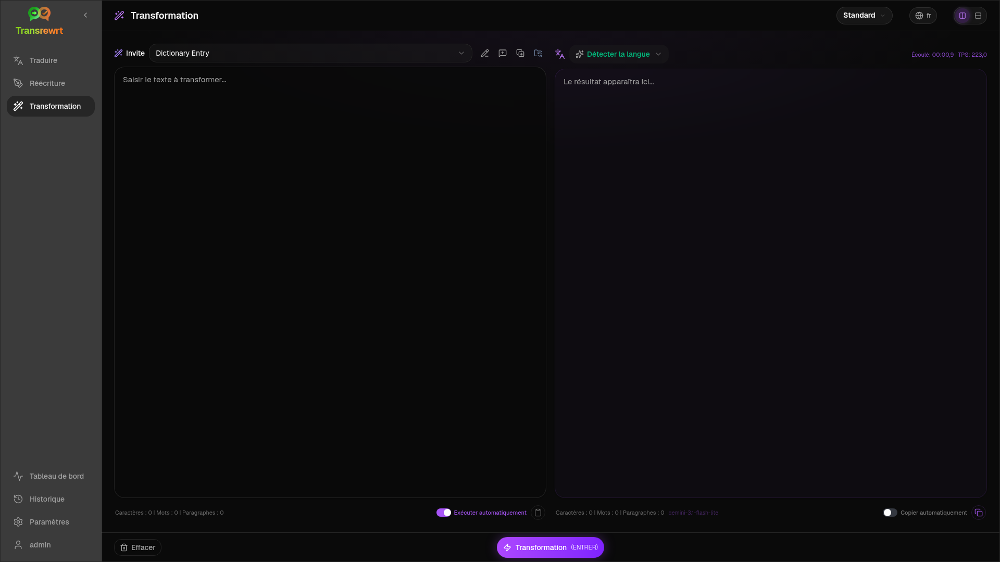

C'est la zone la plus souple de l'application. Vous pouvez l'utiliser pour des tâches telles que :

- résumer des notes
- transformer un texte brut en e-mail soigné
- extraire les points clés
- convertir un texte dans un format spécifique
- toute autre activité personnalisée avec le texte d'entrée

<br/>

<a id="run-an-existing-prompt"></a>
### Exécuter une invite existante

1. Ouvrez **Transformation**.
2. Choisissez une invite dans la liste des invites.
3. Si une boîte de langue **Depuis** apparaît, choisissez une langue si vous le souhaitez.
4. Tapez ou collez du texte dans **Entrée**.
5. Cliquez sur **Transformer**.
6. Lisez le résultat dans **Sortie**.

<br/>

<a id="if-you-have-no-prompts-yet"></a>
### Si vous n'avez pas encore d'invites

Si votre liste d'invites est vide, cliquez sur **Charger les invites d'exemple** dans l'espace de travail Transformer. Ce même contrôle est toujours disponible dans [**Paramètres** > **Transformer**](#transform-settings) sur la ligne d'exportation/importation. Les deux ajoutent des exemples intégrés pour que vous puissiez commencer rapidement.

<br/>

> ℹ️ **REMARQUE**<br/>
> Les invites d'exemple sont fournies en anglais. Après les avoir chargées, vous pouvez modifier une invite et utiliser **Traduire l'invite** pour la traduire dans votre langue.

<br/>

<a id="create-a-prompt-quickly"></a>
### Créer une invite rapidement

La façon la plus rapide de créer une invite est la suivante :

1. Cliquez sur **Nouvelle invite**.
2. Cliquez sur **Générer l'invite**.
3. Décrivez ce que vous souhaitez que l'invite accomplisse.
4. Choisissez un préréglage (Facile) ou un modèle (Avancé).
5. Laissez l'application créer un brouillon pour vous.
6. Examinez le brouillon puis cliquez sur **Enregistrer**.

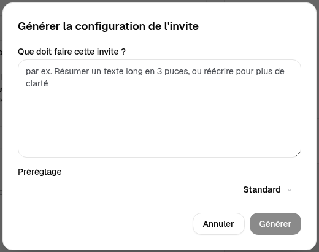

<br/>

<a id="edit-a-prompt"></a>
### Modifier une invite

Lorsque vous créez ou modifiez une invite, l'éditeur s'affiche à gauche et une zone de test apparaît à droite.

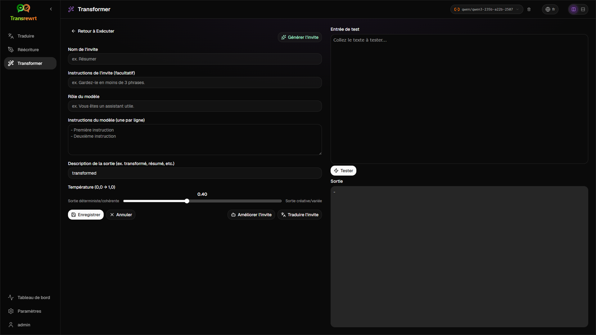

Les principaux champs sont :

- **Nom de l'invite** : le nom affiché dans la liste des invites.
- **Instructions de l'invite (facultatif)** : une courte indication affichée à l'utilisateur lors de l'exécution de l'invite.
- **Rôle du modèle** : le rôle général attribué à l'IA, par exemple 'Vous êtes un assistant utile.'
- **Instructions du modèle (une par ligne)** : les règles spécifiques que vous souhaitez que l'IA suive.
- **Description de la sortie (p. ex. transformé, résumé, etc.)** : un mot court décrivant le résultat.
- **Température (0,0 → 1,0)** : comment le modèle se comportera ; voir ci-dessous.
- **Demander la langue cible** : ajoute un sélecteur de langue lorsque l'invite est exécutée.
Si le terme technique **Température** est nouveau pour vous, pensez-y comme ceci :

- Une **température** plus basse donne des résultats plus stables et prévisibles.
- Une **température** plus élevée donne plus de variété et de créativité.

Vous pouvez également utiliser :

- `Generate prompt` pour créer un nouveau brouillon à partir d'une description simple
- `Improve prompt` pour affiner une invite existante
- `Translate prompt` pour traduire les champs de l'invite

<br/>

> ⚠️ **AVERTISSEMENT**<br/>
> Cliquez sur `Save` avant de cliquer sur `Back to Run`. Si vous revenez en arrière sans enregistrer, vos modifications seront perdues.

<br/>

<a id="test-a-prompt-before-using-it"></a>
### Tester une invite avant de l'utiliser

Le panneau de test situé à droite vous permet d'essayer votre invite avec un texte d'exemple avant de l'utiliser dans votre travail quotidien.

Ceci est utile lorsque :

- vous créez une nouvelle invite
- vous comparez deux versions d'une même invite
- vous souhaitez vérifier le ton, la longueur ou le format de la sortie

<br/>

> ℹ️ **REMARQUE**<br/>
> Vous pouvez exporter et importer les invites enregistrées dans [**Paramètres** > **Transformer**](#transform-settings).

Lorsque vous utilisez **Générer l'invite**, **Améliorer l'invite** ou **Traduire l'invite** dans l'éditeur d'invites, le mode **Facile** propose le même sélecteur de préréglage que Traduire et Réécrire ; le mode **Avancé** utilise la liste des modèles.

<br/><br/>

[--------------------------------------------------------------------------------------------------------------------------]: #

<a id="dashboard"></a>
## Tableau de bord

Utilisez le **Tableau de bord** pour voir dans quelle mesure vous utilisez l'application et ce que cela vous coûte (pour les modèles payants).

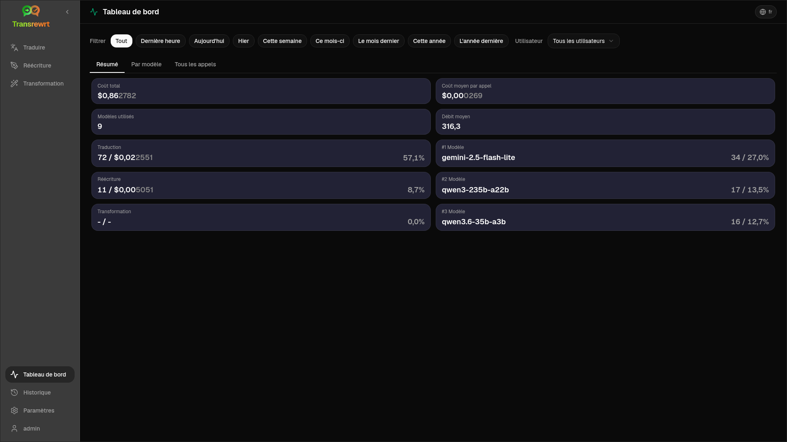

<br/>

> ℹ️ **REMARQUE**<br/>
> Si vous utilisez uniquement des modèles **gratuits**, les montants de **coût** peuvent être nuls et les indicateurs clés axés sur les coûts peuvent apparaître vides. L'onglet **Résumé** affiche tout de même le nombre d'appels pour la traduction, la réécriture et la transformation lorsque vous avez des activités durant la période sélectionnée.

<br/>

<a id="filter-the-data"></a>
### Filtrer les données

Utilisez les boutons de filtre en haut pour modifier la plage de temps.

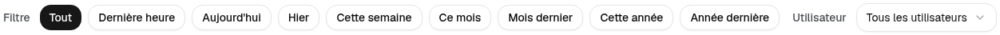

<br/>

> ℹ️ **REMARQUE**<br/>
> Le filtre **Utilisateur** est uniquement visible pour les administrateurs dans la version web. Les utilisateurs standard ne verront pas ce filtre, et il n'est pas disponible dans l'application de bureau.

<br/>

<a id="dashboard-tabs"></a>
### Onglets du tableau de bord

- **Résumé** affiche des cartes d'indicateurs : coût total, modèles utilisés, nombre d'appels par mode et coût (avec part des appels totaux), coût moyen par appel, TPS moyen, et les trois modèles les plus utilisés en nombre d'appels.
- **Par modèle** liste chaque modèle avec le nombre total d'appels, le coût total et le TPS moyen ; développez une ligne pour obtenir un détail par traduction, réécriture et transformation.
- **Tous les appels** affiche le journal complet des appels (paginé sur les écrans larges, en cartes sur les écrans étroits) et permet de l'exporter.

<br/>

<a id="export-data"></a>
### Exporter les données

Les tableaux du tableau de bord permettent d'exporter les données au format :

- **JSON**
- **CSV**
- **XLSX**

Cela peut être utile si vous souhaitez examiner l'activité en dehors de l'application ou partager un rapport.

<br/>

<a id="delete-stored-records-for-a-model"></a>
### Supprimer les enregistrements stockés pour un modèle

Dans **Par modèle** ou **Tous les appels**, vous pouvez supprimer les enregistrements stockés pour un modèle en cliquant sur l'icône « corbeille ».

> ⚠️ **AVERTISSEMENT**<br/>
> La suppression des enregistrements stockés est irréversible. N'utilisez cette fonction que si vous êtes certain de ne plus avoir besoin de cet historique.

Pour supprimer toutes les données ou supprimer des enregistrements en fonction de leur ancienneté, accédez à [**Paramètres** > **Suivi des coûts**](#cost-tracking). Vous y trouverez des options pour supprimer toutes les données stockées ou uniquement les données plus anciennes qu'une certaine date.

<br/><br/>

[--------------------------------------------------------------------------------------------------------------------------]: #

<a id="history"></a>
## Historique

Cliquez sur **Historique** pour afficher l'historique de vos actions dans **Transrewrt**, y compris l'entrée et la sortie de chaque opération.

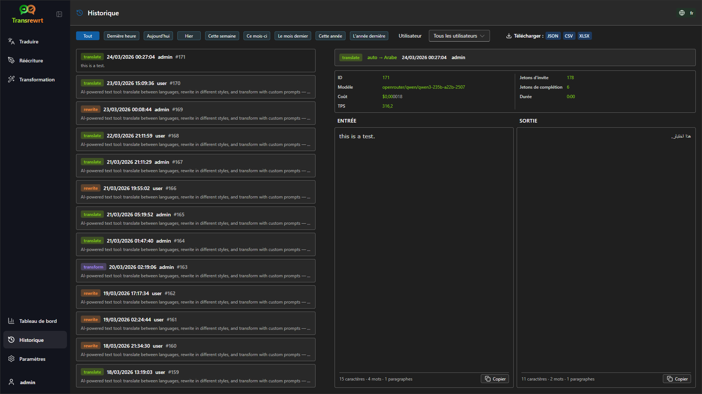

<br/>

<a id="filter-the-history"></a>
### Filtrer l'historique

**Historique** utilise les mêmes filtres de plage horaire que la page **Tableau de bord**.


<br/>

> ℹ️ **REMARQUE**<br/>
> Dans l'**application web**, tout le monde (y compris les administrateurs) ne voit que son propre historique d'exécution. Le filtre **Utilisateur** sur le **Tableau de bord** permet aux administrateurs d'examiner l'utilisation et les coûts par compte ; il ne s'applique pas à **Historique**.

<br/>

<a id="export-history-data"></a>
### Exporter les données d'historique

La page d'historique peut exporter les données filtrées aux formats :

- **JSON**
- **CSV**
- **XLSX**

Cela peut être utile si vous souhaitez examiner l'activité en dehors de l'application ou partager un rapport.

<br/><br/>

[--------------------------------------------------------------------------------------------------------------------------]: #

<a id="settings"></a>
## Paramètres

Ouvrez **Paramètres** depuis la barre latérale pour personnaliser le comportement de l'application.

Les onglets disponibles dépendent de la plateforme et de votre rôle :

| Onglet              | Bureau | Web (admin) | Web (utilisateur standard) | Notes                                        |
  |------------------|:-------:|:-----------:|:------------------:|----------------------------------------------|
  | Paramètres généraux |   oui   |     oui     |        oui         | Inclut **l'expérience IA** (Facile / Avancé) |
  | Modèles           |   oui   |     oui     |        oui         | Uniquement lorsque **l'expérience IA** est en mode **Avancé** |
  | Langues           |   oui   |     oui     |        oui         |                                              |
  | Suivi des coûts   |   oui   |     oui     |         -          |                                              |
  | Transformation    |   oui   |     oui     |        oui         | Importation/exportation massive des invites de transformation |
  | Utilisateurs      |    -    |     oui     |         -          |                                              |
  | Configuration API |   oui   |     oui     |         -          |                                              |
  | À propos          |   oui   |     oui     |        oui         |                                              |

En mode **Facile**, le choix du modèle s'effectue via les préréglages dans la barre d'outils et le **Fournisseur** dans les Paramètres généraux ; l'onglet **Modèles** est masqué.

<br/>

> ℹ️ **REMARQUE**<br/>
> Dans la version web, chaque utilisateur dispose de sa propre configuration. Les paramètres tels que l'expérience IA, le fournisseur, les modèles ou préréglages sélectionnés, les langues, les options générales et les invites de transformation sont stockés individuellement. Les modifications que vous effectuez n'affectent pas les autres utilisateurs.

<br/>

[--------------------------------------------------------------------------------------------------------------------------]: #

<a id="general-settings"></a>
### Paramètres généraux

Utilisez **Paramètres généraux** pour contrôler le comportement de saisie, si les détails d'exécution sont conservés pour **Historique**, l'apparence, et la manière dont vous choisissez l'IA pour Traduire, Réécrire et Transformer.

**Expérience IA**

- **Facile** (par défaut) : choisissez un **Fournisseur** (OpenRouter, OpenAI, Anthropic, Google Gemini, DeepSeek, Groq, Mistral, xAI, Cerebras ou Ollama). Les fournisseurs cloud utilisent les préréglages intégrés dans la barre d'outils. **Ollama** affiche les modèles installés sur votre machine au lieu des préréglages. En mode Facile, le **Catalogue des préréglages** indique la version du catalogue et l'heure de la dernière mise à jour ; cliquez sur **Actualiser le catalogue des préréglages** pour récupérer la liste la plus récente depuis le dépôt du projet (l'application vérifie également périodiquement en arrière-plan).
- **Avancé** : sélectionnez des modèles individuels dans la barre d'outils ; gérez la liste sous [**Paramètres** > **Modèles**](#models).

**Apparence**

- **Thème** permet de basculer entre les modes clair, sombre et système.
- **Afficher les informations de coût sur les actions** contrôle l'affichage du coût par opération (si disponible) et du coût total sur les panneaux de sortie de Traduire, Réécrire et Transformer.
- **Chiffres décimaux pour le coût** modifie l'affichage des décimales du coût.
- **Web uniquement :** **afficher une marge autour de l'application** ajoute un espace supplémentaire autour de l'interface.
- **Famille de polices** modifie la police utilisée dans les panneaux de texte.
- **Taille** modifie la taille de la police.

**Comportement**

- **Comportement pour ENTER** choisit si `Enter` exécute la tâche ou insère une nouvelle ligne.
- **Exécuter automatiquement lors du collage** commence la traduction dès que vous collez du texte.
- **Copier automatiquement le résultat dans le presse-papiers** copie automatiquement les résultats réussis.
- **Traduction en temps réel lors de la saisie** (⚠️ Cela peut augmenter les coûts d'utilisation) traduit pendant que vous tapez.
- **Délai d'attente (ms)** définit le temps d'attente pour la traduction en temps réel.

**Historique**

- **Conserver l'historique des exécutions** détermine si chaque traduction, réécriture et transformation enregistre le **texte d'entrée et de sortie** pour la vue latérale [**Historique**](#history). Désactiver cette option demande une confirmation ; si vous confirmez, les textes d'historique stockés sont supprimés de la base de données. Si l'étiquette indique *désactivé par l'administrateur*, votre installation a `HISTORY_DISABLED` défini dans l'environnement (voir le [README](README.fr.md#configuration-and-environment)) ; vous ne pouvez pas réactiver l'historique depuis l'interface.
- **Supprimer les données d'historique** vous permet de supprimer les textes stockés selon leur ancienneté (par exemple, plus anciens que quelques mois, ou **toutes les données (effacer)**) à l'aide de **Supprimer les données**. Cela affecte uniquement les textes d'exécution sauvegardés pour la vue **Historique** ; cela ne supprime **pas** les totaux de coût ou d'utilisation. Pour supprimer ou réduire les données de **coût**, utilisez [**Paramètres** > **Suivi des coûts**](#cost-tracking).

**Sauvegarde de la configuration** (administrateurs d'applications de bureau et web uniquement)
- **Inclure les données d'utilisation dans la sauvegarde** - lorsqu'il est activé, le ZIP contient également l'historique d'exécution et les données d'appel API.
- **Sauvegarder la configuration** - crée un seul ZIP (`transrewrt-config-backup-YYYY-MM-DD_HHMMSS.zip` à l'heure locale) avec `config.json`, `state.json`, clé de chiffrement optionnelle, utilisateurs, préférences, invites personnalisées et données d'utilisation si vous avez opté pour cela. Après une sauvegarde réussie, la confirmation affiche le nom du fichier enregistré.
- **Restaurer à partir d'une sauvegarde** - ouvre d'abord une **boîte de dialogue de confirmation**. Choisissez le ZIP de sauvegarde dans la boîte de dialogue (**Parcourir** / sélecteur de fichiers ou glisser-déposer où cela est pris en charge), puis examinez les options :
  - **Restaurer les données d'utilisation** - importer l'utilisation/l'historique depuis le ZIP lorsqu'il a été sauvegardé avec l'utilisation incluse ; laissez de côté si vous ne souhaitez que les paramètres et les invites.
  - **Effacer les anciennes données d'utilisation avant de restaurer** - supprimer l'utilisation/l'historique existants sur cette installation avant d'appliquer la sauvegarde (optionnel ; utilisez lorsque vous souhaitez un remplacement propre).
Les sauvegardes créées dans la version web ou de bureau peuvent être restaurées dans l'autre. Lors de la restauration d'une sauvegarde de bureau dans la version web, les données seront restaurées à l'utilisateur administrateur.

<br/>

<a id="models"></a>
### Modèles

Cet onglet est disponible uniquement lorsque l'**expérience IA** est définie sur **Avancé** dans [**Paramètres généraux**](#general-settings). Utilisez **Paramètres** > **Modèles** pour choisir quels modèles apparaissent dans la barre d'outils.

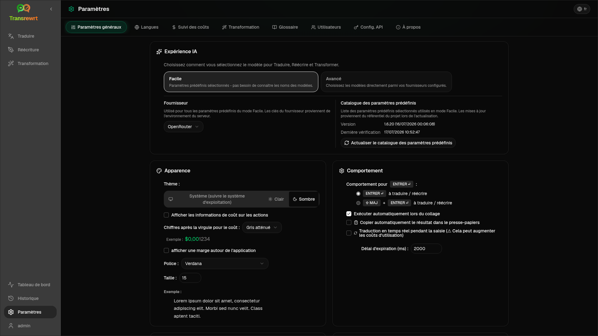

La page comporte deux listes :

- **Modèles disponibles** à gauche
- **Modèles sélectionnés** à droite

Les commandes utiles incluent :

- **Rechercher des modèles...** pour trouver un modèle par nom
- Puces **Fournisseur** pour réduire la liste à un moteur (OpenRouter, OpenAI, Ollama, …)
- **Uniquement gratuits** pour afficher uniquement les modèles gratuits
- **Actualiser** pour recharger la liste
- **Développer tout** et **Réduire tout** lorsque vous triez par fournisseur

Les identifiants de modèle incluent le préfixe du fournisseur (par exemple `openrouter/…` contre `openai/…`). Les badges tels que **OpenAI (OpenRouter)** contre **OpenAI (direct)** indiquent comment le trafic est acheminé.

> ℹ️ **REMARQUE**<br/>
> **OpenRouter Body Builder** (`openrouter/bodybuilder`) est un modèle routeur, pas un modèle de discussion général : sa réponse est du JSON décrivant les corps de requête de l'API OpenRouter (par exemple un tableau `requests` avec `model` et `messages`). Si vous l'utilisez pour **Traduire**, **Réécrire** ou **Transformer**, le panneau de sortie affichera ce JSON au lieu d'un texte finalisé. Choisissez un modèle de texte normal pour ces tâches. Consultez la [page du modèle Body Builder](https://openrouter.ai/openrouter/bodybuilder) sur OpenRouter.

Actions :

- Pour ajouter un modèle, cliquez sur **Ajouter** ou n'importe où dans l'entrée.

- Pour supprimer un modèle, cliquez sur **X** à côté de celui-ci dans **Modèles sélectionnés** ou sur **Sélectionné** dans l'entrée des modèles disponibles.

- Pour effacer la liste, cliquez sur **Tout désélectionner**. Le modèle gratuit obligatoire restera dans la liste.

<br/>

> ℹ️ **REMARQUE**<br/>
> Si vous ne souhaitez pas ajouter de crédits à OpenRouter immédiatement, commencez par activer **Uniquement gratuits** et choisissez les modèles gratuits (aucune carte bancaire requise). Vous pouvez également utiliser Ollama pour exécuter des modèles localement sans clé API.

<br/>

<a id="languages"></a>
### Langues

Utilisez **Paramètres** > **Langues** pour organiser les listes de langues utilisées dans l'application.

- Les **langues principales** sont épinglées près du haut des listes de langues dans **Traduire** et **Transformer**.
- **Langue personnalisée** vous permet d'ajouter une langue qui n'est pas dans la liste intégrée.

Si vous ajoutez une langue personnalisée, elle apparaît dans les sélecteurs de langue aux côtés des options intégrées.

<br/>

<a id="cost-tracking"></a>
### Suivi des coûts

Utilisez **Paramètres** > **Suivi des coûts** pour gérer les informations de coût.

- **Coût total** affiche le total cumulé.
- **Copier la valeur** copie le total dans le presse-papiers.
- **Réinitialiser le coût** réinitialise le total stocké à zéro.
- **Synchroniser avec l'utilisation de la clé API** définit le total pour qu'il corresponde à l'utilisation indiquée par votre compte OpenRouter (OpenRouter uniquement).
- **Utilisation de la clé API** affiche les détails d'utilisation d'OpenRouter, si disponibles.
- **Supprimer les données de coût** supprime toutes les données, ou uniquement les entrées antérieures à une date sélectionnée.

**Suivi des coûts :** Lorsque vous utilisez des modèles OpenRouter, l'application affiche votre utilisation réelle et vos dépenses en fonction des informations de coût provenant d'OpenRouter. Pour tous les autres fournisseurs, l'application estime les coûts à l'aide des prix publiés par OpenRouter ; si un prix n'est pas disponible, l'estimation peut être nulle.

<br/>

> ℹ️ **REMARQUE**<br/>
> **Tous les montants indiqués sont des estimations à titre indicatif uniquement, et ne constituent pas des factures officielles.**

<br/>

> ⚠️ **AVERTISSEMENT**<br/>
> La suppression des données est irréversible. Avant de supprimer, assurez-vous de sauvegarder vos données ou de les exporter via [**Historique**](#history)
> ou [**Tableau de bord** > **Tous les appels**](#dashboard-tabs), sinon elles seront perdues définitivement.
> Tout l'historique des entrées/sorties lié à chaque appel API sera également supprimé.

<br/>

<a id="transform-settings"></a>
### Transformer (onglet des paramètres)

Utilisez **Paramètres** > **Transformer** pour gérer plusieurs invites en masse.

Vous pouvez :

- consulter vos invites enregistrées
- supprimer des invites
- importer des invites à partir d'un fichier
- exporter des invites pour sauvegarde ou partage
- charger des invites d'exemple dans la liste des invites

<br/>

<a id="users"></a>
### Utilisateurs

Utilisez **Utilisateurs** pour gérer les comptes d'utilisateurs dans la version web. Vous pouvez ajouter des utilisateurs, mettre à jour leurs informations, réinitialiser leurs mots de passe et supprimer des comptes.

<br/>

<a id="api-config"></a>
### Configuration API

Les fournisseurs pris en charge sont : OpenRouter, OpenAI, Anthropic, Google Gemini, DeepSeek, Groq, Mistral, xAI, Cerebras et **Ollama** (modèles locaux via une URL de base). Vous n'avez besoin de configurer que les fournisseurs que vous utilisez.

**Application web : administrateur uniquement**

Les clés API sont configurées via des variables d'environnement système ou Docker – elles ne sont pas saisies dans l'interface web. Cette page indique quels fournisseurs ont une clé configurée et vous permet de les tester individuellement en cliquant sur le bouton `Test`.

<br/>

> ℹ️ **REMARQUE**<br/>
> Pour modifier une clé API, mettez à jour la variable d'environnement dans votre configuration système ou Docker, puis redémarrez le serveur ou le conteneur.

<br/>

> ℹ️ **REMARQUE**<br/>
> Les **sauvegardes de configuration** (voir [**Paramètres généraux** → Sauvegarde de la configuration](#general-settings)) peuvent intégrer les clés de fournisseur **résolues** dans le fichier `config.json` du ZIP. La restauration de ce ZIP ne recopie **pas** ces clés dans le fichier de configuration persistante du serveur – les clés actives proviennent toujours de l'environnement et de l'état du fichier existant, comme décrit ici.

<br/>

**Application de bureau**

Utilisez **Configuration API** pour stocker les clés API de chaque fournisseur que vous utilisez. Pour Ollama, saisissez l'**URL de base** au lieu d'une clé API.

<br/>

> 💡 **Astuce** <br/>
> Si vous ne souhaitez pas utiliser de clé API ni payer pour l'utilisation, vous pouvez [télécharger Ollama](https://ollama.com) et exécuter des modèles (tels que `translategemma:4b`) localement sur votre machine gratuitement. Sinon, vous pouvez créer un compte OpenRouter gratuit (sans carte bancaire requise) pour utiliser leurs modèles gratuits, ou obtenir une clé API gratuite auprès de Cerebras, Google, Groq ou Mistral AI.

<br/>

- Ajoutez uniquement les fournisseurs dont vous avez besoin. Dans **Paramètres** > **Modèles**, chaque identifiant de modèle commence par le fournisseur (par exemple `openrouter/openrouter/free`, `openai/gpt-4o`, `ollama/llama3`).

Pour ajouter une clé API, saisissez la valeur dans le champ de texte et cliquez sur `Save`. Pour remplacer une clé existante, cliquez sur `Edit`. Pour vérifier qu'une clé fonctionne, cliquez sur `Test`. Pour l'URL de base d'Ollama, cliquez toujours sur `Test` pour vérifier la connexion.

<br/>

> ℹ️ **REMARQUE**<br/>
> Vous ne pouvez pas voir la valeur actuelle d'une clé API. Vous pouvez uniquement la remplacer à l'aide du bouton `Edit`.
> Les clés API sont stockées chiffrées dans la configuration.

<br/>

<a id="about"></a>
### À propos

L'onglet **À propos** affiche :

- le nom de l'application et son slogan
- le numéro de version et la date de compilation
- les informations de licence et de copyright, avec un lien pour ouvrir les **Avis de tierces parties**
- un lien vers le dépôt du projet

<br/><br/>

<a id="common-issues"></a>
## Problèmes courants

Si quelque chose ne fonctionne pas comme prévu, vérifiez d'abord les points suivants.

<br/>

<a id="the-app-will-not-translate-rewrite-or-transform-text"></a>
### L'application ne traduit pas, ne réécrit pas ou ne transforme pas le texte

Vérifiez que :

- vous avez sélectionné un **préréglage** (Facile) ou un **modèle** (Avancé) dans la barre d'outils
- en mode **Facile**, [**Paramètres** > **Paramètres généraux**](#general-settings) dispose d'un **Fournisseur** avec une clé valide (ou une URL Ollama) et au moins un préréglage pour ce fournisseur
- en mode **Avancé**, au moins un modèle est répertorié dans [**Paramètres** > **Modèles**](#models)
- votre configuration API fonctionne

Si vous utilisez l'application de bureau :

1. Ouvrez [**Paramètres** > **Configuration API**](#api-config).
2. Vérifiez qu'au moins une clé API est enregistrée.
3. Cliquez sur **Tester** à côté du fournisseur pour confirmer que la clé fonctionne.

<br/>

<a id="the-model-list-is-empty"></a>
### La liste des modèles est vide

En mode **Facile**, ouvrez [**Paramètres** > **Paramètres généraux**](#general-settings), vérifiez que le **Fournisseur** est configuré, puis ajoutez ou testez les clés dans [**Configuration API**](#api-config) (sur ordinateur) ou demandez à votre administrateur (sur le web). Pour **Ollama**, exécutez **Tester** sur l'URL de base et assurez-vous que les modèles sont installés localement.

En mode **Avancé**, ouvrez [**Paramètres** > **Modèles**](#models) et cliquez sur **Actualiser**. Si nécessaire, recherchez un modèle, activez **Uniquement gratuits**, puis ajoutez des modèles aux **Modèles sélectionnés**.

<br/>

<a id="the-result-is-too-slow-or-too-expensive"></a>
### Le résultat est trop lent ou trop coûteux

Essayez une ou plusieurs des solutions suivantes :

- choisissez un préréglage différent (Facile) ou un modèle (Avancé)
- utilisez une entrée plus courte
- désactivez **Traduction en temps réel lors de la saisie** dans [**Paramètres** > **Paramètres généraux**](#general-settings)
- utilisez des modèles gratuits pour des tâches simples (voir [Modèles](#models))
<br/>

<a id="the-interface-is-in-the-wrong-language"></a>
### L'interface est dans la mauvaise langue

Cliquez sur l'icône du globe dans la [barre d'outils](#toolbar) et choisissez votre **Langue de l'interface** préférée.

<br/>

<a id="the-text-is-too-small-or-hard-to-read"></a>
### Le texte est trop petit ou difficile à lire

Ouvrez [**Paramètres** > **Paramètres généraux**](#general-settings) et modifiez :

- **Famille de polices**
- **Taille**

<br/>

<a id="dashboard-summary-looks-empty"></a>
### Le résumé du tableau de bord semble vide

Ceci est normal si :

- vous utilisez uniquement des **modèles gratuits** et vous consultez les données de **coût** (elles peuvent être nulles) ; les indicateurs clés de performance (KPI) basés sur le nombre d'appels dans **Résumé** nécessitent toujours des données sur la période sélectionnée
- le **filtre temporel** sélectionné ne couvre pas la période où les appels ont été effectués — essayez **Tout** pour vérifier

Si les KPI restent à zéro après avoir sélectionné **Tout**, vérifiez que des appels apparaissent dans [**Historique**](#history) ou dans l'onglet **Tous les appels**.

<br/>

<a id="cost-shows-not-available-or-seems-wrong"></a>
### Le coût affiche « non disponible » ou semble incorrect

Lorsque vous utilisez des modèles via **OpenRouter**, l’application affiche vos dépenses réelles telles que rapportées par OpenRouter.

Pour les **autres fournisseurs** (OpenAI direct, Anthropic direct, etc.), le coût est estimé à partir des données tarifaires publiées par OpenRouter. Si aucun prix correspondant n’est trouvé pour un modèle, le coût apparaîtra comme **non disponible** et ne sera pas ajouté à votre total cumulé.

<br/>

<a id="total-cost-does-not-match-my-provider-bill"></a>
### Le coût total ne correspond pas à ma facture fournisseur

Toutes les données de coût dans l’application sont des **estimations à titre indicatif uniquement**, et ne constituent pas des factures officielles.

Pour rapprocher le total de vos dépenses réelles sur OpenRouter, ouvrez [**Paramètres** > **Suivi des coûts**](#cost-tracking) et cliquez sur **Synchroniser avec l'utilisation de la clé API**.

<br/>

<a id="the-history-page-is-missing-from-the-sidebar"></a>
### La page Historique est absente de la barre latérale

**Conserver l'historique des exécutions** peut être désactivé. Ouvrez [**Paramètres** > **Paramètres généraux**](#general-settings) et activez-le, sauf si l'historique est *désactivé par l'administrateur* (`HISTORY_DISABLED` défini dans l'environnement — voir le [README](README.fr.md#configuration-and-environment)). Activer l'historique ne restaure pas les textes précédemment supprimés.

<br/>

<a id="web-app-session-expired"></a>
### Application web : redirection inattendue vers la page de connexion

Votre session a peut-être expiré. Connectez-vous à nouveau. Si cela se produit fréquemment, vérifiez la configuration du serveur concernant les paramètres de durée de vie de session.

<br/>

<a id="web-admin-forgot-or-lost-a-password"></a>
### Administration web : mot de passe oublié ou perdu

Cela concerne l’**application web auto-hébergée** (Docker), pas l’application de bureau (Electron).

- Si un autre administrateur peut encore se connecter, il peut ouvrir [**Paramètres** > **Utilisateurs**](#users), sélectionner le compte, et définir un **nouveau mot de passe**.
- Si vous êtes **bloqué** mais disposez d’un accès **shell** à la machine ou au conteneur, réinitialisez le mot de passe avec l’utilitaire fourni avec l’image (remplacez `transrewrt` si vous avez changé le nom par défaut, et mettez le mot de passe entre guillemets s’il contient des espaces ou des caractères spéciaux) :

```bash
docker exec transrewrt reset-web-password '<username>' '<new-password>'
```

Le nom d’utilisateur administrateur par défaut est `admin` si vous n’avez jamais créé d’autres comptes. Lorsque vous ne fournissez qu’un seul argument, il est traité comme le nouveau mot de passe pour `admin`.

Si vous exécutez l’application à partir d’un **clone source** au lieu de Docker, utilisez :

```bash
pnpm run reset-web-password -- <username> <new-password>
```

Le script met à jour l'enregistrement de l'utilisateur dans la base de données SQLite (et peut créer l'utilisateur `admin` s'il est manquant). Après la réinitialisation, connectez-vous avec le nouveau mot de passe.

<br/>

<a id="dashboard-shows-no-data-for-other-users"></a>
### Le tableau de bord n'affiche aucune donnée pour les autres utilisateurs (web)

Seuls les **administrateurs** peuvent afficher les données de tous les utilisateurs via le filtre **Utilisateur**. Par conception, les utilisateurs réguliers ne voient que leurs propres activités.

<br/>

<a id="i-changed-a-prompt-and-lost-the-edits"></a>
### J'ai modifié une invite et j'ai perdu mes modifications

Lors de la modification d'une invite, cliquez toujours sur **Enregistrer** avant de cliquer sur **Retour à Exécuter**.

<br/><br/>

<a id="quick-tips"></a>
## Conseils rapides

- Commencez par [**Traduire**](#translate) pour vous assurer que votre configuration fonctionne avant de passer à [**Réécriture**](#rewrite) ou [**Transformer**](#transform).
- Utilisez [**Réécriture**](#rewrite) pour améliorer quotidiennement le libellé.
- Utilisez [**Transformer**](#transform) lorsque vous avez besoin d'un flux de travail reproductible pour une tâche spécifique.
- Utilisez [**Tableau de bord**](#dashboard) si vous souhaitez surveiller l'utilisation et le coût.
- Utilisez [**Historique**](#history) pour consulter les opérations passées et leurs textes complets d'entrée/sortie.
- Exportez régulièrement vos invites si vous constituez une bibliothèque d'invites que vous souhaitez préserver (voir [Transformer](#transform)) ou si vous souhaitez la partager avec d'autres.
- Restez en mode **Facile** jusqu'à ce que vous ayez besoin d'un contrôle précis sur les identifiants de modèle ; passez en mode **Avancé** lorsque vous savez déjà quels modèles vous souhaitez utiliser.

<br/><br/>

<a id="disclaimer"></a>
## Clause de non-responsabilité

Les noms de produits et les icônes appartiennent à leurs propriétaires respectifs et sont utilisés uniquement à des fins d'identification. Ce logiciel n'est ni affilié ni approuvé par aucune des marques mentionnées.

<br/><br/>

<a id="license"></a>
## Licence

Droit d'auteur © 2026 Waldemar Scudeller Jr.

[Apache License 2.0](../LICENSE)
