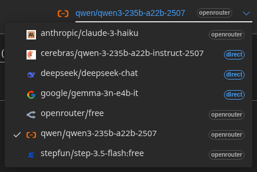

# Guide de l'utilisateur

 

## Introduction

Transrewrt vous aide à travailler avec le texte de trois façons principales :

- **Traduire** - convertir un texte d'une langue à une autre.
- **Réécrire** - reformuler un texte dans un style différent, par exemple plus clair, plus court ou plus formel.
- **Transformer** - traiter un texte à l'aide d'instructions IA personnalisées appelées prompts.

 

Ce guide explique comment utiliser l'application une fois installée et en fonctionnement. Pour les étapes d'installation, consultez le fichier **[README](README.fr.md)** principal.

 

> ℹ️ **REMARQUE** 
> Transrewrt est disponible sous forme d'application de bureau pour Windows et Linux, ainsi que sous forme d'application web auto-hébergée. Ce guide se concentre sur l'utilisation quotidienne de l'application. Lorsqu'une fonctionnalité ne s'applique qu'à une seule version, cela est clairement indiqué.

<small>**Lire dans d'autres langues :** </small>
<small id="lang-list"> [English (UK)](../USER-GUIDE.md) · [Português (BR)](USER-GUIDE.pt-BR.md) · [العربية](USER-GUIDE.ar.md) · [বাংলা](USER-GUIDE.bn.md) · [Català](USER-GUIDE.ca.md) · [简体中文](USER-GUIDE.zh-CN.md) · [繁體中文](USER-GUIDE.zh-TW.md) · [Hrvatski](USER-GUIDE.hr.md) · [Čeština](USER-GUIDE.cs.md) · [Nederlands](USER-GUIDE.nl.md) · [English (US)](USER-GUIDE.en-US.md) · [Filipino](USER-GUIDE.tl.md) · [Français](USER-GUIDE.fr.md) · [Deutsch](USER-GUIDE.de.md) · [Ελληνικά](USER-GUIDE.el.md) · [हिन्दी](USER-GUIDE.hi.md) · [Magyar](USER-GUIDE.hu.md) · [Italiano](USER-GUIDE.it.md) · [日本語](USER-GUIDE.ja.md) · [Basa Jawa](USER-GUIDE.jv.md) · [한국어](USER-GUIDE.ko.md) · [Bahasa Melayu](USER-GUIDE.ms.md) · [فارسی](USER-GUIDE.fa.md) · [Polski](USER-GUIDE.pl.md) · [Português (PT)](USER-GUIDE.pt.md) · [ਪੰਜਾਬੀ](USER-GUIDE.pa.md) · [Română](USER-GUIDE.ro.md) · [Русский](USER-GUIDE.ru.md) · [Slovenčina](USER-GUIDE.sk.md) · [Español](USER-GUIDE.es.md) · [Kiswahili](USER-GUIDE.sw.md) · [Svenska](USER-GUIDE.sv.md) · [తెలుగు](USER-GUIDE.te.md) · [ภาษาไทย](USER-GUIDE.th.md) · [Türkçe](USER-GUIDE.tr.md) · [Українська](USER-GUIDE.uk.md) · [Tiếng Việt](USER-GUIDE.vi.md)</small>

<small>

> **Remarque concernant les traductions de l'interface et de la documentation :** Toutes les langues de l'interface autres que l'anglais (UK), langue d'origine, ont été traduites à l'aide de modèles d'IA ; le libellé peut donc être imprécis ou contenir des erreurs.

</small>

 

<!-- START doctoc generated TOC please keep comment here to allow auto update -->
<!-- DON'T EDIT THIS SECTION, INSTEAD RE-RUN doctoc TO UPDATE -->
**Table des matières** 

- [Avant de commencer](#before-you-start)
  - [Comment obtenir une clé API OpenRouter gratuite (application de bureau)](#how-to-get-a-free-openrouter-api-key-desktop-app)
- [Démarrage](#getting-started)
- [Composants principaux de la fenêtre](#main-parts-of-the-window)
  - [Barre latérale](#sidebar)
  - [Barre d'outils](#toolbar)
  - [Panneaux d'entrée et de sortie](#input-and-output-panels)
- [Traduire](#translate)
  - [Traduire un texte](#translate-text)
  - [Sélection de la langue](#language-selection)
  - [Paramètres utiles pour la traduction](#helpful-translation-settings)
- [Réécrire](#rewrite)
- [Transformer](#transform)
  - [Exécuter un prompt existant](#run-an-existing-prompt)
  - [Si vous n'avez pas encore de prompts](#if-you-have-no-prompts-yet)
  - [Créer un prompt rapidement](#create-a-prompt-quickly)
  - [Modifier un prompt](#edit-a-prompt)
  - [Tester un prompt avant de l'utiliser](#test-a-prompt-before-using-it)
- [Tableau de bord](#dashboard)
  - [Filtrer les données](#filter-the-data)
  - [Onglets du tableau de bord](#dashboard-tabs)
  - [Exporter les données](#export-data)
  - [Supprimer les enregistrements stockés pour un modèle](#delete-stored-records-for-a-model)
- [Historique](#history)
  - [Filtrer les données](#filter-the-data-1)
  - [Exporter les données de l'historique](#export-history-data)
- [Paramètres](#settings)
  - [Paramètres généraux](#general-settings)
  - [Modèles](#models)
  - [Langues](#languages)
  - [Suivi des coûts](#cost-tracking)
  - [Prompts de transformation](#transform-prompts)
  - [Utilisateurs](#users)
  - [Configuration API](#api-config)
  - [À propos](#about)
- [Problèmes courants](#common-issues)
  - [L'application ne traduit, ne réécrit ni ne transforme pas le texte](#the-app-will-not-translate-rewrite-or-transform-text)
  - [La liste des modèles est vide](#the-model-list-is-empty)
  - [Le résultat est trop lent ou trop coûteux](#the-result-is-too-slow-or-too-expensive)
  - [L'interface est dans la mauvaise langue](#the-interface-is-in-the-wrong-language)
  - [Le texte est trop petit ou difficile à lire](#the-text-is-too-small-or-hard-to-read)
  - [Les graphiques du tableau de bord sont vides](#dashboard-charts-are-empty)
  - [Le coût affiche « indisponible » ou semble incorrect](#cost-shows-not-available-or-seems-wrong)
  - [Le coût total ne correspond pas à la facture de mon fournisseur](#total-cost-does-not-match-my-provider-bill)
  - [La page Historique est manquante dans la barre latérale](#the-history-page-is-missing-from-the-sidebar)
  - [Application web : redirection inattendue vers la page de connexion](#web-app-redirected-to-the-login-page-unexpectedly)
  - [Le tableau de bord n'affiche aucune donnée pour les autres utilisateurs (web)](#dashboard-shows-no-data-for-other-users-web)
  - [J'ai modifié un prompt et perdu mes modifications](#i-changed-a-prompt-and-lost-the-edits)
- [Conseils rapides](#quick-tips)
- [Avertissement](#disclaimer)
- [Licence](#license)

<!-- END doctoc generated TOC please keep comment here to allow auto update -->

  

## Avant de commencer

Pour utiliser Transrewrt, vous devez avoir accès à au moins un fournisseur d'IA. Les fournisseurs pris en charge sont : [OpenRouter](https://openrouter.ai) (qui regroupe de nombreux modèles), OpenAI, Anthropic, Google Gemini, DeepSeek, Groq, Mistral, xAI, Cerebras et [Ollama](https://ollama.com) pour les modèles locaux.

Vous n'avez pas besoin de choisir un modèle payant pour commencer. Dès que vous ajoutez votre clé API OpenRouter, l'application active automatiquement une option **gratuite** intégrée d'OpenRouter. Cela vous permet de commencer immédiatement à traduire, réécrire et transformer du texte. En alternative, vous pouvez également obtenir une clé API gratuite auprès de Cerebras, Google, Groq ou Mistral AI.

En termes simples :

- Un **modèle** est le moteur d'IA qui effectue le travail. Les modèles sont listés avec un **préfixe de fournisseur** (par exemple `openrouter/…`, `openai/…`, `ollama/…`).
- Une **clé API** (ou, pour Ollama, une **URL de base**) est le moyen par lequel l'application accède à ce fournisseur.

Si vous utilisez l'**application de bureau**, ajoutez les clés dans [**Paramètres** > **Configuration API**](#api-config) pour chaque fournisseur que vous utilisez. Pour une utilisation uniquement avec OpenRouter, consultez la section [Comment obtenir une clé API](#how-to-get-an-api-key-desktop-app) ci-dessous. Si vous ne souhaitez pas utiliser de clé API, vous pouvez installer Ollama (depuis [ollama.com](https://ollama.com)) et utiliser des modèles locaux à la place, comme `translategemma:4b`.

Si vous utilisez la **version web**, le propriétaire du serveur configure les fournisseurs via des variables d'environnement ; vous ne pouvez donc pas saisir directement les clés API dans l'application.

 

### Comment obtenir une clé API OpenRouter gratuite (application de bureau)

Si vous utilisez l'application de bureau, suivez ces étapes :

1. Allez sur [OpenRouter](https://openrouter.ai) avec votre navigateur web.
2. Créez un compte ou connectez-vous.
3. Ouvrez la page [Clés](https://openrouter.ai/keys).
4. Cliquez sur le bouton pour créer une nouvelle clé API.
5. Donnez un nom à la clé afin de pouvoir l'identifier ultérieurement.
6. Copiez la nouvelle clé API.
7. Revenez à Transrewrt et ouvrez **Paramètres** > **Configuration API**.
8. Collez la clé dans **Clé API OpenRouter** (sous **Paramètres** > **Configuration API**).
9. Cliquez sur **Tester la clé OpenRouter** pour vous assurer qu'elle fonctionne.

  

## Premiers pas

Si vous utilisez Transrewrt pour la première fois, suivez ces étapes dans l'ordre :

1. Ouvrez l'application.
2. Choisissez votre **langue d'interface** à partir de l'icône du globe si nécessaire.
3. Si vous utilisez l'**application de bureau**, ouvrez [**Paramètres** > **Configuration API**](#api-config), ajoutez une clé API pour au moins un fournisseur (par exemple OpenRouter), puis cliquez sur **Tester** pour vérifier qu'elle fonctionne.
4. Ouvrez [**Paramètres** > **Modèles**](#models) et ajoutez un ou plusieurs modèles à **Modèles sélectionnés**.
5. Ouvrez [**Paramètres** > **Langues**](#languages) et choisissez vos **Langues principales** si vous souhaitez que vos langues les plus utilisées apparaissent en premier.
6. Allez dans **Traduire** et effectuez une traduction simple pour confirmer que tout fonctionne.
7. Une fois cela fait, essayez **Réécrire**, puis **Transformer**.

L'ordre est important. Cela évite le problème le plus fréquent lors de la première utilisation : essayer d'exécuter une tâche avant que l'application dispose d'une connexion API opérationnelle ou d'un modèle sélectionné.

  

## Parties principales de la fenêtre

L'application est divisée en trois zones principales :

- La **barre latérale** à gauche.
- La **barre d'outils** en haut.
- La **zone de travail** au centre.

 

### Barre latérale

Utilisez la barre latérale pour naviguer dans l'application. Vous pouvez réduire la barre latérale pour gagner de la place en cliquant sur l'icône à côté du logo de l'application.

 

<table>
  <tr>
    <td valign="top">
       
    </td>
    <td valign="top">
        
      <ul>
        <li><strong>Traduire</strong> ouvre l'espace de travail de traduction.</li> 
        <li><strong>Réécrire</strong> ouvre l'espace de travail de réécriture.</li> 
        <li><strong>Transformer</strong> ouvre l'espace de travail des invites personnalisées.</li> 
        <li><strong>Tableau de bord</strong> affiche les informations d'utilisation et de coût.</li> 
        <li><strong>Paramètres</strong> ouvre le panneau des paramètres.</li> 
        <li><strong>Historique</strong> affiche l'historique d'utilisation avec les textes d'entrée et de sortie.</li> 
        <li><strong>Utilisateur</strong> affiche le nom de l'utilisateur connecté (web uniquement).</li>
      </ul>
    </td>
  </tr>
</table>

 

### Barre d'outils

La barre d'outils change légèrement selon l'endroit où vous vous trouvez dans l'application.

- À gauche, elle affiche le nom de la page en cours.
- À droite, elle affiche le **sélecteur de modèle** et le contrôle de la **langue de l'interface**.

Le **sélecteur de modèle** vous permet de choisir quel moteur d'IA utiliser pour la tâche en cours.

  

Certains modèles gratuits peuvent ne pas toujours être disponibles — ils peuvent parfois être hors ligne ou avoir une limite d'utilisation. Si cela se produit, l'application supprimera automatiquement ce modèle de votre liste disponible. Pour contrôler les modèles affichés, rendez-vous dans [**Paramètres** > **Modèles**](#models) et modifiez votre liste de modèles.  
Vous pouvez également ouvrir les paramètres du modèle directement en cliquant sur l'icône du fournisseur située à gauche du nom du modèle dans la barre d'outils.

 

L'**icône du globe + le code de langue** permettent de changer la langue de l'interface de l'application (comme les menus et les boutons). Cela ne change **pas** les langues de traduction utilisées dans **Traduire**.

  

 

### Volets d'entrée et de sortie

La plupart des espaces de travail utilisent un volet **Entrée** à gauche et un volet **Sortie** à droite.

Chaque volet affiche également :

| **Entrée**                                                          | **Sortie**                                                                                                                  |
|--------------------------------------------------------------------|-----------------------------------------------------------------------------------------------------------------------------|
| - Nombre de caractères  - Nombre de mots  - Nombre de paragraphes     | - Durée du traitement - **TAP** (tokens par seconde) - Nombre de caractères, de mots et de paragraphes - Le modèle utilisé |

Si vous vous interrogez sur les termes techniques :

- **Token** signifie un petit segment de texte. Vous pouvez l'imaginer comme une partie de mot ou un mot court.
- **TAP** indique le nombre de ces segments de texte traités par le modèle chaque seconde.

 

Vous pouvez également surveiller le coût de chaque opération (si disponible) ainsi que le coût total, en activant l'option « Afficher les informations de coût sur les actions » dans [**Paramètres** > **Paramètres généraux**](#general-settings).

  

[--------------------------------------------------------------------------------------------------------------------------]: #

## Traduire

Utilisez **Traduire** lorsque vous souhaitez convertir du texte d'une langue vers une autre.

 

### Traduire du texte

1. Ouvrez **Traduire**.
2. Choisissez une langue dans **De**.
3. Choisissez une langue dans **Vers**.
4. Sélectionnez un modèle dans la barre d'outils.
5. Saisissez ou collez le texte dans **Entrée**.
6. Cliquez sur **Traduire**.
7. Lisez le résultat dans **Sortie**.
8. Utilisez le bouton de copie si vous souhaitez copier le résultat.

 

### Sélection de la langue

- **De** peut être une langue spécifique ou **Détecter la langue**.
- **Vers** est la langue dans laquelle vous souhaitez obtenir le résultat.

Vos **Langues principales** sélectionnées apparaissent en haut de la liste. Vous pouvez les définir dans [**Paramètres** > **Langues**](#languages).

 

### Paramètres utiles de traduction

Dans [**Paramètres** > **Paramètres généraux**](#general-settings), vous pouvez modifier le comportement de la traduction :

- **Traduire automatiquement au collage** lance une traduction dès que vous collez du texte.
- **Copier automatiquement le résultat dans le presse-papiers** copie le résultat automatiquement après une traduction réussie.
- **Traduction en temps réel (pendant la frappe)** lance des traductions pendant que vous tapez.
- **Délai d'attente (ms)** détermine combien de temps l'application attend avant d'effectuer une traduction en temps réel.
- **Entrée** contrôle ce qui se produit lorsque vous appuyez sur `Entrée` :

  

[--------------------------------------------------------------------------------------------------------------------------]: # 

## Réécrire

Utilisez **Réécrire** lorsque vous souhaitez améliorer le choix des mots sans en changer le sens principal.

Ceci est utile pour :

- corriger l’orthographe et la grammaire
- clarifier le texte
- rendre le texte plus formel ou plus familier
- raccourcir ou développer le texte
- rendre le texte plus technique

 

> 💡 **ASTUCE** 
> Lorsque vous utilisez le mode « **Vérifier l’orthographe et la grammaire** », un bouton « Afficher les modifications » apparaît dans le panneau de sortie.
> Cliquez sur ce bouton pour basculer l'affichage des corrections, montrant ou masquant les changements spécifiques appliqués à votre texte.

  

[--------------------------------------------------------------------------------------------------------------------------]: # 

## Transformer

Utilisez **Transformer** lorsque vous souhaitez que l’IA suive un ensemble d’instructions personnalisées.

Il s'agit de la zone la plus flexible de l'application. Vous pouvez l'utiliser pour des tâches telles que :

- résumer des notes
- transformer un texte brut en e-mail soigné
- extraire les points clés
- convertir un texte dans un format précis
- toute autre action personnalisée sur le texte d'entrée

 

### Exécuter une invite existante

1. Ouvrez **Transformer**.
2. Choisissez une invite dans la liste des invites.
3. Si une zone **Langue cible** apparaît, sélectionnez une langue si vous le souhaitez.
4. Saisissez ou collez du texte dans **Entrée**.
5. Cliquez sur **Transformer**.
6. Lisez le résultat dans **Sortie**.

 

### Si vous n'avez pas encore d'invites

Si votre liste d'invites est vide, cliquez sur **Charger des invites d'exemple**. Cela ajoute des exemples intégrés afin que vous puissiez commencer rapidement.

 

> ℹ️ **REMARQUE** 
> Les invites d'exemple sont fournies en anglais. Après les avoir chargées, vous pouvez modifier une invite et utiliser **Traduire l'invite** pour la traduire dans votre langue.

 

### Créer une invite rapidement

La façon la plus rapide de créer une invite est la suivante :

1. Cliquez sur **Nouvelle invite**.
2. Cliquez sur **Générer une invite**.
3. Décrivez ce que vous souhaitez que l'invite fasse.
4. Choisissez un modèle.
5. Laissez l'application créer un brouillon pour vous.
6. Examinez le brouillon puis cliquez sur **Enregistrer**.

 

### Modifier une invite

Lorsque vous créez ou modifiez une invite, l'éditeur s'affiche à gauche et une zone de test apparaît à droite.

Les principaux champs sont :

- **Nom de l'invite** : le nom affiché dans la liste des invites.
- **Instructions de l'invite (facultatif)** : un bref indicateur affiché à l'utilisateur lors de l'exécution de l'invite.
- **Rôle du modèle** : le rôle général attribué à l'IA, par exemple « Vous êtes un assistant utile. »
- **Instructions du modèle (une par ligne)** : les règles spécifiques que vous souhaitez que l'IA suive.
- **Description du résultat** : un mot court décrivant le résultat, comme « résumé » ou « réécriture ».
- **Température (0,0 → 1,0)** : le comportement du modèle ; voir ci-dessous.
- **Demander la langue cible** : ajoute un sélecteur de langue cible au moment de l'exécution de l'invite.

Si le terme technique **Température** vous est inconnu, vous pouvez le comprendre ainsi :

- Une température **plus faible** donne des résultats plus stables et plus prévisibles.
- Une température **plus élevée** donne plus de variété et de créativité.

Vous pouvez également utiliser :

- **`Générer une invite`** pour créer un nouveau brouillon à partir d'une description simple
- **`Améliorer l'invite`** pour perfectionner une invite existante
- **`Traduire l'invite`** pour traduire les champs de l'invite

 

> ⚠️ **ATTENTION** 
> Cliquez sur **`Enregistrer`** avant de cliquer sur **`Retour à l'exécution`**. Si vous revenez en arrière sans enregistrer, vos modifications seront perdues.

 

### Tester une invite avant de l'utiliser

Le panneau de test situé à droite vous permet d'essayer votre invite avec un exemple de texte avant de l'utiliser dans votre travail quotidien.

Ceci est utile lorsque :

- vous créez une nouvelle invite
- vous comparez deux versions d'une même invite
- vous souhaitez vérifier le ton, la longueur ou le format de la sortie

 

> ℹ️ **REMARQUE** 
> Vous pouvez exporter et importer des invites enregistrées dans [**Paramètres** > **Transform Prompts**](#transform-prompts).

  

[--------------------------------------------------------------------------------------------------------------------------]: # 

## Tableau de bord

Utilisez le **Tableau de bord** pour voir l'utilisation que vous faites de l'application et son coût (pour les modèles payants).

 

> ℹ️ **REMARQUE** 
> Si vous n'utilisez que des modèles gratuits, les graphiques liés au coût seront vides.

 

### Filtrer les données

Utilisez les boutons de filtre en haut pour modifier la plage de temps.

 

> ℹ️ **REMARQUE** 
> Le filtre **Utilisateur** n'est visible que pour les administrateurs dans la version web. Les utilisateurs ordinaires ne verront pas ce filtre, et il n'est pas disponible dans l'application de bureau.

 

### Onglets du tableau de bord

- **Résumé** vous donne un aperçu de l'utilisation et des coûts.
- **Par utilisation** décompose les activités par langue de traduction, mode de réécriture et invite de transformation.
- **Par modèle** indique quels modèles vous avez utilisés et leurs coûts.
- **Par jour** affiche les totaux quotidiens.
- **Tous les appels** montre l'historique complet des appels et vous permet de l'exporter.

 

### Exporter les données

Les tableaux du tableau de bord permettent d'exporter les données au format :

- **JSON**
- **CSV**
- **XLSX**

Cela peut être utile si vous souhaitez consulter l'activité en dehors de l'application ou partager un rapport.

 

### Supprimer les enregistrements stockés pour un modèle

Dans **Par modèle** ou **Tous les appels**, vous pouvez supprimer les enregistrements stockés pour un modèle en cliquant sur l'icône « corbeille ».

> ⚠️ **AVERTISSEMENT** 
> La suppression des enregistrements stockés est irréversible. N'utilisez cette fonction que si vous êtes sûr de ne plus avoir besoin de cet historique.

Pour supprimer toutes les données ou supprimer des enregistrements en fonction de leur ancienneté, rendez-vous dans [**Paramètres** > **Suivi des coûts**](#cost-tracking). Vous y trouverez des options pour supprimer toutes les données stockées ou uniquement celles antérieures à une certaine date.

  

[--------------------------------------------------------------------------------------------------------------------------]: # 

## Historique

Cliquez sur **Historique** pour afficher l'historique de vos actions dans **Transrewrt**, y compris les entrées et sorties de chaque opération.

 

### Filtrer les données

L'onglet **Historique** utilise les mêmes filtres que la page **Tableau de bord**. Utilisez-les pour sélectionner la plage horaire.

 

> ℹ️ **REMARQUE** 
> Le filtre **Utilisateur** n'est visible que pour les administrateurs dans la version web. Les utilisateurs normaux ne voient pas ce filtre, et il n'est pas disponible dans l'application de bureau.

 

### Exporter les données d'historique

La page d'historique permet d'exporter les données filtrées au format :

- **JSON**
- **CSV**
- **XLSX**

Cela peut être utile si vous souhaitez analyser l'activité en dehors de l'application ou partager un rapport.

  

[--------------------------------------------------------------------------------------------------------------------------]: # 

## Paramètres

Ouvrez **Paramètres** depuis la barre latérale pour personnaliser le comportement de l'application.

Les onglets disponibles dépendent de la plateforme et de votre rôle :

  | Onglet                  | Bureau | Web (admin) | Web (utilisateur standard) |
  |-------------------------|:------:|:-----------:|:--------------------------:|
  | Paramètres généraux     |  oui  |     oui     |             oui             |
  | Modèles                 |  oui  |     oui     |             oui             |
  | Langues                 |  oui  |     oui     |             oui             |
  | Suivi des coûts         |  oui  |     oui     |              —              |
  | Messages de transformation |  oui  |     oui     |             oui             |
  | Utilisateurs            |   —   |     oui     |              —              |
  | Configuration API       |  oui  |     oui     |              —              |
  | À propos                |  oui  |     oui     |             oui             |

 

> ℹ️ **REMARQUE** 
> Dans la version web, chaque utilisateur dispose de sa propre configuration. Les paramètres tels que les modèles sélectionnés, les langues, les options générales et les messages de transformation sont stockés individuellement. Les modifications que vous effectuez n'affectent pas les autres utilisateurs.

 

[--------------------------------------------------------------------------------------------------------------------------]: # 

### Paramètres généraux

Utilisez les **Paramètres généraux** pour contrôler le comportement de la frappe, le fait que les détails d'exécution soient conservés dans l'onglet **Historique**, ainsi que l'apparence.

**Comportement**

- **Comportement de la touche Entrée** permet de choisir si `Entrée` lance la tâche ou insère une nouvelle ligne.
- **Traduire automatiquement au collage** déclenche la traduction dès que vous collez du texte.
- **Copier automatiquement le résultat dans le presse-papiers** copie automatiquement les résultats réussis.
- **Traduction en temps réel (pendant la frappe)** traduit au fur et à mesure que vous tapez.
- **Délai d'attente (ms)** définit la durée d'attente avant la traduction en temps réel.

**Historique**

- **Conserver l'historique des exécutions** détermine si chaque traduction, réécriture ou transformation enregistre le **texte d'entrée et de sortie** pour l'onglet latéral [**Historique**](#history). Désactiver cette option demande une confirmation ; si vous confirmez, les textes enregistrés seront supprimés de la base de données.
- **Supprimer les données de l'historique** vous permet de supprimer les textes stockés selon leur ancienneté (par exemple, ceux datant de plusieurs mois ou **toutes les données (vidage)**) via le bouton **Supprimer les données**. Cela affecte uniquement les textes sauvegardés pour l'onglet **Historique** ; cela ne supprime **pas** les totaux de coût ou d'utilisation. Pour supprimer ou réduire les données de **coût**, utilisez [**Paramètres** > **Suivi des coûts**](#cost-tracking).

**Apparence**

- **Afficher les informations de coût sur les actions** contrôle l'affichage du coût par opération (si disponible) et du coût total sur les panneaux de sortie des fonctions Traduire, Réécrire et Transformer.
- **Nombre de décimales pour le coût** modifie l'affichage des décimales des coûts.
- **Web uniquement :** **afficher une marge autour de l'application** ajoute un espace supplémentaire autour de l'interface.
- **Famille de polices** modifie la police utilisée dans les panneaux de texte.
- **Taille** modifie la taille de la police.

 

### Modèles

Utilisez **Paramètres** > **Modèles** pour choisir quels modèles apparaissent dans la barre d'outils.

La page contient deux listes :

- **Modèles disponibles** à gauche
- **Modèles sélectionnés** à droite

Les contrôles utiles incluent :

- **Rechercher des modèles…** pour trouver un modèle par nom
- Les puces **Fournisseur** pour affiner la liste à un moteur donné (OpenRouter, OpenAI, Ollama, etc.)
- **Uniquement gratuits** pour n'afficher que les modèles gratuits
- **Actualiser** pour recharger la liste
- **Tout développer** et **Tout réduire** lorsque vous triez par fournisseur

Les identifiants des modèles incluent le préfixe du fournisseur (par exemple `openrouter/…` versus `openai/…`). Des badges comme **OpenAI (OpenRouter)** vs **OpenAI (direct)** indiquent comment le trafic est acheminé.

> ℹ️ **REMARQUE** 
> **OpenRouter Body Builder** (`openrouter/bodybuilder`) est un modèle routeur, pas un modèle de discussion général : sa réponse est un JSON décrivant les corps de requête de l'API OpenRouter (par exemple un tableau `requests` avec `model` et `messages`). Si vous l'utilisez pour **Traduire**, **Réécrire** ou **Transformer**, le panneau de sortie affichera ce JSON au lieu d'un texte finalisé. Choisissez un modèle de texte classique pour ces tâches. Consultez la [page du modèle Body Builder](https://openrouter.ai/openrouter/bodybuilder) sur OpenRouter.

Actions :

- Pour ajouter un modèle, cliquez sur **Ajouter** ou n'importe où dans l'entrée.

- Pour supprimer un modèle, cliquez sur **X** à côté de celui-ci dans **Modèles sélectionnés** ou sur **Sélectionné** dans l'entrée des Modèles disponibles.

- Pour vider la liste, cliquez sur **Tout désélectionner**. Le modèle gratuit obligatoire restera dans la liste.

 

> ℹ️ **REMARQUE** 
> Si vous ne souhaitez pas ajouter de crédits à OpenRouter immédiatement, commencez par activer **Uniquement gratuits** et choisissez les modèles gratuits (aucune carte de crédit requise). Vous pouvez également utiliser Ollama pour exécuter des modèles en local sans clé API.

 

### Langues

Utilisez **Paramètres** > **Langues** pour organiser les listes de langues utilisées dans l'application.

- Les **langues favorites** sont épinglées près du haut des listes de langues dans **Traduire** et **Transformer**.
- La **langue personnalisée** vous permet d'ajouter une langue qui ne figure pas dans la liste intégrée.

Si vous ajoutez une langue personnalisée, elle apparaît dans les sélecteurs de langue aux côtés des options intégrées.

 

### Suivi des coûts

Utilisez **Paramètres** > **Suivi des coûts** pour gérer les informations relatives aux coûts.

- **Coût total** affiche le cumul en cours.
- **Copier la valeur** copie le total dans le presse-papiers.
- **Réinitialiser le coût** remet le total enregistré à zéro.
- **Synchroniser avec l'utilisation de la clé API** ajuste le total afin qu'il corresponde à l'utilisation indiquée par votre compte OpenRouter (OpenRouter uniquement).
- **Utilisation de la clé API** affiche les détails d'utilisation OpenRouter, s'ils sont disponibles.
- **Supprimer les données de coût** supprime toutes les données, ou uniquement les entrées antérieures à une date sélectionnée.

**Suivi des coûts :** Lorsque vous utilisez des modèles OpenRouter, l'application affiche votre consommation et vos dépenses réelles en fonction des données de coût fournies par OpenRouter. Pour tous les autres fournisseurs, l'application estime les coûts en utilisant les prix publiés par OpenRouter ; si aucun prix n'est disponible, l'estimation peut être nulle.

 

> ℹ️ **REMARQUE** 
>  **Tous les montants indiqués sont des estimations fournies à titre indicatif uniquement, et ne constituent pas des factures officielles.**

 

> ⚠️ **AVERTISSEMENT** 
> La suppression des données est irréversible. Avant de supprimer, assurez-vous de sauvegarder vos données ou de les exporter via l'onglet [**Historique**](#history) 
> ou [**Tableau de bord** > **Tous les appels**](#dashboard-tabs), sinon elles seront perdues définitivement. 
> Tout l'historique des entrées et sorties lié à chaque appel API sera également supprimé.

 

### Transformer les invites

Utilisez **Paramètres** > **Transformer les invites** pour gérer les invites en bloc.

Vous pouvez :

- consulter vos invitations enregistrées
- supprimer des invitations
- importer des invitations à partir d’un fichier
- exporter des invitations pour sauvegarde ou partage

 

### Utilisateurs

Utilisez **Utilisateurs** pour gérer les comptes d’utilisateur dans la version web. Vous pouvez ajouter des utilisateurs, mettre à jour leurs informations, réinitialiser leurs mots de passe et supprimer des comptes.

 

### Configuration de l'API

Les fournisseurs pris en charge sont : OpenRouter, OpenAI, Anthropic, Google Gemini, DeepSeek, Groq, Mistral, xAI, Cerebras et **Ollama** (modèles locaux via une URL de base). Vous n’avez besoin de configurer que les fournisseurs que vous utilisez.

**Application web : administrateur uniquement**

Les clés API sont configurées via des variables d’environnement système ou Docker — elles ne sont pas saisies dans l’interface web. Cette page indique quels fournisseurs ont une clé configurée et vous permet de les tester en cliquant sur le bouton **`Test`**.

 

> ℹ️ **REMARQUE** 
> Pour modifier une clé API, mettez à jour la variable d’environnement dans votre système ou configuration Docker, puis redémarrez le serveur ou le conteneur.

 

**Application de bureau**

Utilisez **Configuration API** pour enregistrer les clés API de chaque fournisseur que vous utilisez. Pour Ollama, saisissez l’**URL de base** au lieu d’une clé API.

 

> 💡 **Astuce**  
> Si vous ne souhaitez pas utiliser de clé API ni payer pour l'utilisation, vous pouvez [télécharger Ollama](https://ollama.com) et exécuter des modèles (tels que `translategemma:4b`) localement sur votre machine gratuitement. Sinon, vous pouvez créer un compte OpenRouter gratuit (aucune carte bancaire requise) pour utiliser leurs modèles gratuits, ou obtenir une clé API gratuite auprès de Cerebras, Google, Groq ou Mistral AI.

 

- Ajoutez uniquement les fournisseurs dont vous avez besoin. Dans **Paramètres** > **Modèles**, chaque identifiant de modèle commence par le nom du fournisseur (par exemple `openrouter/openrouter/free`, `openai/gpt-4o`, `ollama/llama3`).

Pour ajouter une clé API, saisissez la valeur dans le champ de texte et cliquez sur **`Enregistrer`**. Pour remplacer une clé existante, cliquez sur **`Modifier`**. Pour vérifier qu’une clé fonctionne, cliquez sur **`Test`**. Pour l’URL de base Ollama, cliquez toujours sur **`Test`** pour vérifier la connexion.

 

> ℹ️ **REMARQUE** 
> Vous ne pouvez pas voir la valeur actuelle d’une clé API. Vous pouvez uniquement la remplacer en utilisant le bouton **`Modifier`**.
> Les clés API sont stockées chiffrées dans la configuration.

 

### À propos

L'onglet **À propos** affiche :

- le nom de l'application
- le numéro de version
- la date de compilation
- un lien vers le dépôt du projet

  

## Problèmes courants

Si quelque chose ne fonctionne pas comme prévu, vérifiez d'abord les points suivants.

 

### L'application ne traduit pas, ne réécrit pas ou ne transforme pas le texte

Vérifiez que :

- vous avez sélectionné un modèle dans la barre d'outils
- au moins un modèle est répertorié dans [**Paramètres** > **Modèles**](#models)
- votre configuration API fonctionne

Si vous utilisez l'application de bureau :

1. Ouvrez [**Paramètres** > **Configuration API**](#api-config).
2. Vérifiez qu'au moins une clé API est enregistrée.
3. Cliquez sur **Tester** à côté du fournisseur pour confirmer que la clé fonctionne.

 

### La liste des modèles est vide

Ouvrez [**Paramètres** > **Modèles**](#models) et cliquez sur **Actualiser**.

Si nécessaire :

- recherchez un modèle
- activez l'option **Uniquement gratuits**
- ajoutez un ou plusieurs modèles aux **Modèles sélectionnés**

 

### Le résultat est trop lent ou trop coûteux

Essayez une ou plusieurs des solutions suivantes :

- choisissez un modèle différent ;
- utilisez une saisie plus courte ;
- désactivez la **Traduction en temps réel (pendant la frappe)** dans [**Paramètres** > **Paramètres généraux**](#general-settings) ;
- utilisez des modèles gratuits pour les tâches simples (voir [Modèles](#models)).

 

### L'interface est dans la mauvaise langue

Cliquez sur l'icône du globe dans la [barre d'outils](#toolbar) et choisissez votre **Langue de l'interface** souhaitée.

 

### Le texte est trop petit ou difficile à lire

Ouvrez [**Paramètres** > **Paramètres généraux**](#general-settings) et modifiez :

- **Famille de polices** ;
- **Taille**.

 

### Les graphiques du tableau de bord sont vides

Ceci est normal si :

- vous utilisez uniquement des **modèles gratuits** (les graphiques des coûts resteront vides) ;
- le **filtre temporel** sélectionné ne couvre pas la période pendant laquelle des appels ont été effectués — essayez **Tout** pour vérifier.

Si les graphiques restent vides après avoir sélectionné **Tout**, vérifiez que des appels apparaissent dans l’onglet [**Historique**](#history) ou dans l’onglet **Tous les appels**.

 

### Le coût affiche « non disponible » ou semble incorrect

Lorsque vous utilisez des modèles via **OpenRouter**, l'application affiche vos dépenses réelles telles que rapportées par OpenRouter.

Pour les **autres fournisseurs** (OpenAI direct, Anthropic direct, etc.), le coût est estimé à partir des données tarifaires publiées par OpenRouter. Si aucun tarif correspondant n'est trouvé pour un modèle, le coût apparaîtra comme étant **non disponible** et ne sera pas ajouté à votre total cumulé.

 

### Le coût total ne correspond pas à la facture de mon fournisseur

Tous les montants affichés dans l'application sont des **estimations fournies à titre indicatif uniquement**, et ne constituent pas des relevés de facturation officiels.

Pour rapprocher le total de vos dépenses réelles sur OpenRouter, ouvrez [**Paramètres** > **Suivi des coûts**](#cost-tracking) et cliquez sur **Synchroniser avec l'utilisation de la clé API**.

 

### La page Historique est manquante dans la barre latérale

L’option **Conserver l’historique d’exécution** pourrait être désactivée. Ouvrez [**Paramètres** > **Paramètres généraux**](#general-settings) et activez-la. Veuillez noter que son activation ne restaurera pas les données d’historique précédemment supprimées.

 

### Application web : redirection vers la page de connexion inattendue

Votre session a pu expirer. Veuillez vous reconnecter. Si cela se produit fréquemment, vérifiez la configuration du serveur concernant la durée de vie des sessions.

 

### Le tableau de bord ne montre aucune donnée pour les autres utilisateurs (web)

Seuls les **administrateurs** peuvent consulter les données de tous les utilisateurs via le filtre **Utilisateur**. Par conception, les utilisateurs standard ne voient que leurs propres activités.

 

### J'ai modifié une consigne et perdu mes modifications

Lorsque vous modifiez une consigne, n'oubliez jamais de cliquer sur **Enregistrer** avant de cliquer sur **Retour à l'exécution**.

  

## Conseils rapides

- Commencez par [**Traduire**](#translate) afin de vérifier que votre configuration fonctionne, avant de passer à [**Réécrire**](#rewrite) ou [**Transformer**](#transform).
- Utilisez [**Réécrire**](#rewrite) pour améliorer quotidiennement le choix des mots.
- Utilisez [**Transformer**](#transform) lorsque vous avez besoin d'un flux de travail reproductible pour une tâche spécifique.
- Utilisez [**Tableau de bord**](#dashboard) si vous souhaitez surveiller l'utilisation et les coûts.
- Utilisez [**Historique**](#history) pour consulter les opérations passées et leurs textes d'entrée/sortie complets.
- Exportez régulièrement vos consignes si vous créez une bibliothèque que vous souhaitez préserver (voir [Consignes de transformation](#transform-prompts)) ou si vous souhaitez la partager avec d'autres personnes.

  

## Avertissement

Les noms et les icônes des produits appartiennent à leurs propriétaires respectifs et sont utilisés uniquement à des fins d'identification. Ce logiciel n'est pas affilié à, ni approuvé par, aucune des marques mentionnées.

  

## Licence

Copyright © 2026 Waldemar Scudeller Jr.

[Licence Apache 2.0](LICENSE)