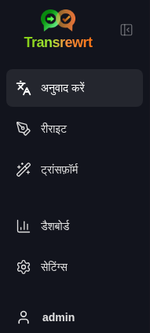
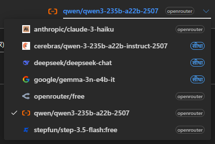
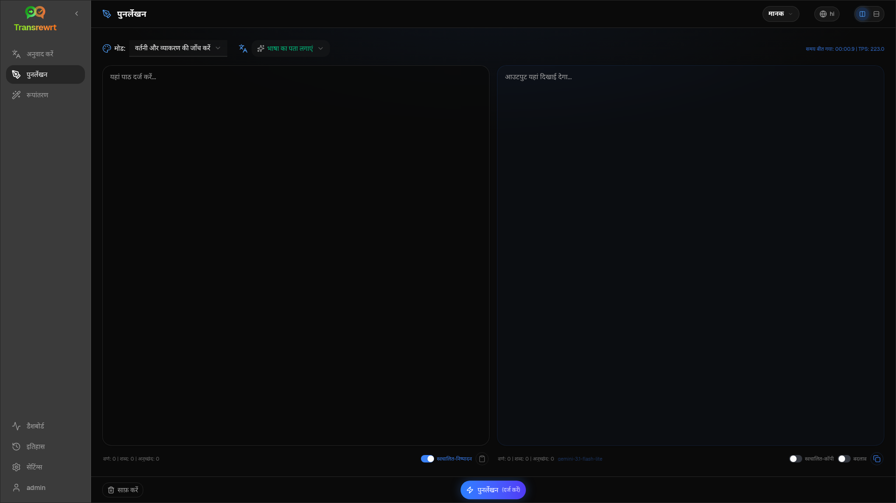
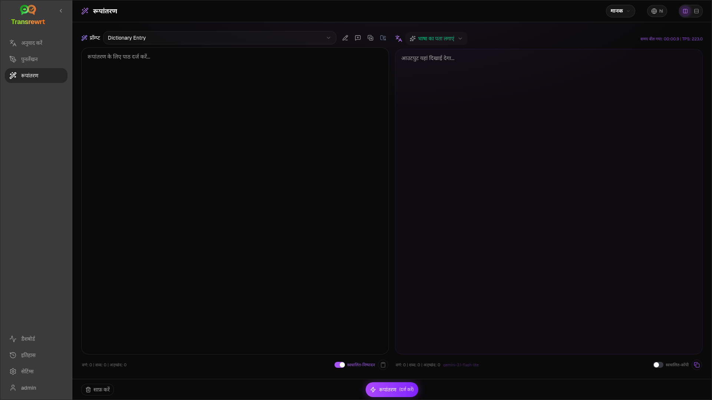
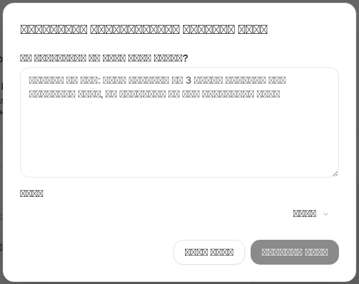
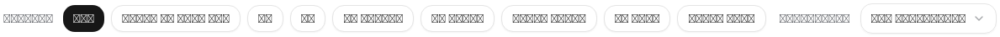

<a id="transrewrt-user-guide"></a>
# उपयोगकर्ता गाइड

<br/>

<a id="introduction"></a>
## परिचय

Transrewrt आपको तीन मुख्य तरीकों से टेक्स्ट के साथ काम करने में मदद करता है:

- **अनुवाद करें** - एक भाषा से दूसरी भाषा में टेक्स्ट को परिवर्तित करें।
- **रीराइट** - स्पष्ट, छोटा या अधिक औपचारिक जैसी अलग शैली में टेक्स्ट को फिर से लिखें।
- **ट्रांसफ़ॉर्म** - प्रॉम्प्ट नामक कस्टम एआई निर्देशों का उपयोग करके टेक्स्ट को प्रोसेस करें।

<br/>

यह गाइड बताती है कि ऐप को स्थापित और चल रहा होने के बाद इसका उपयोग कैसे करें। स्थापना के चरणों के लिए मुख्य **[README](README.hi.md)** देखें।

<br/>

> ℹ️ **नोट**<br/>
> Transrewrt Windows और Linux के लिए डेस्कटॉप ऐप के रूप में उपलब्ध है, और स्व-होस्टेड वेब ऐप के रूप में भी। यह गाइड ऐप के दैनिक उपयोग पर केंद्रित है। जहां कुछ केवल एक संस्करण पर लागू होता है, वहां स्पष्ट रूप से चिह्नित किया गया है।

<small>**अन्य भाषाओं में पढ़ें:** </small>
<small id="lang-list">[English (GB)](../USER-GUIDE.md) · [Português (Brasil)](./USER-GUIDE.pt-BR.md) · [العربية](./USER-GUIDE.ar.md) · [বাংলা](./USER-GUIDE.bn.md) · [Català](./USER-GUIDE.ca.md) · [中文 (中国大陆)](./USER-GUIDE.zh-CN.md) · [中文 (台灣)](./USER-GUIDE.zh-TW.md) · [Hrvatski](./USER-GUIDE.hr.md) · [Čeština](./USER-GUIDE.cs.md) · [Nederlands](./USER-GUIDE.nl.md) · [English (US)](./USER-GUIDE.en-US.md) · [Tagalog](./USER-GUIDE.tl.md) · [Français](./USER-GUIDE.fr.md) · [Deutsch](./USER-GUIDE.de.md) · [Ελληνικά](./USER-GUIDE.el.md) · [हिन्दी](./USER-GUIDE.hi.md) · [Magyar](./USER-GUIDE.hu.md) · [Italiano](./USER-GUIDE.it.md) · [日本語](./USER-GUIDE.ja.md) · [한국어](./USER-GUIDE.ko.md) · [Bahasa Melayu](./USER-GUIDE.ms.md) · [فارسی](./USER-GUIDE.fa.md) · [Polski](./USER-GUIDE.pl.md) · [Basa Jawa](./USER-GUIDE.jv.md) · [Português](./USER-GUIDE.pt.md) · [ਪੰਜਾਬੀ](./USER-GUIDE.pa.md) · [Română](./USER-GUIDE.ro.md) · [Русский](./USER-GUIDE.ru.md) · [Slovenčina](./USER-GUIDE.sk.md) · [Español](./USER-GUIDE.es.md) · [Kiswahili](./USER-GUIDE.sw.md) · [Svenska](./USER-GUIDE.sv.md) · [తెలుగు](./USER-GUIDE.te.md) · [ไทย](./USER-GUIDE.th.md) · [Türkçe](./USER-GUIDE.tr.md) · [Українська](./USER-GUIDE.uk.md) · [Tiếng Việt](./USER-GUIDE.vi.md)</small>

<small>

> **यूआई और दस्तावेज़ीकरण अनुवाद पर नोट:** मूल अंग्रेजी (यूके) के अलावा सभी इंटरफ़ेस भाषाओं का 
> एआई मॉडल का उपयोग करके अनुवाद किया गया था; शब्दावली अशुद्ध हो सकती है या त्रुटियां शामिल हो सकती हैं।

</small>

<br/>

<!-- START doctoc generated TOC please keep comment here to allow auto update -->
<!-- DON'T EDIT THIS SECTION, INSTEAD RE-RUN doctoc TO UPDATE -->
**विषय सूची**

- [शुरू करने से पहले](#before-you-start)
  - [मुफ्त OpenRouter API कुंजी कैसे प्राप्त करें (डेस्कटॉप ऐप)](#how-to-get-a-free-openrouter-api-key-desktop-app)
- [प्रारंभ करें](#getting-started)
- [विंडो के मुख्य भाग](#main-parts-of-the-window)
  - [साइडबार](#sidebar)
  - [टूलबार](#toolbar)
  - [इनपुट और आउटपुट पैनल](#input-and-output-panels)
- [अनुवाद करें](#translate)
  - [पाठ का अनुवाद करें](#translate-text)
  - [भाषा चयन](#language-selection)
  - [उपयोगी अनुवाद सेटिंग्स](#helpful-translation-settings)
- [पुनर्लेखन करें](#rewrite)
- [परिवर्तित करें](#transform)
  - [एक मौजूदा प्रॉम्प्ट चलाएँ](#run-an-existing-prompt)
  - [यदि आपके पास अभी तक कोई प्रॉम्प्ट नहीं है](#if-you-have-no-prompts-yet)
  - [त्वरित प्रॉम्प्ट बनाएँ](#create-a-prompt-quickly)
  - [एक प्रॉम्प्ट संपादित करें](#edit-a-prompt)
  - [उपयोग करने से पहले प्रॉम्प्ट का परीक्षण करें](#test-a-prompt-before-using-it)
- [डैशबोर्ड](#dashboard)
  - [डेटा फ़िल्टर करें](#filter-the-data)
  - [डैशबोर्ड टैब](#dashboard-tabs)
  - [डेटा निर्यात करें](#export-data)
  - [किसी मॉडल के लिए संग्रहीत रिकॉर्ड हटाएँ](#delete-stored-records-for-a-model)
- [इतिहास](#history)
  - [डेटा फ़िल्टर करें](#filter-the-data-1)
  - [इतिहास डेटा निर्यात करें](#export-history-data)
- [सेटिंग्स](#settings)
  - [सामान्य सेटिंग्स](#general-settings)
  - [मॉडल](#models)
  - [भाषाएँ](#languages)
  - [लागत ट्रैकिंग](#cost-tracking)
  - [परिवर्तन प्रॉम्प्ट](#transform-prompts)
  - [उपयोगकर्ता](#users)
  - [API कॉन्फ़िग](#api-config)
  - [बारे में](#about)
- [सामान्य समस्याएँ](#common-issues)
  - [ऐप पाठ का अनुवाद, पुनर्लेखन या परिवर्तन नहीं करता](#the-app-will-not-translate-rewrite-or-transform-text)
  - [मॉडल सूची खाली है](#the-model-list-is-empty)
  - [परिणाम बहुत धीमा है या बहुत महंगा है](#the-result-is-too-slow-or-too-expensive)
  - [इंटरफ़ेस गलत भाषा में है](#the-interface-is-in-the-wrong-language)
  - [पाठ बहुत छोटा है या पढ़ने में कठिनाई हो रही है](#the-text-is-too-small-or-hard-to-read)
  - [डैशबोर्ड चार्ट खाली हैं](#dashboard-charts-are-empty)
  - [लागत "उपलब्ध नहीं" दिखाती है या गलत लगती है](#cost-shows-not-available-or-seems-wrong)
  - [कुल लागत मेरे प्रदाता के बिल से मेल नहीं खाती](#total-cost-does-not-match-my-provider-bill)
  - [साइडबार से इतिहास पृष्ठ गायब है](#the-history-page-is-missing-from-the-sidebar)
  - [वेब ऐप: अप्रत्याशित रूप से लॉगिन पृष्ठ पर पुनर्निर्देशित किया गया](#web-app-redirected-to-the-login-page-unexpectedly)
  - [वेब एडमिन: पासवर्ड भूल गए या खो गए](#web-admin-forgot-or-lost-a-password)
  - [डैशबोर्ड अन्य उपयोगकर्ताओं के लिए कोई डेटा नहीं दिखाता (वेब)](#dashboard-shows-no-data-for-other-users-web)
  - [मैंने एक प्रॉम्प्ट बदल दी और संपादन खो गए](#i-changed-a-prompt-and-lost-the-edits)
- [त्वरित सुझाव](#quick-tips)
- [अस्वीकरण](#disclaimer)
- [लाइसेंस](#license)

<!-- END doctoc generated TOC please keep comment here to allow auto update -->

<br/><br/>

<a id="before-you-start"></a>
## शुरू करने से पहले

Transrewrt का उपयोग करने के लिए, आपको कम से कम एक एआई प्रदाता तक पहुंच की आवश्यकता है। समर्थित प्रदाता हैं: [OpenRouter](https://openrouter.ai) (जो कई मॉडलों को एकत्रित करता है), OpenAI, Anthropic, Google Gemini, DeepSeek, Groq, Mistral, xAI, Cerebras, और स्थानीय मॉडलों के लिए [Ollama](https://ollama.com)।

आपको शुरू करने के लिए कोई भुगतान वाला मॉडल चुनने की आवश्यकता नहीं है। जैसे ही आप अपनी OpenRouter API कुंजी जोड़ते हैं, ऐप स्वचालित रूप से एक अंतर्निहित **मुफ़्त** OpenRouter विकल्प सक्षम कर देता है। इससे आप तुरंत टेक्स्ट का अनुवाद, पुनर्लेखन और परिवर्तन शुरू कर सकते हैं। वैकल्पिक रूप से, आप Cerebras, Google, Groq, या Mistral AI से एक मुफ्त API कुंजी भी प्राप्त कर सकते हैं।

सरल भाषा में:

- एक **मॉडल** वह एआई इंजन है जो काम करता है। मॉडलों को एक **प्रदाता प्रत्यय** के साथ सूचीबद्ध किया जाता है (उदाहरण के लिए `openrouter/…`, `openai/…`, `ollama/…`)।
- एक **API कुंजी** (या, Ollama के लिए, एक **बेस URL**) वह तरीका है जिससे ऐप उस प्रदाता तक पहुंचता है।

यदि आप **डेस्कटॉप ऐप** का उपयोग कर रहे हैं, तो आपके द्वारा उपयोग किए जाने वाले प्रत्येक प्रदाता के लिए [**सेटिंग्स** > **API कॉन्फ़िग**](#api-config) में कुंजियाँ जोड़ें। केवल OpenRouter के उपयोग के लिए, नीचे [एक API कुंजी प्राप्त करने का तरीका](#how-to-get-an-api-key-desktop-app) देखें। यदि आप किसी API कुंजी का उपयोग नहीं करना चाहते हैं, तो आप Ollama को [ollama.com](https://ollama.com) से स्थापित कर सकते हैं और `translategemma:4b` जैसे स्थानीय मॉडल का उपयोग कर सकते हैं।

यदि आप **वेब संस्करण** का उपयोग कर रहे हैं, तो सर्वर मालिक पर्यावरण चर के साथ प्रदाताओं को कॉन्फ़िगर करता है, इसलिए आप आवेदन में सीधे API कुंजियाँ दर्ज नहीं कर सकते हैं।

<br/>

<a id="how-to-get-an-api-key-desktop-app"></a>
### एक मुफ़्त OpenRouter API कुंजी प्राप्त करने का तरीका (डेस्कटॉप ऐप)

यदि आप डेस्कटॉप ऐप का उपयोग कर रहे हैं, तो इन चरणों का पालन करें:

1. अपने वेब ब्राउज़र में [OpenRouter](https://openrouter.ai) पर जाएँ।
2. एक खाता बनाएँ या साइन इन करें।
3. [Keys](https://openrouter.ai/keys) पृष्ठ खोलें।
4. एक नई API कुंजी बनाने के लिए बटन पर क्लिक करें।
5. बाद में पहचानने के लिए कुंजी का एक नाम दें।
6. नई API कुंजी को कॉपी करें।
7. Transrewrt पर वापस जाएँ और **सेटिंग्स** > **API कॉन्फ़िग** खोलें।
8. कुंजी को **OpenRouter API कुंजी** में पेस्ट करें (**सेटिंग्स** > **API कॉन्फ़िग** के तहत)।
9. यह सुनिश्चित करने के लिए कि यह काम करती है, **OpenRouter कुंजी का परीक्षण करें** पर क्लिक करें।

<br/><br/>

<a id="getting-started"></a>
## शुरुआत

यदि यह आपका Transrewrt का पहला उपयोग है, तो इस क्रम का पालन करें:

1. ऐप खोलें।
2. आवश्यकता होने पर ग्लोब आइकन से अपनी **इंटरफ़ेस भाषा** चुनें।
3. यदि आप **डेस्कटॉप ऐप** पर हैं, तो [**सेटिंग्स** > **API कॉन्फ़िग**](#api-config) खोलें, कम से कम एक प्रदाता (उदाहरण के लिए OpenRouter) के लिए एक API कुंजी जोड़ें, और यह सत्यापित करने के लिए **परीक्षण** पर क्लिक करें कि यह काम करती है।
4. [**सेटिंग्स** > **मॉडल**](#models) खोलें और **चयनित मॉडल** में एक या अधिक मॉडल जोड़ें।
5. [**सेटिंग्स** > **भाषाएँ**](#languages) खोलें और यदि आप चाहते हैं कि आपकी सबसे अधिक उपयोग की जाने वाली भाषाएँ पहले दिखाई दें तो अपनी **शीर्ष भाषाएँ** चुनें।
6. **अनुवाद करें** पर जाएँ और सब कुछ काम कर रहा है यह पुष्टि करने के लिए एक सरल अनुवाद चलाएँ।
7. एक बार यह काम करने लगे, तो **पुनर्लेखन करें** और फिर **परिवर्तित करें** का प्रयास करें।

इस क्रम का महत्व है। यह सबसे आम पहले उपयोग की समस्या को रोकता है: ऐप में काम करने वाला API कनेक्शन या चयनित मॉडल होने से पहले कार्य चलाने का प्रयास करना।

<br/><br/>

<a id="main-parts-of-the-window"></a>
## विंडो के मुख्य भाग

ऐप तीन मुख्य क्षेत्रों में विभाजित है:

- बाईं ओर **साइडबार**।
- ऊपर की ओर **टूलबार**।
- केंद्र में **कार्य क्षेत्र**।

<br/>

<a id="sidebar"></a>
### साइडबार

ऐप में आगे-पीछे जाने के लिए साइडबार का उपयोग करें। आप ऐप लोगो के बगल वाले आइकन पर क्लिक करके अधिक जगह के लिए साइडबार को संक्षिप्त कर सकते हैं।

<br/>

<table>
  <tr>
    <td valign="top">
       
    </td>
    <td valign="top">
      <br/><br/>
      <ul>
        <li><strong>अनुवाद करें</strong> अनुवाद कार्यस्थल खोलता है।</li><br/>
        <li><strong>रीराइट</strong> पुनर्लेखन कार्यस्थल खोलता है।</li><br/>
        <li><strong>ट्रांसफ़ॉर्म</strong> कस्टम प्रॉम्प्ट कार्यस्थल खोलता है।</li><br/>
        <li><strong>डैशबोर्ड</strong> उपयोग और लागत सूचना दिखाता है।</li><br/>
        <li><strong>सेटिंग्स</strong> सेटिंग्स पैनल खोलता है।</li><br/>
        <li><strong>हिस्ट्री</strong> इनपुट और आउटपुट पाठ के साथ उपयोग इतिहास दिखाता है</li><br/>
        <li><strong>उपयोगकर्ता</strong> लॉग इन किए गए उपयोगकर्ता का उपयोगकर्ता नाम दिखाता है (केवल वेब)।</li>
      </ul>
    </td>
  </tr>
</table>

<br/>

<a id="toolbar"></a>
### टूलबार

टूलबार थोड़ा बदल जाता है जिसके आधार पर आप ऐप में कहाँ हैं।

- बाईं ओर, यह वर्तमान पृष्ठ का नाम दिखाता है।
- दाईं ओर, यह **मॉडल चयनकर्ता** और **इंटरफ़ेस भाषा** नियंत्रण दिखाता है।

**मॉडल सिलेक्टर** आपको वर्तमान कार्य के लिए कौन सा एआई इंजन उपयोग करना है, यह चुनने की अनुमति देता है।



कुछ मुफ़्त मॉडल हमेशा उपलब्ध नहीं हो सकते हैं—कभी-कभी वे ऑफ़लाइन होते हैं या उपयोग की सीमा होती है। यदि ऐसा होता है, तो ऐप उपलब्ध सूची से उस मॉडल को स्वचालित रूप से हटा देगा। जो मॉडल दिखाई दें, उन्हें नियंत्रित करने के लिए, [**सेटिंग्स** > **मॉडल**](#models) पर जाएँ और अपनी मॉडल सूची संपादित करें।  
आप टूलबार में मॉडल नाम के बाईं ओर प्रदाता आइकन पर क्लिक करके सीधे मॉडल सेटिंग्स भी खोल सकते हैं।

<br/>

**ग्लोब आइकन + भाषा कोड** ऐप इंटरफ़ेस भाषा, जैसे मेनू और बटन, को बदलता है। यह **अनुवाद** में उपयोग की जाने वाली भाषाओं को **नहीं** बदलता है।


<br/>

<a id="input-and-output-panels"></a>
### इनपुट और आउटपुट पैनल

अधिकांश वर्कस्पेस बाईं ओर का **इनपुट** पैनल और दाईं ओर का **आउटपुट** पैनल उपयोग करते हैं।

प्रत्येक पैनल निम्नलिखित भी दिखाता है:

| **इनपुट**                                                          | **आउटपुट**                                                                                                                  |
|--------------------------------------------------------------------|-----------------------------------------------------------------------------------------------------------------------------|
| - अक्षर गणना <br/>- शब्द गणना <br/>- पैराग्राफ गणना   <br/> | - कार्य को पूरा करने में लगा समय<br/>- **TPS** (प्रति सेकंड टोकन)<br/>- अक्षर, शब्द और पैराग्राफ गणना<br/>- उपयोग किया गया मॉडल |

यदि आप तकनीकी शब्दों के बारे में सोच रहे हैं:

- **टोकन** का अर्थ है पाठ का एक छोटा टुकड़ा। आप इसे एक शब्द के भाग या एक छोटे शब्द के रूप में समझ सकते हैं।
- **TPS** का अर्थ है कि मॉडल ने प्रति सेकंड कितने पाठ के टुकड़े संसाधित किए।

<br/>

आप प्रत्येक ऑपरेशन की लागत (यदि उपलब्ध हो) और कुल लागत की भी निगरानी कर सकते हैं, विकल्प `Show cost information on the actions` को सक्षम करके [**सेटिंग्स** > **सामान्य सेटिंग्स**](#general-settings) में।

<br/><br/>

[--------------------------------------------------------------------------------------------------------------------------]: #

<a id="translate"></a>
## अनुवाद

जब आप किसी पाठ को एक भाषा से दूसरी भाषा में बदलना चाहते हैं तो **अनुवाद** का उपयोग करें।


<br/>

<a id="translate-text"></a>
### पाठ का अनुवाद करें

1. **अनुवाद करें** खोलें।
2. **से** में एक भाषा चुनें।
3. **के लिए** में एक भाषा चुनें।
4. टूलबार में एक मॉडल चुनें।
5. **इनपुट** में पाठ टाइप या पेस्ट करें।
6. **अनुवाद करें** पर क्लिक करें।
7. परिणाम को **आउटपुट** में पढ़ें।
8. यदि आप परिणाम कॉपी करना चाहते हैं तो कॉपी बटन का उपयोग करें।

<br/>

<a id="language-selection"></a>
### भाषा चयन

- **से** एक विशिष्ट भाषा या **भाषा पहचानें** हो सकती है।
- **के लिए** वह भाषा है जिसमें आप परिणाम चाहते हैं।

आपकी चयनित **शीर्ष भाषाएँ** सूची के शीर्ष पर दिखाई देती हैं। आप इन्हें [**सेटिंग्स** > **भाषाएँ**](#languages) में सेट कर सकते हैं।

<br/>

<a id="helpful-translation-settings"></a>
### उपयोगी अनुवाद सेटिंग्स

[**सेटिंग्स** > **सामान्य सेटिंग्स**](#general-settings) में, आप यह बदल सकते हैं कि अनुवाद कैसे काम करता है:

- **पेस्ट करने पर स्वतः अनुवाद** पाठ पेस्ट करते ही एक अनुवाद चलाता है।
- **परिणाम को क्लिपबोर्ड पर स्वतः कॉपी करें** सफल चलाने के बाद परिणाम को स्वचालित रूप से कॉपी कर देता है।
- **वास्तविक समय अनुवाद (टाइप करते समय)** आपके टाइप करते समय अनुवाद चलाता है।
- **समय समाप्ति (ms)** नियंत्रित करता है कि वास्तविक समय अनुवाद चलाने से पहले ऐप कितनी देर तक प्रतीक्षा करेगा।
- **Enter** यह नियंत्रित करता है कि जब आप `Enter` दबाते हैं तो क्या होता है:

<br/><br/>

[--------------------------------------------------------------------------------------------------------------------------]: #

<a id="rewrite"></a>
## रीराइट

**रीराइट** का उपयोग तब करें जब आप मुख्य अर्थ को बदले बिना शब्दों में सुधार करना चाहते हों।



यह निम्नलिखित के लिए उपयोगी है:

- वर्तनी और व्याकरण को ठीक करना (**वर्तनी और व्याकरण की जाँच करें**)
- पाठ को स्पष्ट बनाना (**स्पष्टता में सुधार करें**)
- एक ही चलाने में कई अलग-अलग पुनर्सूत्रीकरण (**वैकल्पिक संस्करण**)
- पाठ को अधिक औपचारिक या अनौपचारिक बनाना (**औपचारिक** / **अनौपचारिक**)
- पाठ को छोटा या लंबा करना (**छोटा करें** / **विस्तार करें**)
- पाठ को अधिक तकनीकी बनाना (**तकनीकी बनाएं**)

<br/>

> 💡 **टिप**<br/>
> जब आप "**वर्तनी और व्याकरण जाँचें**" मोड का उपयोग करते हैं, तो आउटपुट पैनल में ( **कॉपी** के बगल में) **परिवर्तन दिखाएं।** स्विच दिखाई देता है।
> अपने पाठ पर लागू किए गए विशिष्ट सुधारों को दिखाने या छिपाने के लिए इसे चालू या बंद करें।

<br/><br/>

[--------------------------------------------------------------------------------------------------------------------------]: #

<a id="transform"></a>
## ट्रांसफ़ॉर्म

**ट्रांसफ़ॉर्म** का उपयोग तब करें जब आप चाहते हैं कि एआई निर्देशों के एक कस्टम सेट का पालन करे।



यह ऐप का सबसे लचीला हिस्सा है। आप इसका उपयोग निम्नलिखित तरह के कार्यों के लिए कर सकते हैं:

- नोट्स का सारांश तैयार करना
- कच्चे पाठ को एक सुव्यवस्थित ईमेल में बदलना
- मुख्य बिंदुओं को निकालना
- पाठ को एक विशिष्ट प्रारूप में बदलना
- इनपुट पाठ के साथ कोई अन्य कस्टम गतिविधि

<br/>

<a id="run-an-existing-prompt"></a>
### मौजूदा प्रॉम्प्ट चलाएँ

1. **ट्रांसफॉर्म** खोलें।
2. प्रॉम्प्ट सूची से एक प्रॉम्प्ट चुनें।
3. यदि **लक्ष्य** भाषा बॉक्स दिखाई दे, तो चाहें तो एक भाषा चुनें।
4. **इनपुट** में पाठ टाइप करें या पेस्ट करें।
5. **ट्रांसफॉर्म** पर क्लिक करें।
6. **आउटपुट** में परिणाम पढ़ें।

<br/>

<a id="if-you-have-no-prompts-yet"></a>
### यदि आपके पास अभी तक कोई प्रॉम्प्ट नहीं है

यदि आपकी प्रॉम्प्ट सूची खाली है, तो ट्रांसफ़ॉर्म वर्कस्पेस में **नमूना प्रॉम्प्ट लोड करें** पर क्लिक करें। निर्यात/आयात पंक्ति में [**सेटिंग्स** > **ट्रांसफ़ॉर्म प्रॉम्प्ट**](#transform-prompts) पर यही नियंत्रण हमेशा उपलब्ध है। दोनों बिल्ट-इन उदाहरण जोड़ते हैं ताकि आप जल्दी शुरुआत कर सकें।

<br/>

> ℹ️ **नोट**<br/>
> नमूना प्रॉम्प्ट अंग्रेजी में प्रदान किए गए हैं। उन्हें लोड करने के बाद, आप एक प्रॉम्प्ट को संपादित कर सकते हैं और इसे अपनी भाषा में अनुवाद करने के लिए **संकेत अनुवाद करें** का उपयोग कर सकते हैं।

<br/>

<a id="create-a-prompt-quickly"></a>
### जल्दी से एक प्रॉम्प्ट बनाएँ

एक प्रॉम्प्ट बनाने का सबसे तेज़ तरीका है:

1. **नया प्रॉम्प्ट** पर क्लिक करें।
2. **प्रॉम्प्ट उत्पन्न करें** पर क्लिक करें।
3. बताएं कि आप चाहते हैं कि प्रॉम्प्ट क्या करे।
4. एक मॉडल चुनें।
5. ऐप को आपके लिए एक मसौदा बनाने दें।
6. मसौदे की समीक्षा करें और **सहेजें** पर क्लिक करें।



<br/>

<a id="edit-a-prompt"></a>
### प्रॉम्प्ट संपादित करें

जब आप कोई प्रॉम्प्ट बनाते या संपादित करते हैं, तो संपादक बाईं ओर दिखाई देता है और दाईं ओर एक परीक्षण क्षेत्र दिखाई देता है।


मुख्य फ़ील्ड हैं:

- **प्रॉम्प्ट नाम**: प्रॉम्प्ट सूची में दिखाया गया नाम।
- **प्रॉम्प्ट निर्देश (वैकल्पिक)**: एक छोटी सूचना जो प्रॉम्प्ट चलाते समय उपयोगकर्ता को दिखाई जाती है।
- **मॉडल भूमिका**: एआई को दी गई समग्र भूमिका, जैसे 'आप एक सहायक सहायक हैं।'
- **मॉडल निर्देश (प्रति पंक्ति एक)**: विशिष्ट नियम जिनका आप चाहते हैं कि एआई पालन करे।
- **आउटपुट विवरण**: परिणाम का वर्णन करने वाला एक छोटा शब्द, जैसे 'सारांश' या 'पुनर्लेखन'।
- **तापमान (0.0 → 1.0)**: मॉडल कैसे व्यवहार करेगा; नीचे देखें।
- **लक्ष्य भाषा के लिए पूछें**: प्रॉम्प्ट चलाते समय लक्ष्य भाषा चयनकर्ता जोड़ता है।

यदि तकनीकी शब्द **तापमान** आपके लिए नया है, तो इसे इस तरह समझें:

- **कम** तापमान स्थिर, अधिक भविष्यसूचक परिणाम देता है।
- **उच्च** तापमान अधिक विविधता और रचनात्मकता देता है।

आप इसका भी उपयोग कर सकते हैं:

- **`Generate prompt`** एक सरल विवरण से एक नया मसौदा बनाने के लिए
- **`Improve prompt`** मौजूदा प्रॉम्प्ट को सुधारने के लिए
- **`Translate prompt`** प्रॉम्प्ट फ़ील्ड का अनुवाद करने के लिए

<br/>

> ⚠️ **चेतावनी**<br/>
> **`Back to Run`** पर क्लिक करने से पहले **`Save`** पर क्लिक करें। यदि आप बिना सहेजे वापस जाते हैं, तो आपके परिवर्तन खो जाएंगे।

<br/>

<a id="test-a-prompt-before-using-it"></a>
### उपयोग से पहले प्रॉम्प्ट का परीक्षण करें

दाईं ओर का परीक्षण पैनल आपको नमूना पाठ के साथ अपने प्रॉम्प्ट का परीक्षण करने की अनुमति देता है, जिससे आप इसे दैनिक कार्य में उपयोग करने से पहले आज़मा सकते हैं।

यह तब उपयोगी होता है जब:

- आप एक नया प्रॉम्प्ट बना रहे हैं
- आप एक प्रॉम्प्ट के दो संस्करणों की तुलना कर रहे हैं
- आप स्वर, लंबाई या आउटपुट प्रारूप की जांच करना चाहते हैं

<br/>

> ℹ️ **नोट**<br/>
> आप [**सेटिंग्स** > **ट्रांसफ़ॉर्म प्रॉम्प्ट**](#transform-prompts) में सहेजे गए प्रॉम्प्ट का निर्यात और आयात कर सकते हैं।

<br/><br/>

[--------------------------------------------------------------------------------------------------------------------------]: #

<a id="dashboard"></a>
## डैशबोर्ड

ऐप का आपके द्वारा कितना उपयोग किया जा रहा है और इसकी क्या लागत है (भुगतान वाले मॉडल के लिए), यह देखने के लिए **डैशबोर्ड** का उपयोग करें।


<br/>

> ℹ️ **नोट**<br/>
> यदि आप केवल **मुफ़्त** मॉडल का उपयोग करते हैं, तो **लागत** राशि शून्य हो सकती है और लागत-केंद्रित सारांश खाली लग सकते हैं। **सारांश** पर, **समय के साथ उपयोग** और **मॉडल द्वारा उपयोग** अभी भी चयनित अवधि में आपकी गतिविधि होने पर **कॉल की संख्या** (अनुवाद, रीराइट और ट्रांसफ़ॉर्म) दिखाते हैं।

<br/>

<a id="filter-the-data"></a>
### डेटा फ़िल्टर करें

समय सीमा बदलने के लिए शीर्ष पर फ़िल्टर बटन का उपयोग करें।



<br/>

> ℹ️ **नोट**<br/>
> **उपयोगकर्ता** फ़िल्टर केवल वेब संस्करण में व्यवस्थापकों के लिए दृश्यमान है। सामान्य उपयोगकर्ता इस फ़िल्टर को नहीं देखेंगे, और यह डेस्कटॉप ऐप में उपलब्ध नहीं है।

<br/>

<a id="dashboard-tabs"></a>
### डैशबोर्ड टैब

- **सारांश** उपयोग और लागत का एक अवलोकन देता है। इसमें **समय के साथ उपयोग** (अनुवाद, पुनर्लेखन और ट्रांसफॉर्म के लिए दैनिक जमा **कॉल गणना**) और **मॉडल द्वारा उपयोग** (कुल **प्रति मॉडल कॉल**, ट्रांसफॉर्म सहित) शामिल है।
- **उपयोग द्वारा** गतिविधि को अनुवाद भाषा, पुनर्लेखन मोड और ट्रांसफॉर्म प्रॉम्प्ट द्वारा विभाजित करता है।
- **मॉडल द्वारा** दिखाता है कि आपने कौन से मॉडल का उपयोग किया और उनकी लागत क्या थी।
- **दिन द्वारा** दैनिक कुल योग दिखाता है।
- **सभी कॉल** पूर्ण कॉल इतिहास दिखाता है और आपको इसे निर्यात करने की अनुमति देता है।

<br/>

<a id="export-data"></a>
### डेटा निर्यात करें

डैशबोर्ड तालिकाएँ निम्नलिखित में डेटा निर्यात कर सकती हैं:

- **JSON**
- **CSV**
- **XLSX**

यदि आप ऐप के बाहर गतिविधि की समीक्षा करना चाहते हैं या एक रिपोर्ट साझा करना चाहते हैं, तो यह उपयोगी है।

<br/>

<a id="delete-stored-records-for-a-model"></a>
### किसी मॉडल के लिए संग्रहीत रिकॉर्ड हटाएँ

**मॉडल के अनुसार** या **सभी कॉल** में, आप "कचरा बिन" आइकन पर क्लिक करके किसी मॉडल के लिए संग्रहीत रिकॉर्ड हटा सकते हैं।

> ⚠️ **चेतावनी**<br/>
> संग्रहीत रिकॉर्ड हटाना पूर्ववत नहीं किया जा सकता। केवल तभी इसका उपयोग करें जब आपको यकीन हो कि आपको उस इतिहास की आवश्यकता नहीं है।

सभी डेटा हटाने या उनकी आयु के आधार पर रिकॉर्ड हटाने के लिए, [**सेटिंग्स** > **लागत ट्रैकिंग**](#cost-tracking) पर जाएँ। वहाँ आपको सभी संग्रहीत डेटा या केवल एक निश्चित तारीख से पुराने डेटा को हटाने के विकल्प मिलेंगे।

<br/><br/>

[--------------------------------------------------------------------------------------------------------------------------]: #

<a id="history"></a>
## हिस्ट्री

**Transrewrt** के अंदर अपनी क्रियाओं के इतिहास को देखने के लिए **हिस्ट्री** पर क्लिक करें, जिसमें प्रत्येक ऑपरेशन का इनपुट और आउटपुट भी शामिल है।


<br/>

<a id="filter-the-history"></a>
### डेटा फ़िल्टर करें

**हिस्ट्री** **डैशबोर्ड** पृष्ठ के समान फ़िल्टर का उपयोग करता है। समय सीमा चुनने के लिए उनका उपयोग करें।


<br/>

> ℹ️ **नोट**<br/>
> **उपयोगकर्ता** फ़िल्टर केवल वेब संस्करण में व्यवस्थापकों के लिए दृश्यमान है। सामान्य उपयोगकर्ता इस फ़िल्टर को नहीं देखेंगे, और यह डेस्कटॉप ऐप में उपलब्ध नहीं है।

<br/>

<a id="export-history-data"></a>
### इतिहास डेटा निर्यात करें

इतिहास पृष्ठ फ़िल्टर किए गए डेटा को निम्नलिखित में निर्यात कर सकता है:

- **JSON**
- **CSV**
- **XLSX**

यदि आप ऐप के बाहर गतिविधि की समीक्षा करना चाहते हैं या एक रिपोर्ट साझा करना चाहते हैं, तो यह उपयोगी है।

<br/><br/>

[--------------------------------------------------------------------------------------------------------------------------]: #

<a id="settings"></a>
## सेटिंग्स

ऐप के व्यवहार को अनुकूलित करने के लिए साइडबार से **सेटिंग्स** खोलें।

उपलब्ध टैब प्लेटफॉर्म और आपकी भूमिका पर निर्भर करते हैं:

| टैब | डेस्कटॉप | वेब (प्रशासक) | वेब (सामान्य उपयोगकर्ता) |
|-------------------|:-------:|:-----------:|:------------------:|
| सामान्य सेटिंग्स | हाँ | हाँ | हाँ |
  | मॉडल | हाँ | हाँ | हाँ |
  | भाषाएँ | हाँ | हाँ | हाँ |
  | लागत ट्रैकिंग | हाँ | हाँ | - |
  | ट्रांसफॉर्म प्रॉम्प्ट | हाँ | हाँ | हाँ |
  | उपयोगकर्ता | - | हाँ | - |
  | API कॉन्फ़िगरेशन        |   हाँ   |     हाँ     |         -          |
  | बारे में             |   हाँ   |     हाँ     |        हाँ         |

<br/>

> ℹ️ **नोट**<br/>
> वेब संस्करण में, प्रत्येक उपयोगकर्ता की अपनी कॉन्फ़िगरेशन होती है। चयनित मॉडल, भाषाएँ, सामान्य विकल्प और ट्रांसफ़ॉर्म प्रॉम्प्ट जैसी सेटिंग्स प्रत्येक उपयोगकर्ता के लिए संग्रहीत की जाती हैं। आपके द्वारा किए गए परिवर्तन अन्य उपयोगकर्ताओं को प्रभावित नहीं करते हैं।

<br/>

[--------------------------------------------------------------------------------------------------------------------------]: #

<a id="general-settings"></a>
### सामान्य सेटिंग्स

टाइपिंग व्यवहार, यह नियंत्रित करने के लिए कि **हिस्ट्री** के लिए निष्पादन विवरण संग्रहीत किए जाते हैं या नहीं, और दिखावट को नियंत्रित करने के लिए **सामान्य सेटिंग्स** का उपयोग करें।

**व्यवहार**

- **ENTER के लिए व्यवहार** यह चुनता है कि क्या `Enter` कार्य को चलाएगा या एक नई पंक्ति डालेगा।
- **पेस्ट करने पर स्वत: अनुवाद** तुरंत अनुवाद शुरू करता है जैसे ही आप पाठ पेस्ट करते हैं।
- **परिणाम को क्लिपबोर्ड पर स्वत: कॉपी करें** सफल परिणामों को स्वचालित रूप से कॉपी करता है।
- **वास्तविक समय अनुवाद (टाइप करते समय)** टाइप करते समय अनुवाद करता है।
- **समय समाप्ति (ms)** वास्तविक समय अनुवाद के लिए प्रतीक्षा समय निर्धारित करता है।

**हिस्ट्री**

- **निष्पादन हिस्ट्री बनाए रखें।** नियंत्रित करता है कि प्रत्येक अनुवाद, रीराइट और ट्रांसफ़ॉर्म साइडबार [**हिस्ट्री**](#history) दृश्य के लिए **इनपुट और आउटपुट पाठ** संग्रहीत करता है या नहीं। इसे बंद करने पर पुष्टि के लिए कहा जाता है; यदि आप पुष्टि करते हैं, तो संग्रहीत इतिहास पाठ डेटाबेस से हटा दिया जाता है।
- **हिस्ट्री डेटा हटाएं।** आपको आयु के आधार पर (उदाहरण के लिए कुछ महीनों से पुराना, या **सभी डेटा (साफ़ करें)**) **डेटा हटाएँ** का उपयोग करके संग्रहीत पाठ को हटाने की अनुमति देता है। यह केवल **हिस्ट्री** दृश्य के लिए सहेजे गए निष्पादन पाठ को प्रभावित करता है; यह **लागत या उपयोग कुल योग** को नहीं हटाता है। **लागत** डेटा को हटाने या काटने के लिए, [**सेटिंग्स** > **लागत ट्रैकिंग**](#cost-tracking) का उपयोग करें।

**दिखावट**

- **क्रियाओं पर लागत जानकारी दिखाएं** प्रति ऑपरेशन लागत (यदि उपलब्ध हो) और अनुवाद, पुनर्लेखन और परिवर्तन आउटपुट पैनलों पर कुल लागत के प्रदर्शन को नियंत्रित करता है।
- **लागत भिन्न अंक** लागत दशमलव के प्रदर्शन को बदलता है।
- **केवल वेब:** **ऐप के चारों ओर मार्जिन दिखाएं** इंटरफ़ेस के चारों ओर अतिरिक्त स्थान जोड़ता है।
- **फ़ॉन्ट फ़ैमिली** पाठ पैनलों में लिखावट के फ़ॉन्ट को बदलता है।
- **आकार** फ़ॉन्ट आकार को बदलता है।

**कॉन्फ़िगरेशन बैकअप**

- **बैकअप में उपयोग डेटा शामिल करें** - जब सक्षम हो, तो ZIP में निष्पादन इतिहास और API कॉल डेटा भी शामिल होता है। 
- **बैकअप कॉन्फ़िगरेशन** - एकल ZIP (UTC में `transrewrt-config-backup-YYYY-MM-DD_HHMMSS.zip` डिफ़ॉल्ट रूप से) बनाता है जिसमें `config.json`, `state.json`, वैकल्पिक एन्क्रिप्शन कुंजी, उपयोगकर्ता, पसंद, कस्टम प्रॉम्प्ट्स और उपयोग डेटा शामिल होता है यदि आपने चुना है। सफल बैकअप के बाद, पुष्टि सहेजी गई फ़ाइल का नाम दिखाती है।
- **बैकअप से पुनर्स्थापित करें** - पहले एक **पुष्टि संवाद** खोलता है। संवाद के अंदर बैकअप ZIP चुनें (**ब्राउज़** / फ़ाइल पिकर या समर्थित क्षेत्रों में ड्रैग-एंड-ड्रॉप), फिर विकल्पों की समीक्षा करें:
  - **उपयोग डेटा पुनर्स्थापित करें** - जब ZIP को उपयोग शामिल करके बैकअप किया गया हो तो उससे उपयोग/इतिहास आयात करें; यदि आप केवल सेटिंग्स और प्रॉम्प्ट्स चाहते हैं तो इसे बंद रखें।
  - **पुनर्स्थापना से पहले पुराना उपयोग डेटा साफ़ करें** - बैकअप लागू करने से पहले इंस्टॉल पर मौजूदा उपयोग/इतिहास को हटा देता है (वैकल्पिक; जब आप साफ़ प्रतिस्थापन चाहते हैं तो उपयोग करें)।

वेब या डेस्कटॉप संस्करण में बनाए गए बैकअप को दूसरे में पुनर्स्थापित किया जा सकता है। वेब संस्करण में डेस्कटॉप बैकअप को पुनर्स्थापित करते समय, डेटा व्यवस्थापक उपयोगकर्ता में पुनर्स्थापित किया जाएगा।

<br/>

<a id="models"></a>
### मॉडल

टूलबार में दिखने वाले मॉडल को चुनने के लिए **सेटिंग्स** > **मॉडल** का उपयोग करें।


पृष्ठ में दो सूचियाँ हैं:

- बाईं ओर **उपलब्ध मॉडल**
- दाईं ओर **चयनित मॉडल**

उपयोगी नियंत्रण में शामिल हैं:

- **मॉडल्स की खोज करें...** नाम से मॉडल खोजने के लिए
- **प्रदाता** चिप्स सूची को एक इंजन (OpenRouter, OpenAI, Ollama, …) तक सीमित करने के लिए
- **केवल मुफ्त** केवल मुफ्त मॉडल्स दिखाने के लिए
- **ताज़ा करें** सूची को पुनः लोड करने के लिए
- **सभी विस्तारित करें** और **सभी संक्षिप्त करें** जब आप प्रदाता के अनुसार सॉर्ट कर रहे हों

मॉडल आईडी में प्रदाता उपसर्ग शामिल है (उदाहरण के लिए `openrouter/…` बनाम `openai/…`)। **OpenAI (OpenRouter)** बनाम **OpenAI (सीधा)** जैसे बैज दिखाते हैं कि ट्रैफ़िक को कैसे मार्ग प्रदान किया जा रहा है।

> ℹ️ **नोट**<br/>
> **OpenRouter बॉडी बिल्डर** (`openrouter/bodybuilder`) एक राउटर मॉडल है, सामान्य चैट मॉडल नहीं: इसकी प्रतिक्रिया JSON है जो OpenRouter API अनुरोध बॉडी का वर्णन करती है (उदाहरण के लिए `requests` सरणी जिसमें `model` और `messages` है)। यदि आप इसका उपयोग **अनुवाद करें**, **रीराइट**, या **ट्रांसफ़ॉर्म** के लिए करते हैं, तो आउटपुट पैनल में पूर्ण पाठ के बजाय वह JSON दिखाई देगा। इन कार्यों के लिए एक सामान्य पाठ मॉडल चुनें। OpenRouter पर [बॉडी बिल्डर मॉडल पृष्ठ](https://openrouter.ai/openrouter/bodybuilder) देखें।

क्रियाएं:

- मॉडल जोड़ने के लिए, **जोड़ें** पर क्लिक करें या प्रविष्टि में कहीं भी क्लिक करें।

- मॉडल को हटाने के लिए, **चयनित मॉडल** में इसके बगल में **X** पर क्लिक करें या उपलब्ध मॉडल में प्रविष्टि पर **चयनित** पर क्लिक करें।

- सूची को साफ़ करने के लिए, **सभी अचयनित करें** पर क्लिक करें। आवश्यक मुफ्त मॉडल सूची में बना रहेगा।

<br/>

> ℹ️ **नोट**<br/>
> यदि आप OpenRouter में तुरंत क्रेडिट जोड़ना नहीं चाहते हैं, तो **केवल मुफ़्त** सक्षम करके शुरू करें और मुफ्त मॉडल चुनें (क्रेडिट कार्ड की आवश्यकता नहीं है)। आप किसी भी API कुंजी के बिना मॉडल को स्थानीय रूप से चलाने के लिए Ollama का उपयोग भी कर सकते हैं।

<br/>

<a id="languages"></a>
### भाषाएँ

ऐप में उपयोग की जाने वाली भाषा सूचियों को व्यवस्थित करने के लिए **सेटिंग्स** > **भाषाएँ** का उपयोग करें।

- **शीर्ष भाषाएँ** **अनुवाद करें** और **ट्रांसफ़ॉर्म** में भाषा सूचियों के ऊपरी हिस्से के पास पिन की गई हैं।
- **कस्टम भाषा** आपको बिल्ट-इन सूची में न शामिल एक भाषा जोड़ने की अनुमति देती है।

यदि आप एक कस्टम भाषा जोड़ते हैं, तो यह बिल्ट-इन विकल्पों के साथ भाषा चयनकर्ताओं में दिखाई देती है।

<br/>

<a id="cost-tracking"></a>
### लागत ट्रैकिंग

लागत जानकारी को प्रबंधित करने के लिए **सेटिंग्स** > **लागत ट्रैकिंग** का उपयोग करें।

- **कुल लागत** चल रहे कुल योग को दिखाता है।
- **मान कॉपी करें** कुल योग को क्लिपबोर्ड पर कॉपी करता है।
- **लागत रीसेट करें** संग्रहीत कुल योग को शून्य पर रीसेट करता है।
- **API कुंजी उपयोग के साथ सिंक करें** कुल योग को आपके OpenRouter खाते द्वारा रिपोर्ट किए गए उपयोग के अनुरूप सेट करता है (केवल OpenRouter)।
- **API कुंजी उपयोग** OpenRouter उपयोग विवरण दिखाता है, यदि उपलब्ध हो।
- **लागत डेटा हटाएं** सभी डेटा या केवल चयनित तिथि से पुराने प्रविष्टियाँ हटाता है।

**लागत ट्रैकिंग:** जब आप OpenRouter मॉडल का उपयोग करते हैं, तो ऐप OpenRouter से लागत जानकारी के आधार पर आपके वास्तविक उपयोग और खर्च को दिखाता है। अन्य सभी प्रदाताओं के लिए, ऐप OpenRouter द्वारा प्रकाशित मूल्यों का उपयोग करके लागत का अनुमान लगाता है, यदि मूल्य अनुपलब्ध है, तो अनुमान शून्य हो सकता है।

<br/>

> ℹ️ **नोट**<br/>
>  **सभी लागत आंकड़े केवल आपके संदर्भ के लिए अनुमान हैं, आधिकारिक बिलिंग स्टेटमेंट नहीं।**

<br/>

> ⚠️ **चेतावनी**<br/>
> डेटा हटाने की प्रक्रिया को वापस नहीं लाया जा सकता। डेलीट करने से पहले, अपने डेटा का बैकअप लें या इसे [**हिस्ट्री**](#history) के माध्यम से या [**डैशबोर्ड** > **सभी कॉल**](#dashboard-tabs) से निर्यात कर लें, अन्यथा यह स्थायी रूप से खो जाएगा। 
> प्रत्येक API कॉल प्रविष्टि से संबंधित सभी इनपुट/आउटपुट इतिहास भी हटा दिया जाएगा।

<br/>

<a id="transform-prompts"></a>
### ट्रांसफ़ॉर्म प्रॉम्प्ट

**सेटिंग्स** > **ट्रांसफ़ॉर्म प्रॉम्प्ट** का उपयोग बल्क में प्रॉम्प्ट प्रबंधित करने के लिए करें।

आप कर सकते हैं:

- अपने सहेजे गए प्रॉम्प्ट्स की समीक्षा करें
- प्रॉम्प्ट्स हटाएं
- फ़ाइल से प्रॉम्प्ट्स आयात करें
- बैकअप या साझाकरण के लिए प्रॉम्प्ट्स निर्यात करें
- प्रॉम्प्ट सूची में नमूना प्रॉम्प्ट्स लोड करें

<br/>

<a id="users"></a>
### उपयोगकर्ता

वेब संस्करण में उपयोगकर्ता खातों को प्रबंधित करने के लिए **उपयोगकर्ता** का उपयोग करें। आप उपयोगकर्ता जोड़ सकते हैं, उनके विवरण अपडेट कर सकते हैं, पासवर्ड रीसेट कर सकते हैं और खाते हटा सकते हैं।

<br/>

<a id="api-config"></a>
### API कॉन्फ़िग

समर्थित प्रदाता हैं: OpenRouter, OpenAI, Anthropic, Google Gemini, DeepSeek, Groq, Mistral, xAI, Cerebras, और **Ollama** (बेस URL के माध्यम से स्थानीय मॉडल)। आपको केवल उन प्रदाताओं को कॉन्फ़िगर करने की आवश्यकता है जिनका आप उपयोग करते हैं।

**वेब एप्लिकेशन: केवल प्रशासक**

API कुंजियों को सिस्टम या डॉकर पर्यावरण चर के माध्यम से कॉन्फ़िगर किया जाता है - उन्हें वेब UI में दर्ज नहीं किया जाता है। यह पृष्ठ दिखाता है कि किन प्रदाताओं के लिए कुंजी कॉन्फ़िगर की गई है और आपको **`Test`** बटन पर क्लिक करके प्रत्येक का परीक्षण करने की अनुमति देता है।

<br/>

> ℹ️ **नोट**<br/>
> किसी API कुंजी को बदलने के लिए, अपने सिस्टम या डॉकर कॉन्फ़िगरेशन में पर्यावरण चर को अपडेट करें और सर्वर या कंटेनर को पुनः आरंभ करें।

> ℹ️ **नोट**<br/>
> **कॉन्फ़िगरेशन बैकअप** (देखें [**सामान्य सेटिंग्स** → कॉन्फ़िगरेशन बैकअप](#general-settings)) ZIP के अंदर **समाधान** प्रदाता कुंजी को एम्बेड कर सकते हैं `config.json`. उस ZIP को पुनर्स्थापित करना **नहीं** उन कुंजियों को सर्वर की स्थायी कॉन्फ़िग फ़ाइल में वापस कॉपी करता है - लाइव कुंजियाँ अभी भी वातावरण और वहां वर्णित मौजूदा फ़ाइल स्थिति से आती हैं।

<br/>

**डेस्कटॉप एप्लिकेशन**

प्रत्येक प्रदाता के लिए API कुंजियाँ संग्रहीत करने के लिए **API कॉन्फ़िग** का उपयोग करें। Ollama के लिए, API कुंजी के बजाय **बेस URL** दर्ज करें।

<br/>

> 💡 **टिप** <br/>
> यदि आप कोई API कुंजी का उपयोग नहीं करना चाहते या उपयोग के लिए भुगतान नहीं करना चाहते हैं, तो आप [Ollama डाउनलोड](https://ollama.com) कर सकते हैं और मुफ़्त में अपने मशीन पर मॉडल (जैसे `translategemma:4b`) स्थानीय रूप से चला सकते हैं। वैकल्पिक रूप से, आप उनके मुफ़्त मॉडल का उपयोग करने के लिए मुफ़्त OpenRouter खाता बना सकते हैं (क्रेडिट कार्ड की आवश्यकता नहीं), या Cerebras, Google, Groq, या Mistral AI से मुफ़्त API कुंजी प्राप्त कर सकते हैं।

<br/>

- केवल उन प्रदाताओं को जोड़ें जिनकी आपको आवश्यकता है। **सेटिंग्स** > **मॉडल** में, प्रत्येक मॉडल आईडी प्रदाता से शुरू होती है (उदाहरण के लिए `openrouter/openrouter/free`, `openai/gpt-4o`, `ollama/llama3`)।

API कुंजी जोड़ने के लिए, मान को पाठ फ़ील्ड में दर्ज करें और **`Save`** पर क्लिक करें। मौजूदा कुंजी को बदलने के लिए, **`Edit`** पर क्लिक करें। यह सत्यापित करने के लिए कि कुंजी काम कर रही है, **`Test`** पर क्लिक करें। Ollama बेस URL के लिए, कनेक्शन की जाँच करने के लिए हमेशा **`Test`** पर क्लिक करें।

<br/>

> ℹ️ **नोट**<br/>
> आप वर्तमान API कुंजी के मान को नहीं देख सकते। आप केवल **`Edit`** बटन का उपयोग करके इसे बदल सकते हैं।
> API कुंजियाँ कॉन्फ़िगरेशन में एन्क्रिप्टेड रूप में संग्रहीत की जाती हैं।

<br/>

<a id="about"></a>
### परिचय

**परिचय** टैब दिखाता है:

- ऐप का नाम
- संस्करण संख्या
- बिल्ड तिथि
- प्रोजेक्ट रिपॉजिटरी का लिंक

<br/><br/>

<a id="common-issues"></a>
## सामान्य समस्याएँ

अगर कुछ अपेक्षित रूप से काम नहीं कर रहा है, तो पहले निम्नलिखित बिंदुओं की जाँच करें।

<br/>

<a id="the-app-will-not-translate-rewrite-or-transform-text"></a>
### ऐप पाठ का अनुवाद, रीराइट या ट्रांसफ़ॉर्म नहीं कर रहा है

यह जाँचें कि:

- आपने टूलबार में एक मॉडल का चयन किया है
- कम से कम एक मॉडल [**सेटिंग्स** > **मॉडल**](#models) में सूचीबद्ध है
- आपकी API सेटअप काम कर रही है

अगर आप डेस्कटॉप ऐप का उपयोग कर रहे हैं:

1. [**सेटिंग्स** > **API कॉन्फ़िग**](#api-config) खोलें।
2. जाँचें कि कम से कम एक API कुंजी सहेजी गई है।
3. पुष्टि करने के लिए प्रदाता के बगल में **टेस्ट** पर क्लिक करें कि कुंजी काम कर रही है।

<br/>

<a id="the-model-list-is-empty"></a>
### मॉडल सूची खाली है

[**सेटिंग्स** > **मॉडल**](#models) खोलें और **रीफ़्रेश** पर क्लिक करें।

यदि आवश्यक हो:

- एक मॉडल की खोज करें
- **केवल मुफ़्त** चालू करें
- एक या अधिक मॉडल को **चयनित मॉडल** में जोड़ें

<br/>

<a id="the-result-is-too-slow-or-too-expensive"></a>
### परिणाम बहुत धीमा या महंगा है

इनमें से एक या अधिक को आज़माएँ:

- एक अलग मॉडल चुनें
- छोटा इनपुट उपयोग करें
- [**सेटिंग्स** > **सामान्य सेटिंग्स**](#general-settings) में **रीयल-टाइम अनुवाद (टाइपिंग के दौरान)** बंद करें
- सरल कार्यों के लिए मुफ़्त मॉडल का उपयोग करें (देखें [मॉडल](#models))

<br/>

<a id="the-interface-is-in-the-wrong-language"></a>
### इंटरफ़ेस गलत भाषा में है

[टूलबार](#toolbar) में ग्लोब आइकन पर क्लिक करें और अपनी पसंदीदा **इंटरफ़ेस भाषा** चुनें।

<br/>

<a id="the-text-is-too-small-or-hard-to-read"></a>
### पाठ बहुत छोटा या पढ़ने में कठिन है

[**सेटिंग्स** > **सामान्य सेटिंग्स**](#general-settings) खोलें और बदलें:

- **फ़ॉन्ट फ़ैमिली**  
- **आकार**

<br/>

<a id="dashboard-charts-are-empty"></a>  
### डैशबोर्ड चार्ट खाली हैं

यह सामान्य है यदि:

- आप केवल **मुफ़्त मॉडल** का उपयोग कर रहे हैं और आप **लागत** आंकड़ों को देख रहे हैं (वे शून्य हो सकते हैं); **सारांश** पर **उपयोग** कॉल-गणना चार्ट को चयनित अवधि से अभी भी डेटा की आवश्यकता होती है  
- चयनित **समय फ़िल्टर** उस अवधि को शामिल नहीं करता है जब कॉल की गई थी - जांच करने के लिए **सभी** का प्रयास करें

यदि **सभी** का चयन करने के बाद भी चार्ट खाली हैं, तो पुष्टि करें कि कॉल [**हिस्ट्री**](#history) या **सभी कॉल** टैब में दिखाई दे रही हैं।

<br/>

<a id="cost-shows-not-available-or-seems-wrong"></a>  
### लागत "उपलब्ध नहीं" दिखाती है या गलत लगती है

जब आप **OpenRouter** के माध्यम से मॉडल का उपयोग करते हैं, तो ऐप आपके द्वारा OpenRouter को रिपोर्ट की गई वास्तविक खर्च दिखाता है।

**अन्य प्रदाताओं** (OpenAI सीधा, Anthropic सीधा, आदि) के लिए, लागत OpenRouter द्वारा प्रकाशित मूल्य डेटा से अनुमानित की जाती है। यदि किसी मॉडल के लिए कोई मिलती-जुलती कीमत नहीं मिलती है, तो लागत **उपलब्ध नहीं** के रूप में दिखाई देगी और आपके कुल योग में जोड़ी नहीं जाएगी।

<br/>

<a id="total-cost-does-not-match-my-provider-bill"></a>  
### कुल लागत आपके प्रदाता के बिल से मेल नहीं खाती है

ऐप में सभी लागत आंकड़े केवल **संदर्भ के लिए अनुमानित** हैं, आधिकारिक बिलिंग स्टेटमेंट नहीं।

कुल योग को आपके वास्तविक OpenRouter खर्च के करीब लाने के लिए, [**सेटिंग्स** > **लागत ट्रैकिंग**](#cost-tracking) खोलें और **API कुंजी उपयोग के साथ सिंक करें** पर क्लिक करें।

<br/>

<a id="the-history-page-is-missing-from-the-sidebar"></a>  
### हिस्ट्री पेज साइडबार से गायब है

**निष्पादन हिस्ट्री बनाए रखें** बंद हो सकता है। [**सेटिंग्स** > **सामान्य सेटिंग्स**](#general-settings) खोलें और इसे सक्षम करें। ध्यान दें कि इसे चालू करने से पहले हटाए गए इतिहास डेटा को पुनर्स्थापित नहीं किया जाता है।

<br/>

<a id="web-app-session-expired"></a>  
### वेब ऐप: अप्रत्याशित रूप से लॉगिन पेज पर पुनर्निर्देशित

आपका सत्र समाप्त हो गया हो सकता है। पुनः लॉग इन करें। यदि यह बार-बार होता है, तो सत्र आयु सेटिंग्स के लिए सर्वर कॉन्फ़िगरेशन की जांच करें।

<br/>

<a id="web-admin-forgot-or-lost-a-password"></a>  
### वेब एडमिन: पासवर्ड भूल गए या खो गए

यह **स्व-होस्टेड वेब ऐप** (डॉकर) पर लागू होता है, डेस्कटॉप (इलेक्ट्रॉन) ऐप पर नहीं।

- यदि कोई अन्य व्यवस्थापक अभी भी साइन इन कर सकता है, तो वे [**सेटिंग्स** > **उपयोगकर्ता**](#users) खोल सकते हैं, खाते का चयन कर सकते हैं और वहां **नया पासवर्ड** सेट कर सकते हैं।  
- यदि आप **लॉक आउट** हैं लेकिन मशीन या कंटेनर पर **शेल एक्सेस** है, तो छवि के साथ आने वाले हेल्पर के साथ पासवर्ड रीसेट करें (डिफ़ॉल्ट नाम बदलने पर `transrewrt` बदलें, और यदि पासवर्ड में स्पेस या विशेष अक्षर हैं तो उसे उद्धृत करें):

```bash
docker exec transrewrt reset-web-password '<username>' '<new-password>'
```

डिफ़ॉल्ट एडमिन उपयोगकर्ता नाम `admin` है यदि आपने कभी अन्य खाते नहीं बनाए हैं। जब आप केवल एक तर्क पास करते हैं, तो इसे `admin` के लिए नया पासवर्ड माना जाता है।

यदि आप डॉकर के बजाय एक **स्रोत चेकआउट** से चलाते हैं, तो इसका उपयोग करें:

```bash
pnpm run reset-web-password -- <username> <new-password>
```

स्क्रिप्ट SQLite डेटाबेस में उपयोगकर्ता रिकॉर्ड को अपडेट करती है (और यदि `admin` उपयोगकर्ता गायब है तो इसे बना भी सकती है)। रीसेट करने के बाद, नए पासवर्ड के साथ साइन इन करें।

<br/>

<a id="dashboard-shows-no-data-for-other-users"></a>
### डैशबोर्ड अन्य उपयोगकर्ताओं के लिए कोई डेटा नहीं दिखाता (वेब)

केवल **प्रशासक** **उपयोगकर्ता** फ़िल्टर के माध्यम से सभी उपयोगकर्ताओं के डेटा को देख सकते हैं। नियमित उपयोगकर्ता केवल अपनी गतिविधि देख सकते हैं, यह डिज़ाइन के अनुसार है।

<br/>

<a id="i-changed-a-prompt-and-lost-the-edits"></a>
### मैंने एक प्रॉम्प्ट बदल दिया और संपादन खो दिए

एक प्रॉम्प्ट संपादित करते समय, हमेशा **सहेजें** पर क्लिक करें इससे पहले कि आप **रन पर वापस जाएँ** पर क्लिक करें।

<br/><br/>

<a id="quick-tips"></a>
## त्वरित सुझाव

- [**अनुवाद**](#translate) से शुरू करें ताकि आपकी सेटअप काम कर रही है यह सुनिश्चित कर सकें पहले आप [**पुनर्लेखन**](#rewrite) या [**परिवर्तन**](#transform) पर आगे बढ़ें।
- [**पुनर्लेखन**](#rewrite) का उपयोग दैनिक शब्दावली सुधार के लिए करें।
- [**परिवर्तन**](#transform) का उपयोग तब करें जब आपको किसी विशिष्ट कार्य के लिए दोहराया जा सकने वाला कार्यप्रवाह चाहिए।
- यदि आप उपयोग और लागत पर नज़र रखना चाहते हैं तो [**डैशबोर्ड**](#dashboard) का उपयोग करें।
- [**इतिहास**](#history) का उपयोग पिछले ऑपरेशन और उनके पूर्ण इनपुट/आउटपुट पाठ की समीक्षा के लिए करें।
- यदि आप एक प्रॉम्प्ट लाइब्रेरी बना रहे हैं जिसे आप सुरक्षित रखना चाहते हैं (देखें [परिवर्तन प्रॉम्प्ट्स](#transform-prompts)) या यदि आप इसे अन्य लोगों के साथ साझा करना चाहते हैं तो नियमित रूप से प्रॉम्प्ट्स निर्यात करें।

<br/><br/>

<a id="disclaimer"></a>
## अस्वीकरण

उत्पाद नाम और आइकन उनके संबंधित स्वामियों के हैं और केवल पहचान उद्देश्यों के लिए उपयोग किए गए हैं। यह सॉफ़्टवेयर उल्लिखित किसी भी ब्रांड से संबद्ध या समर्थित नहीं है।

<br/><br/>

<a id="license"></a>
## लाइसेंस

कॉपीराइट © 2026 वाल्डेमार स्कूडेलर जूनियर।

[Apache License 2.0](../LICENSE)
