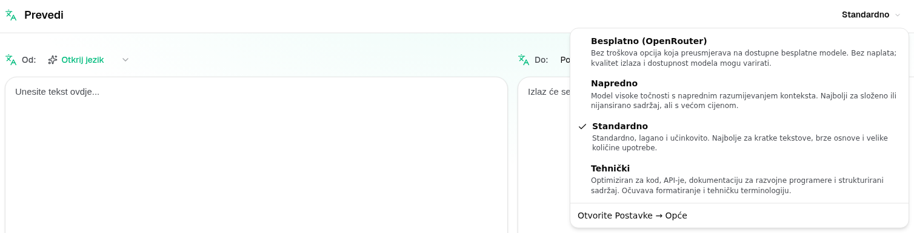

<a id="transrewrt-user-guide"></a>
# Korisnički vodič

<br/>

<a id="introduction"></a>
## Uvod

Transrewrt vam pomaže u radu s tekstom na tri glavna načina:

- **Prevedi** - pretvori tekst s jednog jezika na drugi.
- **Prepisi** - preformuliraj tekst u drugačijem stilu, na primjer jasnijem, kraćem ili formalnijem.
- **Transformiraj** - obradi tekst pomoću prilagođenih uputa za umjetnu inteligenciju koje se nazivaju upute.

Prema zadanim postavkama aplikacija se pokreće u **Lako** načinu rada: u Postavkama odaberete **unaprijed postavljeno** (npr. Besplatno (OpenRouter), Standardno, Napredno ili Tehničko) i **davatelja usluga**, bez odabira ID-ova modela. Prebacite se na **Napredno** u [**Postavke** > **Opće postavke**](#general-settings) ako želite klasičnu listu modela iz [**Postavke** > **Modeli**](#models).

<br/>

Ovaj vodič objašnjava kako koristiti aplikaciju nakon što je instalirana i pokrenuta. Za korake instalacije pogledajte glavni [**README**](README.hr.md).

<br/>

> ℹ️ **NAPOMENA**<br/>
> Transrewrt je dostupan kao desktop aplikacija za Windows i Linux te kao samoposlužena web aplikacija. Ovaj vodič fokusira se na svakodnevnu upotrebu aplikacije. Ako se neka stavka odnosi samo na jednu verziju, to je jasno označeno.

<small>**Pročitajte na drugim jezicima:** </small>
<small id="lang-list">[English (GB)](../USER-GUIDE.md) · [Português (Brasil)](./USER-GUIDE.pt-BR.md) · [العربية](./USER-GUIDE.ar.md) · [বাংলা](./USER-GUIDE.bn.md) · [Català](./USER-GUIDE.ca.md) · [中文 (中国大陆)](./USER-GUIDE.zh-CN.md) · [中文 (台灣)](./USER-GUIDE.zh-TW.md) · [Hrvatski](./USER-GUIDE.hr.md) · [Čeština](./USER-GUIDE.cs.md) · [Nederlands](./USER-GUIDE.nl.md) · [English (US)](./USER-GUIDE.en-US.md) · [Tagalog](./USER-GUIDE.tl.md) · [Français](./USER-GUIDE.fr.md) · [Deutsch](./USER-GUIDE.de.md) · [Ελληνικά](./USER-GUIDE.el.md) · [हिन्दी](./USER-GUIDE.hi.md) · [Magyar](./USER-GUIDE.hu.md) · [Italiano](./USER-GUIDE.it.md) · [日本語](./USER-GUIDE.ja.md) · [한국어](./USER-GUIDE.ko.md) · [Bahasa Melayu](./USER-GUIDE.ms.md) · [فارسی](./USER-GUIDE.fa.md) · [Polski](./USER-GUIDE.pl.md) · [Basa Jawa](./USER-GUIDE.jv.md) · [Português](./USER-GUIDE.pt.md) · [ਪੰਜਾਬੀ](./USER-GUIDE.pa.md) · [Română](./USER-GUIDE.ro.md) · [Русский](./USER-GUIDE.ru.md) · [Slovenčina](./USER-GUIDE.sk.md) · [Español](./USER-GUIDE.es.md) · [Kiswahili](./USER-GUIDE.sw.md) · [Svenska](./USER-GUIDE.sv.md) · [తెలుగు](./USER-GUIDE.te.md) · [ไทย](./USER-GUIDE.th.md) · [Türkçe](./USER-GUIDE.tr.md) · [Українська](./USER-GUIDE.uk.md) · [Tiếng Việt](./USER-GUIDE.vi.md)</small>

<small>

> **Napomena o prijevodima sučelja i dokumentacije:** Svi jezici sučelja osim izvornog engleskog (UK)
> prevedeni su pomoću AI modela; izrazi mogu biti neprecizni ili sadržavati pogreške.

</small>

<br/>

<!-- START doctoc generated TOC please keep comment here to allow auto update -->
<!-- DON'T EDIT THIS SECTION, INSTEAD RE-RUN doctoc TO UPDATE -->
**Sadržaj**

- [Prije početka](#before-you-start)
  - [Kako dobiti besplatni OpenRouter API ključ (desktop aplikacija)](#how-to-get-a-free-openrouter-api-key-desktop-app)
- [Početak rada](#getting-started)
- [Glavni dijelovi prozora](#main-parts-of-the-window)
  - [Bočna traka](#sidebar)
  - [Alatna traka](#toolbar)
  - [Ulazni i izlazni paneli](#input-and-output-panels)
- [Prijevod](#translate)
  - [Prevedi tekst](#translate-text)
  - [Odabir jezika](#language-selection)
  - [Pomoćne postavke prevođenja](#helpful-translation-settings)
  - [Usavršavanje vašeg prijevoda](#refining-translation)
- [Prepisivanje](#rewrite)
- [Transformacija](#transform)
  - [Pokreni postojeći upit](#run-an-existing-prompt)
  - [Ako još nemate upite](#if-you-have-no-prompts-yet)
  - [Brzo stvori upit](#create-a-prompt-quickly)
  - [Uredi upit](#edit-a-prompt)
  - [Testiraj upit prije korištenja](#test-a-prompt-before-using-it)
- [Nadzorna ploča](#dashboard)
  - [Filtar podataka](#filter-the-data)
  - [Kartice nadzorne ploče](#dashboard-tabs)
  - [Izvezi podatke](#export-data)
  - [Izbriši pohranjene zapise za model](#delete-stored-records-for-a-model)
- [Povijest](#history)
  - [Filtar povijesti](#filter-the-history)
  - [Izvezi podatke povijesti](#export-history-data)
- [Postavke](#settings)
  - [Opće postavke](#general-settings)
  - [Modeli](#models)
  - [Jezici](#languages)
  - [Praćenje troškova](#cost-tracking)
  - [Transformacija (kartica postavki)](#transform-settings-tab)
  - [Korisnici](#users)
  - [API konfiguracija](#api-config)
  - [O programu](#about)
- [Uobičajeni problemi](#common-issues)
  - [Aplikacija ne prevodi, ne prepisuje ili ne transformira tekst](#the-app-will-not-translate-rewrite-or-transform-text)
  - [Popis modela je prazan](#the-model-list-is-empty)
  - [Rezultat je prespor ili preskup](#the-result-is-too-slow-or-too-expensive)
  - [Sučelje je na pogrešnom jeziku](#the-interface-is-in-the-wrong-language)
  - [Tekst je premalen ili teško čitljiv](#the-text-is-too-small-or-hard-to-read)
  - [Sažetak nadzorne ploče izgleda prazan](#dashboard-summary-looks-empty)
  - [Trošak prikazuje "nije dostupno" ili se čini pogrešnim](#cost-shows-not-available-or-seems-wrong)
  - [Ukupni trošak se ne podudara s računom mog davatelja](#total-cost-does-not-match-my-provider-bill)
  - [Stranica Povijest nedostaje iz bočne trake](#the-history-page-is-missing-from-the-sidebar)
  - [Web aplikacija: neočekivano preusmjerena na stranicu za prijavu](#web-app-redirected-to-the-login-page-unexpectedly)
  - [Web administrator: zaboravljena ili izgubljena lozinka](#web-admin-forgot-or-lost-a-password)
  - [Nadzorna ploča ne prikazuje podatke za druge korisnike (web)](#dashboard-shows-no-data-for-other-users-web)
  - [Promijenio sam upit i izgubio izmjene](#i-changed-a-prompt-and-lost-the-edits)
- [Brzi savjeti](#quick-tips)
- [Odricanje od odgovornosti](#disclaimer)
- [Licenca](#license)

<!-- END doctoc generated TOC please keep comment here to allow auto update -->

<br/><br/>

<a id="before-you-start"></a>
## Prije početka

Da biste koristili Transrewrt, potreban vam je pristup barem jednom davatelju usluga umjetne inteligencije. Podržani davatelji usluga su: [OpenRouter](https://openrouter.ai) (koji nudi pristup mnogim modelima), OpenAI, Anthropic, Google Gemini, DeepSeek, Groq, Mistral, xAI, Cerebras i [Ollama](https://ollama.com) za lokalne modele.

Ne morate odabrati plaćeni model kako biste započeli. Čim dodate svoj OpenRouter API ključ, aplikacija automatski omogućuje ugrađenu **besplatnu** OpenRouter opciju. To vam omogućuje trenutno prevođenje, prepisivanje i transformaciju teksta. Alternativno, možete dobiti besplatni API ključ od Cerebras, Googlea, Groq ili Mistral AI-a.

Jednostavnim riječima:

- U **Lako** načinu rada, **unaprijed postavljeno** (Besplatno (OpenRouter), Standardno, Napredno ili Tehničko) mapira se na model za odabranog **davatelja usluga** (OpenRouter, OpenAI, Ollama i drugi). Samo unaprijed postavljene vrijednosti koje imaju mapiranje za trenutnog davatelja usluga prikazuju se na alatnoj traci. Odabir unaprijed postavljene vrijednosti vršite na Prevedi, Prepisi i Transformiraj.
- U **Napredno** načinu rada, **model** je AI motor koji izravno odabirete. ID-ovi modela koriste **prefiks davatelja usluga** (npr. `openrouter/…`, `openai/…`, `ollama/…`).
- **API ključ** (ili za Ollama, **osnovni URL**) je kako aplikacija pristupa davatelju usluga.

Ako koristite **desktop aplikaciju**, dodajte ključeve u [**Postavke** > **API konfiguracija**](#api-config) za svakog davatelja usluga kojeg koristite. Za korištenje samo OpenRouter-a, pogledajte [Kako dobiti besplatan OpenRouter API ključ](#how-to-get-a-free-openrouter-api-key-desktop-app) u nastavku. Ako ne želite koristiti API ključ, možete instalirati Ollama (s [ollama.com](https://ollama.com)) i koristiti lokalne modele umjesto toga, kao što je `translategemma:4b`.

Ako koristite **web verziju**, vlasnik poslužitelja konfigurira davatelje usluga putem varijabli okruženja, pa ne možete izravno unijeti API ključeve u aplikaciji.

<br/>

<a id="how-to-get-a-free-openrouter-api-key-desktop-app"></a>
### Kako dobiti besplatan OpenRouter API ključ (desktop aplikacija)

Ako koristite desktop aplikaciju, slijedite ove korake:

1. Otvorite [OpenRouter](https://openrouter.ai) u svom web pregledniku.
2. Stvorite račun ili se prijavite.
3. Otvorite stranicu [Ključevi](https://openrouter.ai/keys).
4. Kliknite gumb za stvaranje novog API ključa.
5. Dodijelite ključu naziv kako biste ga mogli prepoznati kasnije.
6. Kopirajte novi API ključ.
7. Vratite se u Transrewrt i otvorite **Postavke** > **API konfiguracija**.
8. Zalijepite ključ u polje **OpenRouter API ključ** (ispod **Postavke** > **API konfiguracija**).
9. Kliknite **Test OpenRouter ključa** kako biste provjerili radi li ispravno.

<br/><br/>

<a id="getting-started"></a>
## Prvi koraci

Ako je ovo vaše prvo korištenje Transrewrt-a, slijedite ovaj redoslijed:

1. Otvorite aplikaciju.
2. Ako je potrebno, odaberite svoj **jezik sučelja** s ikone zemaljskog globusa.
3. Ako koristite **desktop aplikaciju**, otvorite [**Postavke** > **API konfiguracija**](#api-config), dodajte API ključ barem za jednog davatelja usluga (npr. OpenRouter) i kliknite **Test** kako biste provjerili radi li sve ispravno.
4. Otvorite [**Postavke** > **Opće postavke**](#general-settings). U **lakom** načinu rada (zadano), odaberite **davatelja usluga** koji ima konfigurirani ključ. U **naprednom** načinu rada, otvorite [**Postavke** > **Modeli**](#models) i dodajte jedan ili više modela u **Odabrane modele**.
5. Na **Prevedi**, odaberite **unaprijed postavljeno** (Lako) ili **model** (Napredno) na alatnoj traci.
6. Otvorite [**Postavke** > **Jezici**](#languages) i odaberite svoje **Najčešće korišteni jezici** ako želite da se najčešće korišteni jezici prikazuju prvi.
7. Pokrenite jednostavan prijevod kako biste potvrdili da sve radi, a zatim isprobajte **Prepisi** i **Transformiraj**.

Ovaj redoslijed je važan. On sprječava najčešći problem prilikom prvog korištenja: pokušaj pokretanja zadatka prije nego što aplikacija ima radnu API vezu ili odabranu unaprijed postavljenu vrijednost/model.

<br/><br/>

<a id="main-parts-of-the-window"></a>
## Glavni dijelovi prozora

Aplikacija je podijeljena u tri glavna područja:

- **Bočna traka** s lijeve strane.
- **Alatna traka** na vrhu.
- **Radno područje** u sredini.

<br/>

<a id="sidebar"></a>
### Bočna traka

Koristite bočnu traku za kretanje kroz aplikaciju. Bočnu traku možete sažeti kako biste oslobodili više prostora klikom na ikonu pokraj logotipa aplikacije.

<br/>

<table>
  <tr>
    <td valign="top">
       
    </td>
    <td valign="top">
      <br/><br/>
      <ul>
        <li><strong>Prevedi</strong> otvara radno područje za prijevod.</li><br/>
        <li><strong>Prepisi</strong> otvara radno područje za prepisivanje.</li><br/>
        <li><strong>Transformiraj</strong> otvara radno područje za prilagođene upite.</li><br/>
        <li><strong>Nadzorna ploča</strong> prikazuje podatke o korištenju i troškovima.</li><br/>
        <li><strong>Postavke</strong> otvara ploču s postavkama.</li><br/>
        <li><strong>Povijest</strong> prikazuje povijest korištenja s ulaznim i izlaznim tekstom</li><br/>
        <li><strong>Korisnik</strong> prikazuje korisničko ime prijavljenog korisnika (samo na webu).</li>
      </ul>
    </td>
  </tr>
</table>

<br/>

<a id="toolbar"></a>
### Alatna traka

Alatna traka se malo razlikuje ovisno o tome gdje se nalazite u aplikaciji.

- S lijeve strane prikazuje se naziv trenutne stranice.
- S desne strane prikazuje se **odabir unaprijed postavljene vrijednosti ili modela** i upravljanje **jezikom sučelja**.

U **Lako** načinu rada, alatna traka prikazuje **odabir unaprijed postavljene vrijednosti** s ugrađenim unaprijed postavljenim vrijednostima **Besplatno (OpenRouter)**, **Standardno**, **Napredno** i **Tehničko**. Koje se unaprijed postavljene vrijednosti prikazuju ovisi o **davatelju usluga** kojeg ste odabrali u [**Postavke** > **Opće postavke**](#general-settings) — npr. **Besplatno (OpenRouter)** prikazuje se samo kada je davatelj usluga OpenRouter. Ako je **davatelj usluga** **Ollama**, alatna traka prikazuje vaše instalirane lokalne modele umjesto unaprijed postavljenih vrijednosti.

U **naprednom** načinu rada, **odabir modela** omogućuje vam da odaberete koji AI motor koristiti za trenutni zadatak.



U naprednom načinu rada, neki besplatni modeli možda nisu uvijek dostupni — mogu biti isključeni ili dosegnuti ograničenje korištenja. Aplikacija može automatski ukloniti taj model s vašeg popisa. Da biste kontrolirali koji se modeli prikazuju, idite na [**Postavke** > **Modeli**](#models). Postavke modela možete otvoriti s ikone davatelja usluga s lijeve strane naziva modela na alatnoj traci.

<br/>

Ikona **zemaljskog globusa + kôd jezika** mijenja jezik sučelja aplikacije, kao što su izbornici i tipke. Ona **ne** mijenja jezike prijevoda koji se koriste u funkciji **Prevedi**.


<br/>

<a id="input-and-output-panels"></a>
### Ulazni i izlazni paneli

Većina radnih područja koristi lijevi **Ulazni** panel i desni **Izlazni** panel.

Svaki panel također prikazuje:

| **Ulaz**                                                          | **Izlaz**                                                                                                                  |
|--------------------------------------------------------------------|-----------------------------------------------------------------------------------------------------------------------------|
| - Broj znakova <br/>- Broj riječi <br/>- Broj odlomaka   <br/> | - Vrijeme trajanja zadatka<br/>- **TPS** (tokeni po sekundi)<br/>- Broj znakova, riječi i odlomaka<br/>- Korišteni model |

Ako se pitate o tehničkim izrazima:

- **Token** znači mali dio teksta. Možete ga shvatiti kao dio riječi ili kratku riječ.
- **TPS** znači koliko takvih dijelova teksta model obradi svake sekunde.

<br/>

Također možete pratiti trošak svake operacije (ako je dostupan) i ukupni trošak, omogućivši opciju `Show cost information on the actions` na [**Postavke** > **Opće postavke**](#general-settings).

<br/><br/>

[--------------------------------------------------------------------------------------------------------------------------]: #

<a id="translate"></a>
## Prevedi

Koristite **Prevedi** kada želite pretvoriti tekst s jednog jezika na drugi.


<br/>

<a id="translate-text"></a>
### Prevedi tekst

1. Otvorite **Prevedi**.
2. Odaberite jezik u **Iz**.
3. Odaberite jezik u **U**.
4. Odaberite unaprijed postavljeno (Lako) ili model (Napredno) na alatnoj traci.
5. Upišite ili zalijepite tekst u **Ulaz**.
6. Kliknite **Prevedi**.
7. Pročitajte rezultat u **Izlaz**.
8. Koristite gumb za kopiranje ako želite kopirati rezultat.

<br/>

<a id="language-selection"></a>
### Odabir jezika

- **From** može biti određeni jezik ili **Otkrij jezik**.
- **To** je jezik u koji želite prevesti.

Vaši odabrani **najčešći jezici** prikazat će se na vrhu popisa. Možete ih postaviti u [**Postavke** > **Jezici**](#languages).

<br/>

<a id="helpful-translation-settings"></a>
### Korisne postavke prijevoda

U [**Postavke** > **Opće postavke**](#general-settings) možete promijeniti kako se ponaša prijevod:

- **Automatsko izvršavanje pri lijepljenju** pokreće prijevod čim zalijepite tekst.
- **Automatsko kopiranje rezultata u međuspremnik** automatski kopira rezultat nakon uspješnog pokretanja.
- **Prijevod u stvarnom vremenu tijekom pisanja** (⚠️ Ovo može povećati troškove korištenja) pokreće prijevode dok tipkate.
- **Timeout (ms)** kontrolira koliko dugo aplikacija čeka prije pokretanja prijevoda u stvarnom vremenu.
- **Ponašanje za ENTER** bira hoće li `Enter` pokrenuti zadatak ili umetnuti novi redak:
  - **Enter** pokreće prijevod ili prepisivanje (zadano).
  - **Shift + Enter** pokreće prijevod ili prepisivanje; običan **Enter** umeće novi redak.

<br/>

<a id="refining-translation"></a>
### Usavršavanje vašeg prijevoda

Nakon uspješnog prevođenja, možete usavršiti rezultat u panelu izlaza:

1. **Preformuliraj…** — bez odabranog teksta u izlazu, dobijte još jedan puni prijevod istog unosa s drugačijim riječima. Možete pohraniti do **pet** verzija i prebacivati se između njih u padajućem izborniku verzija. Kada je tekst odabran, **Preformuliraj…** otvara alternativne riječi blizu odabira (isto kao desni klik). Bez odabira, **Preformuliraj…** je onemogućen kada dođete do pet verzija; s odabirom, i dalje radi na pet verzija (samo alternativne riječi, ažuriranje verzije 5).
2. **Alternativne riječi** — odaberite jednu ili više riječi u izlazu (ako odaberete samo dio riječi, aplikacija proširuje odabir na cijele riječi), zatim desni klik ili kliknite **Preformuliraj…**. Kratki popis alternativa pojavljuje se blizu odabira; kliknite jednu da je zamijenite. Ako imate manje od pet verzija, uređeni izlaz se sprema kao nova verzija; kod pet verzija, samo se **verzija 5** ažurira. Desni klik bez odabira ne radi ništa. Pritisnite **Esc** ili kliknite izvan popisa da biste otkazali bez promjene izlaza.
3. **Troškovi** — svaki puni **Preformuliraj…** (bez odabira) i svaki zahtjev za alternativnom riječi ponovo koristi model i može povećati trošak korištenja (isto kao normalno prevođenje).

[--------------------------------------------------------------------------------------------------------------------------]: #

<a id="rewrite"></a>
## Prepisi

Koristite **Prepisi** kada želite poboljšati formulaciju bez mijenjanja glavne poruke.


Ovo je korisno za:

- ispravljanje pravopisa i gramatike (**Provjeri pravopis i gramatiku**)
- poboljšanje jasnoće teksta (**Poboljšaj jasnoću**)
- nekoliko različitih reformulacija u jednom izvođenju (**Alternativne verzije**)
- učiniti tekst formalnijim ili neformalnijim (**Učini formalnim** / **Učini neformalnim**)
- skraćivanje ili proširivanje teksta (**Skraćivanje** / **Proširivanje**)
- činjenje teksta tehničkijim (**Učini tehničkim**)

<br/>

> 💡 **SAVJET**<br/>
> Kada koristite način "**Provjeri pravopis i gramatiku**", u izlaznom panelu pojavit će se prekidač **Prikaži promjene** (kraj **Kopiraj**).
> Uključite ili isključite kako biste prikazali ili sakrili specifične ispravke primijenjene na vaš tekst.

<br/><br/>

[--------------------------------------------------------------------------------------------------------------------------]: #

<a id="transform"></a>
## Transformiraj

Koristite **Transformiraj** kada želite da AI slijedi prilagođeni skup uputa.


Ovo je najfleksibilniji dio aplikacije. Možete ga koristiti za zadatke poput:

- sažimanja bilješki
- pretvaranja sirovog teksta u uređenu e-poštu
- izdvajanja ključnih točaka
- pretvaranja teksta u određeni format
- bilo koje druge prilagođene aktivnosti s ulaznim tekstom

<br/>

<a id="run-an-existing-prompt"></a>
### Pokrenite postojeći upit

1. Otvorite **Transformacija**.
2. Odaberite upit s popisa uputa.
3. Ako se pojavi okvir **Od**, odaberite jezik ako ga želite.
4. Upišite ili zalijepite tekst u **Unos**.
5. Klikni **Transformiraj**.
6. Pročitaj rezultat u **Izlaz**.

<br/>

<a id="if-you-have-no-prompts-yet"></a>
### Ako još nemate upita

Ako je vaš popis upita prazan, kliknite **Učitaj uzorke upita** u Transform radnom prostoru. Ista opcija uvijek je dostupna u [**Postavke** > **Transformiraj**](#transform-settings) u retku za izvoz/uvoz. Oba načina dodaju ugrađene primjere kako biste mogli brzo započeti.

<br/>

> ℹ️ **NAPOMENA**<br/>
> Uzorci upita dostavljaju se na engleskom jeziku. Nakon što ih učitate, možete urediti upit i koristiti **Prevedi upit** da biste ga preveli na vaš jezik.

<br/>

<a id="create-a-prompt-quickly"></a>
### Brzo kreirajte upit

Najbrži način za stvaranje upita je:

1. Kliknite **Novi upit**.
2. Kliknite **Generiraj upit**.
3. Opisite što želite da upit učini.
4. Odaberite unaprijed postavljeno (Lako) ili model (Napredno).
5. Dopustite aplikaciji da stvori skicu za vas.
6. Pregledajte skicu i kliknite **Spremi**.


<br/>

<a id="edit-a-prompt"></a>
### Uredi upit

Kada kreirate ili uređujete upit, urednik se pojavljuje s lijeve strane, a područje za testiranje s desne strane.


Glavna polja su:

- **Naziv upita**: ime koje se prikazuje na popisu upita.
- **Upute za upit (neobavezno)**: kratka napomena koja se prikazuje korisniku prilikom pokretanja upita.
- **Uloga modela**: opća uloga dodijeljena umjetnoj inteligenciji, npr. 'Vi ste korisni pomoćnik.'
- **Upute za model (jedna po retku)**: specifična pravila koja AI treba slijediti.
- **Opis izlaza (npr. transformirano, sažeto, itd.)**: kratka riječ koja opisuje rezultat.
- **Temperatura (0,0 → 1,0)**: kako će se model ponašati; pogledajte ispod.
- **Traži ciljni jezik**: dodaje birač jezika kada se upit pokrene.
Ako vam je tehnički termin **Temperatura** nov, razmislite ovako:

- **Niža** temperatura daje stabilnije, predvidljivije rezultate.
- **Viša** temperatura daje veću raznolikost i kreativnost.

Također možete koristiti:

- `Generate prompt` da biste kreirali novu skicu iz jednostavnog opisa
- `Improve prompt` da biste poboljšali postojeći upit
- `Translate prompt` da biste preveli polja upita

<br/>

> ⚠️ **UPOZORENJE**<br/>
> Kliknite `Save` prije nego što kliknete `Back to Run`. Ako se vratite bez spremanja, promjene će biti izgubljene.

<br/>

<a id="test-a-prompt-before-using-it"></a>
### Testirajte upit prije korištenja

Ploča za testiranje s desne strane omogućuje vam isprobavanje upita s primjerima teksta prije korištenja u svakodnevnom radu.

Ovo je korisno kada:

- kreirate novi upit
- uspoređujete dvije verzije upita
- želite provjeriti ton, duljinu ili format izlaza

<br/>

> ℹ️ **NAPOMENA**<br/>
> Možete izvesti i uvesti spremljene upite u [**Postavke** > **Transformiraj**](#transform-settings).

Kada koristite **Generiraj upit**, **Unaprijedi upit** ili **Prevedi upit** u uređivaču upita, **Lako** način nudi isti odabir unaprijed postavljenih vrijednosti kao Prevedi i Prepisi; **Napredno** način koristi listu modela.

<br/><br/>

[--------------------------------------------------------------------------------------------------------------------------]: #

<a id="dashboard"></a>
## Nadzorna ploča

Koristite **Nadzornu ploču** da biste vidjeli koliko koristite aplikaciju i koliko vas to košta (za naplaćivane modele).


<br/>

> ℹ️ **NAPOMENA**<br/>
> Ako koristite samo **besplatne** modele, iznosi **troškova** mogu biti nula, a KPI-ji usmjereni na trošak mogu izgledati prazno. Kartica **Sažetak** i dalje prikazuje broj poziva za prijevod, prepisivanje i transformaciju kada imate aktivnosti u odabranom razdoblju.

<br/>

<a id="filter-the-data"></a>
### Filtriranje podataka

Koristite gumbe za filtriranje na vrhu za promjenu vremenskog raspona.


<br/>

> ℹ️ **NAPOMENA**<br/>
> Filtriranje **Korisnik** vidljivo je samo administratorima u web verziji. Obični korisnici neće vidjeti ovaj filtar, a nije dostupan ni u desktop aplikaciji.

<br/>

<a id="dashboard-tabs"></a>
### Kartice nadzorne ploče

- **Sažetak** prikazuje KPI kartice: ukupni trošak, korišteni modeli, broj poziva po načinu i trošak (s udjelom u ukupnom broju poziva), prosječni trošak po pozivu, prosječni TPS i tri najčešće korištena modela po broju poziva.
- **Po modelu** navodi svaki model s ukupnim pozivima, ukupnim troškovima i prosječnim TPS-om; proširite redak za detaljniji prikaz po prijevodu, prepisivanju i transformaciji.
- **Svi pozivi** prikazuje potpuni zapis poziva (stranica na širokim izgledima, kartice na uskim zaslonima) i omogućuje izvoz.

<br/>

<a id="export-data"></a>
### Izvoz podataka

Tablice nadzorne ploče mogu izvesti podatke u:

- **JSON**
- **CSV**
- **XLSX**

To je korisno ako želite pregledati aktivnost izvan aplikacije ili podijeliti izvještaj.

<br/>

<a id="delete-stored-records-for-a-model"></a>
### Brisanje pohranjenih zapisa za model

U odjeljcima **Po modelu** ili **Svi pozivi** možete ukloniti pohranjene zapise za model klikom na ikonu "kante za smeće".

> ⚠️ **UPOZORENJE**<br/>
> Brisanje pohranjenih zapisa nije moguće poništiti. Koristite ovo samo ako ste sigurni da više ne trebate tu povijest.

Da biste izbrisali sve podatke ili uklonili zapise na temelju njihove starosti, idite na [**Postavke** > **Praćenje troškova**](#cost-tracking). Tamo ćete pronaći opcije za brisanje svih pohranjenih podataka ili samo podataka starijih od određenog datuma.

<br/><br/>

[--------------------------------------------------------------------------------------------------------------------------]: #

<a id="history"></a>
## Povijest

Kliknite na **Povijest** da biste vidjeli povijest svojih akcija unutar **Transrewrt**, uključujući ulaz i izlaz svake operacije.


<br/>

<a id="filter-the-history"></a>
### Filtriraj povijest

**Povijest** koristi iste filtre vremenskog raspona kao i stranica **Nadzorne ploče**.


<br/>

> ℹ️ **NAPOMENA**<br/>
> U **web aplikaciji**, svatko (uključujući administratore) vidi samo vlastitu povijest izvršavanja. Filter **Korisnik** na **Nadzornoj ploči** koriste administratori za pregled korištenja i troškova preko računa; ne primjenjuje se na **Povijest**.

<br/>

<a id="export-history-data"></a>
### Izvoz podataka povijesti

Stranica povijesti može izvesti filtrirane podatke u:

- **JSON**
- **CSV**
- **XLSX**

To je korisno ako želite pregledati aktivnost izvan aplikacije ili podijeliti izvještaj.

<br/><br/>

[--------------------------------------------------------------------------------------------------------------------------]: #

<a id="settings"></a>
## Postavke

Otvorite **Postavke** iz bočne trake kako biste prilagodili ponašanje aplikacije.

Dostupne kartice ovise o platformi i vašoj ulozi:

| Kartica          | Računalo | Web (administrator) | Web (obični korisnik) | Bilješke                                        |
  |------------------|:-------:|:-------------------:|:---------------------:|------------------------------------------------|
  | Opće postavke    |   da    |        da           |          da           | Uključuje **AI iskustvo** (Lako / Napredno) |
  | Modeli           |   da    |        da           |          da           | Samo kada je **AI iskustvo** postavljeno na **Napredno** |
  | Jezici         |   da   |     da     |        da         | |
  | Praćenje troškova     |   da   |     da     |         -          | |
  | Transformacija         |   da   |     da     |        da         | Grupni uvoz/izvoz transformacijskih upita |
  | Korisnici             |    -    |     da     |         -          | |
  | API konfiguracija        |   da   |     da     |         -          | |
  | O programu             |   da   |     da     |        da         | |

U **Lako** načinu rada, odabir modela vrši se putem unaprijed postavljenih vrijednosti na alatnoj traci i **davatelja usluga** u Općim postavkama; kartica **Modeli** je skrivena.

<br/>

> ℹ️ **NAPOMENA**<br/>
> U web verziji svaki korisnik ima svoju vlastitu konfiguraciju. Postavke poput AI iskustva, davatelja usluga, odabranih modela ili unaprijed postavljenih vrijednosti, jezika, općih opcija i transformacijskih uputa pohranjuju se po korisniku. Promjene koje napravite ne utječu na druge korisnike.

<br/>

[--------------------------------------------------------------------------------------------------------------------------]: #

<a id="general-settings"></a>
### Opće postavke

Koristite **Opće postavke** za kontrolu ponašanja tipkanja, pohranjivanje detalja izvršavanja za **Povijest**, izgled i način odabira AI-a za Prevođenje, Prepisivanje i Transformaciju.

**AI iskustvo**

- **Lako** (zadano): odaberite **davatelja usluga** (OpenRouter, OpenAI, Anthropic, Google Gemini, DeepSeek, Groq, Mistral, xAI, Cerebras ili Ollama). Oblačni davatelji usluga koriste ugrađene unaprijed postavljene vrijednosti na alatnoj traci. **Ollama** prikazuje modele instalirane na vašem računalu umjesto unaprijed postavljenih vrijednosti. U Lako načinu rada, **Katalog unaprijed postavljenih vrijednosti** prikazuje verziju kataloga i vrijeme zadnjeg ažuriranja; kliknite **Osvježi katalog unaprijed postavljenih vrijednosti** kako biste preuzeli najnoviju listu unaprijed postavljenih vrijednosti iz spisa projekta (aplikacija također periodično provjerava u pozadini).
- **Napredno**: odaberite pojedinačne modele na alatnoj traci; upravljajte listom putem [**Postavke** > **Modeli**](#models).

**Izgled**

- **Tema** prebacuje između svijetle, tamne i sistemske pojave.
- **Prikaži informacije o cijenama na radnjama** kontrolira prikaz cijene po operaciji (ako je dostupno) i ukupne cijene na izlaznim panelima Prevedi, Prepisi i Transformiraj.
- **Decimalni brojevi cijene** mijenjaju način na koji se prikazuju decimalni dijelovi cijene.
- **Samo web:** **prikaži marginu oko aplikacije** dodaje dodatni prostor oko sučelja.
- **Obitelj fontova** mijenja font pisanja u tekstualnim panelima.
- **Veličina** mijenja veličinu fonta.

**Ponašanje**

- **Ponašanje za ENTER** bira hoće li `Enter` pokrenuti zadatak ili umetnuti novi redak.
- **Automatsko izvršavanje pri lijepljenju** pokreće prijevod čim zalijepite tekst.
- **Automatsko kopiranje rezultata u međuspremnik** automatski kopira uspješne rezultate.
- **Prijevod u stvarnom vremenu tijekom pisanja** (⚠️ Ovo može povećati troškove korištenja) prevodi dok tipkate.
- **Vrijeme čekanja (ms)** postavlja vrijeme čekanja za prijevod u stvarnom vremenu.

**Povijest**

- **Zadrži povijest izvršavanja** kontrolira pohranjuje li se svaki prijevod, prepisivanje i transformacija **ulazni i izlazni tekst** za prikaz [**Povijesti**](#history) u bočnoj traci. Isključivanje traži potvrdu; ako potvrdite, pohranjeni tekst povijesti uklanja se iz baze podataka. Ako je oznaka *onemogućeno od strane administratora*, vaša instalacija ima `HISTORY_DISABLED` postavljeno u okolini (pogledajte [README](README.hr.md#configuration-and-environment)); ne možete ponovno uključiti povijest putem sučelja.
- **Izbriši povijest podataka** omogućuje uklanjanje pohranjenog teksta prema dobi (npr. starijeg od nekoliko mjeseci ili **svi podaci (izbriši)**) korištenjem **Izbriši podatke**. To utječe samo na spremljeni tekst izvršavanja za prikaz **Povijesti**; ne briše **troškove** ili ukupne podatke o korištenju. Za uklanjanje ili smanjenje podataka o **troškovima**, koristite [**Postavke** > **Praćenje troškova**](#cost-tracking).

**Sigurnosna kopija konfiguracije** (samo za administratore desktop aplikacije i weba)
- **Uključi podatke o korištenju u sigurnosnu kopiju** - kada je omogućeno, ZIP također sadržava povijest izvršavanja i podatke API poziva.
- **Napravi sigurnosnu kopiju konfiguracije** - stvara jedan ZIP (`transrewrt-config-backup-YYYY-MM-DD_HHMMSS.zip` u lokalnom vremenu) s `config.json`, `state.json`, opcionalnim ključem šifriranja, korisnicima, postavkama, prilagođenim uputama i podacima o korištenju ako ste se odlučili. Nakon uspješne sigurnosne kopije, potvrda prikazuje naziv spremljene datoteke.
- **Vrati iz sigurnosne kopije** - prvo otvara **dijaloški okvir za potvrdu**. Odaberite sigurnosnu kopiju ZIP-a unutar dijaloškog okvira (**Pregledaj** / birač datoteka ili povlačenje i ispuštanje gdje je podržano), a zatim pregledajte opcije:
  - **Vrati podatke o korištenju** - uvezite podatke o korištenju/povijesti iz ZIP-a kada je sigurnosna kopija napravljena s uključenim podacima o korištenju; isključite ako želite samo postavke i upute.
  - **Očisti stare podatke o korištenju prije vraćanja** - uklonite postojeće podatke o korištenju/povijesti na ovoj instalaciji prije primjene sigurnosne kopije (opcionalno; koristite kada želite čistu zamjenu).
Sigurnosne kopije stvorene u web ili desktop verziji mogu se vratiti u drugoj. Kada vraćate sigurnosnu kopiju desktop verzije u web verziju, podaci će biti vraćeni administratorskom korisniku.

<br/>

<a id="models"></a>
### Modeli

Ova kartica je dostupna samo kada je **AI iskustvo** postavljeno na **Napredno** u [**Opće postavke**](#general-settings). Koristite **Postavke** > **Modeli** da odaberete koje modele želite prikazati na alatnoj traci.


Stranica ima dvije liste:

- **Dostupni modeli** s lijeve strane
- **Odabrani modeli** s desne strane

Korisni alati uključuju:

- **Pretraži modele...** da biste pronašli model po nazivu
- **Davatelj usluga** oznake za sužavanje popisa na jedan motor (OpenRouter, OpenAI, Ollama, …)
- **Samo besplatni** za prikaz samo besplatnih modela
- **Osvježi** za ponovno učitavanje popisa
- **Proširi sve** i **Sažmi sve** kada sortirate po davatelju usluga

ID-ovi modela uključuju prefiks davatelja usluga (npr. `openrouter/…` naspram `openai/…`). Oznake poput **OpenAI (OpenRouter)** naspram **OpenAI (izravno)** pokazuju kako se promet usmjerava.

> ℹ️ **NAPOMENA**<br/>
> **OpenRouter Body Builder** (`openrouter/bodybuilder`) je model usmjerivača, a ne opći model za razgovor: njegov odgovor je JSON koji opisuje tijela zahtjeva OpenRouter API-ja (npr. niz `requests` s `model` i `messages`). Ako ga koristite za **Prevedi**, **Prepisi** ili **Transformiraj**, ploča za izlaz prikazat će taj JSON umjesto gotovog teksta. Odaberite normalan tekstualni model za te zadatke. Pogledajte [stranicu modela Body Builder](https://openrouter.ai/openrouter/bodybuilder) na OpenRouteru.

Akcije:

- Da biste dodali model, kliknite **Dodaj** ili bilo gdje unutar unosa.

- Da biste uklonili model, kliknite **X** pokraj njega u **Odabranim modelima** ili **Odabrano** na unosu u Dostupnim modelima.

- Da biste obrisali popis, kliknite **Poništi sve odabire**. Obavezni besplatni model ostat će na popisu.

<br/>

> ℹ️ **NAPOMENA**<br/>
> Ako ne želite odmah dodati kredite na OpenRouter, započnite omogućavanjem **Samo besplatni** i odabirom besplatnih modela (nije potrebna kreditna kartica). Također možete koristiti Ollama za pokretanje modela lokalno bez ikakvog API ključa.

<br/>

<a id="languages"></a>
### Jezici

Koristite **Postavke** > **Jezici** za uređivanje popisa jezika koje aplikacija koristi.

- **Vrhunski jezici** pričvršćeni su na vrh popisa jezika u **Prevedi** i **Transformiraj**.
- **Prilagođeni jezik** omogućuje dodavanje jezika koji nije na ugrađenom popisu.

Ako dodate prilagođeni jezik, pojavit će se u izbornicima jezika uz ugrađene opcije.

<br/>

<a id="cost-tracking"></a>
### Praćenje troškova

Koristite **Postavke** > **Praćenje troškova** za upravljanje informacijama o troškovima.

- **Ukupna cijena** prikazuje tekući zbroj.
- **Kopiraj vrijednost** kopira ukupno u međuspremnik.
- **Poništi trošak** vraća spremljeni zbroj na nulu.
- **Sinkroniziraj s korištenjem API ključa** postavlja ukupno na iznos koji odgovara korištenju prikazanom u vašem OpenRouter računu (samo za OpenRouter).
- **Korištenje API ključa** prikazuje detalje korištenja OpenRoutera, ako su dostupni.
- **Izbriši podatke o cijenama** uklanja sve podatke ili samo unose starije od odabranog datuma.

**Praćenje troškova:** Kada koristite modele OpenRoutera, aplikacija prikazuje vaše stvarno korištenje i troškove na temelju informacija o cijenama s OpenRoutera. Za sve ostale davatelje usluga, aplikacija procjenjuje troškove koristeći cijene objavljene od strane OpenRoutera; ako cijena nije dostupna, procjena može biti nula.

<br/>

> ℹ️ **NAPOMENA**<br/>
>  **Svi iznosi troškova su procjene isključivo za vašu referencu, a ne službeni računi.**

<br/>

> ⚠️ **UPOZORENJE**<br/>
> Brisanje podataka ne može se poništiti. Prije brisanja, obavezno napravite sigurnosnu kopiju svojih podataka ili ih izvezite putem [**Povijest**](#history) 
> ili [**Nadzorna ploča** > **Svi pozivi**](#dashboard-tabs), inače će trajno biti izgubljeni. 
> Sva povijest unosa/izlaza vezana uz svaki unos poziva API-ja također će biti izbrisana.

<br/>

<a id="transform-settings"></a>
### Transformiraj (kartica postavki)

Koristite **Postavke** > **Transformiraj** za grupno upravljanje upitima.

Možete:

- pregledati spremljene upite
- izbrisati upite
- uvesti upite iz datoteke
- izvesti upite za sigurnosnu kopiju ili dijeljenje
- učitati uzorke upita na popis upita

<br/>

<a id="users"></a>
### Korisnici

Koristite **Korisnici** za upravljanje korisničkim računima u web verziji. Možete dodavati korisnike, ažurirati njihove podatke, resetirati lozinke i brisati račune.

<br/>

<a id="api-config"></a>
### API konfiguracija

Podržani davatelji usluga su: OpenRouter, OpenAI, Anthropic, Google Gemini, DeepSeek, Groq, Mistral, xAI, Cerebras i **Ollama** (lokalni modeli putem osnovnog URL-a). Potrebno je konfigurirati samo davatelje usluga koje koristite.

**Web aplikacija: samo administrator**

API ključevi se konfiguriraju putem sustavskih ili Docker okolišnih varijabli – ne unose se u web sučelju. Ova stranica prikazuje za koje davatelje usluga je ključ konfiguriran i omogućuje testiranje svakog pojedinačno klikom na gumb `Test`.

<br/>

> ℹ️ **NAPOMENA**<br/>
> Da biste promijenili API ključ, ažurirajte okolišnu varijablu u svojoj sustavskoj ili Docker konfiguraciji i ponovno pokrenite poslužitelj ili kontejner.

<br/>

> ℹ️ **NAPOMENA**<br/>
> **Sigurnosne kopije konfiguracije** (pogledajte [**Opće postavke** → Sigurnosna kopija konfiguracije](#general-settings)) mogu ugraditi **rješene** ključeve davatelja usluga unutar datoteke `config.json` u ZIP arhivi. Vraćanje te ZIP arhive **neće** kopirati te ključeve natrag u konfiguracijsku datoteku poslužitelja – aktivni ključevi i dalje dolaze iz okoliša i postojećeg stanja datoteke kao što je tamo opisano.

<br/>

**Desktop aplikacija**

Koristite **API konfiguraciju** za pohranu API ključeva za svakog davatelja usluga kojeg koristite. Za Ollamu unesite **osnovni URL** umjesto API ključa.

<br/>

> 💡 **Savjet** <br/>
> Ako ne želite koristiti API ključeve niti plaćati za korištenje, možete [preuzeti Ollamu](https://ollama.com) i besplatno pokretati modele (kao što je `translategemma:4b`) lokalno na svom računalu. Alternativno, možete kreirati besplatni OpenRouter račun (bez potrebe za kreditnom karticom) kako biste koristili njihove besplatne modele ili dobiti besplatni API ključ od Cerebras, Googlea, Groqa ili Mistral AI-a.

<br/>

- Dodajte samo davatelje usluga koje trebate. U **Postavkama** > **Modeli**, svaki ID modela započinje imenom davatelja usluga (npr. `openrouter/openrouter/free`, `openai/gpt-4o`, `ollama/llama3`).

Da biste dodali API ključ, unesite vrijednost u tekstualno polje i kliknite `Save`. Da biste zamijenili postojeći ključ, kliknite `Edit`. Da biste provjerili radi li ključ, kliknite `Test`. Za Ollama osnovni URL, uvijek kliknite `Test` kako biste provjerili vezu.

<br/>

> ℹ️ **NAPOMENA**<br/>
> Trenutnu vrijednost API ključa ne možete vidjeti. Možete je samo zamijeniti pomoću gumba `Edit`.
> API ključevi su pohranjeni šifrirano u konfiguraciji.

<br/>

<a id="about"></a>
### O programu

**O programu** kartica prikazuje:

- naziv aplikacije i slogan
- broj verzije i datum izrade
- informacije o licenci i autorskim pravima, s vezom za otvaranje **Obavijesti trećih strana**
- veza na repozitorij projekta

<br/><br/>

<a id="common-issues"></a>
## Česti problemi

Ako nešto ne radi kako je očekivano, prvo provjerite sljedeće točke.

<br/>

<a id="the-app-will-not-translate-rewrite-or-transform-text"></a>
### Aplikacija ne prenosi, prepisuje ili transformira tekst

Provjerite sljedeće:

- odabrali ste **unaprijed postavljeno** (Lako) ili **model** (Napredno) na alatnoj traci
- u **Lako** načinu, [**Postavke** > **Opće postavke**](#general-settings) imaju **Davatelja usluga** s radnim ključem (ili Ollama URL-om) i barem jedno unaprijed postavljeno za tog davatelja usluga
- u **Napredno** načinu, barem jedan model je naveden u [**Postavke** > **Modeli**](#models)
- vaša API postavka radi

Ako koristite desktop aplikaciju:

1. Otvorite [**Postavke** > **API konfiguracija**](#api-config).
2. Provjerite je li spremljen barem jedan API ključ.
3. Kliknite **Test** pokraj davatelja usluga kako biste potvrdili da ključ radi.

<br/>

<a id="the-model-list-is-empty"></a>
### Popis modela je prazan

U **Lakom** načinu, otvorite [**Postavke** > **Opće postavke**](#general-settings), provjerite je li postavljen **Davatelj usluga**, te dodajte ili testirajte ključeve u [**API konfiguracija**](#api-config) (na desktopu) ili zatražite od administratora (na webu). Za **Ollamu**, pokrenite **Test** na osnovnom URL-u i osigurajte da su modeli instalirani lokalno.

U **Naprednom** načinu, otvorite [**Postavke** > **Modeli**](#models) i kliknite **Osvježi**. Ako je potrebno, potražite model, uključite **Samo besplatni** i dodajte modele u **Odabrane modele**.

<br/>

<a id="the-result-is-too-slow-or-too-expensive"></a>
### Rezultat je preusporen ili prekup

Isprobajte jedno ili više od sljedećeg:

- odaberite drugi predložak (Jednostavno) ili model (Napredno)
- koristite kraći unos
- isključite **Prijevod u stvarnom vremenu tijekom pisanja** u [**Postavke** > **Opće postavke**](#general-settings)
- koristite besplatne modele za jednostavne zadatke (pogledajte [Modeli](#models))
<br/>

<a id="the-interface-is-in-the-wrong-language"></a>
### Sučelje je na pogrešnom jeziku

Kliknite ikonu zemaljskog globusa u [alatnoj traci](#toolbar) i odaberite željeni **Jezik sučelja**.

<br/>

<a id="the-text-is-too-small-or-hard-to-read"></a>
### Tekst je premalen ili teško čitljiv

Otvorite [**Postavke** > **Opće postavke**](#general-settings) i promijenite:

- **Obitelj fonta**
- **Veličina**

<br/>

<a id="dashboard-summary-looks-empty"></a>
### Sažetak nadzorne ploče izgleda prazno

To je normalno ako:

- koristite samo **besplatne modele** i gledate **troškove** (mogu biti nula); KPI-ovi broja poziva na **Sažetku** još uvijek zahtijevaju podatke iz odabranog razdoblja
- odabrani **vremenski filter** ne obuhvaća razdoblje kada su izvršeni pozivi — pokušajte s **Sve** kako biste provjerili

Ako su KPI-ovi i dalje nula nakon odabira **Sve**, provjerite pojavljuju li se pozivi u [**Povijest**](#history) ili na kartici **Svi pozivi**.

<br/>

<a id="cost-shows-not-available-or-seems-wrong"></a>
### Trošak prikazuje "nije dostupno" ili izgleda netočno

Kada koristite modele putem **OpenRoutera**, aplikacija prikazuje stvarne troškove koje prijavljuje OpenRouter.

Za **druge davatelje usluga** (OpenAI izravno, Anthropic izravno itd.), trošak se procjenjuje na temelju cijena objavljenih od strane OpenRoutera. Ako za model nije pronađena odgovarajuća cijena, trošak će se prikazati kao **nije dostupno** i neće se dodati na ukupni iznos.

<br/>

<a id="total-cost-does-not-match-my-provider-bill"></a>
### Ukupni trošak se ne podudara s računom davatelja usluga

Svi iznosi troškova u aplikaciji su **procjene samo za referencu**, a ne službeni računi.

Kako biste ukupni iznos približili stvarnim troškovima na OpenRouteru, otvorite [**Postavke** > **Praćenje troškova**](#cost-tracking) i kliknite **Sinkroniziraj s korištenjem API ključa**.

<br/>

<a id="the-history-page-is-missing-from-the-sidebar"></a>
### Stranica Povijest nedostaje u bočnoj traci

**Zadrži povijest izvršavanja** može biti isključena. Otvorite [**Postavke** > **Opće postavke**](#general-settings) i omogućite je, osim ako je povijest *onemogućena od strane administratora* (`HISTORY_DISABLED` u okolini — pogledajte [README](README.hr.md#configuration-and-environment)). Uključivanje povijesti ne vraća prethodno izbrisani tekst.

<br/>

<a id="web-app-session-expired"></a>
### Web aplikacija: neočekivano ste preusmjereni na stranicu za prijavu

Vaša sesija je mogla isteći. Prijavite se ponovno. Ako se to događa često, provjerite postavke konfiguracije poslužitelja vezane uz trajanje sesije.

<br/>

<a id="web-admin-forgot-or-lost-a-password"></a>
### Web administrator: zaboravili ste ili izgubili lozinku

Ovo se odnosi na **samostalno hostiranu web aplikaciju** (Docker), a ne na desktop aplikaciju (Electron).

- Ako se drugi administrator može prijaviti, on može otvoriti [**Postavke** > **Korisnici**](#users), odabrati račun i postaviti **novu lozinku**.
- Ako ste **blokirani**, ali imate **pristup ljusci** stroja ili kontejnera, poništite lozinku pomoću alata koji dolazi s slikom (zamijenite `transrewrt` ako ste promijenili zadano ime, a lozinku stavite u navodnike ako sadrži razmake ili posebne znakove):

```bash
docker exec transrewrt reset-web-password '<username>' '<new-password>'
```

Zadano korisničko ime administratora je `admin` ako niste nikada stvorili druge račune. Kada unesete samo jedan argument, taj argument se tumači kao nova lozinka za `admin`.

Ako pokrećete aplikaciju iz **izvornog koda** umjesto iz Docker slike, koristite:

```bash
pnpm run reset-web-password -- <username> <new-password>
```

Skripta ažurira zapis korisnika u bazi podataka SQLite (i može kreirati `admin` korisnika ako nedostaje). Nakon poništavanja, prijavite se s novom lozinkom.

<br/>

<a id="dashboard-shows-no-data-for-other-users"></a>
### Nadzorna ploča ne prikazuje podatke za druge korisnike (web)

Samo **administratori** mogu pregledati podatke svih korisnika putem filtera **Korisnik**. Redovni korisnici vide samo vlastitu aktivnost po dizajnu.

<br/>

<a id="i-changed-a-prompt-and-lost-the-edits"></a>
### Promijenio sam upit i izgubio uređivanje

Prilikom uređivanja upita, uvijek kliknite **Spremi** prije nego što kliknete **Natrag na Pokreni**.

<br/><br/>

<a id="quick-tips"></a>
## Brzi savjeti

- Započnite s [**Prevedi**](#translate) kako biste provjerili radi li vaša postava prije nego što prijeđete na [**Prepisi**](#rewrite) ili [**Transformiraj**](#transform).
- Koristite [**Prepisi**](#rewrite) za svakodnevna poboljšanja formulacije.
- Koristite [**Transformiraj**](#transform) kada vam treba ponovljiv tijek rada za određeni zadatak.
- Koristite [**Nadzorna ploča**](#dashboard) ako želite pratiti korištenje i troškove.
- Koristite [**Povijest**](#history) za pregled prethodnih operacija i njihovog punog ulaznog/izlaznog teksta.
- Redovito izvozite upite ako izrađujete biblioteku upita koju želite sačuvati (pogledajte [Transformiraj](#transform)) ili ako ju želite podijeliti s drugima.
- Ostanite u **Lakom** načinu dok ne zatrebate preciznu kontrolu nad ID-ovima modela; prebacite se na **Napredno** kada već znate koje modele želite.

<br/><br/>

<a id="disclaimer"></a>
## Odricanje odgovornosti

Imena proizvoda i ikone vlasništvo su njihovih vlasnika i koriste se samo u svrhe identifikacije. Ovaj softver nije povezan s niti ga podržavaju navedene marke.

<br/><br/>

<a id="license"></a>
## License

Autorska prava © 2026 Waldemar Scudeller Jr.

[Apache License 2.0](../LICENSE)
