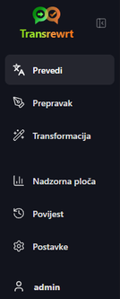
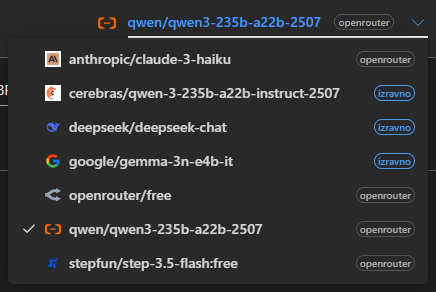
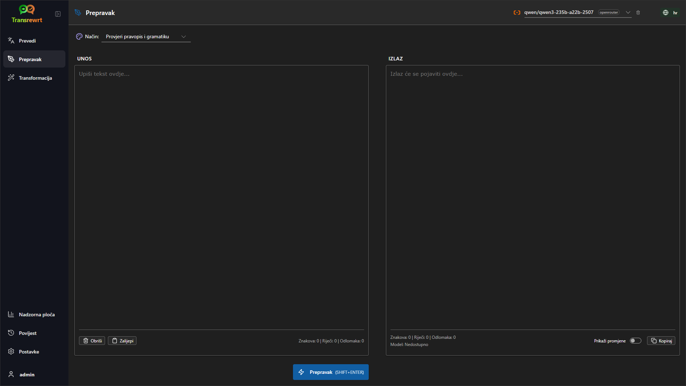
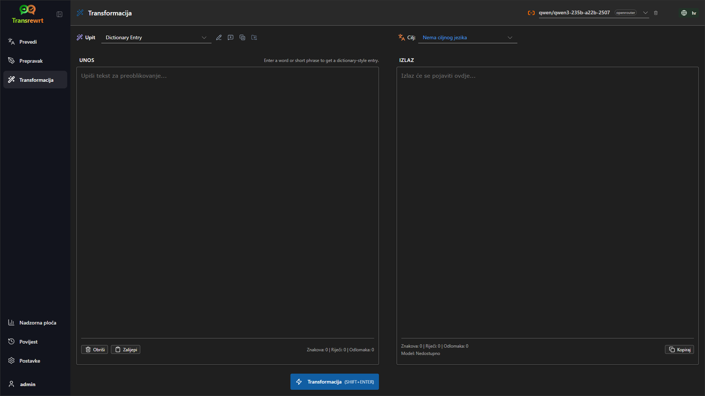
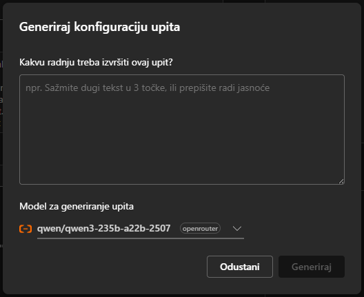
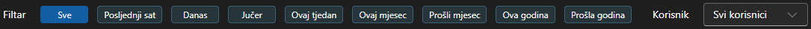

<a id="transrewrt-user-guide"></a>
# Korisnički vodič

<br/>

<a id="introduction"></a>
## Uvod

Transrewrt vam pomaže u radu s tekstom na tri glavna načina:

- **Prevedi** - pretvorite tekst s jednog jezika na drugi.
- **Prepravak** - preformulirajte tekst u drugačijem stilu, npr. jasniji, kraći ili formalniji.
- **Transformacija** - obradite tekst pomoću prilagođenih AI uputa koje se nazivaju upiti.

<br/>

Ovaj vodič objašnjava kako koristiti aplikaciju nakon što je instalirana i pokrenuta. Za korake instalacije pogledajte glavni **[README](README.hr.md)**.

<br/>

> ℹ️ **NAPOMENA**<br/>
> Transrewrt je dostupan kao desktop aplikacija za Windows i Linux te kao samostalno hostirana web aplikacija. Ovaj vodič fokusira se na svakodnevnu upotrebu aplikacije. Ako se neka stavka odnosi samo na jednu verziju, to će biti jasno označeno.

<small>**Pročitajte na drugim jezicima:** </small>
<small id="lang-list">[English (UK)](../USER-GUIDE.md) · [Português (BR)](USER-GUIDE.pt-BR.md) · [العربية](USER-GUIDE.ar.md) · [বাংলা](USER-GUIDE.bn.md) · [Català](USER-GUIDE.ca.md) · [简体中文](USER-GUIDE.zh-CN.md) · [繁體中文](USER-GUIDE.zh-TW.md) · [Hrvatski](USER-GUIDE.hr.md) · [Čeština](USER-GUIDE.cs.md) · [Nederlands](USER-GUIDE.nl.md) · [English (US)](USER-GUIDE.en-US.md) · [Filipino](USER-GUIDE.tl.md) · [Français](USER-GUIDE.fr.md) · [Deutsch](USER-GUIDE.de.md) · [Ελληνικά](USER-GUIDE.el.md) · [हिन्दी](USER-GUIDE.hi.md) · [Magyar](USER-GUIDE.hu.md) · [Italiano](USER-GUIDE.it.md) · [日本語](USER-GUIDE.ja.md) · [Basa Jawa](USER-GUIDE.jv.md) · [한국어](USER-GUIDE.ko.md) · [Bahasa Melayu](USER-GUIDE.ms.md) · [فارسی](USER-GUIDE.fa.md) · [Polski](USER-GUIDE.pl.md) · [Português (PT)](USER-GUIDE.pt.md) · [ਪੰਜਾਬੀ](USER-GUIDE.pa.md) · [Română](USER-GUIDE.ro.md) · [Русский](USER-GUIDE.ru.md) · [Slovenčina](USER-GUIDE.sk.md) · [Español](USER-GUIDE.es.md) · [Kiswahili](USER-GUIDE.sw.md) · [Svenska](USER-GUIDE.sv.md) · [తెలుగు](USER-GUIDE.te.md) · [ภาษาไทย](USER-GUIDE.th.md) · [Türkçe](USER-GUIDE.tr.md) · [Українська](USER-GUIDE.uk.md) · [Tiếng Việt](USER-GUIDE.vi.md)</small>

<small>

> **Napomena o prijevodu sučelja i dokumentacije:** Svi jezici sučelja osim izvornog engleskog (UK)
> prevedeni su pomoću AI modela; izrazi mogu biti neprecizni ili sadržavati pogreške.

</small>

<br/>

<!-- START doctoc generated TOC please keep comment here to allow auto update -->
<!-- DON'T EDIT THIS SECTION, INSTEAD RE-RUN doctoc TO UPDATE -->
**Sadržaj**

- [Prije početka](#before-you-start)
  - [Kako dobiti besplatni OpenRouter API ključ (desktop aplikacija)](#how-to-get-a-free-openrouter-api-key-desktop-app)
- [Početak rada](#getting-started)
- [Glavni dijelovi prozora](#main-parts-of-the-window)
  - [Bočna traka](#sidebar)
  - [Alatna traka](#toolbar)
  - [Ploče za unos i izlaz](#input-and-output-panels)
- [Prijevod](#translate)
  - [Prevedi tekst](#translate-text)
  - [Odabir jezika](#language-selection)
  - [Korisne postavke prijevoda](#helpful-translation-settings)
- [Prepravak](#rewrite)
- [Transformacija](#transform)
  - [Pokrenite postojeći upit](#run-an-existing-prompt)
  - [Ako još nemate upita](#if-you-have-no-prompts-yet)
  - [Brzo stvorite upit](#create-a-prompt-quickly)
  - [Uredite upit](#edit-a-prompt)
  - [Testirajte upit prije korištenja](#test-a-prompt-before-using-it)
- [Nadzorna ploča](#dashboard)
  - [Filtrirajte podatke](#filter-the-data)
  - [Kartice nadzorne ploče](#dashboard-tabs)
  - [Izvoz podataka](#export-data)
  - [Izbrišite pohranjene zapise za model](#delete-stored-records-for-a-model)
- [Povijest](#history)
  - [Filtrirajte podatke](#filter-the-data-1)
  - [Izvoz podataka iz povijesti](#export-history-data)
- [Postavke](#settings)
  - [Opće postavke](#general-settings)
  - [Modeli](#models)
  - [Jezici](#languages)
  - [Praćenje troškova](#cost-tracking)
  - [Upiti za transformaciju](#transform-prompts)
  - [Korisnici](#users)
  - [API konfiguracija](#api-config)
  - [O programu](#about)
- [Uobičajeni problemi](#common-issues)
  - [Aplikacija ne prenosi, ne prepravlja ni ne transformira tekst](#the-app-will-not-translate-rewrite-or-transform-text)
  - [Popis modela je prazan](#the-model-list-is-empty)
  - [Rezultat je pre spor ili pre skup](#the-result-is-too-slow-or-too-expensive)
  - [Sučelje je na pogrešnom jeziku](#the-interface-is-in-the-wrong-language)
  - [Tekst je premalen ili teško čitljiv](#the-text-is-too-small-or-hard-to-read)
  - [Grafovi na nadzornoj ploči su prazni](#dashboard-charts-are-empty)
  - [Trošak prikazuje „nije dostupan“ ili izgleda pogrešno](#cost-shows-not-available-or-seems-wrong)
  - [Ukupni trošak se ne podudara s računom davatelja](#total-cost-does-not-match-my-provider-bill)
  - [Stranica Povijest nedostaje u bočnoj traci](#the-history-page-is-missing-from-the-sidebar)
  - [Web aplikacija: neočekivano preusmjeravanje na stranicu za prijavu](#web-app-redirected-to-the-login-page-unexpectedly)
  - [Web administrator: zaboravili ste ili izgubili lozinku](#web-admin-forgot-or-lost-a-password)
  - [Nadzorna ploča ne prikazuje podatke za druge korisnike (web)](#dashboard-shows-no-data-for-other-users-web)
  - [Promijenili ste upit i izgubili izmjene](#i-changed-a-prompt-and-lost-the-edits)
- [Brzi savjeti](#quick-tips)
- [Odricanje odgovornosti](#disclaimer)
- [Licenca](#license)

<!-- END doctoc generated TOC please keep comment here to allow auto update -->

<br/><br/>

<a id="before-you-start"></a>
## Prije nego što započnete

Da biste koristili Transrewrt, potreban vam je pristup barem jednom davatelju AI usluga. Podržani davatelji su: [OpenRouter](https://openrouter.ai) (koji nudi pristup mnogim modelima), OpenAI, Anthropic, Google Gemini, DeepSeek, Groq, Mistral, xAI, Cerebras i [Ollama](https://ollama.com) za lokalne modele.

Ne morate odabrati plaćeni model kako biste započeli. Čim dodate svoj OpenRouter API ključ, aplikacija automatski omogućuje ugrađenu **besplatnu** OpenRouter opciju. To vam omogućuje trenutno prevođenje, prepisivanje i transformaciju teksta. Alternativno, možete dobiti besplatni API ključ od Cerebras, Googlea, Groq ili Mistral AI.

Jednostavnim riječima:

- **Model** je AI motor koji obavlja posao. Modeli se prikazuju s **prefiksom davatelja** (npr. `openrouter/…`, `openai/…`, `ollama/…`).
- **API ključ** (ili za Ollamu, **osnovni URL**) je način na koji aplikacija pristupa davatelju usluga.

Ako koristite **desktop aplikaciju**, dodajte ključeve u [**Postavke** > **API konfiguracija**](#api-config) za svakog davatelja kojeg koristite. Ako koristite samo OpenRouter, pogledajte dolje [Kako dobiti API ključ](#how-to-get-an-api-key-desktop-app). Ako ne želite koristiti API ključ, možete instalirati Ollamu (s [ollama.com](https://ollama.com)) i koristiti lokalne modele, poput `translategemma:4b`.

Ako koristite **web verziju**, vlasnik poslužitelja konfigurira davatelje putem varijabli okruženja, pa ne možete izravno unijeti API ključeve u aplikaciji.

<br/>

<a id="how-to-get-an-api-key-desktop-app"></a>
### Kako dobiti besplatni OpenRouter API ključ (desktop aplikacija)

Ako koristite desktop aplikaciju, slijedite ove korake:

1. Posjetite [OpenRouter](https://openrouter.ai) u svom web pregledniku.
2. Stvorite račun ili se prijavite.
3. Otvorite stranicu [Ključevi](https://openrouter.ai/keys).
4. Kliknite gumb za stvaranje novog API ključa.
5. Dodijelite ključu naziv kako biste ga mogli prepoznati kasnije.
6. Kopirajte novi API ključ.
7. Vratite se u Transrewrt i otvorite **Postavke** > **API konfiguracija**.
8. Zalijepite ključ u polje **OpenRouter API ključ** (ispod **Postavke** > **API konfiguracija**).
9. Kliknite **Testiraj OpenRouter ključ** kako biste provjerili radi li ispravno.

<br/><br/>

<a id="getting-started"></a>
## Prvi koraci

Ako je ovo prvi put da koristite Transrewrt, slijedite ovaj redoslijed:

1. Otvorite aplikaciju.
2. Ako je potrebno, odaberite **Jezik sučelja** iz ikone zemaljskog globusa.
3. Ako koristite **desktop aplikaciju**, otvorite [**Postavke** > **API konfiguracija**](#api-config), dodajte API ključ barem za jednog davatelja (npr. OpenRouter) i kliknite **Testiraj** kako biste potvrdili da radi.
4. Otvorite [**Postavke** > **Modeli**](#models) i dodajte jedan ili više modela u **Odabrane modele**.
5. Otvorite [**Postavke** > **Jezici**](#languages) i odaberite svoje **Vrhunske jezike** ako želite da se najčešće korišteni jezici prikazuju prvi.
6. Idite na **Prevedi** i pokrenite jednostavno prevođenje kako biste potvrdili da sve radi.
7. Kada to uspije, isprobajte **Prepravak** i zatim **Transformaciju**.

Redoslijed je važan. On sprječava najčešći problem kod prvog korištenja: pokušaj pokretanja zadatka prije nego što aplikacija ima radnu API vezu ili odabrani model.

<br/><br/>

<a id="main-parts-of-the-window"></a>
## Glavni dijelovi prozora

Aplikacija je podijeljena u tri glavna područja:

- **Bočna traka** s lijeve strane.
- **Alatna traka** na vrhu.
- **Radno područje** u sredini.

<br/>

<a id="sidebar"></a>
### Bočna traka

Koristite bočnu traku za kretanje kroz aplikaciju. Možete sažeti bočnu traku kako biste oslobodili više prostora klikom na ikonu pored logotipa aplikacije.

<br/>

<table>
  <tr>
    <td valign="top">
       
    </td>
    <td valign="top">
      <br/><br/>
      <ul>
        <li><strong>Prevedi</strong> otvara radno područje za prevođenje.</li><br/>
        <li><strong>Prepravak</strong> otvara radno područje za prepisivanje.</li><br/>
        <li><strong>Transformacija</strong> otvara radno područje za prilagođene upite.</li><br/>
        <li><strong>Nadzorna ploča</strong> prikazuje informacije o korištenju i troškovima.</li><br/>
        <li><strong>Postavke</strong> otvara ploču postavki.</li><br/>
        <li><strong>Povijest</strong> prikazuje povijest korištenja s unosom i izlaznim tekstom</li><br/>
        <li><strong>Korisnik</strong> prikazuje korisničko ime prijavljenog korisnika (samo za web).</li>
      </ul>
    </td>
  </tr>
</table>

<br/>

<a id="toolbar"></a>
### Traka s alatima

Traka s alatima malo se razlikuje ovisno o tome gdje se nalazite u aplikaciji.

- S lijeve strane prikazuje naziv trenutne stranice.
- S desne strane prikazuje **odabir modela** i upravljački element za **Jezik sučelja**.

**Odabir modela** omogućuje vam odabir AI motora koji će se koristiti za trenutni zadatak.



Neke besplatne modele možda neće uvijek biti dostupne — ponekad su van mreže ili imaju ograničenje korištenja. Ako se to dogodi, aplikacija će automatski ukloniti taj model s vašeg popisa dostupnih modela. Da biste kontrolirali koje modele vidite, idite na [**Postavke** > **Modeli**](#models) i uredite svoj popis modela. 
Također možete otvoriti postavke modela izravno klikom na ikonu davatelja s lijeve strane naziva modela na traci s alatima.

<br/>

**Ikona zemaljske kugle + kôd jezika** mijenja jezik sučelja aplikacije, kao što su izbornici i gumbi. Ona **ne** mijenja jezike prijevoda koji se koriste u funkciji **Prijevod**.


<br/>

<a id="input-and-output-panels"></a>
### Ploče za unos i izlaz

Većina radnih prostora koristi ploču za **Unos** s lijeve strane i ploču za **Izlaz** s desne strane.

Svaka ploča prikazuje i:

| **Unos**                                                          | **Izlaz**                                                                                                                  |
|--------------------------------------------------------------------|-----------------------------------------------------------------------------------------------------------------------------|
| - Broj znakova <br/>- Broj riječi <br/>- Broj odlomaka   <br/> | - Koliko je trajao zadatak<br/>- **TPS** (žetoni po sekundi)<br/>- Broj znakova, riječi i odlomaka<br/>- Korišteni model |

Ako se pitate o tehničkim izrazima:

- **Žeton** znači mali dio teksta. Možete ga smatrati dijelom riječi ili kratkom riječi.
- **TPS** znači koliko je takvih dijelova teksta model obradio svake sekunde.

<br/>

Također možete pratiti trošak svake operacije (ako je dostupan) i ukupni trošak, omogućivanjem opcije `Prikaži informacije o trošku za radnje` u [**Postavke** > **Opće postavke**](#general-settings).

<br/><br/>

[--------------------------------------------------------------------------------------------------------------------------]: #

<a id="translate"></a>
## Prijevod

Koristite funkciju **Prijevod** kada želite pretvoriti tekst s jednog jezika na drugi.


<br/>

<a id="translate-text"></a>
### Prijevod teksta

1. Otvorite **Prijevod**.
2. Odaberite jezik u polju **S**.
3. Odaberite jezik u polju **Na**.
4. Odaberite model na traci s alatima.
5. Utipkajte ili zalijepite tekst u polje **Unos**.
6. Kliknite **Prevedi**.
7. Pročitajte rezultat u polju **Izlaz**.
8. Koristite gumb za kopiranje ako želite kopirati rezultat.

<br/>

<a id="language-selection"></a>
### Odabir jezika

- **S** može biti određeni jezik ili **Otkrij jezik**.
- **Na** je jezik na koji želite dobiti rezultat.

Vaši odabrani **Vrhunski jezici** pojavljuju se na vrhu popisa. Možete ih postaviti u [**Postavke** > **Jezici**](#languages).

<br/>

<a id="helpful-translation-settings"></a>
### Korisne postavke prijevoda

U [**Postavkama** > **Općim postavkama**](#general-settings) možete promijeniti kako se ponaša prijevod:

- **Automatski prijevod pri lijepljenju** pokreće prijevod čim zalijepite tekst.
- **Automatski kopiraj rezultat u međuspremnik** automatski kopira rezultat nakon uspješnog izvođenja.
- **Prijevod u stvarnom vremenu (tijekom tipkanja)** pokreće prijevode dok tipkate.
- **Vrijeme čekanja (ms)** kontrolira koliko dugo aplikacija čeka prije nego što pokrene prijevod u stvarnom vremenu.
- **Enter** kontrolira što se događa kada pritisnete `Enter`:

<br/><br/>

[--------------------------------------------------------------------------------------------------------------------------]: #

<a id="rewrite"></a>
## Prepravak

Koristite **Prepravak** kada želite poboljšati formulaciju bez promjene glavne poruke.



Ovo je korisno za:

- ispravljanje pravopisa i gramatike (**Provjeri pravopis i gramatiku**)
- poboljšanje jasnoće teksta (**Poboljšaj jasnoću**)
- više različitih preformulacija u jednom pokretanju (**Alternativne verzije**)
- činjenje teksta formalnijim ili neformalnijim (**Formalno** / **Neformalno**)
- skraćivanje ili proširivanje teksta (**Skraći** / **Proširi**)
- činjenje teksta tehničkijim (**Učini tehničkim**)

<br/>

> 💡 **SAVJET**<br/>
> Kada koristite način „**Provjeri pravopis i gramatiku**“, u izlaznoj ploči (kraj **Kopiraj**) pojavi se prekidač **Prikaži promjene**.
> Uključite ili isključite ga kako biste prikazali ili sakrili specifične ispravke primijenjene na vaš tekst.

<br/><br/>

[--------------------------------------------------------------------------------------------------------------------------]: #

<a id="transform"></a>
## Transformacija

Koristite **Transformaciju** kada želite da AI slijedi prilagođeni skup uputa.



Ovo je najfleksibilniji dio aplikacije. Možete ga koristiti za zadatke poput:

- sažimanja bilješki
- pretvaranja grubog teksta u uređenu e-poštu
- izdvajanja ključnih točaka
- pretvaranja teksta u određeni format
- bilo koje druge prilagođene aktivnosti s ulaznim tekstom

<br/>

<a id="run-an-existing-prompt"></a>
### Pokreni postojeći upit

1. Otvorite **Transformaciju**.
2. Odaberite upit s popisa upita.
3. Ako se pojavi polje **Cilj**, odaberite jezik ako želite.
4. Upišite ili zalijepite tekst u **Unos**.
5. Kliknite **Transformiraj**.
6. Pročitajte rezultat u **Izlaz**.

<br/>

<a id="if-you-have-no-prompts-yet"></a>
### Ako još nemate upita

Ako je vaš popis upita prazan, kliknite **Učitaj uzorke upita** u radnom prostoru Transformacija. Ista se opcija uvijek nalazi u [**Postavkama** > **Upiti za transformaciju**](#transform-prompts) u retku za izvoz/uvoz. Oba načina dodaju ugrađene primjere kako biste mogli brzo započeti.

<br/>

> ℹ️ **NAPOMENA**<br/>
> Uzorci upita dostavljaju se na engleskom jeziku. Nakon što ih učitate, možete urediti upit i koristiti **Prevedi upit** kako biste ga preveli na svoj jezik.

<br/>

<a id="create-a-prompt-quickly"></a>
### Brzo stvaranje upita

Najbrži način da stvorite upit je:

1. Kliknite **Novi upit**.
2. Kliknite **Generiraj upit**.
3. Opisite što želite da upit učini.
4. Odaberite model.
5. Dopustite aplikaciji da stvori nacrt za vas.
6. Pregledajte nacrt i kliknite **Spremi**.



<br/>

<a id="edit-a-prompt"></a>
### Uredi upit

Kada stvorite ili uredite upit, urednik se pojavljuje s lijeve strane, a područje za testiranje s desne strane.


Glavna polja su:

- **Naziv upita**: naziv koji se prikazuje na popisu upita.
- **Upute za upit (opcionalno)**: kratki savjet koji se prikazuje korisniku prilikom pokretanja upita.
- **Uloga modela**: opća uloga dodijeljena umjetnoj inteligenciji, npr. „Vi ste korisni pomoćnik.“
- **Upute za model (jedna po retku)**: specifična pravila koja AI treba slijediti.
- **Opis izlaza**: kratka riječ koja opisuje rezultat, npr. „sažetak“ ili „prepravak“.
- **Temperatura (0,0 → 1,0)**: kako će se model ponašati; pogledajte ispod.
- **Traži ciljni jezik**: dodaje odabir ciljnog jezika kada se upit pokrene.

Ako vam je tehnički izraz **Temperatura** nov, razmislite o tome ovako:

- **Niža** temperatura daje stabilnije, predvidljivije rezultate.
- **Viša** temperatura daje veću raznolikost i kreativnost.

Također možete koristiti:

- **`Generiraj upit`** za stvaranje novog nacrta iz jednostavnog opisa
- **`Poboljšaj upit`** za poboljšanje postojećeg upita
- **`Prevedi upit`** za prijevod polja upita

<br/>

> ⚠️ **UPOZORENJE**<br/>
> Kliknite **`Spremi`** prije nego što kliknete **`Natrag na pokretanje`**. Ako se vratite bez spremanja, promjene će biti izgubljene.

<br/>

<a id="test-a-prompt-before-using-it"></a>
### Testirajte upit prije korištenja

Testna ploča s desne strane omogućuje vam isprobavanje upita s primjerom teksta prije korištenja u svakodnevnom radu.

Ovo je korisno kada:

- stvarate novi upit
- uspoređujete dvije verzije upita
- želite provjeriti ton, duljinu ili format izlaza

<br/>

> ℹ️ **NAPOMENA**<br/>
> Možete izvesti i uvesti spremljene upite u odjeljku [**Postavke** > **Upiti za transformaciju**](#transform-prompts).

<br/><br/>

[--------------------------------------------------------------------------------------------------------------------------]: #

<a id="dashboard"></a>
## Nadzorna ploča

Koristite **Nadzornu ploču** da biste vidjeli koliko koristite aplikaciju i koliko vas to košta (za plaćene modele).


<br/>

> ℹ️ **NAPOMENA**<br/>
> Ako koristite samo **besplatne** modele, iznosi **troškova** mogu biti nula, a sažeci usmjereni na trošak mogu izgledati prazno. Na karticama **Sažetak**, **Korištenje tokom vremena** i **Korištenje po modelu** i dalje se prikazuju **brojevi poziva** (prijevod, prepravak i transformacija) kada imate aktivnosti u odabranom razdoblju.

<br/>

<a id="filter-the-data"></a>
### Filtar podataka

Koristite gumbe za filtriranje na vrhu za promjenu vremenskog raspona.



<br/>

> ℹ️ **NAPOMENA**<br/>
> Filter **Korisnik** vidljiv je samo administratorima u web verziji. Redovni korisnici neće vidjeti ovaj filter, a nije dostupan ni u desktop aplikaciji.

<br/>

<a id="dashboard-tabs"></a>
### Kartice nadzorne ploče

- **Sažetak** daje pregled korištenja i troškova. Uključuje **Korištenje tokom vremena** (naslagani kumulativni **broj poziva** po danu za prijevod, prepravak i transformaciju) i **Korištenje po modelu** (ukupan **broj poziva po modelu**, uključujući transformaciju).
- **Po korištenju** razdvaja aktivnosti po jeziku prijevoda, načinu prepravke i transform upitu.
- **Po modelu** prikazuje koje ste modele koristili i koliko su koštali.
- **Po danu** prikazuje dnevne ukupne vrijednosti.
- **Svi pozivi** prikazuje potpunu povijest poziva i omogućuje izvoz.

<br/>

<a id="export-data"></a>
### Izvoz podataka

Tablice na nadzornoj ploči mogu izvesti podatke u:

- **JSON**
- **CSV**
- **XLSX**

Ovo je korisno ako želite pregledati aktivnosti izvan aplikacije ili podijeliti izvještaj.

<br/>

<a id="delete-stored-records-for-a-model"></a>
### Izbriši pohranjene zapise za model

U **Po modelu** ili **Svi pozivi**, možete ukloniti pohranjene zapise za model klikom na ikonu „kante za smeće“.

> ⚠️ **UPOZORENJE**<br/>
> Brisanje pohranjenih zapisa ne može se poništiti. Koristite ovo samo ako ste sigurni da više ne trebate tu povijest.

Da biste izbrisali sve podatke ili uklonili zapise na temelju njihove starosti, idite na [**Postavke** > **Praćenje troškova**](#cost-tracking). Tamo ćete pronaći mogućnosti za brisanje svih pohranjenih podataka ili samo podataka starijih od određenog datuma.

<br/><br/>

[--------------------------------------------------------------------------------------------------------------------------]: #

<a id="history"></a>
## Povijest

Kliknite na **Povijest** da biste vidjeli povijest svojih radnji unutar **Transrewrt-a**, uključujući unos i izlaz svake operacije.


<br/>

<a id="filter-the-history"></a>
### Filtar podataka

**Povijest** koristi iste filtre kao i stranica **Nadzorne ploče**. Koristite ih za odabir vremenskog raspona.


<br/>

> ℹ️ **NAPOMENA**<br/>
> Filter **Korisnik** vidljiv je samo administratorima u web verziji. Redovni korisnici neće vidjeti ovaj filter, a nije dostupan ni u desktop aplikaciji.

<br/>

<a id="export-history-data"></a>
### Izvoz podataka povijesti

Stranica povijesti može izvesti filtrirane podatke u:

- **JSON**
- **CSV**
- **XLSX**

Ovo je korisno ako želite pregledati aktivnosti izvan aplikacije ili podijeliti izvještaj.

<br/><br/>

[--------------------------------------------------------------------------------------------------------------------------]: #

<a id="settings"></a>
## Postavke

Otvorite **Postavke** s bočne trake da prilagodite ponašanje aplikacije.

Dostupni jezičci ovise o platformi i vašoj ulozi:

| Jezičak               | Desktop | Web (administrator) | Web (obični korisnik) |
  |-------------------|:-------:|:-----------:|:------------------:|
  | Opće postavke  |   Da   |     Da     |        Da         |
  | Modeli            |   Da   |     Da     |        Da         |
  | Jezici         |   Da   |     Da     |        Da         |
  | Praćenje troškova     |   Da   |     Da     |         —          |
  | Upiti za transformaciju |   Da   |     Da     |        Da         |
  | Korisnici             |    —    |     Da     |         —          |
  | API konfiguracija        |   Da   |     Da     |         —          |
  | O programu             |   Da   |     Da     |        Da         |

<br/>

> ℹ️ **NAPOMENA**<br/>
> U web verziji svaki korisnik ima vlastitu konfiguraciju. Postavke poput odabranih modela, jezika, općih opcija i upita za transformaciju pohranjuju se po korisniku. Promjene koje napravite ne utječu na druge korisnike.

<br/>

[--------------------------------------------------------------------------------------------------------------------------]: #

<a id="general-settings"></a>
### Opće postavke

Koristite **Opće postavke** za upravljanje ponašanjem tijekom tipkanja, pohranjivanjem pojedinosti izvršenja za **Povijest** i izgledom aplikacije.

**Ponašanje**

- **Ponašanje za ENTER** određuje hoće li `Enter` pokrenuti zadatak ili umetnuti novi redak.
- **Automatski prijevod pri lijepljenju** pokreće prijevod čim zalijepite tekst.
- **Automatski kopiraj rezultat u međuspremnik** automatski kopira uspješne rezultate.
- **Prijevod u stvarnom vremenu (tijekom tipkanja)** prevodi dok tipkate.
- **Vrijeme čekanja (ms)** postavlja vrijeme čekanja za prijevod u stvarnom vremenu.

**Povijest**

- **Zadrži povijest izvršenja** kontrolira pohranjuje li se svaki prijevod, prepravak i transformacija uz **ulazni i izlazni tekst** za prikaz [**Povijest**](#history) u bočnoj traci. Isključivanje ove opcije traži potvrdu; ako potvrdite, pohranjeni tekst povijesti uklanja se iz baze podataka.
- **Izbriši podatke povijesti** omogućuje uklanjanje pohranjenog teksta prema dobi (npr. starije od nekoliko mjeseci ili **svi podaci (obriši)**) pomoću **Izbriši podatke**. To utječe samo na pohranjeni tekst izvršenja za prikaz **Povijest**; **ne** briše podatke o troškovima ili ukupnoj upotrebi. Da biste uklonili ili smanjili podatke o **troškovima**, koristite [**Postavke** > **Praćenje troškova**](#cost-tracking).

**Izgled**

- **Prikaži informacije o troškovima na akcijama** kontrolira prikaz troškova po operaciji (ako su dostupni) i ukupnog troška na pločama za izlaz **Prijevod**, **Prepravak** i **Transformacija**.
- **Broj decimalnih mjesta za trošak** mijenja prikaz decimala troškova.
- **Samo web:** **prikaži rub oko aplikacije** dodaje dodatni prostor oko sučelja.
- **Obitelj fonta** mijenja font pisanja u tekstnim pločama.
- **Veličina** mijenja veličinu fonta.

**Sigurnosna kopija konfiguracije**

- **Uključi podatke o korištenju u sigurnosnu kopiju** — kada je omogućeno, ZIP datoteka također sadrži povijest izvršenja i podatke o pozivima API-ja.
- **Napravi sigurnosnu kopiju konfiguracije** — stvara jednu ZIP datoteku (`transrewrt-config-backup-YYYY-MM-DD_HHMMSS.zip` prema zadanim postavkama u UTC-u) koja sadrži `config.json`, `state.json`, opcionalni ključ za šifriranje, korisnike, postavke, prilagođene upite i podatke o korištenju ako ste se za to odlučili. Nakon uspješnog stvaranja sigurnosne kopije, potvrda prikazuje naziv spremljene datoteke.
- **Vrati iz sigurnosne kopije** — prvo otvara **dijalog za potvrdu**. Odaberite ZIP datoteku sigurnosne kopije unutar dijaloga (**Pregledaj** / odabir datoteke ili prevlačenje i otpuštanje gdje je podržano), a zatim pregledajte opcije:
  - **Vrati podatke o korištenju** — uvozi podatke o korištenju/povijest iz ZIP datoteke ako je sigurnosna kopija napravljena s uključenim podacima o korištenju; ostavite isključeno ako želite samo postavke i upite.
  - **Obriši stare podatke o korištenju prije vraćanja** — uklanja postojeće podatke o korištenju/povijest na ovoj instalaciji prije primjene sigurnosne kopije (neobavezno; koristite kada želite čisto zamijeniti).

Sigurnosne kopije napravljene u web ili desktop verziji mogu se vratiti u drugoj verziji. Kada se sigurnosna kopija za desktop vraća u web verziji, podaci se vraćaju korisniku administratoru.

<br/>

<a id="models"></a>
### Modeli

Koristite **Postavke** > **Modeli** da odaberete koji modeli prikazati na alatnoj traci.


Stranica ima dvije liste:

- **Dostupni modeli** s lijeve strane
- **Odabrani modeli** s desne strane

Korisni alati uključuju:

- **Pretraži modele...** za pronalaženje modela po nazivu
- **Davatelj** oznake za sužavanje popisa na jedan sustav (OpenRouter, OpenAI, Ollama, …)
- **Samo besplatni** za prikaz samo besplatnih modela
- **Osvježi** za ponovno učitavanje popisa
- **Proširi sve** i **Sažmi sve** kada sortirate po davatelju

ID-ovi modela uključuju prefiks davatelja (npr. `openrouter/…` nasuprot `openai/…`). Oznake poput **OpenAI (OpenRouter)** nasuprot **OpenAI (izravno)** pokazuju kako se promet usmjerava.

> ℹ️ **NAPOMENA**<br/>
> **OpenRouter Body Builder** (`openrouter/bodybuilder`) je model za usmjeravanje, a ne opći model za razgovor: njegov odgovor je JSON koji opisuje tijela zahtjeva za OpenRouter API (npr. niz `requests` s `model` i `messages`). Ako ga koristite za **Prevedi**, **Prepravak** ili **Transformaciju**, ploča za izlaz prikazat će taj JSON umjesto gotovog teksta. Odaberite normalan tekstualni model za te zadatke. Pogledajte [stranicu modela Body Builder](https://openrouter.ai/openrouter/bodybuilder) na OpenRouteru.

Radnje:

- Da biste dodali model, kliknite **Dodaj** ili bilo gdje unutar unosa.

- Da biste uklonili model, kliknite **X** pored njega u odjeljku **Odabrani modeli** ili **Odabrano** na unosu u Dostupnim modelima.

- Da biste očistili popis, kliknite **Poništi odabir**. Obavezni besplatni model ostat će na popisu.

<br/>

> ℹ️ **NAPOMENA**<br/>
> Ako ne želite odmah dodati kredite na OpenRouter, započnite omogućavanjem opcije **Samo besplatni** i odabirom besplatnih modela (nije potrebna kreditna kartica). Također možete koristiti Ollama za pokretanje modela lokalno bez ikakvog API ključa.

<br/>

<a id="languages"></a>
### Jezici

Koristite **Postavke** > **Jezici** za uređivanje popisa jezika koje aplikacija koristi.

- **Najčešći jezici** prikvačeni su na vrh popisa jezika u funkcijama **Prevedi** i **Transformacija**.
- **Prilagođeni jezik** omogućuje dodavanje jezika koji nije na ugrađenom popisu.

Ako dodate prilagođeni jezik, pojavit će se u odabiračima jezika uz ugrađene opcije.

<br/>

<a id="cost-tracking"></a>
### Praćenje troškova

Koristite **Postavke** > **Praćenje troškova** za upravljanje informacijama o troškovima.

- **Ukupni trošak** prikazuje tekući zbroj.
- **Kopiraj vrijednost** kopira ukupni iznos u međuspremnik.
- **Resetiraj trošak** postavlja spremljeni zbroj na nulu.
- **Sinkroniziraj s korištenjem API ključa** postavlja ukupni iznos prema korištenju prikazanom na vašem OpenRouter računu (samo za OpenRouter).
- **Korištenje API ključa** prikazuje pojedinosti o korištenju OpenRoutera, ako su dostupne.
- **Obriši podatke o troškovima** uklanja sve podatke ili samo one starije od odabranog datuma.

**Praćenje troškova:** Kada koristite modele OpenRoutera, aplikacija prikazuje vaše stvarno korištenje i troškove temeljene na podacima o cijenama s OpenRoutera. Za sve ostale davatelje, aplikacija procjenjuje troškove koristeći cijene objavljene na OpenRouteru; ako cijena nije dostupna, procjena može biti nula.

<br/>

> ℹ️ **NAPOMENA**<br/>
> Svi prikazani iznosi su procjene isključivo za vašu informaciju, a ne službeni računi.

<br/>

> ⚠️ **UPOZORENJE**<br/>
> Brisanje podataka nije moguće poništiti. Prije brisanja, obavezno napravite sigurnosnu kopiju ili izvezite podatke putem [**Povijest**](#history)
> ili [**Nadzorna ploča** > **Svi pozivi**](#dashboard-tabs), inače će trajno biti izgubljeni.
> Sva povijest unosa/izlaza povezana s pojedinim unosima API poziva također će biti izbrisana.

<br/>

<a id="transform-prompts"></a>
### Upiti za transformaciju

Koristite **Postavke** > **Upiti za transformaciju** za grupno upravljanje upitima.

Možete:

- pregledajte spremljene upite
- izbrišite upite
- uvezite upite iz datoteke
- izvezite upite za sigurnosnu kopiju ili dijeljenje
- učitajte uzorke upita na popis upita

<br/>

<a id="users"></a>
### Korisnici

Koristite **Korisnici** za upravljanje korisničkim računima u web verziji. Možete dodavati korisnike, ažurirati njihove podatke, resetirati lozinke i brisati račune.

<br/>

<a id="api-config"></a>
### API konfiguracija

Podržani davatelji su: OpenRouter, OpenAI, Anthropic, Google Gemini, DeepSeek, Groq, Mistral, xAI, Cerebras i **Ollama** (lokalni modeli putem osnovnog URL-a). Potrebno je konfigurirati samo davatelje koje koristite.

**Web aplikacija: samo administrator**

API ključevi se konfiguriraju putem sustavskih ili Docker okolišnih varijabli — ne unose se u web sučelju. Ova stranica prikazuje za koje davatelje je ključ konfiguriran i omogućuje vam testiranje svakog pojedinačno klikom na gumb **`Testiraj`**.

<br/>

> ℹ️ **NAPOMENA**<br/>
> Za promjenu API ključa, ažurirajte okolišnu varijablu u svojoj sustavskoj ili Docker konfiguraciji i ponovno pokrenite poslužitelj ili spremnik.

> ℹ️ **NAPOMENA**<br/>
> **Sigurnosne kopije konfiguracije** (pogledajte [**Opće postavke** → Sigurnosna kopija konfiguracije](#general-settings)) mogu ugraditi **rješene** ključeve davatelja unutar `config.json` datoteke u ZIP arhivi. Vraćanje te arhive **neće** kopirati te ključeve natrag u konfiguracijsku datoteku poslužitelja — aktivni ključevi i dalje dolaze iz okoliša i postojećeg stanja datoteke kao što je opisano.

<br/>

**Desktop aplikacija**

Koristite **API konfiguraciju** za pohranu API ključeva za svakog davatelja kojeg koristite. Za Ollamu unesite **osnovni URL** umjesto API ključa.

<br/>

> 💡 **Savjet** <br/>
> Ako ne želite koristiti API ključeve niti plaćati za korištenje, možete [preuzeti Ollamu](https://ollama.com) i besplatno pokretati modele (npr. `translategemma:4b`) lokalno na svom računalu. Alternativno, možete stvoriti besplatni OpenRouter račun (bez potrebe za kreditnom karticom) kako biste koristili njihove besplatne modele ili dobiti besplatni API ključ od Cerebras, Googlea, Groqa ili Mistral AI.

<br/>

- dodajte samo davatelje koje trebate. U **Postavkama** > **Modelima**, svaki ID modela započinje s davateljem (npr. `openrouter/openrouter/free`, `openai/gpt-4o`, `ollama/llama3`).

Da biste dodali API ključ, unesite vrijednost u tekstualno polje i kliknite **`Spremi`**. Da biste zamijenili postojeći ključ, kliknite **`Uredi`**. Da biste provjerili radi li ključ, kliknite **`Testiraj`**. Za Ollama osnovni URL, uvijek kliknite **`Testiraj`** kako biste provjerili vezu.

<br/>

> ℹ️ **NAPOMENA**<br/>
> Trenutnu vrijednost API ključa ne možete vidjeti. Možete je samo zamijeniti pomoću gumba **`Uredi`**.
> API ključevi se pohranjuju šifrirano u konfiguraciji.

<br/>

<a id="about"></a>
### O programu

Kartica **O programu** prikazuje:

- naziv aplikacije
- broj verzije
- datum izrade
- poveznicu na repozitorij projekta

<br/><br/>

<a id="common-issues"></a>
## Česti problemi

Ako nešto ne radi kako treba, prvo provjerite sljedeće točke.

<br/>

<a id="the-app-will-not-translate-rewrite-or-transform-text"></a>
### Aplikacija neće prevesti, prepraviti ili transformirati tekst

Provjerite sljedeće:

- odabrali ste model u alatnoj traci
- barem jedan model je naveden u odjeljku [**Postavke** > **Modeli**](#models)
- vaša API konfiguracija radi

Ako koristite desktop aplikaciju:

1. Otvorite [**Postavke** > **API konfiguracija**](#api-config).
2. Provjerite je li spremljen barem jedan API ključ.
3. Kliknite **Testiraj** pokraj davatelja kako biste potvrdili da ključ radi.

<br/>

<a id="the-model-list-is-empty"></a>
### Popis modela je prazan

Otvorite [**Postavke** > **Modeli**](#models) i kliknite **Osvježi**.

Ako je potrebno:

- pretražite model
- uključite opciju **Samo besplatni**
- dodajte jedan ili više modela u **Odabrane modele**

<br/>

<a id="the-result-is-too-slow-or-too-expensive"></a>
### Rezultat je preusporen ili prekup

Isprobajte jednu ili više sljedećih opcija:

- odaberite drugi model
- koristite kraći unos
- isključite opciju **Prijevod u stvarnom vremenu (tijekom tipkanja)** u odjeljku [**Postavke** > **Opće postavke**](#general-settings)
- koristite besplatne modele za jednostavne zadatke (pogledajte [Modeli](#models))

<br/>

<a id="the-interface-is-in-the-wrong-language"></a>
### Sučelje je na pogrešnom jeziku

Kliknite ikonu zemaljskog globusa u [alatnoj traci](#toolbar) i odaberite željeni **Jezik sučelja**.

<br/>

<a id="the-text-is-too-small-or-hard-to-read"></a>
### Tekst je premalen ili teško čitljiv

Otvorite [**Postavke** > **Opće postavke**](#general-settings) i promijenite:

- **Obitelj fonta**
- **Veličinu**

<br/>

<a id="dashboard-charts-are-empty"></a>
### Grafikoni na nadzornoj ploči su prazni

To je normalno ako:

- koristite samo **besplatne modele** i gledate podatke o **troškovima** (oni mogu biti nula); grafikoni broja poziva u dijelu **Sažetak** još uvijek zahtijevaju podatke iz odabranog razdoblja
- odabrani **filtar vremena** ne obuhvaća razdoblje kada su izvršeni pozivi — pokušajte s opcijom **Sve** kako biste provjerili

Ako su grafikoni i dalje prazni nakon odabira **Sve**, potvrdite da se pozivi pojavljuju u [**Povijest**](#history) ili u kartici **Svi pozivi**.

<br/>

<a id="cost-shows-not-available-or-seems-wrong"></a>
### Trošak prikazuje „nije dostupno“ ili izgleda netočno

Kada koristite modele putem **OpenRouter-a**, aplikacija prikazuje stvarne troškove prijavljene od strane OpenRouter-a.

Za **druge davatelje usluga** (izravno OpenAI, izravno Anthropic itd.), trošak se procjenjuje na temelju cijena objavljenih od strane OpenRouter-a. Ako se za model ne pronađe odgovarajuća cijena, trošak će se prikazati kao **nije dostupno** i neće se dodati na ukupni iznos.

<br/>

<a id="total-cost-does-not-match-my-provider-bill"></a>
### Ukupni trošak se ne podudara s računom davatelja

Svi iznosi troškova u aplikaciji su **procjene samo za referencu**, a ne službeni računi.

Da biste ukupni iznos približili stvarnom trošku na OpenRouter-u, otvorite [**Postavke** > **Praćenje troškova**](#cost-tracking) i kliknite **Sinkroniziraj s korištenjem API ključa**.

<br/>

<a id="the-history-page-is-missing-from-the-sidebar"></a>
### Stranica Povijest nedostaje u bočnoj traci

Moguće je da je isključena opcija **Zadrži povijest izvršenja**. Otvorite [**Postavke** > **Opće postavke**](#general-settings) i omogućite je. Imajte na umu da uključivanje ove opcije ne vraća prethodno izbrisane podatke povijesti.

<br/>

<a id="web-app-session-expired"></a>
### Web aplikacija: neočekivano preusmjeravanje na stranicu za prijavu

Vaša sesija je mogla isteći. Ponovno se prijavite. Ako se to događa često, provjerite postavke konfiguracije poslužitelja za trajanje sesije.

<br/>

<a id="web-admin-forgot-or-lost-a-password"></a>
### Web administrator: zaboravljena ili izgubljena lozinka

Ovo se odnosi na **samostalno hostiranu web aplikaciju** (Docker), a ne na desktop aplikaciju (Electron).

- Ako se drugi administrator može prijaviti, on može otvoriti [**Postavke** > **Korisnici**](#users), odabrati račun i postaviti tamo **novu lozinku**.
- Ako ste **blokirani**, ali imate **pristup ljusci** stroja ili kontejnera, poništite lozinku pomoću alata koji dolazi s slikom (zamijenite `transrewrt` ako ste promijenili zadani naziv, te stavite lozinku u navodnike ako sadrži razmake ili posebne znakove):

```bash
docker exec transrewrt reset-web-password '<username>' '<new-password>'
```

Zadano korisničko ime administratora je `admin` ako niste nikada stvorili druge račune. Kada unesete samo jedan argument, taj argument se tretira kao nova lozinka za `admin`.

Ako pokrećete aplikaciju iz **izvornog koda** umjesto Docker-a, koristite:

```bash
pnpm run reset-web-password -- <username> <new-password>
```

Skripta ažurira zapis korisnika u SQLite bazi podataka (i može stvoriti korisnika `admin` ako ne postoji). Nakon poništavanja, prijavite se s novom lozinkom.

<br/>

<a id="dashboard-shows-no-data-for-other-users"></a>
### Nadzorna ploča ne prikazuje podatke za druge korisnike (web)

Samo **administratori** mogu pregledavati podatke svih korisnika putem filtera **Korisnik**. Redovni korisnici vide samo vlastitu aktivnost, kako je dizajnirano.

<br/>

<a id="i-changed-a-prompt-and-lost-the-edits"></a>
### Promijenio sam upit i izgubio izmjene

Kada uređujete upit, uvijek kliknite **Spremi** prije nego što kliknete **Natrag na pokretanje**.

<br/><br/>

<a id="quick-tips"></a>
## Brzi savjeti

- Započnite s [**Prevedi**](#translate) kako biste provjerili funkcionira li vaša postavka prije nego što prijeđete na [**Prepravak**](#rewrite) ili [**Transformacija**](#transform).
- Koristite [**Prepravak**](#rewrite) za svakodnevna poboljšanja formulacije.
- Koristite [**Transformacija**](#transform) kada vam treba ponovljiv tijek rada za određeni zadatak.
- Koristite [**Nadzorna ploča**](#dashboard) ako želite pratiti korištenje i trošak.
- Koristite [**Povijest**](#history) za pregled prošlih operacija i njihovog punog ulaznog/izlaznog teksta.
- Redovito izvozite upite ako izrađujete biblioteku upita koju želite sačuvati (pogledajte [Upiti za transformaciju](#transform-prompts)) ili ako ju želite podijeliti s drugima.

<br/><br/>

<a id="disclaimer"></a>
## Odricanje od odgovornosti

Imena proizvoda i ikone vlasništvo su njihovih vlasnika i koriste se samo u svrhe identifikacije. Ovaj softver nije povezan s niti ga podržavaju navedene marke.

<br/><br/>

<a id="license"></a>
## Licenca

Autorska prava © 2026 Waldemar Scudeller Jr.

[Apache License 2.0](../LICENSE)
