<a id="transrewrt-user-guide"></a>
# Felhasználói útmutató

<br/>

<a id="introduction"></a>
## Bevezetés

A Transrewrt három fő módon segít a szöveggel való munkában:

- **Fordítás** - szöveg átkonvertálása egyik nyelvről a másikra.
- **Átírás** - a szöveg átfogalmazása más stílusban, például világosabban, rövidebben vagy formálisabban.
- **Átalakítás** - szöveg feldolgozása egyedi AI utasítások, úgynevezett parancsok segítségével.

<br/>

Ez az útmutató elmagyarázza, hogyan használhatja az alkalmazást, miután az telepítve és futtatva van. A telepítési lépésekhez lásd a fő **[README](README.hu.md)**.

<br/>

> ℹ️ **MEGJEGYZÉS**<br/>
> A Transrewrt elérhető asztali alkalmazásként Windows és Linux rendszerekre, valamint önálló webalkalmazásként. Ez az útmutató a program mindennapi használatára összpontosít. Ha valami csak egy verzióra vonatkozik, azt egyértelműen jelezzük.

<small>**Olvassa más nyelveken:** </small>

<small id="lang-list">[English](../USER-GUIDE.md) · [Português (BR)](./USER-GUIDE.pt-BR.md) · [العربية](./USER-GUIDE.ar.md) · [বাংলা](./USER-GUIDE.bn.md) · [Català](./USER-GUIDE.ca.md) · [中文 (中国大陆)](./USER-GUIDE.zh-CN.md) · [中文 (台灣)](./USER-GUIDE.zh-TW.md) · [Hrvatski](./USER-GUIDE.hr.md) · [Čeština](./USER-GUIDE.cs.md) · [Nederlands](./USER-GUIDE.nl.md) · [English](./USER-GUIDE.en-US.md) · [Tagalog](./USER-GUIDE.tl.md) · [Français](./USER-GUIDE.fr.md) · [Deutsch](./USER-GUIDE.de.md) · [Ελληνικά](./USER-GUIDE.el.md) · [हिन्दी](./USER-GUIDE.hi.md) · [Magyar](./USER-GUIDE.hu.md) · [Italiano](./USER-GUIDE.it.md) · [日本語](./USER-GUIDE.ja.md) · [한국어](./USER-GUIDE.ko.md) · [Bahasa Melayu](./USER-GUIDE.ms.md) · [فارسی](./USER-GUIDE.fa.md) · [Polski](./USER-GUIDE.pl.md) · [Português](./USER-GUIDE.pt.md) · [ਪੰਜਾਬੀ](./USER-GUIDE.pa.md) · [Română](./USER-GUIDE.ro.md) · [Русский](./USER-GUIDE.ru.md) · [Slovenčina](./USER-GUIDE.sk.md) · [Español](./USER-GUIDE.es.md) · [Kiswahili](./USER-GUIDE.sw.md) · [Svenska](./USER-GUIDE.sv.md) · [తెలుగు](./USER-GUIDE.te.md) · [ไทย](./USER-GUIDE.th.md) · [Türkçe](./USER-GUIDE.tr.md) · [Українська](./USER-GUIDE.uk.md) · [Tiếng Việt](./USER-GUIDE.vi.md)</small>

<small>

> **Megjegyzés a felhasználói felület és a dokumentáció fordításához:** Az angol (UK) eredeti nyelvén kívül minden felületi nyelvet MI-modellekkel fordítottunk; a megfogalmazás pontatlan lehet vagy tartalmazhat hibákat.

</small>

<br/>

<!-- START doctoc generated TOC please keep comment here to allow auto update -->
<!-- DON'T EDIT THIS SECTION, INSTEAD RE-RUN doctoc TO UPDATE -->
**Tartalomjegyzék**

- [A kezdés előtt](#before-you-start)
  - [Hogyan szerezzünk ingyenes OpenRouter API-kulcsot (asztali alkalmazás)](#how-to-get-a-free-openrouter-api-key-desktop-app)
- [Első lépések](#getting-started)
- [Az ablak fő részei](#main-parts-of-the-window)
  - [Oldalsáv](#sidebar)
  - [Eszköztár](#toolbar)
  - [Bemeneti és kimeneti panel](#input-and-output-panels)
- [Fordítás](#translate)
  - [Szöveg fordítása](#translate-text)
  - [Nyelv kiválasztása](#language-selection)
  - [Hasznos fordítási beállítások](#helpful-translation-settings)
- [Átírás](#rewrite)
- [Átalakítás](#transform)
  - [Meglévő prompt futtatása](#run-an-existing-prompt)
  - [Ha még nincsenek promptjaid](#if-you-have-no-prompts-yet)
  - [Gyorsan hozz létre egy promptot](#create-a-prompt-quickly)
  - [Prompt szerkesztése](#edit-a-prompt)
  - [Prompt tesztelése használat előtt](#test-a-prompt-before-using-it)
- [Irányítópult](#dashboard)
  - [Adatok szűrése](#filter-the-data)
  - [Irányítópult fülek](#dashboard-tabs)
  - [Adatok exportálása](#export-data)
  - [Tárolt rekordok törlése egy modellhez](#delete-stored-records-for-a-model)
- [Előzmények](#history)
  - [Adatok szűrése](#filter-the-data-1)
  - [Előzmények exportálása](#export-history-data)
- [Beállítások](#settings)
  - [Általános beállítások](#general-settings)
  - [Modellek](#models)
  - [Nyelvek](#languages)
  - [Költségkövetés](#cost-tracking)
  - [Átalakítási promptok](#transform-prompts)
  - [Felhasználók](#users)
  - [API-beállítások](#api-config)
  - [Névjegy](#about)
- [Gyakori problémák](#common-issues)
  - [Az alkalmazás nem fordít, nem írja át vagy nem alakítja át a szöveget](#the-app-will-not-translate-rewrite-or-transform-text)
  - [A modelllista üres](#the-model-list-is-empty)
  - [Az eredmény túl lassú vagy túl drága](#the-result-is-too-slow-or-too-expensive)
  - [A felület rossz nyelven jelenik meg](#the-interface-is-in-the-wrong-language)
  - [A szöveg túl kicsi vagy nehezen olvasható](#the-text-is-too-small-or-hard-to-read)
  - [Az irányítópult diagramjai üresek](#dashboard-charts-are-empty)
  - [A költség „nem elérhető” vagy helytelennek tűnik](#cost-shows-not-available-or-seems-wrong)
  - [A teljes költség nem egyezik meg a szolgáltató számlájával](#total-cost-does-not-match-my-provider-bill)
  - [Az Előzmények oldal hiányzik az oldalsávon](#the-history-page-is-missing-from-the-sidebar)
  - [Webalkalmazás: váratlanul átirányít a bejelentkező oldalra](#web-app-redirected-to-the-login-page-unexpectedly)
  - [Webes admin: elfelejtettem vagy elvesztettem a jelszavam](#web-admin-forgot-or-lost-a-password)
  - [Az irányítópult nem jelenít meg adatokat más felhasználókról (web)](#dashboard-shows-no-data-for-other-users-web)
  - [Módosítottam egy promptot, és elveszítettem a változtatásokat](#i-changed-a-prompt-and-lost-the-edits)
- [Gyors tippek](#quick-tips)
- [Felelősségkizárás](#disclaimer)
- [Licenc](#license)

<!-- END doctoc generated TOC please keep comment here to allow auto update -->

<br/><br/>

<a id="before-you-start"></a>
## Mielőtt elkezdené

A Transrewrt használatához hozzáférés szükséges legalább egy AI szolgáltatóhoz. A támogatott szolgáltatók: [OpenRouter](https://openrouter.ai) (amely sok modellt aggregál), OpenAI, Anthropic, Google Gemini, DeepSeek, Groq, Mistral, xAI, Cerebras, és [Ollama](https://ollama.com) helyi modellekhez.

Nem szükséges fizetős modellt választania a kezdéshez. Amint hozzáadja az OpenRouter API kulcsát, az alkalmazás automatikusan engedélyezi az alapértelmezett **ingyenes** OpenRouter opciót. Ez lehetővé teszi, hogy azonnal elkezdje a szövegek fordítását, átírását és átalakítását. Alternatívaként ingyenes API kulcsot is szerezhet a Cerebras, Google, Groq vagy Mistral AI-tól.

Egyszerű nyelven:

- Egy **modell** az AI motor, amely elvégzi a munkát. A modellek **szolgáltató előtaggal** vannak felsorolva (például `openrouter/…`, `openai/…`, `ollama/…`).
- Egy **API kulcs** (vagy az Ollama esetében egy **alap URL**) az, ahogyan az alkalmazás eléri azt a szolgáltatót.

Ha a **asztali alkalmazást** használja, adja hozzá a kulcsokat a [**Beállítások** > **API konfiguráció**](#api-config) menüpontban minden használt szolgáltatóhoz. Ha csak az OpenRoutert használja, tekintse meg az alábbi [Hogyan szerezhetek be ingyenes API kulcsot](#how-to-get-an-api-key-desktop-app) részt. Ha nem szeretne API kulcsot használni, telepíthet Ollamát ([ollama.com](https://ollama.com) oldalról), és helyi modelleket használhat, például `translategemma:4b`.

Ha a **webes verziót** használja, a szerver üzemeltetője konfigurálja a szolgáltatókat környezeti változók segítségével, így nem adhat be közvetlenül API kulcsokat az alkalmazásban.

<br/>

<a id="how-to-get-an-api-key-desktop-app"></a>
### Hogyan szerezhetek be ingyenes OpenRouter API kulcsot (asztali alkalmazás)

Ha az asztali alkalmazást használja, kövesse az alábbi lépéseket:

1. Nyissa meg a [OpenRouter](https://openrouter.ai) oldalt a webböngészőjében.
2. Hozzon létre egy fiókot, vagy jelentkezzen be.
3. Nyissa meg a [Kulcsok](https://openrouter.ai/keys) oldalt.
4. Kattintson a gombra, hogy új API-kulcsot hozzon létre.
5. Adjon nevet a kulcsnak, hogy később felismerje.
6. Másolja ki az új API-kulcsot.
7. Térjen vissza a Transrewrt alkalmazáshoz, és nyissa meg a **Beállítások** > **API-beállítások** menüpontot.
8. Illessze be a kulcsot a **OpenRouter API-kulcs** mezőbe (**Beállítások** > **API-beállítások** alatt).
9. Kattintson a **OpenRouter kulcs tesztelése** gombra, hogy ellenőrizze, működik-e.

<br/><br/>

<a id="getting-started"></a>
## Első lépések

Ha először használja a Transrewrt alkalmazást, kövesse az alábbi sorrendet:

1. Indítsa el az alkalmazást.
2. Ha szükséges, válassza ki a **Felület nyelvét** a földgömb ikonról.
3. Ha **asztali alkalmazást** használ, nyissa meg a [**Beállítások** > **API-beállítások**](#api-config) menüt, adjon hozzá legalább egy szolgáltatóhoz tartozó API-kulcsot (például OpenRouter), majd kattintson a **Tesztelés** gombra az ellenőrzéshez.
4. Nyissa meg a [**Beállítások** > **Modellek**](#models) menüt, és adjon hozzá egy vagy több modellt a **Kiválasztott modellek** közé.
5. Nyissa meg a [**Beállítások** > **Nyelvek**](#languages) menüt, és válassza ki a **Legfontosabb nyelveket**, ha a leggyakrabban használt nyelvei elől jelenjenek meg.
6. Lépjen a **Fordítás** fülre, és futtasson le egy egyszerű fordítást, hogy ellenőrizze, minden működik-e.
7. Ha ez működik, próbálja ki a **Átírás**, majd az **Átalakítás** funkciót.

Ez a sorrend fontos. Ez megelőzi a leggyakoribb első használatkor jelentkező problémát: feladat futtatását mielőtt az alkalmazás működő API-kapcsolattal vagy kiválasztott modelllel rendelkezne.

<br/><br/>

<a id="main-parts-of-the-window"></a>
## Az ablak fő részei

Az alkalmazás három fő részre oszlik:

- A bal oldali **oldalsáv**.
- A felső **eszköztár**.
- A középső **munkaterület**.

<br/>

<a id="sidebar"></a>
### Oldalsáv

Az oldalsáv segítségével navigálhat az alkalmazásban. Az oldalsáv összezárható a több helyért: kattintson az ikonra az alkalmazás logója mellett.

<br/>

<table>
  <tr>
    <td valign="top">
       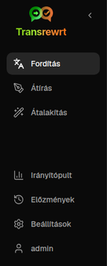
    </td>
    <td valign="top">
      <br/><br/>
      <ul>
        <li><strong>Fordítás</strong> megnyitja a fordítási munkaterületet.</li><br/>
        <li><strong>Átírás</strong> megnyitja az átírási munkaterületet.</li><br/>
        <li><strong>Átalakítás</strong> megnyitja az egyéni parancs munkaterületet.</li><br/>
        <li><strong>Műszerfal</strong> megjeleníti a használati és költséginformációkat.</li><br/>
        <li><strong>Beállítások</strong> megnyitja a beállítások panelt.</li><br/>
        <li><strong>Előzmények</strong> megjeleníti az előzményeket a bemeneti és kimeneti szöveggel.</li><br/>
        <li><strong>Felhasználó</strong> megjeleníti a bejelentkezett felhasználó nevét (csak webes verzióban).</li>
      </ul>
    </td>
  </tr>
</table>

<br/>

<a id="toolbar"></a>
### Eszköztár

Az eszköztár kicsit megváltozik attól függően, hogy hol tart az alkalmazásban.

- Bal oldalon megjelenik az aktuális oldal neve.
- Jobb oldalon megjelenik a **modellválasztó** és a **Felület nyelve** vezérlő.

A **modellválasztó** lehetővé teszi, hogy kiválassza, melyik AI-motort használja az aktuális feladathoz.

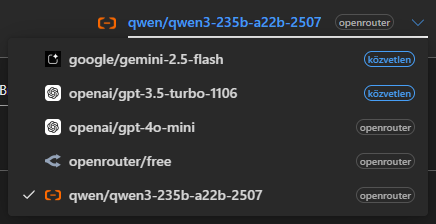

Egyes ingyenes modellek nem mindig érhetők el – néha kapcsolat nélkül vannak, vagy használati korláttal rendelkeznek. Ha ez történik, az alkalmazás automatikusan eltávolítja a modellt a rendelkezésre álló listáról. A megjelenő modellek szabályozásához lépjen a [**Beállítások** > **Modellek**](#models) menüponthoz, és szerkessze a modelllistáját. 
A modellbeállításokat közvetlenül is megnyithatja a modell neve melletti szolgáltató ikonra kattintva az eszköztáron.

<br/>

A **földgömb ikon + nyelvkód** megváltoztatja az alkalmazás felületének nyelvét, például a menükét és gombokét. Ez **nem** változtatja meg a **Fordítás** funkcióban használt nyelveket.

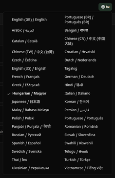

<br/>

<a id="input-and-output-panels"></a>
### Bemeneti és kimeneti panel

A legtöbb munkaterület bal oldali **Bemenet** panelt és jobb oldali **Kimenet** panelt használ.

Minden panel az alábbiakat is mutatja:

| **Bemenet**                                                          | **Kimenet**                                                                                                                  |
|--------------------------------------------------------------------|-----------------------------------------------------------------------------------------------------------------------------|
| - Karakterszám <br/>- Szavak száma <br/>- Bekezdések száma   <br/> | - Mennyi ideig tartott a feladat<br/>- **LPS** (tokenek másodpercenként)<br/>- Karakterek, szavak és bekezdések száma<br/>- A használt modell |

Ha a technikai kifejezésekről szeretne többet megtudni:

- A **token** egy kis szövegrészletet jelent. Gondolhat rá úgy, mint egy szó részére vagy egy rövid szóra.
- A **LPS** azt jelenti, hogy a modell másodpercenként hány ilyen szövegrészletet dolgozott fel.

<br/>

A műveletek költségét (ha elérhető) és a teljes költséget is nyomon követheti, ha engedélyezi a `Show cost information on the actions` opciót a [**Beállítások** > **Általános beállítások**](#general-settings) menüpontban.

<br/><br/>

[--------------------------------------------------------------------------------------------------------------------------]: #

<a id="translate"></a>
## Fordítás

Használja a **Fordítás** funkciót, ha szöveget szeretne egyik nyelvről a másikra konvertálni.

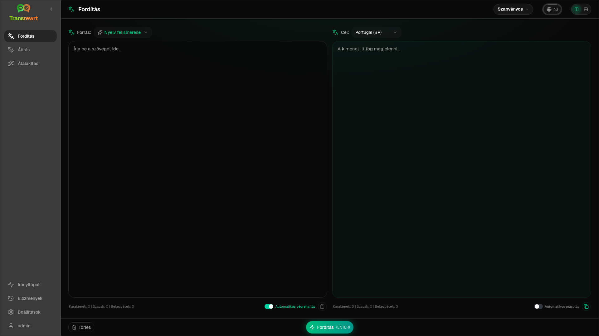

<br/>

<a id="translate-text"></a>
### Szöveg fordítása

1. Nyissa meg a **Fordítás** fület.
2. Válasszon nyelvet a **Honnan** mezőben.
3. Válasszon nyelvet a **Hova** mezőben.
4. Válasszon ki egy modellt az eszköztárból.
5. Írja be vagy illessze be a szöveget a **Bemenet** mezőbe.
6. Kattintson a **Fordítás** gombra.
7. Olvassa el az eredményt a **Kimenet** mezőben.
8. Használja a másolás gombot, ha másolni szeretné az eredményt.

<br/>

<a id="language-selection"></a>
### Nyelvválasztás

- A **Honnan** lehet konkrét nyelv vagy **Nyelvfelismerés**.
- A **Hova** az a nyelv, amelyre az eredményt szeretné.

A kiválasztott **Legfontosabb nyelvek** a lista tetején jelennek meg. Ezeket a [**Beállítások** > **Nyelvek**](#languages) menüpontban állíthatja be.

<br/>

<a id="helpful-translation-settings"></a>
### Hasznos fordítási beállítások

A [**Beállítások** > **Általános beállítások**](#general-settings) menüpontban megváltoztathatja a fordítás működését:

- **Automatikus fordítás beillesztéskor**: a fordítás azonnal elindul, amint beilleszti a szöveget.
- **Eredmény automatikus másolása a vágólapra**: az eredmény automatikusan a vágólapra kerül sikeres futtatás után.
- **Valós idejű fordítás (gépelés közben)**: a fordítás a gépelés során fut.
- **Időtúllépés (ms)**: meghatározza, hogy az alkalmazás mennyi ideig várjon a valós idejű fordítás elindítása előtt.
- **Enter**: meghatározza, mi történjen az `Enter` billentyű lenyomásakor:

<br/><br/>

[--------------------------------------------------------------------------------------------------------------------------]: #

<a id="rewrite"></a>
## Átírás

Használja az **Átírás** funkciót, ha a szöveg megfogalmazását szeretné javítani anélkül, hogy megváltoztatná a fő jelentést.

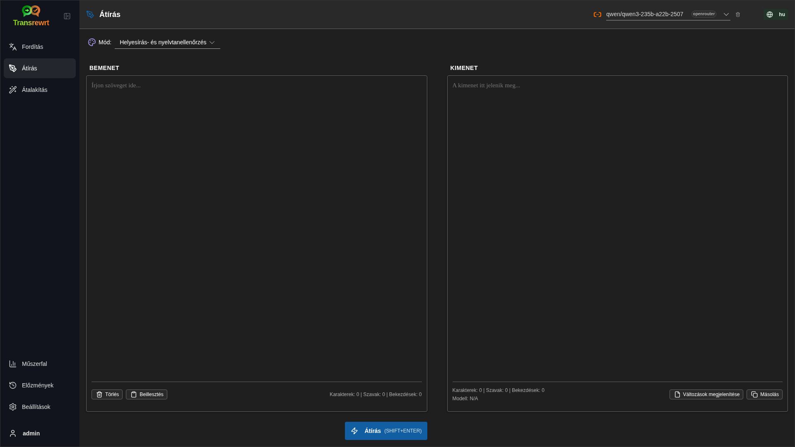

Ez hasznos lehet:

- helyesírás- és nyelvtanellenőrzés (**Helyesírás és nyelvtan ellenőrzése**)
- szöveg érthetőbbé tétele (**Érthetőség javítása**)
- több különböző átfogalmazás egyetlen futtatásban (**Alternatív változatok**)
- szöveg formálisabbá vagy informálisabbá tétele (**Formális** / **Informális**)
- szöveg rövidítése vagy kiterjesztése (**Rövidítés** / **Kiterjesztés**)
- szöveg technikusabbá tétele (**Technikai stílus**)

<br/>

> 💡 **TIPP**<br/>
> Amikor a „**Helyesírás- és nyelvtanellenőrzés**” módot használja, egy **Változások megjelenítése** kapcsoló jelenik meg a kimeneti panelen (a **Másolás** mellett).
> Kapcsolja be vagy ki, hogy megjelenjenek vagy elrejtődjenek a szövegre alkalmazott konkrét javítások.

<br/><br/>

[--------------------------------------------------------------------------------------------------------------------------]: #

<a id="transform"></a>
## Átalakítás

Használja az **Átalakítás** funkciót, ha azt szeretné, hogy a MI egyéni utasításokat kövessen.

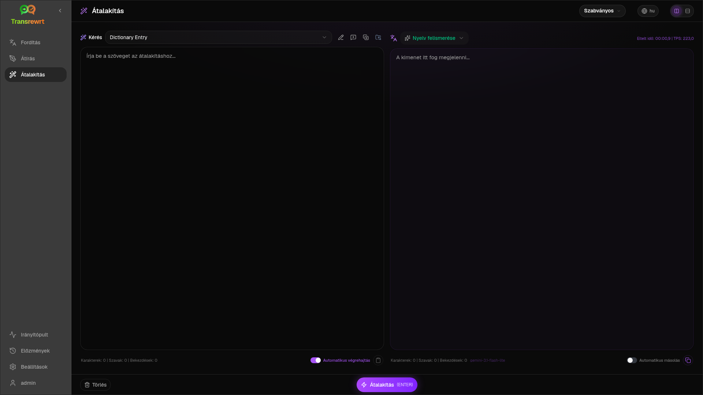

Ez az alkalmazás legrugalmosabb része. Használhatja például a következő feladatokhoz:

- jegyzetek összegzése
- durva szöveg átalakítása finomított e-mailré
- kulcsfontosságú pontok kinyerése
- szöveg átalakítása adott formátumba
- bármely egyéni tevékenység a bemeneti szöveggel

<br/>

<a id="run-an-existing-prompt"></a>
### Már meglévő parancs futtatása

1. Nyissa meg a **Átalakítás** funkciót.
2. Válasszon egy sablont a sablonlista közül.
3. Ha megjelenik egy **Cél** nyelv mező, válasszon nyelvet, ha szeretne.
4. Írja be vagy illessze be a szöveget a **Bemenet** mezőbe.
5. Kattintson az **Átalakítás** gombra.
6. Olvassa el az eredményt a **Kimenet** mezőben.

<br/>

<a id="if-you-have-no-prompts-yet"></a>
### Ha még nincsenek parancsai

Ha az utasításlistája üres, kattintson az **Mintaparancsok betöltése** lehetőségre az Átalakítás munkaterületen. Ugyanez az elem mindig elérhető a [**Beállítások** > **Átalakítási sablonok**](#transform-prompts) menüpontban az exportálás/importálás sorában. Mindkettő beépített példákat ad hozzá, így gyorsan elkezdheti.

<br/>

> ℹ️ **MEGJEGYZÉS**<br/>
> A mintaparancsok angol nyelven kerülnek megadásra. A betöltésük után szerkesztheti a parancsot, és használhatja a **Kérés lefordítása** funkciót, hogy lefordítsa saját nyelvére.

<br/>

<a id="create-a-prompt-quickly"></a>
### Parancs gyors létrehozása

A parancs létrehozásának leggyorsabb módja:

1. Kattintson az **Új sablon** gombra.
2. Kattintson a **Sablon generálása** gombra.
3. Írja le, mit szeretne, hogy a sablon csináljon.
4. Válasszon modellt.
5. Hagyja, hogy az alkalmazás vázlatot készítsen.
6. Ellenőrizze a vázlatot, majd kattintson a **Mentés** gombra.

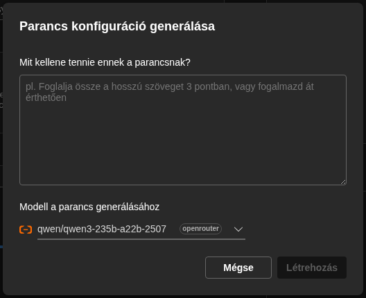

<br/>

<a id="edit-a-prompt"></a>
### Parancs szerkesztése

Amikor létrehoz vagy szerkeszt egy parancsot, a szerkesztő a bal oldalon jelenik meg, a jobb oldalon pedig egy tesztelési terület látható.

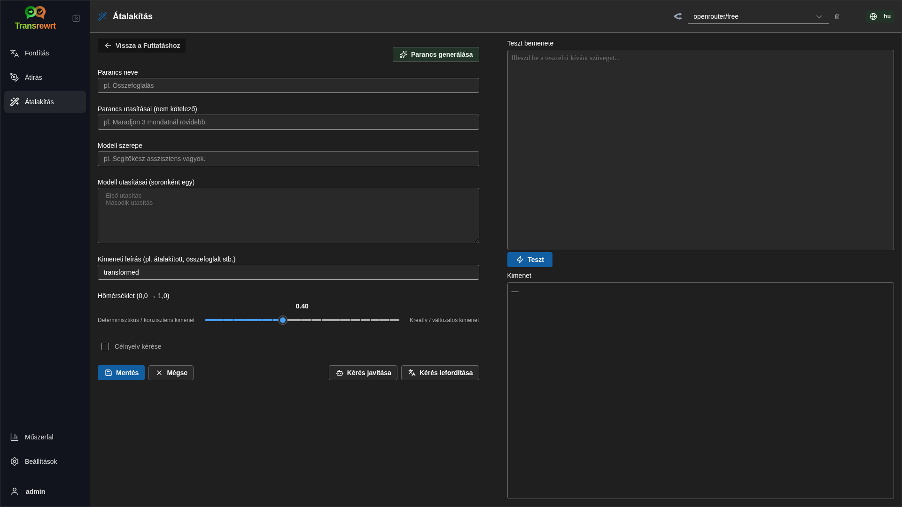

A fő mezők a következők:

- **Sablon neve**: a név, amely megjelenik a sablonlistában.
- **Sablon utasításai (opcionális)**: rövid útmutató, amely megjelenik a felhasználónak a sablon futtatásakor.
- **Modell szerepe**: az MI általános szerepköre, például: „Segítőkész asszisztens vagyok.”
- **Modell utasításai (soronként egy)**: azok a konkrét szabályok, amelyeket az MI-nek követnie kell.
- **Kimenet leírása**: egy rövid szó, amely az eredményt írja le, például „összegzés” vagy „átírás”.
- **Hőmérséklet (0,0 → 1,0)**: a modell viselkedését befolyásolja; lásd alább.
- **Célnyelv kérése**: célnyelv-választót ad hozzá, amikor a sablont futtatják.

Ha az **Hőmérséklet** technikai kifejezés új az Ön számára, képzelje el a következőképpen:

- Az **alacsonyabb** hőmérséklet stabilabb, kiszámíthatóbb eredményeket ad.
- A **magasabb** hőmérséklet nagyobb változatosságot és kreativitást eredményez.

Használhatja továbbá a következőket is:

- **`Generate prompt`** új változat létrehozásához egyszerű leírásból
- **`Improve prompt`** meglévő parancs finomításához
- **`Translate prompt`** a parancsmezők lefordításához

<br/>

> ⚠️ **FIGYELMEZTETÉS**<br/>
> Kattintson **`Save`**-ra, mielőtt **`Back to Run`**-re kattintana. Ha visszalép mentés nélkül, a módosításai elvesznek.

<br/>

<a id="test-a-prompt-before-using-it"></a>
### Tesztelje a parancsot használat előtt

A jobb oldali tesztpanel segítségével kipróbálhatja a parancsot mintaszöveggel, mielőtt mindennapi munkája során használná.

Ez akkor hasznos, amikor:

- új parancsot készít
- két parancsverziót hasonlít össze
- ellenőrizni szeretné a stílust, a hosszúságot vagy a kimeneti formátumot

<br/>

> ℹ️ **MEGJEGYZÉS**<br/>
> A mentett parancsokat exportálhatja és importálhatja a [**Beállítások** > **Átalakítási sablonok**](#transform-prompts) menüpontban.

<br/><br/>

[--------------------------------------------------------------------------------------------------------------------------]: #

<a id="dashboard"></a>
## Műszerfal

A **Műszerfal** használatával nyomon követheti, mennyit használja az alkalmazást, és mennyibe kerül (fizetős modellek esetén).

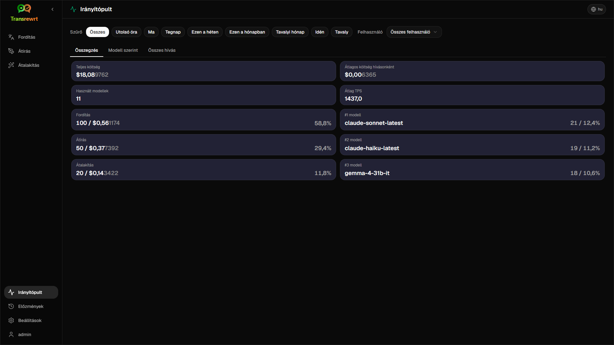

<br/>

> ℹ️ **MEGJEGYZÉS**<br/>
> Ha csak **ingyenes** modelleket használ, a **költség** értéke nulla lehet, és a költségekre fókuszáló összegzések üresen jelenhetnek meg. A **Összegzés**, **Használat időbeli alakulása** és **Használat modell szerint** továbbra is megjeleníti a **hívások számát** (fordítás, átírás és átalakítás), ha tevékenység volt a kiválasztott időszakban.

<br/>

<a id="filter-the-data"></a>
### Adatok szűrése

A szűrési gombokkal a felső részen módosíthatja az időtartományt.

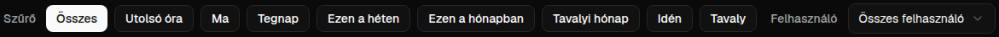

<br/>

> ℹ️ **MEGJEGYZÉS**<br/>
> A **Felhasználó** szűrő csak az adminisztrátorok számára látható a webes verzióban. A rendes felhasználók nem látják ezt a szűrőt, és az asztali alkalmazásban sem érhető el.

<br/>

<a id="dashboard-tabs"></a>
### Műszerfal fülek

- **Összegzés**: áttekintést nyújt a használatról és a költségekről. Tartalmazza a **Használat időbeli alakulását** (napi összesített, halmozott **hívásszámokat** fordítás, átírás és átalakítás szerint) és a **Használat modellenként** (összes **hívás modellenként**, beleértve az átalakítást is).
- **Használat szerint**: a tevékenységet nyelv szerinti fordításra, átírás módjára és átalakítási sablonra bontja.
- **Modell szerint**: megmutatja, mely modelleket használta és mennyibe kerültek.
- **Nap szerint**: napi összesített adatokat mutat.
- **Összes hívás**: megjeleníti az összes hívás teljes előzményét, és lehetővé teszi exportálását.

<br/>

<a id="export-data"></a>
### Adatok exportálása

A műszerfal táblái a következő formátumokban exportálhatók:

- **JSON**
- **CSV**
- **XLSX**

Ez akkor hasznos, ha az alkalmazáson kívül szeretné áttekinteni a tevékenységet, vagy meg szeretne osztani egy jelentést.

<br/>

<a id="delete-stored-records-for-a-model"></a>
### Tárolt rekordok törlése modell szerint

A **Modell szerint** vagy az **Összes hívás** nézetben eltávolíthatja egy modellhez tartozó tárolt rekordokat a „kuka” ikonra kattintva.

> ⚠️ **FIGYELMEZTETÉS**<br/>
> A tárolt rekordok törlése végleges, és nem vonható vissza. Csak akkor használja, ha biztosan nincs szüksége többé az előzményekre.

Az összes adat törléséhez vagy az adatok koruk alapján történő eltávolításához látogasson el a [**Beállítások** > **Költségkövetés**](#cost-tracking) menüpontra. Ott lehetősége van az összes tárolt adat törlésére, vagy csak az adott dátumnál régebbi adatok törlésére.

<br/><br/>

[--------------------------------------------------------------------------------------------------------------------------]: #

<a id="history"></a>
## Előzmények

Kattintson az **Előzmények** elemre a **Transrewrt** belső műveleteinek előzményeinek megtekintéséhez, beleértve minden művelet bemenetét és kimenetét.

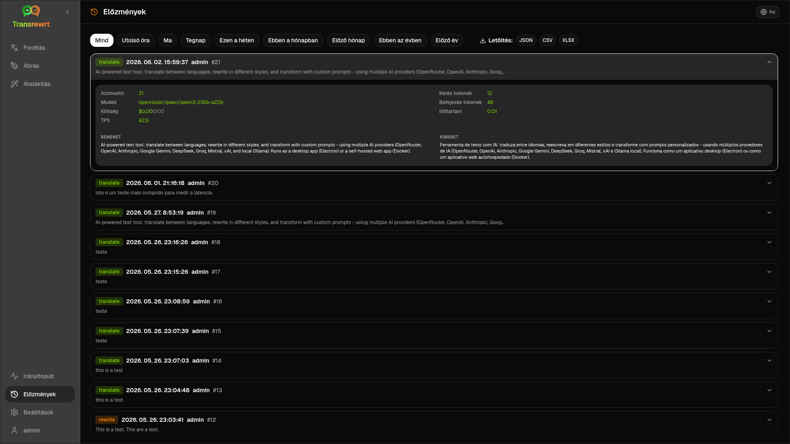

<br/>

<a id="filter-the-history"></a>
### Adatok szűrése

Az **Előzmények** ugyanazokat a szűrőket használja, mint a **Műszerfal** oldal. Használja őket a kívánt időtartomány kiválasztásához.


<br/>

> ℹ️ **MEGJEGYZÉS**<br/>
> A **Felhasználó** szűrő csak az adminisztrátorok számára látható a webes verzióban. A rendes felhasználók nem látják ezt a szűrőt, és az asztali alkalmazásban sem érhető el.

<br/>

<a id="export-history-data"></a>
### Előzményadatok exportálása

Az előzmények oldal a szűrt adatokat a következő formátumokban tudja exportálni:

- **JSON**
- **CSV**
- **XLSX**

Ez akkor hasznos, ha az alkalmazáson kívül szeretné áttekinteni a tevékenységet, vagy meg szeretne osztani egy jelentést.

<br/><br/>

[--------------------------------------------------------------------------------------------------------------------------]: #

<a id="settings"></a>
## Beállítások

Nyissa meg a **Beállításokat** az oldalsávon, hogy testreszabja az alkalmazás működését.

A rendelkezésre álló fülek a platformtól és a szerepkörétől függenek:

| Fül               | Asztali | Web (admin) | Web (rendes felhasználó) |
  |-------------------|:-------:|:-----------:|:------------------------:|
  | Általános beállítások  |   igen   |     igen     |        igen         |
  | Modellek            |   igen   |     igen     |        igen         |
  | Nyelvek         |   igen   |     igen     |        igen         |
  | Költségkövetés     |   igen   |     igen     |         -          |
  | Átalakítási sablonok |   igen   |     igen     |        igen         |
  | Felhasználók             |    -    |     igen     |         -          |
  | API konfiguráció  |   igen   |     igen     |         -          |
  | Információk      |   igen   |     igen     |        igen        |

<br/>

> ℹ️ **MEGJEGYZÉS**<br/>
> A webes verzióban minden felhasználó saját konfigurációval rendelkezik. A kiválasztott modellek, nyelvek, általános beállítások és átalakítási sablonok beállításai felhasználónként kerülnek tárolásra. A módosításai nem befolyásolják más felhasználók beállításait.

<br/>

[--------------------------------------------------------------------------------------------------------------------------]: #

<a id="general-settings"></a>
### Általános beállítások

Az **Általános beállítások** használatával szabályozhatja a gépelés viselkedését, hogy tárolják-e a végrehajtási részleteket az **Előzmények** számára, valamint a megjelenést.

**Viselkedés**

- **A ENTER viselkedése** kiválasztja, hogy `Enter` futtatja a feladatot, vagy új sort illeszt be.
- **Automatikus fordítás beillesztéskor** azonnal elkezdi a fordítást, amint beilleszted a szöveget.
- **Eredmény automatikus másolása a vágólapra** automatikusan másolja a sikeres eredményeket.
- **Valós idejű fordítás (gépelés közben)** fordít, miközben írsz.
- **Időkorlát (ms)** beállítja a várakozási időt a valós idejű fordításhoz.

**Előzmények**

- A **Végrehajtási előzmények megőrzése** határozza meg, hogy a fordítás, átírás és átalakítás minden egyes esetén tárolódjon-e a **bemeneti és kimeneti szöveg** az oldalsáv [**Előzmények**](#history) nézete számára. Ha kikapcsolja, megerősítést kér; ha megerősíti, a tárolt előzmények szövege eltávolításra kerül az adatbázisból.
- Az **Előzményadatok törlése** lehetővé teszi a tárolt szöveg eltávolítását kor alapján (például néhány hónapnál régebbi, vagy **az összes adat (törlés)**) az **Adatok törlése** funkcióval. Ez csak a végrehajtási szövegek mentését érinti az **Előzmények** nézethez; **nem** törli a költség- vagy használati összesítőket. A **költség** adatok eltávolításához vagy csökkentéséhez használja a [**Beállítások** > **Költségkövetés**](#cost-tracking) lehetőséget.

**Megjelenés**

- **Költséginformációk megjelenítése az akcióknál** vezérli a költség megjelenítését műveletenként (ha elérhető) és a teljes költséget a Fordítás, Átírás és Átalakítás kimeneti panelekben.
- **Költség tizedesjegyek** megváltoztatja, hogyan jelennek meg a költség tizedesek.
- **Csak web:** **margó megjelenítése az alkalmazás körül** extra helyet ad a felület köré.
- **Betűtípus család** megváltoztatja a szövegpanelek írási betűtípusát.
- **Méret** megváltoztatja a betűméretet.

**Konfiguráció biztonsági mentése**

- **Használati adatok beillesztése a biztonsági mentésbe** - ha engedélyezve van, a ZIP tartalmazza a végrehajtási előzményeket és az API hívási adatokat. 
- **Biztonsági mentés konfiguráció** - létrehoz egyetlen ZIP-et (`transrewrt-config-backup-YYYY-MM-DD_HHMMSS.zip` UTC szerint alapértelmezés szerint) `config.json`, `state.json`, opcionális titkosítási kulcs, felhasználók, preferenciák, egyedi kérések és használati adatok, ha beleegyezett. Sikeres biztonsági mentés után a megerősítés megjeleníti a mentett fájl nevét.
- **Visszaállítás biztonsági mentésből** - először megnyit egy **megerősítő párbeszédpanelt**. Válaszd ki a biztonsági mentés ZIP-jét a párbeszédpanelen (**Böngészés** / fájl kiválasztó vagy húzd és ejtsd, ahol támogatott), majd nézd át az opciókat:
  - **Használati adatok visszaállítása** - importálja a használati/történeti adatokat a ZIP-ből, amikor az használati adatokkal lett biztonsági mentve; hagyd ki, ha csak a beállításokat és kéréseket szeretnéd.
  - **Töröld a régi használati adatokat a visszaállítás előtt** - távolítsd el a meglévő használati/történeti adatokat ezen az installáción, mielőtt alkalmaznád a biztonsági mentést (opcionális; használd, amikor tiszta cserét szeretnél).

A webes vagy asztali verzióban készült biztonsági másolatokat a másik verzióban is vissza lehet állítani. Ha asztali biztonsági másolatot állít vissza a webes verzióban, az adatok az adminisztrátor felhasználóhoz lesznek visszaállítva.

<br/>

<a id="models"></a>
### Modellek

Használja a **Beállítások** > **Modellek** lehetőséget a műszerfalon megjelenő modellek kiválasztásához.

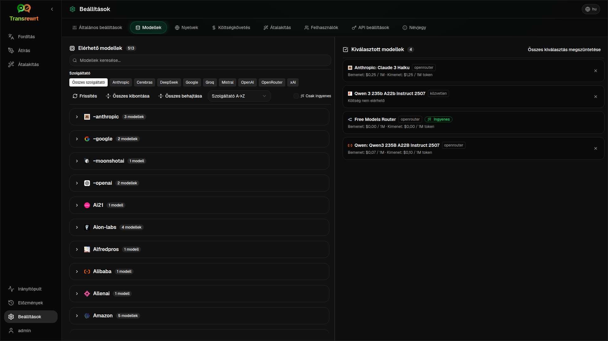

Az oldal két listát tartalmaz:

- **Elérhető modellek** a bal oldalon
- **Kiválasztott modellek** a jobb oldalon

Hasznos vezérlők:

- **Modellek keresése...** a modell nevének kereséséhez
- **Szolgáltató** chipek a lista szűkítéséhez egy motorra (OpenRouter, OpenAI, Ollama, …)
- **Csak ingyenes** csak az ingyenes modellek megjelenítéséhez
- **Frissítés** a lista újratöltéséhez
- **Összes kibővítése** és **Összes összehúzása**, amikor szolgáltató szerint rendezel

A modellazonosítók tartalmazzák a szolgáltató előtagját (például `openrouter/…` vs `openai/…`). A jelzések, mint például **OpenAI (OpenRouter)** vs **OpenAI (közvetlen)**, azt mutatják, hogyan irányul a forgalom.

> ℹ️ **MEGJEGYZÉS**<br/>
> Az **OpenRouter Body Builder** (`openrouter/bodybuilder`) egy útválasztó modell, nem általános csevegőmodell: a válasza JSON, amely az OpenRouter API kérési törzseit írja le (például egy `requests` tömb `model` és `messages` paraméterekkel). Ha **Fordítás**, **Átírás** vagy **Átalakítás** céljára használja, a kimeneti panel ezt a JSON-t fogja megjeleníteni a kész szöveg helyett. Válasszon normál szöveges modellt ezekhez a feladatokhoz. Lásd az [Body Builder modell oldalát](https://openrouter.ai/openrouter/bodybuilder) az OpenRouter-en.

Műveletek:

- Modell hozzáadásához kattintson a **Hozzáadás** gombra, vagy bárhová a bejegyzésben.

- Modell eltávolításához kattintson az **X**-re a **Kiválasztott modellek** mellett, vagy a **Kiválasztva** elemre a modell mellett az Elérhető modellek listában.

- A lista törléséhez kattintson a **Kiválasztás törlése** gombra. A szükséges ingyenes modell a listában marad.

<br/>

> ℹ️ **MEGJEGYZÉS**<br/>
> Ha nem szeretne azonnal hitelt felvenni az OpenRouter számlájára, kezdje a **Csak ingyenes** funkció engedélyezésével, és válassza az ingyenes modelleket (bankkártya nélkül). Az Ollama használatával helyileg is futtathat modelleket API kulcs nélkül.

<br/>

<a id="languages"></a>
### Nyelvek

Használja a **Beállítások** > **Nyelvek** menüpontot a nyelvi listák szervezéséhez az alkalmazásban.

- A **Legfontosabb nyelvek** a **Fordítás** és **Átalakítás** nyelvi listáinak tetején rögzítve jelennek meg.
- Az **Egyéni nyelv** lehetővé teszi, hogy hozzáadjon egy nyelvet, amely nincs a beépített listában.

Ha egyéni nyelvet ad hozzá, az megjelenik a nyelvválasztókban a beépített lehetőségek mellett.

<br/>

<a id="cost-tracking"></a>
### Költségkövetés

Használja a **Beállítások** > **Költségkövetés** menüpontot a költséginformációk kezeléséhez.

- **Teljes költség** megjeleníti a futó összeget.
- **Érték másolása** a teljes összeget a vágólapra másolja.
- **Költség visszaállítása** a tárolt összeget nullára állítja vissza.
- **Szinkronizálás az API kulcs használatával** beállítja a teljes összeget, hogy megfeleljen a OpenRouter fiókod által jelentett használatnak (csak OpenRouter).
- **API kulcs használat** megjeleníti az OpenRouter használati részleteit, ha elérhető.
- **Költségadatok törlése** eltávolítja az összes adatot, vagy csak a kiválasztott dátumnál régebbi bejegyzéseket.

**Költségkövetés:** Ha OpenRouter modelleket használ, az alkalmazás a tényleges használatot és kiadásokat mutatja az OpenRouter által szolgáltatott költséginformációk alapján. Minden más szolgáltató esetében az alkalmazás az OpenRouter által közzétett árak alapján becsüli a költségeket; ha ár nem érhető el, a becslés nulla lehet.

<br/>

> ℹ️ **MEGJEGYZÉS**<br/>
>  **Minden költségadat csak tájékoztató jellegű becslés, nem hivatalos számlázási kimutatás.**

<br/>

> ⚠️ **FIGYELMEZTETÉS**<br/>
> Az adatok törlése visszafordíthatatlan. A törlés előtt készítsen biztonsági másolatot az adatairól, vagy exportálja őket a [**Előzmények**](#history) vagy a [**Műszerfal** > **Összes hívás**](#dashboard-tabs) menüpontban, különben az adatok véglegesen elvesznek. 
> Az egyes API-hívásokhoz kapcsolódó összes bemeneti és kimeneti előzmény is törlődni fog.

<br/>

<a id="transform-prompts"></a>
### Átalakítási sablonok

Használja a **Beállítások** > **Átalakítási sablonok** lehetőséget a parancsok tömeges kezeléséhez.

Lehetőségei:

- nézd át a mentett kéréseidet
- töröld a kéréseket
- importálj kéréseket egy fájlból
- exportáld a kéréseket biztonsági mentéshez vagy megosztáshoz
- töltsd be a minta kéréseket a kéréslistába

<br/>

<a id="users"></a>
### Felhasználók

A **Felhasználók** menüponttal kezelheti a felhasználói fiókokat a webes verzióban. Hozzáadhat felhasználókat, frissítheti adataikat, visszaállíthatja jelszavukat, és törölheti a fiókokat.

<br/>

<a id="api-config"></a>
### API konfiguráció

A támogatott szolgáltatók: OpenRouter, OpenAI, Anthropic, Google Gemini, DeepSeek, Groq, Mistral, xAI, Cerebras és **Ollama** (helyi modellek alap URL-en keresztül). Csak azokat a szolgáltatókat kell konfigurálnia, amelyeket használ.

**Webalkalmazás: csak rendszergazda**

Az API-kulcsokat a rendszer- vagy Docker-környezeti változókban kell beállítani – a webes felületen nem adhatók meg. Ez az oldal azt mutatja, hogy mely szolgáltatókhoz van kulcs konfigurálva, és lehetővé teszi mindegyik tesztelését a **`Test`** gombra kattintva.

<br/>

> ℹ️ **MEGJEGYZÉS**<br/>
> Egy API-kulcs módosításához frissítenie kell a környezeti változót a rendszerében vagy a Docker-konfigurációban, majd újra kell indítania a szervert vagy a konténert.

> ℹ️ **MEGJEGYZÉS**<br/>
> A **konfiguráció biztonsági mentései** (lásd: [**Általános beállítások** → Konfiguráció biztonsági mentése](#general-settings)) beágyazhatják a **feloldott** szolgáltatói kulcsokat a ZIP `config.json` fájljába. A ZIP visszaállítása **nem** másolja vissza ezeket a kulcsokat a szerver meglévő konfigurációs fájljába – az élő kulcsok továbbra is a környezetből és a meglévő fájlállapotból származnak, ahogyan ott le van írva.

<br/>

**Asztali alkalmazás**

Használja az **API konfigurációt** az egyes használt szolgáltatók API-kulcsainak tárolásához. Az Ollama esetében az API-kulcs helyett adja meg az **alap URL-t**.

<br/>

> 💡 **Tipp** <br/>
> Ha nem szeretne API-kulcsot használni, vagy nem szeretne fizetni a használatért, [letöltheti az Ollamát](https://ollama.com), és ingyen futtathat modelleket (például `translategemma:4b`) a saját gépén. Alternatív megoldásként ingyenes OpenRouter-fiókot hozhat létre (bankkártya nélkül), ahol ingyenes modelleket használhat, vagy ingyenes API-kulcsot szerezhet a Cerebras, Google, Groq vagy Mistral AI szolgáltatóktól.

<br/>

- Csak azokat a szolgáltatókat adja hozzá, amelyekre szüksége van. A **Beállítások** > **Modellek** menüpontban minden modellazonosító a szolgáltató nevével kezdődik (például `openrouter/openrouter/free`, `openai/gpt-4o`, `ollama/llama3`).

API-kulcs hozzáadásához írja be az értéket a szövegmezőbe, majd kattintson a **`Save`** gombra. Meglévő kulcs cseréjéhez kattintson a **`Edit`** gombra. Egy kulcs működésének ellenőrzéséhez kattintson a **`Test`** gombra. Az Ollama alap URL-je esetében mindig kattintson a **`Test`** gombra a kapcsolat ellenőrzéséhez.

<br/>

> ℹ️ **MEGJEGYZÉS**<br/>
> Jelenleg nem tekintheti meg egy API-kulcs aktuális értékét. Csak a **`Edit`** gomb használatával cserélheti le.
> Az API-kulcsok titkosítva kerülnek tárolásra a konfigurációban.

<br/>

<a id="about"></a>
### Névjegy

A **Névjegy** fül az alábbiakat jeleníti meg:

- az alkalmazás nevét
- a verziószámot
- a kiadás dátumát
- egy hivatkozást a projekt adattárához

<br/><br/>

<a id="common-issues"></a>
## Gyakori problémák

Ha valami nem úgy működik, ahogy várná, először ellenőrizze az alábbi pontokat.

<br/>

<a id="the-app-will-not-translate-rewrite-or-transform-text"></a>
### Az alkalmazás nem fordítja, nem írja át vagy nem alakítja át a szöveget

Ellenőrizze, hogy:

- kiválasztott egy modellt az eszköztáron
- legalább egy modell szerepel a [**Beállítások** > **Modellek**](#models) menüpontban
- az API-beállításai működnek

Ha az asztali alkalmazást használja:

1. Nyissa meg a [**Beállítások** > **API konfiguráció**](#api-config) menüt.
2. Ellenőrizze, hogy legalább egy API-kulcs el van-e mentve.
3. Kattintson a szolgáltatónál található **Teszt** gombra a kulcs működésének megerősítéséhez.

<br/>

<a id="the-model-list-is-empty"></a>
### A modelllista üres

Nyissa meg a [**Beállítások** > **Modellek**](#models) menüt, és kattintson a **Frissítés** gombra.

Ha szükséges:

- keressen egy modellt
- kapcsolja be a **Csak ingyenes** lehetőséget
- adjon hozzá egy vagy több modellt a **Kiválasztott modellek** közé

<br/>

<a id="the-result-is-too-slow-or-too-expensive"></a>
### Az eredmény túl lassú vagy túl drága

Próbálja ki az alábbiak egyikét vagy többjét:

- válasszon másik modellt
- használjon rövidebb bemenetet
- kapcsolja ki a **Valós idejű fordítás (gépelés közben)** funkciót a [**Beállítások** > **Általános beállítások**](#general-settings) menüpontban
- egyszerű feladatokhoz használjon ingyenes modelleket (lásd: [Modellek](#models))

<br/>

<a id="the-interface-is-in-the-wrong-language"></a>
### A felület rossz nyelven jelenik meg

Kattintson a földgömb ikonra az [eszköztáron](#toolbar), és válassza ki a kívánt **Felület nyelve** beállítást.

<br/>

<a id="the-text-is-too-small-or-hard-to-read"></a>
### A szöveg túl kicsi vagy nehezen olvasható

Nyissa meg a [**Beállítások** > **Általános beállítások**](#general-settings) lehetőséget, és módosítsa a következőket:

- **Betűtípus**
- **Méret**

<br/>

<a id="dashboard-charts-are-empty"></a>
### A műszerfal diagramjai üresek

Ez normális, ha:

- csak **ingyenes modelleket** használ, és a **költségek** adatait nézi (lehet, hogy nulla); a **hívásszámok** diagramjai a **Összegzés** fülön még mindig az adott időszak adatait várják
- a kiválasztott **időszűrő** nem fedi le a hívások időszakát – próbálja ki az **Összes** lehetőséget ellenőrzéshez

Ha a diagramok még mindig üresek az **Összes** kiválasztása után, ellenőrizze, hogy megjelennek-e a hívások az [**Előzmények**](#history) vagy az **Összes hívás** fülön.

<br/>

<a id="cost-shows-not-available-or-seems-wrong"></a>
### A költség „nem elérhető” vagy helytelennek tűnik

Ha **OpenRouter** közvetítésével használ modelleket, az alkalmazás az OpenRouter által jelentett tényleges költséget jeleníti meg.

**Más szolgáltatók** (közvetlen OpenAI, közvetlen Anthropic stb.) esetén a költséget az OpenRouter által közzétett árazási adatok alapján becsüljük. Ha a modellhez nem található megfelelő ár, a költség **nem elérhetőként** jelenik meg, és nem kerül hozzáadásra a futó összeghez.

<br/>

<a id="total-cost-does-not-match-my-provider-bill"></a>
### A teljes költség nem egyezik meg a szolgáltató számlájával

Az alkalmazásban szereplő összes költségadat **csak tájékoztató jellegű becslés**, nem hivatalos számla.

Ahhoz, hogy a teljes összeg közelebb kerüljön a tényleges OpenRouter-költséghez, nyissa meg a [**Beállítások** > **Költségkövetés**](#cost-tracking) menüpontot, és kattintson a **Szinkronizálás az API kulcs használatával** gombra.

<br/>

<a id="the-history-page-is-missing-from-the-sidebar"></a>
### Az Előzmények oldal hiányzik az oldalsávon

Lehetséges, hogy a **végrehajtási előzmények megőrzése** ki van kapcsolva. Nyissa meg a [**Beállítások** > **Általános beállítások**](#general-settings) lehetőséget, és kapcsolja be. Figyelem: a bekapcsolás nem állítja vissza a korábban törölt előzményadatokat.

<br/>

<a id="web-app-session-expired"></a>
### Webalkalmazás: váratlanul a bejelentkező oldalra irányít át

Lehet, hogy lejárt a munkamenete. Jelentkezzen be újra. Ha gyakran történik, ellenőrizze a szerver konfigurációját a munkamenet-élettartam beállítások tekintetében.

<br/>

<a id="web-admin-forgot-or-lost-a-password"></a>
### Webes admin: elfelejtette vagy elvesztette a jelszavát

Ez a **saját gépen üzemeltetett webalkalmazásra** (Docker) vonatkozik, nem az asztali (Electron) alkalmazásra.

- Ha egy másik adminisztrátor még be tud jelentkezni, az megnyithatja a [**Beállítások** > **Felhasználók**](#users) menüpontot, kiválaszthatja a fiókot, és ott beállíthat egy **új jelszót**.
- Ha **kizárva van**, de van **shell-hozzáférése** a géphez vagy a konténerhez, akkor állítsa vissza a jelszót a képhez tartozó segédprogrammal (cserélje le a `transrewrt`-t, ha módosította az alapértelmezett nevet, és idézőjelek közé tegye a jelszót, ha szóközt vagy speciális karaktert tartalmaz):

```bash
docker exec transrewrt reset-web-password '<username>' '<new-password>'
```

Az alapértelmezett admin felhasználónév `admin`, ha még nem hozott létre más fiókokat. Ha csak egy argumentumot ad meg, azt a `admin` felhasználó új jelszavaként kezeli.

Ha **forráskódból** futtatja a programot Docker helyett, akkor használja a következőt:

```bash
pnpm run reset-web-password -- <username> <new-password>
```

A szkript frissíti a felhasználói rekordot az SQLite adatbázisban (és létrehozhatja a `admin` felhasználót, ha az hiányzik). A visszaállítás után jelentkezzen be az új jelszóval.

<br/>

<a id="dashboard-shows-no-data-for-other-users"></a>
### A műszerfal nem jelenít meg adatot más felhasználók számára (web)

Csak a **rendszergazdák** tekinthetik meg az összes felhasználó adatait a **Felhasználó** szűrőn keresztül. A rendes felhasználók csak a saját tevékenységüket látják, ez a tervezett működés.

<br/>

<a id="i-changed-a-prompt-and-lost-the-edits"></a>
### Módosítottam egy parancsot, de elvesztek a változtatások

Amikor egy parancsot szerkeszt, mindig kattintson a **Mentés** gombra, mielőtt a **Vissza a Futtatáshoz** gombra kattintana.

<br/><br/>

<a id="quick-tips"></a>
## Gyors tippek

- Kezdj a [**Fordítás**](#translate) lehetőséggel, hogy megbizonyosodj arról, hogy a beállításod működik, mielőtt továbblépnél a [**Átírás**](#rewrite) vagy [**Átalakítás**](#transform) lehetőségekre.
- Használj [**Átírás**](#rewrite) a mindennapi megfogalmazás javításához.
- Használj [**Átalakítás**](#transform) amikor egy ismételhető munkafolyamatra van szükséged egy adott feladathoz.
- Használj [**Irányítópult**](#dashboard) ha figyelemmel szeretnéd kísérni a használatot és a költséget.
- Használj [**Történet**](#history) a korábbi műveletek és azok teljes bemeneti/kimeneti szövegének áttekintéséhez.
- Exportáld a kéréseket rendszeresen, ha egy biztonságos kéréstárat szeretnél építeni (lásd [Kérések átalakítása](#transform-prompts)) vagy ha meg szeretnéd osztani másokkal.

<br/><br/>

<a id="disclaimer"></a>
## Felelősségkizárás

A terméknevek és ikonok a jogosultak tulajdonát képezik, kizárólag azonosítási célokra használjuk őket. Ez a szoftver nem kapcsolódik a megemlített márkákhoz, és azok nem is támogatják azt.

<br/><br/>

<a id="license"></a>
## Licenc

Szerzői jog © 2026 Waldemar Scudeller Jr.

[Apache License 2.0](../LICENSE)
