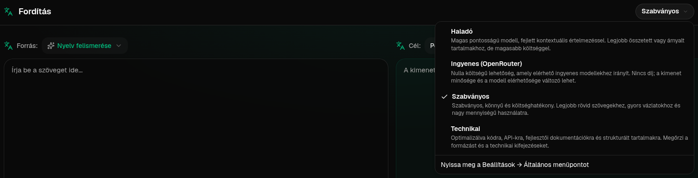
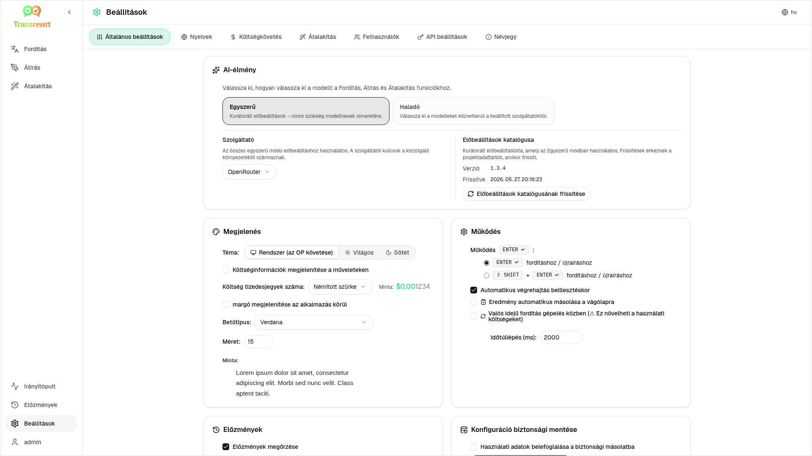

<a id="transrewrt-user-guide"></a>
# Felhasználói útmutató

<br/>

<a id="introduction"></a>
## Bevezetés

A Transrewrt három fő módon segít a szöveggel való munkában:

- **Fordítás** – szöveg átalakítása egyik nyelvről a másikra.
- **Átírás** – szöveg újrafogalmazása más stílusban, például érthetőbben, rövidebben vagy formálisabban.
- **Átalakítás** – szöveg feldolgozása egyéni MI-utasításokkal, amelyeket utasításoknak (promptoknak) nevezünk.

Alapértelmezés szerint az alkalmazás **Egyszerű** módban fut: kiválaszt egy **előbeállítást** (például Ingyenes (OpenRouter), Alapértelmezett, Haladó vagy Műszaki) és egy **szolgáltatót** a Beállításokban, anélkül, hogy modellazonosítókat választana. Váltson **Haladó** módra a [**Beállítások** > **Általános beállítások**](#general-settings) menüpontban, ha a klasszikus modelllistát szeretné használni a [**Beállítások** > **Modellek**](#models) menüpontban.

<br/>

Ez az útmutató azt ismerteti, hogyan használható az alkalmazás telepítés és indítás után. A telepítési lépésekért lásd a fő [**README**](README.hu.md) fájlt.

<br/>

> ℹ️ **MEGJEGYZÉS**<br/>
> A Transrewrt elérhető asztali alkalmazásként Windows és Linux rendszerekre, valamint önkiszolgáló webalkalmazásként. Ez az útmutató az alkalmazás mindennapi használatára koncentrál. Ha valami csak egy verzióra vonatkozik, azt egyértelműen megjelöljük.

<small>**Olvassa más nyelveken:** </small>
<small id="lang-list">[English (GB)](../USER-GUIDE.md) · [Português (Brasil)](./USER-GUIDE.pt-BR.md) · [العربية](./USER-GUIDE.ar.md) · [বাংলা](./USER-GUIDE.bn.md) · [Català](./USER-GUIDE.ca.md) · [中文 (中国大陆)](./USER-GUIDE.zh-CN.md) · [中文 (台灣)](./USER-GUIDE.zh-TW.md) · [Hrvatski](./USER-GUIDE.hr.md) · [Čeština](./USER-GUIDE.cs.md) · [Nederlands](./USER-GUIDE.nl.md) · [English (US)](./USER-GUIDE.en-US.md) · [Tagalog](./USER-GUIDE.tl.md) · [Français](./USER-GUIDE.fr.md) · [Deutsch](./USER-GUIDE.de.md) · [Ελληνικά](./USER-GUIDE.el.md) · [हिन्दी](./USER-GUIDE.hi.md) · [Magyar](./USER-GUIDE.hu.md) · [Italiano](./USER-GUIDE.it.md) · [日本語](./USER-GUIDE.ja.md) · [한국어](./USER-GUIDE.ko.md) · [Bahasa Melayu](./USER-GUIDE.ms.md) · [فارسی](./USER-GUIDE.fa.md) · [Polski](./USER-GUIDE.pl.md) · [Basa Jawa](./USER-GUIDE.jv.md) · [Português](./USER-GUIDE.pt.md) · [ਪੰਜਾਬੀ](./USER-GUIDE.pa.md) · [Română](./USER-GUIDE.ro.md) · [Русский](./USER-GUIDE.ru.md) · [Slovenčina](./USER-GUIDE.sk.md) · [Español](./USER-GUIDE.es.md) · [Kiswahili](./USER-GUIDE.sw.md) · [Svenska](./USER-GUIDE.sv.md) · [తెలుగు](./USER-GUIDE.te.md) · [ไทย](./USER-GUIDE.th.md) · [Türkçe](./USER-GUIDE.tr.md) · [Українська](./USER-GUIDE.uk.md) · [Tiếng Việt](./USER-GUIDE.vi.md)</small>

<small>

> **Megjegyzés a felhasználói felület és a dokumentáció fordításához:** Az angol (UK) eredeti nyelvén kívül minden felületi nyelvet MI-modellekkel fordítottunk; a megfogalmazás pontatlan lehet vagy tartalmazhat hibákat.

</small>

<br/>

<!-- START doctoc generated TOC please keep comment here to allow auto update -->
<!-- DON'T EDIT THIS SECTION, INSTEAD RE-RUN doctoc TO UPDATE -->
**Tartalomjegyzék**

- [Előkészületek](#before-you-start)
  - [Hogyan szerezzünk ingyenes OpenRouter API-kulcsot (asztali alkalmazás)](#how-to-get-a-free-openrouter-api-key-desktop-app)
- [Első lépések](#getting-started)
- [Az ablak fő részei](#main-parts-of-the-window)
  - [Oldalsáv](#sidebar)
  - [Eszköztár](#toolbar)
  - [Bemeneti és kimeneti panel](#input-and-output-panels)
- [Fordítás](#translate)
  - [Szöveg fordítása](#translate-text)
  - [Nyelvválasztás](#language-selection)
  - [Hasznos fordítási beállítások](#helpful-translation-settings)
- [Átírás](#rewrite)
- [Átalakítás](#transform)
  - [Meglévő prompt futtatása](#run-an-existing-prompt)
  - [Ha még nincsenek promptjai](#if-you-have-no-prompts-yet)
  - [Gyorsan új prompt létrehozása](#create-a-prompt-quickly)
  - [Prompt szerkesztése](#edit-a-prompt)
  - [Prompt tesztelése használat előtt](#test-a-prompt-before-using-it)
- [Irányítópult](#dashboard)
  - [Adatok szűrése](#filter-the-data)
  - [Irányítópult fülei](#dashboard-tabs)
  - [Adatok exportálása](#export-data)
  - [Rekordok törlése egy modellhez](#delete-stored-records-for-a-model)
- [Előzmények](#history)
  - [Előzmények szűrése](#filter-the-history)
  - [Előzményadatok exportálása](#export-history-data)
- [Beállítások](#settings)
  - [Általános beállítások](#general-settings)
  - [Modellek](#models)
  - [Nyelvek](#languages)
  - [Költségkövetés](#cost-tracking)
  - [Átalakítás (beállítások fül)](#transform-settings-tab)
  - [Felhasználók](#users)
  - [API beállítások](#api-config)
  - [Névjegy](#about)
- [Gyakori problémák](#common-issues)
  - [Az alkalmazás nem fordít, ír át vagy alakít át szöveget](#the-app-will-not-translate-rewrite-or-transform-text)
  - [A modelllista üres](#the-model-list-is-empty)
  - [Az eredmény túl lassú vagy túl költséges](#the-result-is-too-slow-or-too-expensive)
  - [A felület rossz nyelven jelenik meg](#the-interface-is-in-the-wrong-language)
  - [A szöveg túl kicsi vagy nehezen olvasható](#the-text-is-too-small-or-hard-to-read)
  - [Az Irányítópult összegzése üresen jelenik meg](#dashboard-summary-looks-empty)
  - [A költség "nem elérhető" vagy helytelennek tűnik](#cost-shows-not-available-or-seems-wrong)
  - [A teljes költség nem egyezik meg a szolgáltató számlájával](#total-cost-does-not-match-my-provider-bill)
  - [Az Előzmények oldal hiányzik az oldalsávon](#the-history-page-is-missing-from-the-sidebar)
  - [Webalkalmazás: váratlanul a bejelentkező oldalra irányít](#web-app-redirected-to-the-login-page-unexpectedly)
  - [Webes admin: elfelejtett vagy elveszett jelszó](#web-admin-forgot-or-lost-a-password)
  - [Az irányítópult nem mutat adatot más felhasználókról (web)](#dashboard-shows-no-data-for-other-users-web)
  - [Módosítottam egy promptot, és elvesztek a változtatások](#i-changed-a-prompt-and-lost-the-edits)
- [Gyors tippek](#quick-tips)
- [Felelősség kizárása](#disclaimer)
- [Licenc](#license)

<!-- END doctoc generated TOC please keep comment here to allow auto update -->

<br/><br/>

<a id="before-you-start"></a>
## Előkészületek

A Transrewrt használatához legalább egy AI-szolgáltatóhoz kell hozzáférésed. A támogatott szolgáltatók: [OpenRouter](https://openrouter.ai) (amely sok modellt egyesít), OpenAI, Anthropic, Google Gemini, DeepSeek, Groq, Mistral, xAI, Cerebras és [Ollama](https://ollama.com) helyi modellekhez.

Nem szükséges fizetős modellt választanod az induláshoz. Amint hozzáadod az OpenRouter API-kulcsodat, az alkalmazás automatikusan engedélyez egy beépített **ingyenes** OpenRouter lehetőséget. Ez lehetővé teszi, hogy azonnal elkezdhesd a szövegek fordítását, átírását és átalakítását. Alternatív megoldásként ingyenes API-kulcsot kaphatsz a Cerebras, Google, Groq vagy Mistral AI szolgáltatóktól is.

Egyszerű szavakkal:

- **Egyszerű** módban egy **előbeállítás** (Ingyenes (OpenRouter), Alapértelmezett, Haladó vagy Műszaki) leképeződik egy modellre a kiválasztott **szolgáltatónál** (OpenRouter, OpenAI, Ollama és mások). Csak azok az előbeállítások jelennek meg az eszköztáron, amelyek rendelkeznek leképezéssel az aktuális szolgáltatóhoz. Az előbeállítást a Fordítás, Átírás és Átalakítás funkcióknál választhatja ki.
- **Haladó** módban a **modell** az az AI-motor, amelyet közvetlenül választ ki. A modellazonosítók **szolgáltató előtagot** használnak (például `openrouter/…`, `openai/…`, `ollama/…`).
- Egy **API-kulcs** (vagy Ollama esetén egy **alap URL**) az, amellyel az alkalmazás eléri a szolgáltatót.

Ha az **asztali alkalmazást** használja, adja hozzá az API-kulcsokat a használt szolgáltatókhoz a [**Beállítások** > **API beállítások**](#api-config) menüpontban. Csak OpenRouter használata esetén lásd alább: [Hogyan szerezhetek ingyenes OpenRouter API kulcsot](#how-to-get-a-free-openrouter-api-key-desktop-app). Ha nem szeretne API kulcsot használni, telepítheti az Ollamát (az [ollama.com](https://ollama.com) oldalról) és helyi modelleket használhat helyette, például a `translategemma:4b` modellt.

Ha a **webes verziót** használod, a szerver üzemeltetője konfigurálja a szolgáltatókat környezeti változók segítségével, így nem tudsz közvetlenül API-kulcsokat megadni az alkalmazásban.

<br/>

<a id="how-to-get-a-free-openrouter-api-key-desktop-app"></a>
### Hogyan szerezhetek ingyenes OpenRouter API kulcsot (asztali alkalmazás)

Ha a desktop alkalmazást használod, kövesd az alábbi lépéseket:

1. Látogass el a [OpenRouter](https://openrouter.ai) oldalra a webböngésződben.
2. Hozz létre egy fiókot, vagy jelentkezz be.
3. Nyisd meg a [Kulcsok](https://openrouter.ai/keys) oldalt.
4. Kattints a gombra, hogy új API-kulcsot hozz létre.
5. Addj meg egy nevet a kulcsnak, hogy később felismerd.
6. Másold ki az új API-kulcsot.
7. Térj vissza a Transrewrt-hez, és nyisd meg a **Beállítások** > **API beállítások** menüpontot.
8. Illeszd be a kulcsot az **OpenRouter API-kulcs** mezőbe (**Beállítások** > **API beállítások** alatt).
9. Kattints a **Teszt OpenRouter kulcs** gombra, hogy ellenőrizd, működik-e.

<br/><br/>

<a id="getting-started"></a>
## Első lépések

Ha először használod a Transrewrt-et, kövesd az alábbi sorrendet:

1. Nyissa meg az alkalmazást.
2. Ha szükséges, válassza ki a **Felület nyelvét** a földgömb ikonról.
3. Ha **asztali alkalmazást** használ, nyissa meg a [**Beállítások** > **API beállítások**](#api-config) menüpontot, adjon hozzá API kulcsot legalább egy szolgáltatóhoz (például OpenRouter), majd kattintson a **Teszt** gombra az ellenőrzéshez.
4. Nyissa meg a [**Beállítások** > **Általános beállítások**](#general-settings) menüpontot. **Egyszerű** módban (alapértelmezett) válasszon egy **Szolgáltatót**, amelyhez konfigurált kulcs tartozik. **Haladó** módban nyissa meg a [**Beállítások** > **Modellek**](#models) menüpontot, és adjon hozzá egy vagy több modellt a **Kiválasztott modellekhez**.
5. A **Fordítás** funkcióban válasszon egy **előbeállítást** (Egyszerű) vagy egy **modellt** (Haladó) az eszköztáron.
6. Nyissa meg a [**Beállítások** > **Nyelvek**](#languages) menüt, és válassza ki a **Legfontosabb nyelveket**, ha a leggyakrabban használt nyelvei elől jelenjenek meg.
7. Futtasson egy egyszerű fordítást az ellenőrzéshez, majd próbálja ki az **Átírás** és **Átalakítás** funkciókat.

Ez a sorrend fontos. Ez megelőzi a leggyakoribb első használatkor jelentkező problémát: megpróbál futtatni egy feladatot, mielőtt az alkalmazás rendelkezne működő API-kapcsolattal vagy kiválasztott előbeállítással/modelllel.

<br/><br/>

<a id="main-parts-of-the-window"></a>
## Az ablak fő részei

Az alkalmazás három fő részre oszlik:

- A bal oldalon található **oldalsáv**.
- A tetején lévő **eszköztár**.
- A középső **munkaterület**.

<br/>

<a id="sidebar"></a>
### Oldalsáv

Az oldalsáv segítségével navigálhat az alkalmazásban. Az oldalsáv összecsukható a több helyért, ha rákattint az alkalmazás logójának jobb oldalán lévő ikonra.

<br/>

<table>
  <tr>
    <td valign="top">
       
    </td>
    <td valign="top">
      <br/><br/>
      <ul>
        <li><strong>Fordítás</strong> megnyitja a fordítási munkateret.</li><br/>
        <li><strong>Átírás</strong> megnyitja az átírási munkateret.</li><br/>
        <li><strong>Átalakítás</strong> megnyitja az egyéni parancs munkateret.</li><br/>
        <li><strong>Irányítópult</strong> megjeleníti a használati és költséginformációkat.</li><br/>
        <li><strong>Beállítások</strong> megnyitja a beállítások panelt.</li><br/>
        <li><strong>Előzmények</strong> megjeleníti a használati előzményeket a bemeneti és kimeneti szöveggel együtt</li><br/>
        <li><strong>Felhasználó</strong> megjeleníti a bejelentkezett felhasználó nevét (csak webes verzióban).</li>
      </ul>
    </td>
  </tr>
</table>

<br/>

<a id="toolbar"></a>
### Eszköztár

Az eszköztár kicsit megváltozik attól függően, hogy hol tartózkodik az alkalmazásban.

- Bal oldalon megjelenik az aktuális oldal neve.
- Jobb oldalon megjelenik a **kiválasztott előbeállítás vagy modell** és a **Felület nyelve** vezérlő.

Az **Egyszerű** módban az eszköztár egy **előbeállítás-kiválasztót** jelenít meg a beépített **Ingyenes (OpenRouter)**, **Alapértelmezett**, **Haladó** és **Műszaki** előbeállításokkal. Az előbeállítások megjelenése attól függ, hogy melyik **Szolgáltatót** választotta a [**Beállítások** > **Általános beállítások**](#general-settings) menüpontban – például az **Ingyenes (OpenRouter)** csak akkor jelenik meg, ha a szolgáltató az OpenRouter. Ha a **Szolgáltató** az **Ollama**, akkor az eszköztár a gépén telepített helyi modelleket jeleníti meg az előbeállítások helyett.

**Haladó** módban a **modellkiválasztó** lehetővé teszi, hogy kiválassza, melyik AI-motort használja az aktuális feladathoz.



Haladó módban egyes ingyenes modellek nem mindig érhetők el – leállhatnak vagy elérhetik a használati korlátot. Az alkalmazás automatikusan eltávolíthatja a modellt a listáról. A megjelenő modellek szabályozásához látogasson el a [**Beállítások** > **Modellek**](#models) menüpontba. A modellbeállításokat megnyithatja a szolgáltató ikonra kattintva a modell neve mellett az eszköztáron.

<br/>

A **földgömb ikon + nyelvkód** megváltoztatja az alkalmazás felületi nyelvét, például a menükét és gombokét. Ez **nem** változtatja meg a **Fordítás** funkcióban használt fordítási nyelveket.


<br/>

<a id="input-and-output-panels"></a>
### Bemeneti és kimeneti panel

A legtöbb munkaterület bal oldali **Bemenet** és jobb oldali **Kimenet** panelt használ.

Minden panel továbbá megjeleníti:

| **Bemenet**                                                          | **Kimenet**                                                                                                                  |
|--------------------------------------------------------------------|-----------------------------------------------------------------------------------------------------------------------------|
| - Karakterszám <br/>- Szavak száma <br/>- Bekezdések száma   <br/> | - A feladat végrehajtásához szükséges idő<br/>- **TPS** (token másodpercenként)<br/>- Karakterek, szavak és bekezdések száma<br/>- A használt modell |

Ha a technikai kifejezések jelentése érdekli:

- **Token** egy kis szövegrészletet jelent. Gondolhat rá úgy, mint egy szó részére vagy egy rövid szóra.
- **TPS** azt jelenti, hogy a modell másodpercenként hány ilyen szövegrészletet dolgozott fel.

<br/>

A műveletek költségét (ha elérhető) és a teljes költséget is figyelemmel kísérheti, ha engedélyezi a `Show cost information on the actions` lehetőséget a [**Beállítások** > **Általános beállítások**](#general-settings) menüpontban.

<br/><br/>

[--------------------------------------------------------------------------------------------------------------------------]: #

<a id="translate"></a>
## Fordítás

A **Fordítás** funkciót akkor használja, ha szöveget szeretne átalakítani egyik nyelvről a másikra.


<br/>

<a id="translate-text"></a>
### Szöveg fordítása

1. Nyissa meg a **Fordítás** funkciót.
2. Válasszon nyelvet a **Honnan** mezőben.
3. Válasszon nyelvet a **Hova** mezőben.
4. Válasszon előbeállítást (Egyszerű) vagy modellt (Haladó) az eszköztáron.
5. Írja be vagy illessze be a szöveget a(z) **Bemenet** mezőbe.
6. Kattintson a(z) **Fordítás** gombra.
7. Olvassa el az eredményt a(z) **Kimenet** mezőben.
8. Használja a másolás gombot, ha másolni szeretné az eredményt.

<br/>

<a id="language-selection"></a>
### Nyelvkiválasztás

- A **Forrás** lehet egy adott nyelv vagy **Nyelvfelismerés**.
- A **Cél** az a nyelv, amelyre le szeretné fordítani a szöveget.

A kiválasztott **Fő nyelvek** a lista tetején jelennek meg. Ezeket a [**Beállítások** > **Nyelvek**](#languages) menüben állíthatja be.

<br/>

<a id="helpful-translation-settings"></a>
### Hasznos fordítási beállítások

A [**Beállítások** > **Általános beállítások**](#general-settings) menüben testreszabhatja a fordítás működését:

- A **Fordítás beillesztéskor** automatikusan lefordítja a beillesztett szöveget.
- Az **Eredmény automatikus másolása a vágólapra** az eredményt automatikusan másolja a vágólapra a sikeres fordítás után.
- Az **Igény szerinti fordítás (gépelés közben)** a gépelés közben folyamatosan fordít.
- Az **Időtúllépés (ms)** határozza meg, mennyi ideig vár az alkalmazás az igény szerinti fordítás elindítása előtt.
- Az **ENTER működése** azt szabályozza, mi történik az `Enter` billentyű lenyomásakor:
  - **Enter**: fordítást vagy átírást indít (alapértelmezett).
  - **Shift + Enter**: fordítást vagy átírást indít; egyszerű **Enter** új sort szúr be.

[--------------------------------------------------------------------------------------------------------------------------]: #

<a id="rewrite"></a>
## Átírás

Használja az **Átírás** funkciót, ha a szöveg jelentésének megőrzése mellett javítani szeretne a megfogalmazáson.


Ez akkor hasznos, ha:

- helyesírás- és nyelvtanjavítás (**Helyesírás- és nyelvtanellenőrzés**)
- szöveg tisztábbá tétele (**Tisztaság javítása**)
- több különböző átfogalmazás egy futtatásban (**Alternatív verziók**)
- szöveg formálisabbá vagy informálisabbá tétele (**Formálisra alakítás** / **Informálisra alakítás**)
- rövidebbé vagy hosszabbá szeretné tenni a szöveget (**Rövidítés** / **Bővítés**)
- műszakibbá szeretné tenni a szöveget (**Műszaki megfogalmazás**)

<br/>

> 💡 **TIPP**<br/>
> Ha a "**Helyesírás- és nyelvtanellenőrzés**" módot használja, a kimeneti panelen megjelenik egy **Változások megjelenítése** kapcsoló (a **Másolás** mellett).
> Kapcsolja be vagy ki, hogy láthatóvá vagy elrejtetté tegye a szövegre alkalmazott konkrét javításokat.

<br/><br/>

[--------------------------------------------------------------------------------------------------------------------------]: #

<a id="transform"></a>
## Átalakítás

Használja az **Átalakítás** funkciót, ha azt szeretné, hogy a MI egy egyéni utasításkészletet kövessen.


Ez az alkalmazás legrugalmazabb része. Ilyen feladatokra használható, mint:

- jegyzetek összegzése
- durva szöveg átalakítása kifinomult e-mailré
- kulcsfontosságú pontok kinyerése
- szöveg átalakítása adott formátumba
- bármilyen egyéni feladat a bemeneti szöveggel

<br/>

<a id="run-an-existing-prompt"></a>
### Létező parancs futtatása

1. Nyissa meg a(z) **Átalakítás** funkciót.
2. Válasszon egy parancsot a parancslista közül.
3. Ha megjelenik egy **Cél** nyelv mező, válasszon nyelvet, ha szeretne.
4. Írjon be szöveget, vagy illessze be a(z) **Bemenet** mezőbe.
5. Kattintson az **Átalakítás** gombra.
6. Olvassa el az eredményt a(z) **Kimenet** mezőben.

<br/>

<a id="if-you-have-no-prompts-yet"></a>
### Ha még nincsenek promptjai

Ha a promptlistája üres, kattintson a **Mintapromptok betöltése** gombra az Átalakítás munkaterületen. Ugyanez a lehetőség mindig elérhető a [**Beállítások** > **Átalakítás**](#transform-settings) menüpontban az exportálás/importálás sorában. Mindkettő beépített példákat ad hozzá, így gyorsan elkezdheti.

<br/>

> ℹ️ **MEGJEGYZÉS**<br/>
> A mintapromptok angol nyelven kerülnek biztosításra. A betöltésük után szerkesztheti a promptot, és használhatja a(z) **Prompt lefordítása** funkciót, hogy lefordítsa az Ön nyelvére.

<br/>

<a id="create-a-prompt-quickly"></a>
### Gyorsan létrehozhat egy promptot

A legrövidebb út egy prompt létrehozásához:

1. Kattintson az **Új parancs** gombra.
2. Kattintson a **Parancs létrehozása** gombra.
3. Írja le, mit szeretne, hogy a parancs csináljon.
4. Válasszon előbeállítást (Egyszerű) vagy modellt (Haladó).
5. Hagyja, hogy az alkalmazás létrehozzon egy vázlatot.
6. Ellenőrizze a vázlatot, majd kattintson a **Mentés** gombra.


<br/>

<a id="edit-a-prompt"></a>
### Prompt szerkesztése

Amikor létrehoz vagy szerkeszt egy promptot, a szerkesztő a bal oldalon jelenik meg, a jobb oldalon pedig egy teszterület.


A fő mezők a következők:

- **Parancs neve**: a név, amely a parancslistában megjelenik.
- **Parancs utasításai (nem kötelező)**: egy rövid útmutató, amely a felhasználó számára jelenik meg a prompt futtatásakor.
- **Modell szerepe**: az AI-nek kiosztott általános szerep, például: „Hasznos asszisztens vagyok.”
- **Modell utasításai (soronként egy)**: azok a konkrét szabályok, amelyeket az MI-nek követnie kell.
- **Kimenet leírása**: egy rövid szó, amely az eredményt írja le, például „összegzés” vagy „átírás”.
- **Hőmérséklet (0,0 → 1,0)**: a modell viselkedését határozza meg; lásd lentebb.
- **Nyelv kérése célként**: nyelvválasztó mezőt ad hozzá, amikor a prompt fut.

Ha az **Hőmérséklet** technikai kifejezés új Önnek, képzelje el így:

- Az **alacsonyabb** hőmérséklet stabilabb, kiszámíthatóbb eredményeket ad.
- A **magasabb** hőmérséklet nagyobb változatosságot és kreativitást eredményez.

Használhatja továbbá:

- `Generate prompt` egy új vázlat létrehozásához egyszerű leírásból
- `Improve prompt` egy meglévő prompt finomhangolásához
- `Translate prompt` a prompt mezők lefordításához

<br/>

> ⚠️ **FIGYELMEZTETÉS**<br/>
> Kattintson `Save` először, mielőtt `Back to Run`-re kattintana. Ha visszalép mentés nélkül, a módosításai elvesznek.

<br/>

<a id="test-a-prompt-before-using-it"></a>
### Tesztelje a promptot használat előtt

A jobb oldali tesztpanel segítségével kipróbálhatja a parancsot mintaszöveggel, mielőtt mindennapi munkája során használná.

Ez akkor hasznos, ha:

- új parancsot készít
- két parancsverziót hasonlít össze
- ellenőrizni szeretné a stílust, hosszúságot vagy a kimeneti formátumot

<br/>

> ℹ️ **MEGJEGYZÉS**<br/>
> A mentett promptokat exportálhatja és importálhatja a [**Beállítások** > **Átalakítás**](#transform-settings) menüpontban.

Amikor a **Parancs létrehozása**, **Parancs javítása** vagy **Prompt lefordítása** funkciókat használja a prompt szerkesztőben, az **Egyszerű** mód ugyanazt az előbeállítás-választót kínálja, mint a Fordítás és Átírás; a **Haladó** mód pedig a modelllistát használja.

<br/><br/>

[--------------------------------------------------------------------------------------------------------------------------]: #

<a id="dashboard"></a>
## Irányítópult

Az **Irányítópult** használatával nyomon követheti, mennyit használja az alkalmazást, és mennyibe kerül az (fizetős modellek esetén).


<br/>

> ℹ️ **MEGJEGYZÉS**<br/>
> Ha csak **ingyenes** modelleket használ, a **költség** összege nulla lehet, és a költségközpontú KPI-k üresen jelenhetnek meg. A **Összegzés** fül továbbra is megjeleníti a fordítási, átírási és átalakítási hívások számát, ha volt tevékenység a kiválasztott időszakban.

<br/>

<a id="filter-the-data"></a>
### Adatok szűrése

A szűrési gombokkal a tetején módosíthatja az időtartományt.


<br/>

> ℹ️ **MEGJEGYZÉS**<br/>
> A **Felhasználó** szűrő csak az adminisztrátorok számára látható a webes verzióban. A rendes felhasználók nem látják ezt a szűrőt, és az asztali alkalmazásban sem érhető el.

<br/>

<a id="dashboard-tabs"></a>
### Irányítópult fülek

- A **Összegzés** KPI-kártyákat jelenít meg: teljes költség, használt modellek, mód szerinti hívásszám és költség (az összes hívás arányában), átlagos költség hívásonként, átlagos TPS, valamint a három leggyakrabban használt modell hívásszám alapján.
- A **Modell szerint** fül felsorolja az egyes modelleket a teljes hívásszámmal, teljes költséggel és átlagos TPS-sel; bontsa ki egy sor részletezését a fordítási, átírási és átalakítási tevékenységekhez.
- Az **Összes hívás** fül megjeleníti a teljes hívásnaplót (lapozható széles elrendezéseken, kártyák keskeny képernyőkön), és lehetővé teszi annak exportálását.

<br/>

<a id="export-data"></a>
### Adatok exportálása

Az irányítópult táblázatai adataikat exportálhatják a következő formátumokban:

- **JSON**
- **CSV**
- **XLSX**

Ez akkor hasznos, ha az alkalmazáson kívül szeretné áttekinteni a tevékenységet, vagy meg szeretne osztani egy jelentést.

<br/>

<a id="delete-stored-records-for-a-model"></a>
### Tárolt rekordok törlése modell szerint

A **Modell szerint** vagy az **Összes hívás** nézetben eltávolíthatja egy modellhez tartozó tárolt rekordokat a „kukára” ikonra kattintva.

> ⚠️ **FIGYELMEZTETÉS**<br/>
> A tárolt rekordok törlése végleges. Csak akkor használja ezt, ha biztosan nincs szüksége többé az előzményekre.

Az összes adat törléséhez vagy a rekordok koruk alapján történő eltávolításához lépjen a [**Beállítások** > **Költségkövetés**](#cost-tracking) menüponthoz. Itt lehetősége van az összes tárolt adat törlésére, vagy csak az adott dátumnál régebbi adatok törlésére.

<br/><br/>

[--------------------------------------------------------------------------------------------------------------------------]: #

<a id="history"></a>
## Előzmények

Kattintson az **Előzmények** elemre a **Transrewrt** alkalmazáson belüli műveletei előzményeinek megtekintéséhez, beleértve minden művelet bemenetét és kimenetét.


<br/>

<a id="filter-the-history"></a>
### Az előzmények szűrése

A **Előzmények** ugyanazokat az időtartomány-szűrőket használja, mint az **Irányítópult** oldal.


<br/>

> ℹ️ **MEGJEGYZÉS**<br/>
> A **webalkalmazásban** mindenki (az adminisztrátorok is) csak a saját végrehajtási előzményeit látja. A **Felhasználó** szűrő az **Irányítópulton** az adminisztrátorok számára szolgál a fiókok közötti használat és költség áttekintéséhez; ez nem vonatkozik az **Előzményekre**.

<br/>

<a id="export-history-data"></a>
### Előzményadatok exportálása

Az előzmények oldalról a szűrt adatok exportálhatók a következő formátumokban:

- **JSON**
- **CSV**
- **XLSX**

Ez akkor hasznos, ha az alkalmazáson kívül szeretné áttekinteni a tevékenységet, vagy meg szeretne osztani egy jelentést.

<br/><br/>

[--------------------------------------------------------------------------------------------------------------------------]: #

<a id="settings"></a>
## Beállítások

Nyissa meg a **Beállításokat** az oldalsávban, hogy testre szabja az alkalmazás működését.

A rendelkezésre álló fülek a platformtól és a szerepkörtől függnek:

| Fül              | Asztali | Web (admin) | Web (rendes felhasználó) | Megjegyzések                                        |
  |------------------|:-------:|:-----------:|:------------------:|----------------------------------------------|
  | Általános beállítások |   igen   |     igen     |        igen         | Tartalmazza az **AI-élményt** (Egyszerű / Haladó) |
  | Modellek           |   igen   |     igen     |        igen         | Csak akkor, ha az **AI-élmény** **Haladó** |
  | Nyelvek        |   igen   |     igen     |        igen         |                                              |
  | Költségkövetés    |   igen   |     igen     |         -          |                                              |
  | Átalakítás        |   igen   |     igen     |        igen         | Kötegelt import/export az átalakítási promptokhoz      |
  | Felhasználók            |    -    |     igen     |         -          |                                              |
  | API beállítások       |   igen   |     igen     |         -          |                                              |
  | Névjegy            |   igen   |     igen     |        igen         |                                              |

Az **Egyszerű** módban a modellkiválasztás az eszköztár előbeállításai és a **Szolgáltató** az Általános beállításokban történik; a **Modellek** fül rejtett.

<br/>

> ℹ️ **MEGJEGYZÉS**<br/>
> A webes verzióban minden felhasználó saját konfigurációval rendelkezik. Az AI-élmény, szolgáltató, kiválasztott modellek vagy előbeállítások, nyelvek, általános beállítások és átalakítási promptok beállításai felhasználónként kerülnek tárolásra. Az Ön által végzett változtatások nem befolyásolják más felhasználók beállításait.

<br/>

[--------------------------------------------------------------------------------------------------------------------------]: #

<a id="general-settings"></a>
### Általános beállítások

Az **Általános beállítások** használatával szabályozhatja a gépelés működését, hogy tárolják-e a végrehajtási részleteket az **Előzmények** számára, a megjelenést, valamint azt, hogyan választja ki a mesterséges intelligenciát a Fordításhoz, Átíráshoz és Átalakításhoz.

**AI-élmény**

- **Egyszerű** (alapértelmezett): válasszon egy **Szolgáltatót** (OpenRouter, OpenAI, Anthropic, Google Gemini, DeepSeek, Groq, Mistral, xAI, Cerebras vagy Ollama). A felhőalapú szolgáltatók az eszköztár beépített előbeállításait használják. Az **Ollama** a gépén telepített modelleket jeleníti meg az előbeállítások helyett. Az Egyszerű módban az **Előbeállítások katalógusa** megjeleníti a katalógus verzióját és az utolsó frissítés idejét; kattintson az **Előbeállítások katalógusának frissítése** gombra a legfrissebb előbeállításlista letöltéséhez a projekt adattárából (az alkalmazás szintén rendszeresen ellenőrzi a frissítéseket a háttérben).
- **Haladó**: válasszon egyedi modelleket az eszköztáron; kezelje a listát a [**Beállítások** > **Modellek**](#models) menüpontban.

A **webalkalmazásban** a megjelenő szolgáltatók azon API-kulcsoktól függenek, amelyeket a szerverkörnyezetben állítottak be. Az **asztali alkalmazásban** az API-kulcsokat a [**API beállítások**](#api-config) alatt konfigurálhatja.

**Működés**

- **ENTER működése** határozza meg, hogy az `Enter` végrehajtja-e a feladatot, vagy új sort szúr be.
- **Automatikus fordítás beillesztéskor** a szöveg beillesztésekor azonnal elindítja a fordítást.
- **Eredmény automatikus másolása a vágólapra** sikeres eredményeket automatikusan másol a vágólapra.
- **Valós idejű fordítás (gépelés közben)** gépelés közben fordít.
- **Időtúllépés (ms)** beállítja a várakozási időt a valós idejű fordításhoz.

**Előzmények**

- **Előzmények megőrzése** szabályozza, hogy a fordítási, átírási és átalakítási műveletek **bemeneti és kimeneti szövegét** tárolják-e az oldalsáv [**Előzmények**](#history) nézete számára. Ha kikapcsolja, megerősítést kér; ha megerősíti, a tárolt előzmények szövege eltávolításra kerül az adatbázisból. Ha a címke *letiltva az adminisztrátor által* állapotot mutatja, az alkalmazás környezetében a `HISTORY_DISABLED` beállítás aktív (lásd a [README](README.hu.md#configuration-and-environment) fájlt); ebben az esetben az előzményeket nem lehet a felhasználói felületről újra engedélyezni.
- **Előzményadatok törlése** lehetővé teszi a tárolt szövegek kor szerinti eltávolítását (például néhány hónapnál régebbi vagy **összes adat (törlés)**) a **Adatok törlése** funkcióval. Ez csak a **Előzmények** nézethez mentett végrehajtási szövegeket érinti; **nem** törli a költség- vagy használati összesítéseket. A **költség** adatok eltávolításához vagy csökkentéséhez használja az [**Beállítások** > **Költségkövetés**](#cost-tracking) lehetőséget.

**Megjelenés**

- A **Téma** vált a világos, sötét és rendszer szerinti megjelenés között.
- A **Költséginformációk megjelenítése a műveleteken** szabályozza az egyes műveletek költségének (ha elérhető) és a teljes költségnek a megjelenítését a Fordítás, Átírás és Átalakítás kimeneti paneljein.
- A **Költség tizedesjegyek száma** módosítja a költségek tizedesjegyeinek megjelenítését.
- **Csak webes verzió:** a **margó megjelenítése az alkalmazás körül** további teret ad az interfész körül.
- A **Betűtípus** módosítja a szövegpanelek betűtípusát.
- A **Méret** módosítja a betűméretet.

**Konfiguráció biztonsági mentése** (csak asztali alkalmazás és webes rendszergazdák számára)

- **Használati adatok belefoglalása a biztonsági másolatba** – ha engedélyezve van, a ZIP fájl tartalmazza az előzményeket és az API-hívások adatait is.
- **Konfiguráció biztonsági mentése** – egyetlen ZIP fájlt hoz létre (alapértelmezés szerint `transrewrt-config-backup-YYYY-MM-DD_HHMMSS.zip` UTC-ben), amely tartalmazza a `config.json`, `state.json`, opcionális titkosítási kulcsot, felhasználókat, beállításokat, egyéni promptokat, valamint a használati adatokat, ha ezt választottad. A sikeres biztonsági mentés után a megerősítés megjeleníti a mentett fájl nevét.
- **Visszaállítás biztonsági másolatból** – először egy **megerősítő párbeszédablakot** nyit meg. Válaszd ki a biztonsági mentés ZIP fájlját a párbeszédablakban (**Tallózás** / fájlválasztó vagy fogd és vidd, ahol támogatott), majd tekintsd át a beállításokat:
  - **Használati adatok visszaállítása** – importálja a használati/előzményadatokat a ZIP-ből, ha a biztonsági mentés során a használati adatok is be lettek foglalva; hagyd kikapcsolva, ha csak a beállításokat és promptokat szeretnéd visszaállítani.
  - **Régi használati adatok törlése a visszaállítás előtt** – eltávolítja a jelenlegi telepítésben lévő meglévő használati/előzményadatokat a biztonsági másolat alkalmazása előtt (nem kötelező; akkor használd, ha tiszta csere szükséges).

A webes vagy asztali verzióban készült biztonsági másolatokat a másik verzióban is vissza lehet állítani. Ha asztali biztonsági másolatot állítasz vissza a webes verzióban, az adatok az adminisztrátor felhasználóhoz kerülnek visszaállításra.

<br/>

<a id="models"></a>
### Modellek

Ez a fül csak akkor érhető el, ha az **AI-élmény** beállítása **Haladó** az [**Általános beállítások**](#general-settings) menüben. A **Beállítások** > **Modellek** menüpont használatával választhatja ki, mely modellek jelenjenek meg az eszköztáron.



Az oldal két listát tartalmaz:

- **Elérhető modellek** bal oldalon
- **Kiválasztott modellek** jobb oldalon

Hasznos vezérlők közé tartoznak:

- **Modellek keresése...** név alapján
- **Szolgáltató** címkék a listának egyetlen motorra (OpenRouter, OpenAI, Ollama, …) szűkítéséhez
- **Csak ingyenes** a csak ingyenes modellek megjelenítéséhez
- **Frissítés** a lista újratöltéséhez
- **Összes kibontása** és **Összes behajtása**, amikor szolgáltató szerint rendez.

A modellazonosítók tartalmazzák a szolgáltató előtagját (például `openrouter/…` vs `openai/…`). A jelvények, mint például **OpenAI (OpenRouter)** vs **OpenAI (közvetlen)**, azt mutatják, hogyan irányul a forgalom.

> ℹ️ **MEGJEGYZÉS**<br/>
> A **OpenRouter Body Builder** (`openrouter/bodybuilder`) egy útválasztó modell, nem általános csevegési modell: a válasza JSON, amely az OpenRouter API-kérelmek törzsét írja le (például egy `requests` tömb `model` és `messages` mezőkkel). Ha **Fordítás**, **Átírás** vagy **Átalakítás** céljára használja, a kimeneti panel ezt a JSON-t fogja megjeleníteni, nem a kész szöveget. Válasszon normál szöveges modellt ezekhez a feladatokhoz. Lásd a [Body Builder modell oldalát](https://openrouter.ai/openrouter/bodybuilder) az OpenRouter oldalán.

Műveletek:

- Modell hozzáadásához kattintson a **Hozzáadás** gombra, vagy bárhová a bejegyzésben.

- A modell eltávolításához kattintson az **X** gombra mellette a **Kiválasztott modellek** vagy a **Kiválasztva** bejegyzésnél az Elérhető modellekben.

- A lista törléséhez kattintson a **Összes kiválasztás megszüntetése** gombra. A szükséges ingyenes modell a listában marad.

<br/>

> ℹ️ **MEGJEGYZÉS**<br/>
> Ha nem szeretne azonnal hitelt felvenni az OpenRouter számlájára, kezdje a **Csak ingyenes** funkció engedélyezésével, és válassza ki az ingyenes modelleket (bankkártya nélkül). Használhatja az Ollama-t is, hogy modelleket futtasson helyileg API-kulcs nélkül.

<br/>

<a id="languages"></a>
### Nyelvek

Használja a **Beállítások** > **Nyelvek** lehetőséget a nyelvi listák szervezéséhez az alkalmazásban.

- A **Legfontosabb nyelvek** a **Fordítás** és **Átalakítás** nyelvi listáinak tetejére rögzítettek.
- Az **Egyéni nyelv** lehetővé teszi, hogy hozzáadjon egy nyelvet, amely nincs a beépített listában.

Ha egyéni nyelvet ad hozzá, az megjelenik a nyelvválasztókban a beépített lehetőségek mellett.

<br/>

<a id="cost-tracking"></a>
### Költségkövetés

Használja a **Beállítások** > **Költségkövetés** lehetőséget a költséginformációk kezeléséhez.

- A **Teljes költség** a futó összeget mutatja.
- Az **Érték másolása** a teljes összeget a vágólapra másolja.
- A **Költség visszaállítása** a tárolt összeget nullára állítja vissza.
- Az **Szinkronizálás az API-kulcs használatával** a teljes összeget az OpenRouter fiókja által jelentett használattal egyezteti (csak OpenRouter).
- Az **API-kulcs használata** az OpenRouter használati adatait jeleníti meg, ha elérhető.
- A **Költségadatok törlése** minden adatot eltávolít, vagy csak a kiválasztott dátumnál régebbi bejegyzéseket.

**Költségkövetés:** Ha OpenRouter modelleket használ, az alkalmazás a tényleges használatot és kiadásokat jeleníti meg az OpenRouter által szolgáltatott költséginformációk alapján. Minden más szolgáltató esetében az alkalmazás az OpenRouter által közzétett árak alapján becsli a költségeket; ha ár nem érhető el, a becslés nulla lehet.

<br/>

> ℹ️ **MEGJEGYZÉS**<br/>
> **Minden költségadat csak tájékoztató jellegű becslés, nem hivatalos számlázási kimutatás.**

<br/>

> ⚠️ **FIGYELMEZTETÉS**<br/>
> Az adatok törlése visszafordíthatatlan. Az adatok törlése előtt készítsen biztonsági másolatot, vagy exportálja azokat a [**Előzmények**](#history)
> vagy az [**Irányítópult** > **Összes hívás**](#dashboard-tabs) menüponton keresztül, különben az adatok véglegesen elvesznek.
> Az egyes API-hívásokhoz kapcsolódó összes bemeneti/kimeneti előzmény is törlődni fog.

<br/>

<a id="transform-settings"></a>
### Átalakítás (beállítások fül)

A **Beállítások** > **Átalakítás** menüpont használatával tömegesen kezelheti a parancsokat.

Lehetőségei:

- áttekintheti a mentett promptokat
- törölhet promptokat
- importálhat promptokat fájlból
- exportálhat promptokat biztonsági mentéshez vagy megosztáshoz
- mintapromptok betöltése a promptlista számára

<br/>

<a id="users"></a>
### Felhasználók

A **Felhasználók** elem használatával kezelheti a felhasználói fiókokat a webes verzióban. Hozzáadhat felhasználókat, frissítheti adataikat, visszaállíthatja jelszavukat, és törölheti a fiókokat.

<br/>

<a id="api-config"></a>
### API beállítások

A támogatott szolgáltatók: OpenRouter, OpenAI, Anthropic, Google Gemini, DeepSeek, Groq, Mistral, xAI, Cerebras, és **Ollama** (helyi modellek alap URL címen keresztül). Csak azokat a szolgáltatókat kell beállítania, amelyeket használ.

**Webalkalmazás: csak rendszergazda**

Az API-kulcsokat a rendszer- vagy Docker-környezeti változókban kell beállítani – nem a webes felületen adja meg őket. Ez az oldal megjeleníti, hogy mely szolgáltatókhoz van kulcs beállítva, és lehetővé teszi az egyes szolgáltatók tesztelését a `Test` gombra kattintva.

<br/>

> ℹ️ **MEGJEGYZÉS**<br/>
> API-kulcs módosításához frissítse a környezeti változót a rendszerében vagy Docker-konfigurációjában, majd indítsa újra a szervert vagy a konténert.

<br/>

> ℹ️ **MEGJEGYZÉS**<br/>
> A **Konfiguráció biztonsági mentése** (lásd: [**Általános beállítások** → Konfiguráció biztonsági mentése](#general-settings)) beágyazhatja a **feloldott** szolgáltatói kulcsokat a ZIP-fájl `config.json` részébe. A ZIP visszaállítása **nem** másolja vissza ezeket a kulcsokat a szerver konfigurációs fájljába – az érvényes kulcsok továbbra is a környezetből és a meglévő fájlállapotból származnak, ahogyan ott le van írva.

<br/>

**Asztali alkalmazás**

Az **API beállítások** segítségével tárolhatja az egyes használt szolgáltatók API-kulcsait. Az Ollama esetében az API-kulcs helyett adja meg az **alap URL-t**.

<br/>

> 💡 **Tipp** <br/>
> Ha nem szeretne API-kulcsot használni, vagy fizetni a használatért, [tölthet le Ollamát](https://ollama.com), és ingyen futtathat modelleket (például `translategemma:4b`) a saját gépén. Alternatív megoldásként ingyenes OpenRouter-fiókot hozhat létre (bankkártya nélkül), ahol ingyenes modelleket használhat, vagy ingyenes API-kulcsot szerezhet a Cerebras, Google, Groq vagy Mistral AI szolgáltatóktól.

<br/>

- Csak azokat a szolgáltatókat adja hozzá, amelyekre szüksége van. A **Beállítások** > **Modellek** menüpontban minden modellazonosító a szolgáltató nevével kezdődik (például `openrouter/openrouter/free`, `openai/gpt-4o`, `ollama/llama3`).

API-kulcs hozzáadásához írja be az értéket a szövegmezőbe, majd kattintson a `Save` gombra. Már meglévő kulcs lecseréléséhez kattintson a `Edit` gombra. A kulcs működésének ellenőrzéséhez kattintson a `Test` gombra. Az Ollama alap URL-je esetében mindig kattintson a `Test` gombra a kapcsolat ellenőrzéséhez.

<br/>

> ℹ️ **MEGJEGYZÉS**<br/>
> Jelenleg nem tekintheti meg az API-kulcs aktuális értékét. Csak a `Edit` gomb használatával cserélheti le.
> Az API-kulcsok titkosítva kerülnek tárolásra a konfigurációban.

<br/>

<a id="about"></a>
### Névjegy

A(z) **Névjegy** fül megjeleníti:

- az alkalmazás neve és mottója
- a verziószám és a build dátuma
- licenc- és szerzői jogi információk, valamint hivatkozás a **Harmadik fél jogi nyilatkozatai** megnyitásához
- hivatkozás a projekt adattárához

<br/><br/>

<a id="common-issues"></a>
## Gyakori problémák

Ha valami nem úgy működik, ahogy várná, először ellenőrizze az alábbi pontokat.

<br/>

<a id="the-app-will-not-translate-rewrite-or-transform-text"></a>
### Az alkalmazás nem fordít, átír vagy alakít át szöveget

Ellenőrizze, hogy:

- kiválasztott egy **előbeállítást** (Egyszerű) vagy egy **modellt** (Haladó) az eszköztáron
- az **Egyszerű** módban a [**Beállítások** > **Általános beállítások**](#general-settings) menüpontban egy **Szolgáltató** van kiválasztva, amelyhez működő kulcs (vagy Ollama URL) tartozik, és legalább egy előbeállítás elérhető az adott szolgáltatóhoz
- a **Haladó** módban legalább egy modell szerepel a [**Beállítások** > **Modellek**](#models) menüpontban
- az API-beállítások működnek

Ha az asztali alkalmazást használja:

1. Nyissa meg a [**Beállítások** > **API beállítások**](#api-config) menüt.
2. Ellenőrizze, hogy legalább egy API-kulcs el van-e mentve.
3. Kattintson a szolgáltató melletti **Teszt** gombra, hogy megerősítse a kulcs működését.

<br/>

<a id="the-model-list-is-empty"></a>
### A modelllista üres

**Egyszerű** módban nyissa meg az [**Beállítások** > **Általános beállítások**](#general-settings) menüt, ellenőrizze, hogy a **Szolgáltató** be van-e állítva, majd adjon hozzá vagy teszteljen kulcsokat az [**API beállítások**](#api-config) menüben (asztali verzió) vagy kérje az adminisztrátorát (webes verzió). Az **Ollama** esetében futtassa a **Tesztet** az alap URL-en, és győződjön meg arról, hogy a modellek helyileg telepítve vannak.

**Haladó** módban nyissa meg az [**Beállítások** > **Modellek**](#models) menüt, és kattintson a **Frissítés** gombra. Ha szükséges, keressen modellt, kapcsolja be a **Csak ingyenes** lehetőséget, és adjon hozzá modelleket a **Kiválasztott modellek** listához.

<br/>

<a id="the-result-is-too-slow-or-too-expensive"></a>
### Az eredmény túl lassú vagy túl költséges

Próbálja ki az alábbiak egyikét vagy többjét:

- válasszon másik előbeállítást (Egyszerű) vagy modellt (Haladó)
- használjon rövidebb bemenetet
- kapcsolja ki a **Valós idejű fordítás (gépelés közben)** funkciót a [**Beállítások** > **Általános beállítások**](#general-settings) menüpontban
- egyszerű feladatokhoz használjon ingyenes modelleket (lásd: [Modellek](#models))

<br/>

<a id="the-interface-is-in-the-wrong-language"></a>
### A felület rossz nyelven jelenik meg

Kattintson a földgolyó ikonra az [eszköztáron](#toolbar), és válassza ki a kívánt **Felület nyelve** beállítást.

<br/>

<a id="the-text-is-too-small-or-hard-to-read"></a>
### A szöveg túl kicsi vagy nehezen olvasható

Nyissa meg a [**Beállítások** > **Általános beállítások**](#general-settings) menüt, és módosítsa:

- **Betűcsalád**
- **Méret**

<br/>

<a id="dashboard-summary-looks-empty"></a>
### Az Irányítópult összegzése üresnek tűnik

Ez normális, ha:

- csak **ingyenes modelleket** használ, és **költség** adatokat néz (ezek lehetnek nulla); a **Összegzés** nézetbeli hívásszám KPI-khoz továbbra is szükség van az adott időszak adataira
- a kiválasztott **időszűrő** nem fedi le a hívások idejét – próbálja ki az **Összes** lehetőséget ellenőrzéshez

Ha a KPI-k továbbra is nullák az **Összes** kiválasztása után, ellenőrizze, hogy a hívások megjelennek-e az [**Előzmények**](#history) menüben vagy az **Összes hívás** fülön.

<br/>

<a id="cost-shows-not-available-or-seems-wrong"></a>
### A költség „nem elérhető” vagy helytelennek tűnik

Ha **OpenRouter** közvetítésével használsz modelleket, az alkalmazás az OpenRouter által jelentett tényleges költséget jeleníti meg.

Más **szolgáltatók** (OpenAI közvetlen, Anthropic közvetlen stb.) esetén a költség az OpenRouter által közzétett árak alapján kerül becslésre. Ha nincs megfelelő ár a modellhez, a költség **nem elérhető** lesz, és nem kerül hozzáadásra a futó összeghez.

<br/>

<a id="total-cost-does-not-match-my-provider-bill"></a>
### A teljes költség nem egyezik meg a szolgáltató számlájával

Az alkalmazásban szereplő összes költségadat **csak tájékoztató jellegű becslés**, nem hivatalos számla.

Ahhoz, hogy a teljes összeg közelebb kerüljön a tényleges OpenRouter-költségeidhez, nyisd meg a [**Beállítások** > **Költségkövetés**](#cost-tracking) menüpontot, és kattints a **Szinkronizálás az API-kulcs használatával** lehetőségre.

<br/>

<a id="the-history-page-is-missing-from-the-sidebar"></a>
### Az Előzmények oldal hiányzik az oldalsávon

Lehetséges, hogy a **Előzmények megőrzése** kikapcsolva van. Nyissa meg az [**Beállítások** > **Általános beállítások**](#general-settings) menüt, és engedélyezze, kivéve ha az előzmények *letiltva az adminisztrátor által* (a környezetben a `HISTORY_DISABLED` beállítás aktív – lásd a [README](README.hu.md#configuration-and-environment) fájlt). Az előzmények bekapcsolása nem állítja vissza a korábban törölt szövegeket.

<br/>

<a id="web-app-session-expired"></a>
### Webalkalmazás: váratlanul a bejelentkező oldalra irányít át

Lehet, hogy lejárt a munkameneted. Jelentkezz be újra. Ha gyakran előfordul, ellenőrizd a szerver beállításait a munkamenet élettartamára vonatkozóan.

<br/>

<a id="web-admin-forgot-or-lost-a-password"></a>
### Webes admin: elfelejtetted vagy elvesztetted a jelszavadat

Ez a **saját gépen futó webalkalmazásra** (Docker) vonatkozik, nem az asztali (Electron) alkalmazásra.

- Ha egy másik adminisztrátor még be tud jelentkezni, az megnyithatja a [**Beállítások** > **Felhasználók**](#users) menüt, kiválaszthatja a fiókot, és ott beállíthat egy **új jelszót**.
- Ha **kizártak**, de van **shell-hozzáférése** a géphez vagy tárolóhoz, akkor a képhez tartozó segédprogrammal állítsd vissza a jelszót (cseréld le `transrewrt`-t, ha módosítottad az alapértelmezett nevet, és idézőjelezd a jelszót, ha szóközt vagy speciális karaktert tartalmaz):

```bash
docker exec transrewrt reset-web-password '<username>' '<new-password>'
```

Az alapértelmezett admin felhasználónév `admin`, ha még sosem hoztál létre más fiókot. Ha csak egy argumentumot adsz meg, azt `admin` új jelszavaként kezeli.

Ha **forráskódból** futtatod az alkalmazást Docker helyett, akkor ezt használd:

```bash
pnpm run reset-web-password -- <username> <new-password>
```

A szkript frissíti a felhasználói rekordot az SQLite adatbázisban (és létrehozhatja a `admin` felhasználót, ha az hiányzik). A visszaállítás után jelentkezzen be az új jelszóval.

<br/>

<a id="dashboard-shows-no-data-for-other-users"></a>
### Az Irányítópult nem jelenít meg adatokat más felhasználók számára (web)

Csak az **adminisztrátorok** tekinthetik meg az összes felhasználó adatait a **Felhasználó** szűrőn keresztül. A rendes felhasználók csak a saját tevékenységüket látják, ez a tervezés része.

<br/>

<a id="i-changed-a-prompt-and-lost-the-edits"></a>
### Megváltoztattam egy promptot, és elveszítettem a szerkesztéseket

Prompt szerkesztésekor mindig kattintson a **Mentés** gombra, mielőtt a **Vissza a Futtatáshoz** lehetőségre kattintana.

<br/><br/>

<a id="quick-tips"></a>
## Gyors tippek

- Kezdje a [**Fordítás**](#translate) funkcióval annak ellenőrzéséhez, hogy a beállítás megfelelően működik, mielőtt áttér a [**Átírás**](#rewrite) vagy a [**Átalakítás**](#transform) lehetőségre.
- Használja a [**Átírás**](#rewrite) funkciót mindennapi szövegjavításokhoz.
- Használja a [**Átalakítás**](#transform) funkciót, ha ismételhető munkafolyamatot szeretne egy adott feladathoz.
- Használja az [**Irányítópultot**](#dashboard), ha nyomon szeretné követni a használatot és a költségeket.
- Használja az [**Előzményeket**](#history) a korábbi műveletek és a teljes bemeneti/kimeneti szöveg áttekintéséhez.
- Rendszeresen exportálja a parancsokat, ha olyan parancskönyvtárat készít, amelyet biztonságban szeretne tartani (lásd: [Átalakítás](#transform)), vagy ha meg szeretné osztani másokkal.
- Maradjon **Egyszerű** módban, amíg nincs szüksége részletes szabályozásra a modellazonosítók tekintetében; váltson **Haladó** módra, ha már tudja, mely modelleket szeretné használni.

<br/><br/>

<a id="disclaimer"></a>
## Felelősségkizárás

A terméknevek és ikonok a jogosultak tulajdonát képezik, kizárólag azonosítási célokra használjuk őket. Ez a szoftver nem kapcsolódik a megemlített márkákhoz, és azok nem is támogatják azt.

<br/><br/>

<a id="license"></a>
## Licenc

Szerzői jog © 2026 Waldemar Scudeller Jr.

[Apache License 2.0](../LICENSE)
