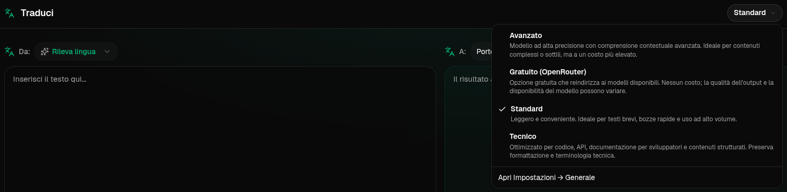
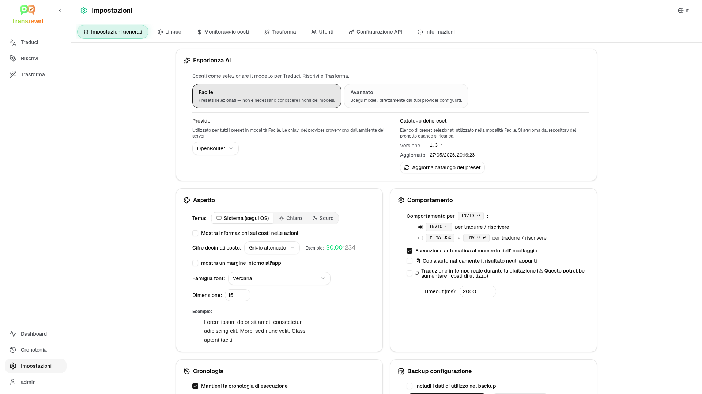

<a id="transrewrt-user-guide"></a>
# Guida utente

<br/>

<a id="introduction"></a>
## Introduzione

Transrewrt ti aiuta a lavorare con il testo in tre modi principali:

- **Traduci** - converti il testo da una lingua all'altra.
- **Riscrivi** - riformula il testo in uno stile diverso, ad esempio più chiaro, più breve o più formale.
- **Trasforma** - elabora il testo utilizzando istruzioni personalizzate basate sull'intelligenza artificiale chiamate prompt.

Per impostazione predefinita, l'app funziona in modalità **Facile**: si sceglie un **preset** (ad esempio Gratuito (OpenRouter), Standard, Avanzato o Tecnico) e un **provider** in Impostazioni, senza dover selezionare ID di modelli. Passa ad **Avanzato** in [**Impostazioni** > **Impostazioni generali**](#general-settings) se desideri la lista classica dei modelli disponibile in [**Impostazioni** > **Modelli**](#models).

<br/>

Questa guida spiega come utilizzare l'app una volta installata ed eseguita. Per i passaggi di installazione, consultare il file [**README**](README.it.md) principale.

<br/>

> ℹ️ **NOTA**<br/>
> Transrewrt è disponibile come app desktop per Windows e Linux e come app web self-hosted. Questa guida si concentra sull'uso quotidiano dell'app. Quando qualcosa si applica solo a una versione, è chiaramente indicato.

<small>**Leggi in altre lingue:** </small>
<small id="lang-list">[English (UK)](../USER-GUIDE.md) · [Português (Brasil)](./USER-GUIDE.pt-BR.md) · [العربية](./USER-GUIDE.ar.md) · [বাংলা](./USER-GUIDE.bn.md) · [Català](./USER-GUIDE.ca.md) · [简体中文](./USER-GUIDE.zh-Hans.md) · [繁體中文](./USER-GUIDE.zh-Hant.md) · [Hrvatski](./USER-GUIDE.hr.md) · [Čeština](./USER-GUIDE.cs.md) · [Nederlands](./USER-GUIDE.nl.md) · [English (US)](./USER-GUIDE.en-US.md) · [Tagalog](./USER-GUIDE.tl.md) · [Français](./USER-GUIDE.fr.md) · [Deutsch](./USER-GUIDE.de.md) · [Ελληνικά](./USER-GUIDE.el.md) · [Hindi (Roman)](./USER-GUIDE.hi-Latn.md) · [Magyar](./USER-GUIDE.hu.md) · [Italiano](./USER-GUIDE.it.md) · [日本語](./USER-GUIDE.ja.md) · [한국어](./USER-GUIDE.ko.md) · [Bahasa Melayu](./USER-GUIDE.ms.md) · [فارسی](./USER-GUIDE.fa.md) · [Polski](./USER-GUIDE.pl.md) · [Basa Jawa](./USER-GUIDE.jv.md) · [Português](./USER-GUIDE.pt.md) · [پنجابی](./USER-GUIDE.pa-PK.md) · [Română](./USER-GUIDE.ro.md) · [Русский](./USER-GUIDE.ru.md) · [Slovenčina](./USER-GUIDE.sk.md) · [Español](./USER-GUIDE.es.md) · [Kiswahili](./USER-GUIDE.sw.md) · [Svenska](./USER-GUIDE.sv.md) · [తెలుగు](./USER-GUIDE.te.md) · [ไทย](./USER-GUIDE.th.md) · [Türkçe](./USER-GUIDE.tr.md) · [Українська](./USER-GUIDE.uk.md) · [Tiếng Việt](./USER-GUIDE.vi.md)</small>

<small>

> **Nota sulle traduzioni dell'interfaccia e della documentazione:** Tutte le lingue dell'interfaccia, eccetto l'inglese (GB) originale, 
> sono state tradotte mediante modelli di intelligenza artificiale; il testo potrebbe essere impreciso o contenere errori.

</small>

<br/>

<!-- START doctoc generated TOC please keep comment here to allow auto update -->
<!-- DON'T EDIT THIS SECTION, INSTEAD RE-RUN doctoc TO UPDATE -->
**Indice**

- [Prima di iniziare](#before-you-start)
  - [Come ottenere una chiave API OpenRouter gratuita (app desktop)](#how-to-get-a-free-openrouter-api-key-desktop-app)
- [Per iniziare](#getting-started)
- [Parti principali della finestra](#main-parts-of-the-window)
  - [Barra laterale](#sidebar)
  - [Barra degli strumenti](#toolbar)
  - [Pannelli di input e output](#input-and-output-panels)
- [Traduci](#translate)
  - [Traduci testo](#translate-text)
  - [Selezione lingua](#language-selection)
  - [Impostazioni di traduzione utili](#helpful-translation-settings)
  - [Perfezionamento della traduzione](#refining-your-translation)
  - [Utilizzo del glossario](#using-the-glossary)
- [Riscrittura](#rewrite)
- [Trasformazione](#transform)
  - [Esecuzione di un prompt esistente](#run-an-existing-prompt)
  - [Se non hai ancora prompt](#if-you-have-no-prompts-yet)
  - [Crea rapidamente un prompt](#create-a-prompt-quickly)
  - [Modifica un prompt](#edit-a-prompt)
  - [Testa un prompt prima di utilizzarlo](#test-a-prompt-before-using-it)
- [Dashboard](#dashboard)
  - [Filtra i dati](#filter-the-data)
  - [Schede della dashboard](#dashboard-tabs)
  - [Esporta dati](#export-data)
  - [Elimina record memorizzati per un modello](#delete-stored-records-for-a-model)
- [Cronologia](#history)
  - [Filtra la cronologia](#filter-the-history)
  - [Esporta dati cronologia](#export-history-data)
- [Impostazioni](#settings)
  - [Impostazioni generali](#general-settings)
  - [Modelli](#models)
  - [Lingue](#languages)
  - [Tracciamento dei costi](#cost-tracking)
  - [Trasforma (scheda impostazioni)](#transform-settings-tab)
  - [Glossario (scheda impostazioni)](#glossary-settings-tab)
  - [Utenti](#users)
  - [Configurazione API](#api-config)
  - [Informazioni](#about)
- [Problemi comuni](#common-issues)
  - [L'app non traduce, riscrive o trasforma testo](#the-app-will-not-translate-rewrite-or-transform-text)
  - [L'elenco dei modelli è vuoto](#the-model-list-is-empty)
  - [Il risultato è troppo lento o troppo costoso](#the-result-is-too-slow-or-too-expensive)
  - [L'interfaccia è nella lingua sbagliata](#the-interface-is-in-the-wrong-language)
  - [Il testo è troppo piccolo o difficile da leggere](#the-text-is-too-small-or-hard-to-read)
  - [Riepilogo dashboard vuoto](#dashboard-summary-looks-empty)
  - [Il costo mostra "non disponibile" o sembra errato](#cost-shows-not-available-or-seems-wrong)
  - [Il costo totale non corrisponde alla fattura del mio provider](#total-cost-does-not-match-my-provider-bill)
  - [La pagina Cronologia manca dalla barra laterale](#the-history-page-is-missing-from-the-sidebar)
  - [App web: reindirizzato inaspettatamente alla pagina di accesso](#web-app-redirected-to-the-login-page-unexpectedly)
  - [Amministrazione web: password dimenticata o persa](#web-admin-forgot-or-lost-a-password)
  - [La dashboard non mostra dati per altri utenti (web)](#dashboard-shows-no-data-for-other-users-web)
  - [Ho modificato un prompt e ho perso le modifiche](#i-changed-a-prompt-and-lost-the-edits)
- [Suggerimenti rapidi](#quick-tips)
- [Disclaimer](#disclaimer)
- [Licenza](#license)

<!-- END doctoc generated TOC please keep comment here to allow auto update -->

<br/><br/>

<a id="before-you-start"></a>
## Prima di iniziare

Per utilizzare Transrewrt, è necessario disporre dell'accesso ad almeno un provider AI. I provider supportati sono: [OpenRouter](https://openrouter.ai) (che aggrega molti modelli), OpenAI, Anthropic, Google Gemini, DeepSeek, Groq, Mistral, xAI, Cerebras, NVIDIA, Alibaba Cloud, apikey.fun, qualsiasi provider compatibile con OpenAI e [Ollama](https://ollama.com) per modelli locali.

Non è necessario selezionare un modello a pagamento per iniziare. Non appena aggiungi la tua chiave API OpenRouter, l'app abilita automaticamente un'opzione **gratuita** integrata di OpenRouter. Questo ti consente di iniziare subito a tradurre, riscrivere e trasformare testo. In alternativa, puoi anche ottenere una chiave API gratuita da Cerebras, Google, Groq, Mistral AI o [NVIDIA](https://build.nvidia.com/) (API compatibile con OpenAI).

In termini semplici:

- In modalità **Facile**, un **preset** (Gratuito (OpenRouter), Standard, Avanzato o Tecnico) corrisponde a un modello del **provider** scelto (OpenRouter, OpenAI, Ollama e altri). Nel toolbar vengono mostrati solo i preset compatibili con il provider attuale. Si seleziona il preset in Traduci, Riscrivi e Trasforma.
- In modalità **Avanzato**, un **modello** è il motore AI che si sceglie direttamente. Gli ID dei modelli utilizzano un **prefisso del provider** (ad esempio `openrouter/…`, `openai/…`, `ollama/…`).
- Una **chiave API** (oppure, per Ollama, un **URL di base**) è il modo in cui l'app si connette al provider.

Se utilizzi l'**app desktop**, aggiungi le chiavi in [**Impostazioni** > **Configurazione API**](#api-config) per ogni provider che usi. Per l'uso esclusivo di OpenRouter, vedi [Come ottenere una chiave API OpenRouter gratuita](#how-to-get-a-free-openrouter-api-key-desktop-app) di seguito. Se non vuoi usare una chiave API, puoi installare Ollama (da [ollama.com](https://ollama.com)) e usare modelli locali invece, come `translategemma:4b`.

Se stai utilizzando la **versione web**, il proprietario del server configura i provider tramite variabili d'ambiente, quindi non puoi inserire direttamente le chiavi API nell'applicazione.

<br/>

<a id="how-to-get-a-free-openrouter-api-key-desktop-app"></a>
### Come ottenere una chiave API OpenRouter gratuita (app desktop)

Se stai utilizzando l'app desktop, segui questi passaggi:

1. Vai su [OpenRouter](https://openrouter.ai) dal tuo browser web.
2. Crea un account o accedi.
3. Apri la pagina [Keys](https://openrouter.ai/keys).
4. Clicca sul pulsante per creare una nuova chiave API.
5. Assegna un nome alla chiave in modo da poterla riconoscere in seguito.
6. Copia la nuova chiave API.
7. Torna a Transrewrt e apri **Impostazioni** > **Configurazione API**.
8. Incolla la chiave nel campo **OpenRouter API key** (sotto **Impostazioni** > **Configurazione API**).
9. Clicca su **Test OpenRouter key** per verificare che funzioni.

<br/><br/>

<a id="getting-started"></a>
## Per iniziare

Se è la prima volta che utilizzi Transrewrt, segui questo ordine:

1. Apri l'app.
2. Se necessario, scegli la tua **Lingua dell'interfaccia** dall'icona del globo.
3. Se utilizzi l'app **desktop**, apri [**Impostazioni** > **Configurazione API**](#api-config), aggiungi una chiave API per almeno un provider (ad esempio OpenRouter) e fai clic su **Test** per verificarne il funzionamento.
4. Apri [**Impostazioni** > **Impostazioni generali**](#general-settings). In modalità **Facile** (predefinita), scegli un **Provider** per cui hai configurato una chiave. In modalità **Avanzato**, apri [**Impostazioni** > **Modelli**](#models) e aggiungi uno o più modelli a **Modelli selezionati**.
5. Su **Traduci**, seleziona un **preset** (Facile) o un **modello** (Avanzato) nella barra degli strumenti.
6. Apri [**Impostazioni** > **Lingue**](#languages) e scegli le tue **Lingue principali** se desideri che le lingue più usate appaiano per prime.
7. Esegui una traduzione semplice per verificare che tutto funzioni, quindi prova **Riscrivi** e **Trasforma**.

L'ordine è importante. Evita il problema più comune all'uso iniziale: tentare di eseguire un'attività prima che l'app abbia una connessione API funzionante o un preset/modello selezionato.

<br/><br/>

<a id="main-parts-of-the-window"></a>
## Parti principali della finestra

L'app è suddivisa in tre aree principali:

- La **barra laterale** a sinistra.
- La **barra degli strumenti** in alto.
- L'**area di lavoro** al centro.

<br/>

<a id="sidebar"></a>
### Barra laterale

Usa la barra laterale per spostarti all'interno dell'app. Puoi comprimere la barra laterale per ottenere più spazio cliccando sull'icona accanto al logo dell'app.

<br/>

<table>
  <tr>
    <td valign="top">
       
    </td>
    <td valign="top">
      <br/><br/>
      <ul>
        <li><strong>Traduci</strong> apre l'area di lavoro di traduzione.</li><br/>
        <li><strong>Riscrivi</strong> apre l'area di lavoro di riscrittura.</li><br/>
        <li><strong>Trasforma</strong> apre l'area di lavoro con prompt personalizzato.</li><br/>
        <li><strong>Dashboard</strong> mostra informazioni sull'utilizzo e sui costi.</li><br/>
        <li><strong>Impostazioni</strong> apre il pannello delle impostazioni.</li><br/>
        <li><strong>Cronologia</strong> mostra la cronologia di utilizzo con il testo in input e in output</li><br/>
        <li><strong>Utente</strong> mostra il nome utente dell'utente connesso (solo web).</li>
      </ul>
    </td>
  </tr>
</table>

<br/>

<a id="toolbar"></a>
### Barra degli strumenti

La barra degli strumenti cambia leggermente a seconda della posizione all'interno dell'app.

- A sinistra, mostra il nome della pagina corrente.
- A destra, mostra il selettore di **preset o modello** e il controllo della **Lingua dell'interfaccia**.

In modalità **Facile**, la barra degli strumenti mostra un selettore di **preset** con i preset integrati **Gratuito (OpenRouter)**, **Standard**, **Avanzato** e **Tecnico**. I preset visualizzati dipendono dal **Provider** scelto in [**Impostazioni** > **Impostazioni generali**](#general-settings): ad esempio, **Gratuito (OpenRouter)** viene mostrato solo quando il provider è OpenRouter. Se il **Provider** è **Ollama**, la barra degli strumenti elenca i modelli locali installati invece dei preset.

In modalità **Avanzato**, il selettore di **modello** ti permette di scegliere quale motore AI utilizzare per l'attività corrente.



In modalità Avanzato, alcuni modelli gratuiti potrebbero non essere sempre disponibili: potrebbero essere offline o aver raggiunto il limite d'uso. L'app potrebbe rimuovere automaticamente quel modello dalla tua lista. Per controllare quali modelli vengono visualizzati, vai a [**Impostazioni** > **Modelli**](#models). Puoi aprire le impostazioni del modello dall'icona del provider a sinistra del nome del modello nella barra degli strumenti.

<br/>

L'**icona del globo + codice della lingua** modifica la lingua dell'interfaccia dell'app, come menu e pulsanti. **Non** modifica le lingue di traduzione utilizzate in **Traduci**.


<br/>

<a id="input-and-output-panels"></a>
### Pannelli di input e output

La maggior parte delle aree di lavoro utilizza un pannello **Input** a sinistra e un pannello **Output** a destra.

Ogni pannello mostra inoltre:

| **Input**                                                          | **Output**                                                                                                                  |
|--------------------------------------------------------------------|-----------------------------------------------------------------------------------------------------------------------------|
| - Conteggio caratteri <br/>- Conteggio parole <br/>- Conteggio paragrafi   <br/> | - Tempo impiegato per l'operazione<br/>- **TPS** (token al secondo)<br/>- Conteggi di caratteri, parole e paragrafi<br/>- Modello utilizzato |

Se hai dubbi sui termini tecnici:

- **Token** indica un frammento di testo. Puoi pensarlo come una parte di parola o una parola breve.
- **TPS** indica quanti di questi frammenti di testo il modello ha elaborato ogni secondo.

<br/>

Puoi inoltre monitorare il costo di ogni operazione (se disponibile) e il costo totale, abilitando l'opzione `Show cost information on the actions` in [**Impostazioni** > **Impostazioni generali**](#general-settings).

<br/><br/>

[--------------------------------------------------------------------------------------------------------------------------]: #

<a id="translate"></a>
## Traduci

Usa **Traduci** quando desideri convertire un testo da una lingua all'altra.


<br/>

<a id="translate-text"></a>
### Tradurre il testo

1. Apri **Traduci**.
2. Scegli una lingua in **Da**.
3. Scegli una lingua in **A**.
4. Scegli un preset (Facile) o un modello (Avanzato) nella barra degli strumenti.
5. Digita o incolla del testo in **Input**.
6. Fai clic su **Traduci**.
7. Leggi il risultato in **Output**.
8. Usa il pulsante di copia se desideri copiare il risultato.
9. Opzionalmente affina il risultato con **Aggiungi una riformulazione…** o alternative di parole — vedi [Affinare la tua traduzione](#refining-translation).

<br/>

<a id="language-selection"></a>
### Selezione della lingua

- **Da** può essere una lingua specifica o **Rileva lingua**.
- **A** è la lingua in cui vuoi ottenere il risultato.

Le tue **Lingue principali** selezionate appaiono in alto nell'elenco. Puoi impostarle in [**Impostazioni** > **Lingue**](#languages).

<br/>

<a id="helpful-translation-settings"></a>
### Impostazioni utili per la traduzione

In [**Impostazioni** > **Impostazioni generali**](#general-settings), puoi modificare il comportamento della traduzione:

- **Esegui automaticamente al copia-incolla** esegue una traduzione non appena incolli del testo.
- **Copia automaticamente il risultato negli appunti** copia automaticamente il risultato dopo un'esecuzione riuscita.
- **Traduzione in tempo reale mentre si digita** (⚠️ Questo potrebbe aumentare i costi di utilizzo) esegue traduzioni mentre digiti.
- **Timeout (ms)** controlla quanto a lungo l'app attende prima di eseguire una traduzione in tempo reale.
- **Comportamento per ENTER** sceglie se `Enter` esegue il compito o inserisce una nuova riga:
  - **Enter** esegue traduci o riscrivi (predefinito).
  - **Shift + Enter** esegue traduci o riscrivi; **Enter** semplice inserisce una nuova riga.

<br/>

<a id="refining-translation"></a>
### Affina la tua traduzione

Dopo una traduzione riuscita, **Aggiungi una riformulazione…** e il menu a discesa delle versioni appaiono nell'intestazione dell'output, accanto al selettore di lingua **A:**. Puoi affinare il risultato lì:

1. **Aggiungi una riformulazione…** — senza testo selezionato nell'output, ottieni un'altra traduzione completa dello stesso input con una formulazione diversa. Il modello riceve ogni versione che hai già, quindi la nuova formulazione può differire da tutte le altre. Puoi memorizzare fino a **cinque** versioni e passare tra di esse nel menu a discesa delle versioni. Con testo selezionato, **Aggiungi una riformulazione…** apre alternative di parole vicino alla selezione (stesso comportamento del clic destro). Senza una selezione, **Aggiungi una riformulazione…** è disabilitato una volta raggiunte cinque versioni; con una selezione, funziona comunque a cinque versioni (solo alternative di parole, aggiornando la versione 5). Mentre una riformulazione completa è in esecuzione, fai clic su **Interrompi Traduzione** per annullare; l'output torna alla versione che era attiva quando è iniziata la riformulazione.
2. **Alternative di parole** — seleziona una o più parole o una breve frase nell'output (se selezioni solo parte di una parola, l'app espande la selezione a parole complete), quindi fai clic destro o clicca su **Aggiungi una riformulazione…**. Un breve elenco di alternative appare vicino alla selezione; fai clic su una per sostituirla. Ogni opzione può sostituire un intervallo leggermente più ampio della tua selezione (ad esempio una preposizione o un articolo adiacente) in modo che la frase rimanga grammaticale. Se hai meno di cinque versioni, l'output modificato viene salvato come una nuova versione; a cinque versioni, solo **versione 5** viene aggiornata. Fare clic destro senza selezione non fa nulla. Premi **Esc** o fai clic al di fuori dell'elenco per annullare senza modificare l'output.
3. **Costi** — ogni **Aggiungi una riformulazione…** completo (senza selezione) e ogni richiesta di alternativa di parole utilizza nuovamente il modello e può aumentare il costo di utilizzo (stesso comportamento di una normale esecuzione di traduzione).

<br/>

<a id="using-the-glossary"></a>
### Utilizzo del glossario

Un **glossario** è un elenco di coppie di termini di origine/destinazione per una specifica coppia di lingue. Quando il glossario è attivo, Transrewrt invia i termini corrispondenti al modello in modo che la tua formulazione preferita rimanga coerente nelle traduzioni (ad esempio, un nome di prodotto, un termine di marca o un titolo di lavoro che dovrebbe sempre essere tradotto allo stesso modo).

Per utilizzarlo nella pagina **Traduci**:

1. Attiva l'interruttore **Glossario** nel pannello di input (accanto agli interruttori di esecuzione automatica e copia automatica).
2. Scegli le lingue **Da** e **A** e traduci come al solito. I termini salvati per quella coppia di lingue vengono applicati automaticamente.
3. Per acquisire una nuova coppia al volo, fai clic su **Aggiungi al glossario** (accanto al selettore della lingua **Da:**). La finestra di dialogo è precompilata con le tue lingue correnti, quindi devi solo compilare il **termine di origine** e il **termine di destinazione**.
4. Utilizza il link **Glossario** nel piè di pagina dell'output (o il link **Gestisci glossario** all'interno della finestra di dialogo) per accedere a [**Impostazioni** > **Glossario**](#glossary-settings) e rivedere tutti i tuoi termini.

Aggiungi, modifica, importa ed esporta termini nella scheda [**Impostazioni** > **Glossario**](#glossary-settings) — vedi sotto.

<br/>

> ℹ️ **NOTA**<br/>
> I termini del glossario vengono confrontati per **coppia di lingue**, quindi un termine salvato per Inglese → Francese non viene applicato quando si traduce Inglese → Tedesco. Il glossario non può essere utilizzato con **Rileva lingua** come origine, poiché è necessaria una lingua di origine specifica per confrontare i termini.

[--------------------------------------------------------------------------------------------------------------------------]: #

<a id="rewrite"></a>
## Riscrivi

Usa **Riscrivi** quando desideri migliorare l'espressione senza cambiarne il significato principale.


Questa funzione è utile per:

- correzione di ortografia e grammatica (**Controllo ortografico e grammaticale**)
- miglioramento della chiarezza del testo (**Migliora chiarezza**)
- diverse riformulazioni distinte in un'unica esecuzione (**Versioni alternative**)
- rendere il testo più formale o più informale (**Rendi formale** / **Rendi informale**)
- accorciare o espandere il testo (**Accorcia** / **Espandi**)
- rendere il testo più tecnico (**Rendi tecnico**)

<br/>

> 💡 **CONSIGLIO**<br/>
> Quando utilizzi la modalità "**Controllo ortografico e grammaticale**", nel pannello di output appare un interruttore **Mostra modifiche** (accanto a **Copia**).
> Attivalo o disattivalo per mostrare o nascondere le correzioni specifiche applicate al testo.

<br/><br/>

[--------------------------------------------------------------------------------------------------------------------------]: #

<a id="transform"></a>
## Trasforma

Usa **Trasforma** quando desideri che l'IA segua un insieme personalizzato di istruzioni.


Questa è l'area più flessibile dell'app. Puoi utilizzarla per attività come:

- riassumere appunti
- trasformare un testo grezzo in un'email curata
- estrarre i punti chiave
- convertire il testo in un formato specifico
- qualsiasi altra attività personalizzata sul testo in input

<br/>

<a id="run-an-existing-prompt"></a>
### Esegui un prompt esistente

1. Apri **Trasforma**.
2. Scegli un prompt dall'elenco dei prompt.
3. Se appare una casella di lingua **Da**, scegli una lingua se ne desideri una.
4. Digita o incolla il testo in **Input**.
5. Fai clic su **Trasforma**.
6. Leggi il risultato in **Output**.

<br/>

<a id="if-you-have-no-prompts-yet"></a>
### Se non hai ancora prompt

Se l'elenco dei prompt è vuoto, fai clic su **Carica prompt di esempio** nell'area di lavoro Trasforma. Lo stesso controllo è sempre disponibile in [**Impostazioni** > **Trasforma**](#transform-settings) nella riga di esportazione/importazione. Entrambi aggiungono esempi predefiniti per iniziare rapidamente.

<br/>

> ℹ️ **NOTA**<br/>
> I prompt di esempio sono forniti in inglese. Dopo averli caricati, puoi modificare un prompt e utilizzare **Traduci prompt** per tradurlo nella tua lingua.

<br/>

<a id="create-a-prompt-quickly"></a>
### Crea un prompt rapidamente

Il modo più veloce per creare un prompt è:

1. Fai clic su **Nuovo prompt**.
2. Fai clic su **Genera prompt**.
3. Descrivi cosa deve fare il prompt.
4. Scegli un preset (Facile) o un modello (Avanzato).
5. Lascia che l'app crei una bozza per te.
6. Rivedi la bozza e fai clic su **Salva**.


<br/>

<a id="edit-a-prompt"></a>
### Modifica un prompt

Quando crei o modifichi un prompt, l'editor appare a sinistra e un'area di test appare a destra.


I campi principali sono:

- **Nome del prompt**: il nome mostrato nell'elenco dei prompt.
- **Istruzioni del prompt (opzionale)**: un breve suggerimento visualizzato all'utente durante l'esecuzione del prompt.
- **Ruolo del modello**: il ruolo generale assegnato all'IA, come 'Sei un assistente utile.'
- **Istruzioni del modello (una per riga)**: le regole specifiche che desideri che l'IA segua.
- **Descrizione dell'output (es. trasformato, riassunto, ecc.)**: una parola breve che descrive il risultato.
- **Temperatura (0,0 → 1,0)**: come si comporterà il modello; vedi sotto.
- **Chiedi la lingua di destinazione**: aggiunge un selettore di lingua quando il prompt viene eseguito.
Se il termine tecnico **Temperatura** è nuovo per te, pensalo in questo modo:

- Una temperatura **più bassa** fornisce risultati più stabili e prevedibili.
- Una temperatura **più alta** offre maggiore varietà e creatività.

Puoi anche utilizzare:

- `Generate prompt` per creare una nuova bozza da una descrizione semplice
- `Improve prompt` per affinare un prompt esistente
- `Translate prompt` per tradurre i campi del prompt

<br/>

> ⚠️ **ATTENZIONE**<br/>
> Fai clic su `Save` prima di fare clic su `Back to Run`. Se torni indietro senza salvare, le tue modifiche andranno perse.

<br/>

<a id="test-a-prompt-before-using-it"></a>
### Testa un prompt prima di usarlo

Il pannello di test a destra ti consente di provare il tuo prompt con un testo di esempio prima di utilizzarlo nel lavoro quotidiano.

Questo è utile quando:

- stai creando un nuovo prompt
- stai confrontando due versioni di un prompt
- desideri verificare il tono, la lunghezza o il formato dell'output

<br/>

> ℹ️ **NOTA**<br/>
> Puoi esportare e importare i prompt salvati in [**Impostazioni** > **Trasforma**](#transform-settings).

Quando utilizzi **Genera prompt**, **Migliora prompt** o **Traduci prompt** nell'editor dei prompt, la modalità **Facile** offre lo stesso selettore di preset disponibile in Traduci e Riscrivi; la modalità **Avanzato** utilizza invece l'elenco dei modelli.

<br/><br/>

[--------------------------------------------------------------------------------------------------------------------------]: #

<a id="dashboard"></a>
## Dashboard

Utilizza **Dashboard** per vedere quanto stai utilizzando l'app e quanto ti costa (per i modelli a pagamento).


<br/>

> ℹ️ **NOTA**<br/>
> Se utilizzi solo modelli **gratuiti**, gli importi di **costo** potrebbero essere pari a zero e i KPI basati sui costi potrebbero apparire vuoti. La scheda **Riepilogo** mostra comunque il numero di chiamate per traduzione, riscrittura e trasformazione quando ci sono attività nel periodo selezionato.

<br/>

<a id="filter-the-data"></a>
### Filtra i dati

Utilizza i pulsanti di filtro nella parte superiore per modificare l'intervallo temporale.


<br/>

> ℹ️ **NOTA**<br/>
> Il filtro **Utente** è visibile solo agli amministratori nella versione web. Gli utenti normali non vedranno questo filtro, che non è disponibile nell'app desktop.

<br/>

<a id="dashboard-tabs"></a>
### Schede della Dashboard

- **Riepilogo** mostra schede KPI: costo totale, modelli utilizzati, numero di chiamate e costo per modalità (con la percentuale sul totale delle chiamate), costo medio per chiamata, TPS medio e i tre modelli più utilizzati in base al numero di chiamate.
- **Per modello** elenca ciascun modello con chiamate totali, costo totale e TPS medio; espandi una riga per visualizzare il dettaglio per traduzione, riscrittura e trasformazione.
- **Tutte le chiamate** mostra il registro completo delle chiamate (in formato paginato su schermi larghi, a schede su schermi stretti) e consente di esportarlo.

<br/>

<a id="export-data"></a>
### Esporta dati

Le tabelle della dashboard possono esportare i dati nei formati:

- **JSON**
- **CSV**
- **XLSX**

Questa funzione è utile se desideri esaminare l'attività al di fuori dell'app o condividere un rapporto.

<br/>

<a id="delete-stored-records-for-a-model"></a>
### Elimina i record memorizzati per un modello

In **Per modello** o **Tutte le chiamate**, puoi rimuovere i record memorizzati per un modello facendo clic sull'icona del "cestino".

> ⚠️ **ATTENZIONE**<br/>
> L'eliminazione dei record memorizzati non può essere annullata. Utilizza questa funzione solo se sei sicuro di non aver più bisogno di quella cronologia.

Per eliminare tutti i dati o rimuovere i record in base alla loro età, vai a [**Impostazioni** > **Monitoraggio costi**](#cost-tracking). Lì troverai le opzioni per eliminare tutti i dati archiviati o solo i dati più vecchi di una certa data.

<br/><br/>

[--------------------------------------------------------------------------------------------------------------------------]: #

<a id="history"></a>
## Cronologia

Fai clic su **Cronologia** per visualizzare la cronologia delle tue azioni all'interno di **Transrewrt**, inclusi l'input e l'output di ogni operazione.


<br/>

<a id="filter-the-history"></a>
### Filtra la cronologia

**Cronologia** utilizza gli stessi filtri di intervallo temporale della pagina **Dashboard**.


<br/>

> ℹ️ **NOTA**<br/>
> Nell'**app web**, tutti (inclusi gli amministratori) vedono soltanto la propria cronologia di esecuzione. Il filtro **Utente** nella **Dashboard** consente agli amministratori di esaminare l'utilizzo e i costi tra gli account; non si applica alla **Cronologia**.

<br/>

<a id="export-history-data"></a>
### Esporta i dati della cronologia

La pagina della cronologia può esportare i dati filtrati nei seguenti formati:

- **JSON**
- **CSV**
- **XLSX**

Questa funzione è utile se desideri esaminare l'attività al di fuori dell'app o condividere un rapporto.

<br/><br/>

[--------------------------------------------------------------------------------------------------------------------------]: #

<a id="settings"></a>
## Impostazioni

Apri **Impostazioni** dalla barra laterale per personalizzare il comportamento dell'app.

Le schede disponibili dipendono dalla piattaforma e dal tuo ruolo:

| Scheda              | Desktop | Web (amministratore) | Web (utente normale) | Note                                        |
  |------------------|:-------:|:-----------:|:------------------:|----------------------------------------------|
  | Impostazioni generali |   sì   |     sì     |        sì         | Include **Esperienza AI** (Facile / Avanzato) |
  | Modelli           |   sì   |     sì     |        sì         | Solo quando **Esperienza AI** è **Avanzato** |
  | Lingue        |   sì   |     sì     |        sì         |                                              |
  | Monitoraggio costi    |   sì   |     sì     |         -          |                                              |
  | Trasforma        |   sì   |     sì     |        sì         | Importazione/esportazione massiva di prompt di trasformazione      |
  | Glossario        |   sì   |     sì     |        sì         | Coppie di termini applicate durante la traduzione |
  | Utenti            |    -    |     sì     |         -          |                                              |
  | Configurazione API       |   sì   |     sì     |         -          |                                              |
  | Informazioni            |   sì   |     sì     |        sì         |                                              |

In modalità **Facile**, la selezione del modello avviene tramite i preset nella barra degli strumenti e il **Provider** in Impostazioni generali; la scheda **Modelli** è nascosta.

<br/>

> ℹ️ **NOTA**<br/>
> Nella versione web, ogni utente ha la propria configurazione. Impostazioni come esperienza AI, provider, modelli o preset selezionati, lingue, opzioni generali e prompt di trasformazione sono memorizzate per singolo utente. Le modifiche che apporti non influiscono sugli altri utenti.

<br/>

[--------------------------------------------------------------------------------------------------------------------------]: #

<a id="general-settings"></a>
### Impostazioni generali

Utilizza **Impostazioni generali** per controllare il comportamento della digitazione, se i dettagli di esecuzione vengono salvati per la **Cronologia**, l'aspetto e il modo in cui scegli l'IA per Traduci, Riscrivi e Trasforma.

**Esperienza AI**

- **Facile** (predefinito): scegli un **Provider** (OpenRouter, OpenAI, Anthropic, Google Gemini, DeepSeek, Groq, Mistral, xAI, Cerebras o Ollama). I provider cloud utilizzano i preset integrati nella barra degli strumenti. **Ollama** elenca i modelli installati sul tuo computer al posto dei preset. In modalità Facile, **Catalogo dei preset** mostra la versione del catalogo e l'ora dell'ultimo aggiornamento; fai clic su **Aggiorna catalogo dei preset** per scaricare l'elenco più recente dal repository del progetto (l'app verifica periodicamente in background).
- **Avanzato**: seleziona singoli modelli nella barra degli strumenti; gestisci l'elenco in [**Impostazioni** > **Modelli**](#models).

**Aspetto**

- **Tema** passa tra aspetto chiaro, scuro e del sistema.
- **Mostra informazioni sui costi nelle azioni** controlla la visualizzazione del costo per operazione (se disponibile) e del costo totale nei pannelli di output di Traduci, Riscrivi e Trasforma.
- **Cifre decimali del costo** modifica la visualizzazione delle cifre decimali del costo.
- **Solo web:** **mostra un margine intorno all'app** aggiunge spazio extra intorno all'interfaccia.
- **Famiglia caratteri** modifica il carattere di scrittura nei pannelli di testo.
- **Dimensione** modifica la dimensione del carattere.

**Comportamento**

- **Comportamento per ENTER** sceglie se `Enter` esegue il compito o inserisce una nuova riga.
- **Esegui automaticamente al copia-incolla** avvia la traduzione non appena incolli del testo.
- **Copia automaticamente il risultato negli appunti** copia automaticamente i risultati riusciti.
- **Traduzione in tempo reale mentre si digita** (⚠️ Questo potrebbe aumentare i costi di utilizzo) traduce mentre digiti.
- **Timeout (ms)** imposta il tempo di attesa per la traduzione in tempo reale.

**Cronologia**

- **Mantieni la cronologia di esecuzione** controlla se ogni operazione di traduzione, riscrittura e trasformazione memorizza il **testo in input e output** per la visualizzazione della [**Cronologia**](#history) nella barra laterale. Disattivandolo verrà richiesta una conferma; se confermi, il testo della cronologia memorizzato verrà rimosso dal database. Se l'etichetta mostra *disabilitato dall'amministratore*, la tua installazione ha `HISTORY_DISABLED` impostato nell'ambiente (vedi il [README](README.it.md#configuration-and-environment)); non potrai riattivare la cronologia dall'interfaccia utente.
- **Elimina dati cronologia** ti consente di rimuovere il testo memorizzato in base all'età (ad esempio più vecchio di alcuni mesi, oppure **tutti i dati (cancella)**) utilizzando **Elimina dati**. Questa operazione influisce solo sul testo di esecuzione salvato per la vista **Cronologia**; **non** elimina i totali di costi o utilizzo. Per rimuovere o ridurre i dati relativi ai **costi**, utilizza [**Impostazioni** > **Monitoraggio costi**](#cost-tracking).

**Backup della configurazione** (solo per amministratori di app desktop e web)
- **Includi i dati di utilizzo nel backup** - quando abilitato, il ZIP contiene anche la cronologia delle esecuzioni e i dati delle chiamate API.
- **Esegui backup della configurazione** - crea un singolo ZIP (`transrewrt-config-backup-YYYY-MM-DD_HHMMSS.zip` in ora locale) con `config.json`, `state.json`, chiave di crittografia opzionale, utenti, preferenze, prompt personalizzati e dati di utilizzo se hai scelto di partecipare. Dopo un backup riuscito, la conferma mostra il nome del file salvato.
- **Ripristina dal backup** - apre prima una **finestra di conferma**. Scegli il ZIP di backup all'interno della finestra di dialogo (**Sfoglia** / selettore file o drag-and-drop dove supportato), quindi rivedi le opzioni:
  - **Ripristina i dati di utilizzo** - importa utilizzo/storia dal ZIP quando è stato eseguito il backup con utilizzo incluso; lascia disattivato se desideri solo impostazioni e prompt.
  - **Cancella i vecchi dati di utilizzo prima di ripristinare** - rimuovi l'utilizzo/storia esistente su questa installazione prima di applicare il backup (opzionale; usa quando desideri una sostituzione pulita).
I backup creati nella versione web o desktop possono essere ripristinati nell'altra. Quando ripristini un backup desktop nella versione web, i dati verranno ripristinati all'utente amministratore.

<br/>

<a id="models"></a>
### Modelli

Questa scheda è disponibile solo quando l'**esperienza AI** è impostata su **Avanzato** in [**Impostazioni generali**](#general-settings). Usa **Impostazioni** > **Modelli** per scegliere quali modelli vengono visualizzati nella barra degli strumenti.



La pagina contiene due elenchi:

- **Modelli disponibili** a sinistra
- **Modelli selezionati** a destra

I controlli utili includono:

- **Cerca modelli...** per trovare un modello per nome
- **Provider** per restringere l'elenco a un motore (OpenRouter, OpenAI, Ollama, …)
- **Solo gratuiti** per mostrare solo i modelli gratuiti
- **Aggiorna** per ricaricare l'elenco
- **Espandi tutto** e **Comprimi tutto** quando ordini per provider

Gli ID dei modelli includono il prefisso del provider (ad esempio `openrouter/…` rispetto a `openai/…`). Badge come **OpenAI (OpenRouter)** rispetto a **OpenAI (diretto)** indicano come viene instradato il traffico.

> ℹ️ **NOTA**<br/>
> **OpenRouter Body Builder** (`openrouter/bodybuilder`) è un modello router, non un modello di chat generale: la sua risposta è JSON che descrive i corpi delle richieste all'API OpenRouter (ad esempio un array `requests` con `model` e `messages`). Se lo usi per **Traduci**, **Riscrivi** o **Trasforma**, il pannello di output mostrerà quel JSON invece del testo finito. Scegli un modello di testo normale per queste attività. Consulta la [pagina del modello Body Builder](https://openrouter.ai/openrouter/bodybuilder) su OpenRouter.

Azioni:

- Per aggiungere un modello, fai clic su **Aggiungi** o ovunque nella voce.

- Per rimuovere un modello, fai clic su **X** accanto ad esso in **Modelli selezionati** o su **Selezionati** nella voce nei Modelli disponibili.

- Per cancellare l'elenco, fai clic su **Deseleziona tutto**. Il modello gratuito obbligatorio rimarrà nell'elenco.

<br/>

> ℹ️ **NOTA**<br/>
> Se non desideri aggiungere crediti a OpenRouter immediatamente, inizia abilitando **Solo gratuiti** e scegliendo i modelli gratuiti (nessuna carta di credito richiesta). Puoi anche usare Ollama per eseguire modelli in locale senza alcuna chiave API.

<br/>

<a id="languages"></a>
### Lingue

Usa **Impostazioni** > **Lingue** per organizzare gli elenchi di lingue utilizzati nell'app.

- Le **lingue principali** sono fissate in alto negli elenchi di lingue in **Traduci** e **Trasforma**.
- **Linguaggio personalizzato** ti permette di aggiungere una lingua non presente nell'elenco predefinito.

Se aggiungi una lingua personalizzata, essa apparirà nei selettori di lingua insieme alle opzioni predefinite.

<br/>

<a id="cost-tracking"></a>
### Monitoraggio costi

Usa **Impostazioni** > **Monitoraggio costi** per gestire le informazioni sui costi.

- **Costo totale** mostra il totale aggiornato.
- **Copia valore** copia il totale negli appunti.
- **Reimposta costo** reimposta il totale memorizzato a zero.
- **Sincronizza con l'utilizzo della chiave API** imposta il totale in base all'utilizzo riportato dal tuo account OpenRouter (solo OpenRouter).
- **Utilizzo chiave API** mostra i dettagli di utilizzo di OpenRouter, se disponibili.
- **Elimina dati sui costi** rimuove tutti i dati o solo le voci anteriori alla data selezionata.

**Monitoraggio costi:** Quando utilizzi modelli OpenRouter, l'app mostra il tuo utilizzo effettivo e le spese basandosi sulle informazioni di costo di OpenRouter. Per tutti gli altri provider, l'app stima i costi utilizzando i prezzi pubblicati da OpenRouter; se un prezzo non è disponibile, la stima potrebbe essere zero.

<br/>

> ℹ️ **NOTA**<br/>
> **Tutte le cifre relative ai costi sono stime solo a scopo informativo, non costituiscono fatture ufficiali.**

<br/>

> ⚠️ **ATTENZIONE**<br/>
> L'eliminazione dei dati non può essere annullata. Prima di eliminare, assicurati di eseguire il backup dei tuoi dati o di esportarli tramite [**Cronologia**](#history)
> o [**Dashboard** > **Tutte le chiamate**](#dashboard-tabs), altrimenti andranno persi definitivamente.
> Tutta la cronologia di input/output relativa a ogni voce della chiamata API verrà eliminata.

<br/>

<a id="transform-settings"></a>
### Trasforma (scheda impostazioni)

Usa **Impostazioni** > **Trasforma** per gestire i prompt in blocco.

Puoi:

- visualizzare i prompt salvati
- eliminare prompt
- importare prompt da un file
- esportare prompt per il backup o da condividere
- caricare prompt di esempio nell'elenco dei prompt

<br/>

<a id="glossary-settings"></a>
### Glossario (scheda impostazioni)

Usa **Impostazioni** > **Glossario** per gestire le coppie di termini applicate durante la traduzione (vedi [Utilizzo del glossario](#using-the-glossary)). Ogni termine ha una **lingua di origine**, una **lingua di destinazione**, un **termine di origine** e un **termine di destinazione**.

Puoi:

- **Aggiungi un termine** — compila la riga in fondo alla tabella (scegli le lingue, digita i termini di origine e destinazione) e fai clic sul pulsante **+**.
- **Trova termini** — filtra l'elenco per **Lingua di origine**, **Lingua di destinazione** o **testo** libero; fai clic su **Cancella filtri** per reimpostare.
- **Elimina un termine** — fai clic sull'icona del cestino nella sua riga.
- **Importa** — carica termini da un file `.csv`, `.xlsx` o `.xls`. Il file deve contenere le colonne `source_language`, `target_language`, `source_text` e `target_text`.
- **Esporta CSV** / **Esporta XLSX** — scarica tutti i tuoi termini per backup o condivisione.
- **Modello CSV** / **Modello XLSX** — scarica un file vuoto con le intestazioni di colonna corrette da compilare e importare.

<br/>

> ℹ️ **NOTA**<br/>
> Nell'**app desktop**, il glossario viene archiviato localmente. Nella **versione web**, ogni utente ha il proprio glossario, quindi i tuoi termini non influiscono sugli altri utenti.

<br/>

<a id="users"></a>
### Utenti

Usa **Utenti** per gestire gli account utente nella versione web. Puoi aggiungere utenti, aggiornarne i dettagli, reimpostare le password ed eliminare account.

<br/>

<a id="api-config"></a>
### Configurazione API

I provider supportati sono: OpenRouter, OpenAI, Anthropic, Google Gemini, DeepSeek, Groq, Mistral, xAI, Cerebras, NVIDIA, Alibaba Cloud, apikey.fun, **Ollama** (modelli locali tramite un URL di base) e un **provider personalizzato compatibile con OpenAI** opzionale (nome, URL e chiave API — solo modalità Avanzato). È necessario configurare solo i provider che si utilizzano.

**Applicazione web: solo amministratore**

Le chiavi API sono configurate tramite variabili d'ambiente di sistema o Docker: non vengono inserite nell'interfaccia utente web. Per il provider personalizzato, imposta `CUSTOM_PROVIDER_NAME`, `CUSTOM_PROVIDER_URL` e `CUSTOM_PROVIDER_API_KEY` (tutti e tre richiesti). Questa pagina mostra quali provider hanno una chiave configurata e ti consente di testarne ciascuno facendo clic sul pulsante `Test`.

<br/>

> ℹ️ **NOTA**<br/>
> Per modificare una chiave API, aggiorna la variabile d'ambiente nella configurazione del sistema o di Docker e riavvia il server o il contenitore.

<br/>

> ℹ️ **NOTA**<br/>
> I **backup della configurazione** (vedi [**Impostazioni generali** → Backup configurazione](#general-settings)) possono incorporare chiavi provider **risolte** all'interno del file `config.json` del file ZIP. Il ripristino di quel file ZIP **non** copia tali chiavi nel file di configurazione persistente del server: le chiavi attive provengono comunque dall'ambiente e dallo stato del file esistente, come descritto lì.

<br/>

**Applicazione desktop**

Utilizzare **Configurazione API** per memorizzare le chiavi API per ciascun provider utilizzato. Per Ollama, inserire l'**URL di base** anziché una chiave API. Per un provider personalizzato compatibile con OpenAI (qualsiasi endpoint non presente nell'elenco predefinito, come un server self-hosted o un gateway), inserire un **nome provider**, un **URL di base** (come `https://my-llm.example.com/v1`) e una **chiave API**; tutti e tre sono obbligatori. L'URL e il nome vengono modificati inline; utilizzare **Modifica** per sostituire la chiave API. I modelli del provider personalizzato appaiono solo in modalità **Avanzato** (Impostazioni → Modelli).

<br/>

> 💡 **Suggerimento** <br/>
> Se non desideri utilizzare una chiave API o pagare per l'utilizzo, puoi [scaricare Ollama](https://ollama.com) ed eseguire modelli (come `translategemma:4b`) localmente sulla tua macchina gratuitamente. In alternativa, puoi creare un account gratuito su OpenRouter (nessuna carta di credito richiesta) per utilizzare i loro modelli gratuiti, oppure ottenere una chiave API gratuita da Cerebras, Google, Groq, Mistral AI o [NVIDIA](https://build.nvidia.com/).

<br/>

- Aggiungere solo i provider necessari. In **Impostazioni** > **Modelli**, ogni ID modello inizia con il provider (ad esempio `openrouter/openrouter/free`, `openai/gpt-4o`, `nvidia/nvidia/nemotron-nano-3-30b-a3b`, `ollama/llama3`, `MyProvider/…` per un endpoint personalizzato denominato `MyProvider`).

Per aggiungere una chiave API, inserisci il valore nel campo di testo e clicca su `Save`. Per sostituire una chiave esistente, clicca su `Edit`. Per verificare che una chiave funzioni, clicca su `Test`. Per l'URL base di Ollama, clicca sempre su `Test` per verificare la connessione.

<br/>

> ℹ️ **NOTA**<br/>
> Non puoi visualizzare il valore attuale di una chiave API. Puoi solo sostituirla utilizzando il pulsante `Edit`.
> Le chiavi API sono memorizzate in forma crittografata nella configurazione.

<br/>

<a id="about"></a>
### Informazioni

La scheda **Informazioni** mostra:

- nome dell'app e slogan
- numero di versione e data di build
- informazioni su licenza e copyright, con un link per aprire **Avvisi di parti terze**
- un link al repository del progetto

<br/><br/>

<a id="common-issues"></a>
## Problemi comuni

Se qualcosa non funziona come previsto, controlla innanzitutto i seguenti punti.

<br/>

<a id="the-app-will-not-translate-rewrite-or-transform-text"></a>
### L'app non traduce, riscrive o trasforma il testo

Verifica che:

- hai selezionato un **preset** (Facile) o un **modello** (Avanzato) nella barra degli strumenti
- in modalità **Facile**, [**Impostazioni** > **Impostazioni generali**](#general-settings) ha un **Provider** con una chiave funzionante (o un URL Ollama) e almeno un preset per quel provider
- in modalità **Avanzato**, almeno un modello è presente in [**Impostazioni** > **Modelli**](#models)
- la configurazione API funziona correttamente

Se stai utilizzando l'app desktop:

1. Apri [**Impostazioni** > **Configurazione API**](#api-config).
2. Verifica che almeno una chiave API sia salvata.
3. Fai clic su **Test** accanto al provider per confermare che la chiave funzioni.

<br/>

<a id="the-model-list-is-empty"></a>
### L'elenco dei modelli è vuoto

In modalità **Facile**, apri [**Impostazioni** > **Impostazioni generali**](#general-settings), verifica che il **Provider** sia impostato e aggiungi o testa le chiavi in [**Configurazione API**](#api-config) (desktop) oppure chiedi all'amministratore (web). Per **Ollama**, esegui il **Test** sull'URL di base e assicurati che i modelli siano installati localmente.

In modalità **Avanzato**, apri [**Impostazioni** > **Modelli**](#models) e fai clic su **Aggiorna**. Se necessario, cerca un modello, attiva **Solo gratuiti** e aggiungi modelli ai **Modelli selezionati**.

<br/>

<a id="the-result-is-too-slow-or-too-expensive"></a>
### Il risultato è troppo lento o troppo costoso

Prova una o più delle seguenti azioni:

- scegli un preset diverso (Facile) o un modello (Avanzato)
- usa un input più breve
- disattiva **Traduzione in tempo reale mentre si digita** in [**Impostazioni** > **Impostazioni generali**](#general-settings)
- usa modelli gratuiti per compiti semplici (vedi [Modelli](#models))
<br/>

<a id="the-interface-is-in-the-wrong-language"></a>
### L'interfaccia è nella lingua sbagliata

Fai clic sull'icona del globo nella [barra degli strumenti](#toolbar) e scegli la **Lingua dell'interfaccia** desiderata.

<br/>

<a id="the-text-is-too-small-or-hard-to-read"></a>
### Il testo è troppo piccolo o difficile da leggere

Apri [**Impostazioni** > **Impostazioni generali**](#general-settings) e modifica:

- **Famiglia di caratteri**
- **Dimensione**

<br/>

<a id="dashboard-summary-looks-empty"></a>
### Il riepilogo della Dashboard appare vuoto

Questo è normale se:

- utilizzi solo **modelli gratuiti** e stai visualizzando i dati relativi ai **costi** (potrebbero essere zero); i KPI basati sul numero di chiamate nel **Riepilogo** richiedono comunque dati dal periodo selezionato
- il **filtro temporale** selezionato non include il periodo in cui sono state effettuate le chiamate — prova con **Tutto** per verificare

Se i KPI sono ancora zero dopo aver selezionato **Tutto**, verifica che le chiamate siano presenti in [**Cronologia**](#history) o nella scheda **Tutte le chiamate**.

<br/>

<a id="cost-shows-not-available-or-seems-wrong"></a>
### Il costo mostra "non disponibile" o sembra errato

Quando utilizzi modelli tramite **OpenRouter**, l'app mostra la spesa effettiva riportata da OpenRouter.

Per **altri provider** (OpenAI diretto, Anthropic diretto, ecc.), il costo è stimato in base ai dati tariffari pubblicati da OpenRouter. Se non viene trovato un prezzo corrispondente per un modello, il costo verrà visualizzato come **non disponibile** e non sarà aggiunto al totale cumulativo.

<br/>

<a id="total-cost-does-not-match-my-provider-bill"></a>
### Il costo totale non corrisponde alla fattura del provider

Tutte le cifre relative ai costi nell'app sono **stime a solo scopo informativo**, non rappresentano fatture ufficiali.

Per avvicinare il totale alla spesa effettiva su OpenRouter, apri [**Impostazioni** > **Monitoraggio costi**](#cost-tracking) e clicca su **Sincronizza con l'utilizzo della chiave API**.

<br/>

<a id="the-history-page-is-missing-from-the-sidebar"></a>
### La pagina Cronologia manca nella barra laterale

**Mantieni la cronologia di esecuzione** potrebbe essere disattivato. Apri [**Impostazioni** > **Impostazioni generali**](#general-settings) e abilitalo, a meno che la cronologia non sia *disabilitata dall'amministratore* (`HISTORY_DISABLED` nell'ambiente — vedi il [README](README.it.md#configuration-and-environment)). L'attivazione della cronologia non ripristina il testo precedentemente eliminato.

<br/>

<a id="web-app-session-expired"></a>
### App web: reindirizzamento imprevisto alla pagina di accesso

La sessione potrebbe essere scaduta. Accedi nuovamente. Se il problema si verifica frequentemente, verifica la configurazione del server per le impostazioni della durata della sessione.

<br/>

<a id="web-admin-forgot-or-lost-a-password"></a>
### Amministrazione web: password dimenticata o persa

Questo si applica all'**app web self-hosted** (Docker), non all'app desktop (Electron).

- Se un altro amministratore può ancora accedere, può aprire [**Impostazioni** > **Utenti**](#users), selezionare l'account e impostare una **nuova password**.
- Se sei **bloccato fuori** ma hai **accesso shell** alla macchina o al container, reimposta la password utilizzando l'helper fornito con l'immagine (sostituisci `transrewrt` se hai modificato il nome predefinito, e racchiudi tra virgolette la password se contiene spazi o caratteri speciali):

```bash
docker exec transrewrt reset-web-password '<username>' '<new-password>'
```

Il nome utente predefinito dell'amministratore è `admin` se non hai mai creato altri account. Quando viene fornito un solo argomento, viene trattato come nuova password per `admin`.

Se esegui da un **checkout del codice sorgente** invece che da Docker, utilizza:

```bash
pnpm run reset-web-password -- <username> <new-password>
```

Lo script aggiorna il record utente nel database SQLite (e può creare l'utente `admin` se mancante). Dopo il ripristino, accedi con la nuova password.

<br/>

<a id="dashboard-shows-no-data-for-other-users"></a>
### La Dashboard non mostra dati per altri utenti (web)

Solo gli **amministratori** possono visualizzare i dati di tutti gli utenti tramite il filtro **Utente**. Per impostazione progettata, gli utenti normali vedono solo la propria attività.

<br/>

<a id="i-changed-a-prompt-and-lost-the-edits"></a>
### Ho modificato un prompt e ho perso le modifiche

Quando modifichi un prompt, fai sempre clic su **Salva** prima di fare clic su **Torna a Esegui**.

<br/><br/>

<a id="quick-tips"></a>
## Suggerimenti rapidi

- Inizia con [**Traduci**](#translate) per assicurarti che la configurazione funzioni prima di passare a [**Riscrivi**](#rewrite) o [**Trasforma**](#transform).
- Usa [**Riscrivi**](#rewrite) per migliorare quotidianamente il testo.
- Usa [**Trasforma**](#transform) quando hai bisogno di un flusso di lavoro ripetibile per un compito specifico.
- Usa [**Dashboard**](#dashboard) se desideri monitorare l'utilizzo e il costo.
- Usa [**Cronologia**](#history) per rivedere le operazioni passate e il testo completo di input/output.
- Esporta regolarmente i prompt se stai creando una libreria di prompt che desideri conservare al sicuro (vedi [Trasforma](#transform)) o se desideri condividerla con altri.
- Mantieniti in modalità **Facile** finché non hai bisogno di un controllo dettagliato sugli ID dei modelli; passa ad **Avanzato** quando sai già quali modelli desideri utilizzare.

<br/><br/>

<a id="disclaimer"></a>
## Dichiarazione di non responsabilità

I nomi dei prodotti e le icone appartengono ai rispettivi proprietari e sono utilizzati solo a scopo identificativo. Questo software non è affiliato né approvato da nessuno dei marchi menzionati.

<br/><br/>

<a id="license"></a>
## Licenza

Diritti d'autore © 2026 Waldemar Scudeller Jr.

[Apache License 2.0](../LICENSE)
