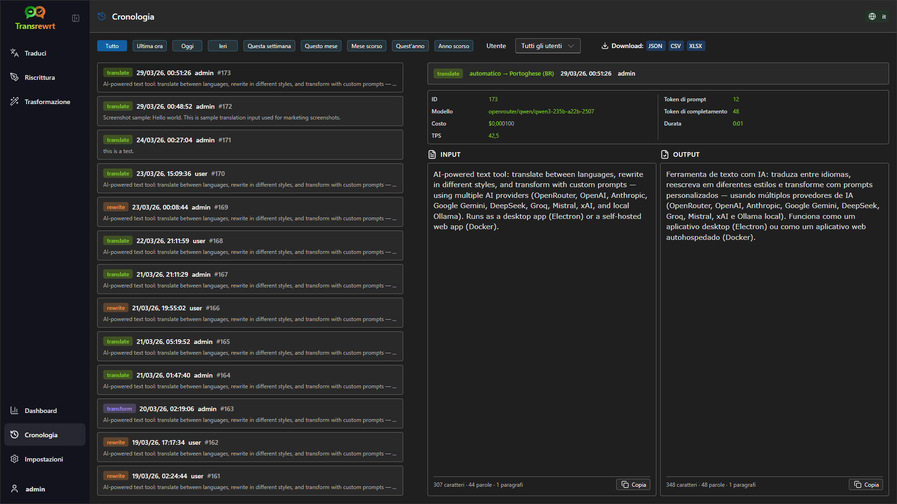

<a id="transrewrt-user-guide"></a>
# Guida Utente

<br/>

<a id="introduction"></a>
## Introduzione

Transrewrt ti aiuta a lavorare con il testo in tre modi principali:

- **Traduci** - convertire il testo da una lingua all'altra.
- **Riscrittura** - riformulare il testo in uno stile diverso, ad esempio più chiaro, più breve o più formale.
- **Trasformazione** - elaborare il testo utilizzando istruzioni AI personalizzate chiamate prompt.

<br/>

Questa guida spiega come utilizzare l'app una volta installata ed eseguita. Per i passaggi di installazione, consulta il file **[README](README.it.md)** principale.

<br/>

> ℹ️ **NOTA**<br/>
> Transrewrt è disponibile come app desktop per Windows e Linux e come app web self-hosted. Questa guida si concentra sull'uso quotidiano dell'app. Quando qualcosa si applica solo a una versione, è chiaramente indicato.

<small>**Leggi in altre lingue:** </small>
<small id="lang-list">[English (GB)](../USER-GUIDE.md) · [Português (Brasil)](./USER-GUIDE.pt-BR.md) · [العربية](./USER-GUIDE.ar.md) · [বাংলা](./USER-GUIDE.bn.md) · [Català](./USER-GUIDE.ca.md) · [中文 (中国大陆)](./USER-GUIDE.zh-CN.md) · [中文 (台灣)](./USER-GUIDE.zh-TW.md) · [Hrvatski](./USER-GUIDE.hr.md) · [Čeština](./USER-GUIDE.cs.md) · [Nederlands](./USER-GUIDE.nl.md) · [English (US)](./USER-GUIDE.en-US.md) · [Tagalog](./USER-GUIDE.tl.md) · [Français](./USER-GUIDE.fr.md) · [Deutsch](./USER-GUIDE.de.md) · [Ελληνικά](./USER-GUIDE.el.md) · [हिन्दी](./USER-GUIDE.hi.md) · [Magyar](./USER-GUIDE.hu.md) · [Italiano](./USER-GUIDE.it.md) · [日本語](./USER-GUIDE.ja.md) · [한국어](./USER-GUIDE.ko.md) · [Bahasa Melayu](./USER-GUIDE.ms.md) · [فارسی](./USER-GUIDE.fa.md) · [Polski](./USER-GUIDE.pl.md) · [Basa Jawa](./USER-GUIDE.jv.md) · [Português](./USER-GUIDE.pt.md) · [ਪੰਜਾਬੀ](./USER-GUIDE.pa.md) · [Română](./USER-GUIDE.ro.md) · [Русский](./USER-GUIDE.ru.md) · [Slovenčina](./USER-GUIDE.sk.md) · [Español](./USER-GUIDE.es.md) · [Kiswahili](./USER-GUIDE.sw.md) · [Svenska](./USER-GUIDE.sv.md) · [తెలుగు](./USER-GUIDE.te.md) · [ไทย](./USER-GUIDE.th.md) · [Türkçe](./USER-GUIDE.tr.md) · [Українська](./USER-GUIDE.uk.md) · [Tiếng Việt](./USER-GUIDE.vi.md)</small>

<small>

> **Nota sulle traduzioni dell'interfaccia e della documentazione:** Tutte le lingue dell'interfaccia, eccetto l'inglese (GB) originale, 
> sono state tradotte mediante modelli di intelligenza artificiale; il testo potrebbe essere impreciso o contenere errori.

</small>

<br/>

<!-- START doctoc generated TOC please keep comment here to allow auto update -->
<!-- DON'T EDIT THIS SECTION, INSTEAD RE-RUN doctoc TO UPDATE -->
**Indice**

- [Prima di iniziare](#before-you-start)
  - [Come ottenere una chiave API OpenRouter gratuita (app desktop)](#how-to-get-a-free-openrouter-api-key-desktop-app)
- [Introduzione](#getting-started)
- [Parti principali della finestra](#main-parts-of-the-window)
  - [Barra laterale](#sidebar)
  - [Barra degli strumenti](#toolbar)
  - [Pannelli di input e output](#input-and-output-panels)
- [Traduci](#translate)
  - [Traduci testo](#translate-text)
  - [Selezione della lingua](#language-selection)
  - [Impostazioni utili per la traduzione](#helpful-translation-settings)
- [Riscrivi](#rewrite)
- [Trasforma](#transform)
  - [Esegui un prompt esistente](#run-an-existing-prompt)
  - [Se non hai ancora prompt](#if-you-have-no-prompts-yet)
  - [Crea un prompt rapidamente](#create-a-prompt-quickly)
  - [Modifica un prompt](#edit-a-prompt)
  - [Prova un prompt prima di usarlo](#test-a-prompt-before-using-it)
- [Dashboard](#dashboard)
  - [Filtra i dati](#filter-the-data)
  - [Schede della dashboard](#dashboard-tabs)
  - [Esporta dati](#export-data)
  - [Elimina record archiviati per un modello](#delete-stored-records-for-a-model)
- [Cronologia](#history)
  - [Filtra i dati](#filter-the-data-1)
  - [Esporta dati della cronologia](#export-history-data)
- [Impostazioni](#settings)
  - [Impostazioni generali](#general-settings)
  - [Modelli](#models)
  - [Lingue](#languages)
  - [Monitoraggio costi](#cost-tracking)
  - [Prompt di trasformazione](#transform-prompts)
  - [Utenti](#users)
  - [Configurazione API](#api-config)
  - [Informazioni](#about)
- [Problemi comuni](#common-issues)
  - [L'app non traduce, riscrive o trasforma il testo](#the-app-will-not-translate-rewrite-or-transform-text)
  - [L'elenco dei modelli è vuoto](#the-model-list-is-empty)
  - [Il risultato è troppo lento o troppo costoso](#the-result-is-too-slow-or-too-expensive)
  - [L'interfaccia è nella lingua sbagliata](#the-interface-is-in-the-wrong-language)
  - [Il testo è troppo piccolo o difficile da leggere](#the-text-is-too-small-or-hard-to-read)
  - [I grafici della dashboard sono vuoti](#dashboard-charts-are-empty)
  - [Il costo mostra "non disponibile" o sembra errato](#cost-shows-not-available-or-seems-wrong)
  - [Il costo totale non corrisponde al conto del provider](#total-cost-does-not-match-my-provider-bill)
  - [La pagina Cronologia manca nella barra laterale](#the-history-page-is-missing-from-the-sidebar)
  - [App web: reindirizzamento imprevisto alla pagina di accesso](#web-app-redirected-to-the-login-page-unexpectedly)
  - [Amministrazione web: password dimenticata o persa](#web-admin-forgot-or-lost-a-password)
  - [La dashboard non mostra dati per altri utenti (web)](#dashboard-shows-no-data-for-other-users-web)
  - [Ho modificato un prompt e perso le modifiche](#i-changed-a-prompt-and-lost-the-edits)
- [Suggerimenti rapidi](#quick-tips)
- [Avviso legale](#disclaimer)
- [Licenza](#license)

<!-- END doctoc generated TOC please keep comment here to allow auto update -->

<br/><br/>

<a id="before-you-start"></a>
## Prima di iniziare

Per utilizzare Transrewrt, hai bisogno di accesso ad almeno un provider di intelligenza artificiale. I provider supportati sono: [OpenRouter](https://openrouter.ai) (che aggrega molti modelli), OpenAI, Anthropic, Google Gemini, DeepSeek, Groq, Mistral, xAI, Cerebras e [Ollama](https://ollama.com) per modelli locali.

Non è necessario selezionare un modello a pagamento per iniziare. Non appena aggiungi la tua chiave API OpenRouter, l'app abilita automaticamente un'opzione **gratuita** integrata di OpenRouter. Ciò ti permette di iniziare subito a tradurre, riscrivere e trasformare il testo. In alternativa, puoi ottenere gratuitamente una chiave API da Cerebras, Google, Groq o Mistral AI.

In parole semplici:

- Un **modello** è il motore AI che svolge il lavoro. I modelli sono elencati con un **prefisso del provider** (ad esempio `openrouter/…`, `openai/…`, `ollama/…`).
- Una **chiave API** (o, per Ollama, un **URL di base**) è il modo in cui l'app raggiunge quel provider.

Se stai utilizzando l'**app desktop**, aggiungi le chiavi in [**Impostazioni** > **Configurazione API**](#api-config) per ogni provider che utilizzi. Per un uso esclusivo di OpenRouter, consulta [Come ottenere una chiave API](#how-to-get-an-api-key-desktop-app) di seguito. Se non desideri utilizzare una chiave API, puoi installare Ollama (da [ollama.com](https://ollama.com)) e usare modelli locali invece, come `translategemma:4b`.

Se stai utilizzando la **versione web**, il proprietario del server configura i provider tramite variabili d'ambiente, quindi non puoi inserire direttamente le chiavi API nell'applicazione.

<br/>

<a id="how-to-get-an-api-key-desktop-app"></a>
### Come ottenere una chiave API gratuita di OpenRouter (app desktop)

Se stai utilizzando l'app desktop, segui questi passaggi:

1. Apri [OpenRouter](https://openrouter.ai) nel tuo browser web.
2. Crea un account o accedi.
3. Apri la pagina [Chiavi](https://openrouter.ai/keys).
4. Clicca sul pulsante per creare una nuova chiave API.
5. Assegna un nome alla chiave in modo da poterla riconoscere in seguito.
6. Copia la nuova chiave API.
7. Torna a Transrewrt e apri **Impostazioni** > **Configurazione API**.
8. Incolla la chiave in **Chiave API OpenRouter** (sotto **Impostazioni** > **Configurazione API**).
9. Clicca su **Testa chiave OpenRouter** per verificare che funzioni.

<br/><br/>

<a id="getting-started"></a>
## Iniziare

Se è la prima volta che utilizzi Transrewrt, segui questo ordine:

1. Apri l'app.
2. Scegli la tua **lingua dell'interfaccia** dall'icona del globo, se necessario.
3. Se stai usando l'**app desktop**, apri [**Impostazioni** > **Configurazione API**](#api-config), aggiungi una chiave API per almeno un provider (ad esempio OpenRouter) e clicca su **Test** per verificarne il funzionamento.
4. Apri [**Impostazioni** > **Modelli**](#models) e aggiungi uno o più modelli a **Modelli selezionati**.
5. Apri [**Impostazioni** > **Lingue**](#languages) e scegli le tue **Lingue principali**, se desideri che le lingue più usate appaiano per prime.
6. Vai su **Traduci** ed esegui una traduzione semplice per confermare che tutto funzioni correttamente.
7. Una volta verificato, prova **Riscrivi** e poi **Trasforma**.

Questo ordine è importante. Evita il problema più comune durante il primo utilizzo: tentare di eseguire un'attività prima che l'app abbia una connessione API funzionante o un modello selezionato.

<br/><br/>

<a id="main-parts-of-the-window"></a>
## Parti principali della finestra

L'app è divisa in tre aree principali:

- La **barra laterale** a sinistra.
- La **barra degli strumenti** in alto.
- L'**area di lavoro** al centro.

<br/>

<a id="sidebar"></a>
### Barra laterale

Utilizza la barra laterale per spostarti all'interno dell'app. Puoi comprimere la barra laterale per guadagnare spazio cliccando sull'icona accanto al logo dell'app.

<br/>

<table>
  <tr>
    <td valign="top">
       
    </td>
    <td valign="top">
      <br/><br/>
      <ul>
        <li><strong>Traduci</strong> apre l'area di lavoro per la traduzione.</li><br/>
        <li><strong>Riscrittura</strong> apre l'area di lavoro per la riscrittura.</li><br/>
        <li><strong>Trasformazione</strong> apre l'area di lavoro per il prompt personalizzato.</li><br/>
        <li><strong>Dashboard</strong> mostra informazioni sull'utilizzo e sui costi.</li><br/>
        <li><strong>Impostazioni</strong> apre il pannello delle impostazioni.</li><br/>
        <li><strong>Cronologia</strong> mostra la cronologia di utilizzo con il testo in input e in output</li><br/>
        <li><strong>Utente</strong> mostra il nome utente dell'utente connesso (solo web).</li>
      </ul>
    </td>
  </tr>
</table>

<br/>

<a id="toolbar"></a>
### Barra degli strumenti

La barra degli strumenti cambia leggermente a seconda della posizione all'interno dell'app.

- A sinistra, mostra il nome della pagina corrente.
- A destra, mostra il **selettore del modello** e il controllo della **Lingua interfaccia**.

Il **selettore del modello** ti consente di scegliere quale motore AI utilizzare per l'attività corrente.


Alcuni modelli gratuiti potrebbero non essere sempre disponibili: a volte sono offline o hanno un limite d'uso. In tal caso, l'app rimuoverà automaticamente quel modello dall'elenco disponibile. Per controllare quali modelli vengono visualizzati, vai a [**Impostazioni** > **Modelli**](#models) e modifica l'elenco dei modelli. 
Puoi anche aprire direttamente le impostazioni del modello facendo clic sull'icona del provider a sinistra del nome del modello nella barra degli strumenti.

<br/>

L'**icona del globo + codice lingua** cambia la lingua dell'interfaccia dell'app, come menu e pulsanti. **Non** cambia le lingue di traduzione utilizzate in **Traduci**.


<br/>

<a id="input-and-output-panels"></a>
### Pannelli di input e output

La maggior parte degli spazi di lavoro utilizza un pannello **Input** a sinistra e un pannello **Output** a destra.

Ogni pannello mostra anche:

| **Input**                                                          | **Output**                                                                                                                  |
|--------------------------------------------------------------------|-----------------------------------------------------------------------------------------------------------------------------|
| - Conteggio caratteri <br/>- Conteggio parole <br/>- Conteggio paragrafi   <br/> | - Tempo impiegato per l'operazione<br/>- **TPS** (tokens al secondo)<br/>- Conteggi di caratteri, parole e paragrafi<br/>- Il modello utilizzato |

Se ti stai chiedendo il significato dei termini tecnici:

- **Token** indica un piccolo frammento di testo. Puoi pensarci come a una parte di parola o a una parola breve.
- **TPS** indica quanti di questi frammenti di testo il modello ha elaborato ogni secondo.

<br/>

Puoi inoltre monitorare il costo di ogni operazione (se disponibile) e il costo totale, abilitando l'opzione `Show cost information on the actions` in [**Impostazioni** > **Impostazioni generali**](#general-settings).

<br/><br/>

[--------------------------------------------------------------------------------------------------------------------------]: #

<a id="translate"></a>
## Traduci

Usa **Traduci** quando desideri convertire un testo da una lingua all'altra.


<br/>

<a id="translate-text"></a>
### Tradurre il testo

1. Apri **Traduci**.
2. Scegli una lingua in **Da**.
3. Scegli una lingua in **A**.
4. Scegli un modello nella barra degli strumenti.
5. Digita o incolla del testo in **Input**.
6. Clicca su **Traduci**.
7. Leggi il risultato in **Output**.
8. Usa il pulsante di copia se desideri copiare il risultato.

<br/>

<a id="language-selection"></a>
### Selezione della lingua

- **Da** può essere una lingua specifica o **Rileva lingua**.
- **A** è la lingua in cui desideri ottenere il risultato.

Le tue **Lingue principali** selezionate vengono visualizzate in alto nell'elenco. Puoi impostarle in [**Impostazioni** > **Lingue**](#languages).

<br/>

<a id="helpful-translation-settings"></a>
### Impostazioni utili per la traduzione

In [**Impostazioni** > **Impostazioni generali**](#general-settings), puoi modificare il comportamento della traduzione:

- **Auto-traduzione al momento dell'incollamento**: avvia una traduzione non appena incolli del testo.
- **Copia automatica del risultato negli appunti**: copia automaticamente il risultato al termine di un'operazione riuscita.
- **Traduzione in tempo reale (durante la digitazione)**: avvia traduzioni mentre digiti.
- **Timeout (ms)**: regola per quanto tempo l'app attende prima di avviare una traduzione in tempo reale.
- **Invio**: controlla cosa accade quando premi `Enter`:

<br/><br/>

[--------------------------------------------------------------------------------------------------------------------------]: #

<a id="rewrite"></a>
## Riscrittura

Usa **Riscrittura** quando desideri migliorare la formulazione senza cambiare il significato principale.


Questo è utile per:

- correzione di ortografia e grammatica (**Controlla ortografia e grammatica**)
- miglioramento della chiarezza del testo (**Migliora chiarezza**)
- diverse riformulazioni distinte in un'unica esecuzione (**Versioni alternative**)
- rendere il testo più formale o meno formale (**Formale** / **Informale**)
- accorciare o espandere il testo (**Accorcia** / **Espandi**)
- rendere il testo più tecnico (**Rendi tecnico**)

<br/>

> 💡 **SUGGERIMENTO**<br/>
> Quando utilizzi la modalità "**Controllo ortografia e grammatica**", appare un interruttore **Mostra modifiche** nel pannello di output (accanto a **Copia**).
> Attivalo o disattivalo per mostrare o nascondere le correzioni specifiche applicate al tuo testo.

<br/><br/>

[--------------------------------------------------------------------------------------------------------------------------]: #

<a id="transform"></a>
## Trasformazione

Usa **Trasformazione** quando desideri che l'IA segua un insieme personalizzato di istruzioni.


Questa è l'area più flessibile dell'app. Puoi utilizzarla per attività come:

- riassumere appunti
- trasformare un testo grezzo in un'email curata
- estrarre i punti chiave
- convertire il testo in un formato specifico
- qualsiasi altra attività personalizzata sul testo in ingresso

<br/>

<a id="run-an-existing-prompt"></a>
### Esegui un prompt esistente

1. Apri **Trasforma**.
2. Scegli un prompt dall'elenco dei prompt.
3. Se appare una casella **Lingua di destinazione**, seleziona una lingua se desiderata.
4. Digita o incolla del testo in **Input**.
5. Fai clic su **Trasforma**.
6. Leggi il risultato in **Output**.

<br/>

<a id="if-you-have-no-prompts-yet"></a>
### Se non hai ancora prompt

Se il tuo elenco di prompt è vuoto, clicca su **Carica prompt di esempio** nell'area di lavoro Trasformazione. Lo stesso controllo è sempre disponibile in [**Impostazioni** > **Prompt di trasformazione**](#transform-prompts) sulla riga esporta/importa. Entrambi aggiungono esempi predefiniti in modo da poter iniziare rapidamente.

<br/>

> ℹ️ **NOTA**<br/>
> I prompt di esempio sono forniti in inglese. Dopo averli caricati, puoi modificare un prompt e usare **Traduci prompt** per tradurlo nella tua lingua.

<br/>

<a id="create-a-prompt-quickly"></a>
### Crea rapidamente un prompt

Il modo più veloce per creare un prompt è:

1. Fai clic su **Nuovo prompt**.
2. Fai clic su **Genera prompt**.
3. Descrivi cosa deve fare il prompt.
4. Scegli un modello.
5. Lascia che l'app crei una bozza per te.
6. Rivedi la bozza e fai clic su **Salva**.


<br/>

<a id="edit-a-prompt"></a>
### Modifica un prompt

Quando crei o modifichi un prompt, l'editor appare a sinistra e un'area di test appare a destra.


I campi principali sono:

- **Nome del prompt**: il nome visualizzato nell'elenco dei prompt.
- **Istruzioni del prompt (opzionale)**: un breve suggerimento mostrato all'utente durante l'esecuzione del prompt.
- **Ruolo del modello**: il ruolo generale assegnato all'IA, ad esempio 'Sei un assistente utile.'
- **Istruzioni del modello (una per riga)**: le regole specifiche che desideri che l'IA segua.
- **Descrizione dell'output**: una breve parola che descrive il risultato, ad esempio 'riassunto' o 'riscrittura'.
- **Temperatura (0,0 → 1,0)**: il comportamento del modello; vedi sotto.
- **Richiedi lingua di destinazione**: aggiunge un selettore della lingua di destinazione quando il prompt viene eseguito.

Se il termine tecnico **Temperatura** è nuovo per te, pensalo in questo modo:

- Una **temperatura più bassa** produce risultati più stabili e prevedibili.
- Una **temperatura più alta** produce maggiore varietà e creatività.

Puoi anche utilizzare:

- **`Generate prompt`** per creare una nuova bozza da una semplice descrizione
- **`Improve prompt`** per affinare un prompt esistente
- **`Translate prompt`** per tradurre i campi del prompt

<br/>

> ⚠️ **AVVISO**<br/>
> Fai clic su **`Save`** prima di fare clic su **`Back to Run`**. Se torni indietro senza salvare, le modifiche andranno perse.

<br/>

<a id="test-a-prompt-before-using-it"></a>
### Prova un prompt prima di utilizzarlo

Il pannello di test a destra ti consente di provare il tuo prompt con un testo di esempio prima di utilizzarlo nel lavoro quotidiano.

Questo è utile quando:

- stai creando un nuovo prompt
- stai confrontando due versioni di un prompt
- desideri verificare tono, lunghezza o formato dell'output

<br/>

> ℹ️ **NOTA**<br/>
> Puoi esportare e importare i prompt salvati in [**Impostazioni** > **Prompt di trasformazione**](#transform-prompts).

<br/><br/>

[--------------------------------------------------------------------------------------------------------------------------]: #

<a id="dashboard"></a>
## Dashboard

Utilizza **Dashboard** per vedere quanto stai utilizzando l'app e quanto ti costa (per i modelli a pagamento).


<br/>

> ℹ️ **NOTA**<br/>
> Se utilizzi solo modelli **gratuiti**, gli importi del **costo** potrebbero essere zero e i riepiloghi incentrati sui costi potrebbero apparire vuoti. In **Riepilogo**, **Uso nel tempo** e **Uso per modello** mostrano comunque il **numero di chiamate** (traduci, riscrivi e trasforma) quando hai attività nel periodo selezionato.

<br/>

<a id="filter-the-data"></a>
### Filtra i dati

Utilizza i pulsanti di filtro nella parte superiore per modificare l'intervallo temporale.


<br/>

> ℹ️ **NOTA**<br/>
> Il filtro **Utente** è visibile solo agli amministratori nella versione web. Gli utenti normali non vedranno questo filtro, che inoltre non è disponibile nell'app desktop.

<br/>

<a id="dashboard-tabs"></a>
### Schede della Dashboard

- **Riepilogo** fornisce una panoramica dell'utilizzo e dei costi. Include un grafico **Utilizzo nel tempo** (**numero di chiamate** cumulativo suddiviso per giorno per traduzione, riscrittura e trasformazione) e **Utilizzo per modello** (**chiamate totali per modello**, inclusa la trasformazione).
- **Per utilizzo** suddivide l'attività per lingua di traduzione, modalità di riscrittura e prompt di trasformazione.
- **Per modello** mostra quali modelli sono stati utilizzati e i relativi costi.
- **Per giorno** mostra i totali giornalieri.
- **Tutte le chiamate** mostra la cronologia completa delle chiamate e consente di esportarla.

<br/>

<a id="export-data"></a>
### Esporta dati

Le tabelle della dashboard possono esportare i dati nei seguenti formati:

- **JSON**
- **CSV**
- **XLSX**

Questo è utile se desideri esaminare l'attività al di fuori dell'app o condividere un rapporto.

<br/>

<a id="delete-stored-records-for-a-model"></a>
### Elimina i record memorizzati per un modello

In **Per modello** o **Tutte le chiamate**, puoi rimuovere i record memorizzati per un modello facendo clic sull'icona del "cestino".

> ⚠️ **ATTENZIONE**<br/>
> L'eliminazione dei record memorizzati non può essere annullata. Utilizza questa funzione solo se sei sicuro di non aver più bisogno di quella cronologia.

Per eliminare tutti i dati o rimuovere i record in base all'età, vai su [**Impostazioni** > **Tracciamento Costi**](#cost-tracking). Lì troverai le opzioni per eliminare tutti i dati memorizzati o solo quelli anteriori a una certa data.

<br/><br/>

[--------------------------------------------------------------------------------------------------------------------------]: #

<a id="history"></a>
## Cronologia

Fai clic su **Cronologia** per visualizzare la cronologia delle tue azioni all'interno di **Transrewrt**, inclusi input e output di ogni operazione.



<br/>

<a id="filter-the-history"></a>
### Filtra i dati

**Cronologia** utilizza gli stessi filtri della pagina **Dashboard**. Usali per selezionare l'intervallo temporale.


<br/>

> ℹ️ **NOTA**<br/>
> Il filtro **Utente** è visibile solo agli amministratori nella versione web. Gli utenti normali non vedranno questo filtro, che inoltre non è disponibile nell'app desktop.

<br/>

<a id="export-history-data"></a>
### Esporta i dati della cronologia

La pagina della cronologia può esportare i dati filtrati nei seguenti formati:

- **JSON**
- **CSV**
- **XLSX**

Questo è utile se desideri esaminare l'attività al di fuori dell'app o condividere un rapporto.

<br/><br/>

[--------------------------------------------------------------------------------------------------------------------------]: #

<a id="settings"></a>
## Impostazioni

Apri **Impostazioni** dalla barra laterale per personalizzare il comportamento dell'app.

Le schede disponibili dipendono dalla piattaforma e dal tuo ruolo:

| Scheda               | Desktop | Web (amministratore) | Web (utente normale) |
  |-------------------|:-------:|:-----------:|:------------------:|
  | Impostazioni generali  |   sì   |     sì     |        sì         |
  | Modelli            |   sì   |     sì     |        sì         |
  | Lingue         |   sì   |     sì     |        sì         |
  | Monitoraggio costi     |   sì   |     sì     |         -          |
  | Prompt di trasformazione |   sì   |     sì     |        sì         |
  | Utenti             |    -    |     sì     |         -          |
  | Configurazione API        |   sì   |     sì     |         -          |
  | Informazioni             |   sì   |     sì     |        sì         |

<br/>

> ℹ️ **NOTA**<br/>
> Nella versione web, ogni utente ha la propria configurazione. Impostazioni come modelli selezionati, lingue, opzioni generali e prompt di trasformazione sono memorizzate per ogni utente. Le modifiche che apporti non influiscono sugli altri utenti.

<br/>

[--------------------------------------------------------------------------------------------------------------------------]: #

<a id="general-settings"></a>
### Impostazioni generali

Usa **Impostazioni generali** per controllare il comportamento della digitazione, se i dettagli di esecuzione vengono memorizzati per la **Cronologia** e l'aspetto.

**Comportamento**

- **Comportamento del tasto INVIO** consente di scegliere se `Enter` esegue l'attività o inserisce una nuova riga.
- **Auto-traduzione al momento dell'incollamento** avvia la traduzione non appena incollate del testo.
- **Copia automaticamente il risultato negli appunti** copia automaticamente i risultati con esito positivo.
- **Traduzione in tempo reale (durante la digitazione)** traduce mentre si digita.
- **Timeout (ms)** imposta il tempo di attesa per la traduzione in tempo reale.

**Cronologia**

- **Mantieni cronologia di esecuzione** controlla se ogni traduzione, riscrittura e trasformazione memorizza **testo in input e output** per la vista [**Cronologia**](#history) nella barra laterale. Disattivarla richiede conferma; se confermi, il testo della cronologia memorizzato viene rimosso dal database.
- **Elimina dati della cronologia** ti permette di rimuovere il testo memorizzato in base all'età (ad esempio più vecchio di alcuni mesi, o **tutti i dati (cancella)**) usando **Elimina dati**. Questo influisce solo sul testo di esecuzione salvato per la vista **Cronologia**; **non** elimina i totali di costo o di utilizzo. Per rimuovere o ridurre i dati di **costo**, usa [**Impostazioni** > **Tracciamento Costi**](#cost-tracking).

**Aspetto**

- **Mostra informazioni sui costi nelle azioni** controlla la visualizzazione del costo per operazione (se disponibile) e del costo totale nei pannelli di output di Traduci, Riscrivi e Trasforma.
- **Cifre decimali per i costi** modifica la visualizzazione delle cifre decimali dei costi.
- **Solo web:** **mostra un margine intorno all'app** aggiunge spazio extra intorno all'interfaccia.
- **Famiglia del carattere** modifica il tipo di carattere nei pannelli di testo.
- **Dimensione** modifica la dimensione del carattere.

**Backup della configurazione**

- **Includi dati di utilizzo nel backup** - se abilitato, il file ZIP contiene anche la cronologia delle esecuzioni e i dati delle chiamate API. 
- **Backup della configurazione** - crea un singolo file ZIP (`transrewrt-config-backup-YYYY-MM-DD_HHMMSS.zip` in UTC per impostazione predefinita) con `config.json`, `state.json`, chiave di crittografia opzionale, utenti, preferenze, prompt personalizzati e dati di utilizzo se hai acconsentito. Al termine di un backup riuscito, la conferma mostra il nome del file salvato.
- **Ripristina da backup** - apre prima una **finestra di conferma**. Scegli il file ZIP di backup all'interno della finestra (**Sfoglia** / selettore file o trascinamento, dove supportato), quindi verifica le opzioni:
  - **Ripristina i dati di utilizzo** - importa l'utilizzo/cronologia dal file ZIP se era stato eseguito il backup con i dati di utilizzo inclusi; lascia deselezionato se desideri solo impostazioni e prompt.
  - **Cancella i vecchi dati di utilizzo prima del ripristino** - rimuove l'utilizzo/cronologia esistente su questa installazione prima di applicare il backup (opzionale; utilizzare quando si desidera un rimpiazzo pulito).

I backup creati nella versione web o desktop possono essere ripristinati nell'altra. Quando si ripristina un backup desktop nella versione web, i dati verranno ripristinati per l'utente amministratore.

<br/>

<a id="models"></a>
### Modelli

Usa **Impostazioni** > **Modelli** per scegliere quali modelli appaiono nella barra degli strumenti.


La pagina presenta due elenchi:

- **Modelli Disponibili** a sinistra
- **Modelli selezionati** a destra

I controlli utili includono:

- **Cerca modelli...** per trovare un modello per nome
- **Chip Provider** per restringere l'elenco a un singolo motore (OpenRouter, OpenAI, Ollama, …)
- **Solo gratuiti** per mostrare solo modelli gratuiti
- **Aggiorna** per ricaricare l'elenco
- **Espandi tutto** e **Comprimi tutto** quando si ordina per provider

Gli ID dei modelli includono il prefisso del provider (ad esempio `openrouter/…` rispetto a `openai/…`). Badge come **OpenAI (OpenRouter)** rispetto a **OpenAI (diretto)** indicano come viene instradato il traffico.

> ℹ️ **NOTA**<br/>
> **OpenRouter Body Builder** (`openrouter/bodybuilder`) è un modello router, non un modello di chat generale: la sua risposta è un JSON che descrive i corpi delle richieste all'API OpenRouter (ad esempio un array `requests` con `model` e `messages`). Se lo utilizzi per **Traduci**, **Riscrittura** o **Trasformazione**, il pannello di output mostrerà tale JSON invece di un testo finito. Scegli un modello di testo normale per queste attività. Consulta la [pagina del modello Body Builder](https://openrouter.ai/openrouter/bodybuilder) su OpenRouter.

Azioni:

- Per aggiungere un modello, fai clic su **Aggiungi** o in qualsiasi punto della voce.

- Per rimuovere un modello, fai clic su **X** accanto ad esso in **Modelli selezionati** o su **Selezionato** nella voce in Modelli Disponibili.

- Per cancellare l'elenco, fai clic su **Deseleziona tutto**. Il modello gratuito obbligatorio rimarrà nell'elenco.

<br/>

> ℹ️ **NOTA**<br/>
> Se non desideri aggiungere crediti a OpenRouter immediatamente, inizia abilitando **Solo Gratuiti** e scegliendo i modelli gratuiti (nessuna carta di credito richiesta). Puoi anche utilizzare Ollama per eseguire modelli localmente senza alcuna chiave API.

<br/>

<a id="languages"></a>
### Lingue

Utilizza **Impostazioni** > **Lingue** per organizzare gli elenchi di lingue utilizzati nell'app.

- Le **lingue principali** sono fissate in alto negli elenchi di lingue in **Traduci** e **Trasformazione**.
- La **lingua personalizzata** ti consente di aggiungere una lingua non presente nell'elenco predefinito.

Se aggiungi una lingua personalizzata, essa apparirà nei selettori di lingua insieme alle opzioni predefinite.

<br/>

<a id="cost-tracking"></a>
### Tracciamento Costi

Utilizza **Impostazioni** > **Tracciamento Costi** per gestire le informazioni sui costi.

- **Costo totale** mostra il totale cumulativo.
- **Copia valore** copia il totale negli appunti.
- **Reimposta costo** reimposta il totale memorizzato a zero.
- **Sincronizza con l'utilizzo della chiave API** imposta il totale in modo che corrisponda all'utilizzo riportato dal tuo account OpenRouter (solo OpenRouter).
- **Utilizzo chiave API** mostra i dettagli di utilizzo di OpenRouter, se disponibili.
- **Elimina dati sui costi** rimuove tutti i dati, oppure solo le voci anteriori a una data selezionata.

**Tracciamento costi:** Quando utilizzi modelli OpenRouter, l'app mostra il tuo utilizzo effettivo e la spesa basandosi sulle informazioni di costo provenienti da OpenRouter. Per tutti gli altri provider, l'app stima i costi utilizzando i prezzi pubblicati da OpenRouter; se un prezzo non è disponibile, la stima potrebbe essere zero.

<br/>

> ℹ️ **NOTA**<br/>
>  **Tutte le cifre relative ai costi sono stime fornite solo a scopo informativo, non costituiscono fatture ufficiali.**

<br/>

> ⚠️ **AVVISO**<br/>
> L'eliminazione dei dati non può essere annullata. Prima di eliminare, assicurati di eseguire il backup dei tuoi dati o di esportarli tramite [**Cronologia**](#history)
> o [**Dashboard** > **Tutte le chiamate**](#dashboard-tabs), altrimenti andranno persi definitivamente.
> Anche tutta la cronologia di input/output relativa a ciascuna voce di chiamata API verrà eliminata.

<br/>

<a id="transform-prompts"></a>
### Prompt di trasformazione

Usa **Impostazioni** > **Prompt di trasformazione** per gestire i prompt in blocco.

Puoi:

- visualizza i prompt salvati
- elimina prompt
- importa prompt da un file
- esporta prompt per backup o condivisione
- carica prompt di esempio nell'elenco dei prompt

<br/>

<a id="users"></a>
### Utenti

Usa **Utenti** per gestire gli account utente nella versione web. Puoi aggiungere utenti, aggiornarne i dettagli, reimpostare le password ed eliminare account.

<br/>

<a id="api-config"></a>
### Configurazione API

I provider supportati sono: OpenRouter, OpenAI, Anthropic, Google Gemini, DeepSeek, Groq, Mistral, xAI, Cerebras e **Ollama** (modelli locali tramite un URL base). Devi configurare solo i provider che utilizzi.

**Applicazione web: solo amministratore**

Le chiavi API sono configurate tramite variabili d'ambiente di sistema o Docker: non vengono inserite nell'interfaccia web. Questa pagina mostra quali provider hanno una chiave configurata e ti permette di testarli cliccando il pulsante **`Test`**.

<br/>

> ℹ️ **NOTA**<br/>
> Per modificare una chiave API, aggiorna la variabile d'ambiente nella configurazione del sistema o di Docker e riavvia il server o il contenitore.

> ℹ️ **NOTA**<br/>
> I **backup della configurazione** (vedi [**Impostazioni generali** → Backup della configurazione](#general-settings)) possono incorporare le chiavi provider **risolte** all'interno del file `config.json` del file ZIP. Il ripristino di quel file ZIP **non** copia tali chiavi nel file di configurazione persistente del server: le chiavi attive provengono comunque dall'ambiente e dallo stato del file esistente, come descritto in quella sezione.

<br/>

**Applicazione desktop**

Usa **Configurazione API** per memorizzare le chiavi API per ciascun provider che utilizzi. Per Ollama, inserisci l'**URL base** invece di una chiave API.

<br/>

> 💡 **Suggerimento** <br/>
> Se non desideri utilizzare una chiave API o pagare per l'utilizzo, puoi [scaricare Ollama](https://ollama.com) ed eseguire modelli (come `translategemma:4b`) localmente sul tuo computer gratuitamente. In alternativa, puoi creare un account OpenRouter gratuito (senza carta di credito) per utilizzare i loro modelli gratuiti, oppure ottenere una chiave API gratuita da Cerebras, Google, Groq o Mistral AI.

<br/>

- Aggiungi solo i provider di cui hai bisogno. In **Impostazioni** > **Modelli**, ogni ID modello inizia con il provider (ad esempio `openrouter/openrouter/free`, `openai/gpt-4o`, `ollama/llama3`).

Per aggiungere una chiave API, inserisci il valore nel campo di testo e clicca **`Save`**. Per sostituire una chiave esistente, clicca **`Edit`**. Per verificare che una chiave funzioni, clicca **`Test`**. Per l'URL base di Ollama, clicca sempre **`Test`** per verificare la connessione.

<br/>

> ℹ️ **NOTA**<br/>
> Non puoi visualizzare il valore corrente di una chiave API. Puoi solo sostituirla utilizzando il pulsante **`Edit`**.
> Le chiavi API sono memorizzate in forma crittografata nella configurazione.

<br/>

<a id="about"></a>
### Informazioni

La scheda **Informazioni** mostra:

- il nome dell'app
- il numero di versione
- la data di build
- un collegamento al repository del progetto

<br/><br/>

<a id="common-issues"></a>
## Problemi comuni

Se qualcosa non funziona come previsto, controlla prima i seguenti punti.

<br/>

<a id="the-app-will-not-translate-rewrite-or-transform-text"></a>
### L'app non traduce, riscrive o trasforma il testo

Verifica che:

- tu abbia selezionato un modello nella barra degli strumenti
- almeno un modello sia elencato in [**Impostazioni** > **Modelli**](#models)
- la configurazione API sia funzionante

Se stai utilizzando l'app desktop:

1. Apri [**Impostazioni** > **Configurazione API**](#api-config).
2. Verifica che almeno una chiave API sia salvata.
3. Fai clic su **Test** accanto al provider per confermare che la chiave funzioni.

<br/>

<a id="the-model-list-is-empty"></a>
### L'elenco dei modelli è vuoto

Apri [**Impostazioni** > **Modelli**](#models) e fai clic su **Aggiorna**.

Se necessario:

- cerca un modello
- attiva **Solo Gratuiti**
- aggiungi uno o più modelli a **Modelli selezionati**

<br/>

<a id="the-result-is-too-slow-or-too-expensive"></a>
### Il risultato è troppo lento o troppo costoso

Prova una o più delle seguenti azioni:

- scegli un modello diverso
- utilizza un input più breve
- disattiva **Traduzione in tempo reale (durante la digitazione)** in [**Impostazioni** > **Impostazioni generali**](#general-settings)
- utilizza modelli gratuiti per compiti semplici (vedi [Modelli](#models))

<br/>

<a id="the-interface-is-in-the-wrong-language"></a>
### L'interfaccia è nella lingua sbagliata

Fai clic sull'icona del globo nella [barra degli strumenti](#toolbar) e scegli la tua **Lingua interfaccia** preferita.

<br/>

<a id="the-text-is-too-small-or-hard-to-read"></a>
### Il testo è troppo piccolo o difficile da leggere

Apri [**Impostazioni** > **Impostazioni generali**](#general-settings) e modifica:

- **Famiglia caratteri**
- **Dimensione**

<br/>

<a id="dashboard-charts-are-empty"></a>
### I grafici della Dashboard sono vuoti

Questo è normale se:

- utilizzi solo **modelli gratuiti** e stai osservando i dati relativi al **costo** (potrebbero essere zero); i grafici del numero di **chiamate** nell'uso nella sezione **Riepilogo** necessitano comunque dei dati del periodo selezionato  
- il **filtro temporale** selezionato non include il periodo in cui sono state effettuate le chiamate: prova con **Tutto** per verificare

Se i grafici risultano ancora vuoti dopo aver selezionato **Tutto**, verifica che le chiamate siano presenti in [**Cronologia**](#history) o nella scheda **Tutte le chiamate**.

<br/>

<a id="cost-shows-not-available-or-seems-wrong"></a>
### Il costo mostra "non disponibile" o sembra errato

Quando utilizzi modelli tramite **OpenRouter**, l'app mostra la spesa effettiva riportata da OpenRouter.

Per **altri provider** (OpenAI diretto, Anthropic diretto, ecc.), il costo è stimato in base ai dati tariffari pubblicati da OpenRouter. Se non viene trovato un prezzo corrispondente per un modello, il costo verrà visualizzato come **non disponibile** e non verrà aggiunto al totale cumulativo.

<br/>

<a id="total-cost-does-not-match-my-provider-bill"></a>
### Il costo totale non corrisponde al mio conto del provider

Tutte le cifre relative ai costi nell'app sono **stime a solo scopo informativo**, non rappresentano estratti conto ufficiali.

Per avvicinare il totale alla tua spesa effettiva su OpenRouter, apri [**Impostazioni** > **Tracciamento Costi**](#cost-tracking) e fai clic su **Sincronizza con utilizzo chiave API**.

<br/>

<a id="the-history-page-is-missing-from-the-sidebar"></a>
### La pagina Cronologia manca dalla barra laterale

L'opzione **Mantieni cronologia di esecuzione** potrebbe essere disattivata. Apri [**Impostazioni** > **Impostazioni generali**](#general-settings) e abilitala. Nota che l'attivazione non ripristina i dati della cronologia precedentemente eliminati.

<br/>

<a id="web-app-session-expired"></a>
### App web: reindirizzato alla pagina di accesso inaspettatamente

La tua sessione potrebbe essere scaduta. Accedi nuovamente. Se accade frequentemente, controlla la configurazione del server per le impostazioni della durata della sessione.

<br/>

<a id="web-admin-forgot-or-lost-a-password"></a>
### Amministratore web: password dimenticata o persa

Questo si applica all'app web **self-hosted** (Docker), non all'app desktop (Electron).

- Se un altro amministratore può ancora accedere, può aprire [**Impostazioni** > **Utenti**](#users), selezionare l'account e impostare una **nuova password**.
- Se sei **bloccato fuori** ma hai **accesso shell** alla macchina o al container, reimposta la password utilizzando l'helper fornito con l'immagine (sostituisci `transrewrt` se hai modificato il nome predefinito, e racchiudi tra virgolette la password se contiene spazi o caratteri speciali):

```bash
docker exec transrewrt reset-web-password '<username>' '<new-password>'
```

Il nome utente predefinito dell'amministratore è `admin` se non hai mai creato altri account. Quando viene fornito un solo argomento, questo viene trattato come nuova password per `admin`.

Se esegui da un **checkout della sorgente** invece che da Docker, utilizza:

```bash
pnpm run reset-web-password -- <username> <new-password>
```

Lo script aggiorna il record utente nel database SQLite (e può creare l'utente `admin` se mancante). Dopo il reset, accedi con la nuova password.

<br/>

<a id="dashboard-shows-no-data-for-other-users"></a>
### La Dashboard non mostra dati per altri utenti (web)

Solo gli **amministratori** possono visualizzare i dati di tutti gli utenti tramite il filtro **Utente**. Per impostazione progettata, gli utenti normali vedono solo la propria attività.

<br/>

<a id="i-changed-a-prompt-and-lost-the-edits"></a>
### Ho modificato un prompt e ho perso le modifiche

Quando modifichi un prompt, fai sempre clic su **Salva** prima di fare clic su **Torna a Esecuzione**.

<br/><br/>

<a id="quick-tips"></a>
## Suggerimenti rapidi

- Inizia con [**Traduci**](#translate) per assicurarti che la configurazione funzioni prima di passare a [**Riscrivi**](#rewrite) o [**Trasforma**](#transform).
- Usa [**Riscrivi**](#rewrite) per miglioramenti quotidiani del testo.
- Usa [**Trasforma**](#transform) quando hai bisogno di un flusso di lavoro ripetibile per un compito specifico.
- Usa [**Dashboard**](#dashboard) se desideri tenere sotto controllo utilizzo e costi.
- Usa [**Cronologia**](#history) per rivedere le operazioni passate e il testo completo di input/output.
- Esporta regolarmente i prompt se stai creando una libreria di prompt che desideri conservare al sicuro (vedi [Prompt di Trasformazione](#transform-prompts)) o se desideri condividerli con altri.

<br/><br/>

<a id="disclaimer"></a>
## Dichiarazione di non responsabilità

I nomi dei prodotti e le icone appartengono ai rispettivi proprietari e sono utilizzati solo a scopo identificativo. Questo software non è affiliato né approvato da nessuno dei marchi menzionati.

<br/><br/>

<a id="license"></a>
## Licenza

Diritti d'autore © 2026 Waldemar Scudeller Jr.

[Apache License 2.0](../LICENSE)
